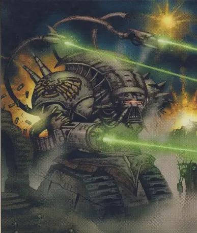

# 0002 机器人 Robot

精校状态：中文行文已逐段精校，部分术语仍为暂定

分类：通用概念

原文来源：https://www.bilibili.com/opus/1087801270626943013

原作者：帝国神选罐头

原文时间：2025年07月10日 09:44

[返回分类目录](目录.md) · [全书目录](../../目录.md)

<!-- A0002-B0001 -->
**英文原文**

Robots are artificial constructs capable of completing complex tasks automatically. Robots are used by a variety of factions across the Galaxy both past and present.

<!-- /A0002-B0001 -->

<!-- A0002-B0002 -->

原译文

机器人是能够自动完成复杂任务的人工构造体。机器人被银河系中过去和现在的各种派系使用。

**校订译文**

机器人是能够自动完成复杂任务的人造构造体。无论过去还是现在，银河系中的许多势力都会使用机器人。

<!-- /A0002-B0002 -->

<!-- A0002-B0003 图片 -->

<!-- A0002-B0004 -->

原译文

War Robot of the Imperium's Legio Cybernetica 帝国智控军团的战争机器人

**校订译文**

War Robot of the Imperium's Legio Cybernetica 帝国智控军团的战争机器人

<!-- /A0002-B0004 -->

<!-- A0002-B0005 -->
## Robotics by Faction 按派系划分的机器人

<!-- /A0002-B0005 -->

<!-- A0002-B0006 -->
### Imperium 帝国

<!-- /A0002-B0006 -->

<!-- A0002-B0007 -->
**英文原文**

During the Dark Age of Technology Humanity heavily used robotic constructs. This culminated in the creation of the Men of Iron, which eventually revolted against their masters in a devastating war.

<!-- /A0002-B0007 -->

<!-- A0002-B0008 -->

原译文

在黑暗技术时代，人类大量使用机器人构造。这最终导致了铁人的诞生，他们最终在一场毁灭性的战争中反抗了他们的主人。

**校订译文**

在黑暗科技时代，人类曾广泛使用机器人。这项技术最终发展出了铁人，而铁人后来掀起了一场毁灭性的战争，反抗自己的创造者。

<!-- /A0002-B0008 -->

<!-- A0002-B0009 -->
**英文原文**

Due to the traumatic experiences against the Men of Iron the Imperium even in its early days had strict laws forbidding the creation of Silica Animus or Abominable Intelligence. Imperial Robots, known as Automata, are far more simplistic by comparison and heavily regulated by bodies such as the Legio Cybernetica of the Adeptus Mechanicus. The Imperium further restricts the need for complex robotics by utilizing biologically-based Servitors for tasks traditionally reserved for robots. Creating a robot whose cognitive abilities are beyond set regulations is a severe form of Tech-Heresy brutally punished by the Mechanicum's Prefecture Magisterium.

<!-- /A0002-B0009 -->

<!-- A0002-B0010 -->

原译文

由于对铁人的创伤经历，帝国即使在早期也有严格的法律禁止创造硅基知灵或憎恶智能。相比之下，被称为自动机兵的帝国机器人要简单得多，并且受到机械神教智控军团等机构的严格监管。帝国进一步限制了对复杂机器人的需求，利用基于生物的机仆完成传统上留给机器人的任务。创造一个认知能力超出既定规定的机器人是一种严重的技术异端，受到机械教辖区裁判所的残酷惩罚。

**校订译文**

与铁人作战的惨痛经历，使帝国在建立之初便以严厉的法律禁止制造硅基知灵，也就是所谓的“憎恶智能”。相比之下，帝国使用的自动机兵结构和智能都简单得多，且受到机械修会智控军团等机构的严格监管。帝国还使用以生物体为基础改造而成的机仆，承担过去通常交给机器人的工作，从而减少对复杂机器人的需求。制造认知能力超出法定限度的机器人，被视为严重的科技异端行为，会受到机械教辖区裁判所的严酷惩处。

<!-- /A0002-B0010 -->

<!-- A0002-B0011 -->
### Types of Imperial Robots 帝国机器人种类

<!-- /A0002-B0011 -->

<!-- A0002-B0012 -->
### Combat Types 战斗类

<!-- /A0002-B0012 -->

<!-- A0002-B0013 -->

原译文

Arlatax Class Robot 阿拉塔克斯级机兵

**校订译文**

Arlatax Class Robot 阿拉塔克斯级机兵

<!-- /A0002-B0013 -->

<!-- A0002-B0014 -->

原译文

Bombot 自爆机兵

**校订译文**

Bombot 自爆机兵

<!-- /A0002-B0014 -->

<!-- A0002-B0015 -->

原译文

Castellan Class Robot 堡主级机兵

**校订译文**

Castellan Class Robot 堡主级机兵

<!-- /A0002-B0015 -->

<!-- A0002-B0016 -->

原译文

Cataphract Class Robot 铁骑级机兵

**校订译文**

Cataphract Class Robot 铁骑级机兵

<!-- /A0002-B0016 -->

<!-- A0002-B0017 -->

原译文

Colossus Class Robot 巨人级机兵

**校订译文**

Colossus Class Robot 巨人级机兵

<!-- /A0002-B0017 -->

<!-- A0002-B0018 -->

原译文

Conqueror Class Robot 征服者级机兵

**校订译文**

Conqueror Class Robot 征服者级机兵

<!-- /A0002-B0018 -->

<!-- A0002-B0019 -->

原译文

Crusader Class Robot 远征型机兵

**校订译文**

Crusader Class Robot 远征型机兵

<!-- /A0002-B0019 -->

<!-- A0002-B0020 -->

原译文

Domitar Class Robot 支配者级机兵

**校订译文**

Domitar Class Robot 支配者级机兵

<!-- /A0002-B0020 -->

<!-- A0002-B0021 -->

原译文

Kastelan Robot 卡斯特兰机兵

**校订译文**

Kastelan Robot 卡斯特兰机器人

<!-- /A0002-B0021 -->

<!-- A0002-B0022 -->

原译文

Scyllax Guardian 斯库拉卫士

**校订译文**

Scyllax Guardian 斯库拉卫士

<!-- /A0002-B0022 -->

<!-- A0002-B0023 -->

原译文

Thanatar Class Robot 死灭级机兵

**校订译文**

Thanatar Class Robot 死灭级机兵

<!-- /A0002-B0023 -->

<!-- A0002-B0024 -->

原译文

Vorax Classes 沃拉克斯级

**校订译文**

Vorax Classes 沃拉克斯级

<!-- /A0002-B0024 -->

<!-- A0002-B0025 -->

原译文

Vultarax Class Robot 瓦尔塔拉克斯级机兵

**校订译文**

Vultarax Class Robot 瓦尔塔拉克斯级机兵

<!-- /A0002-B0025 -->

<!-- A0002-B0026 -->

原译文

Fire Wasp 火蜂

**校订译文**

Fire Wasp 火蜂

<!-- /A0002-B0026 -->

<!-- A0002-B0027 -->

原译文

Hunter-Killer 猎杀者

**校订译文**

Hunter-Killer 猎杀者

<!-- /A0002-B0027 -->

<!-- A0002-B0028 -->

原译文

Harpax 掠夺者

**校订译文**

Harpax 掠夺者

<!-- /A0002-B0028 -->

<!-- A0002-B0029 -->

原译文

Errax 埃拉克斯

**校订译文**

Errax 埃拉克斯

<!-- /A0002-B0029 -->

<!-- A0002-B0030 -->

原译文

Excindio 灭绝者

**校订译文**

Excindio 灭绝者

<!-- /A0002-B0030 -->

<!-- A0002-B0031 -->

原译文

Sanctioner Servo-Automata 制裁者伺服自动机兵

**校订译文**

Sanctioner Servo-Automata 制裁者伺服自动机兵

<!-- /A0002-B0031 -->

<!-- A0002-B0032 -->

原译文

Tarantula Sentry Turret 狼蛛哨兵炮塔

**校订译文**

Tarantula Sentry Turret 狼蛛哨兵炮塔

<!-- /A0002-B0032 -->

<!-- A0002-B0033 -->
### Non-Combat/Support Types 非战斗/支援类型

<!-- /A0002-B0033 -->

<!-- A0002-B0034 -->

原译文

Servo-Automata 伺服自动机

**校订译文**

Servo-Automata 伺服自动机

<!-- /A0002-B0034 -->

<!-- A0002-B0035 -->

原译文

Servo-Skull 伺服颅骨

**校订译文**

Servo-Skull 伺服颅骨

<!-- /A0002-B0035 -->

<!-- A0002-B0036 -->

原译文

Psyber Eagle 灵械天鹰

**校订译文**

Psyber Eagle 灵械天鹰

<!-- /A0002-B0036 -->

<!-- A0002-B0037 -->

原译文

Cyber-Mastiff 智控獒犬

**校订译文**

Cyber-Mastiff 智控獒犬

<!-- /A0002-B0037 -->

<!-- A0002-B0038 -->

原译文

Grapplehawk 格斗天鹰

**校订译文**

Grapplehawk 格斗天鹰

<!-- /A0002-B0038 -->

<!-- A0002-B0039 -->
### Notable Human-built Robots 著名人类制造的机器人

<!-- /A0002-B0039 -->

<!-- A0002-B0040 -->
**英文原文**

UR-025 - One of the last surviving Men of Iron

<!-- /A0002-B0040 -->

<!-- A0002-B0041 -->

原译文

UR-025 - 最后幸存的铁人之一

**校订译文**

UR-025 - 最后幸存的铁人之一

<!-- /A0002-B0041 -->

<!-- A0002-B0042 -->
### Chaos 混沌

<!-- /A0002-B0042 -->

<!-- A0002-B0043 -->
**英文原文**

The Dark Mechanicus and Warpsmiths of the Chaos Space Marines normally favor Daemon Engines over standard robots. These are artificial constructs, but contain the soul of a Daemon. However during the early stages of the Horus Heresy it is known at Tech-Priests of the Dark Mechanicum dabbled in robotics, which culminated in the creation of the Kaban Machine. Furthermore in earlier lore Chaos Androids were constructed by Chaos Squats. Chaos Robotics have manifested themselves in other ways, such as the Bronze Malifects.

<!-- /A0002-B0043 -->

<!-- A0002-B0044 -->

原译文

混沌星际战士的黑暗机械教和次元铁匠通常更喜欢恶魔引擎而不是标准机器人。这些都是人工构造体，但包含了恶魔的灵魂。然而，在荷鲁斯叛乱的早期阶段，黑暗机械教的技术神甫涉足机器人技术，最终创造了卡班机械。此外，在早期的传说中，混沌机器人是由混沌矮人制造的。混沌机器人还以其他方式表现出来，比如青铜恶意。

**校订译文**

黑暗机械教与混沌星际战士的次元铁匠通常偏爱恶魔引擎，而非普通机器人。恶魔引擎虽然同样属于人造构造体，却囚禁着恶魔的灵魂。不过，在荷鲁斯之乱初期，黑暗机械教的技术祭司也曾涉足机器人技术，并最终造出了卡班机械。较早的设定还记载，混沌矮人曾制造混沌机器人。混沌的机器人造物也有其他形态，例如青铜恶意。

<!-- /A0002-B0044 -->

<!-- A0002-B0045 -->
**英文原文**

However, the Dark Mechanicus is known to utilize robotics and favor the use of a type of swarm gestalt intelligence dubbed Silica Mutus.

<!-- /A0002-B0045 -->

<!-- A0002-B0046 -->

原译文

然而，众所周知，黑暗机械教利用机器人技术，并倾向于使用一种称为硅基沉默者的群体格式塔智能。

**校订译文**

黑暗机械教也确实会使用机器人技术，并偏爱一种名为“硅基沉默者”的群体格式塔智能。

<!-- /A0002-B0046 -->

<!-- A0002-B0047 -->
### Dark Mechanicum/Chaos War Robots 黑暗机械教/混沌战争机兵

<!-- /A0002-B0047 -->

<!-- A0002-B0048 -->

原译文

Venetar 天猎

**校订译文**

Venetar 天猎

<!-- /A0002-B0048 -->

<!-- A0002-B0049 -->

原译文

Gholamm 奴兵

**校订译文**

Gholamm 奴兵

<!-- /A0002-B0049 -->

<!-- A0002-B0050 -->

原译文

Harpax 掠夺者

**校订译文**

Harpax 掠夺者

<!-- /A0002-B0050 -->

<!-- A0002-B0051 -->

原译文

Stalker 追猎者

**校订译文**

Stalker 追猎者

<!-- /A0002-B0051 -->

<!-- A0002-B0052 -->

原译文

Sekhetar 塞赫塔

**校订译文**

Sekhetar 塞赫塔

<!-- /A0002-B0052 -->

<!-- A0002-B0053 -->
### Eldar 灵族

<!-- /A0002-B0053 -->

<!-- A0002-B0054 -->
**英文原文**

During the Eldar Empire, all labor and warfare was conducted by mechanical constructs dubbed Spirit Drones. Due to the Fall of the Eldar, today the Craftworld Eldar do not utilize robots. The Craftworld Eldar instead utilize Wraith Constructs, which hold the soul of fallen Eldar within Spirit Stones. The Dark Eldar however still utilize part-mechanical part-biological artificial constructs known as Pain Engines such as the Talos Pain Engine and Cronos Parasite Engine.

<!-- /A0002-B0054 -->

<!-- A0002-B0055 -->

原译文

在灵族帝国时期，所有的劳动和战争都是由被称为灵魂无人机的机械构造体进行的。由于灵族的衰落，今天的方舟灵族不使用机器人。方舟灵族转而使用幽冥构造体，将牺牲灵族的灵魂保存在魂石中。然而，黑暗灵族仍然使用部分机械部分生物的人工结构体，称为痛苦引擎，如塔罗斯痛苦引擎和克洛诺斯寄生引擎。

**校订译文**

在灵族帝国时期，劳动与战争都由名为灵魂无人机的机械构造体承担。灵族陨落之后，如今的方舟灵族不再使用机器人，而是改用幽冥构造体，其中的魂石保存着逝去灵族的灵魂。黑暗灵族则仍在使用机械与生物组织结合的人造构造体，统称痛苦引擎，塔罗斯痛苦引擎和克洛诺斯寄生引擎便属此列。

<!-- /A0002-B0055 -->

<!-- A0002-B0056 -->
### Types of Wraith Constructs 幽冥构造体类别

<!-- /A0002-B0056 -->

<!-- A0002-B0057 -->

原译文

Wraithguard 幽冥卫士

**校订译文**

Wraithguard 幽冥护卫

<!-- /A0002-B0057 -->

<!-- A0002-B0058 -->

原译文

Wraithblades 幽冥剑士

**校订译文**

Wraithblades 幽冥之刃

<!-- /A0002-B0058 -->

<!-- A0002-B0059 -->

原译文

Wraithlord 幽冥领主

**校订译文**

Wraithlord 幽冥领主

<!-- /A0002-B0059 -->

<!-- A0002-B0060 -->

原译文

Wraithseer 幽冥先知

**校订译文**

Wraithseer 幽冥先知

<!-- /A0002-B0060 -->

<!-- A0002-B0061 -->
### Orks 欧克蛮人

原题：Orks 欧克

<!-- /A0002-B0061 -->

<!-- A0002-B0062 -->
**英文原文**

Though capable of great technological achievements the Orks enjoy personally experiencing all aspects of warfare while relying on Grots and Snotlings for any menial labor and as a result do not normally use robots. However some Mekboyz have nonetheless created their own robots in the form of their various enemies known as Tinboyz.

<!-- /A0002-B0062 -->

<!-- A0002-B0063 -->

原译文

尽管欧克能够取得巨大的技术成就，但他们喜欢亲自体验战争的各个方面，同时依靠鼻涕精和屁精进行任何卑微的劳动，因此通常不使用机器人。然而，一些技师小子仍然以各种敌人的形式创造了自己的机器人，被称为罐头小子。

**校订译文**

欧克蛮人虽然能够创造出惊人的技术成果，却更喜欢亲身参与战争的各个环节，杂役劳动则交给屁精和鼻涕精，因此通常不会使用机器人。不过，一些技师小子仍模仿各类敌人的外形，造出了自己的机器人，称为罐头小子。

<!-- /A0002-B0063 -->

<!-- A0002-B0064 -->
### Tau 钛

<!-- /A0002-B0064 -->

<!-- A0002-B0065 -->
**英文原文**

The Tau Empire heavily utilizes automated constructs most notably in the form of Drones.

<!-- /A0002-B0065 -->

<!-- A0002-B0066 -->

原译文

钛帝国大量使用自动构造体，最著名的是机蜂。

**校订译文**

钛帝国广泛使用自动化构造体，其中最具代表性的就是机蜂。

<!-- /A0002-B0066 -->

<!-- A0002-B0067 -->
### Notable Tau-built Robots 著名钛机器人

<!-- /A0002-B0067 -->

<!-- A0002-B0068 -->
**英文原文**

Ob'lotai - Ob'lotai is a skilled Tau Battlesuit pilot and a member of The Eight, Farsight's elite honor guard. The Broadside Battlesuit recently known as Ob'lotai 9-0 is crewed not by a Tau, but by a late-generation AI engram of the original Ob'lotai, who taught the young Farsight the basics of piloting a Battlesuit.

<!-- /A0002-B0068 -->

<!-- A0002-B0069 -->

原译文

奥博'罗泰 - 一名熟练的钛战斗服驾驶员，也是远见精英荣誉卫队-八卫-的成员。最近被称为奥博'罗泰9-0的舷侧战斗服不是由钛驾驶的，而是由最初的奥博'罗泰的后世代AI思维印记驾驶的，他教年轻的远见驾驶战斗服的基础知识。

**校订译文**

奥博·罗泰是一名技艺精湛的钛族战斗服驾驶员，也是远见的精锐荣誉卫队“八卫”成员。如今名为“奥博·罗泰 9-0”的舷侧战斗服，并非由钛族驾驶，而是由原版奥博·罗泰人格印记的后续世代人工智能操控。最初的奥博·罗泰曾教导年轻的远见，传授驾驶战斗服的基本技巧。

<!-- /A0002-B0069 -->

<!-- A0002-B0070 -->
### Necrons 太空死灵

原题：Necrons 死灵

<!-- /A0002-B0070 -->

<!-- A0002-B0071 -->
**英文原文**

The Necrons themselves are purely mechanical beings, but contain the original essences of biological lifeforms known as the Necrontyr. However the Necrons still utilize a large number of purely artificial creations known as Canoptek Constructs that perform a variety of lesser roles.

<!-- /A0002-B0071 -->

<!-- A0002-B0072 -->

原译文

死灵本身是纯粹的机械生物，但包含了被称为惧亡者的生物生命形式的原始本质。然而，死灵仍然使用大量被称为冥工构造体的纯粹人工造物，这些造物扮演各种次要角色。

**校订译文**

太空死灵本身已是纯机械生命，但仍保留着其前身惧亡者这一生物种族的本质。除此之外，太空死灵还会使用大量完全人造的冥工构造体，执行各类辅助任务。

<!-- /A0002-B0072 -->

<!-- A0002-B0073 -->
### Known Necron Canoptek Constructs 已知死灵冥工构造体

<!-- /A0002-B0073 -->

<!-- A0002-B0074 -->

原译文

Canoptek Acanthrite 冥工针刺者

**校订译文**

Canoptek Acanthrite 冥工针刺者

<!-- /A0002-B0074 -->

<!-- A0002-B0075 -->

原译文

Canoptek Leech 冥工水蛭

**校订译文**

Canoptek Leech 冥工水蛭

<!-- /A0002-B0075 -->

<!-- A0002-B0076 -->

原译文

Canoptek Locust 冥工蝗虫

**校订译文**

Canoptek Locust 冥工蝗虫

<!-- /A0002-B0076 -->

<!-- A0002-B0077 -->

原译文

Canoptek Scarab 冥工圣甲虫

**校订译文**

Canoptek Scarab 冥工圣甲虫

<!-- /A0002-B0077 -->

<!-- A0002-B0078 -->

原译文

Canoptek Sentinel 冥工哨兵

**校订译文**

Canoptek Sentinel 冥工哨兵

<!-- /A0002-B0078 -->

<!-- A0002-B0079 -->

原译文

Canoptek Spyder 冥工蜘蛛

**校订译文**

Canoptek Spyder 冥工蜘蛛

<!-- /A0002-B0079 -->

<!-- A0002-B0080 -->

原译文

Canoptek Tomb Sentinel 冥工墓穴哨兵

**校订译文**

Canoptek Tomb Sentinel 冥工墓穴哨兵

<!-- /A0002-B0080 -->

<!-- A0002-B0081 -->

原译文

Canoptek Wraith 冥工幽魂

**校订译文**

Canoptek Wraith 冥工幽魂

<!-- /A0002-B0081 -->

<!-- A0002-B0082 -->

原译文

Canoptek Doomstalker 冥工末日追猎者

**校订译文**

Canoptek Doomstalker 冥工末日追猎者

<!-- /A0002-B0082 -->

<!-- A0002-B0083 -->

原译文

Canoptek Reanimator 冥工复生者

**校订译文**

Canoptek Reanimator 冥工复生械

<!-- /A0002-B0083 -->

<!-- A0002-B0084 -->

原译文

Plasmacyte 浆细胞

**校订译文**

Plasmacyte 浆细胞

<!-- /A0002-B0084 -->

<!-- A0002-B0085 -->
### Squats 矮人

<!-- /A0002-B0085 -->

<!-- A0002-B0086 -->
**英文原文**

The Squats of the Leagues of Votann do not possess any of the taboos regarding artificial intelligence seen in some other civilizations. Their society is home to an entire class of sentient machines collectively dubbed Ironkin, and they utilize other less advanced robotic drones for other tasks.

<!-- /A0002-B0086 -->

<!-- A0002-B0087 -->

原译文

沃坎联盟的矮人没有其他一些文明中看到的关于人工智能的任何禁忌。他们的社会是一整类有感知力的机械的家园，统称为铁裔，他们利用其他不太先进的机械无人机执行其他任务。

**校订译文**

沃坦联盟的矮人不像某些其他文明那样忌讳人工智能。在他们的社会中，存在一整个具有自我意识的机械群体，统称铁裔；技术水平较低的自动机器人则承担其他工作。

<!-- /A0002-B0087 -->

<!-- A0002-B0088 -->
### Known Squat Robots 已知矮人机器人

<!-- /A0002-B0088 -->

<!-- A0002-B0089 -->

原译文

Ancestor Core 先祖核心

**校订译文**

Ancestor Core 先祖核心

<!-- /A0002-B0089 -->

<!-- A0002-B0090 -->

原译文

Ironkin 铁裔

**校订译文**

Ironkin 铁裔

<!-- /A0002-B0090 -->

<!-- A0002-B0091 -->

原译文

COG 机灵

**校订译文**

COG 机灵

<!-- /A0002-B0091 -->

<!-- A0002-B0092 -->

原译文

Techmite 工蚁

**校订译文**

Techmite 工蚁

<!-- /A0002-B0092 -->

本篇核心术语与暂定项

以下列出本篇出现的英文原形及核心术语表用词。同形词可能指不同对象，具体词义以本篇正文和校注为准；单复数、别名和仅见于图注的名称可能尚未列入。完整候选见[术语表](../../术语表/双语术语候选.csv)。

| 英文 | 采用中文 | 状态 |
| --- | --- | --- |
| Space Marines | 星际战士 | 官方已核对 |
| Adeptus Mechanicus | 机械修会 | 官方已核对 |
| Chaos Space Marines | 混沌星际战士 | 官方已核对 |
| Eldar | 灵族 | 暂定·语境区分 |
| Dark Eldar | 黑暗灵族 | 暂定·旧称对应 |
| Leagues of Votann | 沃坦联盟 | 官方已核对 |
| Necrons | 太空死灵 | 官方已核对 |
| Orks | 欧克蛮人 | 官方已核对 |
| Horus Heresy | 荷鲁斯之乱 | 官方已核对 |
| Imperium | 帝国 | 暂定·简称 |
| Mechanicum | 机械教 | 暂定·历史称谓 |
| Legio Cybernetica | 智控军团 | 暂定 |
| Dark Mechanicum | 黑暗机械教 | 暂定·官方待核 |
| Abominable Intelligence | 憎恶智能 | 暂定·官方待核 |
| Men of Iron | 铁人 | 暂定·官方待核 |
| Dark Age of Technology | 黑暗科技时代 | 暂定 |
| Craftworld | 方舟世界 | 官方已核对 |
| Farsight | 远见 | 暂定 |
| Horus | 荷鲁斯 | 暂定·官方待核 |
| UR-025 | UR-025 | 暂定·官方待核 |
| Ironkin | 铁裔 | 暂定·官方待核 |
| Prefecture Magisterium | 辖区裁判所 | 暂定·官方待核 |
| Squats | 矮人 | 暂定·官方待核 |
| Tech | 技术语 | 暂定·官方待核 |
| Silica Animus | 硅基知灵 | 暂定·官方待核 |
| Dark Mechanicus | 黑暗机械教 | 暂定·官方待核 |
| Necrontyr | 惧亡者 | 暂定·官方待核 |
| Kaban Machine | 卡班机械 | 暂定·官方待核 |
| Mekboyz | 技师小子 | 暂定·官方待核 |
| Chaos Androids | 混沌机器人 | 暂定·官方待核 |
| The Dark | 《黑暗》 | 暂定·官方待核 |
| Magisterium | 辖区裁判所 | 暂定·官方待核 |
| Tau Empire | 钛帝国 | 暂定·官方待核 |

