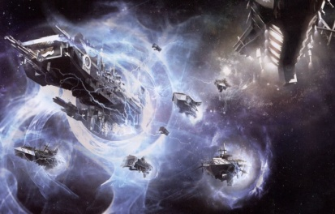

# 0005 亚空间驱动 Warp Drive

精校状态：中文行文已逐段精校，部分术语仍为暂定

分类：通用概念

原文来源：https://www.bilibili.com/opus/1180178015655559171

原作者：帝国神选罐头

原文时间：2026年03月16日 08:13

[返回分类目录](目录.md) · [全书目录](../../目录.md)

<!-- A0005-B0001 -->
**英文原文**

Warp drives, or warp engines, are devices integrated into spacecraft, making them capable of a form of faster than light travel known as warp travel or warp jumping. The warp drive allows a ship to enter the warp, travelling its currents until reemerging into real space light years away from the starting point.

<!-- /A0005-B0001 -->

<!-- A0005-B0002 -->

原译文

亚空间驱动或亚空间引擎是集成在星舰中的设备，使它们能够进行一种超光速航行，称为亚空间航行或亚空间跳跃。亚空间驱动允许飞船进入亚空间，沿着其流向行驶，直到重新出现在距离起点数光年的现实空域中。

**校订译文**

亚空间驱动装置，也称亚空间引擎，是安装在星舰上的设备，使舰船能够进行称为“亚空间航行”或“亚空间跳跃”的超光速航行。它让舰船进入亚空间，顺着其中的洋流前进，再重返现实空间；此时，舰船已来到距离出发点数光年之外的地方。

<!-- /A0005-B0002 -->

<!-- A0005-B0003 图片 -->

<!-- A0005-B0004 -->

原译文

Space Marine warships exit the Warp 星际战士战舰退出亚空间

**校订译文**

Space Marine warships exit the Warp 星际战士战舰退出亚空间

<!-- /A0005-B0004 -->

<!-- A0005-B0005 -->
**英文原文**

The drives are huge and bulky devices needing large ships to carry. Ships fitted with warp drives are known as warp ships or warp-capable craft. Warp drives allow ships to enter the warp and bypass light years of real space in a relatively short time, although, as the warp is hostile and unpredictable in the extreme, the dangers associated with all warp travel are terrible indeed.

<!-- /A0005-B0005 -->

<!-- A0005-B0006 -->

原译文

这些驱动是巨大而笨重的设备，需要大型飞船运输。配备亚空间驱动的飞船被称为亚空间飞船或亚空间能力舰。亚空间驱动允许飞船在相对较短的时间内进入亚空间并绕过数光年的现实空域，尽管由于亚空间在极端情况下是敌对和不可预测的，与所有亚空间航行相关的危险确实很可怕。

**校订译文**

亚空间驱动装置体积庞大而笨重，只有大型舰船才能搭载。安装这种装置的舰船被称为亚空间舰船，或具备亚空间航行能力的舰船。借助它，舰船能在相对短暂的时间内，跨越现实空间中以光年计的距离。然而，亚空间极其凶险且难以预测，因此任何一次亚空间航行都伴随着可怕的危险。

<!-- /A0005-B0006 -->

<!-- A0005-B0007 -->
## Overview 概述

<!-- /A0005-B0007 -->

<!-- A0005-B0008 -->
**英文原文**

The warp drive was invented by mankind c.M18. Prior to this, interstellar travel was limited to sub-light speeds. Travel between star systems was painfully slow, taking many generations of travel. The warp drive was one of the most revolutionary inventions in human history - what took many generations now took days. Consequently Mankind's colonisation of The Galaxy was vastly accelerated. In c.M22 further technological progress led to the creation of the human mutant warp-pilots known as Navigators. These mutants allowed warp-crafts to make longer, safer and more accurate warp jumps through the Warp, and further accelerated the galactic colonisation.

<!-- /A0005-B0008 -->

<!-- A0005-B0009 -->

原译文

亚空间驱动是人类在c.M18左右发明的。在此之前，星际航行仅限于亚光速。恒星系统之间的航行非常缓慢，需要几代人的航行。亚空间驱动是人类历史上最具革命性的发明之一 - 以前需要几代人的时间，现在只需要几天的时间。因此，人类对银河系的殖民大大加速了。在c.M22，进一步的技术进步导致了被称为导航者的人类变异亚空间飞行员的创造。这些变种人使亚空间飞船能够在亚空间中进行更长、更安全、更准确的亚空间跳跃，并进一步加速了银河系的殖民化。

**校订译文**

人类大约在第 18 千年发明了亚空间驱动装置。此前，星际航行只能以亚光速进行，往来于恒星系之间极为缓慢，一趟旅程往往要历经数代人。亚空间驱动装置是人类历史上最具革命性的发明之一：曾经耗时数代的旅途，如今只需几天便可完成，人类殖民银河系的进程也因此大大加快。大约到第 22 千年，进一步的技术发展催生了被称为“导航员”的人类变种，他们担任亚空间领航员，使舰船能够进行距离更远、更安全、也更精确的跳跃，进一步推动了人类在银河系中的扩张。

<!-- /A0005-B0009 -->

<!-- A0005-B0010 -->
**英文原文**

The Warp Drives of the Leagues of Votann are similar in operation, but of more sturdy and reliable design.

<!-- /A0005-B0010 -->

<!-- A0005-B0011 -->

原译文

沃坦联盟的亚空间驱动在操作上类似，但设计更坚固可靠。

**校订译文**

沃坦联盟的亚空间驱动装置采用相近的运作原理，但结构更坚固，可靠性也更高。

<!-- /A0005-B0011 -->

本篇核心术语与暂定项

以下列出本篇出现的英文原形及核心术语表用词。同形词可能指不同对象，具体词义以本篇正文和校注为准；单复数、别名和仅见于图注的名称可能尚未列入。完整候选见[术语表](../../术语表/双语术语候选.csv)。

| 英文 | 采用中文 | 状态 |
| --- | --- | --- |
| Leagues of Votann | 沃坦联盟 | 官方已核对 |
| Warp | 亚空间 | 官方已核对 |
| Warp Drive | 亚空间驱动装置 | 暂定 |
| History | 历史 | 编辑用语已统一 |
| Mutant | 变种人 | 暂定·官方待核 |
| Navigators | 导航员 | 官方已核对 |
| Real Space | 现实空间 | 暂定·官方待核 |

