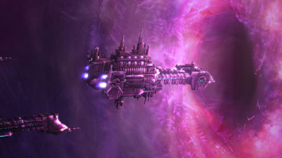
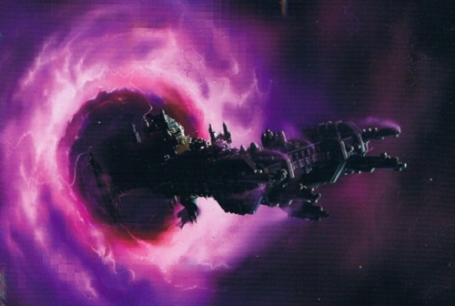

# 0006 亚空间跳跃 Warp Jump

精校状态：中文行文已逐段精校，部分术语仍为暂定

分类：通用概念

原文来源：https://www.bilibili.com/opus/1053726735253635081

原作者：帝国神选罐头

原文时间：2025年04月09日 13:57

[返回分类目录](目录.md) · [全书目录](../../目录.md)

<!-- A0006-B0001 -->
**英文原文**

A warp jump is a form of faster-than-light travel around the Galaxy by means of entering the Warp, a parallel psychic dimension, and re-emerging to a new location in real space light years away from the starting position.

<!-- /A0006-B0001 -->

<!-- A0006-B0002 -->

原译文

亚空间跳跃是一种在银河系中以超光速航行的形式，通过进入亚空间，一个平行的精神维度，并重新出现在距离起始位置许多光年的现实空间中的新位置。

**校订译文**

亚空间跳跃是一种超光速航行方式：舰船先进入名为亚空间的平行灵能维度，再从中返回现实空间，抵达距离出发点数光年之外的新位置。

<!-- /A0006-B0002 -->

<!-- A0006-B0003 图片 -->

<!-- A0006-B0004 -->

原译文

Imperial ships enter the Warp 帝国舰船进入亚空间

**校订译文**

Imperial ships enter the Warp 帝国舰船进入亚空间

<!-- /A0006-B0004 -->

<!-- A0006-B0005 -->
## Overview 概述

<!-- /A0006-B0005 -->

<!-- A0006-B0006 -->
**英文原文**

A warp jump consists of a ship entering the warp from real space by activating its warp drives to open a tear between realities, traveling the currents of the warp by means of its conventional drives for an appropriate time, and then using its warp drives to re-enter real space at a new position, having bypassed light years of galactic space. This process is known as a jump or hop, and the act of entering or leaving the warp is known as a drop, shift, or translation. In order to safely utilize the Warp for travel, one must first travel to a System's Mandeville Point. This is the closest distance that a ship can safely enter or exit Warp Space from its intended destination. If one does not travel to a Mandeville Point, they risk having their Warp jump's direction and navigational calculations interfered with by the gravity of planets and other celestial objects.

<!-- /A0006-B0006 -->

<!-- A0006-B0007 -->

原译文

亚空间跳跃包括一艘飞船从现实空间进入亚空间，通过激活其亚空间驱动器在现实之间打开裂隙，在适当的时间内通过其常规驱动器沿亚空间流行进，然后使用其亚空间驱动器在新的位置重新进入现实空间，绕过光年的银河系空间。这个过程被称为跳跃或短跃，进入或离开亚空间的行为被称为下沉、转移或平移。为了安全地使用亚空间进行航行，必须首先前往星系的曼德维尔点。这是飞船可以安全进入或离开亚空间与其预定目的地的最近距离。如果不前往曼德维尔点，他们的亚空间跳跃方向和导航计划可能会受到行星和其他天体引力的干扰。

**校订译文**

进行亚空间跳跃时，舰船先启动亚空间驱动装置，在现实与亚空间之间撕开一道裂口，随后进入亚空间，依靠常规推进装置沿其中的洋流航行。经过适当的时间后，舰船再次启动亚空间驱动装置，从新的位置返回现实空间，由此跨越数光年的银河距离。整段过程称为跳跃或短跃，而进入或离开亚空间的动作，则有下沉、转移或转换等称呼。为了安全航行，舰船必须先抵达恒星系的曼德维尔点，也就是距离目标最近、仍可安全进出亚空间的位置。如果未抵达曼德维尔点便进行跳跃，行星及其他天体的引力就可能干扰跳跃方向与导航计算。

<!-- /A0006-B0007 -->

<!-- A0006-B0008 -->
**英文原文**

When a portal for a Warp jump is opened, whether a vessel is exiting or entering the warp, it destabilizes nearby gravity. The closer one is to the portal, the greater the gravitational instability, until the portal closes. The dangers of executing a warp jump while within a gravity-well are known to every voidcraft captain of the Imperium. If done so, the warp rift of the vessel won't immediately clench shut after passing through and will instead grow to engulf anything nearby in warp and gravitational anomaly. This invariably unleashes untold ruination upon the local area post-departure.

<!-- /A0006-B0008 -->

<!-- A0006-B0009 -->

原译文

当打开亚空间跳跃的入口时，无论船只是离开还是进入亚空间，都会破坏附近的重力。越靠近入口，引力不稳定性就越大，直到入口关闭。帝国的每一位虚空舰舰长都知道在重力井中进行亚空间跳跃的危险。如果这样做，飞船的亚空间裂隙在通过后不会立即闭合，而是会在亚空间和重力异常中吞噬附近的任何东西。这必然会给离开后的当地带来难以形容的毁灭。

**校订译文**

无论舰船准备进入还是离开亚空间，跳跃通道一旦开启，就会扰乱附近的引力。离通道越近，引力越不稳定，直到通道关闭才会恢复。帝国的虚空舰长都清楚，在引力井内进行亚空间跳跃有多么危险：舰船穿过后，裂隙不会立即闭合，反而可能继续扩张，将周围的一切卷入亚空间与引力异常之中。即使舰船已经离去，当地仍会遭受难以估量的毁灭。

<!-- /A0006-B0009 -->

<!-- A0006-B0010 -->
**英文原文**

To make this process difficult, the warp doesn't follow the normal laws of physics and is ever-moving with inconsistent currents and tides, so the exact exit location of long-distance journeys is often unpredictable. Small jumps of up to four or five light years are generally accurate, while longer jumps can be dangerous or a long way off mark. It is safer and easier to travel from some Systems to others where established channels with well-charted warp currents are regularly used for Imperial shipping.

<!-- /A0006-B0010 -->

<!-- A0006-B0011 -->

原译文

亚空间不遵循正常的物理定律，并且总是随着不一致的流向和潮汐移动，使这一过程变得困难，因此长途旅行的确切出口位置往往是不可预测的。四至五光年的小跳跃通常是准确的，而较长的跳跃可能是危险的或偏离目标很远。从一些星系航行到其他星系更安全、更容易，在这些星系中，帝国航运经常使用具有良好亚空间流的既定航道。

**校订译文**

亚空间不遵循通常的物理定律，其中的洋流与潮汐始终变动不居，因此长途航行很难准确预测最终的出口位置。距离不超过四至五光年的短程跳跃通常较为精确，长程跳跃却可能十分危险，或严重偏离预定目标。有些恒星系之间存在帝国航运经常使用的固定航道，其亚空间洋流已有较完善的测绘；沿这些航道航行，会更安全、也更容易。

<!-- /A0006-B0011 -->

<!-- A0006-B0012 -->
**英文原文**

To add further unpredictability, there are drastic time differences between the warp and real space. Time passes at very variable rates between both realities. Only once a ship jumps out of the warp can it learn how long its journey has taken in real time. Generally, however, one day in the warp relates to twelve days real time. Sometimes, ships and fleets within the warp can be caught in time bubbles for hundreds of years. This can lead to some strange, but extremely rare, events such as armies being sent across the galaxy to defend a threatened planet only to arrive many years too late, the planet already long lost to enemy forces. There have even been odd accounts of ships going back in time and emerging before they entered the warp. With the nature of the warp, anything is possible.

<!-- /A0006-B0012 -->

<!-- A0006-B0013 -->

原译文

为了增加更多的不可预测性，亚空间和现实空间之间存在巨大的时间差异。时间在这两个现实之间以非常可变的速度流逝。只有当一艘船跳出亚空间时，它才能实时了解它的航程花了多长时间。然而，一般来说，亚空间中的一天意味着现实时间的十二天。但有时，亚空间内的船只和舰队可能会被困在时间泡中长达数百年。这可能会导致一些奇怪但极为罕见的事件，例如军队被派往银河系保卫一个受到威胁的星球，但却迟到了很多年，这个星球早已被敌军占领。甚至有奇怪的说法称，船只会回到过去，在进入亚空间之前就出现了。由于亚空间的性质，一切皆有可能。

**校订译文**

亚空间与现实空间之间悬殊的时间差，又增添了一层不确定性。两者的时间流速都可能剧烈变化，舰船只有返回现实空间后，才能知道外界究竟过去了多久。一般而言，亚空间中的一天大致相当于现实中的十二天，但舰船或整支舰队有时也会被困在时间泡中数百年。由此会出现一些极其罕见的怪事：奉命跨越银河、驰援某颗受威胁行星的军队，可能迟到了许多年，而目的地早已陷落。甚至还有舰船回到过去、在出发之前便抵达的离奇记载。以亚空间的本性而言，任何事情都有可能发生。

<!-- /A0006-B0013 -->

<!-- A0006-B0014 -->
**英文原文**

Entering the warp can, like many things, further disturb the fabric of the warp. It is said to be like a drop of water landing in a larger pool of water, with ripples coming out in all directions. Often a warp jump can give away the position of a ship, allowing others to home in on the signal.

<!-- /A0006-B0014 -->

<!-- A0006-B0015 -->

原译文

像许多东西一样，进入亚空间会进一步扰乱亚空间的织缕。据说，它就像一滴水落入一个更大的水池中，四面八方都泛起涟漪。通常，亚空间跳跃会泄露船只的位置，让其他人能够捕捉到信号。

**校订译文**

进入亚空间还会扰动它本身的结构。有人将其比作水滴落入池塘，向四面八方激起涟漪。因此，亚空间跳跃往往会暴露舰船的位置，让其他人循着信号追踪而来。

<!-- /A0006-B0015 -->

<!-- A0006-B0016 -->
**英文原文**

A warp jump can be achieved in two ways - a calculated jump or a piloted jump.

<!-- /A0006-B0016 -->

<!-- A0006-B0017 -->

原译文

亚空间跳跃可以通过两种方式实现——计划跳跃或指引跳跃。

**校订译文**

亚空间跳跃主要有两种方式：计算跳跃与领航跳跃。

<!-- /A0006-B0017 -->

<!-- A0006-B0018 -->
### Calculated jumps 计算跳跃

原题：Calculated jumps 计划跳跃

<!-- /A0006-B0018 -->

<!-- A0006-B0019 -->
**英文原文**

A short jump can be carried out by calculating the ship's projected course, corrective maneuvers, approximate journey time, and exit point before it starts the warp jump. While the ship is still in real space, its warp drive has the ability to monitor that part of the warp corresponding to the ship's current position and observe how the warp is currently flowing. But this monitoring can only be done from real space, which means this type of jump is inherently unpredictable as it relies on the warp currents not changing once the ship is in flight, as once inside the warp there is no longer any way the movements can be detected and all the ship can do is carry on blindly until it emerges in real space and hope it arrived in the planned location. Generally a safe distance for this type of jump is up to four or five light years.

<!-- /A0006-B0019 -->

<!-- A0006-B0020 -->

原译文

在开始亚空间跳跃之前，可以通过计算船的预计航向、纠正机动、大致行程时间和退出点来进行短距离跳跃。当飞船仍在现实空间中时，其亚空间驱动器能够监测与飞船当前位置相对应的亚空间部分，并观察亚空间当前的流动情况。但这种监测只能从现实空间进行，这意味着这种跳跃本质上是不可预测的，因为它依赖于飞船飞行后的亚空间流不变，因为一旦进入亚空间，就不再有任何方法可以检测到运动，飞船所能做的就是盲目地继续，直到它出现在现实空间中，并希望它到达计划的位置。一般来说，这种跳跃的安全距离可达四至五光年。

**校订译文**

短程跳跃可以在出发前完成全部计算，包括预定航线、修正机动、预计航行时间和出口位置。当舰船还在现实空间时，亚空间驱动装置能够探测与当前位置相对应的亚空间区域，观测其中洋流的流向。然而，这种探测只能在现实空间中进行；舰船一旦进入亚空间，就再也无法掌握洋流的变化，只能盲目前进，直到重返现实，并寄望于自己仍抵达了预定地点。这种跳跃方式的可靠性，因此取决于航行期间亚空间洋流是否保持不变。通常，四至五光年以内被视为相对安全的跳跃距离。

<!-- /A0006-B0020 -->

<!-- A0006-B0021 -->
### Piloted jumps 领航跳跃

原题：Piloted jumps 指引跳跃

<!-- /A0006-B0021 -->

<!-- A0006-B0022 -->
**英文原文**

Longer jumps of up to 5,000 light years can be done by steering a ship through the currents of the warp. Only human mutants known as Navigators can do this, as they have the ability to look upon the warp without going mad from exposure to it. Within the warp they can sense the Astronomican, a powerful psychic homing beacon centered on Terra, and use it as a sort of navigational reference aid by judging its distance, strength and position so they can inform the ship's captain to adjust heading when the ship is forced off-course by warp currents. However, piloted jumps still remain unpredictable and dangerous as the Astronomican's power, though immense, is limited to a diameter of about 50,000 light years from Terra, also Warp Storms and psychic phenomena such as the Shadow in the Warp can disrupt and block the beacon.

<!-- /A0006-B0022 -->

<!-- A0006-B0023 -->

原译文

通过操纵船只穿过亚空间流，可以完成长达5000光年的更长跳跃。只有被称为导航者的变种人才能做到这一点，因为他们有能力看到亚空间而不会因接触亚空间而发疯。在亚空间内，他们可以感知到以泰拉为中心的强大的灵能导航信标星炬，并通过判断其距离、强度和位置将其用作导航参考辅助，以便在船被亚空间流逼离航道时通知船长调整航向。然而，指引跳跃仍然是不可预测和危险的，因为星炬的力量虽然巨大，但仅限于距离泰拉约50000光年的直径，而且亚空间风暴和亚空间中的阴影等灵能现象也会破坏和阻挡信标。

**校订译文**

若能在亚空间洋流中持续引导舰船，就能完成最远达五千光年的长程跳跃。只有被称为导航员的人类变种能够做到这一点，因为他们能够直视亚空间，而不至于因此陷入疯狂。导航员在亚空间中可以感知以泰拉为中心的强大灵能导航信标——星炬，并根据其距离、强度和方位判断航向。当洋流迫使舰船偏离航线时，他们便能指示舰长加以修正。不过，领航跳跃仍充满危险与变数：星炬虽然强大，却只能覆盖以泰拉为中心、直径约五万光年的范围；亚空间风暴，以及亚空间之影等灵能现象，也可能干扰甚至遮断信标。

**校注：** 英文写 diameter of about 50,000 light years from Terra，直径与距泰拉距离的表述可能存在歧义。译文暂按 diameter 保留为直径；不擅自改成半径。

<!-- /A0006-B0023 -->

<!-- A0006-B0024 -->
### Limitation of warp travel 亚空间航行的限制

原题：Limitation of warp travel 亚空间航行限制

<!-- /A0006-B0024 -->

<!-- A0006-B0025 -->
**英文原文**

Ships coming out of the warp must appear some distance away in deep space or risk destruction among the graviton surges in-system. Because of this many civilised worlds have specific jump points marked by beacons to assist in navigation. An ambushing fleet will often lurk nearby, in the hopes of catching a ship unaware.

<!-- /A0006-B0025 -->

<!-- A0006-B0026 -->

原译文

从亚空间中出来的飞船必须在深空中前进一段距离，否则将面临星系中引力子浪涌的破坏风险。因此，许多文明世界都有由信标标记的特定跳跃点来协助导航。埋伏的舰队经常潜伏在附近，希望在不知情的情况下抓住一艘船。

**校订译文**

舰船离开亚空间时，必须在远离恒星系内部的深空中出现，否则可能被星系内的引力子激涌摧毁。因此，许多文明世界都设有专门的跳跃点，并用信标辅助导航。准备伏击的舰队也常常潜伏在附近，等待毫无防备的舰船出现。

<!-- /A0006-B0026 -->

<!-- A0006-B0027 -->
### Length of Warp Travel 亚空间航行耗时

原题：Length of Warp Travel 亚空间航行长度

<!-- /A0006-B0027 -->

<!-- A0006-B0028 -->
**英文原文**

Estimating the length of a Warp Jump, at least for the Imperium, is extremely difficult and inconsistent. As the Warp is ever-shifting, determining the length of a jump is difficult for even even semi-fluctuating passages. The Questio Logisticus branch of the Administratum is dedicated to this difficult task.

<!-- /A0006-B0028 -->

<!-- A0006-B0029 -->

原译文

估算亚空间跳跃的长度，至少对于帝国来说，是极其困难和不一致的。由于亚空间不断变化，即使是半波动的通道，也很难确定跳跃的长度。内务部的后勤问询部致力于这项艰巨的任务。

**校订译文**

至少对帝国而言，估算一次亚空间跳跃所需的时间极为困难，结果也很难保持一致。亚空间变化无常，即使是在波动相对有限的航道上，航行时间仍难以确定。内政部下属的后勤问询部（Questio Logisticus）专门负责这项艰巨的工作。

<!-- /A0006-B0029 -->

<!-- A0006-B0030 -->
**英文原文**

One example is given for travel between the Hive World of Proxx and the Mining World of Hephastian. These planets are separated between dozens of light years and a standard voyage in the warp will take one to six weeks. However some voyages have been recorded as taking 1,200 years and another in as little as two minutes. 22% of the voyages have yet to reach their destination.

<!-- /A0006-B0030 -->

<!-- A0006-B0031 -->

原译文

一个例子，在普罗克斯巢都世界和赫法斯提安矿业世界之间航行。这些行星相隔数十光年，在亚空间中的标准航行需要一到六周的时间。然而，有记录显示，一些航行需要1200年，另一次航行只需要两分钟。22%的航程尚未到达目的地。

**校订译文**

巢都世界普罗克斯与矿业世界赫法斯提安之间的航行为此提供了一个例子。两颗行星相隔数十光年，通常一次亚空间航行耗时一至六周。然而，记录中最长的一次耗费了一千二百年，最短的一次却只用了两分钟。另有 22% 的航次至今尚未抵达目的地。

<!-- /A0006-B0031 -->

<!-- A0006-B0032 -->
### Dangers of Warp Travel 亚空间航行的危险

<!-- /A0006-B0032 -->

<!-- A0006-B0033 -->
**英文原文**

The warp is populated with many unnatural beasts and chaotic daemons. In warpspace, these creatures have free reign, and an unprotected ship will be subject to their predatations. To combat this, warp-faring species have invented warp-repelling barriers to mount on their ships (the human version being the Gellar Field). These allow races of the material realm to traverse the warp unmolested, however these devices aren't infallible, and occasionally the souls of entire crews are devoured by Chaos.

<!-- /A0006-B0033 -->

<!-- A0006-B0034 -->

原译文

亚空间中充满了许多非自然的野兽和混沌的恶魔。在亚空间中，这些生物拥有自由的统治权，一艘不受保护的船将受到它们的捕食。为了应对这种情况，亚空间飞行的物种发明了亚空间排斥屏障，安装在他们的船上（人类版本是盖勒力场）。这些装置允许物质领域的种族不受干扰地穿越亚空间，但这些装置并非绝对可靠，偶尔整个船只船员的灵魂都会被混沌吞噬。

**校订译文**

亚空间中栖息着许多违背自然规律的怪物与混沌恶魔。在那里，它们可以肆意游荡，任何缺乏保护的舰船都会沦为猎物。为了抵御这些生物，能够进行亚空间航行的种族发明了排斥亚空间的屏障，并将其安装在舰船上；人类使用的便是盖勒力场。借助这些屏障，物质世界的生命能够免受侵扰地穿行亚空间。然而，防护装置并非万无一失，整舰船员的灵魂偶尔仍会被混沌吞噬。

<!-- /A0006-B0034 -->

<!-- A0006-B0035 图片 -->

<!-- A0006-B0036 -->

原译文

Space Marine Battle Barge exiting the Warp 星际战士战斗驳船退出亚空间

**校订译文**

Space Marine Battle Barge exiting the Warp 星际战士战斗驳船退出亚空间

<!-- /A0006-B0036 -->

<!-- A0006-B0037 -->
**英文原文**

Traveling through the warp induce unpleasant and dangerous effects for the crew. Serfs plagued by waking nightmares, causing constant outbursts of violent despair. Servitors normally immune to empirical ephemera summoned contradictory instructions from the depths of their lobotomized minds or ceased to function altogether. Even acolytes and adepts of the Adeptus Mechanicus found their work tainted by data geists.

<!-- /A0006-B0037 -->

<!-- A0006-B0038 -->

原译文

穿越亚空间会给舰组人员带来不愉快和危险的影响。侍从被清醒的噩梦所困扰，导致不断爆发的暴力绝望。通常对一般的虚无缥缈的事物具有免疫力的机仆，却从它们那经过脑叶切除手术的大脑深处，发出了相互矛盾的指令，或者完全停止运作。即使是机械神教的侍从和专家也发现他们的工作受到了数据幽灵的污染。

**校订译文**

亚空间航行会给船员带来令人不安、甚至致命的影响。仆役可能在清醒时遭受噩梦折磨，不断陷入绝望，爆发暴力行为。通常不受这些异象影响的机仆，也可能从经过脑叶切除的意识深处发出彼此矛盾的指令，或彻底停止运作。就连机械修会的学徒与教士，也会发现自己的工作遭到数据幽灵侵扰。

<!-- /A0006-B0038 -->

<!-- A0006-B0039 -->
**英文原文**

To reduce dangers, stable Warp Routes are routinely sought after.

<!-- /A0006-B0039 -->

<!-- A0006-B0040 -->

原译文

为了减少危险，人们经常寻求稳定的亚空间航道。

**校订译文**

为了降低风险，各方始终在寻找稳定的亚空间航路。

<!-- /A0006-B0040 -->

<!-- A0006-B0041 -->
## Other methods 其他方式

<!-- /A0006-B0041 -->

<!-- A0006-B0042 -->
**英文原文**

Other ways of traveling through the warp exist.

<!-- /A0006-B0042 -->

<!-- A0006-B0043 -->

原译文

还有其他穿越亚空间的方式。

**校订译文**

除了使用亚空间驱动装置，还有其他穿行亚空间的方式。

<!-- /A0006-B0043 -->

<!-- A0006-B0044 -->
### Warp rift 亚空间裂隙

<!-- /A0006-B0044 -->

<!-- A0006-B0045 -->
**英文原文**

A warp rift, also known as a warp portal , is a point in real space that interfaces with the warp to form a stable exit and entry point so the use of warp drives is not required. The Enslavers are a race known to use warp rifts to travel between the warp and real space. But the exact nature of how such portals or rifts work is not understood by the Imperium. Sometimes warp rifts occur randomly, other times the Chaos Gods or mortals manufacture them. Some last mere moments, others for days, years, or even centuries. Permanent large-scale warp rifts such as the Eye of Terror and the Maelstrom provide a safe haven for Chaos as well as a gateway for them to attack the galaxy.

<!-- /A0006-B0045 -->

<!-- A0006-B0046 -->

原译文

亚空间裂隙，也称为亚空间入口，是现实空间中与亚空间相接的点，形成稳定的出入点，因此不需要使用亚空间驱动器。奴役者是一个已知的种族，他们使用亚空间裂隙在亚空间和现实空间之间旅行。但帝国并不了解这些入口或裂隙如何运作的确切性质。有时亚空间裂隙会随机出现，有时则是混沌诸神或凡人制造的。有些只是瞬间，有些则持续数天、数年甚至数个世纪。永久性的大规模亚空间裂隙，如恐惧之眼和大漩涡，为混沌提供了一个安全的避风港，也是他们攻击银河系的门户。

**校订译文**

亚空间裂隙也称亚空间传送门，是现实空间与亚空间相接的地点，可以构成稳定的出入口，因此无需借助亚空间驱动装置。奴役者便会利用这类裂隙，在亚空间与现实之间往来。不过，帝国尚不理解这些门户或裂隙的具体运作机制。有些裂隙随机出现，有些则由混沌诸神或凡人制造；它们可能只维持片刻，也可能持续数日、数年，甚至数百年。恐惧之眼和大漩涡等永久性巨型裂隙，既是混沌势力的避风港，也是它们进攻银河的门户。

<!-- /A0006-B0046 -->

<!-- A0006-B0047 -->
### Webway 网道

<!-- /A0006-B0047 -->

<!-- A0006-B0048 -->
**英文原文**

The Webway is a series of secret portals and tunnels used by the Eldar and Dark Eldar. Placed a long time ago throughout the galaxy and on Eldar Craftworlds, each gateway is a point in real space linked to another point in real space by a warp tunnel that is protected from the hostile nature of the warp because it exists between the two realities but not entirely in either. Journeys through these tunnels can be made in a fixed time . The arterial tunnels are large enough to carry spacecraft, though most tunnels only accommodate human-sized creatures or small vehicles.

<!-- /A0006-B0048 -->

<!-- A0006-B0049 -->

原译文

网道是一系列由灵族和黑暗灵族使用的秘密门户和隧道。很久以前，在整个银河系和灵族方舟世界上，每个入口都是现实空间中的一个点，通过一个亚空间隧道与现实空间的另一个点相连，该亚空间隧道受到保护，不受亚空间的敌对性质的影响，因为它存在于两个现实之间，但并不完全存在于任何一个现实中。通过这些隧道的航程可以在固定时间内完成。主隧道足够大，可以运载飞船，尽管大多数隧道只能容纳人类大小的生物或小型车辆。

**校订译文**

网道是一系列秘密门户与隧道，由灵族和黑暗灵族使用。它们早在远古时期便被布设于银河各地及灵族方舟世界之中。每一座门户都通过亚空间隧道，将现实空间中的一个地点与另一个地点相连。这些隧道存在于两种现实之间，却不完全属于任何一方，因此能够隔绝亚空间的凶险环境。穿越网道所需的时间是固定的。主干隧道宽阔到足以容纳星舰，但多数支路只能让人类体型的生物或小型载具通行。

<!-- /A0006-B0049 -->

<!-- A0006-B0050 -->
**英文原文**

The Webway is ancient and some passageways and gates are lost and broken. Some have been discovered by the Imperium, referring to them as warp gates, and they become of vital importance to move objects around safely, though why they exist or who constructed them is a mystery. Such gates are of course extremely rare:

<!-- /A0006-B0050 -->

<!-- A0006-B0051 -->

原译文

网道很古老，一些通道和大门已经丢失和损坏。帝国已经发现了一些，称之为亚空间门，它们对于安全地移动物体至关重要，尽管它们为什么存在或是谁建造的仍然是个谜。这样的大门当然极为罕见：

**校订译文**

网道历史悠久，部分通道和门户已经遗失或损坏。帝国也发现过其中一些，并将其称为“亚空间之门”。虽然帝国不明白这些门户为何存在、由谁建造，但它们对安全运送物资具有极其重要的价值。当然，这类门户十分罕见。

<!-- /A0006-B0051 -->

<!-- A0006-B0052 -->
### Tau 钛

<!-- /A0006-B0052 -->

<!-- A0006-B0053 -->
**英文原文**

The Tau, because they lack psykers as a race, are incapable of fully entering the warp. However, based on duplicating the warp drive from an unknown alien vessel they have found a way of 'diving' towards the warp, extending the field of their drive into a wing shape designed to hold their vessel in the warp, before being hurled into real space again like a ball held under water and then released. While this is much slower, by a factor of five when compared to Imperial jump speed, it is a lot safer because they do not enter the warp deep enough to become exposed to any of its dangers, and is also much more predictable as their speed works out to a consistent rate. Nevertheless, this limited form of warp travel has resulted in the Tau Empire being closely packed around their home system.

<!-- /A0006-B0053 -->

<!-- A0006-B0054 -->

原译文

由于作为一个缺乏灵能者的种族，钛无法完全进入亚空间。然而，基于复制一艘未知外星飞船的亚空间驱动器，他们找到了一种向亚空间“潜行”的方法，将他们的驱动器立场扩展成机翼形状，旨在将他们的飞船固定在亚空间中，然后像水下的球一样再次投掷到现实空间中，然后释放。虽然这要慢得多，与帝国跳跃速度相比是其五分之一，但它要安全得多，因为它们进入亚空间的深度不足以暴露在任何危险中，而且随着它们的速度达到一致，也更容易预测。然而，这种有限的亚空间航行形式导致了钛帝国紧紧地围绕着他们的家园星系。

**校订译文**

钛族没有灵能者，因此无法完全进入亚空间。不过，在仿制一艘不明异形舰船的亚空间驱动装置后，他们找到了向亚空间“下潜”的方法：将驱动场展开成翼状，使舰船暂时停留在亚空间边缘，随后再像被按入水中后松手的球一样，弹回现实空间。这种方式的速度约为帝国跳跃航行的五分之一，却安全得多，因为舰船下潜得不够深，不会暴露于亚空间深处的危险。它的速度也较为恒定，因此航程更容易预测。不过，这种受限的航行方式也使钛帝国的疆域紧密聚集在母星系周围。

<!-- /A0006-B0054 -->

<!-- A0006-B0055 -->
### Tyranids 泰伦虫族

原题：Tyranids 泰伦

<!-- /A0006-B0055 -->

<!-- A0006-B0056 -->
**英文原文**

The Hive Fleets of the Tyranids do not travel through the warp but instead rely on small Narvhal bio-ships which are capable of harnessing a planetary system's gravity from immense distances away to create a corridor of compressed-space through which Tyranid vessels can travel towards the system at a swift rate. Whilst slower than proper warp travel, this method is infinitely more reliable. On final approach to a system the Narvhal's delicate senses face interference from multiple gravity sources, and so the fleet must resort to slower conventional propulsion whilst within the borders of a system.

<!-- /A0006-B0056 -->

<!-- A0006-B0057 -->

原译文

泰伦的虫巢舰队不通过亚空间，而是依靠小型角鲸生物飞船，这些生物飞船能够从遥远的地方利用行星系统的引力，创造一条压缩空间走廊，泰伦飞船可以通过这条走廊迅速朝着星系前进。虽然比适当的亚空间行程慢，但这种方法要可靠得多。在最终接近星系时，角鲸舰的敏锐感官会受到多个重力源的干扰，因此舰队在星系边界内必须采用较慢的传统推进方式。

**校订译文**

泰伦虫族的虫巢舰队并不通过亚空间航行，而是依靠体型较小的角鲸生物舰。角鲸舰能在极遥远处利用目标恒星系的引力，建立一条压缩空间的通道，让虫族舰船迅速接近目标。这种方式虽然比真正的亚空间航行慢，却可靠得多。当舰队最终接近恒星系时，多个引力源会干扰角鲸舰敏锐的感官，因此舰队进入星系范围后，必须改用速度较慢的常规推进方式。

**校注：** 此段明确说泰伦虫族不通过亚空间航行，与 A0001-B0107 的英文说法冲突；保留两段各自表述，留待设定核查。

<!-- /A0006-B0057 -->

本篇核心术语与暂定项

以下列出本篇出现的英文原形及核心术语表用词。同形词可能指不同对象，具体词义以本篇正文和校注为准；单复数、别名和仅见于图注的名称可能尚未列入。完整候选见[术语表](../../术语表/双语术语候选.csv)。

| 英文 | 采用中文 | 状态 |
| --- | --- | --- |
| Adeptus Mechanicus | 机械修会 | 官方已核对 |
| Eldar | 灵族 | 暂定·语境区分 |
| Dark Eldar | 黑暗灵族 | 暂定·旧称对应 |
| Tyranids | 泰伦虫族 | 官方已核对 |
| Astronomican | 星炬 | 暂定 |
| Warp | 亚空间 | 官方已核对 |
| Imperium | 帝国 | 暂定·简称 |
| Warp Drive | 亚空间驱动装置 | 暂定 |
| Warp Jump | 亚空间跳跃 | 暂定 |
| Faster-Than-Light | 超光速航行 | 暂定 |
| Webway | 网道 | 暂定 |
| Mandeville Point | 曼德维尔点 | 暂定 |
| Gellar Field | 盖勒力场 | 暂定 |
| Calculated Jump | 计算跳跃 | 暂定 |
| Piloted Jump | 领航跳跃 | 暂定 |
| Administratum | 内政部 | 暂定 |
| Questio Logisticus | 后勤问询部 | 暂定 |
| Proxx | 普罗克斯 | 暂定 |
| Hephastian | 赫法斯提安 | 暂定 |
| Shadow in the Warp | 亚空间之影 | 暂定 |
| Eye of Terror | 恐惧之眼 | 官方已核对 |
| Maelstrom | 大漩涡 | 官方已核对 |
| Narvhal | 角鲸舰 | 暂定 |
| Hive World | 巢都世界 | 暂定·官方待核 |
| Terra | 泰拉 | 暂定·官方待核 |
| Navigators | 导航员 | 官方已核对 |
| Civilised Worlds | 文明世界 | 暂定·官方待核 |
| Ancient | 旗手 | 官方已核对 |
| Captain | 连长 | 暂定·官方待核 |
| Monitor | 监视者 | 暂定·官方待核 |
| Real Space | 现实空间 | 暂定·官方待核 |
| System | 星系（恒星系统） | 暂定·官方待核 |
| Mining World | 矿业世界 | 暂定·官方待核 |
| Tau Empire | 钛帝国 | 暂定·官方待核 |

