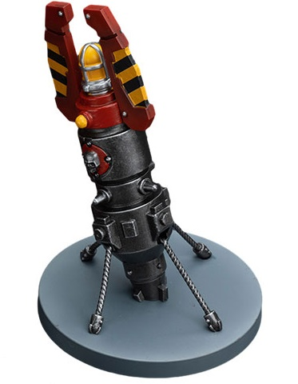
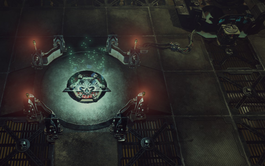

# 0007 传送 Teleportation

精校状态：中文行文已逐段精校，部分术语仍为暂定

分类：通用概念

原文来源：https://www.bilibili.com/opus/1218195322370523193

原作者：帝国神选罐头

原文时间：2026年06月26日 19:00

[返回分类目录](目录.md) · [全书目录](../../目录.md)

<!-- A0007-B0001 -->
**英文原文**

Teleportation is the technological or psychic ability to move an object from one place to another, more or less instantaneously, completely bypassing the intervening distance. It is used by a variety of armies and units including but not limited to Imperial and Chaos Space Marine Terminators, Eldar Warp Spiders, and even the Orks.

<!-- /A0007-B0001 -->

<!-- A0007-B0002 -->

原译文

传送是一种技术或灵能能力，可以将物体从一个地方移动到另一个地方，或多或少是瞬间的，完全绕过中间的距离。它被各种军队和单位使用，包括但不限于帝国和混沌星际战士终结者、灵族次元蜘蛛，甚至是欧克。

**校订译文**

传送是借助技术或灵能，将物体近乎瞬间地从一处移动到另一处的能力，可以完全绕过两地之间的距离。许多军队和单位都会使用传送，包括帝国与混沌星际战士的终结者、灵族次元蜘蛛，甚至欧克蛮人。

<!-- /A0007-B0002 -->

<!-- A0007-B0003 -->
## Examples 实例

<!-- /A0007-B0003 -->

<!-- A0007-B0004 -->
## Imperial Technology 帝国技术

<!-- /A0007-B0004 -->

<!-- A0007-B0005 -->
**英文原文**

Imperial teleporters are massive devices built into spacecraft and buildings, and require considerable power supplies. Typically, a primary teleporter array is composed of a looming mechanism above a broad circular platform raised above the ground. The raised platform being about the height of the average human and able to fit several hundred men and women. The complex framework of pipes, wires, and plating will often have a lambent blue light pulsing from within its ducts and mechanisms when active.

<!-- /A0007-B0005 -->

<!-- A0007-B0006 -->

原译文

帝国传送器是内置在星舰和建筑物中的大型设备，需要大量的能源支持。通常，主传送器阵列由一个隐约可见的机械装置组成，位于一个高出地面的宽阔圆形平台上方。这个升高的平台大约是普通人的高度，可以容纳几百名男女。管道、电线和镀层的复杂框架在激活时，其管道和机械装置内通常会发出微弱的蓝光脉冲。

**校订译文**

帝国的传送装置十分庞大，通常安装在星舰或建筑内部，需要大量能源才能运作。典型的主传送阵列由一座高耸的机械结构和其下方宽阔的圆形平台组成。平台高出地面约一个成年人的高度，面积足以容纳数百人。启动时，复杂的管道、线缆和金属板构架内部，往往会闪动柔和的蓝色光芒。

<!-- /A0007-B0006 -->

<!-- A0007-B0007 图片 -->

<!-- A0007-B0008 -->

原译文

Orbital-dropped Teleport Homer 轨道空调传送信标

**校订译文**

Orbital-dropped Teleport Homer 轨道空投传送信标

<!-- /A0007-B0008 -->

<!-- A0007-B0009 -->
**英文原文**

The military use of teleporters is to place combat squads directly into battle from ships in orbit. Safety devices built into the teleporter prevent the possibility of squads fatally materializing into solid matter. Objects more than twice man-height can't be teleported and any attempt to do it always causes a malfunction. Also, teleportation can "penetrate" only limited amounts of solid matter (nearly 5 metres) and always needs a straight line. This issue is why teleportation from planet to planet is not generally possible - the curvature of the planet means too much solid matter is generally in the way. It is known, though, that teleportation through significant solid mass could be implemented, with a great risk of appearing inside the mass or far from the target.

<!-- /A0007-B0009 -->

<!-- A0007-B0010 -->

原译文

传送器的军事用途是将战斗小队直接从轨道上的舰船上投入战斗。传送器内置的安全装置可以防止小队致命地变成固体。超过人身高两倍的物体不能被传送，任何尝试都会导致故障。此外，传送只能“穿透”有限量的固体物质（近5米），并且总是需要一条直线。这个问题就是为什么从一个行星到另一个行星的传送通常是不可能的 — 行星的曲率意味着通常会有太多的固体物质阻碍。然而，众所周知，可以实现通过大量固体物质的传送，但存在出现在物质内部或远离目标的巨大风险。

**校订译文**

在军事行动中，传送装置能将轨道舰船上的作战小队直接送入战场。装置内置的安全机制，会防止士兵在实体物质内部成形而丧命。使用常规传送技术时，超过两倍人体高度的物体无法传送，强行尝试必然造成故障。此外，传送只能穿透有限厚度的实体物质，约为五米，而且必须沿直线进行。行星曲率使途中通常存在过多实体阻隔，因此一般难以实现行星之间的直接传送。不过，也有穿越大量实体物质的传送案例，只是这样做极有可能让目标出现在物体内部，或远离预定位置。

**校注：** 英文以行星曲率解释 planet to planet 传送困难，论述存在疑点；五米和两倍人体高度均保留自英文，不将其扩展为所有时代或所有传送技术的普遍限制。

<!-- /A0007-B0010 -->

<!-- A0007-B0011 -->
**英文原文**

Despite that modern conventional Imperial teleportation finds it either impossible or risky, Archeotech Teleportariums from the Dark Age of Technology are known to be capable of reliably transporting forces and armies directly from planet to planet, or even across a subsector. A network of these archeotech teleportariums existed in Subsector Aurelia as well as on the Space Hulk Judgment of Carrion. These were used by Apollo Diomedes commanding a force of Blood Ravens in pursuit of the traitor Chapter Master Azariah Kyras during the Third Aurelian Crusade.

<!-- /A0007-B0011 -->

<!-- A0007-B0012 -->

原译文

尽管现代常规的帝国传送要么是不可能的，要么是有风险的，但众所周知，来自黑暗技术时代的考古科技传送仪能够可靠地将部队和军队直接从一个行星传送到另一个行星，甚至在一个分区之间传送。这些考古科技传送仪的网络存在于奥瑞利亚分区以及太空废船腐尸审判号中。在第三次奥瑞利安远征期间，阿波罗·狄俄墨得斯指挥一支血鸦部队追捕叛徒战团长亚撒利雅·凯拉斯时使用了这些传送仪。

**校订译文**

虽然帝国现行的常规传送技术无法做到这一点，或必须承担极大风险，但黑暗科技时代遗留的古科技传送室，却能可靠地将部队乃至整支军队从一颗行星送往另一颗行星，甚至跨越整个次星区。奥瑞利亚次星区以及太空废船“腐尸审判”号上，都曾存在这样的传送网络。在第三次奥瑞利安远征中，阿波罗·狄俄墨得斯曾率领血鸦部队，借助这些装置追击叛变的战团长亚撒利雅·凯拉斯。

**校注：** 已核同一人物、组织、型号或事件，与全书核心术语及后续专篇统一；原译保留对照。

<!-- /A0007-B0012 -->

<!-- A0007-B0013 图片 -->

<!-- A0007-B0014 -->

原译文

Archeotech Teleportarium 考古科技传送仪

**校订译文**

Archeotech Teleportarium 古科技传送室

<!-- /A0007-B0014 -->

<!-- A0007-B0015 -->
**英文原文**

Some very wealthy Rogue Traders can also be noted to possess personal miniature teleportation beacons as symbols of rank, the technology itself being considered old and rarefied with even having one being considered a miracle; this can assist them in dangerous situations, allowing them to traverse back to the safety of their flagships' teleportariums if there are no void-shields to interfere with the process.

<!-- /A0007-B0015 -->

<!-- A0007-B0016 -->

原译文

一些非常富有的行商浪人还拥有个人微型传送信标作为等级的象征，这项技术本身被认为是古老而稀有的，甚至拥有一个被认为是奇迹；这可以在危险的情况下为他们提供帮助，如果没有虚空盾干扰这一过程，他们就可以穿越回旗舰传送仪的安全地带。

**校订译文**

一些极其富有的行商浪人也拥有个人微型传送信标，并将其视为地位的象征。这种技术古老而罕见，仅仅拥有一件便堪称奇迹。只要没有虚空盾干扰，信标就能在危险关头帮助持有者返回旗舰的传送室，脱离险境。

<!-- /A0007-B0016 -->

<!-- A0007-B0017 -->
**英文原文**

Displacer fields are a form of personal defense force field that will automatically teleport the wearer a short-distance away as a reaction to heavy weapon's fire.

<!-- /A0007-B0017 -->

<!-- A0007-B0018 -->

原译文

置换立场是一种个人防御力场，它会自动将佩戴者传送很短的距离，作为对重武器火力的反应。

**校订译文**

位移力场是一种个人防护力场。当穿戴者遭到重武器射击时，力场会自动将其传送至附近的位置。

<!-- /A0007-B0018 -->

<!-- A0007-B0019 图片 -->

<!-- A0007-B0020 -->

原译文

Teleportarium aboard a Grey Knights vessel 灰骑士战舰上的传送仪

**校订译文**

Teleportarium aboard a Grey Knights vessel 灰骑士舰船上的传送室

<!-- /A0007-B0020 -->

<!-- A0007-B0021 -->
**英文原文**

Being teleported is unique experience. After the near blinding and deafening flash of the teleporter array activating the individual experiences an immediate sense of falling. For a fraction of a second the tranlocating individual is both rising and falling through unreality, nothing but discordant cries in unknown languages and sibilant whispers promising one's deepest desires are all that can be heard. Unnatural, cloying hands grasp at limbs. Then reality is reasserted. Those guardsmen unaccustomed to the disorientating sensation of translocation might fall on their hands and knees vomiting or weep blood from their eyes and ears upon arrival to their destination.

<!-- /A0007-B0021 -->

<!-- A0007-B0022 -->

原译文

被传送是一种独特的体验。在传送器阵列发出近乎致盲和震耳欲聋的闪光后，个体会立即体验到坠落的感觉。在不到一秒钟的时间里，这个恍惚的人在虚幻中起伏，只能听到用未知语言发出的不谐的叫声和承诺自己最深切欲望的嘶嘶低语。不自然、令人腻烦的手抓着四肢。然后，现实被重申。那些不习惯传送的迷失方向感的卫兵可能会在到达目的地时跪倒在地，呕吐或从眼睛和耳朵里流血。

**校订译文**

传送是一种独特的体验。阵列启动时，强光与巨响几乎令人失明、失聪，紧接着便是突如其来的坠落感。在短暂的一瞬间，正在转移的人仿佛同时向上升起、又向下坠落，穿行于非现实之中。耳边只有陌生语言的刺耳呼喊，以及许诺满足内心最深欲望的嘶嘶低语；违背常理、令人窒息的手掌则攫住四肢。随后，现实重新确立。尚未适应这种眩晕感的卫队士兵，抵达时可能四肢伏地、呕吐不止，甚至从眼睛和耳朵中渗出鲜血。

<!-- /A0007-B0022 -->

<!-- A0007-B0023 图片 -->

<!-- A0007-B0024 -->

原译文

Teleportarium platform aboard the Inquisitorial Cruiser Martyr 审判官巡洋舰殉道者号上的传送仪平台

**校订译文**

Teleportarium platform aboard the Inquisitorial Cruiser Martyr 审判庭巡洋舰“殉道者”号上的传送平台

<!-- /A0007-B0024 -->

<!-- A0007-B0025 -->
### Terminators 终结者

<!-- /A0007-B0025 -->

<!-- A0007-B0026 -->
**英文原文**

Teleport homers are incorporated into the behemoth Terminator armour, allowing Terminator squads to teleport directly into the midst of their enemies. Standard Power Armour-ed Space Marines normally can not safely teleport (in this manner, at least) due to Warp exposure, but the heavily protected Terminator frames offer protection. Teleportation is used both by Imperial Space Marines and their Chaos counterparts. The ship-based teleporter devices used by the Terminators are maintained by Astropaths. Using their psychically gifted minds, they allow the Terminators a brief moment of safe passage by shifting certain aspects of the warp. Some, mainly the members of the Ordo Malleus, have shown scorn for the idea of using the Warp to allow the troops of the Imperium the ability to teleport. However, none can criticize the vast number of battles the Imperium has won due to this ability.

<!-- /A0007-B0026 -->

<!-- A0007-B0027 -->

原译文

传送信标被整合到庞大的终结者盔甲中，使终结者小队能够直接传送到敌人中间。由于亚空间暴露，标准动力盔甲星际战士通常无法安全地传送（至少以这种方式），但受到严格保护的终结者构架提供了保护。帝国星际战士和他们的混沌对应都使用了传送。终结者使用的舰载传送装置由星语者维护。他们利用自己的灵能天赋思维，通过改变亚空间的某些方面，让终结者有一个短暂的安全通道。一些人，主要是圣锤修会的成员，对使用亚空间让帝国军队能够传送的想法表示蔑视。然而，没有人能批评帝国因这种能力而赢得的大量战斗。

**校订译文**

厚重的终结者护甲内置传送信标，使终结者小队能够直接出现在敌阵之中。身穿标准动力甲的星际战士通常无法安全地以这种方式传送，因为他们会暴露于亚空间的影响；终结者护甲的重型防护结构则能提供保护。帝国与混沌星际战士都会使用传送技术。终结者使用的舰载传送装置由星语者维护：他们运用灵能，短暂改变亚空间的某些状态，为终结者创造安全通行的窗口。有些人，尤其是恶魔审判庭（原译“圣锤修会”）的成员，对帝国军队借助亚空间进行传送颇有微词。不过，这项能力为帝国赢得了无数场胜利，这一点无人能够否认。

**校注：** 用户已确认本稿采用“恶魔审判庭”，全书正文首次出现时附原稿译名“圣锤修会”。该决定不等同于已核官方译名，官方依据仍待核实。原文关于星语者维护传送装置的说法照录。

<!-- /A0007-B0027 -->

<!-- A0007-B0028 -->
**英文原文**

A notable Imperial commander who advocates Terminator teleportation attacks is Captain Darnath Lysander of the Imperial Fists Chapter, who is known to lead his men at the forefront of the attacks performed by the Imperial Fists from the Phalanx, the Imperial Fists' massive space-borne Fortress-monastery.

<!-- /A0007-B0028 -->

<!-- A0007-B0029 -->

原译文

一位支持终结者传送攻击的著名帝国指挥官是帝国之拳战团的达纳斯·莱山德连长，他以带领他的部下站在对山阵号，帝国之拳的巨大太空堡垒修道院的帝国之拳的攻击的最前沿而闻名。

**校订译文**

帝国之拳战团的达纳斯·莱山德连长，是终结者传送突击的著名倡导者。他经常亲自率领战士，从帝国之拳巨大的太空要塞修道院“山阵”号发动攻击，并冲锋在最前线。

<!-- /A0007-B0029 -->

<!-- A0007-B0030 -->
**英文原文**

Terminator teleportation technology can be dangerous and unreliable, such as there being a risk of a user being fused into the structure of their intended location.

<!-- /A0007-B0030 -->

<!-- A0007-B0031 -->

原译文

终结者传送技术可能是危险和不可靠的，例如存在使用者被融合到其预期位置结构中的风险。

**校订译文**

终结者传送技术并非始终可靠，也存在危险，例如使用者可能与目的地的建筑结构融合在一起。

<!-- /A0007-B0031 -->

<!-- A0007-B0032 -->
## Chaos 混沌

<!-- /A0007-B0032 -->

<!-- A0007-B0033 -->
**英文原文**

Chaos Space Marine Obliterators are able to make use of teleportation, as well as Chaos Space Marines Terminators. This is most likely the same technology that has been in use by the Traitor Legions since the Horus Heresy.

<!-- /A0007-B0033 -->

<!-- A0007-B0034 -->

原译文

混沌星际战士泯灭者能够使用传送，以及混沌星际战士终结者。这很可能是自荷鲁斯叛乱以来叛徒军团使用的相同技术。

**校订译文**

混沌星际战士的泯灭者与终结者都能够进行传送。他们使用的很可能仍是叛变军团自荷鲁斯之乱以来一直沿用的技术。

<!-- /A0007-B0034 -->

<!-- A0007-B0035 -->
**英文原文**

It is generally unknown why Obliterators are able to teleport, as much about these bizarre creatures is shrouded in mystery, but considering their probable ties to the Dark Mechanicus and their theoretical past lives as Techmarines for their former legions, the ability to teleport into battle should not be too far fetched, as it can be assumed that they integrated systems into themselves that allowed for such action.

<!-- /A0007-B0035 -->

<!-- A0007-B0036 -->

原译文

一般来说，我们不知道为什么泯灭者能够传送，因为这些奇怪的生物在很大程度上被笼罩在神秘之中，但考虑到它们与黑暗机械教的可能关系，以及他们作为他们前军团技术军士的理论前世，传送到战斗中的能力不会太牵强，因为可以假设它们将允许这种行动的系统集成到了自己身上。

**校订译文**

泯灭者为何能够传送，通常没有确切答案，因为这些怪异生物身上仍笼罩着重重谜团。不过，考虑到它们可能与黑暗机械教有关，而且有理论认为它们曾是各自军团的科技战士，这种能力也并非难以理解：它们或许早已将传送所需的系统整合进了自己的躯体。

<!-- /A0007-B0036 -->

<!-- A0007-B0037 -->
**英文原文**

Daemonologists can open gateways between the real world and warp space, creating a whirling vortex that sucks in everything in the surrounding area and teleporting it nearby. Some human sorcerers and psykers have the ability to warpwalk, notably Tulava Dyne. The skill is functionally similar to Imperial teleportation technology but has a shorter range and much higher accuracy. Another distinct form of sorcery-based teleportation is that practiced by so-called Shadow-Walkers. Their sorcerous art allows individuals to slip in and out of reality using darkness and shadows as an a gateway they wrench open. The distance a Shadow-Walker can traverse in their jump can vary depending on the individual's power and skill in the art.

<!-- /A0007-B0037 -->

<!-- A0007-B0038 -->

原译文

恶魔学家可以打开现实世界和亚空间之间的大门，创造一个旋转的漩涡，吸入周围地区的一切，并将其传送到附近。一些人类巫师和灵能者具有战争行走能力，特别是图拉瓦·戴恩。该技能在功能上类似于帝国传送技术，但距离更短，精度更高。另一种基于巫术的传送形式是所谓的暗影行者所实践的。他们的巫术技艺允许个人利用黑暗和阴影作为他们猛开的门户，进出现实。暗影行者在跳跃中可以穿越的距离可能因个人的力量和技艺而异。

**校订译文**

恶魔学者能够开启现实与亚空间之间的门户，制造一个旋转的漩涡，将周围的一切吸入，再传送到附近。某些人类巫师与灵能者，例如图拉瓦·戴恩，还能进行“亚空间行走”。这种能力与帝国的传送技术作用相近，但距离更短，精度高得多。另一类依靠巫术传送的人被称为“暗影行者”：他们以黑暗和阴影为入口，强行撕开门户，穿梭于现实内外。一次跳跃究竟能跨越多远，取决于施术者的力量与技巧。

<!-- /A0007-B0038 -->

<!-- A0007-B0039 -->
## Eldar Technology 灵族技术

<!-- /A0007-B0039 -->

<!-- A0007-B0040 -->
**英文原文**

Eldar Warp Spiders make tactical use of a warp jump generator allowing them to utilize the warp to immediately engage or escape enemies quickly. The Eldar use these troops in a similar fashion to jump-troops of other races, but their ability to literally materialize out of nowhere and attack with little to no forewarning is invaluable to Eldar commanders and a nightmare to opposing tacticians.

<!-- /A0007-B0040 -->

<!-- A0007-B0041 -->

原译文

灵族次元蜘蛛在战术上使用曲速跳跃发生器，使他们能够利用亚空间迅速与敌人交战或逃跑。灵族以类似的方式使用这些部队来应对其他种族的跳跃部队，但他们突然出现并在几乎没有预警的情况下发动攻击的能力对灵族指挥官来说是无价的，对敌方策士来说则是一场噩梦。

**校订译文**

灵族次元蜘蛛会在战术行动中使用亚空间跳跃发生器，借助亚空间迅速接近或脱离敌人。灵族使用这类部队的方式，与其他种族使用跳跃部队相似。不过，次元蜘蛛能几乎毫无预兆地凭空现身并发动攻击；对灵族指挥官而言，这是无价的优势，对敌方战术家而言则是噩梦。

<!-- /A0007-B0041 -->

<!-- A0007-B0042 -->
**英文原文**

Harlequins make use of teleportation devices called Phase Fields.

<!-- /A0007-B0042 -->

<!-- A0007-B0043 -->

原译文

丑角使用称为相位立场的隐形传送装置。

**校订译文**

丑角使用一种称为“相位力场”的传送装置。

<!-- /A0007-B0043 -->

<!-- A0007-B0044 -->
## Necron Technology 太空死灵技术

原题：Necron Technology 死灵科技

<!-- /A0007-B0044 -->

<!-- A0007-B0045 -->
**英文原文**

Typically when a Necron is destroyed, their mind and body is teleported to the nearest tomb complex as part of Reanimation Protocols

<!-- /A0007-B0045 -->

<!-- A0007-B0046 -->

原译文

通常，当死灵被摧毁时，他们的思维和身体会被传送到最近的陵墓群，作为复活协议的一部分

**校订译文**

太空死灵被摧毁后，通常会依照复生协议，将心智与躯体传送至最近的墓穴设施。

<!-- /A0007-B0046 -->

<!-- A0007-B0047 -->
**英文原文**

Necron Lords can use the Veil of Darkness to teleport across the battlefield.

<!-- /A0007-B0047 -->

<!-- A0007-B0048 -->

原译文

死灵领主可以使用黑暗面纱在战场上传送。

**校订译文**

太空死灵领主可以借助“黑暗面纱”，在战场上进行传送。

<!-- /A0007-B0048 -->

<!-- A0007-B0049 -->
**英文原文**

Gauss weapons operates on a similar principle to teleportation, particularly that of the Necron's reanimation protocols, breaking apart the bonds of atoms and converting them into energy, siphoned into the weapon to be rematerialized as needed by the Necrons as needed. With Gauss Weapons, this effect notably acts on a target in layers, as a target's matter is literally "flayed" layer by layer, converted to energy in mere seconds.

<!-- /A0007-B0049 -->

<!-- A0007-B0050 -->

原译文

高斯武器的运作原理与传送相似，特别是死灵的复活协议，它打破原子的键并将其转化为能量，然后被抽入武器中，根据死灵的需要进行重新序列化。使用高斯武器，这种效果明显地对目标进行分层，因为目标的物质实际上是逐层“剥皮”的，在短短几秒钟内转化为能量。

**校订译文**

高斯武器的原理与传送相近，尤其类似太空死灵复生协议所使用的机制。它们能够破坏原子间的结合，将物质转化为能量并吸入武器，再按太空死灵的需要重新物质化。高斯武器对目标逐层生效，仿佛将物质一层层剥去，在短短数秒内便把它转化为能量。

<!-- /A0007-B0050 -->

<!-- A0007-B0051 -->
## Ork Technology 欧克蛮人技术

原题：Ork Technology 欧克技术

<!-- /A0007-B0051 -->

<!-- A0007-B0052 -->
**英文原文**

Orks also make use of teleportation technology, either as personal devices or as huge Tellyporta Platforms able to teleport even Stompas in and around the battlefield.

<!-- /A0007-B0052 -->

<!-- A0007-B0053 -->

原译文

欧克也使用传送技术，无论是作为个人设备还是作为能够在战场内外传送古巨圾的巨大传送平台。

**校订译文**

欧克蛮人也会使用传送技术，既有个人装置，也有庞大的传送平台；后者甚至能够将践踏巨机传送到战场内外。

**校注：** Stompa 按 GW-09 中文第 30 页、GW-10 英文第 29 页统一为“践踏巨机”；原译“古巨圾”保留供对照。

<!-- /A0007-B0053 -->

<!-- A0007-B0054 -->
## Teleport Crests 传送纹章

<!-- /A0007-B0054 -->

<!-- A0007-B0055 -->
**英文原文**

Used by the Leagues of Votann.

<!-- /A0007-B0055 -->

<!-- A0007-B0056 -->

原译文

被沃坦联盟使用

**校订译文**

由沃坦联盟使用。

<!-- /A0007-B0056 -->

<!-- A0007-B0057 -->
## Teleporter Worm 传送蠕虫

原题：Teleporter Worm 虫传送器

<!-- /A0007-B0057 -->

<!-- A0007-B0058 -->
**英文原文**

Used by the Tyranids.

<!-- /A0007-B0058 -->

<!-- A0007-B0059 -->

原译文

被泰伦使用

**校订译文**

由泰伦虫族使用。

<!-- /A0007-B0059 -->

<!-- A0007-B0060 -->
## Other/Universal 其他/通用

<!-- /A0007-B0060 -->

<!-- A0007-B0061 -->
**英文原文**

"Warp Jump"- Not to be confused with the process of faster than light ship travel, these ancient alien personal wargear devices allow any being who wields them to teleport and move around a battlefield, however there is a small risk of the user being lost in the warp forever. The exact origin and provenance of these devices is not stated, however they can be used by the forces of many factions including but not limited to the Imperium, forces of Chaos, Orks, Eldar and more.

<!-- /A0007-B0061 -->

<!-- A0007-B0062 -->

原译文

“亚空间跳跃” - 不要与超光速舰船航行的过程混淆，这些古老的异型个人战争装备允许任何使用它们的人在战场上传送和移动，但使用者永远迷失在亚空间中的风险很小。这些装置的确切来源和出处没有说明，但它们可以被许多派系的部队使用，包括但不限于帝国、混沌部队、欧克、灵族等。

**校订译文**

“亚空间跳跃”装置：不要将这种装备与舰船的超光速航行方式混淆。它们是古老的异形个人装备，持有者可以借其在战场上进行传送，但也有小概率永远迷失在亚空间中。这些装置的确切起源和来历并未说明。帝国、混沌势力、欧克蛮人、灵族等多个阵营都可以使用它们。

<!-- /A0007-B0062 -->

本篇核心术语与暂定项

以下列出本篇出现的英文原形及核心术语表用词。同形词可能指不同对象，具体词义以本篇正文和校注为准；单复数、别名和仅见于图注的名称可能尚未列入。完整候选见[术语表](../../术语表/双语术语候选.csv)。

| 英文 | 采用中文 | 状态 |
| --- | --- | --- |
| Space Marines | 星际战士 | 官方已核对 |
| Chaos Space Marines | 混沌星际战士 | 官方已核对 |
| Eldar | 灵族 | 暂定·语境区分 |
| Tyranids | 泰伦虫族 | 官方已核对 |
| Leagues of Votann | 沃坦联盟 | 官方已核对 |
| Necrons | 太空死灵 | 官方已核对 |
| Orks | 欧克蛮人 | 官方已核对 |
| Terminator | 终结者 | 官方已核对 |
| Horus Heresy | 荷鲁斯之乱 | 官方已核对 |
| Warp | 亚空间 | 官方已核对 |
| Imperium | 帝国 | 暂定·简称 |
| Dark Age of Technology | 黑暗科技时代 | 暂定 |
| Warp Jump | 亚空间跳跃 | 暂定 |
| Teleportation | 传送 | 暂定 |
| Archeotech | 古科技 | 暂定 |
| Ordo Malleus | 恶魔审判庭 | 用户指定 |
| Imperial Fists | 帝国之拳 | 暂定 |
| Darnath Lysander | 达纳斯·莱山德 | 官方已核对 |
| Phalanx | 山阵号 | 暂定 |
| Apollo Diomedes | 阿波罗·狄俄墨得斯 | 暂定 |
| Azariah Kyras | 亚撒利雅·凯拉斯 | 暂定 |
| Subsector Aurelia | 奥瑞利亚次星区 | 暂定 |
| Blood Ravens | 血鸦 | 暂定 |
| Tulava Dyne | 图拉瓦·戴恩 | 暂定 |
| Shadow-Walker | 暗影行者 | 暂定 |
| Reanimation Protocols | 复生协议 | 暂定·官方待核 |
| Veil of Darkness | 黑暗面纱 | 暂定 |
| Horus | 荷鲁斯 | 暂定·官方待核 |
| Subsector | 次星区 | 暂定·官方待核 |
| Third Aurelian Crusade | 第三次奥瑞利安远征 | 暂定·官方待核 |
| Discordant | 失谐者 | 暂定·官方待核 |
| Master | 导师（审判庭职衔）／舰务官（舰员职务） | 语境定译·官方待核 |
| Ancient | 旗手 | 官方已核对 |
| Veil | 韦尔 | 暂定·官方待核 |
| The Phalanx | 山阵号 | 暂定·官方待核 |
| Power Armour | 动力盔甲 | 暂定·官方待核 |
| Space Marine | 星际战士 | 暂定·官方待核 |
| Chapter | 战团 | 暂定·官方待核 |
| Fortress-monastery | 要塞修道院 | 暂定·官方待核 |
| Chapter Master | 战团长 | 暂定·官方待核 |
| Captain | 连长 | 暂定·官方待核 |
| Terminators | 终结者 | 暂定·官方待核 |
| Terminator Squads | 终结者小队 | 暂定·官方待核 |
| Dark Mechanicus | 黑暗机械教 | 暂定·官方待核 |
| Warp Spiders | 次元蜘蛛 | 官方已核对 |
| The Weapon | 武器 | 暂定·官方待核 |
| The Dark | 《黑暗》 | 暂定·官方待核 |
| Obliterators | 泯灭者 | 官方已核 |
| Gauss Weapons | 高斯武器 | 暂定·官方待核 |
| Terminator Armour | 终结者盔甲 | 暂定·官方待核 |

