# 0009 奴隶制度 Slavery

精校状态：中文行文已逐段精校，部分术语仍为暂定

分类：通用概念

原文来源：https://www.bilibili.com/opus/1186853627493351445

原作者：帝国神选罐头

原文时间：2026年04月03日 07:58

[返回分类目录](目录.md) · [全书目录](../../目录.md)

<!-- A0009-B0001 -->
**英文原文**

Slavery is common in the Galaxy across multiple sentient species. Whether they enslave their own kind or other sapient species, slaves are most often used as disposable labour for industry and other menial purposes.

<!-- /A0009-B0001 -->

<!-- A0009-B0002 -->

原译文

奴隶制在银河系中多个有感知能力的种族中很常见。无论是奴役自己的同类还是其他有智慧的种族，奴隶最常被用作工业和其他卑微目的的一次性劳动力。

**校订译文**

奴隶制在银河系的许多智慧种族中都很常见。无论被奴役的是同族还是其他智慧种族，奴隶通常都被当作消耗性劳动力，投入工业生产或其他繁重低贱的工作。

<!-- /A0009-B0002 -->

<!-- A0009-B0003 图片 -->
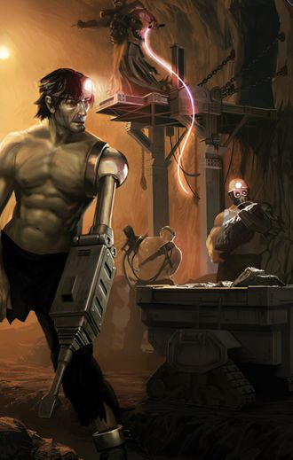

<!-- A0009-B0004 -->

原译文

Slaves and indentured workers toiling on the Chaos controlled moon Iniquity 奴隶和契约工人在混沌控制的邪恶卫星上辛勤劳动

**校订译文**

Slaves and indentured workers toiling on the Chaos controlled moon Iniquity 在混沌控制的伊尼奎蒂卫星上劳作的奴隶与契约劳工

<!-- /A0009-B0004 -->

<!-- A0009-B0005 -->
## Slavery and the Imperium 奴隶制与帝国

<!-- /A0009-B0005 -->

<!-- A0009-B0006 -->

原译文

Uncounted billions are born in squalour, labour in pain each day of their adult lives, then die in the streets, unsung and unmourned. They are blessed to do so, for in this way, they serve the Emperor. There is no greater calling. 无数人出生在肮脏之中，成年后每天都在痛苦中劳动，然后默默无闻且无人哀悼的死在街头。他们很幸运能这样做，因为这样，他们为帝皇服务。没有比这更伟大的事业了。

**校订译文**

Uncounted billions are born in squalour, labour in pain each day of their adult lives, then die in the streets, unsung and unmourned. They are blessed to do so, for in this way, they serve the Emperor. There is no greater calling. 无数亿人生于污秽，成年后的每一天都在痛苦中劳作，最终死于街头，无人颂扬，也无人哀悼。这是他们的福分，因为他们以此侍奉帝皇。没有比这更崇高的使命。

<!-- /A0009-B0006 -->

<!-- A0009-B0007 -->
**英文原文**

Slavery has been a part of the Imperium's foundation since its inception, when the Emperor still walked.

<!-- /A0009-B0007 -->

<!-- A0009-B0008 -->

原译文

自帝国成立以来，奴隶制一直是帝国基础的一部分，当时帝皇仍在行走。

**校订译文**

自帝国创立、帝皇尚亲自行走于世间之时起，奴隶制就已是帝国赖以运转的基础之一。

<!-- /A0009-B0008 -->

<!-- A0009-B0009 图片 -->
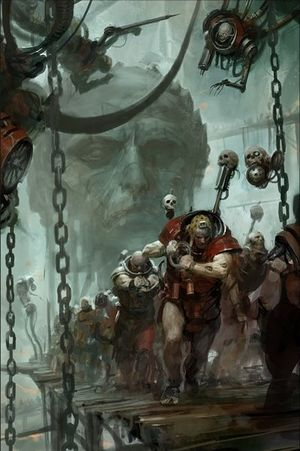

<!-- A0009-B0010 -->

原译文

Imperial labourers 帝国劳工

**校订译文**

Imperial labourers 帝国劳工

<!-- /A0009-B0010 -->

<!-- A0009-B0011 -->
**英文原文**

While menials in the Imperium are slaves in all but name, there can be nuance and variety in the bureaucratic landscape managing these workers. Chapter Serfs, also called helots, of Space Marine Chapters are bound to serve their masters. Sometime due to hereditary oaths taken by their ancestors, serving in roles making up the teeming masses of a Battle Barge's crew. The galaxy-spanning Adeptus Administratum is also fueled by hereditary slaves, largely serving as scribes and petty officials.

<!-- /A0009-B0011 -->

<!-- A0009-B0012 -->

原译文

虽然帝国中的仆人除了名义上是奴隶，但管理这些工人的官僚环境可能存在细微差别和多样性。星际战士战团的战团农奴，也称为侍从，必然会为他们的主人服务。有时是由于他们的祖先世袭的誓言，他们在战斗驳船的船员中扮演着庞大的角色。横跨银河系的内务部也由世袭奴隶推动，这些奴隶主要是文士和小职员。

**校订译文**

帝国的底层劳役人员虽未必被称为奴隶，实际上却与奴隶无异；不过，管理他们的官僚制度仍有不同形式。星际战士战团的战团农奴，也称 helots，必须终身侍奉主人。这种义务有时来自祖辈立下、由后代继承的誓言；战斗驳船上数量庞大的船员便承担着这类职役。遍布银河的内政部同样依靠世袭奴仆维持运作，他们大多担任抄写员和低阶文吏。

**校注：** helot 在此指被迫服役的农奴阶层，不宜一概译成“侍从”；词源说明见本篇末段。

<!-- /A0009-B0012 -->

<!-- A0009-B0013 -->
**英文原文**

Major hive worlds typically partake in outright slavery. Indentured industrial serfs lead short and brutal lives under Imperial yoke. Forced labour in slave-like conditions are seen across the Imperium, whether they be human, abhuman, or mutant. They are often used in manufactorums. Mutants are also often treated as slaved toilers in factories and hives. Some hive crime lords, such as the self-styled Underlord Hurango, are known to operate notorious "slave-farm stations" where slaves are produced and exported.

<!-- /A0009-B0013 -->

<!-- A0009-B0014 -->

原译文

主要的巢都世界通常参与彻底的奴隶制。契约工业奴隶在帝国的枷锁下过着短暂而残酷的生活。在帝国各地，无论是人类、亚人还是变种人，都可以看到奴隶般条件下的强迫劳动。它们经常用于制造厂。变种人也经常被当作工厂和巢都里的奴隶劳动者。众所周知，一些巢都犯罪领主，如自封的下巢领主胡兰戈，经营着臭名昭著的“奴隶农场站”，在那里生产和出口奴隶。

**校订译文**

大型巢都世界普遍实行公开的奴隶制。工业契约农奴在帝国的枷锁下，度过短暂而残酷的一生。无论是人类、亚人还是变种人，在帝国各地都可能被迫在形同奴役的条件下劳动，制造厂尤其常见。变种人也经常沦为工厂与巢都中的奴工。一些巢都犯罪头目还经营着臭名昭著的“奴隶培育站”，繁育并向外贩卖奴隶；自称“下巢领主”的胡兰戈就是其中之一。

<!-- /A0009-B0014 -->

<!-- A0009-B0015 -->
**英文原文**

Child slaves are common across the Imperium. Whether they're captured, sold into slavery by their parents, or are simply born into it. Forced child labourers like these are regularly used for miscellaneous tasks, such as cleaning the filth-caked vats of industrial algae farm agri-facilities, or as a sludger cleaning narrow water purification pipes, too small for an adult human to fit inside. Many on Shrine Worlds are also roles such as "Saint Polishers", serving the church by rubbing and scrubbing the monolithic saint statues of temples belonging to the Ecclesiarchy. Often thinly populated, some Agri-Worlds are almost entirely serviced by slave-serfs, servitors, and ancient machinery.

<!-- /A0009-B0015 -->

<!-- A0009-B0016 -->

原译文

童奴在帝国中很常见。无论他们是被捕获、被父母卖为奴隶，还是只是天生如此。像这样的强迫童工经常被用来做各种各样的工作，比如清洁工业藻类农场农业设施的污垢斑驳的大桶，或者作为一名污泥工清洁狭窄的净水管道，这些管道太小，成年人无法进入其中。圣地世界中的许多人也扮演着“圣人抛光师”的角色，通过摩擦和擦洗属于国教的圣堂的整个圣人雕像来为教堂服务。一些农业世界通常人口稀少，几乎完全由奴隶农奴、机仆和古代机械提供服务。

**校订译文**

童奴在帝国各地都很常见。他们有的是被掳来的，有的是被父母卖为奴隶的，还有的生来就是奴隶。这些童工被迫承担各种杂役，例如清洗工业化藻类农场中结满污垢的大槽，或充当清淤工，钻进成年人无法进入的狭窄净水管道。在圣地世界，许多童奴还担任所谓的“圣像擦拭工”，通过擦洗国教会神殿内巨大的圣人雕像来侍奉教会。一些人口稀少的农业世界，则几乎完全依靠奴役农奴、机仆和古老机械维持生产。

<!-- /A0009-B0016 -->

<!-- A0009-B0017 -->
**英文原文**

Shock Whips are common instruments used to provide additional encouragement to workers and slaves.

<!-- /A0009-B0017 -->

<!-- A0009-B0018 -->

原译文

电击鞭是一种常见的工具，用于为工人和奴隶提供额外的鼓励。

**校订译文**

电击鞭是常见的驱策工具，用来给工人和奴隶以额外的“激励”。

<!-- /A0009-B0018 -->

<!-- A0009-B0019 -->
## Imperial Slave Trade 帝国奴隶贸易

<!-- /A0009-B0019 -->

<!-- A0009-B0020 -->

原译文

The loyal slave learns to love the lash.–Common saying amongst menials and scriveners. 忠诚的奴隶学会爱上鞭打。– 仆人和抄写员之间的俗语。

**校订译文**

The loyal slave learns to love the lash.–Common saying amongst menials and scriveners. 忠诚的奴隶会学着爱上鞭笞。——杂役与抄写员之间流传的俗语

<!-- /A0009-B0020 -->

<!-- A0009-B0021 -->
**英文原文**

The Imperial slave trade spans a variety of local and interstellar slave markets, a Feral World slave market, hive city bazaar or illicit human trafficking rings, or even entire orbital defense stations are sometimes converted into interstellar slave-trade hubs by planetary nobility or merchant-barons. Supplies from a planet full of slave labour and mineral wealth represents a substantial and hard to replace holding, even in an empire as vast as the Imperium of Man.

<!-- /A0009-B0021 -->

<!-- A0009-B0022 -->

原译文

帝国的奴隶贸易跨越了各种各样的当地和星际奴隶市场，如蛮荒世界奴隶市场、巢都城市集市或非法人口贩运集团，甚至整个轨道防御空间站，有时会被行星贵族或商业巨头改造成星际奴隶贸易中心。来自一个充满奴隶劳工和矿产财富的行星的供应，即使在像人类帝国这样庞大的帝国中，也代表着一种巨大而难以替代的私有财产。

**校订译文**

帝国的奴隶贸易涵盖各类地方和星际市场，包括蛮荒世界的奴隶市场、巢都集市以及非法人口贩运网络。行星贵族或商业巨头有时甚至会将整座轨道防御站改造成星际奴隶贸易中心。即便在人类帝国这样庞大的国家里，一颗拥有大量奴工和丰富矿产、能持续提供物资的星球，也是一份价值可观且难以替代的产业。

<!-- /A0009-B0022 -->

<!-- A0009-B0023 图片 -->
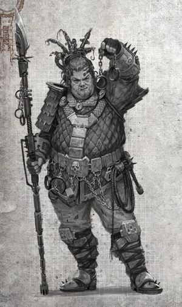

<!-- A0009-B0024 -->

原译文

Gram Ironhand, a Shackleman of the Necromundan Slave Guild 格拉姆·铁手，涅克罗蒙达奴隶行会的一名锁人者

**校订译文**

Gram Ironhand, a Shackleman of the Necromundan Slave Guild 格拉姆·铁手，涅克罗蒙达奴隶行会的一名锁人者

<!-- /A0009-B0024 -->

<!-- A0009-B0025 -->
**英文原文**

Large orbital star forts hosting interstellar slave-markets can be regulated by the Adeptus Administratum, barring sales to private parties, only allowing Imperial authorities to purchase such a valuable commodity. These markets tend to also buy and sell prisoners under the jurisdiction of the Administratum. Imperial Navy vessels too will make regular stops at locations like these to repopulate their lower decks' indentured ratings, whom die in droves within the enginariums and gunnery decks. In addition, Pirates, private vessels, and even Xenos vessels can be found lurking around such hubs, even if still regulated by the Administratum. In addition, privately operated interstellar trafficking hubs owned by Imperial Nobility have even been known to trade with xenos slavers as well, bartering broken-willed humans for xenos artefacts.

<!-- /A0009-B0025 -->

<!-- A0009-B0026 -->

原译文

主持星际奴隶市场的大型轨道星堡可以由内务部监管，禁止向私人出售，只允许帝国当局购买如此贵重的商品。这些市场也倾向于买卖内务部管辖下的囚犯。帝国海军战舰也将定期停靠在这样的地方，以重新填充其下层甲板的契约水手，这些水手在发动机室和火炮甲板内成群结队地死亡。此外，海盗、私人战舰，甚至异型战舰都可能潜伏在这些枢纽周围，即使仍受内务部的监管。此外，帝国贵族拥有的私人经营的星际贩运中心甚至也与异型奴隶贩子进行贸易，用意志破碎的人类换取异型造物。

**校订译文**

设有星际奴隶市场的大型轨道星堡，有时由内政部监管。这类市场禁止向私人买家出售奴隶，只允许帝国官方购买这种贵重“商品”，并且往往也买卖内政部管辖的囚犯。帝国海军舰船会定期在此停靠，补充下层甲板的契约水手，因为机舱和炮甲板上的人员总在成批死去。即使这些枢纽受到内政部监管，附近仍可能有海盗、私人船只，甚至异形舰船出没。帝国贵族私营的星际人口贩运中心，有时还会同异形奴隶贩子交易，用意志遭到摧毁的人类换取异形造物。

<!-- /A0009-B0026 -->

<!-- A0009-B0027 -->
**英文原文**

Various guilds across the Imperium deal in the commodity of indentured labour, whether it be textiles or mining. Whether guilder or Tech-priest, all are harsh masters that care only for the quotas they fill. Indentured workers in dangerous forms of drudgery need to be constantly replenished. Many are born into the workforce and are branded by the respective guild to which they belong, being forced into labour from an early age. Others are sold into indentured servitude by planetary governors as payment for a Guild's goods or services. The life of an Imperial labourer is a hard one that offers meagre rations, ineffective or missing equipment, harshing conditions and deadly accidents; a hard life consisting of their respective drudgery with brief periods of sleep between. A single guild could have millions of workers that are born, live, and die in their service. Those that try to escape are typically caught and killed as an example to others.

<!-- /A0009-B0027 -->

<!-- A0009-B0028 -->

原译文

帝国各地的各种行会都从事契约劳工商品的交易，无论是纺织业还是采矿业。无论是行会还是技术神甫，他们都是苛刻的主人，只关心他们所填补的配额。从事危险苦工形式的契约工人需要不断补充。许多人出生在劳动人口中，并被他们所属的相应行会打上烙印，从小就被迫劳动。其他人则被行星总督卖为契约奴隶，作为行会商品或服务的报酬。帝国劳工的生活很艰难，口粮匮乏，设备无效或丢失，条件恶劣，发生致命事故；艰苦的生活，由他们各自的苦差事和短暂的睡眠组成。一个行会可能有数百万工人在他们的服务中出生、生活和死亡。那些试图逃跑的人通常会被抓住并杀死，作为其他人的例子。

**校订译文**

帝国各地的行会把契约劳工当作商品经营，纺织业、采矿业等诸多行业都是如此。无论管理者是行会成员还是技术祭司，他们都是严酷的主人，只关心能否完成生产配额。从事危险苦役的契约劳工不断死去，因而必须持续补充。许多人一出生就属于这支劳动力大军，被烙上所属行会的标记，从幼年起便被迫工作。另一些人则由行星总督卖为契约奴仆，用来支付行会提供商品或服务的费用。帝国劳工口粮微薄，工具不是无法使用，就是根本没有；工作环境恶劣，致命事故频发。他们的一生只有无尽苦役，以及两轮劳动之间短暂的睡眠。一个行会就可能拥有数百万名劳工，他们生于行会、为其劳作，最终也死在服役期间。试图逃跑的人通常会被抓回来处死，以儆效尤。

<!-- /A0009-B0028 -->

<!-- A0009-B0029 图片 -->
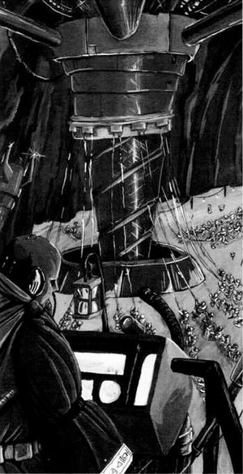

<!-- A0009-B0030 -->

原译文

Indentured workers of the Cirian System's Miners Guild 西里安星系矿工行会的契约工人

**校订译文**

Indentured workers of the Cirian System's Miners Guild 西里安星系矿工行会的契约工人

<!-- /A0009-B0030 -->

<!-- A0009-B0031 -->
**英文原文**

Imperial nobility regularly partake in slavery, as is their nature. Whether legal or not on a planetary basis, the ruling class views the lower classes as menials to be oppressed into servile masses and treated as they see fit, to the point that a nobleman can enslave an entire settlement of menials due to the supplies they manufacture, such as vintage wine to ensure their own steady brand of supply. In addition, privately operated interstellar trafficking hubs owned by Imperial Nobility have even been known to trade with xenos slavers as well, bartering broken-willed humans for xenos artefacts. Higher echelons of nobility such as Planetary Governors too can invest in slavery, such as ones who rule Penal Worlds where they will be essentially sold millions of innocents who are sent to such planets as convicts on trumped up charges by corrupt officials, the prisoners from such transactions are then used for cheap labour to produce valuable raw minerals for off-world transport in miserable conditions. Infamously, during the Age of Apostasy and the reign of Goge Vandire, the Schola Progenium was a highly corrupt institution where Schola orphans were used as slave labour by the Ecclesiarchy in mines and manufactorums, promising individuals would be sold as individual slaves and servants to Impreial Commanders, the most attractive would become concubines for Imperial Nobles, while the most physically adept would swell Goge Vandire's armies as Frateris Templar and Brides of the Emperor. The habitats they were raised in were not separated by gender, were associated with licentious practices, and the money for and from them used questionably.

<!-- /A0009-B0031 -->

<!-- A0009-B0032 -->

原译文

帝国贵族经常参与奴隶制，这是他们的天性。无论在行星基准内是否合法，统治阶级都将下层阶级视为仆人，他们被压迫成奴性群体，并受到他们认为合适的待遇，以至于贵族可以因为他们生产的供应品（如精制葡萄酒）而奴役整个贫民定居点，以确保他们自己的稳定供应。此外，帝国贵族拥有的私人经营的星际贩运中心甚至也与异型奴隶贩子进行贸易，用意志破碎的人类换取异型造物。更高级别的贵族，如行星总督，也可以投资于奴隶制，例如统治刑罚世界的人，在那里他们基本上会被卖给数百万无辜者，这些无辜者被腐败官员以莫须有的罪名送往这些行星，然后这些交易中的囚犯被用于廉价劳动力，在恶劣的条件下为世界外的运输生产有价值的原矿物。臭名昭著的是，在叛教时代和高戈·范迪尔的统治时期，忠嗣学院是一个高度腐败的机构，在那里，学院孤儿被国教用作矿山和工厂的奴隶劳工，有前途的人被作为个人奴隶和仆人卖给帝国指挥官，最性感的人将成为帝国贵族的妾，而身体最灵活的人将作为圣堂兄弟会和帝皇新娘扩大高戈·范迪尔的军队。他们所生活的栖息地没有按性别分开，与放荡的惯例有关，而且他们的资金使用也存在问题。

**校订译文**

奴役他人几乎是帝国贵族的惯常做法。不论当地法律是否允许奴隶制，统治阶层都把底层民众视为可以任意驱使的杂役，强迫他们服从自己的意志。为了持续获得某种产品——例如特定的陈年佳酿——贵族甚至会奴役生产这种商品的整个底层聚居区。帝国贵族私营的星际人口贩运中心也曾同异形奴隶贩子交易，用意志遭到摧毁的人类换取异形造物。行星总督等更高层的贵族同样可能投资奴隶产业。刑罚世界的统治者就是一例：腐败官员捏造罪名，将数百万无辜者作为罪犯送往这些星球，实质上就是把他们卖给当地统治者。交易得来的囚犯随后被当作廉价劳动力，在悲惨的环境中开采贵重矿产，供外运出售。叛教时代高戈·范迪尔统治期间的忠嗣学院尤其臭名昭著。这个机构腐败至极，国教会把收养的孤儿当作矿场和制造厂的奴工；表现出才干者被单独卖给帝国指挥官充当奴隶或仆役，容貌出众者沦为帝国贵族的姬妾，身体素质最好者则被编入圣堂兄弟会和帝皇新娘，扩充范迪尔的军队。他们成长的住处不分男女，并与淫乱行为相联系；相关经费的收支也存在严重问题。

<!-- /A0009-B0032 -->

<!-- A0009-B0033 -->
### Rogue Trader Slavers 行商浪人奴隶贩子

<!-- /A0009-B0033 -->

<!-- A0009-B0034 -->

原译文

“Trust the Navy? I only trust those meddlesome fools to take an unwanted interest in a man’s honest work.”- Rogue Trader and slaver Krakin Feckward “相信海军？我只相信那些爱管闲事的傻瓜会对一个人的诚实工作产生不必要的兴趣。”- 行商浪人和奴隶贩子克拉金·费克沃德

**校订译文**

“Trust the Navy? I only trust those meddlesome fools to take an unwanted interest in a man’s honest work.”- Rogue Trader and slaver Krakin Feckward “相信海军？我倒是相信，那些爱管闲事的蠢货准会盯上别人正正当当的生意，平白惹人讨厌。”——行商浪人兼奴隶贩子克拉金·费克沃德

<!-- /A0009-B0034 -->

<!-- A0009-B0035 -->
**英文原文**

Rogue Traders will scope out undiscovered worlds with valuable resources to be harvested, such as slaves and minerals, anything that is in demand. These captive are reaped from a variety of unsavory sources. Some Rogue Traders have become notorious interstellar slavers. Some Rogue Trader can also make several dozen of slave raids on worlds inhabitated by humans undiscovered by the Imperium, deeming its inhabitants as not "Imperials" to any that scrutinize these actions before selling off their goods elsewhere, deeming such oppoturnities as beneficial. They'll also seek out worlds with unsuspecting natives that they'll quickly ferret out and command mighty slave-barges to be filled with stunned captives, captured by the Rogue Trader's own personal slave-troops.

<!-- /A0009-B0035 -->

<!-- A0009-B0036 -->

原译文

行商浪人将寻找未被发现的世界，寻找有价值的资源，如奴隶和矿产，任何有需求的东西。这些俘虏是从各种不光彩的来源获得的。一些行商浪人已经成为臭名昭著的星际奴隶贩子。一些行商浪人还可以对帝国未发现的人类居住的世界进行几十次奴隶袭击，认为其居民不是“帝国人”，而任何在其他地方出售货物之前仔细审查这些行为的人都认为这样的机会是有益的。他们还寻找当地人毫无戒心的世界，他们将迅速找到并指挥强大的奴隶驳船装满被行商浪人自己的私人奴隶部队捕获的震惊的俘虏。

**校订译文**

行商浪人会寻找尚未被发现的世界，搜刮奴隶、矿产等一切有市场需求的资源。他们获取俘虏的手段往往见不得光，其中一些人已成为臭名昭著的星际奴隶贩子。有些行商浪人会对尚未被帝国发现的人类世界发动数十次掳奴袭击，再到别处出售俘虏。若有人追究，他们便以当地居民不属于“帝国子民”为由辩解，并把这样的机会视作有利可图的买卖。他们也会专门寻找居民毫无防备的世界，迅速搜捕当地人，命令麾下的掳奴部队将制服或击昏的俘虏塞满巨大的运奴驳船。

<!-- /A0009-B0036 -->

<!-- A0009-B0037 -->
## Imperial Navy Slavery 帝国海军奴隶制

<!-- /A0009-B0037 -->

<!-- A0009-B0038 -->
**英文原文**

The Navis Imperialis regularly makes use of slaves and convicts manning the hazardous and "uncivilised" lower decks. Entire slave colonies man these dangerous, but essential decks, notably the many generatoriums and gunnery decks, each a city unto itself. The Imperial Navy will send their press-gangs to forcibly acquire unwilling manual labour from local populations. Whether it be in a Hive City while at port or by simply buying or "requisitioning" slaves to replace losses. Forcing them to join the teeming ship-scum crewing the bowels of their vessels engine rooms and guns to live the rest of their short lives.

<!-- /A0009-B0038 -->

<!-- A0009-B0039 -->

原译文

帝国海军经常使用奴隶和罪犯在危险和“不文明”的下层甲板上执勤。整个奴隶聚居地都有这些危险但必不可少的甲板，特别是许多发动机室和火炮甲板，每个都是一座城市本身。帝国海军将派遣他们的强征兵强行从当地居民那里获得不情愿的体力劳工。无论是在港口的巢都城市，还是简单地购买或“征用”奴隶来弥补损失。迫使他们加入拥挤的舰船渣滓，在他们的战舰的引擎室和枪炮里度过他们短暂的余生。

**校订译文**

帝国海军经常使用奴隶和罪犯，填补危险而被视作“不文明”的下层甲板岗位。大批奴隶在这些危险却不可或缺的区域内生活、劳作，尤其是发电舱与炮甲板；其中每一处都宛如一座城市。海军会派出强征队，从当地人口中强行征取不愿服役的体力劳工：有时趁舰船靠港，在巢都中抓人；有时直接购买或“征用”奴隶来补充损耗。被抓来的人只能加入庞大的底舱劳役群体，在舰船深处的机舱与炮位上耗尽短暂的余生。

<!-- /A0009-B0039 -->

<!-- A0009-B0040 图片 -->
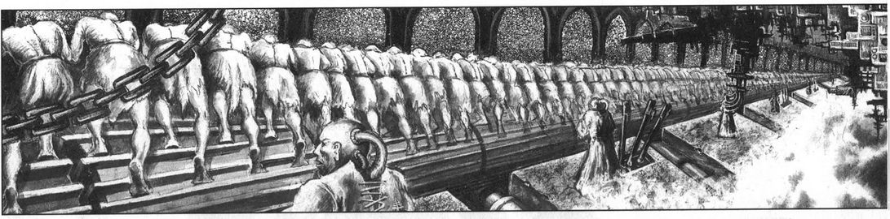

<!-- A0009-B0041 -->

原译文

Imperial Navy ratings 帝国海军水手

**校订译文**

Imperial Navy ratings 帝国海军水手

<!-- /A0009-B0041 -->

<!-- A0009-B0042 -->
**英文原文**

Ratings are members of the crew who attend to tasks that require muscle, not training, hauling shells, clearing debris, etc. They also make up boarding parties. Indentured workers are ratings who have been press-ganged or taken from penal colonies to atone by serving the Emperor. When Imperial Navy vessels dock at a port to refuel, they will also restock on ratings, press-ganging local dock workers into indentured servitude to slave away the rest of their short lives in their lower decks. Shock-Staves are also common sight which the men and women of these decks will become familiar with. These electrical pain goads are used to encourage the indentured slaves and ratings. They are also often used when press gangs go out to recruit new menial crewmen for Navy vessels.

<!-- /A0009-B0042 -->

<!-- A0009-B0043 -->

原译文

水手是指参与需要肌肉而非训练、拖运炮弹、清理碎片等任务的船员。他们还组织登船派对。契约工人是指被强迫或从流放地带走，为帝皇服务以赎罪的普通人。当帝国海军战舰停靠在港口补充燃料时，他们还将补充额定值，迫使当地码头工人成为契约奴隶，在下层甲板上度过他们短暂的余生。电击杖也是这些甲板上的男女们熟悉的常见景象。这些电击杖被用来鼓励契约奴隶和水手。当强征兵外出为海军战舰招募新的仆人船员时，也经常使用它们。

**校订译文**

普通水手承担搬运炮弹、清理残骸等主要依靠体力、而非专门训练的工作，也会被编入跳帮队伍。其中的契约劳工，有的是遭强行征募的，有的是从刑罚殖民地征来的，须以侍奉帝皇的方式赎罪。帝国海军舰船靠港补充燃料时，也会补充水手，强抓当地码头工人，让他们成为契约奴仆，在下层甲板的苦役中度过短暂余生。这些甲板上的男女还会熟悉另一种常见器具：电击杖。这种制造电击疼痛的驱策工具被用来“激励”契约奴隶和水手，强征队外出为海军舰船搜罗新杂役时也经常使用。

<!-- /A0009-B0043 -->

<!-- A0009-B0044 图片 -->
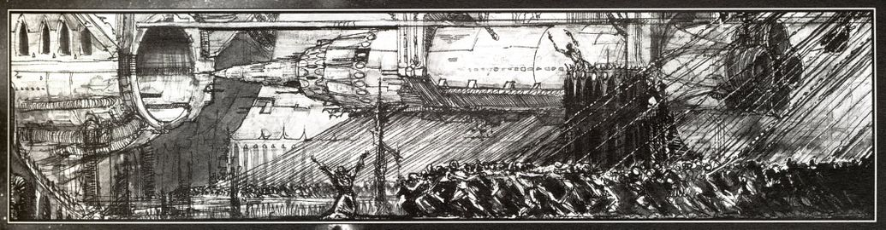

<!-- A0009-B0045 -->

原译文

Torpedo being loaded 正在装载的鱼雷

**校订译文**

Torpedo being loaded 正在装载的鱼雷

<!-- /A0009-B0045 -->

<!-- A0009-B0046 -->
## Hive World Slavery 巢都世界奴隶制

<!-- /A0009-B0046 -->

<!-- A0009-B0047 -->
**英文原文**

Many Hive Worlds have entire industries dedicated to gathering slaves from a local district's populace. The Slaver Guilds of Necromunda are dedicated to gathering human and abhuman resources from various wasteland settlements or underhive districts and lower hab levels.

<!-- /A0009-B0047 -->

<!-- A0009-B0048 -->

原译文

许多巢都世界都有专门从当地民众那里收集奴隶的整个行业。涅克罗蒙达的奴隶贩子行会致力于从各种荒地定居点或下巢地区和底层居住区收集人类和亚人资源。

**校订译文**

许多巢都世界形成了专门从当地居民中搜捕奴隶的完整产业。涅克罗蒙达的奴隶贩卖行会，便专门从荒原聚居地、下巢区和底层居住区搜罗人类与亚人。

<!-- /A0009-B0048 -->

<!-- A0009-B0049 -->
**英文原文**

Some hive worlds like Alecto declare that slavery is illegal on their world, however, human trafficking and unsanctioned servitorization on the black market is still rife through its cities. Trafficking groups known as skin rings tend to prey on poor, young humans and abhumans. Individuals are lured in with promises of good jobs in hive cities, then detained and sold into prostitution, skin-rings or forced labour. Joy-houses will buy these fresh body-slaves from said skin runners, keeping them locked up as joygirls or thrillboys until they grow old, at which point they are tossed onto the street.

<!-- /A0009-B0049 -->

<!-- A0009-B0050 -->

原译文

像阿勒克图这样的巢都世界宣布奴隶制在他们的世界是非法的，然而，人口贩卖和黑市上未经批准的奴役仍然在城市中盛行。被称为皮环的贩运集团往往以穷人、年轻人和亚人为猎物。人们被承诺在巢都城市找到好工作，然后被拘留并被卖为卖淫、皮环或强迫劳动。欢乐屋会从这些皮环走私者那里购买这些新鲜的肉体奴隶，把他们当作欢乐女孩或惊险男孩关起来，直到他们变老，然后被扔到街上。

**校订译文**

阿勒克图等巢都世界虽宣布奴隶制非法，城市中的人口贩卖和黑市上未经许可的机仆改造却依然猖獗。被称为“人口贩运团伙”（skin rings）的组织，往往以贫困的年轻人类和亚人为目标。他们许诺在巢都中提供好工作，把受害者诱骗过来后加以拘禁，再卖入性交易、其他贩运网络或强迫劳动体系。妓院会从这些人口贩子手中购买性奴，将他们囚禁起来接客，直到年老后再赶到街上。

**校注：** servitorization 指“改造成机仆”，不是泛指奴役。skin ring／skin runner 按此处人口贩运语境作说明性暂译，不照字面译为“皮环”。

<!-- /A0009-B0050 -->

<!-- A0009-B0051 -->
## Slavery and the Mechanicus 奴隶制与机械修会

原题：Slavery and the Mechanicus 奴隶制和机械教

<!-- /A0009-B0051 -->

<!-- A0009-B0052 -->
**英文原文**

The Adeptus Mechanicus believe that industry itself is a work of divinity. They fuel their industrial output with the sweat of legions of slave labour, the augmented strength of unthinking cyborg thralls and the power of monolithic forge temples. They are regarded simply as assets, numbers and mortal resources. Many of which exist in a waking nightmare that will only end with their death from the very toils they undertake. The industrial output of a major Forge World could have billions of labourers, serfs, and menials all toiling ceaselessly to fuel the work of the Martian Priesthood.

<!-- /A0009-B0052 -->

<!-- A0009-B0053 -->

原译文

机械神教认为，工业本身就是一件神圣的工作。他们用大批奴隶劳工的汗水、不思考的半机械人奴隶的增强力量和整体铸造神殿的力量来推动工业产出。他们被简单地视为资产、数字和人力资源。其中许多人活在一场醒着的噩梦中，这场噩梦只会以他们从所从事的劳动中死亡而告终。一个主要的铸造世界的工业产出可能有数十亿的劳工、农奴和仆人，他们都在不停地为火星祭司的工作提供燃料。

**校订译文**

机械修会认为，工业生产本身就是神圣的事业。他们依靠成群奴工的血汗、没有自主意识的机械改造奴仆所具备的强化力量，以及庞大铸造神殿的产能，推动工业运转。这些劳役者仅被视为资产、数字和可消耗的人力。许多人终日活在清醒的噩梦中，只有在苦役中死去才能解脱。一座大型铸造世界的工业生产，可能需要数十亿劳工、农奴和杂役不停地劳作，以支持火星祭司的事业。

<!-- /A0009-B0053 -->

<!-- A0009-B0054 图片 -->
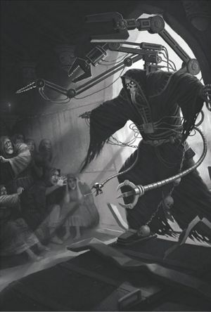

<!-- A0009-B0055 -->

原译文

Tech-Priest and menials 技术神甫和贫民

**校订译文**

Tech-Priest and menials 技术祭司与杂役

<!-- /A0009-B0055 -->

<!-- A0009-B0056 -->
**英文原文**

The Adeptus Mechanicus Naval Fleet correspondingly will regularly conduct surprise raids in menial hab districts of their Forge World in order to kidnap fresh slaves, breaching into establishments such as taverns or bars to non-lethally subdue other Imperials before forcefully collaring and implating them with subdermal fealty-identifiers. This is often done to supplement the population of Bondsmen for Ark Mechanicus vessels.

<!-- /A0009-B0056 -->

<!-- A0009-B0057 -->

原译文

相应地，机械教海军舰队将定期在铸造世界的贫民居住区进行突袭，绑架新的奴隶，闯入旅馆或酒吧等场所，以非致命的方式控制其他帝国人，然后强行制服并植入皮下忠诚标识符。这通常是为了补充机械方舟战舰的奴隶。

**校订译文**

机械修会舰队也会定期突袭所属铸造世界的底层居住区，掳走新的奴工。他们闯入酒馆、酒吧等场所，以非致命手段制服其他帝国居民，随后强行给他们戴上项圈，植入用于标记归属的皮下识别装置。这类行动通常是为了补充机械方舟上的奴役船员。

<!-- /A0009-B0057 -->

<!-- A0009-B0058 -->
## Imperial Slave Variants 帝国奴隶的类别

原题：Imperial Slave Variants 帝国奴隶变体

<!-- /A0009-B0058 -->

<!-- A0009-B0059 -->
**英文原文**

There is a market for specialised slaves in the Imperium. Organisations, such as the Tutors, have sprung up to fulfill this demand, selling tongueless savants, spies, bodyguards, and ritual torturers. The business of these slavers consists of acquisition, re-moulding, and selling of the finest and most specialised slave available. These cruel and methodical slavers use cruel and esoteric methods: noetic induction, the breaking of self, torture, ritual branding and hypno-conditioning.

<!-- /A0009-B0059 -->

<!-- A0009-B0060 -->

原译文

帝国里有专门的奴隶市场。像导师这样的组织如雨后春笋般涌现，以满足这一需求，出售缄默学者、间谍、护卫和仪式拷问者。这些奴隶贩子的业务包括收购、改造和出售最好、最专业的奴隶。这些残酷而有条不紊的奴隶贩子使用残酷而秘传的方法：思维诱导、自我破碎、酷刑、仪式烙印和催眠训练。

**校订译文**

帝国存在着对专门用途奴隶的需求。“导师”（Tutors）等组织因此应运而生，贩卖被割去舌头的博学者、间谍、保镖以及专门实施仪式性酷刑的人。这些奴隶贩子的业务，是搜罗、重塑并出售素质最高、分工最专门的奴隶。他们冷酷而有条不紊，采用种种残忍、隐秘的手段，包括心智诱导、摧毁自我意识、酷刑、仪式烙印与催眠调教。

<!-- /A0009-B0060 -->

<!-- A0009-B0061 -->
### Abhuman Slaves 亚人奴隶

<!-- /A0009-B0061 -->

<!-- A0009-B0062 -->
**英文原文**

These stable strains of mutants are an underclass of humanity that is treated with even more disdain than those of a typical dregs of Imperial society. Ogryns are generally the most popular form of abhuman slaves and are often vat-born en masse to supply the labourer demands that would benefit from exceptionally durable, diminutive, and strong workers. They are typically placed in heavy labour roles, such as mining, hive manufactorums, or Agriworld production. They can be found toiling almost anywhere there is heavy lifting to be done, if they are an available resource.

<!-- /A0009-B0062 -->

<!-- A0009-B0063 -->

原译文

这些稳定的变种人是人类的下层阶级，他们受到的蔑视甚至比帝国社会特有的渣滓还要多。欧格林通常是最受欢迎的亚人奴隶形式，通常是缸裔集体，以满足劳工的需求，这些需求将受益于异常耐用、微小和强壮的工人。他们通常被安排在繁重的劳动岗位上，如采矿、巢都制造厂或农业世界生产。如果他们是可用的资源，他们几乎可以在任何有繁重工作要做的地方辛勤工作。

**校订译文**

亚人是性状稳定的变种人分支，在人类社会中地位低下，遭受的蔑视甚至超过帝国社会最底层的普通人。欧格林通常是最受欢迎的亚人奴隶，常被成批培育为缸生个体，以满足需要耐劳、强壮劳工的行业需求。他们通常被安排从事采矿、巢都制造业或农业世界生产等重体力劳动。只要当地能够获得欧格林，几乎任何需要搬运重物的地方，都能见到他们劳作的身影。

**校注：** 英文用 diminutive（矮小的）修饰欧格林，与本段对欧格林强壮体格和重体力用途的描述可疑。校订译文暂未纳入这个形容词，保留英文待核；其余信息均按原文。

<!-- /A0009-B0063 -->

<!-- A0009-B0064 -->
### Bioengineered Slaves 生物工程奴隶

<!-- /A0009-B0064 -->

<!-- A0009-B0065 -->
**英文原文**

Bioengineered slave races have also been commissioned in the Imperium. The "Goliath" slave race, the ancient predecessors of House Goliath, are one example. House Van Saar and Magos Biologis of Necromunda were commissioned by a powerful gang, House Escher, to create a slave race more effective than baseline humans. Dubbed the "Goliaths", they were stronger and more dimwitted than standard humans, as well as created sterile. The Slave Guild sold these Goliaths across the Necromunda's many hives.

<!-- /A0009-B0065 -->

<!-- A0009-B0066 -->

原译文

帝国也委托了生物工程奴隶种族。“歌利亚”奴隶种族，即歌利亚家族的古老祖先，就是一个例子。凡·萨尔家族和涅克罗蒙达的生物贤者受强大的帮派埃舍尔家族的委托，创造了一个比普通人类更有效的奴隶种族。他们被称为“歌利亚”，比普通人类更强壮、更愚蠢，而且天生不育。奴隶行会在涅克罗蒙达的许多巢都里出售这些歌利亚。

**校订译文**

帝国也曾委托培育经过生物工程改造的奴隶种族，歌利亚家族的古老前身——“歌利亚”奴隶种族——就是一例。涅克罗蒙达的强大帮派埃舍尔家族，委托凡·萨尔家族与生物贤者创造一种比普通人类更适合劳动的奴隶。成品被命名为“歌利亚”：他们比普通人更强壮，也更愚钝，而且被设计为无法生育。奴隶行会随后将这些歌利亚卖往涅克罗蒙达的各座巢都。

<!-- /A0009-B0066 -->

<!-- A0009-B0067 -->
**英文原文**

It isn't uncommon for the hive spire parties of Imperial Noblity to feature gene-engineered courtesans and body slaves, rebuilt to perverted ideals of beauty, serving drinks and food alongside flattery and pleasure.

<!-- /A0009-B0067 -->

<!-- A0009-B0068 -->

原译文

帝国贵族的巢都尖塔派对以基因工程妓女和肉体奴隶为特色，他们被重组为变态的美感理想，在奉承和欢愉的同时提供饮料和食物，这并不罕见。

**校订译文**

在帝国贵族的巢塔宴会上，经基因工程改造的交际花和肉身奴仆并不罕见。他们的身体被重塑，以迎合扭曲的审美；除了端送饮食，还负责奉承宾客、提供欢愉。

<!-- /A0009-B0068 -->

<!-- A0009-B0069 -->
### Servitor Slaves 机仆奴隶

<!-- /A0009-B0069 -->

<!-- A0009-B0070 -->
**英文原文**

Servitors are mindless slaves, manufactured from living flesh and purposeful metal. These cyborganic slaves that are programmed to do a singular or variety of menial tasks. Many standard human workers need not worry about a servitor taking their life-long indentured duties, as some jobs deemed so meanial that they aren't worth programming a servitor perform instead.

<!-- /A0009-B0070 -->

<!-- A0009-B0071 -->

原译文

机仆是没有思维的奴隶，由活生生的肉体和有目的的金属制成。这些半机械人奴隶被编程为执行单一或多种枯燥的任务。许多标准的人类工人不必担心机仆会承担他们终身的契约责任，因为有些工作被认为如此枯燥，不值得对机仆进行编程以代替执行。

**校订译文**

机仆是由活体血肉与功能性机械构件制成、没有自主意识的奴仆。这些半机械奴仆被编入程序，执行一种或多种杂役。许多普通劳工倒不必担心机仆会取代自己终身承担的契约劳役，因为有些工作过于卑微，甚至不值得专门为机仆编写执行程序。

<!-- /A0009-B0071 -->

<!-- A0009-B0072 -->
**英文原文**

In the Imperium, it is debated whether a servitor is a slave or not. This debate hinges on how much of the original neural framework is left intact after being converted into one. More of this neural framework, and the person it was, are left in place for servitors designed to complete more complex tasks. This spectrum can vary from significant portions of a person's consciousness can sometimes still remain, and in other instances the person might be entirely lobotomised.

<!-- /A0009-B0072 -->

<!-- A0009-B0073 -->

原译文

在帝国，人们争论机仆是否是奴隶。这场争论取决于原始神经框架在转换为独一后有多少是完整的。这种神经框架的更多部分，以及它曾经的样子，都留给了被设计用来完成更复杂任务的机仆。这个范围可能会有所不同，一个人的意识的重要部分有时仍然存在，在其他情况下，这个人可能完全被切除了脑叶。

**校订译文**

在帝国内部，机仆究竟算不算奴隶，仍存在争论。关键在于：改造完成后，原本的神经结构还有多少被保留下来。负责较复杂任务的机仆，需要保留更多原有神经结构，也就可能残留更多原来那个人的意识。具体情况差别很大：有的机仆仍保留相当一部分自我意识，另一些则接受了彻底的脑叶切除。

<!-- /A0009-B0073 -->

<!-- A0009-B0074 -->
**英文原文**

However, there is good money to be made for a tech-priest biologis willing to skirt the strictures of the Lore Mechanicus and dabble in tech-heresy. Certain clients, often times men, are willing pay pay significant amounts of money to have total domination over another individual.

<!-- /A0009-B0074 -->

<!-- A0009-B0075 -->

原译文

然而，对于一位愿意绕过机械教的限制并涉足技术异端的生物技术神甫来说，这是一笔可观的收入。某些委托人，通常是男性，愿意支付大笔费用来完全控制另一个人。

**校订译文**

不过，对愿意规避机械教律（Lore Mechanicus）、涉足技术异端的生物技术祭司来说，这是一门利润丰厚的生意。一些客户——通常是男性——愿意支付巨款，以取得对另一个人的绝对支配权。

<!-- /A0009-B0075 -->

<!-- A0009-B0076 -->
**英文原文**

Typically created by the Magos Biologis of the Adeptus Mechanicus, servitors in the Imperium are often converted into lobotomised cyborg servants against their will or without consent. This could be due to a severe injury in a workplace, criminal punishment, or simply being of vat-born for the express purpose of being converted into a servitor. These menials serve across human society as labourers, combat roles, and as infrastructure.

<!-- /A0009-B0076 -->

<!-- A0009-B0077 -->

原译文

帝国中的机仆通常是由机械神教的生物贤者创造的，他们经常被违背自己的意愿或未经同意，被转化为有切除脑叶的半机械人机仆。这可能是由于在工作场所受到重伤、刑罚处罚，或者仅仅是为了成为机仆而生的缸裔。这些卑微的人在整个人类社会中充当劳工、战斗角色和基础设施。

**校订译文**

帝国的机仆通常由机械修会的生物贤者制造。许多人是在违背本人意愿或未经同意的情况下，被切除脑叶并改造成半机械奴仆的。改造的缘由可能是严重工伤、刑事惩罚，也可能是他们本来就是专为制作机仆而培育的缸生人。机仆遍布人类社会，既承担劳动与战斗任务，也作为基础设施的一部分运作。

<!-- /A0009-B0077 -->

<!-- A0009-B0078 -->
## Slavery and the Forces of Chaos 奴隶制和混沌势力

<!-- /A0009-B0078 -->

<!-- A0009-B0079 -->
**英文原文**

The Forces of Chaos readily make use of slaves in all the same ways as the Imperium. Men, women, and children are all used in a cacophony of ceaseless industry, construction of vain edifices, and materiel for obscure research. The Eye of Terror Slave Wars is one such example of centuries long conflicts over slaves and other resources fought by the Traitor Legions.

<!-- /A0009-B0079 -->

<!-- A0009-B0080 -->

原译文

混沌势力很容易以与帝国相同的方式利用奴隶。男人、女人和孩子都被用在杂音不断的工业、徒劳的建筑结构和晦涩研究的材料中。恐惧之眼奴隶战争就是叛徒军团为争夺奴隶和其他资源而进行的长达几个世纪的冲突的一个例子。

**校订译文**

混沌势力同样广泛役使奴隶，其用途与帝国并无二致。男女老幼都被投入喧嚣不息的工业生产，建造徒具宏伟外观的建筑，或成为隐秘研究的耗材。恐惧之眼中的奴隶战争就是一例：叛徒军团为争夺奴隶与其他资源，进行了长达数百年的冲突。

<!-- /A0009-B0080 -->

<!-- A0009-B0081 图片 -->
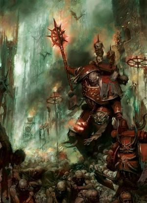

<!-- A0009-B0082 -->

原译文

Dark Apostle of the Word Bearers and enslaved humans on a Daemon World 怀言者的黑暗使徒和被奴役的人类在一个恶魔世界

**校订译文**

Dark Apostle of the Word Bearers and enslaved humans on a Daemon World 恶魔世界上的怀言者黑暗使徒与被奴役的人类

<!-- /A0009-B0082 -->

<!-- A0009-B0083 -->
**英文原文**

Humans, be they faithful Cultists or mere slaves, are no more than the playthings of the daemons and the Chaos Gods. For the glory of Chaos they undertake gargantuan, but nevertheless pointless projects. For example, they get divided up into armies and sent to fight each other, form giant religious ceremonies or build monuments or waste away with utter pointless work such as cataloguing and categorizing grains of sand. And this insanity can change into a different kind of insanity at any moment.

<!-- /A0009-B0083 -->

<!-- A0009-B0084 -->

原译文

人类，无论是忠实的邪教徒还是纯粹的奴隶，都不过是恶魔和混沌诸神的玩物。为了混沌的荣耀，他们进行了庞大但毫无意义的计划。例如，他们被分成军队，被派去互相战斗，举行盛大的宗教仪式，建造纪念碑，或者进行毫无意义的工作，如对沙粒进行编目和分类。这种疯狂随时都可能变成另一种疯狂。

**校订译文**

无论是忠诚的邪教徒，还是普通奴隶，人类在恶魔与混沌诸神眼中都不过是玩物。他们以混沌之名，被迫参与庞大却毫无意义的工程：有时被编成军队互相厮杀，有时举行盛大宗教仪式或修筑纪念碑，有时则把生命耗费在给沙粒编目、分类之类全无意义的工作上。而这一种疯狂，随时又可能被另一种疯狂取代。

<!-- /A0009-B0084 -->

<!-- A0009-B0085 -->
**英文原文**

Fighting pits might be filled with gladiatorial slaves, forced to fight for the Blood God.

<!-- /A0009-B0085 -->

<!-- A0009-B0086 -->

原译文

战斗坑里可能挤满了角斗士奴隶，他们被迫为血神而战。

**校订译文**

角斗场中可能挤满了被迫为血神厮杀的奴隶角斗士。

<!-- /A0009-B0086 -->

<!-- A0009-B0087 -->
**英文原文**

Contrary to what some might assume, mortal slaves of Chaos factions are harnessed for other purposes than battle and sacrifice. The bulk of mortal slaves serve through work and worship. A menial must rise up from their slave-pits, prayer gangs, or black factories to have the honour of fighting in the name of Chaos, and in doing so, drawing power from it. They are bitterly rewarded by learning to love the love. Becoming frenzied with pleasure as they approach extreme acts of self-sacrifice.

<!-- /A0009-B0087 -->

<!-- A0009-B0088 -->

原译文

与一些人可能认为的相反，混沌派系的凡人奴隶被用于战斗和牺牲以外的其他目的。大多数凡人奴隶通过工作和礼拜来服务。一个仆人必须从他们的奴隶坑、祈祷帮或黑工厂中站出来，以混沌之名战斗，并从中汲取力量。他们学会了爱其所爱，得到了痛苦的回报。当他们接近极端的自我牺牲行为时，变得欣喜若狂。

**校订译文**

与一些人的想象不同，混沌势力的凡人奴隶并非只用于作战和献祭；他们中的大多数都通过劳动与崇拜来侍奉主人。一个杂役必须先从奴隶坑、祈祷队伍或黑暗工厂中脱颖而出，才有资格获得以混沌之名作战、并从中汲取力量的“荣誉”。他们所得的回报苦涩而扭曲：在不断接近极端的自我牺牲时，竟因快感而陷入狂乱。

**校注：** 英文 learning to love the love 语义不明，疑有重复或讹误。校订译文暂只表达能够确定的前后文，未猜写这个短语的含义；待回查英文来源。

<!-- /A0009-B0088 -->

<!-- A0009-B0089 -->
**英文原文**

Enterprising individuals might corrupt a Sector Lord or invade a star cluster to gather more worlds and slave for a Daemon Prince.

<!-- /A0009-B0089 -->

<!-- A0009-B0090 -->

原译文

有进取心的人可能会腐化一个星区领主或入侵一个星群，以收集更多的世界并为一个恶魔王子做奴隶。

**校订译文**

野心勃勃者可能会腐化一位星区领主，或入侵一个星团，为恶魔亲王夺取更多世界与奴隶。

**校注：** 英文 slave 疑为 slaves 的单复数笔误。结合 gather more worlds and… 与 for a Daemon Prince，按“为恶魔王子夺取世界与奴隶”理解，避免误读为行动者自己去做奴隶。

<!-- /A0009-B0090 -->

<!-- A0009-B0091 -->
**英文原文**

The Dark Mechanicum is known to control and dominate great fiefdoms and Forges, comprised of enslaved thralls and servants. Controlled by a single fallen Magos (or several Magi) these dark technocracies might vie to dominate another corrupted tech-priest and their holdings. This can all go on while serving amongst the various warbands of the Traitor Legions, fighting amongst each other, or hold these minor kingdoms aloof and apart from it all.

<!-- /A0009-B0091 -->

<!-- A0009-B0092 -->

原译文

众所周知，黑暗机械教控制并统治着由奴役的奴隶和仆人组成的大辖域和诸造厂。由一个堕落贤者（或几个贤者）控制，这些黑暗技术联盟可能会争相支配另一个腐化的技术神甫及其财产。这一切都可以在叛徒军团的各种战帮中服役时继续，在彼此之间战斗，或者让这些小王国冷淡并远离这一切。

**校订译文**

黑暗机械教控制着广阔的领地和铸造设施，依靠被奴役的劳工与仆役维持运作。这些由一名或多名堕落贤者统治的黑暗技术政权，可能相互争夺其他腐化技术祭司及其产业的控制权。他们既可能依附叛徒军团的各个战帮，也可能彼此交战；还有一些小王国选择置身事外，保持独立。

<!-- /A0009-B0092 -->

<!-- A0009-B0093 -->
## Slavery and Chaos Space Marines 奴隶制和混沌星际战士

<!-- /A0009-B0093 -->

<!-- A0009-B0094 -->
**英文原文**

There are a variety of Chaos Cults dedicated to one of the 4 major Chaos Gods, specific Traitor Legions, or warbands. Where loyalist Space Marines have serfs, the Chaos Space Marines have slaves. Both fulfill a similar range of various vital functions. The Traitor Legions teach their slaves to hate the Imperium and to despise the Emperor with an unholy passion. Some of these wretched souls can rise from cannon fodder masses, forge themselves through hardened veterancy, and eventually become valued elite servants.

<!-- /A0009-B0094 -->

<!-- A0009-B0095 -->

原译文

有各种各样的混沌教派致力于四大混沌之神之一、特定的叛徒军团或战帮。忠诚派星际战士有侍从，混沌星际战士则有奴隶。两者都具有相似的各种重要功能。叛徒军团教导他们的奴隶憎恨帝国，并以邪恶的激情蔑视帝皇。这些可怜的灵魂中的一些人可以从炮灰堆中崛起，通过坚定的经验诸造自己，最终成为有价值的精英仆人。

**校订译文**

混沌教派种类繁多，有的侍奉四大混沌神之一，有的效忠特定叛徒军团或战帮。忠诚派星际战士有战团农奴，混沌星际战士则有奴隶；两者承担的许多关键职能大致相同。叛徒军团教导奴隶仇恨帝国，以亵渎的狂热鄙弃帝皇。有些不幸者能够从炮灰中脱颖而出，历经战火磨炼，最终成为备受重视的精锐仆从。

<!-- /A0009-B0095 -->

<!-- A0009-B0096 图片 -->
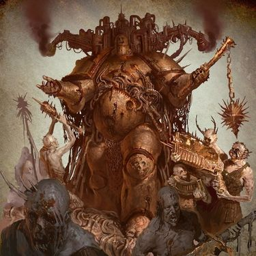

<!-- A0009-B0097 -->

原译文

Plague Marine 瘟疫战士

**校订译文**

Plague Marine 瘟疫战士

<!-- /A0009-B0097 -->

<!-- A0009-B0098 -->
**英文原文**

Imperial Prison Worlds will readily be raided by the Black Legion or other warbands in order to gather fresh penal legions made up of these stolen Imperial slaves to be used as cannon-fodder. Those that bear signs of being touched by Chaos might be lifted from the human fodder to serve elsewhere. Similarly, more valuable mortal humans like Navigators might be kidnapped to serve honoured and vital roles amongst their slave-serfs.

<!-- /A0009-B0098 -->

<!-- A0009-B0099 -->

原译文

帝国监狱世界将很容易被黑色军团或其他战帮突袭，以收集由这些被盗的帝国奴隶组成的新的惩罚军团，用作炮灰。那些有被混沌触碰迹象的人可能会从人类饲料中被抬出来，在其他地方服务。同样，像航海家这样更有价值的凡人可能会被绑架，在他们的奴隶农奴中扮演重要的角色。

**校订译文**

黑色军团及其他战帮经常袭击帝国的监狱世界，把掳来的帝国奴隶编成新的惩戒军团，充作炮灰。显露出混沌眷顾迹象的人，可能被从炮灰队伍中挑出，派往其他岗位。导航员等更有价值的凡人也会遭到绑架；在这些奴仆之中，他们承担的工作更为重要，地位也更受尊重。

<!-- /A0009-B0099 -->

<!-- A0009-B0100 -->
**英文原文**

Worlds conquered by the Word Bearers' Dark Apostles will often have their inhabitants converted forcefully. This is typically a precursor to a short, brutal life as a slave labourer building an immense temple to the Chaos Gods. Entire populations of occupied worlds will be branded and put in chains to erect great monuments and temples to the ruling powers of the Warp.

<!-- /A0009-B0100 -->

<!-- A0009-B0101 -->

原译文

被怀言者的黑暗使徒征服的世界，其居民往往会被迫皈依。这通常预示着作为奴隶劳工为混沌诸神建造一座巨大的神殿的短暂而残酷的生活。被占领世界的全体人口将被打上烙印并戴上锁链，为亚空间的统治力量竖立大纪念碑和神殿。

**校订译文**

被怀言者黑暗使徒征服的世界，居民通常会被迫改信混沌。随后，他们往往要以奴工的身份，为混沌诸神修筑巨大的神殿，在劳役中度过短暂而残酷的一生。被占领世界的全部人口都可能遭到烙印、戴上锁链，为统治亚空间的诸般力量建造宏伟的纪念碑与神殿。

<!-- /A0009-B0101 -->

<!-- A0009-B0102 -->
**英文原文**

The Emperor's Children will often serve any master in return for fresh slaves to practice their devotion to Slaanesh. For example, Noise Marines is affix captives with a bizarre array of sonic amplifiers and vox speaker, causing the recipient great pain and amplify every tortured cry and terrified gasp to skull-shattering heights. These pitiful creatures are then prepared to accompany their masters in battle. The Kakophoni have their own servant race decendended from void-born slaves taken during the Legion Wars that have become more ape-like and are uniquely immune to the auditory miasma their masters give off.

<!-- /A0009-B0102 -->

<!-- A0009-B0103 -->

原译文

帝皇之子经常为任何主人服务，以换取新的奴隶来实践他们对色孽的忠诚。例如，噪音战士用一系列奇怪的声波放大器和音阵扬声器来固定俘虏，给接受者带来极大的痛苦，并将每一次痛苦的喊声和惊恐的喘息声放大到粉碎头骨的高度。这些可怜的生物然后准备在战斗中陪伴他们的主人。噪音部队有自己的仆人种族，从军团战争期间被夺走的虚空裔奴隶中衰退，这些奴隶变得更像猿，并且对主人发出的听觉瘴气具有独特免疫。

**校订译文**

只要能获得新的奴隶，以供实践对色孽的崇拜，帝皇之子往往愿意为任何主人效力。例如，噪音战士会在俘虏身上安装形制怪异的声波放大器和通讯扬声器，让他们承受剧痛，再将每一声惨叫与惊恐喘息放大到足以震碎头骨的强度。这些可怜的生物随后便会被带上战场，随主人作战。卡科弗尼噪音部队（Kakophoni）还拥有专属的仆役族群。他们是军团战争期间被掳走的虚空裔奴隶的后代，外形逐渐趋近猿类，并独特地免疫主人发出的致命噪声。

<!-- /A0009-B0103 -->

<!-- A0009-B0104 -->
**英文原文**

The Death Guard often uses hordes of diseased Cultists, sometimes coming from slave populations, to assail enemies in masses of feeble bodies and fevered rage.

<!-- /A0009-B0104 -->

<!-- A0009-B0105 -->

原译文

死亡卫队经常使用成群的患病邪教徒，有时来自奴隶人口，以虚弱的身体和狂热的愤怒攻击敌人。

**校订译文**

死亡守卫经常驱使大群身染疾病的邪教徒，让他们拖着虚弱的身体、怀着病热般的狂怒，成群扑向敌人。这些邪教徒有时便来自奴隶群体。

<!-- /A0009-B0105 -->

<!-- A0009-B0106 -->
**英文原文**

Warbands such as the Lords of Silence refers to themselves as the Unbroken and their slave-serfs as the Unchanged. These serfs of Nurgle's chosen are often mutated and gifted with various blights and wasting diseases. The majority are given little regard, being tossed aside like insects without a second thought. The are some that are regarded with some degree of value, usually serving a leadership role aboard a voidship amongst tens of thousands other corrupted menials.

<!-- /A0009-B0106 -->

<!-- A0009-B0107 -->

原译文

寂静领主等战帮自称坚不可摧者，而他们的奴隶侍从则自称不变者。纳垢神选的这些侍从经常发生变异，并患有各种疫病和虚弱性疾病。大多数人几乎没有受到重视，就像昆虫一样被抛在一边，毫不犹豫。他们中的一些人被认为具有一定的价值，通常在成千上万的其他腐化仆人中担任登上虚空舰的领导角色。

**校订译文**

寂静领主等战帮自称“不屈者”（Unbroken），并把自己的奴仆称为“未变者”（Unchanged）。这些服侍纳垢神选者的奴仆往往已经变异，获赐各种瘟疫与消耗性疾病。大多数奴仆毫不受重视，主人随手便会像丢弃虫子一样将他们抛开。不过，也有少数人具有一定价值，通常在虚空舰上负责统领数万名其他腐化杂役。

<!-- /A0009-B0107 -->

<!-- A0009-B0108 -->
**英文原文**

Iron Warriors make common use of slave-soldiers utilized as little more than cannon-fodder to deplete besieged enemy munitions. Their industry on various worlds is often fuelled by millions of slaves chained to conveyour belts, slag pits, and other work stations. All toiling without respite to fuel the war machine of their oppressors, toiling to spread tyranny and destruction across the galaxy. Some Iron Warriors simply refer to their slave as Flesh.

<!-- /A0009-B0108 -->

<!-- A0009-B0109 -->

原译文

钢铁勇士普遍使用奴隶士兵，他们只是用来消耗被围困的敌人弹药的炮灰。他们在不同世界的工业往往是由数百万被拴在传送带、矿渣坑和其他工作站上的奴隶推动的。所有人都在不遗余力地为压迫者的战争机器提供燃料，在整个银河系散布暴虐和破坏。一些钢铁勇士简单地将他们的奴隶称为“血肉”。

**校订译文**

钢铁勇士经常使用奴隶士兵，把他们当作消耗被围困之敌弹药的炮灰。他们在各个世界的工业，则往往依靠数百万名被锁在传送带、矿渣坑和其他工位上的奴隶。这些人没有片刻休息，只能不停地劳作，维持压迫者的战争机器，帮助其将暴政与毁灭散布到整个银河。有些钢铁勇士干脆把奴隶称为“血肉”。

<!-- /A0009-B0109 -->

<!-- A0009-B0110 -->
**英文原文**

The Night Lords typically implant a locator beacon in the throat of each of their slaves.

<!-- /A0009-B0110 -->

<!-- A0009-B0111 -->

原译文

午夜领主通常会在每个奴隶的喉咙里植入一个定位信标。

**校订译文**

午夜领主通常会在每个奴隶的喉咙里植入一个定位信标。

<!-- /A0009-B0111 -->

<!-- A0009-B0112 -->
**英文原文**

The 9 great cults of the Thousand Sons has worlds which they draw resource and magical energy. The populous of these planets provide them with constant streams of Cultist soldiers, slaves and subjects for their arcane experiments. Some of these grim experiments on slaves result in the creation of Tzaangors.

<!-- /A0009-B0112 -->

<!-- A0009-B0113 -->

原译文

千子的九大教派拥有世界，他们从中汲取资源和巫术能量。这些行星的人口为他们提供了源源不断的邪教徒士兵、奴隶和用于他们的神秘实验的材料。其中一些对奴隶的残酷实验导致了奸角兽的诞生。

**校订译文**

千子的九大教派各自拥有可供汲取资源与巫术能量的世界。这些星球的居民为他们不断提供邪教徒士兵、奴隶和秘法实验的对象。某些针对奴隶的残酷实验，最终会造出奸角兽。

<!-- /A0009-B0113 -->

<!-- A0009-B0114 -->
**英文原文**

The fate of a Cultist serving the Thousand Son will inevitably lead to three inglorious ends, all pawns in greater plans, used as meat to clog the wheel of the Imperial war machine. Either they will be taken by thrallbands to serve to die on the frontlines of another war or be sent to the Planet of Sorcerers to be used in experiments. Others are simply overtaken by their own mutations, and become gibbering Chaos Spawn. Some even more unfortunate slaves meanwhile are sometimes used to herd Chaos Spawns, being arrayed in a path so that the helpless victims are used as a trail of bait that the creature's pained instincts follow to its intended target.

<!-- /A0009-B0114 -->

<!-- A0009-B0115 -->

原译文

一个为千子服务的邪教徒的命运将不可避免地导致三个不光彩的结局，所有这些都是更大计划中的棋子，被用作堵塞帝国战争机器车轮的血肉。他们要么被束缚小队带到另一场战争的前线，要么被送到巫师行星进行实验。其他人只是被自己的突变所取代，变成了口齿不清的混沌卵。与此同时，一些更不幸的奴隶有时会被用来放牧混沌卵，排列在一条路上，这样无助的受害者就会被用作诱饵，这种生物对痛苦的本能会跟随它的预定目标。

**校订译文**

效命于千子的邪教徒，不过是宏大计划中的棋子，是用来卡住帝国战争机器齿轮的血肉。他们终究难逃三种不光彩的结局：被奴役战团（thrallbands）带到另一场战争的前线送死；被送往巫师之星充作实验品；或者被自身的变异吞噬，化为胡言乱语的混沌魔物。有些更不幸的奴隶还会被用于引导混沌魔物的行进路线。他们被沿途排开，成为一连串无法反抗的活饵，让怪物受痛苦驱使的本能循着他们，一路走向预定目标。

**校注：** Chaos Spawn 采用本次核对的官方译名“混沌魔物”，原译“混沌卵”保留为别名。thrallbands 暂译“奴役战团”，原文保留供核。

<!-- /A0009-B0115 -->

<!-- A0009-B0116 -->
## Daemon Slaves 恶魔奴隶

<!-- /A0009-B0116 -->

<!-- A0009-B0117 -->
**英文原文**

Daemons can become can be enslaved by mortals within machines or weapons. This is one of the greatest insults possible to a daemon. If the rituals of binding fail or the daemon is somehow released, they will seek to destroy their former or would-be enslaver, tearing through anything that stands in their way. If they are unable or too weak to take revenge immediately, they patiently wait for an opportunity to do so in the future. Daemons have long memories for such things, and do not easily forget those who attempt to enslave them.

<!-- /A0009-B0117 -->

<!-- A0009-B0118 -->

原译文

恶魔可以被凡人的机器或武器奴役。这是对恶魔最大的侮辱之一。如果约束仪式失败或恶魔以某种方式被释放，他们将试图摧毁他们以前或未来的奴隶，撕裂任何阻碍他们的东西。如果他们无法或太弱而无法立即复仇，他们会耐心地等待未来的机会。恶魔对这些事情有很长的记忆，不容易忘记那些试图奴役他们的人。

**校订译文**

凡人能够把恶魔束缚在机器或武器之中，加以奴役。对恶魔而言，这是最深重的侮辱之一。如果束缚仪式失败，或恶魔以某种方式重获自由，它就会设法杀死曾经奴役自己、或企图这样做的人，撕碎沿途的一切阻碍。若当时无力复仇，它便会耐心等待日后的机会。恶魔对这类仇恨记得极久，不会轻易忘记试图奴役自己的人。

**校注：** enslaver 指奴役恶魔的人，原译“以前或未来的奴隶”颠倒了施受关系。

<!-- /A0009-B0118 -->

<!-- A0009-B0119 图片 -->
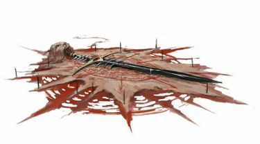

<!-- A0009-B0120 -->

原译文

Daemon Weapon 恶魔武器

**校订译文**

Daemon Weapon 恶魔武器

<!-- /A0009-B0120 -->

<!-- A0009-B0121 -->
**英文原文**

Some Chaos Space Marine warbands have been known to utilize bound daemons when their mortal slave prove insufficient. Faenroc of the Black Legion found that his slaves would melt and mutate due to close proximity with the warp-infused iron ore they were tasked with mining. To remedy this inconvenience by binding daemonic entities to his mining machines in a ritual that involved the mass sacrifice of the entire mortal workforce.

<!-- /A0009-B0121 -->

<!-- A0009-B0122 -->

原译文

众所周知，一些混沌星际战士战帮在他们的凡人奴隶被证明不足时会利用约束恶魔。黑色军团的法恩罗克发现，他的奴隶会融化并变异，因为他们与被赋予开采任务的亚空间注入的铁矿石非常接近。为了弥补这一不便，他将恶魔实体绑定到他的采矿机械上，这一仪式涉及整个凡人劳动力的大规模献祭。

**校订译文**

一些混沌星际战士战帮在凡人奴隶无法胜任工作时，会改用受束缚的恶魔。黑色军团的法恩罗克发现，奴隶在开采受亚空间力量浸染的铁矿时，会因靠矿石太近而融化、变异。为解决这个“不便”，他举行仪式，把恶魔实体束缚进采矿机械；整个凡人劳工群体都成了仪式的祭品。

<!-- /A0009-B0122 -->

<!-- A0009-B0123 -->
## Slavery and the Dark Eldar 奴隶制与黑暗灵族

<!-- /A0009-B0123 -->

<!-- A0009-B0124 -->
**英文原文**

The Dark Eldar are known for their slave raids across the galaxy. These captives are then kept in the slave pits and torture chambers found across Commorragh. The de facto ruler of Commorragh, Asdrubael Vect himself was born a slave in the dark city he now rules, having rose to the highest of social strata through exceptional guile, ruthlessness, and manipulation.

<!-- /A0009-B0124 -->

<!-- A0009-B0125 -->

原译文

黑暗灵族以他们在银河系中的奴隶袭击而闻名。这些俘虏随后被关押在科摩罗各处的奴隶坑和酷刑室中。作为科摩罗事实上的统治者，阿斯杜巴尔·维克特本人出生在他现在统治的黑暗城市的奴隶，通过非凡的狡猾、无情和操纵上升到了社会阶层的最高层。

**校订译文**

黑暗灵族以遍布银河的掳奴袭击闻名。俘虏随后会被关进科摩罗各处的奴隶坑和刑讯室。科摩罗事实上的统治者阿斯杜巴尔·维克特，也曾是这座黑暗之城中出生的奴隶；他凭借非凡的狡诈、冷酷与操纵手腕，一步步攀上社会顶端，统治了昔日奴役自己的城市。

<!-- /A0009-B0125 -->

<!-- A0009-B0126 图片 -->
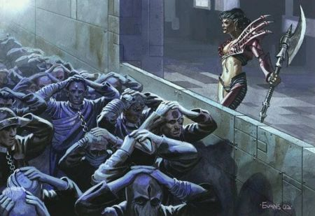

<!-- A0009-B0127 -->

原译文

Drukhari and sacrificial slaves 杜鲁卡里和献祭奴隶

**校订译文**

Drukhari and sacrificial slaves 黑暗灵族与待献祭的奴隶

<!-- /A0009-B0127 -->

<!-- A0009-B0128 -->
**英文原文**

Dark Eldar use their captives for a variety of purposes such as slave-driven industry and manufacturing, dark sacrifices, entertainment or fodder for gladiatorial matches, or profane experiments. Slaves themselves are even used as a form of currency, in some cases. The largest of and most influential of the great Kabals launch slave-raids on a constant basis to realspace due these factors, as well as a show of force, influence and political power.

<!-- /A0009-B0128 -->

<!-- A0009-B0129 -->

原译文

黑暗精灵将他们的俘虏用于各种目的，如奴隶驱动的工业和制造业、黑暗祭祀、娱乐或角斗士比赛的饲料，或亵渎实验。在某些情况下，奴隶本身甚至被用作一种货币。由于这些因素，以及武力、影响力和政治权力的展示，大阴谋团中规模最大、最具影响力的会不断向现实空间发动奴隶袭击。

**校订译文**

黑暗灵族把俘虏用于各类用途：驱使他们从事工业制造，将他们献给黑暗仪式，拿他们取乐或充当角斗赛中的牺牲品，以及用于亵渎性的实验。在某些场合，奴隶本身甚至就是货币。因此，规模最大、势力最强的阴谋团不断向现实空间发动掳奴袭击，同时借此展示武力、影响力与政治权势。

<!-- /A0009-B0129 -->

<!-- A0009-B0130 -->
**英文原文**

Of those dragged through the Forbidden Portal to Commorragh, only a lucky few gain a quick death. The rest are condemned to fuel the Dark Eldar's eternal thirst for pain and suffering, or thrust into the fighting arenas of the Wyches. Drukhari sustain themselves off of witnessing the pain of other beings, and the levels of atrocity to sustain a Dark Eldar's soulthirst only increases with age. Archons regularly lead full-scale planetary raids, for drinking the wholesale excruciating pain of entire populaces is the only way to properly rejuvenate. Archons often have thousands of slaves sacrificed to them each night, which still might not be enough to even regain a youthful sheen to their skin.

<!-- /A0009-B0130 -->

<!-- A0009-B0131 -->

原译文

在那些被拖过禁忌门户前往科摩罗的人中，只有少数幸运的人会迅速死亡。其余的人注定要助长黑暗灵族对痛苦和折磨的永恒渴望，或者被推入巫灵的战斗竞技场。杜鲁卡里依靠目睹其他生物的痛苦来维持自己，而维持黑暗灵族灵魂渴望的暴行程度只会随着年龄的增长而增加。执政官经常领导全面的行星突袭，因为饮下全体人口的痛苦是恢复活力的唯一途径。执政官通常每晚都有数千名奴隶被献祭给他们，这可能还不足以让他们的皮肤恢复年轻的光泽。

**校订译文**

被拖过禁忌门户、带到科摩罗的俘虏中，只有少数幸运儿能迅速死去。其余的人不是被用来满足黑暗灵族对痛苦永无止境的饥渴，就是被投入巫灵的竞技场。黑暗灵族靠目睹其他生灵受苦来维系自身；年龄越长，为满足灵魂饥渴所需施加的暴行就越残酷。执政官经常亲自率领大规模的行星劫掠，因为只有汲取整个人口群体所承受的极致痛苦，才能充分恢复活力。他们每晚往往都要接受数千名奴隶的献祭，而这甚至还不足以让皮肤重新焕发年轻的光泽。

<!-- /A0009-B0131 -->

<!-- A0009-B0132 -->
**英文原文**

Some Dark Eldar will continuously return to the same worlds to harvest slaves from it, if undeterred. The populations of Imperial hive worlds, sometimes numbering in over 10 billion humans, have been reduced to ghost cities with only one tenth of the former population still remaining, due to continual Drukhari incursions.

<!-- /A0009-B0132 -->

<!-- A0009-B0133 -->

原译文

如果未受阻拦，一些黑暗灵族将不断返回同一个世界，从那里收割奴隶。帝国巢都世界的人口，有时超过100亿人，由于持续的杜鲁卡里入侵，已经沦为鬼城，只剩下前人口的十分之一。

**校订译文**

若无人阻止，一些黑暗灵族会反复袭击同一世界，掳走奴隶。有的帝国巢都世界原本拥有超过一百亿人口，却在持续的黑暗灵族入侵中沦为鬼城，幸存人口只剩原来的十分之一。

<!-- /A0009-B0133 -->

<!-- A0009-B0134 -->
**英文原文**

The Mandrakes of the sub-realm of Aelindrach typically ask for slaves as payment. The Haemonculi often take part in raids to secure new test subjects. For example, a Haemonculus might be tasked to mind-slave an Imperial Knight pilot in order to deliver the spectacle of their war-machine fighting and dying in Commoragh's gladiatorial pits. The Wych Cults make use of a plethora of unwilling combatants in their gladiatorial shows. A generous patron will supply a Wych cult with a variety of slaves and exotic combat drugs.

<!-- /A0009-B0134 -->

<!-- A0009-B0135 -->

原译文

艾林德拉赫分领地的曼德拉通常要求奴隶作为报酬。血伶人经常参与突袭，以确保新的测试对象。例如，血伶人可能被分配作为帝国骑士驾驶员的奴隶，以呈现他们的战争机器在科摩罗的角斗士坑中战斗和死亡的景象。巫灵教派在他们的角斗士表演中使用了大量不情愿的战斗人员。一位慷慨的常客将为巫灵教派提供各种奴隶和奇异的战斗药物。

**校订译文**

艾林德拉赫次级领域的曼德拉通常要求以奴隶支付报酬。血伶人也常参加掳掠，以获取新的实验对象。例如，一名血伶人可能受命控制帝国骑士驾驶员的心智，让其战争机器在科摩罗角斗场中战斗、毁灭，供观众欣赏。巫灵教团的角斗表演需要大量被迫参战者；慷慨的赞助人会为教派提供各类奴隶与稀奇的战斗药物。

**校注：** mind-slave 是控制、奴役他人心智；原译将骑士驾驶员与血伶人的施受关系颠倒。 Wych Cult/Cults沿全书同一组织定译巫灵教团。

<!-- /A0009-B0135 -->

<!-- A0009-B0136 -->
**英文原文**

While most of their unfortunate captives are baseline humans, the Dark Eldar have also enslaved Space Marines. Those with such commodities might boast about what fine slaves post-human warriors make. Dark Eldar will even force their own kin into slavery as a form of punishment, condemned to death by ennui alongside the other slaves. Some Drukhari slave collars kill the wearer outright if it is removed.

<!-- /A0009-B0136 -->

<!-- A0009-B0137 -->

原译文

虽然他们大多数不幸的俘虏都是普通人类，但黑暗灵族也奴役星际战士。那些拥有这些商品的人可能会吹嘘后人类战士的奴隶能做什么。黑暗灵族甚至会强迫自己的血亲成为奴隶，作为一种惩罚，与其他奴隶一起因倦怠被判处死刑。一些杜鲁卡里奴隶项圈如果被摘下，会直接杀死佩戴者。

**校订译文**

黑暗灵族的不幸俘虏大多是普通人类，但其中也有星际战士。拥有这种“商品”的主人，可能会夸耀这些超人类战士是多么出色的奴隶。黑暗灵族甚至会把同族贬为奴隶作为惩罚，让他们与其他奴隶为伍，在沉闷与倦怠中走向死亡。有些黑暗灵族的奴隶项圈一旦被拆除，就会立即杀死佩戴者。

<!-- /A0009-B0137 -->

<!-- A0009-B0138 -->
## Slavery and other Eldar 奴隶制与其他灵族

原题：Slavery and other Eldar 奴隶制与灵族

<!-- /A0009-B0138 -->

<!-- A0009-B0139 -->
**英文原文**

The Aeldari perspectives on enslavement of their own kind varies. The Asuryani of craftworlds and the Exodites of Maiden Worlds tend to abhor the enslavement of their own kind, the latter most notably. Although, the former may show begrudging tolerance in select circumstances.

<!-- /A0009-B0139 -->

<!-- A0009-B0140 -->

原译文

艾尔达里对自己同类奴役的看法各不相同。方舟世界的阿苏焉尼和少女世界的蛮荒灵族倾向于憎恶他们同类的奴隶，后者最为明显。尽管如此，在特定情况下，前者可能会表现出勉强的宽容。

**校订译文**

艾达灵族对奴役同族的态度并不一致。方舟世界的阿苏焉尼和少女世界的蛮荒灵族通常都憎恶这种行为，后者尤为强烈。不过，在某些特定情形下，阿苏焉尼也可能勉强容忍。

<!-- /A0009-B0140 -->

<!-- A0009-B0141 -->
**英文原文**

Other Asuryani might show utter disinterest for any Aeldari life, captive or not, if they are not of their own craftworld. Furthering this apathy, craftworlders might simply accept the death or enslavement of the own craftworld's family and friends as acceptable losses if it means the survival of the craftworld; valuing their craftworld over their own species.

<!-- /A0009-B0141 -->

<!-- A0009-B0142 -->

原译文

其他阿苏焉尼可能会对任何艾尔达里生命表现出完全不感兴趣，无论是否被俘虏，如果他们不是自己的方舟世界。加剧这种冷漠的是，如果这意味着方舟世界的生存，方舟世界人可能会简单地接受自己方舟世界的家人和朋友的死亡或奴役，认为这是可以接受的损失；重视他们的方舟世界而不是他们自己的种族。

**校订译文**

另一些阿苏焉尼则完全不关心其他艾达灵族的命运：只要对方不属于自己的方舟世界，无论是否被俘，都与他们无关。这种冷漠甚至可能延伸到本方舟世界的亲友；如果能换来方舟世界的存续，他们便会把亲友的死亡或被奴役视为可以接受的损失。对这些人而言，自己的方舟世界比整个种族更重要。

<!-- /A0009-B0142 -->

<!-- A0009-B0143 -->
## Corsair Slavers 灵族海盗奴隶贩子

<!-- /A0009-B0143 -->

<!-- A0009-B0144 -->
**英文原文**

Aeldari Corsairs' opinions on enslavement of Aeldari is dependent on the individual and their respective background or beliefs. This can be a highly contentious issue in some corsair bands, and could potentially result in minor squabbling or an outright mutiny. Those born in Commorragh might think little of it, seeing it as a fact of life. Others will deal in slaves of any kind, even of their own species, if profits are to be had. Some Corsairs might view those enslaved as weak, thus deserving their chains.

<!-- /A0009-B0144 -->

<!-- A0009-B0145 -->

原译文

艾尔达里海盗对奴役艾尔达里的看法取决于个人及其各自的背景或信仰。在一些海盗帮派中，这可能是一个极具争议的问题，并可能导致轻微的争吵或彻底的叛乱。那些出生在科摩罗的人可能会对此不屑一顾，认为这是生活中的一个事实。如果要获利，其他人会买卖任何种类的奴隶，甚至是他们自己的种族。一些海盗可能会认为那些被奴役的人很软弱，因此应该戴上镣铐。

**校订译文**

艾达灵族海盗是否接受奴役同族，取决于个人背景与信念。在某些海盗团中，这个问题争议极大，轻则引发争执，重则导致叛乱。出生于科摩罗者可能对此毫不在意，认为奴隶制本就是生活的一部分。另一些人只要有利可图，便会买卖任何种族的奴隶，包括自己的同族。还有些海盗认为，被奴役者既然软弱，就活该戴上镣铐。

<!-- /A0009-B0145 -->

<!-- A0009-B0146 -->
**英文原文**

Alternatively, Corsairs of Exodite or Asuryani background might avoid the slaving of their own kin. Some might make every effort to seek out and free captive Aeldari brethren. Those Corsairs who engage in slave trading will likely have background or business ties to Commorragh, to some degree. Powerful Corsair Princes might even buy Aeldari slaves from Commorragh for their own courts.

<!-- /A0009-B0146 -->

<!-- A0009-B0147 -->

原译文

或者，有蛮荒灵族或阿苏焉尼背景的海盗可能会避免自己血亲的奴役。有些人可能会尽一切努力寻找并释放被俘的艾尔达里兄弟。那些从事奴隶贸易的海盗可能在某种程度上与科摩罗有背景或商业联系。强大的海盗王子甚至可能从科摩罗购买艾尔达里奴隶，供自己的王庭使用。

**校订译文**

相反，出身蛮荒灵族或阿苏焉尼的海盗，可能拒绝奴役同族，有的甚至会竭尽全力寻找并解救被俘的艾达灵族同胞。参与奴隶贸易的海盗，往往在身世或商业往来上与科摩罗存在某种联系。势力强大的海盗亲王，甚至会从科摩罗购买艾达灵族奴隶，为自己的宫廷服务。

<!-- /A0009-B0147 -->

<!-- A0009-B0148 -->
## Slavery and the Orks 奴隶制与欧克蛮人

原题：Slavery and the Orks 奴隶制和欧克

<!-- /A0009-B0148 -->

<!-- A0009-B0149 -->
**英文原文**

As Ork Society is dominated by its strongest and most brutal elements, Ork civilization is faced with a major dilemma: the maintenance of technology. The Orks have two solutions to this problem. The first is Tribute from Ork Vassals, subservient non-orkoid civilizations who willingly manufacture equimpment, armaments, and technologies for the Orks as either bribes to keep them at a distance, or tribute for the Orks to protect them from enemies. The other obvious solution (to the Orks at least) is slaves. Apart from Mekboyz, the Orks rely on slaves in their workshops and factories.

<!-- /A0009-B0149 -->

<!-- A0009-B0150 -->

原译文

由于欧克社会被其最强大、最残酷的成员所主导，欧克文明面临着一个重大的困境：技术的维护。对于这个问题，欧克有两种解决方案。第一个是来自欧克附庸的贡品，他们是顺从的非欧克文明，愿意为欧克制造装备、武器和技术，要么是贿赂他们保持距离，要么是向欧克进贡以保护他们免受敌人的伤害。另一个明显的解决方案（至少对欧克来说）是奴隶。除了技师小子，欧克在他们的作坊和工厂里也依赖奴隶。

**校订译文**

欧克蛮人的社会由最强壮、最凶暴的成员主导，因此他们的文明面临一个棘手问题：如何维持技术设备运转。他们有两种解决办法。第一种是收取附庸的贡品。这些臣服的非欧克文明主动为他们制造装备、武器和技术器具，有的借此贿赂欧克、让他们远离自己，有的则进贡以换取抵御外敌的保护。另一种办法——至少在欧克看来显而易见——就是使用奴隶。除了技师小子，欧克的作坊和工厂主要依靠奴隶运作。

<!-- /A0009-B0150 -->

<!-- A0009-B0151 -->
**英文原文**

The smaller Orkoid slaves (Gretchin and Snotlings - often shorthanded to Grots and Snots by the Orks) are affectionally referred to by the Orks as Runtz and are kept and bred in herds. These herds are overseen by specialist Runtherds. Runtherds are also known as Slavers among the Orks. Humans in service to the Orks have also been referred to as Runts.

<!-- /A0009-B0151 -->

<!-- A0009-B0152 -->

原译文

较小的欧克奴隶（屁精和鼻涕精-经常被兽人简称为埋汰精和鼻涕）被欧克亲切地称为矮子，并被成群饲养。这些群由专业的矮子牧者监督。在欧克中，矮子牧者也被称为奴隶主。为欧克服务的人类也被称为矮子。

**校订译文**

体型较小的欧克类奴隶包括屁精（Gretchin）与鼻涕精（Snotlings），欧克常把它们简称为 Grots 和 Snots，并“亲切”地统称为“小崽子”（Runtz）。它们被成群蓄养和繁殖，由专职牧奴者（Runtherds）看管。欧克也把牧奴者称作奴隶主（Slavers）。为欧克服役的人类，有时也被称为“小崽子”。

**校注：** Grots 与 Gretchin 在本段同指屁精；Snots 与 Snotlings 同指鼻涕精，不另造种族名。Runtherd 暂统一为“牧奴者”，原译“矮子牧者”存入术语表供对照。

<!-- /A0009-B0152 -->

<!-- A0009-B0153 -->
**英文原文**

Sometimes, slaves are owned individually or to an Ork household, as is often the case in Gretchin. Orkoid slaves might be bred and sold by Runtherds to Orks as servants - a snotling being worth about three teef while a good gretchin is worth nine. Other times, as in the example of the Ork captured Imperial ship Rigorous, slaves are run collectively, without any slave market, auction, or any transaction to mark their passage from one overseer to another. Such can be the totality of Orkish domination towards slaves in such conditions that the Orks dispense with fences and chains and even give them access to tools and technologies that could easily be turned into weapons (for example Las-Drills) easily capable of taking down an Ork. The constant drudgery of brutal labour that dulls the mind, the lack of any escape from a confined ship, and knowledge of living amongst thousands or hundreds of thousands of Orks will curtail any notion of insurrection among the Ork's slaves.

<!-- /A0009-B0153 -->

<!-- A0009-B0154 -->

原译文

有时，奴隶是单独拥有的，或者归一个欧克家庭所有，就像屁精的情况一样。欧克奴隶可能会被矮子牧者饲养并卖给欧克作为仆人 — 一个鼻涕精大约值三颗牙齿，而一个好的屁精值九颗牙齿。其他时候，就像欧克捕获的帝国舰船严格号的例子一样，奴隶是集体经营的，没有任何奴隶市场、拍卖或任何交易来标记他们从一个监工到另一个的过程。在这样的条件下，欧克对奴隶的统治可能就是这样的整体，欧克放弃了围栏和锁链，甚至让他们获得了可以很容易地变成武器的工具和技术（例如激光钻），这些武器很容易就能击倒欧克。残酷劳动的持续苦差使人头脑迟钝，无法从封闭的舰船上逃脱，以及在成千上万或数十万欧克中生活的知识将减少欧克奴隶中关于叛乱的任何概念。

**校订译文**

奴隶有时属于某个欧克个体或家庭，屁精就常常如此。牧奴者会繁育欧克类奴隶，再卖给其他欧克充当仆役：一个鼻涕精大约值三颗牙，一只品相好的屁精则值九颗。另一些地方的奴隶则归集体管理。例如，在被欧克夺取的帝国舰船“严峻号”（Rigorous）上，奴隶从一名监工手下转交给另一名时，不需要经过市场、拍卖或任何交易。在这种环境下，欧克对奴隶的控制可能彻底到不再需要围栏与锁链，甚至允许奴隶接触激光钻等工具；这些器具很容易变成足以杀死欧克的武器。然而，长期残酷的劳役令人麻木，封闭的舰船又无处可逃，再加上周围生活着数千乃至数十万欧克，奴隶们往往连反抗的念头都不敢有。

<!-- /A0009-B0154 -->

<!-- A0009-B0155 -->
**英文原文**

The Orks make use of both Orkoid slaves and Non-Orkoid slaves. Examples include:

<!-- /A0009-B0155 -->

<!-- A0009-B0156 -->

原译文

欧克既使用欧克奴隶，也使用非欧克奴隶。示例包括：

**校订译文**

欧克蛮人既使用同属欧克类生物的奴隶，也奴役其他种族。以下是一些例子：

<!-- /A0009-B0156 -->

<!-- A0009-B0157 -->
## Gretchin 屁精

<!-- /A0009-B0157 -->

<!-- A0009-B0158 -->
**英文原文**

Gretchin, also known as Grots are the most numerous element of Ork Society

<!-- /A0009-B0158 -->

<!-- A0009-B0159 -->

原译文

屁精，也被称为埋汰精，是欧克社会中数量最多的成员

**校订译文**

屁精（Gretchin，也称 Grots）是欧克社会中数量最多的群体。

<!-- /A0009-B0159 -->

<!-- A0009-B0160 -->
**英文原文**

The Gretchin are the smaller, less-developed relatives of the Orks. However, they are more alert and mentally mature than diminuative Snotlings. They are cheerful and furtive by nature, even fatalistic - though by necessity. Few Gretchin may expect to come to a good end. However, many are able to acquire some status among Ork slaves due to their instinct for survival. The best way for a Gretchin to get by in Ork society is to be make himself indispensable to his masters.

<!-- /A0009-B0160 -->

<!-- A0009-B0161 -->

原译文

屁精是欧克较小、发育较差的同类。然而，相较于更劣的鼻涕精，它们更为警觉，思维也更为成熟。他们天生开朗、鬼鬼祟祟，甚至听天由命 — 尽管这是必然的。很少有屁精会有好的结局。然而，由于他们的生存本能，许多人能够在欧克奴隶中获得一些地位。屁精在欧克社会中生存的最好方式就是让自己成为主人不可或缺的一员。

**校订译文**

屁精是欧克体型较小、发育程度较低的近亲，但比更加矮小的鼻涕精警觉，心智也更成熟。他们生性快活而鬼祟，甚至带着一种迫于现实的宿命感——毕竟，能指望得到好下场的屁精少之又少。不过，凭借求生本能，许多屁精仍能在欧克的奴隶中谋得一定地位。他们在欧克社会中求存的最好办法，就是让主人离不开自己。

<!-- /A0009-B0161 -->

<!-- A0009-B0162 -->
**英文原文**

Most Gretchin are personal servants (i.e. owned by) an Ork master, and attend to the Orks personal needs. This can include tasks such as fetching and carrying, cooking Squigs for the masters lunch, shading the master from the sun, serving the Fungus Wine in the master's favourite skull-cup, and picking parasite's off the master's body (to throw into the cook pot). A Gretchin servant bears the brand or mark of the Ork family he serves. It is better for a Gretchin to belong to an Ork master, as he will be left alone by other Orks. A masterless gretchin is fair game, and might be grabbed by an Ork at any time and forced to perform some undesirable task. Grots with no particular owner could be beaten, robbed, or forced to work by cudgels and whips at any moment.

<!-- /A0009-B0162 -->

<!-- A0009-B0163 -->

原译文

大多数屁精都是欧克主人的私人仆人（即拥有者），并照顾欧克的个人需求。这可能包括诸如取回和携带、为主人的午餐烹饪史古格、为主人遮挡阳光、在主人最喜欢的头骨杯中盛上真菌酒，以及从主人身上摘下寄生虫（扔进锅里）等任务。屁精仆人带有他所服务的欧克家庭的烙印或标志。屁精最好属于一个欧克主人，因为他将被其他欧克单独留下。一个无主的屁精是公平的游戏，随时都可能被欧克抓住，被迫执行一些不受欢迎的任务。没有特定主人的屁精随时都可能被殴打、抢劫或用棍棒和鞭子强迫工作。

**校订译文**

大多数屁精是某个欧克主人的私有仆役，负责满足主人的日常需要：拿取搬运物品，把史古格做成午餐，为主人遮阳，用他最喜欢的头骨杯斟上真菌酒，以及从主人身上捉下寄生虫，再丢进炊锅。屁精仆役身上带有所属欧克家庭的烙印或标记。对屁精来说，有个主人反而更好，因为其他欧克通常会因此放过他。无主的屁精则任人欺凌，随时可能被抓去干不讨喜的活计，也可能遭到殴打、抢劫，或在棍棒与鞭子下被迫工作。

<!-- /A0009-B0163 -->

<!-- A0009-B0164 -->
**英文原文**

A Gretchin with a master, when not attending to them, works like mad - fetching, carrying, finding things to sell, running errands and such in return for a few teef. It is the ambition of every gretchin to be like an Ork - to become one of "Da Boyz" and go fighting and raiding, to count for something, and be able to lord over others. To this end, Gretchin scurry about, obsessed with earning enough teef to buy a crude firearm from the Mekboyz. Then, they can skulk around the battlefield, taking random potshots and enemies, and generally enjoy "bein' one of Da Boyz."

<!-- /A0009-B0164 -->

<!-- A0009-B0165 -->

原译文

一个有主人的屁精，如果不照顾他们，就会疯狂地工作 — 取东西、搬运、找东西卖、跑腿等等，以换取少量牙齿。每一个屁精的野心都是成为一个欧克 — 成为“小子”的一员，去战斗和突袭，去占有一些东西，并能够统治他人。为此，屁精四处奔波，痴迷于赚取足够的牙齿从技师小子那里买一把简陋的枪支。然后，他们可以在战场上鬼鬼祟祟地四处移动，随机射击敌人，通常享受“成为一个小子”的乐趣

**校订译文**

有主人的屁精在不必侍候主人时，也会拼命干活：搬东西、跑腿、找物品出售，只为挣上几颗牙。每个屁精都梦想着像欧克一样，成为“小子们”的一员，参与战斗和劫掠，混出点名堂，再去支配别人。为此，他们四处奔忙，一心攒够牙币，好从技师小子那里买一把粗陋的枪。这样，他们就能在战场上鬼鬼祟祟地游走，冷不丁朝敌人开几枪，享受“俺也是个小子啦”的滋味。

<!-- /A0009-B0165 -->

<!-- A0009-B0166 -->
## Non-Orkoid Slaves 非欧克奴隶

<!-- /A0009-B0166 -->

<!-- A0009-B0167 -->
**英文原文**

The tangible rewards Orks fight for in wars is loot and slaves. Anything not destroyed during war is looted, and any opponent not slain in battle is made a slave. Labour camps are a common sight in Ork territory. Orks will even enslave the entire population of a world, if possible.

<!-- /A0009-B0167 -->

<!-- A0009-B0168 -->

原译文

欧克在战争中争取的有形回报是战利品和奴隶。任何在战争中没有被摧毁的东西都会被掠夺，任何没有在战斗中被杀死的对手都会成为奴隶。劳工营在欧克领土很常见。如果可能的话，兽人甚至会奴役整个世界的人口。

**校订译文**

欧克蛮人打仗所追求的实际战果，就是战利品和奴隶。战争中没有被摧毁的东西会被洗劫，没有战死的敌人则会被奴役。劳改营在欧克领地十分常见；只要有可能，他们甚至会把整个世界的人口都变成奴隶。

<!-- /A0009-B0168 -->

<!-- A0009-B0169 图片 -->
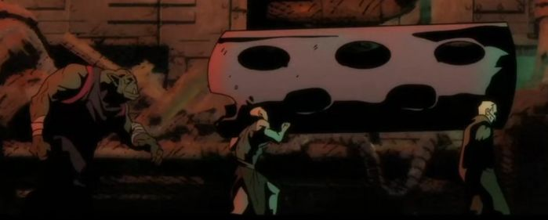

<!-- A0009-B0170 -->

原译文

Ork and human slaves 欧克与人类奴隶

**校订译文**

Ork and human slaves 欧克蛮人与人类奴隶

<!-- /A0009-B0170 -->

<!-- A0009-B0171 -->
**英文原文**

In some cases individual Orks are known to favour certain species of slaves over others. The Freebooter known as Uzgul da Magnificent admits to favouring Eldar (aka "Skrawnies") over humans. Their logic being that humans typically only survive for a short time and need replaced frequently. While Eldar slaves have a greater will to live and hidden strength for forced labor work. Uzgul would hold their spirit stones hostage as a cruel means of leverage used against them.

<!-- /A0009-B0171 -->

<!-- A0009-B0172 -->

原译文

在某些情况下，众所周知，欧克个体偏爱某些种族的奴隶。被称为宏伟者乌兹古尔的流寇承认偏爱灵族（又名“瘦子”）而非人类。他们的逻辑是，人类通常只能存活很短的时间，需要经常更换。虽然灵族奴隶有更大的生存意志和用于强制劳动的隐藏力量，但乌兹古尔会把他们的灵石作为人质，作为对他们使用的残酷手段。

**校订译文**

有些欧克对奴隶的种族有特别偏好。流寇“宏伟者”乌兹古尔就承认，相比人类，他更喜欢灵族——也就是他口中的“瘦子”。在他看来，人类奴隶通常活不了多久，必须频繁更换；灵族却有更顽强的求生意志，也有能够支撑繁重苦役的潜在力量。乌兹古尔还会扣押他们的灵石，以这种残酷手段胁迫他们服从。

<!-- /A0009-B0172 -->

<!-- A0009-B0173 图片 -->
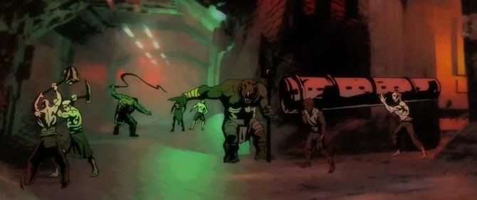

<!-- A0009-B0174 -->

原译文

Ork Runtherds and human slaves 欧克矮子牧者和人类奴隶

**校订译文**

Ork Runtherds and human slaves 欧克牧奴者与人类奴隶

<!-- /A0009-B0174 -->

<!-- A0009-B0175 -->
**英文原文**

Human slaves are often branded with a crude glyph, sometimes that of a specific Ork Klan. The marking is typically seared into the flesh of a slave's chest, back, shoulder, or neck.

<!-- /A0009-B0175 -->

<!-- A0009-B0176 -->

原译文

人类奴隶经常被烙印上粗糙的符号，有时是特定的欧克氏族的标志。这种标记通常会烙在奴隶的胸部、背部、肩部或颈部。

**校订译文**

人类奴隶身上常被烙上粗糙的符号，有时是某个欧克氏族的标记。烙印通常位于胸口、背部、肩膀或颈部。

<!-- /A0009-B0176 -->

<!-- A0009-B0177 -->
## Human Livestock 人类牲畜

<!-- /A0009-B0177 -->

<!-- A0009-B0178 -->
**英文原文**

Orks regularly torture and eat humans, sometimes cooking them beforehand. This can go from picking one to eat when they feel inclined to do so, into a form of industrial livestock production.

<!-- /A0009-B0178 -->

<!-- A0009-B0179 -->

原译文

欧克经常折磨和吃掉人类，有时会提前烹饪。这可以从在他们有意愿的时候挑选一个来吃，变成一种工业化的畜牧生产形式。

**校订译文**

欧克蛮人经常折磨并吃掉人类，有时还会先行烹煮。这种行为既可能只是兴起时随手挑一个人吃掉，也可能发展成工业化的牲畜生产。

<!-- /A0009-B0179 -->

<!-- A0009-B0180 -->
**英文原文**

When an Ork civilisation grows to a sufficient size and complexity while maintaining adequate resources, they might begin breeding imprisoned populations of humans for the sole purpose of being used as food. These human livestock are kept in complete darkness, the only time they see light is when water or food in brought to their enclosed, communal pens. Acting like animals, they simply grunt or make other noises if they attempt to communicate at all. Their teeth, nails, and hair are all removed, making them unable to harm themselves or one another.

<!-- /A0009-B0180 -->

<!-- A0009-B0181 -->

原译文

当一个欧克文明发展到足够的规模和复杂性，同时保持足够的资源时，他们可能会开始繁殖被监禁的人类族群，唯一的目的就是用作食物。这些人类牲畜被完全关在黑暗中，它们唯一能看到光的时间是当水或食物被带到它们封闭的公共围栏时。它们表现得像动物一样，如果它们试图交流，只会发出咕噜声或其他声音。他们的牙齿、指甲和头发都被拔掉了，使他们无法伤害自己或彼此。

**校订译文**

当一个欧克文明达到足够的规模与复杂程度，又拥有充足资源时，便可能开始繁育被囚禁的人类，唯一目的就是把他们当作食物。这些“人类牲畜”被关在全然黑暗的集体圈舍中，只有送水或食物时才能见到光。他们的行为如同动物，即使尝试交流，也只是发出低哼或其他声响。牙齿、指甲和毛发都被除去，使他们无法伤害自己或同伴。

<!-- /A0009-B0181 -->

<!-- A0009-B0182 -->
## Slavery and the Necrons 奴隶制与太空死灵

原题：Slavery and the Necrons 奴隶制和死灵

<!-- /A0009-B0182 -->

<!-- A0009-B0183 -->
**英文原文**

Necrons are known to implant Mindshackle Scarabs in individuals of flesh-races, binding them to the Necron master's will.

<!-- /A0009-B0183 -->

<!-- A0009-B0184 -->

原译文

众所周知，死灵会将锁心圣甲虫植入血肉种族的个体中，将其与死灵主人的意志绑定在一起。

**校订译文**

太空死灵会向血肉种族的个体体内植入锁心圣甲虫，强迫他们服从死灵主人的意志。

<!-- /A0009-B0184 -->

<!-- A0009-B0185 图片 -->
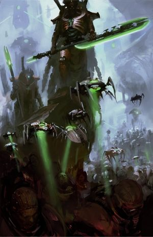

<!-- A0009-B0186 -->

原译文

Necrons of the Szarekhan Dynasty and human slaves 斯扎拉坎王朝的死灵和人类奴隶

**校订译文**

Necrons of the Szarekhan Dynasty and human slaves 斯扎拉坎王朝的太空死灵与人类奴隶

<!-- /A0009-B0186 -->

<!-- A0009-B0187 -->
**英文原文**

Some Necron opt to not cleanse of world of its Unclean, beings of flesh, and instead subjugate them. They are afforded none of the luxuries of commoners. They are kept as slaves, labouring to no purpose beyond the construction of endless monuments to their Necron master's glory. Sometimes large sectors of space keep billion of slaves, working tirelessly erecting enormous, geometrically arranged monuments. Entire systems have surrendered themselves as slaves to expanding Necron dynasties of indomitable and dark repute, such as the Sautekh Dynasty.

<!-- /A0009-B0187 -->

<!-- A0009-B0188 -->

原译文

一些死灵选择不清除世界上不洁的血肉生物，而是征服它们。他们没有普通的享受。他们被当作奴隶，除了为他们的死灵主人的荣耀建造无尽的纪念碑外，没有其他目的。有时，大片空间会容纳数十亿奴隶，他们不知疲倦地建造巨大的几何排列的纪念碑。整个星系都作为奴隶屈服于不断扩张的死灵王朝，如索泰克王朝，这些王朝有着不屈和黑暗的声誉。

**校订译文**

有些太空死灵不会把一颗星球上的“不洁者”——血肉生物——尽数清除，而是选择征服并奴役他们。这些奴隶无法享受普通民众的任何待遇，劳动的唯一目的，就是无休止地建造纪念碑，颂扬死灵主人的荣耀。有时，大片星域内会有数十亿奴隶不停地劳作，修筑按几何格局排列的巨大碑群。某些扩张中的死灵王朝以不可阻挡的力量和阴暗威名令人生畏，例如索泰克王朝；整个星系都曾向这样的王朝投降，自甘沦为奴隶。

<!-- /A0009-B0188 -->

<!-- A0009-B0189 -->
**英文原文**

Slave Mastabas are the crude shelters where the weak-fleshed races of the Old Ones live out their days. They must scrape together their own food, all whilst working endlessly. Typically, they are either being sent to create monuments to their masters or excavate the Necron's long-buried tombs and retrieve the sleeping Necrons.

<!-- /A0009-B0189 -->

<!-- A0009-B0190 -->

原译文

奴隶马斯塔巴是原始的避难所，古圣的虚弱血肉种族在这里度过他们的日子。他们必须自己拼凑食物，同时无休止地工作。通常，他们要么被派去为他们的主人建造纪念碑，要么挖掘被埋葬已久的死灵墓穴，找回休眠的死灵。

**校订译文**

奴隶马斯塔巴是简陋的栖身之所，古圣一方那些血肉脆弱的种族便在其中度过余生。他们一边不停劳作，一边还得自行设法凑够食物。通常，他们不是被派去为主人修建纪念碑，就是挖掘深埋已久的死灵墓穴，寻回沉睡其中的太空死灵。

<!-- /A0009-B0190 -->

<!-- A0009-B0191 -->
## Slavery and the Tyranids 奴隶制与泰伦虫族

原题：Slavery and the Tyranids 奴隶制与泰伦

<!-- /A0009-B0191 -->

<!-- A0009-B0192 -->
**英文原文**

The Tyranids have created bioengineered slave species, such as the Zoats. These hormone controlled slaves can act as both stocky ground combat-forms and high intellect ambassadors of the Hive Mind.

<!-- /A0009-B0192 -->

<!-- A0009-B0193 -->

原译文

泰伦创造了生物工程奴隶种族，如佐亚特。这些激素控制的奴隶既可以充当敦实的地面战斗形态，也可以充当虫巢思维的高智力大使。

**校订译文**

泰伦虫族曾通过生物工程创造奴隶种族，例如佐亚特。这些受激素控制的奴仆，既能充当体格敦实的地面战斗单位，也能凭借较高的智力，担任虫巢意志的使者。

**校注：** 本段将佐亚特描述为泰伦虫族创造的奴隶种族。此处按所给英文保留这一版本的说法，尚未核验其与其他年代资料的关系。

<!-- /A0009-B0193 -->

<!-- A0009-B0194 -->
## Notes 注释

<!-- /A0009-B0194 -->

<!-- A0009-B0195 -->
**英文原文**

The Imperium is rife with slavery, serfdom, indentured servitude, human trafficking and exploitation, and penal labour. While there is a range of variety and nuance to each, they all tend to consist of some kind of forced labour with low quality of living with little or no autonomy, being legally bound to their master or location.

<!-- /A0009-B0195 -->

<!-- A0009-B0196 -->

原译文

帝国充斥着奴隶制、农奴制、契约奴役、人口贩卖和剥削以及苦役。虽然每种都有各种各样的差异和细微差别，但他们往往都是某种生活质量低的强迫劳工，几乎没有自主权，在法律上受其主人或所在地的约束。

**校订译文**

奴隶制、农奴制、契约奴役、人口贩运与剥削，以及刑罚苦役，在帝国都十分普遍。这些制度虽各有形式和细节上的差异，却大多意味着某种强迫劳动：生活条件低劣，几乎没有自主权，并在法律上被束缚于特定主人或地点。

<!-- /A0009-B0196 -->

<!-- A0009-B0197 -->
**英文原文**

Regardless of the legal or cultural semantics, serfs are included in the sale of land they are attached to, the debt of indentured servants can be purchased by another, and penal labourers can be moved as desired.

<!-- /A0009-B0197 -->

<!-- A0009-B0198 -->

原译文

无论法律或文化语义如何，农奴都包括在他们所依附的土地的出售中，契约仆人的债务可以由另一个人购买，苦役劳工可以根据需要转移。

**校订译文**

不论法律与文化如何区分这些称谓，农奴会随其依附的土地一同出售，契约仆役所欠的债务可以转卖给他人，服刑劳工也能按管理者的意愿被调往别处。

<!-- /A0009-B0198 -->

<!-- A0009-B0199 -->
**英文原文**

The key aspect that sets a slave apart from a serf is that a slave is legal property and can be bought or sold individually. Other than being bought and sold as individuals, there isn't a meaningful difference between each, both having varying amount of rights (or lack there of) on a case-by-case basis. As all these menial societal roles are as menials performing forced labour with little to no self-determination or autonomy to do otherwise. Their living conditions being at the lowest rungs of societal norms.

<!-- /A0009-B0199 -->

<!-- A0009-B0200 -->

原译文

奴隶与农奴的区别在于，奴隶是合法财产，可以单独买卖。除了作为个人进行买卖外，两者之间没有实质性的区别，两者都有不同程度的权利（或缺乏权利）。因为所有这些卑微的社会角色都是从事强迫劳动的卑微者，几乎没有自决权或自主权。他们的生活条件处于社会标准的最低水平。

**校订译文**

奴隶与农奴的关键区别，是奴隶在法律上被视为财产，可以作为个人单独买卖。除这一点外，本文所述的两类劳役者并无实质差别；他们各自拥有多少权利，或是否拥有权利，都取决于具体情形。这些底层群体同样被迫劳动，几乎无权决定自己的命运，也没有选择其他生活的自由；其生活条件处于社会最底层。

**校注：** 此处为本文对战锤设定中各类劳役制度的概括，不据此扩写现实历史结论。

<!-- /A0009-B0200 -->

<!-- A0009-B0201 -->
**英文原文**

Helot is another common term used for various indentured drudge classes and Space Marine Chapter Serfs. The term Helots is typically used to reference a subjugated group of people forced into servitude. The Helots of ancient Greece comprised the majority of the populations of Laconia and Messenia, ruled by Sparta, and who's forced labour supported the citizens of Sparta.

<!-- /A0009-B0201 -->

<!-- A0009-B0202 -->

原译文

侍从是另一个常用术语，用于各种契约苦工阶级和星际战士农奴。侍从一词通常用于指代被迫沦为奴隶的被征服群体。古希腊的侍从由斯巴达统治的拉科尼亚和美塞尼亚的大部分人口组成，他们的强迫劳动支持了斯巴达的公民。

**校订译文**

Helot 是另一个常见称谓，可指各种受契约束缚的苦役阶层，也用于称呼星际战士战团的农奴。它通常指被征服后遭强迫役使的群体。这个词源自古希腊的希洛人：他们构成了拉科尼亚与美塞尼亚人口的大多数，受斯巴达统治，以强制劳动供养斯巴达公民。

<!-- /A0009-B0202 -->

本篇核心术语与暂定项

以下列出本篇出现的英文原形及核心术语表用词。同形词可能指不同对象，具体词义以本篇正文和校注为准；单复数、别名和仅见于图注的名称可能尚未列入。完整候选见[术语表](../../术语表/双语术语候选.csv)。

| 英文 | 采用中文 | 状态 |
| --- | --- | --- |
| Space Marines | 星际战士 | 官方已核对 |
| Adeptus Mechanicus | 机械修会 | 官方已核对 |
| Chaos Space Marines | 混沌星际战士 | 官方已核对 |
| Death Guard | 死亡守卫 | 官方已核对 |
| Thousand Sons | 千子 | 官方已核对 |
| Aeldari | 艾达灵族 | 官方已核对 |
| Eldar | 灵族 | 暂定·语境区分 |
| Drukhari | 黑暗灵族 | 官方已核对 |
| Dark Eldar | 黑暗灵族 | 暂定·旧称对应 |
| Tyranids | 泰伦虫族 | 官方已核对 |
| Necrons | 太空死灵 | 官方已核对 |
| Orks | 欧克蛮人 | 官方已核对 |
| Warp | 亚空间 | 官方已核对 |
| Imperium of Man | 人类帝国 | 官方已核对 |
| Imperium | 帝国 | 暂定·简称 |
| Imperial Navy | 帝国海军 | 暂定 |
| Mechanicum | 机械教 | 暂定·历史称谓 |
| Tech-Priest | 技术祭司 | 官方已核对 |
| Dark Mechanicum | 黑暗机械教 | 暂定·官方待核 |
| Servitor | 机仆 | 暂定 |
| Nurgle | 纳垢 | 官方已核对 |
| Commorragh | 科摩罗 | 官方已核对 |
| Craftworld | 方舟世界 | 官方已核对 |
| Old Ones | 古圣 | 暂定 |
| Hive Mind | 虫巢意志 | 官方已核对 |
| Equipment | 装备 | 编辑用语已统一 |
| Administratum | 内政部 | 暂定 |
| Adeptus Administratum | 内政部 | 暂定 |
| Eye of Terror | 恐惧之眼 | 官方已核对 |
| Enslaver | 奴役者 | 暂定 |
| Rogue Trader | 行商浪人 | 暂定 |
| Emperor | 帝皇 | 官方已核对 |
| Ecclesiarchy | 国教会 | 暂定 |
| Slavery | 奴隶制 | 编辑用语已统一 |
| Helot | 农奴；希洛人（古希腊语境） | 语境定译·官方待核 |
| Battle Barge | 战斗驳船 | 暂定·官方待核 |
| Forge World | 铸造世界 | 暂定·官方待核 |
| Abhuman | 亚人 | 暂定·官方待核 |
| Mutant | 变种人 | 暂定·官方待核 |
| Underlord Hurango | 下巢领主胡兰戈 | 暂定·官方待核 |
| Necromunda | 涅克罗蒙达 | 暂定·官方待核 |
| Slave Guild | 奴隶行会 | 暂定·官方待核 |
| Age of Apostasy | 叛教时代 | 暂定·官方待核 |
| Goge Vandire | 高戈·范迪尔 | 暂定·官方待核 |
| Schola Progenium | 忠嗣学院 | 暂定·官方待核 |
| Frateris Templar | 圣堂兄弟会 | 暂定·官方待核 |
| Brides of the Emperor | 帝皇新娘 | 暂定·官方待核 |
| Navis Imperialis | 帝国海军 | 暂定·官方待核 |
| Alecto | 阿勒克图 | 暂定·官方待核 |
| Ark Mechanicus | 机械方舟 | 暂定·官方待核 |
| Tutors | 导师组织 | 暂定·官方待核 |
| House Goliath | 歌利亚家族 | 暂定·官方待核 |
| Goliath | 歌利亚 | 暂定·官方待核 |
| House Van Saar | 凡·萨尔家族 | 暂定·官方待核 |
| House Escher | 埃舍尔家族 | 暂定·官方待核 |
| Magos Biologis | 生物贤者 | 暂定·官方待核 |
| Lore Mechanicus | 机械教律 | 暂定·官方待核 |
| Word Bearers | 怀言者 | 暂定·官方待核 |
| Daemon Prince | 恶魔亲王 | 官方已核对 |
| Black Legion | 黑色军团 | 暂定·官方待核 |
| Emperor's Children | 帝皇之子 | 官方已核对 |
| Slaanesh | 色孽 | 官方已核对 |
| Kakophoni | 卡科弗尼噪音部队 | 暂定·官方待核 |
| Legion Wars | 军团战争 | 暂定·官方待核 |
| Lords of Silence | 寂静领主 | 暂定·官方待核 |
| Unbroken | 不屈者 | 暂定·官方待核 |
| Unchanged | 未变者 | 暂定·官方待核 |
| Iron Warriors | 钢铁勇士 | 暂定·官方待核 |
| Night Lords | 午夜领主 | 暂定·官方待核 |
| Planet of Sorcerers | 巫师之星 | 暂定·官方待核 |
| Chaos Spawn | 混沌魔物 | 官方已核对 |
| Faenroc | 法恩罗克 | 暂定·官方待核 |
| Asdrubael Vect | 阿斯杜巴尔·维克特 | 暂定·官方待核 |
| Wych | 巫灵 | 官方已核对 |
| Haemonculus | 血伶人 | 官方已核对 |
| Aelindrach | 艾林德拉赫 | 暂定·官方待核 |
| Wych Cult | 巫灵教团 | 官方词根参考·组织全称待核 |
| Asuryani | 阿苏焉尼 | 暂定·官方待核 |
| Exodite | 蛮荒灵族 | 暂定·官方待核 |
| Corsair | 海盗 | 暂定·官方待核 |
| Gretchin | 屁精 | 官方已核对 |
| Snotling | 鼻涕精 | 暂定·官方待核 |
| Runtz | 小崽子 | 暂定·官方待核 |
| Rigorous | 严峻号 | 暂定·官方待核 |
| teef | 牙币 | 暂定·官方待核 |
| Freebooter | 流寇 | 暂定·官方待核 |
| Uzgul da Magnificent | 宏伟者乌兹古尔 | 暂定·官方待核 |
| Sautekh Dynasty | 索泰克王朝 | 暂定·官方待核 |
| Navigators | 导航员 | 官方已核对 |
| Sector | 星区 | 暂定·官方待核 |
| Penal Worlds | 刑罚世界 | 暂定·官方待核 |
| Tech | 技术语 | 暂定·官方待核 |
| Master | 导师（审判庭职衔）／舰务官（舰员职务） | 语境定译·官方待核 |
| Ancient | 旗手 | 官方已核对 |
| Adept | 帝国任职者（广义）／文吏（行政语境） | 语境定译·官方待核 |
| Overseer | 监督者 | 暂定·官方待核 |
| Space Marine | 星际战士 | 暂定·官方待核 |
| Chapter | 战团 | 暂定·官方待核 |
| Chapter serfs | 战团农奴 | 暂定·官方待核 |
| Mortal | 凡人 | 暂定·官方待核 |
| Servile | 卑贱者 | 暂定·官方待核 |
| Powers | 能天使 | 暂定·官方待核 |
| Xenos | 异形 | 暂定·官方待核 |
| Maiden Worlds | 少女世界 | 暂定·官方待核 |
| Wych Cults | 巫灵教团 | 官方词根参考·组织全称待核 |
| Mandrakes | 曼德拉 | 官方已核对 |
| Wyches | 巫灵 | 官方已核对 |
| Boyz | 蛮人小子 | 官方已核对 |
| Mekboyz | 技师小子 | 暂定·官方待核 |
| Imperialis | 帝国徽记 | 暂定·官方待核 |
| Brand | 布兰德 | 暂定·官方待核 |
| Branded | 烙印者 | 暂定·官方待核 |
| Scribes | 抄写员 | 暂定·官方待核 |
| Menials | 杂役 | 暂定·官方待核 |
| Fealty | 忠诚 | 暂定·官方待核 |
| The Key | 钥匙 | 暂定·官方待核 |
| Vat-born | 缸裔 | 暂定·官方待核 |
| Bear | 熊 | 暂定·官方待核 |
| The Dark | 《黑暗》 | 暂定·官方待核 |
| The Blood | 鲜血 | 暂定·官方待核 |
| Eye of Terror Slave Wars | 恐惧之眼奴隶战争 | 暂定·官方待核 |
| Kin | 炉裔 | 暂定·官方待核 |
| Hive City | 巢都城市 | 暂定·官方待核 |
| Feral World | 蛮荒世界 | 暂定·官方待核 |
| Touched | 受触者 | 暂定·官方待核 |
| The Lords of Silence | 寂静领主 | 暂定·官方待核 |
| Locator Beacon | 定位信标 | 暂定·官方待核 |

