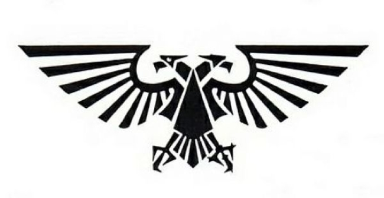
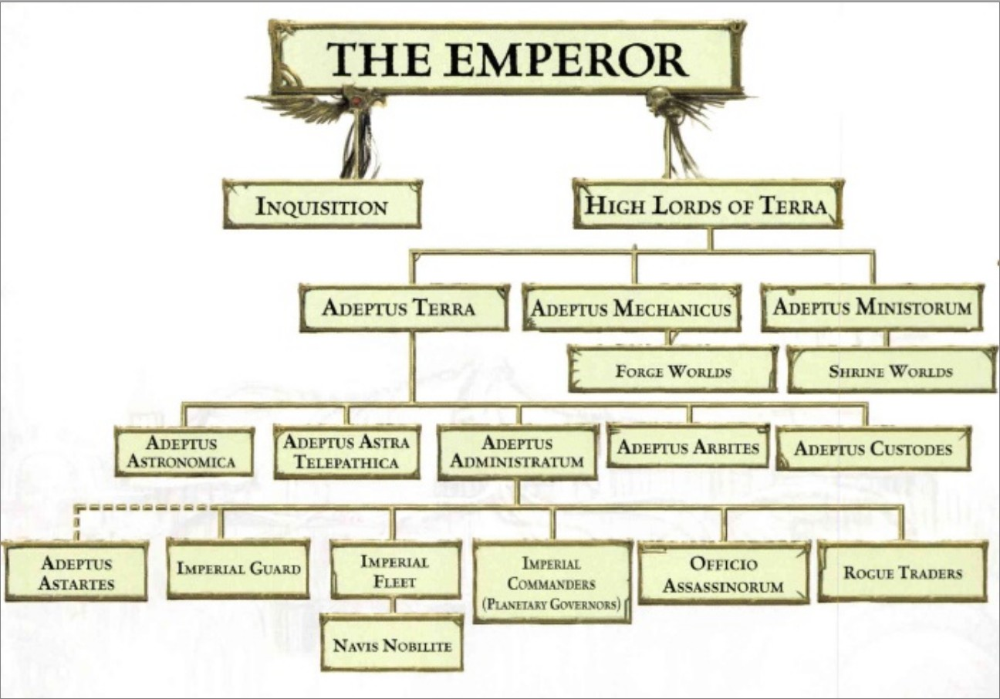
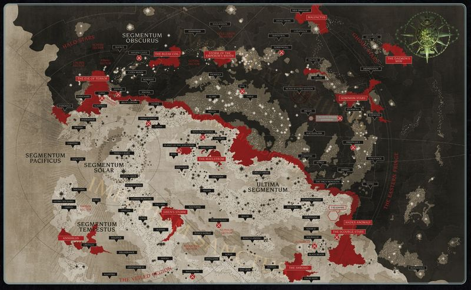
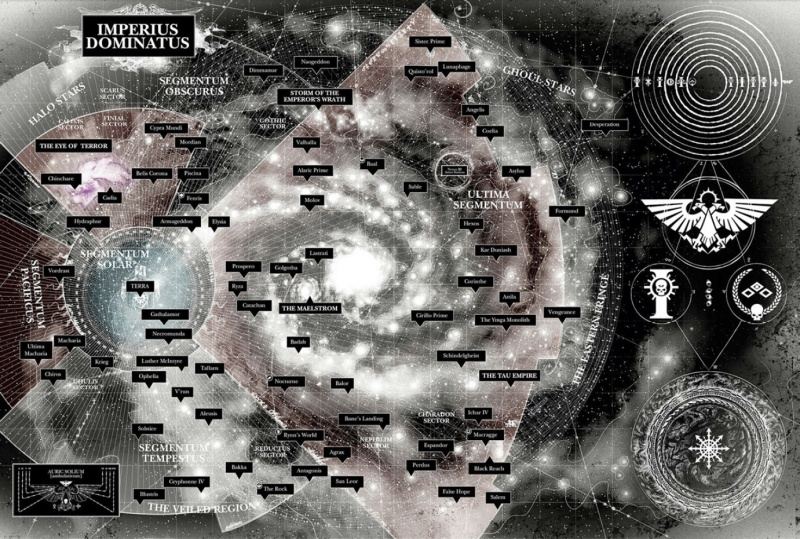

# 0018 帝国 Imperium

精校状态：中文行文已逐段精校，部分术语仍为暂定

分类：通用概念 / 帝国 Imperium

原文来源：https://www.bilibili.com/opus/1080495758876082198

原作者：帝国神选罐头

原文时间：编辑于 2025年12月07日 13:28

[返回分类目录](目录.md) · [全书目录](../../目录.md)

<!-- A0018-B0001 -->
**英文原文**

The Imperium of Man, also occasionally called the Imperium of Mankind and simply the Imperium, is the galactic empire under which the majority of humanity is united. The founder and nominal ruler of the Imperium is the god-like Emperor of Mankind, the most powerful human psyker ever known.

<!-- /A0018-B0001 -->

<!-- A0018-B0002 -->

原译文

人类帝国，有时也称为人类帝国，简称为帝国，是大多数人类团结在一起的银河帝国。帝国的创始人和名义统治者是像神一样的人类帝皇，是有史以来最强大的人类灵能者。

**校订译文**

人类帝国（Imperium of Man，亦作 Imperium of Mankind），通常简称帝国，是统合了绝大多数人类的银河帝国。其建立者与名义上的统治者，是被奉若神明的人类帝皇——迄今已知最强大的人类灵能者。

<!-- /A0018-B0002 -->

<!-- A0018-B0003 图片 -->

<!-- A0018-B0004 -->

原译文

Imperium of Man symbol 人类帝国标志

**校订译文**

Imperium of Man symbol 人类帝国标志

<!-- /A0018-B0004 -->

<!-- A0018-B0005 -->
**英文原文**

Capital:Terra

<!-- /A0018-B0005 -->

<!-- A0018-B0006 -->

原译文

首都：泰拉

**校订译文**

首都：泰拉

<!-- /A0018-B0006 -->

<!-- A0018-B0007 -->
**英文原文**

Official languages:Low Gothic, High Gothic, Lingua-technis

<!-- /A0018-B0007 -->

<!-- A0018-B0008 -->

原译文

官方语言：低哥特语、高哥特语、技术之语

**校订译文**

官方语言：低哥特语、高哥特语、技术之语

<!-- /A0018-B0008 -->

<!-- A0018-B0009 -->
**英文原文**

Major Species:Human, Abhuman species

<!-- /A0018-B0009 -->

<!-- A0018-B0010 -->

原译文

主要物种：人类、亚人物种

**校订译文**

主要物种：人类及各类亚人。

<!-- /A0018-B0010 -->

<!-- A0018-B0011 -->
**英文原文**

Type of Government:Absolute Monarchy (Pre-Heresy),Theocratic Oligarchy (Post-Heresy),Theocratic Autocracy (Era Indomitus)

<!-- /A0018-B0011 -->

<!-- A0018-B0012 -->

原译文

政府类型：绝对君主制（叛乱前），神权寡头制（叛乱后），神权专制（不屈前）

**校订译文**

政体：绝对君主制（荷鲁斯之乱前）、神权寡头制（荷鲁斯之乱后）、神权专制（不屈时代）。

<!-- /A0018-B0012 -->

<!-- A0018-B0013 -->
**英文原文**

Head of State:Emperor of Mankind

<!-- /A0018-B0013 -->

<!-- A0018-B0014 -->

原译文

国家元首：人类帝皇

**校订译文**

国家元首：人类帝皇

<!-- /A0018-B0014 -->

<!-- A0018-B0015 -->
**英文原文**

Head of Government:Imperial Regent (currently Roboute Guilliman)

<!-- /A0018-B0015 -->

<!-- A0018-B0016 -->

原译文

政府首脑：帝国摄政（现为罗伯特·基里曼）

**校订译文**

政府首脑：帝国摄政，现任为罗保特·基里曼。

**校注：** 本篇“现任”“目前”“近来”等时间词均对应原条目记述时点；本次校订不据此断言 2026 年最新出版设定。

<!-- /A0018-B0016 -->

<!-- A0018-B0017 -->
**英文原文**

Governing body:Senatorum Imperialis(High Lords of Terra)

<!-- /A0018-B0017 -->

<!-- A0018-B0018 -->

原译文

管理机构：帝国参议院（泰拉高领主）

**校订译文**

统治机构：帝国参议院，即由泰拉高领主组成的机构。

<!-- /A0018-B0018 -->

<!-- A0018-B0019 -->
**英文原文**

State religion(s):Imperial Cult,Cult Mechanicus

<!-- /A0018-B0019 -->

<!-- A0018-B0020 -->

原译文

国教：帝国教派、机械教

**校订译文**

国家宗教：帝皇信仰、机械教派。

<!-- /A0018-B0020 -->

<!-- A0018-B0021 -->
**英文原文**

Primary Military forces:Astra Militarum,Imperial Navy,Space Marines,Collegia Titanica,Sisters of Battle,Legiones Skitarii,Questor Imperialis,Planetary Defense Forces

<!-- /A0018-B0021 -->

<!-- A0018-B0022 -->

原译文

主要军事力量：星界军、帝国海军、星际战士、泰坦修会、战斗修女、护教军团、帝国行刑官、行星防御部队

**校订译文**

主要军事力量：星界军、帝国海军、星际战士、泰坦修会、战斗修女、护教军团、帝国骑士、行星防卫军。

<!-- /A0018-B0022 -->

<!-- A0018-B0023 -->
**英文原文**

Primary Internal Security forces:Adeptus Arbites,Inquisition,Adeptus Custodes,Sisters of Silence,Enforcers

<!-- /A0018-B0023 -->

<!-- A0018-B0024 -->

原译文

主要内部安全部队：法务部、审判庭、禁军、寂静修女、执法者

**校订译文**

主要内部安全力量：法务部、审判庭、帝皇禁军、寂静修女及地方执法者。

<!-- /A0018-B0024 -->

<!-- A0018-B0025 -->
**英文原文**

The Imperium is the largest and most powerful political entity in the galaxy, consisting of at least a million worlds which are dispersed across most of the galaxy. An Imperial planet might be separated from its closest neighbour by hundreds or thousands of light years. As a stellar empire, the size of the Imperium cannot be measured in terms of contiguous territory, but only in the number of planetary systems in its control. The Imperium controls countless worlds, somewhere between a million, millions, a billion or even billions in total. The overall number of planets has never been exactly determined, entire departments of the Administratum are devoted to cataloguing every controlled world, a task without end, due to the constantly changing nature of the domain. New planets are constantly discovered, conquered or colonised while old ones are lost. The Imperium also controls untold millions of stars.

<!-- /A0018-B0025 -->

<!-- A0018-B0026 -->

原译文

帝国是银河系中最大、最强大的政治实体，由至少一百万个分散在银河系大部分地区的世界组成。一颗帝国行星可能与其最近的邻居相隔数百或数千光年。作为一个星际帝国，帝国的规模不能以连续的领土来衡量，而只能以其控制的星系的数量来衡量。帝国控制着无数个世界，总数在一百万、数百万、十亿甚至数十亿之间。行星的总数从未被准确确定过，由于该领域不断变化的性质，内务部的整个部门都致力于对每个受控世界进行编目，这是一项没有尽头的任务。新的行星不断被发现、征服或殖民，而旧的行星则消失了。帝国仍控制着无数颗星辰。

**校订译文**

帝国是银河系中规模最大、实力最强的政治实体，至少拥有一百万个世界，分布范围覆盖银河的大部分区域。一颗帝国行星与最近的帝国邻星之间，也可能相隔数百乃至数千光年。因此，这个星际国家的规模无法按连成一片的疆域衡量，只能以受其控制的行星系统数量估算。帝国究竟掌握多少世界，从未有过准确统计；原文列举的估计从一百万、数百万，一直到十亿乃至数十亿不等。内政部有专门的部门为每个受控世界编目，但帝国疆域不断变化，使这项工作永无尽头：新的行星不断被发现、征服或殖民，原有世界也不断丢失。帝国还控制着不知多少百万颗恒星。

**校注：** 原文对帝国世界数量列举了从百万到十亿级的不同说法。中文保留其估计范围，不将其当作已核实的统一数字。

<!-- /A0018-B0026 -->

<!-- A0018-B0027 -->
**英文原文**

Several aliens and forces - Chaos, Tyranids, Eldar, Dark Eldar, Orks, Tau, Necrons - challenge the supremacy of the Imperium. From within, the Imperium is threatened more insidiously by rebellion, mutation, rogue psykers, and subversive cults. Without the protection of the Imperium, mankind would fall prey to the countless perils that threaten it.

<!-- /A0018-B0027 -->

<!-- A0018-B0028 -->

原译文

几个外星人和力量 — 混沌、泰伦、灵族、黑暗灵族、兽人、钛、死灵 — 挑战了帝国的霸权。从内部来看，帝国受到叛乱、变异、非法灵能者和颠覆性邪教的更阴险的威胁。没有帝国的保护，人类将成为威胁它的无数危险的牺牲品。

**校订译文**

混沌、泰伦虫族、灵族、黑暗灵族、欧克蛮人、钛族和太空死灵等势力，都在挑战帝国的霸权。与此同时，叛乱、变异、非法灵能者与颠覆性邪教，又从内部构成更隐蔽的威胁。没有帝国的保护，人类便会沦为这无数危险的猎物。

<!-- /A0018-B0028 -->

<!-- A0018-B0029 -->
## History of the Imperium 帝国的历史

<!-- /A0018-B0029 -->

<!-- A0018-B0030 -->
**英文原文**

The Imperium was founded by the Emperor, also called The Immortal Emperor, God-Emperor, and the Master of Mankind, at the end of the Age of Strife — a very long period of anarchy, war, and destructive regression which brought humanity to the brink of destruction and reversed the technological progression made during the Dark Age of Technology. In the Unification Wars, the Emperor led his proto-Astartes known as Thunder Warriors to victory in unifying Terra for the first time in millennia.

<!-- /A0018-B0030 -->

<!-- A0018-B0031 -->

原译文

帝国是由帝皇建立的，也被称为不朽帝皇、神皇和人类之主，在纷争时代结束时 — 这是一个非常长的无政府状态、战争和破坏性的倒退时期，将人类带到了毁灭的边缘，扭转了黑暗技术时代取得的技术进步。在统一战争中，帝皇带领他的原型阿斯塔特（被称为雷霆战士）在数千年来首次统一了泰拉。

**校订译文**

帝国由帝皇在纷争时代结束时建立。帝皇也被称为不朽帝皇、神皇与人类之主。纷争时代是一段漫长的失序、战争与衰退时期，人类几乎走到毁灭边缘，黑暗科技时代取得的技术成果也大幅倒退。在统一战争中，帝皇率领阿斯塔特的早期原型——雷霆战士——赢得胜利，使分裂数千年的泰拉再度统一。

<!-- /A0018-B0031 -->

<!-- A0018-B0032 -->
**英文原文**

As the Warp storms of the Age of Strife subsided, after having secured the scientific posts and spacedocks of Luna, along with the factories and scientists on Mars, the Emperor began to unite mankind under his rule. A vast navy was built, with which his armies undertook the Great Crusade, which lasted for about two centuries. During this two hundred year-long military campaign, the Emperor employed his most potent military units, the Space Marine Legions, led by their leaders, the Primarchs. These, combined with the might of the Imperial Army (which was later separated into the Imperial Guard and the Imperial Navy), Custodian Guard, Sisters of Silence, and Martian Mechanicum forces that included the Collegia Titanica and Legio Cybernetica saw thousands of human worlds brought together under the Imperium. The Great Crusade ended with the corruption and treachery of the Primarch Horus, the instigator of the Horus Heresy.

<!-- /A0018-B0032 -->

<!-- A0018-B0033 -->

原译文

随着纷争时代的亚空间风暴消退，在确保了月球的科学哨所和太空码头以及火星上的工厂和科学家之后，帝皇开始在他的统治下团结人类。建立了一支庞大的海军，他的军队用这支海军进行了持续了大约两个世纪的大远征。在这场长达两百年的军事行动中，帝皇动用了他最强大的军事部队 — 星际战士，由其领导人 — 原体领导。这些，再加上帝国军队（后来分为帝国卫队和帝国海军）、禁军、寂静修女和火星机械教部队的力量，包括泰坦修会和智控军团，看到了数千个人类世界在帝国统治下聚集在一起。大远征以原体荷鲁斯的腐化和背叛而告终，原体荷鲁斯是荷鲁斯叛乱的煽动者。

**校订译文**

随着纷争时代的亚空间风暴消退，帝皇先后掌握了月球上的科研据点与太空船坞，以及火星的工厂和科学家，继而开始将人类统一于自己的统治之下。他建造了庞大的海军，运载军队展开持续约两个世纪的大远征。在这场长达两百年的军事行动中，帝皇最强大的主力是由各位原体统率的星际战士军团。与他们并肩作战的，还有帝国军——后来分为帝国卫队与帝国海军——以及帝皇禁军、寂静修女和火星机械教的部队，后者包括泰坦修会与智控军团。这些力量将数千个人类世界纳入帝国。最终，原体荷鲁斯堕落并背叛帝皇，掀起荷鲁斯之乱，大远征也就此结束。

**校注：** Imperial Army 沿现稿定译帝国军，原稿其他篇亦译帝国陆军；当时尚包含后来独立的帝国海军，不能将整个组织限为陆军。

<!-- /A0018-B0033 -->

<!-- A0018-B0034 -->
**英文原文**

The rebellion was fought across the galaxy. Horus, seeking to achieve a swift and decisive victory, led most of the traitor forces in a direct strike at the capital of humanity, in the Battle of Terra. In the final decisive battle between the Emperor and the Arch-Traitor, Horus was slain, leading to the breakup of the rebellion and the exile of the traitors to the Eye of Terror. However the Master of Mankind was himself mortally wounded. According to his instructions he was placed on the life-preserving Golden Throne, where, for nearly ten thousand years, he has remained. Though physically a carcass incapable of movement or communication, his omnipotent will extends across the million worlds of the Imperium, beaming the psychic energy of the Astronomican, soul-binding psychic humans and struggling against the daemons of the Warp. He endures by his undying will, and by the sustenance that only the souls of sacrificial psykers can provide. By the numberless masses of humanity he is worshiped as a god.

<!-- /A0018-B0034 -->

<!-- A0018-B0035 -->

原译文

叛乱在整个银河系进行。荷鲁斯试图取得迅速而决定性的胜利，在泰拉之战中领导大多数叛徒部队直接袭击了人类的首都。在帝皇和大叛徒之间的最后决定性战斗中，荷鲁斯被杀，导致叛乱破裂，叛徒被流放到恐惧之眼。然而，人类之主自己也受了致命的伤。根据他的指示，他被安置在保存生命的黄金王座上，在那里呆了近一万年。虽然身体上是一具无法移动或交流的尸体，但他的全能意志将延伸到帝国的数百万个世界，散发出星炬的灵能能量，灵魂结合的灵能者，并与亚空间的恶魔作斗争。他以自己永恒的意志和只有牺牲的灵能者的灵魂才能提供的维持来忍受。无数人把他当作神来崇拜。

**校订译文**

叛乱蔓延至整个银河。为迅速取得决定性胜利，荷鲁斯率叛军主力直扑人类首都，发动泰拉之战。在最后的决战中，帝皇杀死了这位大叛徒；叛乱随之瓦解，叛徒退入恐惧之眼。但人类之主也受到致命重创，依照自己的指示，被安置在维系生命的黄金王座上，此后近一万年未曾离开。尽管他的肉身已形同无法移动或交流的尸骸，其强大意志仍遍及帝国的百万世界：为星炬投射灵能，与人类灵能者缔结灵魂绑定，并同亚空间恶魔抗争。他凭不灭的意志，以及牺牲灵能者的灵魂所提供的滋养，勉力维持至今。无数人类将他奉为神明。

<!-- /A0018-B0035 -->

<!-- A0018-B0036 -->
**英文原文**

The immediate period following the Heresy, The Scouring and Age of Rebirth, saw the Imperium slowly rebuild its might and control over the domain of man. It also saw the last of the Emperor's loyal Primarchs either fall in battle, become gravely wounded, or disappear altogether. Nonetheless in the subsequent age known as The Forging, the Imperium enjoyed a period of growth and expansion. The Imperium's period of relative peace ended abruptly in mid-M32 when an Ork Warboss known only as The Beast launched the greatest Waaagh! ever encountered. The Beast was only halted at great cost by the Adeptus Astartes.

<!-- /A0018-B0036 -->

<!-- A0018-B0037 -->

原译文

叛乱之后的一段时间，即大清洗和重生时代，帝国慢慢重建了它的力量和对人类领域的控制。它还看到了帝皇最后一位忠诚的原体要么在战斗中倒下，要么受重伤，要么完全消失。尽管如此，在随后被称为大重铸的时代，帝国经历了一段成长和扩张的时期。帝国的相对和平时期在M32中期突然结束，当时一个只被称为野兽的欧克战争头目发动了曾经遇到过的最大的Waaagh！。野兽被阿斯塔特修会以巨大的代价阻止了。

**校订译文**

荷鲁斯之乱后的大清洗与重生时代，帝国逐步恢复力量，重建对人类疆域的控制。也正是在这段时期，帝皇麾下仍在活动的忠诚派原体相继战死、身受重伤，或彻底失踪。尽管如此，随后被称为“大锻造”的时代，仍是帝国恢复增长、向外扩张的时期。这段相对和平的岁月在第 32 千年中叶戛然而止：一个仅以“野兽”之名为人所知的欧克战争头目，发动了帝国此前从未见过的最大规模 Waaagh!。阿斯塔特修会付出惨重代价，才最终阻止了他。

**校注：** 已核同一人物、组织、型号或事件，与全书核心术语及后续专篇统一；原译保留对照。

<!-- /A0018-B0037 -->

<!-- A0018-B0038 -->
**英文原文**

The Imperium saw further periods of severe instability throughout M35 and M36, experiencing civil wars during the Nova Terra Interregnum and Age of Apostasy. This period saw the worst internal violence since the Heresy. Following the Age of Apostasy, the Imperium was again heavily reorganized and many heretics purged in the Age of Redemption. This new fervor culminated in a series of major Crusades and Wars of Faith most notably the Redemption Crusades and Macharian Crusade. However, while successful, this period exhausted the Imperium's military forces and in The Waning, many worlds were lost to xenos and Chaos attacks as well as internal rebellion.

<!-- /A0018-B0038 -->

<!-- A0018-B0039 -->

原译文

帝国在M35和M36中经历了进一步的严重不稳定时期，在新泰拉真空期和叛教时代经历了内战。这一时期发生了自叛乱以来最严重的内战事件。叛教时代之后，帝国再次进行了大规模重组，许多异端在救赎时代被清除。这种新的热忱在一系列重大的远征和信仰战争中达到了顶峰，最著名的是救赎远征和马卡里乌斯远征。然而，尽管取得了成功，但这一时期耗尽了帝国的军事力量，在大衰退中，许多世界因异型和混沌的攻击以及内部叛乱而消失。

**校订译文**

第 35 至第 36 千年，帝国再次陷入严重动荡，在新泰拉空位期和叛教时代爆发内战。这是荷鲁斯之乱后最惨烈的一轮内部冲突。叛教时代结束后，帝国又经历大规模重组，并在救赎时代清洗了大量异端。新一轮宗教热忱推动了一系列大规模远征与信仰战争，其中以救赎远征和马卡里安远征最为著名。然而，这些战争虽取得胜利，也耗尽了帝国的军力。随后在“大衰落”时期，许多世界在异形、混沌进攻或内部叛乱中脱离帝国掌控。

**校注：** 已核同一人物、组织、型号或事件，与全书核心术语及后续专篇统一；原译保留对照。 已核同一人物、组织、型号或事件，与全书核心术语及后续专篇统一；原译保留对照。

<!-- /A0018-B0039 -->

<!-- A0018-B0040 -->
**英文原文**

The effects of The Waning ultimately culminated in late M41, known as the Time of Ending. Here the exhausted Imperium not only faced rejuvenated old threats, but also terrifying new enemies like the Tyranids and Necrons as well new smaller but dynamic alien empires such as the Tau, Noisome Reek, and Ulumeathic League. Beset on all sides by heresy and alien invasion, the future of the Imperium seems bleak. The Black Crusade saw both the destruction of Cadia and the formation of the Great Rift, which has effectively split the Imperium in two. However some hope has been renewed thanks to the rebirth of the Primarch Roboute Guilliman, who has launched the Indomitus Crusade to reclaim worlds lost within the Dark Imperium.

<!-- /A0018-B0040 -->

<!-- A0018-B0041 -->

原译文

大衰退的影响最终在M41晚期达到顶峰，即所谓的“终焉之刻”。在这里，精疲力尽的帝国不仅面临着复兴的旧威胁，还面临着可怕的新敌人，如泰伦和死灵，以及新的较小但充满活力的外星帝国，如钛、瑞克世界编织者和乌卢梅亚蒂克联盟。受到异端和外星人入侵的围攻，帝国的未来似乎很黯淡。黑色远征摧毁了卡迪亚，并形成了大大裂隙，实际上将帝国一分为二。 然而，随着原体罗伯特·基里曼的重生，一些希望得以重燃。他发起了不屈远征，旨在收复在黑暗帝国时期沦陷的世界。

**校订译文**

大衰落的影响在第 41 千年晚期达到顶点，这段时期被称为“终结之刻”。疲惫不堪的帝国既要应对卷土重来的旧敌，也要面对泰伦虫族、太空死灵等可怕的新威胁，以及钛帝国、恶臭瑞克和乌卢梅亚蒂克联盟等规模较小、却生机勃勃的新兴异形势力。异端与异形入侵四面夹击，帝国的前景黯淡无光。黑色远征带来了卡迪亚的毁灭与大裂隙的形成，事实上将帝国一分为二。不过，原体罗保特·基里曼的苏醒又带来了一线希望。他发动不屈远征，试图夺回黑暗帝国境内失陷的世界。

**校注：** Noisome Reek 暂译“恶臭瑞克”；原译中的“世界编织者”没有对应英文，不纳入定译。 已核同一人物、组织、型号或事件，与全书核心术语及后续专篇统一；原译保留对照。 已核同一人物、组织、型号或事件，与全书核心术语及后续专篇统一；原译保留对照。

<!-- /A0018-B0041 -->

<!-- A0018-B0042 -->
### Warzones 战区

<!-- /A0018-B0042 -->

<!-- A0018-B0043 -->
**英文原文**

The Imperium is an entity beset by constant war. However a number of current engagements stand out as particularly fearsome. These include:

<!-- /A0018-B0043 -->

<!-- A0018-B0044 -->

原译文

帝国是一个被持续战争所困扰的实体。然而，目前的一些交战尤其可怕。这些包括：

**校订译文**

帝国始终深陷战争。以下几处战事尤其严峻：

<!-- /A0018-B0044 -->

<!-- A0018-B0045 -->
**英文原文**

War Zone Cadia - Though Cadia itself was smashed at the end of the 13th Black Crusade, Imperial forces throughout the Cadian Sector continue to attempt to hold back the tides of Chaos.

<!-- /A0018-B0045 -->

<!-- A0018-B0046 -->

原译文

卡迪亚战区 - 尽管卡迪亚本身在第13次黑色远征结束时被摧毁，但整个卡迪亚地区的帝国军队继续试图阻止混沌的浪潮。

**校订译文**

卡迪亚战区——卡迪亚本身虽在第十三次黑色远征结束时遭到毁灭，卡迪亚星区各地的帝国军仍在奋力遏制混沌浪潮。

<!-- /A0018-B0046 -->

<!-- A0018-B0047 -->
**英文原文**

War Zone Nachmund including the War of Beasts and Nachmund Rift War - The Imperium is battling to hold the strategically vital Nachmund Gauntlet from a variety of foes including Orks, Chaos, Genestealer Cults, and Eldar.

<!-- /A0018-B0047 -->

<!-- A0018-B0048 -->

原译文

纳克蒙德战区，包括野兽之战和纳克蒙德裂隙战争 — 帝国正在与包括兽人、混沌、基因窃取者教派和灵族在内的各种敌人争夺具有战略重要性的纳克蒙德走廊。

**校订译文**

纳克蒙德战区，包括野兽之战与纳克蒙德裂隙战争——帝国正与欧克蛮人、混沌、基因窃取者教派、灵族等诸多敌人作战，力图守住具有战略要害地位的纳克蒙德走廊。

<!-- /A0018-B0048 -->

<!-- A0018-B0049 -->
**英文原文**

War Zone Baal - Following their narrow victory in the Devastation of Baal, the Blood Angels are leading a major offensive throughout the Red Scar against the Tyranids.

<!-- /A0018-B0049 -->

<!-- A0018-B0050 -->

原译文

巴尔战区 - 在巴尔之毁中险胜之后，圣血天使在整个红色伤疤地区领导了一场针对泰伦的重大攻势。

**校订译文**

巴尔战区——在巴尔之毁中艰难取胜后，圣血天使开始率军在红疤地区对泰伦虫族发动大规模反攻。

<!-- /A0018-B0050 -->

<!-- A0018-B0051 -->
**英文原文**

War Zone Ultramar - As a result of the Plague Wars the realm of Ultramar is now beset by not only the Forces of Nurgle but also the Tyranids.

<!-- /A0018-B0051 -->

<!-- A0018-B0052 -->

原译文

奥特拉玛战区 - 由于瘟疫战争，奥特拉玛领域现在不仅被纳垢部队包围，还被泰伦包围。

**校订译文**

奥特拉玛战区——瘟疫战争之后，奥特拉玛不仅受到纳垢势力围攻，还面临泰伦虫族的威胁。

<!-- /A0018-B0052 -->

<!-- A0018-B0053 -->
**英文原文**

War Zone Pariah - Within the Nephilim Sector the Imperium has begun to move on the Pariah Nexus in an attempt to foil the machinations of the Necrons.

<!-- /A0018-B0053 -->

<!-- A0018-B0054 -->

原译文

驱灵死域战区 - 在拿非利星区，帝国已经开始向驱灵死域移动，试图挫败死灵的阴谋。

**校订译文**

驱灵死域战区——帝国开始在拿非利星区向驱灵死域推进，试图挫败太空死灵的阴谋。

<!-- /A0018-B0054 -->

<!-- A0018-B0055 -->
**英文原文**

War Zone Armageddon - Imperial forces continue to fight back both Orks and Daemons on the world of Armageddon. The 3rd Ork invasion of Armageddon under Ghazghkull Mag Uruk Thraka has splintered off into a massive Waaagh! known as Da Great Waaagh!.

<!-- /A0018-B0055 -->

<!-- A0018-B0056 -->

原译文

阿玛吉多顿战区 - 帝国军队继续在阿玛吉多顿世界上反击兽人和恶魔。碎骨者马格·乌鲁克·萨拉卡领导的第三次阿玛吉多顿欧克入侵已经分裂成一个巨大的Waaagh！被称为大Waaagh！。

**校订译文**

阿玛吉多顿战区——帝国部队仍在这颗星球上抵抗欧克蛮人与恶魔。由碎骨者·斯拉卡率领的第三次欧克入侵，已向外扩散，形成了一场被称为“大 Waaagh!”的庞大攻势。

**校注：** 采用已核官方 Ghazghkull Thraka 的中文短名“碎骨者·斯拉卡”；英文完整名 Ghazghkull Mag Uruk Thraka 仍在原文保留。

<!-- /A0018-B0056 -->

<!-- A0018-B0057 -->
**英文原文**

War Zone Prospero - Imperial forces resist the forces of Tzeentch under Magnus the Red around the Prosperan Rift.

<!-- /A0018-B0057 -->

<!-- A0018-B0058 -->

原译文

普罗斯佩罗战区 - 帝国军队在普罗斯佩罗裂隙周围抵抗赤红之马格努斯统治下的奸奇军队。

**校订译文**

普罗斯佩罗战区——帝国军在普罗斯佩罗裂隙周边，抵抗红魔马格努斯麾下的奸奇部队。

<!-- /A0018-B0058 -->

<!-- A0018-B0059 -->
**英文原文**

Fifth Sphere of Expansion - The Imperium battles the expanding T'au Empire around the Nem'yar Atoll and Chalnath Expanse.

<!-- /A0018-B0059 -->

<!-- A0018-B0060 -->

原译文

· 第五次扩张界 - 帝国在奈姆’亚尔环礁和查尔纳斯广袤的土地上与不断扩张的钛帝国作战。

**校订译文**

第五次扩张——帝国在奈姆亚尔环礁与查尔纳斯广域周边，同不断扩张的钛帝国作战。

<!-- /A0018-B0060 -->

<!-- A0018-B0061 -->
**英文原文**

War Zone Octarius - As a result of Inquisitor Kryptman's actions to stop Hive Fleet Leviathan by having it clash with the Ork Empire of Octarius, the situation has become so dire that Inquisitor Nashir Sahansun has enacted the Cordon Impenetra to delay the advances of the xenos.

<!-- /A0018-B0061 -->

<!-- A0018-B0062 -->

原译文

奥克塔琉斯战区 - 由于审判官克瑞普特曼的行动，通过与奥克塔琉斯的欧克帝国发生冲突来阻止利维坦虫巢舰队，局势变得如此可怕，以至于审判官纳夏·沙汉森颁布了绝对封锁令，以推迟异型的前进。

**校订译文**

奥克塔琉斯战区——审判官克瑞普特曼为阻止利维坦虫巢舰队，将其引向奥克塔琉斯的欧克帝国，希望让两者相互消耗。然而，局势恶化到审判官纳夏·沙汉森不得不设立“绝对封锁线”，以迟滞异形继续扩张。

<!-- /A0018-B0062 -->

<!-- A0018-B0063 -->
**英文原文**

Fourth Tyrannic War - Currently focused around Segmentum Pacificus as the Imperium attempts to stem the advance of a major offensive by Hive Fleet Leviathan.

<!-- /A0018-B0063 -->

<!-- A0018-B0064 -->

原译文

第四次泰伦战争 - 目前主要集中在太平星域周围，因为帝国试图阻止虫巢舰队利维坦的大规模进攻。

**校订译文**

第四次泰伦战争——战事目前主要集中在太平星域，帝国正试图遏制利维坦虫巢舰队发动的大规模攻势。

<!-- /A0018-B0064 -->

<!-- A0018-B0065 -->
**英文原文**

Prestigus V - Imperium Nihilus, Ultima Segmentum. All information classified by the Inquisition.

<!-- /A0018-B0065 -->

<!-- A0018-B0066 -->

原译文

普雷斯蒂格斯五号 - 帝国暗面，极限星域。所有信息均由审判庭保密。

**校订译文**

普雷斯蒂格斯五号——位于帝国暗面、极限星域。全部相关信息均被审判庭列为机密。

<!-- /A0018-B0066 -->

<!-- A0018-B0067 -->
**英文原文**

Malefactis - Imperium Sanctus, Segmentum Tempestus. All information classified by the Inquisition.

<!-- /A0018-B0067 -->

<!-- A0018-B0068 -->

原译文

马勒弗里蒂斯 - 帝国圣疆，暴风星域。所有信息均由审判庭保密。

**校订译文**

马勒弗里蒂斯——位于帝国圣疆、暴风星域。全部相关信息均被审判庭列为机密。

<!-- /A0018-B0068 -->

<!-- A0018-B0069 -->
**英文原文**

Sorrowfall - Imperium Nihilus, Ultima Segmentum. All information classified by the Inquisition.

<!-- /A0018-B0069 -->

<!-- A0018-B0070 -->

原译文

悲伤降临 - 帝国暗面，极限星域。所有信息均由审判庭保密。

**校订译文**

悲伤降临——位于帝国暗面、极限星域。全部相关信息均被审判庭列为机密。

<!-- /A0018-B0070 -->

<!-- A0018-B0071 -->
**英文原文**

Nova Purgatoria - Imperium Sanctus, Ultima Segmentum. All information classified by the Inquisition.

<!-- /A0018-B0071 -->

<!-- A0018-B0072 -->

原译文

炼狱新星 - 帝国圣疆，极限星域。所有信息均由审判庭保密。

**校订译文**

炼狱新星——位于帝国圣疆、极限星域。全部相关信息均被审判庭列为机密。

<!-- /A0018-B0072 -->

<!-- A0018-B0073 -->
**英文原文**

Inferni Gates - Imperium Nihilus, Segmentum Obscurus. All information classified by the Inquisition.

<!-- /A0018-B0073 -->

<!-- A0018-B0074 -->

原译文

炼狱之门 - 帝国暗面，朦胧星域。所有信息均由审判庭保密。

**校订译文**

炼狱之门——位于帝国暗面、朦胧星域。全部相关信息均被审判庭列为机密。

<!-- /A0018-B0074 -->

<!-- A0018-B0075 -->
## Political Structure 政治结构

<!-- /A0018-B0075 -->

<!-- A0018-B0076 -->
**英文原文**

The Imperium is still nominally ruled by the Emperor of Mankind. However, since his ascension to the Golden Throne, the duty of actually ruling the Imperium falls to the Senatorum Imperialis — the Imperial Senate, led by the twelve High Lords of Terra. The identities and responsibilities of these High Lords may vary, as individuals inevitably die and their influence grows and wanes, but its members are always the leaders and representatives of the most powerful Imperial organisations.

<!-- /A0018-B0076 -->

<!-- A0018-B0077 -->

原译文

帝国名义上仍由人类帝皇统治。然而，自从他登上黄金王座以来，实际统治帝国的职责落在了帝国参议院 — 由十二位泰拉高领主领导的帝国议会。这些高领主的身份和责任可能会有所不同，因为个人不可避免地会死亡，他们的影响力也会增长和减弱，但其成员始终是最强大的帝国组织的领导人和代表。

**校订译文**

帝国名义上仍由人类帝皇统治。但自帝皇登上黄金王座后，实际治理帝国的职责便交给了帝国参议院，由十二位泰拉高领主主持。随着人员死亡、各方势力消长，高领主的具体席位与职责也会变化；不过，成员始终来自帝国最强大组织的领袖或代表。

<!-- /A0018-B0077 -->

<!-- A0018-B0078 -->
**英文原文**

This system endured for ten thousand years until the end of the 41st Millennium, when the revived Primarch Roboute Guilliman became Lord Commander of the Imperium and ruled over even the High Lords.

<!-- /A0018-B0078 -->

<!-- A0018-B0079 -->

原译文

这一制度持续了一万年，直到第41个千年结束，当时复活的原体罗伯特·基里曼成为帝国领主指挥官，甚至统治着高领主。

**校订译文**

这套制度延续了约一万年。直到第 41 千年末，苏醒的原体罗保特·基里曼出任帝国最高统帅，其权威甚至凌驾于泰拉高领主之上。

<!-- /A0018-B0079 -->

<!-- A0018-B0080 -->
### Imperial Organisations 帝国组织

<!-- /A0018-B0080 -->

<!-- A0018-B0081 -->
**英文原文**

The Imperial government is divided into four main bodies: the Adeptus Terra (The Priesthood of Terra), the Adeptus Mechanicus (the Priesthood of Mars), the Adeptus Ministorum (State Church), and Inquisition (Secret Police). These in turn answer to the Senatorum Imperialis, who rule in the name of the Emperor. In practice, most of the organisations comprising the Imperium are divisions of the vast Adeptus Terra. There are countless divisions, and some are so secretive their existence is known only to a few. The most well-known of the "secret" organisations is the Officio Assassinorum. Other organisations are secret enough that nothing besides their mere existence is known, such as the Officio Sabatorum and the Templars Psykologis.

<!-- /A0018-B0081 -->

<!-- A0018-B0082 -->

原译文

帝国政府分为四个主要机构：中央政务部（泰拉祭司）、机械神教（火星祭司）、国教修会（国教）和审判庭（秘密警察）。这些反过来又回应了以帝皇名义统治的帝国参议院。在实际中，组成帝国的大多数组织都是庞大的泰拉中央部的部门。有无数的分支，有些分支非常隐秘，只有少数人知道它们的存在。最著名的“秘密”组织是刺客庭。其他组织是足够秘密的，除了他们的存在之外什么都不知道，比如破袭庭和灵能圣殿。

**校订译文**

帝国政府可分为四个主要体系：中央政务部，即泰拉教士团；机械修会，即火星教士团；国教会；以及履行秘密警察职能的审判庭。这些体系向以帝皇之名统治的帝国参议院负责。在实际组织结构中，帝国的大多数机构都属于庞大的中央政务部。其分支数不胜数，有些隐秘到只有极少数人知道它们存在。最著名的“秘密”机构是刺客庭；另一些机构则更为隐秘，外界除了知道它们存在以外几乎一无所知，例如破袭庭与灵能圣殿。

**校注：** 本段称主要机构向帝国参议院负责，后文又称审判庭只向帝皇及自身负责。现有英文对正式组织结构与实际独立权限表述不同，译文分别保留，不擅自合并为单一隶属关系。

<!-- /A0018-B0082 -->

<!-- A0018-B0083 图片 -->

<!-- A0018-B0084 -->

原译文

Organisation of the Imperial government 帝国政府组织

**校订译文**

Organisation of the Imperial government 帝国政府组织

<!-- /A0018-B0084 -->

<!-- A0018-B0085 -->
**英文原文**

The most important and well-known Imperial organisations include:

<!-- /A0018-B0085 -->

<!-- A0018-B0086 -->

原译文

最重要和最著名的帝国组织包括：

**校订译文**

最重要和最著名的帝国组织包括：

<!-- /A0018-B0086 -->

<!-- A0018-B0087 -->
**英文原文**

The Adeptus Terra, which includes:

<!-- /A0018-B0087 -->

<!-- A0018-B0088 -->

原译文

中央政务部，其中包括：

**校订译文**

中央政务部，其中包括：

<!-- /A0018-B0088 -->

<!-- A0018-B0089 -->
**英文原文**

The Adeptus Administratum — Responsible for administrative functions, it is the largest division, numbering countless scribes and petty officials. It administers the Imperium at every level, assessing tithes and taxes, conducting population censuses, recording and planning. It consists of innumerable subdivisions, offices and departments.

<!-- /A0018-B0089 -->

<!-- A0018-B0090 -->

原译文

内务部 — 负责行政职能，是最大的部门，有无数抄写员和官员。它在各个层面管理帝国，评估什一税和税收，进行人口普查，记录和规划。它由无数的分支机构、庭和部组成。

**校订译文**

内政部——负责行政事务，是中央政务部规模最大的部门，拥有无数抄写员与基层官员。它在帝国各级核定什一税和其他税赋、开展人口普查、保存记录并制定规划，下设不计其数的分支、办事处和部门。

<!-- /A0018-B0090 -->

<!-- A0018-B0091 -->
**英文原文**

The Departmento Munitorum — A department of the Administratum, responsible for administering and supplying the Imperial Guard.

<!-- /A0018-B0091 -->

<!-- A0018-B0092 -->

原译文

军务部 — 内务部的一个部门，负责管理和供应帝国卫队。

**校订译文**

军务部——内政部下属机构，负责帝国卫队的行政管理与后勤补给。

<!-- /A0018-B0092 -->

<!-- A0018-B0093 -->
**英文原文**

The Ordo Tempestus — Elite military force.

<!-- /A0018-B0093 -->

<!-- A0018-B0094 -->

原译文

暴风修会 — 精英军事部队。

**校订译文**

暴风修会——精锐军事力量。

<!-- /A0018-B0094 -->

<!-- A0018-B0095 -->
**英文原文**

The Officio Assassinorum — The most subvert of all the known Imperial divisions, the assassins are responsible for removing key leaders of an enemy.

<!-- /A0018-B0095 -->

<!-- A0018-B0096 -->

原译文

刺客庭 — 所有已知帝国部门中最具颠覆性的，刺客负责清除敌人的关键领导人。

**校订译文**

刺客庭——帝国最隐秘的已知部门之一，其刺客负责消灭敌方关键领袖。

**校注：** 英文 most subvert 语法异常，结合刺客庭语境暂按“最隐秘的”理解，英文原文保留待核。

<!-- /A0018-B0096 -->

<!-- A0018-B0097 -->

原译文

The Estate Imperium 帝国档案部

**校订译文**

The Estate Imperium 帝国档案部

<!-- /A0018-B0097 -->

<!-- A0018-B0098 -->

原译文

The Imperial Fleet 帝国舰队

**校订译文**

The Imperial Fleet 帝国舰队

<!-- /A0018-B0098 -->

<!-- A0018-B0099 -->
**英文原文**

The Navis Nobilite — The self-ruling body of Navigators who pilot Imperial vessels through the Warp.

<!-- /A0018-B0099 -->

<!-- A0018-B0100 -->

原译文

导航者宗族是 — 一个自治的导航者团体，他们驾驶帝国船只穿越亚空间。

**校订译文**

导航员家族——由引导帝国舰船穿行亚空间的导航员组成，实行内部自治。

<!-- /A0018-B0100 -->

<!-- A0018-B0101 -->
**英文原文**

The Merchant Fleet - Conducts all mercantile trade and controls 90% of Imperial spacecraft.

<!-- /A0018-B0101 -->

<!-- A0018-B0102 -->

原译文

商船队-负责所有商业贸易，并控制着帝国90%的飞船。

**校订译文**

商船队——承担帝国的商业运输，掌握其九成宇宙飞船。

<!-- /A0018-B0102 -->

<!-- A0018-B0103 -->
**英文原文**

The Departmento Exacta - Oversees the collection of the non-military aspects of the Imperial Tithe.

<!-- /A0018-B0103 -->

<!-- A0018-B0104 -->

原译文

记校部 - 监督帝国什一税的非军事方面的收集。

**校订译文**

计校部——监督帝国什一税中非军事部分的征收。

<!-- /A0018-B0104 -->

<!-- A0018-B0105 -->
**英文原文**

Governors of individual Imperial worlds

<!-- /A0018-B0105 -->

<!-- A0018-B0106 -->

原译文

各个帝国世界的统治者

**校订译文**

各个帝国世界的总督。

<!-- /A0018-B0106 -->

<!-- A0018-B0107 -->
**英文原文**

The Officio Medicae - Public health agency.

<!-- /A0018-B0107 -->

<!-- A0018-B0108 -->

原译文

医疗部 - 公共卫生机构。

**校订译文**

医疗部——负责公共卫生事务。

<!-- /A0018-B0108 -->

<!-- A0018-B0109 -->
**英文原文**

The Departmento Colonia - Establishes Imperial Colony Worlds

<!-- /A0018-B0109 -->

<!-- A0018-B0110 -->

原译文

殖民部 - 建立帝国殖民世界

**校订译文**

殖民部——负责建立帝国殖民世界。

<!-- /A0018-B0110 -->

<!-- A0018-B0111 -->
**英文原文**

The Departmento Contagio - Studies infectious disease

<!-- /A0018-B0111 -->

<!-- A0018-B0112 -->

原译文

传染部 - 传染病研究

**校订译文**

传染部——研究传染性疾病。

<!-- /A0018-B0112 -->

<!-- A0018-B0113 -->
**英文原文**

The Departmento of Final Consideration - Processes requests for aid from other Imperial worlds.

<!-- /A0018-B0113 -->

<!-- A0018-B0114 -->

原译文

终虑部 — 处理来自其他帝国世界的援助请求。

**校订译文**

终虑部——处理其他帝国世界提出的援助请求。

<!-- /A0018-B0114 -->

<!-- A0018-B0115 -->
**英文原文**

The Departmento Processium - Paperwork processing department

<!-- /A0018-B0115 -->

<!-- A0018-B0116 -->

原译文

流程部 - 文书处理部门

**校订译文**

流程部——负责文书处理。

<!-- /A0018-B0116 -->

<!-- A0018-B0117 -->
**英文原文**

The Departmento Gradio - Assigns ranking grades to letters and documents

<!-- /A0018-B0117 -->

<!-- A0018-B0118 -->

原译文

分级部 - 为信件和文件分配排名等级

**校订译文**

分级部——为信件和文件划定等级。

<!-- /A0018-B0118 -->

<!-- A0018-B0119 -->
**英文原文**

The Officio Agricultae - Agricultural/food agency.

<!-- /A0018-B0119 -->

<!-- A0018-B0120 -->

原译文

农业部 - 农业/食品机构。

**校订译文**

农业部——负责农业与食品事务。

<!-- /A0018-B0120 -->

<!-- A0018-B0121 -->
**英文原文**

The Adeptus Fidicius - Financial agency.

<!-- /A0018-B0121 -->

<!-- A0018-B0122 -->

原译文

税务部 - 金融机构。

**校订译文**

财政部——负责金融事务。

<!-- /A0018-B0122 -->

<!-- A0018-B0123 -->
**英文原文**

The Officio Logisticarum - Logistical agency meant to facilitate the Indomitus Crusade.

<!-- /A0018-B0123 -->

<!-- A0018-B0124 -->

原译文

后勤部 - 旨在为不屈远征提供便利的后勤机构。

**校订译文**

后勤部——为不屈远征提供后勤支持。

<!-- /A0018-B0124 -->

<!-- A0018-B0125 -->
**英文原文**

The Logis Strategos - Intelligence/threat assessment agency.

<!-- /A0018-B0125 -->

<!-- A0018-B0126 -->

原译文

情报部 - 情报/威胁评估机构。

**校订译文**

情报部——负责情报分析与威胁评估。

<!-- /A0018-B0126 -->

<!-- A0018-B0127 -->
**英文原文**

The Astra Cartographica - Star mapping agency

<!-- /A0018-B0127 -->

<!-- A0018-B0128 -->

原译文

星图会 - 星图绘制机构

**校订译文**

星图会——负责绘制星图。

<!-- /A0018-B0128 -->

<!-- A0018-B0129 -->
**英文原文**

The Questio Logisticus - Estimates length of Warp Jumps

<!-- /A0018-B0129 -->

<!-- A0018-B0130 -->

原译文

后勤问询部 - 估算亚空间跳跃的长度

**校订译文**

后勤问询部——估算亚空间跳跃所需的时间。

**校注：** length of Warp Jumps 结合第 6 篇同一部门估算旅程时间的语境，译为“亚空间跳跃所需的时间”。

<!-- /A0018-B0130 -->

<!-- A0018-B0131 -->
**英文原文**

The Adeptus Astra Telepathica — The Imperium's network of astropaths, responsible for transmitting faster-than-light messages through the Imperium.

<!-- /A0018-B0131 -->

<!-- A0018-B0132 -->

原译文

星语庭 - 帝国的星语路径网络，负责通过帝国传输超光速的信息。

**校订译文**

星语庭——管理帝国的星语者网络，负责在帝国各地传递超光速信息。

<!-- /A0018-B0132 -->

<!-- A0018-B0133 -->
**英文原文**

The League of Black Ships — Psyker-gatherers.

<!-- /A0018-B0133 -->

<!-- A0018-B0134 -->

原译文

黑船联盟 — 灵能者收集者。

**校订译文**

黑船联盟——负责搜集灵能者。

<!-- /A0018-B0134 -->

<!-- A0018-B0135 -->
**英文原文**

The Scholastia Psykana — Trains Sanctioned Psykers

<!-- /A0018-B0135 -->

<!-- A0018-B0136 -->

原译文

灵能训练学院 — 训练合法灵能者

**校订译文**

灵能学院——培训合法灵能者。

<!-- /A0018-B0136 -->

<!-- A0018-B0137 -->
**英文原文**

The Adeptus Astronomica — Responsible for maintaining the Astronomican, which is used by the Navigators to navigate through the Warp.

<!-- /A0018-B0137 -->

<!-- A0018-B0138 -->

原译文

星炬庭 — 负责维护星炬，被导航者用来在亚空间中导航。

**校订译文**

星炬庭——负责维持星炬运转，使导航员能够借此在亚空间中辨认航向。

<!-- /A0018-B0138 -->

<!-- A0018-B0139 -->
**英文原文**

The Adeptus Astartes — Also known as the Space Marines. They are the infamous bio-enhanced shock troops of the Imperium.

<!-- /A0018-B0139 -->

<!-- A0018-B0140 -->

原译文

阿斯塔特修会 — 也被称为星际战士。他们是帝国声名狼藉的生物增强突击部队。

**校订译文**

阿斯塔特修会——其成员也被称为星际战士，是帝国以生物技术强化、令敌人闻风丧胆的突击部队。

<!-- /A0018-B0140 -->

<!-- A0018-B0141 -->
**英文原文**

The Adeptus Custodes — Guardians of the Emperor's physical form.

<!-- /A0018-B0141 -->

<!-- A0018-B0142 -->

原译文

禁军修会 — 帝皇身体形态的守护者。

**校订译文**

帝皇禁军——守护帝皇的肉身。

<!-- /A0018-B0142 -->

<!-- A0018-B0143 -->
**英文原文**

The Adeptus Arbites — Galactic police force which enforces the "Lex Imperialis" - the Imperial law.

<!-- /A0018-B0143 -->

<!-- A0018-B0144 -->

原译文

法务部 — 执行“帝国律法”的银河警察部队。

**校订译文**

法务部——执行“帝国律法”（Lex Imperialis）的银河警察力量。

<!-- /A0018-B0144 -->

<!-- A0018-B0145 -->
**英文原文**

The Logos Historica Verita — Historical & archival reformation agency.

<!-- /A0018-B0145 -->

<!-- A0018-B0146 -->

原译文

历史真理部 — 历史与档案改革机构。

**校订译文**

历史真理部——负责历史记录与档案的整顿。

<!-- /A0018-B0146 -->

<!-- A0018-B0147 -->
**英文原文**

Officio Communicatus - Communication verification body.

<!-- /A0018-B0147 -->

<!-- A0018-B0148 -->

原译文

通信部 - 通信验证机构。

**校订译文**

通信部——负责核验通信。

<!-- /A0018-B0148 -->

<!-- A0018-B0149 -->
**英文原文**

Officio Propagandum - Propaganda agency.

<!-- /A0018-B0149 -->

<!-- A0018-B0150 -->

原译文

宣传部 - 宣传机构。

**校订译文**

宣传部——负责宣传事务。

<!-- /A0018-B0150 -->

<!-- A0018-B0151 -->
**英文原文**

The Inquisition — A secret police and internal affairs organization, they are responsible for investigating any potential threat to mankind or the Imperium. Its agents hunt down heretics, traitors, alien infiltrators and even daemons. They necessarily exist beyond the Adeptus Terra's authority, as part of the Inquisition's role involves rooting out corruption and gross incompetence from the Imperium itself. They answer only to the Emperor and to themselves.

<!-- /A0018-B0151 -->

<!-- A0018-B0152 -->

原译文

审判庭 — 一个秘密警察和内政组织，负责调查对人类或帝国的任何潜在威胁。它的特工追捕异端、叛徒、外星人渗透者甚至恶魔。它们必然存在于中央政务部的权力之外，因为审判庭的作用之一是根除帝国本身的腐败和严重无能。他们只对帝皇和自己负责。

**校订译文**

审判庭——兼具秘密警察与内部监察职能，调查一切可能危及人类或帝国的威胁。其特工追捕异端、叛徒、异形渗透者，甚至恶魔。由于职责之一就是清除帝国自身的腐败与严重失职行为，审判庭必须独立于中央政务部的权限之外，只向帝皇及自身负责。

<!-- /A0018-B0152 -->

<!-- A0018-B0153 -->
**英文原文**

Ordo Hereticus — Confronts the Threat Within

<!-- /A0018-B0153 -->

<!-- A0018-B0154 -->

原译文

讨逆修会 — 直面内部的威胁

**校订译文**

异端审判庭（原译“讨逆修会”）——应对来自内部的威胁。

**校注：** 用户已确认本稿采用“异端审判庭”，全书正文首次出现时附原稿译名“讨逆修会”。该决定不等同于已核官方译名，官方依据仍待核实。

<!-- /A0018-B0154 -->

<!-- A0018-B0155 -->
**英文原文**

Ordo Xenos — Confronts the Threat Without

<!-- /A0018-B0155 -->

<!-- A0018-B0156 -->

原译文

攘外修会 — 直面外部的威胁

**校订译文**

异形审判庭（原译“攘外修会”）——应对来自外部的威胁。

**校注：** 用户已确认本稿采用“异形审判庭”，全书正文首次出现时附原稿译名“攘外修会”。该决定不等同于已核官方译名，官方依据仍待核实。

<!-- /A0018-B0156 -->

<!-- A0018-B0157 -->
**英文原文**

Ordo Malleus — Confronts the Threat Beyond

<!-- /A0018-B0157 -->

<!-- A0018-B0158 -->

原译文

圣锤修会 — 直面超越的威胁

**校订译文**

恶魔审判庭——应对来自彼界的威胁。

<!-- /A0018-B0158 -->

<!-- A0018-B0159 -->

原译文

Ordo Minoris 次级修会

**校订译文**

Ordo Minoris 次级审判庭

<!-- /A0018-B0159 -->

<!-- A0018-B0160 -->
**英文原文**

The Adeptus Mechanicus — Technicians and scientists who build and maintain Imperial equipment, vessels, and weapons of war, headquartered on Mars.

<!-- /A0018-B0160 -->

<!-- A0018-B0161 -->

原译文

机械神教：建造和维护帝国装备、船只和战争武器的技术人员和科学家，总部设在火星上。

**校订译文**

机械修会——总部位于火星，由负责制造和维护帝国装备、舰船与战争兵器的技术人员和科学家组成。

<!-- /A0018-B0161 -->

<!-- A0018-B0162 -->

原译文

Priesthood 神职人员

**校订译文**

Priesthood 神职人员

<!-- /A0018-B0162 -->

<!-- A0018-B0163 -->
**英文原文**

Explorator Fleets - Explore new parts of the Galaxy.

<!-- /A0018-B0163 -->

<!-- A0018-B0164 -->

原译文

探索者舰队 - 探索银河系的新部分。

**校订译文**

探索者舰队——探索银河中尚未涉足的区域。

<!-- /A0018-B0164 -->

<!-- A0018-B0165 -->
**英文原文**

Prefecture Magisterium — The secret police of the Mechanicum.

<!-- /A0018-B0165 -->

<!-- A0018-B0166 -->

原译文

辖区裁判所 — 机械教的秘密警察。

**校订译文**

辖区裁判所——机械教的秘密警察机构。

<!-- /A0018-B0166 -->

<!-- A0018-B0167 -->
**英文原文**

Sect Missionarius Mechanicus - Religious conversion organization

<!-- /A0018-B0167 -->

<!-- A0018-B0168 -->

原译文

机械传教士教派 - 宗教皈依组织

**校订译文**

机械传教士教派——负责传教与吸纳皈依者。

<!-- /A0018-B0168 -->

<!-- A0018-B0169 -->
**英文原文**

Collegiate Extremis - Law enforcement organization

<!-- /A0018-B0169 -->

<!-- A0018-B0170 -->

原译文

绝境学院 - 执法组织

**校订译文**

绝境学院——执法机构。

<!-- /A0018-B0170 -->

<!-- A0018-B0171 -->
**英文原文**

Adnector Concillium - Maintains the machinery of the Golden Throne.

<!-- /A0018-B0171 -->

<!-- A0018-B0172 -->

原译文

统合议会 - 维护黄金王座的系统。

**校订译文**

统合议会——负责维护黄金王座的机械装置。

<!-- /A0018-B0172 -->

<!-- A0018-B0173 -->
**英文原文**

Forge Worlds - Produce vast amounts of technology for the greater Imperium.

<!-- /A0018-B0173 -->

<!-- A0018-B0174 -->

原译文

铸造世界 - 为伟大帝国生产大量技术。

**校订译文**

铸造世界——为整个帝国制造大量技术装备。

<!-- /A0018-B0174 -->

<!-- A0018-B0175 -->
**英文原文**

The Adeptus Ministorum — also known as the Ecclesiarchy, the Imperial church which maintains the Imperial creed and faith.

<!-- /A0018-B0175 -->

<!-- A0018-B0176 -->

原译文

国教修会，也称为国教教会，是维护帝国信条和信仰的帝国教堂。

**校订译文**

国教会——也称 Ecclesiarchy，是负责维护帝国教义与信仰的宗教组织。

<!-- /A0018-B0176 -->

<!-- A0018-B0177 -->
**英文原文**

Holy Synod — The ruling body of the Ecclesiarchy.

<!-- /A0018-B0177 -->

<!-- A0018-B0178 -->

原译文

最高圣会 — 教会的统治机构。

**校订译文**

最高圣会——国教会的统治机构。

<!-- /A0018-B0178 -->

<!-- A0018-B0179 -->
**英文原文**

Creed Temporal — Deals with secular business.

<!-- /A0018-B0179 -->

<!-- A0018-B0180 -->

原译文

世俗信徒 — 处理世俗事务。

**校订译文**

世俗教务部——处理世俗事务。

<!-- /A0018-B0180 -->

<!-- A0018-B0181 -->
**英文原文**

Adepta Sororitas — An all-women organization that includes the Sisters of Battle.

<!-- /A0018-B0181 -->

<!-- A0018-B0182 -->

原译文

修女会 — 一个包括战斗修女在内的全女性组织。

**校订译文**

修女会——完全由女性组成的组织，其中包括战斗修女。

<!-- /A0018-B0182 -->

<!-- A0018-B0183 -->
**英文原文**

Missionarius Galaxia — Fields Missionaries to spread and maintain the Imperial Cult on Imperial worlds.

<!-- /A0018-B0183 -->

<!-- A0018-B0184 -->

原译文

银河传教士 — 在帝国世界传播和维护帝国教派的传教士。

**校订译文**

银河传教团——派遣传教士，在帝国各世界传播并维护帝皇信仰。

<!-- /A0018-B0184 -->

<!-- A0018-B0185 -->
**英文原文**

Schola Progenium — An Orphange & civil servant training institute.

<!-- /A0018-B0185 -->

<!-- A0018-B0186 -->

原译文

忠嗣学院 — 孤儿院和公务员培训机构。

**校订译文**

忠嗣学院——兼具收养孤儿与培训官员的职能。

<!-- /A0018-B0186 -->

<!-- A0018-B0187 -->

原译文

Shrine Worlds 圣地世界

**校订译文**

Shrine Worlds 圣地世界

<!-- /A0018-B0187 -->

<!-- A0018-B0188 -->
### Military 军事

<!-- /A0018-B0188 -->

<!-- A0018-B0189 -->
**英文原文**

As the largest single known polity in the Galaxy, the Imperium maintains a wide array of military forces. At any given times there are countless billions fighting for the Imperium of Man. Similar to its political organization each branch of the Imperium’s military is independent, with their own duties, rituals, chain of command, tactical acumen and gear of war. Though diverse, the forces of the Imperium often work in conjunction with each other, and the larger the battle, the more likely it will be to see multiple Imperial factions engaged in the same war. Massive conflagrations, such as the Chaos invasions known as the Black Crusades or a major war zone such as the one surrounding the planet Armageddon, will attract representatives from all of Mankind’s military institutions.

<!-- /A0018-B0189 -->

<!-- A0018-B0190 -->

原译文

作为银河系中已知最大的单一政体，帝国拥有广泛的军事力量。在任何时候，都有无数亿人为人类帝国而战。与帝国的政治组织类似，帝国军队的每个分支都是独立的，有自己的职责、仪式、指挥链、战术智慧和战争装备。尽管存在多样性，但帝国的部队经常相互配合，战斗规模越大，就越有可能看到多个帝国派系参与同一场战争。大规模的灾难，如被称为黑色远征的混沌入侵或围绕阿玛吉多顿的主要战区，将吸引来自人类所有军事机构的代表。

**校订译文**

作为银河系中已知最大的单一政体，帝国维持着种类繁多的武装力量。无论何时，都有无数亿人为人类帝国作战。与其政治结构相似，帝国各军事体系也各自独立，拥有自己的职责、仪式、指挥链、战术传统和武器装备。尽管彼此差异巨大，这些力量仍经常协同作战；战事规模越大，便越可能看到多个帝国体系参与同一场战争。黑色远征这类混沌大举入侵，以及阿玛吉多顿周边这样的主要战区，都会吸引人类各大军事机构投入力量。

<!-- /A0018-B0190 -->

<!-- A0018-B0191 -->
**英文原文**

The military forces of the Imperium consist of:

<!-- /A0018-B0191 -->

<!-- A0018-B0192 -->

原译文

帝国的军事力量包括：

**校订译文**

帝国的军事力量包括：

<!-- /A0018-B0192 -->

<!-- A0018-B0193 -->
**英文原文**

Planetary Defense Forces — Often abbreviated to PDFs. These are independent armies raised and commanded by the Governors of individual Imperial worlds. Though poorly trained and equipped compared to the rest of the Imperium's forces, they serve as the first line of defense.

<!-- /A0018-B0193 -->

<!-- A0018-B0194 -->

原译文

行星防御部队 — 通常缩写为PDF。这些是由各个帝国世界的统治者组建和指挥的独立军队。尽管与帝国的其他部队相比，他们的训练和装备都很差，但他们是第一道防线。

**校订译文**

行星防卫军——通常缩写为 PDF，由各个帝国世界的总督独立组建并指挥。与帝国其他部队相比，他们的训练与装备较差，却承担着守卫家园的第一道防线。

<!-- /A0018-B0194 -->

<!-- A0018-B0195 -->
**英文原文**

The Imperial Guard — The largest single military arm of the Imperium, consisting of vast armies of unaugmented human Guardsmen. It falls under the control of the Administratum's Departmento Munitorum.

<!-- /A0018-B0195 -->

<!-- A0018-B0196 -->

原译文

帝国卫队 — 帝国最大的单一军事部门，由庞大的未经审计的人类卫队组成。它由中央政务部的军务部控制。

**校订译文**

帝国卫队——帝国规模最大的单一军事体系，由数量庞大、未经强化改造的普通人类士兵组成，归内政部的军务部管理。

**校注：** unaugmented 指未接受强化改造，原译“未经审计”误解词义。

<!-- /A0018-B0196 -->

<!-- A0018-B0197 -->
**英文原文**

The Ordo Tempestus — Elite forces of the Departmento Munitorum

<!-- /A0018-B0197 -->

<!-- A0018-B0198 -->

原译文

风暴修会 — 军务部精英部队

**校订译文**

暴风修会——军务部下属的精锐部队。

<!-- /A0018-B0198 -->

<!-- A0018-B0199 -->
**英文原文**

The Imperial Navy — The military branch of the Imperial Fleet. Consists of large warfleets of spacecraft tasked with not only space combat but also transporting the Imperial Guard.

<!-- /A0018-B0199 -->

<!-- A0018-B0200 -->

原译文

帝国海军 — 帝国舰队的军事分支。由大量战舰组成，不仅负责太空作战，还负责运输帝国卫队。

**校订译文**

帝国海军——帝国舰队的军事分支，拥有庞大的宇宙战斗舰队，既承担太空作战，也负责运送帝国卫队。

<!-- /A0018-B0200 -->

<!-- A0018-B0201 -->
**英文原文**

The Aeronautica Imperialis — Atmospheric warfare branch of the Imperial Navy

<!-- /A0018-B0201 -->

<!-- A0018-B0202 -->

原译文

帝国海航 — 帝国海军的大气层内战斗分支

**校订译文**

帝国海航——帝国海军负责大气层内作战的分支。

<!-- /A0018-B0202 -->

<!-- A0018-B0203 -->
**英文原文**

The Space Marines — Elite genetically modified warriors divided into independent armies known as Chapters.

<!-- /A0018-B0203 -->

<!-- A0018-B0204 -->

原译文

星际战士 — 精英基因战士，分为独立的军队，称为战团。

**校订译文**

星际战士——经过基因改造的精锐战士，以称为“战团”的独立军事组织编成。

<!-- /A0018-B0204 -->

<!-- A0018-B0205 -->
**英文原文**

The Sisters of Battle — The all-female military arm of the Imperial church, the Ecclesiarchy.

<!-- /A0018-B0205 -->

<!-- A0018-B0206 -->

原译文

战斗修女 — 教会，帝国宗教的全女性军事分支。

**校订译文**

战斗修女——国教会完全由女性组成的武装力量。

<!-- /A0018-B0206 -->

<!-- A0018-B0207 -->
**英文原文**

The military forces of the Adeptus Mechanicus, which include:

<!-- /A0018-B0207 -->

<!-- A0018-B0208 -->

原译文

机械神教的军事力量包括：

**校订译文**

机械修会的军事力量包括：

<!-- /A0018-B0208 -->

<!-- A0018-B0209 -->
**英文原文**

The Collegia Titanica — Operates Legions of titantic warmachines known as Titans

<!-- /A0018-B0209 -->

<!-- A0018-B0210 -->

原译文

泰坦修会 — 操作着被称为泰坦的泰坦战争机械军团

**校订译文**

泰坦修会——操纵由泰坦这种巨型战争机器组成的军团。

<!-- /A0018-B0210 -->

<!-- A0018-B0211 -->
**英文原文**

The Legiones Skitarii — Cybernetic soldiers that act as the standing armies of Forge Worlds.

<!-- /A0018-B0211 -->

<!-- A0018-B0212 -->

原译文

护教军团 — 作为铸造世界常备军的智控士兵。

**校订译文**

护教军团——经过机械改造的士兵，担任各铸造世界的常备军。

<!-- /A0018-B0212 -->

<!-- A0018-B0213 -->
**英文原文**

Other miscellaneous smaller and specialized armed wings including the Electro-Priesthood, Legio Cybernetica, Ordo Reductor, Auxilia Myrmidon, Centurio Ordinatus, and Fleet. These are often deployed together in formations known as Battle Congregations.

<!-- /A0018-B0213 -->

<!-- A0018-B0214 -->

原译文

其他各种较小和专业的武装部队，包括流电祭司、智控军团、源还修会、辅军精锐、百机队和舰队。这些人经常以被称为战斗修会的编队一起部署。

**校订译文**

其他规模较小、分工专门的武装力量，包括驭电祭司团、智控军团、源还修会、辅军精锐、百机队及舰队。这些部队经常合编为“战斗集群”（Battle Congregations），共同投入战场。

**校注：** 已核同一人物、组织、型号或事件，与全书核心术语及后续专篇统一；原译保留对照。

<!-- /A0018-B0214 -->

<!-- A0018-B0215 -->
**英文原文**

The Imperial Knights, which include Houses sworn to the Adeptus Terra or Adeptus Mechanicus.

<!-- /A0018-B0215 -->

<!-- A0018-B0216 -->

原译文

帝国骑士，其中包括宣誓效忠于泰拉或机械教的家族。

**校订译文**

帝国骑士——包括宣誓效忠中央政务部或机械修会的骑士家族。

<!-- /A0018-B0216 -->

<!-- A0018-B0217 -->
**英文原文**

Knight Household Guard - Support militia of Knight Houses.

<!-- /A0018-B0217 -->

<!-- A0018-B0218 -->

原译文

骑士家族卫队 - 骑士家族的支援民兵。

**校订译文**

骑士家族卫队——为骑士家族提供支援的民兵。

<!-- /A0018-B0218 -->

<!-- A0018-B0219 -->
**英文原文**

The Sisters of Silence — Psyker-hunters of the Adeptus Astra Telepathica and guards of the Black Ships.

<!-- /A0018-B0219 -->

<!-- A0018-B0220 -->

原译文

寂静修女 — 星语庭的灵能者猎手和黑船的守卫。

**校订译文**

寂静修女——星语庭的灵能者猎手，兼任黑船卫队。

<!-- /A0018-B0220 -->

<!-- A0018-B0221 -->
**英文原文**

The Adeptus Custodes — The elite guardians of the Emperor. For most of the Imperium's history they have remained at the Imperial Palace but recently have ventured forth on Crusades.

<!-- /A0018-B0221 -->

<!-- A0018-B0222 -->

原译文

禁军 — 帝皇的精英守卫。在帝国历史的大部分时间里，他们一直呆在皇宫里，但最近他们冒险参加了远征。

**校订译文**

帝皇禁军——守护帝皇的精锐战士。在帝国历史的大部分时期，他们始终驻守皇宫；近来则开始离开泰拉，参加远征。

<!-- /A0018-B0222 -->

<!-- A0018-B0223 -->
**英文原文**

The forces of the Inquisition — Besides the Inquisitors and their retinues, the Inquisition's forces include:

<!-- /A0018-B0223 -->

<!-- A0018-B0224 -->

原译文

审判庭部队 — 除了审判庭及其随从，审判庭部队还包括：

**校订译文**

审判庭的武装力量——除审判官及其随从外，还包括：

<!-- /A0018-B0224 -->

<!-- A0018-B0225 -->
**英文原文**

The Grey Knights — Chamber Militant of the Ordo Malleus

<!-- /A0018-B0225 -->

<!-- A0018-B0226 -->

原译文

灰骑士 — 圣锤修会的军事辅军

**校订译文**

灰骑士——恶魔审判庭的专属武装。

<!-- /A0018-B0226 -->

<!-- A0018-B0227 -->
**英文原文**

The Deathwatch — Chamber Militant of the Ordo Xenos

<!-- /A0018-B0227 -->

<!-- A0018-B0228 -->

原译文

死亡守望 — 攘外修会的军事辅军

**校订译文**

死亡守望——异形审判庭的专属武装。

<!-- /A0018-B0228 -->

<!-- A0018-B0229 -->
**英文原文**

The Sisters of Battle — Chamber Militant of the Ordo Hereticus

<!-- /A0018-B0229 -->

<!-- A0018-B0230 -->

原译文

战斗修女 — 讨逆修会的军事辅军

**校订译文**

战斗修女——异端审判庭的专属武装。

<!-- /A0018-B0230 -->

<!-- A0018-B0231 -->
**英文原文**

Inquisitorial Stormtroopers - Standard soldiers which act as the guards and enforcers of the Inquisition.

<!-- /A0018-B0231 -->

<!-- A0018-B0232 -->

原译文

审判庭风暴兵 — 充当审判庭守卫和执行者的标准士兵。

**校订译文**

审判庭风暴兵——担任审判庭守卫与执行人员的常规士兵。

<!-- /A0018-B0232 -->

<!-- A0018-B0233 -->
**英文原文**

Independent fleet assets which include Inquisitorial Black Ships and Inquisitorial Cruisers.

<!-- /A0018-B0233 -->

<!-- A0018-B0234 -->

原译文

独立舰队，包括审判庭黑船和审判庭巡洋舰。

**校订译文**

独立舰队力量，包括审判庭黑船与审判庭巡洋舰。

<!-- /A0018-B0234 -->

<!-- A0018-B0235 -->
**英文原文**

The Arbitrators - The armed wing of the Adeptus Arbites, the Imperium's police force. Heavy armed and equipped, they often see combat during issues of planetary invasion and rebellions.

<!-- /A0018-B0235 -->

<!-- A0018-B0236 -->

原译文

仲裁员 — 帝国警察部队法务部的武装部门。他们全副武装，装备精良，经常在行星入侵和叛乱期间战斗。

**校订译文**

仲裁官——帝国警察机构法务部的武装人员。他们配备重武器与精良装备，常在行星遭入侵或爆发叛乱时直接参战。

<!-- /A0018-B0236 -->

<!-- A0018-B0237 -->
**英文原文**

The Officio Assassinorum — Agency which deploys specialized deadly assassins.

<!-- /A0018-B0237 -->

<!-- A0018-B0238 -->

原译文

刺客庭 — 部署专业致命刺客的机构。

**校订译文**

刺客庭——负责派遣身怀专门技艺、杀伤力极强的刺客。

<!-- /A0018-B0238 -->

<!-- A0018-B0239 -->
**英文原文**

The Praeses Mercatura - armed wing of the Merchant Fleet.

<!-- /A0018-B0239 -->

<!-- A0018-B0240 -->

原译文

贸易守护者 - 商船队的武装联队。

**校订译文**

贸易守护者——商船队的武装分支。

<!-- /A0018-B0240 -->

<!-- A0018-B0241 -->
**英文原文**

The Literati - Armed guards and enforcers of the Administratum.

<!-- /A0018-B0241 -->

<!-- A0018-B0242 -->

原译文

文士 — 政府的武装警卫和执法者。

**校订译文**

文士——内政部的武装警卫与执法人员。

<!-- /A0018-B0242 -->

<!-- A0018-B0243 -->
**英文原文**

The Black Sentinels - Guardians of facilities of the Adeptus Astra Telepathica.

<!-- /A0018-B0243 -->

<!-- A0018-B0244 -->

原译文

黑色哨兵 - 星语庭设施的守护者。

**校订译文**

黑色哨兵——守卫星语庭的设施。

<!-- /A0018-B0244 -->

<!-- A0018-B0245 -->
**英文原文**

Astynomia - Security force of Adeptus Mechanicus Forge Worlds.

<!-- /A0018-B0245 -->

<!-- A0018-B0246 -->

原译文

律法督查 - 机械教铸造世界的安全部队。

**校订译文**

律法督查——负责机械修会铸造世界安全的部队。

<!-- /A0018-B0246 -->

<!-- A0018-B0247 -->
**英文原文**

Frateris Militia — ad hoc militias raised by the Ecclesiarchy during Wars of Faith.

<!-- /A0018-B0247 -->

<!-- A0018-B0248 -->

原译文

教会民兵 — 在信仰战争期间由教会发起的特设民兵组织。

**校订译文**

教会民兵——国教会在信仰战争期间临时征集的民兵。

<!-- /A0018-B0248 -->

<!-- A0018-B0249 -->
**英文原文**

Former military forces of the Imperium include:

<!-- /A0018-B0249 -->

<!-- A0018-B0250 -->

原译文

帝国的前军事力量包括：

**校订译文**

帝国曾经使用的军事组织包括：

<!-- /A0018-B0250 -->

<!-- A0018-B0251 -->
**英文原文**

The Legiones Astartes — The original organization of the Space Marines which saw them divided into twenty Legions each led by a Primarch.

<!-- /A0018-B0251 -->

<!-- A0018-B0252 -->

原译文

阿斯塔特军团 — 星际战士的原初组织，他们分为二十个军团，每个军团由一名原体领导。

**校订译文**

阿斯塔特军团——星际战士最初的组织形式，共分二十个军团，每个军团由一位原体统率。

<!-- /A0018-B0252 -->

<!-- A0018-B0253 -->
**英文原文**

The Imperial Army — The largest military force of the early Imperium, split into the Imperial Guard and Imperial Navy after the Horus Heresy.

<!-- /A0018-B0253 -->

<!-- A0018-B0254 -->

原译文

帝国军队 — 帝国早期最大的军事力量，在荷鲁斯叛乱之后分裂为帝国卫队和帝国海军。

**校订译文**

帝国军——帝国早期规模最大的军事力量，在荷鲁斯之乱后拆分为帝国卫队与帝国海军。

<!-- /A0018-B0254 -->

<!-- A0018-B0255 -->
**英文原文**

The Solar Auxilia — The fighting elite of the Imperial Army.

<!-- /A0018-B0255 -->

<!-- A0018-B0256 -->

原译文

太阳辅助军 — 帝国军队的战斗精英。

**校订译文**

太阳辅助军——帝国军中的作战精锐。

<!-- /A0018-B0256 -->

<!-- A0018-B0257 -->
**英文原文**

The Imperialis Militia — Auxiliaries analogous to modern PDFs.

<!-- /A0018-B0257 -->

<!-- A0018-B0258 -->

原译文

帝国民兵 — 类似于现代PDF的辅助部队。

**校订译文**

帝国民兵——性质近似后世行星防卫军的辅助部队。

<!-- /A0018-B0258 -->

<!-- A0018-B0259 -->
**英文原文**

The Imperialis Armada — Naval branch reorganized into the Imperial Navy after the Horus Heresy.

<!-- /A0018-B0259 -->

<!-- A0018-B0260 -->

原译文

帝国舰队 — 荷鲁斯叛乱事件后，海军分支重组为帝国海军。

**校订译文**

帝国无敌舰队——海军分支，荷鲁斯之乱后重组为帝国海军。

<!-- /A0018-B0260 -->

<!-- A0018-B0261 -->
**英文原文**

The Taghmata Omnissiah — Type of organizational command for Mechanicus forces, roughly analogous to Cult Mechanicus Battle Congregations.

<!-- /A0018-B0261 -->

<!-- A0018-B0262 -->

原译文

机神禁卫军 — 机械教部队的组织指挥类型，大致类似于机械教战斗修会。

**校订译文**

机神禁卫军——机械教部队的一种组织与指挥形式，大致相当于机械教派后来的战斗集群。

**校注：** Taghmata Omnissiah 沿用暂定译名“机神禁卫军”；按本段仅指机械教的军队组织形式，不是帝皇禁军。

<!-- /A0018-B0262 -->

<!-- A0018-B0263 -->
**英文原文**

The Frateris Templar — Large standing army of the Ecclesiarchy. Replaced by the Sisters of Battle after the Age of Apostasy.

<!-- /A0018-B0263 -->

<!-- A0018-B0264 -->

原译文

圣堂兄弟会 — 教会的庞大常备军。叛教时代后被战斗修女取代。

**校订译文**

圣堂兄弟会——国教会曾经拥有的庞大常备军，在叛教时代后由战斗修女取代。

<!-- /A0018-B0264 -->

<!-- A0018-B0265 -->
**英文原文**

The Order Elucidatum - The secret police of Malcador the Sigillite.

<!-- /A0018-B0265 -->

<!-- A0018-B0266 -->

原译文

澄清修会 - 掌印者马卡多的秘密警察。

**校订译文**

阐释修会——掌印者马卡多的秘密警察。

**校注：** 已核同一人物、组织、型号或事件，与全书核心术语及后续专篇统一；原译保留对照。

<!-- /A0018-B0266 -->

<!-- A0018-B0267 -->
**英文原文**

The Thunder Warriors — The earliest known genetically modified supersoldiers of the Imperium. Were led by the Emperor himself in the Unification Wars. Replaced by the Legiones Astartes

<!-- /A0018-B0267 -->

<!-- A0018-B0268 -->

原译文

雷霆战士 — 帝国中已知最早的基因超级战士。在统一战争中由计划亲自领导。由阿斯塔特军团取代

**校订译文**

雷霆战士——帝国已知最早的基因改造超级士兵，在统一战争中由帝皇亲自率领，后来被阿斯塔特军团取代。

<!-- /A0018-B0268 -->

<!-- A0018-B0269 -->
## Imperial Domain 帝国领地

<!-- /A0018-B0269 -->

<!-- A0018-B0270 -->
**英文原文**

The Imperium is most commonly stated to consist of a million worlds spread out over the vast galaxy. The disparate and widespread nature of Imperial territory means that a strongly centralised government would be unfeasible. The Imperium divides the galaxy into five administrative zones called Segmentae Majoris:

<!-- /A0018-B0270 -->

<!-- A0018-B0271 -->

原译文

帝国最常见的说法是由分布在广阔银河上的百万个世界组成。帝国领土的分散性和广泛性意味着强有力的中央集权政府是不可行的。帝国将银河系划分为五个行政区域，称为星域：

**校订译文**

最常见的说法是，帝国由散布在辽阔银河中的百万个世界组成。疆域如此广阔、各地又如此分散，高度集中的中央治理便难以实行。因此，帝国将银河划分为五个称为“星域”（Segmentae Majoris）的行政区域：

<!-- /A0018-B0271 -->

<!-- A0018-B0272 图片 -->

<!-- A0018-B0273 -->

原译文

Current map of the Imperium 帝国当前地图

**校订译文**

Current map of the Imperium 帝国当前地图

<!-- /A0018-B0273 -->

<!-- A0018-B0274 -->
**英文原文**

Segmentum Solar — inner core and heart of the Imperium.

<!-- /A0018-B0274 -->

<!-- A0018-B0275 -->

原译文

太阳星域 — 帝国的核心和心脏。

**校订译文**

太阳星域——帝国的内圈核心与腹地。

<!-- /A0018-B0275 -->

<!-- A0018-B0276 -->

原译文

Segmentum Pacificus 太平星域

**校订译文**

Segmentum Pacificus 太平星域

<!-- /A0018-B0276 -->

<!-- A0018-B0277 -->
**英文原文**

Segmentum Obscurus — a heavily-fortified region due to the dangers posed by its most infamous element, the Eye of Terror.

<!-- /A0018-B0277 -->

<!-- A0018-B0278 -->

原译文

朦胧星域 — 由于其最臭名昭著的恐惧之眼带来的危险，一个戒备森严的地区。

**校订译文**

朦胧星域——因境内最臭名昭著的恐惧之眼所带来的威胁，这一区域布设了严密的防御。

<!-- /A0018-B0278 -->

<!-- A0018-B0279 -->

原译文

Segmentum Tempestus 暴风星域

**校订译文**

Segmentum Tempestus 暴风星域

<!-- /A0018-B0279 -->

<!-- A0018-B0280 -->
**英文原文**

Ultima Segmentum — the largest province of all; its furthest extents are beyond the range of the Astronomican.

<!-- /A0018-B0280 -->

<!-- A0018-B0281 -->

原译文

极限星域 — 最大的领域；它的最远范围超出了星炬的范围。

**校订译文**

极限星域——五大星域中最大的一片，其最远端已超出星炬的照射范围。

<!-- /A0018-B0281 -->

<!-- A0018-B0282 图片 -->

<!-- A0018-B0283 -->

原译文

Segmentae of the Imperium 帝国星域

**校订译文**

Segmentae of the Imperium 帝国星域

<!-- /A0018-B0283 -->

<!-- A0018-B0284 -->
**英文原文**

The Segmentae are the Imperium's primary administrative division. Each is divided into sectors, which are areas of space. The sectors in turn consist of subsectors, each containing a number of star systems which in turn are made up of individual worlds. These divisions and subdivisions are levels forming an administrative hierarchy. Each Segmentum Commander oversees his Sector Commanders, who in turn oversees Subsector Commanders, who oversee the individual Planetary Governors. The higher ranks in this system are usually combined with a basic planetary governorship as well as interplanetary duties. This system is the means by which the Imperium maintains control of the separate planets that comprise it.

<!-- /A0018-B0284 -->

<!-- A0018-B0285 -->

原译文

星域是帝国的主要行政区划。每个都被划分为星区，这些星区是空间区域。这些星区又由分区组成，每个分区都包含许多星系，而星系又由单个世界组成。这些部分和细分是形成行政等级的层次。每个星域指挥官监督他的星区指挥官，星区指挥官又监督监督各个行星总督的分区指挥官。这个系统中的高级职位通常与基本的行星总督职位以及行星际职责相结合。这个系统是帝国保持对组成它的独立行星的控制的手段。

**校订译文**

星域是帝国的最高一级常规行政区划，下分若干星区。星区再分为次星区，每个次星区包含多个恒星系，而恒星系中又有各个世界。这些层级构成一套行政体系：星域指挥官监管星区指挥官，星区指挥官监管次星区指挥官，后者再监管各行星总督。较高层级的长官，通常既兼任某颗星球的总督，也承担跨星球的管理职责。帝国正是借助这套体系，维系对各个分散世界的统治。

<!-- /A0018-B0285 -->

<!-- A0018-B0286 -->
**英文原文**

The borders of the Imperium are marked by several uncharted regions of space which lay beyond the range of the Astronomican, areas which are frequently viewed with uncertainty and fear by Imperial citizens. These include the Halo Zone on the Imperium's western-most border, the Halo Stars to its northwest, the Ghoul Stars to its northeast, the Veiled Region and Mandragoran Stars to its south, and the Eastern Fringes to its eastern-most border.

<!-- /A0018-B0286 -->

<!-- A0018-B0287 -->

原译文

帝国的边界以几个未知的太空区域为标志，这些区域超出了星域的范围，帝国公民经常对这些区域充满不确定性和恐惧。其中包括帝国最西部边界的光环区、西北部的光环群星、东北部的食尸鬼群星、南部的帷幕地区和曼德拉戈拉群星，以及最东部边界的东部边缘。

**校订译文**

帝国边缘分布着若干尚未探明的星域，位于星炬照射范围之外，常令帝国居民感到陌生与恐惧。其中包括最西端的光环区、西北方的光环群星、东北方的食尸鬼群星、南方的帷幕地区与曼德拉戈拉群星，以及最东端的东部边缘。

<!-- /A0018-B0287 -->

<!-- A0018-B0288 图片 -->

<!-- A0018-B0289 -->

原译文

Pre-Great Rift Map of the Imperium 大裂隙前的帝国地图

**校订译文**

Pre-Great Rift Map of the Imperium 大裂隙前的帝国地图

<!-- /A0018-B0289 -->

<!-- A0018-B0290 -->
**英文原文**

Following the Thirteenth Black Crusade and the resurrection of Roboute Guilliman, much of the Imperium's northwestern frontier became cut off from Terra. Becoming known as Imperium Nihilus, Guilliman has launched a new Crusade to reclaim these worlds. The region south of the rift has become known as Imperium Sanctus.

<!-- /A0018-B0290 -->

<!-- A0018-B0291 -->

原译文

在第十三次黑色远征和罗伯特·基里曼的复活之后，帝国西北部的大部分边境与泰拉隔绝。基里曼称其为帝国暗面，他发起了一场新的远征来夺回这些世界。大裂隙以南的地区被称为帝国圣疆。

**校订译文**

第十三次黑色远征及罗保特·基里曼苏醒之后，帝国西北部大片边疆与泰拉失去了联系。这些区域被称为“帝国暗面”。基里曼发动新的远征，试图夺回其中失陷的世界；大裂隙以南的区域则被称为“帝国圣疆”。

**校注：** Imperium Nihilus 统一暂译“帝国暗面”；本篇另有 Dark Imperium，保留为“黑暗帝国”，不将不同英文写法直接替换成同一个术语。

<!-- /A0018-B0291 -->

<!-- A0018-B0292 -->
### Planetary Classification 行星分类

<!-- /A0018-B0292 -->

<!-- A0018-B0293 -->
**英文原文**

Due to its vast magnitude, the Imperium can afford for entire worlds to become specialised places where a majority, perhaps even the entirety, of the population is devoted to a single task. This could be heavy industry, military training, manufacturing, mining or agriculture. Planet-wide dedication serves to simplify logistics and increase outputs. While not all Imperial worlds can be classified, the most commonly encountered types are:

<!-- /A0018-B0293 -->

<!-- A0018-B0294 -->

原译文

由于其巨大的规模，帝国可以让整个世界成为专业地区，在那里，大多数甚至全部人口都致力于一项任务。这可能是重工业、军事训练、制造业、矿业或农业。全球范围内的奉献精神有助于简化物流并提高产量。虽然并非所有帝国世界都可以分类，但最常见的类型是：

**校订译文**

帝国疆域极为庞大，因此可以让整颗星球专门承担某一类职能，使当地大多数、甚至全部人口都投入同一种工作，例如重工业、军事训练、制造、采矿或农业。这种整颗星球的专业化分工，有助于简化后勤并提高产出。并非所有帝国世界都能归入明确类别，以下是较常见的类型：

<!-- /A0018-B0294 -->

<!-- A0018-B0295 -->
**英文原文**

Hive Worlds - Notable examples include Terra, Armageddon, Necromunda, Ichar IV, Badab, Mordian, Nova Terra, Scintilla, Praetoria, Harakon, Nostramo, Black Reach, and Port Maw

<!-- /A0018-B0295 -->

<!-- A0018-B0296 -->

原译文

巢都世界 - 著名的例子包括泰拉、阿玛吉多顿、涅克罗蒙达、伊卡尔四号、巴达布、莫迪安、新泰拉、辛提拉、帕尔托利亚、哈拉考、诺斯特拉莫、黑色河段和巨口港

**校订译文**

巢都世界——著名例子包括泰拉、阿玛吉多顿、涅克罗蒙达、伊卡尔四号、巴达布、莫迪安、新泰拉、辛提拉、普雷托利亚、哈拉考、诺斯特拉莫、黑色河段与巨口港。

<!-- /A0018-B0296 -->

<!-- A0018-B0297 -->
**英文原文**

Forge Worlds - Notable examples include Mars, Agripinaa, Jupiter, Lucius, Metalica, Graia, Gryphonne IV, Ryza, Kiavahr, Voss Prime, Zhao-Arkkad, Konor, Mezoa, Stygies VIII, and Deimos

<!-- /A0018-B0297 -->

<!-- A0018-B0298 -->

原译文

铸造世界 - 著名的例子包括火星、阿格里皮娜、木星、卢修斯、梅塔利卡、格莱亚、格里芬四号、瑞扎、基亚瓦尔、沃斯主星、赵-阿卡达、康诺、梅佐亚、黄泉八号和迪莫斯

**校订译文**

铸造世界——著名例子包括火星、阿格里皮娜、木星、卢修斯、梅塔利卡、格莱亚、格里芬四号、瑞扎、基亚瓦尔、沃斯主星、赵—阿卡达、康诺、梅佐亚、黄泉八号与迪莫斯。

<!-- /A0018-B0298 -->

<!-- A0018-B0299 -->
**英文原文**

Agri-Worlds - Notable examples include Iax, The Pearl Moon, Chiros, Iocanthos, Rynn's World, San Leor, Jouran, Quintarn, Tarentus, Khai-zhan, and Masali

<!-- /A0018-B0299 -->

<!-- A0018-B0300 -->

原译文

农业世界 - 著名的例子包括艾克斯、明珠卫星、彻洛斯、伊卡索斯、瑞恩世界、桑洛尔、约兰、昆坦、塔伦图斯、凯詹和马萨里

**校订译文**

农业世界——著名例子包括艾克斯、明珠卫星、彻洛斯、伊卡索斯、瑞恩世界、桑洛尔、约兰、昆坦、塔伦图斯、凯詹与马萨里。

<!-- /A0018-B0300 -->

<!-- A0018-B0301 -->
**英文原文**

Cardinal Worlds - Notable examples include Dimmamar, Gathalamor, Ophelia VII, and Espandor

<!-- /A0018-B0301 -->

<!-- A0018-B0302 -->

原译文

红衣主教世界 - 著名的例子包括迪马默、加塔拉莫、奥菲利亚七号和埃斯潘多

**校订译文**

红衣主教世界——著名例子包括迪马默、加塔拉莫、奥菲利亚七号与埃斯潘多。

<!-- /A0018-B0302 -->

<!-- A0018-B0303 -->
**英文原文**

Cemetery Worlds - Notable examples include Certus Minor, Cybele, and Safehold

<!-- /A0018-B0303 -->

<!-- A0018-B0304 -->

原译文

墓地世界 - 著名的例子包括塞特斯次星、赛贝利和安全之地

**校订译文**

墓地世界——著名例子包括塞特斯次星、赛贝利与安全之地。

<!-- /A0018-B0304 -->

<!-- A0018-B0305 -->
**英文原文**

Civilised Worlds - Notable examples include Elysia, Valhalla, Tallarn, Kronus, Jollana, Tanith, Caliban, Sixty-Three-Nineteen, Nuceria, Olympia, and Calth

<!-- /A0018-B0305 -->

<!-- A0018-B0306 -->

原译文

文明世界 - 著名的例子包括艾丽西亚、瓦尔哈拉、塔兰、克洛诺斯、乔拉纳、塔尼斯、卡利班、六十三-十九、努凯里亚、奥林匹亚和考斯

**校订译文**

文明世界——著名例子包括艾丽西亚、瓦尔哈拉、塔兰、克洛诺斯、乔拉纳、塔尼斯（Tanith）、卡利班、六十三—十九、努凯里亚、奥林匹亚与考斯。

**校注：** Tanith 暂译“塔尼斯”，与本篇战争世界清单中的 Tarnis（塔尔尼斯）区分；不是同名拼写替换。

<!-- /A0018-B0306 -->

<!-- A0018-B0307 -->
**英文原文**

Death Worlds - Notable examples include Catachan, Fenris, Baal, Cretacia, Caldera, Luther Macintyre IX, Nocturne, Murder, and Midgardia

<!-- /A0018-B0307 -->

<!-- A0018-B0308 -->

原译文

死亡世界 - 著名的例子包括卡塔昌、芬里斯、巴尔、科瑞塔西亚、卡尔德拉、卢瑟·麦金泰尔九号、夜曲星、谋杀星和米德加迪亚

**校订译文**

死亡世界——著名例子包括卡塔昌、芬里斯、巴尔、科瑞塔西亚、卡尔德拉、卢瑟·麦金泰尔九号、夜曲星、谋杀星与米德加迪亚。

<!-- /A0018-B0308 -->

<!-- A0018-B0309 -->
**英文原文**

Feral Worlds - Notable examples include Banish, Birmingham, Fenris, Chogoris, Barbarus, Davin, Honorum, Bregundia, and Blackwater

<!-- /A0018-B0309 -->

<!-- A0018-B0310 -->

原译文

蛮荒世界 - 著名的例子包括放逐星、伯明翰、芬里斯、巧高里斯、巴巴鲁斯、戴文、荣誉星、布雷冈迪亚和黑水星

**校订译文**

蛮荒世界——著名例子包括巴尼什、伯明翰、芬里斯、乔高里斯、巴巴鲁斯、戴文、荣誉星、布雷冈迪亚与黑水星。

<!-- /A0018-B0310 -->

<!-- A0018-B0311 -->
**英文原文**

Feudal Worlds - Notable examples include Attila, Calderis, Sepheris Secundus, Coralax, Solstice, Mancora, and Solemnus

<!-- /A0018-B0311 -->

<!-- A0018-B0312 -->

原译文

封建世界 - 著名的例子包括阿提拉、卡德里斯、瑟菲瑞斯次星 、科拉拉克斯、至日星、曼科拉和庄严星

**校订译文**

封建世界——著名例子包括阿提拉、卡德里斯、瑟菲瑞斯次星、科拉拉克斯、至日星、曼科拉与庄严星。

<!-- /A0018-B0312 -->

<!-- A0018-B0313 -->
**英文原文**

Fortress Worlds - Notable examples include Cadia, Bakka, Belis Corona, Hydraphur, Cypra Mundi, Kar Duniash, Talasa Prime, Port Sanctus, Prefectia, Luna, and Phobos

<!-- /A0018-B0313 -->

<!-- A0018-B0314 -->

原译文

堡垒世界 - 著名的例子包括卡迪亚、巴卡、贝利斯·卡罗纳、海德拉弗、塞浦拉·蒙迪、卡杜尼亚斯、塔拉萨主星、圣港、总督星、月球和火卫一

**校订译文**

堡垒世界——著名例子包括卡迪亚、巴卡、贝利斯·卡罗纳、海德拉弗、塞浦拉·蒙迪、卡杜尼亚斯、塔拉萨主星、圣港、总督星、月球与火卫一。

<!-- /A0018-B0314 -->

<!-- A0018-B0315 -->
**英文原文**

Industrial Worlds - Notable examples include Vostroya, Venus, Beta-Garmon IV, Endymion Prime, Nimbosa, and Loki

<!-- /A0018-B0315 -->

<!-- A0018-B0316 -->

原译文

工业世界 - 著名的例子包括沃斯托尼亚、金星、贝塔·伽蒙四号、恩底弥翁主星、宁博撒和洛基

**校订译文**

工业世界——著名例子包括沃斯特洛亚、金星、贝塔-伽蒙四号、恩底弥翁主星、宁博撒与洛基。

**校注：** 贝塔-伽蒙名称分隔符全书统一。

<!-- /A0018-B0316 -->

<!-- A0018-B0317 -->
**英文原文**

Knight Worlds - Notable examples include Voltoris, Alaric Prime, Molech, Raisa, Kolossi, Dragon's End, Krastellan, Chrysis

<!-- /A0018-B0317 -->

<!-- A0018-B0318 -->

原译文

骑士世界 - 著名的例子包括沃尔托利斯、阿拉里克主星、摩洛、莱萨、克罗索斯、龙尽、克拉斯特兰、克里西斯

**校订译文**

骑士世界——著名例子包括沃尔托利斯、阿拉里克主星、摩洛、莱萨、克罗索斯、龙尽、克拉斯特兰与克里西斯。

<!-- /A0018-B0318 -->

<!-- A0018-B0319 -->
**英文原文**

Mining Worlds - Notable examples include Betalis III, Mercury, Deliverance, Ghosar Quintus, Piscina IV, Ventrillia, Mordant Prime, Taros, Medusa V, Damnos, Cthonia, and Chemos

<!-- /A0018-B0319 -->

<!-- A0018-B0320 -->

原译文

矿业世界 - 著名的例子包括贝塔利斯三号、水星、拯救星、戈萨尔·昆图斯、皮希纳四海、文崔里亚、莫丹特主星、塔罗斯。美杜莎五号、达蒙斯、科索尼亚和彻莫斯

**校订译文**

矿业世界——著名例子包括贝塔利斯三号、水星、拯救星、戈萨尔五号、皮希纳四号、文崔里亚、莫丹特主星、塔罗斯、美杜莎五号、达蒙斯、科索尼亚与彻莫斯。

**校注：** Piscina IV 为行星名及编号，原译“皮希纳四海”改为“皮希纳四号”。

<!-- /A0018-B0320 -->

<!-- A0018-B0321 -->
**英文原文**

Paradise Worlds - Notable examples include Iax, Rapture, Reth, and Terion

<!-- /A0018-B0321 -->

<!-- A0018-B0322 -->

原译文

天堂世界 - 著名的例子包括艾克斯、狂喜星、瑞斯和特瑞昂

**校订译文**

天堂世界——著名例子包括艾克斯、狂喜星、瑞斯与特瑞昂。

<!-- /A0018-B0322 -->

<!-- A0018-B0323 -->
**英文原文**

Penal Worlds - Notable examples include Savlar, Obscurus, St. Josmane's Hope, and Phyrr

<!-- /A0018-B0323 -->

<!-- A0018-B0324 -->

原译文

刑罚世界 - 著名的例子包括萨夫拉、朦胧星、圣约斯曼之希望和菲尔

**校订译文**

刑罚世界——著名例子包括萨夫拉、朦胧星、圣约斯曼之希望与菲尔。

<!-- /A0018-B0324 -->

<!-- A0018-B0325 -->
**英文原文**

Shrine Worlds - Notable examples include Macharia, Ophelia VII, Ultima Macharia, Maccabeus Quintus, and Emiline's Hope

<!-- /A0018-B0325 -->

<!-- A0018-B0326 -->

原译文

圣地世界 - 著名的例子包括马卡里亚、奥菲利亚七号、极限马卡里亚、马卡贝乌斯五号和艾米琳之希望

**校订译文**

圣地世界——著名例子包括马卡里亚、奥菲利亚七号、极限马卡里亚、马卡贝乌斯五号与艾米琳之希望。

<!-- /A0018-B0326 -->

<!-- A0018-B0327 -->
**英文原文**

Adeptus Astartes Homeworlds - Notable examples include Macragge, Medusa, Baal, Chogoris, Deliverance, Nocturne, Fenris, Cretacia, Sotha, Banish, Titan, Eidolica, and Rynn's World

<!-- /A0018-B0327 -->

<!-- A0018-B0328 -->

原译文

阿斯塔特修会家园世界 - 著名的例子包括马库拉格、美杜莎、巴尔、乔高里斯、拯救星、夜曲星、芬里斯、科瑞塔西亚、索萨、巴尼什、泰坦、艾多利卡和瑞恩世界

**校订译文**

阿斯塔特修会母星——著名例子包括马库拉格、美杜莎、巴尔、乔高里斯、拯救星、夜曲星、芬里斯、科瑞塔西亚、索萨、巴尼什、泰坦、艾多利卡与瑞恩世界。

<!-- /A0018-B0328 -->

<!-- A0018-B0329 -->
**英文原文**

War Worlds - Notable examples include Acheron, Bleakfrost, Certus Minor, Moloch III, Tarnis, Verdicon, and Rashad Prime

<!-- /A0018-B0329 -->

<!-- A0018-B0330 -->

原译文

战争世界 - 著名的例子包括黄泉星、荒霜星、塞特斯次星、摩洛三号、塔尼斯、威尔迪肯和拉沙德主星

**校订译文**

战争世界——著名例子包括黄泉星、荒霜星、塞特斯次星、摩洛三号、塔尔尼斯（Tarnis）、威尔迪肯与拉沙德主星。

<!-- /A0018-B0330 -->

<!-- A0018-B0331 -->
**英文原文**

Sentinel Worlds - Notable examples include Vigilus

<!-- /A0018-B0331 -->

<!-- A0018-B0332 -->

原译文

哨兵世界 - 著名的例子包括警戒星

**校订译文**

哨兵世界——著名例子有警戒星。

<!-- /A0018-B0332 -->

<!-- A0018-B0333 -->
**英文原文**

Quarry Worlds - Notable examples include Bellus Prime and Auros IV

<!-- /A0018-B0333 -->

<!-- A0018-B0334 -->

原译文

采石世界 - 著名的例子包括贝勒斯主星和奥罗斯四号

**校订译文**

采石世界——著名例子包括贝勒斯主星与奥罗斯四号。

<!-- /A0018-B0334 -->

<!-- A0018-B0335 -->

原译文

Repository Worlds 仓库世界

**校订译文**

Repository Worlds 仓库世界

<!-- /A0018-B0335 -->

<!-- A0018-B0336 -->

原译文

Penitent Worlds 赎罪世界

**校订译文**

Penitent Worlds 赎罪世界

<!-- /A0018-B0336 -->

<!-- A0018-B0337 -->

原译文

Merchant Worlds 行商世界

**校订译文**

Merchant Worlds 行商世界

<!-- /A0018-B0337 -->

<!-- A0018-B0338 -->

原译文

Battery Worlds 电池世界

**校订译文**

Battery Worlds 电池世界

<!-- /A0018-B0338 -->

<!-- A0018-B0339 -->

原译文

Lumber Worlds 伐木世界

**校订译文**

Lumber Worlds 伐木世界

<!-- /A0018-B0339 -->

<!-- A0018-B0340 -->

原译文

Colony Worlds 殖民世界

**校订译文**

Colony Worlds 殖民世界

<!-- /A0018-B0340 -->

<!-- A0018-B0341 -->
### Planetary Administration 行星管理

<!-- /A0018-B0341 -->

<!-- A0018-B0342 -->
**英文原文**

Because of the distances involved and the unstable nature of Warp communication, Planetary Governors generally operate very autonomously. This allows quite a lot of variation in the regional governments. Most governorships are hereditary, but it is also possible for a planet to have an elected Planetary Governor, a tyrant Governor who rules by force of arms, or anything in between. So long as the Governor fulfills his duties to the Imperium, his rule will generally be accepted by the higher authorities. A rare few Planetary Governors preside over feral or medieval worlds where the Imperium has not, for whatever reason, seen fit to introduce modern technology. These Governors are often isolated from their subjects, sometimes even living on orbital installations, only interfering to control mutation and psykers, as well as to collect the modest tithes these planets pay.

<!-- /A0018-B0342 -->

<!-- A0018-B0343 -->

原译文

由于涉及的距离和亚空间通信的不稳定性，行星管理通常非常自主地运行。这使得地方政府之间存在相当大的差异。大多数总督职位都是世袭的，但一个星球也有可能有一个民选的行星总督，一个靠武力统治的暴君总督，或者介于两者之间的任何人。只要总督履行其对帝国的职责，他的统治就会被上级当局普遍接受。极少数行星总督主持着蛮荒或封建世界，无论出于什么原因，帝国都认为不适合引入现代技术。这些总督经常与他们的臣民隔离开来，有时甚至生活在轨道设施上，只会干扰控制变种人和灵能者，以及收集这些行星支付的适度什一税。

**校订译文**

星球之间距离遥远，亚空间通信又不稳定，因此行星总督通常拥有很高的自治权，各地政体也随之千差万别。大多数总督职位世袭，但也可能由选举产生，或由凭武力统治的暴君占据，以及介于两者之间的各种形式。只要总督履行对帝国的义务，上级一般便会承认其统治。极少数总督治理着仍处于蛮荒或中世纪水平的世界，帝国因种种原因没有向这些星球引入现代技术。这些总督往往与臣民隔绝，有时甚至住在轨道设施上，只在管控变异与灵能者、征收数额有限的什一税时介入地表事务。

<!-- /A0018-B0343 -->

<!-- A0018-B0344 -->
**英文原文**

The Imperial duties of a Planetary Governor include paying the planetary tithe to the Administratum, controlling psykers, mutation and heresy among the population, defending the planet and putting down rebellions against the local government (and thus against the Imperium). A serious responsibility is the maintenance of an adequate planetary defense force capable of defending the planet in the event of invasion. The Planetary Defence Forces (abbreviated to PDF) are expected to defeat attacks from minor foes, and in the case of major invasions to hold out until reinforcements arrive, which could take a period of months or even years.

<!-- /A0018-B0344 -->

<!-- A0018-B0345 -->

原译文

行星总督的帝国职责包括向内务部支付行星什一税，控制人口中的灵能者、变种人和异端，保卫星球，平息对地方政府的叛乱（从而反对帝国）。一项重大责任是维持一支足够的行星防御力量，在发生入侵时能够保卫星球。行星防御部队（缩写为PDF）预计将击败小股敌人的攻击，并在重大入侵的情况下坚持到增援部队到达，这可能需要几个月甚至几年的时间。

**校订译文**

行星总督对帝国承担的义务，包括向内政部缴纳本星球的什一税，管控民众中的灵能者、变异与异端，保卫星球，以及镇压反对地方政府——因而也被视为反对帝国——的叛乱。其重要责任之一，是维持一支足以应对入侵的行星防卫军。行星防卫军应当能够击退较弱敌人的袭击；遇到大规模入侵时，则须坚持到援军抵达，而这可能需要数月，甚至数年。

<!-- /A0018-B0345 -->

<!-- A0018-B0346 -->
**英文原文**

A relatively small number of Imperial worlds are not ruled by a Governor, but are overseen by an alternate organisation such as the Adeptus Terra, Ecclesiarchy, Imperial Guard or Space Marines. These include the Forge Worlds of the Adeptus Mechanicus, whose inhabitants toil without pause to manufacture the weapons of the Emperor's armies (including Mars, Gryphonne IV and Fortis Binary), the Cardinal Worlds of the Ecclesiarchy, which are given entirely over to education and worship of the Emperor (Ignatius Cardinal, Ophelia VII), and the Space Marine Chapter planets (such as Fenris, Macragge, Baal, and Medusa).

<!-- /A0018-B0346 -->

<!-- A0018-B0347 -->

原译文

相对较少的帝国世界不是由总督统治的，而是由另一个组织监督的，如中央政务部、教会、帝国卫队或星际战士。这些包括机械教的铸造世界，其居民不停地辛勤劳动，制造帝皇军队的武器（包括火星、格里芬四号和至强双星），教会的红衣主教世界，完全用于帝皇的教育和崇拜（伊格内修斯红衣主教、奥菲利亚七号），以及星际战士战团的行星（如芬里斯、马库拉格、巴尔和美杜莎）。

**校订译文**

少数帝国世界不由总督统治，而由中央政务部、国教会、帝国卫队或星际战士等组织直接管理。例如，火星、格里芬四号与福蒂斯双星等机械修会铸造世界，居民日夜不停地为帝皇的军队制造武器；伊格纳图斯枢机星和奥菲利亚七号等国教会红衣主教世界，则把整个星球投入宗教教育与帝皇崇拜。此外，还有芬里斯、马库拉格、巴尔和美杜莎等星际战士战团的领星。

**校注：** 已核同一人物、组织、型号或事件，与全书核心术语及后续专篇统一；原译保留对照。 已核同一人物、组织、型号或事件，与全书核心术语及后续专篇统一；原译保留对照。

<!-- /A0018-B0347 -->

<!-- A0018-B0348 -->
### Rebellion 反叛

<!-- /A0018-B0348 -->

<!-- A0018-B0349 -->
**英文原文**

The Imperial creed maintains that all of humanity must be brought into and kept within the Imperium. Several Imperial organisations are permanently occupied with suppressing any possibility of rebellion before they have a chance of developing. The common worship of the Emperor holds mankind together and instills loyalty towards the Imperium. Rebellions and uprisings on Imperial planets nonetheless remain constant. The nature and causes of a rebellion can fall into several categories: the government of an Imperial world may decide to secede from the Imperium, or may attempt to overthrow the local Imperial government. In the most insidious of cases the rebellion may be brought about by xenos or Chaos influence. In the more prosaic cases however, a government established through rebellion is not necessarily opposed by the Imperium, so long as it accedes fully to Imperial authority.

<!-- /A0018-B0349 -->

<!-- A0018-B0350 -->

原译文

帝国信条认为，必须将全人类带入帝国并留在帝国内。几个帝国组织一直致力于在有机会发展之前压制任何叛乱的可能性。对帝皇的共同崇拜将人类团结在一起，并灌输对帝国的忠诚。尽管如此，帝国星球上的叛乱和起义仍在持续。叛乱的性质和原因可以分为几类：帝国世界的政府可能决定脱离帝国，也可能试图推翻当地的帝国政府。在最阴险的情况下，叛乱可能是由异型或混沌势力引起的。然而，在更平淡无奇的情况下，通过叛乱建立的政府不一定受到帝国的反对，只要它完全接受帝国的权威。

**校订译文**

帝国教义要求将全人类纳入帝国，并永远维系这种统治。多个帝国机构长期致力于将可能的叛乱扼杀在萌芽之中；共同的帝皇崇拜也被用来凝聚人类、培养对帝国的忠诚。尽管如此，各个世界的叛乱与起义始终不曾停息。叛乱的起因与性质各不相同：有的是行星政府决定脱离帝国，有的是反对者企图推翻当地政府；最隐蔽危险的情况，则是背后存在异形或混沌势力操纵。但如果只是普通的地方政权更替，新政府又完全服从帝国权威，帝国未必会反对它。

<!-- /A0018-B0350 -->

<!-- A0018-B0351 -->
**英文原文**

Besides outright war, there are many ways a rebellious world may be brought back into the Imperium. With its more secretive organisations, the Imperium is fully capable of carrying out subvert methods of restoring Imperial rule, including assassination, popular agitation, economic sabotage and terrorism. Sometimes a rebellion can be subdued by the removal of a single individual. Pro-Imperial groups or other anti-government forces can be infiltrated or supported.

<!-- /A0018-B0351 -->

<!-- A0018-B0352 -->

原译文

除了彻底的战争，还有很多方法可以让一个反叛的世界重新回到帝国。凭借其更加隐秘的组织，帝国完全有能力实施颠覆手段来恢复帝国统治，包括暗杀、煽动民众、经济破坏和恐怖主义。有时，通过罢免一个人，可以平息叛乱。亲帝国团体或其他反政府势力可以被渗透或支持。

**校订译文**

除了公开战争，帝国还有许多手段让叛乱世界重新归顺。凭借各类秘密机构，它能通过暗杀、煽动民众、破坏经济和恐怖活动等隐蔽手段恢复统治。有时，除掉某个关键人物就足以平息叛乱；帝国也可能渗透或扶持当地的亲帝国团体，以及其他反政府力量。

<!-- /A0018-B0352 -->

<!-- A0018-B0353 -->
## Culture 文化

<!-- /A0018-B0353 -->

<!-- A0018-B0354 -->
**英文原文**

While types of regimes and cultures differ greatly from world to world, there are commonly shared values and policies maintained by the Imperial central government. The worship of the Emperor as a god and the need for subject planets to pay the Imperial Tithe are rigidly enforced by agencies such as the Ecclesiarchy, Adeptus Arbites, and the feared Inquisition. In addition, the Imperium is militantly xenophobic and will annihilate entire non-human species. Besides aliens, Mutants and psykers also face ruthless persecution, though certain types of Abhumans such as Ogryns and Ratlings are tolerated. The Imperium views their violently xenophobic, anti-mutant, and anti-psyker policies as necessary for the survival of the human race amid a galaxy of violent aliens and dark gods.

<!-- /A0018-B0354 -->

<!-- A0018-B0355 -->

原译文

虽然各个世界的政权和文化类型差异很大，但帝国中央政府维护着共同的价值观和政策。将帝皇视为神的崇拜以及附属行星支付帝国什一税的需要，由教会、法务部和令人恐惧的审判庭等组织严格执行的。此外，帝国是好战的仇外心理，将消灭整个非人类物种。除了外星人，变种人和灵能者也面临着无情的迫害，尽管某些类型的亚人，如欧格林和莱特林是可以容忍的。帝国认为他们的暴力仇外、反变种人和反灵能者政策是人类在暴力外星人和黑暗诸神的星系中生存所必需的。

**校订译文**

尽管各世界的政体与文化差异极大，帝国中央仍维持着若干共同价值与政策。国教会、法务部以及令人畏惧的审判庭等机构，强制要求民众将帝皇奉为神明，并要求所属星球缴纳帝国什一税。帝国还奉行极端且诉诸武力的排外政策，甚至会灭绝整个非人类物种。除异形以外，变种人和灵能者也遭到无情迫害；欧格林、莱特林等某些亚人分支则得到容忍。帝国认为，在充斥着凶暴异形与黑暗诸神的银河中，这些排外、反变种人和反灵能者政策，是人类生存所必需的。

<!-- /A0018-B0355 -->

<!-- A0018-B0356 -->
**英文原文**

In addition to aliens, mutants, and psykers, most forms of robotics and artificial intelligence are outlawed in the Imperium. This taboo was inherited from human civilizations of the Dark Age of Technology, who were nearly annihilated at the hands of the legendary Iron Men. Thus while certain forms of robotics such as Servitors and Machine Spirits are sanctioned, any kind of true artificial sentience is declared to be a heretical Abominable Intelligence.

<!-- /A0018-B0356 -->

<!-- A0018-B0357 -->

原译文

除了外星人、变种人和灵能者，帝国还禁止大多数形式的机器人和人工智能。这一禁忌是从黑暗技术时代的人类文明中继承下来的，他们几乎被传说中的铁人所毁灭。因此，尽管某些形式的机器人，如机仆和机魂，受到了认可，但任何一种真正的人工感知都被宣布为异端的憎恶智能。

**校订译文**

除打击异形、变种人和灵能者外，帝国还禁止大多数机器人与人工智能。这一禁忌继承自黑暗科技时代的人类文明：传说中的铁人曾险些将人类毁灭。因此，尽管机仆、机魂等某些形式的自动化技术获得认可，任何真正具有自主意识的人工存在，都会被判为异端的“憎恶智能”。

<!-- /A0018-B0357 -->

<!-- A0018-B0358 -->
**英文原文**

Everyday life differs greatly in the Imperium depending on which world one finds themselves on. However there is a common uniting factor: all activities are based around service to the Emperor and his regime. Life is often monotonous, with those on Hive Worlds spending their days as factory laborers before a short sleep cycle inside a cramped living quarters. Materialism outside of the nobility is virtually unknown. Whatever entertainment exists is heavily monitored by the Ecclesiarchy and is usually religious or political in nature. Most recreation is achieved through religious festivals, music, and drinking. Many, particularly those who can not find fulfillment outside of worship to the Emperor, resort to drug use to escape the reality of their lives. There are parks and shows for the nobility, but these are too expensive for a commoner to enjoy. On particular regressive worlds, gladiatorial combat may be used for entertainment. Against this backdrop most families will attempt to live a quiet humble life, hoping to never encounter the gaze of Imperial authorities or the horrors of the Galaxy.

<!-- /A0018-B0358 -->

<!-- A0018-B0359 -->

原译文

帝国的日常生活因所处的世界而异。然而，有一个共同的因素：所有活动都是为了服务帝皇及其政权。生活往往是单调的，那些在巢都世界的人在狭窄的生活区内度过短暂的睡眠周期之前，都是工厂工人。贵族之外的物质界几乎不为人知。无论存在什么娱乐活动，都受到教会的严密监控，通常是宗教或政治性质的。大多数娱乐活动都是通过宗教节日、音乐和饮酒来实现的。许多人，尤其是那些在崇拜帝皇之外找不到满足感的人，为了逃避现实生活而吸毒。有公园和贵族的表演，但这些对平民来说太贵了。在特定的回归世界中，角斗士战斗可能被用于娱乐。在这种背景下，大多数家庭都会试图过上安静谦逊的生活，希望永远不会遇到帝国当局的目光或银河系的恐怖。

**校订译文**

帝国居民的日常生活因所处世界而大不相同，却都围绕着同一要求展开：侍奉帝皇及其政权。生活往往单调乏味，巢都居民整日充当工厂劳工，之后只能回到狭窄住处短暂睡眠。除贵族之外，追求物质享受几乎无从谈起。各类娱乐均受到国教会严密监控，通常带有宗教或政治性质；大多数人靠宗教节庆、音乐和饮酒消遣。许多人——尤其是在崇拜帝皇以外找不到满足感的人——借助毒品逃避生活。贵族享有园林与表演，但这些消费远非普通人所能负担。一些落后世界还以角斗作为娱乐。在这样的环境中，多数家庭只求安静、卑微地度日，盼望既不引起帝国当局注意，也不遭遇银河中的种种恐怖。

<!-- /A0018-B0359 -->

<!-- A0018-B0360 -->
**英文原文**

Making the sign of the Aquila is a common display of loyalty and respect within the Imperium. This is achieved through moving ones hands together into the shape of a double-headed eagle.

<!-- /A0018-B0360 -->

<!-- A0018-B0361 -->

原译文

行天鹰礼是帝国内部忠诚和尊重的常见表现。这是通过将双手合在一起变成双头鹰的形状来实现的。

**校订译文**

行天鹰礼是帝国内表达忠诚与敬意的常见方式：将双手合拢，摆成双头鹰的形状。

<!-- /A0018-B0361 -->

<!-- A0018-B0362 -->
### Imperial Languages 帝国语言

<!-- /A0018-B0362 -->

<!-- A0018-B0363 -->
**英文原文**

Low Gothic is the common tongue of the Imperium, spoken on most Imperial planets as a first or second language. Imperial worlds have inevitably developed their own dialects of Low Gothic over time. High Gothic (represented as Latinised English) dates from an age before the Imperium, and is used solely as a hieratic tongue by the divisions of the Adeptus Terra, the Inquisition and the Ecclesiarchy. Another prominent language of the Imperium is the Lingua Technis, the tongue of the Adeptus Mechanicus.

<!-- /A0018-B0363 -->

<!-- A0018-B0364 -->

原译文

低哥特语是帝国的通用语言，在大多数帝国星球上作为第一或第二语言使用。随着时间的推移，帝国世界不可避免地发展出了自己的低哥特语方言。高哥特语（表示为拉丁英语）的历史可以追溯到帝国时代之前，并且仅被中央政务部、审判庭和教会的部门用作等级语言。帝国的另一种著名语言是技术之语，即机械神教的语言。

**校订译文**

低哥特语是帝国通用语，在大多数世界被用作第一或第二语言。随着时间推移，各星球也逐渐形成自己的低哥特语方言。高哥特语的历史早于帝国，在作品中以拉丁化英语呈现，主要作为中央政务部各部门、审判庭与国教会使用的神圣仪式语言。另一种重要语言是机械修会使用的技术之语（Lingua Technis）。

<!-- /A0018-B0364 -->

<!-- A0018-B0365 -->
### Religion 宗教

<!-- /A0018-B0365 -->

<!-- A0018-B0366 -->
**英文原文**

The Imperium's state religion, the Imperial Cult, is the one and only faith under Imperial law. While forms of worship may differ, they share a common belief that the Emperor is a God and the master of Mankind. This state religion is overseen by the Ecclesiarchy, the Imperial church and one of the most powerful and influential organizations among humanity. Any kind of deviation or apostasy against the Imperial Cult is classified as heresy and punishable by death. The exception falls to the Cult Mechanicus, the state religion of the Adeptus Mechanicus. Since the Treaty of Olympus millennia ago their faith has been granted tolerance. While the Cult Mechanicus differs greatly from the tenets of the Ecclesiarchy in its reverence of the machine, it nonetheless worships the Emperor as the divine avatar of the Machine God known as the Omnissiah.

<!-- /A0018-B0366 -->

<!-- A0018-B0367 -->

原译文

帝国的国教，帝国教派，是帝国法律下唯一的信仰。虽然教派的形式可能不同，但他们有一个共同的信念，即帝皇是神，是人类之主。这个国教由教会、帝国教派和人类中最强大、最有影响力的组织之一监督。任何对帝国教派的偏离或叛教都被归类为异端，可判处死刑。例外的是机械教，机械教的国教。自数千年前奥林匹斯条约签订以来，他们的信仰一直被赋予宽容。虽然机械教在尊重机械方面与教会教义有很大不同，但它仍然将帝皇视为万机神的神圣化身，即欧姆尼赛亚。

**校订译文**

帝国国教——帝皇信仰——是帝国法律承认的唯一正统信仰。各地的崇拜形式可以不同，但都承认帝皇是神，也是人类之主。这套信仰由国教会管理；国教会是人类社会中最强大、最有影响力的组织之一。任何背离或反叛帝皇信仰的行为，都会被视为异端，并可处以死刑。机械修会的国家宗教——机械教派——是一个例外：自数千年前签订奥林匹斯条约起，其信仰便获得帝国容忍。机械教派崇拜机械，在教义上与国教会差异甚大，但仍将帝皇视为万机神的神圣化身，即欧姆尼赛亚。

<!-- /A0018-B0367 -->

<!-- A0018-B0368 -->
**英文原文**

However other illegal faiths are practiced covertly by denizens of the Imperium, most notably among persecuted classes such as mutants. Unfortunately, it is common that often times this involves worship of the Dark Gods.

<!-- /A0018-B0368 -->

<!-- A0018-B0369 -->

原译文

然而，帝国的居民秘密地信奉其他非法信仰，尤其是在变种人等受迫害的阶层中。不幸的是，这通常涉及对黑暗诸神的崇拜。

**校订译文**

帝国居民也会秘密奉行其他非法信仰，尤以变种人等受迫害群体为甚。遗憾的是，这种秘密信仰经常涉及对黑暗诸神的崇拜。

<!-- /A0018-B0369 -->

<!-- A0018-B0370 -->
## Economy 经济

<!-- /A0018-B0370 -->

<!-- A0018-B0371 -->
**英文原文**

Wealth in the Imperium is distributed highly unequally, and those below are expected to serve those above. The Imperium primarily collects its wealth through its Tithes maintained on each world. Many types of currency exist in the Imperium, such as Credits, Crowns, Aquilas, and Thrones. Often goods, resources, and manpower are substituted as currency on a planetary level.

<!-- /A0018-B0371 -->

<!-- A0018-B0372 -->

原译文

帝国的财富分配极不平等，下层的人应该为上层的人服务。帝国主要通过在每个世界上什一税的维持来收集财富。帝国中存在许多类型的货币，如信用币、王冠币、天鹰币和王座币。通常，商品、资源和人力在全球范围内被替代为货币。

**校订译文**

帝国财富分配极不平等，下层必须为上层服务。帝国主要通过向各个世界征收什一税来获取资源。境内流通着多种货币，例如信用币、王冠币、天鹰币与王座币。在行星层面的交易和征收中，货物、资源与人力也经常代替货币。

<!-- /A0018-B0372 -->

<!-- A0018-B0373 -->
**英文原文**

Examples of standard income in the Imperium is as follows, with the Thrones currency used. This however applies only to Acolytes of each profession.

<!-- /A0018-B0373 -->

<!-- A0018-B0374 -->

原译文

帝国时期的标准收入示例如下，其中使用了王座币。然而，这仅适用于每个职业的侍从。

**校订译文**

下列数字是以王座币计价的收入示例，但只适用于各职业的侍从（Acolytes），不能视为全体帝国居民的统一收入标准。

**校注：** 以下收入数值针对《黑暗异端》语境中的侍从职业，原文未给出统一结算周期；未补写为月薪或现实货币。

<!-- /A0018-B0374 -->

<!-- A0018-B0375 -->
**英文原文**

Hive Scum 20

<!-- /A0018-B0375 -->

<!-- A0018-B0376 -->

原译文

巢都渣滓 20

**校订译文**

巢都渣滓 20

<!-- /A0018-B0376 -->

<!-- A0018-B0377 -->
**英文原文**

Common Laborers 30

<!-- /A0018-B0377 -->

<!-- A0018-B0378 -->

原译文

普通劳工 30

**校订译文**

普通劳工 30

<!-- /A0018-B0378 -->

<!-- A0018-B0379 -->
**英文原文**

Guardsmen 50

<!-- /A0018-B0379 -->

<!-- A0018-B0380 -->

原译文

守卫者 50

**校订译文**

帝国卫队士兵：50。

<!-- /A0018-B0380 -->

<!-- A0018-B0381 -->
**英文原文**

Arbites, Sanctioned Psykers 70

<!-- /A0018-B0381 -->

<!-- A0018-B0382 -->

原译文

仲裁员，合法灵能者 70

**校订译文**

法务部人员、合法灵能者：70。

<!-- /A0018-B0382 -->

<!-- A0018-B0383 -->
**英文原文**

Adepts/Bureaucracy 100

<!-- /A0018-B0383 -->

<!-- A0018-B0384 -->

原译文

专家/官员 100

**校订译文**

文吏／官僚：100。

<!-- /A0018-B0384 -->

<!-- A0018-B0385 -->
**英文原文**

Assassins/Mercenaries 130

<!-- /A0018-B0385 -->

<!-- A0018-B0386 -->

原译文

刺客/雇佣兵 130

**校订译文**

刺客/雇佣兵 130

<!-- /A0018-B0386 -->

<!-- A0018-B0387 -->
**英文原文**

Tech-Priests 130

<!-- /A0018-B0387 -->

<!-- A0018-B0388 -->

原译文

技术神甫 130

**校订译文**

技术祭司：130。

<!-- /A0018-B0388 -->

<!-- A0018-B0389 -->
**英文原文**

Priests 200

<!-- /A0018-B0389 -->

<!-- A0018-B0390 -->

原译文

牧师 200

**校订译文**

牧师 200

<!-- /A0018-B0390 -->

<!-- A0018-B0391 -->
**英文原文**

Nobility 500

<!-- /A0018-B0391 -->

<!-- A0018-B0392 -->

原译文

贵族 500

**校订译文**

贵族 500

<!-- /A0018-B0392 -->

<!-- A0018-B0393 -->
## Travel 航行

<!-- /A0018-B0393 -->

<!-- A0018-B0394 -->
**英文原文**

Interstellar Travel in the Imperium is a perilous affair. Most travel is conducted by the Imperial Fleet, specifically the Merchant Fleet which oversees 90% of interstellar traffic. In order to travel at Faster-than-light and thus reach their destination within a reasonable amount of time, Imperial vessels must activate their vessels Warp Drive and enter the Immaterium. While inside the Warp, genetically modified Humans known as Navigators use the Terran-based Astronomican as a beacon to guide their vessel to its destination. Many threats exist during Warp Travel, from the terrifying prospect of Gellar Field failure to temporal inconsistencies to massive Warp Storms.

<!-- /A0018-B0394 -->

<!-- A0018-B0395 -->

原译文

帝国星际航行是一件危险的事情。大多数航行是由帝国舰队进行的，特别是负责监督90%星际交通的商船队。为了以超光速行驶并在合理的时间内到达目的地，帝国船只必须激活他们的船只亚空间驱动并进入非物质界。在亚空间内，被称为导航者的转基因人使用基于泰拉的星炬作为信标，引导他们的船只到达目的地。在亚空间航行期间存在许多威胁，从盖勒力场失败的可怕前景到时间上的不一致，再到大规模的亚空间风暴。

**校订译文**

帝国的星际航行充满危险。大部分航运由帝国舰队承担，其中商船队负责九成星际交通。为了以超光速航行、在合理时间内抵达目的地，舰船必须启动亚空间驱动装置，进入非物质界。进入亚空间后，被称为导航员的基因改造人类会以泰拉发出的星炬为信标，引导舰船前往目的地。途中威胁重重，包括可怕的盖勒力场失效、时间错乱，以及规模庞大的亚空间风暴。

<!-- /A0018-B0395 -->

<!-- A0018-B0396 -->
## Communication 通信

<!-- /A0018-B0396 -->

<!-- A0018-B0397 -->
**英文原文**

While short-range more conventional methods exist, within the Imperium the only reliable means of rapid interstellar communication is by utilizing a type of Psychic Human known as an Astropath. Astropaths send telepathic messages into the Warp which are then intercepted by other Astropaths and passed along until they reach their intended destination. Astropathic Communication is fraught with inconsistencies and are not always reliable, with messages becoming garbled or being delivered well after or even before the time in which they were originally sent.

<!-- /A0018-B0397 -->

<!-- A0018-B0398 -->

原译文

虽然存在短程更传统的方法，但在帝国内部，快速星际通信的唯一可靠手段是利用一种被称为星语者的灵能者。星语者将心灵感应信息发送到亚空间中，然后被其他星语者拦截并传递，直到他们到达预定目的地。星语通信充满了不一致性，并不总是可靠的，信息在最初发送的时间之后甚至之前就变得混乱或被传递。

**校订译文**

帝国虽有较常规的短程通信方式，但若要迅速进行星际通信，唯一称得上可靠的手段仍是借助星语者。星语者是一类人类灵能者，他们把心灵感应信息送入亚空间，由其他星语者接收、转递，直至抵达预定地点。不过，星语通信本身也充满不确定性：信息可能失真，可能在发出很久以后才送达，甚至可能早于发送时间抵达。

<!-- /A0018-B0398 -->

<!-- A0018-B0399 -->
## Imperial Dating System 帝国纪年体系

原题：Imperial Dating System 帝国记年系统

<!-- /A0018-B0399 -->

<!-- A0018-B0400 -->
**英文原文**

The Imperial dating system is based upon "Anno Domini", although expressed in rather different terms. A full dating code consists of a "check" number, "year fraction" number, "year" number, and the millennium. The millennium is a suffix, represented by an "M" and the millennium number. The three digits preceding the millennium is the year within the millennium, running from 001-000 (one thousand). For example 0150930/M32 is the year 930 of the thirty second millennium (31,930 A.D.).

<!-- /A0018-B0400 -->

<!-- A0018-B0401 -->

原译文

帝国的记年系统基于“公元”，尽管用了相当不同的术语。一个完整的日期代码由一个“校验”数字、“分年份”数字、一个“年份”数字和千年数字组成。千年是一个后缀，由“M”和千年数字表示。千年前的三位数字是千年内的年份，从001开始到000（一千）。例如，0150930/M32是第三十二个千年的930年（公元31930年）。

**校订译文**

帝国纪年体系以公元纪年为基础，只是记法截然不同。完整的日期代码依次由校验码、年内分数、年份，以及千年标记组成。千年标记放在末尾，用字母 M 加千年序号表示；其前的三位数字表示该千年内的年份，由 001 排至表示该千年最后一年的 000。例如，0150930/M32 表示第三十二个千年的第 930 年，即公元 31930 年。

**校注：** 三位年份码 000 指千年中的最后一年；原文日期示例 0150930/M32 及公元 31930 年照录，不据此推算书中其他事件日期。

<!-- /A0018-B0401 -->

<!-- A0018-B0402 -->
**英文原文**

Since the formation of the Great Rift, the Imperium has introduced a radical new dating system to compensate for the extreme inconsistencies of time that has taken place across the galaxy. This is based around the planet's time in relation to the formation of the Rift itself.

<!-- /A0018-B0402 -->

<!-- A0018-B0403 -->

原译文

自大裂隙形成以来，帝国引入了一种全新的记年系统，以弥补银河系中发生的极端不一致的时间。这是基于星球的时间与大裂隙本身的形成有关。

**校订译文**

大裂隙形成后，银河各地出现严重的时间错乱。为应对这种情况，帝国引入了一套截然不同的新纪年体系，以大裂隙形成这一事件作为各星球计算当地时间的参照。

<!-- /A0018-B0403 -->

本篇核心术语与暂定项

以下列出本篇出现的英文原形及核心术语表用词。同形词可能指不同对象，具体词义以本篇正文和校注为准；单复数、别名和仅见于图注的名称可能尚未列入。完整候选见[术语表](../../术语表/双语术语候选.csv)。

| 英文 | 采用中文 | 状态 |
| --- | --- | --- |
| Space Marines | 星际战士 | 官方已核对 |
| Adeptus Astartes | 阿斯塔特修会 | 官方已核对 |
| Blood Angels | 圣血天使 | 官方已核对 |
| Deathwatch | 死亡守望 | 官方已核对 |
| Grey Knights | 灰骑士 | 官方已核对 |
| Adepta Sororitas | 修女会 | 官方已核对 |
| Adeptus Custodes | 帝皇禁军 | 官方已核对 |
| Adeptus Mechanicus | 机械修会 | 官方已核对 |
| Astra Militarum | 星界军 | 官方已核对 |
| Imperial Guard | 帝国卫队 | 暂定·语境区分 |
| Imperial Army | 帝国军 | 暂定·官方待核 |
| Eldar | 灵族 | 暂定·语境区分 |
| Dark Eldar | 黑暗灵族 | 暂定·旧称对应 |
| Tyranids | 泰伦虫族 | 官方已核对 |
| Genestealer Cults | 基因窃取者教派 | 官方已核对 |
| Necrons | 太空死灵 | 官方已核对 |
| Orks | 欧克蛮人 | 官方已核对 |
| T'au Empire | 钛帝国 | 官方已核对 |
| Psyker | 灵能者 | 官方已核对 |
| Astropath | 星语者 | 官方已核对 |
| Roboute Guilliman | 罗保特·基里曼 | 官方已核对 |
| Ultramar | 奥特拉玛 | 官方已核对 |
| Horus Heresy | 荷鲁斯之乱 | 官方已核对 |
| Astronomican | 星炬 | 暂定 |
| Adeptus Astronomica | 星炬庭 | 暂定 |
| Adeptus Astra Telepathica | 星语庭 | 暂定 |
| Scholastia Psykana | 灵能学院 | 暂定 |
| Warp | 亚空间 | 官方已核对 |
| Great Rift | 大裂隙 | 官方已核对 |
| Inquisition | 审判庭 | 暂定 |
| Inquisitor | 审判官 | 官方已核对 |
| Imperium of Man | 人类帝国 | 官方已核对 |
| Imperium | 帝国 | 暂定·简称 |
| Imperial Navy | 帝国海军 | 暂定 |
| Mechanicum | 机械教 | 暂定·历史称谓 |
| Cult Mechanicus | 机械教派 | 暂定·概念区分 |
| Legio Cybernetica | 智控军团 | 暂定 |
| Abominable Intelligence | 憎恶智能 | 暂定·官方待核 |
| Dark Age of Technology | 黑暗科技时代 | 暂定 |
| Warp Drive | 亚空间驱动装置 | 暂定 |
| Faster-Than-Light | 超光速航行 | 暂定 |
| Gellar Field | 盖勒力场 | 暂定 |
| Tzeentch | 奸奇 | 官方已核对 |
| Nurgle | 纳垢 | 官方已核对 |
| Waaagh! | Waaagh! | 暂定·保留原文 |
| Old Ones | 古圣 | 暂定 |
| Indomitus | 不屈学派 | 暂定·学派语境 |
| History | 历史 | 编辑用语已统一 |
| Equipment | 装备 | 编辑用语已统一 |
| Administratum | 内政部 | 暂定 |
| Adeptus Administratum | 内政部 | 暂定 |
| Questio Logisticus | 后勤问询部 | 暂定 |
| Eye of Terror | 恐惧之眼 | 官方已核对 |
| Ordo Malleus | 恶魔审判庭 | 用户指定 |
| Emperor of Mankind | 人类帝皇 | 暂定 |
| Emperor | 帝皇 | 官方已核对 |
| Primarch | 原体 | 官方已核对 |
| Adeptus Terra | 中央政务部 | 暂定 |
| Adeptus Ministorum | 国教会 | 暂定 |
| Ecclesiarchy | 国教会 | 暂定 |
| Departmento Munitorum | 军务部 | 暂定 |
| Navis Nobilite | 导航员家族 | 暂定·官方待核 |
| Adeptus Arbites | 法务部 | 暂定 |
| Officio Assassinorum | 刺客庭 | 暂定·官方待核 |
| Imperial Fleet | 帝国舰队 | 暂定 |
| Astra Cartographica | 星图会 | 暂定·官方待核 |
| Abhuman | 亚人 | 暂定·官方待核 |
| Mutant | 变种人 | 暂定·官方待核 |
| Necromunda | 涅克罗蒙达 | 暂定·官方待核 |
| Age of Apostasy | 叛教时代 | 暂定·官方待核 |
| Schola Progenium | 忠嗣学院 | 暂定·官方待核 |
| Frateris Templar | 圣堂兄弟会 | 暂定·官方待核 |
| The Order | 秩序 | 暂定·官方待核 |
| Great Crusade | 大远征 | 暂定·官方待核 |
| Barbarus | 巴巴鲁斯 | 暂定·官方待核 |
| Age of Strife | 纷争时代 | 暂定·官方待核 |
| Terra | 泰拉 | 暂定·官方待核 |
| Murder | 谋杀 | 暂定·官方待核 |
| Horus | 荷鲁斯 | 暂定·官方待核 |
| High Lords of Terra | 泰拉高领主 | 暂定·官方待核 |
| Collegia Titanica | 泰坦修会 | 暂定·官方待核 |
| Battle Congregations | 战斗集群 | 暂定·官方待核 |
| Skitarii | 护教军 | 暂定·官方待核 |
| Questor Imperialis | 帝国骑士 | 暂定·官方待核 |
| Sisters of Battle | 战斗修女 | 暂定·官方待核 |
| Sisters of Silence | 寂静修女 | 暂定·官方待核 |
| PDFs | 行星防卫军 | 暂定·官方待核 |
| Imperial Dating System | 帝国历法 | 暂定·官方待核 |
| Magnus the Red | 红魔马格努斯 | 官方已核对 |
| Navigators | 导航员 | 官方已核对 |
| Ghazghkull Mag Uruk Thraka | 碎骨者·斯拉卡 | 暂定·官方短名对应 |
| Era Indomitus | 不屈时代 | 暂定·官方待核 |
| Imperial Regent | 帝国摄政 | 暂定·官方待核 |
| Imperial Cult | 帝皇信仰 | 暂定·官方待核 |
| Imperial Creed | 帝国教义 | 暂定·官方待核 |
| Legiones Skitarii | 护教军团 | 暂定·官方待核 |
| Planetary Defense Forces | 行星防卫军 | 暂定·官方待核 |
| Enforcers | 地方执法者 | 暂定·官方待核 |
| Nova Terra Interregnum | 新泰拉空位期 | 暂定·官方待核 |
| Noisome Reek | 恶臭瑞克 | 暂定·官方待核 |
| Ulumeathic League | 乌卢梅亚蒂克联盟 | 暂定·官方待核 |
| Dark Imperium | 黑暗帝国 | 暂定·官方待核 |
| Imperium Nihilus | 帝国暗面 | 暂定·官方待核 |
| Imperium Sanctus | 帝国圣疆 | 暂定·官方待核 |
| Indomitus Crusade | 不屈远征 | 暂定·官方待核 |
| War of Beasts | 野兽之战 | 暂定·官方待核 |
| Nachmund Rift War | 纳克蒙德裂隙战争 | 暂定·官方待核 |
| Nachmund Gauntlet | 纳克蒙德走廊 | 暂定·官方待核 |
| Devastation of Baal | 巴尔之毁 | 暂定·官方待核 |
| Red Scar | 红疤地区 | 暂定·官方待核 |
| Plague Wars | 瘟疫战争 | 暂定·官方待核 |
| Nephilim Sector | 拿非利星区 | 暂定·官方待核 |
| Pariah Nexus | 驱灵死域 | 暂定·官方待核 |
| Prosperan Rift | 普罗斯佩罗裂隙 | 暂定·官方待核 |
| Fifth Sphere of Expansion | 第五次扩张 | 暂定·官方待核 |
| Nem'yar Atoll | 奈姆亚尔环礁 | 暂定·官方待核 |
| Chalnath Expanse | 查尔纳斯广域 | 暂定·官方待核 |
| Octarius | 奥克塔琉斯 | 暂定·官方待核 |
| Kryptman | 克瑞普特曼 | 暂定·官方待核 |
| Hive Fleet Leviathan | 利维坦虫巢舰队 | 暂定·官方待核 |
| Nashir Sahansun | 纳夏·沙汉森 | 暂定·官方待核 |
| Cordon Impenetra | 绝对封锁 | 暂定·官方待核 |
| Fourth Tyrannic War | 第四次泰伦战争 | 暂定·官方待核 |
| Prestigus V | 普雷斯蒂格斯五号 | 暂定·官方待核 |
| Malefactis | 马勒弗里蒂斯 | 暂定·官方待核 |
| Sorrowfall | 悲伤降临 | 暂定·官方待核 |
| Nova Purgatoria | 炼狱新星 | 暂定·官方待核 |
| Inferni Gates | 炼狱之门 | 暂定·官方待核 |
| Lord Commander of the Imperium | 帝国最高统帅 | 暂定·官方待核 |
| Ordo Tempestus | 暴风修会 | 暂定·官方待核 |
| Merchant Fleet | 商船队 | 暂定·官方待核 |
| Departmento Exacta | 计校部 | 暂定·官方待核 |
| Officio Medicae | 医疗部 | 暂定·官方待核 |
| Departmento Colonia | 殖民部 | 暂定·官方待核 |
| Departmento Contagio | 传染部 | 暂定·官方待核 |
| Departmento of Final Consideration | 终虑部 | 暂定·官方待核 |
| Departmento Processium | 流程部 | 暂定·官方待核 |
| Departmento Gradio | 分级部 | 暂定·官方待核 |
| Officio Agricultae | 农业部 | 暂定·官方待核 |
| Adeptus Fidicius | 财政部 | 暂定·官方待核 |
| Officio Logisticarum | 后勤部 | 暂定·官方待核 |
| Logis Strategos | 情报部 | 暂定·官方待核 |
| League of Black Ships | 黑船联盟 | 暂定·官方待核 |
| Lex Imperialis | 帝国律法 | 暂定·官方待核 |
| Logos Historica Verita | 历史真理部 | 暂定·官方待核 |
| Officio Communicatus | 通信部 | 暂定·官方待核 |
| Officio Propagandum | 宣传部 | 暂定·官方待核 |
| Ordo Hereticus | 异端审判庭 | 用户指定 |
| Ordo Xenos | 异形审判庭 | 用户指定 |
| Explorator Fleets | 探索者舰队 | 暂定·官方待核 |
| Prefecture Magisterium | 辖区裁判所 | 暂定·官方待核 |
| Sect Missionarius Mechanicus | 机械传教士教派 | 暂定·官方待核 |
| Collegiate Extremis | 绝境学院 | 暂定·官方待核 |
| Adnector Concillium | 统合议会 | 暂定·官方待核 |
| Golden Throne | 黄金王座 | 暂定·官方待核 |
| Holy Synod | 最高圣会 | 暂定·官方待核 |
| Creed Temporal | 世俗教务部 | 暂定 |
| Missionarius Galaxia | 银河传教团 | 暂定·官方待核 |
| Aeronautica Imperialis | 帝国海航 | 暂定·官方待核 |
| Electro-Priesthood | 驭电祭司团 | 暂定·官方待核 |
| Ordo Reductor | 源还修会 | 暂定·官方待核 |
| Auxilia Myrmidon | 辅军精锐 | 暂定·官方待核 |
| Centurio Ordinatus | 百机队 | 暂定·官方待核 |
| Knight Household Guard | 骑士家族卫队 | 暂定·官方待核 |
| Inquisitorial Stormtroopers | 审判庭风暴兵 | 暂定·官方待核 |
| Inquisitorial Black Ships | 审判庭黑船 | 暂定·官方待核 |
| Inquisitorial Cruisers | 审判庭巡洋舰 | 暂定·官方待核 |
| Arbitrators | 仲裁官 | 暂定·官方待核 |
| Praeses Mercatura | 贸易守护者 | 暂定·官方待核 |
| Literati | 文士 | 暂定·官方待核 |
| Black Sentinels | 黑色哨兵 | 暂定·官方待核 |
| Astynomia | 律法督查 | 暂定·官方待核 |
| Frateris Militia | 教会民兵 | 暂定·官方待核 |
| Legiones Astartes | 阿斯塔特军团 | 暂定·官方待核 |
| Solar Auxilia | 太阳辅助军 | 暂定·官方待核 |
| Imperialis Militia | 帝国民兵 | 暂定·官方待核 |
| Imperialis Armada | 帝国无敌舰队 | 暂定·官方待核 |
| Taghmata Omnissiah | 机神禁卫军 | 暂定·官方待核 |
| Order Elucidatum | 阐释修会 | 暂定·官方待核 |
| Thunder Warriors | 雷霆战士 | 暂定·官方待核 |
| Unification Wars | 统一战争 | 暂定·官方待核 |
| Segmentum Solar | 太阳星域 | 暂定·官方待核 |
| Segmentum Pacificus | 太平星域 | 暂定·官方待核 |
| Segmentum Obscurus | 朦胧星域 | 暂定·官方待核 |
| Segmentum Tempestus | 暴风星域 | 暂定·官方待核 |
| Ultima Segmentum | 极限星域 | 暂定·官方待核 |
| Segmentum | 星域 | 暂定·官方待核 |
| Sector | 星区 | 暂定·官方待核 |
| Subsector | 次星区 | 暂定·官方待核 |
| Halo Zone | 光环区 | 暂定·官方待核 |
| Halo Stars | 光环群星 | 暂定·官方待核 |
| Ghoul Stars | 食尸鬼群星 | 暂定·官方待核 |
| Veiled Region | 帷幕地区 | 暂定·官方待核 |
| Mandragoran Stars | 曼德拉戈拉群星 | 暂定·官方待核 |
| Low Gothic | 低哥特语 | 暂定·官方待核 |
| High Gothic | 高哥特语 | 暂定·官方待核 |
| Lingua-technis | 技术之语 | 暂定·官方待核 |
| Treaty of Olympus | 奥林匹斯条约 | 暂定·官方待核 |
| Machine God | 万机神 | 暂定·官方待核 |
| Omnissiah | 欧姆尼赛亚 | 暂定·官方待核 |
| Malcador the Sigillite | 掌印者马卡多 | 暂定·官方待核 |
| Armageddon | 阿玛吉多顿 | 暂定·官方待核 |
| Ichar IV | 伊卡尔四号 | 暂定·官方待核 |
| Badab | 巴达布 | 暂定·官方待核 |
| Mordian | 莫迪安 | 暂定·官方待核 |
| Nova Terra | 新泰拉 | 暂定·官方待核 |
| Scintilla | 辛提拉 | 暂定·官方待核 |
| Praetoria | 普雷托利亚 | 暂定·官方待核 |
| Harakon | 哈拉考 | 暂定·官方待核 |
| Nostramo | 诺斯特拉莫 | 暂定·官方待核 |
| Black Reach | 黑域 | 暂定·官方待核 |
| Port Maw | 巨口港 | 暂定·官方待核 |
| Mars | 火星 | 暂定·官方待核 |
| Agripinaa | 阿格里皮娜 | 暂定·官方待核 |
| Jupiter | 木星 | 暂定·官方待核 |
| Lucius | 卢修斯 | 暂定·官方待核 |
| Metalica | 梅塔利卡 | 暂定·官方待核 |
| Graia | 格莱亚 | 暂定·官方待核 |
| Gryphonne IV | 格里芬四号 | 暂定·官方待核 |
| Ryza | 瑞扎 | 暂定·官方待核 |
| Kiavahr | 基亚瓦尔 | 暂定·官方待核 |
| Voss Prime | 沃斯主星 | 暂定·官方待核 |
| Zhao-Arkkad | 赵—阿卡达 | 暂定·官方待核 |
| Konor | 康诺 | 暂定·官方待核 |
| Mezoa | 梅佐亚 | 暂定·官方待核 |
| Stygies VIII | 黄泉八号 | 暂定·官方待核 |
| Deimos | 迪莫斯 | 暂定·官方待核 |
| Iax | 艾克斯 | 暂定·官方待核 |
| The Pearl Moon | 明珠卫星 | 暂定·官方待核 |
| Chiros | 彻洛斯 | 暂定·官方待核 |
| Iocanthos | 伊卡索斯 | 暂定·官方待核 |
| Rynn's World | 瑞恩世界 | 暂定·官方待核 |
| San Leor | 桑洛尔 | 暂定·官方待核 |
| Jouran | 约兰 | 暂定·官方待核 |
| Quintarn | 昆坦 | 暂定·官方待核 |
| Tarentus | 塔伦图斯 | 暂定·官方待核 |
| Khai-Zhan | 凯詹 | 暂定·官方待核 |
| Masali | 马萨里 | 暂定·官方待核 |
| Dimmamar | 迪马默 | 暂定·官方待核 |
| Gathalamor | 加塔拉莫 | 暂定·官方待核 |
| Ophelia VII | 奥菲利亚七号 | 暂定·官方待核 |
| Espandor | 埃斯潘多 | 暂定·官方待核 |
| Certus Minor | 塞特斯次星 | 暂定·官方待核 |
| Cybele | 赛贝利 | 暂定·官方待核 |
| Safehold | 安全之地 | 暂定·官方待核 |
| Elysia | 艾丽西亚 | 暂定·官方待核 |
| Valhalla | 瓦尔哈拉 | 暂定·官方待核 |
| Tallarn | 塔兰 | 暂定·官方待核 |
| Kronus | 克洛诺斯 | 暂定·官方待核 |
| Jollana | 乔拉纳 | 暂定·官方待核 |
| Tanith | 塔尼斯 | 暂定·官方待核 |
| Caliban | 卡利班 | 暂定·官方待核 |
| Sixty-Three-Nineteen | 六十三—十九 | 暂定·官方待核 |
| Nuceria | 努凯里亚 | 暂定·官方待核 |
| Olympia | 奥林匹亚 | 暂定·官方待核 |
| Calth | 考斯 | 暂定·官方待核 |
| Catachan | 卡塔昌 | 暂定·官方待核 |
| Fenris | 芬里斯 | 暂定·官方待核 |
| Baal | 巴尔 | 暂定·官方待核 |
| Cretacia | 科瑞塔西亚 | 暂定·官方待核 |
| Caldera | 卡尔德拉 | 暂定·官方待核 |
| Luther Macintyre IX | 卢瑟·麦金泰尔九号 | 暂定·官方待核 |
| Nocturne | 夜曲星 | 暂定·官方待核 |
| Midgardia | 米德加迪亚 | 暂定·官方待核 |
| Banish | 巴尼什 | 暂定·官方待核 |
| Birmingham | 伯明翰 | 暂定·官方待核 |
| Chogoris | 乔高里斯 | 暂定·官方待核 |
| Davin | 戴文 | 暂定·官方待核 |
| Honorum | 荣誉星 | 暂定·官方待核 |
| Bregundia | 布雷冈迪亚 | 暂定·官方待核 |
| Blackwater | 黑水星 | 暂定·官方待核 |
| Attila | 阿提拉 | 暂定·官方待核 |
| Calderis | 卡德里斯 | 暂定·官方待核 |
| Sepheris Secundus | 瑟菲瑞斯次星 | 暂定·官方待核 |
| Coralax | 科拉拉克斯 | 暂定·官方待核 |
| Solstice | 至日星 | 暂定·官方待核 |
| Mancora | 曼科拉 | 暂定·官方待核 |
| Solemnus | 庄严星 | 暂定·官方待核 |
| Cadia | 卡迪亚 | 暂定·官方待核 |
| Bakka | 巴卡 | 暂定·官方待核 |
| Belis Corona | 贝利斯·卡罗纳 | 暂定·官方待核 |
| Hydraphur | 海德拉弗 | 暂定·官方待核 |
| Cypra Mundi | 塞浦拉·蒙迪 | 暂定·官方待核 |
| Kar Duniash | 卡杜尼亚斯 | 暂定·官方待核 |
| Talasa Prime | 塔拉萨主星 | 暂定·官方待核 |
| Port Sanctus | 圣港 | 暂定·官方待核 |
| Prefectia | 总督星 | 暂定·官方待核 |
| Luna | 月球 | 暂定·官方待核 |
| Phobos | 火卫一 | 暂定·官方待核 |
| Vostroya | 沃斯特洛亚 | 暂定·官方待核 |
| Venus | 金星 | 暂定·官方待核 |
| Beta-Garmon IV | 贝塔-伽蒙四号 | 暂定·官方待核 |
| Endymion Prime | 恩底弥翁主星 | 暂定·官方待核 |
| Nimbosa | 宁博撒 | 暂定·官方待核 |
| Loki | 洛基 | 暂定·官方待核 |
| Voltoris | 沃尔托利斯 | 暂定·官方待核 |
| Alaric Prime | 阿拉里克主星 | 暂定·官方待核 |
| Molech | 摩洛 | 暂定·官方待核 |
| Raisa | 莱萨 | 暂定·官方待核 |
| Kolossi | 克罗索斯 | 暂定·官方待核 |
| Dragon's End | 龙尽 | 暂定·官方待核 |
| Krastellan | 克拉斯特兰 | 暂定·官方待核 |
| Chrysis | 克里西斯 | 暂定·官方待核 |
| Betalis III | 贝塔利斯三号 | 暂定·官方待核 |
| Mercury | 水星 | 暂定·官方待核 |
| Deliverance | 拯救星 | 暂定·官方待核 |
| Ghosar Quintus | 戈萨尔五号 | 暂定·官方待核 |
| Piscina IV | 皮希纳四号 | 暂定·官方待核 |
| Ventrillia | 文崔里亚 | 暂定·官方待核 |
| Mordant Prime | 莫丹特主星 | 暂定·官方待核 |
| Taros | 塔罗斯 | 暂定·官方待核 |
| Medusa V | 美杜莎五号 | 暂定·官方待核 |
| Damnos | 达蒙斯 | 暂定·官方待核 |
| Cthonia | 科索尼亚 | 暂定·官方待核 |
| Chemos | 彻莫斯 | 暂定·官方待核 |
| Rapture | 狂喜星 | 暂定·官方待核 |
| Reth | 瑞斯 | 暂定·官方待核 |
| Terion | 特瑞昂 | 暂定·官方待核 |
| Savlar | 萨夫拉 | 暂定·官方待核 |
| Obscurus | 朦胧星 | 暂定·官方待核 |
| St. Josmane's Hope | 圣约斯曼之希望 | 暂定·官方待核 |
| Phyrr | 菲尔 | 暂定·沿原稿 |
| Macharia | 马卡里亚 | 暂定·官方待核 |
| Ultima Macharia | 极限马卡里亚 | 暂定·官方待核 |
| Maccabeus Quintus | 马卡贝乌斯五号 | 暂定·官方待核 |
| Emiline's Hope | 艾米琳之希望 | 暂定·官方待核 |
| Macragge | 马库拉格 | 暂定·官方待核 |
| Medusa | 美杜莎 | 暂定·官方待核 |
| Sotha | 索萨 | 暂定·官方待核 |
| Titan | 泰坦 | 暂定·官方待核 |
| Eidolica | 艾多利卡 | 暂定·官方待核 |
| Acheron | 黄泉星 | 暂定·官方待核 |
| Bleakfrost | 荒霜星 | 暂定·官方待核 |
| Moloch III | 摩洛三号 | 暂定·官方待核 |
| Tarnis | 塔尔尼斯 | 暂定·官方待核 |
| Verdicon | 威尔迪肯 | 暂定·官方待核 |
| Rashad Prime | 拉沙德主星 | 暂定·官方待核 |
| Vigilus | 警戒星 | 暂定·官方待核 |
| Bellus Prime | 贝勒斯主星 | 暂定·官方待核 |
| Auros IV | 奥罗斯四号 | 暂定·官方待核 |
| Cardinal Worlds | 红衣主教世界 | 暂定·官方待核 |
| Cemetery Worlds | 墓地世界 | 暂定·官方待核 |
| Civilised Worlds | 文明世界 | 暂定·官方待核 |
| Death Worlds | 死亡世界 | 暂定·官方待核 |
| Feral Worlds | 蛮荒世界 | 暂定·官方待核 |
| Feudal Worlds | 封建世界 | 暂定·官方待核 |
| Fortress Worlds | 堡垒世界 | 暂定·官方待核 |
| Industrial Worlds | 工业世界 | 暂定·官方待核 |
| Knight Worlds | 骑士世界 | 暂定·官方待核 |
| Mining Worlds | 矿业世界 | 暂定·官方待核 |
| Paradise Worlds | 天堂世界 | 暂定·官方待核 |
| Penal Worlds | 刑罚世界 | 暂定·官方待核 |
| Adeptus Astartes Homeworlds | 阿斯塔特修会母星 | 暂定·官方待核 |
| War Worlds | 战争世界 | 暂定·官方待核 |
| Sentinel Worlds | 哨兵世界 | 暂定·官方待核 |
| Quarry Worlds | 采石世界 | 暂定·官方待核 |
| Colony Worlds | 殖民世界 | 暂定·官方待核 |
| Pariah | 贱民 | 暂定·官方待核 |
| Divine Avatar | 神圣化身 | 暂定 |
| Tech | 技术语 | 暂定·官方待核 |
| Aquila | 天鹰 | 暂定·官方待核 |
| Sign of the Aquila | 天鹰礼 | 暂定·官方待核 |
| Thrones | 王座币 | 暂定·官方待核 |
| Imperial Tithe | 帝国什一税 | 暂定·官方待核 |
| Exacta | 强征税 | 暂定·官方待核 |
| Master | 导师（审判庭职衔）／舰务官（舰员职务） | 语境定译·官方待核 |
| Cardinal | 红衣主教 | 暂定 |
| Officio Sabatorum | 破袭庭 | 暂定·官方待核 |
| Templars Psykologis | 灵能圣殿 | 暂定·官方待核 |
| Custodian Guard | 禁军卫队 | 官方已核对 |
| Logis | 逻辑士 | 暂定·官方待核 |
| Ordinatus | 百机战争机器 | 暂定·官方待核 |
| Lord Commander | 领主指挥官 | 暂定·官方待核 |
| The Sigillite | 掌印者 | 暂定·官方待核 |
| The Primarchs | 原体 | 暂定·官方待核 |
| Space Marine | 星际战士 | 暂定·官方待核 |
| Chapter | 战团 | 暂定·官方待核 |
| Medicae | 医疗工 | 暂定·官方待核 |
| Absolute | 绝对号 | 暂定·官方待核 |
| Administrative Division | 行政处 | 暂定·官方待核 |
| Xenos | 异形 | 暂定·官方待核 |
| T'au | 钛族 | 暂定·官方待核 |
| Reek | 瑞克 | 暂定·官方待核 |
| Reductor | 基因提取器 | 暂定·官方待核 |
| Warboss | 战争头目 | 官方已核对 |
| The Beast | 野兽 | 暂定·官方待核 |
| Imperialis | 帝国徽记 | 暂定·官方待核 |
| Da Great Waaagh! | 大 Waaagh! | 暂定·官方待核 |
| Ork Empire of Octarius | 奥克塔琉斯欧克帝国 | 暂定·官方待核 |
| Sanctus | 圣裁者 | 官方已核对 |
| Prospect | 开拓团 | 暂定·官方待核 |
| Gatherers | 收集者 | 暂定·官方待核 |
| Realm of Ultramar | 奥特拉玛领地 | 暂定·官方待核 |
| Ignatius | 伊格纳修斯 | 暂定·官方待核 |
| Alaric | 阿拉里克 | 暂定·官方待核 |
| Scribes | 抄写员 | 暂定·官方待核 |
| Undying Will | 不朽意志号 | 暂定·官方待核 |
| The Logos | 逻辑 | 暂定·官方待核 |
| Sphere | 防御圈 | 暂定·官方待核 |
| The Dark | 《黑暗》 | 暂定·官方待核 |
| The Blood | 鲜血 | 暂定·官方待核 |
| Quintus | 昆图斯 | 暂定·官方待核 |
| Segmentae Majoris | 五大星域 | 暂定·官方待核 |
| System | 星系（恒星系统） | 暂定·官方待核 |
| Magisterium | 辖区裁判所 | 暂定·官方待核 |
| Fortis Binary | 福蒂斯双星 | 暂定·官方待核 |
| Toil | 劳役星 | 暂定·官方待核 |
| Voss | 沃斯 | 暂定·官方待核 |
| Ignatius Cardinal | 伊格纳图斯枢机 | 暂定·官方待核 |
| Piscina | 皮希纳 | 暂定·官方待核 |
| Age of Rebirth | 重生时代 | 暂定·官方待核 |
| The Forging | 大锻造 | 暂定·官方待核 |
| Age of Redemption | 救赎时代 | 暂定·官方待核 |
| The Waning | 大衰落 | 暂定·官方待核 |
| Time of Ending | 终结之刻 | 暂定·官方待核 |
| Macharian Crusade | 马卡里安远征 | 暂定·官方待核 |
| Corruption | 腐败 | 暂定·官方待核 |
| Beta | 贝塔号 | 暂定·官方待核 |
| Cadian Sector | 卡迪亚星区 | 暂定·官方待核 |

