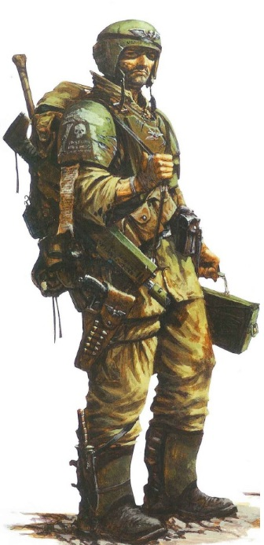
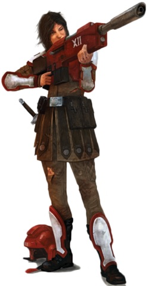

# 0019 人类 Human

精校状态：中文行文已逐段精校，部分术语仍为暂定

分类：通用概念 / 帝国 Imperium

原文来源：https://www.bilibili.com/opus/1051859515400519689

原作者：帝国神选罐头

原文时间：编辑于 2025年09月08日 12:58

[返回分类目录](目录.md) · [全书目录](../../目录.md)

<!-- A0019-B0001 -->
**英文原文**

Humans are one of the primary races in the galaxy, and the one from whose point of view the vast majority of the background is written. In M41 the majority of humans are part of the Imperium of Man, although other human civilisations are known to exist.

<!-- /A0019-B0001 -->

<!-- A0019-B0002 -->

原译文

人类是银河系中的主要种族之一，绝大多数背景都是从他们的角度写的。在M41，大多数人类都是人类帝国的一部分，尽管已知存在其他人类文明。

**校订译文**

人类是银河系的主要种族之一，绝大多数背景故事都从人类视角展开。在第 41 千年，大多数人类生活在人类帝国之内，但也存在其他人类文明。

<!-- /A0019-B0002 -->

<!-- A0019-B0003 图片 -->

<!-- A0019-B0004 -->

原译文

human Guardsman of the Imperium of Mankind 人类帝国的人类卫队士兵

**校订译文**

human Guardsman of the Imperium of Mankind 人类帝国的一名帝国卫队士兵

<!-- /A0019-B0004 -->

<!-- A0019-B0005 -->
## Human History 人类历史

<!-- /A0019-B0005 -->

<!-- A0019-B0006 -->
**英文原文**

Originally little more than tree-beasts, humans originated from the planet Terra and while one with their ecosystem had no greater role defined for them by the Old Ones, an ancient and powerful race that ruled the Galaxy in its infancy. However, following the destruction of the Old Ones in the War in Heaven, humans went on to develop in unforeseen and uncontrolled ways as raw uncontrolled evolution took hold. Eventually humans went on to colonize the galaxy during the Dark Age of Technology. Almost nothing is known about human civilisation in this time, having been lost in the chaos of the Age of Strife. Most of Humanity's shattered colonies were reunified by the Emperor during the Great Crusade, becoming the early Imperium.

<!-- /A0019-B0006 -->

<!-- A0019-B0007 -->

原译文

人类最初只不过是树上的野兽，起源于行星泰拉，尽管人类与他们所处的生态系统融为一体，但古圣并未为人类设定更为重大的角色，古圣是一个古老而强大的种族，在银河系的幼年时期统治着银河系。然而，在天堂之战中古圣势力被摧毁后，随着原始而不受控制的进化占据主导地位，人类继续以不可预见并不受控制地发展。最终，人类在黑暗技术时代继续在银河系殖民。在这段时间里，人类文明几乎一无所知，因为它已经迷失在了纷争时代的混乱中。人类大部分破碎的殖民地在大远征期间被帝皇统一，成为早期帝国。

**校订译文**

人类起源于泰拉，最初不过是生活在树上的兽类，融于当地的生态系统。统治早期银河的古老强大种族——古圣——并没有为人类安排更重要的角色。然而，天堂之战摧毁古圣之后，不受干预的自然演化开始发挥作用，人类走上了无法预见、也不再受控制的发展道路。最终，人类在黑暗科技时代开始殖民银河。但有关这一时期人类文明的知识，几乎全都散失于纷争时代的混乱之中。大远征期间，帝皇将大多数彼此隔绝的人类殖民地重新统一，构成了早期帝国。

<!-- /A0019-B0007 -->

<!-- A0019-B0008 -->
**英文原文**

The recorded history of Humanity can be divided into roughly four periods:

<!-- /A0019-B0008 -->

<!-- A0019-B0009 -->

原译文

人类有记载的历史大致可分为四个时期：

**校订译文**

人类有记载的历史大致可分为四个时期：

<!-- /A0019-B0009 -->

<!-- A0019-B0010 -->
**英文原文**

The Age of Terra: 1st Millennia to M15 or 18th Millennia

<!-- /A0019-B0010 -->

<!-- A0019-B0011 -->

原译文

泰拉时代：第1个千年到第15或18个千年

**校订译文**

泰拉时代：从第 1 千年延续至第 15 或第 18 千年。

<!-- /A0019-B0011 -->

<!-- A0019-B0012 -->
**英文原文**

The Dark Age of Technology: M15 or M18 to M23 or M25

<!-- /A0019-B0012 -->

<!-- A0019-B0013 -->

原译文

黑暗技术时代：M15或M18到M23或M25

**校订译文**

黑暗科技时代：从第 15 或第 18 千年延续至第 23 或第 25 千年。

<!-- /A0019-B0013 -->

<!-- A0019-B0014 -->
**英文原文**

The Age of Strife: M23 or M25 to M30

<!-- /A0019-B0014 -->

<!-- A0019-B0015 -->

原译文

纷争时代：M23或M25至M30

**校订译文**

纷争时代：从第 23 或第 25 千年延续至第 30 千年。

<!-- /A0019-B0015 -->

<!-- A0019-B0016 -->
**英文原文**

The Age of the Imperium: M30 to the present setting, M41.

<!-- /A0019-B0016 -->

<!-- A0019-B0017 -->

原译文

帝国时代：M30到现在的设定，M41。

**校订译文**

帝国时代：从第 30 千年延续至本段所述的第 41 千年。

**校注：** 原文将“当前”放在第 41 千年，属于原条目年代视角。中文标明该时点，不擅自改写为后续年代。

<!-- /A0019-B0017 -->

<!-- A0019-B0018 -->
## Human Civilisations 人类文明

<!-- /A0019-B0018 -->

<!-- A0019-B0019 -->
### Imperium of Mankind 人类帝国

<!-- /A0019-B0019 -->

<!-- A0019-B0020 -->
**英文原文**

The majority of humans exist within the Imperium of Mankind. The Imperial Cult preaches that humanity has a Manifest Destiny to conquer the entire galaxy, to the point where alien species are seen as inferior and worthy of nothing but extinction.

<!-- /A0019-B0020 -->

<!-- A0019-B0021 -->

原译文

大多数人类存在于人类帝国之中。帝国教派宣扬人类有征服整个银河系的天命，以至于异型被视为低劣的，只值得灭绝。

**校订译文**

大多数人类生活在人类帝国之内。帝皇信仰宣扬：征服整个银河是人类的天命。由此，异形被视为低劣的存在，除了遭到灭绝，不配拥有其他命运。

<!-- /A0019-B0021 -->

<!-- A0019-B0022 -->
### The Lost and the Damned 迷失者与被诅咒者

<!-- /A0019-B0022 -->

<!-- A0019-B0023 -->
**英文原文**

The next greatest concentration of humans exist as the Lost and the Damned, and reside primarily, though not exclusively, in the Eye of Terror. Not a coherent civilisation as such, they exist as part of a diverse and infinite collection of warbands and hosts under the leadership of Chaos Champions. Due to the nature of the Warp, some of these humans are the original Imperial subjects who sided with the Warmaster Horus during the Horus Heresy, though their number has been greatly supplemented by more recent humans who have turned to Chaos, or slaves captured as part of the many raids out of the Eye.

<!-- /A0019-B0023 -->

<!-- A0019-B0024 -->

原译文

下一个最大的人类集中地是迷失者和被诅咒者，他们主要居住在恐惧之眼，尽管不是唯一的。它们本身并不是一个连贯的文明，而是在混沌冠军的领导下，作为各种各样、无限的战士和主人的一部分而存在。由于亚空间的性质，其中一些人是荷鲁斯叛乱期间支持战帅荷鲁斯的原始帝国臣民，尽管他们的数量得到了最近转向混沌的人的极大补充，或者在许多突袭行动中被俘的奴隶。

**校订译文**

另一个主要的人类群体，是“迷失者与被诅咒者”。他们主要居住在恐惧之眼，但也分布于其他地方。这些人并未形成统一文明，而是分属于无数各不相同的战帮与军势，由混沌冠军统率。受亚空间特性影响，其中一些人仍是荷鲁斯之乱时期追随战帅荷鲁斯的帝国臣民；这一群体又吸纳了大量后来投向混沌的人，以及恐惧之眼中的势力向外劫掠时掳走的奴隶。

<!-- /A0019-B0024 -->

<!-- A0019-B0025 -->
### Tau Empire 钛帝国

<!-- /A0019-B0025 -->

<!-- A0019-B0026 -->
**英文原文**

Less xenophobic than the Imperium, the Tau Empire has no qualms in letting other races join it. Whilst few in number, some humans have done so and exist within the Empire where they are known as Gue'vesa. These humans for the most part are descendants of Imperial Guard troops who were abandoned in Tau space during the Damocles Crusade, however it is not unheard of for Imperial planets to want to secede from the Imperium to join the Tau Empire.

<!-- /A0019-B0026 -->

<!-- A0019-B0027 -->

原译文

与帝国相比，钛帝国没有那么排外，它毫不犹豫地让其他种族加入。虽然人数很少，但一些人已经这样做了，并存在于帝国内部，他们被称为古’维萨。这些人类大多是达摩克利斯远征期间被遗弃在钛空域的帝国卫队的后代，然而，帝国行星想要脱离帝国加入钛帝国也并非闻所未闻。

**校订译文**

钛帝国比人类帝国更少排外，对其他种族加入并无顾忌。少量人类已加入钛帝国，被称为“古维萨”（Gue'vesa）。他们大多是达摩克利斯远征期间被遗弃在钛族疆域内的帝国卫队士兵的后代。不过，帝国世界主动寻求脱离人类帝国、转而加入钛帝国的情况，也并非没有发生过。

<!-- /A0019-B0027 -->

<!-- A0019-B0028 -->
### Independent Civilisations 独立文明

<!-- /A0019-B0028 -->

<!-- A0019-B0029 -->
**英文原文**

Other human civilisations are extremely rare. This is mostly due to the fact that the Imperium considers itself to have an automatic right to rule all of humanity, and ruthlessly suppresses any attempt to secede from it. Similarly, any lost colonies that are rediscovered from the Dark Age of Technology are also incorporated into the Imperium whether they want to be or not. Despite this, a few independent human civilisations have been known to exist, such as the Interex, Diasporex, Auretian Technocracy, Gordian League, Adrantis Five, Prophets of Fury, and the Krull.

<!-- /A0019-B0029 -->

<!-- A0019-B0030 -->

原译文

其他人类文明极为罕见。这主要是因为帝国认为自己有自动统治全人类的权利，并无情地镇压任何脱离它的企图。同样，从黑暗技术时代重新发现的任何失落的殖民地，无论他们是否愿意，也会被纳入帝国。尽管如此，已知存在一些独立的人类文明，如英特雷斯、流散者、奥瑞提亚科技联盟、戈迪亚联盟、阿德兰提斯五星、狂怒先知和克鲁尔。

**校订译文**

独立于帝国的人类文明极为罕见，主要是因为帝国自认天生拥有统治全人类的权利，并会无情镇压一切分离企图。自黑暗科技时代遗留、后来被重新发现的失落殖民地，无论是否自愿，也都会被并入帝国。尽管如此，历史上仍存在过少数独立的人类文明，例如英特雷斯、流散者、奥瑞提安技术联盟、戈尔迪安联盟、阿德兰提斯五号、狂怒先知与克鲁尔。

<!-- /A0019-B0030 -->

<!-- A0019-B0031 -->
### Lost Colonies 失落殖民地

<!-- /A0019-B0031 -->

<!-- A0019-B0032 -->
**英文原文**

When the Age of Strife descended on the galaxy, the majority of human colonies were cut off from Terra and forced to survive on their own. In some cases this meant that they devolved into considerably more primitive societies as the knowledge to create and maintain technology was lost. The Great Crusade reunited many thousands of lost colonies back into the Imperium, yet every now and then changes in the warp mean that new colonies are discovered. Whilst nobody can know for sure how many, there are almost certainly more colonies still cut off from the rest of humanity, waiting to be discovered.

<!-- /A0019-B0032 -->

<!-- A0019-B0033 -->

原译文

当纷争时代降临银河系时，大多数人类殖民地与泰拉隔绝，被迫独立生存。在某些情况下，这意味着随着创造和维护技术的知识的丧失，他们陷入了更加原始的社会。大远征将数千个失落的殖民地重新统一到帝国中，但亚空间的不时变化意味着新的殖民地被发现。虽然没有人确切知道有多少，但几乎可以肯定的是，还有更多的殖民地仍与人类其他部分隔绝，等待被发现。

**校订译文**

纷争时代席卷银河时，大多数人类殖民地与泰拉失去联系，只能独自求生。一些地方因丢失制造和维护技术的知识，社会大幅倒退，变得更为原始。大远征将数千个失落殖民地重新纳入帝国，但亚空间环境不时变化，至今仍会使新的殖民地被发现。谁也无法确定还有多少遗落之地，不过几乎可以肯定，仍有其他殖民地与人类社会隔绝，等待重新接触。

<!-- /A0019-B0033 -->

<!-- A0019-B0034 -->
### Rebellious Systems 叛乱星系

<!-- /A0019-B0034 -->

<!-- A0019-B0035 -->
**英文原文**

The Imperium keeps a tight grip over its planets, yet every now and then planets or groups of planets do attempt to secede from the Imperium. This may be the result of the Planetary Governor believing he can get away with independence, or it may be the result of revolution that deposes those in power. Many of these successions are orchestrated by the powers of Chaos, and the humans that are part of it should be counted as the Lost and the Damned, however there are also occasions when a planet decides it wants to be independent of the Imperium through its own volition, such as the case of the Severan Dominate, or the Kingdom of Vanir. Regardless of the cause, these independent realms rarely last long as they are swiftly and brutally subjugated back into the Imperium.

<!-- /A0019-B0035 -->

<!-- A0019-B0036 -->

原译文

帝国对其行星保持着严密的控制，但偶尔会有行星或星群试图脱离帝国。这可能是行星总督相信他可以独立逃脱惩罚的结果，也可能是推翻当权者的革命的结果。许多这样的继承都是由混沌的力量精心策划的，其中的人类应该被视为迷失者和被诅咒者，然而，也有一些情况下，一个行星决定通过自己的意志独立于帝国，比如赛维安帝国或瓦尼尔王国的情况。无论原因如何，这些独立的领地很少能维持很长时间，因为它们会被迅速且残酷地重新征服，再次纳入帝国的统治之下。

**校订译文**

帝国虽严密控制所属世界，仍不时有单颗星球或一组星球企图脱离统治。有时是总督认为自己能够独立而不受惩罚，有时则是革命推翻了原有统治者。许多分离行动由混沌势力策划，参与其中的人类应归入迷失者与被诅咒者。但也有世界仅出于自身意愿寻求独立，例如赛维安帝国与瓦尼尔王国。无论原因如何，这些独立政权通常难以长久：帝国往往迅速以残酷手段将其重新征服。

**校注：** 英文 successions 在叛乱独立语境下疑为 secessions；暂按“分离行动”译，英文保留。

<!-- /A0019-B0036 -->

<!-- A0019-B0037 图片 -->

<!-- A0019-B0038 -->

原译文

human Soldier of the Severan Dominate 赛维安帝国的人类士兵

**校订译文**

human Soldier of the Severan Dominate 赛维安帝国的人类士兵

<!-- /A0019-B0038 -->

<!-- A0019-B0039 -->
### Pirates 海盗

<!-- /A0019-B0039 -->

<!-- A0019-B0040 -->
**英文原文**

The only independent civilisation with any real sustainability, some humans evade the Imperium's clutches and live outside of its reach in bands of ships existing through raids and piracy. Often allying themselves with Eldar or other Xenos, these humans are swiftly put down if they are caught by Imperial authorities.

<!-- /A0019-B0040 -->

<!-- A0019-B0041 -->

原译文

作为唯一一个具有真正可持续性的独立文明，一些人逃避帝国的控制，生活在帝国触手可及的范围之外，生活在通过突袭和海盗而存在的船只中。这些人经常与灵族或其他异型结盟，如果被帝国当局抓住，他们很快就会被镇压。

**校订译文**

某些人类躲过了帝国的控制，在其权力难以触及的地方，依靠成群舰船组成的海盗势力生活，以劫掠为生。按照本段的说法，这是唯一真正能够长久存续的独立生活形态。他们常与灵族或其他异形结盟，一旦落入帝国当局手中，便会迅速遭到清剿。

<!-- /A0019-B0041 -->

<!-- A0019-B0042 -->
## Other Human Species 其他人类物种

<!-- /A0019-B0042 -->

<!-- A0019-B0043 -->
**英文原文**

Throughout the long history of the Imperium and before, the human race has mutated into a variety of stable species, known as abhumans. Abhumans are tolerated to a varying degree within the Imperium due to the fact that they are seen as being close enough to humans to be accepted.

<!-- /A0019-B0043 -->

<!-- A0019-B0044 -->

原译文

在帝国的漫长历史和之前，人类已经变异成各种稳定的物种，被称为亚人。由于亚人被视为与人类足够接近而被接受，因此在帝国内部，亚人在不同程度上被容忍。

**校订译文**

在帝国建立前后漫长的岁月中，人类逐渐分化出多种性状稳定的变异分支，统称“亚人”。由于这些群体被认为仍足够接近普通人类，帝国对他们给予程度不一的容忍。

<!-- /A0019-B0044 -->

本篇核心术语与暂定项

以下列出本篇出现的英文原形及核心术语表用词。同形词可能指不同对象，具体词义以本篇正文和校注为准；单复数、别名和仅见于图注的名称可能尚未列入。完整候选见[术语表](../../术语表/双语术语候选.csv)。

| 英文 | 采用中文 | 状态 |
| --- | --- | --- |
| Imperial Guard | 帝国卫队 | 暂定·语境区分 |
| Eldar | 灵族 | 暂定·语境区分 |
| Horus Heresy | 荷鲁斯之乱 | 官方已核对 |
| Warp | 亚空间 | 官方已核对 |
| Imperium of Man | 人类帝国 | 官方已核对 |
| Imperium | 帝国 | 暂定·简称 |
| Dark Age of Technology | 黑暗科技时代 | 暂定 |
| The Lost and the Damned | 迷失者与被诅咒者 | 暂定 |
| Old Ones | 古圣 | 暂定 |
| History | 历史 | 编辑用语已统一 |
| Eye of Terror | 恐惧之眼 | 官方已核对 |
| Emperor | 帝皇 | 官方已核对 |
| Great Crusade | 大远征 | 暂定·官方待核 |
| Age of Strife | 纷争时代 | 暂定·官方待核 |
| Interex | 英特雷斯 | 暂定·官方待核 |
| Terra | 泰拉 | 暂定·官方待核 |
| Horus | 荷鲁斯 | 暂定·官方待核 |
| Auretian Technocracy | 奥瑞提安技术联盟 | 暂定·官方待核 |
| Gordian League | 戈尔迪安联盟 | 暂定·官方待核 |
| Imperial Cult | 帝皇信仰 | 暂定·官方待核 |
| Age of Terra | 泰拉时代 | 暂定·官方待核 |
| Age of the Imperium | 帝国时代 | 暂定·官方待核 |
| War in Heaven | 天堂之战 | 暂定·官方待核 |
| Gue'vesa | 古维萨 | 暂定·官方待核 |
| Damocles Crusade | 达摩克利斯远征 | 暂定·官方待核 |
| Adrantis Five | 阿德兰提斯五号 | 暂定·官方待核 |
| Prophets of Fury | 狂怒先知 | 暂定·官方待核 |
| Krull | 克鲁尔 | 暂定·官方待核 |
| Severan Dominate | 赛维安帝国 | 暂定·官方待核 |
| Kingdom of Vanir | 瓦尼尔王国 | 暂定·官方待核 |
| Ancient | 旗手 | 官方已核对 |
| Powers | 能天使 | 暂定·官方待核 |
| Xenos | 异形 | 暂定·官方待核 |
| Manifest Destiny | 天定命运号 | 暂定·官方待核 |
| The Dark | 《黑暗》 | 暂定·官方待核 |
| Tau Empire | 钛帝国 | 暂定·官方待核 |

