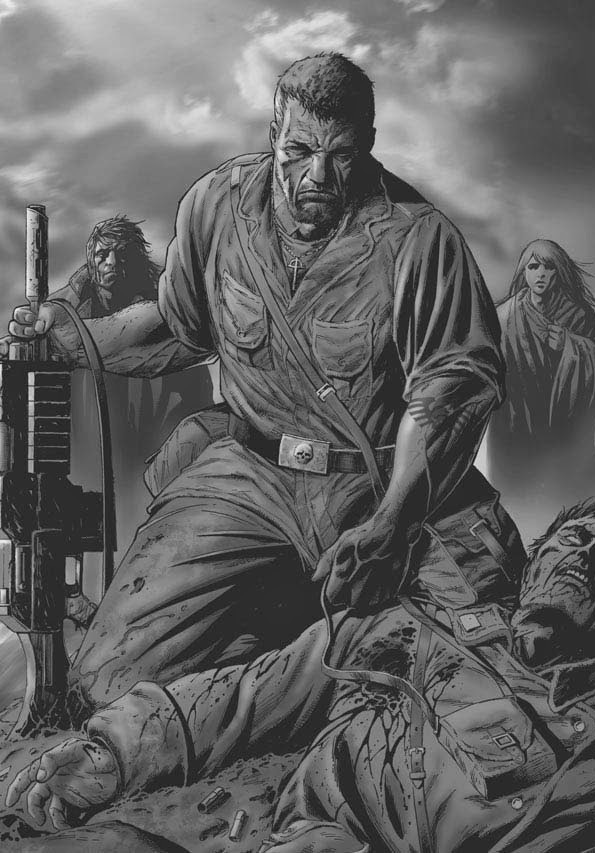

# 0022 永生者 Perpetual

精校状态：中文行文已逐段精校，部分术语仍为暂定

分类：通用概念 / 帝国 Imperium

原文来源：https://www.bilibili.com/opus/1053346665008726021

原作者：帝国神选罐头

原文时间：编辑于 2025年07月05日 13:44

[返回分类目录](目录.md) · [全书目录](../../目录.md)

<!-- A0022-B0001 -->
**英文原文**

A Perpetual is an immortal and nigh-indestructible human. Some Perpetuals are part of a sect that wished to guide human evolution.

<!-- /A0022-B0001 -->

<!-- A0022-B0002 -->

原译文

永生者是不朽的、几乎坚不可摧的人。一些永生者是希望指导人类进化的党派的一部分。

**校订译文**

永生者是不会自然死亡、且几乎无法被彻底毁灭的人类。其中一些人属于一个试图引导人类演化的团体。

<!-- /A0022-B0002 -->

<!-- A0022-B0003 图片 -->

<!-- A0022-B0004 -->

原译文

Ollanius Persson, an example of a Perpetual 欧兰尼奥斯·佩松，一个永生者的例子

**校订译文**

Ollanius Persson, an example of a Perpetual 永生者欧良尼乌斯·佩松

<!-- /A0022-B0004 -->

<!-- A0022-B0005 -->
**英文原文**

Some Perpetuals can regenerate from almost any injury however grievous, including decapitation, dismemberment, and disintegration. There are few ways of actually killing such Perpetuals. One method is by the Fulgurite.

<!-- /A0022-B0005 -->

<!-- A0022-B0006 -->

原译文

一些永生者几乎可以从任何严重的伤害中再生，包括斩首、肢解和解体。实际上，杀死这样的永生者的方法很少。一种方法是通过雷击石。

**校订译文**

有些永生者无论伤势多么严重，几乎都能再生，甚至斩首、肢解和身体崩解也无法彻底杀死他们。真正能够杀死这类永生者的手段极少，雷击石便是其中之一。

<!-- /A0022-B0006 -->

<!-- A0022-B0007 -->
**英文原文**

Perpetuals may be natural-born or created. The Emperor transformed Dalia Cythera into a Perpetual so that she could watch over the Void Dragon indefinitely. The Cabal is capable of turning humans into Perpetuals John Grammaticus is one such example. Ollanius Persson, by contrast, is a natural-born Perpetual. In addition to the abilities, many Perpetuals consider it their mission and indeed, their moral responsibility to guide humanity. Having withdrawn from this imperative, at the beginning of the Horus Heresy, a retired Oll Persson was living in exile, and refused to be called a Perpetual.

<!-- /A0022-B0007 -->

<!-- A0022-B0008 -->

原译文

永生者可能是自然产生或创造的。帝皇将达莉亚·库忒拉变成了一个永生者，这样她就可以无限期地监视虚空龙。密教有能力将人类变成永生者 — 约翰·格拉马迪库斯就是这样一个例子。相比之下，欧兰尼奥斯·佩松是天生的永生者。除了这些能力，许多永生者认为引导人类是他们的使命，也是他们的道德责任。在荷鲁斯叛乱开始时，退休后的欧尔·佩松过着流亡的生活，并且他拒绝被称为永生者。

**校订译文**

永生者既可能天生如此，也可能经后天转化而成。帝皇使达莉亚·库忒拉成为永生者，让她能够永久看守虚空龙。密教也掌握将人类转化为永生者的能力，约翰·格拉马迪库斯就是一例；相比之下，欧良尼乌斯·佩松则是天生的永生者。许多永生者不仅拥有非凡能力，还把引导人类视为自己的使命乃至道德责任。欧尔·佩松已经放弃这项使命；荷鲁斯之乱初起时，他正隐居于流亡之中，甚至拒绝再被称作永生者。

**校注：** 此段将达莉亚的转化归于帝皇，B0016 的人物表却写由谢苗创造。两种说法均来自所给英文，暂保留差异，待核原始资料的直接施行者与授权者关系。

<!-- /A0022-B0008 -->

<!-- A0022-B0009 -->
**英文原文**

According to Erda, the Perpetuals are the next step of mankind's evolution, meaning that with time there will be more and more Perpetuals among the species.

<!-- /A0022-B0009 -->

<!-- A0022-B0010 -->

原译文

根据尔达的说法，永生者是人类进化的下一步，这意味着随着时间的推移，物种中会有越来越多的永生者。

**校订译文**

按照尔达的说法，永生者代表人类演化的下一阶段；随着时间推移，人类之中将出现越来越多的永生者。

<!-- /A0022-B0010 -->

<!-- A0022-B0011 -->
## History 历史

<!-- /A0022-B0011 -->

<!-- A0022-B0012 -->
**英文原文**

The origins of the Perpetuals are a mystery even to themselves. Erda considers Perpetuals to have naturally arisen as the next step in Human Evolution, dubbing them Homo Superior. In the early days of Human history they existed as kings and warlords, but the greatest and most powerful among them was always the being who would become known as the Emperor. The Emperor wished to accelerate the evolution of standard Humanity into beings similar to Homo Superior and personally sought out every Perpetual on Earth for this task. Some joined Him, some refused any part of His plans, while others violently resisted. Many wars in Human history were the result of Perpetual rivals of the Emperor attempting to thwart His plans. One by one the Perpetuals allied to the Emperor eventually left or betrayed Him. At the end of the Unification War, the Emperor along with Malcador the Sigilite, Erda and Amar Astarte, decided to create "Artificial Perpetuals" commonly referred as Primarchs to guide Mankind.

<!-- /A0022-B0012 -->

<!-- A0022-B0013 -->

原译文

永生者的起源甚至对他们自己来说都是一个谜。尔达认为永生者是人类进化的下一步自然出现的，并将其称为高级智人。在人类历史的早期，他们以国王和军阀的身份存在，但其中最伟大、最强大的总是被称为帝皇的人。帝皇希望加速标准人类向类似于高级智人的进化，并亲自寻找地球上每一个永恒者来完成这项任务。有些人加入了他，有些人拒绝了他的任何计划，而另一些人则强烈抵制。人类历史上的许多战争都是帝皇的永恒者对手试图挫败他的计划的结果。与皇帝结盟的永生者最终一个接一个地离开或背叛了他。在统一战争结束时，帝皇与掌印者马卡多、尔达和阿玛尔·阿斯塔特决定创建“人工永生者”，通常被称为原体，以指导人类。

**校订译文**

永生者的起源，连他们自己也无法完全理解。尔达认为，他们是人类自然演化的下一阶段，并以 Homo Superior，亦即“超人类”，称呼这一群体。在人类历史早期，永生者曾以君王和军阀的身份活动；其中最伟大、最强大的，始终是后来被称为帝皇的那个人。帝皇希望加速普通人类的演化，使其成为类似超人类的存在，于是亲自寻找地球上的每一位永生者，争取他们参与计划。有人追随他，有人拒绝参与，也有人以武力抵抗。人类历史上的许多战争，正是帝皇的永生者对手试图阻止其计划所造成的。最终，与帝皇结盟的永生者也相继离开或背叛了他。统一战争结束时，帝皇与掌印者马卡多、尔达、阿玛尔·阿斯塔特决定创造一批“人工永生者”，也就是通常所称的原体，用来引导人类。

**校注：** “人工永生者”是本段对原体计划的称法。译文忠实保留，但不能据此推断所有原体都具备后文所述的再生能力；人物与年代关系仍待回查原始出版物。

<!-- /A0022-B0013 -->

<!-- A0022-B0014 -->
## Known Perpetuals 已知永生者

<!-- /A0022-B0014 -->

<!-- A0022-B0015 -->
**英文原文**

Dalia Cythera (artificial, created by Semyon)

<!-- /A0022-B0015 -->

<!-- A0022-B0016 -->

原译文

达莉亚·库忒拉（人工，由谢苗创造）

**校订译文**

达莉亚·库忒拉——后天转化，由谢苗创造。

<!-- /A0022-B0016 -->

<!-- A0022-B0017 -->

原译文

The Emperor 帝皇

**校订译文**

The Emperor 帝皇

<!-- /A0022-B0017 -->

<!-- A0022-B0018 -->

原译文

Erda 尔达

**校订译文**

Erda 尔达

<!-- /A0022-B0018 -->

<!-- A0022-B0019 -->

原译文

John Grammaticus (artificial) 约翰·格拉马迪库斯（人工）

**校订译文**

John Grammaticus (artificial) 约翰·格拉马迪库斯（后天转化）

<!-- /A0022-B0019 -->

<!-- A0022-B0020 -->

原译文

Malcador the Sigillite 掌印者马卡多

**校订译文**

Malcador the Sigillite 掌印者马卡多

<!-- /A0022-B0020 -->

<!-- A0022-B0021 -->

原译文

Mordrac (artificial) 莫德拉克（人工）

**校订译文**

Mordrac (artificial) 莫德拉克（后天转化）

<!-- /A0022-B0021 -->

<!-- A0022-B0022 -->

原译文

Ollanius Persson 欧兰尼奥斯·佩松

**校订译文**

Ollanius Persson 欧良尼乌斯·佩松

<!-- /A0022-B0022 -->

<!-- A0022-B0023 -->

原译文

Damon Prytanis (natural Perpetual) 达蒙·普莱塔尼斯（自然永生者）

**校订译文**

Damon Prytanis (natural Perpetual) 达蒙·普莱塔尼斯（天生永生者）

<!-- /A0022-B0023 -->

<!-- A0022-B0024 -->

原译文

Semyon (artificial) 谢苗（人工）

**校订译文**

Semyon (artificial) 谢苗（后天转化）

<!-- /A0022-B0024 -->

<!-- A0022-B0025 -->

原译文

Alivia Sureka 阿利维亚·苏雷卡

**校订译文**

Alivia Sureka 阿利维亚·苏雷卡

<!-- /A0022-B0025 -->

<!-- A0022-B0026 -->

原译文

Anval Thawn 安瓦尔·索恩

**校订译文**

Anval Thawn 安瓦尔·索恩

<!-- /A0022-B0026 -->

<!-- A0022-B0027 -->
**英文原文**

Cyrene Valantion (artificial, created by Erebus)

<!-- /A0022-B0027 -->

<!-- A0022-B0028 -->

原译文

昔兰尼·瓦兰蒂恩（人工，由艾瑞巴斯创造）

**校订译文**

昔兰尼·瓦兰蒂恩——后天转化，由艾瑞巴斯创造。

<!-- /A0022-B0028 -->

<!-- A0022-B0029 -->
**英文原文**

Vulkan (artificial, created by The Emperor)

<!-- /A0022-B0029 -->

<!-- A0022-B0030 -->

原译文

沃坎（人工，由帝皇创造）

**校订译文**

沃坎——由帝皇人工创造的永生者。

<!-- /A0022-B0030 -->

本篇核心术语与暂定项

以下列出本篇出现的英文原形及核心术语表用词。同形词可能指不同对象，具体词义以本篇正文和校注为准；单复数、别名和仅见于图注的名称可能尚未列入。完整候选见[术语表](../../术语表/双语术语候选.csv)。

| 英文 | 采用中文 | 状态 |
| --- | --- | --- |
| Horus Heresy | 荷鲁斯之乱 | 官方已核对 |
| History | 历史 | 编辑用语已统一 |
| Emperor | 帝皇 | 官方已核对 |
| Horus | 荷鲁斯 | 暂定·官方待核 |
| Erebus | 艾瑞巴斯 | 暂定·官方待核 |
| Perpetual | 永生者 | 暂定·官方待核 |
| Fulgurite | 雷击石 | 暂定·官方待核 |
| Dalia Cythera | 达莉亚·库忒拉 | 暂定·官方待核 |
| Void Dragon | 虚空龙 | 暂定·官方待核 |
| Cabal | 密教 | 暂定·官方待核 |
| John Grammaticus | 约翰·格拉马迪库斯 | 暂定·官方待核 |
| Ollanius Persson | 欧良尼乌斯·佩松 | 官方词根参考·全名待核 |
| Oll Persson | 欧尔·佩松 | 暂定·官方待核 |
| Erda | 尔达 | 暂定·官方待核 |
| Homo Superior | 超人类 | 暂定·官方待核 |
| Amar Astarte | 阿玛尔·阿斯塔特 | 暂定·官方待核 |
| Semyon | 谢苗 | 暂定·官方待核 |
| Cyrene Valantion | 昔兰尼·瓦兰蒂恩 | 暂定·官方待核 |
| Vulkan | 沃坎 | 暂定·官方待核 |
| Mission | 教团／传教机构 | 暂定 |
| Cyrene | 昔兰尼 | 暂定·官方待核 |

