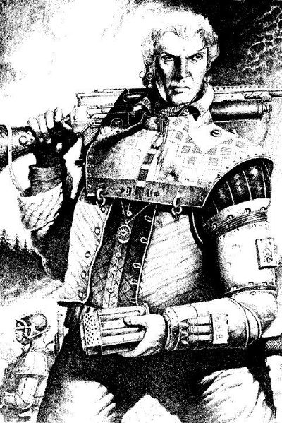
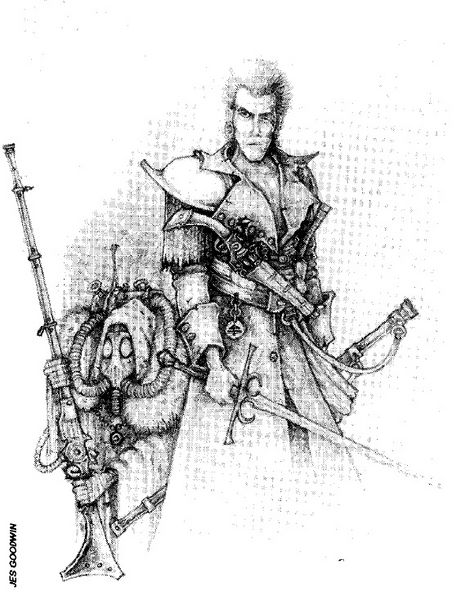
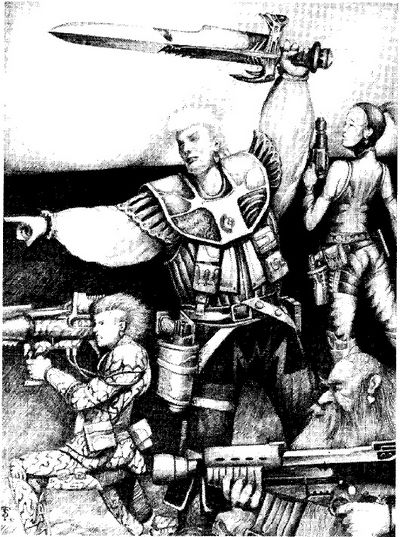
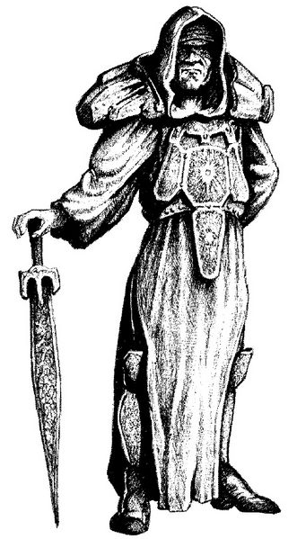
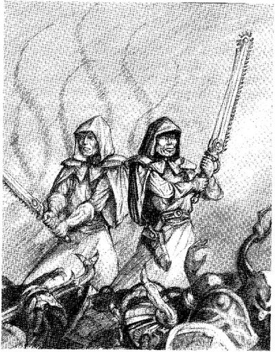

# 0023 导师 Sensei

精校状态：中文行文已逐段精校，部分术语仍为暂定

分类：通用概念 / 帝国 Imperium

原文来源：https://www.bilibili.com/opus/1078628182540681249

原作者：帝国神选罐头

原文时间：2025年06月15日 16:28

[返回分类目录](目录.md) · [全书目录](../../目录.md)

<!-- A0023-B0001 -->
**英文原文**

The Sensei are the natural descendants of the Emperor who wander the galaxy as heroes and champions. Springing out of the Emperor's union with various mortal women throughout history, they are bestowed with the gift of immortality and various powers, both commonplace and unique. Inherently resistant to Chaos, they often fill the role of the Star Child's champions, analogous to the champions of the Chaos Gods.

<!-- /A0023-B0001 -->

<!-- A0023-B0002 -->

原译文

导师是帝皇的亲生后代，他们作为英雄和冠军在银河系中游荡。从帝皇与历史上各种凡人女性的结合中脱颖而出，他们被赋予了不朽的礼物和各种力量，既常见又独特。他们天生对混沌有抵抗力，经常扮演星辰之子的冠军，类似于混沌诸神的冠军。

**校订译文**

导师（Sensei）是帝皇自然繁衍的后裔，以英雄与勇士的身份游历银河。他们的血脉源于帝皇在漫长历史中与凡人女性的结合，拥有长生的天赋，以及种种或常见、或独有的能力。导师天生抵抗混沌，常成为星辰之子的神选勇士，其地位类似于混沌诸神各自的冠军。

<!-- /A0023-B0002 -->

<!-- A0023-B0003 图片 -->

<!-- A0023-B0004 -->

原译文

Sensei with Shotgun 配备霰弹枪的导师

**校订译文**

Sensei with Shotgun 配备霰弹枪的导师

<!-- /A0023-B0004 -->

<!-- A0023-B0005 -->
**英文原文**

However, the Inquisition, for the same reason, declares them all heretics, as their unique psychic powers and inherent rebellious drive to serve order and good often cause them to oppose Imperial repression.

<!-- /A0023-B0005 -->

<!-- A0023-B0006 -->

原译文

然而，出于同样的原因，审判庭宣布他们都是异端，因为他们独特的灵能力量和内在的反叛欲望往往导致他们反对帝国的镇压。

**校订译文**

然而，审判庭恰恰因此将他们视为异端。导师独特的灵能力量，以及追求秩序和善行的反抗天性，常使他们站到帝国压迫的对立面。

<!-- /A0023-B0006 -->

<!-- A0023-B0007 -->
## Description 描述

<!-- /A0023-B0007 -->

<!-- A0023-B0008 -->
**英文原文**

Long before the birth of the Imperium, the Emperor lived in hiding amongst ordinary men, and during this time he fathered many families. Not all members of the lineages fathered by the Emperor produce an individual known as Sensei, but the offspring of one or any of his kin, have this potential hidden in their genes.

<!-- /A0023-B0008 -->

<!-- A0023-B0009 -->

原译文

早在帝国诞生之前，帝皇隐藏在普通人中间，在这段时间里，他养育了许多家庭。并非所有由帝皇所生的父系成员都会产生一个被称为导师的个体，但他的一个或任何一个亲属的后代在他们的基因中都隐藏着这种潜力。

**校订译文**

早在帝国诞生之前，帝皇便长期隐居于普通人之间，并留下了许多家族血脉。这些家族并非每一支都会产生被称为导师的个体，但帝皇及其血亲的后裔，都可能在基因中潜藏着这种天赋。

<!-- /A0023-B0009 -->

<!-- A0023-B0010 -->
**英文原文**

The most obvious trait of the Sensei is their immortality, which, unless they are fell by a sudden death, makes their appearance ageless, and non-lethal wounds mend inhumanly fast. Their genetic structure, so close to that of the template of the Emperor's, allows them to be unimpeded by Chaotic influence, connected to their harmonious state of mind that knows no hate, bitterness, nor irrational anger, radiating instead natural confidence. In accordance with this stoic attitude, their psychic abilities, like those of the Emperor's, can be used without any danger from daemons or other malicious influences, freely drawing upon the powers of the Warp. In fact, said Chaos powers are utterly invisible to them due to the Sensei's lack of those emotions the Gods of Chaos prey upon. It is their status as powerful psykers unhindered by the ever-present danger of Chaos that makes the Sensei a threat and a target to the forces of the Inquisition

<!-- /A0023-B0010 -->

<!-- A0023-B0011 -->

原译文

导师最明显的特征是他们的不朽，除非他们突然死亡，否则它他们的外表不会变老，非致命的伤口会以非人的速度愈合。他们的基因结构非常接近帝皇的模板，使他们不受混沌的影响，与他们平和的心态相连，这种心态没有仇恨、苦涩或非理性的愤怒，而是散发出自然的自信。根据这种坚忍的态度，他们的灵能能力，就像帝皇的灵能能力一样，可以在没有恶魔或其他恶意影响的情况下使用，自由地利用亚空间的力量。事实上，所说的混沌力量对他们来说是完全看不见的，因为感官缺乏混沌诸神所捕食的那些情绪。正是他们作为强大的灵能者的地位，不受混沌永恒危险的阻碍，使导师成为审判庭部队的威胁和目标

**校订译文**

导师最显著的特征是长生：只要不遭横死，他们的容貌便不会衰老，非致命伤也会以远超常人的速度愈合。他们的基因结构十分接近帝皇，使其能够抵抗混沌影响；与之相应，他们的心境和谐，没有仇恨、怨毒或失控的愤怒，而是流露出自然的自信。凭借这种沉着的心态，导师能够像帝皇一样自由汲取亚空间力量，而不受恶魔或其他恶意力量侵扰。原文进一步称，由于导师缺乏混沌诸神赖以攫取猎物的那些情绪，这些混沌力量对他们而言“完全不可见”。正因为导师是强大的灵能者，却似乎不受混沌这一恒常危险的制约，审判庭才将他们视为威胁与追捕目标。

**校注：** 英文明确写混沌力量对导师“不可见”，但后文又写导师能感知恶魔与亚空间扰动。可能存在主客体或措辞问题；中文照录此处指向并提示，不擅自反转成“混沌看不见导师”。

<!-- /A0023-B0011 -->

<!-- A0023-B0012 -->
**英文原文**

In Realm of Chaos: Slaves to Darkness. The Sensei are only The Emperor's sons, directly descended from him, and infertile. While the Emperor was a powerful psyker, the Sensei are psychic blanks and cannot be seen by other psykers.

<!-- /A0023-B0012 -->

<!-- A0023-B0013 -->

原译文

在混沌领域：黑暗之奴中。导师只是帝皇的子嗣，是他的直系后裔，不能生育。虽然帝皇是一个强大的灵能者，但导师是灵能空白者，其他灵能者看不见。

**校订译文**

《混沌领域：黑暗之奴》给出了另一种说法：导师都是帝皇直接生育的儿子，而且无法生育。虽然帝皇是强大的灵能者，导师却是灵能空白者，无法被其他灵能者感知。

**校注：** 本篇汇集不同旧版资料，《黑暗之奴》的“空白者、直接子嗣、不育”与第二卷的“灵能者、血脉后裔”相互冲突；后文“来源冲突”节进一步对照。书名为暂定工作译名。

<!-- /A0023-B0013 -->

<!-- A0023-B0014 -->
**英文原文**

The Sensei have adapted to living in hiding within the ranks of Humanity, ignorant of their true heritage. Over the millennia, they have been vilified as 'witches' and 'devils' solely for their immortality. The Sensei often take the mantle of heroes who wander the Galaxy fighting both Chaos and (often Imperial) oppression, sometimes in the company of bands of other equally rebellious individuals (including xenos and abhumans.)

<!-- /A0023-B0014 -->

<!-- A0023-B0015 -->

原译文

导师已经适应了隐藏在人类队伍中的生活，对他们的真正遗产一无所知。几千年来，他们被诽谤为“巫师”和“魔鬼”，仅仅是因为他们的不朽。导师经常披上英雄的外衣，在银河系中游荡，与混沌和（通常是帝国）压迫作斗争，有时与其他同样叛逆的人（包括异型和亚人）一起

**校订译文**

导师已经学会隐匿于普通人类之中，却往往不知道自己的真实血统。数千年来，仅凭不老这一特征，他们就被污蔑为“巫师”或“魔鬼”。导师常以英雄身份游历银河，对抗混沌与压迫，而施加压迫者往往正是帝国。有时，他们也会结伴同行，伙伴是同样富于反抗精神的人，包括异形和亚人。

<!-- /A0023-B0015 -->

<!-- A0023-B0016 图片 -->

<!-- A0023-B0017 -->

原译文

Sensei and a masked ally 导师和一个戴面具的盟友

**校订译文**

Sensei and a masked ally 导师和一个戴面具的盟友

<!-- /A0023-B0017 -->

<!-- A0023-B0018 -->
**英文原文**

In the Age of the Imperium, few others than the Sensei themselves and the Illuminati are aware of their existence, other than as folk tales of the Captain Eternal or the Wandering Inquisitor. Even the Sensei are at first unaware of their own nature, finding it simply a fact of their lives that they differ from others, and must hide those differences from other humans. Through their travels, they might unravel the mystery of their existence, often as a result of meeting another, more experienced member of their kind. Throughout their quest for righteousness, they might discover it themselves, found by the spirit of the Emperor in the Warp and enlightened towards their destiny as his scions. Some Sensei may flee to join the forces of Chaos and become Grey Sensei, becoming amongst the cruellest of dark servants. Their nature might also be revealed to them by less benevolent individuals, who might obfuscate some parts of the truth, like the Illuminati, a secret faction of Inquisitors who keep knowledge of the Sensei hidden from their fellow Inquisitors and the rest of the Imperium.

<!-- /A0023-B0018 -->

<!-- A0023-B0019 -->

原译文

在帝国时代，除了导师自己和光照会之外，很少有人知道他们的存在，除了永恒队长或流浪审判官的民间故事。即使是导师，起初也不知道自己的本性，发现他们与他人不同只是生活中的一个事实，必须向其他人隐瞒这些差异。通过旅行，他们可能会揭开自己存在的神秘面纱，这通常是因为他们遇到了另一位更有经验的同类成员。在他们追求正义的过程中，他们可能会自己发现正义，这是由亚空间中的帝皇的精神所发现的，并启发了他们作为他的后代的命运。一些导师可能会逃跑加入混沌势力，成为灰导师，成为最残忍的黑暗之仆之一。他们的本性也可能被不那么仁慈的人所揭示，他们可能会混淆真相的某些部分，比如光照会，这是一个秘密的审判官派系，他们对其他审判官和帝国的其他人隐瞒了关于导师的知识。

**校订译文**

在帝国时代，除了导师本人和光照会，几乎无人真正知道他们的存在；外界只流传着“永恒队长”或“流浪审判官”一类民间故事。导师起初也不理解自己的本质，只知道自己与旁人不同，并且必须向其他人隐瞒这些差异。旅途中，他们可能因遇到年长、阅历更深的同类，而逐渐揭开身世之谜；也可能在追求正义的过程中，被亚空间中的帝皇之灵找到，获得启示，理解自己作为帝皇后裔的命运。某些导师则会投向混沌，成为“灰导师”，沦为最残酷的黑暗仆从之一。此外，揭示他们身份的人未必怀有善意，也可能故意隐瞒部分真相。光照会就是这样的秘密审判官派系：他们把有关导师的知识，瞒着其他审判官和帝国社会。

<!-- /A0023-B0019 -->

<!-- A0023-B0020 -->
## Powers and Abilities 力量和能力

<!-- /A0023-B0020 -->

<!-- A0023-B0021 -->
**英文原文**

Sensei are imbued with the powers of immortality and, unimpeded by Chaos, psychic might. They may tap into the Immaterium to channel energy for combat, sense daemons or disturbances in the warp, and have the power to mask their presence from other psykers. They are also born with the Mark of the Star Child, which, even if they are unaware of its origin, bestows upon them various powers from the Star Child, the immortal soul of the Emperor. The mark, acting in an opposing manner to the Mark of Chaos, grants the Sensei powers based upon their favour with the Star Child, in the same way a Champion of Chaos may be rewarded by a Chaos God. Those powers are in defiance to powers of Chaos, reflect the virtues of human existence, and at times come to counteract the will of Chaos. Those virtues are known to extend an aura of protection against chaos, that grows in power with each favour gained in the name of the Star Child, shielding those close to the Sensei.

<!-- /A0023-B0021 -->

<!-- A0023-B0022 -->

原译文

导师充满了不朽的力量，并且不受混沌的阻碍，具有灵能力量。他们可能会利用非物质界来引导战斗能量，感知亚空间中的恶魔或干扰，并有能力从其他灵能者那里掩盖他们的存在。他们也天生带有星辰之子的印记，即使他们不知道它的起源，它也会赋予他们来自星辰之子的各种力量，星辰之子是帝皇不朽的灵魂。该标记以与混沌标记相反的方式行事，根据他们对星辰之子的喜爱授予导师力量，就像混沌冠军可能会得到混沌之神的奖励一样。这些力量是对混沌力量的蔑视，反映了人类存在的美德，有时会抵消混沌的意志。众所周知，这些美德会带来一种防止混沌的光环，随着以星辰之子的名义获得的每一个恩惠，这种光环都会增强力量，保护那些接近导师的人。

**校订译文**

导师拥有长生之力，以及不受混沌阻碍的灵能力量。他们能够从非物质界引导能量投入战斗，感知恶魔或亚空间扰动，也能向其他灵能者掩藏自己的存在。导师还天生带有“星辰之子印记”；即使不知道其来历，这一印记也会赋予他们来自星辰之子——帝皇不朽灵魂——的力量。它与混沌印记相对，按照导师获得星辰之子眷顾的程度赐予能力，正如混沌冠军会得到所奉神祇的奖赏。这些力量体现人性的美德，与混沌的力量对抗，有时甚至能挫败混沌的意志。它们还能形成抵御混沌的保护光环，庇护导师身边的人；导师以星辰之子之名赢得的眷顾越多，光环就越强。

<!-- /A0023-B0022 -->

<!-- A0023-B0023 -->
**英文原文**

Protector - The Sensei acts as a focus for the protective powers of the Star Child - powers which naturally help preserve his followers. Any ally of his may retake any failed saving throw once.

<!-- /A0023-B0023 -->

<!-- A0023-B0024 -->

原译文

保护者 - 导师是星辰之子保护力量的焦点，这些力量自然有助于保护他的追随者。

**校订译文**

守护者——导师成为星辰之子保护力量的汇聚点，庇护自己的追随者。其任一盟友都可以将一次失败的豁免掷骰重掷一次。

**校注：** 此处至“神化”条目的能力说明包含旧版游戏规则，不是当前规则建议。补回原译遗漏的失败豁免重掷效果；未为其增添每回合次数。

<!-- /A0023-B0024 -->

<!-- A0023-B0025 -->
**英文原文**

Daemon Slayer - The Star Child passes a little of its own powers into the Sensei, allowing him to channel more warp energy against daemonic foes in hand-to-hand combat.

<!-- /A0023-B0025 -->

<!-- A0023-B0026 -->

原译文

恶魔杀手 - 星辰之子将自己的一点力量传递给导师，使他能够在肉搏战中对恶魔敌人输出更多的亚空间能量。

**校订译文**

屠魔者——星辰之子将少量自身力量传给导师，使其在近身搏斗中能够引导更多亚空间能量，对付恶魔敌人。

<!-- /A0023-B0026 -->

<!-- A0023-B0027 -->
**英文原文**

Sword Master - The Sensei's martial powers are enhanced.

<!-- /A0023-B0027 -->

<!-- A0023-B0028 -->

原译文

剑刃大师 - 提升导师的武艺。

**校订译文**

剑术大师——导师的武艺得到强化。

<!-- /A0023-B0028 -->

<!-- A0023-B0029 -->
**英文原文**

Marksman - The Sensei has mastered the use of shooting weapons. He is uncannily accurate with all such weapons, including thrown weapons such as grenades. This may mean a Sensei can fire over a much longer range than another character using the same weapon, as is only appropriate for a hero with such a steady hand and super-humanly keen eye.

<!-- /A0023-B0029 -->

<!-- A0023-B0030 -->

原译文

神射手 - 导师已经掌握了射击武器的使用。他使用所有这些武器都出奇地准确，包括手榴弹等投掷武器。这可能意味着导师可以比使用相同武器的另一个角色射击更远的距离，因为这只适合拥有如此稳定的手和超人般敏锐的眼睛的英雄。

**校订译文**

神射手——导师精通射击武器，使用任何这类武器时都有惊人的准头，连手雷等投掷武器也不例外。因此，同样一把武器到了导师手中，可能比在其他角色手里打得更远；对一位双手如此稳定、目光如此敏锐的超凡英雄而言，这很合理。

<!-- /A0023-B0030 -->

<!-- A0023-B0031 -->
**英文原文**

Endurance - The Sensei becomes able to endure incredible amounts of damage by a combination of luck, sheer stubbornness, and physical power. Although horribly wounded, he will fight on, championing his cause with his final breath if need be!

<!-- /A0023-B0031 -->

<!-- A0023-B0032 -->

原译文

耐力 - 通过运气、纯粹的固执和体力的结合，导师能够承受难以置信的伤害。尽管身受重伤，他仍将继续战斗，必要时用最后一口气捍卫自己的事业！

**校订译文**

坚韧——凭借运气、顽强意志与强健体魄，导师能够承受惊人的伤害。即使身受重创，他也会继续战斗，必要时用最后一口气捍卫自己的事业。

<!-- /A0023-B0032 -->

<!-- A0023-B0033 -->
**英文原文**

Athletic - As the Sensei's mind falls increasingly in tune with that of the Star Child, so his body becomes increasingly perfect This allows him to move with the prowess of an athlete, to leap over vast distances, to run faster than one would think possible, and lift incredible heavy objects with the astonishing ease.

<!-- /A0023-B0033 -->

<!-- A0023-B0034 -->

原译文

运动 - 随着导师的思维与星辰之子的思维越来越一致，他的身体也变得越来越完美。这使他能够以运动员的技艺移动，跳跃很远的距离，跑得比人们想象的要快，并以惊人的轻松举起令人难以置信的重物。

**校订译文**

矫健——导师的心智与星辰之子愈加契合，身体也随之趋于完美。他能如顶尖运动员般灵活行动，跃过惊人的距离，以常人难以想象的速度奔跑，并轻而易举地举起极重的物体。

<!-- /A0023-B0034 -->

<!-- A0023-B0035 -->
**英文原文**

Rescuer - If any ally of the Sensei falls a casualty, the Sensei attempts to save his comrade. He does this immediately, without the implications of time. He cannot choose to not make this attempt - his protective nature makes it impossible for him to ignore the plight of one of his comrades.

<!-- /A0023-B0035 -->

<!-- A0023-B0036 -->

原译文

救援 - 如果导师的任何盟友伤亡，导师会试图营救他的战友。他立即这样做，没有时间的影响。他不能选择不做这种尝试 — 他的保护本性使他无法忽视一位战友的困境。

**校订译文**

救援者——只要一名盟友倒下，导师便会立即尝试救助，不受时间因素影响。他无法选择袖手旁观，因为保护同伴的天性，使他不可能无视战友的困境。

**校注：** without the implications of time 含义不够明确，暂译“不受时间因素影响”；不据此增补瞬移、时间停止或具体行动规则。

<!-- /A0023-B0036 -->

<!-- A0023-B0037 -->
**英文原文**

Never Kills - The Sensei can never intentionally take a life. However, because casualties are always regarded as not necessarily dead, the Sensei fights and shoots exactly as normal. Although the Sensei never kills, this does not apply to creatures which are not actually alive - for example, undead creatures or daemons. These creatures can be slaughtered without any moral qualms, as they are after all not real living creatures.

<!-- /A0023-B0037 -->

<!-- A0023-B0038 -->

原译文

不杀 - 导师永远不会故意杀人。然而，由于伤员总是被视为不一定死亡，导师的战斗和射击完全正常。虽然导师从不杀人，但这不适用于实际上没有生命的生物，例如死灵或恶魔。这些生物可以毫无道德疑虑地被屠杀，因为它们毕竟不是真正的生物。

**校订译文**

不杀生——导师不会故意夺取生命。不过，游戏中的伤亡结果并不必然代表死亡，因此他的近战与射击仍按通常方式进行。这一限制也不适用于本就不算真正活着的存在，例如亡灵或恶魔；杀死这些存在不会给导师带来道德负担。

**校注：** undead 此处泛指亡灵类存在，不是 Necrons（太空死灵）的阵营名称。

<!-- /A0023-B0038 -->

<!-- A0023-B0039 -->
**英文原文**

Heroic Name - The Sensei assumes a heroic alter ego by which he is known and feared by his enemies and praised by his supporters.

<!-- /A0023-B0039 -->

<!-- A0023-B0040 -->

原译文

英雄之名 - 导师扮演了一个英雄的化身，通过这个化身，他被敌人所知和恐惧，并受到支持者的赞扬。

**校订译文**

英雄之名——导师采用一个英雄化的别名或身份，使敌人闻之畏惧，支持者则以此颂扬他。

<!-- /A0023-B0040 -->

<!-- A0023-B0041 -->
**英文原文**

Redeemer - The Sensei's example of heroic bravery and idealism is admired even by his foes. If the Sensei slays an enemy of hero status, including any Champion of Chaos, then the Sensei can choose to spare him. The enemy is so awestruck by this display of mercy that he is tempted to renounce his former allegiance and become a follower of the Sensei. In the rare event of a Champion of Chaos renouncing his Patron, the power of the Star Child immediately removes any disfiguring Chaos attribute. Any other rewards which are not physically disfiguring may be retained or removed at the Sensei's discretion. Redeemed are individuals who have seen the light of the Star Child and are now dedicated to the destruction of their former masters.

<!-- /A0023-B0041 -->

<!-- A0023-B0042 -->

原译文

救世主 - 导师的英雄勇气和理想主义的例子甚至受到他的敌人的钦佩。如果导师杀死了英雄身份的敌人，包括任何混沌冠军，那么导师可以选择饶了他。敌人对这种仁慈的表现感到震惊，以至于他很想放弃以前的忠诚，成为导师的追随者。在罕见的情况下，混沌冠军放弃了他的主人，星辰之子的力量会立即消除任何混沌的破坏属性。任何其他没有身体损伤的奖励都可以由导师自行决定保留或取消。被救赎的是那些已经看到星辰之子之光的人，他们现在致力于毁灭他们的前主人。

**校订译文**

救赎者——导师的勇气与理想主义，甚至会赢得敌人的敬佩。当他击倒一名英雄级敌人，包括任何混沌冠军时，可以选择饶其性命。对方可能被这份仁慈深深震撼，进而放弃旧有忠诚，成为导师的追随者。极少数混沌冠军若因此背弃所奉邪神，星辰之子的力量便会立即清除其身上造成外形畸变的混沌特征。对于不引发身体畸变的其他赐福，导师可以自行决定保留或移除。这样的“被救赎者”已经见到星辰之子的光明，转而献身于消灭昔日主人。

**校注：** 原文 slays 与随后 spare him 字面上存在冲突；结合本节“伤亡不必然代表死亡”的规则说明，译为“击倒”以保持上下文可理解。

<!-- /A0023-B0042 -->

<!-- A0023-B0043 -->
**英文原文**

Apotheosis - The Star Child recognises the deeds of the Sensei and is drawn to examine them more closely.

<!-- /A0023-B0043 -->

<!-- A0023-B0044 -->

原译文

神化 - 星辰之子认识到导师的行为，并被吸引去更仔细地研究他们。

**校订译文**

神化——导师的事迹得到星辰之子认可，吸引其前来更仔细地审视这位后裔。

<!-- /A0023-B0044 -->

<!-- A0023-B0045 -->
### Apotheosis 神化

<!-- /A0023-B0045 -->

<!-- A0023-B0046 -->
**英文原文**

In time, when the Sensei acquire enough favour with the Star Child, the Emperor's soul draws near his descendant. The Sensei at this moment disappear from the Materium and stands before his patron. If the Sensei is found wanting, they are merely awestruck and slightly rewarded alongside the gain of the full insight into their nature and the connection with the Emperor, were they not aware of it already.

<!-- /A0023-B0046 -->

<!-- A0023-B0047 -->

原译文

随着时间的推移，当导师得到星辰之子足够的宠爱时，帝皇的灵魂就会靠近他的后代。此时，导师从物质界中消失，站在他的主人面前。如果导师被发现不足，他们只是感到敬畏，并在充分了解自己的本性和与帝皇的联系的同时获得了轻微的奖励，如果他们还没有意识到的话。

**校订译文**

当导师积累了足够的眷顾，帝皇的灵魂便会向这位后裔靠近。导师此时从物质界消失，来到庇护者面前。如果他尚不够资格，就只会获得少量奖赏，并为这一经历深感震撼；倘若此前尚不知情，他也会由此彻底明白自身本质，以及自己与帝皇之间的联系。

<!-- /A0023-B0047 -->

<!-- A0023-B0048 -->
**英文原文**

If the Sensei is ready, the Star Child allows them to join him in his spiritual state, becoming a part of their shared essence. At this point the Sensei becomes what is called a Sensei Master and at the will of the Star Child or themselves is allowed to return to the material realm to act as the hand of the Emperor, or as a self-righteous guardian of the innocent, drawn in bouts of emotional attachments especially towards their former mortal comrades in need. In those apparitions, Sensei Masters rarely appear divine, sometimes even with different physicality than what they were known for in their mortal lives.

<!-- /A0023-B0048 -->

<!-- A0023-B0049 -->

原译文

如果导师准备好了，星辰之子允许他们在他的精神状态中加入他，成为他们共同本质的一部分。在这一点上，导师成为所谓的导师大师，根据星辰之子或他们自己的意愿，被允许回到物质世界，充当帝皇之手，或者自认作为无辜者的监护人，尤其是对他们以前有需要的凡人战友的情感依恋。在这些幻影中，导师大师很少表现出神性，有时甚至与他们在凡人生活中所知的身体不同。

**校订译文**

若导师已经准备就绪，星辰之子便允许他以灵体形态融入自身，共享其本质。导师由此成为“导师大师”（Sensei Master）。依照星辰之子或自己的意愿，他仍可返回物质界，作为帝皇之手行事，或以自认正义的无辜者守护者身份现身。牵动他的往往是情感羁绊，尤其是昔日凡人战友正身陷危难之时。导师大师在这些显现中，很少呈现出神圣外貌，有时甚至与生前的形体完全不同。

<!-- /A0023-B0049 -->

<!-- A0023-B0050 -->
**英文原文**

In Realm of Chaos: Slaves to Darkness due to their nature as blanks, both the Emperor himself is unaware of the Sensei existence, and the Sensei are unable to achieve a connection to him.

<!-- /A0023-B0050 -->

<!-- A0023-B0051 -->

原译文

在混沌领域：黑暗之奴中，由于他们的特性是空白，帝皇本人并不知道导师的存在，导师也无法与他建立联系。

**校订译文**

《混沌领域：黑暗之奴》的描述与此不同：导师具有空白者特性，所以帝皇本人也不知道他们存在，他们同样无法与帝皇建立联系。

<!-- /A0023-B0051 -->

<!-- A0023-B0052 -->
## Adventurer Bands 冒险团

<!-- /A0023-B0052 -->

<!-- A0023-B0053 -->
**英文原文**

As the Sensei are considered as a fine example of banditry within the bounds of the Imperium, be it due to their rebellious nature, anti-imperial "nihilistic" philosophy or just due to being unbound psykers, who even if not in league with Chaos, are undermining the humanity's defences against the threats it has to face. Over the galaxy wide, forces of the Inquisition hunt those threats to the status quo, and so the most of the Sensei are forced to operate as outlaws.

<!-- /A0023-B0053 -->

<!-- A0023-B0054 -->

原译文

由于导师被认为是帝国范围内土匪行为的一个很好的例子，无论是因为他们的叛逆本性、反帝国的“虚无主义”哲学，还是仅仅因为他们是不受约束的灵能者，即使他们不与混沌结盟，也在破坏人类对其必须面对的威胁的防御。在整个银河系中，审判庭的力量追捕那些对现状的威胁，因此大多数Sensei人被迫作为草莽英雄行动。

**校订译文**

在帝国看来，导师堪称危险匪徒：他们天性反叛，奉行反帝国的“虚无主义”观念，而且还是不受管束的灵能者。即便他们没有与混沌结盟，帝国仍认为他们在削弱人类抵御外敌的防线。审判庭在整个银河追捕这些威胁现存秩序的人，因此大多数导师只能以法外之徒的身份行动。

<!-- /A0023-B0054 -->

<!-- A0023-B0055 图片 -->

<!-- A0023-B0056 -->

原译文

An example of an Adventurer Band with the Sensei in its midst 一个中间有导师的冒险团的示例

**校订译文**

An example of an Adventurer Band with the Sensei in its midst 一个冒险团，导师位于众人之间

<!-- /A0023-B0056 -->

<!-- A0023-B0057 -->
**英文原文**

Their inherent nature as fighters against oppression and injustice only strengthens their resolve, and so they fight inspiring others to join them and become what is known as Adventurer Bands, consisting of people, be it human, abhuman, or xenos, who shows themselves willing to stand against the crimes both chaotic and imperial. While the Sensei are not enemies of the Imperium in and of itself, they are enemies of oppression, often giving them popular support. These Adventurer Bands may hide in underground caverns, deep within cities, or lead freedom fighters from the forests and mountains. Others work as pirates, robbing vessels as champions of the poor against the rich.

<!-- /A0023-B0057 -->

<!-- A0023-B0058 -->

原译文

他们作为反对压迫和不公正的斗士的固有本性只会增强他们的决心，因此他们的斗争激励其他人加入他们，成为所谓的冒险团，由人组成，无论是人类、亚人还是异型，他们都表示愿意反对混沌和帝国的罪行。虽然导师本身并不是帝国的敌人，但他们是压迫的敌人，经常给予他们民众的支持。这些冒险团可能隐藏在城市深处的地下洞穴中，或领导来自森林和山脉的自由战士。其他人则充当海盗，以穷人对抗富人的名义抢劫船只。

**校订译文**

导师反抗压迫与不公的天性，只会在追捕中变得更加坚定。他们奋起作战，也激励其他人加入，组成所谓的冒险团。人类、亚人乃至异形，都可能成为成员，只要愿意反抗混沌和帝国的暴行。导师并非天然仇视帝国本身，而是反对压迫，这常为他们赢来民众支持。有的冒险团藏身于地下洞穴或城市深处，有的在山林中领导争取自由的武装，还有的化身海盗，以劫富济贫的名义袭击舰船。

<!-- /A0023-B0058 -->

<!-- A0023-B0059 -->
**英文原文**

Adventurer Bands often mirror the Rogue Trader's crew, although working outside the imperial law. Besides the Sensei those Bands may consist of any number of rebel human leaders, rebel psykers, abhumans such as Squat rebel leaders, Ogryns born outside the imperial indoctrination, rogue Navigators, and even some Eldar who while never clarify their intentions to walk outside the safety of their Craftworlds, nonetheless see Sensei as worthwhile ally. The Sensei generally possesses strong emotional attachments to their comrades, and will return to assist them even after their apotheosis.

<!-- /A0023-B0059 -->

<!-- A0023-B0060 -->

原译文

冒险团经常效仿行商浪人的团队，尽管他们在帝国法律之外行动。除了导师之外，这些团可能由任何数量的人类叛军领袖、叛军灵能者、如矮人叛军领袖这样的亚人、出生在帝国教化之外的欧格林、非法导航者，甚至一些灵族组成，他们虽然从未澄清过自己走出方舟世界安全地带的意图，但仍然认为导师是值得的盟友。导师通常对他们的战友有强烈的情感依恋，即使在他们被神化之后，他们也会回来帮助他们。

**校订译文**

冒险团的成员构成常与行商浪人的船员相似，只是活动于帝国法律之外。除了导师，团中可能有人类叛军领袖、反叛灵能者、矮人叛军首领等亚人、从未接受帝国思想灌输的欧格林、脱离管束的导航员，甚至还有灵族。这些灵族从不解释自己为何离开安全的方舟世界，却仍认为导师是值得结交的盟友。导师通常与伙伴感情深厚，即使完成神化，也会返回帮助他们。

<!-- /A0023-B0060 -->

<!-- A0023-B0061 -->
**英文原文**

Besides their Adventurer Bands, the Sensei may ally with other factions as part of their greater effort against the forces of Chaos. These include the Eldar, and especially the Harlequins, who wish to closely observe the cause of the Star Child. They may be joined by defectors from the Tau Empire who have abandoned the cause of the Greater Good and view the Sensei and so-called Ronin as the only true hope for a radiant future. Allies normally siding with the Imperium may include the ranks of the Adeptus Astartes, Sisters of Battle, and the Imperial Guard.

<!-- /A0023-B0061 -->

<!-- A0023-B0062 -->

原译文

除了他们的冒险团，导师可能会与其他派系结盟，作为他们对抗混沌势力的更大努力的一部分。其中包括灵族，尤其是丑角，他们希望密切关注星辰之子的原因。他们可能会加入来自钛帝国的叛逃者，他们放弃了上上善道的事业，将导师和所谓的浪人视为光明未来的唯一真正希望。通常与帝国站在一起的盟友可能包括阿斯塔特修会、战斗修女和帝国卫队。

**校订译文**

为更广泛地对抗混沌，导师也可能在冒险团之外寻求盟友。灵族就是其中一类，尤其是希望密切关注星辰之子事业的丑角。放弃上上善道的钛帝国叛逃者，也可能加入他们，把导师与所谓的“浪人”（Ronin）视为通向光明未来的唯一真正希望。另一些盟友原本效忠帝国，例如阿斯塔特修会、战斗修女或帝国卫队中的成员。

**校注：** 钛族叛逃者与 Ronin 的说法照所给英文保留，其原始出版出处尚待核验；不将其自动与本篇两部旧书的内容归为同一来源。

<!-- /A0023-B0062 -->

<!-- A0023-B0063 -->
## The Inquisition's interest 审判庭的关注

原题：The Inquisition's interest 审判庭的兴趣

<!-- /A0023-B0063 -->

<!-- A0023-B0064 -->
**英文原文**

The Sensei are regarded as dangerous Mutants by the Inquisition, and assumed to be in league with the forces of Chaos. Even if not in league with the forces of Chaos, the Inquisition consider the Sensei and their followers as dangerous bandits, nihilists, and psykers who are weakening the bulwark the Imperium has set against the forces of Chaos. Thus the Sensei and their Adventurer Bands always run the risk of engaging the Inquisition and Imperial forces. Considered an immense threat to the imperial order by the Ordo Malleus, counting the Sensei warbands amongst its chief targets.

<!-- /A0023-B0064 -->

<!-- A0023-B0065 -->

原译文

导师被审判庭所视为危险的变种人，并被认为与混沌势力结盟。即使不与混沌势力结盟，审判庭也认为导师及其追随者是危险的土匪、虚无主义者和灵能者，他们正在削弱帝国对抗混沌势力的堡垒。因此，导师和他们的冒险团总是冒着与审判庭和帝国军队交战的风险。被圣锤修会视为对帝国秩序的巨大威胁，将导师战帮列为其主要目标之一。

**校订译文**

审判庭将导师视为危险的变种人，怀疑他们与混沌勾结。即使并无这种联系，审判庭仍认为导师及其追随者是一群危险的匪徒、虚无主义者和灵能者，正在削弱帝国抵御混沌的防线。因此，导师与冒险团始终有同审判庭和帝国部队爆发冲突的风险。恶魔审判庭尤其将他们视为帝国秩序的重大威胁，把导师战帮列为主要追捕目标之一。

<!-- /A0023-B0065 -->

<!-- A0023-B0066 -->
**英文原文**

In 3928997.M41, the Inquisition encountered a group of self-proclaimed Sensei on the world of Levilnor IV, leading a cult known as the Temple of the Star Child (also known for short as the Star Cult). The temple worshipped the Emperor in the form of the Star Child. While the investigating Inquisitor Fortez considered the possibility that they may in fact have been the children of the Emperor, he rejected the notion due to their association with rebel humans, abhumans and Eldar.

<!-- /A0023-B0066 -->

<!-- A0023-B0067 -->

原译文

3928997.M41，审判庭在莱维诺四号世界上遇到了一群自称戴斯的人，他们领导着一个被称为星辰之子圣堂（也称为星辰教派）的教派。这座圣堂以星辰之子的形式崇拜帝皇。虽然调查审判官福尔特兹考虑了他们可能实际上是帝皇子嗣的可能性，但他拒绝了这一说法，因为他们与反叛的人类、亚人和灵族有关。

**校订译文**

在帝国纪年 3928997.M41，审判庭于莱维诺四号发现了一群自称导师的人，他们领导着名为“星辰之子圣堂”、简称“星辰教派”的组织，以星辰之子的形象崇拜帝皇。负责调查的审判官福尔特兹曾考虑过：这些人或许真是帝皇的子嗣。但由于他们与反叛人类、亚人和灵族往来，他最终否定了这一可能。

<!-- /A0023-B0067 -->

<!-- A0023-B0068 -->
**英文原文**

During the Inquisition War, the Dark Master of the Ordo Malleus has established the Eternity Project, whose goal is to hunt down the immortal mutants.

<!-- /A0023-B0068 -->

<!-- A0023-B0069 -->

原译文

在审判庭战争期间，圣锤修会的黑暗之主建立了永恒计划，其目标是追捕不朽变种人。

**校订译文**

审判庭战争期间，恶魔审判庭的黑暗之主设立“永恒计划”，专门追捕这些不老的变种人。

<!-- /A0023-B0069 -->

<!-- A0023-B0070 图片 -->

<!-- A0023-B0071 -->

原译文

Brotherhood Sensei 兄弟会导师

**校订译文**

Brotherhood Sensei 兄弟会导师

<!-- /A0023-B0071 -->

<!-- A0023-B0072 -->
**英文原文**

The Sensei of the Temple followed the belief of achieving Apotheosis and be granted eternal life and everlasting power by the Star Child. This has led the Inquisition to believe that the cult is similar to the Tzeentchian Thrandos cult, and that the Great Sorcerer was perhaps masquerading as the Star Child. The cult on Levilnor IV was exterminated by the Salamanders Space Marine Chapter, but there remain other Sensei which did not travel to Levilnor IV.

<!-- /A0023-B0072 -->

<!-- A0023-B0073 -->

原译文

圣堂的导师遵循实现神化的信仰，被星辰之子赐予永生和永恒的力量。这导致审判庭相信，该教派与奸奇斯冉多斯教派相似，这位大魔法师可能伪装成星辰之子。莱维诺四号上的教派被火蜥蜴星际战士战团消灭了，但还有其他没有前往莱维诺四号的导师。

**校订译文**

圣堂中的导师相信，自己能够完成神化，获得星辰之子赐予的永生与无尽力量。审判庭因此认为，该教派与奸奇的斯冉多斯教派相似，怀疑“大巫师”奸奇正冒充星辰之子。莱维诺四号上的教派最终被火蜥蜴战团消灭，但还有其他未曾前往该星球的导师幸存于外。

<!-- /A0023-B0073 -->

<!-- A0023-B0074 -->
**英文原文**

Inquisitor Jaq Draco of the Ordo Malleus had heard the tales of the Emperor's immortal, true children as he was being pulled into an Illuminati plot. Ultimately however, he remained unsure if the Emperor's true children truly exist or not.

<!-- /A0023-B0074 -->

<!-- A0023-B0075 -->

原译文

圣锤修会的审判官贾克·德拉科在被卷入光照会阴谋时听到了帝皇的不朽、真正的子嗣们的故事。然而，最终他仍然不确定帝皇的真正子嗣是否真的存在。

**校订译文**

恶魔审判庭的审判官贾克·德拉科，在被卷入光照会的阴谋时，听说了帝皇拥有不老亲生子嗣的传闻。然而直到最后，他仍无法确定这些真正的帝皇子嗣是否存在。

<!-- /A0023-B0075 -->

<!-- A0023-B0076 -->
### Plans of Illuminati 光照会的计划

<!-- /A0023-B0076 -->

<!-- A0023-B0077 -->
**英文原文**

The Illuminati's goal is to renew the fading body of the Emperor before the Star Child ventures too far from its physical body. When his soul will finally relinquish all tethers to his corpse he will be reborn, and with this the humanity will be plunged into the hands of Chaos, before he returns in different form. They stand then a hidden vigil over the Emperor's body, ready to stop this from happening if the Emperor's will finally will fade.

<!-- /A0023-B0077 -->

<!-- A0023-B0078 -->

原译文

光照会的目标是在星辰之子冒险离开其身体太远之前，更新帝皇日渐衰弱的身体。当他的灵魂最终放弃与身体的所有束缚时，他将重生，随着这一点，人类将陷入混沌之手，然后他以不同的形态回来。他们站在帝皇的尸体前，准备在帝皇的意志最终消失时阻止这种情况的发生。

**校订译文**

光照会希望在星辰之子远离肉身之前，使帝皇日益衰败的躯体恢复活力。他们认为，一旦帝皇灵魂彻底摆脱尸身的束缚，他就会重生；但在他以另一种形态归来之前，人类将落入混沌之手。因此，光照会秘密守望着帝皇的肉身，准备在他的意志终于消退时，阻止这场灾难发生。

<!-- /A0023-B0078 -->

<!-- A0023-B0079 图片 -->

<!-- A0023-B0080 -->

原译文

pair of Brotherhood Sensei fighting the forces of Chaos 一对兄弟会导师与混沌部队作战

**校订译文**

pair of Brotherhood Sensei fighting the forces of Chaos 一对兄弟会导师与混沌部队作战

<!-- /A0023-B0080 -->

<!-- A0023-B0081 -->
**英文原文**

For this end, they gather all the newly found Sensei, before they can be guided by their older cousins, convincing them to join the Illuminati under a pretence of training them to participate in the final battle against Chaos, inducted into the so-called Brotherhood, with the Illuminati even helping to establish a Long Watch of Sensei Knights who will participate in this false last battle against Chaos. Illuminati however believe that the life-force of Sensei is what could return the Emperor's body to its prime, and they plan to sacrifice them at the pivotal moment in which the Emperor is to fall. Just as he was born in ages long past from the souls of ancient shamans, the New Man\[2\] will emerge anew as a Sensei-Emperor to lead mankind. Their plans are kept secret even from the Emperor, as the Illuminati believe that the Emperor would be mortified by the concept, instead opting for the abandonment of humanity if he ever was made aware of their scheme.

<!-- /A0023-B0081 -->

<!-- A0023-B0082 -->

原译文

为此，他们召集了所有新发现的导师，在他们可以被他们的表亲指导之前，说服他们加入光照会，假装训练他们参加对抗混沌的最后一场战斗，加入了所谓的兄弟会，光照会甚至帮助建立了一支万古守望导师骑士，他们将参加这场虚假的对抗混沌的最后一场战争。然而，光照会相信，导师的生命力可以让帝皇的身体恢复到最佳状态，他们计划在帝皇倒下的关键时刻牺牲他们。正如他在很久以前从古代萨满的灵魂中诞生一样，新人类将以导师-帝皇的身份重新出现，领导人类。他们的计划甚至对帝皇也保密，因为光照会相信帝皇会被这个概念所羞辱，相反，如果他知道他们的计划，他会选择放弃人类。

**校订译文**

为此，光照会抢在资深导师给予引导之前，招揽新发现的导师，声称要训练他们参加对抗混沌的最后决战，并将他们吸收进所谓的“兄弟会”。光照会甚至帮助组建导师骑士的“万古守望”，让他们为这场虚构的最终之战作准备。但光照会的真正盘算，是利用导师的生命力，让帝皇的肉身恢复全盛；他们计划在帝皇即将倒下的关键时刻，将这些导师全部献祭。他们相信，正如远古萨满的灵魂曾汇聚造出帝皇，“新人类”也将以“导师—帝皇”的形态再度诞生，领导人类。这项计划连帝皇本人也被蒙在鼓里，因为光照会认为，他若知情，必会为这种做法深感震骇，宁可选择抛弃人类。

**校注：** 本段为光照会设想的计划，不是已经发生的事件；此处 Brotherhood 与第 14 篇同译为兄弟会的另一组织分开登记。

<!-- /A0023-B0082 -->

<!-- A0023-B0083 -->
**英文原文**

Zephro Carnelian, a member of the Illuminati, has speculated that as divisions exist within the Illuminati, between the mainline members and the Ordo Hydra, there may be another sect of the Illuminati attempting to establish a true Long Watch.

<!-- /A0023-B0083 -->

<!-- A0023-B0084 -->

原译文

光照会成员泽夫罗·红玉推测，由于光照会内部存在分歧，在主要成员和九头蛇修会之间，可能还有另一个光照会教派试图建立真正的万古守望。

**校订译文**

光照会成员泽夫罗·红玉曾推测：既然组织内部存在主流成员与九头蛇修会之间的分歧，也许还另有一支派别，正在筹建真正的万古守望。

<!-- /A0023-B0084 -->

<!-- A0023-B0085 -->
## Named Sensei 已知具名导师

原题：Named Sensei 著名导师

<!-- /A0023-B0085 -->

<!-- A0023-B0086 -->

原译文

Wandering Inquisitor 流浪审判官

**校订译文**

Wandering Inquisitor 流浪审判官

<!-- /A0023-B0086 -->

<!-- A0023-B0087 -->

原译文

Captain Eternal 永恒队长

**校订译文**

Captain Eternal 永恒队长

<!-- /A0023-B0087 -->

<!-- A0023-B0088 -->

原译文

Lucifer Princip 路西法·普林西普

**校订译文**

Lucifer Princip 路西法·普林西普

<!-- /A0023-B0088 -->

<!-- A0023-B0089 -->
## Psyk-out Weaponry 反灵武器

<!-- /A0023-B0089 -->

<!-- A0023-B0090 -->
**英文原文**

As the Psyk-out weaponry is impregnated with negative psychic energy, it is only able to be collected either from the by-products of the Emperor's metabolism or rendered down from captured Sensei.

<!-- /A0023-B0090 -->

<!-- A0023-B0091 -->

原译文

由于反灵武器充满了负面的精神能量，它只能从帝皇新陈代谢的副产品中收集，或者从捕获的导师中提取。

**校订译文**

反灵武器需要注入负向灵能；按照本段描述，这种能量只能从帝皇新陈代谢的副产物中收集，或从被俘导师的身体中提炼。

<!-- /A0023-B0091 -->

<!-- A0023-B0092 -->
## Trivia 琐事

<!-- /A0023-B0092 -->

<!-- A0023-B0093 -->
### Conflicting sources 来源冲突

<!-- /A0023-B0093 -->

<!-- A0023-B0094 -->
**英文原文**

In the Realm of Chaos book series, the first tome, "Slaves to Darkness", defines Sensei as blanks, an inversion of their father's psychic powers, making them invisible to the Emperor's eyes. They are also said to be infertile, and being directly the sons of the Emperor. It stands in starks contradiction to the extended description of Sensei in the second tome, "The Lost and the Damned", in which they are powerful psykers, directly connected to the Emperor's spirit, and spawning in lineages descending from the Emperor. To add to the confusion, "Slaves to Darkness" directs for specifics of Sensei psychic powers, that the first book denied the existence of, contained within the second "The Lost and the Damned". Also directing there for specifics about Grey Sensei rules, which are utterly unmentioned in the second book. Of note is however that the connection with the Illuminati is mentioned only in the first tome, and as such it is written having in mind only the qualities of Sensei from that book.

<!-- /A0023-B0094 -->

<!-- A0023-B0095 -->

原译文

在混沌领域系列丛书中，第一部著作黑暗之奴将导师定义为空白，这是他们父亲灵能力量的倒置，使他们在帝皇眼中看不见。据说他们也是不育的，而且是帝皇的子嗣。这与第二部著作迷失者与被诅咒者中对导师的详细描述形成了鲜明的矛盾，在该书中，他们是强大的灵能者，与帝皇的精神直接相关，并在帝皇的父系中繁衍后代。更令人困惑的是，黑暗之奴直接指向的导师灵能力量的具体细节，在第一本书被否认的，包含在第二本迷失者与被诅咒者中。还指导了关于灰导师规则的细节，这在第二本书中完全没有提及。然而，值得注意的是，与光照会的联系只在第一本书中提到，因此它的写作只考虑了那本书中导师的本质。

**校订译文**

《混沌领域》系列的第一卷《黑暗之奴》，把导师定义为空白者：他们的特性与父亲的灵能力量相反，因而无法被帝皇感知。该书还称，导师都是帝皇直接生育、且自身不育的儿子。第二卷《迷失者与被诅咒者》的详细描述却与此明显冲突：导师在那里是强大的灵能者，与帝皇之灵直接相连，并会从帝皇传下的各支血脉中诞生。更令人困惑的是，《黑暗之奴》一方面否定导师拥有灵能，另一方面又指引读者前往第二卷查阅相关灵能细则；它还把灰导师的规则指向第二卷，后者却完全没有提到这些规则。此外，导师与光照会的关系只出现在第一卷，因此相关叙述基于该卷赋予导师的特性。

<!-- /A0023-B0095 -->

<!-- A0023-B0096 -->
**英文原文**

Furthermore, Ian Watson's Inquisition War trilogy adheres to the original, Slaves to Darkness version of the Sensei.

<!-- /A0023-B0096 -->

<!-- A0023-B0097 -->

原译文

此外，伊恩·沃森的审判庭战争三部曲坚持原版黑暗之奴版本。

**校订译文**

伊恩·沃森的《审判庭战争》三部曲，则沿用了《黑暗之奴》中最初的导师设定。

<!-- /A0023-B0097 -->

<!-- A0023-B0098 -->
**英文原文**

The Sensei have been, by and large, unused and forgotten by Games Workshop and have so far not appeared or been mentioned in any newer stories. This has lead some in the community to believe they have been retconned and replaced by the Perpetuals, though Games Workshop has never openly confirmed nor denied this.

<!-- /A0023-B0098 -->

<!-- A0023-B0099 -->

原译文

总的来说，导师一直没有被GW使用和遗忘，到目前为止，它还没有出现在任何新的故事中。这导致社区中的一些人认为他们已经被重新分配并被永生者取代，尽管GW从未公开证实或否认这一点。

**校订译文**

原条目指出，Games Workshop 长期鲜少再使用导师这一设定，在该条目的记述时点，也未在较新的故事中提及他们。因此，部分读者认为导师设定已被追溯修改，并由永生者取代；不过，条目同时强调，Games Workshop 并未公开证实或否认这一推测。

**校注：** 关于 Games Workshop 后续是否再使用导师的说法，只代表原条目记述时点。是否被永生者取代仍是条目所述读者推测，未作官方确认。

<!-- /A0023-B0099 -->

本篇核心术语与暂定项

以下列出本篇出现的英文原形及核心术语表用词。同形词可能指不同对象，具体词义以本篇正文和校注为准；单复数、别名和仅见于图注的名称可能尚未列入。完整候选见[术语表](../../术语表/双语术语候选.csv)。

| 英文 | 采用中文 | 状态 |
| --- | --- | --- |
| Adeptus Astartes | 阿斯塔特修会 | 官方已核对 |
| Imperial Guard | 帝国卫队 | 暂定·语境区分 |
| Eldar | 灵族 | 暂定·语境区分 |
| Psyker | 灵能者 | 官方已核对 |
| Warp | 亚空间 | 官方已核对 |
| Inquisition | 审判庭 | 暂定 |
| Inquisitor | 审判官 | 官方已核对 |
| Imperium | 帝国 | 暂定·简称 |
| The Lost and the Damned | 迷失者与被诅咒者 | 暂定 |
| Sorcerer | 巫师 | 官方已核对 |
| History | 历史 | 编辑用语已统一 |
| Description | 描述 | 编辑用语已统一 |
| Rogue Trader | 行商浪人 | 暂定 |
| Ordo Malleus | 恶魔审判庭 | 用户指定 |
| Emperor | 帝皇 | 官方已核对 |
| Abhuman | 亚人 | 暂定·官方待核 |
| Sisters of Battle | 战斗修女 | 暂定·官方待核 |
| Navigators | 导航员 | 官方已核对 |
| Age of the Imperium | 帝国时代 | 暂定·官方待核 |
| Sensei | 导师 | 暂定·官方待核 |
| Star Child | 星辰之子 | 暂定·官方待核 |
| Realm of Chaos: Slaves to Darkness | 混沌领域：黑暗之奴 | 暂定·官方待核 |
| Realm of Chaos | 混沌领域 | 暂定·官方待核 |
| Slaves to Darkness | 黑暗之奴 | 暂定·官方待核 |
| Illuminati | 光照会 | 暂定·官方待核 |
| Grey Sensei | 灰导师 | 暂定·官方待核 |
| Mark of the Star Child | 星辰之子印记 | 暂定·官方待核 |
| Protector | 守护者 | 暂定·官方待核 |
| Daemon Slayer | 屠魔者 | 暂定·官方待核 |
| Sword Master | 剑术大师 | 暂定·官方待核 |
| Marksman | 神射手 | 暂定·官方待核 |
| Endurance | 坚韧 | 暂定·官方待核 |
| Athletic | 矫健 | 暂定·官方待核 |
| Rescuer | 救援者 | 暂定·官方待核 |
| Never Kills | 不杀生 | 暂定·官方待核 |
| Heroic Name | 英雄之名 | 暂定·官方待核 |
| Redeemer | 救赎者 | 暂定·官方待核 |
| Redeemed | 被救赎者 | 暂定·官方待核 |
| Apotheosis | 神化 | 暂定·官方待核 |
| Sensei Master | 导师大师 | 暂定·官方待核 |
| Adventurer Bands | 冒险团 | 暂定·官方待核 |
| Ronin | 浪人 | 暂定·官方待核 |
| Levilnor IV | 莱维诺四号 | 暂定·官方待核 |
| Temple of the Star Child | 星辰之子圣堂 | 暂定·官方待核 |
| Star Cult | 星辰教派 | 暂定·官方待核 |
| Fortez | 福尔特兹 | 暂定·官方待核 |
| Inquisition War | 审判庭战争 | 暂定·官方待核 |
| Dark Master | 黑暗之主 | 暂定·官方待核 |
| Eternity Project | 永恒计划 | 暂定·官方待核 |
| Thrandos | 斯冉多斯 | 暂定·官方待核 |
| Great Sorcerer | 大巫师 | 暂定·官方待核 |
| Salamanders | 火蜥蜴 | 暂定·官方待核 |
| Jaq Draco | 贾克·德拉科 | 暂定·官方待核 |
| Brotherhood | 兄弟会 | 暂定·官方待核 |
| Long Watch | 万古守望 | 暂定·官方待核 |
| Sensei Knights | 导师骑士 | 暂定·官方待核 |
| New Man | 新人类 | 暂定·官方待核 |
| Sensei-Emperor | 导师—帝皇 | 暂定·官方待核 |
| Zephro Carnelian | 泽夫罗·红玉 | 暂定·官方待核 |
| Ordo Hydra | 九头蛇修会 | 暂定·官方待核 |
| Wandering Inquisitor | 流浪审判官 | 暂定·官方待核 |
| Captain Eternal | 永恒队长 | 暂定·官方待核 |
| Psyk-out Weaponry | 反灵武器 | 暂定·官方待核 |
| Ian Watson | 伊恩·沃森 | 暂定·官方待核 |
| Master | 导师（审判庭职衔）／舰务官（舰员职务） | 语境定译·官方待核 |
| Ancient | 旗手 | 官方已核对 |
| Vigil | 警戒团（静默修女编制）／警戒堡（红蝎空间站）／守夜星（行星） | 语境定译·官方待核 |
| Champion | 冠军 | 暂定·官方待核 |
| Space Marine | 星际战士 | 暂定·官方待核 |
| Chapter | 战团 | 暂定·官方待核 |
| Captain | 连长 | 暂定·官方待核 |
| Reborn | 复生者（战团）／重生者（死神军自称） | 语境定译·官方待核 |
| Mortal | 凡人 | 暂定·官方待核 |
| Powers | 能天使 | 暂定·官方待核 |
| Virtues | 力天使 | 暂定·官方待核 |
| Xenos | 异形 | 暂定·官方待核 |
| Greater Good | 上上善道 | 官方已核对 |
| Bulwark | 壁垒号 | 暂定·官方待核 |
| Emperor's Will | 帝皇意志号 | 暂定·官方待核 |
| Mercy | 仁慈 | 暂定·官方待核 |
| The Dark | 《黑暗》 | 暂定·官方待核 |
| Kin | 炉裔 | 暂定·官方待核 |
| Defiance | 反抗号 | 暂定·官方待核 |
| Tau Empire | 钛帝国 | 暂定·官方待核 |
| Games Workshop | Games Workshop | 暂定·官方待核 |

