# 0025 欧格林 Ogryn

精校状态：中文行文已逐段精校，部分术语仍为暂定

分类：通用概念 / 帝国 Imperium

原文来源：https://www.bilibili.com/opus/1175082724169351207

原作者：帝国神选罐头

原文时间：2026年03月02日 14:41

[返回分类目录](目录.md) · [全书目录](../../目录.md)

<!-- A0025-B0001 -->

原译文

Brute force not work? It because you not use enough of it!- Karg, Ogryn Bone'ead 暴力不起作用？因为你用得不够！- 卡尔格，欧格林聪明头

**校订译文**

Brute force not work? It because you not use enough of it!- Karg, Ogryn Bone'ead 暴力没用？那是你用得还不够！——卡尔格，欧格林聪明头

<!-- /A0025-B0001 -->

<!-- A0025-B0002 -->
**英文原文**

Ogryns (Homo sapiens gigantus) are the largest and most physically powerful type of abhuman. They make ideal warriors and are often recruited into Imperial Guard regiments to be used as close assault shock troops.

<!-- /A0025-B0002 -->

<!-- A0025-B0003 -->

原译文

欧格林（人属智人巨人亚种）是体型最大、身体最强壮的亚人。他们是理想的战士，经常被招募到帝国卫队兵团，作为近战攻击突击部队。

**校订译文**

欧格林（Homo sapiens gigantus）是体型最大、力量最强的亚人。他们是理想的战士，经常被征入帝国卫队兵团，充当擅长近距离突击的部队。

<!-- /A0025-B0003 -->

<!-- A0025-B0004 图片 -->
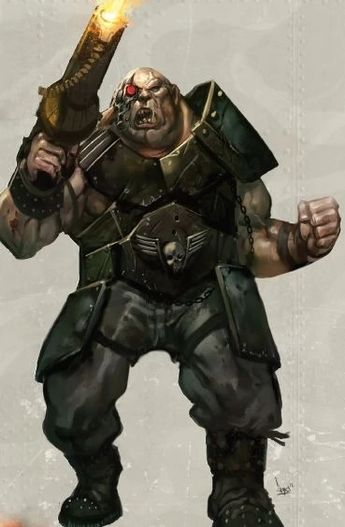

<!-- A0025-B0005 -->

原译文

Ogryn 欧格林

**校订译文**

Ogryn 欧格林

<!-- /A0025-B0005 -->

<!-- A0025-B0006 -->
## Overview 概述

<!-- /A0025-B0006 -->

<!-- A0025-B0007 -->
**英文原文**

Ogryns evolved on worlds with harsh and barren environments and high gravity. Most of these worlds, having no other use to humanity, were originally used as prison planets. Ogryns are large and bulky, standing between 2½ and 3 metres tall. The appearance of Ogryns varies according to their world of origin, but all are tough and powerful. Some forms are well-muscled, while others tend more toward grotesque obesity. Stupid and repulsively unhygienic, Ogryns have earned such names as Fats, Flabs, Slobs, Slabs, Big Men, Brutes, Behemoths, and Stenches. Ogryn populations produce mutant individuals to the same extent as humans. Ogryns have a genetic aversion to small, enclosed spaces which cause them no small amount of distress. When kept within a cramped area for prolonged periods, they will progressively distressed, then maddened, and eventually attempt to escape without regard for the safety of anything around them. Although no Ogryn ever truly feels comfortable confined in small spaces, some learn to suppress their fear and act normally, and others simply make the best of the situation when necessary.

<!-- /A0025-B0007 -->

<!-- A0025-B0008 -->

原译文

欧格林在恶劣贫瘠的环境和高重力的世界上进化。这些行星中的大多数对人类没有其他用途，最初被用作监狱行星。欧格林体型庞大，身高在2.5米至3米之间。欧格林的外观因其起源世界而异，但都是坚韧而强大的。有些肌肉发达，而另一些则更倾向于怪异的肥胖。愚蠢和令人厌恶的不卫生，让欧格林获得了诸如胖子、赘肉、邋遢、厚板、大个子、野兽、巨兽和恶臭等名字。欧格林人口产生突变个体的程度与人类相同。欧格林天生厌恶狭小封闭的空间，这给他们带来了不小的痛苦。当他们长时间被关在狭窄的区域内时，他们会逐渐感到痛苦，然后发疯，最终试图逃跑，而不考虑周围任何东西的安全。虽然没有一个欧格林真正感到被限制在狭小的空间里很舒服，但有些学会了抑制恐惧并正常行事，而另一些则只是在必要时充分利用这种情况。

**校订译文**

欧格林在环境恶劣、土地贫瘠的高重力世界演化而来。这些星球对人类往往别无用处，最初大多被当作监狱世界。欧格林身躯庞大，身高约为 2.5 至 3 米；外形虽因母星而异，却无一不强壮坚韧。有些肌肉发达，有些则异常肥胖。他们头脑简单，卫生状况又令人作呕，因此得了胖子、肥肉、邋遢鬼、石板、大块头、蛮汉、巨兽、臭佬等绰号。欧格林群体中出现变异个体的比例，与普通人类相当。他们天生厌恶狭小封闭的空间，身处其中便会极度不安。被长时间关在狭窄之处时，他们会越来越痛苦，继而发狂，最终不顾周围人或物的安全，强行逃离。没有欧格林会真正喜欢这种处境，但有些能压下恐惧，维持正常行动；另一些则在迫不得已时勉强忍耐。

<!-- /A0025-B0008 -->

<!-- A0025-B0009 -->
**英文原文**

The issue of Ogryn classification is one of the most contentious within the Administratum's Abhuman department. This complex strain is currently listed as seven distinct types (Alpha, Theta, Type IV, Type VIIa, H.S. gigantus gigantus, H.S. gigantus Cranopus, and the mysterious Grey Ogryns). Many within the department believe that many of these classifications are all separate types, and another revision of strain classification is required. Vat-grown strains of Ogryn exist and are sometimes taken to sectors without a native population.

<!-- /A0025-B0009 -->

<!-- A0025-B0010 -->

原译文

欧格林分类问题是内务部的亚人部内最具争议的问题之一。这种复杂的种族目前被列为七种不同的类型（阿尔法、西塔、IV型、VIIa型、H.S超巨型.、H.S.巨肢型和神秘的灰欧格林）。该部的许多人认为，这些分类中的许多都是单独的类型，需要对种族分类进行另一次修订。存在缸生长的欧格林种族，有时会被带到没有当地人口的地区。

**校订译文**

欧格林的分类，是内政部亚人事务机构中争议最大的问题之一。目前，这一复杂分支被列为七类：阿尔法型、西塔型、IV 型、VIIa 型、H.S. gigantus gigantus、H.S. gigantus Cranopus，以及神秘的灰欧格林。该机构中许多人认为，现有分类中的群体还应进一步区分，因此需要再次修订分类体系。此外，也存在人工培养缸培育的欧格林分支，有时会被送往原本没有欧格林种群的星区。

**校注：** 分类层级与第24篇同样存在含混，暂保留七类及修订争议。拉丁分类名原样保留，不把 gigantus Cranopus 擅自翻成“巨肢型”。

<!-- /A0025-B0010 -->

<!-- A0025-B0011 图片 -->
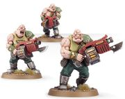

<!-- A0025-B0012 -->

原译文

Ogryns 欧格林

**校订译文**

Ogryns 欧格林

<!-- /A0025-B0012 -->

<!-- A0025-B0013 -->
## Ogryn Worlds 欧格林世界

<!-- /A0025-B0013 -->

<!-- A0025-B0014 -->
**英文原文**

It is fairly common for Ogryn worlds to have once be ancient human Penal Worlds from ages predating the Imperium's existence. Ogryn tribes on their home worlds tend to be highly territorial and superstitious. It can be seen as abnormal for an Ogryn from such as world to have an interest in the Imperial Cult. However, some Ogryn take a liking to the tales of Missionaries would visit these worlds. Not much is known of their culture aside from the largest among them tend to lead a tribe and they tend to tell tales of their vague histories. These world tend to be able to readily defend themselves from invading forces, such as Chaos Space Marines.

<!-- /A0025-B0014 -->

<!-- A0025-B0015 -->

原译文

欧格林世界曾经是帝国存在之前的古代人类刑罚世界，这是相当普遍的。欧格林部落在他们的家园世界往往具有高度的领土性和迷信性。对于一个来自这样一个世界的欧格林来说，对帝国教派感兴趣是不正常的。然而，一些欧格林喜欢传教士拜访这些世界的故事。除了他们中最大的一个倾向于领导一个部落，他们倾向于讲述他们模糊的历史之外，人们对他们的文化知之甚少。这些世界往往能够很容易地防御入侵部队，如混沌星际战士。

**校订译文**

许多欧格林世界原本是帝国建立以前的人类刑罚世界。母星上的欧格林部落通常领地意识强烈，也极为迷信；出身于这种环境的欧格林若对帝皇信仰感兴趣，反而可能被视为异类。不过，仍有一些欧格林喜欢聆听到访传教士讲述的故事。外界对他们的文化所知不多，只知道部落通常由体型最大的成员领导，而族人会讲述那些记忆模糊的历史传说。这些世界往往颇有自卫能力，甚至能够抵挡混沌星际战士等入侵者。

<!-- /A0025-B0015 -->

<!-- A0025-B0016 -->
## Imperial Guard 帝国卫队

<!-- /A0025-B0016 -->

<!-- A0025-B0017 -->
**英文原文**

The Imperium puts the Ogryns' qualities to good use: their strength and lack of intellectual complexity make them ideal warriors for the Imperial Guard. The concentration of the Ogryns' brutal power creates formidable assault forces. Once introduced into the Imperial Cult, Ogryns develop an unshakable and almost childlike faith in the Emperor, seeing Him as watching over their every action on the battlefield. Each order they receive is viewed as having worked its way down the hierarchy from the Emperor, and is followed without question and to the best of their ability.

<!-- /A0025-B0017 -->

<!-- A0025-B0018 -->

原译文

帝国充分利用了欧格林的质量：他们的力量和缺乏智力复杂性使他们成为帝国卫队的理想战士。欧格林残暴力量的集中创造了强大的突击部队。一旦被引入帝国教派，欧格林就对帝皇产生了不可动摇的、近乎孩子般的信仰，认为帝皇会监视他们在战场上的每一个行动。他们收到的每一个命令都被视为从帝皇那里逐级向下执行，并被毫无疑问地尽其所能地遵循。

**校订译文**

帝国充分利用欧格林的特质：他们力量强大、心思简单，是帝国卫队理想的战士。将这种蛮力集中起来，便能组成可怕的突击力量。一旦接受帝皇信仰，欧格林就会对帝皇产生坚定不移、近乎孩童般的信赖，相信帝皇注视着自己在战场上的一举一动。在他们看来，每一道命令都由帝皇发出，再沿指挥层级逐级传达，因此必须毫不质疑、竭尽全力地执行。

<!-- /A0025-B0018 -->

<!-- A0025-B0019 图片 -->
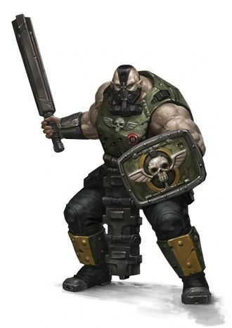

<!-- A0025-B0020 -->

原译文

Ogryn of the Imperial Guard 帝国卫队欧格林

**校订译文**

Ogryn of the Imperial Guard 帝国卫队欧格林

<!-- /A0025-B0020 -->

<!-- A0025-B0021 -->
**英文原文**

Although Ogryn worlds provide troops for the Imperial Guard like any other inhabited Imperial world, the standard practice of raising regiments is not used for Ogryns. Units of Ogryns are instead attached to the regiments of other worlds. Like most specialist abhuman troops, they're typically assigned from the Militarum Auxilla. The unit consists of squads, each led by an Ogryn Sergeant who has received BONE treatment, allowing them to communicate orders to their squad. Ogryns have a particular respect for Commissars, whom they see as closest to their beloved Emperor. Ogryns are also naturally claustrophobic, meaning they are reluctant to enter the cramped confines of Chimera carriers. In caution of this psychological foible, Militarum commanders often counsel against ‘overcrowding’ field transports of Auxilla and to avoid ogryn deployment within terrain that might be perceived as ‘too restrictive’.

<!-- /A0025-B0021 -->

<!-- A0025-B0022 -->

原译文

尽管欧格林世界像其他有人居住的帝国世界一样为帝国卫队提供部队，但欧格林并不采用组建兵团的标准做法。欧格林部队转而隶属于其他世界的兵团。与大多数亚人特种部队一样，他们通常是从亚人辅助军中指派的。该部队由小队组成，每个小队由一名接受钻研手术的欧格林军士领导，使他们能够向小队传达命令。欧格林特别尊重政委，他们认为政委最接近他们深爱的帝皇。欧格林天生也有幽闭恐惧症，这意味着他们不愿意进入奇美拉运兵车的狭窄空间。出于对这种心理弱点的警惕，军务指挥官经常建议不要让辅助军的野战运输“过度拥挤”，并避免在可能被认为“过于限制”的地形内部署欧格林。

**校订译文**

欧格林世界同其他有人居住的帝国世界一样，为帝国卫队提供兵员，但通常不按一般方式独立组建兵团。欧格林部队会被配属给其他世界的兵团；与多数承担专门任务的亚人部队一样，他们通常由军务辅助部队调派。其编制以小队为单位，每队由一名接受过欧格林生化神经增强（BONE）的欧格林军士率领，以便理解命令并传达给队员。欧格林尤其尊重政委，认为他们最接近自己深爱的帝皇。欧格林又天生惧怕幽闭空间，不愿钻进奇美拉运兵车狭窄的车厢。考虑到这一心理弱点，星界军指挥官往往建议，运送辅助部队时避免把车厢塞得过满，也不要把欧格林部署到他们可能觉得过于局促的地形中。

**校注：** BONE 是 Biochemical Ogryn Neural Enhancement 的缩写，原译“钻研手术”错误；采用与第24篇一致的“欧格林生化神经增强”。

<!-- /A0025-B0022 -->

<!-- A0025-B0023 -->
**英文原文**

During the Horus Heresy, Ogryns fought on both sides of the conflict. It is believed that those who took the side of the traitors were told that they were actually fighting for the Emperor, and the loyalists were the traitors.

<!-- /A0025-B0023 -->

<!-- A0025-B0024 -->

原译文

在荷鲁斯叛乱时期，欧格林在冲突双方都进行了战斗。据信，那些站在叛徒一边的人被告知，他们实际上是在为帝皇而战，而忠诚派就是叛徒。

**校订译文**

荷鲁斯之乱期间，交战双方都有欧格林参战。人们相信，站在叛军一方的欧格林遭到了欺骗：他们被告知自己正在为帝皇而战，真正的忠诚派才是叛徒。

<!-- /A0025-B0024 -->

<!-- A0025-B0025 -->
**英文原文**

Outside of the Imperial Guard, Ogryns are sometimes modified by the Adeptus Mechanicus into servitors and adapted to tasks where great size and strength are required. Ogryns are also used as heavy lifters and miners in some Imperial mining operations.

<!-- /A0025-B0025 -->

<!-- A0025-B0026 -->

原译文

在帝国卫队之外，欧格林有时会被机械神教改造成机仆，并适应需要大尺寸和力量的任务。欧格林在帝国的一些采矿作业中也被用作重型起重机和矿工。

**校订译文**

在帝国卫队之外，机械修会有时会把欧格林改造成机仆，让他们承担需要巨大体型与力量的工作。帝国某些矿业设施也让欧格林充当重物搬运工和矿工。

<!-- /A0025-B0026 -->

<!-- A0025-B0027 -->
## Equipment 装备

<!-- /A0025-B0027 -->

<!-- A0025-B0028 -->
**英文原文**

Most ogryn squads are armed with ripper guns, weapons designed to be 'ogryn-proof', built simply and durably enough to double as clubs for the melee-inclined ogryns. They also carry frag grenades and wear flak armour.

<!-- /A0025-B0028 -->

<!-- A0025-B0029 -->

原译文

大多数欧格林小队都配备了开膛枪，这种武器被设计成“防欧格林”的，制造简单耐用，足以作为近战倾向的欧格林的棍棒。他们还携带破片手榴弹，身穿防弹盔甲。

**校订译文**

多数欧格林小队装备撕裂枪。这种武器的设计考虑到了欧格林的粗暴使用习惯，结构简单、结实耐用，足以让偏爱近战的欧格林把它当作棍棒挥打。他们还携带破片手雷，穿着防弹甲。

**校注：** ogryn-proof 在此指经得起欧格林粗暴使用，绝非防御欧格林的武器；Ripper Gun 采用官译“撕裂枪”。

<!-- /A0025-B0029 -->

<!-- A0025-B0030 -->
## Regimental use 兵团中的运用

原题：Regimental use 兵团使用

<!-- /A0025-B0030 -->

<!-- A0025-B0031 -->
**英文原文**

Regiments which are known to use ogryns include the Catachan Jungle Fighters, Savlar Chem-Dogs, and Kanak Skull Takers. Ogryn units include the Krourk Ogryn Auxilia and Monglor Ogryn Auxilia.

<!-- /A0025-B0031 -->

<!-- A0025-B0032 -->

原译文

已知使用欧格林的兵团包括卡塔昌丛林战士、萨夫拉化学狗和卡纳克夺颅者。欧格林部队包括克鲁克欧格林辅助军和蒙格勒欧格林辅助军。

**校订译文**

已知使用欧格林的兵团，包括卡塔昌丛林斗士、萨夫拉化学犬与卡纳克夺颅者。专门的欧格林部队则有克鲁克欧格林辅助军和蒙格勒欧格林辅助军。

**校注：** 已核同一人物、组织、型号或事件，与全书核心术语及后续专篇统一；原译保留对照。

<!-- /A0025-B0032 -->

<!-- A0025-B0033 -->
**英文原文**

Some ogryns are native to deathworlds, but where they are not, certain deathworld regiments will ‘acquire’ squads of them, often without informing their previous commanders.

<!-- /A0025-B0033 -->

<!-- A0025-B0034 -->

原译文

有些欧格林是死亡世界的原住民，但在他们不在的地方，某些死亡世界兵团会“获得”他们的小队，通常不会通知他们之前的指挥官。

**校订译文**

有些死亡世界本就有欧格林原住民；至于没有这种族群的世界，其兵团有时也会设法“弄来”几个欧格林小队，而且往往不通知这些小队原来的指挥官。

<!-- /A0025-B0034 -->

<!-- A0025-B0035 图片 -->
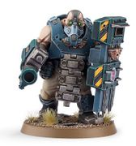

<!-- A0025-B0036 -->

原译文

Bullgryn 牛格林

**校订译文**

Bullgryn 牛格林

<!-- /A0025-B0036 -->

<!-- A0025-B0037 -->
## Bullgryn 牛格林

<!-- /A0025-B0037 -->

<!-- A0025-B0038 -->
**英文原文**

Bullgryns are specialised, heavily armed ogryns used for close assault operations by the Imperial Guard. They wear heavy carapace armour and carry assault weapons like power mauls to capitalise on the creature's size and resilience. For firepower, they often wield grenadier gauntlets. The simple but effective slab shields are their trademark, locking together to form a mobile defence line. So deployed, these units provide their comrades with a wall of walking cover as they advance across the battlefield, soaking up vast volumes of enemy fire in the process.

<!-- /A0025-B0038 -->

<!-- A0025-B0039 -->

原译文

牛格林是专业的、全副武装的欧格林，用于帝国卫队的近战突击行动。他们穿着厚重的甲壳盔甲，携带攻击性武器，如动力槌，以利用生物的体型和韧性。为了火力，他们经常挥舞掷弹臂铠。简单但有效的板状盾牌是他们的标志，它们锁在一起形成一条可移动的防线。如此部署，这些部队在穿越战场时为他们的战友提供了一堵行走的掩护墙，在此过程中吸收了大量的敌人火力。

**校订译文**

牛格林是帝国卫队用于近距离突击的特种欧格林，装备格外厚重。他们身穿重型甲壳甲，携带动力槌等突击武器，充分发挥庞大体型和顽强体魄的优势；远程火力则常由榴弹臂铠提供。简单而有效的厚重盾牌是他们的标志，这些盾牌能够相互扣合，组成移动防线。以这种方式部署时，牛格林便化为一道行走的掩体，掩护战友穿越战场，同时承受大量敌方火力。

<!-- /A0025-B0039 -->

<!-- A0025-B0040 图片 -->
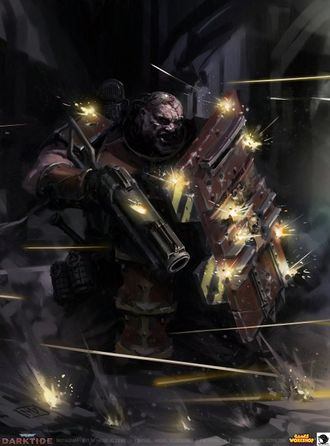

<!-- A0025-B0041 -->

原译文

Bullgryn 牛格林

**校订译文**

Bullgryn 牛格林

<!-- /A0025-B0041 -->

<!-- A0025-B0042 -->
## Ogryn Bodyguard 欧格林保镖

原题：Ogryn Bodyguard 欧格林护卫

<!-- /A0025-B0042 -->

<!-- A0025-B0043 -->
**英文原文**

Astra Militarum ogryn that are particularly capable warriors are made into bodyguards and charged with protecting the Militarum's officers. They can serve in their assigned officer's command squads and will often prove to be invaluable by throwing themselves into the line of fire or slaughtering those that threaten their wards. Ogryn bodyguards are equipped with either a grenadier gauntlet or ripper gun as well as a bullgryn maul or huge combat knife. Their melee weapon can also be swapped for either a brute or slab shield. They can also be converted into mutant monstrosities.

<!-- /A0025-B0043 -->

<!-- A0025-B0044 -->

原译文

星界军欧格林是特别有能力的战士，被作为护卫，负责保护星界军的军官。他们可以在指定的军官指挥组中服役，并经常被证明是无价的，因为他们会把自己扔进火线或屠杀那些威胁他们的保护的人。欧格林护卫配备了掷弹臂铠或开膛枪，以及一把牛格林槌或巨大的战斗刀。他们的近战武器也可以换成残酷或板盾。它们也可以转化为变种怪物。

**校订译文**

星界军会从欧格林中挑选格外善战的个体，让他们担任保镖，专门保护军官。他们可以编入受保护军官的指挥组，以身体挡下火力，或杀死一切威胁保护对象的敌人，因此往往成为无可替代的随从。欧格林保镖配有榴弹臂铠或撕裂枪，以及牛格林巨槌或巨型战斗刀；其近战武器也可以换成简易护盾或厚重盾牌。原文还提到，他们可以被改造成变种怪物。

**校注：** 此处装备换装方式与改造为变种怪物的说法按所给英文保留。核对官方名称不代表同时核实了这段叙述适用于当前规则版本。

<!-- /A0025-B0044 -->

<!-- A0025-B0045 图片 -->
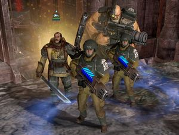

<!-- A0025-B0046 -->

原译文

Cadian 8th Ogryn accompany Lord General Castor into battle along with his retinue 卡迪亚第八兵团的欧格林陪同领主将军卡斯托的随从一起投入战斗

**校订译文**

Cadian 8th Ogryn accompany Lord General Castor into battle along with his retinue 卡迪亚第八兵团的欧格林与随从们一同护卫领主将军卡斯托投入战斗

<!-- /A0025-B0046 -->

<!-- A0025-B0047 -->
**英文原文**

Astra Militarum Lord Generals can have the option to assign an Ogryn as a bodyguard for his or her retinue to accompany them during battle. One such example would be Lord General Castor.

<!-- /A0025-B0047 -->

<!-- A0025-B0048 -->

原译文

星界军的领主将军可以选择指派一名欧格林作为其随从保镖，在战斗中陪伴他们。一个这样的例子就是领主将军卡斯托。

**校订译文**

星界军的领主将军可以把一名欧格林保镖编入随从队伍，让其在战斗中随行保护。领主将军卡斯托便有这样的护卫。

<!-- /A0025-B0048 -->

<!-- A0025-B0049 图片 -->
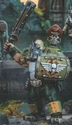

<!-- A0025-B0050 -->

原译文

Ogryn Bodyguard 欧格林护卫

**校订译文**

Ogryn Bodyguard 欧格林保镖

<!-- /A0025-B0050 -->

<!-- A0025-B0051 -->
## Bone'ead 聪明头

<!-- /A0025-B0051 -->

<!-- A0025-B0052 -->

原译文

Don’t that bother you, mate? That we may be in competition with a person evidently capable of reaching out and taking life with an impunity what borders on the divine? If I weren’t a massive idiot with little regard for his own mortality, I reckon I’d be proper crapping meself right now. - Clodde, Ogryn Bone'ead (Deserter) 伙计，你不觉得困扰吗？我们可能会与一个显然能够逍遥法外地伸出手夺走生命的人角逐，这近乎于神圣？如果我不是一个对自己的死亡毫不关心的大白痴，我想我现在就应该好好地骂自己了。— 克洛德，欧格林聪明头（逃兵）

**校订译文**

Don’t that bother you, mate? That we may be in competition with a person evidently capable of reaching out and taking life with an impunity what borders on the divine? If I weren’t a massive idiot with little regard for his own mortality, I reckon I’d be proper crapping meself right now. - Clodde, Ogryn Bone'ead (Deserter) 伙计，你就不怕吗？咱们可能要跟这么个人争：他显然能随手取人性命，却几乎像神一样不受惩罚。要不是我这个大傻个压根不怎么在乎自己的小命，我现在怕是早就吓得拉裤子了。——克洛德，欧格林聪明头（逃兵）

**校注：** crapping meself 在此为粗俗的恐惧表达，译为“吓得拉裤子”，原译“骂自己”误解词义；保留角色口吻。

<!-- /A0025-B0052 -->

<!-- A0025-B0053 -->
**英文原文**

The most intelligent individuals among Ogryns undergo an augmentative chemical process called Biochemical Ogryn Neural Enhancement (BONE), which increases their intelligence further and makes them ideal as sergeants (BONEheads, or Bone'eads) of Ogryn squads. These Ogryn are sometimes branded with an Aquila, such as on their arm, to indicate they've received this neural enhancement. The Bone'ead implants don't so much insert thoughts into their minds, rather they instil more an overall sense of things that transcends articulation and its inherent perceptual bias and spoke instead of direct yet universal experience. Those who take to the implant might find it quite nice. This augment allows Ogryns to address tactics or lecture on philosophies exceeding their own understanding, but feel right in speaking about regardless. Sometimes the bone 'ead implant doesn't take, usually resulting in the Ogryn being less intelligent than before the procedure. In these cases they can simply return to their old duties.

<!-- /A0025-B0053 -->

<!-- A0025-B0054 -->

原译文

欧格林中最聪明的会经历一种称为生化欧格林神经增强（钻研）的增强化学过程，这进一步提高了他们的智力，使他们成为欧格林小队的理想军士（聪明脑袋或聪明头）。这些欧格林有时会被打上天鹰的烙印，比如在他们的手臂上，以表明他们已经接受了这种神经增强。聪明头植入物并没有在他们的脑海中插入太多的想法，相反，它们更多地灌输了一种超越表达及其固有的感知偏见的整体感觉，而不是直接但普遍的经验。那些接受植入手术的可能会觉得它很好。这种增强使欧格林能够讨论超出他们自己理解范围的策略或哲学讲座，但无论如何都可以畅所欲言。有时聪明头植入物不起作用，通常会导致欧格林比手术前更不聪明。在这种情况下，他们可以简单地回到原来的职责。

**校订译文**

欧格林中最聪明的个体，会接受一种名为“欧格林生化神经增强”（Biochemical Ogryn Neural Enhancement，简称 BONE）的化学强化程序，以进一步提高智力，成为欧格林小队的理想军士。他们被称为 BONEheads 或 Bone’eads，即“聪明头”。有些人会在手臂等部位烙上天鹰标志，表明已经接受过这种神经强化。聪明头植入物并非直接把具体想法塞进他们脑海，而是赋予一种对事物的整体直觉：这种理解超越语言表达及其固有的感知偏差，更接近直接而普遍的体验。成功适应植入物的欧格林，可能觉得这种感觉相当不错。强化后的他们，能讨论甚至讲解超出自身理解范围的战术或哲学，却仍觉得这些话说得很有道理。有时植入物并不奏效，反而使欧格林比手术前更迟钝；这类个体通常会被送回原来的岗位。

**校注：** 原文描述植入物效果的一句含 spoke instead of 等不连贯结构；暂按整体直觉、直接体验的语义理解，句法仍待回查来源。

<!-- /A0025-B0054 -->

<!-- A0025-B0055 图片 -->
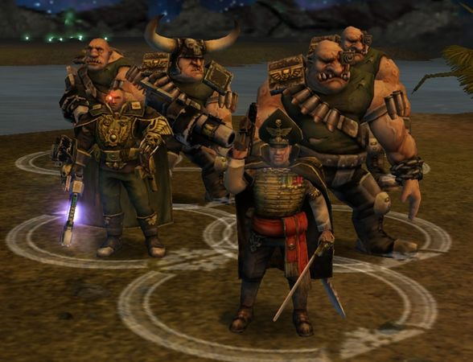

<!-- A0025-B0056 -->

原译文

Vance Stubbs and Doran Farrier accompanied by a Bone'ead Squad during the Kaurava Campaign 在考拉瓦战役中，万斯·斯塔布斯和多兰·法里尔在一支聪明头小队的陪同下

**校订译文**

Vance Stubbs and Doran Farrier accompanied by a Bone'ead Squad during the Kaurava Campaign 考拉瓦战役期间，一支聪明头小队护卫万斯·斯塔布斯与多兰·法里尔

<!-- /A0025-B0056 -->

<!-- A0025-B0057 -->
**英文原文**

Bone'ead Squad members are chosen from Bone'ead Ogryns who show the most potential despite their primitive cognitive abilities. Their main purpose is to serve and protect Astra Militarum Generals or Imperial Governors from the gravest threats on the battlefield. General Vance Stubbs had one Ogryn Bone'ead Squad accompany him during the Kaurava Campaign. Governor-Militant Lukas Alexander had at least one Ogryn Bone'ead Squad accompany him during the Dark Crusade on Kronus.

<!-- /A0025-B0057 -->

<!-- A0025-B0058 -->

原译文

聪明头小队成员是从聪明头欧格林中选出的，尽管他们的认知能力很原始，但他们表现出了最大的潜力。他们的主要目的是服役和保护星界军将军或帝国总督免受战场上最严重的威胁。在考拉瓦战役中，万斯·斯塔布斯将军有一个欧格林聪明头小队陪同他。在克罗诺斯的黑暗远征期间，军务总督卢卡斯·亚历山大至少有一个欧格林聪明头小队陪同他。

**校订译文**

聪明头小队会从接受过强化的欧格林中，挑选最有潜力的个体；即便如此，他们的认知能力仍然相当有限。这些小队主要负责保护星界军将军或帝国总督，使其免受战场上最严重的威胁。考拉瓦战役期间，万斯·斯塔布斯将军便有一支欧格林聪明头小队随行；在克洛诺斯的黑暗远征中，军务总督卢卡斯·亚历山大也至少配有一支。

<!-- /A0025-B0058 -->

<!-- A0025-B0059 图片 -->
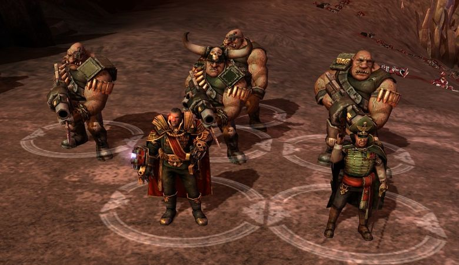

<!-- A0025-B0060 -->

原译文

Lukas Alexander and Anton Gebbet accompanied by a Bone'ead Squad during the Dark Crusade on Kronus 在克罗诺斯的黑暗远征中，卢卡斯·亚历山大和安东·盖贝特在一支聪明头小队的陪同下。

**校订译文**

Lukas Alexander and Anton Gebbet accompanied by a Bone'ead Squad during the Dark Crusade on Kronus 克洛诺斯的黑暗远征期间，一支聪明头小队护卫卢卡斯·亚历山大与安东·盖贝特。

<!-- /A0025-B0060 -->

<!-- A0025-B0061 -->
**英文原文**

During the Third Aurelian Crusade at least one squad of Ogryn Bone 'Eads would be assigned to Lord General Castor as a Honour Guard and accompany him into battle.

<!-- /A0025-B0061 -->

<!-- A0025-B0062 -->

原译文

在第三次奥瑞利安远征期间，至少有一支欧格林聪明头小队将被指派给领主将军卡斯托担任荣誉卫队，并陪同他参加战斗。

**校订译文**

第三次奥瑞利安远征期间，至少有一支欧格林聪明头小队被分配给领主将军卡斯托，担任荣誉卫队并随其作战。

<!-- /A0025-B0062 -->

<!-- A0025-B0063 图片 -->
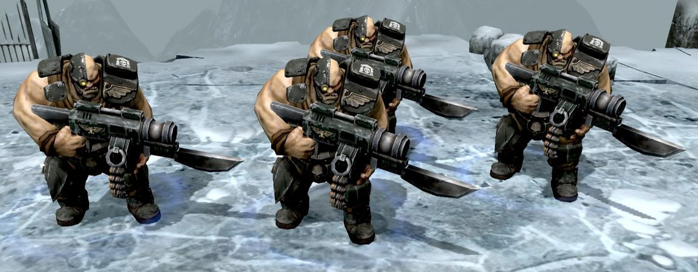

<!-- A0025-B0064 -->

原译文

Cadian 8th Ogryn Bone 'Ead Squad deployed during the Third Aurelian Crusade 在第三次奥瑞利安远征期间部署的卡迪亚第八兵团欧格林聪明头小队。

**校订译文**

Cadian 8th Ogryn Bone 'Ead Squad deployed during the Third Aurelian Crusade 在第三次奥瑞利安远征期间部署的卡迪亚第八兵团欧格林聪明头小队。

<!-- /A0025-B0064 -->

<!-- A0025-B0065 -->
## Ogryn Charonite 喀戎欧格林

<!-- /A0025-B0065 -->

<!-- A0025-B0066 -->
**英文原文**

Ogryn Charonites were biochemically and cybernetically enhanced Ogryns used by the Imperial Army during the Horus Heresy.

<!-- /A0025-B0066 -->

<!-- A0025-B0067 -->

原译文

喀戎欧格林是帝国军队在荷鲁斯叛乱期间使用的生化和智控增强的欧格林。

**校订译文**

喀戎欧格林是接受过生化强化与机械改造的欧格林，曾在荷鲁斯之乱期间为帝国军效力。

<!-- /A0025-B0067 -->

<!-- A0025-B0068 -->
## Gun Lugger 重枪手

<!-- /A0025-B0068 -->

<!-- A0025-B0069 -->
**英文原文**

Gun Luggers are Ogryn in a regiment who have an affinity for great firepower and a higher degree of firearm dexterity, for an Ogryn. Once they begin firing, Gun Luggers rarely stop until they either run out of ammo or enemies to shoot. The exuberance evoked from expending untold rounds toward an enemy is hardly hampered by their accuracy, range, or any obstacles between them and the target. They are often equipped with high explosives and mines that they throw with a fair amount of inaccuracy. However that is made up for by higher yield explosives or simply throwing a whole bandolier of grenades at once.

<!-- /A0025-B0069 -->

<!-- A0025-B0070 -->

原译文

重枪手是兵团中的欧格林，他们对强大的火力和更高程度的灵巧枪支有着浓厚的兴趣。一旦他们开始射击，重枪手很少停下来，直到弹药耗尽或敌人无法射击。向敌人发射无数发炮弹所引发的兴奋几乎不会受到它们的准确性、射程或它们与目标之间的任何障碍的阻碍。他们经常配备高爆炸药和地雷，但投掷时相当不准确。然而，这可以通过更高当量的炸药或简单地一次性投掷一整串手榴弹来弥补。

**校订译文**

重枪手是兵团中偏爱强大火力的欧格林，相比同族，也更擅长操持枪械。一旦开火，他们便很少停手，直到弹药耗尽，或再也没有敌人可打。向敌人倾泻无数弹药的兴奋感，几乎不受命中率、射程或目标与自己之间障碍物的影响。他们还常携带高爆炸药与地雷，虽然扔得不准，却能用更大的爆炸威力弥补，或干脆一次扔出整条手雷带。

<!-- /A0025-B0070 -->

<!-- A0025-B0071 图片 -->
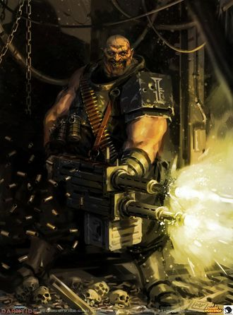

<!-- A0025-B0072 -->

原译文

Gun Lugger serving as an Inquisitorial Acolyte 重枪手作为审判官侍从

**校订译文**

Gun Lugger serving as an Inquisitorial Acolyte 一名担任审判官侍从的重枪手

<!-- /A0025-B0072 -->

<!-- A0025-B0073 -->
**英文原文**

Gun Lugger are often beacons of morale for nearby soldiers. Essentially a mobile heavy weapons platform, they stand stalwart in the face of any oncoming fire, sometimes advancing through straight through it. When multiple Gun Luggers are in proximity, they often form competitions to see who can kill the biggest target or rack up the highest number of confirmed kills.

<!-- /A0025-B0073 -->

<!-- A0025-B0074 -->

原译文

重枪手经常是附近士兵士气的灯塔。从本质上讲，它们是一个移动式重型武器平台，面对任何迎面而来的火力，它们都会坚定地站着，有时会直接穿过它。当多个重枪手靠近时，它们经常形成竞争，看谁能杀死最大的目标或获得最多的确认死亡人数。

**校订译文**

重枪手常能振奋身边士兵的士气。他们如同移动的重武器平台，迎着猛烈火力依旧岿然不动，有时甚至直接顶着炮火前进。几名重枪手聚在一起时，往往会互相较劲，比谁干掉的目标最大，或比谁的确认击杀数最多。

<!-- /A0025-B0074 -->

<!-- A0025-B0075 -->
## Feral Ogryns 蛮野欧格林

原题：Feral Ogryns 野蛮欧格林

<!-- /A0025-B0075 -->

<!-- A0025-B0076 -->
**英文原文**

The populations of some Ogryn worlds are so debased and primitive that they are only useful as vicious assault troops, the planet having little else to offer the Imperium. Ogryns native to these worlds have been left to develop their warlike society that many view as little better than that of the Orks who plague the Imperium. Imperial landing parties will descend upon these feral worlds in times of crisis, capture several tribes, and take the Ogryns to fight on battlefields many light-years away from their homes. In combat, feral Ogryns are a terrible sight to behold.

<!-- /A0025-B0076 -->

<!-- A0025-B0077 -->

原译文

一些欧格林行星的人口是如此的恶劣和原始，以至于他们只能作为狂暴的突击部队，这个行星几乎没有其他东西可以提供给帝国。这些世界的欧格林被留下来发展他们好战的社会，许多人认为这个社会并不比困扰帝国的欧克好多少。帝国登陆队将在危机时刻降落这些蛮荒世界，占领几个部落，并将欧格林带到离家数光年远的战场上作战。在战斗中，野蛮奥格林是一个可怕的景象。

**校订译文**

某些欧格林世界的居民极其蒙昧原始，唯一能为帝国提供的价值，就是充当凶悍的突击兵。帝国任由这些族群发展出好战的社会，许多人认为，其野蛮程度比长期侵扰帝国的欧克蛮人好不了多少。危机来临时，帝国登陆部队便会降临这些蛮荒世界，抓走几个部落，把欧格林送到离家许多光年的战场上。投入战斗的蛮野欧格林，是令人胆寒的景象。

<!-- /A0025-B0077 -->

<!-- A0025-B0078 -->
**英文原文**

Very few Imperial Guard officers will even try to teach them the relatively complex operation of a ripper gun. Instead, crude but deadly close-combat weapons are hastily manufactured for newly raised regiments. Thus, the Ogryns are encouraged to perform in combat as they have become accustomed - as vicious, close-combat troops. In battle, Ogryns are all but uncontrollable. Thus, they are used sparingly, with just 1 or 2 squads being assigned to any one action alongside other forces.

<!-- /A0025-B0078 -->

<!-- A0025-B0079 -->

原译文

很少有帝国卫队军官会尝试教他们相对复杂的开膛枪操作。相反，为新组建的兵团匆忙制造了粗糙但致命的近战武器。因此，鼓励欧格林在战斗中表现出他们已经习惯的样子 — 作为凶猛的近战部队。在战斗中，欧格林几乎无法控制。因此，他们被谨慎使用，只有一两个小队与其他部队一起被分配到任何一个行动中。

**校订译文**

几乎没有帝国卫队军官愿意教他们操作相对复杂的撕裂枪。为新征集的部队仓促制造的，通常是粗糙却致命的近战武器，让这些欧格林继续以熟悉的方式厮杀，充当凶猛的近战突击兵。蛮野欧格林一旦开战，便几乎无法控制，因此帝国很少大量投入；通常一次行动只配属一两个小队，与其他部队并肩作战。

<!-- /A0025-B0079 -->

<!-- A0025-B0080 -->
## Ogryn Mercenaries 欧格林雇佣兵

<!-- /A0025-B0080 -->

<!-- A0025-B0081 -->
**英文原文**

Ogryn also serve as Mercenaries and are known for working with almost anyone who can pay their price. This even includes Pirates and Orks.

<!-- /A0025-B0081 -->

<!-- A0025-B0082 -->

原译文

欧格林也是雇佣兵，以与几乎任何能够付出代价的人合作而闻名。这甚至包括海盗和欧克。

**校订译文**

欧格林也会成为雇佣兵。几乎任何雇主只要付得起价钱，都能招到他们，甚至包括海盗和欧克蛮人。

<!-- /A0025-B0082 -->

<!-- A0025-B0083 -->
## Other Variations 其他变体

<!-- /A0025-B0083 -->

<!-- A0025-B0084 -->
## Ogryn Slaves 欧格林奴隶

<!-- /A0025-B0084 -->

<!-- A0025-B0085 -->
**英文原文**

Ogryns are incredibly strong, durable, and remarkably loyal, making up for their lack of intelligence. This strength and subservient nature makes Ogryns desirable slaves throughout the Imperium. Ogryn slaves often make up large portions of slave populations dedicated to heavy labour, such as in mining operations or heavy industrial labour in hive city factorums. They are slow to learn news tasks, but once a lesson is understood it sticks in their minds forever. Like most abhumans, they are treated as subhuman, and slavemasters often command their human slaves to not treat abhumans as anything approaching equals.

<!-- /A0025-B0085 -->

<!-- A0025-B0086 -->

原译文

欧格林非常强壮、耐用，而且非常忠诚，弥补了他们的智力不足。这种力量和顺从的天性使欧格林在整个帝国中成为理想的奴隶。欧格林奴隶通常占从事重体力劳动的奴隶人口的很大一部分，例如在采矿作业或巢都城市工厂的重工业劳动中。他们学习新任务的速度很慢，但一旦理解了一个教训，它就会永远留在他们的脑海里。像大多数亚人一样，他们被视为非人，奴隶主经常命令他们的人类奴隶不要将任何亚人视为接近平等的存在。

**校订译文**

欧格林极其强壮、耐打，也异常忠诚，这些特质弥补了他们智力上的不足。他们力量大、性情顺从，因此在整个帝国都被视为理想的奴隶。在采矿和巢都工厂重工业等重体力劳动领域，欧格林往往占奴隶人口的很大比例。他们学习新工作很慢，但一旦真正学会，便永远不会忘记。与多数亚人一样，他们被贬为低于人类的存在；奴隶主还常命令人类奴隶，绝不能把亚人当成哪怕稍有平等地位的同类。

<!-- /A0025-B0086 -->

<!-- A0025-B0087 图片 -->
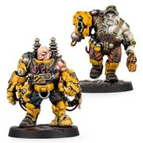

<!-- A0025-B0088 -->

原译文

Slave Ogryns 欧格林奴隶

**校订译文**

Slave Ogryns 欧格林奴隶

<!-- /A0025-B0088 -->

<!-- A0025-B0089 -->
**英文原文**

On worlds like Necromunda, Slave Ogryn runaways are sometimes taken in from their previous slave-labour roles to instead work in Squat holdfasts. There they work side by side with the Squat prospectors as fellow excavators or ore extractors, as well as fighters. In the Necromundan wastes, there are several holdfasts of the Squats having a significant population of Ogryns, whom they treat as equals.

<!-- /A0025-B0089 -->

<!-- A0025-B0090 -->

原译文

在像涅克罗蒙达这样的世界里，欧格林奴隶逃亡者有时会从他们以前的奴隶劳工角色中被带到矮人要塞工作。在那里，他们和矮人探矿者并肩工作，作为挖掘者或矿石开采者，以及战士。在涅克罗蒙达的废墟中，有几个拥有大量欧格林的矮人要塞，他们平等对待他们。

**校订译文**

在涅克罗蒙达等世界，逃亡的欧格林奴隶有时会得到矮人据点收留，摆脱原来的苦役生活。他们与矮人探矿者并肩挖掘、采矿，也一同作战。涅克罗蒙达荒原上的一些矮人据点，有相当数量的欧格林居民；矮人把他们当作平等的伙伴。

<!-- /A0025-B0090 -->

<!-- A0025-B0091 -->
## Ogryn Psykers 欧格林灵能者

<!-- /A0025-B0091 -->

<!-- A0025-B0092 -->
**英文原文**

Though the Imperial Cult states that Ogryns are too dim-witted to become psykers (not normally relevant; standard human psykers can be intelligent or dim-witted), this has changed in the wake of the Great Rift's creation. A Penal Legion ogryn named Cassia displayed psychic abilities in battle and soon joined Lord Inquisitor Falx's retinue. The Inquisitor believes the Great Rift caused Cassia to become a psyker and suspects that many more ogryns will start to develop psychic abilities as well. Cassia also had an increased intellect afterward and learned how to read and write on her own. The Imperial Cult states that ogryns are also incapable of doing this. It is, however, not clear if Cassia's new intellectual level is a result of her becoming a psyker.

<!-- /A0025-B0092 -->

<!-- A0025-B0093 -->

原译文

尽管帝国教派声称欧格林太迟钝，无法成为灵能者（通常不相关；标准的人类灵能者可以是聪明的或迟钝的），但随着大裂隙的形成，这种情况发生了变化。一个名叫卡西亚的刑罚军团欧格林在战斗中表现出了灵能能力，很快加入了领主审判官法克斯的随从。审判官认为，大裂隙导致卡西亚成为一名灵能者，并怀疑更多的欧格林也将开始出现灵能能力。后来，卡西亚的智力也有所提高，学会了自己读书写字。帝国教派声称欧格林无法做到这一点。然而，目前尚不清楚卡西亚的新智力水平是否是她成为一名灵能者的结果。

**校订译文**

帝皇信仰宣称，欧格林太过迟钝，不可能成为灵能者；不过，智力通常并不决定是否拥有灵能，普通人类灵能者同样有聪慧与迟钝之分。大裂隙形成后，欧格林展现灵能的事例也出现了。惩戒军团中一名叫卡西亚的欧格林，在战斗中显露灵能，很快加入审判官领主法克斯的随从队伍。法克斯认为，是大裂隙使她觉醒，并怀疑今后还会有更多欧格林获得灵能。卡西亚的智力随后也有所提升，甚至自行学会了读写——这同样是帝皇信仰声称欧格林无法做到的事。不过，她的智力变化是否由灵能觉醒引起，仍不清楚。

<!-- /A0025-B0093 -->

<!-- A0025-B0094 -->
## Awakened Ogryns 觉醒欧格林

<!-- /A0025-B0094 -->

<!-- A0025-B0095 -->
**英文原文**

Also known as Psychic Ogryns, they are artificially created through the use of the Necromunda drug Ghast. Normally the substance only grants temporary psychic powers, but the Wyrd Ursan Graves created a horrific esoteric procedure that turns Ogryns into true psykers. He had at first experimented upon Gang members, but Graves' use of Ghast to open their minds to the Warp caused their bodies to destroy themselves. The Wyrd then began experimenting on the Abhumans and came upon a breakthrough in his research. With their hardier bodies and lack of imagination, Graves' Ogryn subjects were able to withstand the horrendous toll wrought upon their bodies and souls due to their forced exposure to the Warp. This turned the Abhumans into true psykers and the Awakened Ogryn are sought after by those wishing to bring some hard-hitting psychic punches to their battles. However, the ruling House Helmawr considers the Awakened Ogryn to be abominations that should not be allowed to exist and seeks to destroy them.

<!-- /A0025-B0095 -->

<!-- A0025-B0096 -->

原译文

它们也被称为灵能欧格林，是通过使用涅克罗蒙达药物恶魂人工制造的。通常，这种物质只会赋予暂时的灵能力量，但维尔德·乌尔桑·格雷夫斯创造了一种可怕的隐秘手术，将欧格林变成了真正的灵能者。起初，他曾对帮派成员进行过实验，但格雷夫斯利用恶魂向亚空间敞开心扉，导致他们的身体自我毁灭。维尔德随后开始在亚人上进行实验，并在他的研究中取得了突破。凭借他们更强的身体和缺乏想象力，格雷夫斯的欧格林受试者能够承受由于被迫暴露在亚空间中而对他们的身体和灵魂造成的可怕伤害。这使亚人变成了真正的灵能者，觉醒欧格林受到了那些希望在战斗中带来一些强有力的灵能打击的人的追捧。然而，执政的赫尔玛沃家族认为觉醒欧格林是可憎的，不应该被允许存在，并试图摧毁他们。

**校订译文**

觉醒欧格林也称灵能欧格林，是借助涅克罗蒙达的药物“恶魂”（Ghast）人工制造的。这种药物通常只能让使用者暂时获得灵能，但灵能异人乌尔桑·格雷夫斯发明了一种骇人的秘术程序，能够把欧格林变成真正的灵能者。他最初在帮派成员身上试验，试图用恶魂让他们的心智向亚空间敞开，结果却使受试者的身体自行崩解。随后，他转而试验亚人，终于取得突破：欧格林身体更强韧，又缺少想象力，能够承受被迫暴露于亚空间时，肉体与灵魂遭受的可怕损耗。因此，格雷夫斯成功让这些亚人成为真正的灵能者。希望在战斗中获得强力灵能打击的人，对觉醒欧格林趋之若鹜；但统治涅克罗蒙达的赫尔玛沃家族认为，他们是不该存在的憎恶之物，必须加以消灭。

**校注：** Wyrd 在这里为灵能异人的称谓，不是人物名字的一部分；人名是 Ursan Graves。

<!-- /A0025-B0096 -->

<!-- A0025-B0097 -->
## Ogryn Monstrosities 欧格林怪物

<!-- /A0025-B0097 -->

<!-- A0025-B0098 -->
**英文原文**

The Astra Militarum can have Ogryn bodyguards converted into Mutant Monstrosities, they can field into battle.

<!-- /A0025-B0098 -->

<!-- A0025-B0099 -->

原译文

星界军可以让欧格林保镖变成变种怪物，他们可以投入战斗。

**校订译文**

星界军可以将欧格林保镖改造成变种怪物，再投入战场。

<!-- /A0025-B0099 -->

<!-- A0025-B0100 -->
## Chaos Ogryns 混沌欧格林

<!-- /A0025-B0100 -->

<!-- A0025-B0101 -->
**英文原文**

Ogryns are also used by the forces of Chaos. Known as Ogryn Brutes and Traitor Ogryn, their strength and savagery quickly earns them mutant blessings from the Chaos Gods. However Chaos Ogryns are slow-witted and easily exploitable. Chaos renegades are quick to forcibly conscript them into their ranks and use crude surgical procedures, combat drugs, and sorcerous rituals to control the beasts and set them upon their enemies. They are also used in battle as bodyguards, living shields or crude line breakers by their more cunning Human comrades. Chaos Ogryns that have been modified and warped by forbidden methods include Ogryn Berserkers and Plague Ogryns.

<!-- /A0025-B0101 -->

<!-- A0025-B0102 -->

原译文

欧格林也被混沌部队所使用。他们被称为残暴欧格林和叛徒欧格林，他们的力量和野蛮很快为他们赢得了混沌诸神的变种赐福。然而，混沌欧格林思维迟钝，容易被利用。混沌变节者很快就会强行将他们征召入伍，并使用粗糙的外科手术、战斗药物和巫术仪式来控制野兽，并将其放在敌人身上。他们在战斗中也被更狡猾的人类战友用作护卫、活盾牌或粗暴的断线者。被禁止的方法改造和扭曲的混沌欧格林包括欧格林狂战士和瘟疫欧格林。

**校订译文**

混沌势力也会使用欧格林，称其为欧格林蛮汉或叛徒欧格林。他们的力量与凶残，很快就会引来混沌诸神的变异赐福。然而，这些欧格林头脑迟钝，很容易受人摆布。混沌叛军往往强行将他们征入麾下，以粗糙的外科改造、战斗药物和巫术仪式加以控制，再驱使他们扑向敌人。更狡猾的人类同伙还会把他们当作保镖、活盾牌，或用来强行冲破战线。经禁忌手段改造扭曲的类型，包括欧格林狂战士和瘟疫欧格林。

<!-- /A0025-B0102 -->

<!-- A0025-B0103 图片 -->
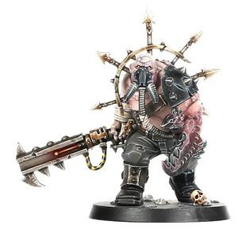

<!-- A0025-B0104 -->

原译文

Chaos Ogryn 混沌欧格林

**校订译文**

Chaos Ogryn 混沌欧格林

<!-- /A0025-B0104 -->

<!-- A0025-B0105 -->
## Servitor-Ogryn 欧格林机仆

<!-- /A0025-B0105 -->

<!-- A0025-B0106 -->
**英文原文**

Servitor-Ogryns are Ogryns that have been converted into Servitors. Examples include H-Grade Combat Servitors.

<!-- /A0025-B0106 -->

<!-- A0025-B0107 -->

原译文

欧格林机仆是已转换为机仆的欧格林。例子包括H级战斗机仆。

**校订译文**

欧格林机仆是由欧格林改造成的机仆，例如 H 级战斗机仆。

<!-- /A0025-B0107 -->

<!-- A0025-B0108 图片 -->
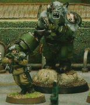

<!-- A0025-B0109 -->

原译文

H-Grade Combat Servitor H级战斗机仆

**校订译文**

H-Grade Combat Servitor H级战斗机仆

<!-- /A0025-B0109 -->

<!-- A0025-B0110 -->
## O'grinn 欧'格林

<!-- /A0025-B0110 -->

<!-- A0025-B0111 -->
**英文原文**

Ogryn are known as O'grinn by the T'au Empire and are sometimes inducted into their service as Gue'vesa. Equipment issued varies but can include weaponry normally used by Battlesuits.

<!-- /A0025-B0111 -->

<!-- A0025-B0112 -->

原译文

欧格林被钛帝国称为欧'格林，有时会以古'维萨的身份服役。发放的装备各不相同，但可能包括战斗服通常使用的武器。

**校订译文**

钛帝国把欧格林称为 O’grinn，暂译“欧格林”。他们有时会以古维萨的身份为钛帝国服役。发放的装备并不统一，其中也可能包括通常由战斗服使用的武器。

**校注：** O’grinn 为钛族对欧格林的称法；保留英文以区分拼写，中文不另造物种名称。

<!-- /A0025-B0112 -->

<!-- A0025-B0113 -->
## Notable Ogryns 著名欧格林

<!-- /A0025-B0113 -->

<!-- A0025-B0114 -->
**英文原文**

Cassia - Ogryn Psyker

<!-- /A0025-B0114 -->

<!-- A0025-B0115 -->

原译文

卡西亚 - 欧格林灵能者

**校订译文**

卡西亚 - 欧格林灵能者

<!-- /A0025-B0115 -->

<!-- A0025-B0116 -->
**英文原文**

Clodde — Bone'ead deserter

<!-- /A0025-B0116 -->

<!-- A0025-B0117 -->

原译文

克洛德 - 聪明头逃兵

**校订译文**

克洛德 - 聪明头逃兵

<!-- /A0025-B0117 -->

<!-- A0025-B0118 -->
**英文原文**

Cork "The Barrack" Balderston - Imperial Army

<!-- /A0025-B0118 -->

<!-- A0025-B0119 -->

原译文

科克“兵营”鲍尔德斯顿 - 帝国军队

**校订译文**

“兵营”科克·鲍尔德斯顿——效力于帝国军。

<!-- /A0025-B0119 -->

<!-- A0025-B0120 -->

原译文

Dorg and Gren Broggan 多格和格伦·布朗根

**校订译文**

Dorg and Gren Broggan 多格和格伦·布朗根

<!-- /A0025-B0120 -->

<!-- A0025-B0121 -->
**英文原文**

Nod - A Gun Lugger who near single-handedly turned the tide of a Dark Eldar raid on his regiment's camp.

<!-- /A0025-B0121 -->

<!-- A0025-B0122 -->

原译文

诺德 - 一名重枪手，他几乎独自一人扭转了黑暗灵族对他所在兵团营地的突袭浪潮。

**校订译文**

诺德——重枪手，在黑暗灵族突袭其兵团营地时，几乎凭一己之力扭转战局。

<!-- /A0025-B0122 -->

<!-- A0025-B0123 -->
**英文原文**

Nork Deddog — A bodyguard with an unswerving desire to protect his master, usually the highest ranking member of the officer ranks.

<!-- /A0025-B0123 -->

<!-- A0025-B0124 -->

原译文

诺克·德多格 — 一个坚定不移地保护主人的护卫，通常是军官级别的最高等级成员。

**校订译文**

保镖诺克——一心保护主人的忠诚护卫；他的保护对象通常是部队中军衔最高的军官。

**校注：** Nork Deddog 采用 GW-04 中文第29页与 GW-11 英文第29页对应的“保镖诺克”；原稿全名音译保留在原译对照中。

<!-- /A0025-B0124 -->

<!-- A0025-B0125 -->
**英文原文**

Rogg — Bullgryn

<!-- /A0025-B0125 -->

<!-- A0025-B0126 -->

原译文

罗格 — 牛格林

**校订译文**

罗格 — 牛格林

<!-- /A0025-B0126 -->

<!-- A0025-B0127 -->
**英文原文**

Sparky III - Necromundan Pit Fighter and slave revolt leader

<!-- /A0025-B0127 -->

<!-- A0025-B0128 -->

原译文

斯帕基三号 - 涅克罗蒙达深坑斗士和奴隶叛乱领袖

**校订译文**

斯帕基三号——涅克罗蒙达的地坑斗士、奴隶起义领袖。

<!-- /A0025-B0128 -->

<!-- A0025-B0129 -->
## Known Ogryn Worlds 已知欧格林世界

<!-- /A0025-B0129 -->

<!-- A0025-B0130 -->
**英文原文**

Hrom - Pre-Imperial Penal colony with high gravity. Primary source of Ogryn Militarum recruits in the Macharian sector.

<!-- /A0025-B0130 -->

<!-- A0025-B0131 -->

原译文

霍姆 - 前帝国刑罚殖民地，具有高重力。马卡里亚星区欧格林军队新兵的主要来源。

**校订译文**

霍姆——帝国建立前便已存在的高重力刑罚殖民地，也是马卡里亚星区欧格林兵员的主要来源。

<!-- /A0025-B0131 -->

<!-- A0025-B0132 -->

原译文

Krourk 克鲁克

**校订译文**

Krourk 克鲁克

<!-- /A0025-B0132 -->

本篇核心术语与暂定项

以下列出本篇出现的英文原形及核心术语表用词。同形词可能指不同对象，具体词义以本篇正文和校注为准；单复数、别名和仅见于图注的名称可能尚未列入。完整候选见[术语表](../../术语表/双语术语候选.csv)。

| 英文 | 采用中文 | 状态 |
| --- | --- | --- |
| Space Marines | 星际战士 | 官方已核对 |
| Adeptus Mechanicus | 机械修会 | 官方已核对 |
| Astra Militarum | 星界军 | 官方已核对 |
| Imperial Guard | 帝国卫队 | 暂定·语境区分 |
| Imperial Army | 帝国军 | 暂定·官方待核 |
| Chaos Space Marines | 混沌星际战士 | 官方已核对 |
| Eldar | 灵族 | 暂定·语境区分 |
| Dark Eldar | 黑暗灵族 | 暂定·旧称对应 |
| Orks | 欧克蛮人 | 官方已核对 |
| T'au Empire | 钛帝国 | 官方已核对 |
| Psyker | 灵能者 | 官方已核对 |
| Ogryn | 欧格林 | 官方已核对 |
| Chimera | 奇美拉 | 官方已核对 |
| Horus Heresy | 荷鲁斯之乱 | 官方已核对 |
| Warp | 亚空间 | 官方已核对 |
| Great Rift | 大裂隙 | 官方已核对 |
| Inquisitor | 审判官 | 官方已核对 |
| Imperium | 帝国 | 暂定·简称 |
| Servitor | 机仆 | 暂定 |
| Equipment | 装备 | 编辑用语已统一 |
| Administratum | 内政部 | 暂定 |
| Emperor | 帝皇 | 官方已核对 |
| Abhuman | 亚人 | 暂定·官方待核 |
| Mutant | 变种人 | 暂定·官方待核 |
| Necromunda | 涅克罗蒙达 | 暂定·官方待核 |
| Horus | 荷鲁斯 | 暂定·官方待核 |
| Ripper Gun | 撕裂枪 | 官方已核对 |
| Bone'ead | 聪明头 | 官方已核对 |
| Imperial Cult | 帝皇信仰 | 暂定·官方待核 |
| Sector | 星区 | 暂定·官方待核 |
| Gue'vesa | 古维萨 | 暂定·官方待核 |
| Biochemical Ogryn Neural Enhancement | 欧格林生化神经增强 | 暂定·官方待核 |
| Grey Ogryns | 灰欧格林 | 暂定·官方待核 |
| Feral Ogryns | 蛮野欧格林 | 暂定·官方待核 |
| Squats | 矮人 | 暂定·官方待核 |
| Kronus | 克洛诺斯 | 暂定·官方待核 |
| Catachan | 卡塔昌 | 暂定·官方待核 |
| Savlar | 萨夫拉 | 暂定·官方待核 |
| Feral Worlds | 蛮荒世界 | 暂定·官方待核 |
| Penal Worlds | 刑罚世界 | 暂定·官方待核 |
| Grenadier gauntlet | 榴弹臂铠 | 官方已核对 |
| Bullgryn maul | 牛格林巨槌 | 官方已核对 |
| Nork Deddog | 保镖诺克 | 官方已核对 |
| Bullgryn | 牛格林 | 官方已核对 |
| Militarum Auxilla | 军务辅助部队 | 暂定·官方待核 |
| Gun Lugger | 重枪手 | 暂定·官方待核 |
| Clodde | 克洛德 | 暂定·官方待核 |
| Castor | 卡斯托 | 暂定·官方待核 |
| Vance Stubbs | 万斯·斯塔布斯 | 暂定·官方待核 |
| Kaurava Campaign | 考拉瓦战役 | 暂定·官方待核 |
| Lukas Alexander | 卢卡斯·亚历山大 | 暂定·官方待核 |
| Third Aurelian Crusade | 第三次奥瑞利安远征 | 暂定·官方待核 |
| Savlar Chem-Dogs | 萨夫拉化学犬 | 暂定·官方待核 |
| Kanak Skull Takers | 卡纳克夺颅者 | 暂定·官方待核 |
| Krourk Ogryn Auxilia | 克鲁克欧格林辅助军 | 暂定·官方待核 |
| Monglor Ogryn Auxilia | 蒙格勒欧格林辅助军 | 暂定·官方待核 |
| Cassia | 卡西亚 | 暂定·官方待核 |
| Falx | 法克斯 | 暂定·官方待核 |
| Ghast | 恶魂 | 暂定·官方待核 |
| wyrd | 灵能异人（灵能者类别）／命数（芬里斯观念） | 语境定译·官方待核 |
| Ursan Graves | 乌尔桑·格雷夫斯 | 暂定·官方待核 |
| House Helmawr | 赫尔玛沃家族 | 暂定·官方待核 |
| Ogryn Brutes | 欧格林蛮汉 | 暂定·官方待核 |
| Traitor Ogryn | 叛徒欧格林 | 暂定·官方待核 |
| Ogryn Berserkers | 欧格林狂战士 | 暂定·官方待核 |
| Plague Ogryns | 瘟疫欧格林 | 暂定·官方待核 |
| Cork "The Barrack" Balderston | “兵营”科克·鲍尔德斯顿 | 暂定·官方待核 |
| Nod | 诺德 | 暂定·官方待核 |
| Rogg | 罗格 | 暂定·官方待核 |
| Sparky III | 斯帕基三号 | 暂定·官方待核 |
| Hrom | 霍姆 | 暂定·官方待核 |
| Krourk | 克鲁克 | 暂定·官方待核 |
| Aquila | 天鹰 | 暂定·官方待核 |
| Slab | 肉砖 | 暂定·官方待核 |
| Clear | 清明 | 暂定·官方待核 |
| Master | 导师（审判庭职衔）／舰务官（舰员职务） | 语境定译·官方待核 |
| Ancient | 旗手 | 官方已核对 |
| Honour Guard | 荣誉卫队 | 暂定·官方待核 |
| Frag Grenades | 破片手榴弹 | 暂定·官方待核 |
| Sergeant | 军士 | 暂定·官方待核 |
| The Kaurava Campaign | 考拉瓦战役 | 暂定·官方待核 |
| Powers | 能天使 | 暂定·官方待核 |
| Catachan Jungle Fighters | 卡塔昌丛林斗士 | 官方已核对 |
| T'au | 钛族 | 暂定·官方待核 |
| Kaurava | 考拉瓦 | 暂定·官方待核 |
| Tribe | 部落（欧克组织） | 暂定·官方待核 |
| Strain | 群系 | 暂定·官方待核 |
| Dark Crusade | 黑暗远征 | 暂定·官方待核 |
| Branded | 烙印者 | 暂定·官方待核 |
| Wrought | 锻造秘库 | 暂定·官方待核 |
| Gun | 甘 | 暂定·官方待核 |
| The Dark | 《黑暗》 | 暂定·官方待核 |
| Price | 普莱斯 | 暂定·官方待核 |
| Hive City | 巢都城市 | 暂定·官方待核 |
| Deathworld | 死亡世界 | 暂定·官方待核 |
| Penal Colony | 刑罚殖民地 | 暂定·官方待核 |
| Combat Knife | 战斗刀 | 暂定·官方待核 |
| Carapace Armour | 甲壳盔甲 | 暂定·官方待核 |

