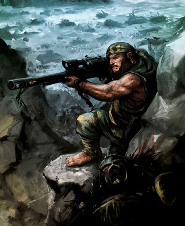
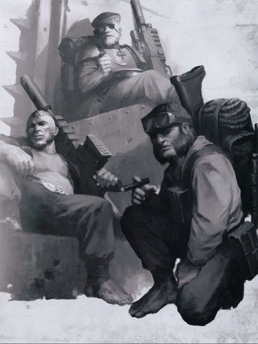
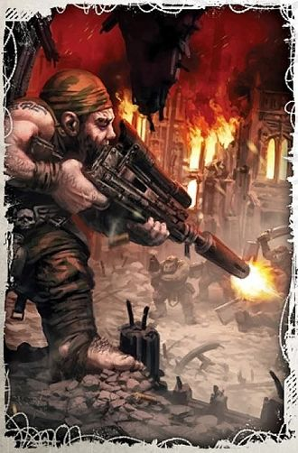
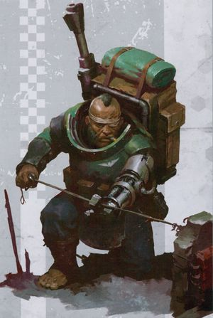
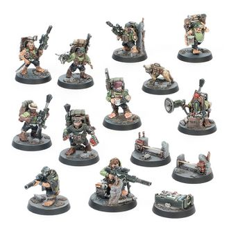

# 0026 莱特林 Ratling

精校状态：中文行文已逐段精校，部分术语仍为暂定

分类：通用概念 / 帝国 Imperium

原文来源：https://www.bilibili.com/opus/1175376959440420865

原作者：帝国神选罐头

原文时间：2026年03月03日 09:42

[返回分类目录](目录.md) · [全书目录](../../目录.md)

<!-- A0026-B0001 -->
**英文原文**

Ratlings (Homo Sapiens Minimus), known also as Runtlings, Stunties and Maggots but among themselves as Halflings, are small and hedonistically jovial abhumans who commonly work aboard spacecraft as cabin crew and runarounds, benefiting from their small stature. They rarely find employment in the Imperial Guard due to their physical weakness and less than ideal temperament, but their expertise in marksmanship, low weight, and short height (which lends them a stealthy quality) make ratlings well suited to the role of sniper. Within the Imperial Guard, Ratlings are often employed as snipers specialists in the Militarum Auxilla.

<!-- /A0026-B0001 -->

<!-- A0026-B0002 -->

原译文

莱特林（人属智人小型亚种），也被称为小不点儿、矮人和蛆虫，但在他们中间被称为半身人，是身材矮小、快乐的亚人，他们通常在宇宙飞船上担任隔间船员和搬运工，受益于他们的身材矮小。由于身体虚弱和气质不理想，他们很少在帝国卫队找到工作，但他们在射击方面的专业知识、低体重和矮身高（这使他们具有秘密行动的品质）使莱特林非常适合狙击手的角色。在帝国卫队内部，莱特林经常被雇佣为亚人辅助军的狙击手专家。

**校订译文**

莱特林（Homo Sapiens Minimus）也被叫作“小不点”“矮子”或“蛆虫”，他们自己则称族人为“半身人”。这种亚人体型矮小，性情快活，喜欢享乐，常利用身材优势在飞船上担任舱务人员或跑腿杂役。他们体力较弱，性情也不太适合军旅生活，因此较少进入帝国卫队服役。不过，莱特林枪法出众，体轻身矮，擅长隐蔽，非常适合担任狙击手。帝国卫队中的莱特林通常作为军务辅助部队的专职狙击手作战。

<!-- /A0026-B0002 -->

<!-- A0026-B0003 图片 -->

<!-- A0026-B0004 -->

原译文

Ratling sniper 莱特林狙击手

**校订译文**

Ratling sniper 莱特林狙击手

<!-- /A0026-B0004 -->

<!-- A0026-B0005 -->
## Overview 概述

<!-- /A0026-B0005 -->

<!-- A0026-B0006 -->

原译文

Settle your sights on the target. Take a breath, hold, squeeze. One dead Ork.-- Ratling Sniper Forde Klapp 把视线集中在目标上。深呼吸，屏住呼吸，扣动扳机。一个死了的欧克。— 莱特林狙击手福德·克拉普

**校订译文**

Settle your sights on the target. Take a breath, hold, squeeze. One dead Ork.-- Ratling Sniper Forde Klapp

“瞄准目标。吸气，屏住，扣下扳机。又干掉一个欧克蛮人。”——莱特林狙击手福德·克拉普

<!-- /A0026-B0006 -->

<!-- A0026-B0007 -->
**英文原文**

The strain of Humanity known as Ratlings hail from the very few Agri Worlds in the Imperium that lack horrific dangers. According to the propagandists that spread anti-abhuman rhetoric, the Ratling form adapted to these conditions, and that their ancestors became stunted by thousands of years of inbreeding on these worlds with naturally soporific climates and abundant harvests. They are viewed by Imperials as idle, hedonistic, loud, gregarious, over-friendly and sexually promiscuous. That their lives are spent eating until sick, drinking copious amounts of intoxicating liquids, and procreating uncontrollably. They also say the soft, loamy soil of their homeworlds even removed the necessity of footwear, leaving Ratlings with large, overly hairy, toughened feet. These supposed worlds have since been lost, destroyed, or stripped of all natural resources by the Imperium.

<!-- /A0026-B0007 -->

<!-- A0026-B0008 -->

原译文

被称为莱特林的人类种族来自帝国中极少数没有可怕危险的农业世界。根据传播反亚人言论的宣传者的说法，莱特林适应了这些条件，他们的祖先在这些自然气候温和、收成丰富的世界上，由于数千年的近亲繁殖而发育迟缓。他们被帝国视为懒散、享乐主义、吵闹、群居、过于友好和性滥交。他们的一生都在吃直到生病，喝大量令人陶醉的液体，无法控制地繁殖。他们还说，他们家园柔软、肥沃的土壤甚至消除了穿鞋的必要性，让莱特林的脚变得又大又多毛、又硬。这些所谓的世界已经被帝国失落、摧毁或剥夺了所有的自然资源。

**校订译文**

莱特林起源于帝国极少数没有恐怖危险的农业世界。散播反亚人言论的宣传者声称，莱特林的体形是适应当地环境的结果：那些世界气候宜人、令人懒散，物产丰饶，他们的祖先经过数千年的近亲繁殖，逐渐变得矮小。帝国居民常认为莱特林懒惰、享乐、吵闹、爱扎堆、过分热情而且性生活放纵；在这些人的描述中，莱特林终日暴饮暴食、酗酒，毫无节制地繁衍。他们还声称，莱特林母星松软肥沃的土壤使鞋子变得多余，才让莱特林长出宽大、多毛且结实的双脚。这些传说中的世界后来或已失落、或遭帝国摧毁，或被帝国榨干了自然资源。

**校注：** 本段的近亲繁殖、生活方式等描述被英文明确归于反亚人宣传者及帝国偏见，译文保留归属，不将其全部改写为客观生物学事实。

<!-- /A0026-B0008 -->

<!-- A0026-B0009 图片 -->

<!-- A0026-B0010 -->

原译文

Militarum Auxilla squad of Ratlings 莱特林亚人辅助军小队

**校订译文**

Militarum Auxilla squad of Ratlings 军务辅助部队的莱特林小队

<!-- /A0026-B0010 -->

<!-- A0026-B0011 -->
**英文原文**

Ratlings have since spread to a number of different worlds in the Imperium. The nimble-fingers of a Ratling can find work wherever dexterity is needed over brute-strength. They often find work on Forge Worlds or in manufactorums where they can climb into vents or other hard-to-reach places. Although many die in these inaccessible areas, sometimes forgotten about or trapped. Although they are ill-suited for being exploited as a manual labour force, even when pressed to the task, they can still find themselves a niche in places like salvatoriums as a pressed labour force dissembling various mechanisms with their nimble hands.

<!-- /A0026-B0011 -->

<!-- A0026-B0012 -->

原译文

此后，莱特林已经传播到帝国中的许多不同世界。莱特林敏捷的手指可以在任何需要灵巧而不是蛮力的地方找到工作。他们经常在铸造世界或制造厂找到工作，在那里他们可以爬进通风口或其他难以到达的地方。尽管许多在这些难以进入的地区死亡，有时会被遗忘或被困。尽管他们不适合作为体力劳动者被剥削，但即使面临压力，他们仍然可以在避难所等地方找到自己的一席之地，因为他们是一种用灵活的双手拆卸各种机件的紧缺劳动者。

**校订译文**

此后，莱特林散居到帝国许多世界。凡是需要手指灵巧而非蛮力的工作，他们往往都能胜任。他们常在铸造世界或制造工厂谋生，钻进通风管道及其他难以进入的角落。不过，许多莱特林也死在这些地方：有的被人遗忘，有的被困其中。莱特林不适合繁重的体力劳动，却仍会被强征为劳工；在废品回收场等处，他们能凭借灵巧的双手拆解各种机械，找到自己的用武之地。

<!-- /A0026-B0012 -->

<!-- A0026-B0013 -->
**英文原文**

Ratlings tend to have a flare for creative problem solving. A novel example being being the use of a bitten off toenail as an impromptu tool to fish and cut wires when splicing electronics. Ratlings are personable, but on average tends to lack social decorum.

<!-- /A0026-B0013 -->

<!-- A0026-B0014 -->

原译文

莱特林往往具有创造性解决问题的能力。一个与众不同的例子是，在拼接电子器件时，使用被咬掉的脚趾甲作为临时工具来钓鱼和切割电线。莱特林风度翩翩，但平均而言往往缺乏社交礼仪。

**校订译文**

莱特林擅长想出别出心裁的解决办法。例如，接驳电子线路时，他们会把咬下来的脚趾甲当作临时工具，用来勾出和切断电线。他们待人亲切，不过通常不太讲究社交礼仪。

<!-- /A0026-B0014 -->

<!-- A0026-B0015 -->
**英文原文**

Their speed and dexterity makes them natural marksmen, as well as pickpockets. These talents combined with a love for food is exemplified in their remarkable cuisine, which is well known as being phenomenal. While some Imperial commanders would pull some strings in order to get a Ratling chef, more zealous commanders or Nobles would become sick at the thought of eating the slop made by such a subhuman creature, or simply execute whoever appointed the Ratling as chef.

<!-- /A0026-B0015 -->

<!-- A0026-B0016 -->

原译文

他们的速度和灵巧使他们成为天生的射手，也是扒手。这些天赋与对食物的热爱相结合，体现在他们非凡的美食中，众所周知，这是惊人的。虽然一些帝国指挥官会为了找一个莱特林厨师而走后门，但更狂热的指挥官或贵族一想到吃这种非人生物做的泔水就会生病，或者干脆处决任命莱特林为厨师的人。

**校订译文**

迅捷的动作与灵巧的双手使莱特林既是天生的射手，也是出色的扒手。这些天赋加上他们对美食的热爱，还造就了广受赞誉的烹饪技艺。有些帝国指挥官会托关系设法招来一位莱特林厨师；另一些更狂热的指挥官或贵族，却会觉得吃这种“低等生物”做的食物令人作呕，甚至直接处决任命莱特林掌厨的人。

<!-- /A0026-B0016 -->

<!-- A0026-B0017 图片 -->

<!-- A0026-B0018 -->

原译文

Ratling Sniper 莱特林狙击手

**校订译文**

Ratling Sniper 莱特林狙击手

<!-- /A0026-B0018 -->

<!-- A0026-B0019 -->
**英文原文**

Their short stature and relatively lithe build also allows them to move through the undergrowth without making much noise. In addition, their bare feet allow them traverse various forms of terrain in silence. When moving quickly they will move on their toes.

<!-- /A0026-B0019 -->

<!-- A0026-B0020 -->

原译文

它们矮小的身材和相对轻盈的体格也使它们能够在灌木丛中移动，而不会发出太大的噪音。此外，它们光着脚，可以安静地穿越各种地形。快速移动时，它们会用脚趾移动。

**校订译文**

莱特林身材矮小、体态较轻盈，穿行于灌木丛时不会发出太大声响。他们赤裸的双脚也能让他们无声地走过各种地形；需要快速移动时，他们会踮起脚尖。

<!-- /A0026-B0020 -->

<!-- A0026-B0021 -->
**英文原文**

Ratlings in the Imperial Navy will often serve as chefs, runarounds, or other miscellaneous roles. They're able to utilize the crawl spaces between walls and decks for travel, rafered to by them as the 'rat roads'. They are thus able to fit into the many ventilation, cable and pipe ducts, and servo-skull pathways crisscrossing the ship. They're able to quickly navigate them with instinctive observation, as much as recalled memories of maps and directions of these spaces. Using touch, hearing, and smell to distinguish the distinct sounds, smells, and temperatures of various decks, as well as identify the heating or coolant pipes and various cables or tubing they crawl through. However, Bosuns or other officers will likely exact severe punishment if a Ratling is caught using these "rat roads". They can still, however, also get nearly anywhere in the ship and spy on anyone, from the slave-pens to the Captain's quarters.

<!-- /A0026-B0021 -->

<!-- A0026-B0022 -->

原译文

帝国海军的莱特林通常会担任厨师、搬运工或其他各种角色。他们能够利用墙壁和甲板之间的爬行空间进行旅行，被他们称为“鼠路”。因此，它们能够适应船上纵横交错的许多通风、电缆和管道以及伺服颅骨通道。他们能够通过本能的观察快速导航，就像回忆起地图和这些空间的方向一样。通过触觉、听觉和嗅觉来区分不同甲板的不同声音、气味和温度，并识别它们爬行的加热或冷却管道以及各种电缆或管道。然而，如果莱特林在使用这些“鼠路”时被抓获，水手长或其他军官可能会受到严厉惩罚。然而，他们仍然可以进入船上的几乎任何地方，监视任何人，从奴隶围栏到船长的住处。

**校订译文**

在帝国海军中，莱特林常担任厨师、跑腿杂役或其他勤杂职务。他们能穿行于舱壁与甲板之间的狭窄空间，并把这些通道称作“鼠路”：船上纵横交错的通风道、电缆管道、管线井和伺服颅骨通道，都容得下他们。莱特林既凭本能观察，也依靠对路线和方位的记忆，迅速找到去路。他们通过触觉、听觉和嗅觉分辨各层甲板的温度、声音与气味，并识别沿途的供热管、冷却管、电缆和其他管线。不过，若被发现擅自使用“鼠路”，莱特林往往会遭到水手长或其他军官严惩。即便如此，他们仍几乎能到达舰上任何角落，监视任何人——从奴隶舱一直到舰长的住处。

<!-- /A0026-B0022 -->

<!-- A0026-B0023 -->
**英文原文**

They have a penchant towards activities of dubious morality and legality, like thievery and fencing contraband. Ratlings are known to "acquire" extra supplies within their stationed regiments and trading these resources to other soldiers. This is an insignificant price for the guardsman commander who knows the value Ratlings can bring to a regiment. Ratlings tendency to thieve is primarily a product of circumstance due their treatment by the men and women of the Imperial Guard. They attempt to often supplement cut rations in the Guard, alongside other miscellaneous supplies. These resources often go towards bribing sympathetic higher-ups, alongside proving their worth, swaying friends in high places allow Ratlings to protect themselves and community from abuse or harassment from their subordinates. This is accepted as a very common situation in the Astra Militarum.

<!-- /A0026-B0023 -->

<!-- A0026-B0024 -->

原译文

他们喜欢从事道德和合法性可疑的活动，比如偷窃和围栏走私。众所周知，莱特林会在其驻扎的兵团里“获取”额外的补给，并将这些资源交易给其他士兵。对于知道莱特林能给一个兵团带来价值的卫兵指挥官来说，这是一个微不足道的代价。莱特林偷窃的倾向主要是环境的产物，因为他们受到了帝国卫队男女的待遇。他们经常试图补充卫队被削减的口粮，以及其他杂项用品。这些资源通常用于贿赂富有同情心的上级，同时证明他们的价值，高层摇摆不定的朋友让莱特林保护自己和团体免受下级的虐待或骚扰。这在星界军是一种非常常见的情况。

**校订译文**

莱特林倾向于从事一些不甚光彩、甚至违法的勾当，例如偷窃和销赃。他们会在驻扎的兵团里“弄到”额外补给，再拿去与其他士兵交易。了解莱特林价值的指挥官认为，这不过是让他们为兵团效力所需付出的一点小代价。这种偷窃倾向主要源于他们在帝国卫队中所受的待遇：口粮遭到克扣，他们只好设法补足，还要筹集其他用品。这些物资也常被用来打点对他们抱有同情的上级。通过证明自身价值、结交高层靠山，他们得以保护自己和族人，免受这些上级属下的虐待与骚扰。这种情况在星界军中十分常见。

<!-- /A0026-B0024 -->

<!-- A0026-B0025 -->
**英文原文**

Ratlings call their children and youngsters "pups". Many are raised on the thrilling stories of the Ornsworld Sagas. These thrilling tales feature stoic, pot-bellied warriors who face down overwhelming odds with little more than an axe, shield, and jovial attitude.

<!-- /A0026-B0025 -->

<!-- A0026-B0026 -->

原译文

莱特林称他们的孩子和幼崽为“小动物”。许多人都是在奥恩斯世界传奇的惊险故事中长大的。这些激动人心的故事以坚忍、大肚的战士为特色，他们用斧头、盾牌和快乐的态度面对压倒性的困难。

**校订译文**

莱特林把自己的孩子和年轻人称作“崽子”。许多莱特林从小听着《奥恩斯世界传奇》的惊险故事长大。故事中的战士大腹便便却坚忍不拔，往往只凭一柄斧头、一面盾牌和乐天的性情，便敢面对强得多的敌人。

<!-- /A0026-B0026 -->

<!-- A0026-B0027 -->
## Physiology 生理

<!-- /A0026-B0027 -->

<!-- A0026-B0028 -->
**英文原文**

Ratlings are the smallest type of abhuman. Ratlings rarely reach 1.3 meters in height, being even smaller and slighter than a Kin of the Leagues of Votann, and though their lack of dietary restrictions tend to make them husky, they are not particularly strong or resilient. They are a fertile, and somewhat libidinous species. They have a deep sense of community and tend to look out for one another.

<!-- /A0026-B0028 -->

<!-- A0026-B0029 -->

原译文

莱特林是亚人中体型最小的一种。莱特林的身高很少达到1.3米，甚至比沃坦联盟的炉裔还要小和苗条，尽管它们缺乏饮食限制往往会使它们变得魁梧，但它们并不是特别强壮或有韧性。它们是一种能繁殖的、有点好色的物种。他们有强烈的团体意识，倾向于互相照顾。

**校订译文**

莱特林是体型最小的亚人，身高鲜少达到 1.3 米，比沃坦联盟的炉裔还要矮小纤细。他们饮食不知节制，因此往往长得敦实，但并不特别强壮或耐打。这一族群繁殖力强，也颇为好色。他们有很强的族群意识，习惯互相照应。

<!-- /A0026-B0029 -->

<!-- A0026-B0030 -->
**英文原文**

Other than their height, a Ratlings most notable feature is their feet; large, overly hairy, and toughened. as well as their toenails being as tough as grox horns. These nails can grow into, what some might go as far as describing as, talons. Their bare feet allow them to move soundlessly. The forehead of their skulls are also denser than a baseline human's. Ratling are highly dexterous, agile, and clever. Able to make split second reactions that would be impossible for an unaugmented human.

<!-- /A0026-B0030 -->

<!-- A0026-B0031 -->

原译文

除了身高，莱特林最显著的特征是他们的脚；大，多毛，且坚韧。还有它们的脚趾甲像格洛克斯角一样坚硬。这些指甲可以长成爪子，有些甚至可以这样形容。他们光着脚，可以无声地移动。它们头骨的前额也比普通人类的更密集。莱特林非常灵巧、敏捷和聪明。能够做出瞬间的反应，这对未经增强的人类来说是不可能的。

**校订译文**

除了身高，莱特林最显著的特征便是宽大、多毛且结实的双脚。他们的脚趾甲硬如格洛克斯兽角，长起来甚至可谓利爪。赤脚使他们能够无声行动，额骨也比普通人类更致密。莱特林灵巧、敏捷而机敏，能在瞬息之间作出未经强化的人类无法企及的反应。

<!-- /A0026-B0031 -->

<!-- A0026-B0032 -->
**英文原文**

Due to still being a natural offshoot of baseline humanity, Ratlings have a small (\<1%) chance of having psychic powers.

<!-- /A0026-B0032 -->

<!-- A0026-B0033 -->

原译文

由于莱特林仍然是普通人类的自然分支，因此拥有灵能能力的几率很小（\<1%）。

**校订译文**

由于莱特林仍然是普通人类的自然分支，因此拥有灵能能力的几率很小（\<1%）。

<!-- /A0026-B0033 -->

<!-- A0026-B0034 -->
## Homeworlds 家园世界

<!-- /A0026-B0034 -->

<!-- A0026-B0035 -->
**英文原文**

Ratling homeworlds are self-sufficient, agricultural worlds, which, like worlds populated by baseline humans, are subject to the tithe of soldiers for the Imperial Guard.

<!-- /A0026-B0035 -->

<!-- A0026-B0036 -->

原译文

莱特林的家园世界是自给自足的农业世界，就像由普通人类居住的世界一样，它们受到帝国卫队士兵什一税的约束。

**校订译文**

莱特林的母星都是能够自给自足的农业世界。与普通人类居住的世界一样，它们也必须履行什一税义务，向帝国卫队提供兵员。

<!-- /A0026-B0036 -->

<!-- A0026-B0037 -->

原译文

Known Homeworlds: 已知家园世界

**校订译文**

Known Homeworlds: 已知家园世界

<!-- /A0026-B0037 -->

<!-- A0026-B0038 -->

原译文

Ornsworld 奥恩斯世界

**校订译文**

Ornsworld 奥恩斯世界

<!-- /A0026-B0038 -->

<!-- A0026-B0039 -->

原译文

Sigma-Agrius 西格玛-阿格里乌斯

**校订译文**

Sigma-Agrius 西格玛-阿格里乌斯

<!-- /A0026-B0039 -->

<!-- A0026-B0040 -->

原译文

Cyprian's Gate 西普里安之门

**校订译文**

Cyprian's Gate 西普里安之门

<!-- /A0026-B0040 -->

<!-- A0026-B0041 -->
## Ratlings in the Imperial Guard 帝国卫队的莱特林

<!-- /A0026-B0041 -->

<!-- A0026-B0042 -->
**英文原文**

Although Ratlings make generally poor warriors but the Imperium still finds a use for them, as they are often recruited into the Imperial Guard as snipers, one of the battlefield roles in which they excel. They also excel as infiltrators, due to their ability to traverse war zones with relative discretion. In those roles they operate independently of the rest of the Imperial Guard force, and are equipped with sniper rifles, Needle Sniper Rifles, or Tankstopper Rifles for weaponry and flak armour for protection. Teams of ratlings sharpshooters are often divided into smaller units placed directly under command of a regimental officer, each unit is strategically placed in a precise array of locations to provide commanding fields of covering fire. And while they are often disparaged by the majority of their baseline human compatriots, many of those who mock the halflings owe their own survival to the cover fire of ratling regiments. In addition to their role as scouts and snipers they are skilled in urban combat and survival, and are sometimes accompanied by Battlemutt war dogs.

<!-- /A0026-B0042 -->

<!-- A0026-B0043 -->

原译文

虽然莱特林通常是糟糕的战士，但他们对帝国仍然有用处，因为他们经常被招募到帝国卫队担任狙击手，这是他们擅长的战场角色之一。他们也擅长渗透，因为他们能够相对谨慎地穿越战区。在这些角色中，他们独立于帝国卫队的其他部队运作，并配备狙击步枪、针刺狙击步枪或反坦克步枪作为武器，以及防弹盔甲作为保护。莱特林神枪手小队通常被分成更小的单位，直接由一名兵团军官指挥，每个单位都被战略性地放置在一系列精确的位置，以提供掩护火力的指挥场。虽然他们经常被大多数普通人类同胞贬低，但许多嘲笑半身人的人将自己的生存归功于兵团莱特林的掩护火力。除了侦察兵和狙击手的角色外，他们还擅长城市战和生存，有时还会有战犬陪伴。

**校订译文**

莱特林通常不适合一般步兵作战，帝国仍能让他们发挥所长：他们常被征入帝国卫队，担任自己擅长的狙击手。他们也善于悄然穿越战区，因而是出色的渗透者。执行这些任务时，他们独立于其他帝国卫队部队行动，以狙击步枪、针刺狙击步枪或反坦克步枪为武器，穿防弹甲防护。莱特林神枪手小队常被进一步拆分，直属兵团军官指挥；各组部署在精心挑选的位置，建立有利射界，提供掩护火力。虽然多数普通人类同袍瞧不起这些半身人，许多嘲笑过他们的人却曾靠莱特林部队的火力掩护保住性命。除侦察和狙击外，他们也擅长城市战及野外求生，有时还会携带战斗犬。

<!-- /A0026-B0043 -->

<!-- A0026-B0044 图片 -->

<!-- A0026-B0045 -->

原译文

Ratling demolitions specialist 莱特林拆除专家

**校订译文**

Ratling demolitions specialist 莱特林爆破专家

<!-- /A0026-B0045 -->

<!-- A0026-B0046 -->
**英文原文**

Ratlings are also well known for their culinary abilities and often serve as cooks off the battlefield. Some Ratlings take advantage of their position as company cooks to acquire extra supplies to sate their voracious appetites. Others extend these benefits to their foster regiments for a price, their kitchens serving as fronts for their illegal activities. Their abilities as fences, thieves and black marketeers find them acceptance from the men they serve alongside, as they offer a wide range of goods, from extra rations, to drugs and alcohol, and even non-standard issue weapons common among veteran soldiers. Conversely it is documented that guardsmen who give too much grief in their immense prejudice towards Ratlings find themselves mysteriously short of ammunition on the battlefield, preyed upon not only by the enemy finding an opening but also by the mocking eyes of their diminutive tormentors, watching through telescopic lenses some place far away.

<!-- /A0026-B0046 -->

<!-- A0026-B0047 -->

原译文

莱特林也以其烹饪能力而闻名，经常在战场外担任厨师。一些莱特林利用他们作为连队厨师的职位来获取额外的食物来满足他们贪婪的食欲。其他人则以一定的代价将这些福利扩展到他们的寄宿兵团，他们的厨房是他们非法活动的掩护。他们作为围栏、小偷和黑市商人的能力得到了他们所服务的人的认可，因为他们提供了各种各样的商品，从额外的口粮到药物和酒精，甚至是老兵中常见的非标准武器。相反有记录，那些对莱特林的巨大偏见而过于苦恼的卫兵发现自己在战场上神秘地缺乏弹药，不仅被敌人找到了突破口，而且还要承受那些身材矮小的折磨者通过望远镜窥视远方时的嘲笑目光。

**校订译文**

莱特林还以厨艺闻名，离开战场后常担任炊事员。有的利用连队厨师的身份弄来额外食物，满足旺盛的食欲；有的则收费向所在兵团提供类似便利，以厨房为掩护经营非法生意。他们擅长销赃、偷窃和黑市交易，因此也能获得同袍的接纳：从额外口粮、药物、酒类，到老兵常用的非制式武器，他们都能提供。反过来，有记录称，那些出于偏见、对莱特林百般刁难的卫兵，会在战场上莫名其妙地缺少弹药。他们既要面对趁虚而入的敌人，还要承受那些矮小的报复者从远处瞄准镜中投来的嘲弄目光。

<!-- /A0026-B0047 -->

<!-- A0026-B0048 -->
**英文原文**

Ratlings claim that they aren't given enough food in almost all cases. Whether this is due to their rapacious appetites outstripping their size or the Imperium's overall rejection of their species isn't clear. The small amount of rations they do receive is usually consists of corpse-starch packs and weevil-infested wafers. This forces even unwilling Ratlings to use the undermarket to purchase the necessities for survival.

<!-- /A0026-B0048 -->

<!-- A0026-B0049 -->

原译文

莱特林声称，在几乎所有情况下，它们都没有得到足够的食物。这是由于它们贪婪的欲望超过了它们的体型，还有帝国对它们物种的全面排斥，目前尚不清楚。他们收到的少量口粮通常由尸体淀粉包和象鼻虫滋生的薄饼组成。这甚至迫使不情愿的莱特林利用黑市购买生存必需品。

**校订译文**

莱特林声称，他们几乎总是吃不饱。究竟是因为他们的食量远超体形所暗示的程度，还是帝国普遍排斥这一族群，尚不清楚。他们领到的少量口粮通常只是尸淀粉包和长满象鼻虫的薄饼。因此，即使本不愿如此的莱特林，也不得不在地下市场购买生存必需品。

<!-- /A0026-B0049 -->

<!-- A0026-B0050 -->
## Ratling Kill Team Sub-Types 莱特林杀戮小队成员类型

原题：Ratling Kill Team Sub-Types 莱特林杀戮小队子类

<!-- /A0026-B0050 -->

<!-- A0026-B0051 图片 -->

<!-- A0026-B0052 -->

原译文

Ratling Kill Team Squad 莱特林杀戮小队

**校订译文**

Ratling Kill Team Squad 莱特林杀戮小队

<!-- /A0026-B0052 -->

<!-- A0026-B0053 -->
**英文原文**

Fixer - Team leaders appointed by their own squad mates.

<!-- /A0026-B0053 -->

<!-- A0026-B0054 -->

原译文

调解人 - 由自己的队友任命的小队负责人。

**校订译文**

调解人——由队友推举的小队领袖。

<!-- /A0026-B0054 -->

<!-- A0026-B0055 -->
**英文原文**

Bomber - Demolitions specialists

<!-- /A0026-B0055 -->

<!-- A0026-B0056 -->

原译文

爆破手 - 拆除专家

**校订译文**

爆破手——专精爆破的成员。

<!-- /A0026-B0056 -->

<!-- A0026-B0057 -->
**英文原文**

Hardbit - Grizzled veterans who are skilled at close-range fighting.

<!-- /A0026-B0057 -->

<!-- A0026-B0058 -->

原译文

硬位 - 擅长近距离战斗的灰白老兵。

**校订译文**

老狠角——身经百战、擅长近距离作战的老兵。

<!-- /A0026-B0058 -->

<!-- A0026-B0059 -->
**英文原文**

Big Shot - Equipped with Tankstopper Rifles to hunt larger prey.

<!-- /A0026-B0059 -->

<!-- A0026-B0060 -->

原译文

大射 - 配备反坦克步枪，可以猎杀更大的猎物。

**校订译文**

重枪手——配备反坦克步枪，专门猎杀大型目标。

<!-- /A0026-B0060 -->

<!-- A0026-B0061 -->
**英文原文**

Raider - Equipped with grappling hooks and climbing gear.

<!-- /A0026-B0061 -->

<!-- A0026-B0062 -->

原译文

袭击者 - 配备抓钩和攀爬装备。

**校订译文**

袭击者 - 配备抓钩和攀爬装备。

<!-- /A0026-B0062 -->

<!-- A0026-B0063 -->
**英文原文**

Sneak - Stealthy operatives equipped with night vision goggles and suppress sniper rifles.

<!-- /A0026-B0063 -->

<!-- A0026-B0064 -->

原译文

潜行者 - 配备夜视镜和压制狙击步枪的潜行特工。

**校订译文**

潜行者——配备夜视镜和消声狙击步枪，擅长隐蔽行动。

**校注：** 英文 suppress sniper rifles 疑为 suppressed sniper rifles 的笔误；结合潜行与夜视装备的上下文，译作“消声狙击步枪”，待原始出处核实。

<!-- /A0026-B0064 -->

<!-- A0026-B0065 -->

原译文

Sniper 狙击手

**校订译文**

Sniper 狙击手

<!-- /A0026-B0065 -->

<!-- A0026-B0066 -->
**英文原文**

Spotter - Use magnoculars to spot enemy units from afar and direct their squad's fire.

<!-- /A0026-B0066 -->

<!-- A0026-B0067 -->

原译文

侦察员 - 使用放大双筒镜从远处发现敌方单位并指挥其小队开火。

**校订译文**

观察手——使用放大双筒镜从远处发现敌军，并引导小队射击。

<!-- /A0026-B0067 -->

<!-- A0026-B0068 -->
**英文原文**

Stashmaster - Responsible for stockpiling, maintaining, and distributing munitions.

<!-- /A0026-B0068 -->

<!-- A0026-B0069 -->

原译文

藏匿大师 - 负责储存、维护和分发弹药。

**校订译文**

储备管家——负责储存、保养和分发军需物资。

<!-- /A0026-B0069 -->

<!-- A0026-B0070 -->
**英文原文**

Vox-Thief - Communications specialist equipped with listening devices.

<!-- /A0026-B0070 -->

<!-- A0026-B0071 -->

原译文

音阵窃贼 - 配备监听设备的通信专家。

**校订译文**

音阵窃贼 - 配备监听设备的通信专家。

<!-- /A0026-B0071 -->

<!-- A0026-B0072 -->
**英文原文**

Battlemutt - War dogs

<!-- /A0026-B0072 -->

<!-- A0026-B0073 -->

原译文

战斗犬 - 战犬

**校订译文**

战斗犬 - 战犬

<!-- /A0026-B0073 -->

<!-- A0026-B0074 -->
## Ratlings of Note 值得注意的莱特林

<!-- /A0026-B0074 -->

<!-- A0026-B0075 -->

原译文

Stumper Muckstart 斯顿珀・马克斯塔特

**校订译文**

Stumper Muckstart 斯顿珀・马克斯塔特

<!-- /A0026-B0075 -->

<!-- A0026-B0076 -->

原译文

Magogg 玛戈格

**校订译文**

Magogg 玛戈格

<!-- /A0026-B0076 -->

<!-- A0026-B0077 -->

原译文

Manvolio 曼沃里奥

**校订译文**

Manvolio 曼沃里奥

<!-- /A0026-B0077 -->

<!-- A0026-B0078 -->

原译文

Bigby Crumb 比格比·克伦布

**校订译文**

Bigby Crumb 比格比·克伦布

<!-- /A0026-B0078 -->

<!-- A0026-B0079 -->

原译文

Rein and Raus 雷恩和劳斯

**校订译文**

Rein and Raus 雷恩和劳斯

<!-- /A0026-B0079 -->

<!-- A0026-B0080 -->

原译文

Belagg Grakk 贝拉格·格拉克

**校订译文**

Belagg Grakk 贝拉格·格拉克

<!-- /A0026-B0080 -->

<!-- A0026-B0081 -->

原译文

Dunno 顿诺

**校订译文**

Dunno 顿诺

<!-- /A0026-B0081 -->

<!-- A0026-B0082 -->

原译文

McGriffin 麦格里芬

**校订译文**

McGriffin 麦格里芬

<!-- /A0026-B0082 -->

<!-- A0026-B0083 -->
**英文原文**

Murak Feg - a ratling who assassinated many heretics in the Damocles Gulf.

<!-- /A0026-B0083 -->

<!-- A0026-B0084 -->

原译文

穆拉克·费格 — 一个在达摩克利斯湾暗杀了许多异端的莱特林。

**校订译文**

穆拉克·费格 — 一个在达摩克利斯湾暗杀了许多异端的莱特林。

<!-- /A0026-B0084 -->

<!-- A0026-B0085 -->

原译文

Baggit 巴吉特

**校订译文**

Baggit 巴吉特

<!-- /A0026-B0085 -->

<!-- A0026-B0086 -->
## Known Ratling Units 已知莱特林单位

<!-- /A0026-B0086 -->

<!-- A0026-B0087 -->
**英文原文**

337th Abhuman Auxiliary Corps - Pariah Crusade. Participated in the defense of Traanaxis Hive

<!-- /A0026-B0087 -->

<!-- A0026-B0088 -->

原译文

第337亚人辅助军 - 被遗弃者远征。参与特拉纳克西斯巢都的防御

**校订译文**

第 337 亚人辅助军——参加贱民远征，曾参与保卫特拉纳克西斯巢都。

<!-- /A0026-B0088 -->

<!-- A0026-B0089 -->
**英文原文**

Magogg's Ratling Rifles - Took part in the Damocles Crusade

<!-- /A0026-B0089 -->

<!-- A0026-B0090 -->

原译文

玛戈格的莱特林步枪 - 参加达摩克利斯远征

**校订译文**

玛戈格的莱特林步枪队——参加达摩克利斯远征。

<!-- /A0026-B0090 -->

<!-- A0026-B0091 -->
**英文原文**

Manvolio Grand's Ratling Sharpshooters - Took part in the War of Weeping, on the world Crastille

<!-- /A0026-B0091 -->

<!-- A0026-B0092 -->

原译文

曼沃里奥·格兰德的莱特林神枪手 - 参加了克拉斯蒂尔世界上的哭泣战争

**校订译文**

曼沃里奥·格兰德的莱特林神枪手队——在克拉斯蒂尔世界参加哭泣战争。

<!-- /A0026-B0092 -->

本篇核心术语与暂定项

以下列出本篇出现的英文原形及核心术语表用词。同形词可能指不同对象，具体词义以本篇正文和校注为准；单复数、别名和仅见于图注的名称可能尚未列入。完整候选见[术语表](../../术语表/双语术语候选.csv)。

| 英文 | 采用中文 | 状态 |
| --- | --- | --- |
| Astra Militarum | 星界军 | 官方已核对 |
| Imperial Guard | 帝国卫队 | 暂定·语境区分 |
| Leagues of Votann | 沃坦联盟 | 官方已核对 |
| Ratling | 莱特林 | 官方已核对 |
| Imperium | 帝国 | 暂定·简称 |
| Imperial Navy | 帝国海军 | 暂定 |
| Abhuman | 亚人 | 暂定·官方待核 |
| Servo-Skull | 伺服颅骨 | 暂定·官方待核 |
| Damocles Crusade | 达摩克利斯远征 | 暂定·官方待核 |
| Militarum Auxilla | 军务辅助部队 | 暂定·官方待核 |
| Pariah | 贱民 | 暂定·官方待核 |
| Fixer | 调解人 | 暂定·官方待核 |
| Hardbit | 老狠角 | 暂定·官方待核 |
| Big Shot | 重枪手 | 暂定·官方待核 |
| Spotter | 观察手 | 暂定·官方待核 |
| Stashmaster | 储备管家 | 暂定·官方待核 |
| Battlemutt | 战斗犬 | 暂定·官方待核 |
| Corpse-Starch | 尸淀粉 | 暂定·官方待核 |
| Clear | 清明 | 暂定·官方待核 |
| Captain | 连长 | 暂定·官方待核 |
| Veteran | 老兵 | 暂定·官方待核 |
| Tormentors | 折磨者（星际战士战团）／施虐者（帝皇之子单位） | 语境定译·单位官译已核 |
| Grief | 格里夫 | 暂定·官方待核 |
| Powers | 能天使 | 暂定·官方待核 |
| Raider | 掠袭者飞艇 | 官方已核对 |
| Strain | 群系 | 暂定·官方待核 |
| Pariah Crusade | 被遗弃者远征 | 暂定·官方待核 |
| Subordinates | 属役 | 暂定·官方待核 |
| Price | 普莱斯 | 暂定·官方待核 |
| Kin | 炉裔 | 暂定·官方待核 |
| Grox | 格洛克斯 | 暂定·官方待核 |
| Resilient | 坚韧号 | 暂定·官方待核 |

