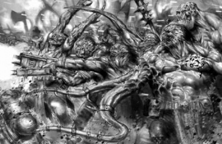
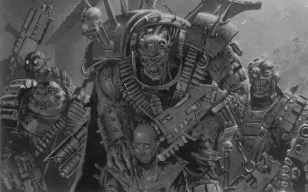
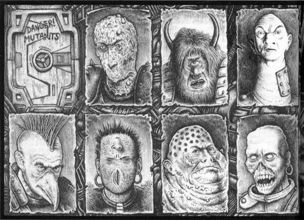
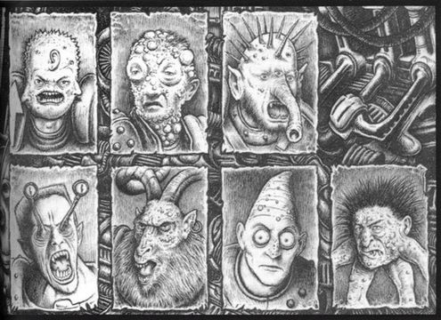
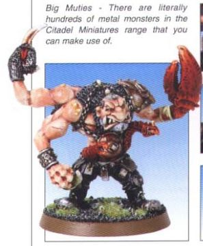
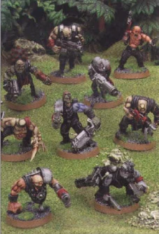
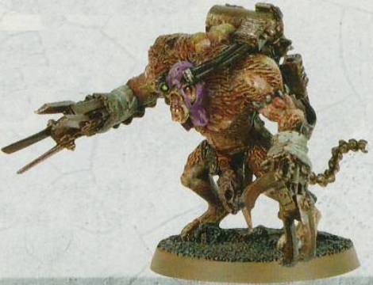
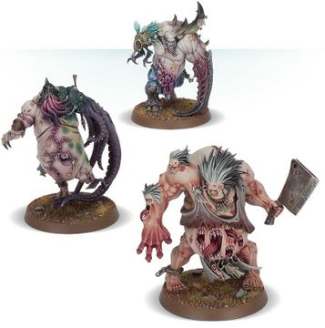

# 0027 变种人 Mutant

精校状态：中文行文已逐段精校，部分术语仍为暂定

分类：通用概念 / 帝国 Imperium

原文来源：https://www.bilibili.com/opus/1123856576202932241

原作者：帝国神选罐头

原文时间：2025年10月15日 13:37

[返回分类目录](目录.md) · [全书目录](../../目录.md)

<!-- A0027-B0001 -->
**英文原文**

Mutants are creatures bearing some form of severe genetic deviance from the normal members of their species. Some are born mutants, while others have suffered more spontaneous mutation through the influence of the Warp, whether by worshiping it or being exposed to its energies. Persecuted and hunted by Imperial society, Mutants often make up the forces of Chaos.

<!-- /A0027-B0001 -->

<!-- A0027-B0002 -->

原译文

变种人是指与物种的正常成员存在某种形式的严重遗传偏差的生物。有些人天生就是变种人，而另一些人则因亚空间的影响而遭受了更多的自发突变，无论是崇拜亚空间还是接触亚空间的能量。受到帝国社会的迫害和追捕，变种人经常组成混沌的部队。

**校订译文**

变种人指基因与同物种正常成员存在严重差异的生物。有些天生如此，有些则因崇拜亚空间或接触其能量，在亚空间影响下发生自发突变。由于受到帝国社会的迫害与追捕，变种人经常加入混沌势力。

<!-- /A0027-B0002 -->

<!-- A0027-B0003 图片 -->

<!-- A0027-B0004 -->

原译文

horde of human mutants 人类变种人部落

**校订译文**

horde of human mutants 成群的人类变种人

<!-- /A0027-B0004 -->

<!-- A0027-B0005 -->
## Mutation Among Humanity 人类突变

<!-- /A0027-B0005 -->

<!-- A0027-B0006 -->
**英文原文**

Humanity has suffered greatly since the 20th Century from the effects of mutation due to exposure to chemical and nuclear contamination. Nuclear war was widespread during both the Dark Age of Technology and the following Age of Strife, which has left many worlds badly exposed to the radioactive aftermath and has led to a significantly increased rate of mutation. Genetically healthy parents may have in some cases a 5% chance of rearing mutant offspring while mutant parents may give birth to mutant children around 90% of the time. Therefore, some human worlds may have an overwhelmingly mutant population.

<!-- /A0027-B0006 -->

<!-- A0027-B0007 -->

原译文

自20世纪以来，人类因暴露于化学和核污染而遭受了巨大的变种影响。核战争在黑暗技术时代和随后的纷争时代都很普遍，这使许多世界严重暴露在放射性后果中，并导致突变率显著增加。在某些情况下，遗传健康的父母可能有5%的机会养育变种人后代，而变种人父母可能在90%左右的时间里生下变种人后代。因此，一些人类世界可能拥有压倒性的变种人群体。

**校订译文**

本条目记述，自 20 世纪以来，化学污染和核污染引发的突变就给人类造成了严重危害。黑暗科技时代及其后的纷争时代，核战争十分普遍，许多世界深受放射性污染，突变率也因此大幅上升。在某些情况下，基因正常的父母生出变种后代的概率可达 5%，而变种人父母生出变种子女的概率可达约 90%。因此，有些人类世界的人口可能以变种人为绝大多数。

**校注：** 20 世纪及 5%、90% 均为条目中的虚构设定叙述与数值，照原文保留，不代表现实遗传学结论。

<!-- /A0027-B0007 -->

<!-- A0027-B0008 图片 -->

<!-- A0027-B0009 -->

原译文

Mutants with a captive 变种人与俘虏

**校订译文**

Mutants with a captive 变种人与俘虏

<!-- /A0027-B0009 -->

<!-- A0027-B0010 -->
**英文原文**

Human mutants are often terribly misshapen creatures, abominably deviating from the normal human form. On the other hand, not all mutants are degenerated beasts; many only bear a few extraordinary traits setting them apart from the rest of humanity.

<!-- /A0027-B0010 -->

<!-- A0027-B0011 -->

原译文

人类变种人通常是非常畸形的生物，与正常的人类形态截然不同。另一方面，并非所有变种人都是退化的野兽；许多人只具有一些非凡的特征，使他们与其他人类区别开来。

**校订译文**

人类变种人通常是非常畸形的生物，与正常的人类形态截然不同。另一方面，并非所有变种人都是退化的野兽；许多人只具有一些非凡的特征，使他们与其他人类区别开来。

<!-- /A0027-B0011 -->

<!-- A0027-B0012 图片 -->

<!-- A0027-B0013 -->

原译文

Mutants 变种人

**校订译文**

Mutants 变种人

<!-- /A0027-B0013 -->

<!-- A0027-B0014 图片 -->

<!-- A0027-B0015 -->
**英文原文**

There are many mutants amongst Humanity. Most pose a great threat, and very few are tolerated. The most important mutants are psykers, who are both the most useful and the most dangerous. Only by the righteous persecution of the Inquisition and the careful testing of the Coven Masters of the Adeptus Astra Telepathica can dangerous mutants be cleansed from the Imperium.

<!-- /A0027-B0015 -->

<!-- A0027-B0016 -->

原译文

人类中有许多变种人。大多数都构成了巨大的威胁，很少有人被容忍。最重要的变种人是灵能者，他们既是最有用的，也是最危险的。只有通过审判庭的公正迫害和星语庭的巫会之主的仔细测试，危险的变种人才能从帝国中被清除。

**校订译文**

人类中存在大量变种人。按帝国的观点，其中多数构成严重威胁，只有极少数可以得到容忍。最重要的变种人是灵能者：他们既最有用，也最危险。帝国认为，唯有审判庭以“正义”之名展开清剿，并由星语庭的巫会之主谨慎检验，才能将危险的变种人清除出帝国。

<!-- /A0027-B0016 -->

<!-- A0027-B0017 -->
**英文原文**

The position of mutants within the Imperium varies from world to world. On primitive worlds they are often slain at birth. On more advanced worlds they may be allowed to live, but rarely enjoy the benefits of other humans and are usually segregated from the normal population. In general terms, mutants form a huge downtrodden portion of the Imperium's population. Their dissatisfaction sometimes erupts into rebellion, sometimes allowing the mutants to take temporary control of an entire world. Retaliation, however, is usually swift and effective.

<!-- /A0027-B0017 -->

<!-- A0027-B0018 -->

原译文

变种人在帝国中的地位因世界而异。在原始世界，他们经常在出生时就被杀死。在更先进的世界里，他们可能被允许生活，但很少享受其他人类的福利，通常与正常人群隔离开来。一般来说，变种人在帝国人口中占很大比例。他们的不满有时会爆发为叛乱，有时会让变种人暂时控制整个世界。然而，报复通常是迅速而有效的。

**校订译文**

变种人在帝国的处境因世界而异。在原始世界，他们往往刚出生便被杀死；在较发达的世界，他们或许能获准活下去，却很少享有其他人类的待遇，通常还要与普通居民隔离。总体而言，变种人在帝国人口中构成了一个人数庞大、备受压迫的群体。他们的不满有时会引发叛乱，甚至短暂夺取整个世界的控制权，但帝国的镇压通常迅速而有效。

<!-- /A0027-B0018 -->

<!-- A0027-B0019 图片 -->

<!-- A0027-B0020 -->

原译文

Big Mutant 大变种人

**校订译文**

Big Mutant 大变种人

<!-- /A0027-B0020 -->

<!-- A0027-B0021 -->
**英文原文**

The laws of Imperial worlds normally forbid such creatures from possessing armaments; those weapons that mutants do possess are usually limited to crude shotguns or blunderbusses, heavy duty revolver-stubguns, chains, whips and clubs which can be easily made and concealed.

<!-- /A0027-B0021 -->

<!-- A0027-B0022 -->

原译文

帝国世界的法律通常禁止这些生物拥有武器；变种人确实拥有的武器通常仅限于简陋的霰弹枪或手炮、重型左轮手枪、链锯、鞭子和棍棒，这些武器很容易制造和隐藏。

**校订译文**

帝国各世界的法律通常禁止这类生物持有武器。变种人实际使用的武器，往往仅限于简陋的霰弹枪或喇叭口火枪、重型实弹左轮手枪，以及容易制作和藏匿的铁链、鞭子与棍棒。

<!-- /A0027-B0022 -->

<!-- A0027-B0023 -->
**英文原文**

Imperial Sanctioned-Mutation Work Passes can be given to Mutants, which will prevent them from being killed due to their genetic deviances. However, while the documents will work on the world they are issued on, other Imperial worlds may not accept the passes. On some worlds where mutants are permitted to live and work, the mutant population is largely focused on licensed shanty towns around the main hives. While mutants are not permitted in all spaces in the Imperium, normal humans aren’t necessarily permitted in mutant spaces either. For example, a mutant nightclub might not allow normal humans to enter.

<!-- /A0027-B0023 -->

<!-- A0027-B0024 -->

原译文

可以向变种人发放帝国制裁突变工作通行证，这将防止他们因基因异常而被杀死。然而，虽然这些文件将在它们发行的世界上发挥作用，但其他帝国世界可能不接受这些通行证。在一些允许变种人生活和工作的世界里，变种人主要集中在主巢都周围的许可棚户区。虽然变种人不允许出现在帝国的所有空间，但正常人也不一定允许出现在变种人空间。例如，变种人夜总会可能不允许正常人进入。

**校订译文**

变种人可以获发帝国认可的“变异者工作许可证”，使其免于仅因基因异常便被处死。但这类证件通常只在签发它的世界有效，其他帝国世界未必承认。在一些允许变种人生存、工作的世界，他们大多聚居于主要巢都周边获得许可的棚户区。变种人并非可以进入帝国的任何场所；同样，普通人也未必获准进入变种人的地盘。例如，变种人夜总会就可能拒绝普通人入内。

<!-- /A0027-B0024 -->

<!-- A0027-B0025 -->
**英文原文**

Some mutants take great pride in calling themselves by the Imperium’s glibbest slang as a badge of honour. Among mutants, the word "mutant" can be regarded as dirty or offensive. "Twist", a slur meaning mutant, is an acceptable slang term used among mutants.

<!-- /A0027-B0025 -->

<!-- A0027-B0026 -->

原译文

一些变种人非常自豪地用帝国最油嘴滑舌的俚语称呼自己，以此作为荣誉的象征。在变种人中，“异形”一词可以被视为肮脏或冒犯。“扭曲”是一个贬义词，意思是变种人，是变种人中使用的一个可接受的俚语。

**校订译文**

有些变种人会把帝国最轻蔑的俗称反过来当作荣誉，自豪地用它称呼自己。在他们之中，“变种人”这个词可能被认为肮脏或冒犯；相反，原本用来辱骂变种人的“扭子”（Twist），在族群内部却是可以接受的俗称。

<!-- /A0027-B0026 -->

<!-- A0027-B0027 图片 -->

<!-- A0027-B0028 -->

原译文

mutant rabble unleashed 被释放的变种人暴民

**校订译文**

mutant rabble unleashed 被释放的变种人暴民

<!-- /A0027-B0028 -->

<!-- A0027-B0029 -->
**英文原文**

Dissemblers are a type of Mutant. Navigators are considered Mutants, as well but were actually intentionally created in the distant past. Because they are a vital part of the Imperium, they are a tolerated form of mutant.

<!-- /A0027-B0029 -->

<!-- A0027-B0030 -->

原译文

伪装者是变种人的一种。导航者也被认为是变种人，但实际上是在遥远的过去故意创造的。因为它们是帝国的重要组成部分，所以他们是一种可容忍的变种人。

**校订译文**

伪装者是变种人的一种。导航员也被视为变种人，不过，他们其实是远古时期被有意创造出来的。由于导航员对帝国至关重要，这一类变种人得到了容忍。

<!-- /A0027-B0030 -->

<!-- A0027-B0031 -->
### Mutant Abominations 变异憎恶体

原题：Mutant Abominations 憎恨变种人

<!-- /A0027-B0031 -->

<!-- A0027-B0032 -->
**英文原文**

Mutant Abominations are Mutants, who have been remade by the influence of the Warp. As a result, their bodies have become the clay for an insane macabre sculptor, while the Abominations' minds and souls have become tainted beyond salvation.

<!-- /A0027-B0032 -->

<!-- A0027-B0033 -->

原译文

憎恨变种人是变种人，他们在亚空间的影响下被重塑。因此，他们的身体变成了疯狂恐怖雕塑家的粘土，而可憎之人的思想和灵魂则被污染得无法拯救。

**校订译文**

变异憎恶体是被亚空间之力重塑的变种人。他们的肉体仿佛成了疯狂、阴森的雕刻家手中的泥料，心智与灵魂则已被污染得无可救赎。

<!-- /A0027-B0033 -->

<!-- A0027-B0034 -->
### Mutant Monstrosities 变种人怪物

<!-- /A0027-B0034 -->

<!-- A0027-B0035 -->
**英文原文**

Mutants that are often created from dabbling in forbidden sciences are known as Mutant Monstrosities. They are affronts to nature who have short existences that are filled with constant pain and resentment and can also be left dim-witted. This will cause them to willingly or unwillingly exhibit brief periods of extreme violence and those who create the Monstrosities many not be able to control the creatures. Several species are known to be able to create the Monstrosities, such as the experiments of Ork Painboys or the Tyranids' bizarre Human/Tyranid hybrids. The Lost and the Damned are also known to use Monstrosities that are hybrids of large Mutants and Chaos Spawn. The Ordo Hereticus's Witch Hunters make use of them as well as the Astra Militarum, which can have ogryn or other abhuman bodyguards made into a Mutant Monstrosity they can field in battle.

<!-- /A0027-B0035 -->

<!-- A0027-B0036 -->

原译文

经常因涉足被禁止的科学而产生的变种人被称为突变怪物。他们是对大自然的侮辱，他们的生命短暂，充满了持续的痛苦和怨恨，也可能变得迟钝。这将导致他们自愿或不自愿地表现出短暂的极端暴力，而那些创造怪物的人可能无法控制这些生物。已知有几个物种能够创造怪物，比如欧克痛苦小子的实验或泰伦的怪诞人类/泰伦混血种。众所周知，迷失者和被诅咒者也会使用由大型变种人和混沌生物混合而成的怪物。讨逆修会的女巫猎手和星界军都会利用他们，星界军可以让欧格林或其他亚人护卫变成他们可以在外战斗的变种怪物。

**校订译文**

涉足禁忌科学所制造出的变种人，常被称为变异怪物。这些违背自然的生物生命短暂，终日承受痛苦与怨恨，有时还智力低下。他们会有意或无意地突然爆发出极端暴力，连创造者也未必能控制。已知多个物种能够制造这类怪物，例如欧克蛮人的痛苦小子所做的实验，以及泰伦虫族制造的怪异人类与泰伦混种。迷失者与被诅咒者也会使用由大型变种人与混沌魔物杂合而成的怪物。异端审判庭的猎巫人和星界军同样会利用他们：星界军可以将欧格林或其他亚人护卫改造成变异怪物，投入战场。

<!-- /A0027-B0036 -->

<!-- A0027-B0037 图片 -->

<!-- A0027-B0038 -->

原译文

Mutant Monstrosity, known as the Mutant Thing 突变怪物，被称为突变物

**校订译文**

Mutant Monstrosity, known as the Mutant Thing 一头被称为“变异之物”的变异怪物

<!-- /A0027-B0038 -->

<!-- A0027-B0039 -->
## Examples of Mutations 突变示例

<!-- /A0027-B0039 -->

<!-- A0027-B0040 -->
**英文原文**

Mutants have been observed to display a wide range of tangible aberrations, such as:

<!-- /A0027-B0040 -->

<!-- A0027-B0041 -->

原译文

已经观察到变种人显示出广泛的有形畸变，例如：

**校订译文**

变种人已被观察到具有多种明显的异常特征，例如：

<!-- /A0027-B0041 -->

<!-- A0027-B0042 -->
**英文原文**

Extra large/small or additional/missing limbs or other body parts

<!-- /A0027-B0042 -->

<!-- A0027-B0043 -->

原译文

超大/小或额外/缺失的肢体或其他身体部位

**校订译文**

肢体或其他身体部位异常庞大、微小、多生或缺失。

<!-- /A0027-B0043 -->

<!-- A0027-B0044 -->
**英文原文**

Bestial features such as horns, beaks, fangs, cloven feet, tentacles, fur, tails

<!-- /A0027-B0044 -->

<!-- A0027-B0045 -->

原译文

野兽特征，如角、喙、尖牙、分瓣足、触手、皮毛、尾巴

**校订译文**

野兽特征，如角、喙、尖牙、分瓣足、触手、皮毛、尾巴

<!-- /A0027-B0045 -->

<!-- A0027-B0046 -->

原译文

Invisibility 隐形

**校订译文**

Invisibility 隐形

<!-- /A0027-B0046 -->

<!-- A0027-B0047 -->
**英文原文**

Noxious stench or acid excretion

<!-- /A0027-B0047 -->

<!-- A0027-B0048 -->

原译文

有毒恶臭或酸性分泌物

**校订译文**

有毒恶臭或酸性分泌物

<!-- /A0027-B0048 -->

<!-- A0027-B0049 -->
**英文原文**

Superlative strength or speed

<!-- /A0027-B0049 -->

<!-- A0027-B0050 -->

原译文

超强的力量或速度

**校订译文**

超强的力量或速度

<!-- /A0027-B0050 -->

<!-- A0027-B0051 -->
**英文原文**

Ability to skip ahead in time

<!-- /A0027-B0051 -->

<!-- A0027-B0052 -->

原译文

及时提前转移的能力

**校订译文**

向前跳跃一段时间的能力。

<!-- /A0027-B0052 -->

<!-- A0027-B0053 -->
**英文原文**

Rearranged facial features

<!-- /A0027-B0053 -->

<!-- A0027-B0054 -->

原译文

重新排列的面部特征

**校订译文**

重新排列的面部特征

<!-- /A0027-B0054 -->

<!-- A0027-B0055 -->
**英文原文**

Extreme thinness or obesity

<!-- /A0027-B0055 -->

<!-- A0027-B0056 -->

原译文

极度消瘦或肥胖

**校订译文**

极度消瘦或肥胖

<!-- /A0027-B0056 -->

<!-- A0027-B0057 -->
**英文原文**

Grotesque appearance, caused by warts or scaly skin etc

<!-- /A0027-B0057 -->

<!-- A0027-B0058 -->

原译文

由疣或鳞状皮肤等引起的怪异外观等

**校订译文**

疣、鳞状皮肤等造成的畸怪外貌。

<!-- /A0027-B0058 -->

<!-- A0027-B0059 -->
## Known Mutant Hordes 著名变种人部落

<!-- /A0027-B0059 -->

<!-- A0027-B0060 -->

原译文

The Anointed of Aq'si‎ 阿奎'斯的受膏者‎

**校订译文**

The Anointed of Aq'si‎ 阿奎'斯的受膏者‎

<!-- /A0027-B0060 -->

<!-- A0027-B0061 -->

原译文

The Gellerpox Infected 盖勒铁瘟感染者

**校订译文**

The Gellerpox Infected 盖勒铁瘟感染者

<!-- /A0027-B0061 -->

<!-- A0027-B0062 图片 -->

<!-- A0027-B0063 -->

原译文

The Nightmare Hulks, three Gellerpox Infected Mutants 梦魇巨人，三个盖勒铁瘟感染者变种人

**校订译文**

The Nightmare Hulks, three Gellerpox Infected Mutants 梦魇巨人，三个盖勒铁瘟感染者变种人

<!-- /A0027-B0063 -->

<!-- A0027-B0064 -->

原译文

Pale Throng 苍白牧群

**校订译文**

Pale Throng 苍白牧群

<!-- /A0027-B0064 -->

<!-- A0027-B0065 -->

原译文

The Stigmatus Covenant 圣痕盟约

**校订译文**

The Stigmatus Covenant 圣痕盟约

<!-- /A0027-B0065 -->

<!-- A0027-B0066 -->

原译文

The Shyis'slaa‎ 希西'斯拉

**校订译文**

The Shyis'slaa‎ 希西'斯拉

<!-- /A0027-B0066 -->

<!-- A0027-B0067 -->

原译文

The Unsanctified 不洁者

**校订译文**

The Unsanctified 不洁者

<!-- /A0027-B0067 -->

<!-- A0027-B0068 -->

原译文

The Muties of Gorkamorka 搞克毛克的变种人

**校订译文**

The Muties of Gorkamorka 搞克毛克的变种人

<!-- /A0027-B0068 -->

<!-- A0027-B0069 -->
## Mutation among other species 其他物种的突变

<!-- /A0027-B0069 -->

<!-- A0027-B0070 -->
**英文原文**

Chaos and mutation also affects other alien species, but mutation is especially prevalent among mankind. The Kroot have the ability to evolve through controlled mutation by consumption of their enemies.

<!-- /A0027-B0070 -->

<!-- A0027-B0071 -->

原译文

混沌和突变也会影响其他外星物种，但突变在人类中尤其普遍。克鲁特有能力通过消耗敌人的受控突变来进化。

**校订译文**

混沌和突变也会影响其他异形物种，不过突变在人类中尤其普遍。克鲁特人能够吞食敌人，通过受控突变实现进化。

<!-- /A0027-B0071 -->

本篇核心术语与暂定项

以下列出本篇出现的英文原形及核心术语表用词。同形词可能指不同对象，具体词义以本篇正文和校注为准；单复数、别名和仅见于图注的名称可能尚未列入。完整候选见[术语表](../../术语表/双语术语候选.csv)。

| 英文 | 采用中文 | 状态 |
| --- | --- | --- |
| Astra Militarum | 星界军 | 官方已核对 |
| Tyranids | 泰伦虫族 | 官方已核对 |
| Ogryn | 欧格林 | 官方已核对 |
| Adeptus Astra Telepathica | 星语庭 | 暂定 |
| Warp | 亚空间 | 官方已核对 |
| Inquisition | 审判庭 | 暂定 |
| Imperium | 帝国 | 暂定·简称 |
| Dark Age of Technology | 黑暗科技时代 | 暂定 |
| The Lost and the Damned | 迷失者与被诅咒者 | 暂定 |
| Kroot | 克鲁特 | 暂定 |
| Abhuman | 亚人 | 暂定·官方待核 |
| Mutant | 变种人 | 暂定·官方待核 |
| Chaos Spawn | 混沌魔物 | 官方已核对 |
| Age of Strife | 纷争时代 | 暂定·官方待核 |
| Navigators | 导航员 | 官方已核对 |
| Ordo Hereticus | 异端审判庭 | 用户指定 |
| Mutant Monstrosity | 变异怪物 | 暂定·官方待核 |
| Twist | 扭子 | 暂定·官方待核 |
| Witch Hunters | 猎巫者 | 暂定 |
| Bear | 熊 | 暂定·官方待核 |
| The Dark | 《黑暗》 | 暂定·官方待核 |

