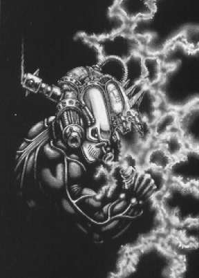
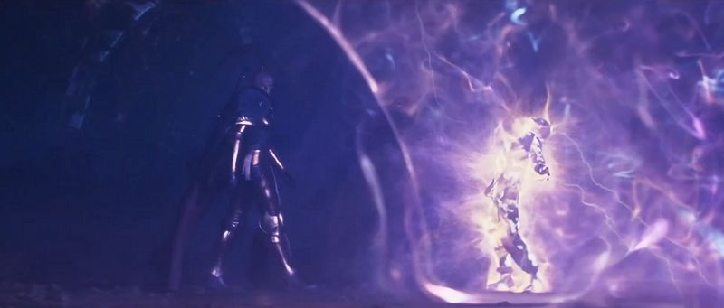

# 0028 空白者 Blank

精校状态：中文行文已逐段精校，部分术语仍为暂定

分类：通用概念 / 帝国 Imperium

原文来源：https://www.bilibili.com/opus/1082419341591314441

原作者：帝国神选罐头

原文时间：2025年06月25日 21:39

[返回分类目录](目录.md) · [全书目录](../../目录.md)

<!-- A0028-B0001 -->
**英文原文**

Blanks, also known as Untouchables, Pariahs, Psychic Nulls and Blacksouls are an exceedingly rare strain of Human mutant, whose mutation tied to a so-called pariah gene allows their minds to exude a negative psionic field, that both disrupts psychic phenomena in a radius and ultimately makes them immune to all tangible and imaginable psionic effect. They possess a negative presence in the Warp, that drains its energies towards their void-like soul. In scientific terminology of the Imperium a blank is an Omega-Minus psyker, otherwise called just Omega class negative psionic.

<!-- /A0028-B0001 -->

<!-- A0028-B0002 -->

原译文

空白者，也被称为不可接触者、遗弃者、灵能空洞和黑魂，是一种极其罕见的人类突变体，其突变与所谓的遗弃者基因有关，使他们的思维能够散发出反向的灵能场，这既破坏了半径范围内的灵能现象，又最终使他们对所有有形和可想象的灵能效应免疫。他们在亚空间中拥有一种负面的存在，将其能量引向他们空虚的灵魂。在帝国的科学术语中，空白者是欧米伽负灵能者，也称为欧米伽级反灵能。

**校订译文**

空白者又称不可接触者、贱民、灵能空洞或黑魂，是一种极其罕见的人类变种。他们的突变与所谓的“贱民基因”有关，能使心智释放反灵能场，扰乱一定范围内的灵能现象，并使他们免疫各种灵能效应。他们在亚空间中的存在呈负性，能量会被吸向其虚空般的灵魂。按照帝国的科学分类，空白者属于欧米伽负级灵能者，也被简称为欧米伽级反灵能者。

**校注：** 本篇对“空白者”作严格的欧米伽负级定义，并声称绝对免疫灵能；其他资料可能对 blank/null/untouchable 使用更宽泛。本稿保留本篇口径，不将其推广为全书所有版本的统一定论。

<!-- /A0028-B0002 -->

<!-- A0028-B0003 图片 -->

<!-- A0028-B0004 -->

原译文

Culexus Assassin, a type of Blank utilised by the Imperial Officio Assassinorum 邱利萨斯刺客，帝国刺客庭使用的一种空白者

**校订译文**

Culexus Assassin, a type of Blank utilised by the Imperial Officio Assassinorum 邱利萨斯刺客，帝国刺客庭使用的一种空白者

<!-- /A0028-B0004 -->

<!-- A0028-B0005 -->
## Overview 概述

<!-- /A0028-B0005 -->

<!-- A0028-B0006 -->
### Biology 生理

<!-- /A0028-B0006 -->

<!-- A0028-B0007 -->
**英文原文**

As opposed to positive psykers that are found within many species of Xenos in the Galaxy, blanks, and even lesser negative psionics are exclusive to the Human species. The pariah gene is inheritable, and while positive psionic powers have no known correlation with genetics, there exists a direct correlation between a blank parent and a blank offspring. Some populations are known to harbour a higher frequency of untouchable births, feral folk of the world of Vessor is one of such notable people. Genetically, a link between negative and positive psykers is not specified. Still, the Assignment of psionic abilities marks blank as a negative psionic, on whom no known extreme of psychic force can have an effect. Defining them by a classification as a psyker of level Omega-Minus, or an 'Untouchable'. The term marks the difference from other classes of negative psionics, which for a lack of a better word are 'touchable' by some psychic powers, extreme or weak, and thus not considered blanks. The pariah gene expresses fully in the Untouchables, while in other, lesser negative psionics, only partially. Although, there are reasons to suggest that the blanks power is not derived as an expression of a single gene at all. The Emperor of Mankind placed a moratorium on research into the source, after experiments by the Imperial Archotechnologist Corps and the Mechanicum in the early years of the Great Crusade ended in disaster. Furthermore, the origin of the supposed gene is unknown, and the explanatory proposals vary from it being the result of human experimentation during the Dark Age of Technology, xenos tampering, or a natural evolutionary adaptation against the Warp.

<!-- /A0028-B0007 -->

<!-- A0028-B0008 -->

原译文

与银河系中许多异型物种中发现的正灵能者相反，空白者甚至更少的反灵能者都是人类独有的。遗弃者基因是可遗传的，虽然正灵能与遗传学没有已知的相关性，但空白者父母和空白者后代之间存在直接的相关性。众所周知，一些人群的遗弃者出生频率更高，维瑟世界的野蛮人就是其中一个值得注意的人群。从遗传学上讲，正向和反向灵能者之间没有明确联系。尽管如此，对灵能能力的判定将空白者标记为反灵能者，任何已知的极端灵能力量都不会对其产生影响。通过分类将其定义为欧米伽级反灵能者，或不可接触者。这个词标志着与其他类别的反灵能的区别，因为没有更好的词，这些反灵能者可以被一些极致或微弱的灵能“触及”，因此不被视为空白者。遗弃者基因在遗弃者中完全表达，而在其他较不反向的灵能者中仅部分表达。尽管如此，有理由表明空白者的能力根本不是单个基因的表达。在大远征早期，帝国考古技术兵团和机械神教的实验以灾难告终后，人类帝皇暂停了对来源的研究。此外，推断基因的起源尚不清楚，解释性的提议也各不相同，既不是黑暗技术时代人类实验的结果，也不是异型篡改的结果，或者是对亚空间的自然进化适应。

**校订译文**

正向灵能者见于银河中的多种异形，而空白者乃至能力较弱的反灵能者，则为人类所独有。“贱民基因”可以遗传：正向灵能与遗传之间尚无已知关联，空白者父母与空白者后代之间却存在直接联系。有些族群诞生不可接触者的比例更高，维瑟世界的蛮荒居民便是著名例子。正、反灵能者在遗传层面上是否相关，尚未明确。灵能分级体系仍将空白者列为反灵能者，并认为任何已知强度的灵能力量都无法影响他们，因此将其定为“欧米伽负级”，又称“不可接触者”。这一名称也将他们与其他反灵能者区别开来：后者仍可能被某些强弱不一的灵能力量“触及”，因而不算空白者。按照基因解释，贱民基因在不可接触者身上充分表达，在较弱的反灵能者身上则只部分表达。不过，也有理由怀疑，空白者的能力根本不能归因于单个基因。大远征初期，帝国古科技专家团与机械教的实验酿成灾难后，帝皇下令暂停追查这种能力的来源。所谓贱民基因的起源仍不明，现有解释包括黑暗科技时代的人体实验、异形干预，以及人类为抵御亚空间而形成的自然进化适应。

**校注：** 本段原译把三种起源假说译成“既不是……也不是……”，与英文列举含义相反，已修正。所谓遗传机制及帝国科研分类均属本条目设定叙述。

<!-- /A0028-B0008 -->

<!-- A0028-B0009 -->
**英文原文**

In one analysis of a blank mind, it is stated that in comparison to psychic powers emergent from impulses between synapses, Untouchables blank those, triggering a vacancy in the natural and fundamental processes of the brain. It is assumed that this disparity causes their mind to display the nullifying effect on psychic phenomena, and the same inversion of normal brain functions makes their presence insufferable for normal human minds. While the effect on the mind of a psychic individual is apparent from the visible pain of a psyker, the blank still has a tangible effect on baseline humans in their proximity. The effect causes both forgetfulness and unease in the blank's presence. Ultimately, the disturbed mind produces an irrational hostility; these feelings may be mild yet nonetheless instantly apparent in regular people, but in psykers they are unbearably strong.

<!-- /A0028-B0009 -->

<!-- A0028-B0010 -->

原译文

在一项对空白者思维的分析中，有人说，与突触之间的脉冲产生的灵能力量相比，不可接触者的大脑会使这些脉冲空白，从而引发大脑自然和基本过程的空缺。人们认为，这种差异会导致他们的大脑对灵能现象产生抵消作用，而正常大脑功能的逆转也会使他们的存在对正常人的大脑来说难以忍受。虽然从灵能者可见的疼痛中可以明显看出对灵能个体的影响，但空白者仍然对附近的普通人类有切实的影响。这种效果会在空白者的存在下引起健忘和不安。最终，精神错乱会产生非理性的敌意；这些感觉可能很轻微，在普通人身上却很明显，而在灵能者身上，它们却强烈得令人难以忍受。

**校订译文**

一份针对空白者心智的分析提出，通常的灵能力量由突触之间的神经冲动产生，不可接触者却会将这些活动归零，使大脑最基本的自然过程中出现空缺。该分析推测，正是这种差异使他们能够抵消灵能现象，而正常脑功能的这种倒转，也令普通人的心智难以忍受他们的存在。灵能者显露出的痛苦最为明显，但附近的普通人同样会受影响，感到不安，甚至出现遗忘。这种扰动最终会引发无缘无故的敌意。普通人的反应虽可能轻微，却会立即显现；灵能者承受的反应则强烈得难以忍受。

<!-- /A0028-B0010 -->

<!-- A0028-B0011 -->
**英文原文**

The presence of a blank's mind in the Immaterium is likened to black holes in the Materium, not unlike the analogy of a powerful psyker's mind to the stars. The psyker's soul lures towards it harmful psychic phenomena, mainly including daemons, while the blank's soul is dreaded both by the native denizens of the warpspace and any being with a soul. This is akin to ravenous void, as it forcefully devours all psychic energies, thus directly pulling towards them both daemons' and other beings' essence. The sensation of unease that other people fear is also partially attributed to the idea that everyone has some degree of psychic sense, which is triggered when faced with the blank. Furthermore the black hole analogy holds firm, as in similar fashion as black holes can't be directly seen in realspace, nor can a blank's soul be observable in the Warp, without observation of the surrounding energies and warpspace. This presents a problem to daemons or similar immaterial creatures like Enslavers, as while able to observe the real space the predominant sight for them comes from the Immaterium, thus making it only possible to guess the location of the blank, which further fuels their dread for the pariahs. The fear that blanks cause in the warp entities makes it hard for them to naturally harm the pariah, although the possession or trading of the blank's soul is not out of the realm of possibility. Of note is that it is required for the blank to be fully cooperative, either forced into the agreement by physical and/or psychological torture, or truly willing to deal with daemons.

<!-- /A0028-B0011 -->

<!-- A0028-B0012 -->

原译文

在非物质界中，空白者思维的存在被比作物质界中的黑洞，这与强大的灵能者的思维与恒星的类比并无二致。灵能者的灵魂会吸引有害的灵能现象，主要包括恶魔，而空白者的灵魂则会被亚空间的本土居民和任何有灵魂的人所恐惧。这类似于贪婪的虚空，因为它强行吞噬所有的灵能能量，从而直接将恶魔和其他生物的本质拉向他们。其他人害怕的不安感也部分归因于这样一种观点，即每个人都有一定程度的灵能感知，这是在面对空白者时触发的。此外，黑洞的类比仍然成立，因为在现实空间中无法直接看到黑洞，在没有观察周围能量和亚空间的情况下，在亚空间中也无法观察到空白者的灵魂。这给恶魔或类似的非物质生物（如奴役者）带来了一个问题，因为虽然他们能够观察到真实空间，但他们的主要视线来自非物质界，因此只能猜测空白者的位置，这进一步加剧了他们对遗弃者的恐惧。空白者在亚空间实体中引起的恐惧使它们很难自然地伤害遗弃者，尽管拥有或交易空白者的灵魂并非不可能。值得注意的是，空白者需要完全合作，要么是通过身体和/或心理折磨被迫达成协议，要么是真正愿意与恶魔打交道。

**校订译文**

如果说强大灵能者的心智宛如恒星，空白者在非物质界中的存在就如同物质界的黑洞。灵能者的灵魂会吸引恶魔等有害的灵能现象，而空白者的灵魂却令亚空间原生住民乃至一切有灵魂的存在恐惧。它像贪婪的虚空，强行吞噬灵能，将恶魔和其他生物的本质吸向自身。旁人的不安，也常被部分归因于人人都具有某种程度的灵性感知，而空白者的存在触动了这种感知。黑洞的比喻还适用于观察方式：空白者的灵魂无法在亚空间中被直接看见，观察者只能借周围能量和亚空间的变化来判断其位置。这对恶魔和奴役者等非物质生物尤其棘手；它们虽能观察现实空间，却主要依赖非物质界中的感知，因此只能猜测空白者的位置，也就更加畏惧这些贱民。恐惧使亚空间实体很难直接伤害空白者，但附身于他们、或以其灵魂进行交易，并非完全不可能。前提是空白者彻底配合：他们可能在身心折磨下被迫同意，也可能确实自愿与恶魔交易。

<!-- /A0028-B0012 -->

<!-- A0028-B0013 -->
### Social ostracism 社会排斥

<!-- /A0028-B0013 -->

<!-- A0028-B0014 -->
**英文原文**

The natural discordance of a blank mind with another causes upset in both parties. Part of it comes from an inherent revolting sensation upon contact with pariahs but perhaps moreso from widespread ignorance of blanks and their condition. The common Human reaction to this phenomenon is for blanks to be either killed or banished from their native society, due to the lingering fear of the unknown power that the null individual holds. It is not rare for a blank to commit suicide, unable to deal with the loneliness caused by their condition and the distressing lack of understanding as to why the society so indiscriminately casts them out. Blanks have a difficult time getting along with people, so they tend to lead short, asocial and unhappy lives, often at the fringes of society.

<!-- /A0028-B0014 -->

<!-- A0028-B0015 -->

原译文

一个空白者的头脑与另一个头脑的自然不一致导致双方都感到不安。部分原因来自与遗弃者接触时固有的反感，但也许更多的原因是对空白者及其状况的普遍无知。人类对这一现象的常见反应是，由于对虚无个体所拥有的未知力量的挥之不去的恐惧，空白者要么被杀死，要么被驱逐出他们的原生社会。一个空白者自杀并不罕见，他们无法应对自己的状况造成的孤独，也无法理解为什么社会如此不加选择地把他们赶出去。空白者很难与人相处，所以他们往往过着短暂、不合群和不快乐的生活，往往处于社会的边缘。

**校订译文**

空白者的心智与他人天然不协调，双方都会因此困扰。部分原因是旁人在接触贱民时本能地产生厌恶，但更大的原因或许是人们普遍不了解空白者及其状况。由于始终畏惧这种个体身上未知的力量，人类社会常将空白者杀死，或逐出他们出生的社群。有些空白者无法承受孤独，也无法理解自己为何遭到社会一概排斥，最终选择自尽，这种情况并不罕见。他们难以与人相处，往往只能生活在社会边缘，度过短暂、孤绝而不幸的一生。

<!-- /A0028-B0015 -->

<!-- A0028-B0016 -->
**英文原文**

It is regarded as fact even amongst some of the more educated people that blanks are beings devoid of a soul. This belief is predicated on the fact that their presence in the Warp is not as apparent as any other creature's. The belief in their soullessness is so widespread that it is even accepted by the blanks themselves, to the point of incredulity when it is demonstrated otherwise. While most pariahs accept their apparent soullessness, it nevertheless causes a perceivable level of distress both to consider the idea and the repeated statement of it by their peers. Some members of the Inquisition, whether out of knowledge or ignorance, posit a term of 'blacksouls' for blanks.

<!-- /A0028-B0016 -->

<!-- A0028-B0017 -->

原译文

即使在一些受过良好教育的人中，空白者也被认为是没有灵魂的存在。这种信念是基于这样一个事实，即他们在亚空间中的存在并不像其他任何生物那样明显。对他们没有灵魂的信念是如此普遍，甚至被空白者本身所接受，当它以其他方式被证明时，甚至会令人难以置信。虽然大多数遗弃者接受他们明显的无魂，但考虑到这个想法和同辈的重复陈述，他们仍然会感到一定程度的痛苦。审判庭的一些成员，无论是出于知识还是无知，都用“黑魂”一词来表示空白者。

**校订译文**

即使一些受过良好教育的人，也把“空白者没有灵魂”视为事实。这一信念源于他们在亚空间中的存在不像其他生物那样显眼。“无魂”的说法流传如此广泛，连空白者自己都接受了，以至于见到反证时也难以置信。尽管大多数贱民接受这种判断，仅仅想到它，或反复听同伴提起，仍会感到明显痛苦。审判庭的部分成员则称他们为“黑魂”，只是这究竟源于了解还是无知，尚难判断。

<!-- /A0028-B0017 -->

<!-- A0028-B0018 -->
**英文原文**

The negative aura of the null effect never fades away, and people that are in constant contact with the pariah never grow numb to it. Still, it isn't impossible to overcome the instinctual reaction and tolerate or even form a relationship with the pariah. The primary reason as to why the blank strain hasn't died out is that some blanks are able to overcome their innate limitations and find partners with whom they produce offspring, who then inherit their parent's genetic mutation. In exceedingly rare cases, extremely empathetic or spiritual persons can nigh instantaneously counter their minds' abhorrence at the null individual's nature and treat them without the otherwise commonplace disgust.

<!-- /A0028-B0018 -->

<!-- A0028-B0019 -->

原译文

虚无效应的负面光环永远不会消失，与遗弃者不断接触的人永远不会对此麻木。尽管如此，克服本能反应并容忍甚至与遗弃者建立关系并非不可能。空白者没有灭绝的主要原因是，一些空白者能够克服其先天的局限性，找到与他们一起繁殖后代的伴侣，然后这些后代继承了父母的基因突变。在极少数情况下，极有同理心或精神的人几乎可以立即反驳他们头脑中对虚无个体本性的厌恶，并在没有其他常见厌恶的情况下对待他们。

**校订译文**

反灵能场带来的排斥感不会消退，长期与贱民相处的人也不会对此麻木。不过，人仍可能克服本能反应，容忍贱民，甚至与他们建立亲密关系。空白者这一变种之所以未曾消失，主要是因为部分空白者能够克服先天障碍，找到伴侣并生育后代，将基因突变传给子女。在极少数情况下，同理心极强或精神修养深厚的人，几乎能够立刻压下内心的排斥，平静地对待空白者，不流露常见的厌恶。

<!-- /A0028-B0019 -->

<!-- A0028-B0020 -->
## Abilities 能力

<!-- /A0028-B0020 -->

<!-- A0028-B0021 -->
### Natural 自然

<!-- /A0028-B0021 -->

<!-- A0028-B0022 -->
**英文原文**

Just as psyker powers vary from individual to individual, so do the powers of negative psionics of power lesser than those of the blanks. However, there is no known variation within the innate power of a blank, and its precision or intensity is determined only by skill and training. The effect of a pariah gene is absolute, moreover the blank is defined by it, as to be called Untouchables, no psychic power existing within the Immaterium can be able to harm them.

<!-- /A0028-B0022 -->

<!-- A0028-B0023 -->

原译文

正如灵能者的力量因人而异一样，反灵能的力量也比空白者的力量小。然而，空白者的内在力量没有已知的变化，其精度或强度仅由技能和训练决定。遗弃者基因的影响是绝对的，而且空白者是由它定义的，被称为不可触碰者，内在的灵能力量无法伤害他们。

**校订译文**

正如灵能者的力量因人而异，能力低于空白者的反灵能者，其力量也各不相同。但本篇认为，空白者的先天能力不存在已知差异，运用时的精度与强度只取决于技巧和训练。贱民基因的效果是绝对的；空白者也正是按这一标准定义：只有非物质界中任何灵能力量都无法伤害的人，才称得上“不可接触者”。

<!-- /A0028-B0023 -->

<!-- A0028-B0024 -->
**英文原文**

The base effect of the blanks anti-psychic aura is obvious, psychic phenomena are impaired within their proximity, and there is no way to interact with them using psychic powers. Making it impossible to probe them telepathically or become aware of their presence through psychic screening like Psyniscience or Sensing Presence. Powers in a radius, for a lack of a better term, tied to the blanks' willpower, also cease to function. People surrounding the blank as such are also shielded from psychic investigation. So do effects already put in motion, force and daemons weapons or occult artefacts are rendered powerless in blanks proximity, or the glamours intended to hide their users' true nature. It is possible for a blank to be affected by psychic power indirectly, such as by telekinetically hurling a projectile at them. Possession is seemingly out of the question, although they can give themselves to the daemons willingly, making it only impossible for a daemon to slither in unnoticed by the blank.

<!-- /A0028-B0024 -->

<!-- A0028-B0025 -->

原译文

空白者反灵能光环的基础效果是显而易见的，灵能现象在他们附近受到损害，并且无法使用灵能力量与让们互动。无法通过心灵感应来探测他们，也无法通过灵视或感知存在等灵能筛查来意识到他们的存在。半径范围内的力量，由于缺乏更好的措辞，与空白者的意志力有关，也停止了作用。空白者周围的人也可以免受灵能侦查。已经启动的效果也是如此，原力和恶魔武器或神秘造物在空白者附近变得无能为力，或者那些旨在隐藏使用者真实本性的诱惑者。空白者可能会受到灵能力量的间接影响，例如通过念动力向他们投掷弹丸。占据似乎是不可能的，尽管他们可以心甘情愿地把自己交给恶魔，这使得恶魔不可能在空白者处不被注意的溜走。

**校订译文**

空白者反灵能场的基本效果很明显：附近的灵能现象会受到抑制，灵能力量无法直接作用于他们。心灵感应不能探查其心智，灵视或存在感知等手段也无法发现他们。一定半径内的灵能会失效，这一范围大致与空白者的意志力有关，周围的人也因此受到遮蔽，免遭灵能侦查。已经生效的灵能现象同样会被压制：灵能武器、恶魔武器、神秘遗物会在其附近失去力量，掩盖使用者真实本性的幻象也会失效。不过，灵能仍能间接伤害空白者，例如用念动力把实体弹丸掷向他们。恶魔似乎不能强行附身于空白者，但他们可以自愿将自己交给恶魔；真正不可能的，是恶魔在空白者毫无察觉时悄然侵入。

<!-- /A0028-B0025 -->

<!-- A0028-B0026 -->
**英文原文**

Furthermore, the aura is noxious to any living being around them, as it counteracts the normal brainwaves of any creature, inflicting a sensation of wrongness. To beings tied to the warp like psykers, the effect is nigh unbearable, disarming them instantly and inflicting direct revulsion, while beings native to the warp act in open fear and dread. The focused power of a blank can even destroy the daemon, granting it a True Death. Amongst xenos, the most affected are the Eldar, and although some of them lack psychic might, they all react to the blanks with the same revulsion and trauma as human psykers. Furthermore, the psychic nullification is particularly destructive towards eldar technology, as the wraithbone that constitutes its bulk is known to melt in the blanks' proximity, and especially when in skin contact with the pariah. While it is a matter of conjecture whether a blank can affect the functioning of the tyranid hive mind, the ability is known to work on the genestealers. Rare interactions between proper tyranid lifeforms and blanks shown little to no effect, and instances of them being affected are found questionable by the Inquisition's investigation.

<!-- /A0028-B0026 -->

<!-- A0028-B0027 -->

原译文

此外，光环对周围的任何生物都是有害的，因为它会抵消任何生物的正常脑电波，造成一种错误的感觉。对于像灵能者一样被束缚在亚空间上的生物来说，这种效果几乎是无法忍受的，会立即解除它们的武装并引起直接的反感，而亚空间的原生生物则会在展开的恐怖和恐惧中行动。空白者的集中力量甚至可以摧毁恶魔，使其获得真正的死亡。在异型中，受影响最大的是灵族，尽管他们中的一些人缺乏灵能力量，但他们对空白者的反应都与人类灵能者一样强烈。此外，这种灵能上的无效性对灵族技术尤其具有破坏性，因为众所周知，构成其主体的灵骨会在空白者的靠近下熔化，尤其是在与遗弃者皮肤接触时。虽然空白者是否会影响泰伦蜂巢思维的功能是一个猜测的问题，但众所周知，这种能力会对基因窃取者产生影响。适当的泰伦生命形式和空白者之间的少量互动几乎没有效果，审判庭的调查发现，它们受到影响的情况值得怀疑。

**校订译文**

此外，这种反灵能场会干扰附近生物的正常脑波，使其产生强烈的异样感。灵能者等与亚空间相联的生物几乎无法忍受，会立即丧失抵抗能力，陷入厌恶与痛苦；亚空间原生生物则会明显流露恐惧。空白者集中力量时，甚至能彻底消灭恶魔，赐予它们“真正的死亡”。在异形之中，灵族受影响最大：即便个体没有强大的灵能，也会像人类灵能者一样受到创伤。反灵能对灵族技术的破坏尤其严重，本篇记述其主要材料灵骨会在空白者附近熔化，与其皮肤直接接触时尤为明显。空白者能否干扰泰伦虫族的虫巢意志，仍无定论，不过其能力能够影响基因窃取者。真正的泰伦生物与空白者接触的罕见记录，通常显示影响很小，甚至毫无影响；声称出现影响的案例，也受到审判庭调查者的质疑。

**校注：** 本段称空白者可熔化灵骨、对泰伦本体几乎无效，属于具体来源中的断言，尚未逐一对照其原始出版物；保留并待核，不以记忆修订。

<!-- /A0028-B0027 -->

<!-- A0028-B0028 -->
### Trained 训练

<!-- /A0028-B0028 -->

<!-- A0028-B0029 -->
**英文原文**

Rarely noticeable, a trait of its own nature, effect of the blank is the willingness for a human mind to omit facts of blanks' existence. While it isn't blatantly obvious, a blank trained to move and act with little notice will be rendered imperceivable even for physical inspection. This ability is of particular interest to the Sisters of Silence. Skilled individuals are known to unnaturally not emit even sounds that are physically bound to be at least muffled. Achieving the mastery of it makes it hard to notice the blank, only effects that their actions have. People will observe a door curiously open, with a shimmer that their mind tells them it's better not to look at, or will see it an act of divine intervention when their enemy falls to a force, too joyful to acknowledge its abyssal nature. So do enemies fail to notice the pariah approaching, sometimes able to glimpse their end's face at the last moment.

<!-- /A0028-B0029 -->

<!-- A0028-B0030 -->

原译文

空白者的影响是人类大脑愿意忽略空白者存在的事实，这是一种罕见的、自身性质的特征。虽然这并不是显而易见的，但一个受过训练的空白者可以在几乎没有人注意到的情况下移动和行动，即使进行身体检查，也会变得不可感知。寂静修女对这种能力特别感兴趣。众所周知，技术熟练的人会自然地不发出声音，即使这些声音在身体上至少是低沉的。掌握它会让人很难注意到空白者的行为所产生的影响。人们会看到一扇门奇怪地打开，闪烁着光芒，他们的大脑告诉他们最好不要看，或者当他们的敌人落入一种伟力手中时，他们会看到这是一种神圣的干预行为，这种力量太令人高兴了，使人无法承认其深渊的本质。敌人也没有注意到遗弃者的逼近，有时甚至能在最后一刻瞥见他们的终结。

**校订译文**

空白者还有一种因自身性质而不易被察觉的效果：人类心智会倾向于忽略他们的存在。这种作用并不显眼，但经过训练、懂得低调行动的空白者，甚至能逃过直接的感官观察。寂静修女尤其重视这种能力。熟练者能够以不合常理的方式消除动静，连按理说只能被压低、无法彻底消除的声音也不会发出。掌握到极致时，人们难以察觉空白者本人，只能看到其行动的结果：一扇门莫名打开，一抹微光掠过，而脑海中的本能告诉他们最好别看；或者敌人被某种力量击倒，人们便把它当成神迹，沉浸于喜悦，不肯意识到那力量深渊般的本质。敌人同样可能看不到逼近的贱民，直到生命最后一刻才瞥见杀死自己的那张脸。

<!-- /A0028-B0030 -->

<!-- A0028-B0031 -->
**英文原文**

In similar fashion, the assassins of the Culexus clade found out it's possible to train blank so that by the force of their will they can be able to silence the dreadful aura, for the purpose of remaining undetected with their chosen prey, the psykers. Although the effect can be achieved naturally, this puts a strain on the blank. With the sensation of releasing the pent-up energies described with a degree of relief. While unbothered by the stealthy appearance they can don their masks, fitted with gear that allows them to modulate the effect without the mentioned strain. Allowing them to not amass suspicion of a targeted psyker and their allies, warned by the approaching aura of pain and suffering.

<!-- /A0028-B0031 -->

<!-- A0028-B0032 -->

原译文

以类似的方式，邱利萨斯分支的刺客发现可以进行空白者训练，这样他们就可以通过意志力来压制恐惧光环，以便不被他们选择的猎物灵能者发现。虽然效果可以自然实现，但这给空白者带来了压力。随着释放被压抑的能量的感觉被描述为一种解脱。虽然他们不受隐藏外观的束缚，但他们可以戴上口罩，戴上装备，可以在没有上述应变的情况下调节效果。允许他们不会被目标灵能者及其盟友产生怀疑，因为疼痛和痛苦的光环正在逼近。

**校订译文**

邱利萨斯刺客也发现，经过训练的空白者能够凭意志压下令人恐惧的气场，避免被猎物——灵能者——提前发现。空白者本来就能做到这一点，但这样会给他们造成负担；重新释放积压的力量时，则会感到如释重负。若不必隐藏自身刺客身份，他们可以戴上装有特殊设备的面具，借助装备调节气场，而不必承受上述压力。如此一来，目标灵能者及其同伴便不会因逐渐逼近的痛苦气场而提前警觉。

<!-- /A0028-B0032 -->

<!-- A0028-B0033 -->
### Augmented 技术强化

原题：Augmented 扩张

<!-- /A0028-B0033 -->

<!-- A0028-B0034 -->
**英文原文**

With an assist of technology, blanks are able to control awe-inspiring powers. The mentioned Culexus mask contains as well a piece of gear called Animus Speculum, which magnifies and weaponizes both the soul draining horror of a blank, and the psykers own power, turning against them in the negative feedback loop of the Speculum. Mere turning on the device makes the surrounding people writhe in pain, while the blood vessels pop in reaction to their strained flesh. The beam's focus is known to violently snuff out the life of any sentient creature, only rising in lethality with the psychic power that it opposes. Its power described to violently wave in ghastly light of anti-psychic energy, burning the target's brain out and sucking its soul in. So does a direct touch of the blank having its speculum activated, able to turn a person into dust in mere seconds.

<!-- /A0028-B0034 -->

<!-- A0028-B0035 -->

原译文

在技术的帮助下，空白者能够控制令人敬畏的力量。提到的邱利萨斯面具还包含一件名为恶意透镜的装备，它放大并武器化了空白者的令人灵魂枯竭的恐怖，以及灵能者自己的力量，在透镜的负反馈回路中与他们对抗。仅仅打开设备就会让周围的人痛苦地扭动身体，血管会因肌肉拉伤而爆裂。众所周知，光束的焦点会猛烈地扼杀任何有感知力的生物的生命，只会随着它所对抗的灵能力量而致命。它的力量被描述为在可怕的反灵能能量光中剧烈波动，烧灼目标的大脑，吸入其灵魂。空白者的直接触摸也会激活透镜，能够在几秒钟内将人变成灰尘。

**校订译文**

借助技术，空白者可以驾驭惊人的力量。邱利萨斯面具中的“恶意透镜”会放大并武器化空白者吞噬灵魂的可怕力量，同时攫取敌方灵能者自身的力量，经由透镜的负反馈回路反噬其主人。只要启动装置，附近的人便会痛苦扭动，肉体不堪重负，血管纷纷爆裂。聚焦的光束能猛烈地熄灭任何有感知生物的生命；敌人的灵能越强，它就越致命。汹涌的反灵能闪耀着惨厉光芒，烧毁目标的大脑，吸走其灵魂。恶意透镜开启时，空白者仅凭直接触碰，也能在几秒内将人化为尘埃。

<!-- /A0028-B0035 -->

<!-- A0028-B0036 -->
**英文原文**

Inquisitor Perfidia Vong recovered a bunch of devices of heretical origin manufactured on the moons of Gorma, they constitute of blank embryos trapped within a stasis casket. When activated, it emulates the power of Animus Speculum, making it a portable anti-psychic weapon, otherwise available only to the Assassinorum. It displays the same abilities of the focused blank aura, which besides already known ability to destroy psyches of people, includes shattering of warp constructs, like force weapons, and being a powerful weapon against the daemons, crippling them severely.

<!-- /A0028-B0036 -->

<!-- A0028-B0037 -->

原译文

审判官佩尔菲迪亚·冯找到了一堆在戈尔玛卫星上制造的异端装置，它们由困在静滞棺材里的空白者胚胎组成。激活后，它会模拟恶意透镜的力量，使其成为一种便携式的反灵能武器，否则只有刺客才能使用。它显示出与聚焦的空白者光环相同的能力，除了已知的摧毁人类心灵的能力外，还包括粉碎亚空间结构，如灵能武器，并成为对抗恶魔的强大武器，严重削弱它们。

**校订译文**

审判官佩尔菲迪亚·冯曾缴获一批在戈尔玛的卫星上制造的异端装置，其中封存着被困于静滞棺内的空白者胚胎。启动后，它们能模拟恶意透镜的力量，使原本由刺客庭掌握的能力变成便携式反灵能武器。它们具备聚焦空白者气场的同类效果，既能摧毁人的心智，也能击碎灵能武器等亚空间造物，并对恶魔造成重创。

<!-- /A0028-B0037 -->

<!-- A0028-B0038 -->
**英文原文**

Akin to the negative feedback loop of the Speculum operate Sinistramus Tenebrae, mounted to the Psi-Titans. The blank operating the titan is through a circuitry of Ciricrux Anima connected to unwillingly surgically bound psykers and able to focus their antipathy into a destructive beam. The beam of darkness opens a rift to Immaterium, killing everyone within the immediate area of impact, their souls sucked in towards the titan, able to fire the moment after, as long as there are psykers to burn. Besides this beam, while the psykers within the titan are expended as batteries, the blank is paradoxically able to display their powers in an otherwise unseen scale and intensity, although understandably with a less modicum of skill. For example, the first deployment was bloodless, as the blank spread the miasma of fear and abject terror throughout its walk over the cities of planet of Skagan VI, leaving the populace in a state of panic, while the second deployment against the eldar saw their craftworld shuddered in a revulsion to its power, in the end failing the systems and circuits of the eldar's world-ship.

<!-- /A0028-B0038 -->

<!-- A0028-B0039 -->

原译文

与透镜的负反馈回路类似，黯灭炮被安装在灵能泰坦上。操作泰坦的空白者是通过迫灵十字的回路连接到不情愿的手术束缚的灵能者，并能够将他们的憎恶集中到破坏性的光束中。黑暗光束为非物质界打开了一条裂缝，杀死了直接影响区域内的所有人，他们的灵魂被吸入泰坦，只要有灵能者可以燃烧，他们就可以在那一刻开火。除了这个光束，虽然泰坦体内的灵能者被用作电池消耗，但令人矛盾的是，空白者能够以一种看不见的规模和强度显示它们的力量，尽管可以理解的是，这需要少量的技巧。例如，第一次不流血的部署，因为空白者在斯卡甘六号行星的城市上空蔓延着恐惧和绝望的恐怖，让民众处于恐慌状态，而第二次针对灵族的部署则看到他们的方舟世界因对其力量的厌恶而颤抖，最终导致灵族方舟的系统和回路失效。

**校订译文**

灵能泰坦搭载的黯灭炮，也运用类似恶意透镜的负反馈机制。操纵泰坦的空白者通过“迫灵十字”的回路，与被强制以外科手术接入泰坦的灵能者相连，将彼此的排斥反应聚成毁灭性光束。这道黑暗之光会撕开通向非物质界的裂隙，杀死命中区域内的人，将其灵魂吸向泰坦。只要还有灵能者可供消耗，泰坦便能紧接着再次开火。泰坦中的灵能者如电池般被耗尽，而空白者反倒能施展规模与强度前所未见的灵能力量，只是操控技巧相对粗糙。首次部署便未流一滴血：空白者驾机穿行于斯卡甘六号的城市，将恐惧与极端惊骇散播四方，使民众陷入恐慌。第二次部署针对灵族，其方舟世界在反感与战栗中最终瘫痪，舰上系统与回路纷纷失效。

<!-- /A0028-B0039 -->

<!-- A0028-B0040 -->
## In organizations 在组织中

<!-- /A0028-B0040 -->

<!-- A0028-B0041 -->
### Sisters of Silence 寂静修女

<!-- /A0028-B0041 -->

<!-- A0028-B0042 -->
**英文原文**

The Sisters of Silence are the military arm of the Adeptus Astra Telepathica, consisting entirely of blank women. Their training regimen strives to make them an epitome of silence, unheard and unnoticed, and while outside human perception, efficient. At a certain point, they forego the right to speak, making a vow of silence, and furthermore never making other noise, eerily and unnaturally not even being heard running, while falling even in their last moment, choosing to die unnoticed. They were active intermittently at the service of the Imperium, for a long time after the age of the Great Crusade and the Horus Heresy taking the backstage of history. While many of them still managing the League of Blackships in their vigil to catch nascent psykers in their infancy, they fell into relative obscurity, this state of affairs lasted till the end of M41 and early M42. At that point, again actively set on campaigns at the order of a resurrected Ultramarines primarch, Roboute Guilliman.

<!-- /A0028-B0042 -->

<!-- A0028-B0043 -->

原译文

寂静修女是星语庭的军事分支，完全由空白者女性组成。他们的训练方案力求使她们成为沉默之影，闻所未闻，无人注意，在人类感知之外，高效。在某种程度上，她们放弃了说话的权利，发誓保持沉默，而且从不发出其他噪音，奇怪而不自然，甚至没有人能听到她们在奔跑，甚至在最后一刻摔倒，选择在无人注意的情况下死去。在大远征和荷鲁斯叛乱之后的很长一段时间里占据历史幕后，他们间歇性地为帝国服务。虽然他们中的许多人仍然在守夜人中管理着黑船联盟，以抓捕婴儿时期的初出茅庐的灵能者，但他们却相对默默无闻，这种情况一直持续到M41和M42的早期。在那一时刻，再次按照复活的极限战士原体罗伯特·基里曼的命令积极开展战役。

**校订译文**

寂静修女是星语庭的武装分支，成员全为女性空白者。她们的训练旨在将自己锻造成寂静的化身：不被听见，不被注意，在人类感知之外高效行动。训练到一定阶段，她们会放弃言语，立下缄默誓言，此后也不再发出其他动静。她们奔跑时的无声已近乎诡异，即使在生命最后一刻倒下，也仿佛选择悄然死去。她们时而活跃、时而隐退，大远征和荷鲁斯之乱后的很长时期都退居历史幕后。许多修女仍在黑船联盟中值守，搜捕幼年便显露能力的灵能者，但整个组织相对默默无闻。这一状况持续至第 41 千年末、第 42 千年初；此后，她们奉复生的极限战士原体罗保特·基里曼之命，再次积极投入远征。

<!-- /A0028-B0043 -->

<!-- A0028-B0044 图片 -->

<!-- A0028-B0045 -->

原译文

The Silent Sister Atlacoya of the Adeptus Astra Telepathica securing an unstable psyker Astra 星语庭的寂静修女阿特拉科娅正在保护一个不稳定的灵能者

**校订译文**

The Silent Sister Atlacoya of the Adeptus Astra Telepathica securing an unstable psyker Astra 星语庭的寂静修女阿特拉科娅正在控制一名能力不稳定的灵能者

**校注：** 英文图注末尾孤立出现 Astra，疑似抓取残留；英文原样保留，中文未擅自把它当作灵能者姓名。securing 结合图注对象暂译“控制”，并不等于保护。

<!-- /A0028-B0045 -->

<!-- A0028-B0046 -->
### Officio Assassinorum 刺客庭

<!-- /A0028-B0046 -->

<!-- A0028-B0047 -->
**英文原文**

The Culexus Temple of the Officio Assassinorum specializes in training blanks to weaponize their negative psionic abilities for the sole aim of efficient disposal of psykers. The training of the Culexus assassin grants them an ability to control the range and intensity of their nullifying powers so they can slip by unnoticed. While fitted with a few unique pieces of gear, of special note is their mask fitted with Animus Speculum, which allows them to harness those energies into a beam of a magnified potency. While the Culexus Temple is known to recruit from the already available blanks populating the galaxy, they are known to maintain a considerable number of vat-grown members called protiphages.

<!-- /A0028-B0047 -->

<!-- A0028-B0048 -->

原译文

刺客庭的邱利萨斯神庙专门训练空白者，将其反灵能武器化，其唯一目的是有效处置灵能者。邱利萨斯刺客的训练使他们能够控制其无效力量的范围和强度，这样他们就可以在不知不觉中溜走。虽然配备了一些独特的装备，但特别值得注意的是，他们的面具上安装了恶意透镜，这使他们能够将这些能量转化为具有放大效力的光束。虽然众所周知，邱利萨斯神庙会从银河系中已经存在的空白者星系中招募成员，但众所周知，他们保留了相当多的被称为原初吞噬者的速生培养成员。

**校订译文**

刺客庭的邱利萨斯神庙专门训练空白者，将其反灵能变成武器，目的就是高效清除灵能者。训练使刺客能够控制能力的范围与强度，悄然接近目标。他们配有多种独特装备，尤以安装恶意透镜的面具最为重要，它能将反灵能聚成威力倍增的光束。邱利萨斯神庙既从银河中的自然空白者人口里招募成员，也维持着相当数量的培养槽造人，称为“原初吞噬者”。

<!-- /A0028-B0048 -->

<!-- A0028-B0049 -->
### Project 'Black Pariah' “黑色贱民”计划

原题：Project 'Black Pariah' ‘黑色遗弃者’项目

<!-- /A0028-B0049 -->

<!-- A0028-B0050 -->
**英文原文**

The clade Culexus initiated a project codenamed 'Black Pariah' with an intent to produce a blank, via bioengineering, that would be able to emulate the use of Animus Speculum without the equipment. It was a partial success, as although the intended abilities were achieved (barring the bizarre limitation of a need to obtain and consume a tissue sample of a target to achieve the power of Speculum), the sole individual produced was psychotically unstable. According to the documentation on the matter, sire Culexus dictated the project null, and a vessel containing the individual sent to the destruction. In fact, the sole 'Black Pariah' was left in storage awaiting its eventual use by the clade, which never came to pass, and kidnapped by Erebus, he met his end under a different master.

<!-- /A0028-B0050 -->

<!-- A0028-B0051 -->

原译文

邱利萨斯分支发起了一个代号为“黑色遗弃者”的项目，旨在通过生物工程生产一种空白者，能够在没有设备的情况下模拟恶意透镜的使用。这是一次部分成功，因为尽管达到了预期的能力（除非需要获取和消耗目标的组织样本以实现透镜的力量），但唯一产生的个体在心理上是不稳定的。根据有关此事的文件，邱利萨斯宣布该项目无效，并将一艘载有该人的船只送往销毁地点。事实上，唯一的“黑色遗弃者”被留在仓库里，等待其最终被分支使用，但从未实现，并被艾瑞巴斯劫持，他在另一个主人手下结束了生命。

**校订译文**

邱利萨斯分支曾发起代号“黑色贱民”的计划，企图通过生物工程制造一种无需装备便能模拟恶意透镜能力的空白者。计划仅算部分成功：实验个体确实获得了预期能力，却有一个奇特限制，必须先取得并吞食目标的组织样本，才能对其发挥透镜般的力量；而唯一制成的个体，还存在严重的精神失常。按项目档案记载，邱利萨斯之主宣布计划终止，并将装着该个体的容器送去销毁。实际上，唯一的“黑色贱民”被存放起来，等待分支日后使用。这个机会始终没有到来：艾瑞巴斯劫走了他，他最终在另一位主人的驱使下走向死亡。

<!-- /A0028-B0051 -->

<!-- A0028-B0052 -->
### Inquisition 审判庭

<!-- /A0028-B0052 -->

<!-- A0028-B0053 -->
**英文原文**

The Inquisition is known to make the greatest use of blanks of all known imperial institutions. Ordo Hereticus especially makes avid use of them to capture or execute rogue psykers. Besides their natural abilities to combat psychic phenomena they are resistant to telepathic probing, making it easier for the Inquisitor to not have his plans compromised in case a blank has been captured by the enemy. Inquisition has many other uses of those blanks, not limited in their wars with witches and daemons, and so do their enemies, including untouchables in various cults, conspiracies and powers allied with dark forces, standing against the survival of the humanity.

<!-- /A0028-B0053 -->

<!-- A0028-B0054 -->

原译文

众所周知，审判庭最大限度地利用了所有已知帝国机构的空白者。讨逆修会特别热衷于使用他们来抓捕或处决非法灵能者。除了他们对抗灵能现象的自然能力外，他们还对心灵感应探测具有抵抗力，这使得审判官更容易在敌人俘获空白者的情况下不让他的计划受到损害。审判庭对这些空白者有许多其他用途，不仅限于与女巫和恶魔的战争，他们的敌人也是如此，包括各种邪教、阴谋和与黑暗势力结盟的势力中的遗弃者，他们反对人类的生存。

**校订译文**

在已知帝国机构中，审判庭对空白者的运用最为广泛。异端审判庭尤其热衷于让他们抓捕或处决失控、非法活动的灵能者。除了天生能够对抗灵能现象，空白者也能抵抗心灵探查，因此即使遭敌人俘获，审判官的计划也较不容易泄露。审判庭对空白者的用途远不止对付巫师和恶魔；其敌人同样会利用他们。各种邪教、阴谋组织，以及与黑暗势力结盟、威胁人类生存的集团，也可能招揽不可接触者。

<!-- /A0028-B0054 -->

<!-- A0028-B0055 -->
**英文原文**

Although rarely, blanks are accepted within the ranks of Inquisition, and the existence of blank acolytes, that allows the advancement of a blank to the position of an inquisitor, isn't out of the question within the organization.

<!-- /A0028-B0055 -->

<!-- A0028-B0056 -->

原译文

尽管很少，但在审判庭的队伍中，空白者是被接受的，而空白者侍从的存在，允许空白者晋升为审判官的职位，在组织内部并非不可能。

**校订译文**

尽管人数很少，审判庭仍会接纳空白者。既然组织中可以存在空白者侍从，他们日后晋升为审判官也并非不可能。

<!-- /A0028-B0056 -->

<!-- A0028-B0057 -->
### Collegia Titanica 泰坦修会

<!-- /A0028-B0057 -->

<!-- A0028-B0058 -->
**英文原文**

During the Great Crusade and Horus Heresy, the Ordo Sinister exclusively employed blanks as the commanders of its Psi-Titans. Known as Preceptor-Intendants, these blank commanders were equivalent to the Princeps used by regular Titan Legions, but were also tasked with directing and focusing the powers of the psykers that were surgically bound into each Psi-Titan. The Ordo Sinister was known to recognize only the authority of the Emperor of Mankind, not answering to High Lords of Terra, nor any Primarch. As such, their only known active period in service to the Imperium is during the Great Crusade and Horus Heresy, for all we know remaining dormant from the time of the Emperor's entombment.

<!-- /A0028-B0058 -->

<!-- A0028-B0059 -->

原译文

在大远征和荷鲁斯叛乱期间，噩兆修会专门雇佣空白者作为其灵能泰坦的指挥官。这些被称为管理导师的空白指挥官相当于常规泰坦军团使用的首席，但也负责引导和集中手术绑定到每个灵能泰坦中的灵能者的力量。众所周知，噩兆修会只承认人类帝皇的权威，不服从泰拉的高领主，也不服从任何原体。因此，他们为帝国服务的唯一已知活跃时期是在大远征和荷鲁斯叛乱期间，据我们所知，从帝皇被埋葬之时起，它们就一直处于休眠状态。

**校订译文**

大远征及荷鲁斯之乱期间，噩兆修会只任用空白者担任灵能泰坦的指挥官。这些“监察导师”的地位相当于常规泰坦军团的机长，还负责引导、汇聚那些经外科手术接入泰坦的灵能者的力量。噩兆修会只承认帝皇的权威，不听命于泰拉高领主，也不听命于任何原体。按本条目的记述，其已知活跃时期仅限于大远征和荷鲁斯之乱，自帝皇被安置于黄金王座之后，便再无明确活动记录。

<!-- /A0028-B0059 -->

<!-- A0028-B0060 -->
### Rogue Traders 行商浪人

<!-- /A0028-B0060 -->

<!-- A0028-B0061 -->
**英文原文**

Due to the knowledge of the existence and the powers of the blanks being even rarer than they are, only those the wealthiest and the most educated are aware of the negative psionics. Some Rogue Trader dynasties, particularly those of the Koronus Expanse, are particularly interested in pariahs, spending fortune for the purpose of survey and purveyance of them. While sometimes they can serve as a member of the Rogue Trader crew, the more savvy in the political pursuits intend to use them as a bargaining chip when dealing with Adeptus Astra Telepathica, the Inquisition and even some xenos, like Eldar. The most prominent acquirers of blanks, are: calculating Jonquin Saul, and appearing as benevolent, Aoife Armengarde. The former of the two, for these intents, employs a network of paid agents across the Expanse. While the latter hides her shrewdness under the guise of philanthropy, offering the asylum for blanks first, then collecting their thankful services from under her wings to further various plots of hers.

<!-- /A0028-B0061 -->

<!-- A0028-B0062 -->

原译文

由于对空白者的存在和力量的了解比他们更为罕见，只有那些最富有、受教育程度最高的人才知道反灵能。一些行商浪人王朝，特别是克洛诺斯王朝，对遗弃者特别感兴趣，他们为了调查和采买遗弃者而挥霍财富。虽然有时他们可以成为行商浪人团队的一员，但更精明的政治追求者打算在与星语庭、审判庭甚至灵族等一些异型打交道时，将他们作为讨价还价的筹码。最突出的空白者收购者是：精明的乔昆·索尔，表现得很仁慈的奥菲·阿门加德。出于这些目的，前者在广阔的土地上雇佣了一个付费代理网络。而后者则以慈善为幌子掩盖自己的精明，先为空白者提供庇护，然后在她的羽翼下收集他们的感激之情，以推进她的各种阴谋。

**校订译文**

了解空白者及其力量的人，甚至比空白者本身还少；往往只有最富有、最博学的人才知道反灵能者的存在。一些行商浪人家族，尤其是克洛诺斯广域中的家族，对贱民极感兴趣，不惜重金搜寻、收罗他们。有时空白者会成为行商浪人的船员；更擅长权术的人则打算将他们作为筹码，与星语庭、审判庭，甚至灵族等异形交易。最著名的收罗者包括精于算计的乔昆·索尔，以及表面仁慈的奥菲·阿门加德。前者为此在广域各处雇用代理人，织成情报网；后者则以慈善掩盖精明，先给空白者庇护，再让受其保护、心怀感激的人为她的种种谋划效力。

<!-- /A0028-B0062 -->

<!-- A0028-B0063 -->
## Notable individuals 著名个体

<!-- /A0028-B0063 -->

<!-- A0028-B0064 -->
**英文原文**

Alizebeth Bequin - leader of the Distaff, associate of Inquisitor Gregor Eisenhorn of the Ordo Xenos.

<!-- /A0028-B0064 -->

<!-- A0028-B0065 -->

原译文

伊丽莎白·贝奎恩 - 纺纱杆的领导人，攘外修会的审判官格雷戈·艾森霍恩的副手。

**校订译文**

伊丽莎白·贝奎恩——纺纱杆组织的领袖，也是异形审判庭审判官格雷戈·艾森霍恩的伙伴。

<!-- /A0028-B0065 -->

<!-- A0028-B0066 -->
**英文原文**

Ferik Jurgen - aide of Ciaphas Cain, who served in the 597th Vahallan regiment along with several other Imperial Guard regiments.

<!-- /A0028-B0066 -->

<!-- A0028-B0067 -->

原译文

费里克·尤根 - 凯法斯·凯恩的副手，曾与其他几个帝国卫队兵团一起在第597瓦尔哈拉兵团服役。

**校订译文**

费里克·尤根——凯法斯·凯恩的副官，曾在瓦尔哈拉第 597 团及其他数个帝国卫队兵团服役。

<!-- /A0028-B0067 -->

<!-- A0028-B0068 -->
**英文原文**

Iota - protiphage blank manufactured by the Culexus Temple, a member of an Execution Force sent on a failed assassination of Horus Lupercal.

<!-- /A0028-B0068 -->

<!-- A0028-B0069 -->

原译文

约塔 - 邱利萨斯神庙制造的速生空白者，是被派去暗杀荷鲁斯·卢佩卡尔并失败的执行部队的一名成员，。

**校订译文**

约塔——邱利萨斯神庙制造的原初吞噬者空白者，曾参加一次刺杀荷鲁斯·卢佩卡尔的执行部队行动，但行动失败。

<!-- /A0028-B0069 -->

<!-- A0028-B0070 -->
**英文原文**

“Spear” - the only fruit of 'Black Pariah' project, abandoned by clade Culexus due to the instability of his psyche, left for eventual use in a safe deposit, found there by Erebus. A psychotic murderous blank who through torture was forced into a symbiotic possession with a daemon.

<!-- /A0028-B0070 -->

<!-- A0028-B0071 -->

原译文

“矛” - 是“黑色遗弃者”项目的唯一成果，由于精神不稳定，被邱利萨斯分支遗弃，最终被存放在仓库中，被艾瑞巴斯发现。被一个灵能者通过折磨被迫与一个恶魔共生。

**校订译文**

“矛”——“黑色贱民”计划的唯一成果。邱利萨斯分支因其精神不稳定而放弃使用他，将他封存在安全储藏处，以待日后调用，后来却被艾瑞巴斯找到。他是一个精神失常、嗜好杀戮的空白者，在酷刑逼迫下接受恶魔附身，与之形成共生关系。

<!-- /A0028-B0071 -->

<!-- A0028-B0072 -->
**英文原文**

Jenetia Krole - the first Knight-Commander of of the Sisters of Silence, founded during the Great Crusade. Known to master the art of silence to the point when she was known able to evade the perception of Primarchs and Adeptus Custodes.

<!-- /A0028-B0072 -->

<!-- A0028-B0073 -->

原译文

珍提亚·科勒 - 寂静修女的第一位骑士指挥官，成立于大远征期间。众所周知，她精通沉默的艺术，以至于她能够逃避原体和禁军的感知。

**校订译文**

珍提亚·科勒——大远征期间成立的寂静修女组织的首任骑士指挥官。她将寂静之术练至极致，甚至能够避开原体与帝皇禁军的感知。

<!-- /A0028-B0073 -->

<!-- A0028-B0074 -->
**英文原文**

Amendera Kendel - Oblivion Knight of the Silent Sisterhood, one of the founding members of the Inquisition, and the first person to declare an Exterminatus.

<!-- /A0028-B0074 -->

<!-- A0028-B0075 -->

原译文

阿蒙德菈·肯德尔 - 寂静修女的遗忘骑士，审判庭的创始成员之一，也是第一个实行灭绝令的人。

**校订译文**

阿蒙德菈·肯德尔——寂静修女的遗忘骑士、审判庭创始成员之一，也是首位宣布灭绝令的人。

<!-- /A0028-B0075 -->

<!-- A0028-B0076 -->
**英文原文**

Leilani Mollitas - Novice-Sister of the Silent Sisterhood, who was summoned by her older self, trading her own soul with daemons for a use of psychic power to warn her past self of approaching Horus Heresy. Her future soul sacrifice averted by her senior sister incinerating both Leilani, and the conduit to the future.

<!-- /A0028-B0076 -->

<!-- A0028-B0077 -->

原译文

莱菈尼·莫利塔斯 - 寂静修女的见习修女，她被年长的自己召唤，用自己的灵魂与恶魔交换，以使用灵能力量警告过去的自己荷鲁斯叛乱的接近。她的姐姐焚烧了莱菈尼和通往未来的管道，避免了她未来的灵魂牺牲。

**校订译文**

莱菈尼·莫利塔斯——寂静修女中的见习修女。未来的她用灵魂向恶魔换取灵能力量，向过去的自己发出召唤，试图警告荷鲁斯之乱即将来临。一位资深修女将莱菈尼和通往未来的媒介一并焚毁，使她未来出卖灵魂之事未能发生。

**校注：** 英文 senior sister 指资深修女，未说明她是莱菈尼的亲姐姐；已消除原译附加的亲属关系。

<!-- /A0028-B0077 -->

<!-- A0028-B0078 -->
## Trivia 琐事

<!-- /A0028-B0078 -->

<!-- A0028-B0079 -->
**英文原文**

At the time of the Horus Heresy, there were no known records of any Pariahs serving within either the Space Marines or Adeptus Custodes. Some scholars have suggested that this is due to the psychically infused nature of gene-seed, which could render it lethal if implanted in a subject with the Pariah gene. It is, however, possible for a Space Marine to be transformed into a Pariah after implantation, as is the case with the Ferrymen of the Grey Knights.

<!-- /A0028-B0079 -->

<!-- A0028-B0080 -->

原译文

在荷鲁斯叛乱时期，没有已知的记录表明有任何遗弃者在星际战士或禁军服役。一些学者认为，这是由于基因种子的灵能注入性质，如果将其植入具有遗弃者基因的受试者体内，可能会使其致命。然而，星际战士在植入后有可能变成遗弃者，就像灰骑士的摆渡人一样。

**校订译文**

荷鲁斯之乱时期，没有已知记录表明星际战士或帝皇禁军中有贱民服役。一些学者猜测，这与基因种子中蕴含的灵能力量有关：若将其植入携带贱民基因的人体内，可能致人死亡。不过，星际战士也可能在完成植入后变成贱民，灰骑士的摆渡人便是一例。

**校注：** 本段将星际战士、禁军与基因种子解释并列，存在适用范围不明的问题。译文仅保留“某些学者猜测”的归属，不据此认定两者改造流程相同。

<!-- /A0028-B0080 -->

<!-- A0028-B0081 -->
**英文原文**

A Lathe-Pattern Null-Blocker is a technology available to the Inquisition, created on a basis of understanding of the blanks' effect. Its force-field simulates pariah's immunity to the psychic powers as much as its circuitry can withstand. They can be either fixed to a piece of armour or simply worn around the neck.

<!-- /A0028-B0081 -->

<!-- A0028-B0082 -->

原译文

拉斯型虚无阻塞器是一种可供审判庭所使用的技术，是在了解空白者效果的基础上创建的。它的力场模拟了遗弃者对灵能力量的免疫，就像它的回路所能承受的那样。它们可以固定在盔甲上，也可以简单地戴在脖子上。

**校订译文**

拉斯型虚无阻断器是审判庭可用的一种技术，基于对空白者效应的研究制造。它的力场能够模拟贱民对灵能的免疫，但效果受制于电路的承受极限。这类装置既可安装在盔甲上，也可直接挂在颈间。

<!-- /A0028-B0082 -->

<!-- A0028-B0083 -->
**英文原文**

A similar power to that of the blank is possessed by discordants. They, also born without any tie to the warp, are known to exude an aura that blots out the machine spirits, deactivating any machinery that they touch or are close by. Treated as anathema to the Machine God, they are similarly shunned from societies within the Mechanicum or otherwise killed.

<!-- /A0028-B0083 -->

<!-- A0028-B0084 -->

原译文

失谐者也拥有与空白者相似的力量。他们生来也没有任何与亚空间的联系，众所周知，他们散发出一种光环，可以抹去机魂，停用他们接触或靠近的任何机器。他们被视为万机神的诅咒，同样被机械神教内的社会所排斥，或以其他方式被杀害。

**校订译文**

失谐者也具有类似空白者的力量。他们同样天生与亚空间毫无联系，能够释放压制机魂的气场，使触碰到或靠近的机械停止运作。机械教视他们为万机神的死敌，将其驱逐出自身社会，或直接杀死。

<!-- /A0028-B0084 -->

<!-- A0028-B0085 -->
**英文原文**

Necrons have found of the pariah strain in humanity some time prior to the Horus Heresy, tampering with the members of clade Culexus and forming the first of Necron Pariahs. Since then, they were known to abduct blanks and turning them into those amalgams of flesh and technology. As they are still partially flesh and soul, not necrodermis, they aren't true necrons, and thus are not a viable subject of reanimation protocols.

<!-- /A0028-B0085 -->

<!-- A0028-B0086 -->

原译文

在荷鲁斯叛乱之前的一段时间，死灵在人类中发现了遗弃者品种，篡改了邱利萨斯分支的成员，形成了第一个死灵遗弃者。从那时起，人们就知道它们会绑架空白者，把它们变成血肉和科技的混合物。由于它们仍然是部分肉体和灵魂，而不是死灵骨架，因此它们不是真正的死灵，因此不是复活方案的可行对象。

**校订译文**

按本篇记述，太空死灵在荷鲁斯之乱前便发现了人类中的贱民变种，改造邱利萨斯分支的成员，制造出最早的太空死灵贱民。此后，它们不断绑架空白者，将其变成血肉与技术的混合体。这些造物仍部分保有血肉和灵魂，身体并非完全由活体金属构成，因此不是真正的太空死灵，也无法受益于复生协议。

**校注：** 太空死灵贱民及其起源属于本篇引用的特定资料；未核实与各版太空死灵设定的连续性。

<!-- /A0028-B0086 -->

<!-- A0028-B0087 -->
**英文原文**

Eldar, unaware of humans prejudice towards blanks in calling them soulless, converged on using the same term to demonize their nature, that appeared to them artificially emerging from the humankind's depraved ingenuity. Although within their societies exist similarly shunned cast of Solitaires, they are widely known among eldar to be in possession of the souls, which are of particular protection of their remaining deity, Cegorach, and do not possess any ability to counter psychic powers.

<!-- /A0028-B0087 -->

<!-- A0028-B0088 -->

原译文

灵族没有意识到人类对空白者的偏见，称它们为无魂者，于是用同一个词来妖魔化它们的本性，在他们看来，这是人类堕落的创造力的产物。尽管在他们的社会中也存在类似的被回避的孤独者，但他们在灵族中被广泛认为拥有灵魂，这些灵魂特别保护他们剩下的神西高奇，并且没有任何对抗灵能力量的能力。

**校订译文**

灵族并不知道人类也用“无魂”来贬斥空白者，却不约而同地采用了这一称呼。在他们看来，空白者是人类堕落才智人为制造出的可怕产物。灵族社会中虽然也有同样遭人疏远的独角，但灵族普遍知道，独角仍有灵魂，并受到其幸存神祇西高奇的特殊庇护；独角也不具备抵消灵能力量的能力。

<!-- /A0028-B0088 -->

<!-- A0028-B0089 -->
**英文原文**

In the days of the Great Crusade, the Adeptus Mechanicus and Sisters of Silence developed the Atlas Infernal. It is a complex navigational system in a form of a book composed utterly from the living flesh of a blank, grafted in from one of the Silent Sisters. When activated the blood is pumped in the Atlas's veins, and its blank effect is triggered, that the complex systems of the mechanism allows it to accurately map the webway, at the time of its activation.

<!-- /A0028-B0089 -->

<!-- A0028-B0090 -->

原译文

在大远征的日子里，机械神教和寂静修女开发了炼狱之图。这是一个复杂的导航系统，以一本书的形式，完全由一个活着的空白者的血肉组成，从一个寂静修女那里嫁接而来。当激活时，血液被泵入图的静脉，其空白者效果被触发，该机制的复杂系统使其能够在激活时准确地绘制网道。

**校订译文**

大远征时期，机械修会与寂静修女共同研制了“炼狱之图”。这是一套书本形态的复杂导航系统，由一位寂静修女身上移植的活体空白者血肉制成。启动时，血液被泵入书中血管，触发反灵能效应；内部复杂的机械系统便能绘出启动当时网道的精确地图。

<!-- /A0028-B0090 -->

本篇核心术语与暂定项

以下列出本篇出现的英文原形及核心术语表用词。同形词可能指不同对象，具体词义以本篇正文和校注为准；单复数、别名和仅见于图注的名称可能尚未列入。完整候选见[术语表](../../术语表/双语术语候选.csv)。

| 英文 | 采用中文 | 状态 |
| --- | --- | --- |
| Space Marines | 星际战士 | 官方已核对 |
| Grey Knights | 灰骑士 | 官方已核对 |
| Adeptus Custodes | 帝皇禁军 | 官方已核对 |
| Adeptus Mechanicus | 机械修会 | 官方已核对 |
| Imperial Guard | 帝国卫队 | 暂定·语境区分 |
| Eldar | 灵族 | 暂定·语境区分 |
| Necrons | 太空死灵 | 官方已核对 |
| Psyker | 灵能者 | 官方已核对 |
| Roboute Guilliman | 罗保特·基里曼 | 官方已核对 |
| Ultramarines | 极限战士 | 官方已核对 |
| Horus Heresy | 荷鲁斯之乱 | 官方已核对 |
| Adeptus Astra Telepathica | 星语庭 | 暂定 |
| Warp | 亚空间 | 官方已核对 |
| Inquisition | 审判庭 | 暂定 |
| Inquisitor | 审判官 | 官方已核对 |
| Imperium | 帝国 | 暂定·简称 |
| Mechanicum | 机械教 | 暂定·历史称谓 |
| Dark Age of Technology | 黑暗科技时代 | 暂定 |
| Webway | 网道 | 暂定 |
| The Assignment | 灵能分级 | 暂定 |
| Craftworld | 方舟世界 | 官方已核对 |
| Hive Mind | 虫巢意志 | 官方已核对 |
| History | 历史 | 编辑用语已统一 |
| Equipment | 装备 | 编辑用语已统一 |
| Rogue Trader | 行商浪人 | 暂定 |
| Reanimation Protocols | 复生协议 | 暂定·官方待核 |
| Emperor of Mankind | 人类帝皇 | 暂定 |
| Emperor | 帝皇 | 官方已核对 |
| Primarch | 原体 | 官方已核对 |
| Officio Assassinorum | 刺客庭 | 暂定·官方待核 |
| Mutant | 变种人 | 暂定·官方待核 |
| The Order | 秩序 | 暂定·官方待核 |
| Great Crusade | 大远征 | 暂定·官方待核 |
| Terra | 泰拉 | 暂定·官方待核 |
| Horus | 荷鲁斯 | 暂定·官方待核 |
| Erebus | 艾瑞巴斯 | 暂定·官方待核 |
| High Lords of Terra | 泰拉高领主 | 暂定·官方待核 |
| Sisters of Silence | 寂静修女 | 暂定·官方待核 |
| Ordo Hereticus | 异端审判庭 | 用户指定 |
| Ordo Xenos | 异形审判庭 | 用户指定 |
| Machine God | 万机神 | 暂定·官方待核 |
| Titan | 泰坦 | 暂定·官方待核 |
| Blank | 空白者 | 暂定·官方待核 |
| Untouchable | 不可接触者 | 暂定·官方待核 |
| Pariah | 贱民 | 暂定·官方待核 |
| pariah gene | 贱民基因 | 暂定·官方待核 |
| Omega-Minus | 欧米伽负级 | 暂定·官方待核 |
| Culexus Temple | 邱利萨斯神庙 | 暂定·官方待核 |
| Animus Speculum | 恶意透镜 | 暂定·官方待核 |
| protiphage | 原初吞噬者 | 暂定·官方待核 |
| Black Pariah | 黑色贱民 | 暂定·官方待核 |
| Ordo Sinister | 噩兆修会 | 暂定·官方待核 |
| Preceptor-Intendants | 监察导师 | 暂定·官方待核 |
| Sinistramus Tenebrae | 黯灭炮 | 暂定·官方待核 |
| Ciricrux Anima | 迫灵十字 | 暂定·官方待核 |
| Lathe-Pattern Null-Blocker | 拉斯型虚无阻断器 | 暂定·官方待核 |
| Atlas Infernal | 炼狱之图 | 暂定·官方待核 |
| Solitaires | 独角 | 官方已核·单复数词形对应 |
| Perfidia Vong | 佩尔菲迪亚·冯 | 暂定·官方待核 |
| Jonquin Saul | 乔昆·索尔 | 暂定·官方待核 |
| Aoife Armengarde | 奥菲·阿门加德 | 暂定·官方待核 |
| Alizebeth Bequin | 伊丽莎白·贝奎恩 | 暂定·官方待核 |
| Distaff | 纺纱杆组织 | 暂定·官方待核 |
| Gregor Eisenhorn | 格雷戈·艾森霍恩 | 暂定·官方待核 |
| Ferik Jurgen | 费里克·尤根 | 暂定·官方待核 |
| Ciaphas Cain | 凯法斯·凯恩 | 暂定·官方待核 |
| Jenetia Krole | 珍提亚·科勒 | 暂定·官方待核 |
| Amendera Kendel | 阿蒙德菈·肯德尔 | 暂定·官方待核 |
| Leilani Mollitas | 莱菈尼·莫利塔斯 | 暂定·官方待核 |
| Assignment | 灵能分级 | 暂定·官方待核 |
| Koronus Expanse | 克洛诺斯广域 | 暂定·官方待核 |
| Master | 导师（审判庭职衔）／舰务官（舰员职务） | 语境定译·官方待核 |
| Oblivion Knight | 湮灭骑士 | 官方已核对 |
| Culexus Assassin | 丘里克斯刺客 | 官方已核对 |
| Princeps | 首席 | 暂定·官方待核 |
| Vigil | 警戒团（静默修女编制）／警戒堡（红蝎空间站）／守夜星（行星） | 语境定译·官方待核 |
| Execution Force | 处刑部队 | 暂定·官方待核 |
| Horus Lupercal | 荷鲁斯·卢佩卡尔 | 暂定·官方待核 |
| Lupercal | 卢佩卡尔 | 暂定·官方待核 |
| Founding | 建军 | 暂定·官方待核 |
| Space Marine | 星际战士 | 暂定·官方待核 |
| Gene-seed | 基因种子 | 暂定·官方待核 |
| Absolute | 绝对号 | 暂定·官方待核 |
| Powers | 能天使 | 暂定·官方待核 |
| Xenos | 异形 | 暂定·官方待核 |
| Wraithbone | 灵骨 | 暂定·官方待核 |
| Cegorach | 西高奇 | 暂定·官方待核 |
| Strain | 群系 | 暂定·官方待核 |
| Necrodermis | 死灵金属 | 暂定·官方待核 |
| Ferrymen | 摆渡人 | 暂定·官方待核 |
| Skagan | 斯卡根 | 暂定·官方待核 |
| The Dark | 《黑暗》 | 暂定·官方待核 |
| The Blood | 鲜血 | 暂定·官方待核 |
| Real Space | 现实空间 | 暂定·官方待核 |
| System | 星系（恒星系统） | 暂定·官方待核 |
| Force Weapons | 灵能武器 | 暂定·官方待核 |
| Titan Legions | 泰坦军团 | 暂定·官方待核 |
| The Conduit | 导管 | 暂定·官方待核 |

