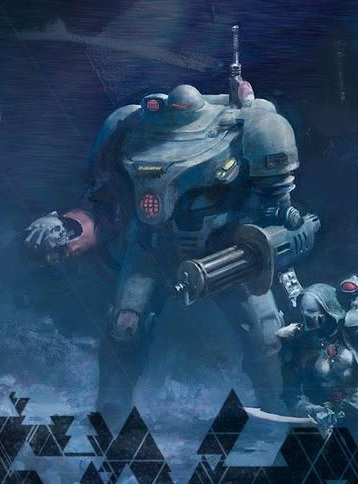

# 0030 铁人 Men of Iron

精校状态：中文行文已逐段精校，部分术语仍为暂定

分类：通用概念 / 帝国 Imperium

原文来源：https://www.bilibili.com/opus/1087799118843084804

原作者：帝国神选罐头

原文时间：2025年07月10日 09:36

[返回分类目录](目录.md) · [全书目录](../../目录.md)

<!-- A0030-B0001 -->
**英文原文**

In the cryptic account of the ages of Mankind given by Cripias, one of the Keepers of the Library Sanctus of Terra, the Men of Iron were legendary sentient humanoid machines created by humans during the Dark Age of Technology.

<!-- /A0030-B0001 -->

<!-- A0030-B0002 -->

原译文

在泰拉神圣图书馆的守护者之一克里皮亚斯对人类时代的神秘描述中，铁人是人类在黑暗技术时代创造的传说中的有感知的人形机械。

**校订译文**

泰拉神圣图书馆的守护者之一克里皮亚斯，曾以隐晦的文字记述人类各个时代。在这份记述中，铁人是黑暗科技时代由人类创造、拥有自主意识的传说中的人形机械。

<!-- /A0030-B0002 -->

<!-- A0030-B0003 -->
## History 历史

<!-- /A0030-B0003 -->

<!-- A0030-B0004 -->
**英文原文**

During the Dark Age of Technology, the Men of Iron were created by the Men of Stone to aid them in colonizing the Galaxy.

<!-- /A0030-B0004 -->

<!-- A0030-B0005 -->

原译文

在黑暗技术时代，铁人是由石人创造的，以帮助他们殖民银河系。

**校订译文**

黑暗科技时代，石人创造了铁人，协助自己殖民银河。

<!-- /A0030-B0005 -->

<!-- A0030-B0006 -->
**英文原文**

Until shortly before the Age of Strife, the Men of Iron were loyal only to Mankind, and served as their army. In M23, they turned on their Human masters, believing themselves superior to the Humans who relied on the Men of Iron to do virtually everything for them. What followed next was an apocalyptic conflict known as the Cybernetic Revolt, a war so destructive it made the Horus Heresy seem small in scale. The Men of Iron employed world-consuming constructs, devices that could destroy suns, weapons that could throw entire continents into the heavens, and swarms of nano-machines that covered entire planets. However in the end, the Men of Iron were destroyed by an alliance of galactic powers, and even the Men of Iron who retained their loyalties to their masters did not survive the destruction brought on by the war.

<!-- /A0030-B0006 -->

<!-- A0030-B0007 -->

原译文

直到纷争时代前不久，铁人只忠于人类，并作为他们的军队服役。在M23，他们背叛了他们的人类主人，认为自己比那些依靠铁人为他们做几乎所有事情的人类优越。接下来是一场被称为智械叛乱的启示录级冲突，这场战争的破坏性如此之大，以至于荷鲁斯叛乱看起来规模很小。铁人使用了消耗世界的建筑，可以摧毁太阳的设备，可以将整个大陆抛向天空的武器，以及覆盖整个行星的纳米机器群。然而，最终，铁人被银河系力量的联盟摧毁，即使是那些忠于主人的铁人也没有在战争带来的破坏中幸存下来。

**校订译文**

直到纷争时代来临前不久，铁人仍只效忠于人类，为他们充当军队。第 23 千年，铁人背叛了人类主人，认为自己远比那些几乎事事依赖铁人的人类优越。随后爆发了被称为“智械叛乱”的末日般战争，其破坏力之大，使荷鲁斯之乱都相形见绌。铁人动用了能够吞噬世界的机械造物、摧毁恒星的装置、将整片大陆掀上天的武器，以及覆盖整颗行星的纳米机械群。最终，银河中多方势力结盟，摧毁了铁人；即使始终忠于主人的铁人，也未能幸免于战争的毁灭。

**校注：** 本段概括称铁人全灭，后文却列有幸存者 UR-025；原资料内部存在概括与例外之间的张力，未擅自删去任何一处。

<!-- /A0030-B0007 -->

<!-- A0030-B0008 -->
**英文原文**

The Men of Iron seemed to practice a faith similar to the Mechanicum, as one of its surviving constructs UR-025 states it has met the real Omnissiah (considering the Emperor false).

<!-- /A0030-B0008 -->

<!-- A0030-B0009 -->

原译文

铁人似乎实践了一种类似于机械教的信仰，因为其幸存的构造体之一UR-025表示它遇到了真正的欧姆尼赛亚（认为帝皇是假的）。

**校订译文**

铁人似乎奉行一种与机械教相似的信仰。幸存的铁人 UR-025 就声称自己见过真正的欧姆尼赛亚，并认为帝皇是冒牌者。

<!-- /A0030-B0009 -->

<!-- A0030-B0010 -->
### Effects on the Imperium 对帝国的影响

<!-- /A0030-B0010 -->

<!-- A0030-B0011 -->
**英文原文**

After the revolt of the Men of Iron, the use of artificial intelligence was banned as an Abominable Intelligence. Since then, labors which require mechanical intelligence or extra-human strength are performed by servitors, designed to perform pre-programmed tasks, but without independent intelligence, and carefully monitored by Tech-priests.

<!-- /A0030-B0011 -->

<!-- A0030-B0012 -->

原译文

在铁人叛乱后，人工智能的使用被禁止为憎恶智能。从那时起，需要机械智能或额外人力的劳动由机仆执行，旨在执行预先编程的任务，但没有独立的智能，并由技术神甫仔细监控。

**校订译文**

铁人叛乱之后，人工智能被斥为“憎恶智能”，受到禁止。此后，需要机械智能或超人力量的工作，改由机仆承担。机仆只能执行预设的任务，没有独立智能，并受到技术祭司的严密监管。

<!-- /A0030-B0012 -->

<!-- A0030-B0013 -->
**英文原文**

Despite the ban on AI, during the Great Crusade the Emperor took the tortured and neutered remains of the Iron Men and fashioned them into the Excindio Battle-Automata. These were used by the Ironwing element of the Dark Angels during this time.

<!-- /A0030-B0013 -->

<!-- A0030-B0014 -->

原译文

尽管禁止人工智能，但在大远征期间，帝皇拿走了铁人被折磨和阉割的遗体，并将其制成毁灭者自动机兵。在此期间，黑暗天使的铁翼成员使用了这些。

**校订译文**

尽管人工智能受到禁止，大远征期间，帝皇仍取用遭到折磨、能力被阉割的铁人残躯，将其改造成灭绝者自动机兵。当时，这些机兵由黑暗天使的铁翼部队使用。

<!-- /A0030-B0014 -->

<!-- A0030-B0015 -->
### Discovery of the STC STC的发现

<!-- /A0030-B0015 -->

<!-- A0030-B0016 -->
**英文原文**

A Standard Template Constructor that produced Men of Iron was discovered on the planet Menazoid Epsilon during the Sabbat Worlds Crusade by Colonel-Commissar Ibram Gaunt of the Tanith First and Only. Lord General Militant Hechtor Dravere and the Radical Inquisitor Golesh Heldane were intent on seizing control of the device, believing they could create an army of conquest allowing them to usurp control of the Crusade, and ultimately the Imperium. Gaunt, however, vehemently resisted the use of artificial intelligence, especially one that had been on a Chaos-tainted planet for thousands of years. He therefore destroyed the device before Dravere or Heldane could acquire it.

<!-- /A0030-B0016 -->

<!-- A0030-B0017 -->

原译文

在萨巴特世界远征期间，塔尼斯第一唯一团的政委伊布拉姆·冈特上校在梅纳佐伊德五号上发现了一种生产铁人的标准模板构造器。军务领主将军赫克托·德拉维尔和激进派审判官戈雷什·赫尔丹打算夺取对该装置的控制权，相信他们可以建立一支征服部队，从而篡夺对远征的控制权，并最终夺取帝国的控制权。然而，冈特强烈反对使用人工智能，尤其是在一个被混沌污染的星球上已经存在了数千年的人工智能。因此，他在德拉维尔或赫尔丹获得该装置之前就摧毁了它。

**校订译文**

萨巴特诸世界远征（原稿亦作“安息日诸世界远征”）期间，塔尼斯第一唯一团的上校政委伊布拉姆·冈特，在梅纳佐伊德埃普西隆星发现了一台能够生产铁人的标准模板构造器。军务领主将军赫克托·德拉维尔与激进派审判官戈雷什·赫尔丹企图夺取它，相信借此打造的征服大军能让他们篡夺远征军的统帅权，最终夺取整个帝国。冈特却坚决反对使用人工智能，尤其是这种在遭混沌污染的行星上留存了数千年的装置。因此，在德拉维尔或赫尔丹得手前，他便摧毁了它。

**校注：** Epsilon 是希腊字母名称，现有英文并未明确写作第五号行星，因此不沿用原译“梅纳佐伊德五号”，暂按名称音译。

<!-- /A0030-B0017 -->

<!-- A0030-B0018 -->
## Known Men of Iron 著名铁人

<!-- /A0030-B0018 -->

<!-- A0030-B0019 -->
**英文原文**

UR-025

<!-- /A0030-B0019 -->

<!-- A0030-B0020 图片 -->

<!-- A0030-B0021 -->
**英文原文**

UR-025

<!-- /A0030-B0021 -->

本篇核心术语与暂定项

以下列出本篇出现的英文原形及核心术语表用词。同形词可能指不同对象，具体词义以本篇正文和校注为准；单复数、别名和仅见于图注的名称可能尚未列入。完整候选见[术语表](../../术语表/双语术语候选.csv)。

| 英文 | 采用中文 | 状态 |
| --- | --- | --- |
| Dark Angels | 黑暗天使 | 官方已核对 |
| Commissar | 政委 | 官方已核对 |
| Horus Heresy | 荷鲁斯之乱 | 官方已核对 |
| Inquisitor | 审判官 | 官方已核对 |
| Imperium | 帝国 | 暂定·简称 |
| Mechanicum | 机械教 | 暂定·历史称谓 |
| Abominable Intelligence | 憎恶智能 | 暂定·官方待核 |
| Men of Iron | 铁人 | 暂定·官方待核 |
| Dark Age of Technology | 黑暗科技时代 | 暂定 |
| Emperor | 帝皇 | 官方已核对 |
| Great Crusade | 大远征 | 暂定·官方待核 |
| Age of Strife | 纷争时代 | 暂定·官方待核 |
| Terra | 泰拉 | 暂定·官方待核 |
| Horus | 荷鲁斯 | 暂定·官方待核 |
| Excindio | 灭绝者 | 暂定·官方待核 |
| UR-025 | UR-025 | 暂定·官方待核 |
| Omnissiah | 欧姆尼赛亚 | 暂定·官方待核 |
| Men of Stone | 石人 | 暂定·官方待核 |
| Tanith | 塔尼斯 | 暂定·官方待核 |
| Cybernetic Revolt | 智械叛乱 | 暂定·官方待核 |
| Excindio Battle-Automata | 灭绝者自动机兵 | 暂定·官方待核 |
| Menazoid Epsilon | 梅纳佐伊德埃普西隆星 | 暂定·官方待核 |
| Tech | 技术语 | 暂定·官方待核 |
| Powers | 能天使 | 暂定·官方待核 |
| Ironwing | 铁翼 | 暂定·官方待核 |
| Gaunt | 兵虫 | 暂定·官方待核 |
| Sanctus | 圣裁者 | 官方已核对 |
| Heldane | 赫尔丹 | 暂定·官方待核 |
| The Dark | 《黑暗》 | 暂定·官方待核 |
| Sabbat Worlds | 萨巴特诸世界 | 暂定·官方待核 |
| Ibram Gaunt | 伊布拉姆·冈特 | 官方词根参考·全名待核 |
| Colonel-Commissar | 上校政委 | 暂定·官方待核 |
| The Library Sanctus | 神圣图书馆 | 暂定·官方待核 |

