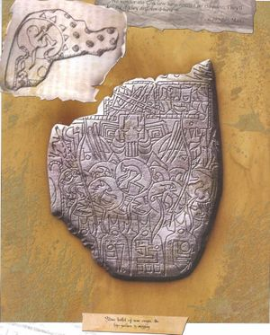

# 0031 星辰之子 Star Child

精校状态：中文行文已逐段精校，部分术语仍为暂定

分类：通用概念 / 帝国 Imperium

原文来源：https://www.bilibili.com/opus/1078628036520181780

原作者：帝国神选罐头

原文时间：2025年06月15日 16:27

[返回分类目录](目录.md) · [全书目录](../../目录.md)

<!-- A0031-B0001 -->
**英文原文**

The Star Child is a mysterious entity said to represent the soul of the Emperor of Mankind. It is also known as the Numen and the Chaos Child.

<!-- /A0031-B0001 -->

<!-- A0031-B0002 -->

原译文

星辰之子是一个神秘的实体，据说代表了人类帝皇的灵魂。它也被称为守护神和混沌之子。

**校订译文**

星辰之子是一个神秘的实体，据说代表了人类帝皇的灵魂。它也被称为守护神和混沌之子。

<!-- /A0031-B0002 -->

<!-- A0031-B0003 图片 -->

<!-- A0031-B0004 -->

原译文

Drawing of unborn child within prophetic tablet 在预言板内绘制的未诞之子

**校订译文**

Drawing of unborn child within prophetic tablet 在预言板内绘制的未诞之子

<!-- /A0031-B0004 -->

<!-- A0031-B0005 -->
## History 历史

<!-- /A0031-B0005 -->

<!-- A0031-B0006 -->
**英文原文**

Over the millennia since the Emperor's interment upon the Golden Throne, the link between his body and soul has become increasingly tenuous. As the Emperor's spirit drifts through the warp, much of its energies have been dissolved, except for a tiny core that remained whole. So long as this portion of the Emperor's soul survived, there remained hope for humanity, for just as the New Man was born of the collective souls of the Shamans, so too may the Emperor's soul be reborn one day. This potential was merely a child awaiting birth, the Star Child. The Star Child also represents the human portion of the warp.

<!-- /A0031-B0006 -->

<!-- A0031-B0007 -->

原译文

自帝皇安葬在黄金王座上以来的数千年里，他的身体和灵魂之间的联系变得越来越脆弱。当帝皇的灵魂在亚空间中飘荡时，除了一个保持完整的小核心外，它的大部分能量都被溶解了。只要帝皇灵魂的这一部分幸存下来，人类就有希望，因为正如新人类是萨满集体灵魂的产物，帝皇的灵魂也有可能在某一天重生。这种潜在的只是一个等待出生的孩子，星辰之子。星辰之子也代表亚空间中的人类部分。

**校订译文**

帝皇被安置于黄金王座后的数千年间，肉体与灵魂的联系日益微弱。他的精神飘荡于亚空间，大部分能量逐渐消散，只有一个微小的核心仍保持完整。只要这一部分灵魂尚存，人类便仍有希望：正如“新人类”曾由萨满汇聚的灵魂诞生，帝皇的灵魂也可能在未来某日重生。这种尚未实现的可能性，宛如一个等待降生的孩子，即“星辰之子”。它也代表了亚空间中属于人类的那一部分。

**校注：** 本篇并列旧“星辰之子／导师”设定与后来的灵能觉醒叙事，均保留各段来源口径；不将“帝皇全部灵魂”“被剥离的怜悯”和第33篇灵魂碎片未经论证地视为完全等同。

<!-- /A0031-B0007 -->

<!-- A0031-B0008 -->
**英文原文**

The Star Child is also suggested (by a fragment of the Emperor's mind) to be the compassion which the Emperor cast from himself in order to destroy his most beloved Primarch-son, Horus. Inquisitor Jaq Draco believed that the Shining Path upon which the Numen may be born originates within a special node of the Webway known as Uigebealach, where time flows backwards. He believed that by visiting this special crossroads and achieving a triumph by resurrecting a lost soul, he might accelerate the birth of the Numen. However, upon his death, he had instead achieved apotheosis, becoming a tiny part of the Numen as a diffuse hydrogen atom in the void that will one day condense into a star.

<!-- /A0031-B0008 -->

<!-- A0031-B0009 -->

原译文

星辰之子也被认为是帝皇为了摧毁他最心爱的长子荷鲁斯而从自己身上抛弃的同情（来自帝皇的一部分思想）。审判官贾克·德拉科认为，守护神可能出生的光辉之路起源于网道的一个特殊节点，即威格比拉赫，在那里时间倒流。他相信，通过参观这个特殊的节点，并通过复活一个迷失的灵魂来取得成功，他可能会加速守护神的诞生。然而，在他牺牲后，他反而实现了神化，成为守护神的一小部分，成为虚空中扩散的氢原子，有一天会凝结成星。

**校订译文**

帝皇的一块心智碎片还曾暗示，星辰之子就是他为了杀死最爱的原体之子荷鲁斯，而从自身剥离的怜悯。审判官贾克·德拉科相信，通向守护神诞生的“光辉之路”，起于网道中一个名为威格比拉赫的特殊节点，那里时间逆流。他认为，若前往这一交汇点，成功复活一个逝去的灵魂，或许便能加速守护神的诞生。然而，他死后实际经历的是神化：他成了守护神极微小的一部分，如同散布在虚空中的一枚氢原子，终有一天会与其他部分聚成恒星。

<!-- /A0031-B0009 -->

<!-- A0031-B0010 -->
## Connection with the Sensei 与导师的联系

<!-- /A0031-B0010 -->

<!-- A0031-B0011 -->
**英文原文**

The Sensei are the immortal, true sons of the Emperor, sired during his early life amongst humanity. Whereas the Chaos Gods possess their own champions, the Sensei act as the champions of the Star Child. Likewise, just as a Champion of Chaos may be blessed by the gifts of one or more Chaos Gods, the Star Child gifts the Sensei with the Mark of the Star Child, which allows them to draw upon the energy of the Star Child.

<!-- /A0031-B0011 -->

<!-- A0031-B0012 -->

原译文

导师是帝皇的不朽、真正的儿子，在他早年的人类生活中繁衍生息。混沌诸神拥有自己的冠军，而导师则扮演星辰之子的冠军。同样，正如混沌冠军可能会受到一个或多个混沌之神的祝福一样，星辰之子也会给导师带来星辰之子的标记，这使他们能够利用星辰之子的能量。

**校订译文**

导师是帝皇早年行走人世时亲自生下的子嗣，拥有不朽的生命。正如混沌诸神各有自己的勇士，导师就是星辰之子的勇士。混沌勇士可能得到一位或多位混沌神的赐福，星辰之子也会赐予导师“星辰之子印记”，使其能够汲取自己的力量。

<!-- /A0031-B0012 -->

<!-- A0031-B0013 -->
**英文原文**

The powers can range from extra protection, daemon-slaying abilities, sword mastery, and marksmanship amongst other gifts. These gifts may likewise permeate other members of a Sensei's adventurer band. When the Star Child recognises the deeds of a Sensei, they will be drawn into the warp to commune with the Star Child, where he may achieve apotheosis and become a Sensei Master, which is analogous to a Daemon Prince.

<!-- /A0031-B0013 -->

<!-- A0031-B0014 -->

原译文

这些能力包括额外的保护、杀死恶魔的能力、精通剑和枪法等。这些礼物也可能渗透到导师的冒险团的其他成员中。当星辰之子认识到一个导师的行为时，他们将被吸引到亚空间中与星辰之子交流，在那里他可能会达到神化并成为导师大师，这类似于恶魔王子。

**校订译文**

这些赐福包括额外防护、屠魔能力、精湛剑术与枪法等，也可能惠及导师冒险团中的其他成员。当导师的功绩得到星辰之子的认可，他们便会被引入亚空间，与星辰之子沟通，并可能在那里完成神化，成为类似恶魔亲王的“导师大师”。

**校注：**  译名统一：原稿“恶魔王子”改用已核官译或主审统一译名；本注保留旧称供追溯。

<!-- /A0031-B0014 -->

<!-- A0031-B0015 -->
**英文原文**

In 997.M41, Inquisitor Fortez reported that he and his colleagues Alexio and Credo had discovered a cult known as the Cult of the Star Child, led by self-proclaimed Sensei claiming to be the Emperor's sons. However, Inquisitor Fortez rejected the notion that they are the Emperor's sons on the basis of their affiliation with abhumans and Eldar. The Inquisitor instead suspected it may be a Tzeentchian cult, with the Architect of Fate masquerading as the Star Child. The cult and all but four Sensei were killed.

<!-- /A0031-B0015 -->

<!-- A0031-B0016 -->

原译文

997.M41，审判官福尔特兹报告说，他和他的同事阿莱克西奥和克雷多发现了一个名为星辰之子教派的邪教，由自称是帝皇子嗣的导师领导。然而，审判官福尔特兹基于他们与亚人和灵族的关系，拒绝了他们是帝皇子嗣的说法。审判官怀疑这可能是一个奸奇教派，命运设计师伪装成星辰之子。教派组织和除四名导师以外的所有人都被杀了。

**校订译文**

997.M41，审判官福尔特兹报告称，他与同僚阿莱克西奥、克雷多发现了“星辰之子教派”，其领袖自称导师，并宣称是帝皇的子嗣。福尔特兹因为他们与亚人、灵族往来，拒绝相信这一身份。他怀疑这其实是奸奇教派，由命运设计师假扮星辰之子。教派遭到剿灭，导师中仅有四人幸免。

<!-- /A0031-B0016 -->

<!-- A0031-B0017 -->
## Plans of the Illuminati 光照会的计划

<!-- /A0031-B0017 -->

<!-- A0031-B0018 -->
**英文原文**

The Illuminati await the birth of the Star Child and the second coming of the New Man in the form of the Sensei-Emperor. The Illuminati gather the Sensei, to establish a 'Long Watch of Sensei Knights' to await the final battle against the forces of Chaos. However, this is merely a trick, as the Illuminati instead seeks to sacrifice the Sensei to the Emperor at the moment of his death, just as countless psykers are sacrificed to the Emperor. When this occurs, the Illuminati believe the Sensei-Emperor, the second coming of the New Man will arise.

<!-- /A0031-B0018 -->

<!-- A0031-B0019 -->

原译文

光照会期待着星辰之子的诞生和新人类以导师-帝皇的形式再次降临。光照会召集导师，建立“万古守望导师骑士”，等待与混沌势力的最后一战。然而，这只是一个骗局，因为光照会反而试图在帝皇死去的那一刻将导师献祭给帝皇，就像无数灵能者被献祭给帝皇一样。当这种情况发生时，光照会相信导师-帝皇，新人类的第二次降临将会出现。

**校订译文**

光照会等待星辰之子诞生，期盼“新人类”以“导师—帝皇”的形态再临。他们召集导师，组织“导师骑士的万古守望”，声称要等待与混沌的最后决战。但这只是幌子：光照会真正的计划，是在帝皇死亡的瞬间将导师献祭给他，如同无数灵能者被献祭那样。他们相信，如此便能促成导师—帝皇的诞生，使新人类再临。

<!-- /A0031-B0019 -->

<!-- A0031-B0020 -->
**英文原文**

One legend states that once the Emperor dies, his soul will be freed to go into the warp. Here it will neutralise the Chaos Gods, causing the physical universe to fight one last bloody conflict against itself for the control of the Galaxy.

<!-- /A0031-B0020 -->

<!-- A0031-B0021 -->

原译文

有一个传说说，一旦帝皇死去，他的灵魂将被释放进入亚空间。在这里，它将抵消混沌之神，使物质宇宙为控制银河系而与自己进行最后一场血腥的冲突。

**校订译文**

另有传说称，帝皇一旦死去，灵魂便会获释，进入亚空间并制衡混沌诸神。届时，物质宇宙中的各方将为争夺银河的统治权，展开最后一场血腥大战。

<!-- /A0031-B0021 -->

<!-- A0031-B0022 -->
## Psychic Awakening 灵能觉醒

<!-- /A0031-B0022 -->

<!-- A0031-B0023 -->
**英文原文**

Due to the Psychic Awakening, the legend of the Star Child seems to have been rekindled. A few years into the Indomitus Crusade, visions of a golden infant interspersed with flashes of a radiant being rising from a throne of light began to be reported across Astropathic relay networks, beginning in Segmentum Solar. Over time the images became clearer, and many began to interpret this with the legend of the Star Child. These visions caused great upheaval in the Imperium, leading many to investigate the truth of the matter. Others, including servants of Chaos such as Kor Phaeron and Tenebrus, seek to stop the awakening of the Star Child.

<!-- /A0031-B0023 -->

<!-- A0031-B0024 -->

原译文

由于灵能觉醒，星辰之子的传说似乎被重新点燃了。在不屈远征的几年后，从太阳星域开始，星语转发网络上开始报道了一个金色婴儿的幻象，其中穿插着从光之宝座升起的光芒。随着时间的推移，图像变得更加清晰，许多人开始用星辰之子的传说来解释这一点。这些幻象在帝国中引起了巨大的动荡，导致许多人调查了事情的真相。其他人，包括混沌之仆，如科尔·法伦和特涅布鲁斯，试图阻止星辰之子的觉醒。

**校订译文**

灵能觉醒似乎使星辰之子的传说重新流传。不屈远征开始数年后，星语中继网络陆续传来幻象报告，最早出现在太阳星域：金色婴儿的影像中，间或闪现一个光辉存在从光之王座上起身的画面。随着时间推移，影像愈发清晰，许多人开始用星辰之子的传说加以解释。这些幻象引发帝国动荡，许多人着手调查真相；另一些人则试图阻止星辰之子苏醒，其中包括科尔·法伦、特涅布鲁斯等混沌仆从。

<!-- /A0031-B0024 -->

<!-- A0031-B0025 -->
**英文原文**

A Black Templars Initiate also received a vision while battling at the Atillan Gate. It was of a burning Throne, wreathed in chains. Eight terrible shadows, their long skeletal hands reaching out to crush the holy light of the God-Emperor. Golden eyes opening in the face of a child, filled with ancient knowledge.

<!-- /A0031-B0025 -->

<!-- A0031-B0026 -->

原译文

一名黑色圣堂信徒在阿提兰之门战斗时也收到了幻象。那是一座燃烧的宝座，被锁链环绕。八个可怕的阴影，他们长长的骨瘦如柴的手伸出来粉碎了神皇的圣光。金色的眼睛在一个孩子的脸上睁开，充满了古老的知识。

**校订译文**

一名黑色圣堂正式战士在阿提兰之门作战时，也收到了幻象：燃烧的王座缠满锁链，八道可怖阴影伸出细长枯瘦的手，试图捏碎神皇的圣光。一个孩子睁开金色双眼，眼中蕴藏着古老的知识。

<!-- /A0031-B0026 -->

本篇核心术语与暂定项

以下列出本篇出现的英文原形及核心术语表用词。同形词可能指不同对象，具体词义以本篇正文和校注为准；单复数、别名和仅见于图注的名称可能尚未列入。完整候选见[术语表](../../术语表/双语术语候选.csv)。

| 英文 | 采用中文 | 状态 |
| --- | --- | --- |
| Black Templars | 黑色圣堂 | 官方已核对 |
| Eldar | 灵族 | 暂定·语境区分 |
| Warp | 亚空间 | 官方已核对 |
| Inquisitor | 审判官 | 官方已核对 |
| Imperium | 帝国 | 暂定·简称 |
| Webway | 网道 | 暂定 |
| Indomitus | 不屈学派 | 暂定·学派语境 |
| Emperor of Mankind | 人类帝皇 | 暂定 |
| Emperor | 帝皇 | 官方已核对 |
| Primarch | 原体 | 官方已核对 |
| Daemon Prince | 恶魔亲王 | 官方已核对 |
| Horus | 荷鲁斯 | 暂定·官方待核 |
| Indomitus Crusade | 不屈远征 | 暂定·官方待核 |
| Golden Throne | 黄金王座 | 暂定·官方待核 |
| Segmentum Solar | 太阳星域 | 暂定·官方待核 |
| Segmentum | 星域 | 暂定·官方待核 |
| Sensei | 导师 | 暂定·官方待核 |
| Star Child | 星辰之子 | 暂定·官方待核 |
| Illuminati | 光照会 | 暂定·官方待核 |
| Mark of the Star Child | 星辰之子印记 | 暂定·官方待核 |
| Apotheosis | 神化 | 暂定·官方待核 |
| Sensei Master | 导师大师 | 暂定·官方待核 |
| Fortez | 福尔特兹 | 暂定·官方待核 |
| Jaq Draco | 贾克·德拉科 | 暂定·官方待核 |
| Long Watch | 万古守望 | 暂定·官方待核 |
| Sensei Knights | 导师骑士 | 暂定·官方待核 |
| New Man | 新人类 | 暂定·官方待核 |
| Sensei-Emperor | 导师—帝皇 | 暂定·官方待核 |
| Numen | 守护神 | 暂定·官方待核 |
| Chaos Child | 混沌之子 | 暂定·官方待核 |
| Uigebealach | 威格比拉赫 | 暂定·官方待核 |
| Shining Path | 光辉之路 | 暂定·官方待核 |
| Master | 导师（审判庭职衔）／舰务官（舰员职务） | 语境定译·官方待核 |
| Ancient | 旗手 | 官方已核对 |
| Astropathic Relay | 星语中继站 | 暂定·官方待核 |
| True Sons | 真子 | 暂定·官方待核 |
| Kor Phaeron | 科尔·法伦 | 暂定·官方待核 |
| Champion | 冠军 | 暂定·官方待核 |
| Reborn | 复生者（战团）／重生者（死神军自称） | 语境定译·官方待核 |
| Powers | 能天使 | 暂定·官方待核 |
| Initiate | 正式成员 | 暂定·官方待核 |
| Phaeron | 法皇 | 暂定·官方待核 |
| Tenebrus | 特内布鲁斯 | 暂定·官方待核 |

