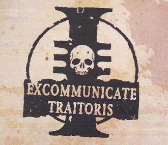

# 0037 异端 Heresy

精校状态：中文行文已逐段精校，部分术语仍为暂定

分类：通用概念 / 帝国 Imperium

原文来源：https://www.bilibili.com/opus/1131952499339558918

原作者：帝国神选罐头

原文时间：2025年11月06日 09:13

[返回分类目录](目录.md) · [全书目录](../../目录.md)

<!-- A0037-B0001 -->
**英文原文**

Within the Imperium of Man, Heresy is any action or opinion which is seen as contrary to the interests of the Imperial regime or its teachings. Due to the theocratic nature of the Imperium Heresy is often a political charge alongside a religious one. In practice, all enemies of the Imperium are invariably labeled Heretics. In the Imperium, the most common sentence for heresy is death.

<!-- /A0037-B0001 -->

<!-- A0037-B0002 -->

原译文

在人类帝国内部，异端是指任何被视为违背帝国政权利益或其教义的行为或观点。由于帝国的神权性质，异端通常是一种政治指控，与宗教指控并存。在实际中，帝国的所有敌人都无一例外地被贴上了异端的标签。在帝国，对异端最常见的判决是死亡。

**校订译文**

在人类帝国内部，异端是指任何被视为违背帝国政权利益或其教义的行为或观点。由于帝国的神权性质，异端通常是一种政治指控，与宗教指控并存。在实际中，帝国的所有敌人都无一例外地被贴上了异端的标签。在帝国，对异端最常见的判决是死亡。

<!-- /A0037-B0002 -->

<!-- A0037-B0003 图片 -->

<!-- A0037-B0004 -->

原译文

The stamp of Excommunicate Traitoris, the ultimate condemnation of Heresy “绝罚叛徒”的印记，对异端的最终谴责

**校订译文**

The stamp of Excommunicate Traitoris, the ultimate condemnation of Heresy “绝罚叛徒”的印记，对异端的最终谴责

<!-- /A0037-B0004 -->

<!-- A0037-B0005 -->
## Overview 概述

<!-- /A0037-B0005 -->

<!-- A0037-B0006 -->
**英文原文**

Heresy within the Imperium may take many forms. These include deviations from the established Imperial Cult, to denying the rights and rule of the Adeptus Terra, to collaboration or association with Xenos and Mutants, to open dissent or rebellion. The most serious acts of Heresy are reserved for those who associate with the Dark Gods of Chaos. Formal declarations of Heresy or of Heretics can come from a variety of sources, but the most common is that of the Ecclesiarchy. Nonetheless, often the accusation of Heresy in the Imperium used as a weapon by those wishing to gain power over others. Moreover, as the Imperium is a vast realm with countless different cultures and traditions, what is considered Heretical to one world may be perfectly acceptable to another. This makes the persecution of Heresy a delicate affair.

<!-- /A0037-B0006 -->

<!-- A0037-B0007 -->

原译文

帝国内部的异端可能有多种形式。这些行为包括偏离已建立的帝国教派，否认土地的权利和统治，与异型和变种人合作或结盟，公开异议或叛乱。最严重的异端行为是留给那些与混沌黑暗诸神有联系的人的。异端或异教徒的正式声明可以来自各种来源，但最常见的是国教的声明。尽管如此，帝国中异端的指控经常被那些希望获得权力的人用作武器。此外，由于帝国是一个拥有无数不同文化和传统的广阔领域，对一个世界来说被视为异端的东西可能对另一个世界完全可以接受。这使得对异端的迫害成为一件微妙的事情。

**校订译文**

帝国认定的异端有多种形式：偏离既定帝皇信仰、否认中央政务部的权威与统治、与异形或变种人合作往来，以及公开反对统治或发动叛乱。与混沌黑暗诸神勾结，被视为最严重的异端行为。多种机构都能正式宣布某种行为或某人为异端，其中最常见的是国教会。不过，想要凌驾他人之上的人，也常把异端指控当作争权工具。此外，帝国幅员辽阔，文化和传统不计其数，一个世界视为异端的事情，在另一个世界可能完全可以接受。因此，裁定并追究异端是件复杂而敏感的事。

<!-- /A0037-B0007 -->

<!-- A0037-B0008 -->
### Types of Heresy 异端类型

<!-- /A0037-B0008 -->

<!-- A0037-B0009 -->
### Rebellion 叛乱

<!-- /A0037-B0009 -->

<!-- A0037-B0010 -->
**英文原文**

The act of simply defying the Imperium or its Adepta is often decried as Heresy. Rebellion in the Imperium can take many forms, from a desire to free oneself from the Imperial yoke to conversion to Chaos. While often all types of rebels are branded heretics, wiser and more experienced Inquisitors are able to discern legitimate greivances from malicious corruption and avoid unnecessary purges.

<!-- /A0037-B0010 -->

<!-- A0037-B0011 -->

原译文

简单地反抗帝国或其修会的行为经常被谴责为异端。帝国的叛乱可以采取多种形式，从渴望摆脱帝国的枷锁到皈依混沌。虽然通常所有类型的叛乱分子都被贴上异端的标签，但更明智、更有经验的审判官能够从恶意腐化中辨别出合法的罪行，避免不必要的清洗。

**校订译文**

仅仅违抗帝国或其所属机构，就可能被斥为异端。帝国内的叛乱动机各异，既有摆脱帝国枷锁的愿望，也有皈依混沌。叛军虽常被一概称作异端，但更明智、经验更丰富的审判官能够区分合理的不满与恶意的腐化，从而避免不必要的清洗。

<!-- /A0037-B0011 -->

<!-- A0037-B0012 -->
### Bodily Heresy 身体异端

<!-- /A0037-B0012 -->

<!-- A0037-B0013 -->
**英文原文**

The Ecclesiarchy condemns non-sanctioned forms of mutation to be acts of Heresy. Mutant represents deviation from the physical norm and a potential taint of Chaos, and mutants are often viciously persecuted on Imperial worlds. However more experienced Inquisitors will often ignore simple mutants, seeing their extermination as a waste of time and resources. Instead, they focus their attention on truly threatening mutant bands that may associate with the likes of Chaos Cults or Genestealer Cults.

<!-- /A0037-B0013 -->

<!-- A0037-B0014 -->

原译文

国教谴责未经批准的突变形式是异端行为。变种人代表了对物理规范的偏离和混沌的潜在污点，变种人在帝国世界经常受到恶毒的迫害。然而，更有经验的审判官往往会忽视简单的变种人，认为他们的灭绝是浪费时间和资源。相反，他们将注意力集中在真正具有威胁性的变种人群体上，这些群体带可能与混沌教派或基因窃取者教派等组织有关。

**校订译文**

国教会将未经认可的变异视为异端。变种人偏离了正常的人类形态，也可能带有混沌污染，因此常在帝国各世界遭到残酷迫害。不过，经验丰富的审判官往往不理会普通变种人，认为将其尽数消灭只会浪费时间与资源。他们更关注真正构成威胁的变种人团伙，例如与混沌教派或基因窃取者教派有联系的组织。

<!-- /A0037-B0014 -->

<!-- A0037-B0015 -->
### Witchcraft 巫术

<!-- /A0037-B0015 -->

<!-- A0037-B0016 -->
**英文原文**

The "Witch" is a superstitious term often labeled against unsanctioned Psykers that may be discovered within Imperial society. Imperial citizenry is routinely lectured on the threat of the Psyker and the need to report their presence to Imperial authorities. The Witch is seen as a threat far greater than any mutant or common heretic, embodying a constant threat to the souls and lives of all around them. Left unchecked, a Psyker could potentially devastate an entire world. Imperial Psykers are thus heavily controlled and usually collected by the League of Blackships. Those Rogue Psykers that may exist are the frequent target of the Ordo Hereticus.

<!-- /A0037-B0016 -->

<!-- A0037-B0017 -->

原译文

“女巫”是一个迷信术语，通常用来指代帝国社会中可能发现的未经批准的灵能者。帝国公民经常接受关于灵能者威胁的讲座，并需要向帝国当局报告他们的存在。女巫被视为比任何变种人或普通异端更大的威胁，体现了对周围所有人的灵魂和生命的持续威胁。如果不加以控制，灵能者可能会摧毁整个世界。因此，帝国灵能者受到严格控制，通常由黑船联盟收集。那些可能存在的非法灵能者是讨逆修会的频繁目标。

**校订译文**

“巫师”是一种带有迷信色彩的称呼，常被用来指帝国社会中未经认可的灵能者。帝国不断向公民宣讲灵能者的危险，要求发现后立即上报。当局认为，这类巫师比一般变种人或异端危险得多，时刻威胁周围人的灵魂与生命。一个失控的灵能者甚至可能毁掉整个世界。因此，帝国对灵能者实施严密管控，通常由黑船联盟搜捕收容；逃离监管的灵能者则是异端审判庭经常追猎的目标。

<!-- /A0037-B0017 -->

<!-- A0037-B0018 -->
### Xenophilic Heresy 亲外异端

<!-- /A0037-B0018 -->

<!-- A0037-B0019 -->
**英文原文**

Xenophilia, or association with Xenos, is strictly forbidden by the common citizens of the Imperium and is seen as a severe act of Heresy. The Imperial Creed has declared all aliens as filthy and debased, worthy only of extermination. Collaboration with Xenos will often bring swift death to all involved. Nonetheless, many worlds on the frontiers of the Imperium often have contacts with Xenos and in some cases share their worlds with such beings. Moreover, Rogue Traders make frequent contacts with Xenos and species of the Kroot have even served as Imperial Mercenaries. Such activity is frowned upon by the Ecclesiarchy, but can be tolerated depending on the context.

<!-- /A0037-B0019 -->

<!-- A0037-B0020 -->

原译文

亲外主义或与异型的联系是帝国普通公民严格禁止的，被视为严重的异端行为。帝国信条宣布所有异型都是肮脏和卑鄙的，只值得灭绝。与异型的合作往往会使所有参与者迅速死亡。尽管如此，帝国边界上的许多世界经常与异型有联系，并在某些情况下与这些生物分享他们的世界。此外，行商浪人经常与异型接触，克鲁特甚至曾担任帝国雇佣军。国教不赞成这种行动，但根据具体情况可以容忍。

**校订译文**

帝国严禁普通公民亲近异形或与之往来，并将其视为严重异端。帝国信条宣称，一切异形都肮脏、卑劣，唯一归宿就是灭绝；与异形合作，往往会令所有参与者迅速招致杀身之祸。不过，帝国边疆的许多世界常与异形接触，有时还与它们共居一颗星球。行商浪人与异形往来也十分频繁，克鲁特人甚至曾受雇为帝国作战。国教会虽不赞同，仍可能视具体情况予以容忍。

<!-- /A0037-B0020 -->

<!-- A0037-B0021 -->
### Religious Heresy 宗教异端

<!-- /A0037-B0021 -->

<!-- A0037-B0022 -->
**英文原文**

Often simply dubbed "true Heresy", this is perhaps the most serious of all charges within the Imperium. Religious Heresy involves denying the divinity of the Imperium and worst of all association with the Ruinious Powers of Chaos. Religious heretics will often form Cults to coordinate their activities and spread their beliefs. These Cults represent an enormous threat to stability of Imperial worlds and can be the heralds of Chaos Space Marine or Xenos invasion.

<!-- /A0037-B0022 -->

<!-- A0037-B0023 -->

原译文

通常被简单地称为“真正的异端”，这可能是帝国内部所有指控中最严重的。宗教异端包括否认帝国的神圣性，最糟糕的是与混沌毁灭力量的联系。宗教异端经常组织教派来协调他们的行动并传播他们的信仰。这些教派对帝国世界的稳定构成了巨大威胁，可能是混沌星际战士或异型入侵的预兆。

**校订译文**

宗教异端常被直接称为“真正的异端”，或许是帝国最严重的一类罪名。它包括否认帝国的神圣性，最恶劣的则是与混沌毁灭诸神勾结。宗教异端经常结成教派，协调行动、传播信仰。这些组织严重威胁帝国世界的稳定，也可能成为混沌星际战士或异形入侵的先兆。

**校注：** 英文原文写 divinity of the Imperium（帝国的神圣性），未写 Emperor；现译忠实保留，不擅自将其改成“帝皇的神性”。

<!-- /A0037-B0023 -->

<!-- A0037-B0024 -->
**英文原文**

The declaration of religious Heresy is a delicate matter and often left to Cardinals and Missionaries. Large-scale deviation from the Imperial Cult can be tolerated, most notably by the Cult Mechanicus of the Mechanicum and the Chapter Cults of the Adeptus Astartes.

<!-- /A0037-B0024 -->

<!-- A0037-B0025 -->

原译文

宣布宗教异端是一个微妙的问题，往往留给红衣主教和传教士。与帝国文化的大规模偏差是可以容忍的，最明显的是机械神教的机械教派和阿斯塔特修会的战团教派。

**校订译文**

认定宗教异端十分敏感，通常交由红衣主教与传教士处理。有些信仰即使与帝皇信仰相去甚远，也能得到容忍，最显著的例子便是机械教奉行的机械教派信仰，以及阿斯塔特修会各战团的宗教传统。

<!-- /A0037-B0025 -->

<!-- A0037-B0026 -->
### Techno-Heresy 技术异端

<!-- /A0037-B0026 -->

<!-- A0037-B0027 -->
**英文原文**

Techno-Heresy is a charge leveled by the Adeptus Mechanicus upon those which may deviate from its technological and scientific teachings. This is seen as a betrayal of the Cult Mechanicus. Techno-Heresy comes in many forms, such weakening the Adeptus' stranglehold on the knowledge of the Imperium's technology, or embracing individual experimentation and innovation.

<!-- /A0037-B0027 -->

<!-- A0037-B0028 -->

原译文

技术异端是机械神教对那些可能偏离其技术和科学教义的人提出的指控。这被视为对机械教派的背叛。技术异端有很多形式，比如削弱了神教对帝国技术知识的控制，或者拥抱个人实验和创新。

**校订译文**

技术异端是机械修会用来指控违背其科技教义者的罪名，被视为对机械教派信仰的背叛。其形式众多，例如削弱修会对帝国技术知识的垄断，或擅自开展实验与创新。

<!-- /A0037-B0028 -->

<!-- A0037-B0029 -->
## Combating Heresy 打击异端

<!-- /A0037-B0029 -->

<!-- A0037-B0030 -->
**英文原文**

The Imperial regime has multiple bodies dedicated to quashing Heresy. These include the Adeptus Arbites, which enforce the Lex Imperialis across the worlds of the Imperium. The Adeptus Ministorum devotes a large part of its efforts in determining what qualifies as Heresy and condemning heretics wherever they may be discovered. During a War of Faith, Imperial armies will often exterminate massive numbers of Heretics. Most zealous in these purges are the Sisters of Battle, the militant arm of the Ecclesiarchy.

<!-- /A0037-B0030 -->

<!-- A0037-B0031 -->

原译文

帝国政权有多个机构致力于镇压异端。其中包括在帝国世界各地执行帝国律法的法务部。国教教会投入了大量精力来确定何为异端，并谴责无论在何处发现的异端。在信仰战争期间，帝国军队经常会消灭大量异端。在这些净化中最狂热的是战斗修女，这是国教的激进派分支。

**校订译文**

帝国有多个机构专责镇压异端。法务部负责在帝国各世界执行帝国律法；国教会则投入大量精力界定何为异端，并谴责发现的异端分子。信仰战争期间，帝国军队往往大规模屠灭异端，其中最为狂热的，是国教会的武装力量——战斗修女。

<!-- /A0037-B0031 -->

<!-- A0037-B0032 -->
**英文原文**

But the most sinister of all is the Inquisition and more specifically the Ordo Hereticus, which has made it its mission to eliminate the heretic. The Ordo Xenos is often tasked with combating xenophilic acts of Heresy while the Ordo Malleus will sometimes exterminate the most dangerous of all Chaos Cults. In some cases, the dreaded Officio Assassinorum or even the Adeptus Custodes have brought their wrath down upon suspected heretics.

<!-- /A0037-B0032 -->

<!-- A0037-B0033 -->

原译文

但最险恶的是审判庭，更具体地说是讨逆修会，它的使命是消灭异端。攘外修会经常负责打击异端的亲外行为，而圣锤修会有时会消灭所有混沌教派中最危险的。在某些情况下，可怕的刺客庭，甚至是禁军修会，已经把他们的愤怒降到了怀疑的异端身上。

**校订译文**

其中最令人畏惧的，仍是审判庭，尤其是以铲除异端为使命的异端审判庭。异形审判庭常负责打击亲近异形的异端行为，恶魔审判庭则会剿灭最危险的混沌教派。有时，可怕的刺客庭乃至帝皇禁军，也会出手惩处涉嫌异端之人。

<!-- /A0037-B0033 -->

<!-- A0037-B0034 -->
**英文原文**

For combating Techno-Heresy, the Adeptus Mechanicus maintains its own secret police force known as the Prefecture Magisterium. This agency operates hunter-killer clades with brutally deal with suspected Hereteks.

<!-- /A0037-B0034 -->

<!-- A0037-B0035 -->

原译文

为了打击技术异端，机械神教拥有自己的秘密警察部队，称为辖区裁判所。该机构经营着猎杀分支，残酷地对待可疑的异端。

**校订译文**

为了打击技术异端，机械修会设有名为“辖区裁判所”的秘密警察机构。该机构指挥猎杀分队，以残酷手段处置涉嫌技术异端的人。

<!-- /A0037-B0035 -->

本篇核心术语与暂定项

以下列出本篇出现的英文原形及核心术语表用词。同形词可能指不同对象，具体词义以本篇正文和校注为准；单复数、别名和仅见于图注的名称可能尚未列入。完整候选见[术语表](../../术语表/双语术语候选.csv)。

| 英文 | 采用中文 | 状态 |
| --- | --- | --- |
| Adeptus Astartes | 阿斯塔特修会 | 官方已核对 |
| Adeptus Custodes | 帝皇禁军 | 官方已核对 |
| Adeptus Mechanicus | 机械修会 | 官方已核对 |
| Genestealer Cults | 基因窃取者教派 | 官方已核对 |
| Psyker | 灵能者 | 官方已核对 |
| Inquisition | 审判庭 | 暂定 |
| Imperium of Man | 人类帝国 | 官方已核对 |
| Imperium | 帝国 | 暂定·简称 |
| Mechanicum | 机械教 | 暂定·历史称谓 |
| Cult Mechanicus | 机械教派 | 暂定·概念区分 |
| Kroot | 克鲁特 | 暂定 |
| Ordo Malleus | 恶魔审判庭 | 用户指定 |
| Adeptus Terra | 中央政务部 | 暂定 |
| Adeptus Ministorum | 国教会 | 暂定 |
| Ecclesiarchy | 国教会 | 暂定 |
| Adeptus Arbites | 法务部 | 暂定 |
| Officio Assassinorum | 刺客庭 | 暂定·官方待核 |
| Mutant | 变种人 | 暂定·官方待核 |
| Terra | 泰拉 | 暂定·官方待核 |
| Hunter-Killer | 猎杀者 | 暂定·官方待核 |
| Sisters of Battle | 战斗修女 | 暂定·官方待核 |
| Imperial Cult | 帝皇信仰 | 暂定·官方待核 |
| Imperial Creed | 帝国教义 | 暂定·官方待核 |
| Lex Imperialis | 帝国律法 | 暂定·官方待核 |
| Ordo Hereticus | 异端审判庭 | 用户指定 |
| Ordo Xenos | 异形审判庭 | 用户指定 |
| Prefecture Magisterium | 辖区裁判所 | 暂定·官方待核 |
| War of Faith | 信仰战争 | 暂定·官方待核 |
| Mission | 教团／传教机构 | 暂定 |
| Space Marine | 星际战士 | 暂定·官方待核 |
| Chapter | 战团 | 暂定·官方待核 |
| Powers | 能天使 | 暂定·官方待核 |
| Xenos | 异形 | 暂定·官方待核 |
| Imperialis | 帝国徽记 | 暂定·官方待核 |
| Branded | 烙印者 | 暂定·官方待核 |
| The Dark | 《黑暗》 | 暂定·官方待核 |
| Magisterium | 辖区裁判所 | 暂定·官方待核 |
| Corruption | 腐败 | 暂定·官方待核 |

