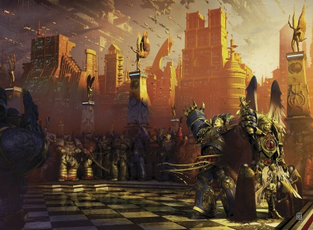

# 0038 第二帝国 Imperium Secundus

精校状态：中文行文已逐段精校，部分术语仍为暂定

分类：通用概念 / 帝国 Imperium

原文来源：https://www.bilibili.com/opus/1203971778008842247

原作者：帝国神选罐头

原文时间：2026年05月19日 11:05

[返回分类目录](目录.md) · [全书目录](../../目录.md)

<!-- A0038-B0001 -->
**英文原文**

Imperium Secundus was a Human empire on the Eastern Fringe of the Galaxy formed in 009.M31 during the Horus Heresy. At its peak, it compromised roughly five hundred worlds and was centered around the realm of Ultramar.

<!-- /A0038-B0001 -->

<!-- A0038-B0002 -->

原译文

第二帝国是一个位于银河系东部边缘的人类帝国，成立于009.M31荷鲁斯叛乱时期。在其鼎盛时期，它包括了大约500个世界，并以奥特拉玛领域为中心。

**校订译文**

第二帝国是一个位于银河系东部边缘的人类帝国，成立于009.M31荷鲁斯之乱时期。在其鼎盛时期，它包括了大约500个世界，并以奥特拉玛领域为中心。

<!-- /A0038-B0002 -->

<!-- A0038-B0003 -->
**英文原文**

Capital:Macragge

<!-- /A0038-B0003 -->

<!-- A0038-B0004 -->

原译文

首都：马库拉格

**校订译文**

首都：马库拉格

<!-- /A0038-B0004 -->

<!-- A0038-B0005 -->
**英文原文**

Official languages:Low Gothic & High Gothic

<!-- /A0038-B0005 -->

<!-- A0038-B0006 -->

原译文

官方语言：低哥特语&高哥特语

**校订译文**

官方语言：低哥特语&高哥特语

<!-- /A0038-B0006 -->

<!-- A0038-B0007 -->
**英文原文**

Major Species:Human, Abhuman species

<!-- /A0038-B0007 -->

<!-- A0038-B0008 -->

原译文

主要种族：人类，亚人种族

**校订译文**

主要种族：人类，亚人种族

<!-- /A0038-B0008 -->

<!-- A0038-B0009 -->
**英文原文**

Type of Government:Oligarchy with Monarch

<!-- /A0038-B0009 -->

<!-- A0038-B0010 -->

原译文

政府类型：君主寡头制

**校订译文**

政府类型：君主寡头制

<!-- /A0038-B0010 -->

<!-- A0038-B0011 -->
**英文原文**

Head of State:Imperator Regis (Sanguinius)

<!-- /A0038-B0011 -->

<!-- A0038-B0012 -->

原译文

国家首脑：雷吉斯帝皇（圣吉列斯）

**校订译文**

国家首脑：雷吉斯帝皇（圣吉列斯）

<!-- /A0038-B0012 -->

<!-- A0038-B0013 -->
**英文原文**

Governing body:None, ruled by triumvirate of Sanguinius, Lion El'Jonson, and Roboute Guilliman

<!-- /A0038-B0013 -->

<!-- A0038-B0014 -->

原译文

政体：无，由圣吉列斯、莱昂·艾尔庄森和罗伯特·基里曼三人统治

**校订译文**

治理机构：无独立机构，由圣吉列斯、莱昂·艾尔’庄森与罗保特·基里曼三人共同统治。

<!-- /A0038-B0014 -->

<!-- A0038-B0015 -->
**英文原文**

State religion(s):None, Imperial Truth enforced

<!-- /A0038-B0015 -->

<!-- A0038-B0016 -->

原译文

国教：无，执行帝国真理

**校订译文**

国教：无，执行帝国真理

<!-- /A0038-B0016 -->

<!-- A0038-B0017 -->
**英文原文**

Primary Military forces:Ultramarines, Blood Angels, Dark Angels, Ultramar Auxilia, Other loyalist Astartes, Loyalist Imperial Army, Loyalist Mechanicum

<!-- /A0038-B0017 -->

<!-- A0038-B0018 -->

原译文

主要军事部队：极限战士，圣血天使，黑暗天使，奥特拉玛辅助军，其他忠诚派阿斯塔特，忠诚派帝国军队，忠诚派机械教

**校订译文**

主要军事力量：极限战士、圣血天使、黑暗天使、奥特拉玛辅助军，以及其他忠诚派阿斯塔特、忠诚派帝国军和忠诚派机械教部队。

<!-- /A0038-B0018 -->

<!-- A0038-B0019 -->
**英文原文**

Primary Internal Security forces:Vigil Opertii, Praecental Guard

<!-- /A0038-B0019 -->

<!-- A0038-B0020 -->

原译文

主要内部治安部队：守秘人，执中守卫

**校订译文**

主要内部治安部队：守秘人，执中守卫

<!-- /A0038-B0020 -->

<!-- A0038-B0021 -->
## History 历史

<!-- /A0038-B0021 -->

<!-- A0038-B0022 -->
**英文原文**

As a result of massive Ruinstorm created by Erebus in the Shadow Crusade the Astronomican had been thrown into a state of disarray, rendering navigation and communication impossible and effectively dividing the Imperium in half. Seeing the dire state of humanity, Primarch Roboute Guilliman saw fit to enact a contingency plan and create a new Imperium should the power of Terra fall. Guilliman had little knowledge of what was transpiring outside of Ultramar, and decided that rebuilding the Imperium was a necessity even if he was not sure if the Imperium was not yet destroyed.

<!-- /A0038-B0022 -->

<!-- A0038-B0023 -->

原译文

由于艾瑞巴斯在暗影远征中制造的大规模毁灭风暴，星域陷入了混乱状态，使导航和通信变得不可能，并有效地将帝国一分为二。看到人类的可怕状态，原体罗伯特·基里曼认为，如果泰拉的力量下降，制定应急计划并创建一个新的帝国是合适的。基里曼对奥特拉玛以外发生的事情知之甚少，他决定重建帝国是必要的，即使他不确定帝国是否尚未被摧毁。

**校订译文**

艾瑞巴斯在暗影远征中制造的庞大毁灭风暴，扰乱了星炬的信号，使导航与通信无法正常进行，实际上将帝国一分为二。面对人类的危局，原体罗保特·基里曼决定实施应急计划：一旦泰拉政权覆灭，便建立一个新帝国。他几乎不了解奥特拉玛以外的情况，虽然不能确定帝国是否已经毁灭，仍认为有必要着手重建。

<!-- /A0038-B0023 -->

<!-- A0038-B0024 图片 -->

<!-- A0038-B0025 -->

原译文

Sanguinius is crowned as the ruler of Imperium Secundus 圣吉列斯被加冕为第二帝国的统治者

**校订译文**

Sanguinius is crowned as the ruler of Imperium Secundus 圣吉列斯被加冕为第二帝国的统治者

<!-- /A0038-B0025 -->

<!-- A0038-B0026 -->
**英文原文**

Thanks to the loyalist Warsmith Barabas Dantioch activating the Pharos, warriors of the Emperor and refugees fleeing the Shadow Crusade were able to find their way through the Ruinstorm and make it to Macragge. Soon, Guilliman was joined by his brother Lion El'Jonson and the Dark Angels. The comatose body of Vulkan was eventually brought to Imperium Secundus as well, joined by scattered forces of the Salamanders under Zytos, Raven Guard under Verano Ebb, Iron Hands under Eeron Kleve, White Scars under Timur Gantulga, Imperial Fists under Alexis Polux, and Space Wolves under Faffnr Bludbroder. Sanguinius and the Blood Angels, fresh from the Battle of Signus Prime, were among the last to arrive.

<!-- /A0038-B0026 -->

<!-- A0038-B0027 -->

原译文

由于忠诚派战争铁匠巴拉巴斯·丹提欧克激活了灯塔，帝皇的战士和逃离暗影远征的难民能够找到穿过毁灭风暴的路，并到达马库拉格。不久，基里曼和他的兄弟莱昂·艾尔庄森和黑暗天使加入了进来。沃坎昏迷的身体最终也被带到了第二帝国，由赛托斯领导的火蜥蜴、维拉诺·埃布领导的暗鸦守卫、埃伦·克莱夫领导的钢铁之手、帖木儿·甘图勒嘎领导的白色伤疤、亚历克西斯·泼鲁克斯领导的帝国之拳和法夫纳·血盟领导的太空野狼组成的破碎部队也加入了进来。刚从西格纳斯一号之战中归来的圣吉列斯和圣血天使是最后到达的人之一。

**校订译文**

忠诚派战争铁匠巴拉巴斯·丹提欧克启动灯塔后，帝皇的战士与逃离暗影远征的难民得以穿越毁灭风暴，抵达马库拉格。随后，基里曼的兄弟莱昂·艾尔’庄森率黑暗天使前来会合。昏迷的沃坎后来也被送入第二帝国，陆续到来的还有多支失散部队：赛托斯率领的火蜥蜴、维拉诺·埃布率领的暗鸦守卫、埃伦·克莱夫率领的钢铁之手、帖木儿·甘图勒嘎率领的白疤、亚历克西斯·泼鲁克斯率领的帝国之拳，以及法夫纳·血盟率领的太空野狼。刚经历西格纳斯主星之战的圣吉列斯与圣血天使，是最后抵达的部队之一。

<!-- /A0038-B0027 -->

<!-- A0038-B0028 -->
**英文原文**

Not wanting to fall into the same trap of self-aggrandizement as Horus, Guilliman refused to crown himself Emperor. He proposed to Lion El'Jonson that he rule Imperium Secundus. However ultimately, the duty would fall to a reluctant Sanguinius, Primarch of the Blood Angels, who was named Imperator Regis. Guilliman became Lord Warden while Lion El'Jonson was named Lord Protector of Imperium Secundus, a title similar to Warmaster. A major test for Imperium Secundus came during the Battle of Sotha, where Imperial forces attempted to defend the Pharos. Fortunately for Guilliman, his forces were victorious. After the battle, Guilliman and Lion El'Jonson came to severe disagreement over what to do about Night Lords Primarch Konrad Curze, who was still loose upon the planet. Curze may have been behind a string of suicide bombings and rebellions that targeted Guilliman's authority on Macragge, resulting in Lion El'Jonson using the Dark Angels to put Macragge under martial law and deploying the Dreadwing to devastate rebellious areas of the planet. However Curze was ultimately captured by The Lion in the Illyrium region and forced to stand trial.

<!-- /A0038-B0028 -->

<!-- A0038-B0029 -->

原译文

基里曼不想像荷鲁斯一样陷入自我膨胀的陷阱，他拒绝给自己加冕为皇帝。他向莱昂·艾尔庄森提议，由他统治第二帝国。然而，最终，这一责任将落在不情愿的圣血天使原体圣吉列斯身上，他被命名为雷吉斯帝皇。基里曼成为了守望领主，而莱昂·艾尔庄森被任命为第二帝国的保护者领主，这个头衔类似于战帅。在索萨之战中，帝国部队试图保卫灯塔，这是对第二帝国的一次重大考验。幸运的是，基里曼的部队取得了胜利。战斗结束后，基里曼和莱昂·艾尔庄森在如何处理午夜领主原体康拉德·科兹的问题上产生了严重分歧，后者仍然在这个行星上逍遥法外。科兹可能是一系列针对基里曼在马库拉格的权威的自杀式爆炸和叛乱的幕后黑手，导致莱昂·艾尔庄森利用黑暗天使将马库拉格置于戒严令之下，并部署恐翼摧毁行星上的叛乱地区。然而，科兹最终在伊利瑞姆地区被莱昂俘虏，并被迫接受审判。

**校订译文**

基里曼不愿像荷鲁斯一样陷入自我膨胀，拒绝为自己加冕称帝，转而提议由莱昂·艾尔’庄森统治第二帝国。最终，不情愿的圣血天使原体圣吉列斯承担了这一职责，获得“雷吉斯帝皇”的称号。基里曼出任守望领主，莱昂则成为护国领主，地位类似战帅。索萨之战中，帝国军力图保卫灯塔，第二帝国由此经受重大考验，所幸基里曼一方获胜。战后，基里曼与莱昂就如何处置仍在外逃窜的午夜领主原体康拉德·科兹产生严重分歧。马库拉格接连发生针对基里曼统治的自杀式爆炸与叛乱，科兹可能是幕后主使。莱昂于是让黑暗天使对马库拉格实施戒严，并派出恐翼摧毁叛乱地区。最终，科兹在伊利瑞姆被雄狮擒获，被迫接受审判。

**校注：** 英文在索萨之战后写 Curze still loose upon the planet，随后明确转述马库拉格事件，行星指代可能含混。译文不将代词强行扩写为索萨，保留可确认的马库拉格段落。

<!-- /A0038-B0029 -->

<!-- A0038-B0030 -->
**英文原文**

Meanwhile on Terra, Malcador the Sigilite suspected that Guilliman may try to build his own empire, and was cautiously nervous that the Primarch may be attempting to usurp the Emperor's power. Malcador even hoped that the Dark Angels would stop Guilliman.

<!-- /A0038-B0030 -->

<!-- A0038-B0031 -->

原译文

与此同时，在泰拉上，掌印者马卡多怀疑基里曼可能试图建立自己的帝国，并谨慎地担心原体可能试图篡夺帝皇的权力。马卡多甚至希望黑暗天使能够阻止基里曼。

**校订译文**

与此同时，泰拉上的掌印者马卡多怀疑基里曼正试图建立自己的帝国，谨慎而不安地担忧这位原体可能觊觎帝皇的权力。他甚至希望黑暗天使出面阻止基里曼。

<!-- /A0038-B0031 -->

<!-- A0038-B0032 -->
**英文原文**

By 014.M31, it became clear that the Emperor and Terra endured, thanks in large part due to the visions of Sanguinius and the captive Curze. The Triumvirate of Imperium Secundus decided to abandon their project, which many now considered redundant and heretical. Imperium Secundus was abolished and its territories were once again declared part of the Realm of Ultramar under the Regency of Valentus Dolor. Guilliman, Sanguinius, and Lion El'Jonson led the bulk of their respective legions through the Ruinstorm in hopes of reaching Terra and aiding the Emperor in his final struggle, though ultimate only Sanguinius and the Blood Angels would succeed in this.

<!-- /A0038-B0032 -->

<!-- A0038-B0033 -->

原译文

到014.M31，很明显，帝皇和泰拉得以承受，这在很大程度上要归功于圣吉列斯和被俘的科兹的幻象。第二帝国决定放弃他们的项目，许多人现在认为这是多余的和异端的。第二帝国被废除，其领土在瓦伦图斯·多洛尔摄政时期再次被宣布为奥特拉玛领域的一部分。基里曼、圣吉列斯和莱昂·艾尔庄森带领他们各自的大部分军团穿过毁灭风暴，希望到达泰拉并帮助帝皇进行最后的斗争，尽管最终只有圣吉列斯和圣血天使会成功。

**校订译文**

到 014.M31，主要借助圣吉列斯与被囚禁的科兹所见的幻象，三位统治者确认了帝皇与泰拉仍然屹立。许多人此时认为第二帝国既多余，又涉嫌异端，三巨头便决定结束这一计划。第二帝国被废除，其疆域重新归为奥特拉玛领，由瓦伦图斯·多洛尔摄政。基里曼、圣吉列斯和莱昂·艾尔’庄森分别率各自军团的主力穿越毁灭风暴，希望赶到泰拉，支援帝皇的最后一战；最终，只有圣吉列斯与圣血天使及时抵达。

<!-- /A0038-B0033 -->

本篇核心术语与暂定项

以下列出本篇出现的英文原形及核心术语表用词。同形词可能指不同对象，具体词义以本篇正文和校注为准；单复数、别名和仅见于图注的名称可能尚未列入。完整候选见[术语表](../../术语表/双语术语候选.csv)。

| 英文 | 采用中文 | 状态 |
| --- | --- | --- |
| Blood Angels | 圣血天使 | 官方已核对 |
| Dark Angels | 黑暗天使 | 官方已核对 |
| Space Wolves | 太空野狼 | 官方已核对 |
| Imperial Army | 帝国军 | 暂定·官方待核 |
| Roboute Guilliman | 罗保特·基里曼 | 官方已核对 |
| Ultramar | 奥特拉玛 | 官方已核对 |
| Ultramarines | 极限战士 | 官方已核对 |
| Horus Heresy | 荷鲁斯之乱 | 官方已核对 |
| Astronomican | 星炬 | 暂定 |
| Imperium | 帝国 | 暂定·简称 |
| Mechanicum | 机械教 | 暂定·历史称谓 |
| Imperial Fists | 帝国之拳 | 暂定 |
| Emperor | 帝皇 | 官方已核对 |
| Primarch | 原体 | 官方已核对 |
| Abhuman | 亚人 | 暂定·官方待核 |
| Night Lords | 午夜领主 | 暂定·官方待核 |
| Terra | 泰拉 | 暂定·官方待核 |
| Horus | 荷鲁斯 | 暂定·官方待核 |
| Erebus | 艾瑞巴斯 | 暂定·官方待核 |
| Lion El'Jonson | 莱昂·艾尔’庄森 | 官方已核对 |
| Iron Hands | 钢铁之手 | 暂定·官方待核 |
| Eastern Fringe | 东部边缘 | 暂定·官方待核 |
| Low Gothic | 低哥特语 | 暂定·官方待核 |
| High Gothic | 高哥特语 | 暂定·官方待核 |
| Vulkan | 沃坎 | 暂定·官方待核 |
| Protector | 守护者 | 暂定·官方待核 |
| Salamanders | 火蜥蜴 | 暂定·官方待核 |
| Konrad Curze | 康拉德·科兹 | 暂定·官方待核 |
| Macragge | 马库拉格 | 暂定·官方待核 |
| Sotha | 索萨 | 暂定·官方待核 |
| Imperium Secundus | 第二帝国 | 暂定·官方待核 |
| Imperator Regis | 雷吉斯帝皇 | 暂定·官方待核 |
| Lord Warden | 守望领主 | 暂定·官方待核 |
| Lord Protector | 护国领主 | 暂定·官方待核 |
| Valentus Dolor | 瓦伦图斯·多洛尔 | 暂定·官方待核 |
| Barabas Dantioch | 巴拉巴斯·丹提欧克 | 暂定·官方待核 |
| Warsmith | 战争铁匠 | 暂定·官方待核 |
| Pharos | 灯塔 | 暂定·官方待核 |
| Zytos | 赛托斯 | 暂定·官方待核 |
| Verano Ebb | 维拉诺·埃布 | 暂定·官方待核 |
| Eeron Kleve | 埃伦·克莱夫 | 暂定·官方待核 |
| Timur Gantulga | 帖木儿·甘图勒嘎 | 暂定·官方待核 |
| Alexis Polux | 亚历克西斯·泼鲁克斯 | 暂定·官方待核 |
| Faffnr Bludbroder | 法夫纳·血盟 | 暂定·官方待核 |
| Imperial Truth | 帝国真理 | 暂定·官方待核 |
| Clear | 清明 | 暂定·官方待核 |
| Vigil | 警戒团（静默修女编制）／警戒堡（红蝎空间站）／守夜星（行星） | 语境定译·官方待核 |
| White Scars | 白疤 | 官方已核 |
| Raven Guard | 暗鸦守卫 | 官方已核 |
| Scars | 伤疤 | 暂定·官方待核 |
| Dreadwing | 恐翼 | 暂定·官方待核 |
| Brother | 修士 | 暂定·官方待核 |
| Shadow Crusade | 暗影远征 | 暂定·官方待核 |
| Vigil Opertii | 守秘人 | 暂定·官方待核 |
| Praecental Guard | 执中守卫 | 暂定·官方待核 |
| Realm of Ultramar | 奥特拉玛领地 | 暂定·官方待核 |
| The Dark | 《黑暗》 | 暂定·官方待核 |
| The Blood | 鲜血 | 暂定·官方待核 |
| Ruinstorm | 毁灭风暴 | 暂定·官方待核 |
| Illyrium | 伊利里亚姆 | 暂定·官方待核 |
| Regency | 摄政区 | 暂定·官方待核 |
| Signus Prime | 西格纳斯主星 | 暂定·官方待核 |

