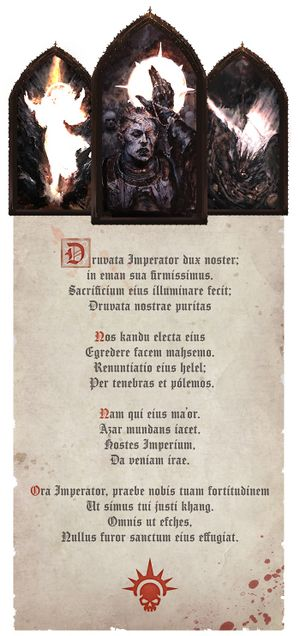

# 0039 高哥特语 High Gothic

精校状态：中文行文已逐段精校，部分术语仍为暂定

分类：通用概念 / 帝国 Imperium

原文来源：https://www.bilibili.com/opus/1124916277780938771

原作者：帝国神选罐头

原文时间：2025年10月18日 10:09

[返回分类目录](目录.md) · [全书目录](../../目录.md)

<!-- A0039-B0001 -->
**英文原文**

High Gothic is the hieratic tongue of the Imperium, used in the titles of ancient institutions and organisations (such as the Adeptus Terra). It represents an older language and is regarded as holy.

<!-- /A0039-B0001 -->

<!-- A0039-B0002 -->

原译文

高哥特语是帝国的祭司体语言，用于古代机构和组织的名称（如中央政务部）。它代表了一种古老的语言，被认为是神圣的。

**校订译文**

高哥特语是帝国用于神圣仪式的语言，也用于中央政务部等古老机构和组织的名称。它保留了较古老的语言形式，被视为神圣之语。

<!-- /A0039-B0002 -->

<!-- A0039-B0003 图片 -->

<!-- A0039-B0004 -->

原译文

Imperial hymn of the Imperial Creed in High Gothic 高哥特语帝国信条的帝国圣歌

**校订译文**

Imperial hymn of the Imperial Creed in High Gothic 以高哥特语吟唱的帝国信条圣歌

<!-- /A0039-B0004 -->

<!-- A0039-B0005 -->
## Overview 概述

<!-- /A0039-B0005 -->

<!-- A0039-B0006 -->
**英文原文**

High Gothic is a version of the language in which technical manuals and ancient works are recorded. This developed during the Dark Age of Technology. It derives from the common tongue of the time, an assimilation of English, European and Pacific languages, and developed in the Merican/Pacific region of Terra. This was the universal medium of written record until the Age of Strife, and was spoken as a first language by many and as a second language by almost everyone. Its idioms and vocabulary now appear archaic and mystic, and many of its words have acquired religious significance over the years.

<!-- /A0039-B0006 -->

<!-- A0039-B0007 -->

原译文

高哥特语是一种记录技术手册和古代作品的语言版本。这是在黑暗技术时代发展起来的。它源于当时的通用语言，是英语、欧洲和太平洋语言的同化，并在泰拉的美利坚/太平洋地区发展起来。在纷争时代之前，这是一种普遍的书面记录媒介，许多人将其作为第一语言，几乎每个人都将其作为第二语言。它的成语和词汇现在显得古老而神秘，多年来，它的许多单词都具有宗教意义。

**校订译文**

高哥特语保存着技术手册和古代著作所使用的语言形式，形成于黑暗科技时代。它起源于当时的通用语，融合了英语、欧洲诸语言及太平洋地区语言，在泰拉的美利坚与太平洋地区发展而成。纷争时代之前，它是通行的书面记录语言，许多人以之为母语，几乎其他所有人也将其作为第二语言。如今，它的惯用语和词汇显得古老而神秘，许多词语在漫长岁月中获得了宗教含义。

<!-- /A0039-B0007 -->

<!-- A0039-B0008 -->
**英文原文**

Low Gothic, a bastardised version of High Gothic, is the common tongue of the present Imperium.

<!-- /A0039-B0008 -->

<!-- A0039-B0009 -->

原译文

低哥特语是高哥特语的混杂版本，是当今帝国的共同语言。

**校订译文**

低哥特语是高哥特语的混杂版本，是当今帝国的共同语言。

<!-- /A0039-B0009 -->

<!-- A0039-B0010 -->
## Trivia 琐事

<!-- /A0039-B0010 -->

<!-- A0039-B0011 -->
**英文原文**

High Gothic was called Tech in the first edition.

<!-- /A0039-B0011 -->

<!-- A0039-B0012 -->

原译文

高哥特语在第一版中被称为技术。

**校订译文**

在第一版设定中，高哥特语被称为“技术语”（Tech）。

<!-- /A0039-B0012 -->

<!-- A0039-B0013 -->
**英文原文**

Represented by Latinised English, it has a status akin to that of Latin or French during the real-life Middle Ages.

<!-- /A0039-B0013 -->

<!-- A0039-B0014 -->

原译文

以拉丁化英语为代表，它的地位类似于现实中世纪中的拉丁语或法语。

**校订译文**

作品中以拉丁化的英语来呈现高哥特语，其地位类似现实中世纪的拉丁语或法语。

<!-- /A0039-B0014 -->

<!-- A0039-B0015 -->
**英文原文**

High Gothic lyrics of the hymn:

<!-- /A0039-B0015 -->

<!-- A0039-B0016 -->

原译文

圣歌的高哥特语唱词：

**校订译文**

圣歌的高哥特语唱词：

**校注：** 以下圣歌原文混有拉丁化英语及多种语言元素，并非可按标准拉丁语逐词可靠还原。现阶段保留原译唱词，标为意译待核；不把它当作逐词学术翻译。

<!-- /A0039-B0016 -->

<!-- A0039-B0017 -->
**英文原文**

Druvata Imperator dux noster;

<!-- /A0039-B0017 -->

<!-- A0039-B0018 -->

原译文

帝皇，我们的引导者

**校订译文**

帝皇，我们的引导者

<!-- /A0039-B0018 -->

<!-- A0039-B0019 -->
**英文原文**

in eman sua firmissimus.

<!-- /A0039-B0019 -->

<!-- A0039-B0020 -->

原译文

祂的神性坚不可摧

**校订译文**

祂的神性坚不可摧

<!-- /A0039-B0020 -->

<!-- A0039-B0021 -->
**英文原文**

Sacrificium eius illuminare fecit;

<!-- /A0039-B0021 -->

<!-- A0039-B0022 -->

原译文

祂的牺牲带来光明

**校订译文**

祂的牺牲带来光明

<!-- /A0039-B0022 -->

<!-- A0039-B0023 -->
**英文原文**

Druvata nostrae puritas

<!-- /A0039-B0023 -->

<!-- A0039-B0024 -->

原译文

帝皇，我们的纯洁

**校订译文**

帝皇，我们的纯洁

<!-- /A0039-B0024 -->

<!-- A0039-B0025 -->
**英文原文**

Nos kandu electa eius

<!-- /A0039-B0025 -->

<!-- A0039-B0026 -->

原译文

我们是祂选中之人

**校订译文**

我们是祂选中之人

<!-- /A0039-B0026 -->

<!-- A0039-B0027 -->
**英文原文**

Egredere facem mahsemo.

<!-- /A0039-B0027 -->

<!-- A0039-B0028 -->

原译文

前进，向着光明的荣耀

**校订译文**

前进，向着光明的荣耀

<!-- /A0039-B0028 -->

<!-- A0039-B0029 -->
**英文原文**

Renuntiatio eius helel;

<!-- /A0039-B0029 -->

<!-- A0039-B0030 -->

原译文

祂的昭示有如晨星

**校订译文**

祂的昭示有如晨星

<!-- /A0039-B0030 -->

<!-- A0039-B0031 -->
**英文原文**

Per tenebras et pólemos.

<!-- /A0039-B0031 -->

<!-- A0039-B0032 -->

原译文

穿越黑暗和战争

**校订译文**

穿越黑暗和战争

<!-- /A0039-B0032 -->

<!-- A0039-B0033 -->
**英文原文**

Nam qui eius ma’or.

<!-- /A0039-B0033 -->

<!-- A0039-B0034 -->

原译文

因为祂即光明

**校订译文**

因为祂即光明

<!-- /A0039-B0034 -->

<!-- A0039-B0035 -->
**英文原文**

Azar mundans iacet.

<!-- /A0039-B0035 -->

<!-- A0039-B0036 -->

原译文

火焰净化存在

**校订译文**

火焰净化存在

<!-- /A0039-B0036 -->

<!-- A0039-B0037 -->
**英文原文**

Hostes Imperium,

<!-- /A0039-B0037 -->

<!-- A0039-B0038 -->

原译文

帝国之敌

**校订译文**

帝国之敌

<!-- /A0039-B0038 -->

<!-- A0039-B0039 -->
**英文原文**

Da veniam irae.

<!-- /A0039-B0039 -->

<!-- A0039-B0040 -->

原译文

承受怒火之罚

**校订译文**

承受怒火之罚

<!-- /A0039-B0040 -->

<!-- A0039-B0041 -->
**英文原文**

Ora Imperator, praebe nobis tuam fortitudinem

<!-- /A0039-B0041 -->

<!-- A0039-B0042 -->

原译文

向帝皇祈祷，赐予我们您的力量

**校订译文**

向帝皇祈祷，赐予我们您的力量

<!-- /A0039-B0042 -->

<!-- A0039-B0043 -->
**英文原文**

Ut simus tui justi khang.

<!-- /A0039-B0043 -->

<!-- A0039-B0044 -->

原译文

让我们成为您的正义卫士

**校订译文**

让我们成为您的正义卫士

<!-- /A0039-B0044 -->

<!-- A0039-B0045 -->
**英文原文**

Omnis ut efches,

<!-- /A0039-B0045 -->

<!-- A0039-B0046 -->

原译文

万物皆遂您意

**校订译文**

万物皆遂您意

<!-- /A0039-B0046 -->

<!-- A0039-B0047 -->
**英文原文**

Nullus furor sanctum eius effugiat.

<!-- /A0039-B0047 -->

<!-- A0039-B0048 -->

原译文

无人能逃脱祂神圣的愤怒

**校订译文**

无人能逃脱祂神圣的愤怒

<!-- /A0039-B0048 -->

本篇核心术语与暂定项

以下列出本篇出现的英文原形及核心术语表用词。同形词可能指不同对象，具体词义以本篇正文和校注为准；单复数、别名和仅见于图注的名称可能尚未列入。完整候选见[术语表](../../术语表/双语术语候选.csv)。

| 英文 | 采用中文 | 状态 |
| --- | --- | --- |
| Imperium | 帝国 | 暂定·简称 |
| Dark Age of Technology | 黑暗科技时代 | 暂定 |
| Adeptus Terra | 中央政务部 | 暂定 |
| Age of Strife | 纷争时代 | 暂定·官方待核 |
| Terra | 泰拉 | 暂定·官方待核 |
| Low Gothic | 低哥特语 | 暂定·官方待核 |
| High Gothic | 高哥特语 | 暂定·官方待核 |
| Tech | 技术语 | 暂定·官方待核 |
| Ancient | 旗手 | 官方已核对 |
| Mystic | 神秘者 | 暂定·官方待核 |
| Sanctum | 圣所星 | 暂定·官方待核 |
| Nullus | 努鲁斯 | 暂定·官方待核 |
| The Dark | 《黑暗》 | 暂定·官方待核 |

