# 0041 帝国天鹰 Aquila

精校状态：中文行文已逐段精校，部分术语仍为暂定

分类：通用概念 / 帝国 Imperium

原文来源：https://www.bilibili.com/opus/1176116011648155648

原作者：帝国神选罐头

原文时间：2026年03月05日 09:30

[返回分类目录](目录.md) · [全书目录](../../目录.md)

<!-- A0041-B0001 -->
**英文原文**

The Aquila (plural: Aquilae) (also known as Imperial Aquila , great Aquila and Imperial Eagle) normally refers to a two-headed eagle that symbolizes the Pax Imperialis, the oath that binds together all Imperial servants under the banner of the Emperor of Mankind. It is a universal symbol within the Imperium and more than anything else represents the dominion of the Emperor. It is also said that the Eagle and its variations symbolize both the Imperium as such and also loyalty to the Emperor as its master. It also is the heraldic device of the Imperial state and at the same time holy symbol of the Imperial Cult. The double-headed eagle also represents the union of the Mechanicum of Mars and the Emperor or between Mars and Terra.

<!-- /A0041-B0001 -->

<!-- A0041-B0002 -->

原译文

天鹰（复数：天鹰）（也称为帝国天鹰、大天鹰和帝国鹰）通常是指象征帝国和平的双头鹰，这是在人类帝皇的旗帜下将所有帝国之仆团结在一起的誓言。它是帝国内部的普遍标志，最重要的是代表帝皇的统治。还有人说，鹰及其变体象征着帝国本身，也象征着对作为主人的帝皇的忠诚。它也是帝国的纹章，同时也是帝国教派的神圣象征。双头鹰也代表了火星机械教和帝皇或火星和泰拉之间的联盟。

**校订译文**

天鹰（Aquila，复数 Aquilae），又称帝国天鹰、大天鹰或帝国鹰，通常指帝国的双头鹰徽。它象征“帝国和平”：将帝国所有臣仆团结在人类帝皇旗下的誓约。这一标志遍布帝国，首要含义是帝皇的统治，也同时象征帝国本身，以及对其主人帝皇的忠诚。它既是帝国的国家纹章，也是帝皇信仰的神圣象征。双头鹰还代表火星机械教与帝皇的结合，亦即火星与泰拉的联盟。

<!-- /A0041-B0002 -->

<!-- A0041-B0003 图片 -->
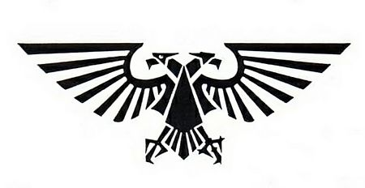

<!-- A0041-B0004 -->

原译文

The Aquila, symbol of the Imperium of Mankind 天鹰，人类帝国的标志

**校订译文**

The Aquila, symbol of the Imperium of Mankind 天鹰，人类帝国的标志

<!-- /A0041-B0004 -->

<!-- A0041-B0005 -->
## History 历史

<!-- /A0041-B0005 -->

<!-- A0041-B0006 -->
## Pre-Great Crusade 大远征前

<!-- /A0041-B0006 -->

<!-- A0041-B0007 -->
**英文原文**

Before the formalisation of the Eagle (also see Raptor Imperialis) as the symbol of the Imperium the Emperor's personal device was the Thunderbolt and lightning emblem which was used during the Unification Wars. But the Imperial Eagle also is a symbol of the Emperor's War of Unification.

<!-- /A0041-B0007 -->

<!-- A0041-B0008 -->

原译文

在鹰（也见帝国猛禽）正式成为帝国的象征之前，帝皇的个人标志是统一战争期间使用的霹雳和闪电徽章。但帝国鹰也是帝皇统一战争的象征。

**校订译文**

在鹰（也见帝国猛禽）正式成为帝国的象征之前，帝皇的个人标志是统一战争期间使用的霹雳和闪电徽章。但帝国鹰也是帝皇统一战争的象征。

<!-- /A0041-B0008 -->

<!-- A0041-B0009 图片 -->
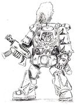

<!-- A0041-B0010 -->

原译文

Mark 1 Power Armour as used during the wars to unify the Terran system without Aquilae Mark 1动力盔甲，在统一泰拉星系的战争期间使用，没有天鹰

**校订译文**

Mark 1 Power Armour as used during the wars to unify the Terran system without Aquilae Mark 1动力盔甲，在统一泰拉星系的战争期间使用，没有天鹰

<!-- /A0041-B0010 -->

<!-- A0041-B0011 -->
## Great Crusade/Pre-Heresy 大远征/叛乱前

<!-- /A0041-B0011 -->

<!-- A0041-B0012 -->
**英文原文**

When the newly-found Fulgrim was brought to Terra by the Emperor to join his, Fulgrim's, Legion the Primarch addressed his warriors in a speech. Tasking them with bringing the wisdom of the Emperor to all the stars and underlining that they were the children of the Emperor. The Emperor was so impressed by these words that he bestowed a unique honour on Fulgrim's Legion: They would be permitted to display the Imperial Eagle on their armour chestplates - the only Legion permitted to do so. Possibly the Aquila was also already being used more generally on Power Armour during this and later times.

<!-- /A0041-B0012 -->

<!-- A0041-B0013 -->

原译文

当新发现的福格瑞姆被帝皇带到泰拉加入他的，福格瑞姆的军团时，原体在一次演讲中向他的战士们发表了讲话。让他们把帝皇的智慧带给群星，并强调他们是帝皇之子。这些话给帝皇留下了深刻的印象，他授予了福格瑞姆的军团一项独特的荣誉：他们将被允许在盔甲胸甲上展示帝国鹰，这是唯一被允许这样做的军团。也许天鹰在这个时代和后来的时代也已经被更广泛地用于动力盔甲。

**校订译文**

帝皇找回福格瑞姆、将他带到泰拉与自己的军团会合后，这位原体向战士们发表演说，要求他们将帝皇的智慧传播至群星，并强调他们是“帝皇之子”。帝皇深受打动，赐予该军团独一无二的荣誉：准许他们在胸甲上展示帝国天鹰，成为唯一获此许可的军团。不过，也有可能在同一时期及之后，天鹰已更广泛地用于其他动力甲。

**校注：** 本篇自身同时提出帝皇之子独享胸甲天鹰特权，以及同时期其他盔甲可能也使用天鹰的疑问；后文图像年代注与来源冲突为其限定，未擅自消除矛盾。

<!-- /A0041-B0013 -->

<!-- A0041-B0014 图片 -->
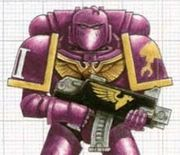

<!-- A0041-B0015 -->

原译文

Pre-Heresy Emperor's Children with chestplate Aquila 配天鹰胸甲的叛乱前帝皇之子

**校订译文**

Pre-Heresy Emperor's Children with chestplate Aquila 配天鹰胸甲的叛乱前帝皇之子

<!-- /A0041-B0015 -->

<!-- A0041-B0016 图片 -->
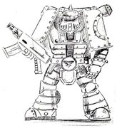

<!-- A0041-B0017 -->

原译文

Mark 2 Crusade Armour with Aquila Mark 2远征盔甲与天鹰

**校订译文**

Mark 2 Crusade Armour with Aquila Mark 2远征盔甲与天鹰

<!-- /A0041-B0017 -->

<!-- A0041-B0018 图片 -->
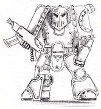

<!-- A0041-B0019 -->

原译文

Mark 3 Armorum Ferrum/Iron Suit or Iron Armour with Aquila Mark 3铁/铁甲或钢铁盔甲与天鹰

**校订译文**

Mark 3 Armorum Ferrum/Iron Suit or Iron Armour with Aquila Mark 3铁/铁甲或钢铁盔甲与天鹰

<!-- /A0041-B0019 -->

<!-- A0041-B0020 图片 -->
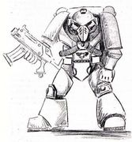

<!-- A0041-B0021 -->

原译文

Mark 4 Imperial Maximus with Aquila Mark 4帝国马克西姆斯与天鹰

**校订译文**

Mark 4 Imperial Maximus with Aquila Mark 4帝国马克西姆斯与天鹰

<!-- /A0041-B0021 -->

<!-- A0041-B0022 -->
**英文原文**

There has been at least a five Aquila coin in use as Imperial currency in the time prior to the Horus Heresy.

<!-- /A0041-B0022 -->

<!-- A0041-B0023 -->

原译文

在荷鲁斯叛乱之前，至少有一种五天鹰币被用作帝国货币。

**校订译文**

在荷鲁斯之乱之前，至少有一种五天鹰币被用作帝国货币。

<!-- /A0041-B0023 -->

<!-- A0041-B0024 -->
## Horus Heresy 荷鲁斯之乱

原题：Horus Heresy 荷鲁斯叛乱

<!-- /A0041-B0024 -->

<!-- A0041-B0025 -->
**英文原文**

Towards the end of the Horus Heresy when the final battle for Mars was underway the armour development teams were evacuated from Mars to Terra where they continued their work. The result of their work was the Mark 7 Armorum Impetor or Eagle Armour which takes its common name from the Eagle device it bears. The Eagle Armour started to reach the loyalist Space Marine defenders on Terra and on the Moon when Horus and his forces overcame the last resistance on Mars.

<!-- /A0041-B0025 -->

<!-- A0041-B0026 -->

原译文

在荷鲁斯叛乱接近尾声时，当火星的最后一场战斗正在进行时，盔甲开发团体从火星撤离到泰拉，在那里继续他们的工作。他们的工作成果是Mark 7英佩特盔甲或鹰甲，其通用名称来自它所携带的鹰标志。当荷鲁斯和他的部队解决了火星上的最后一次抵抗时，鹰甲开始抵达泰拉和月球上的忠诚星际战士防御者。

**校订译文**

荷鲁斯之乱接近尾声、火星的最后决战仍在进行时，动力甲研发团队被撤往泰拉继续工作。他们的成果是七型 Armorum Impetor，又称“天鹰型动力甲”，俗称取自其胸前的鹰徽。当荷鲁斯及其部队扫平火星最后的抵抗时，这种动力甲开始送抵守卫泰拉和月球的忠诚派星际战士手中。

<!-- /A0041-B0026 -->

<!-- A0041-B0027 图片 -->
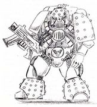

<!-- A0041-B0028 -->

原译文

Mark 5 Heresy Suit with Aquila Mark 5异端盔甲与天鹰

**校订译文**

Mark 5 Heresy Suit with Aquila Mark 5异端盔甲与天鹰

<!-- /A0041-B0028 -->

<!-- A0041-B0029 图片 -->
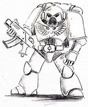

<!-- A0041-B0030 -->

原译文

Mark 7 Armorum Impetor or Eagle Armour Mark 7英佩特盔甲或天鹰盔甲

**校订译文**

Mark 7 Armorum Impetor or Eagle Armour Mark 7英佩特盔甲或天鹰盔甲

<!-- /A0041-B0030 -->

<!-- A0041-B0031 -->
## Design and meanings 设计和意义

<!-- /A0041-B0031 -->

<!-- A0041-B0032 -->
**英文原文**

The Aquila most commonly has two heads looking into different directions, one said blinded to look at the past, one sighted to see to the future or one head gazing into the Materium while the other gazes into the Immaterium. Other sources associate the blind head with the Adeptus Astronomica and the seeing head with the Adeptus Astra Telepathica.

<!-- /A0041-B0032 -->

<!-- A0041-B0033 -->

原译文

天鹰最常见的是有两个头朝着不同的方向看，一个头说是盲目地看向过去，一个头是看向未来，或者一个头凝视着物质界，而另一个头则凝视着非物质界。其他资料将盲目之首与星炬庭联系在一起，将有可视之首与星语庭联系起来。

**校订译文**

天鹰最常见的造型是两个头分别望向相反方向。一种解释认为，失明的头回望过去，有视力的头凝视未来；另一种则认为，一首注视物质界，另一首注视非物质界。还有资料将失明的一首与星炬庭相联，把有视力的一首与星语庭相联。

<!-- /A0041-B0033 -->

<!-- A0041-B0034 图片 -->
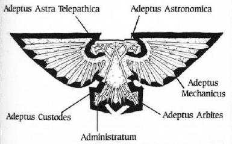

<!-- A0041-B0035 -->

原译文

The Aquila 天鹰

**校订译文**

The Aquila 天鹰

<!-- /A0041-B0035 -->

<!-- A0041-B0036 -->
**英文原文**

The left wing (as seen from the viewer's perspective) represents the Adeptus Astra Telepathica while the right wing represents the Adeptus Mechanicus. The Eagle's body stands for the Adeptus Custodes, while the left, straight claw (again as seen from the viewer's perspective) represents the Administratum and the right, crooked claw the Adeptus Arbites.

<!-- /A0041-B0036 -->

<!-- A0041-B0037 -->

原译文

左翼（从观看者的角度看）代表星语庭，右翼代表机械教。鹰的身体代表着禁军修会，而左伸直的爪子（再次从观看者的角度来看）代表着内务部，右弯曲的爪子代表着法务部。

**校订译文**

从观看者的角度看，左翼代表星语庭，右翼代表机械修会；鹰身代表帝皇禁军。左侧伸直的爪代表内政部，右侧弯曲的爪则代表法务部。

<!-- /A0041-B0037 -->

<!-- A0041-B0038 -->
## Usage 用法

<!-- /A0041-B0038 -->

<!-- A0041-B0039 -->
**英文原文**

The device of the Aquila is generally used throughout the galaxy wherever the Imperium wishes to proclaim its authority. Typical examples include architecture, armour, vehicles (like space ships), weapons, containers etc. and - at least prior to the Horus Heresy - also currency, i.e. on coins:

<!-- /A0041-B0039 -->

<!-- A0041-B0040 -->

原译文

天鹰标志通常用于整个银河系，无论帝国希望在哪里宣布其权威。典型的例子包括建筑、盔甲、载具（如星舰）、武器、集装箱等，至少在荷鲁斯叛乱之前，还有货币，即硬币：

**校订译文**

帝国希望彰显权威的地方，通常都能见到天鹰。它常用于建筑、盔甲、星舰等载具、武器和容器，也用于货币，例如至少在荷鲁斯之乱前便已出现的硬币。

<!-- /A0041-B0040 -->

<!-- A0041-B0041 -->
**英文原文**

Aquilae are frequently worn by Imperial servants, for example on clothing, ceremonial dresses, armour or in the form of jewelry (for example as a necklace or as a brooch), tattoos (or as etchings across shoulder blades) or other adornments.

<!-- /A0041-B0041 -->

<!-- A0041-B0042 -->

原译文

天鹰经常被帝国之仆佩戴，例如在衣服、礼服、盔甲上或以珠宝（例如作为项链或胸针）、纹身（或作为肩胛骨上的蚀刻）或其他装饰品的形式。

**校订译文**

帝国臣仆经常佩戴天鹰：它可以出现在日常服装、礼服和盔甲上，也可以制成项链、胸针等首饰，或成为纹身、肩胛处的刻痕及其他饰物。

<!-- /A0041-B0042 -->

<!-- A0041-B0043 -->

原译文

The Aquila as an adornment 天鹰作为装饰品

**校订译文**

The Aquila as an adornment 天鹰作为装饰品

<!-- /A0041-B0043 -->

<!-- A0041-B0044 图片 -->
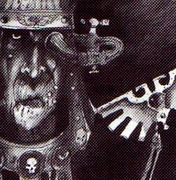

<!-- A0041-B0045 -->

原译文

On an Imperial servant 在帝国之仆身上

**校订译文**

On an Imperial servant 在帝国之仆身上

<!-- /A0041-B0045 -->

<!-- A0041-B0046 图片 -->
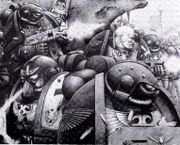

<!-- A0041-B0047 -->

原译文

On Space Marines 在星际战士身上

**校订译文**

On Space Marines 在星际战士身上

<!-- /A0041-B0047 -->

<!-- A0041-B0048 图片 -->
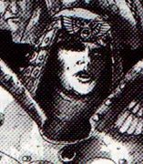

<!-- A0041-B0049 -->

原译文

On a Sister of Battle 在战斗修女身上

**校订译文**

On a Sister of Battle 在战斗修女身上

<!-- /A0041-B0049 -->

<!-- A0041-B0050 图片 -->
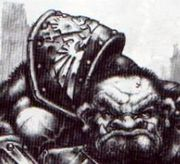

<!-- A0041-B0051 -->

原译文

On the shoulder guard of an Ogryn 在欧格林肩甲上

**校订译文**

On the shoulder guard of an Ogryn 在欧格林肩甲上

<!-- /A0041-B0051 -->

<!-- A0041-B0052 -->
**英文原文**

The Aquila typically adorns the chestpiece of Space Marine Power Armour.

<!-- /A0041-B0052 -->

<!-- A0041-B0053 -->

原译文

天鹰通常装饰在星际战士动力盔甲的胸甲前。

**校订译文**

天鹰通常装饰在星际战士动力盔甲的胸甲前。

<!-- /A0041-B0053 -->

<!-- A0041-B0054 -->
**英文原文**

It also is ubiquitous on medals like the Astra Militarum Honours and can also be found as the Aquila Token.

<!-- /A0041-B0054 -->

<!-- A0041-B0055 -->

原译文

它在星界军的荣誉勋章等奖牌上也无处不在，也可以作为天鹰标找到。

**校订译文**

天鹰也广泛出现于星界军荣誉勋章等奖章上，还会制成“天鹰徽记”。

<!-- /A0041-B0055 -->

<!-- A0041-B0056 -->
### Military honours 军事荣誉勋章

<!-- /A0041-B0056 -->

<!-- A0041-B0057 图片 -->
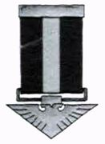

<!-- A0041-B0058 -->

原译文

The Eagle Ordinary 普通天鹰

**校订译文**

The Eagle Ordinary 普通天鹰

<!-- /A0041-B0058 -->

<!-- A0041-B0059 图片 -->
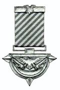

<!-- A0041-B0060 -->

原译文

The Steel Aquila 钢铁天鹰

**校订译文**

The Steel Aquila 钢铁天鹰

<!-- /A0041-B0060 -->

<!-- A0041-B0061 图片 -->
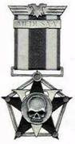

<!-- A0041-B0062 -->

原译文

The Medusa Star 美杜莎之星

**校订译文**

The Medusa Star 美杜莎之星

<!-- /A0041-B0062 -->

<!-- A0041-B0063 图片 -->
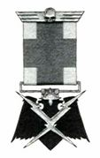

<!-- A0041-B0064 -->

原译文

The Order of the Storm 风暴秩序

**校订译文**

The Order of the Storm 风暴勋章

<!-- /A0041-B0064 -->

<!-- A0041-B0065 图片 -->
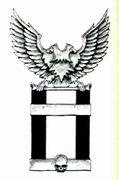

<!-- A0041-B0066 -->

原译文

The Valoris Imperator 帝皇之威

**校订译文**

The Valoris Imperator 帝皇之威

<!-- /A0041-B0066 -->

<!-- A0041-B0067 图片 -->
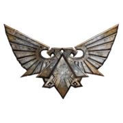

<!-- A0041-B0068 -->

原译文

The Aquila Token 天鹰标

**校订译文**

The Aquila Token 天鹰徽记

<!-- /A0041-B0068 -->

<!-- A0041-B0069 -->
**英文原文**

It also appears on vehicles as an affirmation of loyalty.

<!-- /A0041-B0069 -->

<!-- A0041-B0070 -->

原译文

它也出现在载具上，作为对忠诚的肯定。

**校订译文**

它也出现在载具上，作为对忠诚的肯定。

<!-- /A0041-B0070 -->

<!-- A0041-B0071 -->

原译文

The Aquila on vehicles and weapons 载具和武器上的天鹰

**校订译文**

The Aquila on vehicles and weapons 载具和武器上的天鹰

<!-- /A0041-B0071 -->

<!-- A0041-B0072 图片 -->
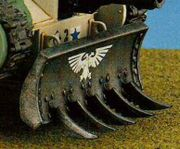

<!-- A0041-B0073 -->

原译文

On the bulldozer blade of a Leman Russ Battle Tank 黎曼鲁斯战斗坦克的推土铲上

**校订译文**

On the bulldozer blade of a Leman Russ Battle Tank 黎曼鲁斯战斗坦克的推土铲上

<!-- /A0041-B0073 -->

<!-- A0041-B0074 图片 -->
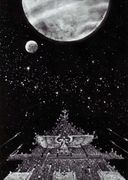

<!-- A0041-B0075 -->

原译文

On a space ship 在星舰上

**校订译文**

On a space ship 在星舰上

<!-- /A0041-B0075 -->

<!-- A0041-B0076 图片 -->
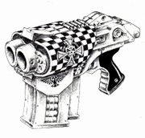

<!-- A0041-B0077 -->

原译文

On a Storm bolter 在风暴爆矢枪上

**校订译文**

On a Storm bolter 在风暴爆矢枪上

<!-- /A0041-B0077 -->

<!-- A0041-B0078 图片 -->
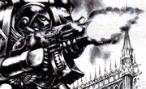

<!-- A0041-B0079 -->

原译文

On a Bolter 在爆矢枪上

**校订译文**

On a Bolter 在爆矢枪上

<!-- /A0041-B0079 -->

<!-- A0041-B0080 -->

原译文

An Aquila as a form of Imperial Currency 天鹰作为帝国货币的一种形式

**校订译文**

An Aquila as a form of Imperial Currency 天鹰作为帝国货币的一种形式

<!-- /A0041-B0080 -->

<!-- A0041-B0081 图片 -->
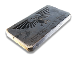

<!-- A0041-B0082 -->

原译文

An "Aquila" as currency “天鹰”作为货币

**校订译文**

An "Aquila" as currency “天鹰”作为货币

<!-- /A0041-B0082 -->

<!-- A0041-B0083 -->
**英文原文**

There has been at least a five Aquila coin in use as Imperial currency in the time prior to the Horus Heresy.

<!-- /A0041-B0083 -->

<!-- A0041-B0084 -->

原译文

在荷鲁斯叛乱之前，至少有一种五天鹰币被用作帝国货币。

**校订译文**

在荷鲁斯之乱之前，至少有一种五天鹰币被用作帝国货币。

<!-- /A0041-B0084 -->

<!-- A0041-B0085 -->
**英文原文**

Other objects bearing or taking the form of an Aquila include but are not limited too: A bar on Sameter using the symbol as a advertising neon sign, as a watermark on paper and iron candelabras.

<!-- /A0041-B0085 -->

<!-- A0041-B0086 -->

原译文

其他带有或采用天鹰形状的物体包括但不限于：萨米特的一个酒吧，将这个符号用作广告霓虹灯标志，作为纸张和铁烛台上的水印。

**校订译文**

其他采用天鹰图案或造型的物件，还有萨米特某家酒吧的霓虹广告招牌、纸张水印，以及铁制烛台等。

<!-- /A0041-B0086 -->

<!-- A0041-B0087 -->
**英文原文**

The Moebian Domain uses Aquilas, also called Moebian Aquilas, as currency in M42. It features an Aquila design and the text "Imperium of Man" stamped into it.

<!-- /A0041-B0087 -->

<!-- A0041-B0088 -->

原译文

莫比安领域使用天鹰，也称为莫比安天鹰，作为M42的货币。它以天鹰的设计为特色，上面印有“人类帝国”的文字。

**校订译文**

第 42 千年，莫比安领使用“天鹰币”，又称“莫比安天鹰币”。币上压有天鹰图案和“人类帝国”字样。

<!-- /A0041-B0088 -->

<!-- A0041-B0089 -->
## Sign of the Aquila 天鹰手势

<!-- /A0041-B0089 -->

<!-- A0041-B0090 -->
**英文原文**

The Sign of the Aquila (often shortened to simply Aquila) is a sign of devotion to the Imperium also used for example as a sign of defiance against Warp entities. It was used a sign of devotion from early on. It is also known to have been used as a formal greeting between at least Space Marines and as a sign of respect towards fallen brothers.

<!-- /A0041-B0090 -->

<!-- A0041-B0091 -->

原译文

天鹰手势（通常简称为天鹰礼）是对帝国忠诚的标志，也被用作对抗亚空间实体的手势。从早期开始，它就被用来表示忠诚。它也被用作至少星际战士之间的正式问候，以及对逝去兄弟的尊重。

**校订译文**

天鹰手势，常简称“天鹰礼”，用于表达对帝国的忠诚，也可表示对亚空间实体的抗拒。这一手势很早便已有献忠之意，并至少被星际战士用作正式问候，以及向阵亡兄弟致敬的礼仪。

<!-- /A0041-B0091 -->

<!-- A0041-B0092 -->
**英文原文**

Descriptions of how to actually do this sign are however a bit unclear: In one instance it is said that hands are placed or pressed to one's chest, palms open, blades of fingers extended and thumbs raised while others say and show the thumbs are interlocked or crossed while yet another source says the "fingers" are "laced" into the shape on an Aquila.

<!-- /A0041-B0092 -->

<!-- A0041-B0093 -->

原译文

然而，关于如何实际做这个手势的描述有点不清楚：在一个例子中，据说手放在或压在胸前，手掌张开，手指伸出来，竖起拇指，而另一些人则说并显示拇指是互锁的或交叉的，而另一个来源说“手指”是“绑在”天鹰的形状上的。

**校订译文**

不过，各资料对具体做法的描述并不完全一致。一处说，双手放在或按在胸前，掌心张开，四指伸展，拇指竖起；另一些文字或图像则让拇指相扣、交叉；还有资料形容“手指”相互“交织”，组成天鹰形状。

<!-- /A0041-B0093 -->

<!-- A0041-B0094 -->
**英文原文**

This gesture is equivalent to the Cult Mechanicus' gesture, the sign of the cog. It is common for Imperial and Adeptus Mechanicus forces working together to make each other's respective religion's gesture in greeting to express mutual honour and respect from both parties. Although, most Imperials tend to have a laboured unfamiliarity when attempting to make the sign of the cog.

<!-- /A0041-B0094 -->

<!-- A0041-B0095 -->

原译文

这个手势相当于机械教派的手势，齿轮手势。帝国和机械教的部队一起工作，在问候中做出各自宗教的手势，以表达双方的荣誉和相互尊重，这是很常见的。尽管如此，大多数帝国人在试图做齿轮手势时往往会有一种吃力的陌生感。

**校订译文**

天鹰礼与机械教派的“齿轮礼”作用相当。帝国军队与机械修会部队合作时，常在问候中行对方宗教的礼节，表达相互敬重。不过，多数帝国人做起齿轮礼来，难免生疏而费劲。

<!-- /A0041-B0095 -->

<!-- A0041-B0096 图片 -->
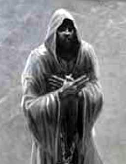

<!-- A0041-B0097 -->

原译文

The Sign of the Aquila 天鹰手势

**校订译文**

The Sign of the Aquila 天鹰手势

<!-- /A0041-B0097 -->

<!-- A0041-B0098 -->
## Other information 其他信息

<!-- /A0041-B0098 -->

<!-- A0041-B0099 -->
**英文原文**

Soldiers of the Imperial Guard are obliged to salute (amongst others) any image of the Aquila - failure to do so is punished by being branded on the left cheek and a court-martial.

<!-- /A0041-B0099 -->

<!-- A0041-B0100 -->

原译文

帝国卫队的士兵有义务向（除其他外）天鹰的任何形象致敬 — 否则将被打左脸颊并接受军事法庭的惩罚。

**校订译文**

帝国卫队士兵必须向天鹰图像等对象敬礼。违者会被在左颊烙印，并接受军事法庭审判。

<!-- /A0041-B0100 -->

<!-- A0041-B0101 -->
**英文原文**

When no proper altar to the Emperor of Mankind is available one can be improvised by Imperial Guard officers to conduct their ceremonies: under certain circumstances and at certain times an Aquila standard is suspended from a wall and a yellow chalk cross on the floor beneath it then marks the sacred spot.

<!-- /A0041-B0101 -->

<!-- A0041-B0102 -->

原译文

当没有合适的人类帝皇的祭坛时，帝国卫队军官可以临时制作祭坛来举行仪式：在某些情况下，在某些时候，天鹰旗帜悬挂在墙上，下面地板上的黄色粉笔十字标记着圣地。

**校订译文**

若没有合适的帝皇祭坛，帝国卫队军官可以临时布置一处举行仪式：在特定情况下，将天鹰军旗悬于墙上，再用黄色粉笔在下方地面画出十字，标示神圣之地。

<!-- /A0041-B0102 -->

<!-- A0041-B0103 -->
**英文原文**

At least servants of the Ecclesiarchy are expected to make the Sign of the Aquila when facing an Ecclesiarchical shrine or when seeing a sign of the Ruinous Powers. Making the sign to honour altars also is a known practice amongst other Imperial servants.

<!-- /A0041-B0103 -->

<!-- A0041-B0104 -->

原译文

至少国教的仆人在面对国教圣地或看到毁灭力量的标志时，应该做出天鹰手势。制作荣誉祭坛的标志也是其他帝国之仆的一种众所周知的做法。

**校订译文**

至少国教会的侍奉者，在面对教会圣所或看见混沌毁灭诸神的标记时，应当行天鹰礼。其他帝国臣仆也会行此礼，向祭坛致敬。

<!-- /A0041-B0104 -->

<!-- A0041-B0105 -->
**英文原文**

Aquila devices have been known to become the focus of tangible manifestations of religious power.

<!-- /A0041-B0105 -->

<!-- A0041-B0106 -->

原译文

天鹰标志已成为宗教权力有形表现的焦点。

**校订译文**

有记载表明，天鹰徽记曾成为宗教力量显现的焦点。

<!-- /A0041-B0106 -->

<!-- A0041-B0107 -->
**英文原文**

At least prior to the Horus Heresy it was considered a "great crime" to damage the Imperial Eagle on the chestplate of the Emperor's Children.

<!-- /A0041-B0107 -->

<!-- A0041-B0108 -->

原译文

至少在荷鲁斯叛乱之前，损坏在帝皇之子胸甲上的帝国鹰被认为是一种“大罪”。

**校订译文**

至少在荷鲁斯之乱之前，损坏在帝皇之子胸甲上的帝国鹰被认为是一种“大罪”。

<!-- /A0041-B0108 -->

<!-- A0041-B0109 -->
## Typical variations and examples 典型变体和示例

<!-- /A0041-B0109 -->

<!-- A0041-B0110 -->

原译文

Aquilae 天鹰

**校订译文**

Aquilae 天鹰

<!-- /A0041-B0110 -->

<!-- A0041-B0111 图片 -->
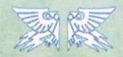

<!-- A0041-B0112 -->

原译文

Armoured Vehicle Insignia 装甲载具徽章

**校订译文**

Armoured Vehicle Insignia 装甲载具徽章

<!-- /A0041-B0112 -->

<!-- A0041-B0113 图片 -->
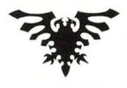

<!-- A0041-B0114 -->

原译文

Another common design 另一种常见设计

**校订译文**

Another common design 另一种常见设计

<!-- /A0041-B0114 -->

<!-- A0041-B0115 图片 -->
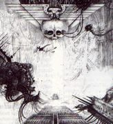

<!-- A0041-B0116 -->

原译文

Above the Golden Throne 在黄金王座上

**校订译文**

Above the Golden Throne 在黄金王座上

<!-- /A0041-B0116 -->

<!-- A0041-B0117 图片 -->
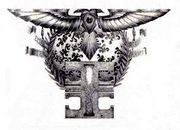

<!-- A0041-B0118 -->

原译文

As used by the Inquisition 被审判庭使用

**校订译文**

As used by the Inquisition 被审判庭使用

<!-- /A0041-B0118 -->

<!-- A0041-B0119 图片 -->
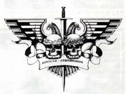

<!-- A0041-B0120 -->

原译文

As used by the Officio Assassinorum 被刺客庭使用

**校订译文**

As used by the Officio Assassinorum 被刺客庭使用

<!-- /A0041-B0120 -->

<!-- A0041-B0121 图片 -->
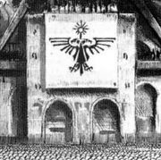

<!-- A0041-B0122 -->

原译文

On a building 在建筑上

**校订译文**

On a building 在建筑上

<!-- /A0041-B0122 -->

<!-- A0041-B0123 图片 -->
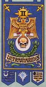

<!-- A0041-B0124 -->

原译文

As used on the standard of the 2nd Company of the Ultramarines 被极限战士第二连队的旗帜使用

**校订译文**

As used on the standard of the 2nd Company of the Ultramarines 被极限战士第二连队的旗帜使用

<!-- /A0041-B0124 -->

<!-- A0041-B0125 图片 -->
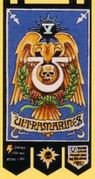

<!-- A0041-B0126 -->

原译文

As used on the standard of the 5th Company of the Ultramarines 被极限战士第五连队的旗帜使用

**校订译文**

As used on the standard of the 5th Company of the Ultramarines 被极限战士第五连队的旗帜使用

<!-- /A0041-B0126 -->

<!-- A0041-B0127 图片 -->
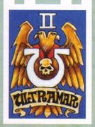

<!-- A0041-B0128 -->

原译文

As used by the second Dreadnought of the 1st Company of the Ultramarines 被极限战士第一连队的第二名无畏使用

**校订译文**

As used by the second Dreadnought of the 1st Company of the Ultramarines 被极限战士第一连队的第二名无畏使用

<!-- /A0041-B0128 -->

<!-- A0041-B0129 图片 -->
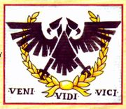

<!-- A0041-B0130 -->

原译文

Imperial Fief Badge 帝国封地徽章

**校订译文**

Imperial Fief Badge 帝国封地徽章

<!-- /A0041-B0130 -->

<!-- A0041-B0131 图片 -->
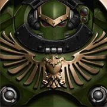

<!-- A0041-B0132 -->

原译文

The Saturn Saturnine Aquila is placed on the breastplates of Saturnine Pattern Terminator Armour 土星的土星天鹰被放在土星型终结者盔甲的胸甲上

**校订译文**

The Saturn Saturnine Aquila is placed on the breastplates of Saturnine Pattern Terminator Armour 土星天鹰饰于土星型终结者盔甲的胸甲

**校注：** 英文图注 Saturn Saturnine 有重复嫌疑。英文保留原样，中文只表达可确认的土星型盔甲与天鹰纹饰。

<!-- /A0041-B0132 -->

<!-- A0041-B0133 图片 -->
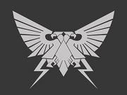

<!-- A0041-B0134 -->

原译文

Great Crusade-era Aquila which incorporates the lightning bolts of the Raptor Imperialis 大远征时期的天鹰，融合了帝国猛禽的闪电

**校订译文**

Great Crusade-era Aquila which incorporates the lightning bolts of the Raptor Imperialis 大远征时期的天鹰，融合了帝国猛禽的闪电

<!-- /A0041-B0134 -->

<!-- A0041-B0135 -->
## Trivia 琐事

<!-- /A0041-B0135 -->

<!-- A0041-B0136 -->
**英文原文**

Aquila simply is the Latin and Romance languages word for eagle.

<!-- /A0041-B0136 -->

<!-- A0041-B0137 -->

原译文

天鹰是拉丁语和罗马语中鹰的单词。

**校订译文**

Aquila 是拉丁语及部分罗曼语中表示“鹰”的词。

<!-- /A0041-B0137 -->

<!-- A0041-B0138 -->
**英文原文**

Double-headed eagles are or have been used in many different contexts throughout history: "In heraldry and vexillology, the double-headed eagle (or double-eagle) is a charge associated with the concept of Empire. Most modern uses of the symbol are directly or indirectly associated with its use by the Byzantine Empire, whose use of it represented the Empire's dominion over the Near East and the West."

<!-- /A0041-B0138 -->

<!-- A0041-B0139 -->

原译文

双头鹰在历史上的许多不同背景下都有使用：“在纹章学和旗帜学中，双头鹰（或双鹰）是一种与帝国概念相关的标记。该符号的大多数现代用法都与拜占庭帝国的直接或间接使用相关，拜占庭帝国对它的使用代表了帝国对近东和西方的统治。”

**校订译文**

双头鹰在历史上的许多不同背景下都有使用：“在纹章学和旗帜学中，双头鹰（或双鹰）是一种与帝国概念相关的标记。该符号的大多数现代用法都与拜占庭帝国的直接或间接使用相关，拜占庭帝国对它的使用代表了帝国对近东和西方的统治。”

<!-- /A0041-B0139 -->

<!-- A0041-B0140 -->
**英文原文**

Modern day users of the emblem are as diverse as Albania, Serbia, Montenegro and Russia, the Hellenic Army, different Orthodox Christian Churches and also cities such as Toledo (Spain), Velletri (Italy), Rijeka (Croatia) or Konya (Turkey) to name but a few.

<!-- /A0041-B0140 -->

<!-- A0041-B0141 -->

原译文

该徽章的现代使用者多种多样，包括阿尔巴尼亚、塞尔维亚、黑山和俄罗斯、希腊军队、不同的东正教教堂，以及托莱多（西班牙）、韦勒特里（意大利）、里耶卡（克罗地亚）或科尼亚（土耳其）等城市。

**校订译文**

本条目列举的现代使用者包括阿尔巴尼亚、塞尔维亚、黑山、俄罗斯、希腊陆军、不同的东正教会，以及西班牙的托莱多、意大利的韦勒特里、克罗地亚的里耶卡和土耳其的科尼亚等城市。

<!-- /A0041-B0141 -->

<!-- A0041-B0142 -->
## Notes 注释

<!-- /A0041-B0142 -->

<!-- A0041-B0143 -->
### Note 1 注释1

<!-- /A0041-B0143 -->

<!-- A0041-B0144 -->
**英文原文**

Since the word Aquila simply means "eagle" special attention should be paid to the exact context and wording of sources. Sometimes Aquila, Eagle or Imperial Eagle might refer to the double-headed symbol, but sometimes it might also denote a normal, one-headed eagle.

<!-- /A0041-B0144 -->

<!-- A0041-B0145 -->

原译文

由于天鹰一词的意思只是“鹰”，因此应特别注意来源的确切上下文和措辞。有时天鹰、鹰或帝国鹰可能指双头标志，但有时也可能表示正常的单头鹰。

**校订译文**

由于天鹰一词的意思只是“鹰”，因此应特别注意来源的确切上下文和措辞。有时天鹰、鹰或帝国鹰可能指双头标志，但有时也可能表示正常的单头鹰。

<!-- /A0041-B0145 -->

<!-- A0041-B0146 -->
### Note 2 注释2

<!-- /A0041-B0146 -->

<!-- A0041-B0147 -->
**英文原文**

Due to the lack of supplies during the Horus Heresy the different marks of Power Armour including older ones were used throughout the conflict and even thereafter. In addition older marks came to be associated with the history or past deeds and are therefore still used and much sought after up to current times. Since these images are not precisely dated it is impossible to say if the use of the Aquila was a constant or temporary feature or when it started.

<!-- /A0041-B0147 -->

<!-- A0041-B0148 -->

原译文

由于荷鲁斯叛乱时期缺乏补给，在整个冲突期间甚至之后都使用了不同的动力盔甲标志，包括旧的标志。此外，旧的标志与历史或过去的行为有关，因此直到现在仍被使用和追捧。由于这些图像没有精确的日期，因此无法确定天鹰的使用是持续的还是暂时的，或者是什么时候开始的。

**校订译文**

荷鲁斯之乱期间物资短缺，各型动力甲——包括较旧型号——在整个战争中乃至战后都继续使用。旧型甲还会因其历史或往昔功勋受到珍视，至今仍有人使用和搜求。由于这些图像没有确切年代，无法仅凭它们判断天鹰是否始终用于某型盔甲、只是暂时出现，或究竟从何时开始使用。

<!-- /A0041-B0148 -->

<!-- A0041-B0149 -->
## Conflicting sources 来源冲突

<!-- /A0041-B0149 -->

<!-- A0041-B0150 -->
**英文原文**

The image of the Aquila in Warhammer 40,000: Rogue Trader relatively clearly shows that the inscription "Adeptus Astra Telepathica" is connected to the left wing and not to the sighted head of the eagle. But The Inquisition (Background Book) unequivocally states that when "depicted in correct detail" the sighted head represents the "Adeptus Astra Telepathica". Therefore it could be assumed that the image in Rogue Trader is incorrect. But on the other hand The Inquisition does not mention the left wing at all.

<!-- /A0041-B0150 -->

<!-- A0041-B0151 -->

原译文

《战锤40000：行商浪人》中的天鹰图像相对清楚地表明，铭文“星语庭”与鹰的左翼有关，而不是与鹰的可视之首有关。但《审判庭》（背景书）明确指出，当“以正确的细节描绘”时，有可视之首代表“星语庭”。因此，可以假设行商浪人中的图像不正确。但另一方面，《审判庭》根本没有提到左翼。

**校订译文**

《战锤 40,000：行商浪人》中的天鹰示意图，较清楚地将“Adeptus Astra Telepathica”（星语庭）标注连向左翼，而非有视力的鹰首；《审判庭》背景书却明确说，天鹰在“细节绘制正确”时，有视力的一首代表星语庭。因此，可以推测《行商浪人》的图示有误；但另一方面，《审判庭》一书根本未提左翼，故这一冲突仍不能完全确定。

<!-- /A0041-B0151 -->

本篇核心术语与暂定项

以下列出本篇出现的英文原形及核心术语表用词。同形词可能指不同对象，具体词义以本篇正文和校注为准；单复数、别名和仅见于图注的名称可能尚未列入。完整候选见[术语表](../../术语表/双语术语候选.csv)。

| 英文 | 采用中文 | 状态 |
| --- | --- | --- |
| Space Marines | 星际战士 | 官方已核对 |
| Adeptus Custodes | 帝皇禁军 | 官方已核对 |
| Adeptus Mechanicus | 机械修会 | 官方已核对 |
| Astra Militarum | 星界军 | 官方已核对 |
| Imperial Guard | 帝国卫队 | 暂定·语境区分 |
| Horus Heresy | 荷鲁斯之乱 | 官方已核对 |
| Adeptus Astronomica | 星炬庭 | 暂定 |
| Adeptus Astra Telepathica | 星语庭 | 暂定 |
| Warp | 亚空间 | 官方已核对 |
| Inquisition | 审判庭 | 暂定 |
| Imperium of Man | 人类帝国 | 官方已核对 |
| Imperium | 帝国 | 暂定·简称 |
| Mechanicum | 机械教 | 暂定·历史称谓 |
| Cult Mechanicus | 机械教派 | 暂定·概念区分 |
| History | 历史 | 编辑用语已统一 |
| Administratum | 内政部 | 暂定 |
| Rogue Trader | 行商浪人 | 暂定 |
| Emperor of Mankind | 人类帝皇 | 暂定 |
| Emperor | 帝皇 | 官方已核对 |
| Primarch | 原体 | 官方已核对 |
| Ecclesiarchy | 国教会 | 暂定 |
| Adeptus Arbites | 法务部 | 暂定 |
| Emperor's Children | 帝皇之子 | 官方已核对 |
| Terra | 泰拉 | 暂定·官方待核 |
| Horus | 荷鲁斯 | 暂定·官方待核 |
| Fulgrim | 福格瑞姆 | 官方已核对 |
| COG | 机灵 | 暂定·官方待核 |
| Imperial Cult | 帝皇信仰 | 暂定·官方待核 |
| Unification Wars | 统一战争 | 暂定·官方待核 |
| Mars | 火星 | 暂定·官方待核 |
| Aquila | 天鹰 | 暂定·官方待核 |
| Sign of the Aquila | 天鹰礼 | 暂定·官方待核 |
| Sign of the Cog | 齿轮礼 | 暂定·官方待核 |
| Aquila Token | 天鹰徽记 | 暂定·官方待核 |
| Moebian Domain | 莫比安领 | 暂定·官方待核 |
| Master | 导师（审判庭职衔）／舰务官（舰员职务） | 语境定译·官方待核 |
| Power Armour | 动力盔甲 | 暂定·官方待核 |
| Space Marine | 星际战士 | 暂定·官方待核 |
| Powers | 能天使 | 暂定·官方待核 |
| Dominion | 主天使 | 暂定·官方待核 |
| Ruinous Powers | 毁灭诸力 | 暂定·官方待核 |
| Imperialis | 帝国徽记 | 暂定·官方待核 |
| Branded | 烙印者 | 暂定·官方待核 |
| Aquilae | 天鹰学派 | 暂定·官方待核 |
| Sameter | 萨米特 | 暂定·官方待核 |
| Raptor Imperialis | 帝国猛禽 | 暂定·官方待核 |
| Pax Imperialis | 帝国治世 | 暂定·官方待核 |
| Defiance | 反抗号 | 暂定·官方待核 |
| claw | 利爪分队 | 暂定·官方待核 |
| Warhammer 40,000: Rogue Trader | 战锤40000：行商浪人 | 暂定·官方待核 |

