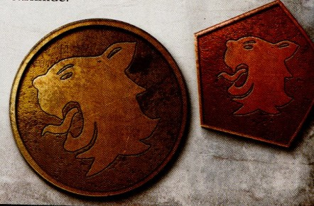
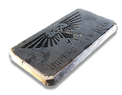
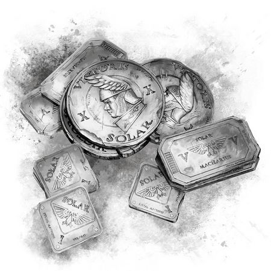
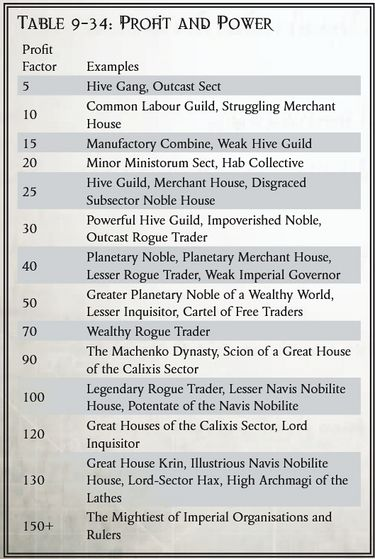

# 0042 帝国货币 Imperial Currencies

精校状态：中文行文已逐段精校，部分术语仍为暂定

分类：通用概念 / 帝国 Imperium

原文来源：https://www.bilibili.com/opus/1177943352777113625

原作者：帝国神选罐头

原文时间：2026年03月10日 07:41

[返回分类目录](目录.md) · [全书目录](../../目录.md)

<!-- A0042-B0001 -->
**英文原文**

Imperial Currencies are the various different types of money that are used across the Imperium. While human life itself is the only universal currency in the Imperium, (with contracts for bartered goods second) most monetary currencies only retain their value within their specific locale, such as a select planet or system. What primarily drives goods and services between stars is barter, favours, debts, and obligations.

<!-- /A0042-B0001 -->

<!-- A0042-B0002 -->

原译文

帝国货币是帝国中使用的各种不同类型的货币。虽然人命本身是帝国中唯一的通用货币（易货合同排在第二位），但大多数货币只在其特定地区（如选定的行星或星系）保留其价值。主要驱动群星之间商品和服务的是易货、支持、债务和职责。

**校订译文**

帝国货币泛指帝国各地流通的各种钱币和支付凭证。若说有什么在整个帝国都能通用，那就是人命本身，其次才是以货物交换为基础的契约。大多数货币仅在某颗行星或某个星系等特定范围内保有价值。星际商品与服务的流通，主要依靠以物易物、人情、债务和应履行的义务。

<!-- /A0042-B0002 -->

<!-- A0042-B0003 图片 -->

<!-- A0042-B0004 -->

原译文

Examples of currency used on Lyubov 柳波夫上使用的货币示例

**校订译文**

Examples of currency used on Lyubov 柳波夫上使用的货币示例

<!-- /A0042-B0004 -->

<!-- A0042-B0005 -->
## Overview 概述

<!-- /A0042-B0005 -->

<!-- A0042-B0006 -->
**英文原文**

Generally, currency consists of whatever objects are a common exchange unit in a given locale - government coins, intangible ledger-data, ammunition, gold nuggets, even shells picked from a beach. The currencies of mankind are as varied as the worlds of the Galaxy.

<!-- /A0042-B0006 -->

<!-- A0042-B0007 -->

原译文

一般来说，货币由特定地区常见的交换单元组成 — 政府硬币、无形账本数据、弹药、金块，甚至是从海滩上捡来的贝壳。人类的货币就像银河系的世界一样多种多样。

**校订译文**

只要某种东西在当地被普遍接受为交换单位，它就能充当货币：政府铸币、账目数据、弹药、金块，甚至沙滩上捡来的贝壳。人类货币的种类，如银河诸世界一样繁多。

<!-- /A0042-B0007 -->

<!-- A0042-B0008 -->
**英文原文**

A major trade hub such as Port Wander, situated on the border between the Calixis Sector and Koronus Expanse, might see a hundred different currencies brought in by merchants and Rogue Traders - even some that were issued by said Rogue Traders, for many such men and women of power wish to see their face upon coins and parchment notes. In such a place, even the money-changers of the Administratum may prove corrupt or simply busy, and thus a mix of currencies continues to be used.

<!-- /A0042-B0008 -->

<!-- A0042-B0009 -->

原译文

位于卡利西斯星区和克罗努斯扩区交界处的漫游港等主要贸易中心可能会看到商人和行商浪人带来一百种不同的货币，甚至有些是由行商浪人发行的，因为许多这样的有权势的男女希望在硬币和纸币上看到他们的脸。在这样一个地方，即使是内务部的货币交换者也可能被证明是腐败的或只是很忙，因此继续使用多种货币。

**校订译文**

位于卡利西斯星区与克洛诺斯广域交界处的漫游港等大型贸易枢纽，可能汇集商人和行商浪人带来的上百种货币，其中还有行商浪人自行发行的币券——不少权势人物都希望自己的头像出现在硬币或纸钞上。在这种地方，连内政部的货币兑换人员也可能腐败，或只是忙不过来，于是各种货币仍混杂流通。

<!-- /A0042-B0009 -->

<!-- A0042-B0010 -->
**英文原文**

Human systems isolated from the Imperium may have varied currency within their own worlds. While some like Nadeush are able to maintain paper currency and scrip backed by the wealth of the local Maraj noble families, others like war-torn Zayth has each mobile hive city circulating their own currencies of stamped ingots of precious metals hung upon loops of silver wire, and still other worlds have resorted to barter with both parties being heavily armed.

<!-- /A0042-B0010 -->

<!-- A0042-B0011 -->

原译文

与帝国隔绝的人类星系可能在自己的世界里有不同的货币。虽然像纳杜什这样的能够用当地马拉吉贵族家族的财富来维持纸币和代券，但像饱受战争蹂躏的扎伊特这样的其他则让每个移动巢都城市流通自己的货币，这些货币是贵金属的冲压锭块被悬挂在银丝制成的环上，还有一些世界则采取了易货的方式，双方都全副武装。

**校订译文**

与帝国隔绝的人类星系，也可能在各自世界中使用不同货币。纳杜什以当地马拉吉贵族家族的财富为担保，维持纸币和代券的价值；战乱中的扎伊特则由每座移动巢都发行自己的货币，将打有印记的贵金属锭串在银丝环上。还有些世界退回以物易物，交易双方都全副武装。

<!-- /A0042-B0011 -->

<!-- A0042-B0012 -->
**英文原文**

In the void of space, pirates, often the descendants of Imperial outcasts and refugees, may understand the value of more standardized Imperial currency - yet to use these for trade without a display of force or bloodshed is often seen as a weakness. More ruthless pirates and Corsairs might trade in hacksilver, technology, ammunition, even slaves - with even darker rumours abounding of trapped souls and bottled life.

<!-- /A0042-B0012 -->

<!-- A0042-B0013 -->

原译文

在虚空空域，海盗，通常是帝国弃民和难民的后代，可能会理解更标准化的帝国货币的价值，但在不展示武力或流血的情况下将其用于贸易往往被视为一种软弱。更无情的海盗和私掠者可能会交易碎银、技术、弹药，甚至奴隶 — 甚至还有更黑暗的谣言，说有受困灵魂和瓶装生命。

**校订译文**

虚空中的海盗，往往是帝国弃民或难民的后裔，可能知道较标准化的帝国货币有何价值；但若不炫耀武力、不流点血就用钱完成交易，常会被视为软弱。更凶残的海盗与私掠者会交易碎银、技术、弹药乃至奴隶，甚至还有更黑暗的传闻，称他们买卖囚禁的灵魂和装瓶的生命。

<!-- /A0042-B0013 -->

<!-- A0042-B0014 -->
**英文原文**

Despite all this, when the time comes, a more standardized Segmentum-wide currency such as Thrones will be what is used to assess and evaluate the value of goods and materials for the Imperial Tithe in comparison to other Imperial factions.

<!-- /A0042-B0014 -->

<!-- A0042-B0015 -->

原译文

尽管如此，当时机成熟时，一种更标准化的星域宽度货币，如王座币，将用于评定和评估帝国什一税中商品和物资的价值，并将其与其他帝国派系进行比较。

**校订译文**

尽管如此，在核算帝国什一税、比较各方缴纳物资的价值时，仍会采用王座币等在整个星域通用、较为标准化的货币。

<!-- /A0042-B0015 -->

<!-- A0042-B0016 -->
**英文原文**

Listed here are some examples of currencies in the Imperium, both those widely used or those more specific to smaller locations.

<!-- /A0042-B0016 -->

<!-- A0042-B0017 -->

原译文

这里列出了帝国货币的一些例子，既有广泛使用的货币，也有更特定于较小地区的货币。

**校订译文**

这里列出了帝国货币的一些例子，既有广泛使用的货币，也有更特定于较小地区的货币。

<!-- /A0042-B0017 -->

<!-- A0042-B0018 -->
## List 列表

<!-- /A0042-B0018 -->

<!-- A0042-B0019 -->
**英文原文**

Aquila Pieces - Coins used during the Great Crusade and Horus Heresy in various denominations, including a Five Aquila Piece, which was about the same size as a Throne.

<!-- /A0042-B0019 -->

<!-- A0042-B0020 -->

原译文

天鹰硬币 - 在大远征和荷鲁斯叛乱期间使用的各种面额的硬币，包括一种五天鹰硬币，其大小与王座币大致相同。

**校订译文**

天鹰硬币 - 在大远征和荷鲁斯之乱期间使用的各种面额的硬币，包括一种五天鹰硬币，其大小与王座币大致相同。

<!-- /A0042-B0020 -->

<!-- A0042-B0021 -->
**英文原文**

Aquilas - Currency used in the Moebian Domain in present day M42, also known as Moebian Aquilas. Rectangular pieces of metal stamped with the Aquila iconography and text "Imperium of Man". Akin to a large coin.

<!-- /A0042-B0021 -->

<!-- A0042-B0022 -->

原译文

天鹰币 - 如今M42在莫比安领域使用的货币，也被称为莫比安天鹰。印有天鹰图像和文字“人类帝国”的矩形金属片。像一枚大硬币。

**校订译文**

天鹰币——第 42 千年在莫比安领使用，又称莫比安天鹰币。它是压有天鹰图案和“人类帝国”字样的长方形金属片，类似一枚大号硬币。

<!-- /A0042-B0022 -->

<!-- A0042-B0023 图片 -->

<!-- A0042-B0024 -->

原译文

Moebian Aquila 莫比安天鹰

**校订译文**

Moebian Aquila 莫比安天鹰币

<!-- /A0042-B0024 -->

<!-- A0042-B0025 -->
**英文原文**

Bone chips - The inhabitants of Thaur trade with bone chips believed to be the work of venerable carving-masters.

<!-- /A0042-B0025 -->

<!-- A0042-B0026 -->

原译文

骨片 - 索尔的居民用骨片进行贸易，据信这是德高望重的雕刻大师的作品。

**校订译文**

骨片 - 索尔的居民用骨片进行贸易，据信这是德高望重的雕刻大师的作品。

<!-- /A0042-B0026 -->

<!-- A0042-B0027 -->
**英文原文**

Caligari Credits - Used on the Imperial worlds of the Caligari Sector.

<!-- /A0042-B0027 -->

<!-- A0042-B0028 -->

原译文

卡利加里信用币 - 用于卡利加里星区的帝国世界。

**校订译文**

卡利加里信用币 - 用于卡利加里星区的帝国世界。

<!-- /A0042-B0028 -->

<!-- A0042-B0029 -->
**英文原文**

Credits - Used on Necromunda in M41.

<!-- /A0042-B0029 -->

<!-- A0042-B0030 -->

原译文

信用币 - 用于M41中的涅克罗蒙达。

**校订译文**

信用币 - 用于M41中的涅克罗蒙达。

<!-- /A0042-B0030 -->

<!-- A0042-B0031 -->
**英文原文**

Crowns - Used from the Great Crusade to M41 on Karoscura.

<!-- /A0042-B0031 -->

<!-- A0042-B0032 -->

原译文

王冠币 - 用于从大远征到M41的卡洛斯卡。

**校订译文**

王冠币 - 用于从大远征到M41的卡洛斯卡。

<!-- /A0042-B0032 -->

<!-- A0042-B0033 -->
**英文原文**

Ducats - Golden trade coins issued by Navigator Houses able to be used as currency wherever their ships travelled in M41.

<!-- /A0042-B0033 -->

<!-- A0042-B0034 -->

原译文

杜卡特 - 导航者家族发行的黄金贸易硬币，无论他们的舰船在M41中行驶到哪里，都可以用作货币。

**校订译文**

杜卡特——导航员家族发行的黄金贸易币；第 41 千年，其船舰所至之处皆可使用。

<!-- /A0042-B0034 -->

<!-- A0042-B0035 -->
**英文原文**

Estrillian Newmarks - Used on Atraxia. A tarot deck could potentially be bought for as few as 27 Newmarks.

<!-- /A0042-B0035 -->

<!-- A0042-B0036 -->

原译文

埃斯特瑞安纽马克 - 用于阿特拉西亚。一副塔罗牌的价格可能低至27纽马克。

**校订译文**

埃斯特瑞安纽马克 - 用于阿特拉西亚。一副塔罗牌的价格可能低至27纽马克。

<!-- /A0042-B0036 -->

<!-- A0042-B0037 -->
**英文原文**

Gelt - The Blessed Remuneration of Service, or “gelt” as it is commonly called, is the dominant coin used on Juno. Despite being the capital world of the Askellon Sector, it has little value elsewhere in the sector.

<!-- /A0042-B0037 -->

<!-- A0042-B0038 -->

原译文

盖尔特 - 服役的神圣报酬，或通常所说的“金钱”，是朱诺上使用的主要硬币。尽管它是阿斯克隆星区的首都世界，但在该星区的其他地方几乎没有价值。

**校订译文**

盖尔特——正式称“服役神圣酬币”，俗称盖尔特，是朱诺的主要硬币。朱诺虽为阿斯克隆星区首府，这种钱币在星区其他地方却几乎没有价值。

**校注：** Gelt 既可能作钱币泛称，也在本条中指朱诺的特定币种，不能无差别全部改作王座币。

<!-- /A0042-B0038 -->

<!-- A0042-B0039 -->
**英文原文**

Guild Scrip - Guild Scrip, sometimes simply called "scrip", is the standard currency on Desoleum when oath-cog adjustments are insufficient or impractical, or when dealing with offworlders without oath-bindings.

<!-- /A0042-B0039 -->

<!-- A0042-B0040 -->

原译文

行会代币 - 行会代币，有时简称为“代币”，是德索莱姆上的标准货币，当誓言齿轮调整不足或不切实际时，或者在与没有誓言约束的出价人打交道时。

**校订译文**

行会代券——有时简称“代券”，是德索莱姆的一种标准货币。当誓约齿轮上的账目调整不足以结算、难以执行，或交易对象是没有誓约约束的外星来客时，便会使用它。

<!-- /A0042-B0040 -->

<!-- A0042-B0041 -->
**英文原文**

Scrip - Various forms of scrip might be used to pay labourers in place of a local legal currency. These more limited internal currencies are often only valuable aboard a specific ship, guild or other organisation.

<!-- /A0042-B0041 -->

<!-- A0042-B0042 -->

原译文

代券 - 各种形式的代券可用于代替当地法定货币支付劳动者的工资。这些更有限的内部货币通常只在特定的舰船、行会或其他组织上有价值。

**校订译文**

代券 - 各种形式的代券可用于代替当地法定货币支付劳动者的工资。这些更有限的内部货币通常只在特定的舰船、行会或其他组织上有价值。

<!-- /A0042-B0042 -->

<!-- A0042-B0043 -->
**英文原文**

Slates - Used on Alecto. Slates can be both transacted and stored physical slates or digitally via the use of a personal currency wand (data wand). Although these are as valuable as the currency data stored within and are easily stolen. Most of the population relies on chit books and ration tokens.

<!-- /A0042-B0043 -->

<!-- A0042-B0044 -->

原译文

板 - 用于阿勒克图。板可以通过使用个人货币棒（数据棒）进行交易和存储 — 物理板或数字管。尽管这些数据与存储在其中的货币数据一样有价值，而且很容易被盗。大多数人依靠条册和配给券。

**校订译文**

板币——阿勒克图使用的货币，可储存、转移于实体数据板，也可通过个人货币棒（数据棒）进行电子存储和交易。这些载体的价值取决于其中记录的金额，而且容易被盗。大多数居民仍依靠票券册和配给代币。

<!-- /A0042-B0044 -->

<!-- A0042-B0045 -->
**英文原文**

Solars - Used on Voll, a world within the Macharian Sector. Golden solars are used as Service Identity Tags for Guardsmen regiments from said sector.

<!-- /A0042-B0045 -->

<!-- A0042-B0046 -->

原译文

太阳币 - 用于马卡里安星区的沃尔世界。黄金太阳币被用作该星区卫兵兵团的服役身份标签。

**校订译文**

太阳币——马卡里安星区的沃尔世界所用货币。该星区的帝国卫队兵团还将金质太阳币用作军人身份牌。

<!-- /A0042-B0046 -->

<!-- A0042-B0047 图片 -->

<!-- A0042-B0048 -->

原译文

Solars 太阳币

**校订译文**

Solars 太阳币

<!-- /A0042-B0048 -->

<!-- A0042-B0049 -->
**英文原文**

Sabulorb shekels - Used on Sabulorb.

<!-- /A0042-B0049 -->

<!-- A0042-B0050 -->

原译文

萨布尔奥布谢克尔 - 用于萨布尔奥布。

**校订译文**

萨布尔奥布谢克尔 - 用于萨布尔奥布。

<!-- /A0042-B0050 -->

<!-- A0042-B0051 -->
**英文原文**

Terces - Silver coin, used on Medusa in M41.

<!-- /A0042-B0051 -->

<!-- A0042-B0052 -->

原译文

特塞斯 - 银币，M41中用于美杜莎。

**校订译文**

特塞斯 - 银币，M41中用于美杜莎。

<!-- /A0042-B0052 -->

<!-- A0042-B0053 -->
**英文原文**

Thrones - Gelt coins that have been used since Horus Heresy, in the Calixis Sector up to present day M41. In the present day it is one of many currencies accepted throughout Segmentum Obscurus and used to measure value for the Imperial Tithe. Each Throne gelt coin is the same size as a Five Aquila Piece.

<!-- /A0042-B0053 -->

<!-- A0042-B0054 -->

原译文

王座币 - 自荷鲁斯叛乱以来，卡利西斯星区一直使用的钱币，直到今天的M41。如今，它是朦胧星域接受的众多货币之一，用于衡量帝国什一税的价值。每枚王座钱币的大小与一枚五天鹰币相同。

**校订译文**

王座币——卡利西斯星区自荷鲁斯之乱时期使用至本段所述的第 41 千年的钱币。它是朦胧星域广泛接受的多种货币之一，也用于核算帝国什一税的价值。每枚王座币的大小与五天鹰币相同。

<!-- /A0042-B0054 -->

<!-- A0042-B0055 -->
## Profit Factor 利润因子

<!-- /A0042-B0055 -->

<!-- A0042-B0056 -->
**英文原文**

The great wealth afforded by a Rogue Trader, coupled with the sheer differences in local currencies, makes it impractical for them to make regular use of something so trivial as currency. The counting of currency is thought of as work more befitting scribes and commoners. Rogue traders stand far, far above the tyranny of coin that causes most men to check their purse whether they can afford their next meal. Whether it is acquiring a relic weapon, yet another mercenary company, a thousand lasguns, a set rare gems or a vortex torpedo, Rogue Traders find it more convenient to measure their wealth in terms of Profit Factor, calculated by his or her loyal scribes. Profit Factor can be used to measure the relative power of a Rogue Trader's dynasty, particularly compared to other Imperial factions.

<!-- /A0042-B0056 -->

<!-- A0042-B0057 -->

原译文

行商浪人提供的巨大财富，加上当地货币的巨大差异，使他们无法经常使用货币这样微不足道的东西。货币计数被认为是更适合文士和平民的工作。行商浪人远远超过了硬币的专制，导致大多数人检查他们的资金，看他们是否能负担得起下一顿饭。无论是获得一件圣物武器、或另一个雇佣兵连队、一千支激光枪、一套稀有宝石还是一枚漩涡鱼雷，行商浪人都发现用他或她忠诚的文士计算的利润因子来衡量他们的财富更方便。利润因子可用于衡量行商浪人的王朝的相对力量，特别是与其他帝国派系相比。

**校订译文**

行商浪人的财富极其庞大，各地货币又差异悬殊，日常逐笔使用钱币并不现实。在他们看来，数钱更适合交给文书或平民；他们早已远离普通人那种每吃一顿饭都要先掂量钱袋的处境。无论是购入一件圣物武器、再雇一支佣兵连，还是买下一千支激光枪、一套稀有宝石或一枚涡旋鱼雷，行商浪人都更习惯用忠诚文书计算出的“利润因子”衡量财力。它也能用于比较行商浪人家族与其他帝国势力的相对实力。

<!-- /A0042-B0057 -->

<!-- A0042-B0058 图片 -->

<!-- A0042-B0059 -->

原译文

A table with examples/estimates of the average Profit Factor equivalents for various factions and leaders in the Imperium 帝国中不同派系和领导人的平均利润因子等值示例/估计表

**校订译文**

A table with examples/estimates of the average Profit Factor equivalents for various factions and leaders in the Imperium 帝国中不同派系和领导人的平均利润因子等值示例/估计表

<!-- /A0042-B0059 -->

本篇核心术语与暂定项

以下列出本篇出现的英文原形及核心术语表用词。同形词可能指不同对象，具体词义以本篇正文和校注为准；单复数、别名和仅见于图注的名称可能尚未列入。完整候选见[术语表](../../术语表/双语术语候选.csv)。

| 英文 | 采用中文 | 状态 |
| --- | --- | --- |
| Horus Heresy | 荷鲁斯之乱 | 官方已核对 |
| Navigator | 导航员 | 官方已核对 |
| Imperium of Man | 人类帝国 | 官方已核对 |
| Imperium | 帝国 | 暂定·简称 |
| Notes | 注释 | 编辑用语已统一 |
| Administratum | 内政部 | 暂定 |
| Rogue Trader | 行商浪人 | 暂定 |
| Necromunda | 涅克罗蒙达 | 暂定·官方待核 |
| Alecto | 阿勒克图 | 暂定·官方待核 |
| Great Crusade | 大远征 | 暂定·官方待核 |
| Horus | 荷鲁斯 | 暂定·官方待核 |
| COG | 机灵 | 暂定·官方待核 |
| Segmentum Obscurus | 朦胧星域 | 暂定·官方待核 |
| Segmentum | 星域 | 暂定·官方待核 |
| Sector | 星区 | 暂定·官方待核 |
| Obscurus | 朦胧星 | 暂定·官方待核 |
| Medusa | 美杜莎 | 暂定·官方待核 |
| Aquila | 天鹰 | 暂定·官方待核 |
| Thrones | 王座币 | 暂定·官方待核 |
| Guild Scrip | 行会代券 | 暂定·官方待核 |
| Scrip | 代券 | 暂定·官方待核 |
| Gelt | 盖尔特 | 暂定·官方待核 |
| Slates | 板币 | 暂定·官方待核 |
| Profit Factor | 利润因子 | 暂定·官方待核 |
| Port Wander | 漫游港 | 暂定·官方待核 |
| Koronus Expanse | 克洛诺斯广域 | 暂定·官方待核 |
| Moebian Domain | 莫比安领 | 暂定·官方待核 |
| Imperial Tithe | 帝国什一税 | 暂定·官方待核 |
| Torpedo | 鱼雷 | 暂定·官方待核 |
| Sabulorb | 萨博洛布 | 暂定·官方待核 |
| Scribes | 抄写员 | 暂定·官方待核 |
| System | 星系（恒星系统） | 暂定·官方待核 |
| Caligari Sector | 卡利加利星区 | 暂定·官方待核 |
| Calixis Sector | 卡利西斯星区 | 暂定·官方待核 |
| Hive City | 巢都城市 | 暂定·官方待核 |
| Thaur | 塔尔 | 暂定·官方待核 |
| Vortex Torpedo | 涡流鱼雷 | 暂定·官方待核 |

