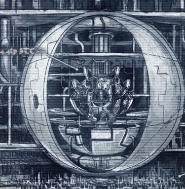

# 0052 标准模板构造 Standard Template Construct

精校状态：中文行文已逐段精校，部分术语仍为暂定

分类：通用概念 / 帝国 Imperium

原文来源：https://www.bilibili.com/opus/1192961526255845377

原作者：帝国神选罐头

原文时间：2026年04月19日 19:00

[返回分类目录](目录.md) · [全书目录](../../目录.md)

<!-- A0052-B0001 -->
**英文原文**

The Standard Template Construct (STC) systems were artificial intelligences created during the Dark Age of Technology (M21 - M23). They are said to have contained the entirety of human technological knowledge up to that point. Following the Dark Age of Technology, the systems became increasingly rare, until becoming lost entirely. In the current Age of the Imperium, the ancient technological knowledge survives only because it was preserved in STC hard copies.

<!-- /A0052-B0001 -->

<!-- A0052-B0002 -->

原译文

标准模板构造（STC）系统是在黑暗技术时代（M21-M23）创建的人工智能。据说，到那时为止，它们已经包含了人类所有的技术知识。在黑暗技术时代之后，这些系统变得越来越罕见，直到完全消失。在当前的帝国时代，古代技术知识之所以幸存下来，只是因为它被保存在STC的硬拷贝中。

**校订译文**

标准模板构造（STC）系统是黑暗科技时代（第 21—23 千年）创造的人工智能，据说囊括了当时人类全部技术知识。原文概述称，此后这类系统日渐稀少，最终完全失落；帝国时代的古老技术知识，只因保存在 STC 实体副本中才得以传承。

**校注：** 英文开篇概括“全部失落、只剩硬拷贝”，后文却列出多例完整系统。译文以“人类已知技术体系中失落”呈现一般状况，完整系统的例外见后文；STC 在本篇同时指系统、模板和残片，应按语境区分。

<!-- /A0052-B0002 -->

<!-- A0052-B0003 图片 -->

<!-- A0052-B0004 -->

原译文

The STC core at the heart of House Van Saar's stronghold in Necromunda's Hive Primus STC核心位于凡·萨尔家族在涅克罗蒙达的一号巢都的据点的中心

**校订译文**

The STC core at the heart of House Van Saar's stronghold in Necromunda's Hive Primus STC核心位于凡·萨尔家族在涅克罗蒙达的一号巢都的据点的中心

<!-- /A0052-B0004 -->

<!-- A0052-B0005 -->
## Description 描述

原题：Description 描绘

<!-- /A0052-B0005 -->

<!-- A0052-B0006 -->
**英文原文**

An intact STC system is described as a "machine, a vast device made of brilliant white ceramics, silver piping, chromium chambers". The Constructor is controlled by a panel beside it, with amber lights to show its activation. When activated, cowlings near the floor vent steam. When a new creation is finished, a hatch on its side opens up to allow the creation to be retrieved.

<!-- /A0052-B0006 -->

<!-- A0052-B0007 -->

原译文

一个完整的STC系统被描述为“机器，一个由明亮的白色陶瓷、银色管道、铬室组成的巨大装置”。构造器由其旁边的面板控制，琥珀色灯显示其激活状态。激活后，地板附近的整流罩会排出蒸汽。当新创建完成时，其侧面会打开，以允许检索创建。

**校订译文**

一套完整的 STC 系统被描述为巨大的机器，由明亮的白色陶瓷、银色管道和铬制舱室构成。旁侧控制面板以琥珀色灯光显示启动状态。机器运转时，近地面护罩会排出蒸汽；产品制成后，侧面舱门打开，供人取出。

<!-- /A0052-B0007 -->

<!-- A0052-B0008 -->
**英文原文**

STCs come in all shapes and sizes, with many not even being machines at all but rather simple blueprints or pieces of fragmented digital data. Others are huge mechanical constructs that can hold an array of construction templates while directly producing working operational prototypes. STCs seem to have some degree of artificial intelligence, as the construct on Necromunda orchestrated a series of industrial sabotage actions against House Hera after they unwittingly launched a hacking attack against it.

<!-- /A0052-B0008 -->

<!-- A0052-B0009 -->

原译文

STC有各种形状和大小，其中许多甚至根本不是机器，而是简单的蓝图或零碎的数字数据。其他一些是巨大的机械结构，可以容纳一系列结构模板，同时直接生产可工作的操作原型。STC似乎具有一定程度的人工智能，因为涅克罗蒙达上的构造在赫拉家族无意中对其发动黑客攻击后，策划了一系列针对赫拉家族的工业破坏行动。

**校订译文**

STC 的形态和规模各不相同，许多所谓 STC 根本不是机器，只是蓝图或零碎的数字资料；另一些则是巨型机械，既保存大量制造模板，也能直接生产可运作的原型。部分 STC 似乎具有一定自主智能：涅克罗蒙达的一套构造系统，在赫拉家族无意中对它发动黑客攻击后，曾策划一系列针对该家族的工业破坏行动。

<!-- /A0052-B0009 -->

<!-- A0052-B0010 -->
## History 历史

<!-- /A0052-B0010 -->

<!-- A0052-B0011 -->
**英文原文**

The Dark Age of Technology saw the original development of the technology the Imperium is now reliant on, which was encapsulated into the STC systems. Along with the creation of Warp Drive technology and the human mutants known as Navigators, the STC systems were one of the major factors in mankind's expansion outside the solar system and his conquest of the stars. The STC system allowed disparate mankind to maintain a standard level of technology. A complete, functioning STC system was an evolved computer designed to provide construction details for human colonists, enabling them to build efficient shelters, generators and transports without any prior knowledge and using almost any locally available materials. For example, a user could simply ask how to build a house or a tractor and the computer would supply all the necessary plans.

<!-- /A0052-B0011 -->

<!-- A0052-B0012 -->

原译文

黑暗技术时代见证了帝国现在所依赖的技术的最初发展，该技术被封装在STC系统中。随着亚空间驱动技术和被称为导航者的人类变种人的发明，STC系统是人类在太阳系外扩张和征服群星的主要因素之一。STC系统允许不同的人类保持标准的技术水平。一个完整、功能齐全的STC系统是一种进化的计算机，旨在为人类殖民者提供构造细节，使他们能够在没有任何先验知识的情况下，使用几乎任何当地可用的材料，建造高效的庇护所、发电机和运输工具。例如，使用者只需询问如何建造房屋或牵引车，计算机就会提供所有必要的计划。

**校订译文**

帝国如今赖以生存的许多技术，都在黑暗科技时代得到最初发展，并被汇集进 STC 系统。与亚空间驱动技术、导航员的创造一道，STC 是人类走出太阳系、征服群星的关键因素。它让散居各地的人类保持相近的技术标准。一套完整、可运转的 STC 是高度先进的计算机，专为殖民者提供制造方案：即使没有专业知识，他们也能利用几乎任何当地可得的材料，建起实用的住所、发电机和运输工具。使用者只需询问如何建房或制造牵引车，系统便会给出所需的完整图纸。

<!-- /A0052-B0012 -->

<!-- A0052-B0013 -->
## The Age of Strife 纷争时代

<!-- /A0052-B0013 -->

<!-- A0052-B0014 -->
**英文原文**

During the Age of Strife, the STC systems lapsed into disuse and decayed, becoming increasingly unreliable and quirky. On some worlds they were maintained, but most suffered damage by enthusiastic software specialists or subsequent jury-rigging. Hard copies of the information they contained survived much longer, and were frequently copied and passed down from generation to generation.

<!-- /A0052-B0014 -->

<!-- A0052-B0015 -->

原译文

在纷争时代，STC系统逐渐被废弃和衰弱，变得越来越不可靠和古怪。在一些世界上，它们得到了维护，但大多数都受到了热忱的软件专家或随后的临时拼凑的破坏。它们所包含的信息的硬拷贝保存的时间要长得多，并且经常被复制并代代相传。

**校订译文**

纷争时代，STC 系统逐渐闲置、老化，变得不可靠，行为也越发古怪。部分世界继续维护它们，但更多系统被过分热心的软件专家或后来的临时修补损坏。相比之下，系统资料的实体副本保存得更久，不断被抄录、代代相传。

<!-- /A0052-B0015 -->

<!-- A0052-B0016 -->
**英文原文**

Some Imperial historians have theorised that scientists during the Age of Technology foresaw the coming of the Age of Strife, and created the STCs to ensure that their knowledge would not be lost to future generations.

<!-- /A0052-B0016 -->

<!-- A0052-B0017 -->

原译文

一些帝国历史学家提出理论，认为科技时代的科学家预见到了纷争时代的到来，并创建了STC，以确保他们的知识不会被后代遗失。

**校订译文**

一些帝国历史学家提出理论，认为科技时代的科学家预见到了纷争时代的到来，并创建了STC，以确保他们的知识不会被后代遗失。

<!-- /A0052-B0017 -->

<!-- A0052-B0018 -->
## The Age of the Imperium 帝国时代

<!-- /A0052-B0018 -->

<!-- A0052-B0019 -->
**英文原文**

In the Age of the Imperium, working STC systems are practically unknown. The recovery of fragments of an STC or the templates used in one is the primary focus of the Adeptus Mechanicus's quest for knowledge. Part of this quest is also to find, collate and utilise STC print-outs. A functioning STC system is their equivalent to a font of all knowledge (which is exactly what it was intended to be). Ancient recovered print-outs from STC systems are regarded as sacred texts. The Mechanicus strives to recover as much information as possible from them, hoping to find new knowledge, weapons and technologies.

<!-- /A0052-B0019 -->

<!-- A0052-B0020 -->

原译文

在帝国时代，工作的STC系统几乎是未知的。恢复STC的片段或其中使用的模板是机械神教寻求知识的主要重点。这项任务的一部分也是查找、整理和利用STC打印输出。一个正常运作的STC系统相当于所有知识的字模（这正是它的本意）。从STC系统中恢复的古代印刷被视为神圣的文本。机械教努力从他们那里恢复尽可能多的信息，希望找到新的知识、武器和技术。

**校订译文**

帝国时代，能够正常工作的 STC 系统几乎无人知晓。找回 STC 残片或其中的制造模板，是机械修会求知之旅的主要目标，搜寻、整理与利用打印资料也属其中。对修会而言，完整系统就是一切知识的源泉——这也正是它原本的设计目的。修会将找回的古老打印资料奉为圣典，竭力从中还原信息，期望发现新的知识、武器与技术。

<!-- /A0052-B0020 -->

<!-- A0052-B0021 -->
**英文原文**

Probably the most significant find of an STC fragment was by Magos Arkhan Land in M31. This fragment contained the templates for the construction of the now famous Land Raider Main Battle Tank, and the Land Speeder, all named in honour of their discoverer. An intact, functional STC is so rare in the galaxy as to be regarded as almost mythical. Nevertheless, even a rumour that such a system has been found is enough to prompt a Mechanicus expedition to locate it.

<!-- /A0052-B0021 -->

<!-- A0052-B0022 -->

原译文

STC碎片最重要的发现可能是M31的贤者阿坎·兰德。这个碎片包含了建造现在著名的兰德掠袭者战斗坦克和兰德速攻艇的模板，所有这些都是为了纪念它们的发现者而命名的。完整、功能齐全的STC在银河系中非常罕见，几乎被视为神话。然而，即使有传言说已经发现了这样一个系统，也足以促使机械教探索队找到它。

**校订译文**

最重要的发现之一，可能是贤者阿坎·兰德在第 31 千年找到的 STC 残片。其中包括后来著名的兰德掠袭者战车与兰德速攻艇的制造模板，两者均以发现者命名。完整且可运转的 STC 如此罕见，几乎成了传说；即便只传来发现它的风声，也足以促使机械修会组织远征搜寻。

<!-- /A0052-B0022 -->

<!-- A0052-B0023 -->
**英文原文**

According to Mars' archives, Archmagos Dominus Cawl has recovered more STC patterns than any other Magos in history.

<!-- /A0052-B0023 -->

<!-- A0052-B0024 -->

原译文

根据火星的档案，神圣大贤者考尔比历史上任何其他贤者都恢复了更多的STC模版。

**校订译文**

按火星档案记载，统御大贤者考尔找回的 STC 型式，比历史上任何其他贤者都多。

<!-- /A0052-B0024 -->

<!-- A0052-B0025 -->
## Leagues of Votann 沃坦联盟

<!-- /A0052-B0025 -->

<!-- A0052-B0026 -->
**英文原文**

The Leagues of Votann share a common Human ancestry with the Imperium, and as a result their original mining fleets dispatched to the Galactic Core during the Long March possessed a large number of sophisticated STCs. The Votann are able to utilize these STCs to produce a variety of war engines and other types of equipment. Unlike the Imperials, the Votann will improve upon STC designs and use multiple STCs to craft new systems, such as the Sagitaur ATV.

<!-- /A0052-B0026 -->

<!-- A0052-B0027 -->

原译文

沃坦联盟与帝国有着共同的人类祖先，因此，他们在长征期间派往银河系核心的原初采矿舰队拥有大量复杂的STC。沃坦能够利用这些STC生产各种战争引擎和其他类型的设备。与帝国不同，沃坦将改进STC设计，并使用多个STC来制造新系统，如人马座ATV。

**校订译文**

沃坦联盟与帝国拥有共同的人类起源，因此，在长征时期前往银河核心的早期采矿舰队中，也配有大量先进 STC。沃坦联盟能够利用这些系统制造各种战争机器和其他装备。与帝国不同，他们会改进 STC 设计，并将多个模板结合，创造新的系统，例如人马座全地形战车。

<!-- /A0052-B0027 -->

<!-- A0052-B0028 -->
## Ork 欧克蛮人

原题：Ork 欧克

<!-- /A0052-B0028 -->

<!-- A0052-B0029 -->
**英文原文**

It is speculated by Imperial scholars that at a point in the ancient past, the then-dominant Brain Boyz developed their own "Ork Standard Construction Templates" to which much of Ork technology owes its origin. However, these legendary speculative STCs, if they existed, have been lost to time.

<!-- /A0052-B0029 -->

<!-- A0052-B0030 -->

原译文

帝国学者推测，在古代的某个时刻，当时占主导地位的聪明小子开发了自己的“欧克标准构建模板”，欧克技术的大部分都起源于此。然而，这些传说中的猜测STC（如果存在的话）已经随着时间的推移而消失了。

**校订译文**

帝国学者推测，远古时期占据主导地位的聪明小子，曾开发自己的“欧克标准制造模板”，许多欧克技术可能由此而来。不过，即使这些传说中的系统确曾存在，如今也已湮没于岁月。

<!-- /A0052-B0030 -->

<!-- A0052-B0031 -->
## Significant STC discoveries 标志性的STC发现

<!-- /A0052-B0031 -->

<!-- A0052-B0032 -->
## M30-M31

<!-- /A0052-B0032 -->

<!-- A0052-B0033 -->
**英文原文**

In M30, the STC designs for the Baal Predator were discovered on the planet of Atium III within the ruins of Arch-Heretek Lord de Ladt’s fortress by the Blood Angels Space Marine Legion. The Blood Angels refused to hand this STC over to the Adeptus Mechancius and it is currently still stored on the Blood Angel's homeworld of Baal.

<!-- /A0052-B0033 -->

<!-- A0052-B0034 -->

原译文

在M30，巴尔掠食者的STC设计是由圣血天使星际战士军团在阿特姆三号行星上的大技术异端领主的拉特堡垒的废墟中发现的。圣血天使拒绝将这个STC交给机械神教，目前它仍存储在圣血天使的家园世界巴尔。

**校订译文**

第 30 千年，圣血天使军团在阿特姆三号、技术大异端德·拉特领主的堡垒废墟中，找到巴尔掠食者坦克的 STC 设计。圣血天使拒绝交给机械修会，按本条目记述，该模板仍保存在其母星巴尔。

<!-- /A0052-B0034 -->

<!-- A0052-B0035 -->
**英文原文**

Sometime in M31, the Magos Arkhan Land discovered within the Librarius Omnis the STCs for Land's Raider-Pattern Main Battle Tank, Land's Crawler multi-purpose heavy utility vehicle, the Mars Universal Land Engine (the basis of the Onager Dunecrawler), and the information on rare anti-gravitic plates used in Land's Speeder, all of which are named after him.

<!-- /A0052-B0035 -->

<!-- A0052-B0036 -->

原译文

在M31的某个时候，贤者阿坎·兰德在全知智库内发现了用于兰德掠袭者型主战坦克、兰德爬行者多目标重型多用途载具、火星通用兰德引擎（野驴沙丘爬行者的基础）的STC，以及兰德速攻艇中使用的罕见反重力板的信息，所有这些都是以他的名字命名的。

**校订译文**

第 31 千年的某个时期，贤者阿坎·兰德在全知图书馆中发现了兰德掠袭者型主战坦克、兰德爬行者重型多用途载具、火星通用陆行引擎的 STC，以及用于兰德速攻艇的稀有反重力板资料。其中，火星通用陆行引擎成为沙丘爬行者的基础。这些发现使兰德之名留在相应装备名称之中。

**校注：** 英文把所有发现一概称为“以兰德命名”，但 Mars Universal Land Engine 中 Land 是否人物名，不能只凭这一句确认；现译用陆行引擎，并保留这项命名概括待核。

<!-- /A0052-B0036 -->

<!-- A0052-B0037 -->
**英文原文**

During the Great Crusade, the STC for the Leman Russ Battle Tank was discovered by the Space Wolves after they had destroyed the Noman xenos. They named the fruits of the STC in honour of their Primarch.

<!-- /A0052-B0037 -->

<!-- A0052-B0038 -->

原译文

在大远征期间，黎曼·鲁斯战斗坦克的STC被太空野狼在摧毁了诺曼异型后发现。他们为STC的果实命名，以纪念他们的原体。

**校订译文**

大远征期间，太空野狼歼灭诺曼异形后，发现了黎曼·鲁斯战斗坦克的 STC。他们以原体之名为这种战车命名，向他致敬。

<!-- /A0052-B0038 -->

<!-- A0052-B0039 -->
**英文原文**

After the Battle of Sixty-Three Nineteen, 3 new STCs were recovered from the planet Sixty-Three Nineteen by the Luna Wolves Astartes Legion.

<!-- /A0052-B0039 -->

<!-- A0052-B0040 -->

原译文

在63-19之战之后，影月苍狼阿斯塔特圣典军团从63-19行星上回收了3个新的STC。

**校订译文**

63—19 之战结束后，影月苍狼阿斯塔特军团从该星球找回了三套此前未掌握的 STC。

<!-- /A0052-B0040 -->

<!-- A0052-B0041 -->
**英文原文**

Two STC fragments were captured from the Auretian Technocracy by the Warmaster Horus Lupercal prior to his rebellion against the Imperium. One for a new pattern of power armour, the other for lightweight solar generators capable of "supplying the power needs of an Epsilon 5 pattern forge complex".This technology was gifted to the Fabricator-General of Mars at the time, Kelbor-Hal, to secure his loyalty for the rebellion. The Technocracy had fully functional STC machines, although they were destroyed to prevent the Sons of Horus from capturing them.

<!-- /A0052-B0041 -->

<!-- A0052-B0042 -->

原译文

在反抗帝国之前，战帅荷鲁斯·卢佩卡尔从奥瑞提安技术联盟手中缴获了两个STC碎片。一种用于新型动力盔甲，另一种用于能够“满足艾普西隆5型铸造厂能量需求”的轻型太阳能发电机。这项技术被赠送给当时的火星铸造将军凯尔博·哈尔，以确保他对叛乱的忠诚。技术联盟拥有功能齐全的STC机械，尽管它们被摧毁以防止荷鲁斯之子夺取它们。

**校订译文**

反叛帝国前，战帅荷鲁斯·卢佩卡尔从奥瑞提安技术联盟夺得两份 STC 残片：一份用于新型动力甲，另一份用于轻型太阳能发电机，能够满足一座埃普西隆 5 型铸造设施的电力需求。他把这些技术赠给时任火星铸造将军凯尔博·哈尔，以争取对方在叛乱中效忠自己。技术联盟原本还拥有完整可用的 STC 机器，但为免落入荷鲁斯之子手中，将其摧毁。

<!-- /A0052-B0042 -->

<!-- A0052-B0043 -->
## M32-M39

<!-- /A0052-B0043 -->

<!-- A0052-B0044 -->
**英文原文**

During the period known as "The Forging" in M32, a valuable STC database was rediscovered in the Cana System.

<!-- /A0052-B0044 -->

<!-- A0052-B0045 -->

原译文

在M32中被称为“大锻造”的时期，在卡纳星系中重新发现了一个有价值的STC数据库。

**校订译文**

在M32中被称为“大锻造”的时期，在卡纳星系中重新发现了一个有价值的STC数据库。

<!-- /A0052-B0045 -->

<!-- A0052-B0046 -->
**英文原文**

In the end of the Icaria Crusade in M35, an ancient factory complex with databanks from the Dark Age of Technology was located on Fornost by the Frateris Templars. The church bartered the knowledge of the location of these databanks in exchange for exclusive rights to any technologies stored within them. While the databanks only had half-formed STCs for a flame thrower equipped tank, these STCs were combined with the STC for the Rhino to create the Immolator subpattern.

<!-- /A0052-B0046 -->

<!-- A0052-B0047 -->

原译文

在M35的伊卡利亚远征结束时，圣堂兄弟会在佛诺斯特建立了一个拥有黑暗技术时代数据库的古老工厂建筑群。教会交换了这些数据库的位置信息，以换取存储在其中的任何技术的专有权。虽然数据库中只有配备火焰喷射器的坦克的半成型STC，但这些STC与犀牛的STC相结合，创建了献祭者子型号。

**校订译文**

第 35 千年伊卡利亚远征结束时，圣堂兄弟会在佛诺斯特发现一处古老工厂群，其中保存着黑暗科技时代的数据资料。教会以这些资料库的位置作为交换条件，要求独占其中技术的使用权。资料实际只包含一种火焰喷射坦克的不完整 STC，但将其与犀牛模板结合后，便诞生了献祭者装甲车这一衍生型号。

<!-- /A0052-B0047 -->

<!-- A0052-B0048 -->
**英文原文**

During the War of Recovery in 104.M36, several first generation copies of STC databases concerning certain individual technologies were recovered on the planets of the Mortuam Chain.

<!-- /A0052-B0048 -->

<!-- A0052-B0049 -->

原译文

在104.M36的恢复战争期间，在亡者星链的行星上恢复了几个关于某些个人技术的STC数据库的第一代副本。

**校订译文**

104.M36 的收复战争中，帝国在亡者星链各行星上找回数份 STC 数据库的第一代副本，记录着若干特定技术。

<!-- /A0052-B0049 -->

<!-- A0052-B0050 -->
**英文原文**

In M36, the STCs for weapon suits known as the XV Bellam Ravager and Thermae Missile Suit were discovered by the Adeptus Mechanicus, but proved too difficult to reproduce.

<!-- /A0052-B0050 -->

<!-- A0052-B0051 -->

原译文

在M36，被称为XV贝拉姆掠夺者和浴场导弹机甲的STC被机械神教发现，但事实证明很难复制。

**校订译文**

第 36 千年，机械修会发现 XV 贝拉姆劫掠者武装甲与瑟迈导弹甲的 STC，但两者都过于复杂，难以复造。

<!-- /A0052-B0051 -->

<!-- A0052-B0052 -->
**英文原文**

In M36, the STC for a larger chassis of Land Speeder was discovered; this would be used to create the Land Speeder Vengeance and Darkshroud variants.

<!-- /A0052-B0052 -->

<!-- A0052-B0053 -->

原译文

在M36，发现了兰德速攻艇更大底盘的STC；这将被用于创建兰德速攻艇复仇和黑暗寿衣变体。

**校订译文**

第 36 千年，一种更大尺寸兰德速攻艇底盘的 STC 被发现，后来用于制造复仇型兰德速攻艇与黑幕型衍生艇。

<!-- /A0052-B0053 -->

<!-- A0052-B0054 -->
**英文原文**

Following the Age of Apostasy the Centurion STC was discovered.

<!-- /A0052-B0054 -->

<!-- A0052-B0055 -->

原译文

叛教时代之后，百夫长STC被发现。

**校订译文**

叛教时代之后，百夫长STC被发现。

<!-- /A0052-B0055 -->

<!-- A0052-B0056 -->
**英文原文**

Between 322.M39 - 384.M39, STC database fragments, known as the "Aegis Data Fragments", were discovered in the Calixis Sector during the Angevin Crusade.

<!-- /A0052-B0056 -->

<!-- A0052-B0057 -->

原译文

在322.M39-384.M39之间，在安茹远征期间，在卡利西斯星区发现了STC数据库碎片，称为“宙斯盾数据碎片”。

**校订译文**

322.M39 至 384.M39 的安茹远征期间，卡利西斯星区发现了一批称为“神盾数据残片”的 STC 数据库碎片。

<!-- /A0052-B0057 -->

<!-- A0052-B0058 -->
**英文原文**

Sometime prior to 189887.M39, Archmagos Plosk recovered five first-generation STC printouts.

<!-- /A0052-B0058 -->

<!-- A0052-B0059 -->

原译文

在189887.M39之前的某个时候，大贤者普洛斯克恢复了五个一代STC打印输出。

**校订译文**

189887.M39 之前的某个时期，大贤者普洛斯克找回了五份第一代 STC 打印资料。

<!-- /A0052-B0059 -->

<!-- A0052-B0060 -->
**英文原文**

In 189887.M39, a complete STC database was discovered within the pre-Imperium void ship Spirit of Eternity. Despite resistance from the STC's A.I., Archmagos Plosk was able to download a significant fraction of the STC database before the ship managed to escape. This was an uncorrupted A.I., but it was insane with grief over the death of its captain.

<!-- /A0052-B0060 -->

<!-- A0052-B0061 -->

原译文

189887.M39年，在帝国前的虚空舰永恒之魂号中发现了一个完整的STC数据库。尽管STC的A.I.存在反抗，大贤者普洛斯克还是能够在舰船设法逃脱之前下载STC数据库的很大一部分。这是一个没有腐化的人工智能，但它对船长的去世感到非常悲痛。

**校订译文**

189887.M39，帝国建立前的古舰永恒之魂号内，被发现存有完整的 STC 数据库。虽然其人工智能奋力抵抗，大贤者普洛斯克仍在舰船逃脱前下载了相当一部分资料。这个人工智能并未受到混沌腐化，却因舰长之死悲痛至狂。

<!-- /A0052-B0061 -->

<!-- A0052-B0062 -->
**英文原文**

In M39, the STC template for the Omega Pattern Plasma Blastgun was discovered by Explorator Magos Valistle Hum'nal.

<!-- /A0052-B0062 -->

<!-- A0052-B0063 -->

原译文

在M39，探索贤者瓦利斯尔·胡姆'纳尔发现了欧米伽型等离子爆破枪的STC模板。

**校订译文**

在M39，探索贤者瓦利斯尔·胡姆'纳尔发现了欧米伽型等离子爆破枪的STC模板。

<!-- /A0052-B0063 -->

<!-- A0052-B0064 -->
## M40-M41

<!-- /A0052-B0064 -->

<!-- A0052-B0065 -->
**英文原文**

Sometime in M40, the STC for improved jet engines was discovered by the Dark Angels, and named the "Lionheart" engine. These were used to create the Nephilim Jetfighter. The Dark Angels refuse to hand this STC over to the Adeptus Mechanicus.

<!-- /A0052-B0065 -->

<!-- A0052-B0066 -->

原译文

在M40的某个时候，黑暗天使发现了改进喷气发动机的STC，并将其命名为“狮心”引擎。这些被用来制造拿非利喷气式战斗机。黑暗天使拒绝将这个STC交给机械神教。

**校订译文**

第 40 千年的某个时期，黑暗天使发现一份改良喷气引擎的 STC，将其命名为“狮心”引擎，并用于制造涅菲里姆战机。他们拒绝把模板交给机械修会。

<!-- /A0052-B0066 -->

<!-- A0052-B0067 -->
**英文原文**

Prior to 775.M41, an STC for a combat knife was discovered by two Imperial Guard Scouts that was "sharper and lighter and tougher." They were hailed as heroes for this discovery, and received a planet each. The knife was adopted by 30 chapters of the Adeptus Astartes.

<!-- /A0052-B0067 -->

<!-- A0052-B0068 -->

原译文

在775.M41之前，两名帝国卫队侦察兵发现了一把战斗刀的STC，它“更锋利、更轻便、更坚固”。他们被誉为这一发现的英雄，并各自获得了一颗行星。这把刀被阿斯塔特修会的30个战团所采用。

**校订译文**

在775.M41之前，两名帝国卫队侦察兵发现了一把战斗刀的STC，它“更锋利、更轻便、更坚固”。他们被誉为这一发现的英雄，并各自获得了一颗行星。这把刀被阿斯塔特修会的30个战团所采用。

<!-- /A0052-B0068 -->

<!-- A0052-B0069 -->
**英文原文**

Between 775.M41 - 778.M41, a Standard Template Constructor, designed to produce the legendary Men of Iron, was discovered on the planet Menazoid Epsilon, during the Sabbat Worlds Crusade by Colonel-Commissar Ibram Gaunt. However, the Constructor had been corrupted by the long-time occupation of the planet by the forces of Chaos, and so Gaunt ordered it destroyed, inadvertently thwarting the plans of Lord Militant Hechtor Dravere and Radical Inquisitor Golesh Heldane to use the Men of Iron for their own advancement.

<!-- /A0052-B0069 -->

<!-- A0052-B0070 -->

原译文

在775.M41-778.M41之间，在安息日世界远征期间，伊布拉姆·冈特团长政委在梅纳佐德艾普西隆行星上发现了一个标准模板构造，旨在制造传说中的铁人。然而，构造器已经被混沌势力长期占领行星所腐化，因此冈特下令将其摧毁，无意中挫败了军务领主赫克托·德拉维尔和激进派审判官戈莱什·赫尔德恩利用铁人来为自己的发展的计划。

**校订译文**

775.M41 至 778.M41 的萨巴特诸世界远征期间，上校政委伊布拉姆·冈特在梅纳佐伊德埃普西隆星发现一台专门生产铁人的标准模板构造器。由于该星长期被混沌占据，机器已遭腐化。冈特于是下令摧毁它，无意中挫败了军务领主赫克托·德拉维尔和激进派审判官戈雷什·赫尔丹借铁人大军扩张个人权势的计划。

<!-- /A0052-B0070 -->

<!-- A0052-B0071 -->
**英文原文**

In 992.M41, the STCs for most of the Astraeus Super-heavy Tank were recovered by the Minotaurs chapter Astartes during the Perun Cross Incident.

<!-- /A0052-B0071 -->

<!-- A0052-B0072 -->

原译文

992M41年，在佩伦十字事件期间，米诺陶战团的阿斯塔特回收了阿斯特赖俄斯超重型坦克的STC的大部分。

**校订译文**

992.M41，米诺陶战团在佩伦十字事件中，找回了制造阿斯特赖俄斯超重型坦克所需的大部分 STC。

<!-- /A0052-B0072 -->

<!-- A0052-B0073 -->
**英文原文**

In 992.M41 began the Scouring of Johan's Eden, resulting in the recovery of three STCs.

<!-- /A0052-B0073 -->

<!-- A0052-B0074 -->

原译文

992.M41，开始了对约翰伊甸园的清洗，导致三个STC被追回。

**校订译文**

992.M41 开始的约翰伊甸园肃清行动，最终找回了三套 STC。

<!-- /A0052-B0074 -->

<!-- A0052-B0075 -->
**英文原文**

In 999.M41, an original STC Titan, a "Castigor-class autonomous bipedal weapons platform, created for fire support and siege operations", was discovered on the planet Chaeroneia. It was quite larger than an Imperator Titan and of superior technology. The Titan, and its STC A.I., were destroyed by a force of Grey Knights, although some data fragments remains were collected by the Adeptus Mechanicus.

<!-- /A0052-B0075 -->

<!-- A0052-B0076 -->

原译文

999.M41，在喀罗尼亚行星上发现了一个原始的STC泰坦，一个“为火力支援和攻城行动而创建的惩罚者级自主双足武器平台”。它比帝皇级泰坦大得多，技术也很先进。泰坦及其STC的A.I.被灰骑士部队摧毁，尽管机械神教收集了一些数据碎片。

**校订译文**

999.M41，喀罗尼亚发现一台原始 STC 泰坦，称为“惩罚者级自主双足武器平台”，用于火力支援和攻城。它比帝皇级泰坦更庞大，技术也更先进。灰骑士部队最终摧毁泰坦及其 STC 人工智能，不过机械修会收集到了一些残存数据。

<!-- /A0052-B0076 -->

<!-- A0052-B0077 -->
**英文原文**

While connected to the Machine Spirit of the Ark Mechanicus ship Speranza, Archmagos Lexell Kotov discovered that the ship contained a complete and still updating STC database containing all the knowledge of the Men of Gold and their ancestors. He theorised that all Ark Mechanicus ships contained such a database, but that the priesthood have been unable to access the files. This information was wiped from his mind upon disconnecting from the ship's Machine Spirit.

<!-- /A0052-B0077 -->

<!-- A0052-B0078 -->

原译文

在连接到机械方舟舰希望号的机魂时，大贤者列克谢尔·科托夫发现该舰包含一个完整且仍在更新的STC数据库，其中包含了金人及其祖先的所有知识。他推测，所有机械方舟都包含这样一个数据库，但祭司无法访问这些文件。在与船上的机魂断开连接后，这条信息从他脑海中消失了。

**校订译文**

在连接到机械方舟舰希望号的机魂时，大贤者列克谢尔·科托夫发现该舰包含一个完整且仍在更新的STC数据库，其中包含了金人及其祖先的所有知识。他推测，所有机械方舟都包含这样一个数据库，但祭司无法访问这些文件。在与船上的机魂断开连接后，这条信息从他脑海中消失了。

<!-- /A0052-B0078 -->

<!-- A0052-B0079 -->
**英文原文**

An unknown time before the Kotov Crusade, Magos Ozimandian unlocked the STC engine fragment of Beta Umojas. This lead to a 5% paradigm shift.

<!-- /A0052-B0079 -->

<!-- A0052-B0080 -->

原译文

在科托夫远征之前的一个未知时间，贤者奥兹曼迪安解锁了贝塔乌莫贾斯的STC引擎碎片。这导致了5%的范式转移。

**校订译文**

科托夫远征前某个时间，贤者奥兹曼迪安解开了贝塔乌莫贾斯的一份 STC 引擎残片。本条目将其成果描述为带来“5% 的范式转变”。

**校注：** “5% paradigm shift”是原文用语，未说明衡量尺度，不能扩写为效率、科技水平或产量提高5%。

<!-- /A0052-B0080 -->

<!-- A0052-B0081 -->
**英文原文**

Less than half a millennia prior to the Kotov Crusade, Magos Phlogiston discovered a near complete STC for a certain design of Titan-class plasma reactor kick-starter. The kick-starter was designed to bring the reactor up to full power in the shortest time possible. Among the missing data-fragments were components needed to prevent the kick-starter from driving the reactor into uncontrolled critical mass. Due to this, the designs were archived, instead of being put into production.

<!-- /A0052-B0081 -->

<!-- A0052-B0082 -->

原译文

在科托夫远征前不到半个千年，贤者弗洛吉斯顿发现了一个近乎完整的STC，用于泰坦级等离子反应堆启动装置的某种设计。启动装置的设计目的是在最短的时间内使反应堆达到满功率。在缺失的数据片段中，有一些是防止启动装置将反应堆推向失控临界质量所需的组件。因此，这些设计被存档，而不是投入生产。

**校订译文**

在科托夫远征前不到半个千年，贤者弗洛吉斯顿发现了一个近乎完整的STC，用于泰坦级等离子反应堆启动装置的某种设计。启动装置的设计目的是在最短的时间内使反应堆达到满功率。在缺失的数据片段中，有一些是防止启动装置将反应堆推向失控临界质量所需的组件。因此，这些设计被存档，而不是投入生产。

<!-- /A0052-B0082 -->

<!-- A0052-B0083 -->
**英文原文**

An STC called Panacea, a medical miracle that could save billions of human lives from poison and disease, was found on the Imperial Forge World Verdigris IX. It was stolen by the Dark Eldar Malys and her Kabal in the Panacea Wars.

<!-- /A0052-B0083 -->

<!-- A0052-B0084 -->

原译文

在帝国铸造世界铜绿九号上发现了一个名为万灵药的STC，这是一种可以拯救数十亿人免受毒药和疾病侵害的医学奇迹。它在万灵药战争中被黑暗灵族马里斯和她的阴谋团偷走了。

**校订译文**

在帝国铸造世界铜绿九号上发现了一个名为万灵药的STC，这是一种可以拯救数十亿人免受毒药和疾病侵害的医学奇迹。它在万灵药战争中被黑暗灵族马里斯和她的阴谋团偷走了。

<!-- /A0052-B0084 -->

<!-- A0052-B0085 -->
**英文原文**

An STC library is located on the planet Hito. This planet escaped the Warp and was reclaimed by the Imperium. The library was hidden by the local Order of Heavenly Virtues who managed to deceive Imperial agents. This was achieved by the display of library of hard copies of STC print outs, leading the Imperium to believe that was the reputed STC library, when in actuality an actual STC was hidden far beneath the displayed library and only accessible via teleportarium.

<!-- /A0052-B0085 -->

<!-- A0052-B0086 -->

原译文

一个STC图书馆位于喜多行星上。这颗行星逃脱了亚空间，被帝国夺回。图书馆被当地的天德修会隐藏起来，他们设法欺骗了帝国特工。这是通过展示STC打印件的硬拷贝的图书馆实现的，这使得帝国相信这是著名的STC图书馆，而实际上，一个真正的STC隐藏在所展示的图书馆下面很远的地方，只能通过传送室访问。

**校订译文**

喜多星曾脱离亚空间，重新归入帝国，星上保存着一座 STC 图书馆。当地的天德修会成功欺骗帝国调查者，将其隐藏起来：他们展示一座只存有 STC 打印副本的图书馆，令帝国以为这就是传闻中的宝库；真正的 STC 却藏在其下方深处，只能通过传送室抵达。

<!-- /A0052-B0086 -->

<!-- A0052-B0087 -->
**英文原文**

The STCs for the Lion Pattern boltgun and "Inferno" pattern Avenger ground attack craft were discovered in the space hulk Olethros by a Dark Angels Terminator squad. The bolter's STC was found in the fused wreckage of a pre-heresy Dark Angels ship, Caliban's Will. Lesser STC fragments were also recovered, such as those for a industrial plasma cooler, bunker, and military cot. STC fragments for Mk.IV power armour and an Arc Rifle were also recovered throughout the Space Hulk.

<!-- /A0052-B0087 -->

<!-- A0052-B0088 -->

原译文

莱昂型爆矢枪和炼狱型复仇者对地攻击机的STC是由一个黑暗天使终结者小队在太空废船毁灭号中发现的。在叛乱前的黑暗天使号舰船卡利班之愿号的熔融残骸中发现了爆矢枪的STC。还回收了较小的STC碎片，如工业等离子冷却器、地堡和行军床。用于Mk.IV动力盔甲和电弧步枪的STC碎片也在整个太空废船中回收。

**校订译文**

一支黑暗天使终结者小队，在太空废船毁灭号中发现雄狮型爆矢枪与“炼狱”型复仇者对地攻击机的 STC。爆矢枪模板位于叛乱前黑暗天使舰船卡利班之愿号的熔合残骸中。此外，小队还找回工业等离子冷却器、地堡、行军床等较小的模板残片，并在废船其他地方找到四型动力甲与电弧步枪的资料。

**校注：** Lion 在此是装备型名，暂译“雄狮型”，不直接音译成原体姓名“莱昂”。

<!-- /A0052-B0088 -->

<!-- A0052-B0089 -->
**英文原文**

The STC schematics for a Geller Device aka an Empyeral Bomb was developed on the Forgeworld Velchanos Magna and deployed in an attempt to clear a nearby warpstorm. Unfortunately the device caused the warpstorm to envelop the planet and it was declared lost for centuries. The STC was rediscovered by Magos-Explorator Omnid Torquora in the wreckage of the Stella-Xenithica. In reality, the STC had been planted in the derelict as a trap by the Iron Warriors, in a ploy to capture both forgeworlds. Omnid destroyed all copies of the STC due to it causing the destruction of two entire forgeworlds and countless Mechanicus forces.

<!-- /A0052-B0089 -->

<!-- A0052-B0090 -->

原译文

盖勒装置（又名至高天炸弹）的STC示意图是在铸造世界大维尔查诺斯上开发的，并部署在附近的一场亚空间风暴中。不幸的是，该装置导致了亚空间风暴笼罩了行星，并被宣布失落了几个世纪。STC被探索贤者奥尼迪·托夸拉在泽尼西卡群星的残骸中重新发现。事实上，STC被钢铁勇士作为陷阱埋在了这片废弃的土地上，目的是占领这两个铸造世界。奥尼迪销毁了STC的所有副本，因为它导致了两个完整的铸造世界和无数机械教部队的毁灭。

**校订译文**

铸造世界大维尔查诺斯曾依据 STC 图纸研制盖勒装置，又称“至高天炸弹”，试图驱散附近的亚空间风暴。不料装置反使风暴吞没整个星球，该世界随之失落数百年。探索贤者奥尼德·托夸拉后来在泽尼西卡群星号残骸中重新发现这份 STC；实际上，这是钢铁勇士预先放入废舰的诱饵，意图夺取两座铸造世界。由于这项技术最终导致两座铸造世界与大批机械修会部队毁灭，奥尼德销毁了所有副本。

<!-- /A0052-B0090 -->

<!-- A0052-B0091 -->
**英文原文**

The STC for a type of paint, provisionally known as Substance 145XX22, was rediscovered by a combined force of Skitarii and Imperial Guard. The paint bared a unique chemical composition and allowed for the painting of wargear to be completed in a much shorter time. While the Skitarii suffered heavy causalities in recovering the STC, it was secured for the Imperium by Commissar Trast. The discovery of this STC caused rebellion on several Hive Worlds responsible for painting vehicles and forced the Imperium to enact a full compliance action upon the citizens of the pigment-wells of Agrax. Due to this, the STC was suspected of being somehow corrupted by Chaos. The STC took several hundred years to be declared uncorrupted and fully sanctioned by the Senatorum Imperialis. For securing the STC, Commissar Trast was rewarded with a governorship over a low-level agri-world and naming rights of Substance 145XX22. Unfortunately, as it took several hundred years for the STC to be fully sanctioned, it is unlikely that Commissar Trast survived long enough to receive the reward.

<!-- /A0052-B0091 -->

<!-- A0052-B0092 -->

原译文

一种涂料的STC，暂时被称为物质145XX22，被护教军和帝国卫队的联合部队重新发现。这种涂料具有独特的化学成分，可以在更短的时间内完成战争装备的涂装。虽然护教军在夺回STC的过程中遭受了重大伤亡，但特拉斯特政委为帝国确保了STC的安全。STC的发现引发了几个负责载具涂装的巢都世界的叛乱，并迫使帝国对阿格拉克斯的颜料井的公民采取全面的平定行动。因此，STC被怀疑以某种方式被混沌所腐化。STC花了几百年的时间才被宣布没有腐化，并得到了帝国参议院的充分认可。为了确保STC的安全，特拉斯特政委获得了低级别农业世界的总督职位和145XX22物质的命名权。不幸的是，由于STC需要几百年才能完全获得批准，特拉斯特政委不太可能存活足够长的时间来获得奖励。

**校订译文**

护教军与帝国卫队的联合部队，重新发现一种涂料的 STC，暂编号为“145XX22 物质”。其独特成分可以大幅缩短装备涂装时间。护教军在行动中损失惨重，特拉斯特政委最终为帝国保住模板。发现却引发数个负责载具涂装的巢都世界叛乱，帝国不得不对阿格拉克斯颜料井的居民实施全面平定。因此，有人怀疑模板遭到混沌污染。数百年后，它才被确认无污染，并正式获帝国参议院批准。作为奖励，特拉斯特获授一个次要农业世界的总督职位，以及为 145XX22 物质命名的权利；可惜，审批历时如此之久，他很可能没活到领奖那一天。

<!-- /A0052-B0092 -->

<!-- A0052-B0093 -->
**英文原文**

After the creation of the Great Rift the Tech Priest Galleus Malthirion discovered an STC and considered it a blessing of the Machine God.

<!-- /A0052-B0093 -->

<!-- A0052-B0094 -->

原译文

大裂隙形成后，技术神甫加莱乌斯·马尔西里昂发现了一个STC，并认为这是万机神的祝福。

**校订译文**

大裂隙出现后，技术祭司加莱乌斯·马尔西里昂发现了一套 STC，将其视为万机神的赐福。

<!-- /A0052-B0094 -->

本篇核心术语与暂定项

以下列出本篇出现的英文原形及核心术语表用词。同形词可能指不同对象，具体词义以本篇正文和校注为准；单复数、别名和仅见于图注的名称可能尚未列入。完整候选见[术语表](../../术语表/双语术语候选.csv)。

| 英文 | 采用中文 | 状态 |
| --- | --- | --- |
| Adeptus Astartes | 阿斯塔特修会 | 官方已核对 |
| Blood Angels | 圣血天使 | 官方已核对 |
| Dark Angels | 黑暗天使 | 官方已核对 |
| Grey Knights | 灰骑士 | 官方已核对 |
| Space Wolves | 太空野狼 | 官方已核对 |
| Adeptus Mechanicus | 机械修会 | 官方已核对 |
| Imperial Guard | 帝国卫队 | 暂定·语境区分 |
| Eldar | 灵族 | 暂定·语境区分 |
| Dark Eldar | 黑暗灵族 | 暂定·旧称对应 |
| Leagues of Votann | 沃坦联盟 | 官方已核对 |
| Terminator | 终结者 | 官方已核对 |
| Boltgun | 爆矢枪 | 官方已核对 |
| Commissar | 政委 | 官方已核对 |
| Warp | 亚空间 | 官方已核对 |
| Great Rift | 大裂隙 | 官方已核对 |
| Inquisitor | 审判官 | 官方已核对 |
| Imperium | 帝国 | 暂定·简称 |
| Men of Iron | 铁人 | 暂定·官方待核 |
| Dark Age of Technology | 黑暗科技时代 | 暂定 |
| Warp Drive | 亚空间驱动装置 | 暂定 |
| Librarius | 智库（机构）／智库学派（灵能学派） | 语境定译·官方待核 |
| History | 历史 | 编辑用语已统一 |
| Equipment | 装备 | 编辑用语已统一 |
| Teleportarium | 传送室 | 暂定 |
| Primarch | 原体 | 官方已核对 |
| Agri-World | 农业世界 | 暂定·官方待核 |
| Forge World | 铸造世界 | 暂定·官方待核 |
| Necromunda | 涅克罗蒙达 | 暂定·官方待核 |
| Age of Apostasy | 叛教时代 | 暂定·官方待核 |
| Ark Mechanicus | 机械方舟 | 暂定·官方待核 |
| Iron Warriors | 钢铁勇士 | 暂定·官方待核 |
| Kabal | 阴谋团 | 暂定·官方待核 |
| Great Crusade | 大远征 | 暂定·官方待核 |
| Compliance | 归顺；纳入帝国统治 | 暂定·官方待核 |
| Age of Strife | 纷争时代 | 暂定·官方待核 |
| Luna Wolves | 影月苍狼 | 暂定·官方待核 |
| Horus | 荷鲁斯 | 暂定·官方待核 |
| Auretian Technocracy | 奥瑞提安技术联盟 | 暂定·官方待核 |
| STC | 标准建造模板 | 暂定·官方待核 |
| Sons of Horus | 荷鲁斯之子 | 暂定·官方待核 |
| Skitarii | 护教军 | 暂定·官方待核 |
| Navigators | 导航员 | 官方已核对 |
| Sector | 星区 | 暂定·官方待核 |
| Machine God | 万机神 | 暂定·官方待核 |
| Age of the Imperium | 帝国时代 | 暂定·官方待核 |
| Men of Gold | 金人 | 暂定·官方待核 |
| Mars | 火星 | 暂定·官方待核 |
| Caliban | 卡利班 | 暂定·官方待核 |
| Baal | 巴尔 | 暂定·官方待核 |
| Luna | 月球 | 暂定·官方待核 |
| Titan | 泰坦 | 暂定·官方待核 |
| Menazoid Epsilon | 梅纳佐伊德埃普西隆星 | 暂定·官方待核 |
| Land Raider | 兰德掠袭者战车 | 官方已核对 |
| Sagitaur | 人马座战车 | 官方已核对 |
| Onager Dunecrawler | 沙丘爬行者 | 官方已核对 |
| Immolator | 献祭者装甲车 | 官方已核对 |
| Baal Predator | 巴尔掠食者坦克 | 官方已核 |
| Land Speeder Vengeance | 复仇型兰德速攻艇 | 官方已核对 |
| Nephilim Jetfighter | 涅菲里姆战机 | 官方已核 |
| Tech | 技术语 | 暂定·官方待核 |
| Clear | 清明 | 暂定·官方待核 |
| Standard Template Construct | 标准模板构造 | 暂定·官方待核 |
| Arkhan Land | 阿坎·兰德 | 暂定·官方待核 |
| Librarius Omnis | 全知图书馆 | 暂定·官方待核 |
| Thermae Missile Suit | 瑟迈导弹甲 | 暂定·官方待核 |
| Aegis Data Fragments | 神盾数据残片 | 暂定·官方待核 |
| Spirit of Eternity | 永恒之魂号 | 暂定·官方待核 |
| Ozimandian | 奥兹曼迪安 | 暂定·官方待核 |
| Omnid Torquora | 奥尼德·托夸拉 | 暂定·官方待核 |
| Icaria Crusade | 伊卡利亚远征 | 暂定·官方待核 |
| Minotaurs | 米诺陶 | 暂定·官方待核 |
| Ancient | 旗手 | 官方已核对 |
| Rhino | 犀牛战车 | 官方已核对 |
| Terminator Squad | 终结者小队 | 官方已核对 |
| Fabricator-General | 铸造将军 | 暂定·官方待核 |
| Archmagos Dominus | 统御大贤者 | 暂定·官方待核 |
| Horus Lupercal | 荷鲁斯·卢佩卡尔 | 暂定·官方待核 |
| Lupercal | 卢佩卡尔 | 暂定·官方待核 |
| Space Marine Legion | 星际战士军团 | 暂定·官方待核 |
| Power Armour | 动力盔甲 | 暂定·官方待核 |
| Space Marine | 星际战士 | 暂定·官方待核 |
| Chapter | 战团 | 暂定·官方待核 |
| Captain | 连长 | 暂定·官方待核 |
| Astraeus | 阿斯特赖俄斯超重型坦克 | 暂定·官方待核 |
| Grief | 格里夫 | 暂定·官方待核 |
| Virtues | 力天使 | 暂定·官方待核 |
| Leman Russ Battle Tank | 黎曼鲁斯战斗坦克 | 官方已核对 |
| Xenos | 异形 | 暂定·官方待核 |
| Kelbor-Hal | 凯尔博·哈尔 | 暂定·官方待核 |
| Raider | 掠袭者飞艇 | 官方已核对 |
| Ravager | 破坏者飞艇 | 官方已核对 |
| Boyz | 蛮人小子 | 官方已核对 |
| Brain Boyz | 聪明小子 | 暂定·官方待核 |
| Imperialis | 帝国徽记 | 暂定·官方待核 |
| Gaunt | 兵虫 | 暂定·官方待核 |
| Vengeance | 复仇号 | 暂定·官方待核 |
| Heldane | 赫尔丹 | 暂定·官方待核 |
| Mars Universal Land Engine | 火星通用兰德引擎 | 暂定·官方待核 |
| The Dark | 《黑暗》 | 暂定·官方待核 |
| The Blood | 鲜血 | 暂定·官方待核 |
| Cana System | 迦南星系 | 暂定·官方待核 |
| System | 星系（恒星系统） | 暂定·官方待核 |
| Galactic Core | 银心 | 暂定·官方待核 |
| Calixis Sector | 卡利西斯星区 | 暂定·官方待核 |
| Sabbat Worlds | 萨巴特诸世界 | 暂定·官方待核 |
| Long March | 长征 | 暂定·官方待核 |
| The Forging | 大锻造 | 暂定·官方待核 |
| Battle of Sixty-Three Nineteen | 六十三—十九之战 | 暂定·官方待核 |
| Avenger | 复仇者号 | 暂定·官方待核 |
| Sixty-Three Nineteen | 六十三—十九 | 暂定·官方待核 |
| Ibram Gaunt | 伊布拉姆·冈特 | 官方词根参考·全名待核 |
| Colonel-Commissar | 上校政委 | 暂定·官方待核 |
| Beta | 贝塔号 | 暂定·官方待核 |
| Fabricator | 铸造师 | 暂定·待核官方 |
| Bolter | 爆矢枪 | 暂定·官方待核 |
| Lion Pattern Boltgun | 莱昂型爆矢枪 | 暂定·官方待核 |
| Caliban's Will | 卡利班意志号 | 暂定·官方待核 |
| Olethros | 奥勒罗斯 | 暂定·官方待核 |
| Plasma Blastgun | 等离子爆破炮 | 暂定·官方待核 |
| Combat Knife | 战斗刀 | 暂定·官方待核 |
| Omega Pattern Plasma Blastgun | 欧米伽型等离子爆破炮 | 暂定·官方待核 |
| Angevin Crusade | 安茹远征 | 暂定·官方待核 |
| Fornost | 福诺斯特 | 暂定·官方待核 |
| Atium III | 阿提姆三号 | 暂定·官方待核 |
| Lord de Ladt | 德拉特领主 | 暂定·官方待核 |
| Astraeus Super-heavy Tank | 阿斯特赖俄斯超重型坦克 | 暂定·官方待核 |
| Perun Cross Incident | 佩伦十字事件 | 暂定·官方待核 |
| The Librarius Omnis | 全知图书馆 | 暂定·官方待核 |

