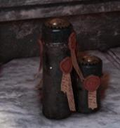

# 0059 塑钢 Plasteel

精校状态：中文行文已逐段精校，部分术语仍为暂定

分类：通用概念 / 帝国 Imperium

原文来源：https://www.bilibili.com/opus/1213641793737850882

原作者：帝国神选罐头

原文时间：2026年06月14日 12:30

[返回分类目录](目录.md) · [全书目录](../../目录.md)

<!-- A0059-B0001 -->
**英文原文**

Plasteel is a versatile metal alloy used by the Imperium. It is as light as plastic but as strong as steel. This innovative material was invented in the Dark Age of Technology.

<!-- /A0059-B0001 -->

<!-- A0059-B0002 -->

原译文

塑钢是帝国使用的一种通用金属合金。它像塑料一样轻，但像钢一样坚固。这种创新材料是在黑暗技术时代发明的。

**校订译文**

塑钢是帝国广泛使用的金属合金，轻如塑料，坚固如钢，发明于黑暗科技时代。

<!-- /A0059-B0002 -->

<!-- A0059-B0003 -->
## Overview 概述

<!-- /A0059-B0003 -->

<!-- A0059-B0004 -->
**英文原文**

Plasteel is an advanced material used by the Imperium in the construction of many forms of armour, both personal and vehicular, and in the construction of buildings. Among the strongest and most expensive, this highly durable and very lightweight material can be formed into a variety of shapes and textures. Plasteel, like Adamantium, Armorplas and Synth-leather, is far more resilient than its archaic counterparts like steel. Antiquated armours made from these archaic materials are unable to resist advanced weaponry and are only used by primitive cultures. Only when fashioned from Plasteel and Armourplas can these archaic armours be effective on the battlefield, sometimes even equalling modern armours in protective qualities.

<!-- /A0059-B0004 -->

<!-- A0059-B0005 -->

原译文

塑钢是帝国在建造多种形式的个人和载具装甲以及建筑时使用的先进材料。在最坚固、最昂贵的材料中，这种高度耐用、非常轻便的材料可以形成各种形状和纹理。塑钢与精金、装甲塑料和合成皮革一样，比钢铁等古老对应更有韧性。由这些古老材料制成的过时盔甲无法抵抗先进的武器，只被原始文化使用。只有用塑钢和装甲塑料制成，这些古老的盔甲才能在战场上发挥作用，有时甚至在防护性能上与现代盔甲不相上下。

**校订译文**

塑钢用于个人护甲、载具装甲和建筑，是最坚固也最昂贵的一类材料。它耐用、轻盈，能够加工成不同形状和质地。如同精金、甲塑和合成皮革，塑钢的耐受能力远胜钢铁等古老材料。以旧材料制作的传统盔甲难以抵御先进武器，通常只见于原始文化；若换用塑钢或甲塑制造，同样的旧式设计却能在战场发挥作用，防护有时甚至不逊于现代护甲。

<!-- /A0059-B0005 -->

<!-- A0059-B0006 图片 -->

<!-- A0059-B0007 -->

原译文

Plasteel scattered around Hive Tertium during the Moebian Sixth uprising 第六次莫比安叛乱期间，塑钢散落在第三巢都周围

**校订译文**

Plasteel scattered around Hive Tertium during the Moebian Sixth uprising 莫比安第六团叛乱期间，散落于第三巢都的塑钢

**校注：** Moebian Sixth 是莫比安第六团，不是“第六次莫比安叛乱”，已修正。

<!-- /A0059-B0007 -->

<!-- A0059-B0008 -->
**英文原文**

Plasteel is used for all sorts of purposes by the Imperium. For example, heavy-gauge plasteel is used in conjunction with ceramite to form the armour plating of Terminator Armour.

<!-- /A0059-B0008 -->

<!-- A0059-B0009 -->

原译文

塑钢被帝国用于各种目的。例如，厚塑钢与陶钢结合使用，形成终结者盔甲的装甲板。

**校订译文**

塑钢被帝国用于各种目的。例如，厚塑钢与陶钢结合使用，形成终结者盔甲的装甲板。

<!-- /A0059-B0009 -->

<!-- A0059-B0010 -->
## Trivia 琐事

<!-- /A0059-B0010 -->

<!-- A0059-B0011 -->
**英文原文**

The word plasteel is a portmanteau of plastic and steel. The term appears in Frank Herbert's Dune series and may have been coined by Harlan Ellison, who used it as early as 1956.

<!-- /A0059-B0011 -->

<!-- A0059-B0012 -->

原译文

单词塑钢是塑料和钢的合成词。这个词出现在弗兰克·赫伯特的《沙丘》系列中，可能是哈兰·埃里森创造的，他早在1956年就使用了这个词。

**校订译文**

单词塑钢是塑料和钢的合成词。这个词出现在弗兰克·赫伯特的《沙丘》系列中，可能是哈兰·埃里森创造的，他早在1956年就使用了这个词。

<!-- /A0059-B0012 -->

本篇核心术语与暂定项

以下列出本篇出现的英文原形及核心术语表用词。同形词可能指不同对象，具体词义以本篇正文和校注为准；单复数、别名和仅见于图注的名称可能尚未列入。完整候选见[术语表](../../术语表/双语术语候选.csv)。

| 英文 | 采用中文 | 状态 |
| --- | --- | --- |
| Terminator | 终结者 | 官方已核对 |
| Imperium | 帝国 | 暂定·简称 |
| Dark Age of Technology | 黑暗科技时代 | 暂定 |
| Armorplas | 甲塑 | 暂定·官方待核 |
| The Dark | 《黑暗》 | 暂定·官方待核 |
| Terminator Armour | 终结者盔甲 | 暂定·官方待核 |
| Resilient | 坚韧号 | 暂定·官方待核 |

