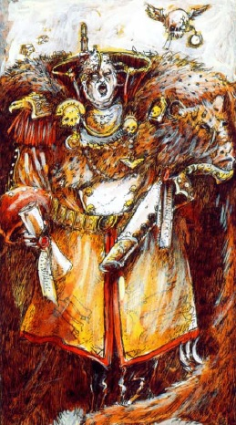

# 0064 帝国指挥官 Imperial Commander

精校状态：中文行文已逐段精校，部分术语仍为暂定

分类：通用概念 / 帝国 Imperium

原文来源：https://www.bilibili.com/opus/1143871364314169367

原作者：帝国神选罐头

原文时间：2025年12月08日 12:05

[返回分类目录](目录.md) · [全书目录](../../目录.md)

<!-- A0064-B0001 -->
**英文原文**

An Imperial Commander, often referred to as a Governor, is a figure with (often hereditary) authority to rule a world in the Emperor's name. They are the chief overseers of Imperial worlds, although some Imperial Commanders administer not mere planets, but entire Sectors and Sub-Sectors. They have been known to come not from just nobility, but also the Imperial Guard, Space Marines and Ecclesiarchy.

<!-- /A0064-B0001 -->

<!-- A0064-B0002 -->

原译文

帝国指挥官，通常被称为总督，是一个拥有（通常是世袭的）权力以帝皇的名义统治世界的人物。他们是帝国世界的主要监督者，尽管一些帝国指挥官不仅管理行星，还管理整个星区和分区。众所周知，他们不仅来自贵族，还来自帝国卫队、星际战士和国教。

**校订译文**

帝国指挥官通常又称总督，获权以帝皇之名统治一个世界，这种权力往往世袭。他们是帝国世界的最高负责人；部分人管辖的不只一颗行星，而是整个星区或次星区。其出身并不限于贵族，也可能来自帝国卫队、星际战士或国教会。

<!-- /A0064-B0002 -->

<!-- A0064-B0003 图片 -->

<!-- A0064-B0004 -->

原译文

Symbol of Imperial Commanders 帝国指挥官的标志

**校订译文**

Symbol of Imperial Commanders 帝国指挥官的标志

<!-- /A0064-B0004 -->

<!-- A0064-B0005 -->
## Overview 概述

<!-- /A0064-B0005 -->

<!-- A0064-B0006 -->
**英文原文**

Naturally, since the vast and dispersed nature of Imperial territory would make a totally centralized system of government unfeasible, the Planetary Governor is given discretionary control over the administration (including governance, defence and development) of the planet in question. In theory he (or she) is duty-bound to the Adeptus Terra. Essentially though, he is an independent governor. As long as the planet's tithes, mutant and psyker "head counts" are kept under control and the planet is governed competently, he is free to run the planet however he chooses.

<!-- /A0064-B0006 -->

<!-- A0064-B0007 -->

原译文

当然，由于帝国领土的广阔和分散性使完全集中的政府体系变得不可行，行星总督被赋予了对有关行星的管理（包括治理、防御和发展）的自由裁量权。从理论上讲，他（或她）对中央政务部负责。从本质上讲，他是一位独立的总督。只要行星的什一税、变种人和灵能者“人头数”得到控制，行星得到有效治理，他就可以自由地管理这个行星。

**校订译文**

帝国疆域庞大而分散，无法实行彻底集权，因此行星总督对当地政务、国防与发展拥有很大的自主裁量权。名义上，总督对中央政务部负责，实际却近乎独立统治者。只要按要求缴税、控制变种人和灵能者数量，并有效治理世界，他几乎可以自行决定统治方式。

<!-- /A0064-B0007 -->

<!-- A0064-B0008 图片 -->

<!-- A0064-B0009 -->

原译文

Planetary Governor 行星总督

**校订译文**

Planetary Governor 行星总督

<!-- /A0064-B0009 -->

<!-- A0064-B0010 -->
**英文原文**

They are expected to defend the planet in the name of Imperium, maintaining Planetary Defence Forces and orbital defences. Due to the fickle nature of the warp, communication with the Adeptus Terra is often delayed and sometimes prevented entirely. Often this means that Governors must make decisions on the defence of their world without advice and help from Terra, meaning that for the world to prosper, every Governor must be adept at military matters as well as the development of the planet's trade infrastructure.

<!-- /A0064-B0010 -->

<!-- A0064-B0011 -->

原译文

他们预计将以帝国的名义保卫行星，维持行星防御部队和轨道防御。由于亚空间的易变性，与泰拉的交流经常被延迟，有时甚至完全被阻止。这通常意味着，总督必须在没有泰拉的建议和帮助的情况下就保卫世界做出决定，这意味着为了世界的繁荣，每位总督都必须擅长军事事务以及行星贸易基础设施的发展。

**校订译文**

总督必须以帝国之名保卫行星，维持行星防卫军与轨道防御。亚空间变幻莫测，与中央政务部的通信常被延误，甚至完全中断，因此总督往往得不到泰拉建议或援助，必须自行决定防务。要使世界繁荣，总督既需精通军事，也要善于发展当地贸易设施。

<!-- /A0064-B0011 -->

<!-- A0064-B0012 -->
**英文原文**

Even though Governors are given these powers over a planet, they come at a price. The governor is a sworn vassal of the Imperium, and as such is required to provide military support to local campaigns. In the early period of the Imperium this was a simple process, a straightforward pledge to provide a certain number of troops and to fight in person. This was seen to be too inflexible because as the Imperium grew, the differing numbers of troops provided made poor use of some planets' populations and on others too high a proportion of the population was sent to war, leaving the planet sorely short of labour. This was later replaced with a tithe. It is assessed by the wealth and available resources of the planet.

<!-- /A0064-B0012 -->

<!-- A0064-B0013 -->

原译文

尽管总督在一个行星上被赋予了这些权力，但他们是有代价的。总督是帝国的宣誓附庸，因此需要为当地战役提供军事支援。在帝国初期，这是一个简单的过程，一个直接的承诺，提供一定数量的军队并亲自作战。这被认为过于僵化，因为随着帝国的发展，提供的不同数量的军队对一些行星的人口利用不足，而在另一些行星上，太高比例的人口被派往战争，导致行星劳动力严重短缺。这后来被什一税所取代。它是根据行星的财富和可用资源来评估的。

**校订译文**

这份权力并非没有代价。总督宣誓成为帝国附庸，就必须支援当地战事。帝国初期，这通常只是承诺提供固定数量的兵员，并亲自参战。随着疆域扩大，这种安排显得过于僵化：有些行星的征兵额未充分利用人口，另一些却被抽走过多居民，严重缺乏劳力。后来，帝国改行什一税，依据各世界的财富与可用资源评定义务。

<!-- /A0064-B0013 -->

<!-- A0064-B0014 -->
**英文原文**

As part of the tithe, the governor is expected to supply troops to the Imperial Guard, the troops often being requisitioned from the planet's existing defense forces. The tithe is also a percentage of the planet's produce. Most tithes are regular obligations, while others are demanded when specific circumstances are met.

<!-- /A0064-B0014 -->

<!-- A0064-B0015 -->

原译文

作为什一税的一部分，总督预计将向帝国卫队提供部队，这些部队通常是从行星现有的防御部队征用的。什一税也是行星生产的一个百分比。大多数什一税是常规义务，而其他什一税则是在特定情况下要求的。

**校订译文**

总督须向帝国卫队提供兵员，作为什一税的一部分，通常从当地现有防卫军中抽调。此外，税额也包括一定比例的星球产出。大多数属于定期义务，另一些只在特定条件下征收。

<!-- /A0064-B0015 -->

<!-- A0064-B0016 -->
**英文原文**

This leads to a close relationship between Planetary Governors and the Departmento Munitorum who look after the deployment of men and supplies across the galaxy. Both tithes go to the Munitorum, which can raise soldiers from across entire sectors.

<!-- /A0064-B0016 -->

<!-- A0064-B0017 -->

原译文

这导致了行星总督与负责在银河系部署人员和物资的军务部之间的密切关系。这两个什一税都归军务部所有，军务部可以从整个星区招募士兵。

**校订译文**

总督因此与负责全银河人员、物资调配的军务部保持密切联系。按本篇说法，这两类贡赋都交由军务部接收，而该机构可以从整个星区调集兵员。

**校注：** 本篇说两类贡赋均交军务部，第46篇则区分军务部与计校部的监督职能。可能涉及征收、监管、接收的区别，原文未充分交代，暂并列校注。

<!-- /A0064-B0017 -->

<!-- A0064-B0018 -->
## Notable Planetary Governors 著名行星总督

<!-- /A0064-B0018 -->

<!-- A0064-B0019 -->

原译文

Annesh 安内什

**校订译文**

Annesh 安内什

<!-- /A0064-B0019 -->

<!-- A0064-B0020 -->

原译文

Costalis of Iax 艾克斯的科斯塔利斯

**校订译文**

Costalis of Iax 艾克斯的科斯塔利斯

<!-- /A0064-B0020 -->

<!-- A0064-B0021 -->
**英文原文**

Darran Marvil of Horthn IV - Actually a Vampire in disguise.

<!-- /A0064-B0021 -->

<!-- A0064-B0022 -->

原译文

霍顿四号的达伦·马维尔 - 实际上是一个伪装的吸血鬼。

**校订译文**

霍顿四号的达伦·马维尔 - 实际上是一个伪装的吸血鬼。

<!-- /A0064-B0022 -->

<!-- A0064-B0023 -->

原译文

Cyprian Devine 西普里安·迪瓦恩

**校订译文**

Cyprian Devine 西普里安·迪瓦恩

<!-- /A0064-B0023 -->

<!-- A0064-B0024 -->

原译文

Dellasarius of Tallarn 塔兰的德拉萨里乌斯

**校订译文**

Dellasarius of Tallarn 塔兰的德拉萨里乌斯

<!-- /A0064-B0024 -->

<!-- A0064-B0025 -->

原译文

Gerontius Helmawr of Necromunda 涅克罗蒙达的杰罗提乌斯·赫尔马尔

**校订译文**

Gerontius Helmawr of Necromunda 涅克罗蒙达的杰罗提乌斯·赫尔马尔

<!-- /A0064-B0025 -->

<!-- A0064-B0026 -->

原译文

Gordus of the Diamor System 迪亚莫尔星系的戈达斯

**校订译文**

Gordus of the Diamor System 迪亚莫尔星系的戈达斯

<!-- /A0064-B0026 -->

<!-- A0064-B0027 -->

原译文

Gulfroot Gym-gam of Nashes World 纳什世界的吉姆-加姆·港根

**校订译文**

Gulfroot Gym-gam of Nashes World 纳什世界的吉姆-加姆·港根

<!-- /A0064-B0027 -->

<!-- A0064-B0028 -->

原译文

Herman von Strab 赫尔曼·冯·斯特拉布

**校订译文**

Herman von Strab 赫尔曼·冯·斯特拉布

<!-- /A0064-B0028 -->

<!-- A0064-B0029 -->

原译文

K. X. I. Oforos K.X.I.奥福罗斯

**校订译文**

K. X. I. Oforos K.X.I.奥福罗斯

<!-- /A0064-B0029 -->

<!-- A0064-B0030 -->
**英文原文**

Lord of Okku - He was captured by the Assassin Camaru, for selling a number of his world's population to Ork slavers. The assassin then sold the Governor to the very same slavers.

<!-- /A0064-B0030 -->

<!-- A0064-B0031 -->

原译文

奥库领主 - 他被刺客卡马鲁俘虏，因为他将世界上的许多人口卖给了欧克奴隶主。刺客随后将总督卖给了同一个奴隶主。

**校订译文**

奥库领主——因将本世界一批居民卖给欧克奴隶贩，被刺客卡马鲁擒获。刺客随后把这位总督卖给了同一伙奴隶贩。

<!-- /A0064-B0031 -->

<!-- A0064-B0032 -->

原译文

Lucienne Agamemnus IX 卢西安·阿伽门努斯九世

**校订译文**

Lucienne Agamemnus IX 卢西安·阿伽门努斯九世

<!-- /A0064-B0032 -->

<!-- A0064-B0033 -->

原译文

Lukas Alexander of Kronus 克洛诺斯的卢卡斯·亚历山大

**校订译文**

Lukas Alexander of Kronus 克洛诺斯的卢卡斯·亚历山大

<!-- /A0064-B0033 -->

<!-- A0064-B0034 -->
**英文原文**

Lugft Huron - former "Tyrant of Badab"

<!-- /A0064-B0034 -->

<!-- A0064-B0035 -->

原译文

鲁夫特·休伦 - 前“巴达布暴君”

**校订译文**

鲁夫特·休伦 - 前“巴达布暴君”

<!-- /A0064-B0035 -->

<!-- A0064-B0036 -->
**英文原文**

Maia Cagliestra - Governor of Rynn's World

<!-- /A0064-B0036 -->

<!-- A0064-B0037 -->

原译文

玛雅·卡格里斯特拉 - 林恩世界的总督

**校订译文**

玛雅·卡格里斯特拉 - 林恩世界的总督

<!-- /A0064-B0037 -->

<!-- A0064-B0038 -->
**英文原文**

Marius Hax - Sector Lord of Calixis and Planetary Governor of Scintilla

<!-- /A0064-B0038 -->

<!-- A0064-B0039 -->

原译文

马里乌斯·哈克斯 - 卡利西斯星区领主和辛提拉行星总督

**校订译文**

马里乌斯·哈克斯 - 卡利西斯星区领主和辛提拉行星总督

<!-- /A0064-B0039 -->

<!-- A0064-B0040 -->
**英文原文**

Marlus Porelska - Governor of Cadia during the opening salvo of the 13th Black Crusade

<!-- /A0064-B0040 -->

<!-- A0064-B0041 -->

原译文

马卢斯·波雷尔斯卡 - 第13次黑色远征奇袭开始时的卡迪亚总督

**校订译文**

马卢斯·波雷尔斯卡——第十三次黑色远征爆发之初的卡迪亚总督。

<!-- /A0064-B0041 -->

<!-- A0064-B0042 -->

原译文

Mykola Shonai of Pavonis 帕沃尼斯的米科拉·绍奈

**校订译文**

Mykola Shonai of Pavonis 帕沃尼斯的米科拉·绍奈

<!-- /A0064-B0042 -->

<!-- A0064-B0043 -->

原译文

Orlax of Thaltor 萨尔托尔的奥拉克斯

**校订译文**

Orlax of Thaltor 萨尔托尔的奥拉克斯

<!-- /A0064-B0043 -->

<!-- A0064-B0044 -->

原译文

Pella 佩拉

**校订译文**

Pella 佩拉

<!-- /A0064-B0044 -->

<!-- A0064-B0045 -->

原译文

Princess Peutrid Popadam of Nankebab 南卡巴的佩崔德·波帕丹公主

**校订译文**

Princess Peutrid Popadam of Nankebab 南卡巴的佩崔德·波帕丹公主

<!-- /A0064-B0045 -->

<!-- A0064-B0046 -->

原译文

Queeg of Xorthun 克索森的奎格

**校订译文**

Queeg of Xorthun 克索森的奎格

<!-- /A0064-B0046 -->

<!-- A0064-B0047 -->

原译文

Soloman 苏罗门

**校订译文**

Soloman 苏罗门

<!-- /A0064-B0047 -->

<!-- A0064-B0048 -->

原译文

Ludmilla Tarch of Korvon II 科尔文二号的柳德米拉·塔尔奇

**校订译文**

Ludmilla Tarch of Korvon II 科尔文二号的柳德米拉·塔尔奇

<!-- /A0064-B0048 -->

<!-- A0064-B0049 -->

原译文

Uphir Aulis 乌菲尔·奥利斯

**校订译文**

Uphir Aulis 乌菲尔·奥利斯

<!-- /A0064-B0049 -->

<!-- A0064-B0050 -->
**英文原文**

Ursarkar E. Creed, Lord Castellan of Cadia

<!-- /A0064-B0050 -->

<!-- A0064-B0051 -->

原译文

乌萨卡·E·克里德，卡迪亚领主堡主

**校订译文**

乌萨卡·E·克里德，卡迪亚领主堡主

<!-- /A0064-B0051 -->

<!-- A0064-B0052 -->
**英文原文**

Xian Torus of "the World that died in One Night"

<!-- /A0064-B0052 -->

<!-- A0064-B0053 -->

原译文

“一夜之间死去的世界”的希安·托勒斯

**校订译文**

“一夜之间死去的世界”的希安·托勒斯

<!-- /A0064-B0053 -->

<!-- A0064-B0054 -->

原译文

Zula Hatiar 祖拉·哈蒂亚尔

**校订译文**

Zula Hatiar 祖拉·哈蒂亚尔

<!-- /A0064-B0054 -->

本篇核心术语与暂定项

以下列出本篇出现的英文原形及核心术语表用词。同形词可能指不同对象，具体词义以本篇正文和校注为准；单复数、别名和仅见于图注的名称可能尚未列入。完整候选见[术语表](../../术语表/双语术语候选.csv)。

| 英文 | 采用中文 | 状态 |
| --- | --- | --- |
| Space Marines | 星际战士 | 官方已核对 |
| Imperial Guard | 帝国卫队 | 暂定·语境区分 |
| Psyker | 灵能者 | 官方已核对 |
| Warp | 亚空间 | 官方已核对 |
| Imperium | 帝国 | 暂定·简称 |
| Emperor | 帝皇 | 官方已核对 |
| Adeptus Terra | 中央政务部 | 暂定 |
| Ecclesiarchy | 国教会 | 暂定 |
| Departmento Munitorum | 军务部 | 暂定 |
| Mutant | 变种人 | 暂定·官方待核 |
| Terra | 泰拉 | 暂定·官方待核 |
| Sector | 星区 | 暂定·官方待核 |
| Badab | 巴达布 | 暂定·官方待核 |
| Scintilla | 辛提拉 | 暂定·官方待核 |
| Rynn's World | 瑞恩世界 | 暂定·官方待核 |
| Cadia | 卡迪亚 | 暂定·官方待核 |
| Adept | 帝国任职者（广义）／文吏（行政语境） | 语境定译·官方待核 |
| Castellan | 堡主 | 官方已核对 |
| Powers | 能天使 | 暂定·官方待核 |
| Ursarkar E. Creed | 乌萨卡·E.克里德 | 暂定·官方待核 |
| Lord Castellan | 堡主领主 | 暂定·官方待核 |
| Price | 普莱斯 | 暂定·官方待核 |
| System | 星系（恒星系统） | 暂定·官方待核 |
| Lugft Huron | 鲁夫特·休伦 | 暂定·官方待核 |
| Marius Hax | 马里乌斯·哈克斯 | 暂定·官方待核 |

