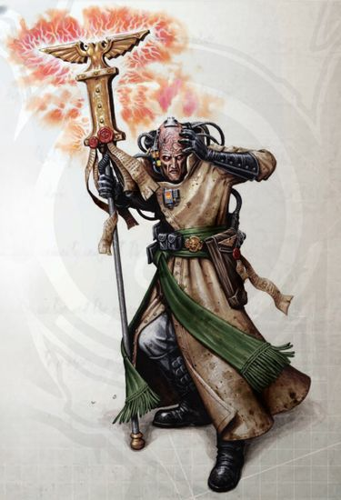
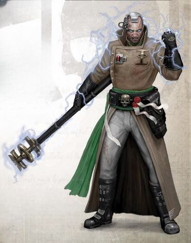
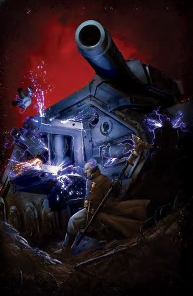
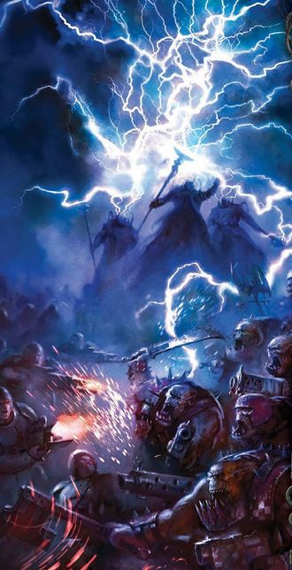
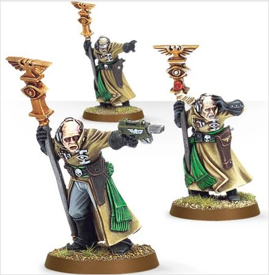
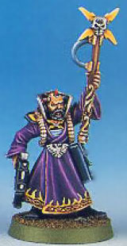

# 0068 合法灵能者 Sanctioned Psyker

精校状态：中文行文已逐段精校，部分术语仍为暂定

分类：通用概念 / 帝国 Imperium

原文来源：https://www.bilibili.com/opus/1144255480381571077

原作者：帝国神选罐头

原文时间：2025年12月09日 12:55

[返回分类目录](目录.md) · [全书目录](../../目录.md)

<!-- A0068-B0001 -->
**英文原文**

Sanctioned Psykers are psykers who have been collected by the League of Black Ships and survived Adeptus Astra Telepathica's subsequent testing and training at the Scholastia Psykana. All this is done to condition disciplined psykers for a life in service to the Imperium using their powers.

<!-- /A0068-B0001 -->

<!-- A0068-B0002 -->

原译文

合法灵能者是由黑船联盟收集的灵能者，并在星语庭随后在灵能学院进行的测试和训练中幸存下来。所有这一切都是为了训练训练有素的灵能者，让他们利用自己的力量为帝国服务。

**校订译文**

合法灵能者是经黑船联盟接收，在星语庭所属灵能学院的检验与训练中幸存并获得认可的人。这套程序旨在培养纪律严明、能够运用自身能力终身服务帝国的灵能者。

<!-- /A0068-B0002 -->

<!-- A0068-B0003 图片 -->

<!-- A0068-B0004 -->

原译文

Imperial Psyker serving in the Astra Militarum 在星界军服役的帝国灵能者

**校订译文**

Imperial Psyker serving in the Astra Militarum 在星界军服役的帝国灵能者

<!-- /A0068-B0004 -->

<!-- A0068-B0005 -->
## Overview 概述

<!-- /A0068-B0005 -->

<!-- A0068-B0006 -->
**英文原文**

"They have their uses, surely, but they can never be trusted. Their continued presence is a threat to our very souls, and no matter how useful they are, I fear just by associating with them, we are already damned." - Unnamed Imperial Guard officer

<!-- /A0068-B0006 -->

<!-- A0068-B0007 -->

原译文

“他们当然有他们的用途，但他们永远不能被信任。他们的持续存在对我们的灵魂构成威胁，无论他们有多有用，我担心仅仅与他们来往，我们就已经被诅咒了。”- 无名的帝国卫队军官

**校订译文**

“他们当然有他们的用途，但他们永远不能被信任。他们的持续存在对我们的灵魂构成威胁，无论他们有多有用，我担心仅仅与他们来往，我们就已经被诅咒了。”- 无名的帝国卫队军官

<!-- /A0068-B0007 -->

<!-- A0068-B0008 -->
**英文原文**

Psykers without training are unbound and unprotected. They often lack any form of training and guidance to control their power and safeguard their minds, making them a danger to themselves and those around them.

<!-- /A0068-B0008 -->

<!-- A0068-B0009 -->

原译文

未经训练的灵能者是不受约束和保护的。他们往往缺乏任何形式的训练和引导来控制自己的力量和保护自己的心灵，使他们对自己和周围的人构成危险。

**校订译文**

未经训练的灵能者是不受约束和保护的。他们往往缺乏任何形式的训练和引导来控制自己的力量和保护自己的心灵，使他们对自己和周围的人构成危险。

<!-- /A0068-B0009 -->

<!-- A0068-B0010 -->
**英文原文**

According to Imperial Law, all psyker must undergo the testing and sanctioning process. While the majority do so, the remaining unsanctioned psykers must be hunted down or culled, often being burned on the pyre. This is one of the duties of the Inquisition and Ordo Hereticus. Most psykers need not be hunted, as they are typically scooped up by Black Ships while they are still small children who's easily recognizable powers are still rude and immature. Most psychic powers begin to emerge between 10 and 20 years of age, but in some cases they might appear earlier in infancy or later while middle-aged. Those unsanctioned psykers who somehow hid from the Black Ships or had their powers emerge later in life are deemed rogues and fugitives from Imperial Law. They must choose whether to live a life on the run or submit themselves to the Black Ships.

<!-- /A0068-B0010 -->

<!-- A0068-B0011 -->

原译文

根据帝国法律，所有灵能者都必须经过测试和制裁程序。虽然大多数人能度过，但剩下的未批准的灵能者必须被猎杀或宰杀，通常会被烧死在柴堆上。这是审判庭和讨逆修会的职责之一。大多数灵能不需要被猎杀，因为他们通常是在还是小孩子的时候被黑船带走的，他们很容易辨认出的力量仍然是粗鲁和不成熟的。大多数灵能力量在10到20岁之间开始出现，但在某些情况下，它们可能会在婴儿早期出现，也可能在中年后期出现。那些未批准的灵能者以某种方式躲避黑船或在以后的生活中出现了他们的力量，被视为帝国法律的流浪者和逃犯。他们必须选择是过着逃亡的生活，还是屈服于黑船。

**校订译文**

帝国法律规定，所有灵能者都必须接受检验与认可。大多数人会进入这一程序，其余逃避监管者则要被追捕或清除，往往死于火刑；这是审判庭、尤其是异端审判庭的职责。多数灵能者无需专门追猎，因为他们年幼时便被黑船带走，当时力量还粗糙、未成熟，却很容易辨认。灵能通常在 10 至 20 岁之间显现，也可能早至婴儿期，或迟至中年。躲过黑船、或较晚才觉醒而未获认可者，都会被视为非法灵能者与逃犯，只能选择继续逃亡，或向黑船投案。

<!-- /A0068-B0011 -->

<!-- A0068-B0012 -->
**英文原文**

Most of the millions of psykers shipped to Terra aboard the Black Ships are found wanting during testing. This could be due to being too weak of will or lacking in psychic potential.

<!-- /A0068-B0012 -->

<!-- A0068-B0013 -->

原译文

在测试过程中，会发现黑船上运往泰拉的数百万灵能者中的大多数都存在不足。这可能是由于意志太弱或缺乏灵能潜力。

**校订译文**

在测试过程中，会发现黑船上运往泰拉的数百万灵能者中的大多数都存在不足。这可能是由于意志太弱或缺乏灵能潜力。

<!-- /A0068-B0013 -->

<!-- A0068-B0014 -->
**英文原文**

Regardless of their life prior to the Scholastia Psykana, the majority spend time aboard a Black vessels where their minds are meticulously scanned and psionic levels measured. Those who's psychic power is too low to be useful or who are found lacking the power of will to properly master their abilities are sent to "worship" at the Golden Throne. The worst memories of a psyker's time aboard a Black Ship is erased after they prove themselves worthy to continue their service to the Imperium. The minority of psykers that show potential will move on to begin their grueling training of the Scholastia Psykana. Sometimes the psykers are trained by the Scholastia aboard the Black Ship. Other times the psykers taken to the Scholastia Psykana on Terra to be tested or trained. Once the Rite of Sactioning is complete they are officially recognised as a sanctioned psyker.

<!-- /A0068-B0014 -->

<!-- A0068-B0015 -->

原译文

无论他们在灵能学院之前的生活如何，大多数人都会在一艘黑色战舰上度过一段时间，在那里他们的思想被仔细扫描，灵能水平被测量。那些灵能力量太低而无法发挥作用的人，或者被发现缺乏正确掌握自己能力的意志力的人，会被派往黄金王座进行“礼拜”。在证明自己值得继续为帝国服务后，灵能者在黑船上度过的最糟糕的记忆就会被抹去。少数表现出潜力的灵能者将继续接受灵能学院的艰苦训练。有时，灵能者会在黑船上接受灵能学院的训练。其他时候，灵能者被带到泰拉上的灵能学院接受测试或训练。一旦制裁仪式完成，他们将被正式认定为合法灵能者。

**校订译文**

不论入学前出身如何，多数候选者都要先在黑船上度过一段时间，接受精密心智扫描与灵能等级测量。力量太弱、不具实用价值，或缺少足够意志控制能力的人，会被送到黄金王座前“礼拜”。通过筛选、获准继续为帝国服务者，通常会被抹去在黑船上最可怕的记忆。少数有潜力者随后进入灵能学院的严酷训练：有时训练直接在黑船上开展，有时则送往泰拉接受检验和培养。完成认可仪式后，他们才正式成为合法灵能者。

<!-- /A0068-B0015 -->

<!-- A0068-B0016 图片 -->

<!-- A0068-B0017 -->

原译文

Sanctioned Psyker 合法灵能者

**校订译文**

Sanctioned Psyker 合法灵能者

<!-- /A0068-B0017 -->

<!-- A0068-B0018 -->
**英文原文**

Although psykers are held in suspicion, sanctioned psykers are always in demand. Scholastia Psykana graduates can find employment in a variety of different vocations. Most are trained as Astropaths while a minority sent to find work elsewhere. Some find employ on the frontlines with the Astra Militarum, others serve in cushy roles as an advisor to a planetary governor, or perhaps a novelty pet messenger for idle nobility. Others still might fill one of many positions in the Inquisition, sometimes serving their interests working within the Scholastia Psykana itself.

<!-- /A0068-B0018 -->

<!-- A0068-B0019 -->

原译文

尽管灵能者受到怀疑，但合法灵能者总是供不应求。灵能学院的毕业生可以在各种不同的职业中找到工作。大多数人被训练成星语者，而少数人则被派往其他地方找工作。有些人在星界军的前线找到了工作，其他人则担任行星总督的顾问，或者可能是无所事事的贵族的新奇宠物信使。其他人仍然可能填补审判庭的许多职位之一，有时在灵能学院内部为他们的利益服务。

**校订译文**

灵能者虽受猜忌，合法灵能者仍始终供不应求。灵能学院毕业生可被安排从事多种工作，大多数接受星语者训练，少数分派他处。有的随星界军奔赴前线，有的担任行星总督顾问，过着优裕生活，也有的被闲散贵族当作新奇宠物般的传信工具。另一些进入审判庭，有时仍留在灵能学院内部，为审判庭效力。

<!-- /A0068-B0019 -->

<!-- A0068-B0020 -->
**英文原文**

They are able to use their psychic abilities to aid the commander in his decisions by predicting or sensing enemy movements, or more directly in combat, psychically attacking the enemy or protecting allies. Commissars are always ready to execute a psyker in danger of daemonic possession. Throughout the Imperium, psykers are justifiably feared for the danger they present, and held in a regard comparable to that of aliens and mutants. Certain slang has grown up between psykers and non-psykers. Freak, Brain, Witch, Spark Head and Bolt Magnet are all terms for a sanctioned psyker, whereas Blunt is what a non-psyker is to a psyker. Fellow psykers will often refer to each other as Sibling due to the harrowing experiences that is their training on the Black Ships to become sanctioned.

<!-- /A0068-B0020 -->

<!-- A0068-B0021 -->

原译文

他们能够利用自己的灵能能力来帮助指挥官做出决定，通过预测或感知敌人的行动，或者更直接地在战斗中，从灵能上攻击敌人或保护盟友。政委随时准备处决一名有被恶魔附身危险的灵能者。在整个帝国，人们有理由担心灵能者带来的危险，并将其视为与异型和变种人相当。某些俚语在灵能者和非灵能者之间兴起。怪胎、聪明人、女巫、火花头和闪电磁铁都是合法灵能者的术语，而迟钝人是非灵能者对灵能者来说的意思。同为灵能者的人经常称对方为兄弟姐妹，因为他们在黑船上接受的训练而成为合法，这是一种痛苦的经历。

**校订译文**

他们能够预知、感应敌军动向，辅助指挥官决策；也能直接发动灵能攻击或保护友军。政委随时准备处决出现恶魔附身风险的灵能者。帝国各地的人因其危险而畏惧他们，常将他们与异形、变种人同等看待。双方还各有俗称：怪胎、大脑、巫师、火花头、爆矢磁铁等，都可指合法灵能者；灵能者则称没有灵能的人为“钝人”。由于共同经历了黑船上艰苦、可怖的训练，灵能者之间常以兄弟姐妹相称。

**校注：** Bolt Magnet 的 bolt 在军队语境下指爆矢，暗示可能招致政委处决，不是雷电或“闪电磁铁”。

<!-- /A0068-B0021 -->

<!-- A0068-B0022 图片 -->

<!-- A0068-B0023 -->

原译文

Astra Militarum Psyker striking a Leman Russ Battle Tank 星界军灵能者攻击黎曼鲁斯战斗坦克

**校订译文**

Astra Militarum Psyker striking a Leman Russ Battle Tank 星界军灵能者攻击黎曼鲁斯战斗坦克

<!-- /A0068-B0023 -->

<!-- A0068-B0024 -->
**英文原文**

Sanctioned Psykers, also classified as Mystics, are often used by Inquisitors as their Inquisitorial Henchmen for their psychic powers.

<!-- /A0068-B0024 -->

<!-- A0068-B0025 -->

原译文

合法灵能者，也被归类为神秘主义者，经常被审判官用作他们的审判官随从，因为他们的灵能力量。

**校订译文**

合法灵能者在审判官随从的分类中，也可能被称为“神秘者”，审判官常借助他们的灵能力量执行任务。

<!-- /A0068-B0025 -->

<!-- A0068-B0026 -->
## Psykers in the Imperial Guard 帝国卫队中的灵能者

<!-- /A0068-B0026 -->

<!-- A0068-B0027 -->
**英文原文**

"The Imperium might be fools, but when it comes to their psykers, only the most resilient minds make it to the battlefield." - Solomon Akurra of the Alpha Legion

<!-- /A0068-B0027 -->

<!-- A0068-B0028 -->

原译文

“帝国可能是傻瓜，但当涉及到他们的灵能者时，只有最有适应力的头脑才能进入战场。” - 阿尔法军团的所罗门·阿库拉

**校订译文**

“帝国或许愚蠢，但说到他们的灵能者，只有心智最坚韧的人才能活着上战场。”——阿尔法军团的所罗门·阿库拉

<!-- /A0068-B0028 -->

<!-- A0068-B0029 -->
**英文原文**

Sanctioned psykers are trained as both warriors and advisors. Depending on their specialization, they might divine the movements of enemy troops, or simply rain destruction on their foes. Psykers often serve as advisors to the officer corps of the Imperial Guard. Some might divine the Emperor's Tarot to aid in matters of strategy, planning battles and winning wars.

<!-- /A0068-B0029 -->

<!-- A0068-B0030 -->

原译文

合法灵能者被训练成战士和顾问。根据他们的专业化程度，他们可能会预测敌军的动向，或者只是给敌人带来毁灭性的打击。灵能者经常担任帝国卫队军官团的顾问。有些人可能会占卜帝皇塔罗牌，以帮助制定战略、计划战斗和赢得战争。

**校订译文**

合法灵能者同时接受战士与顾问的训练。依照专长，他们可能预测敌军动向，也可能直接以毁灭性力量轰击敌人。他们常担任帝国卫队军官的顾问，其中一些借帝皇塔罗牌占卜，为战略、战役规划及战争胜负提供指引。

<!-- /A0068-B0030 -->

<!-- A0068-B0031 图片 -->

<!-- A0068-B0032 -->

原译文

Psyker auxiliaries in a battle against Orks 灵能者辅助军在与欧克的战斗中

**校订译文**

Psyker auxiliaries in a battle against Orks 与欧克蛮人作战的灵能辅助部队

<!-- /A0068-B0032 -->

<!-- A0068-B0033 -->
**英文原文**

The Scholastica Psykana assigns their psykers to various regiments. The psyker themself is typically born far from where the Astra Militarum Regiment they are assigned to is recruited from. Alongside the de facto ostracism or outright persecution faced in Imperial society, most psykers are loners and outcasts amongst the men and women of the regiment they fight alongside.

<!-- /A0068-B0033 -->

<!-- A0068-B0034 -->

原译文

灵能学院将他们的灵能分配给各个兵团。灵能者本身通常出生在远离他们被分配到的星界军兵团招募的地方。除了帝国社会面临的事实上的排斥或彻底的迫害外，大多数灵能者都是他们并肩作战的兵团的男女中的孤独者和被排斥者。

**校订译文**

灵能学院将灵能者分派到不同兵团。他们的出生地，通常远离所分配星界军兵团的征兵世界。再加上帝国社会普遍的排斥乃至迫害，即使与同袍并肩作战，多数灵能者在兵团中也仍是孤独的外人。

<!-- /A0068-B0034 -->

<!-- A0068-B0035 -->
**英文原文**

Commissars are trained to recognize the signs of daemonic possession and stand ready to execute a psyker at the first signs of possession.

<!-- /A0068-B0035 -->

<!-- A0068-B0036 -->

原译文

政委经过训练，能够识别恶魔附身的迹象，并随时准备在第一个附身迹象出现时处决一名灵能者。

**校订译文**

政委经过训练，能够识别恶魔附身的迹象，并随时准备在第一个附身迹象出现时处决一名灵能者。

<!-- /A0068-B0036 -->

<!-- A0068-B0037 -->
### Psyker Battle Squads 灵能者战斗小队

<!-- /A0068-B0037 -->

<!-- A0068-B0038 -->
**英文原文**

Sanctioned Psykers are most often divided into Psyker Battle Squads, consisting of groups of individuals who are barely able to control their awesome power. Ever-vigilant overseer Psykers accompany these more amateurish squad members into battle, helping them attune to each other so that the squad functions as a cohesive psychic unit. Whilst one psyker may start a sentence another shall finish it, several members of the unit chorusing and echoing the words in unison. In battle, they pool their energies to release a psychic blast far greater then the sum of their individual parts. The sonorous chanting of a Psyker battle squad continuously rises as they draw ever deeper into the powers of the Warp, eventually releasing a surge of psychic energy that can create deadly thunderstorms to engulf the psykers foe or send out energy that ruptures organs or rips bodies apart.

<!-- /A0068-B0038 -->

<!-- A0068-B0039 -->

原译文

合法灵能者通常被分为灵能者战斗小队，由一群几乎无法控制其强大力量的人组成。时刻警惕的监督灵能者陪伴这些更业余的小队成员进入战斗，帮助他们相互协调，使小队成为一个有凝聚力的灵能单位。当一个灵能者可以开始一个句子，另一个应该完成它时，该部队的几个成员一致合唱并重复单词。在战斗中，他们集中能量释放出一种灵能冲击，远远大于他们各自部分的总和。灵能者战斗小队的雄浑吟唱不断上升，因为他们越来越深入到亚空间的力量中，最终释放出一股灵能能量，可以制造致命的雷暴来吞噬灵能者的敌人，或者释放出破坏器官或撕裂身体的能量。

**校订译文**

合法灵能者常编为灵能战斗小队，成员大多只能勉强控制自身强大的力量。始终保持警惕的监督灵能者随队作战，帮助这些经验较浅的成员彼此协调，形成统一的灵能整体。一个人说出句子开头，另一个人便接续下去，其他人齐声应和。战斗中，他们汇聚力量，爆发出远超各人简单相加的冲击。随着从亚空间汲取的力量越来越深，吟唱声也不断高涨，最终释放汹涌灵能，或制造致命雷暴吞没敌人，或震碎器官、撕裂躯体。

<!-- /A0068-B0039 -->

<!-- A0068-B0040 图片 -->

<!-- A0068-B0041 -->

原译文

Sanctioned Psykers 合法灵能者

**校订译文**

Sanctioned Psykers 合法灵能者

<!-- /A0068-B0041 -->

<!-- A0068-B0042 -->
### Wyrdvane Psykers 战斗灵能者

<!-- /A0068-B0042 -->

<!-- A0068-B0043 -->
**英文原文**

Wyrdvane Psykers are Imperial Psykers of the Adeptus Astra Telepathica's Scholastica Psykana that are not able to control their powers. Some have not yet completed the grueling training to become a Primaris Psyker. Others will never achieve that goal, introverted beyond rescue by the horrors of their own minds. As individuals, such psykers are unpredictable and unsafe. Yet working in concert, these deadly mutants can be a valuable asset. Attuned to one another, Wyrdvane Psykers draw strength from communion. Squads of Wyrdvanes link their thoughts to strengthen each other's powers.

<!-- /A0068-B0043 -->

<!-- A0068-B0044 -->

原译文

战斗灵能者是星语庭的灵能学院的帝国灵能者，无法控制自己的力量。有些人还没有完成成为灵能导师的艰苦训练。其他人永远无法实现这一目标，他们被自己内心的恐惧所束缚，无法自拔。作为个人，这种灵能者是不可预测和不安全的。然而，通过协同工作，这些致命的变种人可以成为一笔宝贵的资产。战斗灵能者相互协调，从交流中汲取力量。战斗灵能者小队将他们的思想连接起来，以增强彼此的力量。

**校订译文**

战斗灵能者是星语庭灵能学院中尚不能妥善控制自身力量的成员。有些还未完成成为灵能导师所需的艰苦训练，另一些则因自身心智中的恐怖而封闭自我，永远无法达到目标。单独行动时，他们危险且难以预测；集体作战时，却能成为有价值的战力。小队成员相互协调，连接思维，在共鸣中汲取力量，增强彼此的能力。

**校注：** 此段 Wyrdvane Psykers 是特定类别，本稿按核心译为战斗灵能者；不将所有普通 battle psyker 都认作同一单位。

<!-- /A0068-B0044 -->

<!-- A0068-B0045 -->
### Other Variants 其他变体

<!-- /A0068-B0045 -->

<!-- A0068-B0046 -->

原译文

Primaris Psyker 灵能导师

**校订译文**

Primaris Psyker 灵能导师

<!-- /A0068-B0046 -->

<!-- A0068-B0047 图片 -->

<!-- A0068-B0048 -->

原译文

Primaris Psyker 灵能导师

**校订译文**

Primaris Psyker 灵能导师

<!-- /A0068-B0048 -->

<!-- A0068-B0049 -->

原译文

Theomancer 神术师

**校订译文**

Theomancer 神术师

<!-- /A0068-B0049 -->

<!-- A0068-B0050 -->

原译文

Imperial Diviner 帝国占卜者

**校订译文**

Imperial Diviner 帝国占卜者

<!-- /A0068-B0050 -->

<!-- A0068-B0051 -->
## Known Sanctioned Psykers 已知合法灵能者

<!-- /A0068-B0051 -->

<!-- A0068-B0052 -->
**英文原文**

Calumny Faal - Zeta-level biomancer in Inquisitor Grendyl's Warband.

<!-- /A0068-B0052 -->

<!-- A0068-B0053 -->

原译文

卡勒姆尼·法尔 - 泽塔级生物术师在审判官格雷内尔的战帮。

**校订译文**

卡勒姆尼·法尔——审判官格雷内尔战帮中的泽塔级生物学派灵能者。

<!-- /A0068-B0053 -->

<!-- A0068-B0054 -->

原译文

Chalse Bishopstead 查尔斯·毕晓普斯特德

**校订译文**

Chalse Bishopstead 查尔斯·毕晓普斯特德

<!-- /A0068-B0054 -->

<!-- A0068-B0055 -->
**英文原文**

Glavia Aerand — Cadian

<!-- /A0068-B0055 -->

<!-- A0068-B0056 -->

原译文

格拉维亚·埃兰德 — 卡迪亚人

**校订译文**

格拉维亚·埃兰德 — 卡迪亚人

<!-- /A0068-B0056 -->

<!-- A0068-B0057 -->
**英文原文**

Glutt — Sepus Prime, which fell to Chaos

<!-- /A0068-B0057 -->

<!-- A0068-B0058 -->

原译文

格卢特 — 塞普斯一号，堕入混沌

**校订译文**

格卢特——来自后来陷入混沌的塞普斯一号。

<!-- /A0068-B0058 -->

<!-- A0068-B0059 -->

原译文

Hallor Henghist 哈洛尔·亨吉斯特

**校订译文**

Hallor Henghist 哈洛尔·亨吉斯特

<!-- /A0068-B0059 -->

<!-- A0068-B0060 -->
**英文原文**

Lunst Cataboldine — Primaris Psyker

<!-- /A0068-B0060 -->

<!-- A0068-B0061 -->

原译文

伦斯特·卡塔博尔丁 — 灵能导师

**校订译文**

伦斯特·卡塔博尔丁 — 灵能导师

<!-- /A0068-B0061 -->

<!-- A0068-B0062 -->
**英文原文**

Malden — Lord General Zyvan's staff

<!-- /A0068-B0062 -->

<!-- A0068-B0063 -->

原译文

莫尔登 — 领主将军齐万的参谋

**校订译文**

莫尔登 — 领主将军齐万的参谋

<!-- /A0068-B0063 -->

<!-- A0068-B0064 -->

原译文

Mortanna Shroud 莫尔坦纳·肖德

**校订译文**

Mortanna Shroud 莫尔坦纳·肖德

<!-- /A0068-B0064 -->

<!-- A0068-B0065 -->

原译文

Ollograph 奥洛格拉夫

**校订译文**

Ollograph 奥洛格拉夫

<!-- /A0068-B0065 -->

<!-- A0068-B0066 -->

原译文

Ortruum 8-8 奥尔特鲁姆8-8

**校订译文**

Ortruum 8-8 奥尔特鲁姆8-8

<!-- /A0068-B0066 -->

<!-- A0068-B0067 -->
**英文原文**

Sartella Asenthis - Cadian psyker who would join the Cadian Armoured 49th in Era Indomitus.

<!-- /A0068-B0067 -->

<!-- A0068-B0068 -->

原译文

萨泰拉·阿森蒂斯 - 卡迪亚灵能者，将在不屈时代加入卡迪亚第49装甲团。

**校订译文**

萨泰拉·阿森蒂斯 - 卡迪亚灵能者，将在不屈时代加入卡迪亚第49装甲团。

<!-- /A0068-B0068 -->

<!-- A0068-B0069 -->
**英文原文**

Sefoni - Sanctioned Psyker in Inquisitor Grendyl's Warband.

<!-- /A0068-B0069 -->

<!-- A0068-B0070 -->

原译文

塞福尼 - 合法灵能者在审判官格雷内尔的战帮。

**校订译文**

塞福尼——审判官格雷内尔战帮中的合法灵能者。

<!-- /A0068-B0070 -->

<!-- A0068-B0071 -->
**英文原文**

Tulava Dyne - Former Imperial Guard battle-psyker, now a traitor Sorceress.

<!-- /A0068-B0071 -->

<!-- A0068-B0072 -->

原译文

图拉瓦·戴恩 - 前帝国卫队战斗灵能者，现在是一名叛徒巫师。

**校订译文**

图拉瓦·戴恩 - 前帝国卫队战斗灵能者，现在是一名叛徒巫师。

<!-- /A0068-B0072 -->

<!-- A0068-B0073 -->
## Known Wyrdvane Psykers 已知战斗灵能者

<!-- /A0068-B0073 -->

<!-- A0068-B0074 -->
**英文原文**

Wirlen, Stocht, Holsul, and Eurum — attached to a Valhallan Ice Warriors Regiment which is in battle with the Dark Eldar. Holsul also served with Cadian Shock Troopers.

<!-- /A0068-B0074 -->

<!-- A0068-B0075 -->

原译文

维伦、斯托赫特、霍尔苏尔和欧鲁姆 — 隶属于正在与灵族作战的瓦尔哈拉冰雪战士兵团。霍尔苏尔还曾在卡迪亚突击军服役。

**校订译文**

维伦、斯托赫特、霍尔苏尔与欧鲁姆——配属一支正在对抗黑暗灵族的瓦尔哈拉冰雪战士兵团。霍尔苏尔也曾随卡迪亚突击军服役。

<!-- /A0068-B0075 -->

<!-- A0068-B0076 -->
**英文原文**

Sten Trall (Deceased)

<!-- /A0068-B0076 -->

<!-- A0068-B0077 -->

原译文

斯滕·特拉尔（已故）

**校订译文**

斯滕·特拉尔（已故）

<!-- /A0068-B0077 -->

<!-- A0068-B0078 -->
## Notable Groups 著名小队

<!-- /A0068-B0078 -->

<!-- A0068-B0079 -->

原译文

The Doomscryers 末日占星者

**校订译文**

The Doomscryers 末日占星者

<!-- /A0068-B0079 -->

本篇核心术语与暂定项

以下列出本篇出现的英文原形及核心术语表用词。同形词可能指不同对象，具体词义以本篇正文和校注为准；单复数、别名和仅见于图注的名称可能尚未列入。完整候选见[术语表](../../术语表/双语术语候选.csv)。

| 英文 | 采用中文 | 状态 |
| --- | --- | --- |
| Astra Militarum | 星界军 | 官方已核对 |
| Imperial Guard | 帝国卫队 | 暂定·语境区分 |
| Eldar | 灵族 | 暂定·语境区分 |
| Dark Eldar | 黑暗灵族 | 暂定·旧称对应 |
| Psyker | 灵能者 | 官方已核对 |
| Primaris Psyker | 灵能导师 | 官方已核对 |
| Adeptus Astra Telepathica | 星语庭 | 暂定 |
| Scholastia Psykana | 灵能学院 | 暂定 |
| Sanctioned Psyker | 合法灵能者 | 暂定·官方待核 |
| Warp | 亚空间 | 官方已核对 |
| Inquisition | 审判庭 | 暂定 |
| Inquisitor | 审判官 | 官方已核对 |
| Imperium | 帝国 | 暂定·简称 |
| Emperor's Tarot | 帝皇塔罗牌 | 暂定 |
| Indomitus | 不屈学派 | 暂定·学派语境 |
| Tulava Dyne | 图拉瓦·戴恩 | 暂定 |
| Emperor | 帝皇 | 官方已核对 |
| Terra | 泰拉 | 暂定·官方待核 |
| Era Indomitus | 不屈时代 | 暂定·官方待核 |
| League of Black Ships | 黑船联盟 | 暂定·官方待核 |
| Ordo Hereticus | 异端审判庭 | 用户指定 |
| Golden Throne | 黄金王座 | 暂定·官方待核 |
| Deeper | 深人 | 暂定·官方待核 |
| Calumny Faal | 卡勒姆尼·法尔 | 暂定·官方待核 |
| Master | 导师（审判庭职衔）／舰务官（舰员职务） | 语境定译·官方待核 |
| Bolt Magnet | 爆矢磁铁 | 暂定·官方待核 |
| Alpha Legion | 阿尔法军团 | 暂定·官方待核 |
| Overseer | 监督者 | 暂定·官方待核 |
| Powers | 能天使 | 暂定·官方待核 |
| The Harrowing | 折磨 | 暂定·官方待核 |
| Solomon Akurra | 所罗门·阿库拉 | 暂定·官方待核 |
| Vigilant | 维吉兰特 | 暂定·官方待核 |
| The Dark | 《黑暗》 | 暂定·官方待核 |
| Solomon | 所罗门 | 暂定·官方待核 |
| Cadian Shock Troopers | 卡迪亚突击军 | 暂定·官方待核 |
| Valhallan Ice Warriors | 瓦尔哈拉冰雪战士 | 暂定·官方待核 |
| Bolt | 爆矢 | 暂定·官方待核 |
| Resilient | 坚韧号 | 暂定·官方待核 |

