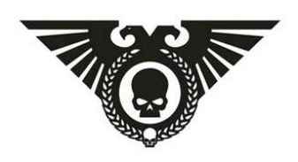
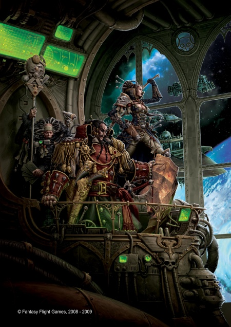
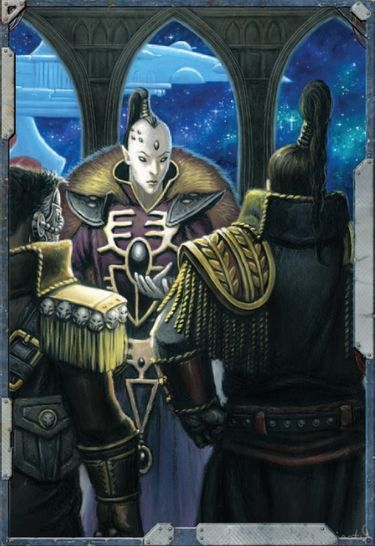
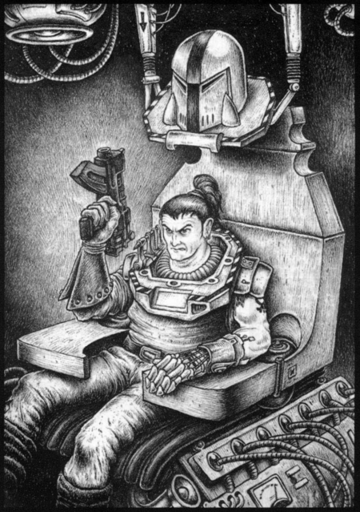
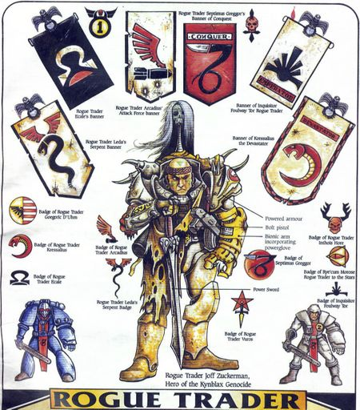
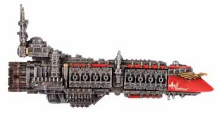
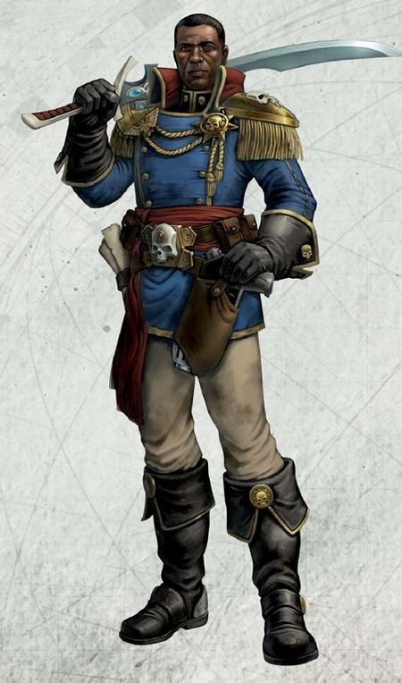
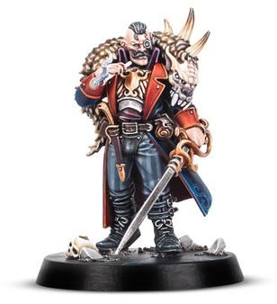

# 0070 行商浪人 Rogue Trader

精校状态：中文行文已逐段精校，部分术语仍为暂定

分类：通用概念 / 帝国 Imperium

原文来源：https://www.bilibili.com/opus/1213262990519828480

原作者：帝国神选罐头

原文时间：2026年06月13日 12:00

[返回分类目录](目录.md) · [全书目录](../../目录.md)

<!-- A0070-B0001 -->

原译文

"You might see a sky full of stars; I see money to be made."— Mistress Katrina Zaat, Rogue Trader “你可能会看到满是星星的天空；我看到了赚钱的机会。”— 女主人卡特里娜·扎特，行商浪人

**校订译文**

"You might see a sky full of stars; I see money to be made."— Mistress Katrina Zaat, Rogue Trader “你看到的也许是满天繁星，我看到的却是赚钱的机会。”——行商浪人卡特里娜·扎特女士

<!-- /A0070-B0001 -->

<!-- A0070-B0002 -->
**英文原文**

A Rogue Trader is a combination of freelance explorer, conquistador and merchant. They are Imperial servants, given a ship, a crew, a contingent of marines or Guardsmen and carte blanche to roam the worlds beyond Imperial control.

<!-- /A0070-B0002 -->

<!-- A0070-B0003 -->

原译文

行商浪人是自由探险家、征服者和商人的组合。他们是帝国之仆，有一艘船、一群船员、一队战士或卫兵，可以全权漫游帝国控制之外的世界。

**校订译文**

行商浪人兼具自由探险家、征服者和商人的身份。他们为帝国效力，获赐一艘舰船、一批船员，以及一支陆战队或帝国卫队部队，并被授予全权，可在帝国控制范围之外的诸世界自由活动。

<!-- /A0070-B0003 -->

<!-- A0070-B0004 图片 -->

<!-- A0070-B0005 -->

原译文

Symbol of the Rogue Traders 行商浪人标志

**校订译文**

Symbol of the Rogue Traders 行商浪人标志

<!-- /A0070-B0005 -->

<!-- A0070-B0006 -->
**英文原文**

In their task of exploring and exploiting uncharted regions of the galaxy, Rogue Traders might come across worlds harbouring long-forgotten Human civilizations which will be incorporated into the Imperium. Other times they find empty or alien-dominated planets ripe for colonisation or exploitation.

<!-- /A0070-B0006 -->

<!-- A0070-B0007 -->

原译文

在探索和开发银河系未知地区的任务中，行商浪人可能会遇到隐藏着早已被遗忘的人类文明的世界，这些文明将被纳入帝国。其他时候，他们会发现空荡荡的或异型主导的行星，成熟的时机来殖民或开发。

**校订译文**

行商浪人肩负探索和开发银河系未知区域的使命。他们可能发现早已被遗忘的人类文明，并将其所在世界纳入帝国；也可能发现适宜殖民或开发的无人行星，以及由异形占据的行星。

<!-- /A0070-B0007 -->

<!-- A0070-B0008 -->
## Rogue Traders 行商浪人

<!-- /A0070-B0008 -->

<!-- A0070-B0009 -->
**英文原文**

Dating back to the very birth of the Imperium during the time of the Great Crusade, Rogue Traders are highly exceptional individuals who are driven to success even though these exceptional people often have extreme character quirks themselves; some destroy entire worlds for the slightest reason, or include alien warriors and mutants among their entourage. Some are highly pious while others are no more than legitimised pirates. One infamous Rogue Trader was Jan van Yastobaal, who became little more than a desperado plundering whatever world he came upon.

<!-- /A0070-B0009 -->

<!-- A0070-B0010 -->

原译文

可以追溯到大远征时期帝国的诞生，行商浪人是非常杰出的人，他们被成功所驱使，尽管这些杰出的人自己往往有极端的性格怪癖；有些人出于最轻微的原因摧毁了整个世界，或者在他们的随从中包括异型战士和变种人。有些人非常虔诚，而另一些人只不过是合法的海盗。一个臭名昭著的行商浪人是简·范·亚斯托巴尔，他只不过是一个亡命徒，掠夺他所遇到的任何世界。

**校订译文**

行商浪人制度可追溯至大远征时期、帝国诞生之初。行商浪人都是出类拔萃、力求成功的人物，却往往也有极端的性格怪癖。有些人会因微不足道的理由摧毁整个世界，有些则将异形战士和变种人纳入自己的随从。有些行商浪人极其虔诚，另一些则不过是获得合法身份的海盗。臭名昭著的简·范·亚斯托巴尔便是其中一例：他几乎沦为一个亡命之徒，所到之处，无不大肆劫掠。

<!-- /A0070-B0010 -->

<!-- A0070-B0011 图片 -->

<!-- A0070-B0012 -->

原译文

Rogue Trader and his retinue 行商浪人和他的随从

**校订译文**

Rogue Trader and his retinue 行商浪人和他的随从

<!-- /A0070-B0012 -->

<!-- A0070-B0013 -->
**英文原文**

Rogue Traders are often flamboyant individuals, commonly dressed in the most extravagant finery they can acquire. However, each Rogue Trader is a unique individual from a particular background, some newly created Rogue Traders come from backgrounds such as the Imperial Guard, the Imperial Navy, the Merchant Fleets, the Administratum or even the Inquisition where they will have developed unique outlooks and approaches to situations. Some Rogue Traders are relatively poor, possessing a single ancient and dilapidated ship. Others are incredibly wealthy and powerful and have whole fleets and entire private armies at their disposal. Certain favoured individuals may even call upon detachments of Space Marines having entered pacts with individual Chapters. Some Rogue Traders operate as mercenaries, renting the service of their ship(s).

<!-- /A0070-B0013 -->

<!-- A0070-B0014 -->

原译文

行商浪人往往是华丽的人，通常穿着他们能买到的最奢华的服饰。然而，每个行商浪人都是来自特定背景的独特个体，一些新成为的行商浪人来自帝国卫队、帝国海军、商船舰队、内务部甚至审判庭等背景，在那里他们将形成独特的观点和处理情况的方法。一些行商浪人相对贫穷，只拥有一艘古老而破旧的舰船。其他的非常富有和强大，拥有整个舰队和整个私人军队。某些受青睐的个人甚至可能召唤与各个战团签订协议的星际战士分遣队。一些行商浪人以雇佣兵的身份运营，租用他们的舰船。

**校订译文**

行商浪人往往行事张扬，身着自己能弄到的最奢华服饰。不过，每位行商浪人都有独特的出身和个性。新获任命者可能来自帝国卫队、帝国海军、商船舰队、内政部，甚至审判庭；这些经历塑造了他们各自的看法和处事方式。有些行商浪人相对贫穷，只有一艘古老破败的舰船；另一些则富可敌国、权势显赫，可以调动整支舰队和私人军队。某些深受眷顾者还与个别星际战士战团订有契约，能够请求其派遣部队助战。也有行商浪人充当雇佣兵，受雇提供舰船及其服务。

<!-- /A0070-B0014 -->

<!-- A0070-B0015 -->
## Legal status 法律地位

<!-- /A0070-B0015 -->

<!-- A0070-B0016 -->

原译文

"The Warrant of Trade and a starship to enforce it—these are the critical tools for a Rogue Trader. Without the former, he is merely a renegade. Without the latter, he is a forsaken drifter doomed to an anonymous death."–Lord-Captain Laomyr of Battlefleet Calixis “贸易许可和执行它的星舰 — 这些是行商浪人的关键工具。没有前者，他只是一个变节者。没有后者，他是一个被遗弃的流浪汉，注定要在不知姓名中死亡。”— 卡利西斯战斗舰队领主舰长劳梅尔

**校订译文**

"The Warrant of Trade and a starship to enforce it—these are the critical tools for a Rogue Trader. Without the former, he is merely a renegade. Without the latter, he is a forsaken drifter doomed to an anonymous death."–Lord-Captain Laomyr of Battlefleet Calixis “贸易许可，以及一艘能够行使这份许可所赋权力的星舰——这是行商浪人不可或缺的工具。没有前者，他不过是个叛逆者；没有后者，他便是遭人遗弃的漂泊者，注定默默无闻地死去。”——卡利西斯战斗舰队领主舰长劳梅尔

<!-- /A0070-B0016 -->

<!-- A0070-B0017 -->
**英文原文**

The most valuable possession of a Rogue Trader family is a Warrant of Trade, an ancient legal document that describes the accepted limits of its operations. These charters are hereditary thus creating a Rogue Trader dynasty. These dynasties are granted a personal coat of arms identifying them amongst the Imperial elite

<!-- /A0070-B0017 -->

<!-- A0070-B0018 -->

原译文

行商浪人家族最有价值的财产是贸易许可，这是一份古老的法律文件，描述了其业务的公认限制。这些特许状是世袭的，因此创建了一个行商浪人王朝。这些王朝被授予个人徽章，以表明他们是帝国精英中的一员

**校订译文**

行商浪人家族最珍贵的财产是贸易许可：这份古老的法律文书规定了其获准活动的范围。许可可以世袭，由此形成了行商浪人王朝。每个王朝都获授专属纹章，作为其在帝国精英阶层中的身份标识。

<!-- /A0070-B0018 -->

<!-- A0070-B0019 图片 -->

<!-- A0070-B0020 -->

原译文

Rogue Trader consorting with Asuryani 行商浪人与阿苏焉尼结交

**校订译文**

Rogue Trader consorting with Asuryani 行商浪人与阿苏焉尼结交

<!-- /A0070-B0020 -->

<!-- A0070-B0021 -->
**英文原文**

Rogue Traders are empowered with the authority to travel freely within the Imperium and beyond, this allows them to interact with cultures for which contact with is normally forbidden, be they non-Imperial human worlds or Xenos-controlled planets. Not only that, but Rogue Traders are granted the permission and freedom to deal with these cultures as they see fit, so long as it is in the interests of the Imperium. Upon stepping on a non-Imperial world, the Rogue Trader may claim it for the Imperium by uttering:

<!-- /A0070-B0021 -->

<!-- A0070-B0022 -->

原译文

行商浪人被赋予在帝国内外自由航行的权力，这使他们能够与通常被禁止接触的文化互动，无论是非帝国的人类世界还是异型控制的行星。不仅如此，只要符合帝国的利益，行商浪人就被赋予了以他们认为合适的方式处理这些文化的许可和自由。踏上一个非帝国世界后，行商浪人可以通过说出以下内容来声称它是帝国的：

**校订译文**

行商浪人获准在帝国内外自由航行，因此可以接触通常禁止帝国臣民往来的文明，包括帝国之外的人类世界和异形控制的行星。只要符合帝国利益，他们还可以自行决定如何与这些文明交涉。踏上帝国疆域之外的世界后，行商浪人可以宣读以下誓词，宣布将其纳入帝国：

<!-- /A0070-B0022 -->

<!-- A0070-B0023 -->

原译文

"I claim this world for the Emperor of Humanity and his Imperium. I bring justice and truth for the loyal. Punishment and death for the guilty." “我宣称这个世界是为了人类帝皇和他的帝国。我为忠诚者带来正义和真理。为有罪者带来惩罚和死亡。”

**校订译文**

"I claim this world for the Emperor of Humanity and his Imperium. I bring justice and truth for the loyal. Punishment and death for the guilty." “我以人类帝皇及其帝国之名，宣告占有这个世界。我为忠诚者带来正义与真理，为有罪者带来惩罚与死亡。”

<!-- /A0070-B0023 -->

<!-- A0070-B0024 -->
## The Warrant of Trade 贸易许可

<!-- /A0070-B0024 -->

<!-- A0070-B0025 -->
**英文原文**

It should be noted that although Rogue Traders are shipmasters who travel the vastness of space, their authority to do so comes not from a Merchant Charter, but rather a letter of appointment that elevates them to the authority equalling Space Marine Chapter Masters, Inquisitors and Planetary Governors Some of the more ancient ones are dated from the very beginnings of the Imperium, and some were even signed by the Emperor himself. Others were signed by Primarchs or other leaders of the Great Crusade. These charters are very valuable and give its owner great leeway. They are tailor-made and unique. They cannot be re-appealed as according to Imperial law and Imperial religious dogma no one is empowered to overrule these persons.

<!-- /A0070-B0025 -->

<!-- A0070-B0026 -->

原译文

应该指出的是，尽管行商浪人是穿越浩瀚太空的舰长，但他们这样做的权力不是来自商船宪章，而是一份任命书，将他们提升为与星际战士战团长、审判官和行星总督同等的权威。其中一些更古老的任命书可以追溯到帝国初期，有些甚至是由帝皇本人签署的。其他则由大远征的原体或其他领导人签署。这些宪章非常有价值，给了它的主人很大的回旋余地。它们是量身定制的，独一无二的。他们不能被再次申诉，因为根据帝国法律和帝国宗教教条，没有人有权否定这些人。

**校订译文**

虽然行商浪人也是航行于浩瀚太空的舰长，但其权力并非来自商船特许状，而是来自一份任命文书。这份文书赋予他们足以与星际战士战团长、审判官和行星总督比肩的权柄。某些古老文书可追溯至帝国初创时期，甚至由帝皇亲笔签署；其他文书则由原体或大远征的其他领袖签署。每份许可都针对特定持有人制订，独一无二、价值无可估量，并给予持有人极大的自主权。根据帝国法律与宗教教义，无人有权推翻这些签署者的决定，因此这类许可不容撤销。

**校注：** 英文 re-appealed 疑为 repealed（撤销）之误，依上下文译“不容撤销”。本段与后文审判庭可以收回许可的说法存在范围差异；分别保留，不擅加例外条款。

<!-- /A0070-B0026 -->

<!-- A0070-B0027 图片 -->

<!-- A0070-B0028 -->

原译文

Rogue Trader 行商浪人

**校订译文**

Rogue Trader 行商浪人

<!-- /A0070-B0028 -->

<!-- A0070-B0029 -->
**英文原文**

Certain powerful lords of the Adeptus Terra offer warrants of trade as a bribe to their rivals, especially if those rivals have ambitions for higher stations. Being too powerful to come into direct conflict it can be arranged for the individual to receive a warrant of trade, the honour of which cannot be refused. The rival then must simply walk away into a life of adventure and wealth and no longer causes trouble for their former opponents. Warrants of Trade can also be taken away, such as by the Inquisition for overstepping some proscribed bounds. Star systems declared as 'perdita' are off-limits to even Rogue Traders and trespassing could incur wrath from the Segmentum Fortress or Inquisition.

<!-- /A0070-B0029 -->

<!-- A0070-B0030 -->

原译文

中央政务部的某些有权势的领主提供贸易许可作为对竞争对手的贿赂，特别是如果这些竞争对手有对更高职位的野心。由于权力太大，无法直接发生冲突，可以安排个人获得贸易许可，其荣誉不容拒绝。然后，对手必须简单地走上冒险和财富的生活，不再给以前的对手带来麻烦。贸易许可也可能被剥夺，例如因超越某些被禁止的界限而被审判庭剥夺。被宣布为“失去”的恒星系统甚至对行商浪人都是禁区，非法侵入可能会招致星域堡垒或审判庭的愤怒。

**校订译文**

中央政务部某些权势显赫的领主，会以贸易许可笼络自己的政敌，尤其是那些觊觎更高职位的人。若对手势力过大、不宜直接冲突，便可安排向其授予贸易许可；这份荣誉又不容拒绝。对手于是只能离开权力中心，踏上追逐冒险和财富的人生，再也无法给原来的敌手制造麻烦。不过，贸易许可也可能被收回，例如持有人逾越禁令时，审判庭便可将其剥夺。被宣布为“perdita”的星系，即使对行商浪人也是禁区；擅自进入，可能招致星域堡垒或审判庭的惩处。

**校注：** perdita 为原文中的禁入星系分类，原译“失去”不能表达其地位；暂保留原词，不推定其正式汉译。

<!-- /A0070-B0030 -->

<!-- A0070-B0031 -->
**英文原文**

Letters of Marque are similar documents issued more recently. The Letters of Marque are rather restricted in some aspects and controlled more effectively by Imperial authorities. This may be of geographical nature (e.g.: restrict the Rogue Trader into a single sector) or something similar. The more recent letters of marque are not hereditary at all; hopeful heirs must return and reapply for a new charter. Some Letters of Marque are only valid to those they are given to and these Rogue Traders are regularly contacted by the Administratum. These Marques are officially no longer valid once the Rogue Trader dies and will be revoked, when the Administratum learns of their deaths. However until that occurs, the Marques can illegally be used by someone pretending to be the deceased Rogue Trader they were issued to.

<!-- /A0070-B0031 -->

<!-- A0070-B0032 -->

原译文

特许信件是最近发布的类似文件。特许信件在某些方面受到相当严格的限制，并由帝国当局更有效地控制。这可能是地理性质的（例如：将行商浪人限制在一个星区）或类似的事情。较新的特许信件根本不是世袭的；有希望的继承人必须返回并重新申请新的特许状。一些特许信件只对那些收到的人有效，这些行商浪人会定期与政府联系。一旦行商浪人死亡，这些特许状将不再有效，并在内务部得知他们的死亡后被撤销。然而，在这种情况发生之前，特许状可以被冒充已故行商浪人的人非法使用。

**校订译文**

特许信件是较近时期颁发的类似文书，但某些方面的限制更严格，也更便于帝国当局监管。这些限制可能涉及活动地域，例如只准行商浪人在某一个星区内行动。较新颁发的特许信件完全不能世袭；有意继承者必须返回帝国，重新申请特许。有些信件仅对最初获授者有效，内政部会定期与这类行商浪人联系。一旦持有人死亡，文书便在法律上失效，内政部获悉死讯后也会将其撤销。不过，在死讯传到内政部之前，仍有人可能冒充已故持有人，非法沿用其特许信件。

<!-- /A0070-B0032 -->

<!-- A0070-B0033 图片 -->

<!-- A0070-B0034 -->

原译文

Rogue Trader 行商浪人

**校订译文**

Rogue Trader 行商浪人

<!-- /A0070-B0034 -->

<!-- A0070-B0035 -->
**英文原文**

Though a Warrant of Trade or a Letter of Marque grants extraordinary freedoms within the Imperium, they also invariably contain particular conditions; sometimes Rogue Traders will be required to make regular visits to certain troublesome Imperial worlds, or sent to enact military action on world which do not require the force of the segmentum battlefleets. Often however, Rogue Traders will be required to travel outside the established territories of the Imperium in the name of settlement or exploration.

<!-- /A0070-B0035 -->

<!-- A0070-B0036 -->

原译文

尽管贸易许可或特许信件在帝国内部赋予了非凡的自由，但它们也总是包含特定的条件；有时，行商浪人会被要求定期访问某些麻烦的帝国世界，或者被派往不需要星域战斗舰队部队的世界采取军事行动。然而，行商浪人通常会被要求以定居或勘探的名义离开帝国的既定领土。

**校订译文**

贸易许可和特许信件虽赋予持有人超乎寻常的自由，却总附带具体条件。有时，行商浪人必须定期造访某些局势不稳的帝国世界，或前往无需动用星域战斗舰队的世界执行军事行动。不过，更常见的要求是离开帝国已确立的疆域，开展殖民或探索。

<!-- /A0070-B0036 -->

<!-- A0070-B0037 -->
## Frequently Used Ships 常用舰船

<!-- /A0070-B0037 -->

<!-- A0070-B0038 -->
**英文原文**

In practice, Rogue Traders have access to ship classes up to and including Grand Cruisers - these are surprisingly prevalent amongst the wealthier Rogue Trader fleets. They are also known to use ship hulls not typically used by the Imperial Navy, such as the Hazeroth Class Privateer.

<!-- /A0070-B0038 -->

<!-- A0070-B0039 -->

原译文

在实际上，行商浪人可以使用包括大型巡洋舰在内的各类舰船，这些舰船在较富裕的行商浪人舰队中非常普遍。众所周知，他们也使用帝国海军通常不使用的船体，如哈洗录级私掠船。

**校订译文**

实际上，行商浪人可使用的舰船最大达到大型巡洋舰；这种规模的舰船在富裕的行商浪人舰队中相当常见。他们也会使用帝国海军通常不采用的舰型，例如哈洗录级私掠船。

<!-- /A0070-B0039 -->

<!-- A0070-B0040 -->

原译文

Grand Cruisers 大型巡洋舰

**校订译文**

Grand Cruisers 大型巡洋舰

<!-- /A0070-B0040 -->

<!-- A0070-B0041 -->

原译文

Daring-class Grand Cruiser 大胆级大型巡洋舰

**校订译文**

Daring-class Grand Cruiser 大胆级大型巡洋舰

<!-- /A0070-B0041 -->

<!-- A0070-B0042 -->

原译文

Jericho Class Pilgrim Vessel 杰里科级朝圣战舰

**校订译文**

Jericho Class Pilgrim Vessel 杰里科级朝圣船

<!-- /A0070-B0042 -->

<!-- A0070-B0043 -->

原译文

Vagabond Class Merchant Trader 浪人级贸易商船

**校订译文**

Vagabond Class Merchant Trader 浪人级贸易商船

<!-- /A0070-B0043 -->

<!-- A0070-B0044 -->

原译文

Hazeroth Class Privateer 哈洗录级私掠船

**校订译文**

Hazeroth Class Privateer 哈洗录级私掠船

<!-- /A0070-B0044 -->

<!-- A0070-B0045 -->

原译文

Havoc Class Merchant Raider 浩劫级突袭商船

**校订译文**

Havoc Class Merchant Raider 浩劫级突袭商船

<!-- /A0070-B0045 -->

<!-- A0070-B0046 -->

原译文

Meritech Shrike Class Raider 美瑞泰科·伯劳级突袭舰

**校订译文**

Meritech Shrike Class Raider 美瑞泰科·伯劳级突袭舰

<!-- /A0070-B0046 -->

<!-- A0070-B0047 -->

原译文

Conquest Class Star Galleon 征服级星辰大船

**校订译文**

Conquest Class Star Galleon 征服级星辰大船

<!-- /A0070-B0047 -->

<!-- A0070-B0048 -->

原译文

Ambition Class Cruiser 野心级巡洋舰

**校订译文**

Ambition Class Cruiser 野心级巡洋舰

<!-- /A0070-B0048 -->

<!-- A0070-B0049 -->

原译文

Goliath Class Factory Ship 歌利亚级工厂舰

**校订译文**

Goliath Class Factory Ship 歌利亚级工厂舰

<!-- /A0070-B0049 -->

<!-- A0070-B0050 -->

原译文

Scorpion Class Heavy Gun Sloop 蝎级重型炮船

**校订译文**

Scorpion Class Heavy Gun Sloop 蝎级重型炮船

<!-- /A0070-B0050 -->

<!-- A0070-B0051 -->

原译文

Rogue Trader Cruiser 行商浪人巡洋舰

**校订译文**

Rogue Trader Cruiser 行商浪人巡洋舰

<!-- /A0070-B0051 -->

<!-- A0070-B0052 图片 -->

<!-- A0070-B0053 -->

原译文

Rogue Trader Cruiser 行商浪人巡洋舰

**校订译文**

Rogue Trader Cruiser 行商浪人巡洋舰

<!-- /A0070-B0053 -->

<!-- A0070-B0054 -->

原译文

Orion Class Star Clipper 俄里翁级星辰快船

**校订译文**

Orion Class Star Clipper 俄里翁级星辰快船

<!-- /A0070-B0054 -->

<!-- A0070-B0055 -->

原译文

Aekor Astro-Littoral Combat Vessel 埃科尔星岸战斗舰

**校订译文**

Aekor Astro-Littoral Combat Vessel 埃科尔星岸战斗舰

<!-- /A0070-B0055 -->

<!-- A0070-B0056 -->

原译文

Xenos Vessel 异型战舰

**校订译文**

Xenos Vessel 异形舰船

<!-- /A0070-B0056 -->

<!-- A0070-B0057 -->

原译文

Armed Freighters 武装货船

**校订译文**

Armed Freighters 武装货船

<!-- /A0070-B0057 -->

<!-- A0070-B0058 -->

原译文

Gun-Cutters 枪炮切割舰

**校订译文**

Gun-Cutters 武装小艇

<!-- /A0070-B0058 -->

<!-- A0070-B0059 -->
## Known Rogue Trader Varieties 已知的行商浪人类别

原题：Known Rogue Trader Varieties 已知行商浪人变体

<!-- /A0070-B0059 -->

<!-- A0070-B0060 -->

原译文

Rogue Trader Militant 军务行商浪人

**校订译文**

Rogue Trader Militant 军务行商浪人

<!-- /A0070-B0060 -->

<!-- A0070-B0061 -->

原译文

Rogue Trader Majoris 大行商浪人

**校订译文**

Rogue Trader Majoris 大行商浪人

<!-- /A0070-B0061 -->

<!-- A0070-B0062 -->

原译文

Calixian Privateer 卡利西斯私掠者

**校订译文**

Calixian Privateer 卡利西斯私掠者

<!-- /A0070-B0062 -->

<!-- A0070-B0063 -->
## Retinue 随从

<!-- /A0070-B0063 -->

<!-- A0070-B0064 -->
**英文原文**

Rogue Traders invariably surround themselves with a coterie of allies and retainers. No Rogue Trader can undertake their mission alone, for no man or woman can be master of every single aspect of trade, exploration, exploitation, and war. As a result, all of the most successful Rogue Traders have the ingrained ability to recognise the value of others and their motivations and, as a leader, are able to utilise every weapon and ability in their human arsenal to their full potential.

<!-- /A0070-B0064 -->

<!-- A0070-B0065 -->

原译文

行商浪人总是被一群盟友和随从包围着。没有一个行商浪人能独自完成他们的使命，因为没有人能掌握贸易、探索、开发和战争的每一个方面。因此，所有最成功的行商浪人都有一种根深蒂固的能力，能够认识到他人的价值和动机，作为领导者，他们能够充分利用人类军械库中的每一种武器和能力。

**校订译文**

行商浪人身边总有一群盟友和随从。贸易、探索、开发与战争涉及的事务纷繁复杂，无论男女，都不可能样样精通，因此没有人能独力完成行商浪人的使命。最成功的行商浪人都善于识别他人的价值和动机，并能以领袖身份充分发挥麾下人才的每一种本领，将这支人才队伍的潜力发挥到极致。

<!-- /A0070-B0065 -->

<!-- A0070-B0066 图片 -->

<!-- A0070-B0067 -->

原译文

Rogue Trader and their retinue battle Dark Eldar 行商浪人和他的随从与黑暗灵族作战

**校订译文**

Rogue Trader and their retinue battle Dark Eldar 行商浪人和他的随从与黑暗灵族作战

<!-- /A0070-B0067 -->

<!-- A0070-B0068 -->
**英文原文**

Though they must rely on others for the most specialised of skills (not to mention certain needful resources), it falls to the Rogue Trader to know how and when to exercise their own judgement and how to delegate where needed. They may not steer the helm of their void-cruiser, nor fire and aim every macrocannon in person, but the Rogue Trader selects and commands those who do and it is their orders that are obeyed. Likewise they may know little of the arcane rites of the augury and auspex, but it is ultimately their decision whether or not to trust the word of the Explorator who claims it safe to breathe the air of a newly discovered world.

<!-- /A0070-B0068 -->

<!-- A0070-B0069 -->

原译文

尽管他们必须依靠他人获得最专业的技能（更不用说某些必要的资源），但行商浪人有责任知道如何以及何时行使自己的判断，以及如何在需要的地方委派。他们可能不会亲自驾驶他们的虚空巡洋舰，也不会亲自射击和瞄准每一门宏炮，但行商浪人会选择和命令那些这样做的人，他们的命令会被遵守。同样，他们可能对鸟卜仪和占卜的神秘仪式知之甚少，但最终决定是否相信探索者的话，当他声称呼吸新发现世界的空气是安全的。

**校订译文**

行商浪人必须依靠他人提供最专业的技能和某些必需资源，但何时应自行判断、何时应将事务交付他人，仍须由他们决定。他们未必亲自掌舵驾驶虚空巡洋舰，也不会亲自瞄准并发射每一门宏炮，却会挑选并指挥执行这些任务的人，确保自己的命令得到贯彻。他们也许不懂预兆判读和探测仪器的奥秘，但当探索者声称新发现世界的空气可以安全呼吸时，是否相信这一判断，最终仍由行商浪人决定。

**校注：** augury 和 auspex 的组合可能指占卜／侦测仪式及探测设备；原文未给具体装置型号，避免将两者均武断译成一种仪器。

<!-- /A0070-B0069 -->

<!-- A0070-B0070 -->
**英文原文**

Known Members of a Rogue Trader's retinue include:

<!-- /A0070-B0070 -->

<!-- A0070-B0071 -->

原译文

行商浪人的随从的已知成员包括：

**校订译文**

已知可加入行商浪人随从队伍的成员包括：

<!-- /A0070-B0071 -->

<!-- A0070-B0072 图片 -->

<!-- A0070-B0073 -->

原译文

Rogue Trader 行商浪人

**校订译文**

Rogue Trader 行商浪人

<!-- /A0070-B0073 -->

<!-- A0070-B0074 -->
## Humans 人类

<!-- /A0070-B0074 -->

<!-- A0070-B0075 -->

原译文

Arch-Militants 大军务长

**校订译文**

Arch-Militants 大军务长

<!-- /A0070-B0075 -->

<!-- A0070-B0076 -->

原译文

Gland Warriors 首席战士

**校订译文**

Gland Warriors 腺体战士

<!-- /A0070-B0076 -->

<!-- A0070-B0077 -->

原译文

Astropaths 星语者

**校订译文**

Astropaths 星语者

<!-- /A0070-B0077 -->

<!-- A0070-B0078 -->

原译文

Transubstantial Initiates 质变信徒

**校订译文**

Transubstantial Initiates 质变信徒

<!-- /A0070-B0078 -->

<!-- A0070-B0079 -->

原译文

Witnesses of Dusk 黄昏目击者

**校订译文**

Witnesses of Dusk 黄昏目击者

<!-- /A0070-B0079 -->

<!-- A0070-B0080 -->

原译文

Explorators 探索者

**校订译文**

Explorators 探索者

<!-- /A0070-B0080 -->

<!-- A0070-B0081 -->

原译文

Enginseer 工造士

**校订译文**

Enginseer 工造士

<!-- /A0070-B0081 -->

<!-- A0070-B0082 -->

原译文

Genetors 基因士

**校订译文**

Genetors 基因士

<!-- /A0070-B0082 -->

<!-- A0070-B0083 -->

原译文

Lectro-Maesters 源力大师

**校订译文**

Lectro-Maesters 源力大师

<!-- /A0070-B0083 -->

<!-- A0070-B0084 -->

原译文

Acolytes of Abraxas 阿布拉克萨斯侍僧

**校订译文**

Acolytes of Abraxas 阿布拉克萨斯侍僧

<!-- /A0070-B0084 -->

<!-- A0070-B0085 -->

原译文

Technoarcheologists 技术考古学家

**校订译文**

Technoarcheologists 技术考古学家

<!-- /A0070-B0085 -->

<!-- A0070-B0086 -->

原译文

Missionaries 传教士

**校订译文**

Missionaries 传教士

<!-- /A0070-B0086 -->

<!-- A0070-B0087 -->

原译文

Torchbearers 承炬者

**校订译文**

Torchbearers 承炬者

<!-- /A0070-B0087 -->

<!-- A0070-B0088 -->

原译文

Navigators 导航者

**校订译文**

Navigators 导航员

<!-- /A0070-B0088 -->

<!-- A0070-B0089 -->

原译文

Navis Scions 导航之裔

**校订译文**

Navis Scions 导航之裔

<!-- /A0070-B0089 -->

<!-- A0070-B0090 -->

原译文

Elutrian Devotees 净化信徒

**校订译文**

Elutrian Devotees 净化信徒

<!-- /A0070-B0090 -->

<!-- A0070-B0091 -->

原译文

Seneschals 总管

**校订译文**

Seneschals 总管

<!-- /A0070-B0091 -->

<!-- A0070-B0092 -->

原译文

Aquisitionists 收购人

**校订译文**

Aquisitionists 收购人

<!-- /A0070-B0092 -->

<!-- A0070-B0093 -->

原译文

Void-Masters 虚空大师

**校订译文**

Void-Masters 虚空大师

<!-- /A0070-B0093 -->

<!-- A0070-B0094 -->

原译文

Flight Marshalls 飞行元帅

**校订译文**

Flight Marshalls 飞行元帅

<!-- /A0070-B0094 -->

<!-- A0070-B0095 -->

原译文

Voidsmen 虚空水兵

**校订译文**

Voidsmen 虚空水兵

<!-- /A0070-B0095 -->

<!-- A0070-B0096 -->

原译文

Acolyte 侍僧

**校订译文**

Acolyte 侍僧

<!-- /A0070-B0096 -->

<!-- A0070-B0097 -->

原译文

Adepts 专家

**校订译文**

Adepts 文吏

<!-- /A0070-B0097 -->

<!-- A0070-B0098 -->

原译文

Adherents of Aleynikov 阿列尼科夫的追随者

**校订译文**

Adherents of Aleynikov 阿列尼科夫的追随者

<!-- /A0070-B0098 -->

<!-- A0070-B0099 -->

原译文

Augmenticists 强化人

**校订译文**

Augmenticists 强化人

<!-- /A0070-B0099 -->

<!-- A0070-B0100 -->

原译文

Beastmasters 野兽大师

**校订译文**

Beastmasters 驯兽师

<!-- /A0070-B0100 -->

<!-- A0070-B0101 -->

原译文

Blanks 空白者

**校订译文**

Blanks 空白者

<!-- /A0070-B0101 -->

<!-- A0070-B0102 -->

原译文

Bounty Hunters 赏金猎人

**校订译文**

Bounty Hunters 赏金猎人

<!-- /A0070-B0102 -->

<!-- A0070-B0103 -->

原译文

Colchite Servo-Masters 科尔奇特伺服大师

**校订译文**

Colchite Servo-Masters 科尔奇特伺服大师

<!-- /A0070-B0103 -->

<!-- A0070-B0104 -->

原译文

Cold Trade Brokers 冷贸易中间商

**校订译文**

Cold Trade Brokers 冷贸易中间商

<!-- /A0070-B0104 -->

<!-- A0070-B0105 -->

原译文

Combat Servitors 战斗机仆

**校订译文**

Combat Servitors 战斗机仆

<!-- /A0070-B0105 -->

<!-- A0070-B0106 -->

原译文

Crusaders 十字军

**校订译文**

Crusaders 十字军

<!-- /A0070-B0106 -->

<!-- A0070-B0107 -->

原译文

Death Cult Assassins 死亡教派刺客

**校订译文**

Death Cult Assassins 死亡教派刺客

<!-- /A0070-B0107 -->

<!-- A0070-B0108 -->

原译文

Defenders of the Fourth Cipher 第四密文守卫者

**校订译文**

Defenders of the Fourth Cipher 第四密文守卫者

<!-- /A0070-B0108 -->

<!-- A0070-B0109 -->

原译文

Drusian Adherents 德鲁苏斯信徒

**校订译文**

Drusian Adherents 德鲁苏斯信徒

<!-- /A0070-B0109 -->

<!-- A0070-B0110 -->

原译文

Hereteks 技术异端

**校订译文**

Hereteks 技术异端

<!-- /A0070-B0110 -->

<!-- A0070-B0111 -->

原译文

Hexicars 赫西卡尔

**校订译文**

Hexicars 赫西卡尔

<!-- /A0070-B0111 -->

<!-- A0070-B0112 -->

原译文

House Operatives 家族操作者

**校订译文**

House Operatives 家族干员

<!-- /A0070-B0112 -->

<!-- A0070-B0113 -->

原译文

Order of the Hammer Initiates 铁锤修会信徒

**校订译文**

Order of the Hammer Initiates 铁锤修会信徒

<!-- /A0070-B0113 -->

<!-- A0070-B0114 -->

原译文

Pirates 海盗

**校订译文**

Pirates 海盗

<!-- /A0070-B0114 -->

<!-- A0070-B0115 -->

原译文

Primaris Psykers 首席灵能者

**校订译文**

Primaris Psykers 灵能导师

<!-- /A0070-B0115 -->

<!-- A0070-B0116 -->

原译文

Psylakis Warders 灵能看守者

**校订译文**

Psylakis Warders 灵能看守者

<!-- /A0070-B0116 -->

<!-- A0070-B0117 -->

原译文

Red Consecrators 红色奉献者

**校订译文**

Red Consecrators 红色奉献者

<!-- /A0070-B0117 -->

<!-- A0070-B0118 -->

原译文

Reliquarists 圣物学家

**校订译文**

Reliquarists 圣物学家

<!-- /A0070-B0118 -->

<!-- A0070-B0119 -->

原译文

Secessionists 分离主义者

**校订译文**

Secessionists 分离主义者

<!-- /A0070-B0119 -->

<!-- A0070-B0120 -->

原译文

Unsanctioned Psykers 非法灵能者

**校订译文**

Unsanctioned Psykers 非法灵能者

<!-- /A0070-B0120 -->

<!-- A0070-B0121 -->

原译文

Witch Finderss 女巫追寻者

**校订译文**

Witch Finderss 巫师搜捕者

**校注：** 原英文标题 Witch Finderss 多出一个 s；英文底稿保留，中文按 Witch Finders 译。

<!-- /A0070-B0121 -->

<!-- A0070-B0122 -->

原译文

Xenographers 异型绘图者

**校订译文**

Xenographers 异形研究者

<!-- /A0070-B0122 -->

<!-- A0070-B0123 -->
## Sanctioned Xenos 合法异形

原题：Sanctioned Xenos合法异型

<!-- /A0070-B0123 -->

<!-- A0070-B0124 -->

原译文

Drukhari 杜鲁卡里

**校订译文**

Drukhari 黑暗灵族

<!-- /A0070-B0124 -->

<!-- A0070-B0125 -->

原译文

Kabalite Warriors 阴谋团战士

**校订译文**

Kabalite Warriors 阴谋团战士

<!-- /A0070-B0125 -->

<!-- A0070-B0126 -->

原译文

Wych 巫灵

**校订译文**

Wych 巫灵

<!-- /A0070-B0126 -->

<!-- A0070-B0127 -->

原译文

Skyterror 天惧

**校订译文**

Skyterror 天惧

<!-- /A0070-B0127 -->

<!-- A0070-B0128 -->

原译文

Haemonculi 血伶人

**校订译文**

Haemonculi 血伶人

<!-- /A0070-B0128 -->

<!-- A0070-B0129 -->

原译文

Incubus Initiate 梦魇信徒

**校订译文**

Incubus Initiate 梦魇信徒

<!-- /A0070-B0129 -->

<!-- A0070-B0130 -->

原译文

Kroot 克鲁特

**校订译文**

Kroot 克鲁特

<!-- /A0070-B0130 -->

<!-- A0070-B0131 -->

原译文

Kroot Mercenaries 克鲁特雇佣兵

**校订译文**

Kroot Mercenaries 克鲁特雇佣兵

<!-- /A0070-B0131 -->

<!-- A0070-B0132 -->

原译文

Kroot Shapers 克鲁特塑形者

**校订译文**

Kroot Shapers 克鲁特塑形者

<!-- /A0070-B0132 -->

<!-- A0070-B0133 -->

原译文

Ork 欧克

**校订译文**

Ork 欧克蛮人

<!-- /A0070-B0133 -->

<!-- A0070-B0134 -->

原译文

Freebooters 流寇

**校订译文**

Freebooters 流寇

<!-- /A0070-B0134 -->

<!-- A0070-B0135 -->

原译文

Kommandoes 指挥官

**校订译文**

Kommandoes 特种兵

<!-- /A0070-B0135 -->

<!-- A0070-B0136 -->

原译文

Mekboyz 技师小子

**校订译文**

Mekboyz 技师小子

<!-- /A0070-B0136 -->

<!-- A0070-B0137 -->

原译文

Weirdboyz 怪异小子

**校订译文**

Weirdboyz 灵能小子

<!-- /A0070-B0137 -->

<!-- A0070-B0138 -->

原译文

Tau 钛

**校订译文**

Tau 钛

<!-- /A0070-B0138 -->

<!-- A0070-B0139 -->

原译文

Fire Warriors 火战士

**校订译文**

Fire Warriors 火战士

<!-- /A0070-B0139 -->

<!-- A0070-B0140 -->

原译文

Pathfinders 寻路者

**校订译文**

Pathfinders 寻路者

<!-- /A0070-B0140 -->

<!-- A0070-B0141 -->

原译文

Drone Handlers 机蜂操作者

**校订译文**

Drone Handlers 机蜂操作者

<!-- /A0070-B0141 -->

<!-- A0070-B0142 -->

原译文

Shas'ui 沙苏'伊

**校订译文**

Shas'ui 沙苏'伊

<!-- /A0070-B0142 -->

<!-- A0070-B0143 -->
## Known Rogue Trader Houses 已知行商浪人家族

<!-- /A0070-B0143 -->

<!-- A0070-B0144 -->

原译文

Almansis Dynasty 阿尔曼西斯王朝

**校订译文**

Almansis Dynasty 阿尔曼西斯王朝

<!-- /A0070-B0144 -->

<!-- A0070-B0145 -->

原译文

House Arcadius 阿卡迪乌斯家族

**校订译文**

House Arcadius 阿卡迪乌斯家族

<!-- /A0070-B0145 -->

<!-- A0070-B0146 -->

原译文

House Brahms 勃拉姆斯家族

**校订译文**

House Brahms 勃拉姆斯家族

<!-- /A0070-B0146 -->

<!-- A0070-B0147 -->

原译文

House Castyx 卡斯提克斯家族

**校订译文**

House Castyx 卡斯提克斯家族

<!-- /A0070-B0147 -->

<!-- A0070-B0148 -->

原译文

House Ecale 埃卡尔家族

**校订译文**

House Ecale 埃卡尔家族

<!-- /A0070-B0148 -->

<!-- A0070-B0149 -->

原译文

House Faustus 浮士德家族

**校订译文**

House Faustus 浮士德家族

<!-- /A0070-B0149 -->

<!-- A0070-B0150 -->

原译文

House Feckward 费克沃德家族

**校订译文**

House Feckward 费克沃德家族

<!-- /A0070-B0150 -->

<!-- A0070-B0151 -->

原译文

House Gibrahan‎ 吉布拉汉‎家族

**校订译文**

House Gibrahan‎ 吉布拉汉‎家族

<!-- /A0070-B0151 -->

<!-- A0070-B0152 -->

原译文

House Helvintr 赫尔温特家族

**校订译文**

House Helvintr 赫尔温特家族

<!-- /A0070-B0152 -->

<!-- A0070-B0153 -->

原译文

House Lamertine 拉默汀家族

**校订译文**

House Lamertine 拉默汀家族

<!-- /A0070-B0153 -->

<!-- A0070-B0154 -->

原译文

House Leda 勒达家族

**校订译文**

House Leda 勒达家族

<!-- /A0070-B0154 -->

<!-- A0070-B0155 -->

原译文

Mechenko Dynasty 梅琴科王朝

**校订译文**

Mechenko Dynasty 梅琴科王朝

<!-- /A0070-B0155 -->

<!-- A0070-B0156 -->

原译文

House Mermidian 梅尔米迪安家族

**校订译文**

House Mermidian 梅尔米迪安家族

<!-- /A0070-B0156 -->

<!-- A0070-B0157 -->

原译文

House Phalomor 法洛莫尔家族

**校订译文**

House Phalomor 法洛莫尔家族

<!-- /A0070-B0157 -->

<!-- A0070-B0158 -->

原译文

House Radrexxus 拉德雷克萨斯家族

**校订译文**

House Radrexxus 拉德雷克萨斯家族

<!-- /A0070-B0158 -->

<!-- A0070-B0159 -->

原译文

House Tantar 坦塔尔家族

**校订译文**

House Tantar 坦塔尔家族

<!-- /A0070-B0159 -->

<!-- A0070-B0160 -->

原译文

House Trask 特拉斯克家族

**校订译文**

House Trask 特拉斯克家族

<!-- /A0070-B0160 -->

<!-- A0070-B0161 -->

原译文

House Tregor 特雷戈尔家族

**校订译文**

House Tregor 特雷戈尔家族

<!-- /A0070-B0161 -->

<!-- A0070-B0162 -->

原译文

House Unurndel 乌伦德尔家族

**校订译文**

House Unurndel 乌伦德尔家族

<!-- /A0070-B0162 -->

<!-- A0070-B0163 -->

原译文

House Vortent 沃滕特家族

**校订译文**

House Vortent 沃滕特家族

<!-- /A0070-B0163 -->

<!-- A0070-B0164 -->

原译文

Varonius Dynasty 瓦伦纽斯王朝

**校订译文**

Varonius Dynasty 瓦伦纽斯王朝

<!-- /A0070-B0164 -->

<!-- A0070-B0165 -->

原译文

Vhane Dynasty 维恩王朝

**校订译文**

Vhane Dynasty 维恩王朝

<!-- /A0070-B0165 -->

<!-- A0070-B0166 -->

原译文

Winterscale Dynasty 冬尺王朝

**校订译文**

Winterscale Dynasty 冬尺王朝

<!-- /A0070-B0166 -->

<!-- A0070-B0167 -->
## Notable Rogue Traders 著名行商浪人

<!-- /A0070-B0167 -->

<!-- A0070-B0168 -->

原译文

Duke von Castellan 冯·卡斯特兰公爵

**校订译文**

Duke von Castellan 冯·卡斯特兰公爵

<!-- /A0070-B0168 -->

<!-- A0070-B0169 -->

原译文

Emora Brahms 埃莫拉·勃拉姆斯

**校订译文**

Emora Brahms 埃莫拉·勃拉姆斯

<!-- /A0070-B0169 -->

<!-- A0070-B0170 -->

原译文

Janus Draik 雅努斯·德莱克

**校订译文**

Janus Draik 雅努斯·德莱克

<!-- /A0070-B0170 -->

<!-- A0070-B0171 图片 -->

<!-- A0070-B0172 -->

原译文

Janus Draik 雅努斯·德莱克

**校订译文**

Janus Draik 雅努斯·德莱克

<!-- /A0070-B0172 -->

<!-- A0070-B0173 -->

原译文

Elucia Vhane 埃卢希娅·维恩

**校订译文**

Elucia Vhane 埃卢希娅·维恩

<!-- /A0070-B0173 -->

<!-- A0070-B0174 图片 -->

<!-- A0070-B0175 -->

原译文

Elucia Vhane 埃卢希娅·维恩

**校订译文**

Elucia Vhane 埃卢希娅·维恩

<!-- /A0070-B0175 -->

<!-- A0070-B0176 -->

原译文

Jan van Yastobaal 简·范·亚斯托巴尔

**校订译文**

Jan van Yastobaal 简·范·亚斯托巴尔

<!-- /A0070-B0176 -->

<!-- A0070-B0177 图片 -->

<!-- A0070-B0178 -->

原译文

Jan van Yastobaal 简·范·亚斯托巴尔

**校订译文**

Jan van Yastobaal 简·范·亚斯托巴尔

<!-- /A0070-B0178 -->

<!-- A0070-B0179 -->

原译文

Jakel Varonius 迦克尔·瓦伦纽斯

**校订译文**

Jakel Varonius 迦克尔·瓦伦纽斯

<!-- /A0070-B0179 -->

<!-- A0070-B0180 -->

原译文

Neyam Shai Murad 内亚姆·沙伊·穆拉德

**校订译文**

Neyam Shai Murad 内亚姆·沙伊·穆拉德

<!-- /A0070-B0180 -->

<!-- A0070-B0181 图片 -->

<!-- A0070-B0182 -->

原译文

Neyam Shai Murad 内亚姆·沙伊·穆拉德

**校订译文**

Neyam Shai Murad 内亚姆·沙伊·穆拉德

<!-- /A0070-B0182 -->

本篇核心术语与暂定项

以下列出本篇出现的英文原形及核心术语表用词。同形词可能指不同对象，具体词义以本篇正文和校注为准；单复数、别名和仅见于图注的名称可能尚未列入。完整候选见[术语表](../../术语表/双语术语候选.csv)。

| 英文 | 采用中文 | 状态 |
| --- | --- | --- |
| Space Marines | 星际战士 | 官方已核对 |
| Imperial Guard | 帝国卫队 | 暂定·语境区分 |
| Inquisition | 审判庭 | 暂定 |
| Imperium | 帝国 | 暂定·简称 |
| Imperial Navy | 帝国海军 | 暂定 |
| Administratum | 内政部 | 暂定 |
| Rogue Trader | 行商浪人 | 暂定 |
| Emperor | 帝皇 | 官方已核对 |
| Adeptus Terra | 中央政务部 | 暂定 |
| Great Crusade | 大远征 | 暂定·官方待核 |
| Terra | 泰拉 | 暂定·官方待核 |
| Segmentum | 星域 | 暂定·官方待核 |
| Sector | 星区 | 暂定·官方待核 |
| Master | 导师（审判庭职衔）／舰务官（舰员职务） | 语境定译·官方待核 |
| Mission | 教团／传教机构 | 暂定 |
| Ancient | 旗手 | 官方已核对 |
| Warrant of Trade | 贸易许可 | 暂定·官方待核 |
| Letter of Marque | 特许信件 | 暂定·官方待核 |
| Merchant Charter | 商船特许状 | 暂定·官方待核 |
| Space Marine | 星际战士 | 暂定·官方待核 |
| Chapter | 战团 | 暂定·官方待核 |
| Macrocannon | 宏炮 | 暂定·官方待核 |
| Xenos | 异形 | 暂定·官方待核 |
| Segmentum Fortress | 星域堡垒 | 暂定·官方待核 |
| Jan van Yastobaal | 简·范·亚斯托巴尔 | 暂定·官方待核 |
| Auspex | 鸟卜仪 | 暂定·官方待核 |

