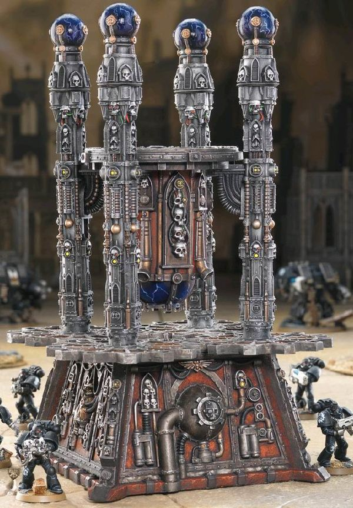

# 0071 虚空盾 Void shield

精校状态：中文行文已逐段精校，部分术语仍为暂定

分类：通用概念 / 帝国 Imperium

原文来源：https://www.bilibili.com/opus/1066359900514287633

原作者：帝国神选罐头

原文时间：2025年05月13日 15:01

[返回分类目录](目录.md) · [全书目录](../../目录.md)

<!-- A0071-B0001 -->
**英文原文**

Void shields are energy fields employed by the Imperium to protect everything from Super-Heavy Vehicles to massive starships. The shields operate via Warp technology, absorbing the energy of attacks and displacing them into the Immaterium. Void shields benefit from the fact that they can be raised again after taking damage and collapsing, even in the midst of combat. Void shields extend some distance from their point of origin, thus in some cases it is possible for an enemy to penetrate the shield and cause damage directly to the target.

<!-- /A0071-B0001 -->

<!-- A0071-B0002 -->

原译文

虚空盾是帝国用来保护从超重型载具到大型星际飞船的一切的能量场。护盾通过亚空间技术运作，吸收攻击的能量并将其转移到非物质界。虚空盾受益于这样一个事实，即使在战斗中，在受到伤害和坍塌后，它们也可以再次升起。虚空盾从其原点延伸一定距离，因此在某些情况下，敌人有可能穿透护盾并直接对目标造成伤害。

**校订译文**

虚空盾是帝国使用的能量场，可保护超重型载具乃至庞大的星舰。它们利用亚空间技术吸收攻击的能量，再将其转移至非物质界。虚空盾的一大优势是，即使因受击而崩溃，也能在战斗中重新启动。护盾通常投射在距离发生源一定距离的位置，因此在某些情况下，敌人可以进入护盾内侧，直接攻击受保护的目标。

<!-- /A0071-B0002 -->

<!-- A0071-B0003 图片 -->

<!-- A0071-B0004 -->

原译文

Void Shield Generator 虚空盾发生器

**校订译文**

Void Shield Generator 虚空盾发生器

<!-- /A0071-B0004 -->

<!-- A0071-B0005 -->
## Overview 概述

<!-- /A0071-B0005 -->

<!-- A0071-B0006 -->
**英文原文**

Activated void shields create a translucent bubble around their target, one which distorts visual light attempting to pass through and so creating an optical hazing effect. When displacing weapon impacts void shields ripple like gelatine and create a kaleidoscope of colours. The colours given off by a void shield under attack also indicate a shield's strength and how much punishment it can still take. Furthermore void shields create energy flares where they are hit, the size of which depends on the nature of the attack. Operational void shields also tend to give off a distinct ozone smell.

<!-- /A0071-B0006 -->

<!-- A0071-B0007 -->

原译文

激活的虚空盾会在目标周围产生一个的半透明气泡，这个气泡会扭曲试图穿过的可见光，从而产生光学模糊效果。当转移武器轰击时，虚空盾会像明胶一样波纹状，产生万花筒般的颜色。虚空盾在受到攻击时发出的颜色也表明了护盾的力量以及它仍然可以承受的惩罚程度。此外，虚空盾在被击中的地方会产生能量耀斑，其大小取决于攻击的性质。操作中的虚空盾也往往会散发出明显的臭氧气味。

**校订译文**

启动后，虚空盾会在保护对象周围形成半透明的泡状屏障。穿过屏障的可见光会发生扭曲，造成朦胧的视觉效果。转移武器轰击的能量时，护盾会像胶冻般泛起涟漪，呈现万花筒般的色彩。这些颜色也能反映护盾的强度及其尚能承受的打击程度。受击部位还会迸发能量耀斑，大小取决于攻击的性质。运行中的虚空盾通常会散发明显的臭氧气味。

<!-- /A0071-B0007 -->

<!-- A0071-B0008 -->
**英文原文**

The ability of certain objects or radiation to pass through void shields depends greatly on their design and nature, although most physical and energy attacks will be stopped. This includes weather effects like rain, which creates a crackling sounds as it impacts against the shield. Void shields of a certain power intensity can act as a impenetrable barrier which stops all movement and interfere with communication equipment like vox-casters, as well as prevent interdimensional travel.

<!-- /A0071-B0008 -->

<!-- A0071-B0009 -->

原译文

某些物体或辐射穿过虚空盾的能力在很大程度上取决于它们的设计和性质，尽管大多数物理和能量攻击都会被阻止。这包括雨等天气影响，当雨撞击护盾时会发出噼啪声。具有一定功率强度的虚空盾可以作为一个无法穿透的屏障，阻止所有运动，干扰音阵投射等通信设备，并防止跨维度航行。

**校订译文**

哪些物体或辐射能够穿过虚空盾，很大程度上取决于护盾的设计和性质；多数实体和能量攻击都会被拦截。雨水等自然降水也会受到阻挡，击中护盾时发出噼啪声。达到一定功率强度的虚空盾可以形成无法穿透的屏障，阻止一切穿越，干扰通讯器等通信设备，甚至阻断跨维度移动。

<!-- /A0071-B0009 -->

<!-- A0071-B0010 -->
### Void Shields by Type 虚空盾种类

<!-- /A0071-B0010 -->

<!-- A0071-B0011 -->
### Small-Scale Void Shields 小规模虚空盾

<!-- /A0071-B0011 -->

<!-- A0071-B0012 -->
**英文原文**

Void shields can be used to provide personal protection, although these are often reserved for special uses such as elite Enforcer squads on certain assignments. They are also frequently used to protect openings such as windows or doors. Besides giving off a distinct ozone smell, void shields protecting these openings create a barrier as solid as any wall. Anyone or anything caught within one of these openings when the shield is engaged will be sliced in two, both halves falling apart and the area intersected by the shield turned into a boiling fog of blood and atomised metal. These voids are also capable of keeping an atmosphere contained, a vital aspect when dealing with contaminated air.

<!-- /A0071-B0012 -->

<!-- A0071-B0013 -->

原译文

虚空盾可用于提供个人保护，尽管这些护盾通常用于特殊用途，如执行某些任务的精英执法者小队。它们也经常用于保护窗户或门等开口。除了散发出明显的臭氧气味外，保护这些开口的虚空盾还形成了与任何墙壁一样坚固的护盾。当护盾接合时，任何被困在其中一个开口内的人或物都会被切成两半，两半都会散开，护盾相交的区域变成沸腾的血液和雾化的金属雾。这些虚空盾还能够保持大气的可控性，这是处理污染空气时的一个重要方面。

**校订译文**

虚空盾也能提供个人防护，但此类设备通常只用于特殊场合，例如配发给执行特定任务的精锐执法者小队。虚空盾还常被用于封护门窗等开口，形成如实体墙壁一般坚固的屏障，并散发明显的臭氧气味。护盾启动时，任何恰好横跨开口的人或物都会被切成两半；两半分离，护盾切过的部位则化为翻腾的血雾和雾化金属。此类护盾还能密封空气，这在外界空气受到污染时尤为重要。

<!-- /A0071-B0013 -->

<!-- A0071-B0014 -->
**英文原文**

Larger void shields are used to protect individual buildings or relatively small areas. The Iron Warriors use fortified, void-shielded bunkers to withstand bombardments, while the Imperial Guard have used portable void shield generators stationed along trench lines to protect their troops from bombardment. Various Space Marine forces have also used portable void shield generators to erect a protective canopy over their positions.

<!-- /A0071-B0014 -->

<!-- A0071-B0015 -->

原译文

较大的虚空盾用于保护单个建筑物或相对较小的区域。钢铁勇士使用强化的虚空盾掩体来抵御轰炸，而帝国卫队则使用沿战壕线部署的便携式虚空盾发生器来保护他们的部队免受轰炸。各种星际战士也使用便携式虚空盾发生器在他们的位置上搭建了一个保盾。

**校订译文**

较大的虚空盾可保护单栋建筑或较小区域。钢铁勇士用配备虚空盾的加固掩体抵御轰炸；帝国卫队则曾沿战壕部署便携式虚空盾发生器，为部队遮蔽炮火。多支星际战士部队也曾用便携式发生器在阵地上方撑起防护屏障。

<!-- /A0071-B0015 -->

<!-- A0071-B0016 -->
**英文原文**

Wealthy individuals of the Imperium have also been known to protect their mansions and estates with void shields. They come in a variety of shapes and types, such as conical super-surface shields, and often the local Arbites are given information such as shield harmonics and override codes in cases of emergencies.

<!-- /A0071-B0016 -->

<!-- A0071-B0017 -->

原译文

帝国的贵族也以用虚空盾保护他们的豪宅和庄园而闻名。它们有各种形状和类型，如锥形超表面护盾，在紧急情况下，通常会向当地执法者提供护盾谐波和覆盖代码等信息。

**校订译文**

帝国的富裕人士也会用虚空盾保护宅邸和庄园。这些护盾形状和类型各异，例如锥形超表面护盾。为应对紧急情况，当地法务部执法人员通常会获知护盾谐波参数和强制接管代码等信息。

<!-- /A0071-B0017 -->

<!-- A0071-B0018 -->
### Titan Void Shields 泰坦虚空盾

<!-- /A0071-B0018 -->

<!-- A0071-B0019 -->
**英文原文**

Void shields serve as the main line of defence for Imperial Titans, with multiple generators creating overlapping shields for maximum effect. Each shield will absorb damage until it is overloaded, upon which safety features cut in and force the generator to shut down and bleed off excess energy before it is restarted again and made operable. In theory, a Titan will have some of its shields protecting it at all times. In cases of emergency the Titan's Princeps can override the cut-off and force the generator to remain active; this has the added risk of damaging the generator and turning it into a useless pool of molten slag as it is overwhelmed by enemy fire. Only war engines with three or more void shield generators are capable of this functionality.

<!-- /A0071-B0019 -->

<!-- A0071-B0020 -->

原译文

虚空盾是帝国泰坦的主要防御，多个发生器创建重叠护盾以获得最大效果。每个护盾都会吸收损坏，直到过载，在此情况下，安全功能会切断，迫使发生器关闭并释放多余的能量，然后再重新启动并可操作。理论上，泰坦将始终有一些护盾保护它。在紧急情况下，泰坦的首席可以覆盖切断，并迫使发生器保持活动状态；这增加了损坏发生器并将其变成无用的熔渣的风险，因为它被敌人的火力淹没了。只有具有三个或更多虚空盾发生器的战争引擎才能实现此功能。

**校订译文**

虚空盾是帝国泰坦的主要防线：多台发生器投射彼此重叠的护盾，以取得最佳防护效果。每层护盾持续吸收攻击能量，直至过载；随后安全机制介入，强制关闭发生器，释放多余能量，再重新启动。因此，理论上泰坦始终有部分护盾在保护它。紧急时，泰坦的首席驾驶员可以绕过自动切断机制，强制发生器继续运行；但敌方火力一旦超出其承受能力，就可能将发生器彻底烧毁，熔成一摊废渣。只有配备三台及以上虚空盾发生器的战争引擎才具备这种功能。

<!-- /A0071-B0020 -->

<!-- A0071-B0021 -->
**英文原文**

Protected by their void shields Titans are able to absorb damage which would normally destroy entire tank companies and infantry regiments. Even the small Warhound Scout Titan's shields are sufficient to absorb multiple impacts which, individually, would tear apart lesser armored fighting vehicles. Larger Titans like the Warlord Titan can withstand even more damage, taking sustained bombardment from over five dozen armored vehicles and artillery platforms without loss of shield strength. The most powerful void shields are those of the Emperor Titans, such as an Imperator. Even in a duel with dozens of Warlord and Reaver Titans, the smaller Titans' only hope to cause damage is to synchronize their fire perfectly so that all of their shots hit at exactly the same time at the same point and overload that section of the Imperator's shield.

<!-- /A0071-B0021 -->

<!-- A0071-B0022 -->

原译文

在虚空盾的保护下，泰坦能够吸收通常会摧毁整个坦克连和步兵兵团的伤害。即使是小型战犬侦察泰坦的护盾也足以吸收多次撞击，单独来看，这些轰击会撕裂较小的装甲战车。像军阀泰坦这样的大型泰坦可以承受更大的伤害，在不损失护盾强度的情况下，承受来自五十多辆装甲车和火炮平台的持续轰炸。最强大的虚空盾是帝皇泰坦的，比如统治者型。即使在与数十名军阀和收割者泰坦的决斗中，较小的泰坦造成伤害的唯一希望是完美地同步他们的火力，这样他们的所有射击都会在同一时间击中同一点，并使统治者型的护盾的该位置过载。

**校订译文**

在虚空盾保护下，泰坦足以承受通常能摧毁整支坦克连和步兵团的火力。即使较小的战犬级侦察泰坦，其护盾也能接连挡下多次足以单独撕碎较轻型装甲战车的打击。战将级泰坦等大型泰坦的防护更强，能够顶住六十余辆装甲车辆和火炮平台的持续轰击，而不损失护盾强度。最强大的虚空盾装备在统治者型等帝皇级泰坦上。即便数十台战将级与掠夺者级泰坦联手，其唯一有望造成伤害的办法，也是让所有火力在完全相同的时刻命中同一位置，使统治者型泰坦该处的护盾过载。

**校注：** over five dozen 是超过五打，即超过六十；原译“五十多”少算。Reaver 按本稿统一作“掠夺者”。

<!-- /A0071-B0022 -->

<!-- A0071-B0023 -->
**英文原文**

Void shields on Titans are projected at some distance from the war engine itself; for example the void shields on a Warhound extend out to ten metres surrounding the war engine, while those on larger Titans extend out to thirty or more. This means it is theoretically possible for armoured vehicles and infantry to bypass the shields and cause direct damage to a Titan, although in practice actually accomplishing this feat is much harder. In one extraordinary example the 3rd Armoured Company of the 124th Cadian regiment managed to disable a Chaos Battle Titan by slipping through its void shields and targeting its weakened knee, causing it to collapse, although nearly the entire company was wiped out except for a lone survivor. When Titans engage in close combat with each other not only do they get within the minimum range of their void shields, but their shields actually merge together. This same technique can be used by friendly Titans as a type of defensive tactic as well. Titan shields which merge together send colourful flares of lightning discharge into the air as their titanic energies push against each other, and when they collapse under enemy fire they tend to unleash a damaging blast wave of overpressure.

<!-- /A0071-B0023 -->

<!-- A0071-B0024 -->

原译文

泰坦身上的虚空盾投射在距离战争引擎一定距离处；例如，战犬上的虚空盾延伸到战争引擎周围十米处，而大型泰坦上的虚空盾延伸到三十米或更远。这意味着理论上装甲车和步兵有可能绕过护盾，对泰坦造成直接伤害，尽管在实践中实现这一壮举要困难得多。在一个非同寻常的例子中，第124卡迪亚兵团的第3装甲连队设法通过穿过其虚空盾并瞄准其脆弱的膝盖，使混沌战斗泰坦瘫痪，导致其崩溃，尽管除了一名幸存者外，几乎整个连队都被消灭了。当泰坦彼此进行近距离战斗时，他们不仅会进入虚空盾的最小范围内，而且他们的护盾实际上会合并在一起。同样的技术也可以被友军泰坦用作一种防御战术。当泰坦护盾融合在一起时，当它们的巨大能量相互推挤时，它们会向空中放出五颜六色的闪电，当它们在敌人的火力下坍塌时，它们往往会释放出破坏性的超压爆炸波。

**校订译文**

泰坦的虚空盾投射在机体之外一定距离处：战犬泰坦的护盾距离机体约十米，大型泰坦则可达三十米乃至更远。因此，装甲车辆和步兵在理论上能够进入护盾内侧，直接攻击泰坦，但实际做到远比听来困难。卡迪亚第124团第3装甲连曾穿过一台混沌战斗泰坦的虚空盾，集中攻击其薄弱的膝关节，使其倒塌失去战斗力；代价则是全连仅一人生还。泰坦相互近战时，不仅会进入对方护盾的内侧，双方护盾还会实际融合。友军泰坦也能利用这一现象实施防御。融合的护盾中，庞大能量相互挤压，将彩色电弧喷向空中；若在敌方火力下崩溃，往往还会释放具有破坏力的超压冲击波。

<!-- /A0071-B0024 -->

<!-- A0071-B0025 -->
**英文原文**

Titan void shields can be bypassed through teleportation such as in the case of Terminator Titanhammer Squads or special Warp Missiles which travel through the Warp. They can however be configured to create a solid wall which allows nothing to pass, not even transdimensional travel such as that used by the Necrons, but this requires increasing the power intensity to critical levels which threaten to cause catastrophic overload. It is also possible to bypass a Titan's void shields if you have access to technical specifications which detail any mild shield defects. Such defects are atomically small but, if known, would allow an enemy Titan to target that precise location and overload the shields with less firepower than would normally be required.

<!-- /A0071-B0025 -->

<!-- A0071-B0026 -->

原译文

泰坦虚空盾可以通过传送绕过，例如在终结者泰坦之锤小队或穿过亚空间的特殊亚空间导弹的情况下。然而，它们可以被配置为创建一个坚固的墙壁，不允许任何东西通过，甚至不允许像死灵那样的跨维度航行，但这需要将功率强度提高到临界水平，这可能会导致灾难性的过载。如果你能获得详细说明任何轻微护盾缺陷的技术规格，也可以绕过泰坦的虚空盾。这些缺陷在原子级别上也很小，但如果知道的话，将允许敌方泰坦瞄准该精确位置，并以比通常所需更少的火力使护盾过载。

**校订译文**

传送能够绕过泰坦虚空盾，例如泰坦之锤终结者小队的传送突击，以及穿行亚空间的特殊亚空间导弹。不过，护盾也可调整为阻断一切通行的屏障，甚至拦截太空死灵采用的跨维度移动。这样做需要把功率强度提升至临界水平，存在灾难性过载的风险。另一种突破方法是取得记载护盾细微缺陷的技术资料。这些缺陷仅有原子尺度，但若掌握其位置，敌方泰坦就能精确瞄准，以比通常更少的火力使护盾过载。

<!-- /A0071-B0026 -->

<!-- A0071-B0027 -->
### Large-Scale Void Shields 大规模虚空盾

<!-- /A0071-B0027 -->

<!-- A0071-B0028 -->
**英文原文**

Overlapping void shields are often one of the primary means of defence for various fortresses and Hive Cities, extending some distance out to create a protective dome. Typically each section of wall, tower or buttress will have its own void shield projectors to defend against attack. The chief means of bringing down these void shields is through massive continual bombardment, overloading the shields with enough energy to either force the generators to cut out or explode. It is also possible to slip through during a momentary break in the field and knock out the generators. For example, some fortress voids must be lowered in order for the defenders to return fire.

<!-- /A0071-B0028 -->

<!-- A0071-B0029 -->

原译文

重叠的虚空盾通常是各种堡垒和巢都城市的主要防御手段之一，向外延伸一段距离以形成一个保护性穹顶。通常，墙壁、塔楼或扶壁的每一部分都有自己的虚空盾牌投射器来防御攻击。摧毁这些虚空盾的主要手段是通过大规模的持续轰炸，使护盾过载，使其有足够的能量迫使发生器切断或爆炸。也有可能在立场短暂中断的间隙把发生器毁坏。例如，一些堡垒虚空盾必须降低，以便防御者还击。

**校订译文**

彼此重叠的虚空盾是许多堡垒和巢都的主要防御手段之一；它们向外延伸，在设施周围形成防护穹顶。通常，每段城墙、每座塔楼或扶壁都有自己的虚空盾投射器。攻破护盾的主要办法是持续进行大规模轰击，灌入足够能量使其过载，迫使发生器停机或爆炸。攻击者也可以趁力场短暂中断时潜入，摧毁发生器。例如，某些堡垒的守军必须先关闭虚空盾，才能向外还击。

<!-- /A0071-B0029 -->

<!-- A0071-B0030 -->
**英文原文**

In addition, since many of these void shields are geared towards defending against high-velocity kinetic and energy attacks, slow-marching infantry and vehicles are able to penetrate through the protective cover. Others, geared as they are to protecting against bombardment, will even allow aircraft such as Valkyries to pass through their envelope, the energies of their passage arcing off the fuselage and creating an electric tinge in the air. There is tremendous risk involved in this strategy though, as weapon impacts against the void shield create incandescently bright energy flares. Even at a distance of over one hundred and fifty metres these flares present a hazard to the encroaching forces, and are so bright they require the use of photoflash goggles to avoid blindness. As is often the case for these void shields they are usually connected to a curtain wall which provides a more solid barrier against entry, although here it is possible if the enemy gets close enough to try and find a gap between shield and wall and exploit it with weapons fire.

<!-- /A0071-B0030 -->

<!-- A0071-B0031 -->

原译文

此外，由于许多这种虚空盾都是为了防御高速动能和能量攻击，行进缓慢的步兵和载具能够穿透护盾。其他的，因为它们是为了防止轰炸而设计的，甚至会允许像瓦尔基里这样的飞机穿过它们的外壳，它们通过的能量会从机身上电弧出来，在空气中产生电丝。然而，这种策略存在巨大的风险，因为武器撞击虚空盾会产生炽热明亮的能量耀斑。即使在150米以上的距离，这些耀斑也会对入侵的部队构成危险，而且非常明亮，需要使用闪光护目镜来避免失明。与这些虚空盾的情况一样，它们通常连接到幕墙上，幕墙为阻止进入提供了更坚固的护盾，尽管在这里，如果敌人靠得足够近，试图找到护盾和墙壁之间的缝隙，并用武器射击来利用它，也是有可能突破的。

**校订译文**

许多此类虚空盾主要防范高速动能弹体和能量攻击，因此缓慢前进的步兵与车辆可以穿过。有些专为抵御轰炸设计的护盾，甚至允许女武神炮艇等飞行器穿越；穿越时能量沿机身跃动，在空气中留下电弧。不过，这种做法极为危险：武器击中虚空盾会产生炽亮的能量耀斑，即使相距一百五十余米，也足以危及接近中的部队，必须佩戴防强光护目镜才能避免失明。此类护盾通常还与城墙相接，后者可用实体结构阻止敌人进入。即便如此，敌人靠得足够近时，仍可能找到护盾与墙体之间的缝隙，并向其中开火。

<!-- /A0071-B0031 -->

<!-- A0071-B0032 -->
**英文原文**

Void shields on this scale have a tremendous impact on the surrounding atmosphere, producing an insulation effect which will keep the ambient temperature inside the shield warmer than the surrounding environment and stop precipitation from getting in. This effect is used to retain a breathable atmosphere in cases where the environment would not normally allow it, although sometimes the air inside can become clammy, almost oppressive, when the shield is activated. This same ability to retain an atmosphere can sometimes result in rather violent aftereffects when the void shields collapse under enemy fire, producing a powerful wave of overpressure to scour across the battlefield and pull the oxygen from soldier's lungs, blind them or burst their eardrums if not fully protected.

<!-- /A0071-B0032 -->

<!-- A0071-B0033 -->

原译文

这种规模的虚空盾对周围大气有巨大的影响，产生隔热效果，使护盾内的环境温度比周围环境更高，并阻止降水进入。这种效果用于在环境通常不允许的情况下保持可呼吸的空气，尽管有时当护盾被激活时，内部的空气会变得湿冷，几乎令人窒息。这种保持大气层的能力有时会导致相当剧烈的后遗症，当虚空盾在敌人的火力下坍塌时，会产生强大的超压波，在战场上冲刷，从士兵的肺部抽出氧气，使他们失明，或者如果没有得到充分保护，会爆裂他们的耳膜。

**校订译文**

如此规模的虚空盾会显著影响周围大气。它们具有隔热作用，使内部温度高于外界，同时阻挡降水。在原本无法提供可呼吸空气的环境中，这种效果可以维持内部空气；不过，护盾启动后，内部有时会变得潮湿闷窒。密封空气的特性也可能在护盾被敌方火力击溃时引发猛烈后果：强大的超压冲击波横扫战场，可能将空气从士兵肺中抽走，令防护不足者失明或鼓膜破裂。

**校注：** 原文将超压波与肺部失气等效应并述，物理机制未展开；保留所述效果，不补写科学解释。

<!-- /A0071-B0033 -->

<!-- A0071-B0034 -->
**英文原文**

Particularly large void shield generators can be used to hide a portion of a planet's surface from orbital scans in order to mask troop movements from the enemy. A by-product of this effect is that weather patterns are significantly disrupted, creating freak storms which can cover large areas.

<!-- /A0071-B0034 -->

<!-- A0071-B0035 -->

原译文

特别大的虚空盾发生器可用于隐藏行星表面的一部分，使其免受轨道扫描的影响，从而掩盖敌方的部队行动。这种影响的一个副产品是天气模式受到严重破坏，产生了可以覆盖大片地区的反常风暴。

**校订译文**

特别巨大的虚空盾发生器可以遮蔽部分行星表面，使轨道扫描无法探知，从而向敌人隐藏己方部队的调动。其副作用是严重扰乱天气，产生覆盖大片区域的反常风暴。

<!-- /A0071-B0035 -->

<!-- A0071-B0036 -->
### Ship Void Shields 舰船虚空盾

<!-- /A0071-B0036 -->

<!-- A0071-B0037 -->
**英文原文**

Void shields are found on both civilian and military starships so that they may survive the hazards of space travel. Forming a teardrop of invisible energy around the ship, they are able to absorb and deflect stellar radiation and meteor showers, even weapons fire in the case of military vessels. Ships are protected by multiple layers of void shields, each one able to absorb a limited amount of energy before it collapses and the generator temporarily shuts down to bleed off energy. Active void shields also prevent the use of teleportation, forcing enemy ships to bring down their target's defenses before they can initiate boarding actions. It is also possible for a ship to shift power between different shields on a particular side of the vessel to better deflect an attack.

<!-- /A0071-B0037 -->

<!-- A0071-B0038 -->

原译文

民用和军用舰船都有虚空盾，这样它们就可以在太空航行的危险中幸存下来。它们在飞船周围形成一圈泪滴状的看不见的能量，能够吸收和偏转恒星辐射和流星雨，甚至在军舰的情况下可以发射武器。舰船受到多层虚空盾的保护，每层都能在崩溃前吸收有限的能量，发生器暂时关闭以释放能量。主动虚空盾还可以防止使用传送，迫使敌方舰船在开始跳帮行动之前摧毁目标的防御。船也可以在船的特定一侧的不同护盾之间转移动力，以更好地偏转攻击。

**校订译文**

民用与军用星舰均可装备虚空盾，以应对太空航行的危险。护盾在舰船周围形成泪滴状的无形能量场，吸收或偏转恒星辐射和流星体；军舰的护盾还能抵御武器火力。舰船通常有多层虚空盾，每层只能吸收一定能量，达到极限后便会崩溃，发生器暂时停机泄能。运行中的护盾还会阻止传送，因此敌舰必须先击破目标的防护，才能发起传送跳帮。舰船也可以在某一舷侧的不同护盾之间调配供能，更有效地抵御来袭火力。

<!-- /A0071-B0038 -->

<!-- A0071-B0039 -->
**英文原文**

As with smaller void shields, those on ships are projected some distance from the vessel, upwards of a hundred metres or more depending on the type. Normally void shields provide no barrier against Attack Craft and Torpedoes, and thus any which get through can cause direct damage to the vessel. However, void shields have stopped torpedoes and attack craft on several occasions. In addition, a warship simply raising its void shields presents a danger to attack craft as the flux of energy backwash can overload their systems, while the massive energy flares created by weapon impacts on the void shields are extremely hazardous. Finally when a ship's void shields collapse they create a powerful shockwave of electromagnetic energy which can scatter and destroy attack craft.

<!-- /A0071-B0039 -->

<!-- A0071-B0040 -->

原译文

与较小的虚空盾一样，船上的虚空盾被投射到离船一定距离的地方，根据类型的不同，可达一百米或更远。通常，虚空盾对攻击机和鱼雷没有护盾，因此任何通过护盾的都会对船只造成直接伤害。然而，虚空盾已经多次拦截鱼雷和攻击机。此外，一艘军舰简单地升起其虚空盾就对攻击机构成危险，因为能量回流的通量会使其系统过载，而武器撞击虚空盾产生的巨大能量耀斑则极其危险。最后，当一艘船的虚空盾坍塌时，它们会产生强大的电磁能冲击波，可以散射并摧毁攻击机。

**校订译文**

与较小的虚空盾一样，舰船护盾也投射在舰体之外；依型号不同，间距可达一百米或更远。通常，虚空盾无法阻拦攻击艇和鱼雷，穿过者便能直接攻击舰体；不过，也曾多次出现护盾将它们挡住的情况。此外，军舰仅仅启动护盾便可能危及攻击艇，能量反冲足以使艇上系统过载；武器命中护盾时产生的大规模能量耀斑同样极为危险。护盾崩溃时释放的强烈电磁能冲击波，则能冲散乃至摧毁攻击艇。

**校注：** 原文同时记载护盾通常放过、但有时挡住攻击艇和鱼雷；作为不同实例保留，不以单一规则消除差异。

<!-- /A0071-B0040 -->

<!-- A0071-B0041 -->
**英文原文**

Ship-based void shields operate using wave harmonics; any change in their frequency can cause interference with the gravitic fields of tractor beam weapons. Special types of shields whose frequency has been adjusted to better deflect stellar debris such as plasma clouds, nebula and ice rings known as Repulsor Shields are commercially available.

<!-- /A0071-B0041 -->

<!-- A0071-B0042 -->

原译文

舰载虚空盾利用波浪谐波进行操作；它们频率的任何变化都会对牵引光束武器的重力场造成干扰。商业上可以买到特殊类型的护盾，其频率经过调整，可以更好地偏转等离子云、星云和冰环等恒星碎片，称为“反击盾”。

**校订译文**

舰载虚空盾通过波动谐波运作，频率变化可能干扰牵引光束武器的引力场。市面上还可以买到一种名为“排斥盾”的特殊护盾；其频率经过调整，更擅长排开等离子云、星云物质和冰环等太空物质。

<!-- /A0071-B0042 -->

<!-- A0071-B0043 -->
**英文原文**

Standard doctrine for the Imperial Navy is to maintain void shields at fifty percent capacity, however few Captains strictly adhere to this rule on account of the tremendous energy necessary and increased maintenance this would have on their ships. Most will maintain voids at minimum power in "safe" situations such as being in orbit above an Imperial world at a Navy port.

<!-- /A0071-B0043 -->

<!-- A0071-B0044 -->

原译文

帝国海军的标准原则是将虚空盾保持在50%的容量，但很少有船长严格遵守这一规则，因为这将对他们的船只产生巨大的能量和维护的增加。大多数将在“安全”情况下以最小功率保持虚空盾，例如在帝国世界上空的轨道的海军港口上。

**校订译文**

帝国海军的标准规程要求虚空盾维持在最大能力的百分之五十。不过，这样做耗能巨大，也会增加维护负担，因此很少有舰长严格遵守。在被认为“安全”的场合，例如停泊于帝国世界上空的轨道海军港口时，多数舰长只会让护盾以最低功率运行。

<!-- /A0071-B0044 -->

本篇核心术语与暂定项

以下列出本篇出现的英文原形及核心术语表用词。同形词可能指不同对象，具体词义以本篇正文和校注为准；单复数、别名和仅见于图注的名称可能尚未列入。完整候选见[术语表](../../术语表/双语术语候选.csv)。

| 英文 | 采用中文 | 状态 |
| --- | --- | --- |
| Imperial Guard | 帝国卫队 | 暂定·语境区分 |
| Necrons | 太空死灵 | 官方已核对 |
| Terminator | 终结者 | 官方已核对 |
| Warp | 亚空间 | 官方已核对 |
| Imperium | 帝国 | 暂定·简称 |
| Imperial Navy | 帝国海军 | 暂定 |
| Teleportation | 传送 | 暂定 |
| Equipment | 装备 | 编辑用语已统一 |
| Emperor | 帝皇 | 官方已核对 |
| Iron Warriors | 钢铁勇士 | 暂定·官方待核 |
| Titan | 泰坦 | 暂定·官方待核 |
| Princeps | 首席 | 暂定·官方待核 |
| Space Marine | 星际战士 | 暂定·官方待核 |
| Scout | 侦察兵 | 暂定·官方待核 |
| Repulsor | 反重力战车 | 官方已核 |
| Initiate | 正式成员 | 暂定·官方待核 |
| Warlord Titan | 战将级泰坦 | 官方已核对 |

