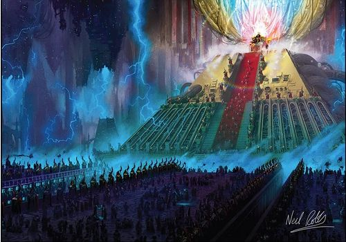
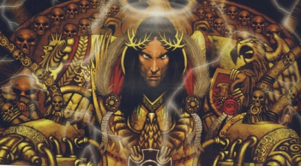

# 0073 黄金王座 Golden Throne

精校状态：中文行文已逐段精校，部分术语仍为暂定

分类：通用概念 / 帝国 Imperium

原文来源：https://www.bilibili.com/opus/1052221774423392279

原作者：帝国神选罐头

原文时间：2025年04月05日 12:37

[返回分类目录](目录.md) · [全书目录](../../目录.md)

<!-- A0073-B0001 -->
**英文原文**

The Golden Throne is an ancient and arcane device located in the Imperial Palace on Terra. It currently houses and sustains the remains of the Emperor of Mankind.

<!-- /A0073-B0001 -->

<!-- A0073-B0002 -->

原译文

黄金王座是一个古老而神秘的装置，位于泰拉上的皇宫。它目前容纳并保存着人类帝皇的遗体。

**校订译文**

黄金王座是位于泰拉皇宫的一台古老而玄奥的装置，如今承载着人类帝皇残存的躯体，并维系其生命。

<!-- /A0073-B0002 -->

<!-- A0073-B0003 图片 -->

<!-- A0073-B0004 -->

原译文

The remains of the Emperor of Mankind upon the Golden Throne 人类帝皇在黄金王座上的遗体

**校订译文**

The remains of the Emperor of Mankind upon the Golden Throne 黄金王座上人类帝皇残存的躯体

<!-- /A0073-B0004 -->

<!-- A0073-B0005 -->
## History 历史

<!-- /A0073-B0005 -->

<!-- A0073-B0006 -->
### Pre-Heresy 叛乱前

<!-- /A0073-B0006 -->

<!-- A0073-B0007 -->
**英文原文**

The Golden Throne was thought to be an ancient relic dating back to the Dark Age of Technology which the Emperor discovered in sunken ruins within Asia's deserts, although even the Emperor Himself was unsure whether the idea was His, or to what extent the devices he discovered had served as inspiration. Another similar device likely used to test the technologies by whoever made it, known as Dark Glass, was also discovered by the Emperor during the Great Crusade and he set about restoring it as well.

<!-- /A0073-B0007 -->

<!-- A0073-B0008 -->

原译文

黄金王座被认为是一个古老的遗物，可以追溯到黑暗技术时代，帝皇在亚洲沙漠中的沉没废墟中发现了它，尽管就连帝皇自己也不确定这个想法是否是他的，或者他发现的装置在多大程度上起到了灵感的作用。帝皇在大远征期间也发现了另一种类似的设备，被称为黑色琉璃，可能是由制造者用来测试这些技术的，他也着手修复它。

**校订译文**

黄金王座被认为是黑暗科技时代的遗物，由帝皇在亚洲沙漠中被掩埋的废墟里发现。不过，就连帝皇自己也不确定，王座的构想究竟出自他本人，还是在多大程度上受到了所发现装置的启发。大远征期间，他还发现了另一台名为“黑暗琉璃”的类似装置，并着手修复；其制造者可能曾用它试验相关技术。

<!-- /A0073-B0008 -->

<!-- A0073-B0009 -->
**英文原文**

The Emperor then went to work to restore the device for his own ends, providing Human access to the Eldar Webway. Once installed under the Imperial Palace the Golden Throne took the form of a bulky machine-like chair suspended over gigantic mechanised doors made of gold metal. The doors were said to be large enough for a Warhound Scout Titan to walk through unbowed. The chair was linked to the portal by huge bundles of cables, wires and conduits. The whole machine was made of the same golden metal. The throne was built at one end of a vast hall big enough to house up to six fully equipped Space Marine Companies. This was the Emperor's main laboratory, which was itself at the centre of his underground complex, known as the Imperial Dungeon. Even after the Throne's construction, the lab remained littered with other huge machines and storage crates. Hundreds of red-robed technicians and labourers worked in the lab. According to Pieter Achelieux, the Golden Throne would have required an extremely powerful Psyker to operate and implied that one of the Primarchs may have been designed for this role. The Emperor's disappointment with Magnus the Red's betrayal suggests that he was intended to sit upon the throne.

<!-- /A0073-B0009 -->

<!-- A0073-B0010 -->

原译文

然后，帝皇开始为自己的目的修复该设备，为人类提供了通往灵族网道的通道。一旦安装在皇宫下，黄金王座就变成了一把笨重的机械椅子，悬挂在由金色金属制成的巨大机械门上。据说这些门足够大，可以让一名战犬侦察泰坦不受约束地穿过。椅子通过一大捆电缆、电线和导管与大门相连。整台机器都是用同样的金色金属制成的。王座建在一个巨大大厅的一端，这个大厅足够容纳六个设备齐全的星际战士连队。这是帝皇的主要实验室，它本身就是他的地下建筑群的中心，被称为帝国地牢。即使在王座建造之后，实验室仍然散落着其他巨大的机器和存储箱。数百名身着红袍的技术人员和工人在实验室工作。据彼得·阿舍利厄介绍，黄金王座需要一个极其强大的灵能者来操作，并暗示其中一名远征可能是为这个角色设计的。帝皇对赤红之马格努斯的背叛感到失望，这表明他预期应该坐上王座。

**校订译文**

帝皇修复这台装置，是为了实现自己的目标：让人类进入灵族网道。安装在皇宫下方后，黄金王座呈现为一张庞大的机械座椅，悬于金色金属制成的巨型机械门上方。据说大门足以让一台战犬级侦察泰坦昂首通过。粗大的电缆、线路和管道将座椅与传送门相连，整套装置都由同一种金色金属制成。王座坐落于一座巨大大厅的一端，厅内足以容纳六个装备齐全的星际战士连。这座大厅是帝皇的主要实验室，也是名为“帝国地牢”的地下建筑群的中心。王座建成后，实验室里依然遍布其他巨型机器和储物箱，数百名红袍技术人员及工人在此工作。彼得·阿舍利厄曾指出，黄金王座需要极为强大的灵能者才能操作，并暗示某位原体可能就是为此而创造的。帝皇对红魔马格努斯背叛的失望，也暗示他原本打算让马格努斯坐上王座。

**校注：** 原译把 Primarch 误作“远征”；据英文修正。马格努斯作为王座预定操作者仍是本段据情节所作暗示，未提升为明确陈述。

<!-- /A0073-B0010 -->

<!-- A0073-B0011 -->
**英文原文**

The Emperor built the throne as a means of entering the Webway. Having this fixed point of entry was meant to free humanity from its reliance on Warp-ships and astrotelepathy, since humans could simply enter the Webway and emerge wherever they chose in the galaxy. He sent armies of workers through the portal and had them construct a new short section of Webway linking to the rest of the abandoned Eldar network. Since the original Webway was built of a psychically resistant material which the humans could not replicate, the Emperor used his powers, via the Golden Throne, to protect the human-built section from the Warp. Because of the sensitive nature of the project and due to fears of how the Navis Nobilite would react to their monopoly on interstellar travel being rendered obsolete, the Emperor kept the Throne a secret from even his sons.

<!-- /A0073-B0011 -->

<!-- A0073-B0012 -->

原译文

帝皇建造王座是进入网道的一种手段。拥有这个固定的入口点意味着将人类从对亚空间飞船和星语通讯的依赖中解放出来，因为人类可以简单地进入网道，并在银河系中的任何地方出现。他派遣了大批工人通过门户，让他们建造了一段新的小段网道，与废弃的灵族网络的其他部分相连。由于最初的网道是由人类无法复制的抗灵能物质建造的，帝皇通过黄金王座使用他的力量来保护人类建造的部分免受亚空间。由于该项目的敏感性，以及担心导航者家族会如何应对他们对星际旅行的垄断被淘汰，帝皇甚至对他的儿子们都保密了关于王座的信息。

**校订译文**

帝皇建造王座，是要建立一个进入网道的固定入口。人类只需进入网道，便可在银河系中选定的地点离开，从而摆脱对亚空间舰船与星语通信的依赖。他派遣大批工人穿过传送门，修建了一小段新网道，将其接入灵族废弃的网道网络。原有网道采用能够抵抗灵能力量的材料建造，而人类无法复制这种材料，因此帝皇必须借助黄金王座施展力量，保护人类建造的部分免受亚空间侵袭。计划极为敏感，而且一旦成功，导航员家族对星际航行的垄断就会失去意义；出于这些顾虑，帝皇甚至对自己的儿子们也隐瞒了黄金王座的秘密。

<!-- /A0073-B0012 -->

<!-- A0073-B0013 -->
**英文原文**

The Golden Throne is connected to a massive Warp beacon known as the Astronomican which generates a system of signals making faster-than-light travel in the Imperium possible.

<!-- /A0073-B0013 -->

<!-- A0073-B0014 -->

原译文

黄金王座与一个名为星炬的巨大亚空间信标相连，该信标产生一个信号系统，使帝国中的超光速旅行成为可能。

**校订译文**

黄金王座与一个名为星炬的巨大亚空间信标相连，该信标产生一个信号系统，使帝国中的超光速旅行成为可能。

<!-- /A0073-B0014 -->

<!-- A0073-B0015 -->
### The Horus Heresy 荷鲁斯之乱

原题：The Horus Heresy 荷鲁斯叛乱

<!-- /A0073-B0015 -->

<!-- A0073-B0016 -->
**英文原文**

At the outset of the Horus Heresy, when Magnus the Red used his sorcerous powers to warn the Emperor of Horus's treachery, he inadvertently created huge holes in the Emperor's psychic shield. Daemons poured into the human-built portion of the Webway and slaughtered thousands of Adeptus Mechanicus workers there. The Custodian Guard and Sisters of Silence were left fighting a desperate battle to prevent the daemons from reaching the portal and breaching Terra itself. Eventually the Imperial forces had to abandon the Webway and retreat back into the Imperial Palace. The portal was closed but only the psychic power of the Emperor was enough to keep it that way so he was forced to remain on the Golden Throne or find a suitable replacement. Later Vulkan arrived in the throneroom, where at the Emperor's guidance he installed the Talisman of Seven Hammers. This device acts as a dead man's switch which would destroy not only the Imperial Palace but also all of Terra should the Golden Throne fail. This would deny the forces of Chaos from ever taking the throneworld.

<!-- /A0073-B0016 -->

<!-- A0073-B0017 -->

原译文

在荷鲁斯叛乱开始时，当赤红之马格努斯使用他的魔法力量警告帝皇荷鲁斯的背叛时，他无意中在帝皇的灵能屏障上制造了巨大的洞。恶魔涌入网道的人造部分，并在那里屠杀了数千名机械神教工人。禁军和寂静修女正在进行一场绝望的战斗，以阻止恶魔到达入口并破坏泰拉本身。最终，帝国军队不得不放弃网道，撤退回皇宫。大门被关闭了，但只有帝皇的灵能力量足以保持这种状态，所以他被迫留在黄金王座上或寻找合适的替代品。后来，沃坎来到了地下密室，在帝皇的指导下，他安装了七锤护符。这个装置就像一个失能开关，如果黄金王座失败，它不仅会摧毁皇宫，还会摧毁整个泰拉。这将使混沌势力永远无法占领王座世界。

**校订译文**

荷鲁斯之乱初起时，红魔马格努斯试图用巫术向帝皇示警，告知荷鲁斯的背叛，却无意间在帝皇的灵能屏障上撕开巨大缺口。恶魔涌入人类建造的网道，屠杀了数千名机械修会工人。禁军与寂静修女苦战死守，阻止恶魔抵达传送门、侵入泰拉。最终，帝国部队不得不放弃网道，退回皇宫。传送门虽已关闭，却只有帝皇的灵能力量足以维持封闭；他因此必须留在黄金王座上，或找到能够代替他的人。后来，沃坎来到王座厅，在帝皇指引下安装了七锤护身符。它相当于一道失能触发装置：一旦黄金王座失效，便会摧毁皇宫乃至整个泰拉，使混沌永远无法夺取王座世界。

<!-- /A0073-B0017 -->

<!-- A0073-B0018 图片 -->

<!-- A0073-B0019 -->

原译文

The Emperor upon the Golden Throne during the Siege of Terra 在泰拉围城期间登上黄金王座的帝皇

**校订译文**

The Emperor upon the Golden Throne during the Siege of Terra 泰拉围城期间坐在黄金王座上的帝皇

<!-- /A0073-B0019 -->

<!-- A0073-B0020 -->
**英文原文**

When the Emperor was forced to battle Horus on board the Sons of Horus flagship, the Vengeful Spirit, his place on the throne was taken briefly by Malcador the Sigillite. Malcador perished performing this endeavor, and the mortally wounded Emperor was reinstated upon the Throne after his battle with Horus. At his instruction, it was then enhanced and converted into the life-sustaining form it currently bears. The Emperor's physical form is kept alive on the Golden Throne through advanced stasis fields and psi-fusion reactors that has become beyond the understanding of the Imperium.

<!-- /A0073-B0020 -->

<!-- A0073-B0021 -->

原译文

当帝皇被迫跳帮荷鲁斯之子旗舰复仇之魂号与荷鲁斯作战时，他在王座上的位置被掌印者马卡多短暂地占据了。马卡多在执行这一任务时牺牲了，受了致命伤的帝皇在与荷鲁斯作战后回到了王座。在他的指示下，它被增强并转化为目前所具有的维持生命的形式。帝皇的身体形态通过先进的停滞场和灵能聚变反应堆在黄金王座上保持活力，这已经超出了帝国的理解。

**校订译文**

帝皇不得不登上荷鲁斯之子旗舰“复仇之魂”号迎战荷鲁斯时，由掌印者马卡多暂时替他坐镇王座。马卡多为此殒命；帝皇则在与荷鲁斯交战后身负致命重伤，被重新安置在王座上。按照他的指示，王座随后得到强化，改造成如今维系生命的装置。先进的静滞力场和灵能聚变反应堆维持着帝皇躯体的生命，而这些技术如今已超出帝国的理解。

<!-- /A0073-B0021 -->

<!-- A0073-B0022 图片 -->

<!-- A0073-B0023 -->

原译文

The Emperor sits upon the Golden Throne during the Horus Heresy 荷鲁斯叛乱时期，帝皇坐在黄金王座上

**校订译文**

The Emperor sits upon the Golden Throne during the Horus Heresy 荷鲁斯之乱时期，帝皇坐在黄金王座上

<!-- /A0073-B0023 -->

<!-- A0073-B0024 -->
### Malfunction 故障

<!-- /A0073-B0024 -->

<!-- A0073-B0025 -->
**英文原文**

By late M36, the Golden Throne began to require more and more sacrifice of Psykers to remain functional. By early M41, four times the amount of Psykers were required to maintain optimal power levels of the Throne. In the last year of M41, Techpriests discovered failures in the mechanisms of the Golden Throne that are far beyond their ability to repair. Faced with this cataclysmic scenario, several high-ranking members of the Imperium decided to act. Shortly before the formation of the Great Rift the scheme manifested when the Lord Inquisitor Adamara Rassilo attempted to smuggle a Dark Eldar Haemonculus onto Terra in cooperation with three members of the High Lords of Terra: Fabricator-General Oud Oudia Raskian, Speaker for the Chartist Captains Kania Dhanda, and Master of the Astronomican Leops Franck. However the Haemonculus betrayed the conspirators, disappearing beneath the Imperial Palace and conducting grotesque killings and experimentations. Ultimately the Haemonculus was cornered and slain by Lord Inquisitor Erasmus Crowl and Custodes under Navradaran and Rassilo's cabal was shattered with it. Despite this setback Leops Franck was able to send out a delegation of Tech-Priests and Xanthite Inquisitors for the final phase of the Project. Launching an expedition into the Webway, the Tech-Priest and Inquisition forces battled through Harlequins and Daemons alike before reaching Commorragh. There, a dark bargain was struck.

<!-- /A0073-B0025 -->

<!-- A0073-B0026 -->

原译文

到M36晚期，黄金王座开始需要越来越多的灵能者牺牲才能保持功能。到M41早期，需要四倍的灵能者来维持王座的最佳功率水平。在M41的最后一年，技术神甫发现了黄金王座机制的故障，这些故障远远超出了他们的修复能力。面对这场灾难性的场景，帝国的几名高级成员决定采取行动。在大裂隙形成前不久，当大审判官阿达玛拉·拉西洛试图与泰拉高领主的三名成员合作，将一只黑暗灵族血伶人走私到泰拉上时，该计划浮出水面：铸造将军乌德·乌迪亚·拉斯基、宪章船长卡尼亚·丹达的发言人和星炬庭之主利奥普·弗兰克。然而，血伶人背叛了密谋者，消失在皇宫之下，进行了怪诞的杀戮和实验。最终，血伶人被纳瓦拉达仑手下的禁军和大审判官伊拉斯谟·克劳逼入绝境并杀死，拉西洛的阴谋集团也随之瓦解。尽管遭遇了挫折，利奥普·弗兰克还是派出了一个由技术神甫和赞瑟斯派审判官组成的代表团，参加了该项目的最后阶段。技术神甫和审判庭部队向网道发起探险，在到达科摩罗之前，他们与丑角和恶魔之间进行了战斗。在那里，达成了一项黑暗的交易。

**校订译文**

到 M36 晚期，黄金王座需要献祭越来越多的灵能者，才能继续运转。到 M41 初期，为维持最佳功率，所需灵能者已增至原来的四倍。M41 最后一年，技术祭司发现王座内部出现了远超他们修复能力的机械故障。面对可能到来的灾难，几位帝国高层决定采取行动。大裂隙形成前不久，领主审判官阿达玛拉·拉西洛与三位泰拉高领主——铸造将军乌德·乌迪亚·拉斯基、特许舰长代言人卡尼亚·丹达，以及星炬之主利奥普·弗兰克——合谋，将一名黑暗灵族血伶人秘密带入泰拉。然而，血伶人背叛了合谋者，潜入皇宫地下，实施骇人的杀戮和实验。领主审判官伊拉斯谟·克劳与纳瓦拉达仑率领的禁军最终将其堵截并杀死，拉西洛的密谋集团也随之瓦解。尽管如此，利奥普·弗兰克仍派出由技术祭司和赞瑟斯派审判官组成的使团，推进计划的最后阶段。机械修会与审判庭的远征部队进入网道，与丑角和恶魔交战，最终抵达科摩罗，在那里达成了一笔黑暗交易。

<!-- /A0073-B0026 -->

<!-- A0073-B0027 图片 -->

<!-- A0073-B0028 -->

原译文

The Emperor's Palace, the Sanctum Imperialis: The Emperor, his Custodians 帝皇宫殿，神圣帝国：帝皇，他的禁军

**校订译文**

The Emperor's Palace, the Sanctum Imperialis: The Emperor, his Custodians 皇宫中的帝皇圣所：帝皇与禁军

<!-- /A0073-B0028 -->

<!-- A0073-B0029 -->
**英文原文**

The bargain saw the Mechanicum give up billions of Humans as slaves and access to the Golden Throne by the Dark Eldar in exchange for a technical solution to its malfunction. In truth the bargain was beneficial for both parties, for it allowed the Dark Eldar to begin development of their own Golden Throne in an attempt to stop the destructive Daemonic incursions that had erupted into Commorragh which have only intensified since the formation of the Great Rift. However according to Inquisitor Erasmus Crowl, the Mechanicum has only delayed the destruction of the Golden Throne by a few centuries through their dealings with the Dark Eldar.

<!-- /A0073-B0029 -->

<!-- A0073-B0030 -->

原译文

根据协议，机械神教放弃了数十亿人类作为奴隶，并让黑暗灵族得以接近黄金王座，以换取其故障的技术解决方案。事实上，这笔交易对双方都有利，因为它允许黑暗灵族开始发展自己的黄金王座，试图阻止爆发在科摩罗的破坏性恶魔入侵，自大裂隙形成以来，这种入侵愈演愈烈。然而，根据审判官伊拉斯谟·克劳的说法，机械神教通过与黑暗灵族的交易，只将黄金王座的毁灭推迟了几个世纪。

**校订译文**

按照协议，机械修会将数十亿人类交给黑暗灵族充当奴隶，并允许他们接近黄金王座，以换取解决王座故障的技术方案。这笔交易实际上使双方都获益：黑暗灵族也因此得以着手研制自己的黄金王座，希望遏止肆虐科摩罗的恶魔入侵，而大裂隙形成后，这些入侵愈发猛烈。不过，审判官伊拉斯谟·克劳认为，机械修会与黑暗灵族的交易仅将黄金王座的毁灭推迟了几个世纪。

**校注：** 英文在 M41 的机械修会语境误用旧称 Mechanicum；本段所指与上文 Tech-Priests 为同一当代机构，中文据上下文作“机械修会”，保留英文供核查。

<!-- /A0073-B0030 -->

本篇核心术语与暂定项

以下列出本篇出现的英文原形及核心术语表用词。同形词可能指不同对象，具体词义以本篇正文和校注为准；单复数、别名和仅见于图注的名称可能尚未列入。完整候选见[术语表](../../术语表/双语术语候选.csv)。

| 英文 | 采用中文 | 状态 |
| --- | --- | --- |
| Adeptus Mechanicus | 机械修会 | 官方已核对 |
| Eldar | 灵族 | 暂定·语境区分 |
| Dark Eldar | 黑暗灵族 | 暂定·旧称对应 |
| Psyker | 灵能者 | 官方已核对 |
| Horus Heresy | 荷鲁斯之乱 | 官方已核对 |
| Astronomican | 星炬 | 暂定 |
| Warp | 亚空间 | 官方已核对 |
| Great Rift | 大裂隙 | 官方已核对 |
| Inquisition | 审判庭 | 暂定 |
| Inquisitor | 审判官 | 官方已核对 |
| Imperium | 帝国 | 暂定·简称 |
| Mechanicum | 机械教 | 暂定·历史称谓 |
| Tech-Priest | 技术祭司 | 官方已核对 |
| Dark Age of Technology | 黑暗科技时代 | 暂定 |
| Faster-Than-Light | 超光速航行 | 暂定 |
| Webway | 网道 | 暂定 |
| Commorragh | 科摩罗 | 官方已核对 |
| Emperor of Mankind | 人类帝皇 | 暂定 |
| Emperor | 帝皇 | 官方已核对 |
| Navis Nobilite | 导航员家族 | 暂定·官方待核 |
| Haemonculus | 血伶人 | 官方已核对 |
| Great Crusade | 大远征 | 暂定·官方待核 |
| Terra | 泰拉 | 暂定·官方待核 |
| Horus | 荷鲁斯 | 暂定·官方待核 |
| Vengeful Spirit | 复仇之魂号 | 暂定·官方待核 |
| Sons of Horus | 荷鲁斯之子 | 暂定·官方待核 |
| High Lords of Terra | 泰拉高领主 | 暂定·官方待核 |
| Sisters of Silence | 寂静修女 | 暂定·官方待核 |
| Magnus the Red | 红魔马格努斯 | 官方已核对 |
| Golden Throne | 黄金王座 | 暂定·官方待核 |
| Cabal | 密教 | 暂定·官方待核 |
| Malcador the Sigillite | 掌印者马卡多 | 暂定·官方待核 |
| Vulkan | 沃坎 | 暂定·官方待核 |
| Titan | 泰坦 | 暂定·官方待核 |
| Tech | 技术语 | 暂定·官方待核 |
| Dark Glass | 黑暗琉璃 | 暂定·官方待核 |
| Master | 导师（审判庭职衔）／舰务官（舰员职务） | 语境定译·官方待核 |
| Ancient | 旗手 | 官方已核对 |
| Talisman of Seven Hammers | 七锤护身符 | 暂定·官方待核 |
| Pieter Achelieux | 彼得·阿舍利厄 | 暂定·官方待核 |
| Fabricator-General | 铸造将军 | 暂定·官方待核 |
| Speaker for the Chartist Captains | 特许舰长代言人 | 暂定·官方待核 |
| Xanthite | 赞瑟斯派 | 暂定·官方待核 |
| Custodian Guard | 禁军卫队 | 官方已核对 |
| Oud Oudia Raskian | 乌德·乌迪亚·拉斯基安 | 暂定·官方待核 |
| The Sigillite | 掌印者 | 暂定·官方待核 |
| The Primarchs | 原体 | 暂定·官方待核 |
| Space Marine | 星际战士 | 暂定·官方待核 |
| Scout | 侦察兵 | 暂定·官方待核 |
| Powers | 能天使 | 暂定·官方待核 |
| The Dark | 《黑暗》 | 暂定·官方待核 |
| System | 星系（恒星系统） | 暂定·官方待核 |
| Fabricator | 铸造师 | 暂定·待核官方 |
| Dark Bargain | 黑暗交易 | 暂定·官方待核 |
| Imperial Dungeon | 帝国地牢 | 暂定·官方待核 |

