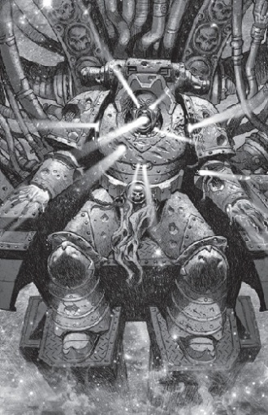

# 0074 黑暗琉璃 Dark Glass

精校状态：中文行文已逐段精校，部分术语仍为暂定

分类：通用概念 / 帝国 Imperium

原文来源：https://www.bilibili.com/opus/1203650110727127063

原作者：帝国神选罐头

原文时间：2026年05月18日 14:17

[返回分类目录](目录.md) · [全书目录](../../目录.md)

<!-- A0074-B0001 -->
**英文原文**

Dark Glass is an ancient device dating back to the Dark Age of Technology.

<!-- /A0074-B0001 -->

<!-- A0074-B0002 -->

原译文

黑暗琉璃是一件古老的设备，可以追溯到黑暗技术时代。

**校订译文**

黑暗琉璃是一台古老的装置，可追溯至黑暗科技时代。

<!-- /A0074-B0002 -->

<!-- A0074-B0003 图片 -->

<!-- A0074-B0004 -->

原译文

Targutai Yesugei is consumed by the Dark Glass' Throne 塔里忽台·也速该被黑暗琉璃王座吞噬

**校订译文**

Targutai Yesugei is consumed by the Dark Glass' Throne 塔里忽台·也速该被黑暗琉璃王座吞噬

<!-- /A0074-B0004 -->

<!-- A0074-B0005 -->
**英文原文**

Consisting of a long crystalline station over the Catallus Warp Rift, the Dark Glass was surrounded by a massive planet-sized hollow shell of mirror-like material. The origins of the device are unknown, but it is thought to have been used to test the technology that would later result in the Golden Throne. Like the Throne, Dark Glass was capable of accessing the Webway and was commanded by a central Throne that required a Psyker of enormous power to operate. Accordingly, the Emperor may have planned one of the more psychically gifted Primarchs to power the device or its sister on Terra. But as a mere tester of its technology, Dark Glass was far less powerful than the Golden Throne.

<!-- /A0074-B0005 -->

<!-- A0074-B0006 -->

原译文

黑暗琉璃由卡图卢斯亚空间裂隙上方的一个长长的水晶空间站组成，周围环绕着一个巨大的行星大小的镜面状中空外壳。该设备的起源尚不清楚，但据信它被用来测试后来导致黄金王座的技术。与王座一样，黑暗琉璃能够进入网道，并由中央王座指挥，需要一名力量庞大的灵能者才能操作。因此，帝皇可能已经计划了一位更具灵能天赋的原体来为泰拉上的装置或其姊妹装置供电。但作为其技术的测试者，黑暗琉璃远不如黄金王座强大。

**校订译文**

黑暗琉璃的主体是一座悬于卡图卢斯亚空间裂隙上方的狭长水晶空间站，外部包裹着行星般巨大的中空壳体，材质如同镜面。它的起源不明，但据推测，制造者曾用它测试后来应用于黄金王座的技术。与黄金王座一样，黑暗琉璃能够开启网道通路，由一座中央王座控制，需要力量极其强大的灵能者才能操作。帝皇可能因此曾打算让某位灵能天赋出众的原体为它，或为它位于泰拉的姊妹装置提供力量。不过，黑暗琉璃只是技术试验装置，其威力远不及黄金王座。

<!-- /A0074-B0006 -->

<!-- A0074-B0007 -->
**英文原文**

During the Great Crusade, the Dark Glass was discovered by the Emperor, who sought to reactivate the device in order to advance his own Webway access project. The research team was led by the Navigator Pieter Helian Achelieux, who diligently worked to unlock its mysteries despite the threat Dark Glass and the Golden Throne presented to the Navis Nobilite, whose control of Warp travel would be rendered obsolete by its completion. However the Dark Glass was kept a secret from the greater Imperium for reasons including fears as to how the Navigator Houses would react. The station's Warp Rift eventually drove the crew mad, and as Dark Glass erupted in bloodshed Pieter was killed by the command throne when he attempted to open a portal into the Webway.

<!-- /A0074-B0007 -->

<!-- A0074-B0008 -->

原译文

在大远征期间，黑暗琉璃被帝皇发现，他试图重新激活该设备，以推进自己的网道通道项目。该研究小队由导航者彼得·赫利安·阿什利厄领导，尽管黑暗琉璃和黄金王座对导航者宗族构成了威胁，但他仍努力解开它的谜团，而导航者宗族对亚空间航行的控制将因其完成而过时。然而，黑暗琉璃对更大的帝国保密，原因包括担心导航者家族会如何反应。空间站的亚空间裂隙最终让机组人员发疯，当黑暗琉璃爆发流血事件时，彼得在试图打开通往网道的门户时被指挥王座杀死。

**校订译文**

大远征期间，帝皇发现了黑暗琉璃，试图重新启动它，以推进自己的网道计划。研究团队由导航员彼得·赫利安·阿舍利厄领导。黑暗琉璃与黄金王座一旦成功，就会使导航员家族对亚空间航行的控制失去意义；尽管如此，他仍孜孜不倦地研究其奥秘。出于对导航员家族反应的担忧等原因，帝皇向帝国其他方面隐瞒了黑暗琉璃的存在。空间站附近的亚空间裂隙最终使站内人员陷入疯狂，杀戮随之爆发。彼得试图开启通往网道的门户，却被控制王座夺去了生命。

<!-- /A0074-B0008 -->

<!-- A0074-B0009 -->
**英文原文**

Later during the Horus Heresy, the White Scars were able to eventually discover the now-abandoned Dark Glass' location. They were pursued by a Death Guard and Emperor's Children fleet led by Mortarion himself. In the ensuing battle, an agent of the Navis Nobilite who had accompanied the Scars, Veil, managed to begin the station's destruction with vortex charges. As the station collapsed around him and with the enemy closing in, White Scars Stormseer Targutai Yesugei sacrificed himself on Dark Glass' throne to open a portal to Terra that allowed the White Scars to escape. Dark Glass exploded shortly after.

<!-- /A0074-B0009 -->

<!-- A0074-B0010 -->

原译文

后来在荷鲁斯叛乱期间，白色疤痕最终发现了现在被遗弃的黑暗流浪的位置。他们被莫塔里安亲自率领的死亡守卫和帝皇之子舰队追捕。在随后的战斗中，一名陪同白色疤痕的导航者宗族特工韦尔成功利用涡旋电荷启动了空间站的摧毁程序。当空间站在他周围坍塌，敌人逼近时，白色伤疤风暴先知塔里忽台·也速该在黑暗琉璃的王座上牺牲了自己，打开了通往泰拉的门户，让白色伤疤逃离。不久之后，黑暗琉璃爆炸了。

**校订译文**

荷鲁斯之乱期间，白疤最终找到了已经废弃的黑暗琉璃。莫塔里安亲率死亡守卫与帝皇之子的舰队紧追其后。在随后的战斗中，随白疤同行的导航员家族特工韦尔引爆涡旋炸药，开始摧毁空间站。眼见空间站不断崩塌、敌人步步逼近，白疤风暴先知塔里忽台·也速该在黑暗琉璃的王座上献出生命，开启了通往泰拉的门户，使白疤得以脱身。不久，黑暗琉璃便爆炸毁灭。

<!-- /A0074-B0010 -->

本篇核心术语与暂定项

以下列出本篇出现的英文原形及核心术语表用词。同形词可能指不同对象，具体词义以本篇正文和校注为准；单复数、别名和仅见于图注的名称可能尚未列入。完整候选见[术语表](../../术语表/双语术语候选.csv)。

| 英文 | 采用中文 | 状态 |
| --- | --- | --- |
| Death Guard | 死亡守卫 | 官方已核对 |
| Psyker | 灵能者 | 官方已核对 |
| Horus Heresy | 荷鲁斯之乱 | 官方已核对 |
| Navigator | 导航员 | 官方已核对 |
| Warp | 亚空间 | 官方已核对 |
| Imperium | 帝国 | 暂定·简称 |
| Dark Age of Technology | 黑暗科技时代 | 暂定 |
| Webway | 网道 | 暂定 |
| Emperor | 帝皇 | 官方已核对 |
| Navis Nobilite | 导航员家族 | 暂定·官方待核 |
| Emperor's Children | 帝皇之子 | 官方已核对 |
| Great Crusade | 大远征 | 暂定·官方待核 |
| Mortarion | 莫塔里安 | 官方已核对 |
| Terra | 泰拉 | 暂定·官方待核 |
| Horus | 荷鲁斯 | 暂定·官方待核 |
| Golden Throne | 黄金王座 | 暂定·官方待核 |
| Dark Glass | 黑暗琉璃 | 暂定·官方待核 |
| Targutai Yesugei | 塔里忽台·也速该 | 暂定·官方待核 |
| Ancient | 旗手 | 官方已核对 |
| Pieter Helian Achelieux | 彼得·赫利安·阿舍利厄 | 暂定·官方待核 |
| Veil | 韦尔 | 暂定·官方待核 |
| White Scars | 白疤 | 官方已核 |
| Scars | 伤疤 | 暂定·官方待核 |
| Stormseer | 风暴先知 | 暂定·官方待核 |
| Catallus | 卡塔鲁斯 | 暂定·官方待核 |
| The Dark | 《黑暗》 | 暂定·官方待核 |

