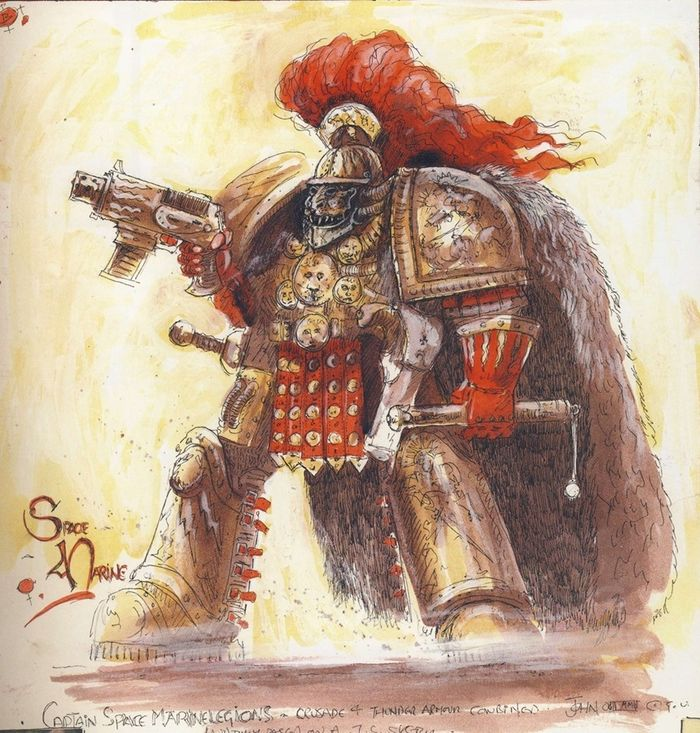
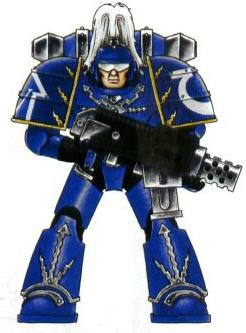
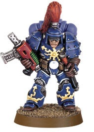

# 0077 雷霆战士 Thunder Warrior

精校状态：中文行文已逐段精校，部分术语仍为暂定

分类：通用概念 / 帝国 Imperium

原文来源：https://www.bilibili.com/opus/1055305612467896377

原作者：帝国神选罐头

原文时间：2025年04月13日 20:04

[返回分类目录](目录.md) · [全书目录](../../目录.md)

<!-- A0077-B0001 -->
**英文原文**

The Thunder Warriors (also known as the Thunder Legion or Legiones Cataegis) were the genetically engineered warriors of Terra created by the Emperor of Mankind to unite the homeworld of humanity beneath His rule in the 30th Millennium. They were gene-enhanced warriors created by the Emperor and served as the precursors to the present-day Space Marines. Wrought to be living weapons, the Thunder Warriors were known to be physically stronger, more savage, and more potent in combat than the later Astartes, though they were not as long-lived.

<!-- /A0077-B0001 -->

<!-- A0077-B0002 -->

原译文

雷霆战士（也称为雷霆军团或卡塔基斯军团）是人类帝皇在第30个千年创造的泰拉基因工程战士，旨在将人类的家园团结在他的统治之下。他们是帝皇创造的基因增强战士，是当今星际战士的先驱。雷霆战士被打造为活体武器，他们比后来的阿斯塔特更强壮、更野蛮、在战斗中更强大，尽管他们的寿命不长。

**校订译文**

雷霆战士，又称雷霆军团或卡塔基斯军团，是人类帝皇在 M30 创造的基因强化战士，旨在将人类母星泰拉统一于自己的统治之下。他们是后来星际战士的先驱，被塑造成活生生的武器。与后来的阿斯塔特相比，雷霆战士更强壮、更凶猛，战斗力也更强，但寿命较短。

<!-- /A0077-B0002 -->

<!-- A0077-B0003 图片 -->

<!-- A0077-B0004 -->

原译文

Captain in a mix of Thunder Armour and Great Crusade armour 身穿雷霆盔甲和大远征盔甲的连长

**校订译文**

Captain in a mix of Thunder Armour and Great Crusade armour 身穿雷霆盔甲和大远征盔甲的连长

<!-- /A0077-B0004 -->

<!-- A0077-B0005 -->
### Overview 概述

<!-- /A0077-B0005 -->

<!-- A0077-B0006 -->
**英文原文**

Thunder Warriors were the elite super-soldiers that marched with the Emperor to conquer Terra in the Wars of Unification. The engineering that the Emperor used to create the Thunder Warriors, whilst creating superior fighters, was not as efficient as what was used later to create the Space Marines, nor was the technology as advanced or the geneticists as entirely willing. These proto-Astartes were organised into twenty regiments of no more than a few hundred warriors, each named by the Emperor himself.

<!-- /A0077-B0006 -->

<!-- A0077-B0007 -->

原译文

雷霆战士是统一战争中与帝皇一起征服泰拉的精英超级战士。帝皇用来制造雷霆战士的工程，在制造超级战士的同时，并没有后来用来制造星际战士的工程那么高效，技术也没有那么先进，基因学上也没有那么完全适宜。这些原始的阿斯塔特被组织成二十个团，每个团由不超过几百名战士组成，每个团都由帝皇亲自命名。

**校订译文**

雷霆战士是随帝皇在统一战争中征服泰拉的精锐超级士兵。创造他们的技术虽造就了强大的战士，却不及后来制造星际战士的方法高效，技术水平也较落后，参与的遗传学家也未必全都心甘情愿。这些阿斯塔特的先驱编成二十个团，每团至多数百人，均由帝皇亲自命名。

**校注：** 原文 geneticists 指参与研究的遗传学家，不是“基因学上适宜”。本段称二十个 regiments，后文又称二十个 Legions，保留原文层级用词差异。

<!-- /A0077-B0007 -->

<!-- A0077-B0008 -->
**英文原文**

The Thunder Warriors battled throughout the Unification Wars and united Terra for the first time in millennia under the rule of the Emperor. According to myth, they were all killed during the final battle of the Unification Wars, the Battle of Mount Ararat.

<!-- /A0077-B0008 -->

<!-- A0077-B0009 -->

原译文

雷霆战士在统一战争中一直在战斗，并在帝皇的统治下数千年来首次统一了泰拉。根据神话，他们都是在统一战争的最后一场战役——亚拉拉特山战役中被杀的。

**校订译文**

雷霆战士在统一战争中一直在战斗，并在帝皇的统治下数千年来首次统一了泰拉。根据神话，他们都是在统一战争的最后一场战役——亚拉拉特山战役中被杀的。

<!-- /A0077-B0009 -->

<!-- A0077-B0010 -->
### Organisation 组织

<!-- /A0077-B0010 -->

<!-- A0077-B0011 -->
**英文原文**

Like the later Legiones Astartes, the Thunder Warriors were organised into twenty Legions, each led by a Primarch. However, unlike the Astartes Primarchs, Thunder Warriors Primarchs were not physically different from the warriors they led. Instead, they were simply superlative warriors who were promoted to the position by the Emperor.

<!-- /A0077-B0011 -->

<!-- A0077-B0012 -->

原译文

与后来的阿斯塔特军团一样，雷霆战士被组织成二十个军团，每个军团由一名原体领导。然而，与阿斯塔特原体不同，雷霆战士原体在身体上与他们领导的战士没有区别。相反，他们只是被帝皇提拔到这个职位的最高级的战士。

**校订译文**

如同后来的阿斯塔特军团，雷霆战士也编为二十个军团，各由一位“原体”率领。不过，雷霆战士的“原体”在身体构造上与麾下战士没有区别，只是帝皇从最杰出的战士中选拔并晋升的统帅，与阿斯塔特原体并非同一概念。

<!-- /A0077-B0012 -->

<!-- A0077-B0013 -->
**英文原文**

The Legions of Thunder Warriors seem to match that of the Astartes. For instance, the 4th Legion of Thunder Warriors was known as the Iron Lords and specialised in siegecraft. This closely resembles the subsequent Iron Warriors.

<!-- /A0077-B0013 -->

<!-- A0077-B0014 -->

原译文

雷霆战士军团似乎与阿斯塔特不相上下。例如，第四雷霆军团被称为钢铁领主，专门从事攻城战。这与后来的钢铁勇士非常相似。

**校订译文**

雷霆战士各军团与后来的阿斯塔特军团似乎存在对应关系。例如，雷霆战士第四军团名为钢铁领主，专精攻城战，与后来的钢铁勇士非常相似。

<!-- /A0077-B0014 -->

<!-- A0077-B0015 -->
### Appearance and Abilities 外观和能力

<!-- /A0077-B0015 -->

<!-- A0077-B0016 -->
**英文原文**

Thunder Warriors were large, greater in size than most Space Marines. In their earliest days the Thunder Warriors wore metal armour with leather strappings and wielded Lasrifles. Despite physical deterioration, the few Warriors that survived the end of the Unification Wars were easily more than a match for an Astartes. Even severely deteriorated Thunder Warriors were capable of fighting multiple Astartes at once. They were made highly resistant to psychic attack, perhaps because of the sorcery they would regularly face during the Age of Strife, with any attempts at mental attack causing severe pain to the psyker. They had tremendous upper body strength that was considered to be unparalleled, which when coupled with their early model of power armour, made them virtually unbeatable in close combat. The leg strength of even a heavily physically deteriorating Thunder Warrior made them capable of kicking completely through the torso of a normal human. Their bones were thicker than that of an Astartes, with a Thunder Warrior capable of shattering the skull of an Astartes with a headbutt. Their reflexes were also extremely enhanced, allowing a Thunder Warrior to dodge the shot from a plasma gun, while already engaged in and focusing on fighting two other Astartes.

<!-- /A0077-B0016 -->

<!-- A0077-B0017 -->

原译文

雷霆战士体型庞大，比大多数星际战士都要大。在早期，雷霆战士身穿金属盔甲，佩戴皮革绑带，手持激光步枪。尽管身体状况恶化，但在统一战争结束后幸存下来的少数战士很容易就超过了阿斯塔特的对手。即使是严重恶化的雷霆战士也能够同时对抗多个阿斯塔特。他们对灵能攻击具有高度抵抗力，这可能是因为他们在纷争时代经常对抗巫术，任何灵能攻击的尝试都会给灵能者带来剧烈的疼痛。他们拥有被认为无与伦比的巨大上半身力量，再加上他们早期的动力盔甲模式，使他们在近战中几乎无懈可击。即使是身体严重恶化的雷霆战士的腿部力量也使他们能够完全踢穿正常人的躯干。他们的骨头比阿斯塔特的骨头厚，雷霆战士能够用头撞碎阿斯塔特的头骨。他们的反应也得到了极大的增强，使雷霆战士能够躲避等离子枪的射击，同时并专注于与另外两名阿斯塔特作战。

**校订译文**

雷霆战士体格庞大，比多数星际战士还要高大。早期，他们身穿用皮带固定的金属铠甲，使用激光步枪。统一战争结束后，少数幸存者即使身体已开始衰退，仍能轻易压倒一名阿斯塔特；即使衰退严重，也能同时迎战多名。他们对灵能攻击具有很强的抗性，或许是为应付纷争时代经常遭遇的巫术而设计；试图精神攻击他们的灵能者反而会承受剧痛。他们上半身力量惊人，堪称无与伦比，配合早期型号的动力甲，近战中几乎不可战胜。即使身体严重衰败，他们也能一脚踢穿普通人的躯干。他们的骨骼比阿斯塔特更粗壮，头槌足以击碎阿斯塔特的头骨；反应速度也大幅强化，甚至能在专心与两名阿斯塔特交战时，躲过等离子枪的射击。

<!-- /A0077-B0017 -->

<!-- A0077-B0018 图片 -->

<!-- A0077-B0019 -->

原译文

Mk.I 'Thunder' pattern Power Armour Mk.I‘雷霆’型动力盔甲

**校订译文**

Mk.I 'Thunder' pattern Power Armour Mk.I‘雷霆’型动力盔甲

<!-- /A0077-B0019 -->

<!-- A0077-B0020 -->
**英文原文**

The Thunder Warriors' genetic template was unstable and they were prone to fits of bloodlust and instability. Short-lived and rife with both mental and physical health issues, Thunder Warriors were known to suddenly drop dead or stop following orders. Unlike the later Legiones Astartes, they lived as warlords and relished battle. Their human emotions were not expunged from them, and they were known for their dry humour.

<!-- /A0077-B0020 -->

<!-- A0077-B0021 -->

原译文

雷霆战士的基因模板不稳定，他们容易产生嗜血和不稳定情绪。雷霆战士短命，身心健康问题严重，经常突然倒地或停止服从命令。与后来的阿斯塔特军团不同，他们过着军阀般的生活，喜欢战斗。他们的人类情感并没有从他们身上消失，他们以冷幽默而闻名。

**校订译文**

雷霆战士的基因模板并不稳定，容易陷入嗜血狂暴和精神失常。他们寿命短暂，身心疾病丛生，可能突然暴毙，也可能不再服从命令。与后来的阿斯塔特军团不同，他们如军阀般生活，乐于厮杀。他们仍保有人类情感，并以冷幽默著称。

<!-- /A0077-B0021 -->

<!-- A0077-B0022 -->
### Fate 命运

<!-- /A0077-B0022 -->

<!-- A0077-B0023 -->
**英文原文**

Imperial history records that the Thunder Warriors had all died in the final battle of the Unification Wars, the Battle of Mount Ararat, and the Legiones Astartes were created to replace them. However, according to a surviving Thunder Warrior, Arik Taranis, the Emperor didn't replenish their numbers, or may have in fact massacred the hyper-violent and short-lived Thunder Warriors to make way for his stable, mass produced Astartes warriors, fabricating the tale of Mount Ararat as a cover-up, or using the battle to expend the last of the Thunder Warriors. The Thunder Warriors were suitable for conquering Terra, but did not fit the Emperor's vision of warriors who would take the entire Galaxy. It is implied that the purges were carried out by the Custodian Guard. Another source states that upon discovering their short lifespans, the Thunder Warriors revolted against the Emperor, causing the Custodes to annihilate them.

<!-- /A0077-B0023 -->

<!-- A0077-B0024 -->

原译文

帝国历史记载，雷霆战士在统一战争的最后一场战斗中全部死亡，阿拉拉特山战役，阿斯塔特军团被创建来取代他们。然而，据一位幸存的雷霆战士阿里克·塔兰尼斯所说，帝皇没有补充他们的人数，或者实际上可能已经屠杀了极度暴力和短命的雷霆战士，为他稳定的、大规模生产的阿斯塔特战士让路，编造亚拉拉特山的故事作为掩护，或者利用这场战斗消耗最后一名雷霆战士。雷霆战士适合征服泰拉，但不符合帝皇关于战士占领整个银河系的愿景。这意味着清洗是由禁军进行的。另一个消息来源说，在发现他们的寿命很短后，雷霆战士反抗帝皇，导致禁军将他们歼灭。

**校订译文**

帝国历史记载，雷霆战士在统一战争的最后一役——亚拉拉特山之战——中全军覆没，随后阿斯塔特军团被创造出来，接替他们。不过，幸存者阿里克·塔兰尼斯给出了另一种说法：帝皇不再补充雷霆战士，甚至可能亲自清除了这些极度暴烈、寿命短暂的战士，好为更稳定、能够大规模制造的阿斯塔特让路。所谓亚拉拉特山之战可能只是掩盖真相的故事，也可能是故意耗尽最后一批雷霆战士的战场。他们适合征服泰拉，却不符合帝皇对银河征服者的构想。相关叙述暗示，清洗由禁军执行。另一个来源则称，雷霆战士发现自身寿命有限后起兵反抗帝皇，因而遭禁军歼灭。

<!-- /A0077-B0024 -->

<!-- A0077-B0025 -->
### Survivors 幸存者

<!-- /A0077-B0025 -->

<!-- A0077-B0026 -->
**英文原文**

Towards the end of the Unification Wars, a group of at least two dozen surviving Thunder Warriors under one of their Primarchs Ushotan took part in the Palace Coup to seek revenge and death in battle. The rebels were all massacred by the early Legiones Astartes in their very first engagement, while Ushotan was slain by Constantin Valdor. Bands of Thunder Warriors continued to exist in hiding however, with some escaping off-world. These were later hunted down and destroyed by the First Legion of the Legiones Astartes.

<!-- /A0077-B0026 -->

<!-- A0077-B0027 -->

原译文

在统一战争接近尾声时，他们的一位原体乌什坦手下至少有二十多名幸存的雷霆战士参加了皇宫政变，在战斗中寻求复仇和死亡。叛军在第一次交战中就被早期的阿斯塔特军团屠杀，而乌什坦则被康斯坦丁·瓦尔多杀害。然而，雷霆战士继续隐藏着，有些人逃离了世界。这些后来被阿斯塔特军团第一军团追捕并摧毁。

**校订译文**

统一战争临近结束时，至少二十四名幸存的雷霆战士在其“原体”乌什坦率领下参加皇宫政变，寻求复仇，也渴望战死。他们被初建的阿斯塔特军团尽数杀死；这也是阿斯塔特的首次作战。乌什坦则死于康斯坦丁·瓦尔多之手。不过，仍有成群的雷霆战士躲藏起来，部分甚至逃离泰拉，后来才被阿斯塔特第一军团追猎并消灭。

**校注：** their very first engagement 指早期阿斯塔特的首次作战，原译可能误导为叛军首次参战。two dozen 为二十四。

<!-- /A0077-B0027 -->

<!-- A0077-B0028 图片 -->

<!-- A0077-B0029 -->

原译文

Thunder Warrior 雷霆战士

**校订译文**

Thunder Warrior 雷霆战士

<!-- /A0077-B0029 -->

<!-- A0077-B0030 -->
**英文原文**

Early in the Great Crusade, a small group of surviving Thunder Warriors calling themselves the Dait'Tar were among the renegades of the Cerberus Insurrection. The Emperor dispatched the XII Legion (later known as the World Eaters) to quell the uprising and punish the traitors. Despite their physical decline, and being severely outnumbered by one of the greatest Space Marine Legions, the Thunder Warriors managed to slaughter four to five times their number in Astartes. The Insurrection was eventually stopped however, after several hours of intense close quarters fighting.

<!-- /A0077-B0030 -->

<!-- A0077-B0031 -->

原译文

在大远征的早期，一小群自称为代特’塔尔的幸存雷霆战士是三头犬叛乱的叛徒之一。帝皇派遣第十二军团（后来被称为吞世者）平息叛乱并惩罚叛徒。尽管他们的体力下降，并且被最伟大的星际战士之一严重击败，但雷霆战士相比阿斯塔特的屠杀人数是他们的四至五倍。然而，经过几个小时的激烈近距离战斗，叛乱最终停止了。

**校订译文**

大远征初期，一小群自称“代特’塔尔”的雷霆战士幸存者参与了三头犬叛乱。帝皇派第十二军团——后来的吞世者——镇压叛乱、惩戒叛徒。尽管身体已衰退，面对的又是一支人数远超己方、实力强大的星际战士军团，雷霆战士仍杀死了自身人数四至五倍的阿斯塔特。不过，在数小时激烈的近距离厮杀后，叛乱最终被平息。

<!-- /A0077-B0031 -->

<!-- A0077-B0032 -->
**英文原文**

At least one Thunder Warrior survived to the time of the Horus Heresy, Arik Taranis, who had taken many names in the interim, including Babu Dhakal. Taranis had learned some of the techniques the Emperor had used to create him and tried to make his own army. He suspected that the Emperor had deliberately engineered his kind with a limited lifespan, though he personally hoped it was simply a defect; Thunder Warriors that did not die in battle suffered from cellular degeneration or mental instability, and often had relatively short lifespans. Eventually, after another Thunder Warrior, Ghota, encountered a group of traitor Astartes known as the Outcast Dead and slew one of its members, Taranis was able to cure the genetic instability of the Thunder Warriors, though not before suffering considerable degeneration himself.

<!-- /A0077-B0032 -->

<!-- A0077-B0033 -->

原译文

至少有一名雷霆战士幸存到荷鲁斯异端时期，阿里克·塔兰尼斯，他在此期间取了很多名字，包括巴布·达卡尔。塔兰尼斯已经学会了帝皇用来创造他的一些技术，并试图组建自己的军队。他怀疑帝皇故意让他的同类寿命有限，尽管他个人希望这只是一个缺陷；没有在战斗中死亡的雷霆战士患有细胞退化或精神不稳定，寿命通常相对较短。最终，在另一名雷霆战士戈塔遇到了一群被称为“放逐死亡”的叛徒阿斯塔特并杀死了其中一名成员后，塔兰尼斯能够治愈雷霆战士的基因不稳定，尽管在此之前他自己也遭受了相当大的退化。

**校订译文**

至少有一名雷霆战士活到了荷鲁斯之乱时期：阿里克·塔兰尼斯。他曾使用许多化名，包括巴布·达卡尔。他掌握了帝皇创造自己时采用的部分技术，并试图组建自己的军队。他怀疑，帝皇有意将他们设计为寿命有限的战士，尽管他内心仍希望这只是技术缺陷。没有战死的雷霆战士往往会出现细胞退化或精神失常，因此仍然短命。后来，另一名雷霆战士戈塔遇到一群被称为“放逐亡者”的叛逃阿斯塔特，并杀死其中一人；塔兰尼斯随后终于找到解决雷霆战士基因不稳定问题的办法，但他自己在此之前已严重衰退。

<!-- /A0077-B0033 -->

<!-- A0077-B0034 -->
**英文原文**

Four Thunder Warriors had also survived on Terra to serve as gladiators in depths of The Maw, near slums known as the Swathe, for despite their physical deterioration they were still mighty warriors. They had been kept alive by Tarrigata, a former astropath, who served as their master and helped keep them alive through transplanting the organs of the deceased Thunder Warriors. One of them (Kabe) eventually died after being incapacitated in a gladiator battle against a Chrono Gladiator, before being ceremonially executed by a fellow Thunder Warrior. Another (Gairok) became mentally unstable and was slain when he attacked one of the other Thunder Warriors. The third (Vezulah Vult) died fighting a demonically possessed Alpha Legion warrior, after being blinded by the Astartes' acidic spit and eviscerated. The last (Dahren Heruk) was given an honoured death by a Custodian, after he defeated the possessed legionary and saved the Custodian's life.

<!-- /A0077-B0034 -->

<!-- A0077-B0035 -->

原译文

四名雷霆战士也在泰拉上幸存下来，在斯瓦特贫民窟附近的巨口深处担任角斗士，因为尽管他们的身体状况恶化，但他们仍然是强大的战士。他们一直由前星语者塔里加塔维持生命，他曾是他们的主人，并通过移植已故雷霆战士的器官帮助他们存活下来。其中一人（卡贝）在与计时角斗士的战斗中丧失能力后最终死亡，随后被雷霆战士同伴正式处决。另一名（盖洛克）精神不稳定，在袭击另一名雷霆战士时被杀。第三个（韦祖拉·沃尔特）在与一名被恶魔附身的阿尔法军团战士战斗时死亡，他被阿斯塔特的酸性唾液弄瞎了眼睛，并被挖出内脏。最后一个（达赫伦·赫鲁克）在击败被附身的禁军并挽救了禁军的生命后，被禁军光荣地处死。

**校订译文**

泰拉上还有四名雷霆战士幸存，他们在斯瓦特贫民区附近的“巨口”深处充当角斗士。虽然身体日渐衰退，他们依然是强大战士。前星语者塔里加塔是他们的主人，通过移植死去雷霆战士的器官为他们续命。卡贝在与一名计时角斗士交战时失去战斗能力，随后由同伴依仪式处死。盖洛克精神失常，袭击另一名雷霆战士时被杀。韦祖拉·沃尔特与一名遭恶魔附身的阿尔法军团战士交战，被其酸性唾液弄瞎双眼，又遭开膛破腹而死。最后的达赫伦·赫鲁克击败了那名被附身的军团战士，救下一名禁军，随后由获救的禁军赐予荣耀的死亡。

**校注：** 原译把附身的 legionary 误成禁军，倒置受救者与敌人的身份；据英文修正。卡贝先失去战斗能力再被处死，原译错误写成死后再处决。

<!-- /A0077-B0035 -->

<!-- A0077-B0036 -->
**英文原文**

It is possible that the World Eater and later Blackshield Endryd Haar was a Thunder Warrior or another kind of proto-Astartes who was successfully transformed into a Space Marine. He was far larger, stronger, and quicker than other Space Marines; furthermore, he was extremely brutal and somewhat mentally unstable despite lacking the Butcher's Nails. Malcador singled him out as a special case. Haar himself confirmed that he had fought alongside the Emperor in the Unification Wars and called the Dait'Tar "brothers".

<!-- /A0077-B0036 -->

<!-- A0077-B0037 -->

原译文

吞世者和后来的黑盾恩德瑞德·哈尔可能是一名雷霆战士或另一种成功转变为星际战士的原型阿斯塔特。他比其他星际战士高大、强壮、敏捷得多；此外，尽管他没有屠夫之钉，但他非常残忍，有点精神不稳定。马卡多特别指出他是一个特例。哈尔本人证实，他曾在统一战争中与帝皇并肩作战，并称代特’塔尔为“兄弟”。

**校订译文**

吞世者和后来的黑盾恩德瑞德·哈尔可能是一名雷霆战士或另一种成功转变为星际战士的原型阿斯塔特。他比其他星际战士高大、强壮、敏捷得多；此外，尽管他没有屠夫之钉，但他非常残忍，有点精神不稳定。马卡多特别指出他是一个特例。哈尔本人证实，他曾在统一战争中与帝皇并肩作战，并称代特’塔尔为“兄弟”。

<!-- /A0077-B0037 -->

<!-- A0077-B0038 -->
### Historic Thunder Warriors 史载雷霆战士

原题：Historic Thunder Warriors 历史悠久的雷霆战士

<!-- /A0077-B0038 -->

<!-- A0077-B0039 -->

原译文

Skand 斯坎德

**校订译文**

Skand 斯坎德

<!-- /A0077-B0039 -->

<!-- A0077-B0040 -->
**英文原文**

Ushotan - Primarch

<!-- /A0077-B0040 -->

<!-- A0077-B0041 -->

原译文

乌什坦 - 原体

**校订译文**

乌什坦 - 原体

<!-- /A0077-B0041 -->

<!-- A0077-B0042 -->
**英文原文**

Arik Taranis The Throneslayer

<!-- /A0077-B0042 -->

<!-- A0077-B0043 -->

原译文

王座屠杀者阿里克·塔兰尼斯

**校订译文**

王座屠杀者阿里克·塔兰尼斯

<!-- /A0077-B0043 -->

<!-- A0077-B0044 -->

原译文

Ghota 戈塔

**校订译文**

Ghota 戈塔

<!-- /A0077-B0044 -->

<!-- A0077-B0045 -->

原译文

Dahren Heruk 达赫伦·赫鲁克

**校订译文**

Dahren Heruk 达赫伦·赫鲁克

<!-- /A0077-B0045 -->

<!-- A0077-B0046 -->

原译文

Kabe 卡贝

**校订译文**

Kabe 卡贝

<!-- /A0077-B0046 -->

<!-- A0077-B0047 -->

原译文

Vezulah Vult 韦祖拉·沃尔特

**校订译文**

Vezulah Vult 韦祖拉·沃尔特

<!-- /A0077-B0047 -->

<!-- A0077-B0048 -->

原译文

Gairok 盖洛克

**校订译文**

Gairok 盖洛克

<!-- /A0077-B0048 -->

本篇核心术语与暂定项

以下列出本篇出现的英文原形及核心术语表用词。同形词可能指不同对象，具体词义以本篇正文和校注为准；单复数、别名和仅见于图注的名称可能尚未列入。完整候选见[术语表](../../术语表/双语术语候选.csv)。

| 英文 | 采用中文 | 状态 |
| --- | --- | --- |
| Space Marines | 星际战士 | 官方已核对 |
| World Eaters | 吞世者 | 官方已核对 |
| Psyker | 灵能者 | 官方已核对 |
| Astropath | 星语者 | 官方已核对 |
| Horus Heresy | 荷鲁斯之乱 | 官方已核对 |
| History | 历史 | 编辑用语已统一 |
| Emperor of Mankind | 人类帝皇 | 暂定 |
| Emperor | 帝皇 | 官方已核对 |
| Primarch | 原体 | 官方已核对 |
| Iron Warriors | 钢铁勇士 | 暂定·官方待核 |
| Great Crusade | 大远征 | 暂定·官方待核 |
| Age of Strife | 纷争时代 | 暂定·官方待核 |
| Terra | 泰拉 | 暂定·官方待核 |
| Horus | 荷鲁斯 | 暂定·官方待核 |
| Legiones Astartes | 阿斯塔特军团 | 暂定·官方待核 |
| Thunder Warriors | 雷霆战士 | 暂定·官方待核 |
| Unification Wars | 统一战争 | 暂定·官方待核 |
| Master | 导师（审判庭职衔）／舰务官（舰员职务） | 语境定译·官方待核 |
| Arik Taranis | 阿里克·塔兰尼斯 | 暂定·官方待核 |
| Ushotan | 乌什坦 | 暂定·官方待核 |
| Dait'Tar | 代特’塔尔 | 暂定·官方待核 |
| Outcast Dead | 放逐亡者 | 暂定·官方待核 |
| Tarrigata | 塔里加塔 | 暂定·官方待核 |
| Vult | 武尔特 | 暂定·官方待核 |
| Custodian Guard | 禁军卫队 | 官方已核对 |
| Alpha Legion | 阿尔法军团 | 暂定·官方待核 |
| The Outcast Dead | 放逐死者 | 暂定·官方待核 |
| Endryd Haar | 恩德里德·哈尔 | 暂定·官方待核 |
| Power Armour | 动力盔甲 | 暂定·官方待核 |
| Space Marine | 星际战士 | 暂定·官方待核 |
| Constantin Valdor | 康斯坦丁·瓦尔多 | 暂定·官方待核 |
| Gladiators | 角斗士 | 暂定·官方待核 |
| Gladiator | 角斗士坦克 | 暂定·官方待核 |
| Iron Lords | 钢铁领主 | 暂定·官方待核 |
| Butcher | 屠夫号 | 暂定·官方待核 |
| Babu Dhakal | 巴布·达卡尔 | 暂定·官方待核 |
| Ghota | 戈塔 | 暂定·官方待核 |
| Wrought | 锻造秘库 | 暂定·官方待核 |
| Enhanced Warriors | 增强战士 | 暂定·官方待核 |
| Gun | 甘 | 暂定·官方待核 |
| Mount Ararat | 阿拉拉特山 | 暂定·官方待核 |
| Palace Coup | 皇宫政变 | 暂定·官方待核 |
| Plasma gun | 等离子枪 | 官方已核对 |

