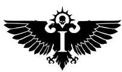
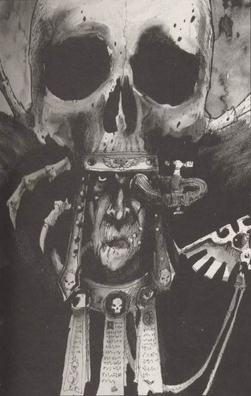
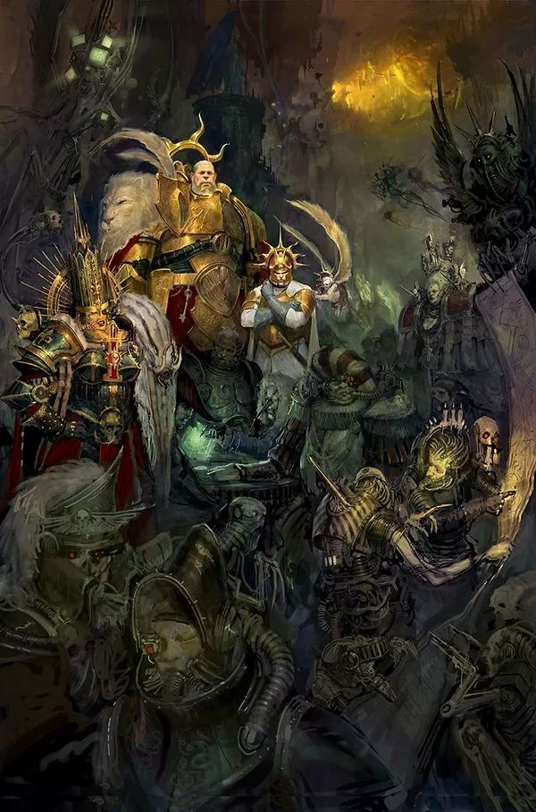

# 0080 帝国参议院 Senatorum Imperialis

精校状态：中文行文已逐段精校，部分术语仍为暂定

分类：通用概念 / 帝国 Imperium

原文来源：https://www.bilibili.com/opus/1070767151132966928

原作者：帝国神选罐头

原文时间：编辑于 2025年06月01日 13:00

[返回分类目录](目录.md) · [全书目录](../../目录.md)

<!-- A0080-B0001 -->
**英文原文**

The Senatorum Imperialis (officially the Lords Temporal, Martial and Ecclesiarchical of the Most Divine and Righteous Imperium of Mankind) collectively form the Council of the High Lords of Terra. The Senatorum is an Imperial governing body led by twelve leaders of the most powerful organisations of the Imperium. This body rules the Imperium in the Emperor's name. The Senatorum itself is composed of tens of thousands of Imperial dignitaries, nobleman, lords, and other officials, but these rarely meet and instead the "High Twelve" conduct the vast majority of affairs.

<!-- /A0080-B0001 -->

<!-- A0080-B0002 -->

原译文

帝国参议院（正式名称为最神圣、最正义人类帝国的世俗、军事和教会领主）共同组成了泰拉高领主议会。参议院是帝国的一个管理机构，由帝国最强大组织的十二位领导人领导。这个机构以帝皇的名义统治着帝国。参议院本身由数万名帝国政要、贵族、领主和其他官员组成，但这些人很少见面，相反，“至高十二”负责绝大多数事务。

**校订译文**

帝国参议院的正式称号为“最神圣、最正义人类帝国的世俗、军事与教会诸领主”，其领导核心构成泰拉高领主议会。它是以帝皇之名治理帝国的机构，由帝国最强大组织的十二位领袖领导。参议院全体成员其实多达数万人，包括帝国政要、贵族、领主与其他官员，但全体会议极少召开，绝大多数事务都交由“至高十二”处理。

**校注：** 原文开头将整个 Senatorum 与十二人高领主议会近似等同，随后又区分数万议员与 High Twelve；中文将其表述为参议院与领导核心，保留人数和职权信息。

<!-- /A0080-B0002 -->

<!-- A0080-B0003 图片 -->

<!-- A0080-B0004 -->

原译文

Senatorum Imperialis symbol 帝国参议院标志

**校订译文**

Senatorum Imperialis symbol 帝国参议院标志

<!-- /A0080-B0004 -->

<!-- A0080-B0005 -->
**英文原文**

Headquarters:Great Chamber of the Senatorum Imperialis, Terra

<!-- /A0080-B0005 -->

<!-- A0080-B0006 -->

原译文

总部：泰拉，帝国参议院大会议厅

**校订译文**

总部：泰拉，帝国参议院大会议厅

<!-- /A0080-B0006 -->

<!-- A0080-B0007 -->
**英文原文**

Leader:Imperial Regent Roboute Guilliman，Chancellor of the Imperial Council (chief administrator/secretary)

<!-- /A0080-B0007 -->

<!-- A0080-B0008 -->

原译文

领袖：帝国摄政罗伯特·基里曼，帝国议会议长（首席行政官/秘书）

**校订译文**

领袖：帝国摄政罗保特·基里曼；帝国议会议长负责日常行政与秘书事务。

<!-- /A0080-B0008 -->

<!-- A0080-B0009 -->
**英文原文**

Members:12 High Lords (9 Permanent, 3 Rotating)，Many Lesser Lords

<!-- /A0080-B0009 -->

<!-- A0080-B0010 -->

原译文

成员：12名高领主（9名常任，3名轮换），许多低领主

**校订译文**

成员：12名高领主（9名常任，3名轮换），许多次级领主

<!-- /A0080-B0010 -->

<!-- A0080-B0011 -->
**英文原文**

Established:Unification Wars-era (as the Magisters Temporal)

<!-- /A0080-B0011 -->

<!-- A0080-B0012 -->

原译文

成立：统一战争时代（作为世俗大师）

**校订译文**

成立：统一战争时代（作为世俗大师）

<!-- /A0080-B0012 -->

<!-- A0080-B0013 -->
**英文原文**

The task of the High Lords is to interpret and enact the will of the Emperor. Accordingly, the position of High Lord was the most powerful in the Imperium until the reemergence of Roboute Guilliman, who declared himself Imperial Regent, or the Emperor's Living Voice. Even subsequent to his return, the High Lords retain their position and task of ruling the Imperium in the Emperor's name.

<!-- /A0080-B0013 -->

<!-- A0080-B0014 -->

原译文

高领主的任务是解释和制定帝皇的意志。因此，在罗伯特·基里曼重新出现之前并宣布自己为帝国摄政或帝皇之音之前，高领主的地位在帝国中是最强大的。即使在他回来之后，高领主仍保留着以帝皇的名义统治帝国的地位和任务。

**校订译文**

高领主负责诠释并执行帝皇的意志。因此，在罗保特·基里曼归来、自任帝国摄政——即帝皇在人世的代言人——之前，高领主是帝国最有权势的职位。即使基里曼回归后，他们仍保有地位，继续以帝皇之名履行治理帝国的职责。

<!-- /A0080-B0014 -->

<!-- A0080-B0015 -->
## The High Lords 高领主

<!-- /A0080-B0015 -->

<!-- A0080-B0016 -->
### High Twelve 至高十二

<!-- /A0080-B0016 -->

<!-- A0080-B0017 -->
**英文原文**

Determining who will hold the position of High Lord has resulted in millennia of political intrigue between the various bureaucracies seeking to increase their power. However, some organisations are so powerful, so fundamentally important to the Imperium, that their position on the Council is considered sacrosanct. For this reason the following nine offices are almost always represented as High Lords:

<!-- /A0080-B0017 -->

<!-- A0080-B0018 -->

原译文

确定谁将担任高领主的职位，导致了各官僚机构之间数千年的政治阴谋，试图增加他们的权力。然而，一些组织是如此强大，对帝国来说是如此重要，以至于他们在议会的地位被认为是神圣不可侵犯的。出于这个原因，以下九个职位几乎总是被作为高领主代表：

**校订译文**

数千年来，各官僚机构为扩大自身权力，不断围绕高领主席位展开政治角逐。不过，有些组织权势过于庞大，对帝国也太过重要，其议会席位几乎被视为不可动摇。因此，以下九个职位几乎始终占有高领主席位：

<!-- /A0080-B0018 -->

<!-- A0080-B0019 图片 -->

<!-- A0080-B0020 -->

原译文

High Lord of Terra 泰拉高领主

**校订译文**

High Lord of Terra 泰拉高领主

<!-- /A0080-B0020 -->

<!-- A0080-B0021 -->

原译文

The Master of the Administratum 内务部长

**校订译文**

The Master of the Administratum 内政部之主

<!-- /A0080-B0021 -->

<!-- A0080-B0022 -->

原译文

The Inquisitorial Representative 审判庭代表

**校订译文**

The Inquisitorial Representative 审判庭代表

<!-- /A0080-B0022 -->

<!-- A0080-B0023 -->

原译文

The Ecclesiarch of the Adeptus Ministorum 国教教宗

**校订译文**

The Ecclesiarch of the Adeptus Ministorum 国教教宗

<!-- /A0080-B0023 -->

<!-- A0080-B0024 -->

原译文

The Fabricator-General of the Adeptus Mechanicus 机械神教铸造将军

**校订译文**

The Fabricator-General of the Adeptus Mechanicus 机械修会铸造将军

<!-- /A0080-B0024 -->

<!-- A0080-B0025 -->

原译文

The Grand Provost Marshal of the Adeptus Arbites 法务部宪兵大元帅

**校订译文**

The Grand Provost Marshal of the Adeptus Arbites 法务部宪兵大元帅

<!-- /A0080-B0025 -->

<!-- A0080-B0026 -->

原译文

The Paternoval Envoy of the Navis Nobilite 导航者宗族星父特使

**校订译文**

The Paternoval Envoy of the Navis Nobilite 导航员家族最高族长特使

<!-- /A0080-B0026 -->

<!-- A0080-B0027 -->

原译文

The Master of the Astronomican 星炬庭之主

**校订译文**

The Master of the Astronomican 星炬之主

<!-- /A0080-B0027 -->

<!-- A0080-B0028 -->

原译文

The Grand Master of the Officio Assassinorum 刺客庭大导师

**校订译文**

The Grand Master of the Officio Assassinorum 刺客庭大导师

<!-- /A0080-B0028 -->

<!-- A0080-B0029 -->

原译文

The Master of the Adeptus Astra Telepathica 星语庭之主

**校订译文**

The Master of the Adeptus Astra Telepathica 星语庭之主

<!-- /A0080-B0029 -->

<!-- A0080-B0030 -->
**英文原文**

The remaining three positions are most likely to be filled from among the following powerful leaders:

<!-- /A0080-B0030 -->

<!-- A0080-B0031 -->

原译文

其余三个位置最有可能由以下强而有力的领导人填补：

**校订译文**

其余三个席位通常从以下权势人物中选出：

<!-- /A0080-B0031 -->

<!-- A0080-B0032 -->

原译文

The Lord Commander of Segmentum Solar 太阳星域领主指挥官

**校订译文**

The Lord Commander of Segmentum Solar 太阳星域领主指挥官

<!-- /A0080-B0032 -->

<!-- A0080-B0033 -->

原译文

The Lord Commander Militant of the Imperial Guard 帝国卫队军务领主指挥官

**校订译文**

The Lord Commander Militant of the Imperial Guard 帝国卫队军务领主指挥官

<!-- /A0080-B0033 -->

<!-- A0080-B0034 -->

原译文

Cardinal(s) of the Holy Synod of Terra 泰拉至高圣会红衣主教

**校订译文**

Cardinal(s) of the Holy Synod of Terra 泰拉至高圣会红衣主教

<!-- /A0080-B0034 -->

<!-- A0080-B0035 -->

原译文

The Abbess of the Adepta Sororitas 修女会修道院长

**校订译文**

The Abbess of the Adepta Sororitas 修女会修道院长

<!-- /A0080-B0035 -->

<!-- A0080-B0036 -->

原译文

The Captain-General of the Adeptus Custodes 禁军修会元帅

**校订译文**

The Captain-General of the Adeptus Custodes 帝皇禁军元帅

<!-- /A0080-B0036 -->

<!-- A0080-B0037 -->

原译文

The Chancellor of the Estate Imperium 帝国档案部部长

**校订译文**

The Chancellor of the Estate Imperium 帝国档案部部长

<!-- /A0080-B0037 -->

<!-- A0080-B0038 -->

原译文

The Speaker for the Chartist Captains 宪章船长发言人

**校订译文**

The Speaker for the Chartist Captains 特许舰长代言人

<!-- /A0080-B0038 -->

<!-- A0080-B0039 -->

原译文

The Lord High Admiral of the Imperial Navy 帝国海军至高海军司令

**校订译文**

The Lord High Admiral of the Imperial Navy 帝国海军至高海军司令

<!-- /A0080-B0039 -->

<!-- A0080-B0040 -->
**英文原文**

The position of Lord Commander of the Imperium, first held by Roboute Guilliman, continued after his wounding at the hands of Fulgrim. There were still holders of the title, often simply referred to as "Lord Guilliman" in the Primarch's honor, until at least mid-M32. The Lord Commander served as the Chairman of the Senatorum. Following the rebirth of Guilliman in the closing days of M41, he has assumed the title of Lord Commander alongside Imperial Regent.

<!-- /A0080-B0040 -->

<!-- A0080-B0041 -->

原译文

帝国领主指挥官的职位最初由罗伯特·基里曼担任，在他被福格瑞姆打伤后继续担任。至少在M32中期之前，仍有头衔的持有者，通常简称为“基里曼领主”，以纪念原体。领主指挥官担任参议院主席。继基里曼在M41的最后几天重生后，他一起担任了帝国摄政与领主指挥官的头衔。

**校订译文**

帝国最高统帅一职由罗保特·基里曼首任；即使他被福格瑞姆重创后，这一职位仍继续存在。至少到 M32 中期，仍有人继任，他们常被简称为“基里曼领主”，以纪念原体。帝国最高统帅同时担任参议院主席。M41 末期，基里曼复苏后重新出任帝国最高统帅，并兼任帝国摄政。

<!-- /A0080-B0041 -->

<!-- A0080-B0042 -->
### Lesser Lords 次级领主

原题：Lesser Lords 低领主

<!-- /A0080-B0042 -->

<!-- A0080-B0043 -->
**英文原文**

The actual institution of the Senatorum itself is overseen by a Chancellor of the Imperial Council. While not among the High Twelve, it is nonetheless a powerful and influential position. There are also lesser lords who, while not part of the High Twelve, are still full members of the Senatorum Imperialis.

<!-- /A0080-B0043 -->

<!-- A0080-B0044 -->

原译文

参议院本身的实际机构由帝国议会议长监督。虽然不在至高十二之中，但它仍然是一个强大而有影响力的职位。还有一些低领主，虽然不是至高十二的一部分，但仍然是帝国参议院的正式成员。

**校订译文**

参议院的日常机构由帝国议会议长管理。议长虽不属于至高十二，仍是权力和影响力极大的职位。此外，参议院还有次级领主：他们不在至高十二之列，却仍是正式议员。

<!-- /A0080-B0044 -->

<!-- A0080-B0045 -->

原译文

Commandant of the Schola Progenium 忠嗣学院指挥官

**校订译文**

Commandant of the Schola Progenium 忠嗣学院指挥官

<!-- /A0080-B0045 -->

<!-- A0080-B0046 -->

原译文

Lord Constable of the Synopticon 监察部治安官领主

**校订译文**

Lord Constable of the Synopticon 监察部治安官领主

<!-- /A0080-B0046 -->

<!-- A0080-B0047 -->

原译文

Mistress Plenary of the Catacombs 地下墓穴女主人议会

**校订译文**

Mistress Plenary of the Catacombs 地下墓穴全权女领主

<!-- /A0080-B0047 -->

<!-- A0080-B0048 -->

原译文

The Consul Pre-Eminus of the Navis Nobilite 导航者宗族前杰领事

**校订译文**

The Consul Pre-Eminus of the Navis Nobilite 导航员家族前杰领事

<!-- /A0080-B0048 -->

<!-- A0080-B0049 -->

原译文

The Chirurgeon-General of the Order Hospitaller 医疗修会医师将军

**校订译文**

The Chirurgeon-General of the Order Hospitaller 医护修会总医官

<!-- /A0080-B0049 -->

<!-- A0080-B0050 -->

原译文

The High Lord of the Imperial Chancellery 帝国总理府高领主

**校订译文**

The High Lord of the Imperial Chancellery 帝国秘书厅高领主

<!-- /A0080-B0050 -->

<!-- A0080-B0051 -->
**英文原文**

Despite their vital importance to the Imperium, the Adeptus Astartes are not represented among the High Lords. This may have been set up intentionally by Roboute Guilliman himself as the Primarch fervently believed that it was the duty of the Space Marines to protect mankind, not rule it. This tradition was broken for a brief period in M32, during the War of the Beast and The Beheading, when the successive Chapter Masters of the Imperial Fists — Koorland and Maximus Thane — reigned as Lord Commander of the Imperium (see "History", below).

<!-- /A0080-B0051 -->

<!-- A0080-B0052 -->

原译文

尽管阿斯塔特修会对帝国至关重要，但他们在高领主中没有代表。这可能是罗伯特·基里曼自己有意设置的，因为这位原体热切地相信，保护人类是星际战士的责任，而不是统治人类。这一传统在M32的野兽和斩首战争期间被打破了一段时间，当时连续的帝国之拳战团长库兰德和马克西姆斯·塞恩担任帝国领主指挥官。

**校订译文**

阿斯塔特修会对帝国至关重要，却在高领主中没有代表。这可能是罗保特·基里曼有意作出的安排，因为他坚信星际战士的职责是保护人类，而非统治人类。这项传统在 M32 的野兽战争与斩首事件期间曾短暂打破：先后出任帝国之拳战团长的库兰德与马克西姆斯·塞恩，都曾担任帝国最高统帅。

<!-- /A0080-B0052 -->

<!-- A0080-B0053 -->
### Re-organized List of Lords 重新组织的领主名单

<!-- /A0080-B0053 -->

<!-- A0080-B0054 -->
**英文原文**

The above lists can get confusing because so many parts of the Imperial bureaucracy are represented multiple times. Here are the lists again, organized structurally.

<!-- /A0080-B0054 -->

<!-- A0080-B0055 -->

原译文

上述列表可能会令人困惑，因为帝国官僚机构的许多部分都被多次代表。这是按结构组织的列表。

**校订译文**

上述名单中，同一官僚体系下的多个职位可能分别列席，容易造成混淆。以下按所属机构重新整理：

<!-- /A0080-B0055 -->

<!-- A0080-B0056 -->
**英文原文**

The Inquisitorial Representative (High Lord)

<!-- /A0080-B0056 -->

<!-- A0080-B0057 -->

原译文

审判庭代表（高领主）

**校订译文**

审判庭代表（高领主）

<!-- /A0080-B0057 -->

<!-- A0080-B0058 -->
**英文原文**

The Fabricator-General of the Adeptus Mechanicus (High Lord)

<!-- /A0080-B0058 -->

<!-- A0080-B0059 -->

原译文

机械神教铸造将军（高领主）

**校订译文**

机械修会铸造将军（高领主）

<!-- /A0080-B0059 -->

<!-- A0080-B0060 -->
**英文原文**

The Ecclesiarch of the Adeptus Ministorum (High Lord)

<!-- /A0080-B0060 -->

<!-- A0080-B0061 -->

原译文

国教教宗（高领主）

**校订译文**

国教教宗（高领主）

<!-- /A0080-B0061 -->

<!-- A0080-B0062 -->
**英文原文**

The Abbess of the Adepta Sororitas (Potential High Lord)

<!-- /A0080-B0062 -->

<!-- A0080-B0063 -->

原译文

修女会修道院长（潜在高领主）

**校订译文**

修女会修道院长（潜在高领主）

<!-- /A0080-B0063 -->

<!-- A0080-B0064 -->
**英文原文**

The Chirurgeon-General of the Order Hospitaller (Lesser Lord)

<!-- /A0080-B0064 -->

<!-- A0080-B0065 -->

原译文

医疗修会医师将军（低领主）

**校订译文**

医护修会总医官（次级领主）

<!-- /A0080-B0065 -->

<!-- A0080-B0066 -->
**英文原文**

Cardinal(s) of the Holy Synod of Terra (Potential High Lords)

<!-- /A0080-B0066 -->

<!-- A0080-B0067 -->

原译文

泰拉至高圣会红衣主教（潜在高领主）

**校订译文**

泰拉至高圣会红衣主教（潜在高领主）

<!-- /A0080-B0067 -->

<!-- A0080-B0068 -->
**英文原文**

Commandant of the Schola Progenium (Lesser Lord)

<!-- /A0080-B0068 -->

<!-- A0080-B0069 -->

原译文

忠嗣学院指挥官（低领主）

**校订译文**

忠嗣学院指挥官（次级领主）

<!-- /A0080-B0069 -->

<!-- A0080-B0070 -->
**英文原文**

The Master of the Administratum (High Lord)

<!-- /A0080-B0070 -->

<!-- A0080-B0071 -->

原译文

内务部长（高领主）

**校订译文**

内政部之主（高领主）

<!-- /A0080-B0071 -->

<!-- A0080-B0072 -->
**英文原文**

The Chancellor of the Estate Imperium (Potential High Lord)

<!-- /A0080-B0072 -->

<!-- A0080-B0073 -->

原译文

帝国档案部部长（潜在高领主）

**校订译文**

帝国档案部部长（潜在高领主）

<!-- /A0080-B0073 -->

<!-- A0080-B0074 -->
**英文原文**

The Lord Commander Militant of the Imperial Guard (Potential High Lord)

<!-- /A0080-B0074 -->

<!-- A0080-B0075 -->

原译文

帝国卫队军务领主指挥官（潜在高领主）

**校订译文**

帝国卫队军务领主指挥官（潜在高领主）

<!-- /A0080-B0075 -->

<!-- A0080-B0076 -->

原译文

Imperial Fleet 帝国舰队

**校订译文**

Imperial Fleet 帝国舰队

<!-- /A0080-B0076 -->

<!-- A0080-B0077 -->
**英文原文**

The Speaker for the Chartist Captains (Potential High Lord)

<!-- /A0080-B0077 -->

<!-- A0080-B0078 -->

原译文

宪章船长发言人（潜在高领主）

**校订译文**

特许舰长代言人（潜在高领主）

<!-- /A0080-B0078 -->

<!-- A0080-B0079 -->
**英文原文**

The Lord High Admiral of the Imperial Navy (Potential High Lord)

<!-- /A0080-B0079 -->

<!-- A0080-B0080 -->

原译文

帝国海军至高海军司令（潜在高领主）

**校订译文**

帝国海军至高海军司令（潜在高领主）

<!-- /A0080-B0080 -->

<!-- A0080-B0081 -->
**英文原文**

The Lord Commander of Segmentum Solar (Potential High Lord)

<!-- /A0080-B0081 -->

<!-- A0080-B0082 -->

原译文

太阳星域领主指挥官（潜在高领主）

**校订译文**

太阳星域领主指挥官（潜在高领主）

<!-- /A0080-B0082 -->

<!-- A0080-B0083 -->
**英文原文**

The Paternoval Envoy of the Navis Nobilite (High Lord) (On paper, answers to the Master of the Administratum as part of the Imperial Fleet; in practice, nearly immune to Imperial authority.)

<!-- /A0080-B0083 -->

<!-- A0080-B0084 -->

原译文

导航者宗族星父特使（高领主）（在纸面上，是作为帝国舰队的一部分的行政长官；在实际中，几乎不受帝国权威的约束。）

**校订译文**

导航员家族最高族长特使（高领主）——名义上属于帝国舰队体系，须向内政部之主负责；实际上几乎不受帝国权力约束。

<!-- /A0080-B0084 -->

<!-- A0080-B0085 -->
**英文原文**

The Consul Pre-Eminus of the Navis Nobilite (Lesser Lord)

<!-- /A0080-B0085 -->

<!-- A0080-B0086 -->

原译文

导航者宗族前杰领事（低领主）

**校订译文**

导航员家族前杰领事（次级领主）

<!-- /A0080-B0086 -->

<!-- A0080-B0087 -->
**英文原文**

The Grand Master of the Officio Assassinorum (High Lord)

<!-- /A0080-B0087 -->

<!-- A0080-B0088 -->

原译文

刺客庭大导师（高领主）

**校订译文**

刺客庭大导师（高领主）

<!-- /A0080-B0088 -->

<!-- A0080-B0089 -->
**英文原文**

The Grand Provost Marshal of the Adeptus Arbites (High Lord)

<!-- /A0080-B0089 -->

<!-- A0080-B0090 -->

原译文

法务部宪兵大元帅（高领主）

**校订译文**

法务部宪兵大元帅（高领主）

<!-- /A0080-B0090 -->

<!-- A0080-B0091 -->
**英文原文**

The Master of the Adeptus Astra Telepathica (High Lord)

<!-- /A0080-B0091 -->

<!-- A0080-B0092 -->

原译文

星语庭之主（高领主）

**校订译文**

星语庭之主（高领主）

<!-- /A0080-B0092 -->

<!-- A0080-B0093 -->
**英文原文**

The Master of the Astronomican (High Lord)

<!-- /A0080-B0093 -->

<!-- A0080-B0094 -->

原译文

星炬庭之主（高领主）

**校订译文**

星炬之主（高领主）

<!-- /A0080-B0094 -->

<!-- A0080-B0095 -->
**英文原文**

The Captain-General of the Adeptus Custodes (Potential High Lord)

<!-- /A0080-B0095 -->

<!-- A0080-B0096 -->

原译文

禁军修会元帅（潜在高领主）

**校订译文**

帝皇禁军元帅（潜在高领主）

<!-- /A0080-B0096 -->

<!-- A0080-B0097 -->
**英文原文**

Structurally Unknown:

<!-- /A0080-B0097 -->

<!-- A0080-B0098 -->

原译文

结构未知

**校订译文**

所属机构尚不明确：

<!-- /A0080-B0098 -->

<!-- A0080-B0099 -->
**英文原文**

Mistress Plenary of the Catacombs (Lesser Lord; the Catacombs are a region on Terra governed by the Mistress Plenary)

<!-- /A0080-B0099 -->

<!-- A0080-B0100 -->

原译文

地下墓穴女主人议会（低领主；地下墓穴是由女主人议会统治的泰拉地区）

**校订译文**

地下墓穴全权女领主（次级领主）——地下墓穴是泰拉上的一片区域，由这位全权女领主管辖。

<!-- /A0080-B0100 -->

<!-- A0080-B0101 -->
**英文原文**

The High Lord of the Imperial Chancellery(Lesser Lord; nothing is known about the Imperial Chancellery)

<!-- /A0080-B0101 -->

<!-- A0080-B0102 -->

原译文

帝国总理府高领主（低领主）

**校订译文**

帝国秘书厅高领主（次级领主；帝国秘书厅的具体情况不详）。

<!-- /A0080-B0102 -->

<!-- A0080-B0103 -->
**英文原文**

Lord Constable of the Synopticon (Lesser Lord; nothing is known about the Synopticon)

<!-- /A0080-B0103 -->

<!-- A0080-B0104 -->

原译文

监察部治安官领主（低领主）

**校订译文**

监察部治安官领主（次级领主；监察部的具体情况不详）。

<!-- /A0080-B0104 -->

<!-- A0080-B0105 -->
## History 历史

<!-- /A0080-B0105 -->

<!-- A0080-B0106 -->
**英文原文**

The original High Lords were bureaucrats of the Emperor who followed in his armies wake during the Unification Wars to build the foundations of his new empire. These earliest bureaucrats were known as the Magisters Temporal, and as the Emperor's realm expanded were reorganized into the Lords Civilian. The four greatest Lords Civilian became known as the High Lords Civilian. The four original High Lords were the Master of the Administratum, Chancellor of the Estate Imperium, Grand Provost Marshal, and the Lord Commander Militant of the Imperial Armies.

<!-- /A0080-B0106 -->

<!-- A0080-B0107 -->

原译文

最初的高领主是帝皇的官僚，他们在统一战争期间跟随他的军队建立新帝国的基础。这些最早的官僚被称为“世俗大师”，随着帝皇领地的扩大，他们被重组为文官领主。四位最伟大的文官领主被称为高级文官领主。最初的四位高领主分别是内务部长、帝国档案部部长、宪兵大元帅和军务领主指挥官。

**校订译文**

最早的高领主是统一战争期间跟随帝皇军队进入新征服地区的官僚，负责为新帝国奠定治理基础。这些早期官员称为“世俗大师”；随着帝皇领土扩大，他们被重组为文官领主，其中权势最大的四位又称高阶文官领主。最初的四个高领主职位分别是内政部之主、帝国档案部部长、宪兵大元帅，以及帝国军的军务领主指挥官。

<!-- /A0080-B0107 -->

<!-- A0080-B0108 -->
**英文原文**

Following the Unification Wars and the commencement of the Great Crusade, the High Lords served on the Council of Terra. These consisted of key individuals to the Emperor's rule and was originally staffed by the Fabricator-General of the Adeptus Mechanicus, the Paternova of the Navis Nobilite, the Master of the Astra Telepathica, and Regent Malcador the Sigillite. Military matters were outside of the jurisdiction of this council, instead vested in Warmaster Horus.

<!-- /A0080-B0108 -->

<!-- A0080-B0109 -->

原译文

统一战争和大远征开始后，高领主在泰拉议会任职。这些人由帝皇统治的关键人物组成，最初由机械神教的铸造将军、导航者宗族的星父、星语庭之主和摄政掌印者马卡多组成。军事事务不属于议会的管辖范围，而是属于战帅荷鲁斯。

**校订译文**

统一战争结束、大远征开启后，高领主进入泰拉议会。议会由帝皇统治体系中的关键人物组成，最初包括机械教铸造将军、导航员家族最高族长、星语庭之主，以及摄政掌印者马卡多。军事事务不在议会权限之内，而由战帅荷鲁斯负责。

**校注：** 本段在早期历史使用 Adeptus Mechanicus，且称铸造总监初即列席；后文 B0177 则称火星分裂后才正式获得席位。机构名称按所叙时代作机械教，前后史料差异保留。

<!-- /A0080-B0109 -->

<!-- A0080-B0110 -->
**英文原文**

Following the Horus Heresy, the High Lords of Terra succeeded the Council of Terra as the main executive body of the Imperium as the beginning of the reformations initiated by Primarch Roboute Guilliman, who joined the Council as Lord Commander of the Imperium, commanding the entirety of the Imperial armed forces. In early M32, the rise of the Imperial Creed and the Cult of the Saviour Emperor in the Imperium meant that the Ecclesiarch of the Adeptus Ministorum was granted a seat, which soon became permanent. During the War of the Beast in 544.M32, the Senatorum paralyzed by inaction as the Orks devastated humanity and multiple High Lords were removed, arrested, and even killed. During the conflict, the Imperial Fist Koorland rose to become Lord Commander of the Imperium and removed the Ecclesiarchy from the High Twelve. In the aftermath of the conflict in 546.M32, the High Lords were killed to a man in the mad Grand Master of Assassins Drakan Vangorich's coup and he ruled for the next hundred years at the head of a puppet cabinet. After his death at the hands of Maximus Thane, anarchy reigned for a period before the Space Marines were able to restore peace.

<!-- /A0080-B0110 -->

<!-- A0080-B0111 -->

原译文

在荷鲁斯叛乱之后，泰拉高领主继承了泰拉议会，成为帝国的主要执行机构，这是由原体罗伯特·基里曼发起的改革的开始，他以帝国领主的身份加入了议会，指挥着整个帝国的武装力量。在M32早期，帝国信条的兴起和帝国救世主皇帝的崇拜意味着Adeptus Ministerum的教会被授予了一个席位，该席位很快成为永久性的。在544年的野兽战争中，M32，参议院因不作为而瘫痪，因为奥尔克人摧毁了人类，多名高级领主被罢免、逮捕甚至杀害。在冲突期间，帝国拳头库尔兰升任帝国司令，并将教会从十二大长老中除名。546.M32年的冲突结束后，在疯狂的刺客大师德拉坎·万戈里奇的政变中，上议院被一名男子杀害，他在接下来的一百年里领导着一个傀儡内阁。在他死于马克西姆斯·塔之手后，在太空海军陆战队能够恢复和平之前，无政府状态持续了一段时间。

**校订译文**

荷鲁斯之乱后，原体罗保特·基里曼开始推动改革，泰拉高领主议会接替泰拉议会，成为帝国的主要行政机构。基里曼以帝国最高统帅的身份加入，统辖帝国全部武装力量。M32 初期，帝皇信仰和救世帝皇教派兴起，国教会教宗因而取得席位，并很快成为常任成员。544.M32 的野兽战争中，欧克蛮人重创人类，参议院却因不作为陷入瘫痪，多位高领主遭罢免、逮捕，甚至被杀。帝国之拳的库兰德在战争期间升任帝国最高统帅，并将国教会逐出至高十二。546.M32，战争结束后，陷入疯狂的刺客庭大导师德拉坎·万戈里奇发动政变，将高领主尽数杀死，随后通过傀儡内阁统治了一百年。他最终死于马克西姆斯·塞恩之手；此后帝国经历了一段无政府状态，才由星际战士恢复秩序。

**校注：** to a man 意为“无一例外”，不是“被一个男子杀死”；重点修复多处组织、人物、日期与语序错误。

<!-- /A0080-B0111 -->

<!-- A0080-B0112 -->
**英文原文**

By 598.M35, the Senatorum Imperialis declared the founding of a new Space Marine Chapter known as the Astral Claws that were charged with the responsibility of guarding the space lanes in the region of the Maelstrom. Their mission included the interdiction of any renegades that sought to flee into the area and escape Imperial justice.

<!-- /A0080-B0112 -->

<!-- A0080-B0113 -->

原译文

到598.M35，帝国参议院宣布成立一个名为星空之爪的新星际战士战团，负责守卫大漩涡地区的太空航线。他们的任务包括阻止任何试图逃往该地区并逃避帝国审判的叛徒。

**校订译文**

到598.M35，帝国参议院宣布成立一个名为星空之爪的新星际战士战团，负责守卫大漩涡地区的太空航线。他们的任务包括阻止任何试图逃往该地区并逃避帝国审判的叛徒。

<!-- /A0080-B0113 -->

<!-- A0080-B0114 -->
**英文原文**

In M36, Goge Vandire, Master of the Administratum, led a coup d'état and became the Ecclesiarch of the Adeptus Ministorum, holding a dual role. During his Reign of Blood, the High Lords were powerless to act. When Fabricator-General Gastaph Hediatrix demanded that the High Lords account for themselves and execute Vandire, Goge dissolved the High Lords and declared the Space Marines and Mechanicus as traitors. Before long, Goge was killed, and the High Lords returned to power.

<!-- /A0080-B0114 -->

<!-- A0080-B0115 -->

原译文

在M36年，内务部长高戈·范迪尔领导了一场政变，并成为了国教的牧师，担任双重角色。在他的血腥统治期间，高领主无力采取行动。当铸造将军加斯塔夫·赫迪里克斯要求高领主为自己负责并处决范迪尔时，高戈解散了高领主，并宣布星际战士和机械神教为叛徒。不久，高戈被杀，高领主重新掌权。

**校订译文**

M36，内政部之主高戈·范迪尔发动政变，又兼任国教会教宗，集两大权柄于一身。在他的血腥统治下，高领主无力采取行动。铸造将军加斯塔夫·赫迪里克斯要求高领主为其所作所为作出解释，并处决范迪尔；范迪尔则解散高领主议会，宣布星际战士与机械修会为叛徒。不久之后，范迪尔被杀，高领主重掌权力。

<!-- /A0080-B0115 -->

<!-- A0080-B0116 -->
**英文原文**

The High Lords are known to have issued an edict to ratify the creation of the Sons of Medusa in 011.M37 and often issue orders directly to the Minotaurs. In 0266999.M41 they issued the Orphean Decree, dissolving the Orpheus Sector and charging the Minotaurs with the Exterminatus of its worlds.

<!-- /A0080-B0116 -->

<!-- A0080-B0117 -->

原译文

众所周知，高领主在011.M37颁布了一项法令，批准美杜莎之子的创建，并经常直接向米诺陶发出命令。026.699.9.M41年，他们颁布了奥菲斯法令，解散了奥菲斯星区，并要求米诺陶毁灭其世界。

**校订译文**

高领主曾于 011.M37 颁令批准建立美杜莎之子战团，也经常直接向米诺陶战团下达命令。0266999.M41，他们颁布《奥菲斯法令》，撤销奥菲斯星区，并命令米诺陶对该星区诸世界执行灭绝令。

**校注：** 英文日期写作 0266999.M41，未按规范加分隔符，具体各段归属不明；原样保留，避免采用原译新增的错误分段。

<!-- /A0080-B0117 -->

<!-- A0080-B0118 -->
**英文原文**

In the closing days of the 41st Millennium, the reborn Primarch Roboute Guilliman returned to Terra and again declared himself Lord Commander of the Imperium. He pledged to appropriately deal with the High Lords and promised to reorganize and rearm the Imperium to face the coming threats. Soon after taking power five of the High Lords were removed and replaced by Guilliman. Guilliman oversaw a general purge of Imperial bureaucracy known as the Primarch's Scourge.

<!-- /A0080-B0118 -->

<!-- A0080-B0119 -->

原译文

在第41个千年的最后几天，重生的原体罗伯特·基里曼回到了泰拉，并再次宣布自己为帝国领主指挥官。他承诺妥善处理高领主的问题，并承诺重组和重新武装帝国，以应对即将到来的威胁。掌权后不久，五位高领主被罢免，由基里曼接替。基里曼监督了一场对帝国官僚机构的全面清洗，这场清洗被称为原体之灾。

**校订译文**

M41 末期，复苏的原体罗保特·基里曼返回泰拉，再次宣布出任帝国最高统帅。他承诺妥善处理高领主问题，重组帝国、整军备战，以应对即将到来的威胁。掌权后不久，他便撤换了五位高领主，并主持了一场针对帝国官僚体系的全面清洗，史称“原体之灾”。

<!-- /A0080-B0119 -->

<!-- A0080-B0120 -->
## Notable High Lords 著名高领主

<!-- /A0080-B0120 -->

<!-- A0080-B0121 -->
**英文原文**

Roboute Guilliman — First Lord Commander of the Imperium

<!-- /A0080-B0121 -->

<!-- A0080-B0122 -->

原译文

罗伯特·基里曼 — 帝国的第一任领主指挥官

**校订译文**

罗保特·基里曼——首任帝国最高统帅

<!-- /A0080-B0122 -->

<!-- A0080-B0123 -->
**英文原文**

Decius XXIII — Ecclesiarch as of 945.M41

<!-- /A0080-B0123 -->

<!-- A0080-B0124 -->

原译文

德西乌斯二十三世 — M41.945的教宗

**校订译文**

德西乌斯二十三世——截至 945.M41 时任教宗

<!-- /A0080-B0124 -->

<!-- A0080-B0125 -->
**英文原文**

Veneris II – First Ecclesiarch to sit in the Senatorum

<!-- /A0080-B0125 -->

<!-- A0080-B0126 -->

原译文

温纳瑞斯二世 — 首位进入参议院的教宗

**校订译文**

温纳瑞斯二世 — 首位进入参议院的教宗

<!-- /A0080-B0126 -->

<!-- A0080-B0127 -->
**英文原文**

Umberto II — Ecclesiarch around the time of the 11th Black Crusade

<!-- /A0080-B0127 -->

<!-- A0080-B0128 -->

原译文

翁贝托二世 — 第十一次黑色远征前后的教宗

**校订译文**

翁贝托二世 — 第十一次黑色远征前后的教宗

<!-- /A0080-B0128 -->

<!-- A0080-B0129 -->
**英文原文**

Sarius Gorki — Paternoval Envoy in M41

<!-- /A0080-B0129 -->

<!-- A0080-B0130 -->

原译文

萨里厄斯·戈尔基 — M41的星父特使

**校订译文**

萨里厄斯·戈尔基 — M41的最高族长特使

<!-- /A0080-B0130 -->

<!-- A0080-B0131 -->
**英文原文**

Sabrina — Abbess of the Adepta Sororitas. Currently missing.

<!-- /A0080-B0131 -->

<!-- A0080-B0132 -->

原译文

萨布丽娜 — 修女会修道院长。目前失踪。

**校订译文**

萨布丽娜 — 修女会修道院长。目前失踪。

<!-- /A0080-B0132 -->

<!-- A0080-B0133 -->
**英文原文**

Javor — Lord High Admiral of the Imperial Navy in M32

<!-- /A0080-B0133 -->

<!-- A0080-B0134 -->

原译文

亚沃尔 — M32的帝国海军至高海军司令

**校订译文**

亚沃尔 — M32的帝国海军至高海军司令

<!-- /A0080-B0134 -->

<!-- A0080-B0135 -->
**英文原文**

Iulia Lestia — Inquisitorial Representative in 989.M41

<!-- /A0080-B0135 -->

<!-- A0080-B0136 -->

原译文

尤利娅·莱斯蒂亚 — 989.M41的审判庭代表

**校订译文**

尤利娅·莱斯蒂亚 — 989.M41的审判庭代表

<!-- /A0080-B0136 -->

<!-- A0080-B0137 -->
**英文原文**

Uixot — Fabricator-General of Mars in the 8th Black Crusade

<!-- /A0080-B0137 -->

<!-- A0080-B0138 -->

原译文

尤克索特 — 第八次黑色远征中的火星铸造将军

**校订译文**

尤克索特 — 第八次黑色远征中的火星铸造将军

<!-- /A0080-B0138 -->

<!-- A0080-B0139 -->
**英文原文**

Sennaca — Traitor who conspired to murder the Emperor, sometime between M40 and M41

<!-- /A0080-B0139 -->

<!-- A0080-B0140 -->

原译文

森纳卡 - 阴谋谋杀帝皇的叛徒，介于M40和M41之间

**校订译文**

森纳卡 - 阴谋谋杀帝皇的叛徒，介于M40和M41之间

<!-- /A0080-B0140 -->

<!-- A0080-B0141 -->
**英文原文**

Aesoth Koumadra — Captain-General of the Adeptus Custodes

<!-- /A0080-B0141 -->

<!-- A0080-B0142 -->

原译文

埃索·库玛德拉 — 禁军元帅

**校订译文**

埃索·库玛德拉 — 禁军元帅

<!-- /A0080-B0142 -->

<!-- A0080-B0143 -->
**英文原文**

Tybanus Lencilius — Captain-General of the Adeptus Custodes

<!-- /A0080-B0143 -->

<!-- A0080-B0144 -->

原译文

提伯努斯·伦基琉斯 — 禁军元帅

**校订译文**

提伯努斯·伦基琉斯 — 禁军元帅

<!-- /A0080-B0144 -->

<!-- A0080-B0145 -->
**英文原文**

Galahoth — Captain-General of the Adeptus Custodes in M41

<!-- /A0080-B0145 -->

<!-- A0080-B0146 -->

原译文

加拉霍特 — M41的禁军元帅

**校订译文**

加拉霍特 — M41的禁军元帅

<!-- /A0080-B0146 -->

<!-- A0080-B0147 -->
**英文原文**

Andros Launceddre — Captain-General of the Adeptus Custodes in M41

<!-- /A0080-B0147 -->

<!-- A0080-B0148 -->

原译文

安德罗斯·朗斯德雷 — M41的禁军元帅

**校订译文**

安德罗斯·朗斯德雷 — M41的禁军元帅

<!-- /A0080-B0148 -->

<!-- A0080-B0149 -->
**英文原文**

Vult - Inquisitorial Representative in M41

<!-- /A0080-B0149 -->

<!-- A0080-B0150 -->

原译文

武尔特 - M41的审判庭代表

**校订译文**

武尔特 - M41的审判庭代表

<!-- /A0080-B0150 -->

<!-- A0080-B0151 -->
**英文原文**

Skito Gavalles - Master of the Administratum in the 500s.M41.

<!-- /A0080-B0151 -->

<!-- A0080-B0152 -->

原译文

斯基托·加瓦利斯 — 500.M41的内务部长

**校订译文**

斯基托·加瓦利斯——M41 第六世纪期间的内政部之主

**校注：** 500s.M41 表示该千年的五百年代，即第六世纪，不是单一的 500.M41 年。

<!-- /A0080-B0152 -->

<!-- A0080-B0153 -->
**英文原文**

Vardoman Plosk - Magos Explorator who became a High Lord sometime after 897.M39

<!-- /A0080-B0153 -->

<!-- A0080-B0154 -->

原译文

瓦尔多曼·普洛斯克 - 探索贤者，897.M39后成为高领主

**校订译文**

瓦尔多曼·普洛斯克 - 探索贤者，897.M39后成为高领主

<!-- /A0080-B0154 -->

<!-- A0080-B0155 -->

原译文

Saviona 塞维昂娜

**校订译文**

Saviona 塞维昂娜

<!-- /A0080-B0155 -->

<!-- A0080-B0156 -->

原译文

Veynd 维恩德

**校订译文**

Veynd 维恩德

<!-- /A0080-B0156 -->

<!-- A0080-B0157 -->

原译文

Xanthius 赞提厄斯

**校订译文**

Xanthius 赞提厄斯

<!-- /A0080-B0157 -->

<!-- A0080-B0158 -->

原译文

Roarch 罗阿奇

**校订译文**

Roarch 罗阿奇

<!-- /A0080-B0158 -->

<!-- A0080-B0159 -->

原译文

M30: Unification Wars 统一战争

**校订译文**

M30: Unification Wars 统一战争

<!-- /A0080-B0159 -->

<!-- A0080-B0160 -->
**英文原文**

The earliest incarnation of the High Lords were the Magisters Temporal who formed during the Unification Wars. These were replaced by the Lords Civilian, who in turn were overseen by the four High Lords Civilian. In these early days, the four High Lords were the:

<!-- /A0080-B0160 -->

<!-- A0080-B0161 -->

原译文

高领主最早的前身是统一战争期间成立的世俗大师，被平民领主所取代，而平民领主又由四位高级平民领主监督。在这早期，四位高领主是：

**校订译文**

高领主最早的前身是统一战争时期的世俗大师。后来，他们被文官领主取代，而文官领主又由四位高阶文官领主统领。当时的四位高领主为：

<!-- /A0080-B0161 -->

<!-- A0080-B0162 -->
**英文原文**

Master of the Administratum -Noum Retraiva

<!-- /A0080-B0162 -->

<!-- A0080-B0163 -->

原译文

内务部长 - 努姆·雷特拉伊瓦

**校订译文**

内政部之主 - 努姆·雷特拉伊瓦

<!-- /A0080-B0163 -->

<!-- A0080-B0164 -->
**英文原文**

Grand Provost Marshal - Uwoma Kandawire

<!-- /A0080-B0164 -->

<!-- A0080-B0165 -->

原译文

宪兵大元帅 - 乌玛·坎德怀尔

**校订译文**

宪兵大元帅 - 乌玛·坎德怀尔

<!-- /A0080-B0165 -->

<!-- A0080-B0166 -->
**英文原文**

Chancellor of the Estate Imperium - Pelops Dravagor

<!-- /A0080-B0166 -->

<!-- A0080-B0167 -->

原译文

帝国档案部部长 - 珀罗普斯·德拉瓦戈

**校订译文**

帝国档案部部长 - 珀罗普斯·德拉瓦戈

<!-- /A0080-B0167 -->

<!-- A0080-B0168 -->
**英文原文**

Lord Commander Militant of the Imperial Armies - Kli-San Weia

<!-- /A0080-B0168 -->

<!-- A0080-B0169 -->

原译文

帝国军队军务领主指挥官 - 克里·圣-威亚

**校订译文**

帝国军军务领主指挥官 - 克里·圣-威亚

<!-- /A0080-B0169 -->

<!-- A0080-B0170 -->

原译文

798.M30-014.M31: The Great Crusade and Horus Heresy 大远征与荷鲁斯叛乱

**校订译文**

798.M30-014.M31: The Great Crusade and Horus Heresy 大远征与荷鲁斯之乱

<!-- /A0080-B0170 -->

<!-- A0080-B0171 -->
**英文原文**

Though known as the Council of Terra during the Great Crusade and Horus Heresy, the body seemed to serve the same basic function. However, military functions were managed by the War Council. Known members during this time period included:

<!-- /A0080-B0171 -->

<!-- A0080-B0172 -->

原译文

尽管在大远征和荷鲁斯叛乱时期被称为泰拉议会，但该机构似乎具有相同的基本功能。然而，军事职能由战争议会管理。在此期间已知的成员包括：

**校订译文**

尽管在大远征和荷鲁斯之乱时期被称为泰拉议会，但该机构似乎具有相同的基本功能。然而，军事职能由战争议会管理。在此期间已知的成员包括：

<!-- /A0080-B0172 -->

<!-- A0080-B0173 -->
**英文原文**

Malcador the Sigillite — Regent of Terra and First Lord of the Council

<!-- /A0080-B0173 -->

<!-- A0080-B0174 -->

原译文

掌印者马卡多 — 泰拉摄政和议会第一领主

**校订译文**

掌印者马卡多 — 泰拉摄政和议会第一领主

<!-- /A0080-B0174 -->

<!-- A0080-B0175 -->
**英文原文**

Constantin Valdor — Captain-General of the Custodian Guard

<!-- /A0080-B0175 -->

<!-- A0080-B0176 -->

原译文

康斯坦丁·瓦尔多 — 禁军元帅

**校订译文**

康斯坦丁·瓦尔多 — 禁军元帅

<!-- /A0080-B0176 -->

<!-- A0080-B0177 -->
**英文原文**

Fabricator-General of the Martian Mechanicum — Only became a sitting member of the Council following the Schism of Mars in the Horus Heresy.

<!-- /A0080-B0177 -->

<!-- A0080-B0178 -->

原译文

火星机械教铸造将军 — 在荷鲁斯叛乱中的火星分裂之后，他才成为议会的现任成员。

**校订译文**

火星机械教铸造将军——荷鲁斯之乱中的火星分裂之后，该职位才正式取得议会席位。

<!-- /A0080-B0178 -->

<!-- A0080-B0179 -->
**英文原文**

Kane (represented by ambassador Vethorel)

<!-- /A0080-B0179 -->

<!-- A0080-B0180 -->

原译文

凯恩（由维索雷尔大使代理）

**校订译文**

凯恩（由维索雷尔大使代理）

<!-- /A0080-B0180 -->

<!-- A0080-B0181 -->
**英文原文**

Simion Pentasian — Master of the Administratum

<!-- /A0080-B0181 -->

<!-- A0080-B0182 -->

原译文

西米恩·彭塔西安 — 内务部长

**校订译文**

西米恩·彭塔西安 — 内政部之主

<!-- /A0080-B0182 -->

<!-- A0080-B0183 -->
**英文原文**

Harr Rantal — Grand Provost Marshal of the Adeptus Arbites

<!-- /A0080-B0183 -->

<!-- A0080-B0184 -->

原译文

哈尔·兰塔尔 — 法务部宪兵大元帅

**校订译文**

哈尔·兰塔尔 — 法务部宪兵大元帅

<!-- /A0080-B0184 -->

<!-- A0080-B0185 -->
**英文原文**

Nemo Zhi-Meng - Choirmaster of the Astra Telepathica

<!-- /A0080-B0185 -->

<!-- A0080-B0186 -->

原译文

尼莫·志-明 - 星语庭的唱诗班大师

**校订译文**

尼莫·志-明——星语庭合唱团长

<!-- /A0080-B0186 -->

<!-- A0080-B0187 -->
**英文原文**

Two Lord Commander Militant of the Imperial Army: Tabor Ludovicia and Haldane Ma'lon. By the Siege of Terra this post was held by Adreen.

<!-- /A0080-B0187 -->

<!-- A0080-B0188 -->

原译文

帝国军队的两位军务领主指挥官：塔伯·卢多维西亚和霍尔丹·马’龙。在泰拉围城中，这一职位由阿德里安担任。

**校订译文**

帝国军的两位军务领主指挥官：塔博尔·卢多维西亚与霍尔丹·马’龙。到泰拉围城时，这一职位由阿德里安担任。

<!-- /A0080-B0188 -->

<!-- A0080-B0189 -->
**英文原文**

Cohran Hursula — Master of the Astronomican

<!-- /A0080-B0189 -->

<!-- A0080-B0190 -->

原译文

科兰·赫苏拉 — 星炬庭之主

**校订译文**

科兰·赫苏拉 — 星炬之主

<!-- /A0080-B0190 -->

<!-- A0080-B0191 -->
**英文原文**

Ossian — Chancellor of the Estate Imperium

<!-- /A0080-B0191 -->

<!-- A0080-B0192 -->

原译文

奥西恩 — 帝国档案部部长

**校订译文**

奥西恩 — 帝国档案部部长

<!-- /A0080-B0192 -->

<!-- A0080-B0193 -->
**英文原文**

Bolam Haardiker — Paternoval Envoy

<!-- /A0080-B0193 -->

<!-- A0080-B0194 -->

原译文

勃拉姆·哈迪克 — 星父特使

**校订译文**

勃拉姆·哈迪克 — 最高族长特使

<!-- /A0080-B0194 -->

<!-- A0080-B0195 -->
**英文原文**

Kelsi Demidov — Speaker for the Chartist Captains

<!-- /A0080-B0195 -->

<!-- A0080-B0196 -->

原译文

凯尔希·德米多夫 — 宪章船长发言人

**校订译文**

凯尔西·德米多芙——特许舰长代言人

<!-- /A0080-B0196 -->

<!-- A0080-B0197 -->
**英文原文**

Sidat Yaseen Tharcher - Chirurgeon-General

<!-- /A0080-B0197 -->

<!-- A0080-B0198 -->

原译文

西达特·亚西恩·撒谢尔 - 医师将军

**校订译文**

西达特·亚西恩·萨谢尔——总医官

<!-- /A0080-B0198 -->

<!-- A0080-B0199 -->
**英文原文**

Jemm Marison - High Lady of the Imperial Chancellery

<!-- /A0080-B0199 -->

<!-- A0080-B0200 -->

原译文

杰姆·马里森 - 帝国总理府高女士

**校订译文**

杰姆·马里森——帝国秘书厅女性高领主

<!-- /A0080-B0200 -->

<!-- A0080-B0201 -->
**英文原文**

Following the reforms of Roboute Guilliman after the Heresy, the Council of Terra was formally reorganized into the Senatorum Imperialis.

<!-- /A0080-B0201 -->

<!-- A0080-B0202 -->

原译文

叛乱之后，随着罗伯特·基里曼的改革，泰拉议会正式重组为帝国参议院。

**校订译文**

叛乱之后，随着罗保特·基里曼的改革，泰拉议会正式重组为帝国参议院。

<!-- /A0080-B0202 -->

<!-- A0080-B0203 -->

原译文

544-546.M32: The War of the Beast 野兽战争

**校订译文**

544-546.M32: The War of the Beast 野兽战争

<!-- /A0080-B0203 -->

<!-- A0080-B0204 -->
**英文原文**

The first known complete composition of the modern High Lords was that during the War of the Beast in 544.M32, shortly before the Beheading, they included:

<!-- /A0080-B0204 -->

<!-- A0080-B0205 -->

原译文

现代高等领主的第一个已知完整组成是在544.M32的野兽战争期间，即斩首前不久，他们包括：

**校订译文**

现代高领主议会最早一份完整的已知名单，来自 544.M32 的野兽战争时期，即斩首事件前不久。成员包括：

<!-- /A0080-B0205 -->

<!-- A0080-B0206 -->
**英文原文**

Udin Macht Udo — Lord Commander of the Imperium and Chairman of the Senatorum

<!-- /A0080-B0206 -->

<!-- A0080-B0207 -->

原译文

乌丁·马赫特·乌多 — 帝国领主指挥官兼参议院主席

**校订译文**

乌丁·马赫特·乌多 — 帝国最高统帅兼参议院主席

<!-- /A0080-B0207 -->

<!-- A0080-B0208 -->
**英文原文**

Koorland — deposed Udo as Lord Commander

<!-- /A0080-B0208 -->

<!-- A0080-B0209 -->

原译文

库兰德 - 罢免乌多为领主指挥官

**校订译文**

库兰德——罢黜乌多，接任帝国最高统帅

<!-- /A0080-B0209 -->

<!-- A0080-B0210 -->
**英文原文**

Maximus Thane — succeeded Koorland as Lord Commander

<!-- /A0080-B0210 -->

<!-- A0080-B0211 -->

原译文

马克西姆斯·塞恩 — 接替库兰德出任领主指挥官

**校订译文**

马克西姆斯·塞恩——接替库兰德担任帝国最高统帅

<!-- /A0080-B0211 -->

<!-- A0080-B0212 -->
**英文原文**

Lansung — Lord High Admiral of the Imperial Navy and the most powerful High Lord

<!-- /A0080-B0212 -->

<!-- A0080-B0213 -->

原译文

兰松 — 帝国海军至高海军司令和最有权力的高领主

**校订译文**

兰松 — 帝国海军至高海军司令和最有权力的高领主

<!-- /A0080-B0213 -->

<!-- A0080-B0214 -->
**英文原文**

Marguerethe Wienand — Inquisitorial Representative

<!-- /A0080-B0214 -->

<!-- A0080-B0215 -->

原译文

玛格丽特·维南德 — 审判庭代表

**校订译文**

玛格丽特·维南德 — 审判庭代表

<!-- /A0080-B0215 -->

<!-- A0080-B0216 -->
**英文原文**

Lastan Neemagiun Veritus — briefly replaced Wienand as Inquisitorial Representative before sharing the role

<!-- /A0080-B0216 -->

<!-- A0080-B0217 -->

原译文

拉斯坦·尼马琼·维里图斯 - 在分配角色之前，曾短暂取代维南德担任审判庭代表

**校订译文**

拉斯坦·尼马琼·维里图斯——曾短暂取代维南德担任审判庭代表，随后两人共同履行这一职务。

<!-- /A0080-B0217 -->

<!-- A0080-B0218 -->
**英文原文**

Heth — Lord Commander Militant of the Astra Militarum

<!-- /A0080-B0218 -->

<!-- A0080-B0219 -->

原译文

赫斯 — 星界军军务领主指挥官

**校订译文**

赫斯 — 星界军军务领主指挥官

<!-- /A0080-B0219 -->

<!-- A0080-B0220 -->
**英文原文**

Abel Verreault — succeeded Heth as Lord Commander Militant

<!-- /A0080-B0220 -->

<!-- A0080-B0221 -->

原译文

阿贝尔·韦罗奥特 — 接替赫斯担任军务领主指挥官

**校订译文**

阿贝尔·韦罗奥特 — 接替赫斯担任军务领主指挥官

<!-- /A0080-B0221 -->

<!-- A0080-B0222 -->
**英文原文**

Juskina Tull — Speaker for the Chartist Captains

<!-- /A0080-B0222 -->

<!-- A0080-B0223 -->

原译文

尤斯基娜·图尔 — 宪章船长发言人

**校订译文**

尤斯基娜·图尔 — 特许舰长代言人

<!-- /A0080-B0223 -->

<!-- A0080-B0224 -->
**英文原文**

Tobris Ekharth — Master of the Administratum

<!-- /A0080-B0224 -->

<!-- A0080-B0225 -->

原译文

托布里斯·埃克哈特 — 内政部长

**校订译文**

托布里斯·埃克哈特 — 内政部之主

<!-- /A0080-B0225 -->

<!-- A0080-B0226 -->
**英文原文**

Erekart Mesring — Ecclesiarch

<!-- /A0080-B0226 -->

<!-- A0080-B0227 -->

原译文

埃雷卡特·梅斯林 — 教宗

**校订译文**

埃雷卡特·梅斯林 — 教宗

<!-- /A0080-B0227 -->

<!-- A0080-B0228 -->
**英文原文**

Abdulias Anwar — Master of the Adeptus Astra Telepathica

<!-- /A0080-B0228 -->

<!-- A0080-B0229 -->

原译文

阿卜杜利亚斯·安瓦尔 — 星语庭之主

**校订译文**

阿卜杜利亚斯·安瓦尔 — 星语庭之主

<!-- /A0080-B0229 -->

<!-- A0080-B0230 -->
**英文原文**

Kubik — Fabricator General of the Adeptus Mechanicus

<!-- /A0080-B0230 -->

<!-- A0080-B0231 -->

原译文

库比克 — 机械神教铸造将军

**校订译文**

库比克 — 机械修会铸造将军

<!-- /A0080-B0231 -->

<!-- A0080-B0232 -->
**英文原文**

Helad Gibran — Paternoval Envoy of the Navis Nobilite

<!-- /A0080-B0232 -->

<!-- A0080-B0233 -->

原译文

赫拉德·纪伯伦 — 导航者宗族的星父特使

**校订译文**

赫拉德·纪伯伦 — 导航员家族的最高族长特使

<!-- /A0080-B0233 -->

<!-- A0080-B0234 -->
**英文原文**

Vernor Zeck — Grand Provost Marshal of the Adeptus Arbites

<!-- /A0080-B0234 -->

<!-- A0080-B0235 -->

原译文

弗诺·泽克 — 法务部宪兵大元帅

**校订译文**

弗诺·泽克 — 法务部宪兵大元帅

<!-- /A0080-B0235 -->

<!-- A0080-B0236 -->
**英文原文**

Volquan Sark — Master of the Astronomican

<!-- /A0080-B0236 -->

<!-- A0080-B0237 -->

原译文

沃尔泉·萨克 — 星炬庭之主

**校订译文**

沃尔泉·萨克 — 星炬之主

<!-- /A0080-B0237 -->

<!-- A0080-B0238 -->
**英文原文**

The Grand Master of Assassins at the time, Drakan Vangorich, had recently lost his seat to the Ecclesiarch. However, despite not officially being one of the "High Twelve" he still frequently took part in their meetings.

<!-- /A0080-B0238 -->

<!-- A0080-B0239 -->

原译文

当时的刺客庭大导师德拉坎·万戈里奇最近被国教失去了位置。然而，尽管他不是正式的“至高十二”之一，他仍然经常参加他们的会议。

**校订译文**

当时的刺客庭大导师德拉坎·万戈里奇刚刚失去席位，由教宗取而代之。不过，虽然不再正式属于至高十二，他仍经常参加会议。

<!-- /A0080-B0239 -->

<!-- A0080-B0240 -->

原译文

546.M32: The Beheading 斩首

**校订译文**

546.M32: The Beheading 斩首

<!-- /A0080-B0240 -->

<!-- A0080-B0241 -->
**英文原文**

After the Beheading, Vangorich unveiled a new composition Senatorum. Due to his distrust of psykers, the Adeptus Astra Telepathica and Adeptus Astronomica were not represented.

<!-- /A0080-B0241 -->

<!-- A0080-B0242 -->

原译文

斩首之后，万戈里奇公布了一个新的参议院组成。由于他对灵能者的不信任，星语庭和星炬庭没有代表。

**校订译文**

斩首之后，万戈里奇公布了一个新的参议院组成。由于他对灵能者的不信任，星语庭和星炬庭没有代表。

<!-- /A0080-B0242 -->

<!-- A0080-B0243 -->
**英文原文**

Maximus Thane — Lord Commander of the Imperium and de jure Chairman of the Senatorum

<!-- /A0080-B0243 -->

<!-- A0080-B0244 -->

原译文

马克西姆斯·塞恩 — 帝国领主指挥官兼参议院法律上的主席

**校订译文**

马克西姆斯·塞恩 — 帝国最高统帅兼参议院法律上的主席

<!-- /A0080-B0244 -->

<!-- A0080-B0245 -->
**英文原文**

Drakan Vangorich — 12th Grand Master of Assassins and de facto Chairman of the Senatorum

<!-- /A0080-B0245 -->

<!-- A0080-B0246 -->

原译文

德拉坎·万戈里奇 — 第12任刺客大导师，参议院事实上的主席

**校订译文**

德拉坎·万戈里奇 — 第12任刺客大导师，参议院事实上的主席

<!-- /A0080-B0246 -->

<!-- A0080-B0247 -->
**英文原文**

Oskar Lowis — Lord Commander Militant of the Astra Militarum

<!-- /A0080-B0247 -->

<!-- A0080-B0248 -->

原译文

奥斯卡·洛伊斯 — 星界军军务领主指挥官

**校订译文**

奥斯卡·洛伊斯 — 星界军军务领主指挥官

<!-- /A0080-B0248 -->

<!-- A0080-B0249 -->
**英文原文**

Iryss Gelthor — Lord High Admiral of the Imperial Navy

<!-- /A0080-B0249 -->

<!-- A0080-B0250 -->

原译文

伊里斯·盖尔索尔 — 帝国海军至高海军司令

**校订译文**

伊里斯·盖尔索尔 — 帝国海军至高海军司令

<!-- /A0080-B0250 -->

<!-- A0080-B0251 -->
**英文原文**

Hektor Rosarind — Chancellor of the Estate Imperium

<!-- /A0080-B0251 -->

<!-- A0080-B0252 -->

原译文

赫克托·罗沙林德 — 帝国档案部部长

**校订译文**

赫克托·罗沙林德 — 帝国档案部部长

<!-- /A0080-B0252 -->

<!-- A0080-B0253 -->
**英文原文**

Wienand — Inquisitorial Representative

<!-- /A0080-B0253 -->

<!-- A0080-B0254 -->

原译文

维南德 — 审判官代表

**校订译文**

维南德 — 审判庭代表

<!-- /A0080-B0254 -->

<!-- A0080-B0255 -->
**英文原文**

Eldon Urquidex — Fabricator-General of Mars (impersonating Kubik)

<!-- /A0080-B0255 -->

<!-- A0080-B0256 -->

原译文

埃尔登·厄奎克斯 — 火星铸造将军（冒充库比克）

**校订译文**

埃尔登·厄奎克斯 — 火星铸造将军（冒充库比克）

<!-- /A0080-B0256 -->

<!-- A0080-B0257 -->
**英文原文**

Tobris Ekharth — Master of the Administratum

<!-- /A0080-B0257 -->

<!-- A0080-B0258 -->

原译文

托布里斯·埃克哈特 — 内务部长

**校订译文**

托布里斯·埃克哈特 — 内政部之主

<!-- /A0080-B0258 -->

<!-- A0080-B0259 -->
**英文原文**

Dovrian Ofar — Paternoval Envoy of the Navis Nobilite

<!-- /A0080-B0259 -->

<!-- A0080-B0260 -->

原译文

多夫里安·奥弗尔 — 导航者宗族的星父特使

**校订译文**

多夫里安·奥弗尔 — 导航员家族的最高族长特使

<!-- /A0080-B0260 -->

<!-- A0080-B0261 -->
**英文原文**

Galatea Haas — Lady Speaker for the Grand Provost Marshal of the Adeptus Arbites (nominally representing Vernor Zeck)

<!-- /A0080-B0261 -->

<!-- A0080-B0262 -->

原译文

加拉提亚·哈斯 — 法务部宪兵大元帅的女发言人（名义上代表弗诺·泽克）

**校订译文**

加拉提亚·哈斯 — 法务部宪兵大元帅的女发言人（名义上代表弗诺·泽克）

<!-- /A0080-B0262 -->

<!-- A0080-B0263 -->
**英文原文**

Ostulus — Ecclesiarch

<!-- /A0080-B0263 -->

<!-- A0080-B0264 -->

原译文

奥斯图卢斯 - 教宗

**校订译文**

奥斯图卢斯 - 教宗

<!-- /A0080-B0264 -->

<!-- A0080-B0265 -->
**英文原文**

Beyreuth — First Captain-General of the Adeptus Custodes to sit in the Senatorum

<!-- /A0080-B0265 -->

<!-- A0080-B0266 -->

原译文

拜罗伊特 — 第一位坐在参议院的禁军元帅

**校订译文**

拜罗伊特——首位进入参议院的禁军元帅

<!-- /A0080-B0266 -->

<!-- A0080-B0267 -->

原译文

M36: Age of Apostasy 叛教时代

**校订译文**

M36: Age of Apostasy 叛教时代

<!-- /A0080-B0267 -->

<!-- A0080-B0268 -->
**英文原文**

Goge Vandire — Master of the Administratum & Ecclesiarch (Dual roles)

<!-- /A0080-B0268 -->

<!-- A0080-B0269 -->

原译文

高戈·范迪尔 — 内务部长与教宗（双重角色）

**校订译文**

高戈·范迪尔 — 内政部之主与教宗（双重角色）

<!-- /A0080-B0269 -->

<!-- A0080-B0270 -->
**英文原文**

Paulis III — Ecclesiarch deposed by Vandire

<!-- /A0080-B0270 -->

<!-- A0080-B0271 -->

原译文

保利斯三世 - 被范德尔废黜的教宗

**校订译文**

保利斯三世——被范迪尔废黜的教宗

<!-- /A0080-B0271 -->

<!-- A0080-B0272 -->
**英文原文**

Sebastian Thor – succeeded Vandire as Ecclesiarch

<!-- /A0080-B0272 -->

<!-- A0080-B0273 -->

原译文

塞巴斯蒂安·托尔 - 接替范迪尔出任教宗

**校订译文**

塞巴斯蒂安·托尔 - 接替范迪尔出任教宗

<!-- /A0080-B0273 -->

<!-- A0080-B0274 -->
**英文原文**

Gastaph Hediatrix — Fabricator-General of Mars

<!-- /A0080-B0274 -->

<!-- A0080-B0275 -->

原译文

加斯塔夫·赫迪里克斯 — 火星铸造将军

**校订译文**

加斯塔夫·赫迪里克斯 — 火星铸造将军

<!-- /A0080-B0275 -->

<!-- A0080-B0276 -->
**英文原文**

Phaedrus — Master of the Adeptus Astra Telepathica

<!-- /A0080-B0276 -->

<!-- A0080-B0277 -->

原译文

菲德鲁斯 — 星语庭之主

**校订译文**

菲德鲁斯 — 星语庭之主

<!-- /A0080-B0277 -->

<!-- A0080-B0278 -->
**英文原文**

Excelsor — Captain-General of the Adeptus Custodes

<!-- /A0080-B0278 -->

<!-- A0080-B0279 -->

原译文

埃克塞索 — 禁军元帅

**校订译文**

埃克塞索 — 禁军元帅

<!-- /A0080-B0279 -->

<!-- A0080-B0280 -->
**英文原文**

Unnamed Grand Master of Assassins — Grand Master of Assassins

<!-- /A0080-B0280 -->

<!-- A0080-B0281 -->

原译文

无名刺客大导师 — 刺客庭大导师

**校订译文**

无名刺客大导师 — 刺客庭大导师

<!-- /A0080-B0281 -->

<!-- A0080-B0282 -->
**英文原文**

Tziz Jarek — briefly Grand Master of Assassins (impersonating the Unnamed Grand Master)

<!-- /A0080-B0282 -->

<!-- A0080-B0283 -->

原译文

泰兹·贾丽克 — 刺客大导师（冒充无名大导师）

**校订译文**

泰兹·贾丽克——冒充那位姓名不详的大导师，短暂担任刺客庭大导师

<!-- /A0080-B0283 -->

<!-- A0080-B0284 -->

原译文

999.M41: 13th Black Crusade 第十三次黑色远征

**校订译文**

999.M41: 13th Black Crusade 第十三次黑色远征

<!-- /A0080-B0284 -->

<!-- A0080-B0285 -->
**英文原文**

Irthu Haemotalion — Master of the Administratum

<!-- /A0080-B0285 -->

<!-- A0080-B0286 -->

原译文

伊图·哈默塔利昂 — 内务部长

**校订译文**

伊图·哈默塔利昂 — 内政部之主

<!-- /A0080-B0286 -->

<!-- A0080-B0287 -->
**英文原文**

Oud Oudia Raskian — Fabricator-General

<!-- /A0080-B0287 -->

<!-- A0080-B0288 -->

原译文

乌德·乌迪亚·拉斯基 — 铸造将军

**校订译文**

乌德·乌迪亚·拉斯基 — 铸造将军

<!-- /A0080-B0288 -->

<!-- A0080-B0289 -->
**英文原文**

Zlatad Aph Kerapliades — Master of the Adeptus Astra Telepathica

<!-- /A0080-B0289 -->

<!-- A0080-B0290 -->

原译文

兹拉塔·阿什·克拉皮亚斯 — 星语庭之主

**校订译文**

兹拉塔·阿什·克拉皮亚斯 — 星语庭之主

<!-- /A0080-B0290 -->

<!-- A0080-B0291 -->
**英文原文**

Leops Franck — Master of the Astronomican

<!-- /A0080-B0291 -->

<!-- A0080-B0292 -->

原译文

利奥斯·弗兰克 — 星炬庭之主

**校订译文**

利奥普·弗兰克——星炬之主

<!-- /A0080-B0292 -->

<!-- A0080-B0293 -->
**英文原文**

Baldo Slyst — Ecclesiarch

<!-- /A0080-B0293 -->

<!-- A0080-B0294 -->

原译文

巴尔多·斯莱斯特 — 教宗

**校订译文**

巴尔多·斯莱斯特 — 教宗

<!-- /A0080-B0294 -->

<!-- A0080-B0295 -->
**英文原文**

Aveliza Drachmar — Grand Provost Marshal

<!-- /A0080-B0295 -->

<!-- A0080-B0296 -->

原译文

阿维利扎·德拉克玛尔 — 宪兵大元帅

**校订译文**

阿维利扎·德拉克玛尔 — 宪兵大元帅

<!-- /A0080-B0296 -->

<!-- A0080-B0297 -->
**英文原文**

Merelda Pereth — Lord High Admiral

<!-- /A0080-B0297 -->

<!-- A0080-B0298 -->

原译文

梅雷达·佩雷斯 — 至高海军司令

**校订译文**

梅雷达·佩雷斯 — 至高海军司令

<!-- /A0080-B0298 -->

<!-- A0080-B0299 -->
**英文原文**

Uila Lamma — Paternoval Envoy

<!-- /A0080-B0299 -->

<!-- A0080-B0300 -->

原译文

乌伊拉·拉玛 — 星父特使

**校订译文**

乌伊拉·拉玛 — 最高族长特使

<!-- /A0080-B0300 -->

<!-- A0080-B0301 -->
**英文原文**

Kania Dhanda — Speaker For the Chartist Captains

<!-- /A0080-B0301 -->

<!-- A0080-B0302 -->

原译文

卡尼亚·丹达 — 宪章船长发言人

**校订译文**

卡尼亚·丹达 — 特许舰长代言人

<!-- /A0080-B0302 -->

<!-- A0080-B0303 -->
**英文原文**

Fadix — Grand Master of Assassins

<!-- /A0080-B0303 -->

<!-- A0080-B0304 -->

原译文

法迪克斯 — 刺客大导师

**校订译文**

法迪克斯 — 刺客大导师

<!-- /A0080-B0304 -->

<!-- A0080-B0305 -->
**英文原文**

Kleopatra Arx — Inquisitorial Representative

<!-- /A0080-B0305 -->

<!-- A0080-B0306 -->

原译文

克利奥帕特拉·尔斯 — 审判官代表

**校订译文**

克利奥帕特拉·阿克斯——审判庭代表

<!-- /A0080-B0306 -->

<!-- A0080-B0307 -->
**英文原文**

Brach — Chancellor of the Estate Imperium and a member of the High Lords, until his death in the early years of the Thirteenth Black Crusade. Eventually replaced by Captain-General of the Adeptus Custodes Trajann Valoris.

<!-- /A0080-B0307 -->

<!-- A0080-B0308 -->

原译文

布拉克 — 帝国档案部部长和高领主成员，直到他在第十三次黑色远征早期去世。最终，禁军元帅图拉真·瓦洛里斯接替了他的职位。

**校订译文**

布拉克——帝国档案部部长、高领主，死于第十三次黑色远征初期。其高领主席位最终由禁军元帅图拉真·瓦洛瑞斯接替。

<!-- /A0080-B0308 -->

<!-- A0080-B0309 -->

原译文

M42: Indomitus Crusade 不屈远征

**校订译文**

M42: Indomitus Crusade 不屈远征

<!-- /A0080-B0309 -->

<!-- A0080-B0310 -->
**英文原文**

Following the reorganization of the Imperium upon the resurrection of Roboute Guilliman, the High Lords were dissolved. Guilliman declared himself Lord Commander of the Imperium, Imperial Regent, and Lord Militant of the Senatorium Imperialis. However sometime later during the Indomitus Crusade, the High Twelve had been restored with Guilliman serving as their head. By this point, he had replaced five previous members of the High Twelve as well as hundreds of lesser Lords. Guilliman's general purge of the Imperial bureaucracy became known as the Primarch's Scourge.

<!-- /A0080-B0310 -->

<!-- A0080-B0311 -->

原译文

罗伯特·基里曼复活后帝国重组，高领主解散。基里曼宣称自己是帝国领主指挥官、摄政和帝国参议院的军务领主。然而，在不屈远征的某个时候，至高十二已经恢复，基里曼担任他们的原体。到目前为止，他已经取代了前五名至高十二以及数百名低领主。基里曼对帝国官僚机构的全面清洗被称为原体之灾。

**校订译文**

罗保特·基里曼复苏并重组帝国后，高领主议会一度解散。基里曼宣布出任帝国最高统帅、帝国摄政及帝国参议院军务领主。此后，不屈远征期间，至高十二恢复，由基里曼领导。到那时，他已撤换五位原有高领主，以及数百名次级领主。这场针对帝国官僚体系的全面清洗被称为“原体之灾”。

<!-- /A0080-B0311 -->

<!-- A0080-B0312 图片 -->

<!-- A0080-B0313 -->

原译文

High Lords alongside Captain-General Trajann Valoris and Lord Commander Solar Arcadian Leontus 与图拉真·瓦洛里斯元帅和太阳领主指挥官阿卡迪亚·雷昂图斯并肩作战的高领主

**校订译文**

High Lords alongside Captain-General Trajann Valoris and Lord Commander Solar Arcadian Leontus 高领主与禁军元帅图拉真·瓦洛瑞斯、太阳领主指挥官阿卡迪亚·雷昂图斯

**校注：** alongside 仅表示并列出现在画面中，原译“并肩作战”添加了英文没有的场景。

<!-- /A0080-B0313 -->

<!-- A0080-B0314 -->
**英文原文**

Many of the High Lords continued to oppose Guilliman, longing for a return to the Imperium Eterna. This culminated in a coup by the Hexarchy led by the ex-Master of the Administratum Irthu Haemotalion which in the end was foiled by Grand Master of Assassins Fadix.

<!-- /A0080-B0314 -->

<!-- A0080-B0315 -->

原译文

许多高领主继续反对基里曼，渴望回到永恒帝国。这最终导致了由前内务部长伊图·哈默塔利昂领导的六头政变，最终被刺客大导师法迪克斯挫败。

**校订译文**

许多高领主仍然反对基里曼，希望恢复“永恒帝国”的旧秩序。这股反对势力最终引发六头政变，由前内政部之主伊图·哈默塔利昂领导，但被刺客庭大导师法迪克斯挫败。

<!-- /A0080-B0315 -->

<!-- A0080-B0316 -->
**英文原文**

Roboute Guilliman — Lord Commander of the Imperium, Imperial Regent, & Lord Militant of the High Twelve.

<!-- /A0080-B0316 -->

<!-- A0080-B0317 -->

原译文

罗伯特·基里曼 — 帝国领主指挥官、摄政和至高十二。

**校订译文**

罗保特·基里曼——帝国最高统帅、帝国摄政，兼至高十二军务领主

<!-- /A0080-B0317 -->

<!-- A0080-B0318 -->
**英文原文**

Trajann Valoris — Captain-General of the Adeptus Custodes

<!-- /A0080-B0318 -->

<!-- A0080-B0319 -->

原译文

图拉真·瓦洛里斯 — 禁军元帅

**校订译文**

图拉真·瓦洛瑞斯 — 禁军元帅

<!-- /A0080-B0319 -->

<!-- A0080-B0320 -->
**英文原文**

Violeta Roskavler — Master of the Administratum

<!-- /A0080-B0320 -->

<!-- A0080-B0321 -->

原译文

维奥莱塔·罗斯卡夫勒 — 内务部长

**校订译文**

维奥莱塔·罗斯卡夫勒 — 内政部之主

<!-- /A0080-B0321 -->

<!-- A0080-B0322 -->
**英文原文**

Lucius Throde — Master of the Astronomican

<!-- /A0080-B0322 -->

<!-- A0080-B0323 -->

原译文

卢修斯·斯罗德 — 星炬庭之主

**校订译文**

卢修斯·斯罗德 — 星炬之主

<!-- /A0080-B0323 -->

<!-- A0080-B0324 -->
**英文原文**

Zlatad Aph Kerapliades — Master of the Adeptus Astra Telepathica

<!-- /A0080-B0324 -->

<!-- A0080-B0325 -->

原译文

兹拉塔·阿什·克拉皮亚斯 — 星语庭之主

**校订译文**

兹拉塔·阿什·克拉皮亚斯 — 星语庭之主

<!-- /A0080-B0325 -->

<!-- A0080-B0326 -->
**英文原文**

Eos Ritira — Ecclesiarch

<!-- /A0080-B0326 -->

<!-- A0080-B0327 -->

原译文

伊奥斯·瑞迪拉 — 教宗

**校订译文**

伊奥斯·瑞迪拉 — 教宗

<!-- /A0080-B0327 -->

<!-- A0080-B0328 -->
**英文原文**

Kleopatra Arx — Inquisitorial Representative

<!-- /A0080-B0328 -->

<!-- A0080-B0329 -->

原译文

克利奥帕特拉·尔斯 — 审判官代表

**校订译文**

克利奥帕特拉·阿克斯——审判庭代表

<!-- /A0080-B0329 -->

<!-- A0080-B0330 -->
**英文原文**

Kadak Mir — Paternoval Envoy

<!-- /A0080-B0330 -->

<!-- A0080-B0331 -->

原译文

卡达克·米尔 — 星父特使

**校订译文**

卡达克·米尔 — 最高族长特使

<!-- /A0080-B0331 -->

<!-- A0080-B0332 -->
**英文原文**

Oud Oudia Raskian — Fabricator-General

<!-- /A0080-B0332 -->

<!-- A0080-B0333 -->

原译文

乌德·乌迪亚·拉斯基 — 铸造将军

**校订译文**

乌德·乌迪亚·拉斯基 — 铸造将军

<!-- /A0080-B0333 -->

<!-- A0080-B0334 -->
**英文原文**

Aveliza Drachmar — Grand Provost Marshal (Later slain in the Hexarchy's coup attempt)

<!-- /A0080-B0334 -->

<!-- A0080-B0335 -->

原译文

阿维利扎·德拉克玛尔 — 宪兵大元帅（后来在六头政变中被杀）

**校订译文**

阿维利扎·德拉克玛尔 — 宪兵大元帅（后来在六头政变中被杀）

<!-- /A0080-B0335 -->

<!-- A0080-B0336 -->
**英文原文**

Mar Av Ashariel - Lord Commander Militant (Later slain in the Hexarchy's coup attempt)

<!-- /A0080-B0336 -->

<!-- A0080-B0337 -->

原译文

马尔·阿夫·阿沙里尔 - 军务领主指挥官（后来在六头政变中被杀）

**校订译文**

马尔·阿夫·阿沙里尔 - 军务领主指挥官（后来在六头政变中被杀）

<!-- /A0080-B0337 -->

<!-- A0080-B0338 -->
**英文原文**

Merelda Pereth — Lord High Admiral (Later slain in the Hexarchy's coup attempt)

<!-- /A0080-B0338 -->

<!-- A0080-B0339 -->

原译文

梅雷达·佩雷斯 — 至高海军司令（后来在六头政变中被杀）

**校订译文**

梅雷达·佩雷斯 — 至高海军司令（后来在六头政变中被杀）

<!-- /A0080-B0339 -->

<!-- A0080-B0340 -->
**英文原文**

Fadix — Grand Master of Assassins

<!-- /A0080-B0340 -->

<!-- A0080-B0341 -->

原译文

法迪克斯 — 刺客大导师

**校订译文**

法迪克斯 — 刺客大导师

<!-- /A0080-B0341 -->

<!-- A0080-B0342 -->
**英文原文**

Morvenn Vahl - Abbess of the Adepta Sororitas

<!-- /A0080-B0342 -->

<!-- A0080-B0343 -->

原译文

莫文·瓦尔 — 修女会修道院长

**校订译文**

莫文·瓦尔 — 修女会修道院长

<!-- /A0080-B0343 -->

<!-- A0080-B0344 -->
**英文原文**

Theromestes Xempyre Kleng - Unknown position

<!-- /A0080-B0344 -->

<!-- A0080-B0345 -->

原译文

特瑞玛斯·塞姆皮雷·克伦 - 位置未知

**校订译文**

特瑞玛斯·塞姆皮雷·克伦——所任职务不详

<!-- /A0080-B0345 -->

<!-- A0080-B0346 -->
## Trivia 琐事

<!-- /A0080-B0346 -->

<!-- A0080-B0347 -->
**英文原文**

Black Library's blog facetiously uses the title "High Lords of Terra" to refer to the authors who have contributed to the Horus Heresy series, including Dan Abnett, Aaron Dembski-Bowden, Graham McNeill, James Swallow, Gav Thorpe, and Chris Wraight.

<!-- /A0080-B0347 -->

<!-- A0080-B0348 -->

原译文

黑图书馆的博客幽默地使用了“泰拉高领主”的标题来指代为荷鲁斯叛乱系列做出贡献的作者，包括丹·阿伯奈特、亚伦·登布斯基·鲍登、格雷厄姆·麦克尼尔、詹姆斯·斯沃洛、加夫·索普和克里斯·赖特。

**校订译文**

黑图书馆的博客幽默地使用了“泰拉高领主”的标题来指代为荷鲁斯之乱系列做出贡献的作者，包括丹·阿伯奈特、亚伦·登布斯基·鲍登、格雷厄姆·麦克尼尔、詹姆斯·斯沃洛、加夫·索普和克里斯·赖特。

<!-- /A0080-B0348 -->

<!-- A0080-B0349 -->
### Conflicting Sources 来源冲突

<!-- /A0080-B0349 -->

<!-- A0080-B0350 -->
**英文原文**

Imperium Maledictum cites that the High Lords of Terra remain the twelve most important figures within Imperium even subsequent to Guilliman assuming the titles of Imperial Regent and Lord Commander of the Imperium , whereas in Dark Imperium (Novel) Guilliman considers himself above them. Certan newer sources such as the store page for Warhammer 40,000 Core Book 10th Edition and Imperium Maledictum also omit Guilliman in regards to ruling the Imperium, and only mention the High Lords of Terra.

<!-- /A0080-B0350 -->

<!-- A0080-B0351 -->

原译文

被诅咒的帝国 引用了泰拉高领主仍然是帝国内最重要的十二位人物，甚至在基里曼担任帝国摄政和帝国领主指挥官之后，而在 黑暗帝国（小说）中，基里曼认为自己凌驾于他们之上。塞尔坦的较新资料，如战锤40000核心书第10版和 被诅咒的帝国 的商店页面，在统治帝国方面也省略了基里曼，只提到了泰拉高领主。

**校订译文**

《被诅咒的帝国》（Imperium Maledictum）称，即使基里曼已担任帝国摄政和帝国最高统帅，泰拉高领主仍是帝国最重要的十二位人物；而小说《黑暗帝国》中，基里曼认为自己凌驾于他们之上。原条目还指出，《战锤 40,000》第十版核心书商店页面和《被诅咒的帝国》等较新资料，在介绍帝国统治者时仅提及泰拉高领主，没有提及基里曼。

**校注：** Certan 是 certain 的笔误，不是人物“塞尔坦”。这里记录的是底稿所列来源差异，尚未另行查证这些版本；不得据页面未提及某人便推断其权位不存在。

<!-- /A0080-B0351 -->

本篇核心术语与暂定项

以下列出本篇出现的英文原形及核心术语表用词。同形词可能指不同对象，具体词义以本篇正文和校注为准；单复数、别名和仅见于图注的名称可能尚未列入。完整候选见[术语表](../../术语表/双语术语候选.csv)。

| 英文 | 采用中文 | 状态 |
| --- | --- | --- |
| Space Marines | 星际战士 | 官方已核对 |
| Adeptus Astartes | 阿斯塔特修会 | 官方已核对 |
| Adepta Sororitas | 修女会 | 官方已核对 |
| Adeptus Custodes | 帝皇禁军 | 官方已核对 |
| Adeptus Mechanicus | 机械修会 | 官方已核对 |
| Astra Militarum | 星界军 | 官方已核对 |
| Imperial Guard | 帝国卫队 | 暂定·语境区分 |
| Imperial Army | 帝国军 | 暂定·官方待核 |
| Orks | 欧克蛮人 | 官方已核对 |
| Roboute Guilliman | 罗保特·基里曼 | 官方已核对 |
| Horus Heresy | 荷鲁斯之乱 | 官方已核对 |
| Astronomican | 星炬 | 暂定 |
| Adeptus Astronomica | 星炬庭 | 暂定 |
| Adeptus Astra Telepathica | 星语庭 | 暂定 |
| Imperium | 帝国 | 暂定·简称 |
| Imperial Navy | 帝国海军 | 暂定 |
| Mechanicum | 机械教 | 暂定·历史称谓 |
| Indomitus | 不屈学派 | 暂定·学派语境 |
| History | 历史 | 编辑用语已统一 |
| Administratum | 内政部 | 暂定 |
| Maelstrom | 大漩涡 | 官方已核对 |
| Imperial Fists | 帝国之拳 | 暂定 |
| Emperor | 帝皇 | 官方已核对 |
| Primarch | 原体 | 官方已核对 |
| Adeptus Ministorum | 国教会 | 暂定 |
| Ecclesiarchy | 国教会 | 暂定 |
| Navis Nobilite | 导航员家族 | 暂定·官方待核 |
| Adeptus Arbites | 法务部 | 暂定 |
| Officio Assassinorum | 刺客庭 | 暂定·官方待核 |
| Imperial Fleet | 帝国舰队 | 暂定 |
| Goge Vandire | 高戈·范迪尔 | 暂定·官方待核 |
| Schola Progenium | 忠嗣学院 | 暂定·官方待核 |
| The Order | 秩序 | 暂定·官方待核 |
| Great Crusade | 大远征 | 暂定·官方待核 |
| Terra | 泰拉 | 暂定·官方待核 |
| Murder | 谋杀 | 暂定·官方待核 |
| Horus | 荷鲁斯 | 暂定·官方待核 |
| Fulgrim | 福格瑞姆 | 官方已核对 |
| High Lords of Terra | 泰拉高领主 | 暂定·官方待核 |
| Imperial Regent | 帝国摄政 | 暂定·官方待核 |
| Imperial Creed | 帝国教义 | 暂定·官方待核 |
| Dark Imperium | 黑暗帝国 | 暂定·官方待核 |
| Indomitus Crusade | 不屈远征 | 暂定·官方待核 |
| Lord Commander of the Imperium | 帝国最高统帅 | 暂定·官方待核 |
| Estate Imperium | 帝国档案部 | 暂定·官方待核 |
| Holy Synod | 最高圣会 | 暂定·官方待核 |
| Unification Wars | 统一战争 | 暂定·官方待核 |
| Segmentum Solar | 太阳星域 | 暂定·官方待核 |
| Segmentum | 星域 | 暂定·官方待核 |
| Sector | 星区 | 暂定·官方待核 |
| Malcador the Sigillite | 掌印者马卡多 | 暂定·官方待核 |
| Mars | 火星 | 暂定·官方待核 |
| Lucius | 卢修斯 | 暂定·官方待核 |
| Medusa | 美杜莎 | 暂定·官方待核 |
| Paternova | 最高族长 | 暂定·官方待核 |
| Inquisitorial Representative | 审判庭代表 | 暂定 |
| Master | 导师（审判庭职衔）／舰务官（舰员职务） | 语境定译·官方待核 |
| Ecclesiarch | 教宗 | 暂定 |
| Cardinal | 红衣主教 | 暂定 |
| The Beheading | 斩首事件 | 暂定 |
| Mission | 教团／传教机构 | 暂定 |
| Abbess of the Adepta Sororitas | 修女会总院长 | 暂定 |
| Morvenn Vahl | 莫雯·瓦尔 | 官方已核对 |
| Hospitaller | 医疗修女 | 官方已核对 |
| Minotaurs | 米诺陶 | 暂定·官方待核 |
| Fabricator-General | 铸造将军 | 暂定·官方待核 |
| Master of the Administratum | 内政部之主 | 暂定·官方待核 |
| Speaker for the Chartist Captains | 特许舰长代言人 | 暂定·官方待核 |
| Chirurgeon-General | 总医官 | 暂定·官方待核 |
| Imperial Chancellery | 帝国秘书厅 | 暂定·官方待核 |
| Paternoval Envoy | 最高族长特使 | 暂定·官方待核 |
| Chancellor of the Imperial Council | 帝国议会议长 | 暂定·官方待核 |
| High Twelve | 至高十二 | 暂定·官方待核 |
| Mistress Plenary of the Catacombs | 地下墓穴全权女领主 | 暂定·官方待核 |
| Lords Civilian | 文官领主 | 暂定·官方待核 |
| High Lords Civilian | 高阶文官领主 | 暂定·官方待核 |
| Primarch's Scourge | 原体之灾 | 暂定·官方待核 |
| Kleopatra Arx | 克利奥帕特拉·阿克斯 | 暂定·官方待核 |
| Vult | 武尔特 | 暂定·官方待核 |
| Custodian Guard | 禁军卫队 | 官方已核对 |
| Trajann Valoris | 图拉真·瓦洛瑞斯 | 官方已核对 |
| Oud Oudia Raskian | 乌德·乌迪亚·拉斯基安 | 暂定·官方待核 |
| Gastaph Hediatrix | 加斯塔夫·赫德特里克斯 | 暂定·官方待核 |
| Vethorel | 维索雷尔 | 暂定·官方待核 |
| Grand Provost Marshal | 宪兵大元帅 | 暂定·官方待核 |
| Captain-General | 禁军元帅 | 暂定·官方待核 |
| Beyreuth | 贝鲁斯 | 暂定·官方待核 |
| Aesoth Koumadra | 伊索特·科马德拉 | 暂定·官方待核 |
| Andros Launceddre | 安德罗斯·朗塞德尔 | 暂定·官方待核 |
| Chancellor of the Estate Imperium | 帝国档案部部长 | 暂定·官方待核 |
| Grand Master of Assassins | 刺客庭大导师 | 暂定·官方待核 |
| Lord Commander | 领主指挥官 | 暂定·官方待核 |
| The Sigillite | 掌印者 | 暂定·官方待核 |
| Founding | 建军 | 暂定·官方待核 |
| First Captain | 第一连长 | 暂定·官方待核 |
| Consul | 领事 | 暂定·官方待核 |
| Space Marine | 星际战士 | 暂定·官方待核 |
| Chapter | 战团 | 暂定·官方待核 |
| Captain | 连长 | 暂定·官方待核 |
| Constantin Valdor | 康斯坦丁·瓦尔多 | 暂定·官方待核 |
| Reborn | 复生者（战团）／重生者（死神军自称） | 语境定译·官方待核 |
| Sons of Medusa | 美杜莎之子 | 暂定·官方待核 |
| Lord Commander Militant | 军务领主指挥官 | 暂定·官方待核 |
| The Beast | 野兽 | 暂定·官方待核 |
| Imperialis | 帝国徽记 | 暂定·官方待核 |
| Koorland | 库兰德 | 暂定·官方待核 |
| Maximus Thane | 马克西姆斯·塞恩 | 暂定·官方待核 |
| Marshal | 元帅 | 官方已核对 |
| Gav Thorpe | 加夫·索普 | 暂定·官方待核 |
| Grand Master | 大导师 | 暂定·官方待核 |
| Uwoma Kandawire | 乌沃玛·坎达维尔 | 暂定·官方待核 |
| Harr Rantal | 哈尔·兰塔尔 | 暂定·官方待核 |
| Adreen | 阿德林 | 暂定·官方待核 |
| Cohran Hursula | 科赫兰·赫苏拉 | 暂定·官方待核 |
| Simion Pentasian | 西蒙·彭塔西安 | 暂定·官方待核 |
| Nemo Zhi-Meng | 尼莫·志明 | 暂定·官方待核 |
| Choirmaster | 星语唱诗长 | 暂定·官方待核 |
| Irthu Haemotalion | 伊图·哈默塔利昂 | 暂定·官方待核 |
| The Chirurgeon | 外科医生 | 暂定·官方待核 |
| Maledictum | 诅咒之印 | 暂定·官方待核 |
| Hexarchy | 六头集团 | 暂定·官方待核 |
| Drakan Vangorich | 德拉坎·万戈里奇 | 暂定·官方待核 |
| Andros | 安德罗斯 | 暂定·官方待核 |
| Lord High Admiral | 海军至高上将 | 暂定·官方待核 |
| Lansung | 兰松 | 暂定·官方待核 |
| Udin Macht Udo | 乌丁·马赫特·乌多 | 暂定·官方待核 |
| Wienand | 维南德 | 暂定·官方待核 |
| Veritus | 维瑞图斯 | 暂定·官方待核 |
| Heth | 赫斯 | 暂定·官方待核 |
| Verreault | 韦罗奥特 | 暂定·官方待核 |
| Kubik | 库比克 | 暂定·官方待核 |
| Mesring | 梅斯林 | 暂定·官方待核 |
| Vernor Zeck | 弗纳·泽克 | 暂定·官方待核 |
| Juskina Tull | 尤斯基娜·图尔 | 暂定·官方待核 |
| Eldon Urquidex | 埃尔登·乌尔奎德克斯 | 暂定·官方待核 |
| Tobris Ekharth | 托布里斯·埃克哈特 | 暂定·官方待核 |
| War Council | 战争议会 | 暂定·官方待核 |
| Reign of Blood | 血腥统治 | 暂定·官方待核 |
| Paulis III | 保利斯三世 | 暂定·官方待核 |
| Sebastian Thor | 塞巴斯蒂安·托尔 | 暂定·官方待核 |
| Astral Claws | 星辰之爪 | 暂定·官方待核 |
| Graham McNeill | 格雷厄姆·麦克尼尔 | 暂定·官方待核 |
| Fabricator | 铸造师 | 暂定·待核官方 |
| Orpheus Sector | 俄耳甫斯星区 | 暂定·官方待核 |
| Violeta Roskavler | 维奥莱塔·罗斯卡夫勒 | 暂定·官方待核 |
| Black Library | 黑图书馆 | 暂定·官方待核 |
| Umberto II | 翁贝托二世 | 暂定·官方待核 |
| Merelda | 梅蕾尔达 | 暂定·官方待核 |

