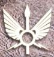
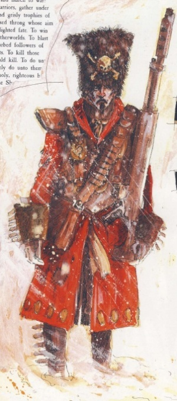
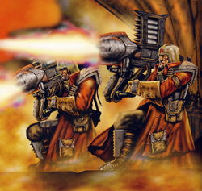
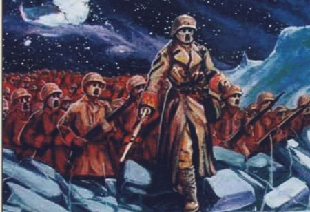
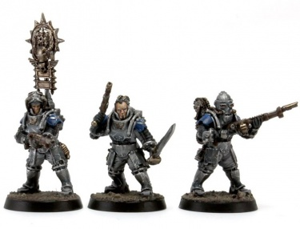

# 0082 帝国军 Imperial Army

精校状态：中文行文已逐段精校，部分术语仍为暂定

分类：通用概念 / 帝国 Imperium

原文来源：https://www.bilibili.com/opus/1130468927463227401

原作者：帝国神选罐头

原文时间：编辑于 2026年01月05日 16:18

[返回分类目录](目录.md) · [全书目录](../../目录.md)

原篇名：帝国军队 Imperial Army

<!-- A0082-B0001 -->
**英文原文**

The Imperial Army (also known as the Imperialis Auxilia in High Gothic) was the largest military force in the early Imperium, and was founded during the early Great Crusade to fill the need for more manpower to support the Astartes Legions, and quickly was used to garrison worlds and to perform sieges and mass invasions. The Imperialis Armada was the fleet subset of the Imperial Army and was subordinate to it, and both of them were subordinate to the Astartes command structure. The Imperial Army itself was part of the Excertus Imperialis, constituting one of its many divisions.

<!-- /A0082-B0001 -->

<!-- A0082-B0002 -->

原译文

帝国军队（在高哥特语中也称为帝国辅助军）是帝国早期最大的军事力量，成立于大远征早期，以满足对更多人力的需求，以支援阿斯塔特军团，并迅速被用来驻扎世界，进行围攻和大规模入侵。帝国舰队是帝国军队的舰队子集，隶属于帝国军队，两者都隶属于阿斯塔特指挥结构。帝国军队本身是帝国辅军的一部分，是其众多师之一。

**校订译文**

帝国军，在高哥特语中又称 Imperialis Auxilia，是早期帝国规模最大的军事力量。它成立于大远征初期，最初为阿斯塔特军团补充作战人力，很快便承担起世界驻防、攻城和大规模入侵任务。帝国无敌舰队是其下属的舰队分支，两者均服从阿斯塔特的指挥体系。帝国军本身又是帝国武装力量总体系 Excertus Imperialis 的诸多组成部分之一。

**校注：** Excertus Imperialis 是上位武装体系，原译“帝国辅军”与 Imperialis Auxilia 混淆；暂保留原文并用描述性中文说明。divisions 在此指组成部分，不是战术编制“师”。

<!-- /A0082-B0002 -->

<!-- A0082-B0003 -->
**英文原文**

The fighting elite of the Imperial Army was the Solar Auxilia, which comprised about 20-25% of the Army's strength by the end of the Great Crusade. The whole strength of the Imperial Army numbered in the many billions. The Imperial Army also maintained a force of auxiliaries known as the Imperialis Militia.

<!-- /A0082-B0003 -->

<!-- A0082-B0004 -->

原译文

帝国军队的战斗精英是太阳辅助军，到大远征结束时，太阳辅助军约占军队兵力的20-25%。帝国军队的总兵力达到数十亿。帝国军队还保留了一支被称为帝国民兵的辅助部队。

**校订译文**

太阳辅助军是帝国军的作战精锐，到大远征结束时约占总兵力的百分之二十至二十五。帝国军整体拥有数十亿兵员，另编有称为帝国民兵的辅助部队。

<!-- /A0082-B0004 -->

<!-- A0082-B0005 图片 -->

<!-- A0082-B0006 -->
**英文原文**

Headquarters:Terra

<!-- /A0082-B0006 -->

<!-- A0082-B0007 -->

原译文

总部：泰拉

**校订译文**

总部：泰拉

<!-- /A0082-B0007 -->

<!-- A0082-B0008 -->
**英文原文**

Leader:Lord Commander Militant

<!-- /A0082-B0008 -->

<!-- A0082-B0009 -->

原译文

领袖：军务领主指挥官

**校订译文**

领袖：军务领主指挥官

<!-- /A0082-B0009 -->

<!-- A0082-B0010 -->
**英文原文**

Sub-Branches:Solar Auxilia, Imperialis Militia, Imperialis Armada

<!-- /A0082-B0010 -->

<!-- A0082-B0011 -->

原译文

分支：太阳辅助军，帝国民兵，帝国舰队

**校订译文**

分支：太阳辅助军、帝国民兵、帝国无敌舰队

<!-- /A0082-B0011 -->

<!-- A0082-B0012 -->
**英文原文**

Established:Unification Wars-era

<!-- /A0082-B0012 -->

<!-- A0082-B0013 -->

原译文

成立：统一战争时期

**校订译文**

成立：统一战争时期

<!-- /A0082-B0013 -->

<!-- A0082-B0014 -->
**英文原文**

Dissolved:Post-Horus Heresy

<!-- /A0082-B0014 -->

<!-- A0082-B0015 -->

原译文

解散：荷鲁斯叛乱后

**校订译文**

解散：荷鲁斯之乱后

<!-- /A0082-B0015 -->

<!-- A0082-B0016 -->
## History 历史

<!-- /A0082-B0016 -->

<!-- A0082-B0017 -->
**英文原文**

The genus of the armed force that was to become the Imperial Army was on Terra, in the form of the few Strife-era military formations that the Emperor allowed to continue in his service after the end of the Unification Wars. These surviving units in time became referred to as the Old Hundred, and formed the initial nucleus of human soldiery at the very beginning of the Great Crusade.

<!-- /A0082-B0017 -->

<!-- A0082-B0018 -->

原译文

后来成为帝国军队的武装部队在泰拉上，以统一战争结束后帝皇允许继续服役的少数纷争时代军事编队的形式出现。这些幸存的部队后来被称为老百人团，并在大远征一开始就形成了人类士兵的最初核心。

**校订译文**

帝国军的源头可追溯至泰拉：统一战争结束后，帝皇允许少数纷争时代的旧军队继续为他效力。这些留存部队后来统称“老百人团”，构成了大远征初期凡人军队的核心。

<!-- /A0082-B0018 -->

<!-- A0082-B0019 图片 -->

<!-- A0082-B0020 -->

原译文

soldier of the Imperial Army 帝国军队的士兵

**校订译文**

soldier of the Imperial Army 帝国军的士兵

<!-- /A0082-B0020 -->

<!-- A0082-B0021 -->
**英文原文**

When the Emperor left Terra on the Great Crusade, it is said that he would expect the inhabitants of the worlds he conquered to maintain defences and armed forces for their own safety, against internal rebellion and external invasion; similar to the role of Planetary Defence Forces in the 41st millennium. It is out of these forces that the Imperial Army was first formed. Initially used as garrison forces, they were quickly pushed to the forefront of the Crusade.

<!-- /A0082-B0021 -->

<!-- A0082-B0022 -->

原译文

当帝皇在大远征中离开泰拉时，据说他希望他征服的世界的居民为了自己的安全而保持防御和武装力量，以抵御内部叛乱和外部入侵；类似于第41个千年的行星防御部队的作用。帝国军队就是从这些部队中最早成立的。最初被用作驻军，他们很快被推到远征的最前线。

**校订译文**

据说，帝皇离开泰拉发动大远征时，要求被征服世界的居民维持本地防御设施和武装力量，以镇压内部叛乱、抵御外来入侵，其职能类似 M41 的行星防御部队。帝国军最初便由这些部队扩编而来。他们起初担任驻军，很快就被推上大远征前线。

<!-- /A0082-B0022 -->

<!-- A0082-B0023 -->
**英文原文**

The Imperial Army's subordination to the Astartes Legions led to the Imperial Army tearing itself apart in the Horus Heresy, when half of the legions rebelled against the Emperor, and took their Army regiments with them. Thousands of Army commanders took it upon themselves to carve themselves their own empires, with no loyalty to Horus or the Emperor, and it was centuries before the Imperium was reforged.

<!-- /A0082-B0023 -->

<!-- A0082-B0024 -->

原译文

帝国军队从属于阿斯塔特军团，导致帝国军队在荷鲁斯叛乱中四分五裂，当时一半的军团反抗帝皇，并带走了他们的军队兵团。数千名军队指挥官自作主张，建立了自己的帝国，对荷鲁斯或帝皇没有忠诚，帝国重建也花了几个世纪。

**校订译文**

帝国军服从阿斯塔特军团指挥，这使它在荷鲁斯之乱中一同分裂：半数军团背叛帝皇时，也带走了麾下帝国军各团。另有数千名帝国军指挥官自立为王，既不效忠荷鲁斯，也不效忠帝皇。帝国耗费数百年，才重新整合破碎的疆域。

<!-- /A0082-B0024 -->

<!-- A0082-B0025 -->
**英文原文**

In the aftermath of the Horus Heresy, numerous changes were made to the structure of the Imperial armed forces. Many of these changes were made to ensure that no single individual would ever again be powerful enough to attempt to overthrow the ruling body of the Imperium if he turned traitor. It was during these post-Heresy reforms that the Imperial Army was split into two organisations: the Astra Militarum and the Imperial Navy; the link between them was severed. Astra Militarum commanders now have no authority over the Navy personnel transporting them and are forbidden from being able to command a naval force.

<!-- /A0082-B0025 -->

<!-- A0082-B0026 -->

原译文

荷鲁斯叛乱之后，帝国武装力量的结构发生了许多变化。其中许多变化是为了确保如果一个人叛变，他将不再有足够的力量试图推翻帝国的统治机构。正是在这些叛乱后改革期间，帝国军队被分为两个组织：星界军和帝国海军；他们之间的联系被切断了。星界军指挥官现在对运送他们的海军人员没有权力，也被禁止指挥海军部队。

**校订译文**

荷鲁斯之乱后，帝国大幅调整武装力量的结构，许多改革旨在避免任何人再次掌握足以在叛变后推翻帝国统治机构的力量。帝国军因此被拆分为星界军与帝国海军，两者之间的统属关系被切断。此后，星界军指挥官无权命令运送他们的海军人员，也被禁止指挥舰队。

<!-- /A0082-B0026 -->

<!-- A0082-B0027 -->
## Organisation and Recruitment of the Imperial Army 帝国军的组织与招募

原题：Organisation and Recruitment of the Imperial Army 组织和帝国军队的招募

<!-- /A0082-B0027 -->

<!-- A0082-B0028 -->
### Recruitment 招募

<!-- /A0082-B0028 -->

<!-- A0082-B0029 -->
**英文原文**

The Imperial Army was recruited from each world in the Imperium unless exempted (such as Astartes home worlds, Forge Worlds and planets in the Sol System, though some of the regiments from the Unification Wars of Terra were allowed to fight in the Great Crusade), but the size of the tithed forces was dependent on the population of the planet, and Imperial administrators determined the amount of soldiers and war materiel demanded. If all else failed or in times of desperation, the Imperial Army would utilise inducted levy militia, troops with little to no training and poor equipment.

<!-- /A0082-B0029 -->

<!-- A0082-B0030 -->

原译文

帝国军队从帝国的每个世界招募，除非获得豁免（如阿斯塔特家园世界、铸造世界和太阳系中的行星，尽管泰拉统一战争的一些兵团被允许参加大远征），但什一税部队的规模取决于行星的人口，帝国行政人员决定了所需的士兵和战争物资的数量。如果其他一切都失败了，或者在绝望的时候，帝国军队将利用入伍的征召民兵，这些部队几乎没有受过训练，装备也很差。

**校订译文**

除获准豁免的世界外，帝国各世界都须向帝国军提供兵员。豁免者包括阿斯塔特母星、铸造世界与太阳系内行星，不过参加过泰拉统一战争的部分军团仍获准参加大远征。征兵规模取决于行星人口，具体兵员和战争物资数额由帝国行政官核定。如果别无选择，或局势极其危急，帝国军也会征召民兵；这些人几乎没有受过训练，装备也十分简陋。

<!-- /A0082-B0030 -->

<!-- A0082-B0031 -->
**英文原文**

The best equipped and trained regular Imperial Army troops were known as Grenadiers. The fighting elite, made up of 20-25%, were known as the Solar Auxilia

<!-- /A0082-B0031 -->

<!-- A0082-B0032 -->

原译文

装备最精良、训练有素的正规帝国军队部队被称为掷弹兵。战斗精英，占20-25%，被称为太阳辅助军

**校订译文**

正规帝国军中，装备最好、训练最精良的部队称为掷弹兵。太阳辅助军则是其中的作战精锐，约占整体兵力的百分之二十至二十五。

<!-- /A0082-B0032 -->

<!-- A0082-B0033 -->
### Organisation 组织

<!-- /A0082-B0033 -->

<!-- A0082-B0034 -->
**英文原文**

Overall command of the Imperial Army was overseen by two Lord Militants who at the end of the Great Crusade were Tabor Ludovicia and Haldane Ma'lon. Like the Imperial Guard of the 41st Millennium, the Imperial Army relied on the Departmento Munitorum for administrative duties. This in turn answered to the Officio Militaris, an umbrella organisation including all of the many mortal soldiers, labourers and bureaucrats dedicated to the Great Crusade. However, operational command for the Imperial Army fell to the War Council.

<!-- /A0082-B0034 -->

<!-- A0082-B0035 -->

原译文

帝国军队的总体指挥由两名军务领主监督，他们在大远征结束时是塔博尔·卢多维西亚和霍尔丹·马'龙。与第41个千年的帝国卫队一样，帝国军队依靠军务部履行行政职责。这反过来又回应了军备庭，这是一个伞式组织，包括所有致力于大远征的凡人士兵、劳工和官僚。然而，帝国军队的作战指挥权落在战争议会手中。

**校订译文**

帝国军的总体指挥由两位军务领主负责，大远征结束时分别是塔博尔·卢多维西亚与霍尔丹·马’龙。与 M41 的帝国卫队一样，帝国军依靠军务部处理行政事务。军务部又向军备庭负责；军备庭统辖为大远征服务的各类凡人士兵、劳工与官僚。不过，帝国军的实际作战指挥权属于战争议会。

<!-- /A0082-B0035 -->

<!-- A0082-B0036 图片 -->

<!-- A0082-B0037 -->

原译文

Imperial Army troops of the Sallan 11th Regiment 萨尔兰第11兵团的帝国军队部队

**校订译文**

Imperial Army troops of the Sallan 11th Regiment 萨尔兰第11兵团的帝国军部队

<!-- /A0082-B0037 -->

<!-- A0082-B0038 -->
**英文原文**

The Imperial Army was broadly organised into three groupings. The First Echelon consisted of around 25% of the Army, was a leading edge of the Great Crusade and fought in direct support of the Legiones Astartes or independently in areas where Space Marines could not be spared. These included the famed Solar Auxilia as well as other elite Regiments such as the Old Hundred. Upon achieving victory, the First Echelon would leave the warzone with the rest of the Expeditionary Fleet. The Second Echelon, a strategic reserve formation of regular army troops, would then begin its duties in the form of mopping up, occupation and the overseeing compliance of the conquered world into the new Imperium. When necessary, these troops would also be used in protracted sieges and anti-insurgency operations.

<!-- /A0082-B0038 -->

<!-- A0082-B0039 -->

原译文

帝国军队大致分为三个集团。第一梯队约占军队的25%，是大远征的前沿，直接支援阿斯塔特军团或在星际战士无法匀出的地区独立作战。其中包括著名的太阳辅助军以及其他精英兵团，如老百人团。取得胜利后，第一梯队将与远征舰队的其他成员一起离开战区。第二梯队是一支由正规军组成的战略预备部队，然后将以扫荡、占领和监督被征服世界遵守新帝国的形式开始履行职责。必要时，这些部队还将用于长期围困和反叛乱行动。

**校订译文**

帝国军大致分为三个梯队。第一梯队约占总兵力的四分之一，是大远征的先锋，直接支援阿斯塔特军团，也会在无法抽调星际战士的地区独立作战。著名的太阳辅助军和老百人团等精锐部队均属此列。取得胜利后，第一梯队随远征舰队离开战区，由第二梯队接手。第二梯队是正规军构成的战略预备力量，负责肃清残敌、驻军占领，并监督新征服世界归顺帝国；必要时，也承担持久围攻和反叛乱任务。

<!-- /A0082-B0039 -->

<!-- A0082-B0040 -->
**英文原文**

Only once a world was declared fully compliant would the Third Echelon, or Imperialis Militia, be deployed. These troops often were formed for a core of former Second Echelon troops as well as many new locally raised personnel. The duty of the Third Echelon was to combat piracy, civil unrest and to act as the first line of defense against any new threats that may emerge despite often being woefully outmatched against more formidable enemies. Unlike the first and second echelons, these troops had no standardisation with regards to equipment, technology levels or training. Rarely deployed off-world and not particularly loyal to the Imperial Truth, during the subsequent Horus Heresy Third Echelon troops were often used as cannon fodder, especially by the Traitor Legions.

<!-- /A0082-B0040 -->

<!-- A0082-B0041 -->

原译文

只有当世界宣布完全顺从时，才会部署第三梯队或帝国民兵。这些部队通常是为前第二梯队部队的核心以及许多新的当地人员组建的。第三梯队的职责是打击海盗、内乱，并作为抵御可能出现的任何新威胁的第一道防线，尽管在面对更强大的敌人时，他们往往会惨败。与第一梯队和第二梯队不同，这些部队在装备、技术水平或训练方面没有标准化。很少在世界各地部署，也不特别忠于帝国真理，在随后的荷鲁斯叛乱时期，第三梯队部队经常被用作炮灰，尤其是被叛徒军团使用。

**校订译文**

只有世界被宣布完全归顺后，第三梯队——帝国民兵——才会进驻。他们通常以一批原第二梯队官兵为骨干，吸收大量新征召的本地人员。其职责是打击海盗、平息内乱，并在新威胁出现时充当第一道防线；但面对强敌，他们往往实力悬殊。与前两梯队不同，民兵的装备、技术水平和训练并无统一标准。他们极少被派往其他世界，对帝国真理也未必多么忠诚。在随后的荷鲁斯之乱中，第三梯队经常被当作炮灰，尤其受到叛徒军团如此驱使。

<!-- /A0082-B0041 -->

<!-- A0082-B0042 -->
**英文原文**

The largest single organisational unit in the Imperial Army was the Expedition Fleet, each of which was controlled by a Lord Commander unless an Astartes officer was attached. By the time of the Ullanor campaign and the inauguration of Warmaster Horus, there were 4,659 Primary Expedition Fleets (with 372 of those in refit at the time) and more than sixty thousand Secondary Expedition Fleets. Expedition Fleets each had hundreds of thousands of ships and a large amount of Army personnel for ground warfare, the entirety of the Imperialis Armada transporting and supplying many billions of troops.

<!-- /A0082-B0042 -->

<!-- A0082-B0043 -->

原译文

帝国军队中最大的单一组织单位是远征舰队，除非有阿斯塔特军官，否则每个单位都由一名领主指挥官控制。到乌兰诺战役和战帅荷鲁斯就职典礼时，有4659支一级远征舰队（当时有372支正在改装）和6万多支二级远征舰队。远征舰队各有数十万艘舰艇和大量军队人员用于地面作战，整个帝国舰队运输和供应了数十亿军队。

**校订译文**

帝国军最大的独立组织单位是远征舰队。若没有派驻阿斯塔特军官，则由领主指挥官统率。到乌兰诺战役和荷鲁斯受封战帅时，共有 4,659 支一级远征舰队，其中 372 支当时正在整修，此外还有六万余支二级远征舰队。按本条目记载，每支远征舰队包含数十万艘舰船，以及用于地面作战的大批帝国军人员；整个帝国无敌舰队承担数十亿官兵的运输与补给。

**校注：** 每支舰队数十万艘是所给英文明确陈述，但与全帝国舰队数量合看规模极大，未另证实，忠实保留并标注来源口径。

<!-- /A0082-B0043 -->

<!-- A0082-B0044 -->
### Organisation of Imperial Army Regiments 帝国军兵团的组织

原题：Organisation of Imperial Army Regiments 帝国军队兵团的组织

<!-- /A0082-B0044 -->

<!-- A0082-B0045 -->
**英文原文**

The largest permanent organisational unit during the Horus Heresy for the Imperial Army was the regiment and to take a typical example, regiments could be divided into three or more battalions, with each battalion made up of two or more companies and Platoons, with additional support units attached at the battalion and regimental level.

<!-- /A0082-B0045 -->

<!-- A0082-B0046 -->

原译文

荷鲁斯叛乱时期，帝国军团最大的永久性组织单位是兵团，举个典型的例子，兵团可以分为三个或更多个营，每个营由两个或多个连和排组成，营和团级还有额外的支援单位。

**校订译文**

荷鲁斯之乱期间，帝国军最大的常设编制是团。典型的团可下辖三个或更多营，每营又分为两个或更多连及下属各排；团级和营级还配属额外支援单位。

<!-- /A0082-B0046 -->

<!-- A0082-B0047 -->
**英文原文**

The organisation of individual regiments varied immensely because of the massive lack of standardisation within the Imperial Army. Expedition Fleets were only equipped with a portion of their supply needs and were expected to re-supply themselves from conquered worlds. These issues were partially resolved with the Council of Terra's introduction of the Departmento Munitorum. The Munitorum originally existed as the Corps Logisticae, a division of naval administration, but was made into a full Departmento shortly before the Ullanor Crusade.

<!-- /A0082-B0047 -->

<!-- A0082-B0048 -->

原译文

由于帝国军队内部严重缺乏标准化，各个兵团的组织差异很大。远征舰队只配备了一部分补给需求，预计将从征服的世界重新补给自己。随着泰拉议会引入军务部，这些问题得到了部分解决。军务部最初是作为海军管理部门的后勤部队存在的，但在乌兰诺远征前不久就变成了一个完整的部门。

**校订译文**

帝国军严重缺乏统一标准，各团编制差异很大。远征舰队出发时仅获配部分所需物资，其余须从征服的世界补充。泰拉议会引入军务部后，问题得到部分缓解。军务部的前身是海军行政体系下属的后勤署（Corps Logisticae），在乌兰诺远征前不久升格为正式部门。

**校注：** 前文称泰拉议会在乌兰诺远征后成立，本段却将军务部升格日期置于远征前；底稿的机构沿革时间存在待核处，未自行改日期。

<!-- /A0082-B0048 -->

<!-- A0082-B0049 图片 -->

<!-- A0082-B0050 -->

原译文

Imperial Army troops of the Fasadian Heavy Infantry 法萨迪亚重步兵的帝国军团部队

**校订译文**

Imperial Army troops of the Fasadian Heavy Infantry 帝国军法萨迪亚重步兵

<!-- /A0082-B0050 -->

<!-- A0082-B0051 -->
### Organisation of the Imperialis Armada 帝国无敌舰队的组织

原题：Organisation of the Imperialis Armada 帝国舰队的组织

<!-- /A0082-B0051 -->

<!-- A0082-B0052 -->
**英文原文**

The Imperialis Armada was overseen by a Grand Admiral who by the end of the Great Crusade was Constansa Suati-Falkan.

<!-- /A0082-B0052 -->

<!-- A0082-B0053 -->

原译文

帝国舰队由一位海军元帅监督，在大远征结束时是康斯坦萨·苏亚蒂-法尔坎。

**校订译文**

帝国无敌舰队由海军元帅统率，大远征结束时的任职者是康斯坦萨·苏阿蒂-法尔坎。

<!-- /A0082-B0053 -->

<!-- A0082-B0054 -->
**英文原文**

Regiments were usually assigned to individual ships, with Army personnel commanding both elements. In the fleet, the highest rank was the Master of the Fleet, who was under the authority of the Lord Commander or Astartes officer in the Expedition Fleet. Other common ranks included Shipmaster (in control of a ship), Executive Officer (second in command), First Master and Master (other ship officers). Some fleets, like the Saturnine Fleet, retained their old ranks from before the Unification Wars.

<!-- /A0082-B0054 -->

<!-- A0082-B0055 -->

原译文

兵团通常被分配到单独的舰艇上，由军队人员指挥这两个部队。在舰队中，最高军衔是舰队司令，他在远征舰队的领主指挥官或阿斯塔特军官的领导下。其他常见的军衔包括舰长（控制舰船）、执行官（二把手）、第一大师和大师（其他舰船军官）。一些舰队，如土星舰队，保留了统一战争前的旧军衔。

**校订译文**

各团通常配属单独的舰船，由帝国军军官同时指挥地面部队和舰船。舰队中的最高职位是舰队司令，服从远征舰队领主指挥官或阿斯塔特军官的命令。其他常见职位包括舰长（指挥一艘舰船）、执行官（副手），以及首席舰务官和舰务官等。土星舰队等部分舰队仍保留统一战争之前的旧军衔。

**校注：** First Master/Master 为舰上军官职称，暂作“首席舰务官／舰务官”，不按字面译大师；待该时期海军职级原始资料核对。

<!-- /A0082-B0055 -->

<!-- A0082-B0056 -->
## Equipment 装备

<!-- /A0082-B0056 -->

<!-- A0082-B0057 -->
**英文原文**

The Imperial Army of the Great Crusade was much more well-equipped than the Astra Militarum of the 41st Millennia. Vehicles that are considered rare or lost technology in M41 were common, such as the Testudo, Dracosan, Aurox, Gorgon, Carnodon, Malcador, Leman Russ Incinerator, Leman Russ Vanquisher, Leman Russ Executioner, Destroyer Tank Hunter, or Scurrier. Advanced walkers such as the Hermes Light Sentinel and Aethon Heavy Sentinel were fielded. Entire divisions were equipped with Baneblade and Stormhammer Super-Heavy Tanks and Valdor Heavy Tanks and fleets were equipped with multitudes of Battleships and Grand Cruisers, all now considered a rarity. In the ten thousand years since the Great Crusade and Horus Heresy, STCs have been lost, Forge Worlds destroyed, and the technology has been treated with far more superstition by the Adeptus Mechanicus.

<!-- /A0082-B0057 -->

<!-- A0082-B0058 -->

原译文

大远征的帝国军队比第41千年的星界军装备精良得多。在M41中被认为是稀有或遗失技术的载具很常见，如龟甲、天龙座、野牛、戈尔贡、狮虎、马卡多、黎曼鲁斯焚化者、黎曼鲁斯征服者、黎曼鲁斯刽子手、破坏者坦克猎手或速移者。先进的步行者，如赫尔墨斯轻型哨兵和埃松重型哨兵被部署。整个师都配备了毒刃和风暴锤超重型坦克和瓦尔多重型坦克，舰队配备了大量战列舰和大型巡洋舰，现在都被认为是罕见的。自大远征和荷鲁斯叛乱以来的一万年里，STC已经丢失，铸造世界被摧毁，机械深交对技术的迷信程度要高得多。

**校订译文**

大远征时期，帝国军的装备远比 M41 的星界军精良。龟甲、天龙座、野牛、戈尔贡、狮虎、马卡多、黎曼鲁斯焚化者、黎曼鲁斯胜利者、黎曼鲁斯处决者、破坏者坦克猎手和速移者等载具，在 M41 已属罕见或技术失传，当时却很常见。部队还部署赫尔墨斯轻型哨兵和埃松重型哨兵等先进步行载具，甚至整师装备毒刃、风暴锤超重型坦克，以及瓦尔多重型坦克。舰队也拥有大量如今已十分稀少的战列舰和大型巡洋舰。大远征与荷鲁斯之乱之后的一万年里，许多标准建造模板（STC）失传，铸造世界被摧毁，而机械修会对技术的态度也愈发迷信。

<!-- /A0082-B0058 -->

<!-- A0082-B0059 图片 -->

<!-- A0082-B0060 -->

原译文

Imperial Army Solar Auxilia 太阳辅助军帝国军队

**校订译文**

Imperial Army Solar Auxilia 帝国军太阳辅助军

<!-- /A0082-B0060 -->

<!-- A0082-B0061 -->
## Notable regiments 著名兵团

<!-- /A0082-B0061 -->

<!-- A0082-B0062 -->

原译文

12th Austra Auxilia 第12奥斯特拉辅助军

**校订译文**

12th Austra Auxilia 第12奥斯特拉辅助军

<!-- /A0082-B0062 -->

<!-- A0082-B0063 -->

原译文

91st Industani 印度斯坦第91团

**校订译文**

91st Industani 印度斯坦第91团

<!-- /A0082-B0063 -->

<!-- A0082-B0064 -->
**英文原文**

Addaba Free Corps — Defected to Horus during the Siege of Terra.

<!-- /A0082-B0064 -->

<!-- A0082-B0065 -->

原译文

阿达巴自由军 — 在泰伦围城中叛逃至荷鲁斯。

**校订译文**

阿达巴自由军——泰拉围城期间倒向荷鲁斯。

<!-- /A0082-B0065 -->

<!-- A0082-B0066 -->

原译文

Antioch Miles Vesperi 安条克黄昏战士

**校订译文**

Antioch Miles Vesperi 安条克黄昏战士

<!-- /A0082-B0066 -->

<!-- A0082-B0067 -->
**英文原文**

Ayliet Phalanx — Subordinate to the Luna Wolves

<!-- /A0082-B0067 -->

<!-- A0082-B0068 -->

原译文

艾列特方阵军 — 隶属于影月苍狼

**校订译文**

艾列特方阵军 — 隶属于影月苍狼

<!-- /A0082-B0068 -->

<!-- A0082-B0069 -->
**英文原文**

Archite Palatines — Attached to the 28th Expedition Fleet.

<!-- /A0082-B0069 -->

<!-- A0082-B0070 -->

原译文

亚基特王庭军 — 隶属于第28远征舰队。

**校订译文**

亚基特王庭军 — 隶属于第28远征舰队。

<!-- /A0082-B0070 -->

<!-- A0082-B0071 -->
**英文原文**

Angkorian Dragoons — Part of the Old Hundred.

<!-- /A0082-B0071 -->

<!-- A0082-B0072 -->

原译文

吴哥龙骑兵 — 旧百人团的一部分。

**校订译文**

吴哥龙骑兵——老百人团之一。

<!-- /A0082-B0072 -->

<!-- A0082-B0073 -->
**英文原文**

Byzant Janizars — Attached to the 63rd Expedition Fleet, rebelled during the Horus Heresy.

<!-- /A0082-B0073 -->

<!-- A0082-B0074 -->

原译文

拜占庭禁卫军 — 隶属于第63远征舰队，在荷鲁斯叛乱期间叛乱。

**校订译文**

拜占庭禁卫军 — 隶属于第63远征舰队，在荷鲁斯之乱期间叛乱。

<!-- /A0082-B0074 -->

<!-- A0082-B0075 -->
**英文原文**

Caliban Jaegers — Assigned to the 4th Expeditionary Fleet serving the Dark Angels Legion.

<!-- /A0082-B0075 -->

<!-- A0082-B0076 -->

原译文

卡利班猎兵 — 被分配到为黑暗天使军团服务的第四远征舰队。

**校订译文**

卡利班猎兵 — 被分配到为黑暗天使军团服务的第四远征舰队。

<!-- /A0082-B0076 -->

<!-- A0082-B0077 -->

原译文

Calth 2nd Irregulars 考斯第二非正规军

**校订译文**

Calth 2nd Irregulars 考斯第二非正规军

<!-- /A0082-B0077 -->

<!-- A0082-B0078 -->

原译文

Calth 3rd Infantry 考斯第三步兵团

**校订译文**

Calth 3rd Infantry 考斯第三步兵团

<!-- /A0082-B0078 -->

<!-- A0082-B0079 -->

原译文

Calth 5th Infantry Regiment 考斯第五步兵兵团

**校订译文**

Calth 5th Infantry Regiment 考斯第五步兵兵团

<!-- /A0082-B0079 -->

<!-- A0082-B0080 -->

原译文

Castellan Exemplars 典范堡主

**校订译文**

Castellan Exemplars 典范堡主

<!-- /A0082-B0080 -->

<!-- A0082-B0081 -->
**英文原文**

Clandestine Orta — Special forces akin to Stormtroopers

<!-- /A0082-B0081 -->

<!-- A0082-B0082 -->

原译文

秘密奥尔塔 — 类似于风暴兵的特种部队

**校订译文**

秘密奥尔塔 — 类似于风暴兵的特种部队

<!-- /A0082-B0082 -->

<!-- A0082-B0083 -->

原译文

Charonid Sentinels 冥界哨兵

**校订译文**

Charonid Sentinels 冥界哨兵

<!-- /A0082-B0083 -->

<!-- A0082-B0084 -->

原译文

Dharro Alpha Brigade 达尔罗阿尔法旅

**校订译文**

Dharro Alpha Brigade 达尔罗阿尔法旅

<!-- /A0082-B0084 -->

<!-- A0082-B0085 -->

原译文

Dogan Maulers 多根狂暴者

**校订译文**

Dogan Maulers 多根狂暴者

<!-- /A0082-B0085 -->

<!-- A0082-B0086 -->

原译文

Fasadian Heavy Infantry 法萨迪亚重步兵

**校订译文**

Fasadian Heavy Infantry 法萨迪亚重步兵

<!-- /A0082-B0086 -->

<!-- A0082-B0087 -->

原译文

Fasadian 45th Infantry 法萨迪亚第45步兵团

**校订译文**

Fasadian 45th Infantry 法萨迪亚第45步兵团

<!-- /A0082-B0087 -->

<!-- A0082-B0088 -->

原译文

Fellesian 5th Airborne Auxiliary 费里西亚第五空降辅助军

**校订译文**

Fellesian 5th Airborne Auxiliary 费里西亚第五空降辅助军

<!-- /A0082-B0088 -->

<!-- A0082-B0089 -->

原译文

Fellesian 23rd Airborne 费里西亚第23空降团

**校订译文**

Fellesian 23rd Airborne 费里西亚第23空降团

<!-- /A0082-B0089 -->

<!-- A0082-B0090 -->

原译文

First Terran Armoured 第一泰拉装甲兵团

**校订译文**

First Terran Armoured 第一泰拉装甲兵团

<!-- /A0082-B0090 -->

<!-- A0082-B0091 -->
**英文原文**

Geno Five-Two Chiliad — Attached to the 670th Expedition Fleet. Part of the Old Hundred.

<!-- /A0082-B0091 -->

<!-- A0082-B0092 -->

原译文

基诺5-2千连团 — 隶属于第670远征舰队。老百人团的一部分。

**校订译文**

基诺五二千连团——配属于第670远征舰队，老百人团之一。

<!-- /A0082-B0092 -->

<!-- A0082-B0093 -->

原译文

Geno Ten Sairus 基诺第十赛鲁斯

**校订译文**

Geno Ten Sairus 基诺第十赛鲁斯

<!-- /A0082-B0093 -->

<!-- A0082-B0094 -->

原译文

Geno Seven-Sixty Spartocid 基诺7-60斯帕托科斯

**校订译文**

Geno Seven-Sixty Spartocid 基诺7-60斯帕托科斯

<!-- /A0082-B0094 -->

<!-- A0082-B0095 -->
**英文原文**

Golden Hegera — Part of the Old Hundred.

<!-- /A0082-B0095 -->

<!-- A0082-B0096 -->

原译文

黄金赫格拉 — 老百人团的一部分。

**校订译文**

黄金赫格拉 — 老百人团的一部分。

<!-- /A0082-B0096 -->

<!-- A0082-B0097 -->

原译文

Harkon Geno. 哈孔基诺

**校订译文**

Harkon Geno. 哈孔基诺

<!-- /A0082-B0097 -->

<!-- A0082-B0098 -->

原译文

12th Helian Rifles 第12赫连步枪团

**校订译文**

12th Helian Rifles 第12赫连步枪团

<!-- /A0082-B0098 -->

<!-- A0082-B0099 -->

原译文

Host of Brass 黄铜天军

**校订译文**

Host of Brass 黄铜天军

<!-- /A0082-B0099 -->

<!-- A0082-B0100 -->

原译文

Hundred and Fifth Tercio Upland Grenadiers 第105高地掷弹兵团

**校订译文**

Hundred and Fifth Tercio Upland Grenadiers 第105高地掷弹兵团

<!-- /A0082-B0100 -->

<!-- A0082-B0101 -->
**英文原文**

Inferallti Hussars — Assigned to guard Pluto

<!-- /A0082-B0101 -->

<!-- A0082-B0102 -->

原译文

地狱骠骑兵 — 被指派守卫冥王星

**校订译文**

地狱骠骑兵 — 被指派守卫冥王星

<!-- /A0082-B0102 -->

<!-- A0082-B0103 -->

原译文

Iterian 234th 伊特里亚第234团

**校订译文**

Iterian 234th 伊特里亚第234团

<!-- /A0082-B0103 -->

<!-- A0082-B0104 -->

原译文

Jovian Grenadiers 木星掷弹兵

**校订译文**

Jovian Grenadiers 木星掷弹兵

<!-- /A0082-B0104 -->

<!-- A0082-B0105 -->

原译文

Kimmerine Corps Bellum 基墨里涅战争兵团

**校订译文**

Kimmerine Corps Bellum 基墨里涅战争兵团

<!-- /A0082-B0105 -->

<!-- A0082-B0106 -->
**英文原文**

Kushtun Naganda — One of the Old Hundred.

<!-- /A0082-B0106 -->

<!-- A0082-B0107 -->

原译文

库什图·纳甘达 — 老百人团之一

**校订译文**

库什图·纳甘达 — 老百人团之一

<!-- /A0082-B0107 -->

<!-- A0082-B0108 -->
**英文原文**

13th/5th Hylgar's Hell-Raisers — A formation likely to be from early M31.

<!-- /A0082-B0108 -->

<!-- A0082-B0109 -->

原译文

第13/第五海格尔地狱掠夺者 - 一个可能来自M31早期的编队。

**校订译文**

海格尔地狱掀动者第13／5团——可能存在于 M31 初期的部队。

<!-- /A0082-B0109 -->

<!-- A0082-B0110 -->
**英文原文**

Lacunan Lifewatch — Present during the Ark Reach Secundus campaign

<!-- /A0082-B0110 -->

<!-- A0082-B0111 -->

原译文

拉库南生命观察者 — 在第二次方舟河段战役中出现

**校订译文**

拉库南生命守卫——参加了方舟疆域塞昆杜斯战役。

**校注：** Ark Reach Secundus 是专名，Secundus 不修饰 campaign，不能译成“第二次……战役”。暂译方舟疆域塞昆杜斯，保留英文以待后续定译。

<!-- /A0082-B0111 -->

<!-- A0082-B0112 -->
**英文原文**

Lucifer Black — Attached to the 670th Expedition Fleet

<!-- /A0082-B0112 -->

<!-- A0082-B0113 -->

原译文

路西法黑卫 — 隶属于第670远征舰队

**校订译文**

路西法黑卫 — 隶属于第670远征舰队

<!-- /A0082-B0113 -->

<!-- A0082-B0114 -->

原译文

Magdan FreeKorps 马丹自由军团

**校订译文**

Magdan FreeKorps 马丹自由军团

<!-- /A0082-B0114 -->

<!-- A0082-B0115 -->
**英文原文**

Malcador's Chosen — Praetorian Guard of Malcador the Sigilite

<!-- /A0082-B0115 -->

<!-- A0082-B0116 -->

原译文

马卡多亲选 — 掌印者马卡多的禁卫军

**校订译文**

马卡多亲选 — 掌印者马卡多的禁卫军

<!-- /A0082-B0116 -->

<!-- A0082-B0117 -->
**英文原文**

Merudin 20th Tactical - Traitor Regiment

<!-- /A0082-B0117 -->

<!-- A0082-B0118 -->

原译文

梅鲁丁第20战术团 - 叛徒兵团

**校订译文**

梅鲁丁第20战术团 - 叛徒兵团

<!-- /A0082-B0118 -->

<!-- A0082-B0119 -->
**英文原文**

Mohindas Eleventh — Wiped out by the Nephratil on Diurnus in the 6th year of the Great Crusade.

<!-- /A0082-B0119 -->

<!-- A0082-B0120 -->

原译文

莫欣达斯第11团 — 在大远征的第六年，被奈夫拉蒂尔在白日星消灭。

**校订译文**

莫欣达斯第11团 — 在大远征的第六年，被奈夫拉蒂尔在白日星消灭。

<!-- /A0082-B0120 -->

<!-- A0082-B0121 -->

原译文

Neshamere Eighth 内沙米尔第八团

**校订译文**

Neshamere Eighth 内沙米尔第八团

<!-- /A0082-B0121 -->

<!-- A0082-B0122 -->
**英文原文**

Ninth-Ward Angeloi Adamantiphracts — Assigned to garrison the Schadenhold alongside the iron Warriors under the command of Warsmith Barabas Dantioch.

<!-- /A0082-B0122 -->

<!-- A0082-B0123 -->

原译文

第九护卫破坚天使 - 被指派在战争铁匠巴拉巴斯·丹提欧克的指挥下，与钢铁勇士一起驻扎沙登霍尔德。

**校订译文**

第九护卫破坚天使 - 被指派在战争铁匠巴拉巴斯·丹提欧克的指挥下，与钢铁勇士一起驻扎沙登霍尔德。

<!-- /A0082-B0123 -->

<!-- A0082-B0124 -->
**英文原文**

Ouranti Draks — Attached to the 47th Expedition.

<!-- /A0082-B0124 -->

<!-- A0082-B0125 -->

原译文

乌兰提·德拉克 — 附属于第47远征舰队。

**校订译文**

乌兰提·德拉克 — 附属于第47远征舰队。

<!-- /A0082-B0125 -->

<!-- A0082-B0126 -->
**英文原文**

Outremar — Attached to the 670th Expedition Fleet and most other fleet, backbone of the Imperial Army.

<!-- /A0082-B0126 -->

<!-- A0082-B0127 -->

原译文

奥特瑞玛 - 隶属于第670远征舰队和大多数其他舰队，是帝国军队的中坚力量。

**校订译文**

奥特瑞玛 - 隶属于第670远征舰队和大多数其他舰队，是帝国军的中坚力量。

<!-- /A0082-B0127 -->

<!-- A0082-B0128 -->

原译文

Phyrian 2nd Auxillary 菲里安第二辅助军

**校订译文**

Phyrian 2nd Auxillary 菲里安第二辅助军

<!-- /A0082-B0128 -->

<!-- A0082-B0129 -->
**英文原文**

Prospero Spireguard — attached to the 28th Expedition

<!-- /A0082-B0129 -->

<!-- A0082-B0130 -->

原译文

普罗斯佩罗尖塔守卫 — 附属于第28远征舰队

**校订译文**

普罗斯佩罗尖塔守卫 — 附属于第28远征舰队

<!-- /A0082-B0130 -->

<!-- A0082-B0131 -->

原译文

Regnault Thorns 勒尼奥荆棘军

**校订译文**

Regnault Thorns 勒尼奥荆棘军

<!-- /A0082-B0131 -->

<!-- A0082-B0132 -->

原译文

Saaven Masonites 萨文追随者

**校订译文**

Saaven Masonites 萨文追随者

<!-- /A0082-B0132 -->

<!-- A0082-B0133 -->
**英文原文**

Sallan 11th Infantry — rebelled during the Horus Heresy.

<!-- /A0082-B0133 -->

<!-- A0082-B0134 -->

原译文

萨尔兰第11步兵团 — 在荷鲁斯叛乱期间叛乱。

**校订译文**

萨尔兰第11步兵团 — 在荷鲁斯之乱期间叛乱。

<!-- /A0082-B0134 -->

<!-- A0082-B0135 -->

原译文

Sarcosan Voltigeurs 生化轻步兵团

**校订译文**

Sarcosan Voltigeurs 萨科萨轻步兵团

<!-- /A0082-B0135 -->

<!-- A0082-B0136 -->

原译文

Saturnine Hoplites 土星重装步兵团

**校订译文**

Saturnine Hoplites 土星重装步兵团

<!-- /A0082-B0136 -->

<!-- A0082-B0137 -->
**英文原文**

Selucid Thorakites — troops of the Iron Warriors

<!-- /A0082-B0137 -->

<!-- A0082-B0138 -->

原译文

塞琉古胸甲军 — 钢铁勇士的军队

**校订译文**

塞琉古胸甲军 — 钢铁勇士的军队

<!-- /A0082-B0138 -->

<!-- A0082-B0139 -->

原译文

Seventh-Suckle Parthenari Shieldmaidens 第七哺育纯洁少女盾卫军

**校订译文**

Seventh-Suckle Parthenari Shieldmaidens 第七哺育纯洁少女盾卫军

<!-- /A0082-B0139 -->

<!-- A0082-B0140 -->
**英文原文**

Solar Auxilia — Elite fighting force

<!-- /A0082-B0140 -->

<!-- A0082-B0141 -->

原译文

太阳辅助军 — 精英战斗部队

**校订译文**

太阳辅助军 — 精英战斗部队

<!-- /A0082-B0141 -->

<!-- A0082-B0142 -->
**英文原文**

Tanagran Dragoons — Formed the garrison of the Forge World of Diamat.

<!-- /A0082-B0142 -->

<!-- A0082-B0143 -->

原译文

塔纳格兰龙骑兵 — 组成了迪亚马特铸造世界的驻军。

**校订译文**

塔纳格兰龙骑兵 — 组成了迪亚马特铸造世界的驻军。

<!-- /A0082-B0143 -->

<!-- A0082-B0144 -->

原译文

1st Terra Tank Division 第一泰拉坦克师

**校订译文**

1st Terra Tank Division 第一泰拉坦克师

<!-- /A0082-B0144 -->

<!-- A0082-B0145 -->

原译文

Terranic Auxilia 泰拉辅助军

**校订译文**

Terranic Auxilia 泰拉辅助军

<!-- /A0082-B0145 -->

<!-- A0082-B0146 -->

原译文

Therion Cohort 圣兽步兵大队

**校订译文**

Therion Cohort 圣兽步兵大队

<!-- /A0082-B0146 -->

<!-- A0082-B0147 -->
**英文原文**

Thorosian Voltigeurs — Took heavy losses in the Battle of Hell's Anvil.

<!-- /A0082-B0147 -->

<!-- A0082-B0148 -->

原译文

索罗西亚尖兵 — 在地狱铁砧之战中遭受了重大损失。

**校订译文**

索罗西亚尖兵 — 在地狱铁砧之战中遭受了重大损失。

<!-- /A0082-B0148 -->

<!-- A0082-B0149 -->

原译文

Thramassi Nightwatch 特拉马西守夜人

**校订译文**

Thramassi Nightwatch 特拉马西守夜人

<!-- /A0082-B0149 -->

<!-- A0082-B0150 -->
**英文原文**

Tupelov Lancers — Part of the Old Hundred

<!-- /A0082-B0150 -->

<!-- A0082-B0151 -->

原译文

图佩洛夫枪骑兵 — 老百人团的一部分

**校订译文**

图佩洛夫枪骑兵 — 老百人团的一部分

<!-- /A0082-B0151 -->

<!-- A0082-B0152 -->

原译文

Urslavik 12th Infantry 乌尔斯拉维克第12步兵团

**校订译文**

Urslavik 12th Infantry 乌尔斯拉维克第12步兵团

<!-- /A0082-B0152 -->

<!-- A0082-B0153 -->

原译文

Uzuran Sabreteurs 乌祖兰马刀手

**校订译文**

Uzuran Sabreteurs 乌祖兰马刀手

<!-- /A0082-B0153 -->

<!-- A0082-B0154 -->

原译文

Veridan Korracts 维里丹·科拉拉克斯

**校订译文**

Veridan Korracts 维里丹·科拉拉克斯

<!-- /A0082-B0154 -->

<!-- A0082-B0155 -->

原译文

Ydranian Seekers 伊德拉尼安追踪者

**校订译文**

Ydranian Seekers 伊德拉尼安追踪者

<!-- /A0082-B0155 -->

<!-- A0082-B0156 -->
## Notable fleets 著名舰队

<!-- /A0082-B0156 -->

<!-- A0082-B0157 -->
**英文原文**

The 63rd Expedition Fleet — the Expedition Fleet of the Warmaster Horus.

<!-- /A0082-B0157 -->

<!-- A0082-B0158 -->

原译文

第63远征舰队 — 战帅荷鲁斯的远征舰队。

**校订译文**

第63远征舰队 — 战帅荷鲁斯的远征舰队。

<!-- /A0082-B0158 -->

<!-- A0082-B0159 -->
**英文原文**

The 28th Expedition Fleet — the Expedition Fleet of Fulgrim and the Emperor's Children.

<!-- /A0082-B0159 -->

<!-- A0082-B0160 -->

原译文

第28远征舰队 — 福格瑞姆和帝皇之子的远征舰队。

**校订译文**

第28远征舰队 — 福格瑞姆和帝皇之子的远征舰队。

<!-- /A0082-B0160 -->

<!-- A0082-B0161 -->
**英文原文**

The 12th Expedition Fleet — the Expedition Fleet of Roboute Guilliman.

<!-- /A0082-B0161 -->

<!-- A0082-B0162 -->

原译文

第12远征舰队 — 罗伯特·基里曼的远征舰队。

**校订译文**

第12远征舰队 — 罗保特·基里曼的远征舰队。

<!-- /A0082-B0162 -->

<!-- A0082-B0163 -->
**英文原文**

The Saturnine Fleet — a war fleet remaining from Old Night

<!-- /A0082-B0163 -->

<!-- A0082-B0164 -->

原译文

土星舰队 — 一支从旧夜留下的战争舰队

**校订译文**

土星舰队 — 一支从旧夜留下的战争舰队

<!-- /A0082-B0164 -->

<!-- A0082-B0165 -->
## Notable Members of the Imperial Army 帝国军的著名成员

原题：Notable Members of the Imperial Army 帝国军队的著名成员

<!-- /A0082-B0165 -->

<!-- A0082-B0166 -->
**英文原文**

Adreen — Lord Commander Militant by the Siege of Terra

<!-- /A0082-B0166 -->

<!-- A0082-B0167 -->

原译文

阿德里安 — 泰拉围城的军务领主指挥官

**校订译文**

阿德里安 — 泰拉围城的军务领主指挥官

<!-- /A0082-B0167 -->

<!-- A0082-B0168 -->
**英文原文**

Tabor Ludovicia and Haldane Ma'lon — Ruling co-Lord Militants a the end of the Great Crusade

<!-- /A0082-B0168 -->

<!-- A0082-B0169 -->

原译文

塔博尔·卢多维西亚和霍尔丹·马'龙 — 大远征结束时的同裁军务领主

**校订译文**

塔博尔·卢多维西亚与霍尔丹·马’龙——大远征末期共同统辖帝国军的两位军务领主。

<!-- /A0082-B0169 -->

<!-- A0082-B0170 -->
**英文原文**

Kli-San Weia — Early Lord Commander Militant during the Unification Wars

<!-- /A0082-B0170 -->

<!-- A0082-B0171 -->

原译文

克里·圣-威亚 — 统一战争时期的早期军务领主指挥官

**校订译文**

克里·圣-威亚 — 统一战争时期的早期军务领主指挥官

<!-- /A0082-B0171 -->

<!-- A0082-B0172 -->
**英文原文**

Pietra Veitz Gustavus — Lord Militant

<!-- /A0082-B0172 -->

<!-- A0082-B0173 -->

原译文

皮耶特拉·维茨·古斯塔夫斯 — 军务领主

**校订译文**

皮耶特拉·维茨·古斯塔夫斯 — 军务领主

<!-- /A0082-B0173 -->

<!-- A0082-B0174 -->
**英文原文**

Saul Niborran — High Primary Solar General

<!-- /A0082-B0174 -->

<!-- A0082-B0175 -->

原译文

索尔·尼伯兰 — 至高主阳将军

**校订译文**

索尔·尼伯兰 — 至高主阳将军

<!-- /A0082-B0175 -->

<!-- A0082-B0176 -->
**英文原文**

Konas Burr — Militant General

<!-- /A0082-B0176 -->

<!-- A0082-B0177 -->

原译文

科纳斯·伯尔 — 军务将军

**校订译文**

科纳斯·伯尔 — 军务将军

<!-- /A0082-B0177 -->

<!-- A0082-B0178 -->
**英文原文**

Ireton MaSade — Lord Marshal

<!-- /A0082-B0178 -->

<!-- A0082-B0179 -->

原译文

艾尔顿·马萨德 — 领主元帅

**校订译文**

艾尔顿·马萨德 — 领主元帅

<!-- /A0082-B0179 -->

<!-- A0082-B0180 -->
**英文原文**

Teng Namatjira — Lord Commander

<!-- /A0082-B0180 -->

<!-- A0082-B0181 -->

原译文

藤·纳马吉拉 — 领主指挥官

**校订译文**

腾·纳马吉拉——领主指挥官

<!-- /A0082-B0181 -->

<!-- A0082-B0182 -->
**英文原文**

Hektor Varvarus — Lord Commander

<!-- /A0082-B0182 -->

<!-- A0082-B0183 -->

原译文

赫克托·瓦瓦鲁斯 — 领主指挥官

**校订译文**

赫克托·瓦瓦鲁斯 — 领主指挥官

<!-- /A0082-B0183 -->

<!-- A0082-B0184 -->
**英文原文**

Thaddeus Fayle — Lord Commander

<!-- /A0082-B0184 -->

<!-- A0082-B0185 -->

原译文

撒迪厄斯·费勒 — 领主指挥官

**校订译文**

撒迪厄斯·费勒 — 领主指挥官

<!-- /A0082-B0185 -->

<!-- A0082-B0186 -->
**英文原文**

Tyana Kourion — Lord General

<!-- /A0082-B0186 -->

<!-- A0082-B0187 -->

原译文

提阿纳·库里翁 — 领主将军

**校订译文**

提阿纳·库里翁 — 领主将军

<!-- /A0082-B0187 -->

<!-- A0082-B0188 -->
**英文原文**

Bollivar — Lord General

<!-- /A0082-B0188 -->

<!-- A0082-B0189 -->

原译文

玻利瓦尔 — 领主将军

**校订译文**

玻利瓦尔 — 领主将军

<!-- /A0082-B0189 -->

<!-- A0082-B0190 -->
**英文原文**

Niora Su-Kassen — Admiral

<!-- /A0082-B0190 -->

<!-- A0082-B0191 -->

原译文

尼奥拉·苏-卡森 — 海军上将

**校订译文**

尼奥拉·苏-卡森 — 海军上将

<!-- /A0082-B0191 -->

<!-- A0082-B0192 -->
**英文原文**

Eodraki Hakon — Marshal

<!-- /A0082-B0192 -->

<!-- A0082-B0193 -->

原译文

伊奥德拉基·哈康 — 元帅

**校订译文**

伊奥德拉基·哈康 — 元帅

<!-- /A0082-B0193 -->

<!-- A0082-B0194 -->
**英文原文**

Aldana Agathe — Marshal.

<!-- /A0082-B0194 -->

<!-- A0082-B0195 -->

原译文

阿尔达纳·阿加特 — 元帅

**校订译文**

阿尔达纳·阿加特 — 元帅

<!-- /A0082-B0195 -->

<!-- A0082-B0196 -->
**英文原文**

Tempis Lor — General

<!-- /A0082-B0196 -->

<!-- A0082-B0197 -->

原译文

坦皮斯·洛尔 — 将军

**校订译文**

坦皮斯·洛尔 — 将军

<!-- /A0082-B0197 -->

<!-- A0082-B0198 -->
**英文原文**

Kaze — General

<!-- /A0082-B0198 -->

<!-- A0082-B0199 -->

原译文

卡泽 — 将军

**校订译文**

卡泽 — 将军

<!-- /A0082-B0199 -->

<!-- A0082-B0200 -->
**英文原文**

Dellasarius — Imperial Commander

<!-- /A0082-B0200 -->

<!-- A0082-B0201 -->

原译文

德拉萨里乌斯 — 帝国指挥官

**校订译文**

德拉萨里乌斯 — 帝国指挥官

<!-- /A0082-B0201 -->

<!-- A0082-B0202 -->
**英文原文**

Holst Lithonan — Traitor General

<!-- /A0082-B0202 -->

<!-- A0082-B0203 -->

原译文

霍尔斯特·利托南 — 叛徒将军

**校订译文**

霍尔斯特·利托南 — 叛徒将军

<!-- /A0082-B0203 -->

<!-- A0082-B0204 -->
**英文原文**

Maylon Idar III — Traitor General

<!-- /A0082-B0204 -->

<!-- A0082-B0205 -->

原译文

梅伦·伊达尔三世 — 叛徒将军

**校订译文**

梅伦·伊达尔三世 — 叛徒将军

<!-- /A0082-B0205 -->

<!-- A0082-B0206 -->
**英文原文**

Yennu Egwu — General, defects to Horus

<!-- /A0082-B0206 -->

<!-- A0082-B0207 -->

原译文

耶努·埃格武 — 将军，投敌于荷鲁斯

**校订译文**

耶努·埃格武 — 将军，投敌于荷鲁斯

<!-- /A0082-B0207 -->

<!-- A0082-B0208 -->
**英文原文**

Hestor Navarre — Officer of the Ouranti Draks

<!-- /A0082-B0208 -->

<!-- A0082-B0209 -->

原译文

赫斯托·纳瓦拉 — 乌兰提·德拉克的军官

**校订译文**

赫斯托·纳瓦拉 — 乌兰提·德拉克的军官

<!-- /A0082-B0209 -->

<!-- A0082-B0210 -->
**英文原文**

Marcus Valerius — Commander of the Therion Cohort

<!-- /A0082-B0210 -->

<!-- A0082-B0211 -->

原译文

马库斯·瓦莱里厄斯 — 圣兽步兵大队的指挥官

**校订译文**

马库斯·瓦莱里厄斯 — 圣兽步兵大队的指挥官

<!-- /A0082-B0211 -->

<!-- A0082-B0212 -->
**英文原文**

Hurtado Bronzi — Hetman

<!-- /A0082-B0212 -->

<!-- A0082-B0213 -->

原译文

乌尔塔多·布朗齐 — 盖特曼

**校订译文**

乌尔塔多·布朗齐 — 盖特曼

<!-- /A0082-B0213 -->

<!-- A0082-B0214 -->
**英文原文**

Dimitar Shiban — Hetman

<!-- /A0082-B0214 -->

<!-- A0082-B0215 -->

原译文

迪米塔尔·希班 — 盖特曼

**校订译文**

迪米塔尔·希班 — 盖特曼

<!-- /A0082-B0215 -->

<!-- A0082-B0216 -->
**英文原文**

Peto Soneka — Hetman

<!-- /A0082-B0216 -->

<!-- A0082-B0217 -->

原译文

佩托·索内卡 — 盖特曼

**校订译文**

佩托·索内卡 — 盖特曼

<!-- /A0082-B0217 -->

<!-- A0082-B0218 -->
**英文原文**

Clement Brohn — Militant Colonel Auxilia

<!-- /A0082-B0218 -->

<!-- A0082-B0219 -->

原译文

克莱门特·布罗恩 — 辅助军军务上校

**校订译文**

克莱门特·布罗恩 — 辅助军军务上校

<!-- /A0082-B0219 -->

<!-- A0082-B0220 -->
**英文原文**

Fatidicus — Decorated veteran later key Imperial Cult religious figure

<!-- /A0082-B0220 -->

<!-- A0082-B0221 -->

原译文

法提狄克努斯 — 受勋老兵后来成为帝国教派的关键宗教人物

**校订译文**

法提狄克努斯——受勋老兵，后来成为帝皇信仰的重要宗教人物。

<!-- /A0082-B0221 -->

<!-- A0082-B0222 -->
**英文原文**

Ollanius Pius — Patron Saint of the Imperial Guard

<!-- /A0082-B0222 -->

<!-- A0082-B0223 -->

原译文

欧兰尼奥斯·皮乌斯 — 皇家卫队的守护圣者

**校订译文**

欧良尼乌斯·庇乌斯——帝国卫队的守护圣者

<!-- /A0082-B0223 -->

<!-- A0082-B0224 -->
**英文原文**

Ospheus LaBray — Admiral of the Imperial Armada

<!-- /A0082-B0224 -->

<!-- A0082-B0225 -->

原译文

奥斯菲亚斯·拉布雷 — 帝国海军的海军上将

**校订译文**

奥斯菲厄斯·拉·布雷——帝国无敌舰队海军上将

<!-- /A0082-B0225 -->

<!-- A0082-B0226 -->
**英文原文**

Kaminska — Rear Admiral of the Imperial Armada

<!-- /A0082-B0226 -->

<!-- A0082-B0227 -->

原译文

卡明斯卡 — 帝国舰队的海军少将

**校订译文**

卡明斯卡——帝国无敌舰队海军少将

<!-- /A0082-B0227 -->

<!-- A0082-B0228 -->
**英文原文**

Lucretia Elunnirai — Seneschal-Prime of the Prospero Spireguard.

<!-- /A0082-B0228 -->

<!-- A0082-B0229 -->

原译文

卢克丽霞·埃伦奈莱 — 普罗斯佩罗尖塔守卫的总管之首

**校订译文**

卢克丽霞·埃伦奈莱 — 普罗斯佩罗尖塔守卫的总管之首

<!-- /A0082-B0229 -->

<!-- A0082-B0230 -->
**英文原文**

Maigraut — Colonel.

<!-- /A0082-B0230 -->

<!-- A0082-B0231 -->

原译文

麦格劳特 — 上校

**校订译文**

麦格劳特 — 上校

<!-- /A0082-B0231 -->

<!-- A0082-B0232 -->
**英文原文**

Andrei Ornatov — Colonel, Urslavik 12th Infantry.

<!-- /A0082-B0232 -->

<!-- A0082-B0233 -->

原译文

安德烈·奥尔纳托夫 — 上校，乌尔斯拉维克第12步兵团。

**校订译文**

安德烈·奥尔纳托夫 — 上校，乌尔斯拉维克第12步兵团。

<!-- /A0082-B0233 -->

<!-- A0082-B0234 -->
**英文原文**

Hasani Sabbyat — Stormtrooper Officer

<!-- /A0082-B0234 -->

<!-- A0082-B0235 -->

原译文

哈桑尼·萨比亚特 — 风暴兵军官

**校订译文**

哈桑尼·萨比亚特 — 风暴兵军官

<!-- /A0082-B0235 -->

<!-- A0082-B0236 -->
**英文原文**

Aevos Jovian — Medicae Officer

<!-- /A0082-B0236 -->

<!-- A0082-B0237 -->

原译文

埃沃斯·朱庇特 — 医疗军官

**校订译文**

埃沃斯·朱庇特 — 医疗军官

<!-- /A0082-B0237 -->

<!-- A0082-B0238 -->
**英文原文**

Khalid Hassan — Captain of the 4th Clandestine Orta

<!-- /A0082-B0238 -->

<!-- A0082-B0239 -->

原译文

哈立德·哈桑 — 秘密奥尔塔第四团上尉

**校订译文**

哈立德·哈桑 — 秘密奥尔塔第四团上尉

<!-- /A0082-B0239 -->

<!-- A0082-B0240 -->
**英文原文**

Kulok — Soldier

<!-- /A0082-B0240 -->

<!-- A0082-B0241 -->

原译文

库洛克 — 士兵

**校订译文**

库洛克 — 士兵

<!-- /A0082-B0241 -->

<!-- A0082-B0242 -->
**英文原文**

Ollanius Piers — Corporal.

<!-- /A0082-B0242 -->

<!-- A0082-B0243 -->

原译文

欧兰尼奥斯·皮尔斯 — 下士

**校订译文**

欧兰尼奥斯·皮尔斯 — 下士

<!-- /A0082-B0243 -->

<!-- A0082-B0244 -->
**英文原文**

Katsuhiro — Conscript.

<!-- /A0082-B0244 -->

<!-- A0082-B0245 -->

原译文

胜弘 — 征召兵

**校订译文**

胜弘 — 征召兵

<!-- /A0082-B0245 -->

本篇核心术语与暂定项

以下列出本篇出现的英文原形及核心术语表用词。同形词可能指不同对象，具体词义以本篇正文和校注为准；单复数、别名和仅见于图注的名称可能尚未列入。完整候选见[术语表](../../术语表/双语术语候选.csv)。

| 英文 | 采用中文 | 状态 |
| --- | --- | --- |
| Space Marines | 星际战士 | 官方已核对 |
| Dark Angels | 黑暗天使 | 官方已核对 |
| Adeptus Mechanicus | 机械修会 | 官方已核对 |
| Astra Militarum | 星界军 | 官方已核对 |
| Imperial Guard | 帝国卫队 | 暂定·语境区分 |
| Imperial Army | 帝国军 | 暂定·官方待核 |
| Roboute Guilliman | 罗保特·基里曼 | 官方已核对 |
| Horus Heresy | 荷鲁斯之乱 | 官方已核对 |
| Imperium | 帝国 | 暂定·简称 |
| Imperial Navy | 帝国海军 | 暂定 |
| Equipment | 装备 | 编辑用语已统一 |
| Phalanx | 山阵号 | 暂定 |
| Emperor | 帝皇 | 官方已核对 |
| Departmento Munitorum | 军务部 | 暂定 |
| Forge World | 铸造世界 | 暂定·官方待核 |
| Emperor's Children | 帝皇之子 | 官方已核对 |
| Iron Warriors | 钢铁勇士 | 暂定·官方待核 |
| Great Crusade | 大远征 | 暂定·官方待核 |
| Compliance | 归顺；纳入帝国统治 | 暂定·官方待核 |
| Terra | 泰拉 | 暂定·官方待核 |
| Luna Wolves | 影月苍狼 | 暂定·官方待核 |
| Horus | 荷鲁斯 | 暂定·官方待核 |
| Diamat | 迪亚马特 | 暂定·官方待核 |
| Fulgrim | 福格瑞姆 | 官方已核对 |
| Imperial Cult | 帝皇信仰 | 暂定·官方待核 |
| Legiones Astartes | 阿斯塔特军团 | 暂定·官方待核 |
| Solar Auxilia | 太阳辅助军 | 暂定·官方待核 |
| Imperialis Militia | 帝国民兵 | 暂定·官方待核 |
| Imperialis Armada | 帝国无敌舰队 | 暂定·官方待核 |
| Unification Wars | 统一战争 | 暂定·官方待核 |
| High Gothic | 高哥特语 | 暂定·官方待核 |
| Ark Reach Secundus | 方舟疆域塞昆杜斯 | 暂定·官方待核 |
| Old Night | 旧夜 | 暂定·官方待核 |
| Caliban | 卡利班 | 暂定·官方待核 |
| Luna | 月球 | 暂定·官方待核 |
| Barabas Dantioch | 巴拉巴斯·丹提欧克 | 暂定·官方待核 |
| Warsmith | 战争铁匠 | 暂定·官方待核 |
| Imperial Truth | 帝国真理 | 暂定·官方待核 |
| Geno Five-Two Chiliad | 基诺五二千连团 | 暂定·官方待核 |
| Teng Namatjira | 腾·纳马吉拉 | 暂定·官方待核 |
| Master | 导师（审判庭职衔）／舰务官（舰员职务） | 语境定译·官方待核 |
| Master of the Fleet | 舰队大师 | 暂定·官方待核 |
| Imperialis Auxilia | 帝国军 | 暂定·官方待核 |
| Excertus Imperialis | 帝国武装力量总体系 | 暂定·官方待核 |
| Officio Militaris | 军备庭 | 暂定·官方待核 |
| Corps Logisticae | 后勤署 | 暂定·官方待核 |
| Old Hundred | 老百人团 | 暂定·官方待核 |
| First Master | 首席舰务官（舰员职务）／第一大师（极限战士职衔） | 语境定译·官方待核 |
| Dracosan | 天龙座 | 暂定·官方待核 |
| Aurox | 野牛 | 暂定·官方待核 |
| Hetman | 盖特曼 | 暂定·官方待核 |
| Hurtado Bronzi | 乌尔塔多·布朗齐 | 暂定·官方待核 |
| Praetorian | 禁卫兵 | 暂定·官方待核 |
| Lord Marshal | 领主元帅 | 暂定·官方待核 |
| Ullanor | 乌兰诺 | 暂定·官方待核 |
| Lord Commander | 领主指挥官 | 暂定·官方待核 |
| Sol | 太阳系 | 暂定·官方待核 |
| Selucid Thorakites | 塞琉古胸甲兵 | 暂定·官方待核 |
| Destroyer | 毁灭者 | 暂定·官方待核 |
| Captain | 连长 | 暂定·官方待核 |
| Veteran | 老兵 | 暂定·官方待核 |
| Medicae | 医疗工 | 暂定·官方待核 |
| Shipmaster | 舰长 | 暂定·官方待核 |
| Mortal | 凡人 | 暂定·官方待核 |
| Cohort | 大队 | 暂定·官方待核 |
| Lord Commander Militant | 军务领主指挥官 | 暂定·官方待核 |
| Baneblade | 毒刃 | 官方已核对 |
| Ollanius Pius | 欧良尼乌斯·庇乌斯 | 官方词根参考·全名待核 |
| Echelon | 梯队 | 暂定·官方待核 |
| Imperialis | 帝国徽记 | 暂定·官方待核 |
| Marshal | 元帅 | 官方已核对 |
| Spireguard | 尖塔守卫 | 暂定·官方待核 |
| Ospheus LaBray | 奥菲斯·拉布雷 | 暂定·官方待核 |
| Ireton MaSade | 艾尔顿·马萨德 | 暂定·官方待核 |
| Hermes | 赫尔墨斯号 | 暂定·官方待核 |
| Incinerator | 焚化枪 | 暂定·官方待核 |
| Ollanius Piers | 欧良尼乌斯·皮尔斯 | 暂定·官方待核 |
| Khalid Hassan | 哈立德·哈桑 | 暂定·官方待核 |
| Adreen | 阿德林 | 暂定·官方待核 |
| Niora Su-Kassen | 尼奥拉·苏·卡森 | 暂定·官方待核 |
| Saul Niborran | 索尔·尼博兰 | 暂定·官方待核 |
| Clement Brohn | 克莱门特·布洛恩 | 暂定·官方待核 |
| Militant Colonel | 作战上校 | 暂定·官方待核 |
| Aldana Agathe | 阿尔达娜·阿加西 | 暂定·官方待核 |
| Tyana Kourion | 提亚纳·库里昂 | 暂定·官方待核 |
| Leman Russ Vanquisher | 黎曼鲁斯胜利者 | 官方已核·中英对照 |
| Leman Russ Executioner | 黎曼鲁斯处决者 | 官方已核·中英对照 |
| Inferallti Hussars | 因费拉尔提骠骑兵 | 暂定·官方待核 |
| The Dark | 《黑暗》 | 暂定·官方待核 |
| Carnodon | 卡诺顿兽 | 暂定·官方待核 |
| Marcus Valerius | 马库斯·瓦莱里乌斯 | 暂定·官方待核 |
| Therion Cohort | 圣兽大队 | 暂定·官方待核 |
| Thaddeus | 撒迪厄斯 | 暂定·官方待核 |
| Golden Hegera | 黄金赫格拉 | 暂定·官方待核 |
| System | 星系（恒星系统） | 暂定·官方待核 |
| Therion | 圣兽星 | 暂定·官方待核 |
| Saturnine Fleet | 土星舰队 | 暂定·官方待核 |
| War Council | 战争议会 | 暂定·官方待核 |
| Byzant Janizars | 拜占庭禁卫军 | 暂定·官方待核 |
| Lucretia Elunnirai | 卢克丽霞·埃伦尼赖 | 暂定·官方待核 |
| Holst | 霍尔斯特 | 暂定·官方待核 |
| Fayle | 法伊尔 | 暂定·官方待核 |
| Archite Palatines | 亚基特王庭军 | 暂定·官方待核 |
| Gorgon | 戈尔贡 | 暂定·官方待核 |
| Grand Admiral | 海军元帅 | 暂定·沿778同人职衔 |
| Leman Russ Incinerator | 黎曼鲁斯焚化者 | 暂定·官方待核 |
| Sol System | 太阳系 | 暂定·官方待核 |

