# 0083 太阳辅助军 Solar Auxilia

精校状态：中文行文已逐段精校，部分术语仍为暂定

分类：通用概念 / 帝国 Imperium

原文来源：https://www.bilibili.com/opus/1151727550976753686

原作者：帝国神选罐头

原文时间：2025年12月29日 16:11

[返回分类目录](目录.md) · [全书目录](../../目录.md)

<!-- A0083-B0001 -->
**英文原文**

"Let my epitaph be this; I was born nameless and abandoned in the gutter of a sunless pit, but I have died a conqueror of worlds."- Reputed last words of Lord Militant Erais Slaithe, Commander 74th Expeditionary Fleet, The Fall of Golgothea Terax, 0322884.M30

<!-- /A0083-B0001 -->

<!-- A0083-B0002 -->

原译文

“让我的墓志铭是这样的：我生而无名，被遗弃在一个没有阳光的坑的阴沟里，但我死了，以世界的征服者。”— 第74远征舰队指挥官军务领主埃雷斯·斯莱思的遗言，《各各他·泰拉克斯的陷落》，0322884.M30

**校订译文**

“就让我的墓志铭这样写：我生来无名，被遗弃在不见天日的深坑沟渠中；但我死时，已是诸世界的征服者。”——据传为第74远征舰队指挥官、军务领主埃雷斯·斯莱思的遗言；各各他·泰拉克斯陷落，0322884.M30。

<!-- /A0083-B0002 -->

<!-- A0083-B0003 -->
**英文原文**

The Solar Auxilia was an elite fighting force within the Imperialis Auxilia during the Great Crusade and Horus Heresy originating from the Segmentum Solar. Of the myriad regiments and battalions of the Imperialis Auxilia (known in Low Gothic as the Imperial Army) the Solar Auxilia were amongst the most elite, disciplined and well-equipped fighting forces, widely considered by many second only to the superhuman Legiones Astartes in their military effectiveness in battle. Solar Auxilia soldiers were not only trained as infantrymen but also for space combat, combat engineering, planetary exploration, and Death World survival missions.

<!-- /A0083-B0003 -->

<!-- A0083-B0004 -->

原译文

太阳辅助军是大远征和起源于太阳星域的荷鲁斯叛乱期间帝国辅助军中的一支精英战斗部队。在帝国辅助军（在低哥特语中称为帝国军队）的无数兵团和营中，太阳辅助军是最精英、纪律严明、装备精良的战斗部队之一，许多人普遍认为其在战斗中的军事效力仅次于超人阿斯塔特军团。太阳辅助军士兵不仅接受过步兵训练，还接受过太空战、工程战、行星探索和死亡世界生存任务的训练。

**校订译文**

太阳辅助军起源于太阳星域，是大远征与荷鲁斯之乱时期帝国军中的精锐力量。在 Imperialis Auxilia——低哥特语称帝国军——麾下无数团与营中，太阳辅助军跻身最精锐、纪律最严明、装备最精良的部队之列，许多人认为其实战效能仅次于超人的阿斯塔特军团。太阳辅助军士兵不仅接受步兵训练，还学习太空作战、战斗工程、行星勘探，以及死亡世界生存技能。

<!-- /A0083-B0004 -->

<!-- A0083-B0005 图片 -->
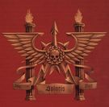

<!-- A0083-B0006 -->

原译文

Solar Auxilia 太阳辅助军

**校订译文**

Solar Auxilia 太阳辅助军

<!-- /A0083-B0006 -->

<!-- A0083-B0007 -->
**英文原文**

By the second century of the Great Crusade, the Solar Auxilia made up between 20-25% of the Imperial Army. Some 2/3rds of this force oversaw garrisoning duties while the rest accompanied Crusade Expeditionary Fleets.

<!-- /A0083-B0007 -->

<!-- A0083-B0008 -->

原译文

到大远征的第二世纪，太阳辅助军占帝国军队的20-25%。这支部队中约有2/3的人负责监督驻军任务，其余的人则陪同大远征的远征舰队。

**校订译文**

到大远征的第二个世纪，太阳辅助军约占帝国军总兵力的百分之二十至二十五。其中约三分之二负责驻防，其余随远征舰队作战。

<!-- /A0083-B0008 -->

<!-- A0083-B0009 -->
**英文原文**

Parent Agency:Imperial Army

<!-- /A0083-B0009 -->

<!-- A0083-B0010 -->

原译文

隶属机构：帝国军队

**校订译文**

隶属机构：帝国军

<!-- /A0083-B0010 -->

<!-- A0083-B0011 -->
**英文原文**

Headquarters:Terra

<!-- /A0083-B0011 -->

<!-- A0083-B0012 -->

原译文

总部：泰拉

**校订译文**

总部：泰拉

<!-- /A0083-B0012 -->

<!-- A0083-B0013 -->
**英文原文**

Leader:Lord Solar/Lord Militant

<!-- /A0083-B0013 -->

<!-- A0083-B0014 -->

原译文

领袖：太阳领主/军务领主

**校订译文**

领袖：太阳领主/军务领主

<!-- /A0083-B0014 -->

<!-- A0083-B0015 -->
**英文原文**

Established:Early Great Crusade

<!-- /A0083-B0015 -->

<!-- A0083-B0016 -->

原译文

建立时间：大远征早期

**校订译文**

建立时间：大远征早期

<!-- /A0083-B0016 -->

<!-- A0083-B0017 -->
## History 历史

<!-- /A0083-B0017 -->

<!-- A0083-B0018 -->
**英文原文**

The Solar Auxilia was founded in the early days of the Great Crusade as the forces of the Emperor required fleet-based armies capable of dealing with "petty wars" and colonial suppression while the Legiones Astartes handled grander campaigns. Imitating the Void Hoplites of the Saturnyne Ordo, the Solar Auxilia were trained, armed, and deployed in the same fashion and were issued with the same Saturnine Void Armour. Their doctrine emphasized discipline, coherence, aggressive defence, and concentrated firepower, making them highly effective soldiers. The first ten cohorts of the Solar Auxilia were known as the Saturnyne Rams and were more or less the Void Hoplites of the Saturnyne Order. Soon, more cohorts were raised from Terra and Luna in addition to Saturn. As the Great Crusade ground on, the Sol System could no longer provide enough manpower for the much-demanded Solar Auxilia forces, so recruits were drawn from elsewhere. These new recruits were mostly typically drawn from regions with a strong privateer and naval tradition.

<!-- /A0083-B0018 -->

<!-- A0083-B0019 -->

原译文

太阳辅助军成立于大远征的早期，因为帝皇的部队需要能够应对“小战争”和殖民镇压的舰基军队，而阿斯塔特军团则负责更大规模的战役。太阳辅助军模仿土星邦国的虚空重装步兵，以相同的方式进行训练、武装和部署，并获得了相同的土星虚空盔甲。他们的学说强调纪律、连贯性、侵略性防御和集中火力，使他们成为高效的士兵。太阳辅助军的前十个大队被称为土星公羊，或多或少是土星邦国的虚空重装步兵。很快，除了土星，更多的大队从泰拉和月球中建立。随着大远征的深入，太阳系不再能够为急需的太阳辅助军部队提供足够的人力，因此从其他地方招募新兵。这些新兵通常来自私掠船和海军传统深厚的地区。

**校订译文**

太阳辅助军成立于大远征初期。当时，阿斯塔特军团负责大规模战役，帝皇还需要依托舰队行动的凡人军队，处理局部战争和殖民地镇压事务。太阳辅助军以土星邦国的虚空重装步兵为范本，沿用其训练、装备和部署方式，配发相同的土星型虚空甲。其作战原则强调纪律、协同、积极防御与集中火力，因此战斗效能很高。最早的十个大队统称“土星公羊”，基本就是原有的土星邦国虚空重装步兵。随后，除土星外，泰拉和月球也开始组建更多大队。随着大远征持续推进，太阳系已无法满足对太阳辅助军的巨大兵员需求，招募范围便扩展至其他地区，通常优先选择私掠和海军传统深厚的地方。

<!-- /A0083-B0019 -->

<!-- A0083-B0020 图片 -->
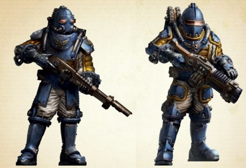

<!-- A0083-B0021 -->

原译文

Solar Auxilia Infantry 太阳辅助军步兵

**校订译文**

Solar Auxilia Infantry 太阳辅助军步兵

<!-- /A0083-B0021 -->

<!-- A0083-B0022 -->
**英文原文**

During the Crusade, the most common mission for Solar Auxilia units was to serve alongside Rogue Traders and Expeditionary Fleets as aggressors and explorers. Once a fleet had achieved Compliance and moved on, it usually fell to the Solar Auxilia and its assigned warships to guard those worlds and systems from outside threats as well as rebellion. Only when compliance was guaranteed beyond a doubt would the Solar Auxilia oversee the creation of locally-raised Imperialis Militia forces and redeploy elsewhere.

<!-- /A0083-B0022 -->

<!-- A0083-B0023 -->

原译文

在远征期间，太阳辅助军最常见的任务是与行商浪人和远征舰队并肩作战，成为侵略者和探索者。一旦舰队实现服从并继续前进，它通常会落到太阳辅助军及其分配的战舰身上，以保护这些世界和星系免受外部威胁和叛乱。只有当服从得到毫无疑问的保证时，太阳辅助军才会监督当地组建的帝国民兵部队的创建，并重新部署到其他地方。

**校订译文**

大远征期间，太阳辅助军最常随行商浪人与远征舰队行动，承担进攻和探索任务。舰队使某个世界归顺并继续前进后，通常由太阳辅助军及配属舰船留守，保护当地世界与星系，防范外敌和叛乱。只有确认当地已经彻底归顺，他们才会监督组建本地帝国民兵，并转赴别处。

<!-- /A0083-B0023 -->

<!-- A0083-B0024 -->
**英文原文**

When the Horus Heresy erupted, the Solar Auxilia became a key asset of loyalist forces. However, while they were overall strongly loyal, they nonetheless had several examples of rebellion against Imperial rule. Most notable amongst these were the Cthonian Headhunters, which had close connections to Warmaster Horus. In other cases, Solar Auxilia Regments incited rebellions within their own garrison systems for their own petty reasons.

<!-- /A0083-B0024 -->

<!-- A0083-B0025 -->

原译文

当荷鲁斯叛乱爆发时，太阳辅助军成为忠诚部队的关键资产。然而，尽管他们总体上非常忠诚，但他们也有几个反抗帝国统治的例子。其中最引人注目的是科索尼亚猎头者，他们与战帅荷鲁斯有着密切的联系。在其他情况下，太阳辅助军兵团出于自己的琐碎原因在自己的驻军星系内煽动叛乱。

**校订译文**

荷鲁斯之乱爆发后，太阳辅助军成为忠诚派的重要力量。不过，虽然整体上忠诚坚定，仍有部队反抗帝国统治。最著名的是与战帅荷鲁斯关系密切的科索尼亚猎头者。也有一些太阳辅助军团出于自身的狭隘私利，在驻防星系煽动叛乱。

<!-- /A0083-B0025 -->

<!-- A0083-B0026 -->
### Notable Campaigns 著名战役

<!-- /A0083-B0026 -->

<!-- A0083-B0027 -->
### Great Crusade 大远征

<!-- /A0083-B0027 -->

<!-- A0083-B0028 -->

原译文

Sealing of the Black Gate 黑门封印

**校订译文**

Sealing of the Black Gate 黑门封印

<!-- /A0083-B0028 -->

<!-- A0083-B0029 -->

原译文

Extermination of the Mitu 米图灭绝

**校订译文**

Extermination of the Mitu 米图灭绝

<!-- /A0083-B0029 -->

<!-- A0083-B0030 -->

原译文

Rangdan Xenocides 冉丹大屠杀

**校订译文**

Rangdan Xenocides 冉丹大屠杀

<!-- /A0083-B0030 -->

<!-- A0083-B0031 -->

原译文

Chondax Campaign 香德克斯战役

**校订译文**

Chondax Campaign 香德克斯战役

<!-- /A0083-B0031 -->

<!-- A0083-B0032 -->
### Horus Heresy 荷鲁斯之乱

原题：Horus Heresy 荷鲁斯叛乱

<!-- /A0083-B0032 -->

<!-- A0083-B0033 -->

原译文

Burning of Prospero 普罗斯佩罗之焚

**校订译文**

Burning of Prospero 普罗斯佩罗之焚

<!-- /A0083-B0033 -->

<!-- A0083-B0034 -->

原译文

First Siege of Hydra Cordatus 第一次九头蛇之心围城

**校订译文**

First Siege of Hydra Cordatus 第一次九头蛇之心围城

<!-- /A0083-B0034 -->

<!-- A0083-B0035 -->

原译文

Battle of the Coronid Deeps 王冠深渊之战

**校订译文**

Battle of the Coronid Deeps 王冠深渊之战

<!-- /A0083-B0035 -->

<!-- A0083-B0036 -->

原译文

Thramas Crusade 萨拉玛斯远征

**校订译文**

Thramas Crusade 萨拉玛斯远征

<!-- /A0083-B0036 -->

<!-- A0083-B0037 -->

原译文

Battle of Bodt 博特之战

**校订译文**

Battle of Bodt 博特之战

<!-- /A0083-B0037 -->

<!-- A0083-B0038 -->

原译文

Battle of Vannaheim 瓦纳海姆之战

**校订译文**

Battle of Vannaheim 瓦纳海姆之战

<!-- /A0083-B0038 -->

<!-- A0083-B0039 -->

原译文

Mezoan Campaign 梅佐亚战役

**校订译文**

Mezoan Campaign 梅佐亚战役

<!-- /A0083-B0039 -->

<!-- A0083-B0040 -->

原译文

Burning of Ohmn-Mat 欧姆-玛特之焚

**校订译文**

Burning of Ohmn-Mat 欧姆-玛特之焚

<!-- /A0083-B0040 -->

<!-- A0083-B0041 -->

原译文

Battle of Tallarn 塔兰之战

**校订译文**

Battle of Tallarn 塔兰之战

<!-- /A0083-B0041 -->

<!-- A0083-B0042 -->

原译文

Carnage of Morox 摩洛克斯大屠杀

**校订译文**

Carnage of Morox 摩洛克斯大屠杀

<!-- /A0083-B0042 -->

<!-- A0083-B0043 -->

原译文

Liberation of Saronican 萨洛尼卡解放

**校订译文**

Liberation of Saronican 萨洛尼卡解放

<!-- /A0083-B0043 -->

<!-- A0083-B0044 -->

原译文

War for Argarops 阿加罗普斯战争

**校订译文**

War for Argarops 阿加罗普斯战争

<!-- /A0083-B0044 -->

<!-- A0083-B0045 -->

原译文

Siege of Cthonia 科索尼亚围城

**校订译文**

Siege of Cthonia 科索尼亚围城

<!-- /A0083-B0045 -->

<!-- A0083-B0046 -->

原译文

Fall of Tenzebar 坦泽巴尔陷落

**校订译文**

Fall of Tenzebar 坦泽巴尔陷落

<!-- /A0083-B0046 -->

<!-- A0083-B0047 -->

原译文

Battle of Beta-Garmon 贝塔-伽蒙之战

**校订译文**

Battle of Beta-Garmon 贝塔-伽蒙之战

<!-- /A0083-B0047 -->

<!-- A0083-B0048 -->

原译文

Solar War 太阳战争

**校订译文**

Solar War 太阳战争

<!-- /A0083-B0048 -->

<!-- A0083-B0049 -->

原译文

Siege of Terra 泰拉围城

**校订译文**

Siege of Terra 泰拉围城

<!-- /A0083-B0049 -->

<!-- A0083-B0050 -->
## Organization and Tactics 组织与战术

<!-- /A0083-B0050 -->

<!-- A0083-B0051 -->
**英文原文**

The base operating unit of the Solar Auxilia on the strategic level at the beginning of the Great Crusade was the Regiment, comprising about 5,300 soldiers and staff. However as the Great Crusade expanded in size, much larger Solar Cohorts were established of 120,000 personnel under the command of a Marshal Solar. These would be broken into a number of sub-cohorts, each with a nominal strength of 1,200 under a Legate Commander, Commander, or Sub-Commander depending on its particular type.

<!-- /A0083-B0051 -->

<!-- A0083-B0052 -->

原译文

大远征开始时，太阳辅助军在战略层面的基础作战单位是兵团，由约5300名士兵和工作人员组成。然而，随着大远征规模的扩大，在太阳元帅的指挥下，建立了由12万人组成的更大的太阳大队。这些部队将被分为多个分大队，每个分大队的名义兵力为1200人，根据其特定类型，由一名使节指挥官、指挥官或副指挥官领导。

**校订译文**

大远征初期，太阳辅助军在战略层面的基本作战单位是团，约有 5,300 名士兵与相关人员。随着远征扩大，出现了规模更大的太阳大队，由太阳元帅指挥，兵力达十二万人。每个大队下辖若干分大队，标准编制各为 1,200 人，依部队类型不同，由使节指挥官、指挥官或副指挥官率领。

<!-- /A0083-B0052 -->

<!-- A0083-B0053 图片 -->
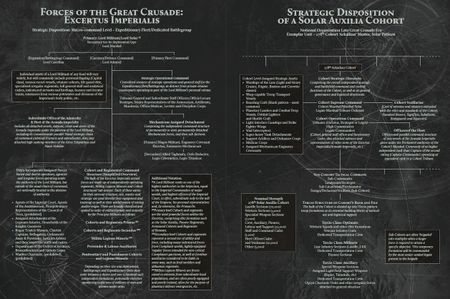

<!-- A0083-B0054 -->

原译文

Organization of the Solar Auxilia 太阳辅助军的组织

**校订译文**

Organization of the Solar Auxilia 太阳辅助军的组织

<!-- /A0083-B0054 -->

<!-- A0083-B0055 -->
**英文原文**

Each cohort had a unique number identifier, with the numbers 1-10 reserved for the Saturnyne Rams whose equipment and tactics laid the groundwork for the rest of the Solar Auxilia. It is believed that there were near 10,000 Solar Auxilia cohorts in existence during the Great Crusade, each with a unique number identifier. No number higher than the upper nine thousands was recorded prior to the Horus Heresy, and the numbering system broke down during the ensuing civil war. Certain cohorts were numbered in nonstandard ways, as in the case of the different numbering systems that the Dark Angels and Raven Guard used for their bonded Auxilia cohorts, as well as the World Eaters using the moniker Ulna to indicate a cohort. Some of the traitor legions, as well as the Space Wolves legion, did not identify their bonded cohorts with numbers, or purposefully obfuscated their origin.

<!-- /A0083-B0055 -->

<!-- A0083-B0056 -->

原译文

每个大队都有一个唯一的数字标识符，数字1-10保留给土星公羊，他们的装备和战术为其他太阳辅助军奠定了基础。据信，在大远征期间，有近10000个太阳辅助军大队存在，每个大队都有一个唯一的数字标识符。在荷鲁斯叛乱之前，没有记录到高于前九千的数字，在随后的内战中，数字系统崩溃了。某些大队以非标准的方式编号，例如黑暗天使和暗鸦守卫为其附属的辅助军大队使用的不同编号系统，以及吞世者使用尺骨绰号表示大队的情况。一些叛徒军团以及太空野狼军团没有用数字来标识他们的附属大队成员，或者故意混淆他们的来源。

**校订译文**

每个大队都有独立番号。一至十号保留给土星公羊，他们的装备与战术为其他太阳辅助军奠定了基础。据估计，大远征期间存在近一万个太阳辅助军大队。荷鲁斯之乱前，记录中的番号最高仍在九千多号范围；内战爆发后，编号体系便瓦解了。有些大队采用特殊编号，例如黑暗天使和暗鸦守卫为所属辅助军制定了各自体系，吞世者则用“尺骨”（Ulna）称呼大队。部分叛徒军团，以及太空野狼，不为所属大队标注数字番号，或刻意掩饰其来历。

<!-- /A0083-B0056 -->

<!-- A0083-B0057 -->
**英文原文**

On the tactical level, the building block of the Solar Cohort was a Tercio, itself made up of three sections whose nature was defined by their weaponry and battlefield role. The most commonly deployed Tercio formation consisted of three sections each comprising 20 armoured Lasrifle-equipped troops. Veteran Veletaris Tercios usually consisted of three squads of ten veteran troops equipped with more advanced short-range weaponry such as the Volkite Charger or Flamer. Fire Support Tercios commanded three batteries of crew-served weapons platforms, most commonly the Rapier.

<!-- /A0083-B0057 -->

<!-- A0083-B0058 -->

原译文

在战术层面上，太阳大队的组成部分是步兵团，它本身由三个部分组成，其性质由武器和战场角色决定。最常部署的步兵团编队由三个部分组成，每个部分由20名装备激光步枪的装甲部队组成。老兵迅捷步兵团通常由三个由十名老兵组成的小队组成，配备了更先进的短程武器，如爆燃突击铳或火焰枪。火力支援步兵团指挥着三队由班组操作的武器平台，最常见的是细剑。

**校订译文**

在战术层面，太阳大队的基本构成为战斗分队（Tercio）。每个分队下辖三个组，各组的装备与战场职责决定其类型。最常见的编制是三个各二十人的组，士兵身披甲胄、配备激光步枪。迅捷老兵战斗分队通常下辖三个十人小队，装备爆燃突击铳或火焰喷射器等更先进的短程武器。火力支援战斗分队则指挥三组由多人协同操作的武器平台，最常见的是细剑。

**校注：** Tercio 此处为三个 section 组成的战术单位，规模常为三十或六十人；原译“步兵团”会与约五千人的 Regiment 混淆，暂译“战斗分队”，保留英文。

<!-- /A0083-B0058 -->

<!-- A0083-B0059 -->
**英文原文**

On campaign, Solar Auxilia Cohorts were combined-arms formations based around heavy infantry. However they also made extensive use of armoured support and mobile artillery. Unlike those used by the wider Imperial Army, these were designed to withstand the vacuum of space and hostile environments and included radiological shielding as well as life support systems. These included the Mars-Solar Pattern Leman Russ Battle Tank. Cohorts also featured at least one fully equipped heavy armour sub-cohort which operated units such as the Malcador, Baneblade, Stormhammer, and Shadowsword. They were also renowned for their use of prefabricated defence works and fortified encampments. However more specialized siege formations such as static and heavy artillery were usually deployed outside of a cohort's regular order of battle and were more often than not left to other units of the Imperial Army.

<!-- /A0083-B0059 -->

<!-- A0083-B0060 -->

原译文

在战役中，太阳辅助军大队是以重步兵为基础的联合武装编队。然而，他们也广泛使用了装甲支援和机动火炮。与更广泛的帝国军队使用的不同，这些设计用于承受太空真空和敌对环境，包括放射屏障和生命支持系统。其中包括火星-太阳型黎曼鲁斯战斗坦克。大队中还至少有一个装备齐全的重装甲分大队，负责操作马卡多、毒刃、风暴锤和影剑等单位。他们还以使用预制防御工程和加固营地而闻名。然而，更专业的攻城编队，如静态和重型火炮，通常部署在大队的常规战斗序列之外，而且往往留给帝国军队的其他部队。

**校订译文**

太阳辅助军大队是以重步兵为核心的诸兵种合成部队，也广泛使用装甲支援与机动火炮。与普通帝国军的装备不同，其载具配有辐射屏蔽和生命维持系统，能在太空真空及恶劣环境下作战，火星—太阳型黎曼鲁斯战斗坦克便是其中之一。每个大队还至少编有一个装备齐全的重装甲分大队，使用马卡多、毒刃、风暴锤和影剑等战车。他们也以善用预制防御工事和加固营地著称。不过，固定炮兵与重炮部队等专门攻城力量通常不在大队的常设战斗序列中，多由帝国军其他部队提供。

<!-- /A0083-B0060 -->

<!-- A0083-B0061 -->
**英文原文**

The elite of the Solar Auxilia were the Veletaris Storm Sections. These warriors were second only to the Legiones Astartes in combat ability. The Solar Auxilia were also accompanied by Medicaes, who were tasked with treating combat injuries in the heat of battle. They were well-equipped and were trained to the Imperium's highest standards, which allowed the Medicaes to keep even grievously wounded Auxilia in the fight.

<!-- /A0083-B0061 -->

<!-- A0083-B0062 -->

原译文

太阳辅助军的精英是迅捷风暴队。这些战士的战斗力仅次于阿斯塔特军团士兵。太阳辅助军还由医疗兵陪同，他们的任务是在激战中治疗战斗损伤。他们装备精良，并接受了帝国最高标准的训练，这使得医疗兵能够在战斗中留住即使是重伤的辅助军。

**校订译文**

太阳辅助军中的精锐是迅捷风暴组，其战斗能力仅次于阿斯塔特军团。部队还配有医疗兵，负责在激战中救治伤员。他们装备精良，接受帝国最高标准的训练，能够使身负重伤的辅助军士兵仍继续战斗。

<!-- /A0083-B0062 -->

<!-- A0083-B0063 图片 -->
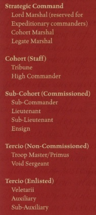

<!-- A0083-B0064 -->

原译文

Solar Auxilia Ranks 太阳辅助军等级

**校订译文**

Solar Auxilia Ranks 太阳辅助军职级

<!-- /A0083-B0064 -->

<!-- A0083-B0065 -->
### Known Ranks 已知职级

原题：Known Ranks 已知等级

<!-- /A0083-B0065 -->

<!-- A0083-B0066 -->
**英文原文**

Lord Solar/Lord Militant - Commander of the Solar Auxilia

<!-- /A0083-B0066 -->

<!-- A0083-B0067 -->

原译文

太阳领主/军务领主 - 太阳辅助军的指挥官

**校订译文**

太阳领主/军务领主 - 太阳辅助军的指挥官

<!-- /A0083-B0067 -->

<!-- A0083-B0068 -->
### Strategic Command 战略指挥部

<!-- /A0083-B0068 -->

<!-- A0083-B0069 -->

原译文

Lord Marshal 领主元帅

**校订译文**

Lord Marshal 领主元帅

<!-- /A0083-B0069 -->

<!-- A0083-B0070 -->

原译文

Cohort Marshal 大队元帅

**校订译文**

Cohort Marshal 大队元帅

<!-- /A0083-B0070 -->

<!-- A0083-B0071 -->

原译文

Legate Marshal 使节元帅

**校订译文**

Legate Marshal 使节元帅

<!-- /A0083-B0071 -->

<!-- A0083-B0072 -->
### Cohort 大队

<!-- /A0083-B0072 -->

<!-- A0083-B0073 -->

原译文

Tribune 保民官

**校订译文**

Tribune 保民官

<!-- /A0083-B0073 -->

<!-- A0083-B0074 -->
**英文原文**

Lord Castellan - Oversaw a Battlegroup

<!-- /A0083-B0074 -->

<!-- A0083-B0075 -->

原译文

领主堡主 - 监督战斗群

**校订译文**

领主堡主 - 监督战斗群

<!-- /A0083-B0075 -->

<!-- A0083-B0076 -->

原译文

Marshal 元帅

**校订译文**

Marshal 元帅

<!-- /A0083-B0076 -->

<!-- A0083-B0077 -->

原译文

Legate Commander 使节指挥官

**校订译文**

Legate Commander 使节指挥官

<!-- /A0083-B0077 -->

<!-- A0083-B0078 -->
### Sub-Cohort 分大队

<!-- /A0083-B0078 -->

<!-- A0083-B0079 -->

原译文

Sub-Commander 副指挥官

**校订译文**

Sub-Commander 副指挥官

<!-- /A0083-B0079 -->

<!-- A0083-B0080 -->

原译文

Captain 连长

**校订译文**

Captain 连长

<!-- /A0083-B0080 -->

<!-- A0083-B0081 -->

原译文

Lieutenant 副官

**校订译文**

Lieutenant 中尉

<!-- /A0083-B0081 -->

<!-- A0083-B0082 -->

原译文

Sub-Lieutenant 中尉

**校订译文**

Sub-Lieutenant 次级中尉

**校注：** 此处军衔体系同时列 Lieutenant、Sub-Lieutenant、Ensign。原译副官／中尉／少尉掩盖了上下级关系；暂用中尉／次级中尉／少尉，未强行套入某现实国家军衔。

<!-- /A0083-B0082 -->

<!-- A0083-B0083 -->

原译文

Ensign 少尉

**校订译文**

Ensign 少尉

<!-- /A0083-B0083 -->

<!-- A0083-B0084 -->

原译文

Declurion 德克琉里昂

**校订译文**

Declurion 德克琉里昂

<!-- /A0083-B0084 -->

<!-- A0083-B0085 -->
### Tercio 战斗分队

原题：Tercio 步兵团

<!-- /A0083-B0085 -->

<!-- A0083-B0086 -->

原译文

Troop Master/Primus 部队大师/首席

**校订译文**

Troop Master/Primus 部队长／首席

<!-- /A0083-B0086 -->

<!-- A0083-B0087 -->

原译文

Void Sergeant 虚空军士

**校订译文**

Void Sergeant 虚空军士

<!-- /A0083-B0087 -->

<!-- A0083-B0088 -->

原译文

Vexillarii 掌旗官

**校订译文**

Vexillarii 掌旗官

<!-- /A0083-B0088 -->

<!-- A0083-B0089 -->

原译文

Adjutant 辅助官

**校订译文**

Adjutant 副官

<!-- /A0083-B0089 -->

<!-- A0083-B0090 -->

原译文

Auxiliary 辅助军

**校订译文**

Auxiliary 辅助军士兵

<!-- /A0083-B0090 -->

<!-- A0083-B0091 -->

原译文

Sub-Auxiliary 次级辅助军

**校订译文**

Sub-Auxiliary 次级辅助军士兵

<!-- /A0083-B0091 -->

<!-- A0083-B0092 -->

原译文

Voidsman 虚空水兵

**校订译文**

Voidsman 虚空水兵

<!-- /A0083-B0092 -->

<!-- A0083-B0093 -->
### Troop Types 部队类别

<!-- /A0083-B0093 -->

<!-- A0083-B0094 -->

原译文

Command Section 指挥组

**校订译文**

Command Section 指挥组

<!-- /A0083-B0094 -->

<!-- A0083-B0095 图片 -->
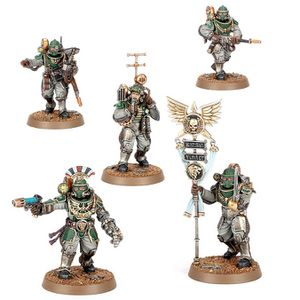

<!-- A0083-B0096 -->

原译文

Solar Auxilia Tactical Command Section 太阳辅助军战术指挥组

**校订译文**

Solar Auxilia Tactical Command Section 太阳辅助军战术指挥组

<!-- /A0083-B0096 -->

<!-- A0083-B0097 图片 -->
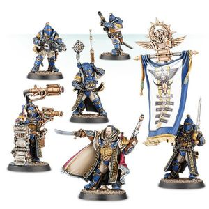

<!-- A0083-B0098 -->

原译文

Solar Auxilia Command Squad with Lord Marshal, Strategos, Proclaimator vox-caster, Vexilarius Standard Bearer, and 2 Veterans 太阳辅助军指挥组，包括领主元帅、战略指挥官、音阵发射员、掌旗官标准旗手和2名老兵

**校订译文**

Solar Auxilia Command Squad with Lord Marshal, Strategos, Proclaimator vox-caster, Vexilarius Standard Bearer, and 2 Veterans 太阳辅助军指挥小队：领主元帅、战略官、传令官音阵通信员、掌旗官，以及两名老兵

<!-- /A0083-B0098 -->

<!-- A0083-B0099 -->
**英文原文**

Proclaimator - Communications specialist

<!-- /A0083-B0099 -->

<!-- A0083-B0100 -->

原译文

传令官 - 通信专家

**校订译文**

传令官 - 通信专家

<!-- /A0083-B0100 -->

<!-- A0083-B0101 -->
**英文原文**

Vexilarius - Standard Bearer

<!-- /A0083-B0101 -->

<!-- A0083-B0102 -->

原译文

掌旗官 - 标准旗手

**校订译文**

掌旗官——旗手

<!-- /A0083-B0102 -->

<!-- A0083-B0103 -->

原译文

Medicae Section 医疗组

**校订译文**

Medicae Section 医疗组

<!-- /A0083-B0103 -->

<!-- A0083-B0104 图片 -->
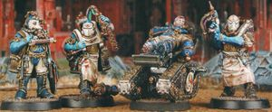

<!-- A0083-B0105 -->

原译文

Auxilia Medicae 医疗辅助军

**校订译文**

Auxilia Medicae 医疗辅助军

<!-- /A0083-B0105 -->

<!-- A0083-B0106 -->

原译文

Auxilia Companion Section 辅伴组

**校订译文**

Auxilia Companion Section 辅伴组

<!-- /A0083-B0106 -->

<!-- A0083-B0107 -->
**英文原文**

Veletaris Tercio - Including Command, Storm, and Vanguard Sections

<!-- /A0083-B0107 -->

<!-- A0083-B0108 -->

原译文

迅捷步兵团 - 包括指挥、风暴和先锋组

**校订译文**

迅捷战斗分队——包括指挥组、风暴组与先锋组

<!-- /A0083-B0108 -->

<!-- A0083-B0109 图片 -->
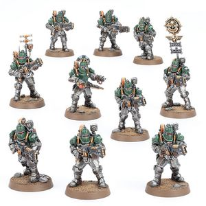

<!-- A0083-B0110 -->

原译文

Solar Auxilia Veletaris Storm Section 太阳辅助军迅捷风暴组

**校订译文**

Solar Auxilia Veletaris Storm Section 太阳辅助军迅捷风暴组

<!-- /A0083-B0110 -->

<!-- A0083-B0111 图片 -->
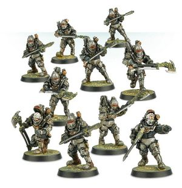

<!-- A0083-B0112 -->

原译文

Veletaris Troops 迅捷军

**校订译文**

Veletaris Troops 迅捷军

<!-- /A0083-B0112 -->

<!-- A0083-B0113 -->

原译文

Charonite Ogryn Section 重装欧格林组

**校订译文**

Charonite Ogryn Section 喀戎欧格林组

<!-- /A0083-B0113 -->

<!-- A0083-B0114 -->

原译文

Veteran Section 老兵组

**校订译文**

Veteran Section 老兵组

<!-- /A0083-B0114 -->

<!-- A0083-B0115 图片 -->
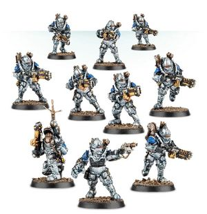

<!-- A0083-B0116 -->

原译文

Veterans with Volkite Chargers 老兵配备爆燃突击铳

**校订译文**

Veterans with Volkite Chargers 老兵配备爆燃突击铳

<!-- /A0083-B0116 -->

<!-- A0083-B0117 -->

原译文

Lasrifle Section 激光步枪组

**校订译文**

Lasrifle Section 激光步枪组

<!-- /A0083-B0117 -->

<!-- A0083-B0118 图片 -->
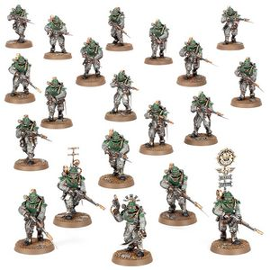

<!-- A0083-B0119 -->

原译文

Solar Auxilia Lasrifle Section 太阳辅助军激光步枪组

**校订译文**

Solar Auxilia Lasrifle Section 太阳辅助军激光步枪组

<!-- /A0083-B0119 -->

<!-- A0083-B0120 图片 -->
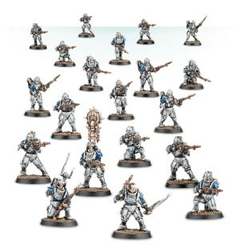

<!-- A0083-B0121 -->

原译文

Specialist Weapon Section 特殊武器组

**校订译文**

Specialist Weapon Section 特殊武器组

<!-- /A0083-B0121 -->

<!-- A0083-B0122 图片 -->
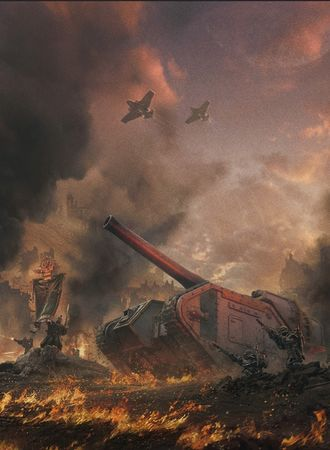

<!-- A0083-B0123 -->

原译文

Solar Auxilia forces 太阳辅助军部队

**校订译文**

Solar Auxilia forces 太阳辅助军部队

<!-- /A0083-B0123 -->

<!-- A0083-B0124 -->
## Equipment 装备

<!-- /A0083-B0124 -->

<!-- A0083-B0125 -->
**英文原文**

The most iconic piece of the Solar Auxilia was its Solar Pattern Void Armour, a carapace-reinforced full environmental combat body suit with fully integrated life support units. The most commonly issued weapon was the Kalibrav V-1 pattern Lasrifle, a higher-quality laser firearm superior to a standard Lasgun. Support weapons included Flamers, Volkite Weapons, Plasma Weapons, Rotor Cannons, and Meltaguns. The Solar Auxilia also had its own units of Ogryn Charonites for infantry support.

<!-- /A0083-B0125 -->

<!-- A0083-B0126 -->

原译文

太阳辅助军最具标志性的部分是它的太阳型虚空盔甲，这是一种带有完全集成生命支持单元的甲壳强化全环境战斗甲。最常见的武器是卡利布拉夫V-1型激光步枪，这是一种比标准激光枪质量更高的激光枪。支援武器包括火焰枪、爆燃武器、等离子武器、旋转炮和热熔枪。太阳辅助军也有自己的重装欧格林部队为步兵提供支援。

**校订译文**

太阳辅助军最具代表性的装备是太阳型虚空甲：一种用甲壳装甲加固、整合生命维持系统的全环境战斗服。最常配发的武器是卡利布拉夫 V-1 型激光步枪，其品质与性能均优于普通激光枪。支援武器包括火焰喷射器、爆燃武器、等离子武器、转管炮和热熔枪。太阳辅助军还编有自己的喀戎欧格林部队，为步兵提供支援。

<!-- /A0083-B0126 -->

<!-- A0083-B0127 -->
**英文原文**

The Solar Auxilia made use of a wide array of vehicles, nearly all of which were modified to be used in the vacuum of space and in hazardous environments. The most notable of these were the Dracosan Armoured Transport, Hermes Light Sentinel, Aethon Heavy Sentinel, and Aurox. The most common heavy support vehicles were the Mars-Solar Pattern Leman Russ, Malcador Heavy Battle Tank, Basilisk, Medusa, Valdor, and a variety of Super Heavy Tanks that included the Baneblade, Stormhammer, Stormblade, Stormsword, and Shadowsword. Rapiers were widely used field artillery pieces.

<!-- /A0083-B0127 -->

<!-- A0083-B0128 -->

原译文

太阳辅助军使用了各种各样的载具，几乎所有载具都经过改装，可用于太空真空和危险环境。其中最著名的是天龙装甲运输车、赫尔墨斯轻型哨兵、埃松重型哨兵和金牛。最常见的重型支援载具是火星-太阳型黎曼鲁斯、马卡多重型战斗坦克、石化蜥蜴、美杜莎、瓦尔多，以及各种超重型坦克，包括毒刃、风暴锤、风暴刃、风暴剑和影剑。细剑是广泛使用的野战火炮。

**校订译文**

太阳辅助军使用多种载具，几乎都经过改装，能够在太空真空与危险环境中运作。最有代表性的包括天龙座装甲运输车、赫尔墨斯轻型哨兵、埃松重型哨兵，以及野牛运输车。常见重型支援载具包括火星—太阳型黎曼鲁斯、马卡多重型战斗坦克、石化蜥蜴、美杜莎、瓦尔多，以及毒刃、风暴锤、风暴刃、风暴剑、影剑等超重型坦克。细剑武器平台也被广泛用于野战火力支援。

<!-- /A0083-B0128 -->

<!-- A0083-B0129 -->
**英文原文**

The Auxilia operated its own air units which included Thunderbolts, Lightings, Avengers, Marauders, and Arvus Lighters (most frequently used for airborne landing operations). For boarding operations in space, the Shark Assault Boat was most commonly employed.

<!-- /A0083-B0129 -->

<!-- A0083-B0130 -->

原译文

辅助军拥有自己的空中部队，其中包括雷霆、闪电、复仇者、掠夺者和阿维鲁斯驳船（最常用于空中着陆行动）。在太空跳帮行动中，鲨鱼攻击艇是最常用的。

**校订译文**

太阳辅助军拥有独立航空部队，使用雷霆、闪电、复仇者、掠夺者，以及阿维鲁斯驳船；后者最常用于空中登陆。太空跳帮任务则通常由鲨鱼突击艇执行。

<!-- /A0083-B0130 -->

<!-- A0083-B0131 -->
**英文原文**

The Solar Auxilia Cohorts used a wide array of standards, banners and icons, collectively known as Vexillas.

<!-- /A0083-B0131 -->

<!-- A0083-B0132 -->

原译文

太阳辅助军大队使用了各种各样的旗帜、横幅和图标，统称为军旗。

**校订译文**

太阳辅助军大队使用了各种各样的旗帜、横幅和图标，统称为军旗。

<!-- /A0083-B0132 -->

<!-- A0083-B0133 -->
### Livery and heraldry 制服和纹章

<!-- /A0083-B0133 -->

<!-- A0083-B0134 -->
**英文原文**

Solar Auxilia livery range from those inspired by the heraldry of the Legion to which a Legiones Auxilia is bonded, to the formulaic look of the more standardised First Line Auxilia. Solar Auxilia rarely use camouflage of any sort. This is because the role of the Solar Auxilia is to move rapidly from one warzone to the next, serving as front-line heavy assault troops who overwhelm their for before moving onto the next warzone, leaving Second Line units to prosecute follow-on missions such as consolidation, occupation, counter-insurgency or static defence. In the First Line role for which they are intended, the Solar Auxilia wouldn't ordinarily have the time, let alone the need, to camouflage themselves or their vehicles.

<!-- /A0083-B0134 -->

<!-- A0083-B0135 -->

原译文

太阳辅助军的制服范围从受军团徽章启发的军团辅助军制服到更标准化的一线辅助军制服的公式化外观。太阳辅助军很少使用任何形式的伪装。这是因为太阳辅助军的作用是从一个战区快速移动到下一个战区，充当前线重型突击部队，在进入下一个战场之前压倒他们，留下二线部队执行后续任务，如巩固、占领、反叛乱或静态防御。在他们打算扮演的一线角色中，太阳辅助军通常没有时间，更不用说需要伪装自己或他们的载具了。

**校订译文**

太阳辅助军的制服与涂装各异：军团辅助军会借鉴其所属阿斯塔特军团的纹章，其他一线辅助军则多采用较统一的制式外观。他们极少使用迷彩，因为其职责是作为前线重型突击部队迅速转战各地，击溃敌人后便赶赴下一战区，将巩固控制、驻军占领、反叛乱和固定防御等后续事务留给二线部队。执行这种一线任务时，太阳辅助军通常既没有时间，也没有必要为人员和载具施加伪装。

<!-- /A0083-B0135 -->

<!-- A0083-B0136 图片 -->
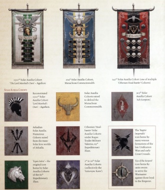

<!-- A0083-B0137 -->

原译文

Solar Auxilia Heraldry 太阳辅助军纹章

**校订译文**

Solar Auxilia Heraldry 太阳辅助军纹章

<!-- /A0083-B0137 -->

<!-- A0083-B0138 -->
## Notable Cohorts 著名大队

<!-- /A0083-B0138 -->

<!-- A0083-B0139 -->
**英文原文**

1st through 10th Cohorts, collectively named the Saturnyne Rams

<!-- /A0083-B0139 -->

<!-- A0083-B0140 -->

原译文

第1至第10大队，统称为土星公羊

**校订译文**

第1至第10大队，统称为土星公羊

<!-- /A0083-B0140 -->

<!-- A0083-B0141 -->
**英文原文**

19th Cohort - Crimson Nova, one of the cohorts designated as Jovian Grenadiers, from Jupiter

<!-- /A0083-B0141 -->

<!-- A0083-B0142 -->

原译文

第19大队 - 来自木星的深红新星，被指定为木星掷弹兵的大队之一

**校订译文**

第19大队 - 来自木星的深红新星，被指定为木星掷弹兵的大队之一

<!-- /A0083-B0142 -->

<!-- A0083-B0143 -->
**英文原文**

26th Cohort - An Archite Palatines cohort.

<!-- /A0083-B0143 -->

<!-- A0083-B0144 -->

原译文

第26大队 — 亚基特王庭军大队。

**校订译文**

第26大队 — 亚基特王庭军大队。

<!-- /A0083-B0144 -->

<!-- A0083-B0145 -->
**英文原文**

66th Cohort - Phoenician's Chosen - Associated with the Emperor's Children

<!-- /A0083-B0145 -->

<!-- A0083-B0146 -->

原译文

第66大队 - 紫庭凤凰亲选 - 与帝皇之子有关

**校订译文**

第66大队 - 紫庭凤凰亲选 - 与帝皇之子有关

<!-- /A0083-B0146 -->

<!-- A0083-B0147 -->
**英文原文**

71st Cohort - Formerly known as the Cinder Born, this cohort was reconstituted during the Battle of Tallarn as the 71st Tallarn Reborn.

<!-- /A0083-B0147 -->

<!-- A0083-B0148 -->

原译文

第71大队 - 以前称为灰烬之裔，这个大队在塔兰之战期间重组为第71塔兰重生。

**校订译文**

第71大队 - 以前称为灰烬之裔，这个大队在塔兰之战期间重组为第71塔兰重生。

<!-- /A0083-B0148 -->

<!-- A0083-B0149 -->
**英文原文**

87th Cohort - Star Reavers

<!-- /A0083-B0149 -->

<!-- A0083-B0150 -->

原译文

第87大队 - 掠星者

**校订译文**

第87大队 - 掠星者

<!-- /A0083-B0150 -->

<!-- A0083-B0151 -->
**英文原文**

98th Cohort - An Inwit Phalangites cohort.

<!-- /A0083-B0151 -->

<!-- A0083-B0152 -->

原译文

第98大队 - 一个因维特方阵军大队。

**校订译文**

第98大队 - 一个因维特方阵军大队。

<!-- /A0083-B0152 -->

<!-- A0083-B0153 -->
**英文原文**

102nd Cohort - An Inwit Phalangites cohort.

<!-- /A0083-B0153 -->

<!-- A0083-B0154 -->

原译文

第102大队 - 一个因维特方阵军大队。

**校订译文**

第102大队 - 一个因维特方阵军大队。

<!-- /A0083-B0154 -->

<!-- A0083-B0155 -->
**英文原文**

131st Cohort - A Cthonian Headhunters cohort known as "The Mountain Breakers."

<!-- /A0083-B0155 -->

<!-- A0083-B0156 -->

原译文

第131大队 - 一个被称为“破山者”的科索尼亚猎头者大队

**校订译文**

第131大队 - 一个被称为“破山者”的科索尼亚猎头者大队

<!-- /A0083-B0156 -->

<!-- A0083-B0157 -->
**英文原文**

141st Cohort - A Cthonian Headhunters cohort.

<!-- /A0083-B0157 -->

<!-- A0083-B0158 -->

原译文

第141大队 - 一个科索尼亚猎头者大队。

**校订译文**

第141大队 - 一个科索尼亚猎头者大队。

<!-- /A0083-B0158 -->

<!-- A0083-B0159 -->
**英文原文**

142nd Cohort - A Cthonian Headhunters cohort.

<!-- /A0083-B0159 -->

<!-- A0083-B0160 -->

原译文

第142大队 - 一个科索尼亚猎头者大队。

**校订译文**

第142大队 - 一个科索尼亚猎头者大队。

<!-- /A0083-B0160 -->

<!-- A0083-B0161 -->
**英文原文**

204th Cohort - A Manachean Bulls cohort. This Cohort took part in the Bardall Prosecution.

<!-- /A0083-B0161 -->

<!-- A0083-B0162 -->

原译文

第204大队 - 一个马纳切公牛大队。这个大队参加了巴德尔检举。

**校订译文**

第204大队——马纳切公牛部队之一，参加了巴德尔征讨。

<!-- /A0083-B0162 -->

<!-- A0083-B0163 -->
**英文原文**

222nd Cohort - Calth High Guard - one of seven High Guard cohorts raised from Calth at the time of the Battle of Calth. Part of the Ultramar High Guard.

<!-- /A0083-B0163 -->

<!-- A0083-B0164 -->

原译文

第222大队 - 考斯至高卫队 - 考斯之战时从考斯建立的七个至高卫队大队之一。奥特拉玛至高卫队的一部分。

**校订译文**

第222大队 - 考斯至高卫队 - 考斯之战时从考斯建立的七个至高卫队大队之一。奥特拉玛至高卫队的一部分。

<!-- /A0083-B0164 -->

<!-- A0083-B0165 -->
**英文原文**

225th Cohort - Calth Wardens

<!-- /A0083-B0165 -->

<!-- A0083-B0166 -->

原译文

第225大队 - 考斯看守者

**校订译文**

第225大队 - 考斯看守者

<!-- /A0083-B0166 -->

<!-- A0083-B0167 -->
**英文原文**

255th Cohort - Calth High Guard - one of the High Guard cohorts raised from Calth at the time of the Battle of Calth. Part of the Ultramar High Guard.

<!-- /A0083-B0167 -->

<!-- A0083-B0168 -->

原译文

第255大队 - 考斯至高卫队 - 考斯之战时从考斯建立的七个至高卫队大队之一。奥特拉玛至高卫队的一部分。

**校订译文**

第255大队——考斯至高卫队，考斯之战时在考斯组建的至高卫队大队之一，隶属奥特拉玛至高卫队。

<!-- /A0083-B0168 -->

<!-- A0083-B0169 -->
**英文原文**

278th Cohort - An Arkadian Janissary cohort.

<!-- /A0083-B0169 -->

<!-- A0083-B0170 -->

原译文

第278大队 - 一个阿卡迪亚禁卫军大队

**校订译文**

第278大队 - 一个阿卡迪亚禁卫军大队

<!-- /A0083-B0170 -->

<!-- A0083-B0171 -->
**英文原文**

346th Cohort - Bleak Marchers. Associated with the Death Guard legion.

<!-- /A0083-B0171 -->

<!-- A0083-B0172 -->

原译文

第346大队 - 暗淡游行者。与死亡守卫军团有关联。

**校订译文**

第346大队 - 黯淡行军者。与死亡守卫军团有关联。

<!-- /A0083-B0172 -->

<!-- A0083-B0173 -->
**英文原文**

405th Cohort - Lepsinite Score. Associated with the Alpha Legion.

<!-- /A0083-B0173 -->

<!-- A0083-B0174 -->

原译文

第405大队 - 莱普西尼特刻痕。与阿尔法军团有关。

**校订译文**

第405大队 - 莱普西尼特刻痕。与阿尔法军团有关。

<!-- /A0083-B0174 -->

<!-- A0083-B0175 -->
**英文原文**

477th Cohort - Atlantian Sciritae

<!-- /A0083-B0175 -->

<!-- A0083-B0176 -->

原译文

第477大队 - 亚特兰提亚轻步兵

**校订译文**

第477大队 - 亚特兰提亚轻步兵

<!-- /A0083-B0176 -->

<!-- A0083-B0177 -->
**英文原文**

484th Cohort - A Proximan Sacramentii cohort.

<!-- /A0083-B0177 -->

<!-- A0083-B0178 -->

原译文

第484大队 - 一个普罗西玛圣礼军大队

**校订译文**

第484大队 - 一个普罗西玛圣礼军大队

<!-- /A0083-B0178 -->

<!-- A0083-B0179 -->
**英文原文**

532nd Cohort - A Selucid Thorakites cohort.

<!-- /A0083-B0179 -->

<!-- A0083-B0180 -->

原译文

第532大队 - 一个塞琉古胸甲军大队

**校订译文**

第532大队 - 一个塞琉古胸甲军大队

<!-- /A0083-B0180 -->

<!-- A0083-B0181 -->
**英文原文**

542nd Cohort - Boremanite Devils. Took part in the Battle of Beta-Garmon.

<!-- /A0083-B0181 -->

<!-- A0083-B0182 -->

原译文

第542大队 - 博尔曼尼特魔鬼，参加了贝塔·伽蒙之战。

**校订译文**

第542大队 - 博尔曼尼特魔鬼，参加了贝塔·伽蒙之战。

<!-- /A0083-B0182 -->

<!-- A0083-B0183 -->
**英文原文**

589th Cohort - A Theta-Garmon Deathless cohort.

<!-- /A0083-B0183 -->

<!-- A0083-B0184 -->

原译文

第589大队 - 一个西塔-伽蒙不死军大队

**校订译文**

第589大队 - 一个西塔-伽蒙不死军大队

<!-- /A0083-B0184 -->

<!-- A0083-B0185 -->
**英文原文**

590th Cohort - A Saiphan Elevatii cohort.

<!-- /A0083-B0185 -->

<!-- A0083-B0186 -->

原译文

第590大队 - 一个赛潘晋升者大队

**校订译文**

第590大队 - 一个赛潘晋升者大队

<!-- /A0083-B0186 -->

<!-- A0083-B0187 -->
**英文原文**

712th Cohort - A Barbaran Ambaxtoi cohort.

<!-- /A0083-B0187 -->

<!-- A0083-B0188 -->

原译文

第712大队 - 一个巴巴鲁斯侍从卫队大队

**校订译文**

第712大队 - 一个巴巴鲁斯侍从卫队大队

<!-- /A0083-B0188 -->

<!-- A0083-B0189 -->
**英文原文**

829th Cohort - A Chogorian Limitanei cohort.

<!-- /A0083-B0189 -->

<!-- A0083-B0190 -->

原译文

第829大队 - 一个巧高里斯边防军大队

**校订译文**

第829大队 - 一个乔高里斯边防军大队

<!-- /A0083-B0190 -->

<!-- A0083-B0191 -->
**英文原文**

905th Cohort - Ash Scorpions

<!-- /A0083-B0191 -->

<!-- A0083-B0192 -->

原译文

第905大队 - 灰烬之蝎

**校订译文**

第905大队 - 灰烬之蝎

<!-- /A0083-B0192 -->

<!-- A0083-B0193 -->
**英文原文**

945th Cohort - A Prosperine Spireguard cohort.

<!-- /A0083-B0193 -->

<!-- A0083-B0194 -->

原译文

第945大队 - 一个普罗斯佩罗尖塔守卫大队

**校订译文**

第945大队 - 一个普罗斯佩罗尖塔守卫大队

<!-- /A0083-B0194 -->

<!-- A0083-B0195 -->
**英文原文**

983rd Cohort - Sthenean Chainshroud - A Medusan Chainshroud cohort.

<!-- /A0083-B0195 -->

<!-- A0083-B0196 -->

原译文

第983大队 - 坚固覆链者 - 一个美杜莎覆链者大队

**校订译文**

第983大队 - 坚固覆链者 - 一个美杜莎覆链者大队

<!-- /A0083-B0196 -->

<!-- A0083-B0197 -->
**英文原文**

1128th Cohort - Necromundan Coursers

<!-- /A0083-B0197 -->

<!-- A0083-B0198 -->

原译文

第1128大队 - 涅克罗蒙达轻骑兵

**校订译文**

第1128大队 - 涅克罗蒙达轻骑兵

<!-- /A0083-B0198 -->

<!-- A0083-B0199 -->
**英文原文**

1349th Cohort (Magnathan Thunder Lords) - Mechanized Infantry Specialists, defeated the Night Lords on Aramek IV.

<!-- /A0083-B0199 -->

<!-- A0083-B0200 -->

原译文

第1349大队（玛格纳森雷霆领主）- 机械化步兵专家，在阿拉梅克四号上击败了午夜领主。

**校订译文**

第1349大队（玛格纳森雷霆领主）- 机械化步兵专家，在阿拉梅克四号上击败了午夜领主。

<!-- /A0083-B0200 -->

<!-- A0083-B0201 -->
**英文原文**

1522nd Cohort (The Lord Marshal's Own) from Agathon and other worlds: Othion, Legatus, Zarnov and Subinus

<!-- /A0083-B0201 -->

<!-- A0083-B0202 -->

原译文

第1522大队（领主元帅之属）来自阿加顿和其他世界：奥西恩、莱加图斯、扎诺夫和苏比努斯

**校订译文**

第1522大队（领主元帅之属）来自阿加顿和其他世界：奥西恩、莱加图斯、扎诺夫和苏比努斯

<!-- /A0083-B0202 -->

<!-- A0083-B0203 -->
**英文原文**

4621st Cohort - An Arkadian Janissary cohort.

<!-- /A0083-B0203 -->

<!-- A0083-B0204 -->

原译文

第4621大队 - 一个阿卡迪亚禁卫军大队

**校订译文**

第4621大队 - 一个阿卡迪亚禁卫军大队

<!-- /A0083-B0204 -->

<!-- A0083-B0205 -->
**英文原文**

6629th Cohort - A Manachean Bulls cohort that fought in the Fall of Manachea.

<!-- /A0083-B0205 -->

<!-- A0083-B0206 -->

原译文

第6629大队 - 马纳切亚陷落时参加战斗的一个马纳切公牛大队。

**校订译文**

第6629大队 - 马纳切亚陷落时参加战斗的一个马纳切公牛大队。

<!-- /A0083-B0206 -->

<!-- A0083-B0207 -->
**英文原文**

6633rd Cohort - Manachean Bulls cohort deployed to Manachea during the Battle of Hive Ilium.

<!-- /A0083-B0207 -->

<!-- A0083-B0208 -->

原译文

第6633大队 - 马纳切公牛大队在伊利姆巢都之战中被部署到马纳奇亚。

**校订译文**

第6633大队——马纳切公牛部队之一，伊利姆巢都之战期间被派往马纳切亚。

<!-- /A0083-B0208 -->

<!-- A0083-B0209 图片 -->
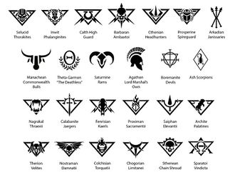

<!-- A0083-B0210 -->

原译文

Solar Auxilia Cohorts icons 太阳辅助军大队图标

**校订译文**

Solar Auxilia Cohorts icons 太阳辅助军大队图标

<!-- /A0083-B0210 -->

<!-- A0083-B0211 -->
### Cohorts of Nonstandard Designation 非标准命名大队

<!-- /A0083-B0211 -->

<!-- A0083-B0212 -->
**英文原文**

4/310th Cohort - A Calibanite Jaegers cohort.

<!-- /A0083-B0212 -->

<!-- A0083-B0213 -->

原译文

第4/310大队 - 一个卡利班猎兵大队

**校订译文**

第4/310大队 - 一个卡利班猎兵大队

<!-- /A0083-B0213 -->

<!-- A0083-B0214 -->
**英文原文**

7/630th Cohort - A Therion Velites cohort.

<!-- /A0083-B0214 -->

<!-- A0083-B0215 -->

原译文

第7/630大队 - 一个圣兽轻步兵大队

**校订译文**

第7/630大队 - 一个圣兽轻步兵大队

<!-- /A0083-B0215 -->

<!-- A0083-B0216 -->
**英文原文**

Ulna Cohort - A Nagrakal Thraexii cohort.

<!-- /A0083-B0216 -->

<!-- A0083-B0217 -->

原译文

尺骨大队 - 一个纳格拉卡技斗士

**校订译文**

尺骨大队——纳格拉卡技斗士大队之一

<!-- /A0083-B0217 -->

<!-- A0083-B0218 -->
### Cohorts of Unknown Designation 命名未知的大队

<!-- /A0083-B0218 -->

<!-- A0083-B0219 -->
**英文原文**

Carak'tal Scarborn - only non-Astartes force to survive the Khrave onslaught at Perdition's Gate

<!-- /A0083-B0219 -->

<!-- A0083-B0220 -->

原译文

卡拉克'塔尔疤裔 - 唯一一支在堕狱之门的赫拉夫猛攻中幸存下来的非阿斯塔特部队

**校订译文**

卡拉克'塔尔疤裔 - 唯一一支在堕狱之门的赫拉夫猛攻中幸存下来的非阿斯塔特部队

<!-- /A0083-B0220 -->

<!-- A0083-B0221 -->

原译文

Chalchidean Grenadiers 卡尔基迪安掷弹兵

**校订译文**

Chalchidean Grenadiers 卡尔基迪安掷弹兵

<!-- /A0083-B0221 -->

<!-- A0083-B0222 -->
**英文原文**

Cthonian Jackals - From Cthonia, associated with the Sons of Horus and garrisoned at Port Maw

<!-- /A0083-B0222 -->

<!-- A0083-B0223 -->

原译文

科索尼亚豺狼 - 来自科索尼亚，与荷鲁斯之子有联系，驻扎在巨口港

**校订译文**

科索尼亚豺狼 - 来自科索尼亚，与荷鲁斯之子有联系，驻扎在巨口港

<!-- /A0083-B0223 -->

<!-- A0083-B0224 -->
**英文原文**

Highborn Wardens - from Ultramar.

<!-- /A0083-B0224 -->

<!-- A0083-B0225 -->

原译文

至高裔监护者 - 来自奥特拉玛

**校订译文**

至高裔监护者 - 来自奥特拉玛

<!-- /A0083-B0225 -->

<!-- A0083-B0226 -->
### Legiones Auxilia 军团辅助军

<!-- /A0083-B0226 -->

<!-- A0083-B0227 -->
**英文原文**

The Legiones Auxilia were a class of formation within the ranks of the Solar Auxilia which were bestowed with the singular honour of serving directly alongside the Legiones Astartes and were integrated into their order of battle. The so-called ‘Legiones Auxilia’ were even afforded the right – through pedigree or deed – to bear livery derived in part from their associated Legion. Some such cohorts were raised from the Legion’s own home systems or subsidiary domains, such as the Cthonian Headhunters or the Barbaran Ambaxtoi, while others earned their position through historical association and achievement, such as the Arkadian Janissaries, who fight alongside the IIIrd Legion.

<!-- /A0083-B0227 -->

<!-- A0083-B0228 -->

原译文

军团辅助军是太阳辅助军中的一个编队，被授予直接与阿斯塔特军团并肩作战的独特荣誉，并被纳入他们的战斗序列。所谓的“军团辅助军”甚至有权通过血统或契约获得部分来自其相关军团的制服。一些这样的大队是从军团自己的家园星系或附属领地培养出来的，如科索尼亚猎头者或巴巴鲁斯侍从卫队，而另一些则是通过历史联系和成就获得地位的，如与第三军团并肩作战的阿卡迪亚禁卫军。

**校订译文**

军团辅助军是太阳辅助军中的一类部队，获享直接与阿斯塔特军团并肩作战的殊荣，并纳入相应军团的战斗序列。他们凭借出身或战功，甚至获准采用部分源自所属军团的制服与纹章。一些大队来自军团母星系或附属领地，如科索尼亚猎头者与巴巴鲁斯侍从卫队；另一些则凭借长期合作关系和功绩取得这种地位，例如与第三军团并肩作战的阿卡迪亚禁卫军。

**校注：** deed 此处与 pedigree 并列，指功绩，不是法律契约。

<!-- /A0083-B0228 -->

<!-- A0083-B0229 -->
**英文原文**

Later in the galactic civil war it would become common for the Legions to assume direct control over one or more allied Auxilia units, subordinating them wholesale into Legion chains of command.

<!-- /A0083-B0229 -->

<!-- A0083-B0230 -->

原译文

在银河系内战的后期，军团直接控制一个或多个盟友辅助军单位，并将其全部归入军团指挥链，这将变得很常见。

**校订译文**

银河内战后期，军团直接接管一支或多支盟军辅助部队，将其整体纳入自身指挥体系，已变得十分常见。

<!-- /A0083-B0230 -->

<!-- A0083-B0231 -->
### Known Legiones Auxilia 已知军团辅助军

<!-- /A0083-B0231 -->

<!-- A0083-B0232 -->
**英文原文**

Calibanite Jaegers - from Caliban

<!-- /A0083-B0232 -->

<!-- A0083-B0233 -->

原译文

卡利班猎兵 - 来自卡利班

**校订译文**

卡利班猎兵 - 来自卡利班

<!-- /A0083-B0233 -->

<!-- A0083-B0234 -->
**英文原文**

Chogorian Limitanei - Associated with the White Scars

<!-- /A0083-B0234 -->

<!-- A0083-B0235 -->

原译文

巧高里斯边防军 - 与白色疤痕有关

**校订译文**

乔高里斯边防军 - 与白疤有关

<!-- /A0083-B0235 -->

<!-- A0083-B0236 -->
**英文原文**

Fenrisian Kaerls - from Fenris

<!-- /A0083-B0236 -->

<!-- A0083-B0237 -->

原译文

芬里斯近卫军 - 来自芬里斯

**校订译文**

芬里斯近卫军 - 来自芬里斯

<!-- /A0083-B0237 -->

<!-- A0083-B0238 -->
**英文原文**

Medusan Chain Shroud - associated with the Iron Hands

<!-- /A0083-B0238 -->

<!-- A0083-B0239 -->

原译文

美杜莎覆链者 - 与钢铁之手有关

**校订译文**

美杜莎覆链者 - 与钢铁之手有关

<!-- /A0083-B0239 -->

<!-- A0083-B0240 -->
**英文原文**

Proximan Sacramentii - Associated with the Salamanders

<!-- /A0083-B0240 -->

<!-- A0083-B0241 -->

原译文

普罗西玛圣礼军 - 与火蜥蜴有关

**校订译文**

普罗西玛圣礼军 - 与火蜥蜴有关

<!-- /A0083-B0241 -->

<!-- A0083-B0242 -->
**英文原文**

Saiphan Elevatii - Associated with the Blood Angels

<!-- /A0083-B0242 -->

<!-- A0083-B0243 -->

原译文

赛潘晋升者 - 与圣血天使有关

**校订译文**

赛潘晋升者 - 与圣血天使有关

<!-- /A0083-B0243 -->

<!-- A0083-B0244 -->
**英文原文**

Sthenean Chainshroud - Associated with the Iron Hands

<!-- /A0083-B0244 -->

<!-- A0083-B0245 -->

原译文

坚固覆链者 - 与钢铁之手有关

**校订译文**

坚固覆链者 - 与钢铁之手有关

<!-- /A0083-B0245 -->

<!-- A0083-B0246 -->
**英文原文**

Therion Velites - Associated with the Raven Guard

<!-- /A0083-B0246 -->

<!-- A0083-B0247 -->

原译文

圣兽轻步兵 - 与暗鸦守卫有关

**校订译文**

圣兽轻步兵 - 与暗鸦守卫有关

<!-- /A0083-B0247 -->

<!-- A0083-B0248 -->
**英文原文**

Ultramar High Guard - Associated with the Ultramarines

<!-- /A0083-B0248 -->

<!-- A0083-B0249 -->

原译文

奥特拉玛至高守卫 - 与极限战士有关

**校订译文**

奥特拉玛至高卫队 - 与极限战士有关

<!-- /A0083-B0249 -->

<!-- A0083-B0250 -->
**英文原文**

Archite Palatines - Associated with the Emperor's Children

<!-- /A0083-B0250 -->

<!-- A0083-B0251 -->

原译文

亚基特王庭军 - 与帝皇之子有关

**校订译文**

亚基特王庭军 - 与帝皇之子有关

<!-- /A0083-B0251 -->

<!-- A0083-B0252 -->
**英文原文**

Arkadian Janissaries - Associated with the Emperor's Children

<!-- /A0083-B0252 -->

<!-- A0083-B0253 -->

原译文

阿卡迪亚禁卫军 - 与帝皇之子有关

**校订译文**

阿卡迪亚禁卫军 - 与帝皇之子有关

<!-- /A0083-B0253 -->

<!-- A0083-B0254 -->
**英文原文**

Barbaran Ambaxtoi - From Barbarus, associated with the Death Guard

<!-- /A0083-B0254 -->

<!-- A0083-B0255 -->

原译文

巴巴鲁斯侍从卫队 - 来自巴巴鲁斯，与死亡守卫有关

**校订译文**

巴巴鲁斯侍从卫队 - 来自巴巴鲁斯，与死亡守卫有关

<!-- /A0083-B0255 -->

<!-- A0083-B0256 -->
**英文原文**

Bleak Marchers - Associated with the Death Guard.

<!-- /A0083-B0256 -->

<!-- A0083-B0257 -->

原译文

暗淡游行者 - 与死亡守卫有关

**校订译文**

黯淡行军者 - 与死亡守卫有关

<!-- /A0083-B0257 -->

<!-- A0083-B0258 -->
**英文原文**

Colchisian Torquatii - Associated with the Word Bearers

<!-- /A0083-B0258 -->

<!-- A0083-B0259 -->

原译文

科尔基斯戴环者 - 与怀言者有关

**校订译文**

科尔基斯戴环者 - 与怀言者有关

<!-- /A0083-B0259 -->

<!-- A0083-B0260 -->
**英文原文**

Cthonian Headhunters - From Cthonia, associated with the Sons of Horus

<!-- /A0083-B0260 -->

<!-- A0083-B0261 -->

原译文

科索尼亚猎头者 - 来自科索尼亚，与荷鲁斯之子有关

**校订译文**

科索尼亚猎头者 - 来自科索尼亚，与荷鲁斯之子有关

<!-- /A0083-B0261 -->

<!-- A0083-B0262 -->
**英文原文**

Cthonian Jackals - From Cthonia, associated with the Sons of Horus and garrisoned at Port Maw

<!-- /A0083-B0262 -->

<!-- A0083-B0263 -->

原译文

科索尼亚豺狼 - 来自科索尼亚，与荷鲁斯之子有联系，驻扎在巨口港

**校订译文**

科索尼亚豺狼 - 来自科索尼亚，与荷鲁斯之子有联系，驻扎在巨口港

<!-- /A0083-B0263 -->

<!-- A0083-B0264 -->
**英文原文**

Nagrakal Thraexii - Associated with the World Eaters

<!-- /A0083-B0264 -->

<!-- A0083-B0265 -->

原译文

纳格拉卡技斗士 - 与吞世者有关

**校订译文**

纳格拉卡技斗士 - 与吞世者有关

<!-- /A0083-B0265 -->

<!-- A0083-B0266 -->
**英文原文**

Nostraman Damnatii - Associated with the Night Lords

<!-- /A0083-B0266 -->

<!-- A0083-B0267 -->

原译文

诺斯特拉莫定罪者 - 与午夜领主有关

**校订译文**

诺斯特拉莫定罪者 - 与午夜领主有关

<!-- /A0083-B0267 -->

<!-- A0083-B0268 -->
**英文原文**

Phoenician's Chosen - Associated with the Emperor's Children

<!-- /A0083-B0268 -->

<!-- A0083-B0269 -->

原译文

紫庭凤凰亲选 - 与帝皇之子有关

**校订译文**

紫庭凤凰亲选 - 与帝皇之子有关

<!-- /A0083-B0269 -->

<!-- A0083-B0270 -->
**英文原文**

Prospero Spireguard - Associated with the Thousand Sons

<!-- /A0083-B0270 -->

<!-- A0083-B0271 -->

原译文

普罗斯佩罗尖塔守卫 - 与千子有关

**校订译文**

普罗斯佩罗尖塔守卫 - 与千子有关

<!-- /A0083-B0271 -->

<!-- A0083-B0272 -->
**英文原文**

Lepsinite Score - Associated with the Alpha Legion

<!-- /A0083-B0272 -->

<!-- A0083-B0273 -->

原译文

莱普西尼特刻痕 - 与阿尔法军团有关

**校订译文**

莱普西尼特刻痕 - 与阿尔法军团有关

<!-- /A0083-B0273 -->

<!-- A0083-B0274 -->
**英文原文**

Securran Janissaries - Joined with the Alpha Legion

<!-- /A0083-B0274 -->

<!-- A0083-B0275 -->

原译文

塞库兰近卫军 - 加入阿尔法军团

**校订译文**

塞库兰近卫军 - 加入阿尔法军团

<!-- /A0083-B0275 -->

<!-- A0083-B0276 -->
**英文原文**

Selucid Thorakite - From Olympia, associated with the Iron Warriors

<!-- /A0083-B0276 -->

<!-- A0083-B0277 -->

原译文

塞琉古胸甲军 - 来自奥林匹亚

**校订译文**

塞琉古胸甲军——来自奥林匹亚，与钢铁勇士有关。

<!-- /A0083-B0277 -->

<!-- A0083-B0278 -->
**英文原文**

Sparatoi Vindicta - Associated with the Alpha Legion

<!-- /A0083-B0278 -->

<!-- A0083-B0279 -->

原译文

长矛复仇军 - 与阿尔法军团有关

**校订译文**

长矛复仇军 - 与阿尔法军团有关

<!-- /A0083-B0279 -->

<!-- A0083-B0280 -->
**英文原文**

Petran Voltiguers - Associated with the Sons of Horus legion.

<!-- /A0083-B0280 -->

<!-- A0083-B0281 -->

原译文

佩特兰散兵 - 与荷鲁斯之子军团有关

**校订译文**

佩特兰散兵 - 与荷鲁斯之子军团有关

<!-- /A0083-B0281 -->

<!-- A0083-B0282 -->
## Notable Members 著名成员

<!-- /A0083-B0282 -->

<!-- A0083-B0283 -->

原译文

Lord Marshal Ireton MaSade 领主元帅艾尔顿·马萨德

**校订译文**

Lord Marshal Ireton MaSade 领主元帅艾尔顿·马萨德

<!-- /A0083-B0283 -->

<!-- A0083-B0284 -->

原译文

Veteran Vaskale Solar 老兵瓦斯卡莱·索拉尔

**校订译文**

Veteran Vaskale Solar 老兵瓦斯卡莱·索拉尔

<!-- /A0083-B0284 -->

<!-- A0083-B0285 -->

原译文

Surgeon-Primus Aevos Jovan 首席外科医生埃沃斯·约万

**校订译文**

Surgeon-Primus Aevos Jovan 首席外科医生埃沃斯·约万

**校注：** 本篇 Aevos Jovan 与82篇 Aevos Jovian 拼写不同；可能为同一人物的底稿变体，待原始来源核实，暂各保留英文与相应现稿音译。

<!-- /A0083-B0285 -->

本篇核心术语与暂定项

以下列出本篇出现的英文原形及核心术语表用词。同形词可能指不同对象，具体词义以本篇正文和校注为准；单复数、别名和仅见于图注的名称可能尚未列入。完整候选见[术语表](../../术语表/双语术语候选.csv)。

| 英文 | 采用中文 | 状态 |
| --- | --- | --- |
| Blood Angels | 圣血天使 | 官方已核对 |
| Dark Angels | 黑暗天使 | 官方已核对 |
| Space Wolves | 太空野狼 | 官方已核对 |
| Imperial Army | 帝国军 | 暂定·官方待核 |
| Death Guard | 死亡守卫 | 官方已核对 |
| Thousand Sons | 千子 | 官方已核对 |
| World Eaters | 吞世者 | 官方已核对 |
| Ogryn | 欧格林 | 官方已核对 |
| Ultramar | 奥特拉玛 | 官方已核对 |
| Ultramarines | 极限战士 | 官方已核对 |
| Horus Heresy | 荷鲁斯之乱 | 官方已核对 |
| Imperium | 帝国 | 暂定·简称 |
| Equipment | 装备 | 编辑用语已统一 |
| Emperor | 帝皇 | 官方已核对 |
| Word Bearers | 怀言者 | 暂定·官方待核 |
| Emperor's Children | 帝皇之子 | 官方已核对 |
| Iron Warriors | 钢铁勇士 | 暂定·官方待核 |
| Night Lords | 午夜领主 | 暂定·官方待核 |
| Great Crusade | 大远征 | 暂定·官方待核 |
| Barbarus | 巴巴鲁斯 | 暂定·官方待核 |
| Compliance | 归顺；纳入帝国统治 | 暂定·官方待核 |
| Terra | 泰拉 | 暂定·官方待核 |
| Horus | 荷鲁斯 | 暂定·官方待核 |
| Sons of Horus | 荷鲁斯之子 | 暂定·官方待核 |
| Iron Hands | 钢铁之手 | 暂定·官方待核 |
| Legiones Astartes | 阿斯塔特军团 | 暂定·官方待核 |
| Solar Auxilia | 太阳辅助军 | 暂定·官方待核 |
| Imperialis Militia | 帝国民兵 | 暂定·官方待核 |
| Segmentum Solar | 太阳星域 | 暂定·官方待核 |
| Segmentum | 星域 | 暂定·官方待核 |
| Low Gothic | 低哥特语 | 暂定·官方待核 |
| Salamanders | 火蜥蜴 | 暂定·官方待核 |
| Port Maw | 巨口港 | 暂定·官方待核 |
| Mars | 火星 | 暂定·官方待核 |
| Jupiter | 木星 | 暂定·官方待核 |
| Tallarn | 塔兰 | 暂定·官方待核 |
| Caliban | 卡利班 | 暂定·官方待核 |
| Olympia | 奥林匹亚 | 暂定·官方待核 |
| Calth | 考斯 | 暂定·官方待核 |
| Fenris | 芬里斯 | 暂定·官方待核 |
| Luna | 月球 | 暂定·官方待核 |
| Cthonia | 科索尼亚 | 暂定·官方待核 |
| Medusa | 美杜莎 | 暂定·官方待核 |
| Mission | 教团／传教机构 | 暂定 |
| Imperialis Auxilia | 帝国军 | 暂定·官方待核 |
| Tercio | 战斗分队 | 暂定·官方待核 |
| Veletaris Tercio | 迅捷战斗分队 | 暂定·官方待核 |
| Solar Pattern Void Armour | 太阳型虚空甲 | 暂定·官方待核 |
| Dracosan | 天龙座 | 暂定·官方待核 |
| Aurox | 野牛 | 暂定·官方待核 |
| Bleak Marchers | 黯淡行军者 | 暂定·官方待核 |
| Bardall Prosecution | 巴德尔征讨 | 暂定·官方待核 |
| Lord Marshal | 领主元帅 | 暂定·官方待核 |
| White Scars | 白疤 | 官方已核 |
| Alpha Legion | 阿尔法军团 | 暂定·官方待核 |
| Raven Guard | 暗鸦守卫 | 官方已核 |
| Scars | 伤疤 | 暂定·官方待核 |
| The Battle of Beta-Garmon | 贝塔-伽蒙之战 | 暂定·官方待核 |
| Sol | 太阳系 | 暂定·官方待核 |
| Legiones Auxilia | 军团辅助军 | 暂定·官方待核 |
| Chainshroud | 覆链者 | 暂定·官方待核 |
| Cthonian Headhunters | 科索尼亚猎颅者 | 暂定·官方待核 |
| Inwit Phalangites | 因维特方阵兵 | 暂定·官方待核 |
| Prosperine Spireguard | 普罗斯佩罗尖塔守卫 | 暂定·官方待核 |
| Selucid Thorakites | 塞琉古胸甲兵 | 暂定·官方待核 |
| Ultramar High Guard | 奥特拉玛至高守卫 | 暂定·官方待核 |
| Veteran | 老兵 | 暂定·官方待核 |
| Vanguard | 先锋 | 暂定·官方待核 |
| Marauders | 掠夺者 | 暂定·官方待核 |
| Avengers | 复仇者 | 暂定·官方待核 |
| Nameless | 无名者 | 暂定·官方待核 |
| Reborn | 复生者（战团）／重生者（死神军自称） | 语境定译·官方待核 |
| Castellan | 堡主 | 官方已核对 |
| Cohort | 大队 | 暂定·官方待核 |
| Sparatoi | 斯帕拉托伊 | 暂定·官方待核 |
| Calibanite | 卡利班诸语 | 暂定·官方待核 |
| Baneblade | 毒刃 | 官方已核对 |
| Shadowsword | 影剑 | 官方已核对 |
| Leman Russ Battle Tank | 黎曼鲁斯战斗坦克 | 官方已核对 |
| Lord Solar | 太阳领主 | 暂定·官方待核 |
| Standard Bearer | 军旗手 | 暂定·官方待核 |
| Flamers | 火妖（奸奇单位）／火焰喷射器（武器） | 语境定译·对应官译已核 |
| Reavers | 劫掠者 | 官方已核对 |
| Imperialis | 帝国徽记 | 暂定·官方待核 |
| Marshal | 元帅 | 官方已核对 |
| Spireguard | 尖塔守卫 | 暂定·官方待核 |
| Battle of Calth | 考斯之战 | 暂定·官方待核 |
| Hermes | 赫尔墨斯号 | 暂定·官方待核 |
| Bear | 熊 | 暂定·官方待核 |
| Lord Castellan | 堡主领主 | 暂定·官方待核 |
| The Dark | 《黑暗》 | 暂定·官方待核 |
| The Blood | 鲜血 | 暂定·官方待核 |
| System | 星系（恒星系统） | 暂定·官方待核 |
| Death World | 死亡世界 | 暂定·官方待核 |
| Manachea | 玛纳基亚 | 暂定·官方待核 |
| Shroud | 裹尸布 | 暂定·官方待核 |
| Therion | 圣兽星 | 暂定·官方待核 |
| Beta | 贝塔号 | 暂定·官方待核 |
| Epitaph | 墓志铭 | 暂定·官方待核 |
| Saturnyne Rams | 土星公羊 | 暂定·官方待核 |
| Jovian Grenadiers | 木星掷弹兵 | 暂定·官方待核 |
| Crimson Nova | 深红新星 | 暂定·官方待核 |
| Saturnyne Ordo | 土星邦国 | 暂定·官方待核 |
| Kaerls | 卡尔斯 | 暂定·官方待核 |
| Fenrisian Kaerls | 芬里斯近卫 | 暂定·官方待核 |
| Plasma Weapons | 等离子武器 | 暂定·官方待核 |
| Flamer | 火焰喷射器（武器）／火妖（奸奇单位） | 语境定译·对应官译已核 |
| Nostraman Damnatii | 诺斯特拉莫定罪者 | 暂定·官方待核 |
| Archite Palatines | 亚基特王庭军 | 暂定·官方待核 |
| Volkite Charger | 爆燃突击铳 | 暂定·官方待核 |
| Calibanite Jaegers | 卡利班猎兵团 | 暂定·官方待核 |
| Colchisian Torquatii | 科尔基斯戴环者 | 暂定·官方待核 |
| Stormblade | 风暴刃 | 暂定·官方待核 |
| Saturn | 土星 | 暂定·官方待核 |
| Sol System | 太阳系 | 暂定·官方待核 |

