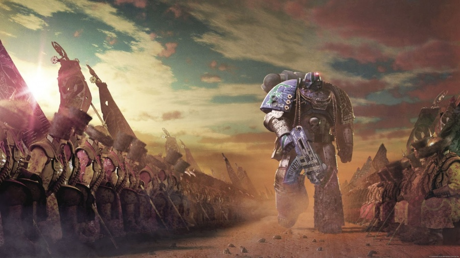

# 0084 基诺五二千连团 Geno Five-Two Chiliad

精校状态：中文行文已逐段精校，部分术语仍为暂定

分类：通用概念 / 帝国 Imperium

原文来源：https://www.bilibili.com/opus/1056407705376260100

原作者：帝国神选罐头

原文时间：2025年04月16日 19:21

[返回分类目录](目录.md) · [全书目录](../../目录.md)

原篇名：基诺52千连团 Geno Five-Two Chiliad

<!-- A0084-B0001 -->
**英文原文**

"Company first, Imperium second. Geno before gene."

<!-- /A0084-B0001 -->

<!-- A0084-B0002 -->

原译文

“连队第一，帝国第二。血脉优先于基因。”

**校订译文**

“连队第一，帝国第二。基诺先于基因。”

**校注：** Geno before gene 为利用团名 Geno 与 gene 的近音双关，强调对部队的归属先于血缘；原译“血脉优先于基因”丢失团名及誓言用意。

<!-- /A0084-B0002 -->

<!-- A0084-B0003 -->
**英文原文**

The Geno Five-Two Chiliad was a regiment of the Imperial Army raised on Terra, one of the Old Hundred, those Terran military formations that the Emperor allowed to continue past Unification and on into the Great Crusade.

<!-- /A0084-B0003 -->

<!-- A0084-B0004 -->

原译文

基诺52千连团是帝国军队在泰拉上组建的一个兵团，这些泰拉裔是老百人团之一，帝皇允许这些泰拉裔军事编队在统一后继续进行，并进入大远征。

**校订译文**

基诺五二千连团是在泰拉组建的帝国军部队，属于“老百人团”之一：这些泰拉旧军队在统一战争结束后，获准继续为帝皇效力，并参加大远征。

<!-- /A0084-B0004 -->

<!-- A0084-B0005 图片 -->

<!-- A0084-B0006 -->

原译文

Warriors of the Geno Five-Two Chiliad bow before a member of the Alpha Legion 基诺52千连团的战士在阿尔法军团的一名成员面前鞠躬

**校订译文**

Warriors of the Geno Five-Two Chiliad bow before a member of the Alpha Legion 基诺五二千连团战士向一名阿尔法军团成员鞠躬

<!-- /A0084-B0006 -->

<!-- A0084-B0007 -->
## Regimental History 兵团历史

<!-- /A0084-B0007 -->

<!-- A0084-B0008 -->
**英文原文**

Originating on Terra during the Unification Wars, the Geno Five-Two Chiliad were selected to be one of the Terran military formations allowed to continue fighting under the banner of the Emperor, and were part of the initial Crusade force sent out into the galaxy. As such, by the approach of the Horus Heresy, they had one of the longest and finest military histories of any Imperial unit.

<!-- /A0084-B0008 -->

<!-- A0084-B0009 -->

原译文

起源于统一战争期间的泰拉，基诺52千连团被选为允许在帝皇的旗帜下继续战斗的泰拉裔军事编队之一，并且是最初派往银河系的远征部队的一部分。因此，随着荷鲁斯叛乱的接近，他们拥有任何帝国部队中最长、最优秀的军事历史之一。

**校订译文**

基诺五二千连团起源于统一战争时期的泰拉，获选成为继续在帝皇旗帜下征战的泰拉旧部队，并参加了最早开赴银河的大远征军。因此，到荷鲁斯之乱前夕，他们已拥有帝国各军中最悠久、最显赫的军史之一。

<!-- /A0084-B0009 -->

<!-- A0084-B0010 -->
**英文原文**

The Geno Five-Two Chiliad fought throughout the Great Crusade, but their most notable actions were those under the command of Lord Commander Teng Namatjira, where they battled the heretical forces present on the world of Nurth, and then were deployed — and subsequently lost — in mysterious circumstances upon the world of 42 Hydra Tertius around 003.M31.

<!-- /A0084-B0010 -->

<!-- A0084-B0011 -->

原译文

基诺52千连团在整个大远征期间都参与了战斗，但他们最著名的行动是在领主指挥官藤·纳马吉拉的指挥下，在那里他们与努斯世界上的异端部队作战，然后在003.M31左右在秘密的情况下被部署到42九头蛇三号星世界上，并随后损失。

**校订译文**

基诺五二千连团贯穿整个大远征都在作战，其中最著名的经历发生在领主指挥官腾·纳马吉拉麾下。他们先在努斯与异端势力交战，随后约于 003.M31 被派往九头蛇42号星系第三行星，并在那里神秘覆灭。

**校注：** 42 Hydra Tertius 暂按星系编号＋第三行星解读；原文没有提供天文命名说明，保留英文待核。

<!-- /A0084-B0011 -->

<!-- A0084-B0012 -->
### Notable Campaigns 著名战役

<!-- /A0084-B0012 -->

<!-- A0084-B0013 -->
**英文原文**

Unification Wars — The Chiliad fought on Terra, pledged to the Emperor's service.

<!-- /A0084-B0013 -->

<!-- A0084-B0014 -->

原译文

统一战争—千人团在泰拉上作战，承诺为帝皇服务。

**校订译文**

统一战争——千连团在泰拉作战，宣誓为帝皇效力。

<!-- /A0084-B0014 -->

<!-- A0084-B0015 -->

原译文

Great Crusade 大远征

**校订译文**

Great Crusade 大远征

<!-- /A0084-B0015 -->

<!-- A0084-B0016 -->
**英文原文**

Foechion — Six-week campaign against orks.

<!-- /A0084-B0016 -->

<!-- A0084-B0017 -->

原译文

福奇恩 — 为期六周的对抗欧克战役。

**校订译文**

福奇恩——持续六周的对欧克蛮人战役。

<!-- /A0084-B0017 -->

<!-- A0084-B0018 -->
**英文原文**

Zantium — Fought the Dragonoid cadres.

<!-- /A0084-B0018 -->

<!-- A0084-B0019 -->

原译文

赞提姆—与龙人干部作战。

**校订译文**

赞提姆——对抗龙人战斗部队。

<!-- /A0084-B0019 -->

<!-- A0084-B0020 -->
**英文原文**

Nurth — Fought Nurthene rebels.

<!-- /A0084-B0020 -->

<!-- A0084-B0021 -->

原译文

努斯 — 与努尔森叛军作战。

**校订译文**

努斯 — 与努尔森叛军作战。

<!-- /A0084-B0021 -->

<!-- A0084-B0022 -->
**英文原文**

42 Hydra Tertius — Last known deployment.

<!-- /A0084-B0022 -->

<!-- A0084-B0023 -->

原译文

42九头蛇三号星 — 最后已知部署。

**校订译文**

九头蛇42号星系第三行星——最后一次已知部署。

<!-- /A0084-B0023 -->

<!-- A0084-B0024 -->
## Organisation 组织

<!-- /A0084-B0024 -->

<!-- A0084-B0025 -->
**英文原文**

The Geno was formed of one thousand companies. More akin to a brigade, the regiment appeared to treat the company as the primary tactical unit, assigning one or more to every undertaking that came their way. As such, each company - while being mainly an infantry unit - possessed enough organic armour and supply elements to sustain it in the field.

<!-- /A0084-B0025 -->

<!-- A0084-B0026 -->

原译文

基诺由一千个连队组成。更像是一个旅，该团似乎将连队视为主要的战术单位，为每一项任务分配一个或多个。因此，每个连队—虽然主要是一个步兵部队—都拥有足够的系统的装甲和补给来在战场上维持它。

**校订译文**

基诺五二千连团由一千个连组成。就运作方式而言，它更接近一个由各连构成的旅，以连为主要战术单位，每项任务调派一个或多个连。因此，各连虽以步兵为主，却都编有足够的直属装甲与补给单位，能够独立维持野战行动。

**校注：** 原文一方面称一千个连，另一方面类比 brigade，规模明显不符合常规旅级编制；仅在运作方式上保留类比，不改动数值。

<!-- /A0084-B0026 -->

<!-- A0084-B0027 -->
### Regimental Hierarchy 兵团等级

<!-- /A0084-B0027 -->

<!-- A0084-B0028 -->
**英文原文**

Uxor Primus: Overall command rank for the regiment.

<!-- /A0084-B0028 -->

<!-- A0084-B0029 -->

原译文

尤克索尔之首：该团的总指挥军衔。

**校订译文**

尤克索尔之首：该团的总指挥军衔。

<!-- /A0084-B0029 -->

<!-- A0084-B0030 -->
**英文原文**

Uxor: Command rank, having authority over one or more companies and/or part of the regiment's logistics and intelligence departments.

<!-- /A0084-B0030 -->

<!-- A0084-B0031 -->

原译文

尤克索尔：指挥等级，对一个或多个连队和/或兵团的部分后勤和情报部门拥有权力。

**校订译文**

尤克索尔：指挥等级，对一个或多个连队和/或兵团的部分后勤和情报部门拥有权力。

<!-- /A0084-B0031 -->

<!-- A0084-B0032 -->
**英文原文**

Genewhip: Political Officer. Responsible for regulating Chiliad's ethos, maintaining conduct and morale, and enforcing discipline.

<!-- /A0084-B0032 -->

<!-- A0084-B0033 -->

原译文

基诺纪委：政治官员。负责规范千夫团的风气，保持行为和士气，并执行纪律。

**校订译文**

基诺纪委：政治军官，负责规范千连团风气、维持行为准则和士气，并执行军纪。

<!-- /A0084-B0033 -->

<!-- A0084-B0034 -->
**英文原文**

Hetman: Company Commander. Apparently the most senior military rank achievable in the Geno, due to its nature as a brigade of companies.

<!-- /A0084-B0034 -->

<!-- A0084-B0035 -->

原译文

盖特曼：连长。显然，由于其连队性质，这是基诺可达到的最高军衔。

**校订译文**

盖特曼：连长。该团以各连为基础运作，因此这似乎是其中最高的前线作战军衔。

<!-- /A0084-B0035 -->

<!-- A0084-B0036 -->
**英文原文**

Bashaw: Subordinate rank to Hetman, several in a company.

<!-- /A0084-B0036 -->

<!-- A0084-B0037 -->

原译文

巴夏：盖特曼的下属，连队里有几个。

**校订译文**

巴夏：低于盖特曼的军衔，每连有数名。

<!-- /A0084-B0037 -->

<!-- A0084-B0038 -->
**英文原文**

Trooper: the lowest and most numerous rank in the Geno, that of front-line soldier. Selected to be at peak physical condition.

<!-- /A0084-B0038 -->

<!-- A0084-B0039 -->

原译文

士兵：基诺最低、人数最多的军衔，前线士兵。选择处于最佳身体状态的人。

**校订译文**

士兵：基诺中最低、人数最多的军衔，即前线战士；选拔标准要求体能处于巅峰。

<!-- /A0084-B0039 -->

<!-- A0084-B0040 -->
### Notable Commanders 著名指挥官

<!-- /A0084-B0040 -->

<!-- A0084-B0041 -->

原译文

Uxor Honen Mu 尤克索尔霍楠·穆

**校订译文**

Uxor Honen Mu 尤克索尔霍楠·穆

<!-- /A0084-B0041 -->

<!-- A0084-B0042 -->

原译文

Uxor Rukhsana Saiid 尤克索尔卢克萨娜·赛义德

**校订译文**

Uxor Rukhsana Saiid 尤克索尔卢克萨娜·赛义德

<!-- /A0084-B0042 -->

<!-- A0084-B0043 -->
**英文原文**

Hetman Hurtado Bronzi, "Jokers" Company.

<!-- /A0084-B0043 -->

<!-- A0084-B0044 -->

原译文

盖特曼赫塔多·布朗兹，“王牌”连队

**校订译文**

盖特曼乌尔塔多·布朗齐，“王牌”连。

<!-- /A0084-B0044 -->

<!-- A0084-B0045 -->
**英文原文**

Hetman Dimitar Shiban, "Clowns" Company.

<!-- /A0084-B0045 -->

<!-- A0084-B0046 -->

原译文

盖特曼迪米塔尔·希班，“丑角”连队

**校订译文**

盖特曼迪米塔尔·希班，“丑角”连队

<!-- /A0084-B0046 -->

<!-- A0084-B0047 -->
**英文原文**

Hetman Peto Soneka, "Dancers" Company.

<!-- /A0084-B0047 -->

<!-- A0084-B0048 -->

原译文

盖特曼佩托·索内卡，“舞者”连队

**校订译文**

盖特曼佩托·索内卡，“舞者”连队

<!-- /A0084-B0048 -->

<!-- A0084-B0049 -->
### Equipment 装备

<!-- /A0084-B0049 -->

<!-- A0084-B0050 -->
**英文原文**

The Geno wore a bulky-seeming uniform that nevertheless allowed them to operate with some grace of movement. A thick leather and armourchain bodyglove formed the main item of clothing, with waist-length coats and waist-length capes of yellow merdacaxi (a Terran variety of silk) commonly worn over the top. Their armour segments were lined with fur, and coats and capes were embroidered with company symbols and other military devices. Helmets were of the spiked variety, either in orange or silver and often trimmed with beads or fur. Standard issue gear was carried in a lightweight pack, with a long sword-bayonet slung at the waist. Uxors wore black, lightweight variants of the uniform, often covered over with grey cloaks or coats.

<!-- /A0084-B0050 -->

<!-- A0084-B0051 -->

原译文

基诺穿着一件看起来很笨重的制服，但这让他们能够以一些优雅的动作进行操作。厚厚的皮革和链甲手套是主要的服装，上面通常穿着齐腰的外套和齐腰的黄色梅尔达卡克西斗篷（人族的一种丝绸）。他们的盔甲部分衬有毛皮，外套和斗篷上绣有连队标志和其他军事装备。头盔有带刺的变体，要么是橙色的，要么是银色的，经常用珠子或毛皮装饰。标准装备装在一个轻便的包里，腰间挂着一把长枪刺剑。尤克索尔穿着黑色、轻便的制服，通常覆盖着灰色斗篷或外套。

**校订译文**

基诺的制服看似厚重，却不妨碍士兵灵活行动。主体是一套由厚皮革和锁甲构成的贴身战斗服，外罩齐腰外套和黄色梅尔达卡克西丝制短披风；梅尔达卡克西是泰拉出产的一种丝绸。装甲内衬毛皮，外套与披风绣有连队标记和其他军用徽饰。头盔带有尖顶，呈橙色或银色，常以珠饰或毛皮镶边。制式装备收在轻便背包里，腰间佩挂长剑式刺刀。尤克索尔穿黑色轻型制服，外面通常再罩灰色斗篷或大衣。

<!-- /A0084-B0051 -->

<!-- A0084-B0052 -->
**英文原文**

The standard issue weapon of the Geno was the lascarbine, with support weapons being RPG-sowers, fire poles and support cannons. In conjunction with ranged weapons, troopers carried telescopic pikes: these could extend to reach 10 metres, were lined with las-spines at the tip of the blade, and had gravitic counterweights at the base of the haft. Additional equipment issued during the Nurth campaign consisted of glare-shades and liqnite sprayers.

<!-- /A0084-B0052 -->

<!-- A0084-B0053 -->

原译文

基诺的标准武器是激光卡宾枪，支援武器是RPG发射器（导弹发射器）、火焰杖（喷火器）和支援炮（自动炮）。与远程武器相结合，士兵们携带了伸缩长矛：这些长矛可以延伸到10米，刀刃尖端有激光刺，刀柄底部有重力配重。努斯战役期间发放的额外装备包括眩光遮光罩和利克奈特喷雾器。

**校订译文**

基诺的制式武器是激光卡宾枪，支援武器包括火箭榴弹发射器、火焰杆和支援炮。除远程武器外，士兵还携带伸缩长矛：展开可达十米，矛刃尖端列有激光尖刺，柄底装有引力配重。努斯战役期间，部队还获配防强光眼罩与利克奈特喷洒器。

**校注：** 底稿未说明 support cannon 等同自动炮，也未说明 RPG-sower 等同导弹发射器；删去原译擅添括注。RPG 按通常含义译火箭榴弹。

<!-- /A0084-B0053 -->

<!-- A0084-B0054 -->
**英文原文**

They possessed some amounts of light armour, such as the Centaur, and transport vehicles such as the Scarab.

<!-- /A0084-B0054 -->

<!-- A0084-B0055 -->

原译文

他们拥有一定数量的轻甲，如半人马，以及运输工具，如圣甲虫。

**校订译文**

他们也拥有一定数量的轻型装甲载具，例如半人马，以及圣甲虫等运输车。

<!-- /A0084-B0055 -->

<!-- A0084-B0056 -->
## Recruitment 募集

<!-- /A0084-B0056 -->

<!-- A0084-B0057 -->
**英文原文**

A genic unit, the Geno Five-Two Chiliad bred the majority of their manpower, in a tradition of genetic engineering that was said to have been part of what inspired the Emperor to create the Primarchs and their Legions. The standard Geno troops, being genetically selected, all displayed physical characteristics deemed preferential for a warrior; they were big, tough, muscular men. Junior officers, normally selected from the troopers, appeared similar.

<!-- /A0084-B0057 -->

<!-- A0084-B0058 -->

原译文

作为一个基因单位，基诺52千连团按照基因工程的传统繁殖了他们的大部分人力，据说这是激发帝皇创造原体及其军团的部分原因。标准的基诺军队都是经过基因选择的，都表现出了被认为对战士有利的身体特征；他们是高大、强壮、肌肉发达的男人。通常从士兵中选出的初级军官看起来也很相似。

**校订译文**

基诺五二千连团是一支依靠基因育种的部队，大多数兵员由其自行培育。据说，这种基因工程传统也是帝皇创造原体及其军团的灵感来源之一。经过基因筛选的普通基诺士兵，都具有被视为适宜作战的身体特征：高大、结实、肌肉发达。从士兵中选出的初级军官通常也具有相似体格。

<!-- /A0084-B0058 -->

<!-- A0084-B0059 -->
**英文原文**

In order to keep the gene-stock fresh and to ensure flexibility and originality of thought, the senior fighting rank in the Geno, that of Hetman, was only open to non-Uterine soldiers—resulting in these officers usually not being as physically impressive as their subordinates. There was no shortage of recruits for this position, due to the reputation of the regiment.

<!-- /A0084-B0059 -->

<!-- A0084-B0060 -->

原译文

为了保持基因库的新鲜性，并确保思想的灵活性和原创性，基诺的高级战斗军衔，即盖特曼，只对非子宫士兵开放，导致这些军官的身体通常不如他们的下属令人印象深刻。由于该团的声誉，这个职位并不缺乏新兵。

**校订译文**

为保持基因库的多样性，并确保思维灵活、富有创造力，基诺最高的前线军衔“盖特曼”只向本团育种体系之外的士兵开放。因此，这些军官的体格通常不如下属出众。凭借千连团的声望，这个职位从不缺应征者。

**校注：** non-Uterine 在本团育种背景下指非本团培育出身者，不能按字面理解为没有子宫或非子宫出生的人。

<!-- /A0084-B0060 -->

<!-- A0084-B0061 -->
**英文原文**

The highest rank in the regiment was that of Uxor, a position only able to be held by women. Upon selection for the future position of Uxor, teenage girls had their ovaries removed and stored in the regiment's gene-banks, there to be used in conjunction with the gene-codes of established martial lines. The resultant children were born to be Geno warriors and uxors. An additional part of the process, not fully understood, resulted in the awakening of extremely weak psychic powers in the female candidates. These powers typically took the form of a 'felt connection' to their men, and an ability to perceive their operational situation at a higher level. This manifested practically on the battlefield as a quicker and more intelligent response to strategic situations, and a well-informed command tree. Known as "'cept", this power burned out quickly, with the result that most uxors became powerless as they approached the age of thirty, thus lessening their usefulness, and their having typically slim and small frames, with their aides being teenage girls. Removal from command and reassignment to other duties (e.g. medicae, cartomancer, or Munitorum commander) quickly followed the loss of 'cept, and it was an uxor's responsibility to train at least one aide, or junior, in order to replace her.

<!-- /A0084-B0061 -->

<!-- A0084-B0062 -->

原译文

该团的最高军衔是尤克索尔，这个职位只能由女性担任。在选定未来的尤克索尔职位后，十几岁的女孩被切除卵巢并储存在该团的基因库中，以便与已建立的军事血统的基因编码结合使用。由此产生的孩子天生就是基诺战士和尤克索尔。这一过程的另一部分尚未完全理解，导致女性候选人的灵能力量极其薄弱。这些力量通常表现为与部下的“感觉联系”，以及在更高层次上感知其作战情况的能力。这实际上在战场上表现为对战略形势的更快、更智能的反应，以及一个消息灵通的指挥树。这种力量被称为“抓取”，很快就耗尽了，结果大多数尤克索尔在接近30岁时变得无力，从而降低了她们的实用性，她们的身材通常又瘦又小，副官都是十几岁的女孩。在失去“抓取”后，很快就被调离指挥部并重新分配到其他职责（如医务人员、制图员或弹药指挥官），为了接替她，至少培训一名副官或初级副官是一名尤克索尔的责任。

**校订译文**

团内最高职衔是尤克索尔，仅由女性担任。少女获选为候任尤克索尔后，会被摘除卵巢，存入军团基因库，与成熟战斗血系的基因结合，培育下一代基诺战士和尤克索尔。过程中还有某种尚未完全理解的步骤，会唤醒女性候选者极其微弱的灵能力量。她们能与麾下士兵形成一种直觉上的联结，从更高层面感知部队的作战状况，在战场上表现为更迅速、更敏锐的战略反应，以及信息通达的指挥体系。这种能力称为“感知”（’cept），却会很快消耗殆尽；大多数尤克索尔接近三十岁时便失去能力，指挥价值也随之降低。她们通常身形纤瘦娇小，身边辅佐的也是少女。失去感知能力后，尤克索尔很快会卸下指挥职责，转任医疗人员、纸牌占卜师或军务部指挥官等职。每位尤克索尔都有责任培养至少一名助手或后辈，以便接替自己。

**校注：** cartomancer 指纸牌占卜师，非制图员；Munitorum 为军务部，非弹药。’cept 为特殊感知能力，暂作“感知”，并非动作“抓取”。

<!-- /A0084-B0062 -->

<!-- A0084-B0063 -->
### Etymology 词源

<!-- /A0084-B0063 -->

<!-- A0084-B0064 -->
**英文原文**

Uxor is the Latin word for wife.

<!-- /A0084-B0064 -->

<!-- A0084-B0065 -->

原译文

尤克索尔是拉丁语中妻子的意思。

**校订译文**

尤克索尔是拉丁语中妻子的意思。

<!-- /A0084-B0065 -->

<!-- A0084-B0066 -->
**英文原文**

A hetman is a political title from Central and Eastern Europe, historically assigned to military commanders. For example the highest military officers in the hetmanates area of modern Ukraine, the Zaporizhian Host, and the Ukrainian State of 1918 (also called the Second Hetmanate) were called hetman. The title hetman was used by Ukrainian Cossacks from the 16th Century. It was also the title of the second-highest military commander in the Crown of the Kingdom of Poland and the Grand Duchy of Lithuania from the 16th to the 18th Century. Used by the Czechs in Bohemia since the 15th Century, in the modern Czech Republic the title is used for regional governors. Throughout much of the history of Romania and the Moldavia, hetmans were the second-highest army rank.

<!-- /A0084-B0066 -->

<!-- A0084-B0067 -->

原译文

盖特曼是源自中欧和东欧的一个政治头衔，从历史上看，这个头衔曾授予军事指挥官。例如，在现代乌克兰的盖特曼辖区、扎波罗热哥萨克国以及1918年的乌克兰国（也被称为第二盖特曼政权），最高军事长官都被称为盖特曼。自16世纪起，乌克兰哥萨克人就开始使用“盖特曼”这一头衔。在16世纪至18世纪期间，波兰王国和立陶宛大公国的联合王国（波兰立陶宛联邦）中，第二高的军事指挥官也被授予这一头衔。自15世纪起，捷克人在波希米亚地区也使用这一头衔，在现代的捷克共和国，这一头衔被用于称呼地区行政长官。在罗马尼亚和摩尔多瓦的大部分历史时期，盖特曼是军队中第二高的军衔。

**校订译文**

盖特曼是源自中欧和东欧的一个政治头衔，从历史上看，这个头衔曾授予军事指挥官。例如，在现代乌克兰的盖特曼辖区、扎波罗热哥萨克国以及1918年的乌克兰国（也被称为第二盖特曼政权），最高军事长官都被称为盖特曼。自16世纪起，乌克兰哥萨克人就开始使用“盖特曼”这一头衔。在16世纪至18世纪期间，波兰王国和立陶宛大公国的联合王国（波兰立陶宛联邦）中，第二高的军事指挥官也被授予这一头衔。自15世纪起，捷克人在波希米亚地区也使用这一头衔，在现代的捷克共和国，这一头衔被用于称呼地区行政长官。在罗马尼亚和摩尔多瓦的大部分历史时期，盖特曼是军队中第二高的军衔。

<!-- /A0084-B0067 -->

<!-- A0084-B0068 -->
**英文原文**

Bashaw is the anglicised version of Pasha, a senior rank in the Ottoman political and military system, typically granted to governors, generals, dignitaries, and others. Pasha was also one of the highest titles in the 20th Century Kingdom of Egypt. The title was also used in Morocco in the 20th Century, where it denoted a regional official or governor of a district.

<!-- /A0084-B0068 -->

<!-- A0084-B0069 -->

原译文

巴夏是帕夏的英语化形式。帕夏是奥斯曼帝国政治和军事体系中的一个高级头衔，通常授予地方长官、将军、显贵及其他人士。在20世纪的埃及王国，帕夏也是最高头衔之一。20世纪的摩洛哥也使用这一头衔，在那里它指的是地区官员或某一地区的行政长官。

**校订译文**

巴夏是帕夏的英语化形式。帕夏是奥斯曼帝国政治和军事体系中的一个高级头衔，通常授予地方长官、将军、显贵及其他人士。在20世纪的埃及王国，帕夏也是最高头衔之一。20世纪的摩洛哥也使用这一头衔，在那里它指的是地区官员或某一地区的行政长官。

<!-- /A0084-B0069 -->

<!-- A0084-B0070 -->
**英文原文**

Chiliad is late Latin for a set of 1,000 elements.

<!-- /A0084-B0070 -->

<!-- A0084-B0071 -->

原译文

“Chiliad”在后期拉丁语中表示由一千个元素组成的一组事物。

**校订译文**

“Chiliad”在后期拉丁语中表示由一千个元素组成的一组事物。

<!-- /A0084-B0071 -->

本篇核心术语与暂定项

以下列出本篇出现的英文原形及核心术语表用词。同形词可能指不同对象，具体词义以本篇正文和校注为准；单复数、别名和仅见于图注的名称可能尚未列入。完整候选见[术语表](../../术语表/双语术语候选.csv)。

| 英文 | 采用中文 | 状态 |
| --- | --- | --- |
| Imperial Army | 帝国军 | 暂定·官方待核 |
| Orks | 欧克蛮人 | 官方已核对 |
| Horus Heresy | 荷鲁斯之乱 | 官方已核对 |
| Imperium | 帝国 | 暂定·简称 |
| History | 历史 | 编辑用语已统一 |
| Equipment | 装备 | 编辑用语已统一 |
| Emperor | 帝皇 | 官方已核对 |
| Great Crusade | 大远征 | 暂定·官方待核 |
| Terra | 泰拉 | 暂定·官方待核 |
| Horus | 荷鲁斯 | 暂定·官方待核 |
| Unification Wars | 统一战争 | 暂定·官方待核 |
| Geno Five-Two Chiliad | 基诺五二千连团 | 暂定·官方待核 |
| Teng Namatjira | 腾·纳马吉拉 | 暂定·官方待核 |
| Old Hundred | 老百人团 | 暂定·官方待核 |
| Uxor | 尤克索尔 | 暂定·官方待核 |
| Uxor Primus | 尤克索尔之首 | 暂定·官方待核 |
| Hetman | 盖特曼 | 暂定·官方待核 |
| Bashaw | 巴夏 | 暂定·官方待核 |
| Genewhip | 基诺纪委 | 暂定·官方待核 |
| 'cept | 感知 | 暂定·官方待核 |
| Hurtado Bronzi | 乌尔塔多·布朗齐 | 暂定·官方待核 |
| cartomancer | 卜图师／纸牌占卜师 | 暂定·官方待核 |
| Lord Commander | 领主指挥官 | 暂定·官方待核 |
| The Primarchs | 原体 | 暂定·官方待核 |
| Medicae | 医疗工 | 暂定·官方待核 |
| Powers | 能天使 | 暂定·官方待核 |
| Host | 天军 | 暂定·官方待核 |
| Nurth | 努尔特 | 暂定·官方待核 |
| Primus | 领军 | 官方已核对 |
| Subordinates | 属役 | 暂定·官方待核 |
| 42 Hydra Tertius | 42九头蛇三号 | 暂定·官方待核 |
| System | 星系（恒星系统） | 暂定·官方待核 |
| The Loss | 失落 | 暂定·官方待核 |

