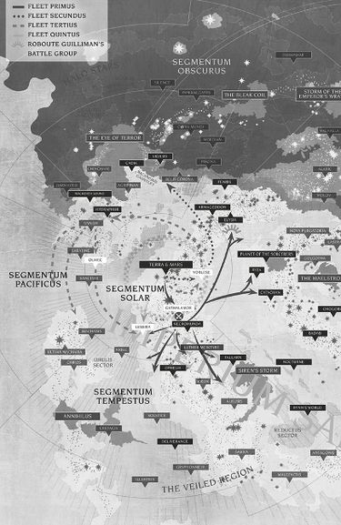

# 0097 第三不屈远征舰队 Indomitus Crusade Fleet Tertius

精校状态：中文行文已逐段精校，部分术语仍为暂定

分类：通用概念 / 帝国 Imperium

原文来源：https://www.bilibili.com/opus/1123400931706142737

原作者：帝国神选罐头

原文时间：编辑于 2026年07月31日 15:40

[返回分类目录](目录.md) · [全书目录](../../目录.md)

<!-- A0097-B0001 -->
**英文原文**

Indomitus Crusade Fleet Tertius was one of the Battlefleets assembled for the Imperium's Indomitus Crusade and was led by Fleetmaster Cassandra Van Leskus. Since the Pariah Crusade, it is led by White Consuls Captain Vitrian Messinius.

<!-- /A0097-B0001 -->

<!-- A0097-B0002 -->

原译文

不屈远征第三舰队是帝国的不屈远征中集结的战斗舰队之一，由舰队之主卡桑德拉·凡·莱斯库斯领导。自帕里亚远征以来，它由白色执政官连长维特里安·梅西尼乌斯领导。

**校订译文**

不屈远征第三舰队是为帝国不屈远征集结的战斗舰队之一，最初由舰队司令卡桑德拉·凡·莱斯库斯统率。贱民远征之后，指挥权转交白色执政官战团连长维特里安·梅西尼乌斯。

<!-- /A0097-B0002 -->

<!-- A0097-B0003 图片 -->

<!-- A0097-B0004 -->

原译文

The initial courses of Fleet Tertius, Secundus, and Primus 第三，第二和第一舰队的初始航线

**校订译文**

The initial courses of Fleet Tertius, Secundus, and Primus 第三，第二和第一舰队的初始航线

<!-- /A0097-B0004 -->

<!-- A0097-B0005 -->
## History 历史

<!-- /A0097-B0005 -->

<!-- A0097-B0006 -->
**英文原文**

It became the first of the Indomitus Crusade's fleets to launch, after it was given permission to intercept the rampaging Khornate Crusade of Slaughter. After departing the Sol System it moved to Vorlese and then moved to Hydraphur before taking its initial objective of Olmec, moving primarily through Segmentum Pacificus, and then arcing into Segmentum Tempestus. Guilliman's crusade was vindicated when the fleet scored a victory in the Battle of Machorta Sound. Tertius went on to earn glory at the expense of the troubled Fleet Quintus, securing its initial objective of Lessira for themselves.

<!-- /A0097-B0006 -->

<!-- A0097-B0007 -->

原译文

在获准拦截肆虐的恐虐屠杀远征后，它成为不屈远征第一支出发的舰队。离开太阳系后，它先移动到沃勒斯，然后移动到海德拉弗，然后以奥尔梅克为最初目标，主要穿过太平星域，然后弧形进入暴风星域。当舰队在马乔塔海峡之战中取得胜利时，基里曼的远征得到了证实。第三舰队继续以牺牲陷入困境的第四舰队为代价赢得荣耀，为自己确保了其最初的目标莱西拉。

**校订译文**

第三舰队获准拦截肆虐的恐虐屠杀远征，因此成为不屈远征中最早出航的舰队。离开太阳系后，它先后前往沃勒斯与海德拉弗，再夺取最初目标奥尔梅克。其航线主要穿过太平星域，随后转入暴风星域。马乔塔海峡之战的胜利证明了基里曼远征决策的成效。此后，第三舰队又夺取原本属于第五舰队最初目标的莱西拉，在陷入困境的第五舰队失意之际赢得荣耀。

**校注：** Quintus 为第五，不是第四。taking its initial objective 表示夺取目标，不只是将其设为目标。

<!-- /A0097-B0007 -->

<!-- A0097-B0008 -->
**英文原文**

During the The Battle of Paradyce in the Pariah Crusade, Fleet Tertius was mauled by Necron forces and Fleetmaster VanLeskus was killed buying time for survivors to escape. In the aftermath of the battle, White Consuls Captain Vitrian Messinius was named the new Fleetmaster of Tertius by Guilliman.

<!-- /A0097-B0008 -->

<!-- A0097-B0009 -->

原译文

在帕里亚远征的帕拉迪斯之战中，第三舰队被死灵部队袭击，舰队司令凡·莱斯库斯牺牲，为幸存者争取时间逃跑。战斗结束后，白色执政官连长维特里安·梅西尼乌斯被基里曼任命为第三舰队的新任舰队司令。

**校订译文**

贱民远征期间的帕拉迪斯之战中，第三舰队遭太空死灵重创。凡·莱斯库斯为掩护幸存者撤退而战死。战后，基里曼任命白色执政官连长维特里安·梅西尼乌斯为第三舰队的新舰队司令。

<!-- /A0097-B0009 -->

<!-- A0097-B0010 -->
## Known Battles 著名战斗

<!-- /A0097-B0010 -->

<!-- A0097-B0011 -->

原译文

Crusade of Slaughter 屠杀远征

**校订译文**

Crusade of Slaughter 屠杀远征

<!-- /A0097-B0011 -->

<!-- A0097-B0012 -->

原译文

Battle of Machorta Sound 马乔塔海峡之战

**校订译文**

Battle of Machorta Sound 马乔塔海峡之战

<!-- /A0097-B0012 -->

<!-- A0097-B0013 -->

原译文

Pariah Crusade 帕里亚远征

**校订译文**

Pariah Crusade 贱民远征

<!-- /A0097-B0013 -->

<!-- A0097-B0014 -->
**英文原文**

Captain Vitrian Messinius - Current Fleetmaster

<!-- /A0097-B0014 -->

<!-- A0097-B0015 -->

原译文

连长维特里安·梅西尼乌斯 - 现任舰队司令

**校订译文**

连长维特里安·梅西尼乌斯 - 现任舰队司令

<!-- /A0097-B0015 -->

<!-- A0097-B0016 -->
**英文原文**

Cassandra Van Leskus - Former Fleetmaster.

<!-- /A0097-B0016 -->

<!-- A0097-B0017 -->

原译文

卡桑德拉·凡·莱斯库斯 - 前任舰队司令

**校订译文**

卡桑德拉·凡·莱斯库斯 - 前任舰队司令

<!-- /A0097-B0017 -->

<!-- A0097-B0018 -->
**英文原文**

Eloise Athagey - Former Commodore and Groupmaster of Battlegroup Saint Aster.

<!-- /A0097-B0018 -->

<!-- A0097-B0019 -->

原译文

埃洛伊斯·阿塔吉 - 圣阿斯特战斗群的前准将和集群司令。

**校订译文**

埃洛伊斯·阿塔吉 - 圣阿斯特战斗群的前准将和集群司令。

<!-- /A0097-B0019 -->

<!-- A0097-B0020 -->
**英文原文**

Grunfeld - Groupmaster of Battle Group Delpharus.

<!-- /A0097-B0020 -->

<!-- A0097-B0021 -->

原译文

格伦菲尔德 - 德尔法鲁斯战斗群集群司令。

**校订译文**

格伦菲尔德 - 德尔法鲁斯战斗群集群司令。

<!-- /A0097-B0021 -->

<!-- A0097-B0022 -->
**英文原文**

Vitrian Messinius - White Consuls Lord Lieutenant.

<!-- /A0097-B0022 -->

<!-- A0097-B0023 -->

原译文

维特里安·梅西尼乌斯 - 白色执政官领主副官

**校订译文**

维特里安·梅西尼乌斯 - 白色执政官领主副官

<!-- /A0097-B0023 -->

<!-- A0097-B0024 -->
**英文原文**

Ferren Areios - Ultramarines Lieutenant.

<!-- /A0097-B0024 -->

<!-- A0097-B0025 -->

原译文

费伦·阿瑞奥斯 - 极限战士副官

**校订译文**

费伦·阿瑞奥斯 - 极限战士副官

<!-- /A0097-B0025 -->

<!-- A0097-B0026 -->
**英文原文**

Finnula Diomed - 1st Lieutenant and Shipmistress.

<!-- /A0097-B0026 -->

<!-- A0097-B0027 -->

原译文

芬努拉·迪奥梅德 - 第一副官和女舰长。

**校订译文**

芬努拉·迪奥梅德——第一副官兼女舰长。

<!-- /A0097-B0027 -->

<!-- A0097-B0028 -->
**英文原文**

Leonid Rostov - Inquisitor.

<!-- /A0097-B0028 -->

<!-- A0097-B0029 -->

原译文

列昂尼德·罗斯托夫 - 审判官。

**校订译文**

列昂尼德·罗斯托夫 - 审判官。

<!-- /A0097-B0029 -->

<!-- A0097-B0030 -->
**英文原文**

Feodor Thaddeus Nerric - Lord Inquisitor of the Ordo Militarum

<!-- /A0097-B0030 -->

<!-- A0097-B0031 -->

原译文

费奥多·撒迪厄斯·内里克 - 军事修会的领主审判官

**校订译文**

费奥多·撒迪厄斯·内里克——军事审判庭领主审判官。

**校注：** Ordo Militarum 为审判庭分支，依全书 Ordo 的机构区分暂作“军事审判庭”，与军务部不同。

<!-- /A0097-B0031 -->

<!-- A0097-B0032 -->
**英文原文**

Dionis - Groupmaster.

<!-- /A0097-B0032 -->

<!-- A0097-B0033 -->

原译文

迪奥尼斯 - 集群司令

**校订译文**

迪奥尼斯 - 集群司令

<!-- /A0097-B0033 -->

<!-- A0097-B0034 -->
**英文原文**

Peluros Mimon - Astra Militarum General and commander of Battle Group Chion's Task Force II.

<!-- /A0097-B0034 -->

<!-- A0097-B0035 -->

原译文

佩卢罗斯·米蒙 - 星界军将军，希翁第二特遣部队指挥官。

**校订译文**

佩卢罗斯·米蒙——星界军将军，希翁战斗群第二特遣队指挥官。

<!-- /A0097-B0035 -->

<!-- A0097-B0036 -->
**英文原文**

Kassayan - Captain of the Raptors' First Company

<!-- /A0097-B0036 -->

<!-- A0097-B0037 -->

原译文

卡萨扬 - 猛禽第一连队连长

**校订译文**

卡萨扬 - 猛禽第一连队连长

<!-- /A0097-B0037 -->

<!-- A0097-B0038 -->
**英文原文**

Battle Group Alphus - Command group.

<!-- /A0097-B0038 -->

<!-- A0097-B0039 -->

原译文

阿尔法战斗群 - 指挥集群。

**校订译文**

阿尔弗斯战斗群——指挥战斗群。

<!-- /A0097-B0039 -->

<!-- A0097-B0040 -->

原译文

Battle Group Betaris 贝塔利斯战斗群

**校订译文**

Battle Group Betaris 贝塔利斯战斗群

<!-- /A0097-B0040 -->

<!-- A0097-B0041 -->

原译文

Battle Group Chion 希翁战斗群

**校订译文**

Battle Group Chion 希翁战斗群

<!-- /A0097-B0041 -->

<!-- A0097-B0042 -->

原译文

Battle Group Delpharis 德尔法里斯战斗群

**校订译文**

Battle Group Delpharis 德尔法里斯战斗群

**校注：** 上文 Grunfeld 条目写 Delpharus，本列表写 Delpharis；可能是同一战斗群拼写差异，暂各保留英文及原有对应译名，待原始资料核对。

<!-- /A0097-B0042 -->

<!-- A0097-B0043 -->

原译文

Battle Group Delphi 德尔福战斗群

**校订译文**

Battle Group Delphi 德尔福战斗群

<!-- /A0097-B0043 -->

<!-- A0097-B0044 -->

原译文

Battle Group Delphi II 德尔福第二战斗群

**校订译文**

Battle Group Delphi II 德尔福第二战斗群

<!-- /A0097-B0044 -->

<!-- A0097-B0045 -->

原译文

Battle Group Hephaestus 赫菲斯托斯战斗群

**校订译文**

Battle Group Hephaestus 赫菲斯托斯战斗群

<!-- /A0097-B0045 -->

<!-- A0097-B0046 -->

原译文

Battle Group Iolus 伊奥劳斯战斗群

**校订译文**

Battle Group Iolus 伊奥劳斯战斗群

<!-- /A0097-B0046 -->

<!-- A0097-B0047 -->

原译文

Battle Group Jovian 朱庇特战斗群

**校订译文**

Battle Group Jovian 朱庇特战斗群

<!-- /A0097-B0047 -->

<!-- A0097-B0048 -->

原译文

Battle Group Lamdax 拉姆达斯战斗群

**校订译文**

Battle Group Lamdax 拉姆达斯战斗群

<!-- /A0097-B0048 -->

<!-- A0097-B0049 -->

原译文

Battle Group Macharius 马卡里乌斯战斗群

**校订译文**

Battle Group Macharius 马卡里乌斯战斗群

<!-- /A0097-B0049 -->

<!-- A0097-B0050 -->

原译文

Battle Group Oberon 奥伯龙战斗群

**校订译文**

Battle Group Oberon 奥伯龙战斗群

<!-- /A0097-B0050 -->

<!-- A0097-B0051 -->

原译文

Battle Group Saint Aster 圣阿斯特战斗群

**校订译文**

Battle Group Saint Aster 圣阿斯特战斗群

<!-- /A0097-B0051 -->

<!-- A0097-B0052 -->
**英文原文**

Precept Magnificat - Oberon Class Battleship and flagship

<!-- /A0097-B0052 -->

<!-- A0097-B0053 -->

原译文

崇高戒律 - 奥伯龙级战列舰和旗舰

**校订译文**

崇高戒律 - 奥伯龙级战列舰和旗舰

<!-- /A0097-B0053 -->

<!-- A0097-B0054 -->
**英文原文**

Saint Aster - Overlord Class Battlecruiser, flagship of Battlegroup Saint Aster

<!-- /A0097-B0054 -->

<!-- A0097-B0055 -->

原译文

圣阿斯特 - 霸主级战列巡洋舰，圣阿斯特战斗群的旗舰

**校订译文**

圣阿斯特 - 霸主级战列巡洋舰，圣阿斯特战斗群的旗舰

<!-- /A0097-B0055 -->

<!-- A0097-B0056 -->
**英文原文**

Vox Lexica - Dictator Class Cruiser

<!-- /A0097-B0056 -->

<!-- A0097-B0057 -->

原译文

音阵语典 - 独裁者级巡洋舰

**校订译文**

音阵语典 - 独裁者级巡洋舰

<!-- /A0097-B0057 -->

本篇核心术语与暂定项

以下列出本篇出现的英文原形及核心术语表用词。同形词可能指不同对象，具体词义以本篇正文和校注为准；单复数、别名和仅见于图注的名称可能尚未列入。完整候选见[术语表](../../术语表/双语术语候选.csv)。

| 英文 | 采用中文 | 状态 |
| --- | --- | --- |
| Astra Militarum | 星界军 | 官方已核对 |
| Ultramarines | 极限战士 | 官方已核对 |
| Inquisitor | 审判官 | 官方已核对 |
| Imperium | 帝国 | 暂定·简称 |
| Indomitus | 不屈学派 | 暂定·学派语境 |
| Indomitus Crusade | 不屈远征 | 暂定·官方待核 |
| Segmentum Pacificus | 太平星域 | 暂定·官方待核 |
| Segmentum Tempestus | 暴风星域 | 暂定·官方待核 |
| Segmentum | 星域 | 暂定·官方待核 |
| Hydraphur | 海德拉弗 | 暂定·官方待核 |
| Pariah | 贱民 | 暂定·官方待核 |
| Indomitus Crusade Fleet Tertius | 不屈远征第三舰队 | 暂定·官方待核 |
| Vitrian Messinius | 维特里安·梅西尼乌斯 | 暂定·官方待核 |
| Cassandra Van Leskus | 卡桑德拉·凡·莱斯库斯 | 暂定·官方待核 |
| Battle Group Alphus | 阿尔弗斯战斗群 | 暂定·官方待核 |
| Ordo Militarum | 军事审判庭 | 暂定·官方待核 |
| Lieutenant | 副官 | 暂定·官方待核 |
| Sol | 太阳系 | 暂定·官方待核 |
| Captain | 连长 | 暂定·官方待核 |
| Raptors | 猛禽 | 暂定·官方待核 |
| White Consuls | 白色执政官 | 暂定·官方待核 |
| Overlord | 霸主 | 官方已核对 |
| Ferren Areios | 费伦·阿瑞奥斯 | 暂定·官方待核 |
| Oberon Class Battleship | 天卫四级战列舰 | 暂定·官方待核 |
| Magnificat | 圣颂垂体 | 暂定·官方待核 |
| Pariah Crusade | 被遗弃者远征 | 暂定·官方待核 |
| Quintus | 昆图斯 | 暂定·官方待核 |
| Thaddeus | 撒迪厄斯 | 暂定·官方待核 |
| System | 星系（恒星系统） | 暂定·官方待核 |
| Machorta Sound | 马乔塔海峡 | 暂定·官方待核 |
| Leonid Rostov | 列昂尼德·罗斯托夫 | 暂定·官方待核 |
| Olmec | 奥尔梅克 | 暂定·官方待核 |
| Lessira | 莱西拉 | 暂定·官方待核 |
| Groupmaster | 集群司令 | 暂定·官方待核 |
| Fleetmaster | 舰队司令 | 暂定·官方待核 |
| Precept Magnificat | 崇高戒律号 | 暂定·官方待核 |
| Saint Aster | 圣阿斯特号 | 暂定·官方待核 |
| Vorlese | 沃勒斯 | 暂定·官方待核 |
| Sol System | 太阳系 | 暂定·官方待核 |

