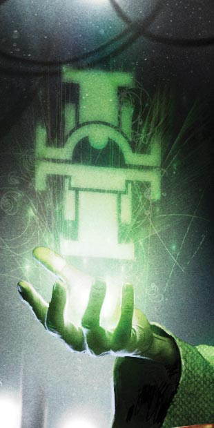
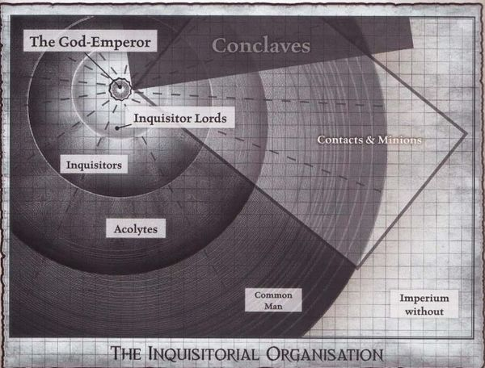
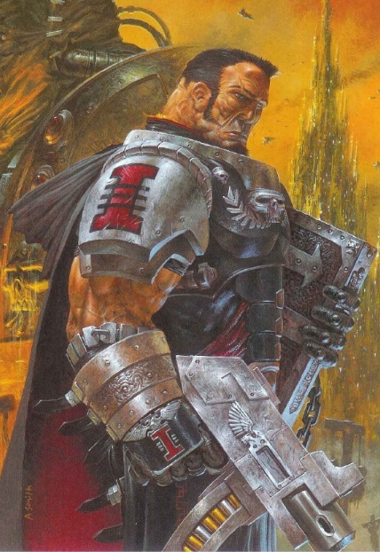
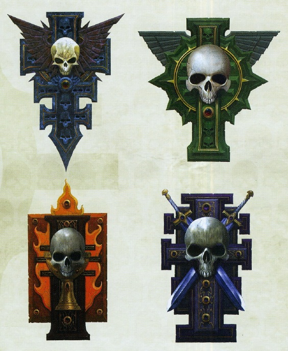
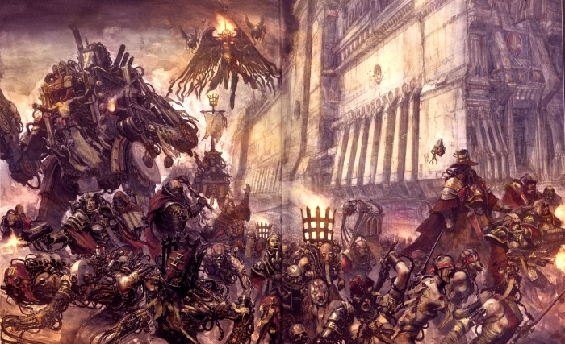

# 0098 审判庭 Inquisition

精校状态：中文行文已逐段精校，部分术语仍为暂定

分类：通用概念 / 帝国 Imperium / 审判庭 Inquisition

原文来源：https://www.bilibili.com/opus/1070767756735938576

原作者：帝国神选罐头

原文时间：编辑于 2025年11月29日 16:59

[返回分类目录](目录.md) · [全书目录](../../目录.md)

<!-- A0098-B0001 -->
**英文原文**

The Holy Orders of the Emperor's Inquisition, more commonly known as the Inquisition, are the powerful secret police of the Imperium responsible for guarding the souls of humanity. The purpose of the Inquisition is to identify and destroy the myriad of potential threats to the Imperium and humanity. Such is the Inquisition's power that it answers only to the Emperor.

<!-- /A0098-B0001 -->

<!-- A0098-B0002 -->

原译文

帝皇审判庭神圣修会，通常被称为审判庭，是帝国强大的秘密警察，负责保护人类的灵魂。审判庭的目的是识别和摧毁对帝国和人类的无数潜在威胁。审判庭的权力如此之大，以至于它只对帝皇负责。

**校订译文**

帝皇审判庭诸神圣修会，通常简称审判庭，是帝国权势极大的秘密警察机构，肩负守护人类灵魂的职责。它负责查明并消灭一切可能威胁帝国与人类的危险，权力之大，使其只须向帝皇负责。

<!-- /A0098-B0002 -->

<!-- A0098-B0003 -->
**英文原文**

Founded in the aftermath of the Horus Heresy, the organisation's members are ag ents known as Inquisitors.

**校注：** 英文 ag ents 为 agents 的错误断词；保留底稿，中文无影响。

<!-- /A0098-B0003 -->

<!-- A0098-B0004 -->

原译文

该组织成立于荷鲁斯叛乱之后，其成员被称为审判官。

**校订译文**

该组织成立于荷鲁斯之乱之后，其成员被称为审判官。

<!-- /A0098-B0004 -->

<!-- A0098-B0005 图片 -->

<!-- A0098-B0006 -->

原译文

Inquisition symbol 审判庭标志

**校订译文**

Inquisition symbol 审判庭标志

<!-- /A0098-B0006 -->

<!-- A0098-B0007 -->
**英文原文**

Headquarters:Fortress of the Inquisition, Terra

<!-- /A0098-B0007 -->

<!-- A0098-B0008 -->

原译文

总部：泰拉，审判庭要塞

**校订译文**

总部：泰拉，审判庭要塞

<!-- /A0098-B0008 -->

<!-- A0098-B0009 -->
**英文原文**

Leader:None (represented by the Inquisitorial Representative)

<!-- /A0098-B0009 -->

<!-- A0098-B0010 -->

原译文

领导人：无（由审判官代表作为代言人）

**校订译文**

领导人：无（由审判庭代表作为代言人）

<!-- /A0098-B0010 -->

<!-- A0098-B0011 -->
**英文原文**

Armed Forces:Various Retinues，Inquisitorial Stormtroopers，Black Ships，Chamber Militants

<!-- /A0098-B0011 -->

<!-- A0098-B0012 -->

原译文

武装力量：各种随从、审判庭风暴兵、黑船、军事辅军

**校订译文**

武装力量：各种随从、审判庭风暴兵、黑船、军事辅军

<!-- /A0098-B0012 -->

<!-- A0098-B0013 -->
**英文原文**

Established:Post-Horus Heresy, M31

<!-- /A0098-B0013 -->

<!-- A0098-B0014 -->

原译文

成立：荷鲁斯叛乱后，M31

**校订译文**

成立：荷鲁斯之乱后，M31

<!-- /A0098-B0014 -->

<!-- A0098-B0015 -->
## History 历史

<!-- /A0098-B0015 -->

<!-- A0098-B0016 -->
**英文原文**

The actual founding of the Inquisition is shrouded in mystery and there are at least two different stories surrounding its formation.

<!-- /A0098-B0016 -->

<!-- A0098-B0017 -->

原译文

审判庭的实际成立笼罩在神秘之中，围绕其形成至少有两个不同的故事。

**校订译文**

审判庭真正的创立经过始终扑朔迷离，至少流传着两种不同说法。

<!-- /A0098-B0017 -->

<!-- A0098-B0018 -->
**英文原文**

The first is that in the twilight hours prior to His internment within the Golden Throne, while Terra lay besieged by the traitor forces of Warmaster Horus, the Emperor of Mankind commanded Malcador the Sigillite to seek out "men of character, skill, and determination" to be tested and trained so that an elite group of investigators might be tasked to discover the alien, mutant, and heretic. Immediately prior to his assault on Horus's battle barge, Malcador presented twelve individuals to the Emperor - eight Astartes and four humans - whom he had gathered in response to the Emperor's commands. The Astartes were described as having cast aside their allegiance to their Primarchs and Legions who had sided with Horus; Malcador went on to say that they were blessed with paranormal skills which were best suited for combating the horrors that had recently emerged from the warp.

<!-- /A0098-B0018 -->

<!-- A0098-B0019 -->

原译文

首先，在帝皇被安置在黄金王座之前的最终时刻之前，当泰拉被战帅荷鲁斯的叛徒部队围困时，人类帝皇命令掌印者马卡多寻找“有个性、技能和决心的人”进行测试和训练，以便一个精英调查组可以负责发现异型、变种人和异端。就在他袭击荷鲁斯的战舰之前，马卡多向帝皇献上了十二个人 — 八位阿斯塔特和四个凡人 — 是为了回应帝皇的命令而召集的。阿斯塔特被描述为抛弃了对支持荷鲁斯的原体和军团的忠诚；马卡多接着说，他们有幸拥有超自然的技能，最适合对抗最近从亚空间中出现的恐怖。

**校订译文**

第一种说法是，泰拉遭战帅荷鲁斯的叛军围攻、帝皇即将被永久安置于黄金王座的最后时日里，他命掌印者马卡多寻找“品格、才干与决心兼备之人”，加以考验和训练，组成精锐调查队，搜查异形、变种人与异端。帝皇出击荷鲁斯的战斗驳船前夕，马卡多呈上了奉命招来的十二人：八名阿斯塔特与四名凡人。据描述，这八名阿斯塔特已放弃效忠那些倒向荷鲁斯的原体与军团。马卡多还指出，他们拥有超常能力，最适合迎战新近从亚空间涌出的恐怖存在。

**校注：** 这是原文所列第一种创立说法；其八名阿斯塔特均出自叛军的概述可能与后续名单版本不合，按史料版本并存，不擅改人物身份。character 指品格，不是个性。

<!-- /A0098-B0019 -->

<!-- A0098-B0020 图片 -->

<!-- A0098-B0021 -->

原译文

The Sigil of Malcador 马卡多之印

**校订译文**

The Sigil of Malcador 马卡多之印

<!-- /A0098-B0021 -->

<!-- A0098-B0022 -->
**英文原文**

Although the identities of the twelve presented to the Emperor and/or Malcador were never revealed, it is known that among those individuals recruited by Malcador were Janius, Epithemuius, Khyron, Koios, Ogen, Iapto, Yotun, and Satre. Regular humans included Zaranchek Xanthus, Khalid Hassan, Gallent Sidozie, and Moriana Mouhausen, though there are other mortals ultimately instrumental in the formation of the Inquisition such as Kyril Sindermann and Promeus.

<!-- /A0098-B0022 -->

<!-- A0098-B0023 -->

原译文

虽然交给帝皇和/或马卡多的十二人的身份从未透露，但众所周知，马卡多招募的这些人包括贾尼厄斯、厄庇墨透斯、凯戎、科俄斯、奥根、拉普托、尤顿和萨彻。凡人包括扎兰切克·赞西乌斯、哈立德·哈桑、加伦特·西多齐和莫瑞安娜·米尔豪森，尽管还有其他凡人最终在审判庭的形成中发挥了作用，如凯里尔·辛德曼和普罗密斯。

**校订译文**

虽然被引见给帝皇或马卡多的十二人名单并未得到完整揭示，但已知马卡多招募过贾尼厄斯、厄庇墨透斯、凯戎、科俄斯、奥根、伊阿普托、尤顿和萨彻。凡人成员包括扎兰切克·赞西乌斯、哈立德·哈桑、加伦特·西多齐，以及莫瑞安娜·米尔豪森。此外，凯里尔·辛德曼与普罗密斯等其他凡人，也在审判庭的形成过程中发挥了重要作用。

**校注：** Janius/Epithemuius 等拼写与常见名字可能有差异，保留英文待原始出处核验；不凭记忆替换成另一身份。

<!-- /A0098-B0023 -->

<!-- A0098-B0024 -->
**英文原文**

The second story is that, immediately after the Emperor was interred in his Golden Throne, four trusted servants of the Emperor gathered in secret to discuss what was to happen next. Their opinions were divided; two believed the Emperor could be returned to life, the other two believed it folly to interfere with the events that had unfolded. The two resurrectionists, known as Promeus and Moriana, left Terra to begin their quest to bring the Emperor back to life. The two that remained acted quickly to establish themselves with the Senatorum Imperialis and created an organisation to combat the efforts of Promeus and Moriana, and it was from this seed that the Inquisition was formed.

<!-- /A0098-B0024 -->

<!-- A0098-B0025 -->

原译文

第二个故事是，在帝皇被安置在他的黄金王座之后，帝皇的四个值得信赖的仆人秘密聚集在一起，讨论接下来会发生什么。他们的意见存在分歧；两人认为帝皇可以复活，另外两人认为干涉已经发生的事件是愚蠢的。被称为普罗密斯和莫瑞安娜的两位复生派离开了泰拉，开始寻求让帝皇复活。剩下的两人迅速采取行动，与帝国参议院建立了联系，并创建了一个组织来对抗普罗密斯和莫瑞安娜的努力，正是从这颗种子中，审判庭成立了。

**校订译文**

第二种说法是，帝皇刚被安置进黄金王座，四位亲信便秘密会面，讨论此后的道路。他们意见分裂：两人相信帝皇能够复生，另两人则认为干预已经发生的一切是愚蠢之举。主张复生的普罗密斯与莫瑞安娜离开泰拉，开始寻找让帝皇重返生命的方法；留下的两人则迅速在帝国参议院取得地位，创建组织阻止他们。这一组织便成为审判庭的萌芽。

<!-- /A0098-B0025 -->

<!-- A0098-B0026 -->
**英文原文**

It is not known whether these two stories are simply a case of conflicting background, or whether both stories contain some element of truth. It is said that when the Senatorum Imperialis was convened on the first anniversary of the Emperor's Ascension, a grim-faced man joined the council and identified himself as a representative of the Holy Orders of the Emperor's Inquisition. The fact that they called themselves "Orders" plural could be taken to suggest that the early Inquisition was an amalgamation of several organisations.

<!-- /A0098-B0026 -->

<!-- A0098-B0027 -->

原译文

目前尚不清楚这两个故事是否只是背景冲突的案例，或者两个故事都包含一些真相。据说，当帝国参议院在皇帝升天一周年之际召开会议时，一个面无表情的人加入了会议，并自称是帝皇审判庭神圣修会的代表。事实上，他们称自己为复数的“修会”，这可能意味着早期的审判庭是几个组织的合并。

**校订译文**

两种说法究竟来自相互冲突的背景版本，还是各自包含部分真相，目前无从确定。据说，在帝皇升天一周年的帝国参议院会议上，一名神情冷峻的男子加入议会，自称代表帝皇审判庭诸神圣修会。其称号中的 Orders 使用复数，或许暗示早期审判庭由数个组织合并而成。

<!-- /A0098-B0027 -->

<!-- A0098-B0028 -->
**英文原文**

By mid-M32 and the War of the Beast, the Inquisition was operating as a single order from Titan and largely still a secret. However the desperation of the war prompted the formal division of the Inquisition between the Ordo Xenos and Ordo Malleus. Many more Ordo's have since been created.

<!-- /A0098-B0028 -->

<!-- A0098-B0029 -->

原译文

到了M32中期和野兽战争，审判庭作为泰坦的单一修会运作，在很大程度上仍然是一个秘密。然而，战争的绝望促使攘外修会和圣锤修会之间的审判庭正式分裂。此后，又创造了更多的修会。

**校订译文**

到 M32 中期的野兽战争时，审判庭仍以单一修会形式运作，以泰坦为基地，存在也大体保密。战争中的危急形势促使其正式分出异形审判庭与恶魔审判庭，此后又陆续形成更多分支。

<!-- /A0098-B0029 -->

<!-- A0098-B0030 -->
## Organization 组织

<!-- /A0098-B0030 -->

<!-- A0098-B0031 -->
**英文原文**

Ordos are a major operational subfaction within the Imperial Inquisition. As the Inquisition possesses neither a formalized hierarchy nor leadership, each Inquisitor is free to pursue the mission of humanity's survival in the manner they see most appropriate. Like-minded individuals gather together to investigate areas of mutual interest and concern, as bounded by one of the many Inquisitorial Ordos. Each Ordo comes and goes with the times, for many Inquisitors move freely between them according to their own whims and judgement. Ordos can grow larger in crises and then exist only on paper until its field becomes relevant once more. Association with an Ordo is not a matter of absolute allegiance, nor does it preclude an Inquisitor's involvement in matters pertaining to another Ordo.

<!-- /A0098-B0031 -->

<!-- A0098-B0032 -->

原译文

修会是帝国审判庭的一个主要运转分支。由于审判庭既没有正式的等级制度，也没有领导层，每个审判官都可以自由地以他们认为最合适的方式追求人类生存的使命。志同道合的人聚集在一起，调查共同感兴趣和关心的领域，正如众多审判庭修会之一所界定的那样。每个修会都随着时代的发展而来来去去，因为许多审判官根据自己的想法和判断在他们之间自由地行动。修会可以在危机中变得更大，或者只存在于纸面上，直到其领域再次变得重要。与一个修会的关系不是绝对忠诚的问题，也不排除审判官参与与另一个修会有关的事务。

**校订译文**

Ordo 是帝国审判庭内部主要的行动分支。审判庭没有统一的正式等级体系或领导机构，每位审判官都可采用自己认为最合适的方式履行维护人类生存的使命。志同道合者围绕共同关切的领域聚集，形成各个 Ordo。许多审判官会依个人判断自由转入或离开，因此分支的兴衰也随时代变化：危机时迅速壮大，相关威胁消退后可能仅存于纸面，直至该领域再次重要起来。加入某一分支不意味着排他性的效忠，也不妨碍介入其他分支关注的事务。

<!-- /A0098-B0032 -->

<!-- A0098-B0033 图片 -->

<!-- A0098-B0034 -->

原译文

Organization of the Inquisition 审判庭的组织

**校订译文**

Organization of the Inquisition 审判庭的组织

<!-- /A0098-B0034 -->

<!-- A0098-B0035 -->
### Ordo Majoris 主要审判庭分支

原题：Ordo Majoris 主要修会

<!-- /A0098-B0035 -->

<!-- A0098-B0036 -->
**英文原文**

Currently within the modern Inquisition of M41 there are three Ordos Majoris (Xenos, Malleus, and Hereticus), and an unknown number of Ordos Minoris. These branches are ever-present for their mission is considered never-ending. Each branch specialises in the combat and investigation of specific threats to the Imperial domain. While Inquisitors from any Ordo are trained to deal with all potential dangers, it is the role of the Ordos to produce agents who are particularly adept at understanding and destroying specific abominations. Membership in an Ordo is not mandatory, and there are those Inquisitors who prefer not to join one.

<!-- /A0098-B0036 -->

<!-- A0098-B0037 -->

原译文

目前，在M41的现代审判庭内，有三个主要修会（攘外、圣锤和讨逆）和数量不详的次级修会。这些分支机构一直存在，因为他们的使命被认为是永无止境的。每个分支专门从事对帝国领域特定威胁的战斗和调查。虽然来自任何修会的审判官都受过处理所有潜在危险的训练，但修会的作用是培养出特别擅长理解和摧毁特定可憎事物的特工。修会的成员资格不是强制性的，有些审判官不会加入任何修会。

**校订译文**

M41 的审判庭有三个主要分支——异形审判庭、恶魔审判庭和异端审判庭——以及数量不详的次级分支。三大分支长期存在，因为它们的使命被认为永无终结。各分支专门调查和应对某类威胁帝国的危险。虽然所有审判官都接受应付各类潜在威胁的训练，各 Ordo 仍致力于培养特别擅长理解、消灭特定憎恶存在的人员。加入分支并非强制要求，有些审判官选择保持独立。

<!-- /A0098-B0037 -->

<!-- A0098-B0038 -->
**英文原文**

The Ordo Malleus (The Threat Beyond) - Destroys daemonic threats and investigates the nature of the Daemon. The Ordo is said to have been created immediately after the Horus Heresy, and therefore has been a part of the Inquisition from the beginning. However it did not formally exist until 1,500 years after the Heresy in the aftermath of the War of the Beast.

<!-- /A0098-B0038 -->

<!-- A0098-B0039 -->

原译文

圣锤修会（超凡威胁）- 摧毁恶魔威胁并调查恶魔的性质。据说修会是在荷鲁斯叛乱之后立即创建的，因此从一开始就是审判庭的一部分。然而，直到野兽战争后的叛乱后1500年后，它才正式存在。

**校订译文**

恶魔审判庭（彼界威胁）——消灭恶魔威胁，研究恶魔本质。据说它在荷鲁斯之乱后便已萌生，自审判庭初创时就已存在；但直到叛乱约一千五百年后、野兽战争结束之际，才正式成为独立分支。

<!-- /A0098-B0039 -->

<!-- A0098-B0040 -->
**英文原文**

The Ordo Xenos (The Threat Without) - Investigates and eliminates alien influence and plots against the Imperium. Along with the Ordo Malleus, it was created in the aftermath of the War of the Beast.

<!-- /A0098-B0040 -->

<!-- A0098-B0041 -->

原译文

攘外修会（外部威胁）- 调查并消除异型的影响和针对帝国的阴谋。与圣锤修会一起，它是在野兽战争之后创建的。

**校订译文**

异形审判庭（外部威胁）——调查并铲除异形对帝国的渗透与阴谋，与恶魔审判庭一同在野兽战争后正式成立。

<!-- /A0098-B0041 -->

<!-- A0098-B0042 -->
**英文原文**

The Ordo Hereticus (The Threat Within) - Investigates and roots out heresy, mutation, and rogue psykers from humanity, and polices the Ecclesiarchy. The Ordo Hereticus was founded following the events of the Age of Apostasy.

<!-- /A0098-B0042 -->

<!-- A0098-B0043 -->

原译文

讨逆修会（内部威胁）- 调查并根除人类的异端、突变和非法灵能者，并监管国教。讨逆修会是在叛教时代事件之后成立的。

**校订译文**

异端审判庭（内部威胁）——调查并根除人类内部的异端、突变与失控灵能者，同时监管国教会。它成立于叛教时代之后。

<!-- /A0098-B0043 -->

<!-- A0098-B0044 -->
### Ordo Minoris 次级审判庭分支

原题：Ordo Minoris 次级修会

<!-- /A0098-B0044 -->

<!-- A0098-B0045 -->
**英文原文**

In addition to the three major Ordos, there are a large but unknown number of Ordos Minoris.

<!-- /A0098-B0045 -->

<!-- A0098-B0046 -->

原译文

除了三大主要修会外，还有数量庞大但数量不详的次级修会。

**校订译文**

除三大主要分支外，审判庭还有大量次级分支，具体数量不详。

<!-- /A0098-B0046 -->

<!-- A0098-B0047 图片 -->

<!-- A0098-B0048 -->

原译文

Inquisitor 审判官

**校订译文**

Inquisitor 审判官

<!-- /A0098-B0048 -->

<!-- A0098-B0049 -->
**英文原文**

Ordo Aegis - Remains vigilant over the Cadian Gate.

<!-- /A0098-B0049 -->

<!-- A0098-B0050 -->

原译文

神盾修会 - 对卡迪安之门保持警戒。

**校订译文**

神盾审判庭———警戒卡迪亚之门。

<!-- /A0098-B0050 -->

<!-- A0098-B0051 -->
**英文原文**

Ordo Astartes - Oversees the Adeptus Astartes.

<!-- /A0098-B0051 -->

<!-- A0098-B0052 -->

原译文

阿斯塔特战团修会 - 负责监视阿斯塔特修会。

**校订译文**

阿斯塔特审判庭———监督阿斯塔特修会。

**校注：** Ordo Astartes 为审判庭分支，暂作阿斯塔特审判庭；其监督对象 Adeptus Astartes 为阿斯塔特修会，二者不可混称。

<!-- /A0098-B0052 -->

<!-- A0098-B0053 -->
**英文原文**

Ordo Astra - Studies astronomy and stellar information.

<!-- /A0098-B0053 -->

<!-- A0098-B0054 -->

原译文

星界修会 - 研究天文学和恒星信息。

**校订译文**

星界审判庭——研究天文学和恒星信息。

<!-- /A0098-B0054 -->

<!-- A0098-B0055 -->
**英文原文**

Ordo Barbarus - Monitors pre-Industrial worlds.

<!-- /A0098-B0055 -->

<!-- A0098-B0056 -->

原译文

蛮荒修会 - 监控工业化前的世界。

**校订译文**

蛮荒审判庭——监控工业化前的世界。

<!-- /A0098-B0056 -->

<!-- A0098-B0057 -->
**英文原文**

Ordo Chronos - A ill-fated organization, all the members of which vanished.

<!-- /A0098-B0057 -->

<!-- A0098-B0058 -->

原译文

时间修会 - 一个命运多舛的组织，所有成员都消失了。

**校订译文**

时序审判庭——一个命运多舛的组织，所有成员都消失了。

<!-- /A0098-B0058 -->

<!-- A0098-B0059 -->
**英文原文**

Ordo Custodum - Based on Terra.

<!-- /A0098-B0059 -->

<!-- A0098-B0060 -->

原译文

禁卫修会 - 基于泰拉。

**校订译文**

禁卫审判庭———以泰拉为基地。

<!-- /A0098-B0060 -->

<!-- A0098-B0061 -->
**英文原文**

Ordo Desolatus - Unknown purpose

<!-- /A0098-B0061 -->

<!-- A0098-B0062 -->

原译文

荒芜修会 - 未知目的

**校订译文**

荒芜审判庭——未知目的

<!-- /A0098-B0062 -->

<!-- A0098-B0063 -->
**英文原文**

Ordo Excorium - Monitors Exterminatus

<!-- /A0098-B0063 -->

<!-- A0098-B0064 -->

原译文

灭绝修会 - 监测灭绝令

**校订译文**

灭绝审判庭——监测灭绝令

<!-- /A0098-B0064 -->

<!-- A0098-B0065 -->
**英文原文**

Ordo Machinum - Oversees the Adeptus Mechanicus

<!-- /A0098-B0065 -->

<!-- A0098-B0066 -->

原译文

机械教修会 - 负责监视机械神教。

**校订译文**

机械审判庭——负责监视机械修会。

**校注：** Ordo Machinum 为监督机械修会的审判庭分支，暂作机械审判庭；并非机械教内部组织。

<!-- /A0098-B0066 -->

<!-- A0098-B0067 -->
**英文原文**

Ordo Maledictum - Oversees issues relating to the Great Rift

<!-- /A0098-B0067 -->

<!-- A0098-B0068 -->

原译文

诅咒修会 - 监督与大裂隙有关的问题

**校订译文**

诅咒审判庭——监督与大裂隙有关的问题

<!-- /A0098-B0068 -->

<!-- A0098-B0069 -->
**英文原文**

Ordo Militarum - Oversees the Imperial Guard

<!-- /A0098-B0069 -->

<!-- A0098-B0070 -->

原译文

军事修会 - 监视帝国卫队

**校订译文**

军事审判庭——监视帝国卫队

<!-- /A0098-B0070 -->

<!-- A0098-B0071 -->
**英文原文**

Ordo Necros - Unknown purpose

<!-- /A0098-B0071 -->

<!-- A0098-B0072 -->

原译文

死灵修会 - 未知目的

**校订译文**

死灵审判庭——未知目的

<!-- /A0098-B0072 -->

<!-- A0098-B0073 -->
**英文原文**

Ordo Obsoletus - Known to have investigated the destruction of the Cholercaust on Certus Minor

<!-- /A0098-B0073 -->

<!-- A0098-B0074 -->

原译文

退行修会 - 已知曾调查过塞特斯次星上怒蚀的破坏情况

**校订译文**

退行审判庭———曾调查怒蚀大军在塞特斯次星被毁灭的事件。

<!-- /A0098-B0074 -->

<!-- A0098-B0075 -->
**英文原文**

Ordo Originatus - Tries to uncover the mystery of the Inquisition's origins.

<!-- /A0098-B0075 -->

<!-- A0098-B0076 -->

原译文

溯源修会 - 试图揭开审判庭起源的神秘面纱。

**校订译文**

溯源审判庭——试图揭开审判庭起源的神秘面纱。

<!-- /A0098-B0076 -->

<!-- A0098-B0077 -->
**英文原文**

Ordo Redactus - Tries to keep the history of the Inquisition classified.

<!-- /A0098-B0077 -->

<!-- A0098-B0078 -->

原译文

编纂修会 - 试图将审判庭的历史保密。

**校订译文**

编纂审判庭——试图将审判庭的历史保密。

<!-- /A0098-B0078 -->

<!-- A0098-B0079 -->
**英文原文**

Ordo Sanctorum - Oversees the Ecclesiarchy

<!-- /A0098-B0079 -->

<!-- A0098-B0080 -->

原译文

诸圣修会 - 监督国教

**校订译文**

诸圣审判庭———监督国教会。

<!-- /A0098-B0080 -->

<!-- A0098-B0081 -->
**英文原文**

Ordo Scriptorum - Monitors Imperial records and communiques.

<!-- /A0098-B0081 -->

<!-- A0098-B0082 -->

原译文

抄译修会 - 监控帝国记录和公报。

**校订译文**

抄译审判庭——监控帝国记录和公报。

<!-- /A0098-B0082 -->

<!-- A0098-B0083 -->
**英文原文**

Ordo Scriptus - Oversees Imperial historical records

<!-- /A0098-B0083 -->

<!-- A0098-B0084 -->

原译文

文书修会 - 监督帝国历史记录

**校订译文**

文书审判庭——监督帝国历史记录

<!-- /A0098-B0084 -->

<!-- A0098-B0085 -->
**英文原文**

Ordo Senatorum - Unknown purpose

<!-- /A0098-B0085 -->

<!-- A0098-B0086 -->

原译文

参议院修会 - 目的不明

**校订译文**

参议院审判庭——目的不明

<!-- /A0098-B0086 -->

<!-- A0098-B0087 -->
**英文原文**

Ordo Sepulturum - Researches current plagues afflicting the Imperium and determines how best to contain, destroy, and cure them. Created to investigate an increase in outbreaks of the Zombie Plague just before the 13th Black Crusade.

<!-- /A0098-B0087 -->

<!-- A0098-B0088 -->

原译文

葬仪修会 - 研究当前困扰帝国的瘟疫，并确定如何最好地遏制、摧毁和治愈它们。为调查第13次黑色远征前僵尸瘟疫爆发的增加而创建。

**校订译文**

葬仪审判庭———研究危害帝国的瘟疫，寻找遏制、消除和治疗方法。第十三次黑色远征前，僵尸瘟疫日益频发，该分支便为调查此事而成立。

<!-- /A0098-B0088 -->

<!-- A0098-B0089 -->
**英文原文**

Ordo Sicarius - Founded to police the activities of the Officio Assassinorum following the events of the Wars of Vindication which resulted from the events of Goge Vandire's Reign of Blood.

<!-- /A0098-B0089 -->

<!-- A0098-B0090 -->

原译文

刺客修会 - 在高戈·范迪尔的血腥统治事件导致的辩护战争事件后，为监视刺客庭的活动而成立。

**校订译文**

刺客审判庭———高戈·范迪尔的血腥统治引发辩护战争后成立，负责监督刺客庭活动。

<!-- /A0098-B0090 -->

<!-- A0098-B0091 -->
**英文原文**

Ordo Thanatos - Unknown purpose

<!-- /A0098-B0091 -->

<!-- A0098-B0092 -->

原译文

死神修会 - 未知目的

**校订译文**

死神审判庭——未知目的

<!-- /A0098-B0092 -->

<!-- A0098-B0093 -->
**英文原文**

Ordo Vigilus - Oversees the Ordo Necros

<!-- /A0098-B0093 -->

<!-- A0098-B0094 -->

原译文

祈夜修会 - 监督死灵修会

**校订译文**

祈夜审判庭——监督死灵审判庭

<!-- /A0098-B0094 -->

<!-- A0098-B0095 -->
## Inquisitorial Conclaves, Cabals, and Cells 审判庭秘会、密会与行动小组

原题：Inquisitorial Conclaves, Cabals, and Cells 审判庭秘会、密会和单元

<!-- /A0098-B0095 -->

<!-- A0098-B0096 -->
**英文原文**

As well as the Ordos, there are many types of Inquisitorial groupings that an Inquisitor may belong to, however as with the Ordos, membership in these is not mandatory.

<!-- /A0098-B0096 -->

<!-- A0098-B0097 -->

原译文

除了修会，审判官可能属于许多类型的审判官团体，但和修会一样，这些团体的成员资格不是强制性的。

**校订译文**

除各 Ordo 外，审判官还可参加其他多种团体，同样没有强制加入的要求。

<!-- /A0098-B0097 -->

<!-- A0098-B0098 图片 -->

<!-- A0098-B0099 -->

原译文

variety of Inquisitorial Rosettes 不同的审判庭玫瑰结

**校订译文**

variety of Inquisitorial Rosettes 不同的审判庭玫瑰结

<!-- /A0098-B0099 -->

<!-- A0098-B0100 -->
**英文原文**

Conclaves - Inquisitorial Conclaves can take two forms. The first is a gathering called by an Inquisitor (if called by an Inquisitor Lord it is termed a "High Conclave") to discuss a particular subject. There are also more permanent regional Conclaves; these are federations of Inquisitors who watch over a particular area of Imperial space. The larger of these regional Conclaves may have resources such as ships, armies, fortresses, and libraries for the use of their members. Not all sectors of Imperial space are covered by a Conclave, and some areas are devoid of a permanent Inquisitorial presence. The head of each regional Conclave is normally an Inquisitor Lord, and is nominally appointed by the High Lords of Terra. There are also Conclaves operating at the Segmentum level, again headed by an Inquisitor Lord.

<!-- /A0098-B0100 -->

<!-- A0098-B0101 -->

原译文

秘会 - 审判庭秘会可以采取两种形式。第一种是由审判官召集的集会（如果由审判官领主召集，则称为“高级秘会”），讨论特定主题。还有更多永久性的地区秘会；这些是监督帝国宙域特定区域的审判官联盟。这些较大的地区秘会可能拥有战舰、军队、堡垒和图书馆等资源供其成员使用。并非帝国宙域的所有部分都被秘会所覆盖，有些地区没有永久的审判庭。每个地区秘会的负责人通常是一位审判官，名义上由泰拉高领主任命。还有在星域级别运作的秘会，同样由一位审判官领主领导。

**校订译文**

秘会——有两种形式。一种是审判官为讨论特定问题而召集的会议；若由领主审判官召集，则称高阶秘会。另一种是较常设的地区性组织，由负责某片帝国疆域的审判官结成联盟。大型地区秘会可拥有舰船、军队、堡垒和图书馆等共享资源。并非所有星区都有秘会，某些地区甚至没有审判庭常驻人员。地区秘会通常由一位领主审判官主持，名义上由泰拉高领主任命。星域一级也存在秘会，同样由领主审判官领导。

<!-- /A0098-B0101 -->

<!-- A0098-B0102 -->
**英文原文**

Cabals - A Cabal is a rare body instituted by a Conclave and dedicated to investigating a particular matter. Generally they gather Inquisitors from varied backgrounds and philosophies to form a specialist task-force. Often, Cabals are despised by many who see them as secret societies within a Conclave.

<!-- /A0098-B0102 -->

<!-- A0098-B0103 -->

原译文

密会 - 密会是一个由秘会设立的罕见机构，致力于调查特定事件。通常，他们会召集来自不同背景和体系的审判官组成一个专家工作部队。通常，密会被许多人蔑视，他们认为密会是秘会中的秘密社团。

**校订译文**

密会——由秘会设立、专门调查某一问题的少见组织。它通常召集背景与理念各异的审判官，组成专业特遣队。不过，许多人把密会视为秘会内部的秘密结社，因而抱有敌意。

<!-- /A0098-B0103 -->

<!-- A0098-B0104 -->
**英文原文**

Cells - Similar to a Cabal, a Cell is an ad-hoc group of Inquisitors who share a common goal. Often they are factional in nature, or are formed to confront a particular problem. The principle difference between Cabals and Cells is that the latter are entirely informal and are transitive in nature. Often one or more of the Inquisitors in the Cell will work overtly through investigation while the rest proceed through infiltration.

<!-- /A0098-B0104 -->

<!-- A0098-B0105 -->

原译文

单元 - 与密会类似，单元是一群有着共同目标的审判官组成的特设小组。它们往往是派系性质的，或者是为了应对特定的问题而形成的。密会和单元之间的主要区别在于，后者完全是非正式的，本质上是可传递的。通常，单元里的一个或多个审判官会公开进行调查，而其他人则通过渗透进行调查。

**校订译文**

行动小组——与密会类似，是拥有共同目标的审判官临时组成的团体，往往带有派系性质，或为处理某个具体难题而成立。它与密会最大的区别是完全非正式，且具有临时性。常见做法是由一名或数名成员公开调查，其余成员秘密渗透。

**校注：** transitive 在临时小组语境疑为 transitory，按临时性译，不作“可传递”。

<!-- /A0098-B0105 -->

<!-- A0098-B0106 -->
## Role of the Inquisition 审判庭的角色

<!-- /A0098-B0106 -->

<!-- A0098-B0107 -->
**英文原文**

As a completely autonomous Imperial organisation beyond the power of the Adeptus Terra, the Inquisition is immensely powerful. As the Inquisition's duties involve the scrutiny and policing of the other organisations of the Imperium, the Inquisition itself is answerable to no higher power except the Emperor. No one, except the Emperor himself, is beyond the scrutiny of the Inquisition. This power is officially known as the Inquisitorial Remit or Inquisitorial Mandate.

<!-- /A0098-B0107 -->

<!-- A0098-B0108 -->

原译文

作为一个完全自主的帝国组织，审判庭的权力超越了中央政务部，它非常强大。由于审判庭的职责涉及对帝国其他组织的审查和监督，因此审判庭本身只对帝皇负责。除了帝皇本人，没有人能逃脱审判庭的审查。这种权力被正式称为审判庭宽恕或审判庭授权。

**校订译文**

审判庭独立于中央政务部，拥有极其庞大的权力。它负责审查、监督帝国其他组织，因此除帝皇外不向任何更高权力负责；也只有帝皇本人不受它审查。这种权力正式称为审判庭职权或审判庭授权。

**校注：** remit 在此是职权范围，不是宽恕；与 mandate 均指授权。

<!-- /A0098-B0108 -->

<!-- A0098-B0109 -->
**英文原文**

With the exception of the Ministorum (which, in any case is still under outside Imperial restrictions), the Inquisition is the only organisation of Imperial government that is completely autonomous. Unlike other Imperial organisations, it is not a branch of the massive Adeptus Terra, but a self-contained organisation answerable only to itself. The Inquisition itself uses compounds scattered throughout the Imperium known as Inquisitorial Fortresses as its bases of operation.

<!-- /A0098-B0109 -->

<!-- A0098-B0110 -->

原译文

除了国教（无论如何，国教仍受帝国外部限制）之外，审判庭是帝国政府中唯一完全自治的组织。与其他帝国组织不同，它不是庞大的中央政务部的一个分支，而是一个只对自己负责的自给自足的组织。审判庭本身使用散布在帝国各地的被称为审判庭堡垒的场地作为其运作基地。

**校订译文**

除国教会外，审判庭是帝国政府中唯一完全自治的组织；即使国教会，也仍受帝国其他方面的限制。审判庭不是庞大中央政务部的分支，而是自行管理的独立体系。它以遍布帝国的审判庭堡垒为行动基地。

<!-- /A0098-B0110 -->

<!-- A0098-B0111 -->
**英文原文**

The role of the ordinary Inquisitor is to investigate and deal with all potential threats to mankind and the Imperium. In the eyes of the Inquisition, there are multitudes of such potential threats. The main threat is posed not by invading aliens, but from within, by corruption and disloyalty within the Imperial organisations, as well as by psykers. The other threat posed from within is that of mutation, the constant corruption of the human gene-pool. There are no bounds to the Inquisition's area of responsibility: alien plots, mutation, political corruption, and incompetence all come under their jurisdiction.

<!-- /A0098-B0111 -->

<!-- A0098-B0112 -->

原译文

普通审判官的作用是调查和处理对人类和帝国的所有潜在威胁。在审判官看来，有许多这样的潜在威胁。主要的威胁不是来自入侵的异型，而是来自内部，来自帝国组织内部的腐败和不忠，以及灵能者。来自内部的另一个威胁是突变，即人类基因库的不断腐化。审判庭的责任范围没有界限：异型阴谋、突变、政治腐败和无能都属于他们的管辖范围。

**校订译文**

每位审判官都负责调查和处理可能危及人类与帝国的威胁。在审判庭看来，这样的危险无处不在。最大的威胁并非异形入侵，而是内部问题：帝国机构的腐败与不忠、灵能者带来的风险，以及不断污染人类基因库的突变。审判庭的职责范围几乎没有边界，异形阴谋、变异、政治腐败，乃至官员无能，都在其权限之内。

<!-- /A0098-B0112 -->

<!-- A0098-B0113 -->
**英文原文**

If required, Inquisitors may call on the service and/or resources of any Imperial servant or organisation. Not even a High Lord of Terra may refuse the order of an Inquisitor without good reason. This power extends across the Adeptus Astartes and the Adeptus Mechanicus (however, learned Inquisitors show discretion and request the assistance of the Space Marines and attempt not to anger the Adepts of Mars).

<!-- /A0098-B0113 -->

<!-- A0098-B0114 -->

原译文

如有需要，审判官可以调用任何帝国之仆或组织的服务和/或资源。即使是泰拉高领主，也不能无缘无故地拒绝审判官的命令。这种权力延伸到阿斯塔特修会和机械神教（然而，有学问的审判官会表现谨慎，请求星际战士的协助，并试图不激怒火星专家）。

**校订译文**

必要时，审判官可以征调任何帝国臣民或组织的服务与资源。即使泰拉高领主，也不能无正当理由拒绝其命令。此权力同样适用于阿斯塔特修会与机械修会。不过，老练的审判官通常审慎行事，会向星际战士请求协助，也尽量避免激怒火星的技术人士。

<!-- /A0098-B0114 -->

<!-- A0098-B0115 -->
**英文原文**

The role of the Inquisition requires proactivity and efficiency unbound by the dogmatic bureaucracy common to most other Imperial departments. Accordingly, there is little in the way of hierarchy or departmentalisation within the Inquisition. Authority within the Inquisition is governed by two factors - reputation and influence. Seniority is in itself no indicator of authority, however most Inquisitors will take heed of the wisdom of an older and more experienced peer.

<!-- /A0098-B0115 -->

<!-- A0098-B0116 -->

原译文

审判庭的角色需要主动性和效率，不受大多数其他帝国部门常见的教条式官僚主义的束缚。因此，审判庭内部几乎没有等级制度或部门。审判庭内的权威由两个因素决定 — 声誉和影响力。资历本身并不是权威的标志，但大多数审判官会注意到一位年长、经验丰富的同行的智慧。

**校订译文**

审判庭的职责要求主动和高效，不能受帝国其他部门常见的僵化官僚程序束缚。因此，内部很少设置严格的等级或部门划分。审判官之间的权威主要来自声望和影响力，而不取决于资历本身；不过，多数人仍会重视年长、经验丰富同僚的意见。

<!-- /A0098-B0116 -->

<!-- A0098-B0117 -->
**英文原文**

Because the Inquisition are the watchdogs of the Imperium, answerable only to themselves, given almost absolute power, along with such broad jurisdiction, corruption is an ever present danger. Its integrity is therefore upheld by constant self-policing and scrutiny. In the earliest editions of the background, this was the stated role of the Ordo Malleus, which were the Inquisition's secretive Inner Order.

<!-- /A0098-B0117 -->

<!-- A0098-B0118 -->

原译文

因为审判庭是帝国的监督者，只对自己负责，拥有几乎绝对的权力，以及如此广泛的管辖权，腐化是一个始终存在的危险。因此，持续的自我监管和审查维护了其完整性。在最早的背景版本中，这是圣锤修会的既定角色，圣锤修会是审判庭的秘密内部修会。

**校订译文**

审判庭监督整个帝国，却几乎只受自身约束，又握有近乎绝对的权力和广泛权限，因此腐化始终是迫近的危险。它必须依靠持续的内部监督与审查维持自身纯洁。最早的背景版本将这一职责交给恶魔审判庭，后者当时被设定为审判庭内部的秘密核心组织。

<!-- /A0098-B0118 -->

<!-- A0098-B0119 -->
**英文原文**

As per the Inquisitorial Remit, Inquisitors hold the absolute power to judge all who fall beneath their gaze. The Inquisition holds countless paths to death that usually correspond to the level of guilt of the condemned. The horrors of arco-flagellation, Penal Legion conscription, or binding to a Penitent Engine are a small sample of unique forms of penitence and absolution that Inquisitors use on a regular basis.

<!-- /A0098-B0119 -->

<!-- A0098-B0120 -->

原译文

根据审判庭宽恕，审判官拥有绝对的权力来审判所有在他们眼皮底下的人。审判庭所有无数通往死亡的道路，通常与被判刑者的罪行程度相对应。鞭刑、惩戒军团征兵或与忏悔引擎捆绑的恐怖是审判官经常使用的独特形式的忏悔和赦免的一小部分。

**校订译文**

根据审判庭职权，审判官有绝对权力裁决一切进入其审视范围的人。审判庭的致死刑罚不计其数，通常依罪责轻重施加。改造为鞭笞机仆、编入惩戒军团，或缚入忏悔引擎，只是他们经常采用的可怖赎罪手段中的几种。

**校注：** arco-flagellation 是本设定的改造刑罚，原译泛化为普通“鞭刑”丢失含义。

<!-- /A0098-B0120 -->

<!-- A0098-B0121 -->
**英文原文**

Inquisitors have the authority to condemn an entire world to Exterminatus if it is deemed to be irredeemably corrupt. Exterminatus, the obliteration of a world, is only resorted to when the level of corruption a world bears is so monumental that it cannot be wiped out by any other means.

<!-- /A0098-B0121 -->

<!-- A0098-B0122 -->

原译文

如果一个世界被认为是无可救药的腐化，审判官有权宣叛整个世界被灭绝令。只有当一个世界所承受的腐化程度如此之高，以至于无法通过任何其他方式消除时，才会诉诸灭绝令，即毁灭一个世界。

**校订译文**

若一个世界的腐化已无可挽回，审判官有权对其执行灭绝令。灭绝令意味着整个世界被毁灭，只有腐化严重到无法通过其他任何方式清除时，才会动用。

<!-- /A0098-B0122 -->

<!-- A0098-B0123 -->
## Inquisitorial Ranks 审判庭等级

<!-- /A0098-B0123 -->

<!-- A0098-B0124 -->
**英文原文**

Although there is no formal structure of rank or command in the Inquisition, save for the recognition that the Emperor is the highest ranked figure and supreme commander, there are a number of positions that may be held by an Inquisitor. These positions do not bring any more authority (an Inquisitor's authority is already absolute), however the incumbent Inquisitor will have increased influence over his peers by virtue of his office. The powerful Inquisitorial Representative represents the organization on the High Lords of Terra.

<!-- /A0098-B0124 -->

<!-- A0098-B0125 -->

原译文

虽然审判庭没有正式的级别或指挥结构，但除了承认帝皇是最高级别的人物和最高指挥官外，审判庭还可以担任许多职位。这些职位不会带来更多的权威（审判官的权威已经是绝对的），然而，现任的审判官将凭借他的职位对同行产生更大的影响力。强大的审判庭代表在泰拉高领主中代表该组织。

**校订译文**

审判庭承认帝皇为最高权威与统帅，除此之外并无正式等级和指挥结构。不过，审判官仍可担任某些职务。这些职位不会赋予额外法定权力，因为审判官本已拥有绝对授权，却会提高任职者对同僚的影响力。权势显赫的审判庭代表便代表整个组织，列席泰拉高领主议会。

<!-- /A0098-B0125 -->

<!-- A0098-B0126 -->
## Recruitment and Promotion 招募和晋升

<!-- /A0098-B0126 -->

<!-- A0098-B0127 -->
**英文原文**

Recruitment within the Inquisition is not centralized, and an Inquisitor is free to recruit whoever he so chooses as an acolyte. There are many different names given to acolytes – Interrogator, Explicator, Neophyte, Novitiates, Approbators, etc. - but in themselves they carry no authority (only that which they are granted by their Inquisitor) . Although some Inquisitors may have their acolytes pass through various "ranks" on their progression to Inquisitor, those ranks are not standardized across the Inquisition. However, within individual conclaves there may be established conventions for temporarily granting the Inquisitional remit to an acolyte within the scope of a particular assignment. Within the Calixis and surrounding sectors such an individual is known as a Legate Investigator. Legates are identified by an icon known as a Sigil of Question which contains features similar to a rosette, and a Carta of Inquiry which describes the scope of their investigation.

<!-- /A0098-B0127 -->

<!-- A0098-B0128 -->

原译文

审判庭内部的招募不是集中的，审判官可以自由招募他选择的任何人作为随从。随从有很多不同的名字 — 审讯者、解读者、新进者、见习者、批准者等。- 但他们本身没有权力（只有他们的审判官授予他们的权力）。尽管一些审判官可能会让他们的随从在晋升为审判官的过程中通过各种“等级”，但这些等级在整个审判庭中并没有标准化。然而，在个人秘会中，可能会有既定的惯例，在特定任务范围内临时授予随从审判庭的职权。在卡利西斯和周边地区，这样的人被称为调查使节。使节由一个名为“问询之印”的图标标识，该图标包含类似于玫瑰结的特征，以及一个描述其调查范围的“调查宪章”。

**校订译文**

审判庭不实行统一招募，审判官可自行选择任何人担任侍僧。侍僧有许多称呼，如审讯者、解读者、新进者、见习者和认可者，但本身不具备权力，只能行使导师授予的权限。有些审判官会让侍僧逐级晋升，最终成为审判官，但这些等级在全组织内并无统一标准。个别秘会也可能依惯例，在特定任务范围内暂时授予侍僧审判庭职权。卡利西斯及周边星区称此类人员为调查使节。他们持有“问询之印”，外形包含类似审判官玫瑰徽章的元素，另有“调查特许状”，说明获准调查的范围。

<!-- /A0098-B0128 -->

<!-- A0098-B0129 -->
**英文原文**

For an acolyte to be raised to the rank of Inquisitor, the consent of three Inquisitors or an Inquisitor Lord is required. There have been cases where the situation has called for an acolyte to take on full Inquisitorial responsibilities immediately without the blessing of three Inquisitors or a Lord. For example, if an acolyte's Inquisitor is killed in action, he or she may inherit their Inquisitorial Seal and fulfil the role of an Inquisitor subject to repeal by another Inquisitor.

<!-- /A0098-B0129 -->

<!-- A0098-B0130 -->

原译文

要将一名随从提升到审判官的级别，需要三名审判官或一名审判官领主的同意。在某些情况下，这种情况要求一名随从在没有三名审判官或一位领主的祝福的情况下立即承担全部的审判庭职责。例如，如果一名随从的审判官在行动中被杀，他或她可能会继承他们的审判官印记，并履行审判官的职责，但会被另一名审判官废除。

**校订译文**

侍僧晋升审判官，通常需要三名审判官或一名领主审判官同意。但有时局势紧急，侍僧会未经批准便立即承担全部职责。例如，导师战死后，侍僧可能继承其审判官印信，代行审判官职责；不过，其他审判官有权撤销这种资格。

**校注：** subject to repeal 表示可被撤销，不是必然会遭废除。

<!-- /A0098-B0130 -->

<!-- A0098-B0131 -->
## Actions 行动

<!-- /A0098-B0131 -->

<!-- A0098-B0132 -->
**英文原文**

An Action is how the Inquisition interrogates its prisoners.

<!-- /A0098-B0132 -->

<!-- A0098-B0133 -->

原译文

行动是审判庭审问囚犯的方式。

**校订译文**

“行动”（Action）是审判庭对囚犯实施审讯的程序。

<!-- /A0098-B0133 -->

<!-- A0098-B0134 -->
## Chamber Militant 军事辅军

<!-- /A0098-B0134 -->

<!-- A0098-B0135 -->
**英文原文**

Although an Inquisitor can employ the services of any branch of the Imperial service, including the military, each major Ordo also maintains a dedicated Chamber Militant representing the most dedicated, experienced, and effective forces that Ordo can call on.

<!-- /A0098-B0135 -->

<!-- A0098-B0136 -->

原译文

虽然审判官可以使用为帝国服务的任何分支机构的服务，包括军队，但每个主要的修会也都有一个专门军事辅军，代表修会可以调用的最敬业、经验最丰富、最有效的部队。

**校订译文**

审判官虽然可征用包括军队在内的任何帝国力量，但三大主要分支仍各有专门的军事辅军，汇集其能够调用的最忠诚、最有经验、作战效能最高的部队。

<!-- /A0098-B0136 -->

<!-- A0098-B0137 图片 -->

<!-- A0098-B0138 -->

原译文

Inquisitor leads an Ordo Hereticus force 审判官领导讨逆修会部队

**校订译文**

Inquisitor leads an Ordo Hereticus force 审判官领导异端审判庭部队

<!-- /A0098-B0138 -->

<!-- A0098-B0139 -->
**英文原文**

The Ordo Malleus' Chamber Militant are the Grey Knights.

<!-- /A0098-B0139 -->

<!-- A0098-B0140 -->

原译文

圣锤修会的军事辅军是灰骑士。

**校订译文**

恶魔审判庭的军事辅军是灰骑士。

<!-- /A0098-B0140 -->

<!-- A0098-B0141 -->
**英文原文**

The Ordo Hereticus' Chamber Militant are the Orders Militant of the Adepta Sororitas, also known as the Sisters of Battle.

<!-- /A0098-B0141 -->

<!-- A0098-B0142 -->

原译文

讨逆修会的军事辅军是修女会的军事修会，也被称为战斗修女。

**校订译文**

异端审判庭的军事辅军是修女会的军事修会，也被称为战斗修女。

**校注：** 此处保留战斗修女作为军事辅军的旧设定；本篇出版史 B0232 又指出2011年后不再如此表述，属于版本沿革。

<!-- /A0098-B0142 -->

<!-- A0098-B0143 -->
**英文原文**

The Ordo Xenos' Chamber Militant are the Deathwatch.

<!-- /A0098-B0143 -->

<!-- A0098-B0144 -->

原译文

攘外修会的军事辅军是死亡守望。

**校订译文**

异形审判庭的军事辅军是死亡守望。

<!-- /A0098-B0144 -->

<!-- A0098-B0145 -->
**英文原文**

Inquisitors also use specially-trained Stormtroopers of the Imperial Guard, known as Inquisitorial Stormtroopers. Some regional Inquisitorial Conclaves also appear to have their own unique forces to draw upon, such as the Stormwatcher Space Marine Chapter who are the sanctioned blades of the Caligari Conclave.

<!-- /A0098-B0145 -->

<!-- A0098-B0146 -->

原译文

审判官还使用经过专门训练的帝国卫队风暴兵，即审判庭风暴兵。一些地区性的审判庭秘会似乎也有自己独特的部队可以利用，比如作为卡利加利秘会制裁之刃的风暴守望者星际战士战团。

**校订译文**

审判官还会使用受过专门训练的帝国卫队风暴兵，称为审判庭风暴兵。一些地区秘会似乎也拥有独特的可调用部队，例如风暴守望者星际战士战团，就是卡利加利秘会正式认可的武装力量。

<!-- /A0098-B0146 -->

<!-- A0098-B0147 -->
## Philosophies 思想

<!-- /A0098-B0147 -->

<!-- A0098-B0148 -->
**英文原文**

The Inquisition can be broadly divided into two differing schools of thought: Puritanism and Radicalism.

<!-- /A0098-B0148 -->

<!-- A0098-B0149 -->

原译文

审判庭大致可分为两个不同的思想流派：纯洁派和激进派。

**校订译文**

审判庭大致可分为两个不同的思想流派：纯洁派和激进派。

<!-- /A0098-B0149 -->

<!-- A0098-B0150 -->
**英文原文**

To the conservative Puritans, it is of the utmost importance that Inquisition doctrine be upheld, and they are often found persecuting those Inquisitors who are deemed heretical. The more pragmatic Radical Inquisitors follow the Imperial doctrines in spirit, believing that the ends justify the means, and find little value in adhering to convention too closely. They often try to fight fire with fire, using Chaos or Xenos weaponry, employing Daemonhosts, or committing other acts that would be deemed heretical by their more conservative brethren.

<!-- /A0098-B0150 -->

<!-- A0098-B0151 -->

原译文

对于保守的纯洁派来说，维护审判庭教义至关重要，他们经常被发现迫害那些被视为异端的审判官。更务实的激进审判官在精神上遵循帝国教义，认为目的证明手段是正当的，认为过于严格地遵守惯例没有什么价值。他们经常试图用火来灭火，使用混沌或异型武器，使用恶魔宿主，或实施其他被他们更保守的兄弟视为异端的行为。

**校订译文**

保守的纯洁派将维护审判庭教义视为首要任务，常会追究那些被其认定为异端的审判官。较为务实的激进派则重视帝国教义的宗旨，认为只要目标正当，就可以采用非常手段，不必拘泥惯例。他们常以毒攻毒，使用混沌或异形武器、役使恶魔宿主，或采取其他在保守同僚眼中属于异端的做法。

<!-- /A0098-B0151 -->

<!-- A0098-B0152 -->
**英文原文**

Inquisitors of both sides are found in great number, and while often at odds with each other, are equally interested in the survival of mankind and the defeat of its enemies. Puritans and Radicals are further divided into individual philosophies, leading to further friction. This phenomenon is amplified by the fact that many a sub-faction was born out of splintering off a larger one, as the Puranthius were.

<!-- /A0098-B0152 -->

<!-- A0098-B0153 -->

原译文

双方的审判官人数众多，虽然经常相互矛盾，但对人类的生存和敌人的失败同样感兴趣。纯洁派和激进派被进一步划分为个人思想，导致进一步的摩擦。这一现象被一个事实放大了，即许多子派系都是从一个更大的派系分裂而来的，就像普兰修斯派一样。

**校订译文**

两派都拥有大量审判官，虽然经常对立，却同样希望人类延续、敌人败亡。纯洁派与激进派内部又分成许多不同思想流派，摩擦由此进一步加剧。许多小派系本就是从较大派系中分裂出来的，普兰修斯派便是一例。

<!-- /A0098-B0153 -->

<!-- A0098-B0154 -->
### Puritan Sub-factions 纯洁派分支派系

<!-- /A0098-B0154 -->

<!-- A0098-B0155 -->
**英文原文**

Amalathians- Believe that the Emperor has a grand plan and that it is unfolding as it should.

<!-- /A0098-B0155 -->

<!-- A0098-B0156 -->

原译文

阿马拉特安派 - 相信帝皇有一个宏伟的计划，并且正在按计划展开。

**校订译文**

阿马拉特安派 - 相信帝皇有一个宏伟的计划，并且正在按计划展开。

<!-- /A0098-B0156 -->

<!-- A0098-B0157 -->
**英文原文**

Anomolian Beholders- Believe that their goal is to observe Humanity and await the Emperor Incarnate's arrival.

<!-- /A0098-B0157 -->

<!-- A0098-B0158 -->

原译文

异像见证派 - 相信他们的目标是观察人类并等待帝皇化身的到来。

**校订译文**

异像见证派 - 相信他们的目标是观察人类并等待帝皇化身的到来。

<!-- /A0098-B0158 -->

<!-- A0098-B0159 -->
**英文原文**

Ardentites- Believe that the power of the God-Emperor is likely to manifest either through a group or, more likely, through the entirety of Mankind itself.

<!-- /A0098-B0159 -->

<!-- A0098-B0160 -->

原译文

热忱派 - 相信神皇的力量可能会通过一个群体或更可能的是通过整个人类本身来体现。

**校订译文**

热忱派 - 相信神皇的力量可能会通过一个群体或更可能的是通过整个人类本身来体现。

<!-- /A0098-B0160 -->

<!-- A0098-B0161 -->
**英文原文**

Monodominant- Believe that the Imperium, and only the Imperium, should be allowed to exist.

<!-- /A0098-B0161 -->

<!-- A0098-B0162 -->

原译文

独尊派 - 相信帝国，只有帝国，应该被允许存在。

**校订译文**

独尊派 - 相信帝国，只有帝国，应该被允许存在。

<!-- /A0098-B0162 -->

<!-- A0098-B0163 -->
**英文原文**

Thorians- believe that the Emperor´s spirit can be transferred into another host, referred to as a Divine Avatar.

<!-- /A0098-B0163 -->

<!-- A0098-B0164 -->

原译文

托尔派 - 相信帝皇的精神可以转移到另一个宿主，称为神圣化身。

**校订译文**

托尔派 - 相信帝皇的精神可以转移到另一个宿主，称为神圣化身。

<!-- /A0098-B0164 -->

<!-- A0098-B0165 -->
### Radical Sub-factions 激进派分支派系

<!-- /A0098-B0165 -->

<!-- A0098-B0166 -->
**英文原文**

Antiquarti- Focus on discovering patterns and events in the past to predict the future.

<!-- /A0098-B0166 -->

<!-- A0098-B0167 -->

原译文

循古派 - 专注于发现过去的形式和事件，以预测未来。

**校订译文**

循古派——研究过去事件与规律，以预测未来。

<!-- /A0098-B0167 -->

<!-- A0098-B0168 -->
**英文原文**

Casophilians- Dedicate their studies to the transition of a Human soul from this world to the next.

<!-- /A0098-B0168 -->

<!-- A0098-B0169 -->

原译文

卡索菲利派 - 致力于研究人类灵魂从这个世界到下一个世界的过渡。

**校订译文**

卡索菲利派——研究人类灵魂从现世进入彼世的过程。

<!-- /A0098-B0169 -->

<!-- A0098-B0170 -->
**英文原文**

Horusians- Believe that the power of Chaos that manifested in Warmaster Horus might be harnessed for the creation of a Divine Avatar.

<!-- /A0098-B0170 -->

<!-- A0098-B0171 -->

原译文

荷鲁斯派 - 相信战帅荷鲁斯展现的混沌力量可能会被用来创造一个神圣的化身。

**校订译文**

荷鲁斯派——相信可以驾驭曾在战帅荷鲁斯身上显现的混沌力量，创造神圣化身。

<!-- /A0098-B0171 -->

<!-- A0098-B0172 -->
**英文原文**

Istvaanism- Believe conflict is desirable to further progress through strife.

<!-- /A0098-B0172 -->

<!-- A0098-B0173 -->

原译文

伊斯塔万派 - 相信冲突是通过战斗取得进一步进步的可取条件。

**校订译文**

伊斯塔万派——认为冲突有益，可借争斗推动进步。

<!-- /A0098-B0173 -->

<!-- A0098-B0174 -->
**英文原文**

Libricars- Believe in the widespread purging of all Imperial institutions of all corruption and heresy, no matter how minor.

<!-- /A0098-B0174 -->

<!-- A0098-B0175 -->

原译文

循本派 - 相信广泛清除所有帝国机构的所有腐化和异端，无论多么轻微。

**校订译文**

循本派——主张全面肃清帝国所有机构中的腐化与异端，无论问题多么轻微。

<!-- /A0098-B0175 -->

<!-- A0098-B0176 -->
**英文原文**

Oblationists- Believe that the Warp, the xenos and the unclean are utterly damning, yet their use is necessary to overcome mankind's enemies.

<!-- /A0098-B0176 -->

<!-- A0098-B0177 -->

原译文

献祭派 - 相信亚空间、异型和不洁者完全是该死的，但他们的使用对于克服人类之敌是必要的。

**校订译文**

献祭派——认为亚空间、异形及不洁之物必然使人堕落，但要战胜人类之敌，仍有必要利用它们。

<!-- /A0098-B0177 -->

<!-- A0098-B0178 -->
**英文原文**

Ocularians- Obsessed with predicting and divining the future through arcane rituals.

<!-- /A0098-B0178 -->

<!-- A0098-B0179 -->

原译文

预知派 - 痴迷于通过神秘的仪式预测和占卜未来。

**校订译文**

预知派 - 痴迷于通过神秘的仪式预测和占卜未来。

<!-- /A0098-B0179 -->

<!-- A0098-B0180 -->
**英文原文**

Phaenonites- Believe in the rebirth of the Imperium under their own leadership. Excommunicate Traitoris.

<!-- /A0098-B0180 -->

<!-- A0098-B0181 -->

原译文

费农派 - 相信帝国在他们自己的领导下重生。驱逐叛徒。

**校订译文**

费农派——主张由自身领导帝国重生，已被绝罚并宣布为叛徒。

<!-- /A0098-B0181 -->

<!-- A0098-B0182 -->
**英文原文**

Plutonian - Believe resistance to Daemonic forces can come through temporary voluntary possession.

<!-- /A0098-B0182 -->

<!-- A0098-B0183 -->

原译文

普鲁托派 - 相信对恶魔力量的抵抗可以通过暂时的自愿占有来实现。

**校订译文**

普鲁托派——相信可以通过短暂、自愿地让恶魔附身，获得抵抗恶魔力量的能力。

<!-- /A0098-B0183 -->

<!-- A0098-B0184 -->
**英文原文**

Polypsykana- Believe in the ascension of Humanity into a purely psychic race.

<!-- /A0098-B0184 -->

<!-- A0098-B0185 -->

原译文

聚灵派 - 相信人类升格为一个纯粹的灵能种族。

**校订译文**

聚灵派 - 相信人类升格为一个纯粹的灵能种族。

<!-- /A0098-B0185 -->

<!-- A0098-B0186 -->
**英文原文**

Recongregationism- Believe that the Imperium should be rebuilt, lest it stagnate further and collapse under the pressure of countless threats from both without and within.

<!-- /A0098-B0186 -->

<!-- A0098-B0187 -->

原译文

重建派 - 相信帝国应该重建，以免它在内外无数威胁的压力下进一步停滞和崩溃。

**校订译文**

重建派 - 相信帝国应该重建，以免它在内外无数威胁的压力下进一步停滞和崩溃。

<!-- /A0098-B0187 -->

<!-- A0098-B0188 -->
**英文原文**

Revivificators- Goal is the study of the transition of the soul to the Warp at the moment of death.

<!-- /A0098-B0188 -->

<!-- A0098-B0189 -->

原译文

复生派 - 目标是研究死亡时刻灵魂向亚空间的过渡。

**校订译文**

复生派 - 目标是研究死亡时刻灵魂向亚空间的过渡。

<!-- /A0098-B0189 -->

<!-- A0098-B0190 -->
**英文原文**

Seculos Attendous- Maintains that the Ecclesiarchy is hampering and holding back mankind, and therefore they seek to reduce its power and influence where possible.

<!-- /A0098-B0190 -->

<!-- A0098-B0191 -->

原译文

注世派 - 认为国教正在阻碍和阻止人类，因此他们试图在可能的情况下减少其权力和影响力。

**校订译文**

注世派——认为国教会阻碍人类发展，因而尽可能削弱其权力与影响力。

<!-- /A0098-B0191 -->

<!-- A0098-B0192 -->
**英文原文**

Xanthism- Advocates the use of Warp-based weaponry, such as daemon possessed swords, daemonhosts, and generally turning the power of Chaos against itself.

<!-- /A0098-B0192 -->

<!-- A0098-B0193 -->

原译文

腐化派 - 提倡使用基于亚空间的武器，如魔剑、恶魔宿主，并通常将混沌的力量导向自身。

**校订译文**

赞瑟斯派——主张使用源自亚空间的武器，例如恶魔附身的剑与恶魔宿主，让混沌之力反过来打击混沌。

**校注：** Xanthism 与 Xanthite 为同一思想传统的不同词形，本稿暂统一“赞瑟斯派”，不另立“腐化派”。

<!-- /A0098-B0193 -->

<!-- A0098-B0194 -->
**英文原文**

Xenos Hybris- Believe that Mankind must learn from both the achievements as well as the mistakes of Xenos races.

<!-- /A0098-B0194 -->

<!-- A0098-B0195 -->

原译文

尊异派 - 相信人类必须从异型种族的成就和错误中吸取教训。

**校订译文**

尊异派 - 相信人类必须从异形种族的成就和错误中吸取教训。

<!-- /A0098-B0195 -->

<!-- A0098-B0196 -->
## Famous Inquisitors 著名审判官

<!-- /A0098-B0196 -->

<!-- A0098-B0197 -->

原译文

Ordo Malleus: 圣锤修会

**校订译文**

Ordo Malleus: 恶魔审判庭

<!-- /A0098-B0197 -->

<!-- A0098-B0198 -->

原译文

Torquemada Coteaz 托尔克马达·科特兹

**校订译文**

Torquemada Coteaz 托尔克马达·克提兹

<!-- /A0098-B0198 -->

<!-- A0098-B0199 -->

原译文

Hector Rex 赫克托·雷克斯

**校订译文**

Hector Rex 赫克托·雷克斯

<!-- /A0098-B0199 -->

<!-- A0098-B0200 -->

原译文

Quixos 奎克索斯

**校订译文**

Quixos 奎克索斯

<!-- /A0098-B0200 -->

<!-- A0098-B0201 -->

原译文

Ahmazzi 阿赫马兹

**校订译文**

Ahmazzi 阿赫马兹

<!-- /A0098-B0201 -->

<!-- A0098-B0202 -->

原译文

Covenant 卡文南特

**校订译文**

Covenant 卡文南特

<!-- /A0098-B0202 -->

<!-- A0098-B0203 -->

原译文

Erasmus Cartavolnus 埃拉斯姆斯·卡塔沃努斯

**校订译文**

Erasmus Cartavolnus 埃拉斯姆斯·卡塔沃努斯

<!-- /A0098-B0203 -->

<!-- A0098-B0204 -->

原译文

Ordo Xenos: 攘外修会

**校订译文**

Ordo Xenos: 异形审判庭

<!-- /A0098-B0204 -->

<!-- A0098-B0205 -->

原译文

Kryptman 克普特曼

**校订译文**

Kryptman 克普特曼

<!-- /A0098-B0205 -->

<!-- A0098-B0206 -->

原译文

Gregor Eisenhorn 格雷戈·艾森霍恩

**校订译文**

Gregor Eisenhorn 格雷戈·艾森霍恩

<!-- /A0098-B0206 -->

<!-- A0098-B0207 -->

原译文

Emil Darkhammer 埃米尔·黑锤

**校订译文**

Emil Darkhammer 埃米尔·黑锤

<!-- /A0098-B0207 -->

<!-- A0098-B0208 -->

原译文

Helynna Valeria 海莲娜·瓦莱里娅

**校订译文**

Helynna Valeria 海莲娜·瓦莱里娅

<!-- /A0098-B0208 -->

<!-- A0098-B0209 -->

原译文

Gideon Ravenor 基甸·拉文诺

**校订译文**

Gideon Ravenor 吉迪恩·拉文诺

<!-- /A0098-B0209 -->

<!-- A0098-B0210 -->

原译文

Jena Orechiel 珍娜·奥里奇尔

**校订译文**

Jena Orechiel 珍娜·奥里奇尔

<!-- /A0098-B0210 -->

<!-- A0098-B0211 -->

原译文

Velayne Ramaeus 韦莱恩·拉梅乌斯

**校订译文**

Velayne Ramaeus 韦莱恩·拉梅乌斯

<!-- /A0098-B0211 -->

<!-- A0098-B0212 -->

原译文

Kyria Draxus 凯里亚·德拉克斯

**校订译文**

Kyria Draxus 凯里亚·德拉克瑟斯

<!-- /A0098-B0212 -->

<!-- A0098-B0213 -->

原译文

Ordo Hereticus: 讨逆修会

**校订译文**

Ordo Hereticus: 异端审判庭

<!-- /A0098-B0213 -->

<!-- A0098-B0214 -->

原译文

Fyodor Karamazov 费奥多尔·卡拉马佐夫

**校订译文**

Fyodor Karamazov 费奥多尔·卡拉马佐夫

<!-- /A0098-B0214 -->

<!-- A0098-B0215 -->

原译文

Tyrus 泰勒斯

**校订译文**

Tyrus 泰勒斯

<!-- /A0098-B0215 -->

<!-- A0098-B0216 -->

原译文

Silas Hand 塞拉斯·汉德

**校订译文**

Silas Hand 塞拉斯·汉德

<!-- /A0098-B0216 -->

<!-- A0098-B0217 -->

原译文

Erasmus Crowl 伊拉斯谟·克劳

**校订译文**

Erasmus Crowl 伊拉斯谟·克劳

<!-- /A0098-B0217 -->

<!-- A0098-B0218 -->

原译文

Katarinya Greyfax 卡塔琳娜·格雷法克斯

**校订译文**

Katarinya Greyfax 卡塔琳娜·格雷法克斯

<!-- /A0098-B0218 -->

<!-- A0098-B0219 -->

原译文

Others: 其他

**校订译文**

Others: 其他

<!-- /A0098-B0219 -->

<!-- A0098-B0220 -->

原译文

Lichtenstein 利希滕斯坦

**校订译文**

Lichtenstein 利希滕斯坦

<!-- /A0098-B0220 -->

<!-- A0098-B0221 -->
## Background Information 背景信息

<!-- /A0098-B0221 -->

<!-- A0098-B0222 -->
**英文原文**

The Inquisition appeared in the first ever Warhammer 40,000 rulebook, Warhammer 40,000: Rogue Trader published in 1987. Inquisitors were described as wide-ranging special agents, often coming from the Adeptus Terra. They were tasked with combating various threats to the Imperium, but their main focus was frequently combating rogue psykers.

<!-- /A0098-B0222 -->

<!-- A0098-B0223 -->

原译文

审判庭出现在1987年出版的第一本战锤40000规则书，战锤40k:行商浪人中。审判官被描述为范围广泛的特工，通常来自中央政务部。他们的任务是打击帝国面临的各种威胁，但他们的主要重点经常是打击非法灵能者。

**校订译文**

审判庭最早出现在 1987 年出版的首部《战锤 40,000》规则书《战锤 40,000：行商浪人》中。书中将审判官描述为行动范围广泛的特工，通常出身中央政务部，负责应对帝国面临的各类威胁，尤其关注失控灵能者。

<!-- /A0098-B0223 -->

<!-- A0098-B0224 -->
**英文原文**

The background of the Inquisition was expanded on in the Realm of Chaos books published in 1988 and 1990, alongside the Inquisition War Trilogy of novels which were published between 1990 and 1994, and added a secretive inner order of the Inquisition known as the Ordo Malleus, dedicated to combating Chaos and the daemonic and with their own Space Marine chapter, the Grey Knights. They also introduced the Inquisition's interest in the role and future of the Emperor, such as their hunt for the Sensei, and showed conflicts between Inquisitors of differing philosophies. It made a transfer to Warhammer 40,000 2nd Edition in 1993 in a much similar format, having some background pages in Codex Imperialis and two units as part of the Imperial Allies list in Codex Army Lists.

<!-- /A0098-B0224 -->

<!-- A0098-B0225 -->

原译文

1988年和1990年出版的混沌领域一书以及1990年至1994年出版的小说审判庭战争三部曲扩展了审判庭的背景，并增加了一个被称为圣锤修会的审判庭秘密内部修会，致力于打击混沌和恶魔，并拥有自己的星际战士战团 — 灰骑士。他们还介绍了审判庭所对与帝皇的角色和未来的关注，例如他们对导师的追捕，并展示了不同思想的审判庭之间的冲突。1993年，它以非常相似的格式转移到了战锤40000第二版，在帝国圣典中有一些背景页，在军队圣典中也有两个单位作为帝国盟友名单的一部分。

**校订译文**

1988 年与 1990 年出版的《混沌领域》，以及 1990—1994 年间出版的《审判庭战争》小说三部曲，扩展了这一背景。它们加入了审判庭内部的秘密组织恶魔审判庭，专门对抗混沌与恶魔，并配有自己的星际战士战团——灰骑士。相关作品也介绍了审判庭对帝皇地位及未来命运的关注，例如追捕导师，并展现不同理念的审判官之间的冲突。1993 年《战锤 40,000》第二版基本沿用这一形式：《帝国圣典》收录了背景介绍，《军队圣典》的帝国盟军列表中则列出两个单位。

<!-- /A0098-B0225 -->

<!-- A0098-B0226 -->
**英文原文**

Inquisitional background remained similar to the 1988 expansion until the introduction of two new Ordos, the Hereticus and Xenos, the former being mentioned in the 3rd edition rulebook of 1998. The release of the 54mm narrative miniatures game Inquisitor in 2001, and the accompanying Eisenhorn novel trilogy published in 2001-2002 represented a significant expansion of background. These built upon the themes from the Inquisition War Trilogy of conflicting philosophies within the Inquisition, and the Inquisitor and his henchmen as a central group. It added new archetypes for these henchmen such as the acolyte, Death Cult Assassin and Arco-flagellant, and introduced codified philosophies. 2001 also developed the Space Marine factions of the Inquisition, with an Index Astartes article expanding the background of the Grey Knights and Deathwatch chapters.

<!-- /A0098-B0226 -->

<!-- A0098-B0227 -->

原译文

审判庭的背景与1988年的扩张相似，直到引入了两个新的修会，讨逆和攘外，前者在1998年的第三版规则手册中有所提及。2001年发行的54毫米叙事微缩模型游戏审判官以及2001-2002年出版的艾森霍恩小说三部曲代表了背景的重大扩展。这些建立在审判庭战争三部曲的主题之上，即审判庭内部相互冲突的思想，以及作为中心群体的审判官及其追随者。它为这些追随者增加了新的原型，如随从、拜死教刺客和鞭笞机仆，并引入了编纂的思想。2001年还发展了审判庭的星际战士派系，阿斯塔特索引的一篇文章扩展了灰骑士和死亡守望战团的背景。

**校订译文**

此后，审判庭背景大体延续 1988 年的扩展设定，直到异端审判庭和异形审判庭两个新分支出现；前者已在 1998 年第三版规则书中被提及。2001 年推出的 54 毫米叙事模型游戏《审判官》，以及 2001—2002 年出版的《艾森霍恩》小说三部曲，带来了重大扩展。它们延续《审判庭战争》中不同理念相互冲突的主题，以审判官及其随从为叙事核心，加入侍僧、死亡教派刺客、鞭笞机仆等随从类型，并将各思想流派系统化。2001 年，一篇《阿斯塔特索引》文章也扩展了灰骑士与死亡守望的背景。

<!-- /A0098-B0227 -->

<!-- A0098-B0228 -->
**英文原文**

The new information and greater scope of units attracted the interest of fans. 2003 saw the introduction of Deathwatch marines in Chapter Approved and full Codices were brought out for the Ordo Malleus and Ordo Hereticus. The link between the Inquisition and the Ecclesiarchy was also formalized with the Orders Militant of the Sisters of Battle becoming the Ordo Hereticus' Chamber Militant.

<!-- /A0098-B0228 -->

<!-- A0098-B0229 -->

原译文

新的信息和更大的单位范围吸引了粉丝的兴趣。2003年，在批准战团中引入了死亡守望，并为圣锤修会和讨逆修会制定了完整的圣典。审判庭和国教之间的联系也正式化，战斗修女的军事修会成为了讨逆修会的军事辅军。

**校订译文**

新设定和更多单位类型引起了玩家兴趣。2003 年，《Chapter Approved》加入死亡守望星际战士，恶魔审判庭与异端审判庭也各自获得完整圣典。同时，审判庭与国教会的关系被正式确立，战斗修女的军事修会成为异端审判庭的军事辅军。

<!-- /A0098-B0229 -->

<!-- A0098-B0230 -->
**英文原文**

Further background expansion away from the 28mm tabletop continued to focus on what in the Realm of Chaos was known as the Chambers Practical, questing bands of Inquisitors defending the Imperium from threats. Fanatic and later Specialist Games continued to support the Inquisitor line until 2008, releasing a faction source book on the Thorians. The Dark Heresy RPG continued this with a first edition in 2008 set in the Calixis Sector, and a second edition in 2014 set in the Askellon Sector, both neighbouring the Eisenhorn Trilogy's Scarus Sector. The workings of the Deathwatch were also significantly expanded in 2010 with an eponymous RPG, introducing the Deathwatch Black Shield as well as a command structure in the form of Watch Fortresses and Watch Stations throughout the Imperium. The RPG lines came to an end with the loss of the Games Workshop licence from Fantasy Flight Games in late 2016.

<!-- /A0098-B0230 -->

<!-- A0098-B0231 -->

原译文

远离28毫米桌面的进一步背景扩展继续专注于混沌领域中所谓的实际辅军，即捍卫帝国免受威胁的审判官队伍。Fanatic和后来的Specialist Games继续支持审判官系列，直到2008年，发布了一本关于托尔派的派系来源书。黑暗异端RPG延续了这一点，2008年的第一版设定在卡利西斯星区，2014年的第二版设定在阿斯凯隆星区，两者都与艾森霍恩三部曲的斯凯鲁斯星区相邻。2010年，死亡守望的运作也得到了显著扩展，推出了同名RPG，引入了死亡守望黑盾，以及整个帝国中以守望堡垒和守望空间站形式出现的指挥结构。2016年底，随着Fantasy Flight Games失去GW的许可证，RPG系列结束了。

**校订译文**

在 28 毫米桌面战棋之外，背景扩展继续着重描写《混沌领域》中所谓的“行动部门”（Chambers Practical）：四处调查、保护帝国免受威胁的审判官队伍。Fanatic 及后来的 Specialist Games 持续支持《审判官》系列，直至 2008 年，并出版了托尔派设定书。《黑暗异端》角色扮演游戏延续了这一方向：2008 年第一版设定于卡利西斯星区，2014 年第二版设定于阿斯凯隆星区，两者都邻近《艾森霍恩》三部曲中的斯凯鲁斯星区。2010 年推出的同名角色扮演游戏进一步扩展了死亡守望的运作方式，加入死亡守望黑盾，以及遍布帝国的守望堡垒和守望站等指挥体系。2016 年末，Fantasy Flight Games 失去 Games Workshop 授权，这些角色扮演游戏产品线也随之终结。

<!-- /A0098-B0231 -->

<!-- A0098-B0232 -->
**英文原文**

On the 28mm tabletop, the Chambers Militant became the dominant focus, with the Grey Knights taking the Codex name in 2011's Codex: Grey Knights, which significantly increased the army's popularity on the tabletop. The Codex expanded the Inquisition's arsenal to include unique large scale weapons of war such as the Nemesis Dreadknight and introduced the Supreme Grand Master Kaldor Draigo. All Inquisition elements were removed from the 2011 Sisters of Battle White Dwarf Codex, and their Orders Militant have not since been mentioned as a Chamber Militant of the Ordo Hereticus.

<!-- /A0098-B0232 -->

<!-- A0098-B0233 -->

原译文

在28毫米的桌面上，军事辅军成为了主要焦点，2011年的圣典:灰骑士中，灰骑士采用了圣典的名字，这大大提高了军队在桌面上的受欢迎程度。圣典扩大了审判庭的武器库，包括独特的大规模战争武器，如天罚恐惧骑士，并引入了至高大导师卡尔多·迪亚哥。所有审判庭的成员都从2011年的战斗修女白矮人圣典中删除了，自那以后，他们的军事辅军就没有被提及为讨逆修会的军事辅军。

**校订译文**

在 28 毫米桌面战棋中，军事辅军逐渐成为重点。2011 年，《圣典：灰骑士》以灰骑士直接命名，大幅提升了这支军队在桌面上的人气。该书扩充了其战争装备，加入涅墨西斯骇骑机甲等大型战争机器，并引入至高大导师卡尔多·迪亚哥。2011 年刊于《白矮人》的战斗修女圣典则移除了所有审判庭相关内容。按本条目的出版史记载，此后战斗修女的军事修会便不再被称为异端审判庭的军事辅军。

<!-- /A0098-B0233 -->

<!-- A0098-B0234 -->
**英文原文**

In 2016 with the release of Codex: Deathwatch (7th Edition), the Deathwatch of the Ordo Hereticus became its own faction with Warhammer 40,000. This trend of independent codices continued until 2024 when they were grouped back into Codex: Imperial Agents.

<!-- /A0098-B0234 -->

<!-- A0098-B0235 -->

原译文

2016年，随着圣典:死亡守望（第7版）的发布，讨逆修会的死亡守望组织成为了战锤40000中的一个派系。这种独立圣典的趋势一直持续到2024年，当时它们被重新归入圣典:帝国特勤。

**校订译文**

2016 年《圣典：死亡守望》第七版出版后，隶属异形审判庭的死亡守望在《战锤 40,000》中成为独立阵营。其独立圣典出版形式持续至 2024 年，随后重新并入《圣典：帝国特勤》。

**校注：** 英文此处将 Deathwatch 写成 Ordo Hereticus 所属，与本篇 B0143 及其他前文一致归属 Ordo Xenos 相冲突；中文修为异形审判庭，原英文保留。出版年份仅据底稿校译，未作全套出版目录重核。

<!-- /A0098-B0235 -->

本篇核心术语与暂定项

以下列出本篇出现的英文原形及核心术语表用词。同形词可能指不同对象，具体词义以本篇正文和校注为准；单复数、别名和仅见于图注的名称可能尚未列入。完整候选见[术语表](../../术语表/双语术语候选.csv)。

| 英文 | 采用中文 | 状态 |
| --- | --- | --- |
| Space Marines | 星际战士 | 官方已核对 |
| Adeptus Astartes | 阿斯塔特修会 | 官方已核对 |
| Deathwatch | 死亡守望 | 官方已核对 |
| Grey Knights | 灰骑士 | 官方已核对 |
| Adepta Sororitas | 修女会 | 官方已核对 |
| Adeptus Mechanicus | 机械修会 | 官方已核对 |
| Imperial Guard | 帝国卫队 | 暂定·语境区分 |
| Horus Heresy | 荷鲁斯之乱 | 官方已核对 |
| Warp | 亚空间 | 官方已核对 |
| Great Rift | 大裂隙 | 官方已核对 |
| Inquisition | 审判庭 | 暂定 |
| Inquisitor | 审判官 | 官方已核对 |
| Imperium | 帝国 | 暂定·简称 |
| History | 历史 | 编辑用语已统一 |
| Rogue Trader | 行商浪人 | 暂定 |
| Ordo Malleus | 恶魔审判庭 | 用户指定 |
| Emperor of Mankind | 人类帝皇 | 暂定 |
| Emperor | 帝皇 | 官方已核对 |
| Adeptus Terra | 中央政务部 | 暂定 |
| Ecclesiarchy | 国教会 | 暂定 |
| Officio Assassinorum | 刺客庭 | 暂定·官方待核 |
| Battle Barge | 战斗驳船 | 暂定·官方待核 |
| Mutant | 变种人 | 暂定·官方待核 |
| Age of Apostasy | 叛教时代 | 暂定·官方待核 |
| Goge Vandire | 高戈·范迪尔 | 暂定·官方待核 |
| The Order | 秩序 | 暂定·官方待核 |
| Barbarus | 巴巴鲁斯 | 暂定·官方待核 |
| Terra | 泰拉 | 暂定·官方待核 |
| Horus | 荷鲁斯 | 暂定·官方待核 |
| High Lords of Terra | 泰拉高领主 | 暂定·官方待核 |
| Sisters of Battle | 战斗修女 | 暂定·官方待核 |
| Ordo Hereticus | 异端审判庭 | 用户指定 |
| Ordo Xenos | 异形审判庭 | 用户指定 |
| Golden Throne | 黄金王座 | 暂定·官方待核 |
| Inquisitorial Stormtroopers | 审判庭风暴兵 | 暂定·官方待核 |
| Segmentum | 星域 | 暂定·官方待核 |
| Sector | 星区 | 暂定·官方待核 |
| Cabal | 密教 | 暂定·官方待核 |
| Malcador the Sigillite | 掌印者马卡多 | 暂定·官方待核 |
| Sensei | 导师 | 暂定·官方待核 |
| Realm of Chaos | 混沌领域 | 暂定·官方待核 |
| Inquisition War | 审判庭战争 | 暂定·官方待核 |
| Mars | 火星 | 暂定·官方待核 |
| Certus Minor | 塞特斯次星 | 暂定·官方待核 |
| Titan | 泰坦 | 暂定·官方待核 |
| Vigilus | 警戒星 | 暂定·官方待核 |
| Industrial Worlds | 工业世界 | 暂定·官方待核 |
| Divine Avatar | 神圣化身 | 暂定 |
| Thorians | 托尔派 | 暂定 |
| Assignment | 灵能分级 | 暂定·官方待核 |
| Ordo Chronos | 时序审判庭 | 暂定·官方待核 |
| Horusians | 荷鲁斯派 | 暂定 |
| Inquisitorial Representative | 审判庭代表 | 暂定 |
| Inquisitor Lord | 领主审判官 | 暂定 |
| Master | 导师（审判庭职衔）／舰务官（舰员职务） | 语境定译·官方待核 |
| Neophyte | 新进者 | 暂定 |
| Legate Investigator | 调查使节 | 暂定 |
| Mission | 教团／传教机构 | 暂定 |
| Orders Militant | 战斗修会（战斗修女）／武装骑士团（黑暗天使） | 语境定译·官方待核 |
| Adept | 帝国任职者（广义）／文吏（行政语境） | 语境定译·官方待核 |
| Inquisitorial Remit | 审判庭职权 | 暂定·官方待核 |
| Inquisitorial Mandate | 审判庭授权 | 暂定·官方待核 |
| Xanthism | 赞瑟斯派 | 暂定·官方待核 |
| Chambers Practical | 行动庭 | 暂定·官方待核 |
| Ordo Aegis | 神盾审判庭 | 暂定·官方待核 |
| Ordo Astartes | 阿斯塔特审判庭 | 暂定·官方待核 |
| Ordo Astra | 星界审判庭 | 暂定·官方待核 |
| Ordo Barbarus | 蛮荒审判庭 | 暂定·官方待核 |
| Ordo Custodum | 禁卫审判庭 | 暂定·官方待核 |
| Ordo Desolatus | 荒芜审判庭 | 暂定·官方待核 |
| Ordo Excorium | 灭绝审判庭 | 暂定·官方待核 |
| Ordo Machinum | 机械审判庭 | 暂定·官方待核 |
| Ordo Maledictum | 诅咒审判庭 | 暂定·官方待核 |
| Ordo Militarum | 军事审判庭 | 暂定·官方待核 |
| Ordo Necros | 死灵审判庭 | 暂定·官方待核 |
| Ordo Obsoletus | 退行审判庭 | 暂定·官方待核 |
| Ordo Originatus | 溯源审判庭 | 暂定·官方待核 |
| Ordo Redactus | 编纂审判庭 | 暂定·官方待核 |
| Ordo Sanctorum | 诸圣审判庭 | 暂定·官方待核 |
| Ordo Scriptorum | 抄译审判庭 | 暂定·官方待核 |
| Ordo Scriptus | 文书审判庭 | 暂定·官方待核 |
| Ordo Senatorum | 参议院审判庭 | 暂定·官方待核 |
| Ordo Sepulturum | 葬仪审判庭 | 暂定·官方待核 |
| Ordo Sicarius | 刺客审判庭 | 暂定·官方待核 |
| Ordo Thanatos | 死神审判庭 | 暂定·官方待核 |
| Ordo Vigilus | 祈夜审判庭 | 暂定·官方待核 |
| The Sigillite | 掌印者 | 暂定·官方待核 |
| Penitent | 忏悔 | 暂定·官方待核 |
| Founding | 建军 | 暂定·官方待核 |
| Space Marine | 星际战士 | 暂定·官方待核 |
| Chapter | 战团 | 暂定·官方待核 |
| Kaldor Draigo | 卡尔多·迪亚哥 | 暂定·官方待核 |
| Nemesis | 复仇女神 | 暂定·官方待核 |
| Supreme Grand Master | 至高大导师 | 暂定·官方待核 |
| Stormwatcher | 风暴守望者 | 暂定·官方待核 |
| Absolute | 绝对号 | 暂定·官方待核 |
| Host | 天军 | 暂定·官方待核 |
| Xenos | 异形 | 暂定·官方待核 |
| The Beast | 野兽 | 暂定·官方待核 |
| Imperialis | 帝国徽记 | 暂定·官方待核 |
| Iapto | 伊阿普托 | 暂定·官方待核 |
| Nemesis Dreadknight | 涅墨西斯骇骑机甲 | 官方已核对 |
| Deathwatch Black Shield | 死亡守望黑盾 | 暂定·官方待核 |
| Vigilant | 维吉兰特 | 暂定·官方待核 |
| Grand Master | 大导师 | 暂定·官方待核 |
| Khyron | 凯戎 | 暂定·官方待核 |
| Koios | 科俄斯 | 暂定·官方待核 |
| Ogen | 奥根 | 暂定·官方待核 |
| Satre | 萨彻 | 暂定·官方待核 |
| Yotun | 尤顿 | 暂定·官方待核 |
| Khalid Hassan | 哈立德·哈桑 | 暂定·官方待核 |
| Janius | 雅努斯 | 暂定·官方待核 |
| Epithemuius | 厄庇墨透斯 | 暂定·官方待核 |
| Kyril Sindermann | 凯里尔·辛德曼 | 暂定·官方待核 |
| Gallent Sidozie | 加伦特·西多杰 | 暂定·官方待核 |
| Promeus | 普罗梅乌斯 | 暂定·官方待核 |
| The Dark | 《黑暗》 | 暂定·官方待核 |
| Maledictum | 诅咒之印 | 暂定·官方待核 |
| Calixis Sector | 卡利西斯星区 | 暂定·官方待核 |
| Reign of Blood | 血腥统治 | 暂定·官方待核 |
| Wars of Vindication | 辩护战争 | 暂定·官方待核 |
| Corruption | 腐败 | 暂定·官方待核 |
| arco-flagellation | 电弧鞭笞 | 暂定·官方待核 |
| Warhammer 40,000: Rogue Trader | 战锤40000：行商浪人 | 暂定·官方待核 |
| Codex Imperialis | 帝国圣典 | 暂定·官方待核 |
| Codex Army Lists | 军表圣典 | 暂定·官方待核 |
| Chapter Approved | 战团批准 | 暂定·官方待核 |
| Games Workshop | Games Workshop | 暂定·官方待核 |
| Scarus Sector | 斯卡鲁斯星区 | 暂定·官方待核 |
| Heed | 希德 | 暂定·官方待核 |
| The Loss | 失落 | 暂定·官方待核 |

