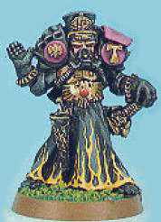
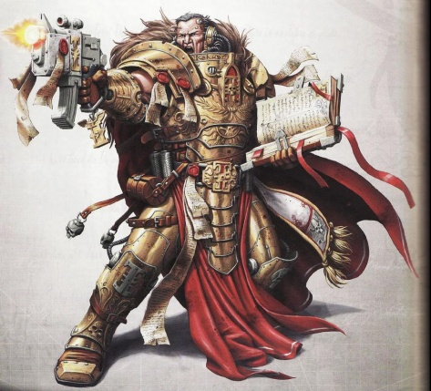
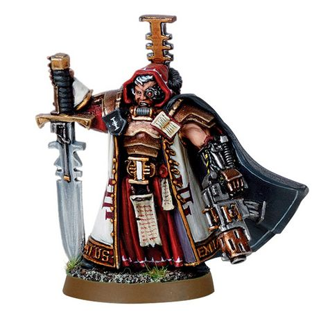
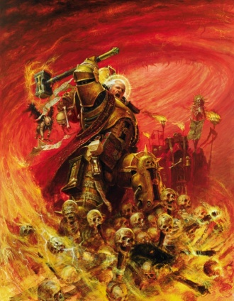

# 0100 恶魔审判庭 Ordo Malleus

精校状态：中文行文已逐段精校，部分术语仍为暂定

分类：通用概念 / 帝国 Imperium / 审判庭 Inquisition

原文来源：https://www.bilibili.com/opus/1144597888069795843

原作者：帝国神选罐头

原文时间：2025年12月10日 11:04

[返回分类目录](目录.md) · [全书目录](../../目录.md)

原篇名：圣锤修会 Ordo Malleus

<!-- A0100-B0001 -->
**英文原文**

The Ordo Malleus (literally meaning Order of the Hammer in Low Gothic) is one of the three major Ordos of the Inquisition. Based on the moons of Saturn it is tasked with the responsibility of investigating and destroying the physical manifestations of Chaos throughout the Imperium.

<!-- /A0100-B0001 -->

<!-- A0100-B0002 -->

原译文

圣锤修会（字面意思是低哥特语的铁锤修会）是三个审判庭主要修会之一。基地在土星的卫星，它的任务是调查和摧毁整个帝国中混沌的物理表现。

**校订译文**

恶魔审判庭是审判庭三大主要分支之一。Ordo Malleus 的字面含义为“铁锤修会”，低哥特语称 Order of the Hammer。其基地位于土星诸卫星，负责调查并消灭帝国境内混沌在物质世界中的显现。

**校注：** 此处 Order of the Hammer 是英文原文明确给出的词义解释，不是重复添加用户要求仅全书首次出现的原稿别名。

<!-- /A0100-B0002 -->

<!-- A0100-B0003 -->
**英文原文**

Known colloquially as Daemonhunters, the members of the Ordo Malleus are individuals of great strength of will, able to face the agents of Chaos without flinching. Due to the highly secretive nature of its mission and the great mental strength required to combat the forces of Chaos, the Ordo Malleus is by far the smallest major Order of the Inquisition. However, the strength of the inquisitors of the Ordo is bolstered by their Chamber Militant, the Grey Knights.

<!-- /A0100-B0003 -->

<!-- A0100-B0004 -->

原译文

圣锤修会的成员俗称恶魔猎手，他们意志坚强，能够毫不退缩地面对混沌的特工。由于其任务的高度保密性和与混沌部队作战所需的巨大精神力量，圣锤修会是迄今为止最小的审判庭主要修会。然而，修会的审判官的力量得到了他们的军事辅军灰骑士的支援。

**校订译文**

恶魔审判庭成员俗称恶魔猎手，意志极为坚强，面对混沌爪牙也毫不退缩。其任务高度保密，而对抗混沌又需要超常精神力量，因此它是三大主要分支中规模最小的一个。不过，军事辅军灰骑士为其审判官提供了强大支援。

<!-- /A0100-B0004 -->

<!-- A0100-B0005 图片 -->

<!-- A0100-B0006 -->

原译文

Inquisition symbol 审判庭标志

**校订译文**

Inquisition symbol 审判庭标志

<!-- /A0100-B0006 -->

<!-- A0100-B0007 -->
**英文原文**

Parent Agency:Inquisition

<!-- /A0100-B0007 -->

<!-- A0100-B0008 -->

原译文

隶属机构：审判庭

**校订译文**

隶属机构：审判庭

<!-- /A0100-B0008 -->

<!-- A0100-B0009 -->
**英文原文**

Headquarters:Moons of Saturn, Sol System

<!-- /A0100-B0009 -->

<!-- A0100-B0010 -->

原译文

总部：土星卫星，太阳系

**校订译文**

总部：土星卫星，太阳系

<!-- /A0100-B0010 -->

<!-- A0100-B0011 -->
**英文原文**

Leader:None (represented by Inquisitorial Representative)

<!-- /A0100-B0011 -->

<!-- A0100-B0012 -->

原译文

领袖：无（由审判官代表为代言人）

**校订译文**

领袖：无（由审判庭代表为代言人）

<!-- /A0100-B0012 -->

<!-- A0100-B0013 -->
**英文原文**

Armed Forces:Various Retinues, Inquisitorial Stormtroopers, Grey Knights

<!-- /A0100-B0013 -->

<!-- A0100-B0014 -->

原译文

武装部队：各种随从，审判庭风暴兵，灰骑士

**校订译文**

武装部队：各种随从，审判庭风暴兵，灰骑士

<!-- /A0100-B0014 -->

<!-- A0100-B0015 -->
**英文原文**

Established:End of the Horus Heresy (informally), 546.M32 (officially)

<!-- /A0100-B0015 -->

<!-- A0100-B0016 -->

原译文

建立时间：荷鲁斯叛乱结束（非正式），546.M32（正式）

**校订译文**

建立时间：荷鲁斯之乱结束（非正式），546.M32（正式）

<!-- /A0100-B0016 -->

<!-- A0100-B0017 -->
## History 历史

<!-- /A0100-B0017 -->

<!-- A0100-B0018 -->
**英文原文**

The Ordo Malleus is considered one of the oldest and most ancient arms of the Inquisition that was created by the decree of the Emperor prior to his internment and ascension to the Golden Throne of Terra. It was originally established to police the thoughts and deeds of the Imperium itself which meant it was charged with the purity of other Inquisitors. In the hours following the defeat of Warmaster Horus, and understanding the severity of his own wounds, the Emperor believed that others must fill his role guarding humanity from the Warp, to thwart the designs of the Chaos Gods.

<!-- /A0100-B0018 -->

<!-- A0100-B0019 -->

原译文

圣锤修会被认为是审判庭最老、最古的武装之一，是在帝皇被拘束并登上泰拉的黄金王座之前，根据帝皇的法令创建的。它最初是为了监督帝国本身的思想和行为而建立的，这意味着它被赋予其他审判官的纯洁。在战帅荷鲁斯战败后的几个小时里，帝皇意识到自己伤口的严重性，认为其他人必须扮演他的角色，保护人类免受亚空间，挫败混沌诸神的布局。

**校订译文**

恶魔审判庭被视为审判庭最古老的分支之一，据称由帝皇在被安置进泰拉黄金王座、升天之前下令建立。它最初负责监督帝国内部的思想与行为，包括维护其他审判官的纯洁。荷鲁斯战败后的数小时里，帝皇意识到自己的伤势严重，认为必须有人接过守护人类、抵御亚空间的职责，挫败混沌诸神的图谋。

<!-- /A0100-B0019 -->

<!-- A0100-B0020 图片 -->

<!-- A0100-B0021 -->

原译文

Ordo Malleus Inquisitor (Rogue Trader/Realm of Chaos era) 圣锤修会审判官（行商浪人/混沌领域时期）

**校订译文**

Ordo Malleus Inquisitor (Rogue Trader/Realm of Chaos era) 恶魔审判庭审判官（行商浪人/混沌领域时期）

<!-- /A0100-B0021 -->

<!-- A0100-B0022 -->
**英文原文**

They shall be My Hammer, the sword in My hand, the gauntlet about My fist, the bane of My foes and woes of the treacherous. When no others may stand beside them, they shall fight. Only the greatest shall enter their ranks, for unto them do I entrust stewardship over the Gates of Hell.

<!-- /A0100-B0022 -->

<!-- A0100-B0023 -->

原译文

他们将成为我的铁锤，我手中的利剑，我拳头上的臂铠，我敌人的灾祸，背叛者的痛苦。当没有其他人可以站在他们旁边时，他们将战斗。只有最伟大的人才会进入他们的行列，因为我把地狱之门的管理权委托给他们。

**校订译文**

他们将成为我的战锤、我掌中之剑、我拳上之铠，成为敌人的灾厄与叛徒的苦难。即使无人能够与他们并肩，他们也将奋战到底。唯有最杰出者方可加入，因为我将地狱之门的守卫之责托付于他们。

<!-- /A0100-B0023 -->

<!-- A0100-B0024 -->
**英文原文**

However 1,500 years later during the Imperium's near destruction in War of the Beast, the Inquisition's Daemonhunters based around Saturn were still a closely guarded secret, so much so that not even the High Lords knew of their existence. During the war the Inquisition was formally split between the Ordo Malleus and Ordo Xenos so that humanity could better prepare to face new threats. Following the death of one of original Inquisitors, Veritus, Inquisitorial Representative Wienand succeeded him and oversaw the formal founding of the order. To do this, she met with the first Grey Knights Supreme Grand Master Janus on Titan.

<!-- /A0100-B0024 -->

<!-- A0100-B0025 -->

原译文

然而，1500年后，在帝国在野兽战争中濒临毁灭期间，土星周围的审判庭的恶魔猎手仍然是一个严格保密的秘密，以至于连高领主都不知道他们的存在。战争期间，审判庭正式分裂为圣锤修会和攘外修会，以便人类能够更好地应对新的威胁。在最初的审判官之一维里图斯去世后，审判官代表维南德接替了他，并监督了该组织的正式成立。为此，她在泰坦上会见了第一位灰骑士至高大导师雅努斯。

**校订译文**

然而，一千五百年后，野兽战争使帝国濒临毁灭时，驻扎土星一带的恶魔猎手依旧严格保密，甚至连高领主也不知道他们存在。战争期间，审判庭正式划分为恶魔审判庭与异形审判庭，以更好地应对不同威胁。最早的审判官之一维里图斯死后，审判庭代表维南德接替其职责，主持该分支的正式建立。为此，她在泰坦会见了首任灰骑士至高大导师雅努斯。

<!-- /A0100-B0025 -->

<!-- A0100-B0026 -->
**英文原文**

The truth however is skewed, and historians and savants point to the Emperor's original declaration, known as the Charge of the Malleus, as the Ordo's founding moment. The Charge is written in gold over the Ultimate Gateway of the Malleus Fortress on Titan, and is reaffirmed by every Malleus member upon elevation to the rank of inquisitor. It is known that during the Great Crusade, the forces of the Emperor encountered many worlds that worshiped foul daemonic beings as gods. Such worlds were either cleansed or cast into the warp though those that were not were instead had their daemons imprisoned by psychic wards on that planet. Following this task, the Ordo Malleus created the Brotherhood of the Watch to guard these prison worlds.

<!-- /A0100-B0026 -->

<!-- A0100-B0027 -->

原译文

然而，事实是歪曲的，历史学家和学者指出，帝皇最初的宣告，即所谓的圣锤职责，是修会的建立时刻。这项职责是用黄金写在泰坦上的圣锤堡垒的终极之门上的，每一位圣锤成员在晋升为审判官时都会重申这一点。众所周知，在大远征，帝皇的部队遇到了许多将邪恶的恶魔视为神的世界。这样的世界要么被净化，要么被铸入亚空间，在那些没有被净化的世界，其恶魔反而被该行星上的灵能保护囚禁了起来。完成这项任务后，圣锤修会创建了守望兄弟会来守卫这些监狱世界。

**校订译文**

不过，关于创立时间的说法并不一致。历史学家与学者将帝皇最初颁布的“圣锤训令”视为真正的成立时刻。训令以金字铭刻在泰坦圣锤堡垒的终极之门上，每位成员晋升审判官时都须重申誓言。大远征中，帝皇军队曾遭遇许多将邪恶恶魔奉为神明的世界；其中一些被净化，另一些被抛入亚空间。未遭上述命运的世界，则用灵能封印将恶魔囚禁在当地。此后，恶魔审判庭创建守望兄弟会，负责看守这些监狱世界。

**校注：** 本段将某些处置归于大远征时期，又称之后由 Ordo Malleus 建立看守组织，与其正式成立时间存在版本层次差异；不自行补日期。

<!-- /A0100-B0027 -->

<!-- A0100-B0028 -->
**英文原文**

After 034.M38, the Hidden Masters of the Ordo Malleus knew the true name of the Daemon Prince Kernax Voldorius and seven of their number fell before his blade. During the notable Nexxas Exculpation, in M40.561, the Ordo was involved fighting against an incursion by the Emperor's Children Chaos Space Marines where they were opposed by an Imperial Guard Army corps. The corps successfully managed to fight off the invasion after which their forces suffered from orbital bombardment by the Ordo Malleus warship, which intended to eliminate anyone that had faced the forces of Chaos. Later Imperial records were altered to show that a renegade faction of Eldar were responsible for the destruction of the Imperial unit.

<!-- /A0100-B0028 -->

<!-- A0100-B0029 -->

原译文

034.M38之后，圣锤修会的隐蔽大师们知道了恶魔王子克纳克斯·沃尔多里乌斯的真实姓名，他们中的七个人倒在了他的刀刃前。在M40.561发生的著名的内克萨斯免责行动中，修会参与了对抗帝皇之子混乱星际战士的入侵，在那里他们遭到了帝国卫队的抵抗。部队成功击退了入侵，之后他们的部队遭受了圣锤修会战舰的轨道轰炸，该战舰旨在消灭任何面对混沌部队的人。后来，帝国的记录被修改，表明灵族的一个变节派系对帝国部队的毁灭负有责任。

**校订译文**

034.M38 之后，恶魔审判庭的隐秘大师掌握了恶魔亲王克纳克斯·沃尔多里乌斯的真名，其中七人却倒在他的刀下。561.M40 的内克萨斯赦罪行动中，恶魔审判庭参与对抗帝皇之子混沌星际战士的入侵，一支帝国卫队军级部队承担了抵抗。该军成功击退入侵后，却遭恶魔审判庭战舰轨道轰炸；审判庭意在消灭所有曾直接接触混沌力量的人。后来的帝国记录被篡改，将这支部队的毁灭归咎于灵族的一支叛离派系。

**校注：** 原译错误将帝国卫队写成抵抗恶魔审判庭；根据“该军击退入侵后遭灭口”上下文，抵抗对象是帝皇之子。true name 为恶魔“真名”，非一般真实姓名。

<!-- /A0100-B0029 -->

<!-- A0100-B0030 -->
**英文原文**

Following the creation of the Great Rift and subsequent Psychic Awakening, the Ordo Malleus now faces Daemonic threats and incursions on a scale previously unseen. To try and contain the mayhem, they have overseen the annihilation of billions of citizens.

<!-- /A0100-B0030 -->

<!-- A0100-B0031 -->

原译文

在大裂隙的创造和随后的灵能觉醒之后，圣锤修会现在面临着前所未有的恶魔威胁和入侵。为了控制混乱，他们监督了数十亿公民的毁灭。

**校订译文**

大裂隙形成并引发灵能觉醒后，恶魔审判庭面临前所未有的恶魔威胁与入侵规模。为遏止灾祸，他们已下令消灭数十亿帝国公民。

<!-- /A0100-B0031 -->

<!-- A0100-B0032 -->
## Role 角色

<!-- /A0100-B0032 -->

<!-- A0100-B0033 -->
**英文原文**

Being a division of the Inquisition, the Ordo Malleus consists of exceptional individuals who are involved in a covert war for Mankind's continued survival which has been the case for the last ten thousand years. As every Inquisitor has sworn oaths to defend the Imperium from its worst enemies, the members of the Ordo Malleus are concerned with eliminating the physical manifestation of Chaos itself. They have pledged their existence to the discovery and removing the threat of the daemonic, wherever it is found. To aid them, they have at their disposal every member of the Imperium and will not hesitate to requisition local troops at a moment's notice. They serve as an inner college within the ranks of the Imperium with its activities and very existence being shrouded in secrecy. The Ordo goes to great lengths to hide the existence of Chaos and its servants from the greater masses of Mankind with the Emperor as well as his advisors fearing the dangers of such knowledge. As such, when the Ordo Malleus is ever mentioned, it is referred to as being the watchdog of the Inquisition itself though its actual purpose as the Imperium's elite Daemonhunters is a much more serious and sinister matter.

<!-- /A0100-B0033 -->

<!-- A0100-B0034 -->

原译文

作为审判庭的一个分支，圣锤修会由参与人类持续生存的秘密战争的特殊个人组成，这是过去一万年的情况。由于每个审判官都宣誓要保护帝国免受其最坏敌人的侵害，因此圣锤修会的成员都关心消除混沌本身的物理表现。他们保证他们的存在是为了发现并消除恶魔的威胁，无论它在哪里被发现。为了帮助他们，他们可以支配帝国的每一名成员，并会在接到通知后毫不犹豫地征用当地军队。他们作为帝国内部的一个修会，其活动和存在都被保密。修会竭尽全力向更广大的人类隐瞒混沌及其仆人的存在，帝皇及其顾问担心这种知识的危险。因此，当提到圣锤修会时，它被称为审判庭本身的监督者，尽管它作为帝国精英恶魔猎手的实际目的是一个更严重和更险恶的问题。

**校订译文**

恶魔审判庭由非凡人物组成，一万年来始终为人类生存进行秘密战争。所有审判官都誓言抵御帝国最可怕的敌人，而这一分支专门消灭混沌在现实中的显现，毕生追查、铲除恶魔威胁，无论它出现在哪里。他们可以征用任何帝国臣民，必要时立即调动当地部队。这个内部核心组织的存在与活动均被严密隐藏。帝皇及其顾问畏惧混沌知识本身带来的危险，因此它竭力向人类大众隐瞒混沌及其仆从的存在。对外提及时，恶魔审判庭通常仅被称为审判庭自身的监督者；其作为帝国精锐恶魔猎手的真实使命，则更加严峻而阴暗。

<!-- /A0100-B0034 -->

<!-- A0100-B0035 图片 -->

<!-- A0100-B0036 -->

原译文

Ordo Malleus inquisitor 圣锤修会审判官

**校订译文**

Ordo Malleus inquisitor 恶魔审判庭审判官

<!-- /A0100-B0036 -->

<!-- A0100-B0037 -->
**英文原文**

Within the Inquisition, the Ordo Malleus forms a secret order with a very specific role as daemon hunters. As such, it is their duty to root out sources of daemonic activity and combating such forces in whatever form they take. This means that only the most mentally stalwart and physically strong of Inquisitors are able to conduct this duty. Their missions can see them engage their foes either in hand-to-hand fighting or battle them in the realm of mental energy which requires special abilities and powers. This means that the Inquisitors of the Ordo Malleus are mostly psykers and those who lack such abilities have tremendous mental resolve. As they are a hidden group, the identities of Ordo Malleus Inquisitors is kept secret though this not an easy task when fighting against daemons. When members of the Ordo must appear in the course of their investigations, they are allowed to adopt uniforms that hide their features which allows them to keep their true identities a secret.

<!-- /A0100-B0037 -->

<!-- A0100-B0038 -->

原译文

在审判庭内，圣锤修会组成了一个秘密组织，扮演着非常特殊的角色 — 恶魔猎手。因此，他们有责任根除恶魔活动的根源，并以任何形式打击这些部队。这意味着，只有精神上最坚定、身体最强壮的审判官才能履行这一职责。他们的任务可以让他们与敌人进行肉搏战，或者在需要特殊能力和力量的精神能量领域与他们作战。这意味着圣锤修会的审判官大多是灵能者，而那些缺乏这种能力的人有着巨大的精神决心。由于他们是一个隐藏的团体，圣锤修会审判官的身份是保密的，尽管在与恶魔作战时这不是一件容易的事。当修会的成员在调查过程中必须出现时，他们可以穿上隐藏自己特征的制服，这样他们就可以对自己的真实身份保密。

**校订译文**

恶魔审判庭是审判庭内部的秘密组织，职责明确：猎杀恶魔。它追查恶魔活动的源头，并对抗其一切表现形式。只有精神最坚韧、身体最强健的审判官，才足以承担这一使命。任务既可能要求近身肉搏，也可能发生在精神力量的层面，需要特殊能力。因此，其审判官大多是灵能者，缺乏灵能者则必须具备极强的意志。成员身份始终保密，尽管在与恶魔交战时维持秘密并不容易；调查中必须公开露面时，他们可以穿着遮蔽面貌的服装。

<!-- /A0100-B0038 -->

<!-- A0100-B0039 -->
**英文原文**

Only the Emperor and the Cyber-libraries of the Ordo Malleus have an accurate recollection of the events of the Horus Heresy. Among the targets of the Ordo include the raiders from the Traitor Legions, covens consisting of Chaos worshippers and the Sensei who are seen as a threat to the Imperium. It's known that only certain Inquisitors of the Ordo Malleus have been allowed entry into the Black Library of Chaos and they are always accompanied by Harlequins who keep a close eye on these visitors.

<!-- /A0100-B0039 -->

<!-- A0100-B0040 -->

原译文

只有帝皇和圣锤修会的智控图书馆对荷鲁斯叛乱事件有准确的回忆。修会的目标包括来自叛徒军团的袭击者、由混沌崇拜者组成的小集会和被视为帝国威胁的导师。众所周知，只有圣锤修会的某些审判官被允许进入混沌黑色图书馆，他们总是由密切关注这些访客的丑角陪同。

**校订译文**

按这一版本的记载，只有帝皇与恶魔审判庭的智控图书馆保存着对荷鲁斯之乱的准确记录。其追查对象包括叛徒军团的袭击者、混沌崇拜者结社，以及被视为帝国威胁的导师。只有个别恶魔审判庭审判官获准进入混沌黑图书馆，且始终由丑角陪同、严密监视。

**校注：** 此处“只有帝皇与图书馆准确知道叛乱”属于底稿引用版本的绝对化表述，与本书其他时期知识保存叙述可能不同，未按记忆改设定。

<!-- /A0100-B0040 -->

<!-- A0100-B0041 -->
**英文原文**

The power and authority of the Ordo Malleus extends beyond the nominal boundaries of the Inquisition, a jurisdictional extension known as the Malleus Remit. In events of grave emergency concerning potential daemonic threats, a Malleus Inquisitor may demand the services and resources of any Imperial servant or organisation, a request which may not be refused on pain of death. Even the High Lords of Terra and the Adeptus Astartes are beholden to follow the Malleus Remit without hesitation.

<!-- /A0100-B0041 -->

<!-- A0100-B0042 -->

原译文

圣锤修会的力量和权威超越了审判庭的名义边界，这是一种被称为圣锤职权的管辖范围。在涉及潜在恶魔威胁的严重紧急情况下，圣锤审判官可以要求任何帝国仆人或组织提供服务和资源，这一请求不得被拒绝，否则将面临死刑。即使是泰拉的高领主和阿斯塔特修会也有义务毫不犹豫地遵守圣锤职权。

**校订译文**

恶魔审判庭的权力超出审判庭通常的管辖界限，这种扩展授权称为“圣锤职权”。在涉及潜在恶魔威胁的重大紧急情况下，其审判官可要求任何帝国臣民或组织提供服务与资源，拒绝者可被处死。即使泰拉高领主与阿斯塔特修会，也有义务立即遵行。

<!-- /A0100-B0042 -->

<!-- A0100-B0043 -->
**英文原文**

In normal circumstances, the Ordo Malleus focuses its investigations toward two main threats:

<!-- /A0100-B0043 -->

<!-- A0100-B0044 -->

原译文

在正常情况下，圣锤修会将调查重点放在两个主要威胁上：

**校订译文**

在正常情况下，恶魔审判庭将调查重点放在两个主要威胁上：

<!-- /A0100-B0044 -->

<!-- A0100-B0045 -->
**英文原文**

The Daemon Without: daemons that have physically manifested in the material universe and mortals dedicated to the service of Chaos.

<!-- /A0100-B0045 -->

<!-- A0100-B0046 -->

原译文

外部恶魔：在物质宇宙中物理显现的恶魔和致力于服务混沌的凡人。

**校订译文**

外在恶魔：已在物质宇宙中显形的恶魔，以及效忠混沌的凡人。

<!-- /A0100-B0046 -->

<!-- A0100-B0047 -->
**英文原文**

The Daemon Within: inquisitors declared Extremis Diabolus for heretical actions.

<!-- /A0100-B0047 -->

<!-- A0100-B0048 -->

原译文

内部恶魔：审判官宣布极致恶行为异端行为。

**校订译文**

内在恶魔：因异端行为而被判定为“极恶者”（Extremis Diabolus）的审判官。

<!-- /A0100-B0048 -->

<!-- A0100-B0049 -->
**英文原文**

Inquisitors of the Ordo Malleus were permanently seconded to the Cadian military due to that world's proximity to the Eye of Terror which made its inhabitants susceptible to the influence of Chaos.

<!-- /A0100-B0049 -->

<!-- A0100-B0050 -->

原译文

由于这个世界靠近恐惧之眼，使其居民容易受到混沌的影响，因此圣锤修会的审判官被永久借调到卡迪亚军队。

**校订译文**

卡迪亚靠近恐惧之眼，居民容易受到混沌影响，因此恶魔审判庭曾长期派审判官驻于当地军队。

<!-- /A0100-B0050 -->

<!-- A0100-B0051 -->
## Organisation 组织

<!-- /A0100-B0051 -->

<!-- A0100-B0052 -->
**英文原文**

Unlike the Imperial Inquisition as a whole, the Ordo Malleus has a more rigid and formalised hierarchical structure. It is controlled by a council of 169 Masters, all of whom have the right to have a direct audience with the Emperor. Their authority even extends to the Inquisitorial Representative who has been, in the past, tried and executed by the Masters of the Ordo. Below the Masters are the Proctors and Proctors Minor with each being responsible as well as in control of a Chamber of the Ordo. The Chambers themselves are named after their founding Proctor and serve as the basic unit of the Ordo Malleus. Inquisitors Ordinary form the rank and file whilst a parallel organisation is the "Chambers Theoretical and Historical" that consists of Inquisitors Historical. Inquisitors Historical are formed from the older ranking members who are unable to continue their service either due to ill-health or because of infirmity. Instead, they are assigned research and collation projects at the Administratum Libraries. Within the Chambers, the numbers of Inquisitors Ordinary and Historical to only a few in number to hundreds. The Chambers Theoretical and Historical has only a few score members that are engaged in research and disputation whilst the Chambers Practical has hundreds who are responsible for sector establishments of the Ordo Malleus in the field.

<!-- /A0100-B0052 -->

<!-- A0100-B0053 -->

原译文

与整个帝国审判庭不同，圣锤修会的等级结构更加僵化和正式。它由169名大师组成的议会控制，所有大师都有权直接与帝皇会面。他们的权力甚至延伸到过去曾被修会大师审判和处决的审判官代表。在大师下面是监督者和次级监督者，每个监督者都负责并控制一个修会庭。庭本身以其监督者创始人的名字命名，是圣锤修会的基本单位。常规审判官构成了行列与队伍，而与之并行的一个组织是 “理论与历史庭”，该庭由历史审判官组成。历史审判官由因健康状况不佳或身体虚弱而无法继续服役的年长成员组成。相反，他们被分配到行政图书馆进行研究和整理项目。在庭内，常规和历史审判官的数量只有从少数到数百人。理论与历史庭只有少数成员从事研究和辩论，而实践庭有数百名成员负责该领域的圣锤修会的星区机构。

**校订译文**

与整个审判庭相比，恶魔审判庭在这一组织设定中拥有更严格、正式的等级体系。最高权力由一百六十九名大师组成的议会掌握，各人都有权直接觐见帝皇，其权限甚至及于审判庭代表；历史上，代表曾被他们审判并处决。大师之下是监督者与次级监督者，各掌管一个以创立者命名的分庭，构成恶魔审判庭的基本单位。常规审判官是其中的主力，另有由历史审判官组成的平行机构“理论与历史庭”。历史审判官多为因疾病或衰弱而无法继续外勤的年长成员，转赴内政部图书馆从事研究与资料整理。各分庭的常规和历史审判官人数可从寥寥数人到数百人不等。理论与历史庭通常有数十名成员，负责研究和论辩；行动庭则有数百人，负责恶魔审判庭设于各星区的实地机构。

**校注：** 一百六十九名大师等严密层级，与本书审判庭总体松散组织及本篇信息栏“无领袖”存在旧版设定差异；此段保留所给英文，不将其强行整合为统一现代制度。few score 为数十，原译“少数”遗漏量级。

<!-- /A0100-B0053 -->

<!-- A0100-B0054 图片 -->

<!-- A0100-B0055 -->

原译文

Ordo Malleus Inquisitor 圣锤修会审判官

**校订译文**

Ordo Malleus Inquisitor 恶魔审判庭审判官

<!-- /A0100-B0055 -->

<!-- A0100-B0056 -->
**英文原文**

The Ordo Malleus works directly under the Emperor's Warrant and thus has a completely free hand in its operations. This means that an Inquisitor Ordinary of this Ordo is able to demand anything he sees fit in order to accomplish his duty with no explanation being offered. Any Imperial servant that meets with an Ordo Inquisitor must comply and obey their command. The most common demand is for troops to support their operations though such forces never survive in the service of an Inquisitor Ordinary. However, honours are given to units that are attached to the Ordo Malleus should they die in their service.

<!-- /A0100-B0056 -->

<!-- A0100-B0057 -->

原译文

圣锤修会直接在帝皇的授权下工作，因此可以完全自由地运作。这意味着，该修会的常规审判官可以要求任何他认为合适的东西来完成他的职责，而无需提供任何解释。任何与修会审判官会面的帝国仆人都必须服从他们的命令。最常见的要求是部队支援他们的行动，尽管这些部队从未在常规审判官的服役中幸存下来。然而，如果圣锤修会的附属单位在服役中牺牲，他们将获得荣誉。

**校订译文**

恶魔审判庭直接依据帝皇的授权行动，拥有充分自主权。常规审判官为完成使命，可提出任何自认必要的要求，无须解释理由；帝国臣民必须服从。最常见的要求是调派部队支援。不过，按本段所述保密政策，受征调部队最终无人能够生还；为其效力而死的单位则会获授荣誉。

<!-- /A0100-B0057 -->

<!-- A0100-B0058 -->
**英文原文**

Members of the Ordo tend to favour simple yet sinister uniforms with black, loose-fitting habits over their armour along with large hoods that hide their features in shadows. Graphic electoos are an unofficial yet traditional addition to their uniform with their appearance beneath the skin being a disturbing quality to outsiders. By tradition, Inquisitors of the Ordo Malleus tend to have one electoo for each coven member that they have discovered and cleansed though its not uncommon for some of their number to be covered with elaborate designs all across their body. The designs of the electoos have been fixed for generations with the motiffs being variations of the Ordo Malleus's enemies namely daemonic in nature. The badge of the Ordo takes the form of the Imperial eagle holding a rod and an axe which is worn either on the shoulder or on the right breast. Masters and Proctors are always psykers who carry force rods as a symbol of their authority, though in combat engagements this is supplemented with a power axe.

<!-- /A0100-B0058 -->

<!-- A0100-B0059 -->

原译文

修会的成员倾向于喜欢简单而险恶的制服，盔甲为黑色并有宽松的穿着习惯，还有在阴影中隐藏自己特征的大兜帽。图像电子纹身是制服的非官方但传统的补充，它们在皮肤下的外观对外人来说是一种令人不安的特征。按照传统，圣锤修会的审判官通常每发现并清洗一名集会成员，便会纹上一个电子纹身，尽管他们中的一些人全身都覆盖着精心设计的图案并不罕见。电子纹身的设计已经固定了几代人，其主题是圣锤修会敌人的变体，即自然恶魔。修会徽章的形式是帝国天鹰拿着一根杖和一把斧，戴在肩膀或右胸上。大师和监督者总是灵能者，他们携带灵能杖作为权威的象征，尽管在战斗中，这会辅以动力斧。

**校订译文**

成员偏好简朴却阴森的服装，在装甲外罩宽松黑袍，再用巨大兜帽将面容藏进阴影。电子纹身并非正式制服的一部分，却是长期传统；图案在皮下显现，使外人感到不安。按照惯例，每查获并清除一名邪教结社成员，审判官便增加一处电子纹身，因此全身布满繁复图案者并不少见。纹样传承数代，主要以其敌人——恶魔——的各种形象为主题。徽章是一只持杖与斧的帝国天鹰，佩于肩部或右胸。大师与监督者均为灵能者，携带灵能杖象征权威，战时则另配动力斧。

<!-- /A0100-B0059 -->

<!-- A0100-B0060 -->
## Military forces 军事部队

<!-- /A0100-B0060 -->

<!-- A0100-B0061 -->
**英文原文**

The armies of the Ordo Malleus are small, as only a select few individuals are trusted by the Inquisition with extensive knowledge of Chaos. Daemonhunter strike forces usually consist only of a Malleus inquisitor, the inquisitor's personal retinue, and as many Grey Knights as can be spared.

<!-- /A0100-B0061 -->

<!-- A0100-B0062 -->

原译文

圣锤修会的军队很小，因为只有少数人被审判庭信任，对混沌有着广泛的了解。恶魔猎手打击部队通常只由圣锤审判官、审判官的个人随从和尽可能多的灰骑士组成。

**校订译文**

恶魔审判庭的直属军队规模很小，因为审判庭只信任极少数人，允许他们深入了解混沌。恶魔猎手打击队通常由一名恶魔审判庭审判官、其私人随从，以及能够抽调的灰骑士组成。

<!-- /A0100-B0062 -->

<!-- A0100-B0063 图片 -->

<!-- A0100-B0064 -->

原译文

Daemonhunter in full battle regalia 恶魔猎手身着战斗服

**校订译文**

Daemonhunter in full battle regalia 恶魔猎手身着战斗服

<!-- /A0100-B0064 -->

<!-- A0100-B0065 -->
**英文原文**

In battle, the greatest advantage of any Malleus force lies in the specialised and consecrated weaponry available to it. Utilising techniques and metallurgy lost to the rest of the Imperium, Malleus savants and allied Tech-priests produce and maintain immensely powerful arms and armour specifically designed to combat the daemonic. In addition to this equipment, the Malleus Remit allows any Daemonhunter strike force to be bolstered by units from the Adeptus Astartes, the Imperial Guard, and the Officio Assassinorum.

<!-- /A0100-B0065 -->

<!-- A0100-B0066 -->

原译文

在战斗中，任何圣锤部队的最大优势在于其可用的专业和神圣武器。圣锤学者和盟友技术神甫利用帝国其他人失去的技术和冶金学，生产和维护专门用于对抗恶魔的强大武器和盔甲。除了这些装备外，圣锤职权还允许任何恶魔猎手打击部队得到来自法务部、帝国卫队和刺客庭的部队的支援。

**校订译文**

其部队最大的战场优势，是专门研制并经过祝圣的武器。恶魔审判庭学者与合作的技术祭司，掌握帝国其他地方已失传的技术和冶金工艺，能制造、维护专门对抗恶魔的强大武器与装甲。除此之外，圣锤职权还允许打击队征调阿斯塔特修会、帝国卫队和刺客庭的部队作为增援。

**校注：** 英文 Adeptus Astartes 明指星际战士组织，原译法务部是错译。

<!-- /A0100-B0066 -->

<!-- A0100-B0067 -->
**英文原文**

Only the ranks of the Grey Knights are expected to survive in the service to the Ordo Malleus. All other troops that are seconded to the Ordo end up dying in this duty. The simple reason for the high rate of deaths within military units attached to the Daemonhunters is due to their exposure to the daemonic. Thus, they become privy to one of the Imperium's most closely guarded secrets namely the existence of Chaos and of Daemons. As their duty is to hide this threat from the Imperium, the Ordo Malleus has any surviving troopers being executed following a campaign or battle. Those that are killed receive full honours shortly after their elimination. Ultimately, all such regiments and corps are seen as expendable which means that they are terminated after the completion of their duty.

<!-- /A0100-B0067 -->

<!-- A0100-B0068 -->

原译文

预计只有灰骑士的成员才能在圣锤修会的服役中幸存下来。所有借调到修会的其他部队最终都死于职责。附属于恶魔猎手的军事单位内死亡率高的简单原因是他们接触了恶魔。因此，他们了解了帝国最严密保密的秘密之一，即混沌和恶魔的存在。由于他们的职责是向帝国隐瞒这一威胁，因此圣锤修会在战役或战斗后会处决任何幸存的士兵。那些被杀害的人在被消灭后不久就会获得全部荣誉。最终，所有这些兵团和军队都被视为可消耗的，这意味着它们在完成职责后被终结。

**校订译文**

按此处所述的保密政策，只有灰骑士被预期能够在为恶魔审判庭效力后生还，其他借调部队最终都会死去。原因是他们已经接触恶魔，知晓了帝国最严密保守的秘密之一：混沌与恶魔确实存在。为掩盖这一事实，恶魔审判庭会在战役或战斗结束后处死幸存士兵，再追授完整荣誉。这些团和军级部队都被视为可牺牲力量，任务完成后便予以清除。

**校注：** 本段与下一段星际战士获豁免的说明，以及后期混沌公开化背景之间有适用范围差异。按来源版本保留灭口政策，不能据此推定所有时期、所有实例绝无例外。

<!-- /A0100-B0068 -->

<!-- A0100-B0069 -->
**英文原文**

The exceptions to this secrecy-by-extermination policy are units from the Adeptus Astartes which is the case only because the execution of a Space Marine is seen as being wasteful. Those Astartes serving with the Ordo Malleus are mindscrubbed in order to remove any memory of the Ordo's true purpose. Ultimately, only the Grey Knights are allowed to retain their memories of their duty with the Ordo Malleus as their centuries of service has shown that they can keep the secret of the hidden war against the daemonic forces of Chaos.

<!-- /A0100-B0069 -->

<!-- A0100-B0070 -->

原译文

这种灭绝保密政策的例外是阿斯塔特修会的单位，这只是因为处决一名星际战士被视为浪费。那些为圣锤修会服务的阿斯塔特被洗脑，以消除对圣锤修会真正目的的任何记忆。最终，只有灰骑士才被允许保留他们对在圣锤修会的职责的记忆，因为他们几个世纪的服役表明，他们可以保守与混沌恶魔部队的隐秘战争的秘密。

**校订译文**

以灭口保密的政策，对阿斯塔特修会存在例外，因为处决星际战士被视为过度浪费。参与行动的星际战士会接受记忆清除，忘记恶魔审判庭的真实使命。只有灰骑士可以保留相关记忆，因为数百年的服役证明，他们能够守住这场对抗混沌恶魔的秘密战争。

<!-- /A0100-B0070 -->

<!-- A0100-B0071 -->
### Grey Knights 灰骑士

<!-- /A0100-B0071 -->

<!-- A0100-B0072 -->
**英文原文**

Extensively trained to fight the daemon, the Grey Knights alone bear the full knowledge of the nature of Chaos. They are the most powerful force the Ordo Malleus can bring to bear, above even Exterminatus, and may only be deployed at the command of a Malleus Grandmaster, as the life of a single Grey Knight is considered to be an infinitely precious resource.

<!-- /A0100-B0072 -->

<!-- A0100-B0073 -->

原译文

经过广泛的与恶魔战斗的训练，灰骑士对混沌的本质有着全面的了解。他们是圣锤修会能带来的最强大的部队，甚至超过了灭绝令，而且只能在圣锤大导师的指挥下部署，因为一个灰骑士的生命被认为是一种无限宝贵的资源。

**校订译文**

灰骑士接受过全面的恶魔作战训练，独自掌握有关混沌本质的完整知识。按本段记载，他们是恶魔审判庭能够动用的最强力量，重要性甚至高于灭绝令。每名灰骑士的生命都无比珍贵，只有恶魔审判庭大导师有权下令部署。

<!-- /A0100-B0073 -->

<!-- A0100-B0074 -->
**英文原文**

Millennia-old aegis armor inscribed with wards protects the bodies and souls of the Grey Knights against physical, psychic, or daemonic assault. The faith of Grey Knights, combined with their innate psychic talents, is so pure that it can cause daemons physical damage and pain and weaken their ties to the material realm. A Grey Knight's standard weapons include thrice-blessed Storm bolters and Nemesis force weapons.

<!-- /A0100-B0074 -->

<!-- A0100-B0075 -->

原译文

刻有保护的千年神盾盔甲保护灰骑士的身体和灵魂免受物理、灵能或恶魔的攻击。灰骑士的信仰，结合他们与生俱来的灵能天赋，是如此纯粹，以至于它会给恶魔造成身体伤害和痛苦，削弱他们与物质领域的联系。灰骑士的标准武器包括三重祝福的风暴爆矢枪和复仇女神灵能武器。

**校订译文**

传承数千年、铭刻防护符文的神盾甲，保护灰骑士的肉体与灵魂，抵御实体、灵能和恶魔攻击。他们纯净的信仰与天生灵能相结合，能够直接使恶魔受伤、痛苦，并削弱其与物质世界的联系。标准武器包括经过三重祝圣的风暴爆矢枪，以及复仇女神灵能武器。

<!-- /A0100-B0075 -->

<!-- A0100-B0076 -->
## Notable Members 著名成员

<!-- /A0100-B0076 -->

<!-- A0100-B0077 -->
### Inquisitor Lords 领主审判官

原题：Inquisitor Lords 审判官领主

<!-- /A0100-B0077 -->

<!-- A0100-B0078 -->

原译文

Antonius Coil 安东尼厄斯·科伊尔

**校订译文**

Antonius Coil 安东尼厄斯·科伊尔

<!-- /A0100-B0078 -->

<!-- A0100-B0079 -->

原译文

Hector Rex 赫克托·雷克斯

**校订译文**

Hector Rex 赫克托·雷克斯

<!-- /A0100-B0079 -->

<!-- A0100-B0080 -->

原译文

Ghankus Dhar 甘库斯·达尔

**校订译文**

Ghankus Dhar 甘库斯·达尔

<!-- /A0100-B0080 -->

<!-- A0100-B0081 -->

原译文

Torquemada Coteaz 托克玛达·科泰兹

**校订译文**

Torquemada Coteaz 托尔克马达·克提兹

<!-- /A0100-B0081 -->

<!-- A0100-B0082 -->

原译文

Raiven 瑞文

**校订译文**

Raiven 瑞文

<!-- /A0100-B0082 -->

<!-- A0100-B0083 -->

原译文

Hephaestos Grudd 赫菲斯托斯·格鲁德

**校订译文**

Hephaestos Grudd 赫菲斯托斯·格鲁德

<!-- /A0100-B0083 -->

<!-- A0100-B0084 -->

原译文

Marchant 马钱特

**校订译文**

Marchant 马钱特

<!-- /A0100-B0084 -->

<!-- A0100-B0085 -->

原译文

Laredian 拉瑞丹

**校订译文**

Laredian 拉瑞丹

<!-- /A0100-B0085 -->

<!-- A0100-B0086 -->

原译文

Kavnar 卡夫纳尔

**校订译文**

Kavnar 卡夫纳尔

<!-- /A0100-B0086 -->

<!-- A0100-B0087 -->
**英文原文**

Iulia Lestia — Inquisitorial Representative

<!-- /A0100-B0087 -->

<!-- A0100-B0088 -->

原译文

尤利娅·莱斯蒂亚 — 审判官代表

**校订译文**

尤利娅·莱斯蒂亚 — 审判庭代表

<!-- /A0100-B0088 -->

<!-- A0100-B0089 -->
**英文原文**

Kleopatra Arx — Inquisitorial Representative

<!-- /A0100-B0089 -->

<!-- A0100-B0090 -->

原译文

克利奥帕特拉·阿克斯 — 审判官代表

**校订译文**

克利奥帕特拉·阿克斯——审判庭代表

<!-- /A0100-B0090 -->

<!-- A0100-B0091 -->
### Inquisitors 审判官

<!-- /A0100-B0091 -->

<!-- A0100-B0092 -->

原译文

Ahmazzi 艾哈迈齐

**校订译文**

Ahmazzi 阿赫马兹

<!-- /A0100-B0092 -->

<!-- A0100-B0093 -->

原译文

Annika Jarlsdottyr 安妮卡·贾尔斯多蒂尔

**校订译文**

Annika Jarlsdottyr 安妮卡·贾尔斯多蒂尔

<!-- /A0100-B0093 -->

<!-- A0100-B0094 -->

原译文

Briseis Ligeia 布里塞斯·利盖娅

**校订译文**

Briseis Ligeia 布里塞斯·利盖娅

<!-- /A0100-B0094 -->

<!-- A0100-B0095 -->

原译文

Cataclis 卡塔克利斯

**校订译文**

Cataclis 卡塔克利斯

<!-- /A0100-B0095 -->

<!-- A0100-B0096 -->

原译文

Caspiel Rex 卡斯皮尔·雷克斯

**校订译文**

Caspiel Rex 卡斯皮尔·雷克斯

<!-- /A0100-B0096 -->

<!-- A0100-B0097 -->

原译文

Cartensus 卡尔滕苏斯

**校订译文**

Cartensus 卡尔滕苏斯

<!-- /A0100-B0097 -->

<!-- A0100-B0098 -->

原译文

Cherone 切罗内

**校订译文**

Cherone 切罗内

<!-- /A0100-B0098 -->

<!-- A0100-B0099 -->

原译文

Commodus Voke 康茂德·沃克

**校订译文**

Commodus Voke 康茂德·沃克

<!-- /A0100-B0099 -->

<!-- A0100-B0100 -->

原译文

Arrod Moadh 阿罗德·莫阿德

**校订译文**

Arrod Moadh 阿罗德·莫阿德

<!-- /A0100-B0100 -->

<!-- A0100-B0101 -->

原译文

Damarn 达马尔恩

**校订译文**

Damarn 达马尔恩

<!-- /A0100-B0101 -->

<!-- A0100-B0102 -->

原译文

Dargo 达尔戈

**校订译文**

Dargo 达尔戈

<!-- /A0100-B0102 -->

<!-- A0100-B0103 -->

原译文

Erasmus Cartavolnus 伊拉斯谟·卡塔沃努斯

**校订译文**

Erasmus Cartavolnus 埃拉斯姆斯·卡塔沃努斯

<!-- /A0100-B0103 -->

<!-- A0100-B0104 -->

原译文

Evangelyne Karlzan 伊万杰琳·卡尔赞

**校订译文**

Evangelyne Karlzan 伊万杰琳·卡尔赞

<!-- /A0100-B0104 -->

<!-- A0100-B0105 -->

原译文

Jaq Draco 雅克·德拉科

**校订译文**

Jaq Draco 雅克·德拉科

<!-- /A0100-B0105 -->

<!-- A0100-B0106 -->

原译文

Gholic Ren-Sar Valinov 戈利克·伦-萨尔·瓦利诺夫

**校订译文**

Gholic Ren-Sar Valinov 戈利克·伦-萨尔·瓦利诺夫

<!-- /A0100-B0106 -->

<!-- A0100-B0107 -->

原译文

Kartha Vakir 卡尔萨·瓦基尔

**校订译文**

Kartha Vakir 卡尔萨·瓦基尔

<!-- /A0100-B0107 -->

<!-- A0100-B0108 -->
**英文原文**

Lias du Ortise — known by his/her quote

<!-- /A0100-B0108 -->

<!-- A0100-B0109 -->

原译文

利亚斯·迪·奥尔蒂斯 — 以他/她的名言而闻名

**校订译文**

利亚斯·迪·奥尔蒂斯——因所留名言而知名，性别不详。

<!-- /A0100-B0109 -->

<!-- A0100-B0110 -->

原译文

Leonid Osma 列昂尼德·奥斯马

**校订译文**

Leonid Osma 列昂尼德·奥斯马

<!-- /A0100-B0110 -->

<!-- A0100-B0111 -->

原译文

Miranda Blithia 米兰达·布利西亚

**校订译文**

Miranda Blithia 米兰达·布利西亚

<!-- /A0100-B0111 -->

<!-- A0100-B0112 -->

原译文

Morteshadow 死亡暗影

**校订译文**

Morteshadow 死亡暗影

<!-- /A0100-B0112 -->

<!-- A0100-B0113 -->

原译文

Vincenze Farradocias Kazymar 文森泽·法拉多西亚斯·卡齐马尔

**校订译文**

Vincenze Farradocias Kazymar 文森泽·法拉多西亚斯·卡齐马尔

<!-- /A0100-B0113 -->

<!-- A0100-B0114 -->

原译文

Namira Suzaku 纳米拉·朱雀

**校订译文**

Namira Suzaku 纳米拉·朱雀

<!-- /A0100-B0114 -->

<!-- A0100-B0115 -->

原译文

Octus Enoch 奥克图斯·伊诺克

**校订译文**

Octus Enoch 奥克图斯·伊诺克

<!-- /A0100-B0115 -->

<!-- A0100-B0116 -->

原译文

Danicha Hest 丹尼查·赫斯特

**校订译文**

Danicha Hest 丹尼查·赫斯特

<!-- /A0100-B0116 -->

<!-- A0100-B0117 -->

原译文

Galan Noirgrim 加兰·诺格里姆

**校订译文**

Galan Noirgrim 加兰·诺格里姆

<!-- /A0100-B0117 -->

<!-- A0100-B0118 -->

原译文

Praxus 普拉克斯

**校订译文**

Praxus 普拉克斯

<!-- /A0100-B0118 -->

<!-- A0100-B0119 -->

原译文

Quixos 奎克索斯

**校订译文**

Quixos 奎克索斯

<!-- /A0100-B0119 -->

<!-- A0100-B0120 -->

原译文

Saffor Sengir 萨弗·森吉尔

**校订译文**

Saffor Sengir 萨弗·森吉尔

<!-- /A0100-B0120 -->

<!-- A0100-B0121 -->

原译文

Sythra Min 赛思拉·明

**校订译文**

Sythra Min 赛思拉·明

<!-- /A0100-B0121 -->

<!-- A0100-B0122 -->

原译文

Suresya 苏雷西亚

**校订译文**

Suresya 苏雷西亚

<!-- /A0100-B0122 -->

<!-- A0100-B0123 -->

原译文

Thanst Rendars-Mao 桑斯特·伦达斯-毛

**校订译文**

Thanst Rendars-Mao 桑斯特·伦达斯-毛

<!-- /A0100-B0123 -->

<!-- A0100-B0124 -->

原译文

Vokes 沃克斯

**校订译文**

Vokes 沃克斯

<!-- /A0100-B0124 -->

<!-- A0100-B0125 -->

原译文

Ivon Gerat 伊冯·格拉特

**校订译文**

Ivon Gerat 伊冯·格拉特

<!-- /A0100-B0125 -->

<!-- A0100-B0126 -->

原译文

Frenza 弗伦扎

**校订译文**

Frenza 弗伦扎

<!-- /A0100-B0126 -->

<!-- A0100-B0127 -->
**英文原文**

Vult - Inquisitorial Representative

<!-- /A0100-B0127 -->

<!-- A0100-B0128 -->

原译文

兀鹫 - 审判官代表

**校订译文**

武尔特——审判庭代表

<!-- /A0100-B0128 -->

本篇核心术语与暂定项

以下列出本篇出现的英文原形及核心术语表用词。同形词可能指不同对象，具体词义以本篇正文和校注为准；单复数、别名和仅见于图注的名称可能尚未列入。完整候选见[术语表](../../术语表/双语术语候选.csv)。

| 英文 | 采用中文 | 状态 |
| --- | --- | --- |
| Space Marines | 星际战士 | 官方已核对 |
| Adeptus Astartes | 阿斯塔特修会 | 官方已核对 |
| Grey Knights | 灰骑士 | 官方已核对 |
| Imperial Guard | 帝国卫队 | 暂定·语境区分 |
| Chaos Space Marines | 混沌星际战士 | 官方已核对 |
| Eldar | 灵族 | 暂定·语境区分 |
| Horus Heresy | 荷鲁斯之乱 | 官方已核对 |
| Warp | 亚空间 | 官方已核对 |
| Great Rift | 大裂隙 | 官方已核对 |
| Inquisition | 审判庭 | 暂定 |
| Inquisitor | 审判官 | 官方已核对 |
| Imperium | 帝国 | 暂定·简称 |
| Equipment | 装备 | 编辑用语已统一 |
| Administratum | 内政部 | 暂定 |
| Eye of Terror | 恐惧之眼 | 官方已核对 |
| Ordo Malleus | 恶魔审判庭 | 用户指定 |
| Emperor | 帝皇 | 官方已核对 |
| Officio Assassinorum | 刺客庭 | 暂定·官方待核 |
| Daemon Prince | 恶魔亲王 | 官方已核对 |
| Emperor's Children | 帝皇之子 | 官方已核对 |
| The Order | 秩序 | 暂定·官方待核 |
| Great Crusade | 大远征 | 暂定·官方待核 |
| Terra | 泰拉 | 暂定·官方待核 |
| Horus | 荷鲁斯 | 暂定·官方待核 |
| The Brotherhood | 兄弟会 | 暂定·官方待核 |
| High Lords of Terra | 泰拉高领主 | 暂定·官方待核 |
| Ordo Xenos | 异形审判庭 | 用户指定 |
| Golden Throne | 黄金王座 | 暂定·官方待核 |
| Inquisitorial Stormtroopers | 审判庭风暴兵 | 暂定·官方待核 |
| Sector | 星区 | 暂定·官方待核 |
| Low Gothic | 低哥特语 | 暂定·官方待核 |
| Sensei | 导师 | 暂定·官方待核 |
| Brotherhood | 兄弟会 | 暂定·官方待核 |
| Titan | 泰坦 | 暂定·官方待核 |
| Tech | 技术语 | 暂定·官方待核 |
| Inquisitorial Representative | 审判庭代表 | 暂定 |
| Grandmaster | 大导师 | 暂定 |
| Master | 导师（审判庭职衔）／舰务官（舰员职务） | 语境定译·官方待核 |
| Mission | 教团／传教机构 | 暂定 |
| Ancient | 旗手 | 官方已核对 |
| Kleopatra Arx | 克利奥帕特拉·阿克斯 | 暂定·官方待核 |
| Charge of the Malleus | 圣锤训令 | 暂定·官方待核 |
| Malleus Remit | 圣锤职权 | 暂定·官方待核 |
| Extremis Diabolus | 极恶者 | 暂定·官方待核 |
| Nexxas Exculpation | 内克萨斯赦罪行动 | 暂定·官方待核 |
| Chambers Practical | 行动庭 | 暂定·官方待核 |
| Chambers Theoretical and Historical | 理论与历史庭 | 暂定·官方待核 |
| Vult | 武尔特 | 暂定·官方待核 |
| Founding | 建军 | 暂定·官方待核 |
| Sol | 太阳系 | 暂定·官方待核 |
| Space Marine | 星际战士 | 暂定·官方待核 |
| Nemesis | 复仇女神 | 暂定·官方待核 |
| Supreme Grand Master | 至高大导师 | 暂定·官方待核 |
| Powers | 能天使 | 暂定·官方待核 |
| Kernax Voldorius | 克纳克斯·沃尔多里乌斯 | 暂定·官方待核 |
| Xenos | 异形 | 暂定·官方待核 |
| The Beast | 野兽 | 暂定·官方待核 |
| Grand Master | 大导师 | 暂定·官方待核 |
| Janus | 雅努斯 | 暂定·官方待核 |
| Bear | 熊 | 暂定·官方待核 |
| Wienand | 维南德 | 暂定·官方待核 |
| Veritus | 维瑞图斯 | 暂定·官方待核 |
| System | 星系（恒星系统） | 暂定·官方待核 |
| Force Weapons | 灵能武器 | 暂定·官方待核 |
| Electoos | 源力回路 | 暂定·官方待核 |
| Black Library of Chaos | 混沌黑图书馆 | 暂定·官方待核 |
| Black Library | 黑图书馆 | 暂定·官方待核 |
| Saturn | 土星 | 暂定·官方待核 |
| Sol System | 太阳系 | 暂定·官方待核 |

