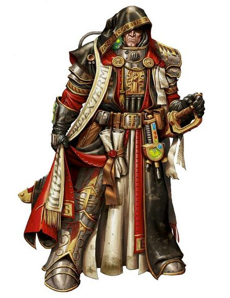

# 0101 异形审判庭 Ordo Xenos

精校状态：中文行文已逐段精校，部分术语仍为暂定

分类：通用概念 / 帝国 Imperium / 审判庭 Inquisition

原文来源：https://www.bilibili.com/opus/1144265638015926274

原作者：帝国神选罐头

原文时间：2025年12月09日 13:35

[返回分类目录](目录.md) · [全书目录](../../目录.md)

原篇名：攘外修会 Ordo Xenos

<!-- A0101-B0001 -->
**英文原文**

"Compassion is reserved for servants of the Emperor: aliens deserve only our scorn." - Inquisitor Czevak, Teachings on the Unholy.

<!-- /A0101-B0001 -->

<!-- A0101-B0002 -->

原译文

“同情只留给帝皇的仆人：异型只值得我们的蔑视。” - 审判官切瓦克，关于邪恶的教诲。

**校订译文**

“同情只留给帝皇的仆人；异形只配得到我们的蔑视。”——审判官切瓦克，《论不洁之物》。

<!-- /A0101-B0002 -->

<!-- A0101-B0003 -->
**英文原文**

The Ordo Xenos is one of the three major Ordos of the Inquisition, dedicated to countering the threat of alien species. Their military arm is the Deathwatch.

<!-- /A0101-B0003 -->

<!-- A0101-B0004 -->

原译文

攘外修会是三个审判庭主要修会之一，致力于对抗异型物种的威胁。他们的军事武装是死亡守望者。

**校订译文**

异形审判庭是审判庭的三大分支之一，专门应对异形物种的威胁，其军事武装为死亡守望。

<!-- /A0101-B0004 -->

<!-- A0101-B0005 图片 -->

<!-- A0101-B0006 -->

原译文

Inquisition symbol 审判庭标志

**校订译文**

Inquisition symbol 审判庭标志

<!-- /A0101-B0006 -->

<!-- A0101-B0007 -->
**英文原文**

Parent Agency:Inquisition

<!-- /A0101-B0007 -->

<!-- A0101-B0008 -->

原译文

隶属机构：审判庭

**校订译文**

隶属机构：审判庭

<!-- /A0101-B0008 -->

<!-- A0101-B0009 -->
**英文原文**

Leader:None (represented by Inquisitorial Representative)

<!-- /A0101-B0009 -->

<!-- A0101-B0010 -->

原译文

领袖：无（由审判官代表作为代言人）

**校订译文**

领袖：无（由审判官代表作为代言人）

<!-- /A0101-B0010 -->

<!-- A0101-B0011 -->
**英文原文**

Armed Forces:Various Retinues, Inquisitorial Stormtroopers, Deathwatch

<!-- /A0101-B0011 -->

<!-- A0101-B0012 -->

原译文

武装部队：各种随从，审判庭风暴兵，死亡守望

**校订译文**

武装部队：各种随从，审判庭风暴兵，死亡守望

<!-- /A0101-B0012 -->

<!-- A0101-B0013 -->
**英文原文**

Established:546.M32

<!-- /A0101-B0013 -->

<!-- A0101-B0014 -->

原译文

建立时间：546.M32

**校订译文**

建立时间：546.M32

<!-- /A0101-B0014 -->

<!-- A0101-B0015 -->
## Role 角色

<!-- /A0101-B0015 -->

<!-- A0101-B0016 -->
**英文原文**

The Ordo Xenos was created in the aftermath of the War of the Beast in 546.M32 to prevent another alien threat on the level of The Beast from ever arising. Created alongside the Ordo Malleus, it was made to investigate and catalog xenos species, and destroy any classified as a threat to the Imperium. This jurisdiction has been expanded to any members of the Imperium that deal with xenos, trade (or deal) in their technology, or seek to hide or protect hostile alien species from Imperial forces. Inquisitors of the Ordo Xenos are devoted to their cause (fanatically so, in many cases), and are among the greatest force that can be wielded against any given xenos species.

<!-- /A0101-B0016 -->

<!-- A0101-B0017 -->

原译文

攘外修会是在546.M32的野兽战争之后创建的，以防止野兽级别的另一个异型威胁再次出现。它与圣锤修会一起创建，旨在调查和编目异型物种，并摧毁任何被归类为对帝国构成威胁的物种。这一管辖权已扩大到帝国的任何成员，他们与异型打交道，贸易（或交易）他们的技术，或试图隐藏或保护敌对的异型免受帝国部队的攻击。攘外修会的审判官致力于他们的事业（在许多情况下是狂热的），并且是可以用来对付任何特定异型物种的最强大的部队之一。

**校订译文**

异形审判庭成立于 546.M32 的野兽战争结束之后，旨在防止“野兽”那样强大的异形威胁再次出现。它与恶魔审判庭同期成立，负责调查异形物种、建立档案，并消灭被认定对帝国构成威胁的物种。其管辖范围后来扩大到帝国内部所有与异形往来、交易异形技术，或试图向帝国军队隐瞒敌对异形行踪、为其提供庇护的人。异形审判庭的审判官忠于职责，许多人甚至到了狂热的地步；他们是帝国用来对付异形的最强大力量之一。

**校注：** 本段将异形审判庭与恶魔审判庭的正式设立定于 546.M32；其他条目若将恶魔审判庭渊源追溯至更早时期，须区分资料对前身与正式设立的不同表述，不据此统一改写年代。

<!-- /A0101-B0017 -->

<!-- A0101-B0018 -->
**英文原文**

Armed with the best human and xenos technology known, extremely knowledgeable about their foe, unflinching in their mission, the Ordo Xenos can respond to any possible xenos threat. Their tactics vary depending heavily on the situation, species of xenos involved, and level of xenos influence on the local population. Where the threat is subtle they will use guile and stealth, wielding their power as a scalpel is used to cut out a cancerous growth. When the alien menace is great, the Inquisitor can enlist the aid of entire regiments of Imperial Guard and Space Marines. When the threat is too great for even these to handle, the Inquisitor will call on the elite battle-brothers of the Deathwatch. In extreme cases, entire planets are known to be destroyed through Exterminatus. Because of its historical involvement in mass xenocide, the Ordo Xenos has the most blood on its hands of any other Ordo within the Inquisition.

<!-- /A0101-B0018 -->

<!-- A0101-B0019 -->

原译文

攘外修会拥有最先进的人类和异型技术，对敌人非常了解，在任务中坚定不移，可以应对任何可能的异型威胁。他们的策略因情况、所涉及的异型物种以及异型对当地人口的影响程度而异。在威胁微妙的地方，他们会使用狡猾和隐秘的手段，像手术刀一样使用他们的力量来切除癌细胞。当异型的威胁很大时，审判官可以争取帝国卫队整个兵团和星际战士的帮助。当威胁太大，连这些人都无法应对时，审判官会召集死亡守望的精英战斗兄弟。在极端情况下，整个行星都会被灭绝令。由于其历史上参与了大规模的屠杀异型，在审判庭内的任何其他修会中，讨逆修会的手上沾满了最多的鲜血。

**校订译文**

异形审判庭掌握已知最先进的人类及异形技术，对敌人有着深刻了解，执行任务时毫不动摇，能够应对各种异形威胁。其策略取决于具体局势、涉及的异形物种，以及异形对当地居民的影响程度。面对隐蔽的威胁，他们会运用谋略、秘密行动，像用手术刀切除肿瘤一样精准地消除隐患。面对严重的异形威胁，审判官可以征召整团帝国卫队，并请求星际战士支援；若这些力量仍不足以应对，便会召集死亡守望的精锐战斗兄弟。在极端情况下，他们甚至会实施灭绝令，摧毁整个行星。原文称，异形审判庭因历来参与大规模灭绝异形的行动，手上沾染的鲜血比审判庭其他任何分支都多。

<!-- /A0101-B0019 -->

<!-- A0101-B0020 图片 -->

<!-- A0101-B0021 -->

原译文

Ordo Xenos Inquisitor 攘外修会审判官

**校订译文**

Ordo Xenos Inquisitor 异形审判庭审判官

<!-- /A0101-B0021 -->

<!-- A0101-B0022 -->
**英文原文**

A known subdivision of the Ordo is the Departmento Analyticus.

<!-- /A0101-B0022 -->

<!-- A0101-B0023 -->

原译文

修会的一个已知分支是分析部。

**校订译文**

异形审判庭下设的已知机构包括分析部。

<!-- /A0101-B0023 -->

<!-- A0101-B0024 -->
## The Deathwatch 死亡守望

<!-- /A0101-B0024 -->

<!-- A0101-B0025 -->
**英文原文**

The Deathwatch, the Chamber Militant of the Ordo Xenos, are a unique force of Space Marines composed of individual warriors from many different Chapters. They are specially trained by the Ordo Xenos to counter any and all known xenos species. From ancient times an oath has stood between the Adeptus Astartes and the Ordo Xenos that the Space Marines would provide them with necessary soldiers. They are required to serve a full term with the Ordo Xenos before being returned to their Chapters. Upon induction into the Deathwatch, a Space Marine's power armour is painted black. The chapter insignia, normally located on the left shoulder, is moved to the right shoulder and is replaced by the Deathwatch insignia.

<!-- /A0101-B0025 -->

<!-- A0101-B0026 -->

原译文

死亡守望，攘外修会的军事辅军，是一支独特的星际战士，由来自许多不同战团的战士组成。他们由攘外修会专门训练，以对抗任何和所有已知的异型物种。自古以来，阿斯塔特修会和攘外修会之间就立下誓言，星际战士将为他们提供必要的士兵。他们必须在攘外修会服役一个完整的任期，然后才能返回他们的战团。在进入死亡观守望，星际战士的动力盔甲被漆成黑色。通常位于左肩的战团徽章被移到右肩，并被死亡守望徽章所取代。

**校订译文**

死亡守望是异形审判庭的军事武装，也是一支独特的星际战士部队，其成员分别来自众多不同战团。他们接受异形审判庭的专门训练，以对抗所有已知的异形物种。自古以来，阿斯塔特修会与异形审判庭便有誓约，承诺提供所需的战士。这些战士必须完成在异形审判庭的整个服役期，才能返回原属战团。加入死亡守望时，他们的动力甲会被涂成黑色；原本位于左肩的战团徽章移至右肩，左肩则换上死亡守望的徽章。

<!-- /A0101-B0026 -->

<!-- A0101-B0027 -->
**英文原文**

They operate in Tactical Squads called Kill-Teams. Each Kill-Team consists of soldiers from all different chapters. However, it is not uncommon for rivalry to re-ignite among different chapter members. The Kill-Teams are heavily armed, and capable of operating independently in a hostile xenos environment. If the situation calls for it they have been known to use xenos technology against their current enemy as a means to an end. They are led into battle either by a Watch Captain, a Librarian or in some cases even Inquisitors of the Ordo Xenos. Being incredibly fluid in their deployment abilities, they can operate in any environment and are known to even infiltrate Tyranid Hive Ships.

<!-- /A0101-B0027 -->

<!-- A0101-B0028 -->

原译文

他们在名为杀戮小队的战术小队中行动。每个杀戮小队都由来自不同战团的士兵组成。然而，不同战团成员之间重新点燃竞争并不罕见。杀戮小队全副武装，能够在敌对的异型环境中独立行动。如果情况需要，众所周知，他们会使用异型技术来对付他们目前的敌人，以此作为达到目的的手段。他们要么被守望连长、智库，要么在某些情况下甚至被攘外修会的审判官带入战斗。他们的部署能力非常灵活，可以在任何环境中作战，甚至可以渗透到泰伦虫巢舰中。

**校订译文**

死亡守望以称为“杀戮小队”的战术小队行动，每支小队由来自不同战团的战士组成，不同战团成员之间原有的竞争也时常重新浮现。杀戮小队装备精良，能够在充满敌意的异形环境中独立作战；必要时，他们也会借助异形技术对付当前的敌人。他们通常由守望连长或智库员率领，有时则由异形审判庭的审判官亲自指挥。其部署方式极为灵活，足以适应各种作战环境，甚至曾潜入泰伦虫巢舰。

<!-- /A0101-B0028 -->

<!-- A0101-B0029 -->
## Notable Operations 著名行动

<!-- /A0101-B0029 -->

<!-- A0101-B0030 -->

原译文

Tyrama Secundus Campaign 第二次泰拉玛战役

**校订译文**

Tyrama Secundus Campaign 泰拉玛二号战役

<!-- /A0101-B0030 -->

<!-- A0101-B0031 -->

原译文

Tyrannic Wars 泰伦战争

**校订译文**

Tyrannic Wars 泰伦战争

<!-- /A0101-B0031 -->

<!-- A0101-B0032 -->

原译文

The Destruction of the Saruthi 萨鲁蒂的毁灭

**校订译文**

The Destruction of the Saruthi 萨鲁蒂的毁灭

<!-- /A0101-B0032 -->

<!-- A0101-B0033 -->

原译文

War in the Pariah Nexus 驱灵死域战争

**校订译文**

War in the Pariah Nexus 驱灵死域战争

<!-- /A0101-B0033 -->

<!-- A0101-B0034 -->

原译文

Octarian War 奥克塔利亚战争

**校订译文**

Octarian War 奥克塔利亚战争

<!-- /A0101-B0034 -->

<!-- A0101-B0035 -->

原译文

Operation Greywater 灰水行动

**校订译文**

Operation Greywater 灰水行动

<!-- /A0101-B0035 -->

<!-- A0101-B0036 -->
## Notable Members 著名成员

<!-- /A0101-B0036 -->

<!-- A0101-B0037 -->

原译文

Grand Master Ephisto Specht 大导师埃菲斯托·施佩希特

**校订译文**

Grand Master Ephisto Specht 大导师埃菲斯托·施佩希特

<!-- /A0101-B0037 -->

<!-- A0101-B0038 -->

原译文

Inquisitor Lord Bronislaw Czevak 审判官领主布罗尼斯瓦夫·切瓦克

**校订译文**

Inquisitor Lord Bronislaw Czevak 审判官领主布罗尼斯瓦夫·切瓦克

<!-- /A0101-B0038 -->

<!-- A0101-B0039 -->

原译文

Inquisitor Lord Goreden 审判官领主戈尔登

**校订译文**

Inquisitor Lord Goreden 审判官领主戈尔登

<!-- /A0101-B0039 -->

<!-- A0101-B0040 -->

原译文

Inquisitor Lord Kryptman 审判官领主克里普特曼

**校订译文**

Inquisitor Lord Kryptman 审判官领主克里普特曼

<!-- /A0101-B0040 -->

<!-- A0101-B0041 -->

原译文

Inquisitor Lord Kyria Draxus 审判官领主基里娅·德拉克斯

**校订译文**

Inquisitor Lord Kyria Draxus 领主审判官凯里亚·德拉克瑟斯

<!-- /A0101-B0041 -->

<!-- A0101-B0042 -->

原译文

Inquisitor Lord Parnival Gründvald 审判官领主帕尼瓦尔·格伦德瓦尔德

**校订译文**

Inquisitor Lord Parnival Gründvald 审判官领主帕尼瓦尔·格伦德瓦尔德

<!-- /A0101-B0042 -->

<!-- A0101-B0043 -->

原译文

Inquisitor Lord Rostov 审判官领主罗斯托夫

**校订译文**

Inquisitor Lord Rostov 审判官领主罗斯托夫

<!-- /A0101-B0043 -->

<!-- A0101-B0044 -->

原译文

Inquisitor Lord Thaddeus Hakk 审判官领主撒迪厄斯·哈克

**校订译文**

Inquisitor Lord Thaddeus Hakk 审判官领主撒迪厄斯·哈克

<!-- /A0101-B0044 -->

<!-- A0101-B0045 -->

原译文

Inquisitor Lord Varrigan 审判官领主瓦里根

**校订译文**

Inquisitor Lord Varrigan 审判官领主瓦里根

<!-- /A0101-B0045 -->

<!-- A0101-B0046 -->

原译文

Inquisitor Lord Ichabael Vasmire 审判官领主伊卡贝尔·瓦斯迈尔

**校订译文**

Inquisitor Lord Ichabael Vasmire 审判官领主伊卡贝尔·瓦斯迈尔

<!-- /A0101-B0046 -->

<!-- A0101-B0047 -->

原译文

Inquisitor Al-Subaai 审判官阿尔-苏拜

**校订译文**

Inquisitor Al-Subaai 审判官阿尔-苏拜

<!-- /A0101-B0047 -->

<!-- A0101-B0048 -->

原译文

Inquisitor Allexei Macara 审判官阿莱克西·马卡拉

**校订译文**

Inquisitor Allexei Macara 审判官阿莱克西·马卡拉

<!-- /A0101-B0048 -->

<!-- A0101-B0049 -->

原译文

Inquisitor Amberley Vail 审判官安伯利·维尔

**校订译文**

Inquisitor Amberley Vail 审判官安伯利·维尔

<!-- /A0101-B0049 -->

<!-- A0101-B0050 -->

原译文

Inquisitor Ario Barzano 审判官阿里奥·巴尔扎诺

**校订译文**

Inquisitor Ario Barzano 审判官阿里奥·巴尔扎诺

<!-- /A0101-B0050 -->

<!-- A0101-B0051 -->

原译文

Inquisitor Ashuria Indris 审判官阿舒利亚·因德里斯

**校订译文**

Inquisitor Ashuria Indris 审判官阿舒利亚·因德里斯

<!-- /A0101-B0051 -->

<!-- A0101-B0052 -->

原译文

Inquisitor Balphus Bail 审判官巴尔弗斯·贝尔

**校订译文**

Inquisitor Balphus Bail 审判官巴尔弗斯·贝尔

<!-- /A0101-B0052 -->

<!-- A0101-B0053 -->

原译文

Inquisitor Bors Callimue 审判官博尔斯·卡利姆

**校订译文**

Inquisitor Bors Callimue 审判官博尔斯·卡利姆

<!-- /A0101-B0053 -->

<!-- A0101-B0054 -->

原译文

Inquisitor Emil Darkhammer 审判官埃米尔·暗锤

**校订译文**

Inquisitor Emil Darkhammer 审判官埃米尔·暗锤

<!-- /A0101-B0054 -->

<!-- A0101-B0055 -->

原译文

Inquisitor Furneaux 审判官弗诺

**校订译文**

Inquisitor Furneaux 审判官弗诺

<!-- /A0101-B0055 -->

<!-- A0101-B0056 -->

原译文

Inquisitor Gallius 审判官加里乌斯

**校订译文**

Inquisitor Gallius 审判官加里乌斯

<!-- /A0101-B0056 -->

<!-- A0101-B0057 -->

原译文

Inquisitor Gao 审判官高

**校订译文**

Inquisitor Gao 审判官高

<!-- /A0101-B0057 -->

<!-- A0101-B0058 -->

原译文

Inquisitor Gideon Ravenor 审判官吉迪恩·拉文诺

**校订译文**

Inquisitor Gideon Ravenor 审判官吉迪恩·拉文诺

<!-- /A0101-B0058 -->

<!-- A0101-B0059 -->

原译文

Inquisitor Gregor Eisenhorn 审判官格雷戈·艾森霍恩

**校订译文**

Inquisitor Gregor Eisenhorn 审判官格雷戈·艾森霍恩

<!-- /A0101-B0059 -->

<!-- A0101-B0060 -->

原译文

Inquisitor Gruberman 审判官格鲁伯曼

**校订译文**

Inquisitor Gruberman 审判官格鲁伯曼

<!-- /A0101-B0060 -->

<!-- A0101-B0061 -->

原译文

Inquisitor Gründwald 审判官格伦德瓦尔德

**校订译文**

Inquisitor Gründwald 审判官格伦德瓦尔德

<!-- /A0101-B0061 -->

<!-- A0101-B0062 -->

原译文

Inquisitor Helynna Valeria 审判官赫琳娜·瓦莱里亚

**校订译文**

Inquisitor Helynna Valeria 审判官赫琳娜·瓦莱里亚

<!-- /A0101-B0062 -->

<!-- A0101-B0063 -->

原译文

Inquisitor Hyboran 审判官海伯利安

**校订译文**

Inquisitor Hyboran 审判官海伯利安

<!-- /A0101-B0063 -->

<!-- A0101-B0064 -->

原译文

Inquisitor Ibrahim Matthias 审判官易卜拉欣·马蒂亚斯

**校订译文**

Inquisitor Ibrahim Matthias 审判官易卜拉欣·马蒂亚斯

<!-- /A0101-B0064 -->

<!-- A0101-B0065 -->

原译文

Inquisitor Jena Orechiel 审判官耶娜·奥雷基耶尔

**校订译文**

Inquisitor Jena Orechiel 审判官耶娜·奥雷基耶尔

<!-- /A0101-B0065 -->

<!-- A0101-B0066 -->

原译文

Inquisitor Kartize 审判官卡蒂兹

**校订译文**

Inquisitor Kartize 审判官卡蒂兹

<!-- /A0101-B0066 -->

<!-- A0101-B0067 -->

原译文

Inquisitor Kas-Sonda 审判官卡斯·桑达

**校订译文**

Inquisitor Kas-Sonda 审判官卡斯·桑达

<!-- /A0101-B0067 -->

<!-- A0101-B0068 -->

原译文

Inquisitor Leith Pytov 审判官利斯·皮托夫

**校订译文**

Inquisitor Leith Pytov 审判官利斯·皮托夫

<!-- /A0101-B0068 -->

<!-- A0101-B0069 -->

原译文

Inquisitor Loffengar 审判官洛芬加

**校订译文**

Inquisitor Loffengar 审判官洛芬加

<!-- /A0101-B0069 -->

<!-- A0101-B0070 -->

原译文

Inquisitor Loramon Valir 审判官洛拉蒙·瓦莱尔

**校订译文**

Inquisitor Loramon Valir 审判官洛拉蒙·瓦莱尔

<!-- /A0101-B0070 -->

<!-- A0101-B0071 -->

原译文

Inquisitor Macavius Vethric 审判官马卡维乌斯·韦特里奇

**校订译文**

Inquisitor Macavius Vethric 审判官马卡维乌斯·韦特里奇

<!-- /A0101-B0071 -->

<!-- A0101-B0072 -->

原译文

Inquisitor Nikhola Kalus 审判官尼科拉·卡卢斯

**校订译文**

Inquisitor Nikhola Kalus 审判官尼科拉·卡卢斯

<!-- /A0101-B0072 -->

<!-- A0101-B0073 -->

原译文

Inquisitor Numenoria 审判官努梅诺里亚

**校订译文**

Inquisitor Numenoria 审判官努梅诺里亚

<!-- /A0101-B0073 -->

<!-- A0101-B0074 -->

原译文

Inquisitor Raimus Klute 审判官拉伊穆斯·克鲁特

**校订译文**

Inquisitor Raimus Klute 审判官拉伊穆斯·克鲁特

<!-- /A0101-B0074 -->

<!-- A0101-B0075 -->

原译文

Inquisitor Reynaard 审判官雷纳德

**校订译文**

Inquisitor Reynaard 审判官雷纳德

<!-- /A0101-B0075 -->

<!-- A0101-B0076 -->

原译文

Inquisitor Solomon Lok 审判官所罗门·洛克

**校订译文**

Inquisitor Solomon Lok 审判官所罗门·洛克

<!-- /A0101-B0076 -->

<!-- A0101-B0077 -->

原译文

Inquisitor Shalisha Talaris 审判官沙利莎·塔拉里斯

**校订译文**

Inquisitor Shalisha Talaris 审判官沙利莎·塔拉里斯

<!-- /A0101-B0077 -->

<!-- A0101-B0078 -->

原译文

Inquisitor Taarn 审判官塔恩

**校订译文**

Inquisitor Taarn 审判官塔恩

<!-- /A0101-B0078 -->

<!-- A0101-B0079 -->

原译文

Inquisitor Thane 审判官塞恩

**校订译文**

Inquisitor Thane 审判官塞恩

<!-- /A0101-B0079 -->

<!-- A0101-B0080 -->

原译文

Inquisitor Umbra Nox 审判官昂布拉·诺克斯

**校订译文**

Inquisitor Umbra Nox 审判官昂布拉·诺克斯

<!-- /A0101-B0080 -->

<!-- A0101-B0081 -->

原译文

Inquisitor Van Vuygens 审判官范·弗伊根斯

**校订译文**

Inquisitor Van Vuygens 审判官范·弗伊根斯

<!-- /A0101-B0081 -->

<!-- A0101-B0082 -->

原译文

Inquisitor Vaskiel 审判官瓦斯基尔

**校订译文**

Inquisitor Vaskiel 审判官瓦斯基尔

<!-- /A0101-B0082 -->

<!-- A0101-B0083 -->

原译文

Inquisitor Velayne Ramaeus 审判官韦莱恩·拉马乌斯

**校订译文**

Inquisitor Velayne Ramaeus 审判官韦莱恩·拉马乌斯

<!-- /A0101-B0083 -->

<!-- A0101-B0084 -->

原译文

Inquisitor Vortis 审判官沃提斯

**校订译文**

Inquisitor Vortis 审判官沃提斯

<!-- /A0101-B0084 -->

<!-- A0101-B0085 -->

原译文

Inquisitor Zaretta Ngiri 审判官扎雷塔·恩吉里

**校订译文**

Inquisitor Zaretta Ngiri 审判官扎雷塔·恩吉里

<!-- /A0101-B0085 -->

<!-- A0101-B0086 -->

原译文

Interrogator Kieran Ferdas 审讯者基兰·费尔达斯

**校订译文**

Interrogator Kieran Ferdas 审讯者基兰·费尔达斯

<!-- /A0101-B0086 -->

<!-- A0101-B0087 -->

原译文

Interrogator Yyrmalla Aleretta 审讯者伊尔马拉·阿勒雷塔

**校订译文**

Interrogator Yyrmalla Aleretta 审讯者伊尔马拉·阿勒雷塔

<!-- /A0101-B0087 -->

<!-- A0101-B0088 -->
**英文原文**

Acolyte Serena Erizon — defected to the T'au.

<!-- /A0101-B0088 -->

<!-- A0101-B0089 -->

原译文

侍从塞雷娜·埃里松 — 叛逃到钛

**校订译文**

侍从塞雷娜·埃里松——叛逃至钛族一方。

<!-- /A0101-B0089 -->

本篇核心术语与暂定项

以下列出本篇出现的英文原形及核心术语表用词。同形词可能指不同对象，具体词义以本篇正文和校注为准；单复数、别名和仅见于图注的名称可能尚未列入。完整候选见[术语表](../../术语表/双语术语候选.csv)。

| 英文 | 采用中文 | 状态 |
| --- | --- | --- |
| Space Marines | 星际战士 | 官方已核对 |
| Adeptus Astartes | 阿斯塔特修会 | 官方已核对 |
| Deathwatch | 死亡守望 | 官方已核对 |
| Imperial Guard | 帝国卫队 | 暂定·语境区分 |
| Librarian | 智库员 | 官方已核对 |
| Inquisition | 审判庭 | 暂定 |
| Inquisitor | 审判官 | 官方已核对 |
| Imperium | 帝国 | 暂定·简称 |
| Ordo Malleus | 恶魔审判庭 | 用户指定 |
| Emperor | 帝皇 | 官方已核对 |
| Ordo Xenos | 异形审判庭 | 用户指定 |
| Inquisitorial Stormtroopers | 审判庭风暴兵 | 暂定·官方待核 |
| Inquisitorial Representative | 审判庭代表 | 暂定 |
| Mission | 教团／传教机构 | 暂定 |
| Ancient | 旗手 | 官方已核对 |
| Power Armour | 动力盔甲 | 暂定·官方待核 |
| Space Marine | 星际战士 | 暂定·官方待核 |
| Chapter | 战团 | 暂定·官方待核 |
| Captain | 连长 | 暂定·官方待核 |
| Tactical Squads | 战术小队 | 暂定·官方待核 |
| Xenos | 异形 | 暂定·官方待核 |
| T'au | 钛族 | 暂定·官方待核 |
| The Beast | 野兽 | 暂定·官方待核 |
| Watch Captain | 守望连长 | 暂定·官方待核 |

