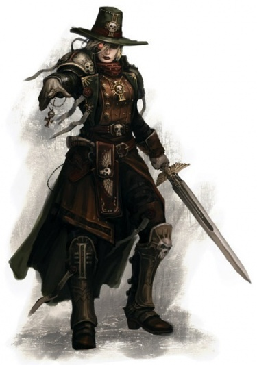
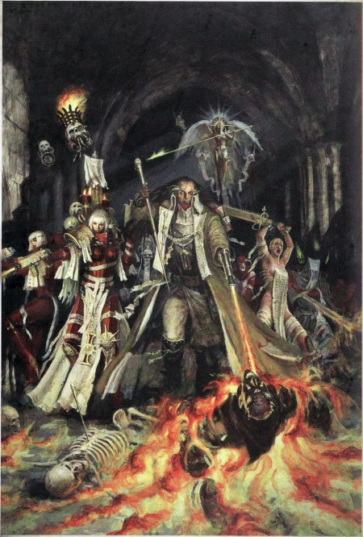

# 0102 异端审判庭 Ordo Hereticus

精校状态：中文行文已逐段精校，部分术语仍为暂定

分类：通用概念 / 帝国 Imperium / 审判庭 Inquisition

原文来源：https://www.bilibili.com/opus/1144276173549731844

原作者：帝国神选罐头

原文时间：2025年12月09日 14:15

[返回分类目录](目录.md) · [全书目录](../../目录.md)

原篇名：讨逆修会 Ordo Hereticus

<!-- A0102-B0001 -->
**英文原文**

The Ordo Hereticus (known colloquially as Witch Hunters) is one of the three major orders of the Inquisition. Their specific role is protecting mankind from itself, by combating such internal threats as treason, mutation, heresy, and witches. They are aided militarily by the Adeptus Ministorum's Sisters of Battle. Because of its vast jurisdiction and mission, the Ordo Hereticus is the largest of all the Inquisition's Ordos.

<!-- /A0102-B0001 -->

<!-- A0102-B0002 -->

原译文

讨逆修会（俗称女巫猎手）是审判庭的三大主要修会之一。他们的具体作用是通过打击叛国者、变种人、异端和女巫等内部威胁来保护人类免收自身伤害。他们在军事上得到了国教教会的战斗修女的帮助。由于其广泛的管辖范围和使命，讨逆修会是所有审判庭修会中最大的。

**校订译文**

异端审判庭俗称“猎巫者”，是审判庭的三大分支之一。它负责打击叛国、变异、异端及巫术等内部威胁，保护人类免受自身滋生的危害。国教会下属的战斗修女为其提供军事支援。由于管辖范围广、职责繁重，异端审判庭是审判庭各分支中规模最大的。

<!-- /A0102-B0002 -->

<!-- A0102-B0003 图片 -->

<!-- A0102-B0004 -->

原译文

Inquisition symbol 审判庭标志

**校订译文**

Inquisition symbol 审判庭标志

<!-- /A0102-B0004 -->

<!-- A0102-B0005 -->
**英文原文**

Parent Agency:Inquisition

<!-- /A0102-B0005 -->

<!-- A0102-B0006 -->

原译文

隶属机构：审判庭

**校订译文**

隶属机构：审判庭

<!-- /A0102-B0006 -->

<!-- A0102-B0007 -->
**英文原文**

Leader:None (represented by Inquisitorial Representative)

<!-- /A0102-B0007 -->

<!-- A0102-B0008 -->

原译文

领袖：无（由审判官代表作为代言人）

**校订译文**

领袖：无（由审判官代表作为代言人）

<!-- /A0102-B0008 -->

<!-- A0102-B0009 -->
**英文原文**

Armed Forces:Various Retinues, Inquisitorial Stormtroopers, Sisters of Battle

<!-- /A0102-B0009 -->

<!-- A0102-B0010 -->

原译文

武装部队：各种随从，审判庭风暴兵，战斗修女

**校订译文**

武装部队：各种随从，审判庭风暴兵，战斗修女

<!-- /A0102-B0010 -->

<!-- A0102-B0011 -->
**英文原文**

Established:M36

<!-- /A0102-B0011 -->

<!-- A0102-B0012 -->

原译文

建立时间：M36

**校订译文**

建立时间：M36

<!-- /A0102-B0012 -->

<!-- A0102-B0013 -->
## History 历史

<!-- /A0102-B0013 -->

<!-- A0102-B0014 -->
**英文原文**

The Ordo Hereticus was founded much later than the Ordo Xenos and Ordo Malleus, created after the Age of Apostasy which occurred during the second century of the 36th millennium. The Apostasy and the many heresies that took root during the anarchy (most notably the Plague of Unbelief), had severely destabilized the Imperium in a way not seen since the Horus Heresy.

<!-- /A0102-B0014 -->

<!-- A0102-B0015 -->

原译文

讨逆修会的成立时间比攘外修会和圣锤修会晚得多，是在第36个千年的第二世纪的叛教时代之后创建的。叛教和在无政府状态下扎根的许多异端（最明显的是无信瘟疫）以荷鲁斯叛乱以来从未见过的方式严重破坏了帝国的稳定。

**校订译文**

异端审判庭的成立远晚于异形审判庭和恶魔审判庭，建立于第 36 千年第二世纪发生的叛教时代之后。叛教动乱，以及在混乱中滋生的诸多异端，尤其是无信瘟疫，对帝国的稳定造成了自荷鲁斯之乱以来未见的严重破坏。

<!-- /A0102-B0015 -->

<!-- A0102-B0016 图片 -->

<!-- A0102-B0017 -->

原译文

Ordo Hereticus inquisitor 讨逆修会审判官

**校订译文**

Ordo Hereticus inquisitor 异端审判庭审判官

<!-- /A0102-B0017 -->

<!-- A0102-B0018 -->
**英文原文**

The Ordo Hereticus was formed as a check on the Ecclesiarchy, ensuring that another man like Vandire could not gain the level of power and control he did. Although the Ecclesiarchy has its own internal regulatory bodies, it is still the role of the Inquisition to monitor all organizations of the Imperium, including the Ecclesiarchy.

<!-- /A0102-B0018 -->

<!-- A0102-B0019 -->

原译文

讨逆修会的成立是为了制衡国教，确保像范迪尔这样的人无法获得他所拥有的权力和控制力。尽管国教有自己的内部监管机构，但审判庭的作用仍然是监督帝国的所有组织，包括国教。

**校订译文**

异端审判庭最初是为制衡国教会而设立的，目的是防止范迪尔那样的人再次攫取如此庞大的权力和控制权。国教会虽有自己的内部监管机构，但监督包括国教会在内的所有帝国组织，仍是审判庭的职责。

<!-- /A0102-B0019 -->

<!-- A0102-B0020 -->
**英文原文**

Since the formation of the Great Rift and the beginning of the Indomitus Crusade, the Ordo Hereticus alongside the Sisters of Battle have been dispatched across both Imperium Sanctus and Imperium Nihilus to determine the fate of the many beleaguered worlds.

<!-- /A0102-B0020 -->

<!-- A0102-B0021 -->

原译文

自大裂隙形成和不屈远征开始以来，讨逆修会与战斗修女一起被派往帝国圣疆和帝国暗面，以决定许多被围困世界的命运。

**校订译文**

大裂隙形成、不屈远征开始之后，异端审判庭与战斗修女被派往帝国圣疆和帝国暗面各地，查明众多陷于困境的世界的状况。

<!-- /A0102-B0021 -->

<!-- A0102-B0022 -->
## Role 角色

<!-- /A0102-B0022 -->

<!-- A0102-B0023 -->
**英文原文**

Although originally concerned with monitoring the Ecclesiarchy, the Ordo Hereticus has expanded its jurisdiction to encompass the other internal threats to the Imperium: witches, mutants, heretics, psykers, traitors and other deviants among mankind. Hereticus Inquisitors are the most feared members of the Inquisition, as their focus is on Mankind itself. The arrival of an Ordo Hereticus Inquisitor on a world is met with fear and awe, as no one but the Inquisitor himself knows where his attentions will fall.

<!-- /A0102-B0023 -->

<!-- A0102-B0024 -->

原译文

虽然最初关注的是监督国教，但讨逆修会已经扩大了其管辖范围，将帝国面临的其他内部威胁包括在内：女巫、变种人、异端、灵能者、叛徒和人类中的其他异常者。异端审判官是审判庭中最令人恐惧的成员，因为他们关注的是人类本身。讨逆修会审判官来到一个世界，人们会感到恐惧和敬畏，因为除了审判官本人，没有人知道他的注意力会落在哪里。

**校订译文**

异端审判庭最初负责监督国教会，后来将管辖范围扩展至帝国内部的其他威胁，包括巫师、变种人、异端、灵能者、叛徒及其他被视为偏离正道的人。由于调查对象正是人类自身，异端审判官也是审判庭中最令人畏惧的成员。每当他们抵达一个世界，居民无不心怀恐惧与敬畏，因为除了审判官本人，谁也不知道调查会指向何处。

<!-- /A0102-B0024 -->

<!-- A0102-B0025 -->
**英文原文**

The members of the Ordo Hereticus monitor the Wars of Faith inspired by the Ecclesiarchy, to ensure they remain within the objectives assigned by the Ecclesiarch. This includes overviews of Frateris Militia to make sure they are within the bounds of the Decree Passive. They ensure that the teachings preached by priests of the Imperial Cult remain true to the spirit of the Emperor's will. They regulate the wealth and territory claimed by members of the Ecclesiarchy, to prevent higher members of the institution from gaining more power than is appropriate. The Ordo Hereticus is also called upon to monitor other Imperial organisations for internal threats, including the Adeptus Arbites, the Space Marines, and even the Inquisition itself. Only the Emperor is beyond their jurisdiction.

<!-- /A0102-B0025 -->

<!-- A0102-B0026 -->

原译文

讨逆修会的成员监督受国教激励的信仰战争，以确保它们保持在教宗指定的目标范围内。这包括对兄弟会民兵的纵览，以确保他们在被动法令的范围内。他们确保帝国教派牧师所宣扬的教义始终忠实于帝皇的意志的精神。他们规范国教成员声称的财富和领土，以防止该机构的高级成员获得超出适当范围的权力。讨逆修会还被要求监视其他帝国组织的内部威胁，包括法务部、星际战士，甚至审判庭本身。只有帝皇不在他们的管辖范围内。

**校订译文**

异端审判庭监督国教会发动的信仰战争，确保战争不偏离教宗指定的目标；它也审查教会民兵，确保其组织与活动符合《禁武法令》的规定。它负责保证帝皇信仰的教士所宣讲的教义符合帝皇意志的精神，并监管国教会成员占有的财富和领地，防止教会上层掌握过多权力。异端审判庭还会调查法务部、星际战士，乃至审判庭自身等帝国组织中的内部威胁。只有帝皇不受其管辖。

<!-- /A0102-B0026 -->

<!-- A0102-B0027 -->
**英文原文**

This Ordo raises its own fleet and also provides the ship crews for the Grey Knights. Those selected candidates each possess a complex psycho-trigger that was built into their minds by way of sleep-indoctrination. This allows a Grey Knight to wipe the higher brain functions on order, thus preventing them from taking over a vessel if they turn against the Imperium.

<!-- /A0102-B0027 -->

<!-- A0102-B0028 -->

原译文

修会组建了自己的舰队，并为灰骑士提供船员。这些被选中的候选人每个人都有一个复杂的灵能触发，通过睡眠灌输的方式植入他们的大脑。这使得灰骑士能够按顺序消除高级脑部功能，从而防止他们在对抗帝国时接管战舰。

**校订译文**

这个分支还组建自己的舰队，并为灰骑士提供舰员。入选者接受睡眠灌输，在心智中植入复杂的心理触发机制。灰骑士可通过指令启动这一机制，抹除其高级脑功能，防止叛变的舰员夺取舰船。

**校注：** 原文明确把为灰骑士提供舰员的职责归于本条所述异端审判庭；这与灰骑士通常归属恶魔审判庭的描述存在关联疑点。按原文保留，待核对引用来源。psycho-trigger 为心理触发机制；on order 意为奉指令，并非按顺序。

<!-- /A0102-B0028 -->

<!-- A0102-B0029 -->
## Adepta Sororitas 修女会

<!-- /A0102-B0029 -->

<!-- A0102-B0030 -->
**英文原文**

The Adepta Sororitas, also known as the Sisterhood or the Daughters of the Emperor, are a penitent organisation devoted to the worship of the Emperor. Although there are many different Orders within the Sisterhood, the most well known are the Orders Militant, forming the military arm of the Ecclesiarchy.

<!-- /A0102-B0030 -->

<!-- A0102-B0031 -->

原译文

修女会，也被称为帝皇的修女会或帝皇之女，是一个致力于崇拜帝皇的忏悔组织。尽管修女会中有许多不同的修会，但最著名的是军事修会，他们组成了国教的军事武装。

**校订译文**

修女会又称姐妹会或帝皇之女，是一个以崇拜帝皇为宗旨、强调忏悔修行的组织。修女会包含许多不同修会，其中最著名的是构成国教会军事武装的战斗修会。

<!-- /A0102-B0031 -->

<!-- A0102-B0032 -->
**英文原文**

After the Age of Apostasy, the Ecclesiarchy was forbidden from possessing any "men under arms" by the Decree Passive issued by Sebastian Thor. A loophole was found and exploited by refounding the Daughters of the Emperor as warrior-nuns after merging them into the greater Sisterhood. The Sisterhood is an internal regulator, along with being an external army, ordered to ensure that true faith is spread throughout the Imperium and the galaxy.

<!-- /A0102-B0032 -->

<!-- A0102-B0033 -->

原译文

在叛教时代之后，塞巴斯蒂安·托尔颁布的被动法令禁止国教拥有任何“武装人员”。被发现并利用了一个漏洞，将帝皇之女合并为更大的修女会后，将她们重建为战士修女。修女会是一个内部监管机构，同时也是一支对外军队，受命确保真正的信仰在帝国和银河系中传播。

**校订译文**

叛教时代之后，塞巴斯蒂安·托尔颁布《禁武法令》，禁止国教会保有任何“武装男子”（men under arms）。国教会利用这段措辞的漏洞，将帝皇之女并入更大的修女会体系，重组为武装修女。修女会既承担内部监督职责，也充当对外作战的军队，奉命确保真正的信仰传遍帝国与银河。

<!-- /A0102-B0033 -->

<!-- A0102-B0034 图片 -->

<!-- A0102-B0035 -->

原译文

Ordo Hereticus Inquisitor and Sisters of Battle 讨逆修会审判官与战斗修女

**校订译文**

Ordo Hereticus Inquisitor and Sisters of Battle 异端审判庭审判官与战斗修女

<!-- /A0102-B0035 -->

<!-- A0102-B0036 -->
**英文原文**

Although completely unalike in their methods (where Inquisitors are analytical and suspicious, the Sisters of Battle are zealous and unquestioning of dogma) the Sisters and the Hereticus also have the common purpose of eradicating threats from within. Recognising this, the two organisations joined together in their efforts, a relationship formalised by the Convocation of Nephilim. Although the Sororitas and its Sisters of Battle remain part of the Ecclesiarchy, they respond when called upon by Inquisitors of the Ordo Hereticus.

<!-- /A0102-B0036 -->

<!-- A0102-B0037 -->

原译文

尽管在方法上完全不一样（审判官是分析性和怀疑性的，而战斗修女是狂热的，对教条毫不怀疑），但修女会和讨逆修会也有消除内部威胁的共同目的。认识到这一点，这两个组织联合起来共同努力，这一关系由拿非利会议正式确立。尽管修女会及其战斗修女仍然是国教的一部分，但当讨逆修会的审判官要求时，他们会做出回应。

**校订译文**

两者的行事方式截然不同：审判官善于分析、凡事存疑，战斗修女则信仰狂热，对教义深信不疑。不过，她们与异端审判庭同样致力于铲除内部威胁。基于这一共同目标，两个组织展开合作，并通过拿非利会议正式确立双方的关系。修女会及其战斗修女仍隶属于国教会，但会响应异端审判官的征召。

<!-- /A0102-B0037 -->

<!-- A0102-B0038 -->
## Notable Members 著名成员

<!-- /A0102-B0038 -->

<!-- A0102-B0039 -->

原译文

Inquisitor Lord Anton Zerbe 审判官领主安东·泽贝

**校订译文**

Inquisitor Lord Anton Zerbe 审判官领主安东·泽贝

<!-- /A0102-B0039 -->

<!-- A0102-B0040 -->

原译文

Inquisitor Lord Fyodor Karamazov 审判官领主费奥多尔·卡拉马佐夫

**校订译文**

Inquisitor Lord Fyodor Karamazov 审判官领主费奥多尔·卡拉马佐夫

<!-- /A0102-B0040 -->

<!-- A0102-B0041 -->

原译文

Inquisitor Lord Indigo 审判官领主因迪戈

**校订译文**

Inquisitor Lord Indigo 审判官领主因迪戈

<!-- /A0102-B0041 -->

<!-- A0102-B0042 -->

原译文

Inquisitor Lord Aris 审判官领主阿里斯

**校订译文**

Inquisitor Lord Aris 审判官领主阿里斯

<!-- /A0102-B0042 -->

<!-- A0102-B0043 -->

原译文

Inquisitor Lord Sakarof 审判官领主萨卡洛夫

**校订译文**

Inquisitor Lord Sakarof 审判官领主萨卡洛夫

<!-- /A0102-B0043 -->

<!-- A0102-B0044 -->

原译文

Inquisitor Lord Erasmus Crowl 审判官领主伊拉斯谟·克劳尔

**校订译文**

Inquisitor Lord Erasmus Crowl 审判官领主伊拉斯谟·克劳尔

<!-- /A0102-B0044 -->

<!-- A0102-B0045 -->

原译文

Inquisitor Lord Defay 审判官领主德费

**校订译文**

Inquisitor Lord Defay 审判官领主德费

<!-- /A0102-B0045 -->

<!-- A0102-B0046 -->

原译文

Inquisitor Lord Enoch 审判官领主以诺

**校订译文**

Inquisitor Lord Enoch 审判官领主以诺

<!-- /A0102-B0046 -->

<!-- A0102-B0047 -->

原译文

Inquisitor Lord Adamara Rassilo 审判官领主阿达马拉·拉西洛

**校订译文**

Inquisitor Lord Adamara Rassilo 审判官领主阿达马拉·拉西洛

<!-- /A0102-B0047 -->

<!-- A0102-B0048 -->

原译文

Lord Inquisitor Derval Bossch 领主审判官德瓦尔·博施

**校订译文**

Lord Inquisitor Derval Bossch 领主审判官德瓦尔·博施

<!-- /A0102-B0048 -->

<!-- A0102-B0049 -->

原译文

Legate-Inquisitor Jarndyce Frain 审判官使节贾代斯·弗兰

**校订译文**

Legate-Inquisitor Jarndyce Frain 审判官使节贾代斯·弗兰

<!-- /A0102-B0049 -->

<!-- A0102-B0050 -->

原译文

Inquisitor Adrastia 审判官阿德拉斯蒂娅

**校订译文**

Inquisitor Adrastia 审判官阿德拉斯蒂娅

<!-- /A0102-B0050 -->

<!-- A0102-B0051 -->

原译文

Inquisitor Ernst Stavros Killian 审判官恩斯特·斯塔夫罗斯·基里安

**校订译文**

Inquisitor Ernst Stavros Killian 审判官恩斯特·斯塔夫罗斯·基里安

<!-- /A0102-B0051 -->

<!-- A0102-B0052 -->

原译文

Inquisitor Gideon Lorr 审判官吉迪恩·洛尔

**校订译文**

Inquisitor Gideon Lorr 审判官吉迪恩·洛尔

<!-- /A0102-B0052 -->

<!-- A0102-B0053 -->

原译文

Inquisitor Brennika Lymsis 审判官布伦尼卡·莱姆西斯

**校订译文**

Inquisitor Brennika Lymsis 审判官布伦尼卡·莱姆西斯

<!-- /A0102-B0053 -->

<!-- A0102-B0054 -->

原译文

Inquisitor Glavius Wroth 审判官格拉维乌斯·沃斯

**校订译文**

Inquisitor Glavius Wroth 审判官格拉维乌斯·沃斯

<!-- /A0102-B0054 -->

<!-- A0102-B0055 -->

原译文

Inquisitor Globus Vaarak 审判官格洛布斯・瓦拉克

**校订译文**

Inquisitor Globus Vaarak 审判官格洛布斯・瓦拉克

<!-- /A0102-B0055 -->

<!-- A0102-B0056 -->

原译文

Inquisitor Katarinya Greyfax 审判官卡塔琳娅·格雷法克斯

**校订译文**

Inquisitor Katarinya Greyfax 审判官卡塔琳娅·格雷法克斯

<!-- /A0102-B0056 -->

<!-- A0102-B0057 -->

原译文

Inquisitor Hassan 审判官哈桑

**校订译文**

Inquisitor Hassan 审判官哈桑

<!-- /A0102-B0057 -->

<!-- A0102-B0058 -->

原译文

Inquisitor Jaueg Dag 审判官雅厄格·达格

**校订译文**

Inquisitor Jaueg Dag 审判官雅厄格·达格

<!-- /A0102-B0058 -->

<!-- A0102-B0059 -->

原译文

Inquisitor Ostromandeus 审判官奥斯特罗曼德斯

**校订译文**

Inquisitor Ostromandeus 审判官奥斯特罗曼德斯

<!-- /A0102-B0059 -->

<!-- A0102-B0060 -->

原译文

Inquisitor Arreteia Dhorne‎ 审判官阿雷泰娅·多恩

**校订译文**

Inquisitor Arreteia Dhorne‎ 审判官阿雷泰娅·多恩

<!-- /A0102-B0060 -->

<!-- A0102-B0061 -->

原译文

Inquisitor Silas Hand 审判官塞拉斯·汉德

**校订译文**

Inquisitor Silas Hand 审判官塞拉斯·汉德

<!-- /A0102-B0061 -->

<!-- A0102-B0062 -->

原译文

Inquisitor Kaliadh Shayn 审判官卡利亚德·沙恩

**校订译文**

Inquisitor Kaliadh Shayn 审判官卡利亚德·沙恩

<!-- /A0102-B0062 -->

<!-- A0102-B0063 -->

原译文

Inquisitor Soldevan 审判官索尔德万

**校订译文**

Inquisitor Soldevan 审判官索尔德万

<!-- /A0102-B0063 -->

<!-- A0102-B0064 -->

原译文

Inquisitor Grainne 审判官格兰妮

**校订译文**

Inquisitor Grainne 审判官格兰妮

<!-- /A0102-B0064 -->

<!-- A0102-B0065 -->

原译文

Inquisitor Raum Grumman 审判官劳姆·格鲁曼

**校订译文**

Inquisitor Raum Grumman 审判官劳姆·格鲁曼

<!-- /A0102-B0065 -->

<!-- A0102-B0066 -->

原译文

Inquisitor Erasmus 审判官伊拉斯谟

**校订译文**

Inquisitor Erasmus 审判官伊拉斯谟

<!-- /A0102-B0066 -->

<!-- A0102-B0067 -->

原译文

Inquisitor Emeline Smythe 审判官埃米琳·斯迈思

**校订译文**

Inquisitor Emeline Smythe 审判官埃米琳·斯迈思

<!-- /A0102-B0067 -->

<!-- A0102-B0068 -->

原译文

Inquisitor (Witch Hunter) Tyrus 审判官（女巫猎手）泰鲁斯

**校订译文**

Inquisitor (Witch Hunter) Tyrus 审判官（猎巫者）泰鲁斯

<!-- /A0102-B0068 -->

<!-- A0102-B0069 -->

原译文

Inquisitor Vownus Kaede 审判官沃努斯·凯德

**校订译文**

Inquisitor Vownus Kaede 审判官沃努斯·凯德

<!-- /A0102-B0069 -->

<!-- A0102-B0070 -->

原译文

Inquisitor Abram Fex 审判官艾布拉姆·费克斯

**校订译文**

Inquisitor Abram Fex 审判官艾布拉姆·费克斯

<!-- /A0102-B0070 -->

<!-- A0102-B0071 -->

原译文

Inquisitor Scallen 审判官斯卡伦

**校订译文**

Inquisitor Scallen 审判官斯卡伦

<!-- /A0102-B0071 -->

<!-- A0102-B0072 -->

原译文

Inquisitor Sabbathiel 审判官萨巴蒂埃尔

**校订译文**

Inquisitor Sabbathiel 审判官萨巴蒂埃尔

<!-- /A0102-B0072 -->

<!-- A0102-B0073 -->

原译文

Inquisitor Alders Terhan 审判官奥尔德斯·特汉

**校订译文**

Inquisitor Alders Terhan 审判官奥尔德斯·特汉

<!-- /A0102-B0073 -->

<!-- A0102-B0074 -->

原译文

Inquisitor Vincorum 审判官文克伦

**校订译文**

Inquisitor Vincorum 审判官文克伦

<!-- /A0102-B0074 -->

<!-- A0102-B0075 -->

原译文

Inquisitor Castinus 审判官卡斯蒂努斯

**校订译文**

Inquisitor Castinus 审判官卡斯蒂努斯

<!-- /A0102-B0075 -->

<!-- A0102-B0076 -->

原译文

Inquisitor Victoria Aldrich 审判官维多利亚·奥尔德里奇

**校订译文**

Inquisitor Victoria Aldrich 审判官维多利亚·奥尔德里奇

<!-- /A0102-B0076 -->

<!-- A0102-B0077 -->

原译文

Inquisitor Yusuph Trevar 审判官尤苏普·特赖瓦尔

**校订译文**

Inquisitor Yusuph Trevar 审判官尤苏普·特赖瓦尔

<!-- /A0102-B0077 -->

<!-- A0102-B0078 -->

原译文

Inquisitor Faustus Mael 审判官福斯图斯·梅尔

**校订译文**

Inquisitor Faustus Mael 审判官福斯图斯·梅尔

<!-- /A0102-B0078 -->

<!-- A0102-B0079 -->

原译文

Inquisitor Ven Bruin 审判官维恩·布鲁因

**校订译文**

Inquisitor Ven Bruin 审判官维恩·布鲁因

<!-- /A0102-B0079 -->

<!-- A0102-B0080 -->

原译文

Inquisitor Verus Tormun 审判官维鲁斯·托尔蒙

**校订译文**

Inquisitor Verus Tormun 审判官维鲁斯·托尔蒙

<!-- /A0102-B0080 -->

<!-- A0102-B0081 -->

原译文

Inquisitor Grendyl 审判官格伦德尔

**校订译文**

Inquisitor Grendyl 审判官格伦德尔

<!-- /A0102-B0081 -->

<!-- A0102-B0082 -->

原译文

Witch Seeker Rykehuss 女巫追踪者莱克胡斯

**校订译文**

Witch Seeker Rykehuss 猎巫者莱克胡斯

<!-- /A0102-B0082 -->

<!-- A0102-B0083 -->

原译文

Interrogator Luce Spinoza 审讯者卢斯·斯宾诺莎

**校订译文**

Interrogator Luce Spinoza 审讯者卢斯·斯宾诺莎

<!-- /A0102-B0083 -->

<!-- A0102-B0084 -->

原译文

Interrogator K'Shuk 审讯者科'舒克

**校订译文**

Interrogator K'Shuk 审讯者科'舒克

<!-- /A0102-B0084 -->

本篇核心术语与暂定项

以下列出本篇出现的英文原形及核心术语表用词。同形词可能指不同对象，具体词义以本篇正文和校注为准；单复数、别名和仅见于图注的名称可能尚未列入。完整候选见[术语表](../../术语表/双语术语候选.csv)。

| 英文 | 采用中文 | 状态 |
| --- | --- | --- |
| Space Marines | 星际战士 | 官方已核对 |
| Grey Knights | 灰骑士 | 官方已核对 |
| Adepta Sororitas | 修女会 | 官方已核对 |
| Horus Heresy | 荷鲁斯之乱 | 官方已核对 |
| Great Rift | 大裂隙 | 官方已核对 |
| Inquisition | 审判庭 | 暂定 |
| Inquisitor | 审判官 | 官方已核对 |
| Imperium | 帝国 | 暂定·简称 |
| Indomitus | 不屈学派 | 暂定·学派语境 |
| Ordo Malleus | 恶魔审判庭 | 用户指定 |
| Emperor | 帝皇 | 官方已核对 |
| Adeptus Ministorum | 国教会 | 暂定 |
| Ecclesiarchy | 国教会 | 暂定 |
| Adeptus Arbites | 法务部 | 暂定 |
| Age of Apostasy | 叛教时代 | 暂定·官方待核 |
| Horus | 荷鲁斯 | 暂定·官方待核 |
| Sisters of Battle | 战斗修女 | 暂定·官方待核 |
| Imperial Cult | 帝皇信仰 | 暂定·官方待核 |
| Imperium Nihilus | 帝国暗面 | 暂定·官方待核 |
| Imperium Sanctus | 帝国圣疆 | 暂定·官方待核 |
| Indomitus Crusade | 不屈远征 | 暂定·官方待核 |
| Ordo Hereticus | 异端审判庭 | 用户指定 |
| Ordo Xenos | 异形审判庭 | 用户指定 |
| Inquisitorial Stormtroopers | 审判庭风暴兵 | 暂定·官方待核 |
| Frateris Militia | 教会民兵 | 暂定·官方待核 |
| Decree Passive | 禁武法令 | 暂定 |
| Witch Hunters | 猎巫者 | 暂定 |
| Inquisitorial Representative | 审判庭代表 | 暂定 |
| Ecclesiarch | 教宗 | 暂定 |
| Mission | 教团／传教机构 | 暂定 |
| Orders Militant | 战斗修会（战斗修女）／武装骑士团（黑暗天使） | 语境定译·官方待核 |
| Penitent | 忏悔 | 暂定·官方待核 |
| Monitor | 监视者 | 暂定·官方待核 |
| Xenos | 异形 | 暂定·官方待核 |
| Sanctus | 圣裁者 | 官方已核对 |
| Emperor's Will | 帝皇意志号 | 暂定·官方待核 |
| Daughters of the Emperor | 帝皇之女 | 暂定·官方待核 |
| Sebastian Thor | 塞巴斯蒂安·托尔 | 暂定·官方待核 |
| Plague of Unbelief | 无信瘟疫 | 暂定·官方待核 |

