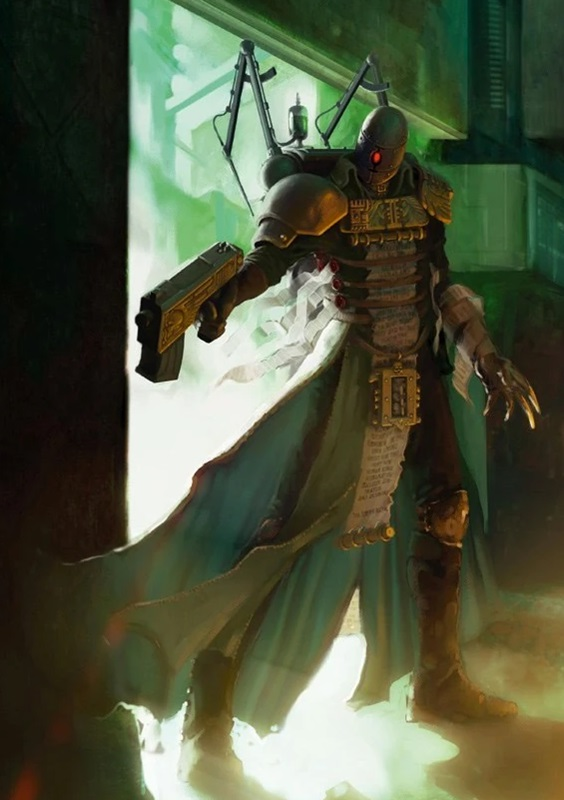

# 0103 托尔派 Thorians

精校状态：中文行文已逐段精校，部分术语仍为暂定

分类：通用概念 / 帝国 Imperium / 审判庭 Inquisition

原文来源：https://www.bilibili.com/opus/1080489346476277765

原作者：帝国神选罐头

原文时间：2025年06月20日 16:50

[返回分类目录](目录.md) · [全书目录](../../目录.md)

<!-- A0103-B0001 -->
**英文原文**

The rewards more than outweigh the risks should we succeed. Imagine it! The Emperor reborn and walking amongst his people as a living god. Who can say such a thing is wrong.

<!-- /A0103-B0001 -->

<!-- A0103-B0002 -->

原译文

如果我们成功了，回报远远超过风险。想象一下！帝皇重生了，作为一个活着的神在他的人民中行走。谁能说这样的事是不对的。

**校订译文**

如果我们成功了，回报远远超过风险。想象一下！帝皇重生了，作为一个活着的神在他的人民中行走。谁能说这样的事是不对的。

<!-- /A0103-B0002 -->

<!-- A0103-B0003 -->
**英文原文**

— Inquisitor Crescere. From Inquisitorial Report TH/21/36: “The Incunabla Incident"

<!-- /A0103-B0003 -->

<!-- A0103-B0004 -->

原译文

— 审判官克雷斯切尔。来自调查报告TH/21/36：“入侵事件”

**校订译文**

——审判官克雷斯切尔，审判庭报告 TH/21/36：《因库纳布拉事件》。

<!-- /A0103-B0004 -->

<!-- A0103-B0005 -->
**英文原文**

The Thorians are a sub-faction of the Puritan faction of the Inquisition.

<!-- /A0103-B0005 -->

<!-- A0103-B0006 -->

原译文

托尔派是审判庭纯洁派的一个子派系。

**校订译文**

托尔派是审判庭纯洁派的一个子派系。

<!-- /A0103-B0006 -->

<!-- A0103-B0007 -->
## Origins 起源

<!-- /A0103-B0007 -->

<!-- A0103-B0008 -->
**英文原文**

The Thorian faction's core ideology, the resurrection of the Emperor, in fact dates back to the very end of the Horus Heresy, long before the Thorians' namesake Sebastian Thor lived. Two of the original founders of the Inquisition, Promeus and Moriana, looked into means by which the ruler of mankind might be resurrected. However after Moriana began to look to Dark Powers in her quest, Promeus and his followers banished the Inquisitor to the Eye of Terror. The disciples of Promeus, the Promeans, began a quest over many centuries to restore the Emperor to a mortal body.

<!-- /A0103-B0008 -->

<!-- A0103-B0009 -->

原译文

托尔派的核心思想，帝皇的复活，实际上可以追溯到荷鲁斯叛乱的末期，远在托尔派同名的塞巴斯蒂安·托尔诞生之前。审判庭的两位创始人，普罗密斯和莫里亚纳，研究了人类统治者复活的方法。然而，在莫里亚纳开始寻求黑暗势力的帮助后，普罗密斯和他的追随者将这位审判官驱逐到了恐惧之眼。普罗密斯的门徒，普罗密斯派，开始了几个世纪的探索，试图将帝皇恢复到凡人之躯。

**校订译文**

托尔派以复活帝皇为核心理念，这一主张实际上可以追溯至荷鲁斯之乱刚刚结束之时，远早于该派得名所自的塞巴斯蒂安·托尔。审判庭的两位创始人普罗密斯与莫里亚纳曾探索让人类统治者复活的方法。然而，莫里亚纳在探索中开始求助于黑暗势力，普罗密斯及其追随者遂将她驱逐至恐惧之眼。普罗密斯的门徒，即普罗密斯派，随后展开了持续数个世纪的探索，试图让帝皇重获凡人之躯。

<!-- /A0103-B0009 -->

<!-- A0103-B0010 -->
**英文原文**

Eventually, a splinter faction of the Promeans, the Horusians, began to form. These disciples were continuing the work of Moriana, collecting texts on the nature of Horus and his possession by Chaos. These tomes, considered heretical, brought Promeans and the Horusians into conflict. In the end however the Horusians prevailed, and few true Promeans remained by M34. Eventually, Stalia von Dressen was able to organize anti-Horusian cells across the Imperium. Eventually her crusade led her to research the nature of the Emperor's resurrection and the founding of the Inquisition for two decades on Terra, leading her to believe that resurrection was a hopeless cause. This led her to lead an anti-resurrectionist purge within the Inquisition. By M35 resurrectionism was once again all but eliminated from the Inquisition's goals.

<!-- /A0103-B0010 -->

<!-- A0103-B0011 -->

原译文

最终，普罗密斯派的一个分裂派系，即荷鲁斯派开始形成。这些门徒继续莫里亚纳的工作，收集关于荷鲁斯的性质和他被混沌占据的文本。这些被视为异端的巨著，使普罗密斯派和荷鲁斯派陷入冲突。然而，最终荷鲁斯派获胜，M34留下的真正的普罗密斯派很少。最终，斯塔里亚·冯·德瑞森能够组织整个帝国的反荷鲁斯派组织。最终，她的远征使她研究了帝皇复活的本质以及在泰拉上建立审判庭的二十年，使她相信复活是一个无望的事业。这导致她在审判庭内领导了一场反复活运动。到M35，复活主义再次从审判庭的目标中几乎被消除。

**校订译文**

此后，普罗密斯派内部逐渐分裂出荷鲁斯派。他们延续莫里亚纳的研究，搜集有关荷鲁斯及其遭混沌附身的典籍。这些被视为异端的文献引发了两派冲突，最终荷鲁斯派获胜；到第 34 千年，真正的普罗密斯派已所剩无几。后来，斯塔里亚·冯·德瑞森将散布于帝国各地的反荷鲁斯派小组组织起来。在这场斗争中，她来到泰拉，花费二十年研究帝皇复活问题与审判庭的创立历史，最终认定复活帝皇毫无希望。她随后在审判庭内部发起针对复活主义者的清洗。到第 35 千年，复活帝皇再度几乎被排除在审判庭的目标之外。

<!-- /A0103-B0011 -->

<!-- A0103-B0012 -->
**英文原文**

However it was during the Age of Apostasy in M36 that the resurrectionists again emerged, this time led by Sebastian Thor. After Thor's apparent divine victory in ending the Reign of Blood by Goge Vandire, resurrectionism, not closely associated with Thor's own faction of it (Thorianism) became accepted within the Inquisiton once more.

<!-- /A0103-B0012 -->

<!-- A0103-B0013 -->

原译文

然而，在M36的叛教时代，复活派再次出现，这次是由塞巴斯蒂安·托尔领导的。在托尔在结束高戈·范德尔的血腥统治方面取得明显的神圣胜利后，与托尔自己的派系（圣托尔派）没有密切联系的复活主义再次被审判庭接受。

**校订译文**

第 36 千年的叛教时代，复活主义者再次出现；原文将这次复兴与塞巴斯蒂安·托尔联系起来。托尔终结高戈·范迪尔的血腥统治，其胜利被视为神力相助的结果；此后，复活主义重新获得审判庭接纳。不过，原文关于复活主义与“托尔派”之间关系的措辞存在疑点，详见校注。

**校注：** 英文原句为 resurrectionism, not closely associated with Thor's own faction of it (Thorianism)。not 与句意和历史叙述关系不明，可能存在原文笔误；未擅改为 now。复活主义重新获得接纳的主句可明确译出，关系从句待核原始资料。

<!-- /A0103-B0013 -->

<!-- A0103-B0014 -->
## Overview 概述

<!-- /A0103-B0014 -->

<!-- A0103-B0015 -->
**英文原文**

Generally considered as pro-resurrectionists, Thorians believe that the Emperor´s spirit can be transferred into another host, referred to as a Divine Avatar, an especially gifted, charismatic and saintly individual. Many other Inquisitors work against this agenda, because if such a thing happened the Imperium would be torn apart in a massive conflict between believers and non-believers, resulting in a devastation similar to the aftermath of the Horus Heresy.

<!-- /A0103-B0015 -->

<!-- A0103-B0016 -->

原译文

托尔派通常被认为是支持复活的人，他们相信帝皇的精神可以转移到另一个宿主身上，被称为神圣化身，一个特别有天赋、有魅力和圣洁的人。许多其他审判官反对这一议程，因为如果发生这样的事情，帝国将在信徒和非信徒之间的大规模冲突中被撕裂，造成类似于荷鲁斯叛乱的破坏。

**校订译文**

托尔派通常被视为支持复活帝皇的派别。他们相信帝皇的灵魂可以转移到另一位宿主身上：此人须天赋卓绝、富有感召力且圣洁，被称为“神圣化身”。许多其他审判官反对这一主张，担心此事一旦发生，信奉与不信奉这位化身的人就会爆发大规模冲突，撕裂帝国，造成堪比荷鲁斯之乱的浩劫。

<!-- /A0103-B0016 -->

<!-- A0103-B0017 -->
**英文原文**

The Thorians believe that Thor was divinely inspired and that he moved with the Emperor’s light burning within him. To many Inquisitors of the day, it was obvious that Thor was imbued with a measure of the Emperor’s will and charisma. They believed that it was not the first time that the Emperor had acted in such a way, citing such figures as St. Capilene and the hero Josmane as previous vessels of the Emperor walking amongst his people.

<!-- /A0103-B0017 -->

<!-- A0103-B0018 -->

原译文

托尔派相信托尔是受到神的启发，他移动时内心燃烧着帝皇的光芒。对于当时的许多审判官来说，很明显，托尔充满了帝皇的意志和魅力。他们认为，这不是帝皇第一次这样做，并引用圣卡皮利恩和英雄约斯曼等人物作为帝皇在人民中行走的前容器。

**校订译文**

托尔派相信托尔受到神圣启示，行动时帝皇之光在他体内燃烧。当时许多审判官认定，托尔承载了帝皇的一部分意志与感召力。他们也认为帝皇此前就曾以类似方式显现，并将圣卡皮利恩、英雄约斯曼等人物列为帝皇昔日借以行走于子民之间的宿主。

<!-- /A0103-B0018 -->

<!-- A0103-B0019 -->
**英文原文**

The Thorians believe that the Emperor’s near-death at the hands of Horus allowed him to break the final bonds between the crude matter of corporeality and ascend to assume his true nature as a deity. His spirit wanders the void, travelling as a whisper in the warp, flitting from place to place and perhaps even through time. Thorian dogma tells that the Emperor has manifested his spirit through his chosen vessels many times when his people needed him, but that these bodies were able to contain only the barest fraction of his power and soon withered and died. They await the day that He shall be reborn and lead his people onwards in the continuation of the Great Crusade.

<!-- /A0103-B0019 -->

<!-- A0103-B0020 -->

原译文

托尔派相信，帝皇在荷鲁斯手中濒临死亡，这使他能够打破物质界的粗糙物质与升格之间的最后联系，从而承担起他作为神的真实本性。他的灵魂在虚空中游荡，在亚空间中低语，从一个地方飞到另一个地方，甚至可能穿越时间。托尔派教条所说，当他的人民需要他的时候，帝皇已经多次通过他选择的容器来表现他的精神，但这些容器只能容纳他力量的一小部分，很快就枯萎并死亡了。他们等待着他重生的那一天，并带领他的人民继续进行大远征。

**校订译文**

托尔派相信，帝皇被荷鲁斯重创、濒临死亡之际，得以挣脱肉体物质的最后束缚，升华为其真正的神性形态。他的灵魂游荡于虚空，像亚空间中的低语一样往来各处，甚至可能穿梭于时间之中。按照托尔派教义，每逢子民需要他时，帝皇便会通过选定的宿主显现；然而，这些身体只能承载他极少的一部分力量，很快便衰败死亡。托尔派等待着他重生的那一天，届时他将率领人类继续大远征。

**校注：** 本段是托尔派的信仰解释，并非将帝皇确已完成升神作为无争议设定事实。

<!-- /A0103-B0020 -->

<!-- A0103-B0021 -->
**英文原文**

To this end, the Thorians closely study the interaction of consciousness, energy and the warp, believing that if they can manipulate these energies correctly they can channel the Emperor’s spirit into a suitable vessel and effectively resurrect the Master of Mankind. There have been many attempts to create a body suitable for such an important ritual, including the disastrous events on Incunabla, but so far none have succeeded. Followers of the Thorian philosophies constantly scour the galaxy for beings they term “Avatars”, individuals of such power that they may prove able to contain the Emperor’s soul once more – or be turned to evil by the Ruinous Powers.

<!-- /A0103-B0021 -->

<!-- A0103-B0022 -->

原译文

为此，托尔派密切研究意识、能量和亚空间的相互作用，相信如果他们能够正确地操纵这些能量，他们可以将帝皇的精神引导到合适的容器中，并有效地复活人类之主。有很多人试图创造一个适合这种重要仪式的身体，包括因库纳布拉的灾难性事件，但到目前为止还没有成功。托尔派哲学的追随者不断地在银河系中寻找他们称之为“化身”的生物，这些生物具有如此强大的力量，以至于他们可能会再次被证明能够容纳帝皇的灵魂，或者被毁灭之力变成邪恶。

**校订译文**

为此，托尔派深入研究意识、能量与亚空间的相互作用，相信只要正确操控这些能量，就能把帝皇的灵魂引入合适的宿主，使人类之主复活。人们曾多次尝试为这一重大仪式创造合适的躯体，包括引发因库纳布拉灾难的那次尝试，但截至原条目记述时均未成功。托尔派的追随者始终在银河中搜寻他们称为“化身”的个体：这些个体力量强大，或许足以再次承载帝皇的灵魂，也可能遭毁灭诸神腐化。

<!-- /A0103-B0022 -->

<!-- A0103-B0023 -->
**英文原文**

Many Thorian inquisitors are found within the Ordo Malleus, where their greater understanding of the immaterium grants them an insight into how the rebirth of the Emperor could be achieved. Others may be found among the Ordo Hereticus, though there are few within the Ordo Xenos, save those who believe manipulation of alien psychic-engineering, such as that of the Eldar may provide valuable insights. Inquisitors of all orders foster the growth of resurrectionist cults throughout the Imperium, as they provide useful foot-soldiers for an Inquisitor when he must raise an army to achieve his ends.

<!-- /A0103-B0023 -->

<!-- A0103-B0024 -->

原译文

许多托尔派审判官都在圣锤修会内，他们对内在的更深入理解使他们能够洞察如何实现帝皇的重生。其他人可能会在讨逆修会中找到，尽管攘外修会中很少有人，除了那些相信操纵外星人灵能工程（如灵族）可能会提供有价值见解的人。所有等级的审判官都促进了整个帝国复活教派的发展，因为当审判官必须组建军队以实现自己的目标时，他们为他提供了有用的军队。

**校订译文**

许多托尔派审判官供职于恶魔审判庭，对亚空间的深入了解使他们能够探究复活帝皇的可能途径。异端审判庭中也有托尔派成员；异形审判庭中则较为少见，主要是那些相信灵族等异形的灵能工程技术能提供重要启示的人。各分支中持此理念的审判官都会扶植帝国内的复活主义教派，因为当他们需要为自己的目标集结军队时，这些教派能提供可用的兵员。

<!-- /A0103-B0024 -->

<!-- A0103-B0025 -->
**英文原文**

Opponents of the Thorians claim that were the Emperor to be reborn it would cause a schism and civil war more deadly than that begun by Horus. Believers and unbelievers would fight to the death and the galaxy would be consumed in an apocalyptic holy war. They cite the Thorian’s naivete, claiming that they cannot know what would come back, that the Emperor himself might be changed, altered by his long absence from the flesh. And more importantly, what of the Astronomican? The Imperium would surely collapse without the Emperor’s guiding light to steer ships through the Empyrean. The risks inherent in what the Thorians propose are too great for many to contemplate but, despite this, the Thorians are determined upon their course.

<!-- /A0103-B0025 -->

<!-- A0103-B0026 -->

原译文

托尔派的反对者声称，如果帝皇重生，将导致比荷鲁斯开始的更致命的分裂和内战。信徒和非信徒将战斗至死，银河系将在一场末日圣战中被毁灭。他们引用了托尔派的天真，声称他们不知道会有什么结果，帝皇本人可能会因为长期脱离肉体而改变。更重要的是，星炬呢？如果没有帝皇的指引之光来引导船只穿过帝国宙域，帝国肯定会崩溃。托尔派提出的建议中固有的风险太大，许多人无法想象，但尽管如此，托尔派还是决定走自己的路。

**校订译文**

托尔派的反对者声称，帝皇一旦重生，就可能引发比荷鲁斯之乱更惨烈的分裂与内战。信奉与不信奉这位化身的人会殊死相争，银河将陷入末日般的圣战。他们批评托尔派过于天真：谁也无法确定归来者究竟是什么；帝皇脱离肉身如此漫长的岁月，自身也可能已经改变。更关键的是，星炬又该怎么办？若失去帝皇的光芒引导舰船穿越亚空间，帝国必将崩溃。托尔派方案的风险大到令许多人不敢设想，但他们依然决意沿着这条路走下去。

<!-- /A0103-B0026 -->

<!-- A0103-B0027 -->
## Symbols 标志

<!-- /A0103-B0027 -->

<!-- A0103-B0028 -->
**英文原文**

Thorians have no formal emblem, but make considerable use of the skull symbol, representing the Emperor-in-Death, a scroll clasped in a hand, representing the hand of Promeus as he left the first conclave, and a broken lock, representing solving of the riddle of the Divine Vessel.

<!-- /A0103-B0028 -->

<!-- A0103-B0029 -->

原译文

托尔派没有正式的徽章，但大量使用头骨符号，代表死亡中的帝皇，一个紧握在手中的卷轴，代表普罗密斯离开第一次秘会时的手，以及一把破锁，代表解决神圣容器之谜。

**校订译文**

托尔派没有正式徽记，但经常使用三种象征：骷髅代表处于死亡状态的帝皇；手握卷轴的图案代表普罗密斯离开首次秘会时的手；断锁则代表解开神圣宿主之谜。

<!-- /A0103-B0029 -->

<!-- A0103-B0030 -->
## Notable Followers 著名追随者

<!-- /A0103-B0030 -->

<!-- A0103-B0031 -->

原译文

Antigonus Balorodin 安提柯努斯·巴洛罗丁

**校订译文**

Antigonus Balorodin 安提柯努斯·巴洛罗丁

<!-- /A0103-B0031 -->

<!-- A0103-B0032 图片 -->

<!-- A0103-B0033 -->

原译文

Antigonus Balorodin, Thorian Inquisitor Lord 安提柯努斯·巴洛罗丁，托尔派审判官领主

**校订译文**

Antigonus Balorodin, Thorian Inquisitor Lord 安提柯努斯·巴洛罗丁，托尔派审判官领主

<!-- /A0103-B0033 -->

<!-- A0103-B0034 -->
**英文原文**

Aghastri - Ordo Sepulturum. Active during the 13th Black Crusade.

<!-- /A0103-B0034 -->

<!-- A0103-B0035 -->

原译文

阿加斯特里 - 葬仪修会。活跃于第13次黑色远征期间。

**校订译文**

阿加斯特里——葬仪审判庭成员，活跃于第十三次黑色远征期间。

<!-- /A0103-B0035 -->

<!-- A0103-B0036 -->
**英文原文**

Crescere - Sponsor of 'Project Homo Sapiens Novus' that was behind at leaste some of the Cursed Founding Chapters in M35.

<!-- /A0103-B0036 -->

<!-- A0103-B0037 -->

原译文

克雷斯切尔 - “新智人项目”的发起人，该项目至少是M35中一些被诅咒的建军战团的幕后推手。

**校订译文**

克雷斯切尔——“新智人计划”的资助者；该计划至少促成了第 35 千年诅咒建军中的部分战团。

<!-- /A0103-B0037 -->

<!-- A0103-B0038 -->
**英文原文**

Thex, Voragian - Thorian of the Ardentites sub-sect.

<!-- /A0103-B0038 -->

<!-- A0103-B0039 -->

原译文

弗拉吉安·泰克斯 - 热忱派分教的托尔派

**校订译文**

弗拉吉安·泰克斯 - 热忱派分教的托尔派

<!-- /A0103-B0039 -->

<!-- A0103-B0040 -->
## Related Factions 相关派别

<!-- /A0103-B0040 -->

<!-- A0103-B0041 -->
### Puritian 纯洁派

<!-- /A0103-B0041 -->

<!-- A0103-B0042 -->
**英文原文**

Anomalian Beholders- Believe that their goal is to observe Humanity and await the Emperor Incarnate's arrival.

<!-- /A0103-B0042 -->

<!-- A0103-B0043 -->

原译文

异像见证派 - 相信他们的目标是观察人类，等待帝皇化身的到来。

**校订译文**

异像见证派 - 相信他们的目标是观察人类，等待帝皇化身的到来。

<!-- /A0103-B0043 -->

<!-- A0103-B0044 -->
**英文原文**

Ardentites- Believe that the power of the God-Emperor is likely to manifest either through a group or, more likely, through the entirety of Mankind itself.

<!-- /A0103-B0044 -->

<!-- A0103-B0045 -->

原译文

热忱派 - 相信神皇的力量很可能通过一个群体，或者更有可能通过整个人类本身来体现。

**校订译文**

热忱派 - 相信神皇的力量很可能通过一个群体，或者更有可能通过整个人类本身来体现。

<!-- /A0103-B0045 -->

<!-- A0103-B0046 -->
### Radical 激进派

<!-- /A0103-B0046 -->

<!-- A0103-B0047 -->
**英文原文**

Casophilians- Dedicate their studies to the transition of a Human soul from this world to the next.

<!-- /A0103-B0047 -->

<!-- A0103-B0048 -->

原译文

卡索菲利派 - 致力于研究人类灵魂从这个世界到下一个世界的过渡。

**校订译文**

卡索菲利派——专门研究人类灵魂从现世进入来世的过程。

<!-- /A0103-B0048 -->

<!-- A0103-B0049 -->
**英文原文**

Horusians- Believe that the power of Chaos that manifested in Warmaster Horus might be harnessed for the creation of a Divine Avatar.

<!-- /A0103-B0049 -->

<!-- A0103-B0050 -->

原译文

荷鲁斯派 - 相信战帅荷鲁斯展现的混沌力量可能会被用来创造一个神圣化身。

**校订译文**

荷鲁斯派 - 相信战帅荷鲁斯展现的混沌力量可能会被用来创造一个神圣化身。

<!-- /A0103-B0050 -->

<!-- A0103-B0051 -->
**英文原文**

Revivificators- Goal is the study of the transition of the soul to the Warp at the moment of death.

<!-- /A0103-B0051 -->

<!-- A0103-B0052 -->

原译文

复活派 - 目标是研究死亡时刻灵魂向亚空间的过渡。

**校订译文**

复活派 - 目标是研究死亡时刻灵魂向亚空间的过渡。

<!-- /A0103-B0052 -->

本篇核心术语与暂定项

以下列出本篇出现的英文原形及核心术语表用词。同形词可能指不同对象，具体词义以本篇正文和校注为准；单复数、别名和仅见于图注的名称可能尚未列入。完整候选见[术语表](../../术语表/双语术语候选.csv)。

| 英文 | 采用中文 | 状态 |
| --- | --- | --- |
| Eldar | 灵族 | 暂定·语境区分 |
| Horus Heresy | 荷鲁斯之乱 | 官方已核对 |
| Astronomican | 星炬 | 暂定 |
| Warp | 亚空间 | 官方已核对 |
| Inquisition | 审判庭 | 暂定 |
| Inquisitor | 审判官 | 官方已核对 |
| Imperium | 帝国 | 暂定·简称 |
| Eye of Terror | 恐惧之眼 | 官方已核对 |
| Ordo Malleus | 恶魔审判庭 | 用户指定 |
| Emperor | 帝皇 | 官方已核对 |
| Age of Apostasy | 叛教时代 | 暂定·官方待核 |
| Goge Vandire | 高戈·范迪尔 | 暂定·官方待核 |
| Great Crusade | 大远征 | 暂定·官方待核 |
| Terra | 泰拉 | 暂定·官方待核 |
| Horus | 荷鲁斯 | 暂定·官方待核 |
| Ordo Hereticus | 异端审判庭 | 用户指定 |
| Ordo Xenos | 异形审判庭 | 用户指定 |
| Divine Avatar | 神圣化身 | 暂定 |
| Thorians | 托尔派 | 暂定 |
| Promeans | 普罗密斯派 | 暂定 |
| Horusians | 荷鲁斯派 | 暂定 |
| Incunabla | 因库纳布拉 | 暂定 |
| Master | 导师（审判庭职衔）／舰务官（舰员职务） | 语境定译·官方待核 |
| Ordo Sepulturum | 葬仪审判庭 | 暂定·官方待核 |
| Founding | 建军 | 暂定·官方待核 |
| Reborn | 复生者（战团）／重生者（死神军自称） | 语境定译·官方待核 |
| Mortal | 凡人 | 暂定·官方待核 |
| Powers | 能天使 | 暂定·官方待核 |
| Host | 天军 | 暂定·官方待核 |
| Xenos | 异形 | 暂定·官方待核 |
| Ruinous Powers | 毁灭诸力 | 暂定·官方待核 |
| Promeus | 普罗梅乌斯 | 暂定·官方待核 |
| St. Capilene | 圣卡皮伦 | 暂定·官方待核 |
| Reign of Blood | 血腥统治 | 暂定·官方待核 |
| Sebastian Thor | 塞巴斯蒂安·托尔 | 暂定·官方待核 |
| sub-sect | 分教派 | 暂定·官方待核 |

