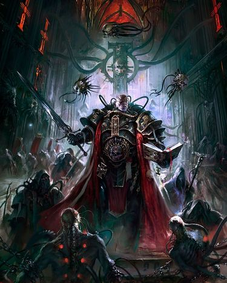

# 0104 审判官 Inquisitor

精校状态：中文行文已逐段精校，部分术语仍为暂定

分类：通用概念 / 帝国 Imperium / 审判庭 Inquisition

原文来源：https://www.bilibili.com/opus/1148431919480832006

原作者：帝国神选罐头

原文时间：2025年12月20日 19:02

[返回分类目录](目录.md) · [全书目录](../../目录.md)

<!-- A0104-B0001 -->
**英文原文**

Inquisitors are members of the Inquisition, the organization responsible for investigating and dealing with all potential threats to the Imperium and to humanity.

<!-- /A0104-B0001 -->

<!-- A0104-B0002 -->

原译文

审判官是审判庭的成员，该组织负责调查和处理对帝国和人类的所有潜在威胁。

**校订译文**

审判官是审判庭的成员，该组织负责调查和处理对帝国和人类的所有潜在威胁。

<!-- /A0104-B0002 -->

<!-- A0104-B0003 图片 -->

<!-- A0104-B0004 -->

原译文

Inquisitor 审判官

**校订译文**

Inquisitor 审判官

<!-- /A0104-B0004 -->

<!-- A0104-B0005 -->
## Recruitment 招募

<!-- /A0104-B0005 -->

<!-- A0104-B0006 -->
**英文原文**

Potential Inquisitors come from all walks of life, from humble agri-workers' sons to highborn nobles' daughters, but are usually drawn from the Progena of the Schola Progenium who show the most promise.

<!-- /A0104-B0006 -->

<!-- A0104-B0007 -->

原译文

潜在的审判官来自各行各业，从卑微的农业工人之子到名门贵族之女，但通常来自最有希望的忠嗣学院的忠嗣。

**校订译文**

审判官候选人出身各异，既有普通农业工人的儿子，也有名门贵族的女儿；不过，多数仍选自忠嗣学院中最具潜力的学员。

<!-- /A0104-B0007 -->

<!-- A0104-B0008 -->
**英文原文**

As is the case with all other aspects of the Inquisition, the power to recruit is not centralized, but left in the hands of individual Inquisitors. Some are known to not recruit at all and instead spend their years of service in pursuit of their enemies and dedicate their hours to duty for the rest of their lives. Others, however, feel that it is one of their many burdens to bring about the next generation of Inquisitors who are destined to carry forth the battle that the Inquisition must wage. Ultimately, the matter is left to the judgment of the individual Inquisitors, who are subject only to the scrutiny of their peers. A majority of Inquisitors typically leave matters to chance or perhaps to fate in regard to picking a suitable candidate from amongst the groups of individuals whose paths cross that of the Inquisition. There are a number of Inquisitors who are more rigorous in regard to the pursuit of apprentices and will spend a proportion of their time seeking suitable candidates - sometimes from the ranks of other Imperial organizations.

<!-- /A0104-B0008 -->

<!-- A0104-B0009 -->

原译文

与审判庭的所有其他方面一样，招募的权力不是集中的，而是掌握在各个审判官手中。众所周知，有些人根本不招募新人，而是把多年的服役时间花在追捕敌人上，并在余生中投入大量时间履行职责。然而，其他人认为，培养下一代审判官是他们的众多重担之一，他们注定要进行审判庭必须进行的战斗。最终，这件事留给了各个审判官的判断，他们只受到同行的审查。大多数审判官在从与审判庭有交集的人群中挑选合适的候选人时，通常会把事情留给机会，或者也许是命运。有许多审判官在寻找学徒方面更加严格，他们会花一部分时间寻找合适的候选人，有时是从其他帝国组织的队伍中。

**校订译文**

与审判庭的其他事务一样，招募权并不集中于某个机构，而是掌握在各位审判官手中。有些审判官从不招募新人，将毕生精力都用于追捕敌人、履行职责；另一些则认为，培养下一代、让他们接续审判庭的斗争，也是自己必须承担的责任。最终如何取舍由审判官自行判断，他们只接受同僚的审视。多数人在选择候选人时随缘而定，从与审判庭发生交集的人中寻找合适者；也有人更为主动，会专门花时间物色学徒，有时从其他帝国机构中挑选人才。

<!-- /A0104-B0009 -->

<!-- A0104-B0010 -->
**英文原文**

There exist no set criteria in regards to physical condition for a possible candidate when being selected to join the ranks of the Inquisition. All that is required is proof of intelligence and loyalty, which are key factors in such a choice, though there is no proper method of judging these attributes until later in the candidate's life. However, there may exist extraordinary circumstances which leads to an Inquisitor choosing a boy or girl whilst they are still within their teens, though this is only the case if the subject shows exceptional ability. Generally, an Inquisitor will take note of an individual if they are a free-thinking person with willpower and determination, as well as unflinching principles. If a suitable candidate is found, they will become part of the Inquisitorial retinue where they may serve in a minor capacity whilst the Inquisitor continues their evaluation. Those that later prove their worth whilst working with the Inquisitor can be taken into the greater confidence of their lord or lady.

<!-- /A0104-B0010 -->

<!-- A0104-B0011 -->

原译文

在被选中加入审判庭时，对于可能的候选人的身体状况没有既定的标准。所有需要的是指挥和忠诚的证明，这是做出这种选择的关键因素，尽管在候选人的晚年之前，没有适当的方法来判断这些属性。然而，可能存在特殊情况，导致审判官在十几岁时选择男孩或女孩，尽管只有当受试者表现出特殊能力时才会出现这种情况。一般来说，审判官会注意到一个人，如果他是一个有意志力和决心的自由思考的人，以及坚定不移的原则。如果找到合适的候选人，他们将成为审判官随从的一部分，在审判官继续评估的同时，他们可以以次要身份任职。那些后来在与审判官合作时证明自己价值的人可以得到他们领主或夫人的更大信任。

**校订译文**

审判庭选拔候选人时，对身体条件并无统一标准，关键在于其才智与忠诚。然而，这些品质通常要经过较长时间才能得到充分检验。若某个少年展现出非凡能力，审判官也可能破例在其十几岁时就将其选中。一般而言，能够独立思考、意志坚定、富有决心且恪守原则的人最容易引起审判官的注意。合适的候选人会先加入随从队伍，承担较次要的职责，同时继续接受考察；之后若在共事中证明自己的价值，便能获得所侍奉的审判官更多信任。

<!-- /A0104-B0011 -->

<!-- A0104-B0012 -->
**英文原文**

Over the years that pass by, the apprentice will begin to learn what they can of an Inquisitor's knowledge and their many duties. Certain Inquisitors often refer to these semi-skilled individuals as Interrogators though they are more commonly known as Novitiates, Neophytes and as Approbators. At this stage, the individuals can undertake missions of their own or control operations in concert with their master or mistress though ultimately they are still subordinate to them until the Inquisitor fully invests in them. Under normal conditions, it is required that the consent of three Inquisitors or an Inquisitor Lord is needed to bestow the full powers of an Inquisitor on an apprentice as well as grant them the Inquisitorial Seal. Whilst this is typically done, there have been occasions which warrant an apprentice taking full Inquisitorial powers immediately. This is likely the case where the Inquisitor in charge has been killed and the apprentice inherits their master or mistresses' position.

<!-- /A0104-B0012 -->

<!-- A0104-B0013 -->

原译文

随着时间的推移，学徒将开始尽其所能地学习审判官的知识和他们的许多职责。某些审判官经常将这些半熟练的人称为审讯者，尽管他们通常被称为新手、新进者和批准者。在这个阶段，个人可以与他们的主人或女主人一起执行自己的任务或控制行动，尽管最终他们仍然从属于他们，直到审判官完全投资于他们。在正常情况下，需要三名审判官或一名领主审判官的同意，才能将审判官的全部权力授予学徒，并授予他们审判官印章。虽然这通常是这样做的，但也有一些情况需要学徒立即获得全部的审判官权力。这可能是负责的审判官被杀，学徒继承其主人或女主人职位的情况。

**校订译文**

经过多年的学习，学徒逐渐掌握审判官的知识及各项职责。有些审判官把这些尚未完全出师的人称为“审讯者”，不过他们也常被称为见习者、新进者或考核者。此时，他们已可独立执行任务，或与导师共同指挥行动，但在获得正式授权之前，仍从属于导师。通常，要授予学徒完整的审判官权力与审判庭印玺，须得到三名审判官或一名领主审判官的同意。特殊情况下，学徒也可能立即接掌全部权力，例如导师阵亡、由学徒继任其职位时。

**校注：** Novitiates、Neophytes、Approbators 是原文并列的学徒称谓，现分别暂译“见习者、新进者、考核者”；invest 此处指授予职位或权力，并非投资。

<!-- /A0104-B0013 -->

<!-- A0104-B0014 -->
**英文原文**

Apprentices may pass from one Inquisitor to another as fate dictates and through this way, the ideals their Inquisitors are passed and spread during the generational growth. This in turn allows the factions and institutions of the Inquisition to propagate across the centuries. In addition to philosophy, the student also learns what their teacher knows of the internal workings of the Inquisition. An important tradition amongst Inquisitors is to earn the knowledge that is theirs as well as the respect of their peers. However, such knowledge cannot be freely given and it cannot be taken without effort as that would devalue the knowledge itself. This goes in line with the saying "Knowledge is Power; Guard it Well."

<!-- /A0104-B0014 -->

<!-- A0104-B0015 -->

原译文

学徒可能会按照命运的安排从一个审判官传递到另一个审判官，通过这种方式，他们的审判官的理想在一代人的成长中得以传递和传播。这反过来又允许审判庭的派系和机构在几个世纪内传播。除了哲学，学生还学习了老师对审判庭内部运作的了解。审判官的一个重要传统是获得属于他们的知识以及同辈的尊重。然而，这种知识不能自由地给予，也不能不努力地获取，因为这会贬低知识本身。这符合“知识就是力量；保护好它。”

**校订译文**

学徒有时会因际遇而先后追随不同的审判官，由此让各位导师的理念代代传承、广为传播，审判庭的派系与制度也得以延续数百年。除了思想理念，学生还会学习导师所掌握的审判庭内部运作知识。审判官的一项重要传统是：必须凭自身努力赢得知识与同僚的尊重。知识不能随意赠予，也不应不劳而获，否则便会失去应有的价值。这正体现了那句格言：“知识就是力量，务必严加守护。”

<!-- /A0104-B0015 -->

<!-- A0104-B0016 图片 -->

<!-- A0104-B0017 -->

原译文

Inquisitor 审判官

**校订译文**

Inquisitor 审判官

<!-- /A0104-B0017 -->

<!-- A0104-B0018 -->
**英文原文**

All Inquisitors begin as Acolytes, apprentice-Inquisitors given over to the tutelage of a more experienced member of the Inquisition. Acolytes accompany a fully experienced Inquisitor in his Inquisitorial duties. He may perform a number of tasks such as warrior, scribe, and interrogator. After a set amount of time, his master will give him a recommendation to the Ordos of the Inquisition to advance his pupil to full Inquisitorial rank. After this, the Acolyte is a full Inquisitor and begins his own agenda and operations. Although the Acolyte/Inquisitor is no longer bound to his old master, they will have formed a bond and may work together and help one another in the future.

<!-- /A0104-B0018 -->

<!-- A0104-B0019 -->

原译文

所有的审判官都是从侍从开始的，审判官学徒被交给一位更有经验的审判庭成员监护。侍从陪同一位经验丰富的审判官履行他的审判官职责。他可以执行许多任务，如战士、抄写员和审讯者。一段时间后，他的主人会向审判庭的修会推荐他，让他晋升到正式的审判官级别。在此之后，侍从成为了一名完全的审判官，并开始了自己的议程和行动。虽然侍从/审判官不再与他的旧主人捆绑在一起，但他们已经建立了联系，将来可能会一起工作，互相帮助。

**校订译文**

审判官都从侍从做起，作为学徒接受资深审判官的教导。侍从跟随导师履行审判职责，可能担任战士、抄写员或审讯者等角色。经过一段时间，导师会向审判庭各分支推荐自己的学生，使其晋升为正式审判官，随后开展自己的工作与行动。即使不再隶属于原导师，双方通常也已建立深厚关系，日后仍可能合作、互相支援。

<!-- /A0104-B0019 -->

<!-- A0104-B0020 -->
## Ranks 等级

<!-- /A0104-B0020 -->

<!-- A0104-B0021 -->
**英文原文**

Inquisitorial Representative - The Inquisitorial Representative is the voice of the Inquisition on the Senatorum Imperialis. Although the role does not bring any additional authority above that of Inquisitor Lord, it does put the holder in a position of unrivaled power and authority due to the influence he has at the highest levels of power. The Inquisitorial Representative is nominated from amongst the Inquisitor Lords of the sectors surrounding Terra, and Inquisitors that have filled this role are referred to as an Inquisitor Lord Terran. It is not unusual for several Inquisitor Lords Terran to share the role of Inquisitorial Representative at the same time. The maximum term that an Inquisitor Lord Terran can serve on the Senatorum is five years, after which they must stand down.

<!-- /A0104-B0021 -->

<!-- A0104-B0022 -->

原译文

审判官代表 - 审判官代表是在帝国参议院中审判庭的声音。虽然这个角色没有带来任何高于领主审判官的额外权力，但由于他在最高权力级别的影响力，它确实使持有者处于无与伦比的权力和权威地位。审判官代表是从泰拉周围星区的领主审判官中提名的，担任这一角色的审判官被称为泰拉领主审判官。几个泰拉领主审判官同时担任审判官代表的角色并不罕见。泰拉领主审判官在参议院任职的最长期限为五年，之后他们必须辞职。

**校订译文**

审判庭代表——在帝国元老院中代表审判庭发言。这一职位在制度上并不赋予超过领主审判官的额外权力，但任职者能影响帝国最高层，因而拥有极大的实际权势。代表从泰拉周边星区的领主审判官中提名，任职者称为“泰拉领主审判官”。由数名泰拉领主审判官同时分担代表职责的情况并不罕见。每位泰拉领主审判官在元老院的任期最长为五年，期满须卸任。

<!-- /A0104-B0022 -->

<!-- A0104-B0023 -->
**英文原文**

Grandmaster - The title sometimes given to the Inquisitor Lord who runs a sector or sub-sector Conclave; the Inquisitorial authority for a specific sector of Imperial space.

<!-- /A0104-B0023 -->

<!-- A0104-B0024 -->

原译文

大导师 - 有时授予掌管星区或分区秘会的领主审判官的头衔；帝国空域特定星区的审判官机构。

**校订译文**

大导师——有时授予主持某个星区或次星区秘会的领主审判官。秘会是审判庭在帝国特定地区的权力机构。

<!-- /A0104-B0024 -->

<!-- A0104-B0025 -->
**英文原文**

Master - Where an Ordo has a strong presence in a sector or sub-sector, the senior Inquisitor Lord of each Ordo may be given the title "Master". Their role is to oversee and guide the activities of members of their Ordo and provide counsel to the Grandmaster. Upon the death of a Grandmaster, a successor is chosen by secret ballot between the three Masters.

<!-- /A0104-B0025 -->

<!-- A0104-B0026 -->

原译文

导师 - 如果一个修会在一个星区或分区有很强的影响力，每个修会的高级领主审判官可能会被授予“导师”的称号。他们的职责是监督和指导其修会成员的行动，并为大导师提供建议。一位大导师去世后，三位导师将通过无记名投票选出继任者。

**校订译文**

导师——若某分支在一个星区或次星区拥有强大影响力，该分支的资深领主审判官可能获授“导师”称号。他们负责监督、指导本分支成员的活动，并向大导师提供建议。大导师去世后，由三位导师以无记名投票选出继任者。

**校注：** 原文所说 three Masters 是该段地区组织模式中的三位导师，不能据此推定全帝国只有三个审判庭分支。

<!-- /A0104-B0026 -->

<!-- A0104-B0027 -->
**英文原文**

Inquisitor Lord - Also known as Lord Inquisitors or High Inquisitors, Inquisitor Lords exist to help maintain the integrity of the organisation, and to watch over and guide its members. The title is a recognition of an Inquisitor's power and influence rather than an absolute rank, and is more a formalisation of a position enjoyed by the Inquisitor rather than an actual promotion. Promotion to the ranks of Inquisitor Lord is by invitation only; an Inquisitor must be nominated by an existing Lord and have his nomination approved by two others. It is an honour that is only extended to those that have proven their courage, ability, loyalty and integrity numerous times. Although the rank of Inquisitor Lord in itself brings no temporal authority, it is likely that such a respected and influential Inquisitor will have some measure of control over resources within the Inquisition or his Ordo and his control of those resources will give him some measure of authority over Inquisitors who wish to use them. For example a Lord Inquisitor may oversee the activities of all Inquisitors operating in the region covered by a regional Conclave; or he may orchestrate and monitor their activities of Inquisitors who are part of an Ordo or Cabal.

<!-- /A0104-B0027 -->

<!-- A0104-B0028 -->

原译文

领主审判官 - 也称为检察官领主或高级审判官，领主审判官的存在是为了帮助维护组织的完整性，并监督和指导其成员。这个头衔是对审判官权力和影响力的认可，而不是绝对的等级，更像是审判官所享有的职位的形式化，而不是实际的晋升。晋升为领主审判官只能通过邀请；审判官必须由一位现有的领主提名，并得到另外两位的批准。这种荣誉只授予那些多次证明自己的勇气、能力、忠诚和正直的人。尽管领主审判官的级别本身并没有带来世俗的权威，但这样一位受人尊敬和有影响力的审判官很可能会对审判庭或其修会内的资源有一定程度的控制权，他对这些资源的控制将使他对希望使用这些资源的审判官有一定的权威。例如，领主审判官可以监督在地区秘会所涵盖的地区内运作的所有审判官的工作；或者，他可能会策划和监视作为修会或密会一部分的审判官的行动。

**校订译文**

领主审判官——英文亦称 Lord Inquisitor 或 High Inquisitor，负责维护组织的完整性，监督并指导其成员。这一头衔体现的是对审判官权势与影响力的认可，更接近将既有地位正式化，而非授予一个拥有绝对上下级关系的新军阶。获授此衔须经邀请：一位现任领主提名，再由另外两位认可。这份荣誉只授予反复证明过自身勇气、能力、忠诚与正直的人。头衔本身并不附带额外的实际管辖权，但声望卓著、影响力深厚的领主通常掌握着审判庭或所属分支的部分资源，因此能够影响希望调用这些资源的其他审判官。例如，他们可能统筹某个地区秘会辖区内的审判官行动，或协调、监督某个分支或秘密结社的成员。

<!-- /A0104-B0028 -->

<!-- A0104-B0029 -->
**英文原文**

Inquisitor - The Inquisitor ordinary. The vast majority of the Inquisitors are of this rank.

<!-- /A0104-B0029 -->

<!-- A0104-B0030 -->

原译文

审判官 - 普通审判官。绝大多数的审判官都是这个级别的。

**校订译文**

审判官 - 普通审判官。绝大多数的审判官都是这个级别的。

<!-- /A0104-B0030 -->

<!-- A0104-B0031 -->
## Retinue 随从

<!-- /A0104-B0031 -->

<!-- A0104-B0032 -->
**英文原文**

Inquisitors have the right to call on the services of any citizen or servant of the Emperor. Often an experienced Inquisitor, or one in need of specific services (depending on the current situation at hand), will have a retinue of henchmen that he has deemed most useful. These retinues are made up of individuals drawn from citizens with unique and useful talents, and from the ranks of all Imperial institutions, such as the Ecclesiarchy and Adeptus Mechanicus.

<!-- /A0104-B0032 -->

<!-- A0104-B0033 -->

原译文

审判官有权要求任何公民或帝皇的仆人提供服役。通常，一个有经验的审判官，或者一个需要特定服务的人（取决于当前的情况），会有一个他认为最有用的追随者。这些随从由具有独特和有用才能的公民以及所有帝国机构（如国教和机械神教）的成员组成。

**校订译文**

审判官有权征用任何帝国公民或帝皇仆从的服务。经验丰富的审判官，或因当前任务而需要特定协助的审判官，通常会组建一支最能满足自己需要的随从队伍。成员既可能是身怀独特专长的普通公民，也可能来自国教会、机械修会等帝国机构。

<!-- /A0104-B0033 -->

<!-- A0104-B0034 -->
**英文原文**

Especially helpful, competent, or attractive retainers may become permanent members of an Inquisitor's retinue. Note that this list is not exhaustive as many different kinds of individuals with many different personalities and jobs have been seen in the employ of Inquisitors in fiction, including Navigators, mechanical technicians, bounty hunters, daemonhosts and assassins. This allows for Inquisitorial Retinues and the Inquisitors themselves to be highly characterful models with different personalities, weapons, histories and attitudes.

<!-- /A0104-B0034 -->

<!-- A0104-B0035 -->

原译文

特别乐于助人、有能力或有吸引力的侍从可能会成为审判官随从的永久成员。请注意，这份名单并不详尽，因为小说中的审判官雇佣了许多不同类型的人，他们有许多不同的性格和工作，包括盗号者、机械技师、赏金猎人、恶魔宿主和刺客。这使得审判官随从和审判官本身成为具有不同个性、武器、历史和态度的极具个性的样式。

**校订译文**

特别有用、能干或受赏识的随从，可能成为这支队伍的固定成员。这里列举的类型并不穷尽：小说中的审判官曾雇用性格与职业各异的人，包括导航员、机械技师、赏金猎人、恶魔宿主和刺客。这样的多样性也使玩家能够制作出各具个性、武器、背景经历与立场的审判官及随从模型。

<!-- /A0104-B0035 -->

本篇核心术语与暂定项

以下列出本篇出现的英文原形及核心术语表用词。同形词可能指不同对象，具体词义以本篇正文和校注为准；单复数、别名和仅见于图注的名称可能尚未列入。完整候选见[术语表](../../术语表/双语术语候选.csv)。

| 英文 | 采用中文 | 状态 |
| --- | --- | --- |
| Adeptus Mechanicus | 机械修会 | 官方已核对 |
| Inquisition | 审判庭 | 暂定 |
| Inquisitor | 审判官 | 官方已核对 |
| Imperium | 帝国 | 暂定·简称 |
| Emperor | 帝皇 | 官方已核对 |
| Ecclesiarchy | 国教会 | 暂定 |
| Schola Progenium | 忠嗣学院 | 暂定·官方待核 |
| Rigorous | 严峻号 | 暂定·官方待核 |
| Terra | 泰拉 | 暂定·官方待核 |
| Navigators | 导航员 | 官方已核对 |
| Sector | 星区 | 暂定·官方待核 |
| Cabal | 密教 | 暂定·官方待核 |
| Inquisitorial Representative | 审判庭代表 | 暂定 |
| Inquisitor Lord | 领主审判官 | 暂定 |
| Grandmaster | 大导师 | 暂定 |
| Master | 导师（审判庭职衔）／舰务官（舰员职务） | 语境定译·官方待核 |
| Monitor | 监视者 | 暂定·官方待核 |
| Absolute | 绝对号 | 暂定·官方待核 |
| Powers | 能天使 | 暂定·官方待核 |
| Imperialis | 帝国徽记 | 暂定·官方待核 |

