# 0105 侍从 Acolyte

精校状态：中文行文已逐段精校，部分术语仍为暂定

分类：通用概念 / 帝国 Imperium / 审判庭 Inquisition

原文来源：https://www.bilibili.com/opus/1148800277330001925

原作者：帝国神选罐头

原文时间：2025年12月21日 18:51

[返回分类目录](目录.md) · [全书目录](../../目录.md)

<!-- A0105-B0001 -->
**英文原文**

Acolytes, Inquisitorial Henchmen, or Agents are the followers an Inquisitor often keeps to aid him in his duties. These can range from combat specialists and psykers to data recorders and scouts. Many of the people an Inquisitor keeps are exceptional in their devotion and skills and are often discovered during the Inquisitor's activities. Often they are one-off attachments, but if they show particular skills then they may be asked to attach themselves to the Inquisitor permanently. Most Inquisitors keep only a handful of helpers relevant to their current mission, but some keep larger numbers, often spread throughout a large area, which can be called upon at any time.

<!-- /A0105-B0001 -->

<!-- A0105-B0002 -->

原译文

侍从、审判官追随者或特工是审判官经常保持的追随者，以帮助他履行职责。这些人可以是战斗专家和灵能者，也可以是数据记录者和侦察兵。审判官手下的许多人在奉献精神和技能上都很出色，经常在审判官的行动中被发现。他们通常是一次性的附庸，但如果他们表现出特定的技能，那么他们可能会被要求永久地依附于审判官。大多数审判官只保留了少数与他们当前任务相关的助手，但有些人保留了更多的助手，这些助手通常分散在很大的区域，可以随时调用。

**校订译文**

侍从又称审判官随从或特工，是审判官为协助履职而召集的人员，涵盖战斗专家、灵能者、资料记录员及侦察员等角色。他们往往在忠诚或技能方面格外出众，并在审判官执行任务时被发现。多数人只为某次任务临时服务；若表现出特别有用的才能，也可能获邀长期加入。大多数审判官只保留少量适合当前任务的助手，但也有人维持规模更大的人员网络，将他们分散部署在广阔地区，以便随时召用。

<!-- /A0105-B0002 -->

<!-- A0105-B0003 图片 -->
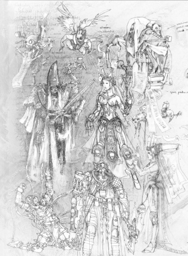

<!-- A0105-B0004 -->

原译文

A variety of Inquisitorial Henchmen 各种各样的审判官追随者

**校订译文**

A variety of Inquisitorial Henchmen 各种各样的审判官追随者

<!-- /A0105-B0004 -->

<!-- A0105-B0005 -->
## Ranks 等级

<!-- /A0105-B0005 -->

<!-- A0105-B0006 -->
**英文原文**

High Interrogator - A senior rank of Interrogator, but still short of full Inquisitorial status.

<!-- /A0105-B0006 -->

<!-- A0105-B0007 -->

原译文

高级审讯者 - 审讯者的高级级别，但仍然没有完全的审判官地位。

**校订译文**

高级审讯者 - 审讯者的高级级别，但仍然没有完全的审判官地位。

<!-- /A0105-B0007 -->

<!-- A0105-B0008 -->
**英文原文**

Interrogator - The second stage for an Inquisitor in training. Interrogators are both capable and strong, having a tremendous will to survive battle alongside their mentors.

<!-- /A0105-B0008 -->

<!-- A0105-B0009 -->

原译文

审讯者 - 审判官训练的第二阶段。审讯者既有能力又强壮，有着与导师并肩作战的巨大意志。

**校订译文**

审讯者——审判官培养过程中的第二阶段。他们能力出众、意志坚韧，即使与导师共同身陷战场，也有强烈的求生意志。

<!-- /A0105-B0009 -->

<!-- A0105-B0010 -->
**英文原文**

Explicator - The first step of an Inquisitor in training, they learn how to extract information using torture under the direction of their mentor Inquisitor.

<!-- /A0105-B0010 -->

<!-- A0105-B0011 -->

原译文

解释者 - 作为审判官训练的第一步，他们学习如何在审判官导师的指导下使用酷刑提取信息。

**校订译文**

解释者 - 作为审判官训练的第一步，他们学习如何在审判官导师的指导下使用酷刑提取信息。

<!-- /A0105-B0011 -->

<!-- A0105-B0012 -->
**英文原文**

Legate Investigator - Some Ordos, such as the Ordo Calixis, make use of Acolytes gifted with a formal carta of inquiry and a Sigil of Question, giving them the formal authority of the Inquisition for the duration of a particular investigation.

<!-- /A0105-B0012 -->

<!-- A0105-B0013 -->

原译文

使节调查者 - 一些修会，如卡利西斯修会，利用具有正式调查证书和怀疑之印的侍从，在特定调查期间赋予他们审判庭的正式权力。

**校订译文**

调查使节——卡利西斯审判庭等部分分支，会向侍从颁发正式调查敕书与问询印记，使其在某次特定调查期间获得审判庭的正式授权。

<!-- /A0105-B0013 -->

<!-- A0105-B0014 -->
**英文原文**

Prime - The lead Acolyte of a Warband.

<!-- /A0105-B0014 -->

<!-- A0105-B0015 -->

原译文

首席 - 战帮的领导侍从

**校订译文**

首席 - 战帮的领导侍从

<!-- /A0105-B0015 -->

<!-- A0105-B0016 -->
**英文原文**

Throne Agent - The most trusted members of an Inquisitor's retinue, Throne Agents have ascended to join the ranks of the Inquisition itself, and have both power and responsibility accordingly.

<!-- /A0105-B0016 -->

<!-- A0105-B0017 -->

原译文

王座特工 - 王座特工是审判官的随从中最值得信赖的成员，他们已经升任加入审判官等级，并相应地拥有权力和责任。

**校订译文**

王座特工——审判官随从中最受信任的成员。他们已晋升为审判庭本身的正式成员，并承担相应的权力与责任。

<!-- /A0105-B0017 -->

<!-- A0105-B0018 -->
**英文原文**

Trusted Acolyte - Often given positions of responsibility, such as running an Inquisitor's facilities while they are away or operating in long-term undercover operations.

<!-- /A0105-B0018 -->

<!-- A0105-B0019 -->

原译文

可信侍从 - 通常被赋予责任职位，例如在审判官不在的时候管理他们的设施，或者在长期的卧底行动中运作。

**校订译文**

可信侍从 - 通常被赋予责任职位，例如在审判官不在的时候管理他们的设施，或者在长期的卧底行动中运作。

<!-- /A0105-B0019 -->

<!-- A0105-B0020 -->
**英文原文**

Proven Acolyte - After a cell has completed several successful missions, they are inducted more fully into the workings of the Inquisition and can operate more interdependently.

<!-- /A0105-B0020 -->

<!-- A0105-B0021 -->

原译文

受证侍从 - 在一个单元完成了几次成功的任务后，他们会更充分地融入审判庭的工作，并且可以更相互依存地运作。

**校订译文**

受证侍从——所属行动小组多次成功完成任务后，成员便会更深入地参与审判庭事务，并能以更密切的协作方式行动。

**校注：** 原文写 interdependently（相互依赖、协作），虽然等级晋升语境可能使人联想到 independently（独立），此处仍按现有英文保留，待核底本。

<!-- /A0105-B0021 -->

<!-- A0105-B0022 -->
**英文原文**

Acolyte - Servants and aids of Inquisitors. Though not of the rank of Inquisitors, they are nonetheless considered agents of the Inquisition.

<!-- /A0105-B0022 -->

<!-- A0105-B0023 -->

原译文

侍从 - 审判官的仆人和助手。虽然他们不是审判官，但他们仍然被认为是审判庭的特工。

**校订译文**

侍从 - 审判官的仆人和助手。虽然他们不是审判官，但他们仍然被认为是审判庭的特工。

<!-- /A0105-B0023 -->

<!-- A0105-B0024 -->
## Archetypes 常见类型

原题：Archetypes 原型

<!-- /A0105-B0024 -->

<!-- A0105-B0025 -->
**英文原文**

In theory, almost any type of Imperial citizen can be seconded by an Inquisitor for service to the Inquisition. Some of the most frequently found archetypes are listed below.

<!-- /A0105-B0025 -->

<!-- A0105-B0026 -->

原译文

理论上，几乎任何类型的帝国公民都可以被审判官借调为审判庭服务。下面列出了一些最常见的原型。

**校订译文**

理论上，几乎任何帝国公民都可被审判官借调，为审判庭服务。以下列出其中一些常见类型。

<!-- /A0105-B0026 -->

<!-- A0105-B0027 -->
### Acolyte 侍从

<!-- /A0105-B0027 -->

<!-- A0105-B0028 -->
**英文原文**

Some Acolytes are unique positions only found within the Inquisition, such as Interrogators who act as their Inquisitor's apprentice.

<!-- /A0105-B0028 -->

<!-- A0105-B0029 -->

原译文

一些侍从是只有在审判庭内才能找到的独特职位，比如充当审判官学徒的审讯者。

**校订译文**

有些侍从担任审判庭独有的职位，例如作为审判官学徒的审讯者。

<!-- /A0105-B0029 -->

<!-- A0105-B0030 图片 -->
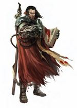

<!-- A0105-B0031 -->

原译文

Interrogator 审讯者

**校订译文**

Interrogator 审讯者

<!-- /A0105-B0031 -->

<!-- A0105-B0032 -->

原译文

Agent of Reliquary 26 圣物箱特工26

**校订译文**

Agent of Reliquary 26 第 26 圣物库特工

<!-- /A0105-B0032 -->

<!-- A0105-B0033 -->

原译文

Explicator 解释者

**校订译文**

Explicator 解释者

<!-- /A0105-B0033 -->

<!-- A0105-B0034 -->

原译文

Interrogator 审讯者

**校订译文**

Interrogator 审讯者

<!-- /A0105-B0034 -->

<!-- A0105-B0035 -->

原译文

Legate Investigator 使节调查者

**校订译文**

Legate Investigator 调查使节

<!-- /A0105-B0035 -->

<!-- A0105-B0036 -->

原译文

Notary 公证者

**校订译文**

Notary 公证者

<!-- /A0105-B0036 -->

<!-- A0105-B0037 -->

原译文

Ordo Sicarius Initiate 刺客修会信徒

**校订译文**

Ordo Sicarius Initiate 刺客审判庭见习者

<!-- /A0105-B0037 -->

<!-- A0105-B0038 -->

原译文

Sin Eater 食罪者

**校订译文**

Sin Eater 食罪者

<!-- /A0105-B0038 -->

<!-- A0105-B0039 -->

原译文

Tyrantine Shadow Agent 暴君暗影特工

**校订译文**

Tyrantine Shadow Agent 暴君暗影特工

<!-- /A0105-B0039 -->

<!-- A0105-B0040 -->
### Adepta Sororitas 修女会

<!-- /A0105-B0040 -->

<!-- A0105-B0041 -->
**英文原文**

The Adepta Sororitas are the Ecclesiarchy's fighting arm.

<!-- /A0105-B0041 -->

<!-- A0105-B0042 -->

原译文

修女会是国教的战斗武装。

**校订译文**

修女会是国教会的军事武装。

<!-- /A0105-B0042 -->

<!-- A0105-B0043 图片 -->

<!-- A0105-B0044 -->

原译文

Battle Sister 战斗修女

**校订译文**

Battle Sister 战斗修女

<!-- /A0105-B0044 -->

<!-- A0105-B0045 -->

原译文

Sister Oblatia 奉献修女

**校订译文**

Sister Oblatia 奉献修女

<!-- /A0105-B0045 -->

<!-- A0105-B0046 -->

原译文

Sister of Battle Canoness 战斗修女大修女

**校订译文**

Sister of Battle Canoness 战斗修女大修女

<!-- /A0105-B0046 -->

<!-- A0105-B0047 -->
### Arco-Flagellant 鞭挞苦修者

原题：Arco-Flagellant 鞭笞机仆

<!-- /A0105-B0047 -->

<!-- A0105-B0048 -->
**英文原文**

An Arco-Flagellant is a heretic turned into a combat servitor by the Ecclesiarchy.

<!-- /A0105-B0048 -->

<!-- A0105-B0049 -->

原译文

鞭笞机仆是一个异端，被国教变成了战斗机仆。

**校订译文**

鞭挞苦修者是遭国教会改造成战斗机仆的异端。

<!-- /A0105-B0049 -->

<!-- A0105-B0050 图片 -->
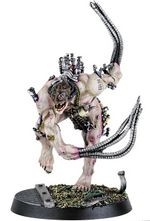

<!-- A0105-B0051 -->

原译文

Arco-Flagellant 鞭笞机仆

**校订译文**

Arco-Flagellant 鞭挞苦修者

<!-- /A0105-B0051 -->

<!-- A0105-B0052 -->
### Assassin 刺客

<!-- /A0105-B0052 -->

<!-- A0105-B0053 -->
**英文原文**

Assassins are agents specialized in killing and infiltration.

<!-- /A0105-B0053 -->

<!-- A0105-B0054 -->

原译文

刺客是专门从事杀戮和渗透的特工。

**校订译文**

刺客是专门从事杀戮和渗透的特工。

<!-- /A0105-B0054 -->

<!-- A0105-B0055 图片 -->

<!-- A0105-B0056 -->

原译文

Vindicare Assassin 文迪卡刺客

**校订译文**

Vindicare Assassin 文迪卡刺客

<!-- /A0105-B0056 -->

<!-- A0105-B0057 -->

原译文

Death Cultist 死亡教徒

**校订译文**

Death Cultist 死亡教徒

<!-- /A0105-B0057 -->

<!-- A0105-B0058 -->

原译文

Malfian Bloodsworn 马尔菲安血誓

**校订译文**

Malfian Bloodsworn 马尔菲安血誓者

<!-- /A0105-B0058 -->

<!-- A0105-B0059 -->

原译文

Maletek Stalker 马勒泰克追猎者

**校订译文**

Maletek Stalker 马勒泰克追猎者

<!-- /A0105-B0059 -->

<!-- A0105-B0060 -->

原译文

Metallican Gunslinger 金属神枪

**校订译文**

Metallican Gunslinger 梅塔利卡枪手

<!-- /A0105-B0060 -->

<!-- A0105-B0061 -->

原译文

Moritat Reaper 死亡收割者

**校订译文**

Moritat Reaper 死亡收割者

<!-- /A0105-B0061 -->

<!-- A0105-B0062 -->

原译文

Officio Assassin 刺客庭

**校订译文**

Officio Assassin 刺客庭刺客

<!-- /A0105-B0062 -->

<!-- A0105-B0063 -->

原译文

Callidus Assassin 卡利都司刺客

**校订译文**

Callidus Assassin 卡利都司刺客

<!-- /A0105-B0063 -->

<!-- A0105-B0064 -->

原译文

Eversor Assassin 艾弗森刺客

**校订译文**

Eversor Assassin 艾弗森刺客

<!-- /A0105-B0064 -->

<!-- A0105-B0065 -->

原译文

Vindicare Assassin 文迪卡刺客

**校订译文**

Vindicare Assassin 文迪卡刺客

<!-- /A0105-B0065 -->

<!-- A0105-B0066 -->
### Chiurgeon 外科医生

<!-- /A0105-B0066 -->

<!-- A0105-B0067 -->
**英文原文**

Chiurgeons specialize not only in the art of healing but also the art of repentance, interrogation, and the yielding of information through torture.

<!-- /A0105-B0067 -->

<!-- A0105-B0068 -->

原译文

外科医生不仅专注于治疗艺术，还专注于忏悔、审讯和通过酷刑提供信息的艺术。

**校订译文**

外科医师不仅擅长医治伤病，也精通迫人忏悔、审讯以及施加酷刑以获取情报。

<!-- /A0105-B0068 -->

<!-- A0105-B0069 图片 -->
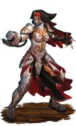

<!-- A0105-B0070 -->

原译文

Sister Hospitaller 医院修女

**校订译文**

Sister Hospitaller 医疗修女

<!-- /A0105-B0070 -->

<!-- A0105-B0071 -->

原译文

Torturer 拷问者

**校订译文**

Torturer 拷问者

<!-- /A0105-B0071 -->

<!-- A0105-B0072 -->

原译文

Excoriator 严斥者

**校订译文**

Excoriator 严斥者

<!-- /A0105-B0072 -->

<!-- A0105-B0073 -->

原译文

Sister Hospitaller 医院修女

**校订译文**

Sister Hospitaller 医疗修女

<!-- /A0105-B0073 -->

<!-- A0105-B0074 -->
### Cultists and Fanatics 教徒和狂热者

<!-- /A0105-B0074 -->

<!-- A0105-B0075 -->
**英文原文**

Cultists, such as the Redemptionists, can be commonly be found in an Inquisitor's retinue.

<!-- /A0105-B0075 -->

<!-- A0105-B0076 -->

原译文

教徒，如救赎主义者，通常可以在审判官的随从中找到。

**校订译文**

教徒，如救赎主义者，通常可以在审判官的随从中找到。

<!-- /A0105-B0076 -->

<!-- A0105-B0077 图片 -->
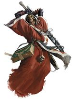

<!-- A0105-B0078 -->

原译文

Cultist 教徒

**校订译文**

Cultist 教徒

<!-- /A0105-B0078 -->

<!-- A0105-B0079 -->

原译文

Fanatic 狂热者

**校订译文**

Fanatic 狂热者

<!-- /A0105-B0079 -->

<!-- A0105-B0080 -->

原译文

Demagogue 煽动者

**校订译文**

Demagogue 煽动者

<!-- /A0105-B0080 -->

<!-- A0105-B0081 -->

原译文

Enlightener 启蒙者

**校订译文**

Enlightener 启蒙者

<!-- /A0105-B0081 -->

<!-- A0105-B0082 -->

原译文

Questkeeper 探索保管者

**校订译文**

Questkeeper 探索保管者

<!-- /A0105-B0082 -->

<!-- A0105-B0083 -->
### Daemonhost 恶魔宿主

<!-- /A0105-B0083 -->

<!-- A0105-B0084 -->
**英文原文**

A Daemonhost is a living mortal body used as a receptacle to bind a daemon.

<!-- /A0105-B0084 -->

<!-- A0105-B0085 -->

原译文

恶魔宿主是一个活生生的凡人身体，用作束缚恶魔的容器。

**校订译文**

恶魔宿主是一个活生生的凡人身体，用作束缚恶魔的容器。

<!-- /A0105-B0085 -->

<!-- A0105-B0086 -->
### Desperados 亡命徒

<!-- /A0105-B0086 -->

<!-- A0105-B0087 -->
**英文原文**

Desperados or Scum are rogues and killers.

<!-- /A0105-B0087 -->

<!-- A0105-B0088 -->

原译文

亡命徒或渣滓都是恶棍和杀手。

**校订译文**

亡命徒或渣滓都是恶棍和杀手。

<!-- /A0105-B0088 -->

<!-- A0105-B0089 图片 -->
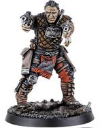

<!-- A0105-B0090 -->

原译文

Desperados 亡命徒

**校订译文**

Desperados 亡命徒

<!-- /A0105-B0090 -->

<!-- A0105-B0091 -->

原译文

Cult-Stalker 教派追猎者

**校订译文**

Cult-Stalker 教派追猎者

<!-- /A0105-B0091 -->

<!-- A0105-B0092 -->

原译文

Malfian Bloodsworn 马尔菲安血誓

**校订译文**

Malfian Bloodsworn 马尔菲安血誓者

<!-- /A0105-B0092 -->

<!-- A0105-B0093 -->

原译文

Metallican Gunslinger 金属神枪

**校订译文**

Metallican Gunslinger 梅塔利卡枪手

<!-- /A0105-B0093 -->

<!-- A0105-B0094 -->

原译文

Reclaimator 回收者

**校订译文**

Reclaimator 回收者

<!-- /A0105-B0094 -->

<!-- A0105-B0095 -->
### Familiar 魔宠

<!-- /A0105-B0095 -->

<!-- A0105-B0096 -->
**英文原文**

Familiars are constructs attuned to the Inquisitor's mental signature.

<!-- /A0105-B0096 -->

<!-- A0105-B0097 -->

原译文

魔宠是与审判官的精神特征相适应的结构体。

**校订译文**

魔宠是与审判官的精神印记协调匹配的构造体。

<!-- /A0105-B0097 -->

<!-- A0105-B0098 图片 -->
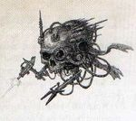

<!-- A0105-B0099 -->

原译文

Servo-skull 伺服颅骨

**校订译文**

Servo-skull 伺服颅骨

<!-- /A0105-B0099 -->

<!-- A0105-B0100 -->

原译文

Cherubim 智天使

**校订译文**

Cherubim 智天使

<!-- /A0105-B0100 -->

<!-- A0105-B0101 -->

原译文

Servo-skull 伺服颅骨

**校订译文**

Servo-skull 伺服颅骨

<!-- /A0105-B0101 -->

<!-- A0105-B0102 -->

原译文

Psyber-eagle 灵械天鹰

**校订译文**

Psyber-eagle 灵械天鹰

<!-- /A0105-B0102 -->

<!-- A0105-B0103 -->
### Hierophant 圣职者

<!-- /A0105-B0103 -->

<!-- A0105-B0104 -->
**英文原文**

Hierophants or Clerics are pious holy men of the Ecclesiarchy such as Priests or Banishers, able to join the Inquisitor in prayer and boost his enchantments against Daemons.

<!-- /A0105-B0104 -->

<!-- A0105-B0105 -->

原译文

圣职者或神职者是国教中虔诚的圣者，如牧师或放逐者，能够与审判官一起祈祷，增强他对抗恶魔的魔法。

**校订译文**

圣职者或神职人员是国教会中虔诚的教士，如牧师或放逐者。他们可以与审判官共同祈祷，增强其对抗恶魔的祷咒效力。

<!-- /A0105-B0105 -->

<!-- A0105-B0106 图片 -->
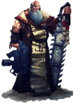

<!-- A0105-B0107 -->

原译文

Banisher 放逐者

**校订译文**

Banisher 放逐者

<!-- /A0105-B0107 -->

<!-- A0105-B0108 -->

原译文

Banisher 放逐者

**校订译文**

Banisher 放逐者

<!-- /A0105-B0108 -->

<!-- A0105-B0109 -->

原译文

Black Priest of Maccabeus 马加比的黑牧师

**校订译文**

Black Priest of Maccabeus 马加比的黑牧师

<!-- /A0105-B0109 -->

<!-- A0105-B0110 -->

原译文

Cardinal 红衣主教

**校订译文**

Cardinal 红衣主教

<!-- /A0105-B0110 -->

<!-- A0105-B0111 -->

原译文

Castigator 惩戒者

**校订译文**

Castigator 惩戒者坦克

<!-- /A0105-B0111 -->

<!-- A0105-B0112 -->

原译文

Daemonym Seeker 恶魔追踪者

**校订译文**

Daemonym Seeker 恶魔追踪者

<!-- /A0105-B0112 -->

<!-- A0105-B0113 -->

原译文

Drill Abbot 军演院长

**校订译文**

Drill Abbot 训导院长

<!-- /A0105-B0113 -->

<!-- A0105-B0114 -->

原译文

Forsaken Priest 遗弃牧师

**校订译文**

Forsaken Priest 遗弃牧师

<!-- /A0105-B0114 -->

<!-- A0105-B0115 -->

原译文

Hexorcist 驱咒者

**校订译文**

Hexorcist 驱咒者

<!-- /A0105-B0115 -->

<!-- A0105-B0116 -->

原译文

Ecclesiarchy Priest 国教牧师

**校订译文**

Ecclesiarchy Priest 国教牧师

<!-- /A0105-B0116 -->

<!-- A0105-B0117 -->

原译文

Exorcist 驱魔者

**校订译文**

Exorcist 驱魔者

<!-- /A0105-B0117 -->

<!-- A0105-B0118 -->

原译文

Preacher 传道士

**校订译文**

Preacher 传道士

<!-- /A0105-B0118 -->

<!-- A0105-B0119 -->
### Mutant 变种人

<!-- /A0105-B0119 -->

<!-- A0105-B0120 -->
**英文原文**

Mutants are creatures bearing some form of severe genetic deviance from the normal members of their species.

<!-- /A0105-B0120 -->

<!-- A0105-B0121 -->

原译文

变种人是指与物种的正常成员存在某种形式的严重遗传偏差的生物。

**校订译文**

变种人是指与物种的正常成员存在某种形式的严重遗传偏差的生物。

<!-- /A0105-B0121 -->

<!-- A0105-B0122 图片 -->

<!-- A0105-B0123 -->

原译文

Mutant 变种人

**校订译文**

Mutant 变种人

<!-- /A0105-B0123 -->

<!-- A0105-B0124 -->
### Mystic 神秘者

<!-- /A0105-B0124 -->

<!-- A0105-B0125 -->
**英文原文**

Mystics or Psykers often accompanying Inquisitors that lack any psychic abilities of their own, they can also serve as advisors, psychic shields or even a decoy as the daemons are attracted to the psychic mind of the Mystic.

<!-- /A0105-B0125 -->

<!-- A0105-B0126 -->

原译文

神秘者或灵能者经常伴随着缺乏任何灵能能力的审判官，他们也可以作为顾问、灵能屏障，甚至是诱饵，因为恶魔被神秘者的灵能思维所吸引。

**校订译文**

神秘者或灵能者经常伴随着缺乏任何灵能能力的审判官，他们也可以作为顾问、灵能屏障，甚至是诱饵，因为恶魔被神秘者的灵能思维所吸引。

<!-- /A0105-B0126 -->

<!-- A0105-B0127 图片 -->
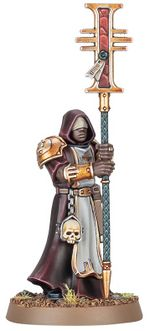

<!-- A0105-B0128 -->

原译文

Mystic 神秘者

**校订译文**

Mystic 神秘者

<!-- /A0105-B0128 -->

<!-- A0105-B0129 -->

原译文

Astropath 星语者

**校订译文**

Astropath 星语者

<!-- /A0105-B0129 -->

<!-- A0105-B0130 -->

原译文

Imperial Diviner 帝国占卜者

**校订译文**

Imperial Diviner 帝国占卜者

<!-- /A0105-B0130 -->

<!-- A0105-B0131 -->

原译文

Primaris Psyker 首席灵能者

**校订译文**

Primaris Psyker 灵能导师

<!-- /A0105-B0131 -->

<!-- A0105-B0132 -->

原译文

Sanctioned Psyker 合法灵能者

**校订译文**

Sanctioned Psyker 合法灵能者

<!-- /A0105-B0132 -->

<!-- A0105-B0133 -->

原译文

Tainted Psyker 污染灵能者

**校订译文**

Tainted Psyker 污染灵能者

<!-- /A0105-B0133 -->

<!-- A0105-B0134 -->

原译文

Templar Calix of the Scholastia Psykana 灵能学院的圣杯圣殿骑士

**校订译文**

Templar Calix of the Scholastia Psykana 灵能学院的圣杯圣殿骑士

<!-- /A0105-B0134 -->

<!-- A0105-B0135 -->

原译文

Theomancer 神术师

**校订译文**

Theomancer 神术师

<!-- /A0105-B0135 -->

<!-- A0105-B0136 -->

原译文

Verminspeaker 劣语者

**校订译文**

Verminspeaker 虫鼠语者

<!-- /A0105-B0136 -->

<!-- A0105-B0137 -->

原译文

Warp-Seer 亚空间先知

**校订译文**

Warp-Seer 亚空间先知

<!-- /A0105-B0137 -->

<!-- A0105-B0138 -->
### Penitent 忏悔者

<!-- /A0105-B0138 -->

<!-- A0105-B0139 -->
**英文原文**

Penitents are rogue psykers that have been captured and made to repent by an Inquisitor and been put to service by their deliverer.

<!-- /A0105-B0139 -->

<!-- A0105-B0140 -->

原译文

忏悔者是非法灵能者，他们被审判官俘虏并忏悔，并为他们的拯救者服务。

**校订译文**

忏悔者是被审判官捕获、强迫悔罪的非法灵能者，随后须为这位所谓的救赎者效力。

<!-- /A0105-B0140 -->

<!-- A0105-B0141 图片 -->
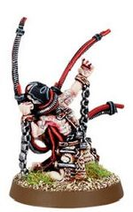

<!-- A0105-B0142 -->

原译文

Penitent 忏悔者

**校订译文**

Penitent 忏悔者

<!-- /A0105-B0142 -->

<!-- A0105-B0143 -->

原译文

Bound Psyker 束缚灵能者

**校订译文**

Bound Psyker 束缚灵能者

<!-- /A0105-B0143 -->

<!-- A0105-B0144 -->

原译文

Penitent Witch 忏悔女巫

**校订译文**

Penitent Witch 忏悔巫师

<!-- /A0105-B0144 -->

<!-- A0105-B0145 -->

原译文

Pariah 被遗弃者

**校订译文**

Pariah 被遗弃者

**校注：** Pariah 在此为角色类型，不能仅按普通英语解作被社会遗弃的人；需结合原始游戏资料确认是否指无魂者，以及与其他种族同名单位的区别。暂保留原译待核。

<!-- /A0105-B0145 -->

<!-- A0105-B0146 -->
### Rogue Trader 行商浪人

<!-- /A0105-B0146 -->

<!-- A0105-B0147 -->
**英文原文**

Rogue Traders may work for an Inquisitor, either as a solo agent or part of the Inquisitor's retinue.

<!-- /A0105-B0147 -->

<!-- A0105-B0148 -->

原译文

行商浪人可能为审判官工作，无论是作为单独特工还是审判官随从的一部分。

**校订译文**

行商浪人可能为审判官工作，无论是作为单独特工还是审判官随从的一部分。

<!-- /A0105-B0148 -->

<!-- A0105-B0149 图片 -->
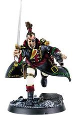

<!-- A0105-B0150 -->

原译文

Rogue Trader 行商浪人

**校订译文**

Rogue Trader 行商浪人

<!-- /A0105-B0150 -->

<!-- A0105-B0151 -->
### Sage 智者

<!-- /A0105-B0151 -->

<!-- A0105-B0152 -->
**英文原文**

A Sage, Savant, or Adept is an administrative specialist, often biologically augmented with increased mental storage and processing power.

<!-- /A0105-B0152 -->

<!-- A0105-B0153 -->

原译文

智者、学者或专家是一名行政专家，通常在生物学上具有增强的精神存储和处理能力。

**校订译文**

智者、学者或文吏是处理行政事务的专家，通常接受过生物强化，以提高记忆储存与信息处理能力。

<!-- /A0105-B0153 -->

<!-- A0105-B0154 图片 -->
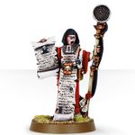

<!-- A0105-B0155 -->

原译文

Sister Dialogous 交流修女

**校订译文**

Sister Dialogous 书记修女

<!-- /A0105-B0155 -->

<!-- A0105-B0156 -->

原译文

Autosavant 自动学者

**校订译文**

Autosavant 自动学者

<!-- /A0105-B0156 -->

<!-- A0105-B0157 -->

原译文

Bonded Emissary 约束密使

**校订译文**

Bonded Emissary 约束密使

<!-- /A0105-B0157 -->

<!-- A0105-B0158 -->

原译文

Calculus Logi 计算逻辑士

**校订译文**

Calculus Logi 计算逻辑士

<!-- /A0105-B0158 -->

<!-- A0105-B0159 -->

原译文

Calixian Xeno-Arcanist 卡利西安异型秘术师

**校订译文**

Calixian Xeno-Arcanist 卡利西安异形秘术师

<!-- /A0105-B0159 -->

<!-- A0105-B0160 -->

原译文

Daemonym Seeker 恶魔追踪者

**校订译文**

Daemonym Seeker 恶魔追踪者

<!-- /A0105-B0160 -->

<!-- A0105-B0161 -->

原译文

Lexmechanic 思律机僧

**校订译文**

Lexmechanic 思律机僧

<!-- /A0105-B0161 -->

<!-- A0105-B0162 -->

原译文

Malefic Scholar 邪恶学者

**校订译文**

Malefic Scholar 邪恶学者

<!-- /A0105-B0162 -->

<!-- A0105-B0163 -->

原译文

Sister Dialogous 交流修女

**校订译文**

Sister Dialogous 书记修女

<!-- /A0105-B0163 -->

<!-- A0105-B0164 -->
### Seeker 追踪者

<!-- /A0105-B0164 -->

<!-- A0105-B0165 -->
**英文原文**

Seekers are used to catch criminals. They are often drawn from Arbitrators and Enforcers who apprehend and punish those who break the Emperor's laws.

<!-- /A0105-B0165 -->

<!-- A0105-B0166 -->

原译文

追踪者被用来抓罪犯。他们通常来自仲裁员和执法者，他们逮捕并惩罚那些违反帝皇的法律的人。

**校订译文**

追踪者负责缉拿罪犯，通常从仲裁官和执法者中选拔，逮捕并惩罚违反帝皇律法的人。

<!-- /A0105-B0166 -->

<!-- A0105-B0167 图片 -->

<!-- A0105-B0168 -->

原译文

Arbitrator 仲裁员

**校订译文**

Arbitrator 仲裁官

<!-- /A0105-B0168 -->

<!-- A0105-B0169 -->

原译文

Cult-Stalker 教派追猎者

**校订译文**

Cult-Stalker 教派追猎者

<!-- /A0105-B0169 -->

<!-- A0105-B0170 -->

原译文

Judge 法官

**校订译文**

Judge 法官

<!-- /A0105-B0170 -->

<!-- A0105-B0171 -->

原译文

Malfian Bloodsworn 马尔菲安血誓

**校订译文**

Malfian Bloodsworn 马尔菲安血誓者

<!-- /A0105-B0171 -->

<!-- A0105-B0172 -->

原译文

Mortiurge 告死者

**校订译文**

Mortiurge 告死者

<!-- /A0105-B0172 -->

<!-- A0105-B0173 -->

原译文

Warden of the Divisio Immoralis 邪恶分支守望者

**校订译文**

Warden of the Divisio Immoralis 邪恶分支守望者

<!-- /A0105-B0173 -->

<!-- A0105-B0174 -->

原译文

Bounty Hunter 赏金猎人

**校订译文**

Bounty Hunter 赏金猎人

<!-- /A0105-B0174 -->

<!-- A0105-B0175 -->
### Space Marine 星际战士

<!-- /A0105-B0175 -->

<!-- A0105-B0176 -->
**英文原文**

Space Marines can be found in an Inquisitor's service, especially those of the Deathwatch who serve as the Chamber Militant of the Ordo Xenos.

<!-- /A0105-B0176 -->

<!-- A0105-B0177 -->

原译文

星际战士可以在审判官的侍从中找到，尤其是那些担任攘外修会的军事辅军的死亡守望。

**校订译文**

有些星际战士会为审判官效力，尤其是作为异形审判庭军事武装的死亡守望成员。

<!-- /A0105-B0177 -->

<!-- A0105-B0178 图片 -->
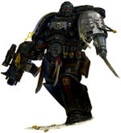

<!-- A0105-B0179 -->

原译文

Deathwatch Veteran 死亡守望老兵

**校订译文**

Deathwatch Veteran 死亡守望老兵

<!-- /A0105-B0179 -->

<!-- A0105-B0180 -->

原译文

Deathwatch Space Marine 死亡守望星际战士

**校订译文**

Deathwatch Space Marine 死亡守望星际战士

<!-- /A0105-B0180 -->

<!-- A0105-B0181 -->

原译文

Grey Knights Space Marine 灰骑士星际战士

**校订译文**

Grey Knights Space Marine 灰骑士星际战士

<!-- /A0105-B0181 -->

<!-- A0105-B0182 -->
### Techpriest 技术祭司

原题：Techpriest 技术神甫

<!-- /A0105-B0182 -->

<!-- A0105-B0183 -->
**英文原文**

Techpriests of the Adeptus Mechanicus frequently serve in an Inquisitor's retinue.

<!-- /A0105-B0183 -->

<!-- A0105-B0184 -->

原译文

机械神教的技术神甫经常在审判官的随从中服役。

**校订译文**

机械修会的技术祭司经常加入审判官的随从队伍。

<!-- /A0105-B0184 -->

<!-- A0105-B0185 图片 -->
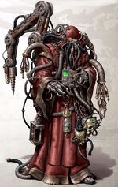

<!-- A0105-B0186 -->

原译文

Techpriest 技术神甫

**校订译文**

Techpriest 技术祭司

<!-- /A0105-B0186 -->

<!-- A0105-B0187 -->

原译文

Bonded Emissary 约束密使

**校订译文**

Bonded Emissary 约束密使

<!-- /A0105-B0187 -->

<!-- A0105-B0188 -->

原译文

Heretek Savant 技术异端学者

**校订译文**

Heretek Savant 技术异端学者

<!-- /A0105-B0188 -->

<!-- A0105-B0189 -->

原译文

Magos 贤者

**校订译文**

Magos 贤者

<!-- /A0105-B0189 -->

<!-- A0105-B0190 -->

原译文

Secutor 追击士

**校订译文**

Secutor 追击士

<!-- /A0105-B0190 -->

<!-- A0105-B0191 -->

原译文

Techpriest 技术神甫

**校订译文**

Techpriest 技术祭司

<!-- /A0105-B0191 -->

<!-- A0105-B0192 -->

原译文

Techsorcist 技术巫师

**校订译文**

Techsorcist 技术驱魔师

<!-- /A0105-B0192 -->

<!-- A0105-B0193 -->
### Warrior 战士

<!-- /A0105-B0193 -->

<!-- A0105-B0194 -->
**英文原文**

A Warrior is used by more militant Inquisitors. They are generally there to provide the Inquisitor with covering fire or combat support and form the Inquisitor's bodyguard.

<!-- /A0105-B0194 -->

<!-- A0105-B0195 -->

原译文

战士被更激进的审判官使用。他们通常在那里为审判官提供掩护火力或战斗支援，并组成审判官的护卫。

**校订译文**

偏好武力手段的审判官会招募战士，为其提供掩护火力和战斗支援，并担任贴身护卫。

<!-- /A0105-B0195 -->

<!-- A0105-B0196 图片 -->
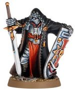

<!-- A0105-B0197 -->

原译文

Crusader 十字军

**校订译文**

Crusader 十字军

<!-- /A0105-B0197 -->

<!-- A0105-B0198 -->

原译文

Chaliced Commissariat Operative 圣杯政委部特工

**校订译文**

Chaliced Commissariat Operative 圣杯政委部特工

<!-- /A0105-B0198 -->

<!-- A0105-B0199 -->

原译文

Chrono-gladiator 时间角斗士

**校订译文**

Chrono-gladiator 时间角斗士

<!-- /A0105-B0199 -->

<!-- A0105-B0200 -->

原译文

Crusader 十字军

**校订译文**

Crusader 十字军

<!-- /A0105-B0200 -->

<!-- A0105-B0201 -->

原译文

Feral Warrior 野蛮战士

**校订译文**

Feral Warrior 野蛮战士

<!-- /A0105-B0201 -->

<!-- A0105-B0202 -->

原译文

Death World Veteran 死亡世界老兵

**校订译文**

Death World Veteran 死亡世界老兵

<!-- /A0105-B0202 -->

<!-- A0105-B0203 -->

原译文

Imperial Guard Veteran 帝国卫队老兵

**校订译文**

Imperial Guard Veteran 帝国卫队老兵

<!-- /A0105-B0203 -->

<!-- A0105-B0204 -->

原译文

Malfian Bloodsworn 马尔菲安血誓

**校订译文**

Malfian Bloodsworn 马尔菲安血誓者

<!-- /A0105-B0204 -->

<!-- A0105-B0205 -->

原译文

Penal Legionnaire 刑罚军团士兵

**校订译文**

Penal Legionnaire 刑罚军团士兵

<!-- /A0105-B0205 -->

<!-- A0105-B0206 -->

原译文

Pistoleer 手枪兵

**校订译文**

Pistoleer 手枪兵

<!-- /A0105-B0206 -->

<!-- A0105-B0207 -->

原译文

Pyroclast 火山岩

**校订译文**

Pyroclast 焚火者

**校注：** Pyroclast 在此列为人员类型，原译“火山岩”为普通词义误套。暂译“焚火者”，待核对应角色资料。

<!-- /A0105-B0207 -->

<!-- A0105-B0208 -->

原译文

Combat-Servitor 战斗机仆

**校订译文**

Combat-Servitor 战斗机仆

<!-- /A0105-B0208 -->

<!-- A0105-B0209 -->

原译文

Gun-Servitor 枪炮机仆

**校订译文**

Gun-Servitor 枪炮机仆

<!-- /A0105-B0209 -->

<!-- A0105-B0210 -->

原译文

Storm Trooper 风暴兵

**校订译文**

Storm Trooper 风暴兵

<!-- /A0105-B0210 -->

<!-- A0105-B0211 -->
### Others 其他

<!-- /A0105-B0211 -->

<!-- A0105-B0212 -->

原译文

Warp Dabbler 亚空间涉猎者

**校订译文**

Warp Dabbler 亚空间涉猎者

<!-- /A0105-B0212 -->

本篇核心术语与暂定项

以下列出本篇出现的英文原形及核心术语表用词。同形词可能指不同对象，具体词义以本篇正文和校注为准；单复数、别名和仅见于图注的名称可能尚未列入。完整候选见[术语表](../../术语表/双语术语候选.csv)。

| 英文 | 采用中文 | 状态 |
| --- | --- | --- |
| Space Marines | 星际战士 | 官方已核对 |
| Deathwatch | 死亡守望 | 官方已核对 |
| Adepta Sororitas | 修女会 | 官方已核对 |
| Adeptus Mechanicus | 机械修会 | 官方已核对 |
| Inquisition | 审判庭 | 暂定 |
| Inquisitor | 审判官 | 官方已核对 |
| Servitor | 机仆 | 暂定 |
| Emperor | 帝皇 | 官方已核对 |
| Ecclesiarchy | 国教会 | 暂定 |
| Enforcers | 地方执法者 | 暂定·官方待核 |
| Ordo Xenos | 异形审判庭 | 用户指定 |
| Arbitrators | 仲裁官 | 暂定·官方待核 |
| Legate Investigator | 调查使节 | 暂定 |
| Mission | 教团／传教机构 | 暂定 |
| Mentors | 导师战团 | 暂定·官方待核 |
| Adept | 帝国任职者（广义）／文吏（行政语境） | 语境定译·官方待核 |
| Mystic | 神秘者 | 暂定·官方待核 |
| Ordo Calixis | 卡利西斯审判庭 | 暂定·官方待核 |
| Penitents | 忏悔者 | 暂定·官方待核 |
| Mortal | 凡人 | 暂定·官方待核 |
| Xenos | 异形 | 暂定·官方待核 |
| Seekers | 寻觅者 | 官方已核对 |
| Savant | 博学者 | 暂定·官方待核 |

