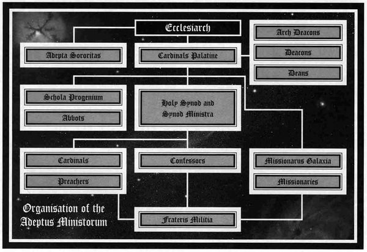
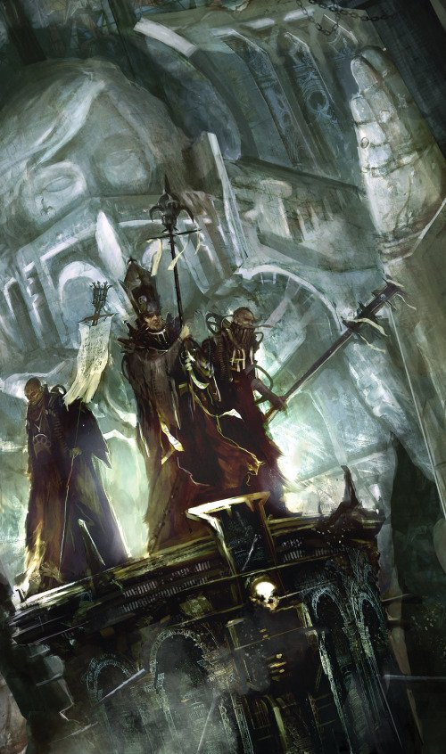

# 0106 国教会 Ecclesiarchy

精校状态：中文行文已逐段精校，部分术语仍为暂定

分类：通用概念 / 帝国 Imperium / 国教教会 Ecclesiarchy

原文来源：https://www.bilibili.com/opus/1051859335011893283

原作者：帝国神选罐头

原文时间：2025年04月04日 13:11

[返回分类目录](目录.md) · [全书目录](../../目录.md)

原篇名：国教教会 Ecclesiarchy

<!-- A0106-B0001 -->
**英文原文**

The Ecclesiarchy (officially the Adeptus Ministorum) is the hierarchy of the Imperial Cult. It maintains and spreads the Imperial Creed, the only official religion of the Imperium. Although the interpretation of the Ecclesiarchy's rites and dogma varies throughout the Imperium, any serious deviance from its strictures is considered heresy and dealt with severely. The Ecclesiarchy is based on Terra, its urban palace covering nearly all of the southernmost continent.

<!-- /A0106-B0001 -->

<!-- A0106-B0002 -->

原译文

国教（正式名称为国教教会）是帝国教派的统治集团。它维护和传播帝国信条，这是帝国唯一的官方宗教。尽管整个帝国对国教仪式和教条的解释各不相同，但任何严重偏离其严格规定的行为都被视为异端，并受到严厉处理。国教以泰拉为根据地，其城市宫殿几乎覆盖了整个最南端的大陆。

**校订译文**

国教会（正式名称为 Adeptus Ministorum）是帝皇信仰的教会组织，负责维护和传播帝国唯一官方宗教的教义。帝国各地对其仪式与教义虽有不同解释，但严重违反基本戒律的行为都会被视为异端，受到严厉惩处。国教会总部位于泰拉，其宫城几乎覆盖了泰拉最南端的整块大陆。

<!-- /A0106-B0002 -->

<!-- A0106-B0003 图片 -->

<!-- A0106-B0004 -->

原译文

Ecclesiarchy symbol 国教标志

**校订译文**

Ecclesiarchy symbol 国教标志

<!-- /A0106-B0004 -->

<!-- A0106-B0005 -->
**英文原文**

Headquarters:Ecclesiarchal Palace, Terra

<!-- /A0106-B0005 -->

<!-- A0106-B0006 -->

原译文

总部：国教宫殿，泰拉

**校订译文**

总部：国教宫殿，泰拉

<!-- /A0106-B0006 -->

<!-- A0106-B0007 -->
**英文原文**

Leader:Ecclesiarch Eos Ritira

<!-- /A0106-B0007 -->

<!-- A0106-B0008 -->

原译文

领袖：教宗厄俄斯·里特拉

**校订译文**

领袖：教宗厄俄斯·里特拉

<!-- /A0106-B0008 -->

<!-- A0106-B0009 -->
**英文原文**

Governing Body:Holy Synod

<!-- /A0106-B0009 -->

<!-- A0106-B0010 -->

原译文

管理机构：最高圣会

**校订译文**

管理机构：最高圣会

<!-- /A0106-B0010 -->

<!-- A0106-B0011 -->
**英文原文**

Armed Forces:Sisters of Battle，Death Cults，Crusaders，Frateris Militia

<!-- /A0106-B0011 -->

<!-- A0106-B0012 -->

原译文

武装力量：战斗姐妹、拜死教、十字军、教会民兵

**校订译文**

武装力量：战斗修女、拜死教、十字军、教会民兵

<!-- /A0106-B0012 -->

<!-- A0106-B0013 -->
**英文原文**

Established:Early M32

<!-- /A0106-B0013 -->

<!-- A0106-B0014 -->

原译文

成立时间：M32早期

**校订译文**

成立时间：M32早期

<!-- /A0106-B0014 -->

<!-- A0106-B0015 -->
## Organisation 组织

<!-- /A0106-B0015 -->

<!-- A0106-B0016 -->
**英文原文**

The bulk of the Ecclesiarchy consists of the Frateris clergy, the Preachers, Confessors and Cardinals, who see to the spiritual needs of humanity.

<!-- /A0106-B0016 -->

<!-- A0106-B0017 -->

原译文

教会的大部分成员由教会牧师、传教士、忏悔者和红衣主教组成，他们关注人类的精神需求。

**校订译文**

国教会的大多数成员都是神职人员，包括传道士、告解者和红衣主教，负责满足人类的精神信仰需求。

<!-- /A0106-B0017 -->

<!-- A0106-B0018 -->
**英文原文**

The Ecclesiarchy is not part of the Adeptus Terra, but a wholly separate organisation. At its head is the Ecclesiarch, who, by tradition, is always one of the High Lords of Terra. Below him are the Cardinals, of whom there are several thousand. Below the Cardinals are the Ministorum Priests: Bishops, Deacons, Abbots, Pontifices, Confessors, Missionaries and Preachers. Many of these posts are aided by a host of subservient functionaries: Logistoras, Quire Masters, Reliquindus, etc.

<!-- /A0106-B0018 -->

<!-- A0106-B0019 -->

原译文

国教不是中央政务部的一部分，而是一个完全独立的组织。它的领袖是教宗，根据传统，他总是泰拉的高领主之一。在他下面是枢机主教，他们有几千人。枢机主教之下是国教牧师：主教、助祭、教长、大祭司、告解者、传道士和传教士。许多这些职位都有一群俯首听命的职员协助工作：后勤人员、唱诗班领唱、圣物管理员等。

**校订译文**

国教会独立于中央政务部，是一个完全独立的组织。最高领袖为教宗，按传统占据泰拉高领主的一个席位。其下是数千名红衣主教，再下则是各类国教牧师，包括主教、助祭、院长、大祭司、告解者、传教士和传道士。许多职位都有下属办事人员协助，例如后勤官、唱诗班领唱和圣物管理员等。

<!-- /A0106-B0019 -->

<!-- A0106-B0020 -->
**英文原文**

Other specialist ranks and duties include Cenobites, Relic-Keepers, Drill Abbot, Banisher, and Chapel-Masters. A new senior rank, the Militant-Apostolic, was recently created by Roboute Guilliman.

<!-- /A0106-B0020 -->

<!-- A0106-B0021 -->

原译文

其他专业级别和职责包括住院修士、圣物看守者、训练教长、放逐者和教堂之主。罗伯特·基里曼最近设立了一个新的高级头衔，即战争使徒。

**校订译文**

其他专门职衔或职务包括共修修士、圣物保管员、训导院长、放逐者与礼拜堂主管。罗保特·基里曼还设立了一个新的高级职位：战争使徒。

<!-- /A0106-B0021 -->

<!-- A0106-B0022 -->
**英文原文**

The Ministorum's ruling body is the Holy Synod, comprised of the organisation's Cardinals. The Ministorum in turn divides the Imperium into thousands of dioceses, each generally encompassing an entire Imperial world - an exception being Terra, which has several dioceses. A diocese is further divided into parishes centered around a shrine. Each diocese is headed by a Cardinal, while each parish is headed by a Preacher. Ranking between these individuals are Pontifices whose authority extends over several parishes and preachers within a single diocese.

<!-- /A0106-B0022 -->

<!-- A0106-B0023 -->

原译文

国教的统治机构是由该组织的枢机主教组成的最高圣会。国教会将帝国划分为数千个教区，每个教区通常涵盖整个帝国世界 - 泰拉是一个例外，它有几个教区。教区进一步划分为以圣地为中心的堂区。每个教区由一名枢机主教领导，而每个堂区则由一名传教士领导。这些人之间的等级是大祭司，其权力延伸到单个教区内的几个堂区和传教士。

**校订译文**

国教会的最高管理机构是由红衣主教组成的最高圣会。国教会将帝国划分为数千个教区，每个教区通常覆盖一个完整的帝国世界；泰拉是例外，分设多个教区。教区下又划分为以神殿为中心的堂区。教区由红衣主教领导，堂区由传道士主持；介于两者之间的是大祭司，在同一教区内管辖多个堂区及其传道士。

**校注：** 本段称“数千教区、每区通常覆盖一个世界”，后文又称红衣主教可统管数百世界。原资料对教区层级或范围的说法并不完全一致，按各自英文保留，待核来源。

<!-- /A0106-B0023 -->

<!-- A0106-B0024 -->
**英文原文**

The Ministorum also includes an administrative bureaucracy, the Creed Temporal, headed by Arch-Deacons, who control all secular business. Arch-Deacons are the administrative counterparts to Cardinals, responsible for the temporal affairs of an entire diocese. Their servants deal with the money entering and leaving a specific diocese or parish, regulate the construction of new shrines and temples and deal with the other physical requirements of the organisation.

<!-- /A0106-B0024 -->

<!-- A0106-B0025 -->

原译文

国教还包括一个行政官僚机构，即世俗信徒，由助祭长领导，他们控制着所有世俗事务。助祭长是枢机主教的行政对应者，负责整个教区的世俗事务。他们的仆人负责处理进出特定教区或堂区的资金，管理新圣地和圣殿的建设，并处理组织的其他物资要求。

**校订译文**

国教会还设有负责行政事务的世俗教务部，由助祭长统领，管理所有世俗业务。助祭长在行政系统中的地位相当于红衣主教，负责整个教区的世俗事务。其下属处理教区或堂区的资金收支，监管新神殿与圣堂的建设，并满足组织的其他物质需求。

<!-- /A0106-B0025 -->

<!-- A0106-B0026 -->
**英文原文**

The Ecclesiarchy directly rules several types of worlds of the Imperium, most notably Shrine Worlds and Cardinal Worlds.

<!-- /A0106-B0026 -->

<!-- A0106-B0027 -->

原译文

国教直接统治帝国的几种类型的世界，最著名的是圣地世界和枢机世界。

**校订译文**

国教会直接统治帝国的若干类世界，其中最典型的是圣地世界和红衣主教世界。

<!-- /A0106-B0027 -->

<!-- A0106-B0028 -->
### Other Bodies 其他机构

<!-- /A0106-B0028 -->

<!-- A0106-B0029 图片 -->

<!-- A0106-B0030 -->

原译文

Adeptus Ministorum Organization 国教修会组织

**校订译文**

Adeptus Ministorum Organization 国教会组织结构

<!-- /A0106-B0030 -->

<!-- A0106-B0031 -->
### Adepta Sororitas 修女会

<!-- /A0106-B0031 -->

<!-- A0106-B0032 -->
**英文原文**

As the Ministorum's power has grown, a number of sub-organisations have developed within its compass. An interesting example of this is the Adepta Sororitas, a penitent order of women. The Sisterhood, as it is generally known, is expected to maintain a close watch on all servants and departments of the Imperium. Its Militant Orders, the Sisters of Battle, act as the military arm of the Ecclesiarchy.

<!-- /A0106-B0032 -->

<!-- A0106-B0033 -->

原译文

随着国教权力的增长，在其范围内发展了许多分组织。一个有趣的例子是修女会，一个女性的忏悔修会。众所周知，修女会将密切监视帝国的所有仆人和部门。其军事修会，战斗修女，充当国教的军事部门。

**校订译文**

随着国教会权势增长，其体系内出现了许多附属组织，例如由女性组成、奉行忏悔修行的修女会。修女会须密切监督帝国各部门及其仆从；其中的战斗修会，即战斗修女，则构成国教会的军事武装。

<!-- /A0106-B0033 -->

<!-- A0106-B0034 -->
### Missions 传教机构

原题：Missions 传道修会

<!-- /A0106-B0034 -->

<!-- A0106-B0035 -->
**英文原文**

Missionary work is an important institution of the Ecclesiarchy; its purpose is to bring rediscovered human worlds into the fold of the Imperial Cult. For this purpose, Missionaries always accompany Imperial exploratory vessels in case human worlds are rediscovered.

<!-- /A0106-B0035 -->

<!-- A0106-B0036 -->

原译文

传道工作是国教的一项重要制度；其目的是将重新发现的人类世界纳入帝国教派的怀抱。为此，传道士总是陪伴帝国探索船，假使人类世界被重新发现。

**校订译文**

传教是国教会的一项重要工作，目的是使重新发现的人类世界皈依帝皇信仰。因此，帝国探索舰船通常都有传教士随行，以便在发现人类世界时开展工作。

<!-- /A0106-B0036 -->

<!-- A0106-B0037 -->
**英文原文**

Missionaries also run charitable Missions, which are schools or hospitals on newly discovered or primitive worlds. When human worlds are rediscovered Missions are usually immediately established. Part of the purpose of these Missions is to further the worship of the Emperor and Imperial ideals. They are also vital in evaluating populations for signs of psychic and genetic mutation.

<!-- /A0106-B0037 -->

<!-- A0106-B0038 -->

原译文

传道士还经营慈善传教活动，即新发现或原始世界的学校或医院。当人类世界被重新发现时，任务通常会立即建立。这些任务的部分目的是为了进一步崇拜帝皇和帝国理想。它们在评估人群的灵能和基因突变迹象方面也至关重要。

**校订译文**

传教士还在新发现的世界或原始世界上开办慈善传教机构，例如学校和医院。重新发现人类世界后，通常会立即建立这些机构。它们既传播对帝皇的崇拜与帝国理念，也承担筛查当地居民灵能及基因变异迹象的重要职责。

<!-- /A0106-B0038 -->

<!-- A0106-B0039 -->
### Schola Progenium 忠嗣学院

<!-- /A0106-B0039 -->

<!-- A0106-B0040 -->
**英文原文**

Schola Progenia are the orphanages run by the Ministorum specifically to raise and train the sons and daughters of Imperial servants who have given their lives in service. The orphans receive a strict orthodox Imperial cult education, and soon come to regard the Emperor as their spiritual father. Their upbringings will have made them loyal and devoted adherents to the Imperial cause and instilled in them a selfless ambition to serve the Imperium and humanity. These qualities make them well suited to service in many of the organisations of the Imperium - the schools of the Schola Progenium providing a good portion of Imperial Guard and Navy officers, Commissars, Assassins, Arbitrators and Inquisitors. Female progena often enter the Adepta Sororitas. Other progena become members of the Ministorum clergy.

<!-- /A0106-B0040 -->

<!-- A0106-B0041 -->

原译文

忠嗣学院是由国教管理的孤儿院，专门用于抚养和培训在服役中献出生命的帝国忠仆的子女。孤儿们接受了严格的正统帝国教派教育，很快就把帝皇视为他们的精神之父。他们的成长将使他们成为帝国事业的忠诚和献身的追随者，并灌输他们无私的志向，为帝国和人类服务。这些品质使他们非常适合在帝国的许多组织中服役—忠嗣学院提供了很大一部分帝国卫队和海军军官、政委、刺客、仲裁员和审判官。女性忠嗣经常进入修女会。其他忠嗣成为国教牧师的成员。

**校订译文**

忠嗣学院是国教会管理的孤儿院，专门抚养、训练因公殉职的帝国仆从的子女。孤儿接受严格的正统帝皇信仰教育，很快便将帝皇视为精神上的父亲。这种教育使他们忠于帝国，并立志无私地为帝国和人类服务，因此适合进入各类帝国机构。忠嗣学院培养了相当一部分帝国卫队及海军军官、政委、刺客、仲裁官和审判官。女性学员往往加入修女会，另一些学员则成为国教神职人员。

<!-- /A0106-B0041 -->

<!-- A0106-B0042 -->
### Known Sects 已知教派

<!-- /A0106-B0042 -->

<!-- A0106-B0043 -->

原译文

Cult of the Immaculate Design‎ 纯洁设计教派

**校订译文**

Cult of the Immaculate Design‎ 纯洁设计教派

<!-- /A0106-B0043 -->

<!-- A0106-B0044 图片 -->

<!-- A0106-B0045 -->

原译文

Ecclesiarchy Priests 传道牧师

**校订译文**

Ecclesiarchy Priests 国教牧师

<!-- /A0106-B0045 -->

<!-- A0106-B0046 -->
### Armed Forces 武装部队

<!-- /A0106-B0046 -->

<!-- A0106-B0047 -->
### Sisters of Battle 战斗修女

<!-- /A0106-B0047 -->

<!-- A0106-B0048 -->
**英文原文**

The Sisters of Battle act as armed wing of the Adepta Sororitas and the current standing army of the Ecclesiarchy.

<!-- /A0106-B0048 -->

<!-- A0106-B0049 -->

原译文

战斗修女是修女会的武装派系，也是国教目前的常备军。

**校订译文**

战斗修女是修女会的武装派系，也是国教目前的常备军。

<!-- /A0106-B0049 -->

<!-- A0106-B0050 -->
### Frateris Templar 圣堂兄弟会

<!-- /A0106-B0050 -->

<!-- A0106-B0051 -->
**英文原文**

The Frateris Templar were the original, all-male army of Goge Vandire. They were destroyed by a Warp storm while en route to Dimmamar to pacify the rebellious Confederation of Light. The storm became known as the Storm of the Emperor's Wrath. They have since been disbanded, and their roles have been assumed by the Sisters of Battle.

<!-- /A0106-B0051 -->

<!-- A0106-B0052 -->

原译文

圣堂兄弟会是高戈·范迪尔最初的全男性军队。他们在前往迪马默平定叛乱的光明同盟的途中被一场亚空间风暴摧毁。这场风暴被称为“皇帝之怒风暴”。此后，他们被解散，他们的角色由战斗修女承担。

**校订译文**

圣堂兄弟会原是高戈·范迪尔麾下一支全部由男性组成的军队。他们在前往迪马默、镇压光明同盟叛乱的途中被亚空间风暴摧毁，这场风暴后来被称为“帝皇之怒风暴”。圣堂兄弟会此后被解散，其职责由战斗修女接替。

<!-- /A0106-B0052 -->

<!-- A0106-B0053 -->
### Frateris Militia 教会民兵

原题：Frateris Militia 修会民兵

<!-- /A0106-B0053 -->

<!-- A0106-B0054 -->
**英文原文**

The unofficial armies of the Ministorum, the religiously-motivated Frateris fight wars of faith against the enemies of the Imperium.

<!-- /A0106-B0054 -->

<!-- A0106-B0055 -->

原译文

国教的非官方军队，出于宗教动机的兄弟会，与帝国的敌人进行信仰战争。

**校订译文**

教会民兵是国教会的非正规军，受宗教热忱驱使，对帝国之敌发动信仰战争。

<!-- /A0106-B0055 -->

<!-- A0106-B0056 -->
### Fleet 舰队

<!-- /A0106-B0056 -->

<!-- A0106-B0057 -->
**英文原文**

The Adeptus Ministorum is known to operate its own naval vessels. These include Missionary Ships. Individual Cardinals are also known to operate Cruiser-class vessels.

<!-- /A0106-B0057 -->

<!-- A0106-B0058 -->

原译文

众所周知，国教教会拥有自己的海军舰艇。其中包括传道士船。众所周知，个别枢机主教也会操作巡洋舰级船只。

**校订译文**

国教会拥有自己的舰船，包括传教船。个别红衣主教也掌握巡洋舰级别的舰船。

<!-- /A0106-B0058 -->

<!-- A0106-B0059 -->
### Other 其他

<!-- /A0106-B0059 -->

<!-- A0106-B0060 -->
**英文原文**

The Ecclesiarchy maintains a variety of types of miscellaneous warriors, such as Crusaders, Black Priests, Death Cult Assassins, and Arco-Flagellants.

<!-- /A0106-B0060 -->

<!-- A0106-B0061 -->

原译文

国教维持着各种类型的混杂战士，如十字军、黑祭司、拜死教刺客和鞭笞机仆。

**校订译文**

国教会还使用多种其他战士，例如十字军、黑祭司、拜死教刺客与鞭挞苦修者。

<!-- /A0106-B0061 -->

<!-- A0106-B0062 -->
## History 历史

<!-- /A0106-B0062 -->

<!-- A0106-B0063 -->
### Origins 起源

<!-- /A0106-B0063 -->

<!-- A0106-B0064 -->
**英文原文**

During the Great Crusade, many different cults appeared throughout the Imperium worshiping the Emperor as a god, each with their own subtle variations and differences. These forms of worship appeared first in those primitive planets that had strongly regressed during the Age of Strife. This culminated in the worship of the Emperor as a god by the Word Bearers, resulting in the authoring of the Lectitio Divinitatus by Lorgar. Despite the Emperor's ban on worship, the cults continued on in secret by such figures as Euphrati Keeler, Kyril Sindermann, and the Lightbearers. The numbers of these cults multiplied immensely with the Emperor's ultimate sacrifice to mankind and subsequent incarceration upon the Golden Throne. Most of these cults would gradually fade away, while others prospered, eventually absorbing the weaker ones. The more successful ones spread their forms of worship to other planets.

<!-- /A0106-B0064 -->

<!-- A0106-B0065 -->

原译文

在大远征期间，整个帝国出现了许多不同的崇拜帝皇的教派，每个教派都有自己微妙的变化和差异。这些崇拜形式首先出现在那些在纷争时代严重倒退的原始行星上。这最终导致了怀言者将帝皇视为神的崇拜，导致珞珈创作了帝皇圣言录。尽管帝皇禁止崇拜，但幼发拉底·琪乐、凯里尔·辛德曼和承光者等人物仍在秘密进行教派活动。这些教派的数量随着帝皇对人类的最终牺牲和随后被安置在黄金王座上而成倍增加。这些教派大多会逐渐消失，而其他教派则蓬勃发展，最终吸收较弱的教派。更成功的人将他们的崇拜形式传播到其他星球。

**校订译文**

大远征期间，帝国各地出现了许多将帝皇奉为神祇的教派，各派之间存在细微差异。这类崇拜最早兴起于纷争时代文明严重衰退的原始行星，后来以怀言者军团对帝皇的神化崇拜最为突出，珞珈也由此写下《神性论》。尽管帝皇禁止宗教崇拜，尤弗拉蒂·琪乐、凯里尔·辛德曼及承光者等人和团体仍秘密传播这些信仰。帝皇为人类作出最终牺牲、被安置于黄金王座后，相关教派数量急剧增加。多数逐渐消亡，少数却壮大起来，吸收较弱的教派，并将自己的崇拜方式传播到其他星球。

<!-- /A0106-B0065 -->

<!-- A0106-B0066 -->
**英文原文**

The strongest of all of them was the Temple of the Saviour Emperor. This cult had the advantages that it was based on Terra, and that its leader had been a successful and respected officer of the Imperial Army who had fought at the Battle of Terra, defending the Imperial Palace. This leader had re-named himself as Fatidicus and had begun to preach his teachings to anyone who would listen. This faith spread among the members of the Imperial Guard and Navy, but also to lowly scribes and minor adepts of the Adeptus Terra. The faith was spread by these individuals to other planets. When Fatidicus died at the age of 120, the Temple had more than a billion followers on Terra and untold numbers of the faithful throughout the Segmentum Solar.

<!-- /A0106-B0066 -->

<!-- A0106-B0067 -->

原译文

其中最强壮的是救世帝皇圣堂。这个教派的优势在于它以泰拉为根据地，其领袖是一位成功且受人尊敬的帝国军队军官，曾参加泰拉战役，保卫皇宫。这位领袖将自己重新命名为法提狄克努斯，并开始向任何愿意倾听的人宣讲他的教义。这种信仰在帝国卫队和海军成员中传播开来，也传播到了中央政务部的低级抄写员和少数专家。这些人将信仰传播到了其他星球。当法提狄克努斯在120岁时去世时，圣堂在泰拉上有超过10亿的追随者，在太阳星域有无数的信徒。

**校订译文**

其中势力最强的是救世帝皇圣堂。它以泰拉为根基，领袖又是一位功勋卓著、备受尊敬的帝国军军官，曾在泰拉之战中保卫皇宫，因此占有明显优势。这位领袖改名为法提狄克努斯，开始向所有愿意聆听的人传教。信仰在帝国卫队及海军中流传，也传入中央政务部的低阶抄写员和基层文吏之间，再由他们带往其他星球。法提狄克努斯于 120 岁去世时，圣堂仅在泰拉就已有十多亿信徒，太阳星域各地的信众更是不计其数。

<!-- /A0106-B0067 -->

<!-- A0106-B0068 -->
**英文原文**

In the wake of the chaos and anarchy of the Horus Heresy, the Temple of the Saviour Emperor provided a message of reunification through a common faith. Cults who rejected being absorbed, or who couldn't be absorbed, saw themselves being persecuted by fanatical mobs. Officially, the Temple rejected this violence performed in its name. This development culminated in M32 as almost two-thirds of the Imperium followed the teachings of the Temple, the exceptions being the Space Marines and the Adeptus Mechanicus, who had their own form of worship. The Temple's importance, influence, and power rapidly outmatched any other Imperial cult.

<!-- /A0106-B0068 -->

<!-- A0106-B0069 -->

原译文

在荷鲁斯叛乱的混乱和无政府状态之后，救世帝皇圣堂通过共同的信仰提供了统一的信息。那些拒绝被吸纳，或者无法被吸纳的教派，发现自己正遭受着狂热暴民的迫害。官方上，圣堂拒绝了以其名义进行的暴力行为。这一发展在M32达到了高潮，因为帝国近三分之二的人遵循了圣堂的教义，但星际战士和机械神教除外，他们有自己的崇拜形式。圣堂的重要性、影响力和权力迅速超过了任何其他帝国教派。

**校订译文**

荷鲁斯之乱造成的混乱与失序之后，救世帝皇圣堂宣扬以共同信仰重新凝聚人类。拒绝或无法被其吸收的教派受到狂热暴民迫害，尽管圣堂在公开立场上反对这些以其名义实施的暴力。到第 32 千年，帝国近三分之二已追随圣堂教义；星际战士和机械修会等保有自身崇拜方式的群体则属例外。圣堂的重要性、影响力和权势迅速超过其他帝皇崇拜教派。

<!-- /A0106-B0069 -->

<!-- A0106-B0070 -->
### The Adeptus Ministorum 国教会

原题：The Adeptus Ministorum 国教教会

<!-- /A0106-B0070 -->

<!-- A0106-B0071 -->
**英文原文**

In the early 32nd millennium the Temple became the state religion of the Imperium. It also became an official organisation of the Imperium as the Adeptus Ministorum. A few centuries later Ecclesiarch Veneris II received a seat amongst the High Lords of Terra, and after 300 years this seat was made permanent. The power of the Ecclesiarchy continued to grow, increasing its hold over the Imperial citizenry. Those who would not follow its teachings were declared unbelievers, ostracised, and on occasion even executed. The vast territories of the Imperium were organised in dioceses led by Cardinals. These powerful figures were responsible for Missionaries and Preachers on hundreds of worlds. Lavish shrines, impressive temples, and majestic cathedrals were built throughout the Imperium.

<!-- /A0106-B0071 -->

<!-- A0106-B0072 -->

原译文

在第32个千年初，圣堂成为帝国的国教。它也成为了帝国的一个官方组织，名为国教教会。几个世纪后，教宗维内里斯二世在泰拉的高领主中获得了一个席位，300年后，这个席位成为永久席位。国教的权力继续增长，增加了对帝国公民的控制。那些不遵守其教义的人被宣布为无信者，被排斥，有时甚至被处决。帝国的广大领土由枢机主教领导的教区组织起来。这些权重的人物对数百个世界的传道士和传教士负责。整个帝国都建造了奢华的圣地、令人印象深刻的圣殿和雄伟的大教堂。

**校订译文**

第 32 千年初，圣堂的信仰成为帝国国教，其组织也获官方承认，定名为 Adeptus Ministorum，即国教会。数个世纪后，教宗维内里斯二世获得泰拉高领主席位，再过三百年，该席位成为常设席位。国教会的权势持续扩张，对帝国公民的控制日益加强。不奉行其教义者会被宣布为不信者，遭到排斥，有时甚至被处决。帝国广大疆域被划为由红衣主教领导的教区，这些权势人物统管数百个世界的传教士和传道士。各地纷纷兴建华丽的神殿、宏伟的圣堂与大教堂。

<!-- /A0106-B0072 -->

<!-- A0106-B0073 -->
### The Confederation of Light 光明同盟

<!-- /A0106-B0073 -->

<!-- A0106-B0074 -->
**英文原文**

The only threat to the Ecclesiarchy was the Confederation of Light. Based upon the planet Dimmamar, this penitent faith's ideals of poverty and humble living clearly contradicted the teachings of the Ecclesiarchy, whose view was that sacrifices of wealth and money were for the citizens. The Confederation was too difficult to infiltrate, and the Ecclesiarchy turned to violence, supported with the unanimous vote of the Senate of the High Lords of Terra, declaring the first War of Faith. The entire Confederation was declared heretical and the forces of the Imperial Guard, the Imperial Navy, and thousands of fanatical zealots were unleashed upon it, bent on its destruction. Only a few cells and hidden shrines of the Confederation managed to survive and the power of the Ecclesiarchy was made complete.

<!-- /A0106-B0074 -->

<!-- A0106-B0075 -->

原译文

对国教的唯一威胁是光明同盟。基于迪马默星球，这种忏悔信仰的贫困和谦逊生活的理想明显与国教的教义相矛盾，教会的观点是，财富和金钱的牺牲是为了公民。同盟太难渗透，国教在泰拉高领主议会的一致投票支持下，诉诸暴力，宣布第一次信仰战争。整个同盟被宣布为异端，帝国卫队、帝国海军和数千名狂热狂热分子向其发动进攻，决心摧毁它。只有少数同盟的房间和隐藏的圣地得以幸存，国教的权力得以完全发挥。

**校订译文**

当时唯一能够威胁国教会的是光明同盟。这个以迪马默为中心、强调忏悔的信仰团体提倡清贫与谦逊的生活，与国教会的教义明显冲突：后者认为，捐献财富、承担牺牲的是普通民众。同盟难以渗透，于是国教会在泰拉高领主议会一致支持下诉诸武力，发动了第一次信仰战争。整个同盟被宣布为异端，帝国卫队、帝国海军及数千名狂热信徒奉命将其摧毁。最终只有少数秘密小组和隐蔽圣所幸存，国教会由此确立了全面优势。

<!-- /A0106-B0075 -->

<!-- A0106-B0076 -->
### The War of the Beast 野兽战争

<!-- /A0106-B0076 -->

<!-- A0106-B0077 -->
**英文原文**

During the War of the Beast in mid-M32, the Ecclesiarchy was overseen by Ecclesiarch Mesring, who went mad as the conflict ground on. After he pledged allegiance to The Beast, the Ecclesiarch was executed by Lord Commander of the Imperium Koorland. Koorland went on to strip the Ecclesiarchy of its seat on the Senatorum Imperialis and revoked their Tithe privileges. However Koorland ultimately met his end on Ullanor, and following The Beheading his reforms were undone. The Ecclesiarchy regained its seat on the Senatorum Imperialis during the reign of Drakan Vangorich.

<!-- /A0106-B0077 -->

<!-- A0106-B0078 -->

原译文

在M32中期的野兽战争中，国教由教宗梅斯林监督，随着冲突的深入，他变得疯狂。在他宣誓效忠野兽后，教宗被领主指挥官库兰德处决。库兰德继续剥夺国教在帝国议会的席位，并撤销了他们的什一税特权。然而，库兰德最终在乌兰诺迎来了终结，在被斩首之后，他的改革被取消了。在德拉坎·万戈里奇统治期间，国教重新获得了帝国议会的席位。

**校订译文**

第 32 千年中期的野兽战争期间，国教会由教宗梅斯林领导。随着战争持续，他逐渐陷入疯狂，最终向“野兽”宣誓效忠，随后被帝国最高统帅库兰德处决。库兰德又剥夺了国教会在帝国元老院的席位，并取消其什一税特权。然而，库兰德最终战死于乌兰诺；“斩首事件”之后，他的改革被推翻。德拉坎·万戈里奇执政时期，国教会重新获得了帝国元老院席位。

**校注：** The Beheading 为事件专名，暂译“斩首事件”；不是说库兰德本人遭到斩首。

<!-- /A0106-B0078 -->

<!-- A0106-B0079 -->
**英文原文**

By the end of the 33rd millennium every Imperial world was furnished with its own cathedral and the coffers of the Ecclesiarchy were filled with the offerings and tithes of billions of faithful. This wealth was used to build more and more larger and lavish temples and to fund more Wars of Faith to secure the Ecclesiarchy's power.

<!-- /A0106-B0079 -->

<!-- A0106-B0080 -->

原译文

到第33个千年末，每个帝国世界都有自己的大教堂，国教的金库里装满了数十亿信徒的祭品和什一税。这些财富被用来建造越来越大、越来越奢华的圣殿，并资助更多的信仰战争，以确保国教的权力。

**校订译文**

到第33个千年末，每个帝国世界都有自己的大教堂，国教的金库里装满了数十亿信徒的祭品和什一税。这些财富被用来建造越来越大、越来越奢华的圣殿，并资助更多的信仰战争，以确保国教的权力。

<!-- /A0106-B0080 -->

<!-- A0106-B0081 -->
### Age of Apostasy 叛教时代

<!-- /A0106-B0081 -->

<!-- A0106-B0082 -->
**英文原文**

The Apostasy was one of the most destabilising events in Imperial history after the Heresy, beginning during the long struggle between the Ecclesiarchy and the Administratum for power over the Imperium. Goge Vandire, the 361st Master of the Administratum, was a power-hungry tyrant, eventually gaining direct control over the Ecclesiarchy by usurping the position of the Ecclesiarch. This made him the most powerful individual in the Imperium. His rule became known as The Reign of Blood, consisting of massive purges of the Ecclesiarchy, and the killings and assassinations of countless perceived traitors and conspirators. This period was eventually ended by Sebastian Thor's Confederation of Light. The Apostasy resulted in a reformation of the Ecclesiarchy, including the Decree Passive which banned the Ministorum from maintaining men under arms. Some time between M36 and M41, the Ecclesiarchy circumvented this by raising the Sisters of Battle.

<!-- /A0106-B0082 -->

<!-- A0106-B0083 -->

原译文

叛教是叛乱之后帝国历史上最破坏稳定的事件之一，始于国教和内务部之间对帝国权力的长期斗争。第361任内务部长高戈·范迪尔是一位渴望权力的暴君，最终通过篡夺教宗的地位直接控制了国教。这使他成为帝国中最有权势的人。他的统治被称为“血腥统治”，包括对国教的大规模清洗，以及对无数被视为叛徒和阴谋家的杀戮和暗杀。这一时期最终被塞巴斯蒂安·托尔的光明同盟所终结。叛教导致了国教的改革，包括禁止国教保有武装人员的驯服教令。在M36和M41之间的一段时间里，国教通过提高战斗修女来绕过这一点。

**校订译文**

叛教时代是荷鲁斯之乱后最严重动摇帝国的事件之一，根源在于国教会与内政部对帝国统治权的长期争夺。第 361 任内政部长高戈·范迪尔是个野心勃勃的暴君，最终夺取教宗之位，直接控制国教会，成为帝国最有权势的人。他的统治被称为“血腥统治”：国教会遭到大规模清洗，无数被怀疑是叛徒或阴谋家的人遭到杀害。塞巴斯蒂安·托尔领导的光明同盟最终终结了这一时期。动乱促成国教会改革，包括颁布《禁武法令》，禁止教会保有“武装男子”。原文称，第 36 至第 41 千年间，国教会通过组建战斗修女绕过了这一限制。

**校注：** 本段把战斗修女成立时间笼统放在 M36—M41；与其他条目提供的具体重组时间须保留来源差异，不以宽泛区间覆盖具体年代。

<!-- /A0106-B0083 -->

<!-- A0106-B0084 -->
### The Plague of Unbelief 无信瘟疫

原题：The Plague of Unbelief 无信之瘟

<!-- /A0106-B0084 -->

<!-- A0106-B0085 -->
**英文原文**

The Plague of Unbelief is considered part of the Age of Apostasy, although occurring several decades after Sebastian Thor's ascension to the position of Ecclesiarch. The main perpetrator of the Plague of Unbelief was Cardinal Bucharis.

<!-- /A0106-B0085 -->

<!-- A0106-B0086 -->

原译文

无信之瘟被认为是叛教时代的一部分，尽管它发生在塞巴斯蒂安·托尔升任教宗的几十年后。无信之瘟的主要肇事者是枢机主教布加勒斯。

**校订译文**

无信瘟疫通常被视为叛教时代的一部分，尽管它发生在塞巴斯蒂安·托尔就任教宗数十年之后。其主要发动者是红衣主教布加勒斯。

<!-- /A0106-B0086 -->

<!-- A0106-B0087 -->
### Dark Imperium 黑暗帝国

<!-- /A0106-B0087 -->

<!-- A0106-B0088 -->
**英文原文**

The return of the Primarch Roboute Guilliman and his subsequent seizure of power in the Imperium proved a difficult issue for the Ecclesiarchy. The Ministorum frequently venerated Regent Guilliman as a god, a role he spurned. At the same time, Guilliman often displayed the belief that the Emperor was not divine, seemingly contradicting the entire Imperial Cult. However Guilliman recognized the need of the Ecclesiarchy to maintain the Imperium's authority and unity on its million worlds, and as a result created the rank of Militant-Apostolic to both better coordinate with the church and allay their fears that Guilliman may attempt to undermine their power. However Guilliman is still cautious of the Ministorum's agenda, and carefully monitors their activities and plans.

<!-- /A0106-B0088 -->

<!-- A0106-B0089 -->

原译文

原体罗伯特·基里曼的回归以及他随后在帝国中夺取权力，对国教来说是一个难题。国教频繁地将摄政王基里曼尊为神，但他拒绝了这一角色。与此同时，基里曼经常表现出帝皇不是神的信仰，似乎与整个帝国教派相矛盾。然而，基里曼认识到国教需要维护帝国在其数百万个世界上的权威和团结，因此创建了战争使徒头衔，以便更好地与国教协调，并减轻他们对基里曼可能试图破坏其权力的担忧。 然而，基里曼仍然对国教的议程持谨慎态度，并仔细监督他们的活动和计划。

**校订译文**

原体罗保特·基里曼回归并掌握帝国权力，给国教会带来了难题。教会屡次将摄政基里曼奉为神祇，他却拒绝接受这一身份；同时，他也时常流露出帝皇并非神明的看法，似乎与整个帝皇信仰相冲突。不过，基里曼承认国教会有助于维持帝国在百万世界上的权威与团结，因此设立战争使徒一职，既便于双方协调，也缓解教会对他可能削弱其权力的担忧。尽管如此，他依旧警惕国教会的意图，密切监督其活动与计划。

<!-- /A0106-B0089 -->

<!-- A0106-B0090 -->
## Notable Members of the Ecclesiarchy 著名国教成员

<!-- /A0106-B0090 -->

<!-- A0106-B0091 -->
**英文原文**

Fatidicus - Founder of the Temple of the Saviour Emperor

<!-- /A0106-B0091 -->

<!-- A0106-B0092 -->

原译文

法提狄克努斯 - 救世帝皇圣堂的创始人

**校订译文**

法提狄克努斯 - 救世帝皇圣堂的创始人

<!-- /A0106-B0092 -->

<!-- A0106-B0093 -->
**英文原文**

Sebastian Thor - Preacher who became one of the most influential Ecclesiarchs

<!-- /A0106-B0093 -->

<!-- A0106-B0094 -->

原译文

塞巴斯蒂安·托尔 - 成为最有影响力的传教士之一

**校订译文**

塞巴斯蒂安·托尔——出身传道士，后来成为最具影响力的教宗之一。

<!-- /A0106-B0094 -->

<!-- A0106-B0095 -->
**英文原文**

Goge Vandire - The mad Ecclesiarch who oversaw the Age of Apostasy

<!-- /A0106-B0095 -->

<!-- A0106-B0096 -->

原译文

高戈·范迪尔 - 监督叛教时代的疯狂教宗

**校订译文**

高戈·范迪尔——在叛教时代执掌大权的疯狂教宗。

<!-- /A0106-B0096 -->

<!-- A0106-B0097 -->
**英文原文**

Cardinal Bucharis - Instigator of the Plague of Unbelief

<!-- /A0106-B0097 -->

<!-- A0106-B0098 -->

原译文

枢机主教布加勒斯 - 无信之瘟的煽动者

**校订译文**

红衣主教布加勒斯——无信瘟疫的发动者。

<!-- /A0106-B0098 -->

<!-- A0106-B0099 -->
**英文原文**

Eos Ritira - Current Ecclesiarch

<!-- /A0106-B0099 -->

<!-- A0106-B0100 -->

原译文

厄俄斯·里特拉 - 现任教宗

**校订译文**

厄俄斯·里特拉——原条目记述时的现任教宗。

<!-- /A0106-B0100 -->

<!-- A0106-B0101 -->
**英文原文**

Baldo Slyst - Ecclesiarch who instigated the Hexarchy coup against Roboute Guilliman

<!-- /A0106-B0101 -->

<!-- A0106-B0102 -->

原译文

巴尔多·斯利斯特 - 煽动了针对罗伯特·基里曼的六执政政变的教宗

**校订译文**

巴尔多·斯利斯特 - 煽动了针对罗保特·基里曼的六执政政变的教宗

<!-- /A0106-B0102 -->

<!-- A0106-B0103 -->
**英文原文**

Mesring - Ecclesiarch during the War of the Beast

<!-- /A0106-B0103 -->

<!-- A0106-B0104 -->

原译文

梅斯林 - 野兽战争时期的教宗

**校订译文**

梅斯林 - 野兽战争时期的教宗

<!-- /A0106-B0104 -->

<!-- A0106-B0105 -->
**英文原文**

Mathieu - Current Militant-Apostolic

<!-- /A0106-B0105 -->

<!-- A0106-B0106 -->

原译文

马蒂厄-现任战争使徒

**校订译文**

马蒂厄——原条目记述时的现任战争使徒。

**校注：** current 仅指原条目撰写时点，未据此断言马蒂厄在最新设定中仍在任。

<!-- /A0106-B0106 -->

<!-- A0106-B0107 -->

原译文

Arch-Confessor Kyrinov 大告解者基里诺夫

**校订译文**

Arch-Confessor Kyrinov 大告解者基里诺夫

<!-- /A0106-B0107 -->

<!-- A0106-B0108 -->

原译文

Confessor Dolan Chirosius 告解者多兰·奇罗修斯

**校订译文**

Confessor Dolan Chirosius 告解者多兰·奇罗修斯

<!-- /A0106-B0108 -->

<!-- A0106-B0109 -->

原译文

Cardinal Armandus Helfire 枢机主教阿尔曼杜斯·狱火

**校订译文**

Cardinal Armandus Helfire 红衣主教阿尔曼杜斯·狱火

<!-- /A0106-B0109 -->

<!-- A0106-B0110 -->

原译文

Missionary Uriah Jacobus 传道士乌利亚·雅各布斯

**校订译文**

Missionary Uriah Jacobus 传道士乌利亚·雅各布斯

<!-- /A0106-B0110 -->

本篇核心术语与暂定项

以下列出本篇出现的英文原形及核心术语表用词。同形词可能指不同对象，具体词义以本篇正文和校注为准；单复数、别名和仅见于图注的名称可能尚未列入。完整候选见[术语表](../../术语表/双语术语候选.csv)。

| 英文 | 采用中文 | 状态 |
| --- | --- | --- |
| Space Marines | 星际战士 | 官方已核对 |
| Adepta Sororitas | 修女会 | 官方已核对 |
| Adeptus Mechanicus | 机械修会 | 官方已核对 |
| Imperial Guard | 帝国卫队 | 暂定·语境区分 |
| Imperial Army | 帝国军 | 暂定·官方待核 |
| Roboute Guilliman | 罗保特·基里曼 | 官方已核对 |
| Horus Heresy | 荷鲁斯之乱 | 官方已核对 |
| Warp | 亚空间 | 官方已核对 |
| Imperium | 帝国 | 暂定·简称 |
| Imperial Navy | 帝国海军 | 暂定 |
| History | 历史 | 编辑用语已统一 |
| Administratum | 内政部 | 暂定 |
| Emperor | 帝皇 | 官方已核对 |
| Primarch | 原体 | 官方已核对 |
| Adeptus Terra | 中央政务部 | 暂定 |
| Adeptus Ministorum | 国教会 | 暂定 |
| Ecclesiarchy | 国教会 | 暂定 |
| Age of Apostasy | 叛教时代 | 暂定·官方待核 |
| Goge Vandire | 高戈·范迪尔 | 暂定·官方待核 |
| Schola Progenium | 忠嗣学院 | 暂定·官方待核 |
| Frateris Templar | 圣堂兄弟会 | 暂定·官方待核 |
| Word Bearers | 怀言者 | 暂定·官方待核 |
| Great Crusade | 大远征 | 暂定·官方待核 |
| Age of Strife | 纷争时代 | 暂定·官方待核 |
| Terra | 泰拉 | 暂定·官方待核 |
| Horus | 荷鲁斯 | 暂定·官方待核 |
| High Lords of Terra | 泰拉高领主 | 暂定·官方待核 |
| Sisters of Battle | 战斗修女 | 暂定·官方待核 |
| Imperial Cult | 帝皇信仰 | 暂定·官方待核 |
| Imperial Creed | 帝国教义 | 暂定·官方待核 |
| Lord Commander of the Imperium | 帝国最高统帅 | 暂定·官方待核 |
| Golden Throne | 黄金王座 | 暂定·官方待核 |
| Holy Synod | 最高圣会 | 暂定·官方待核 |
| Creed Temporal | 世俗教务部 | 暂定 |
| Arbitrators | 仲裁官 | 暂定·官方待核 |
| Frateris Militia | 教会民兵 | 暂定·官方待核 |
| Segmentum Solar | 太阳星域 | 暂定·官方待核 |
| Segmentum | 星域 | 暂定·官方待核 |
| Dimmamar | 迪马默 | 暂定·官方待核 |
| Cardinal Worlds | 红衣主教世界 | 暂定·官方待核 |
| Lectitio Divinitatus | 神性论 | 暂定·官方待核 |
| War of Faith | 信仰战争 | 暂定·官方待核 |
| Decree Passive | 禁武法令 | 暂定 |
| Master | 导师（审判庭职衔）／舰务官（舰员职务） | 语境定译·官方待核 |
| Drill Abbot | 训导院长 | 暂定 |
| Ecclesiarch | 教宗 | 暂定 |
| Cardinal | 红衣主教 | 暂定 |
| Preacher | 传道士 | 暂定 |
| Missionary | 传教士 | 暂定 |
| Militant-Apostolic | 战争使徒 | 暂定 |
| Euphrati Keeler | 尤弗拉蒂·琪乐 | 暂定 |
| The Beheading | 斩首事件 | 暂定 |
| Temple of the Saviour Emperor | 救世帝皇圣堂 | 暂定 |
| Confederation of Light | 光明同盟 | 暂定 |
| Arco-flagellants | 鞭挞苦修者 | 官方已核对 |
| Master of the Administratum | 内政部之主 | 暂定·官方待核 |
| Ullanor | 乌兰诺 | 暂定·官方待核 |
| Lord Commander | 领主指挥官 | 暂定·官方待核 |
| Penitent | 忏悔 | 暂定·官方待核 |
| Crusaders | 十字军 | 暂定·官方待核 |
| Lorgar | 珞珈 | 暂定·官方待核 |
| Host | 天军 | 暂定·官方待核 |
| The Beast | 野兽 | 暂定·官方待核 |
| Imperialis | 帝国徽记 | 暂定·官方待核 |
| Koorland | 库兰德 | 暂定·官方待核 |
| Scribes | 抄写员 | 暂定·官方待核 |
| Mathieu | 马蒂厄 | 暂定·官方待核 |
| Kyril Sindermann | 凯里尔·辛德曼 | 暂定·官方待核 |
| Hexarchy | 六头集团 | 暂定·官方待核 |
| Hexarchy coup | 六头政变 | 暂定·官方待核 |
| Drakan Vangorich | 德拉坎·万戈里奇 | 暂定·官方待核 |
| Mesring | 梅斯林 | 暂定·官方待核 |
| Warp Storm | 亚空间风暴 | 暂定·官方待核 |
| Storm of the Emperor's Wrath | 帝皇之怒风暴 | 暂定·官方待核 |
| Reign of Blood | 血腥统治 | 暂定·官方待核 |
| Sebastian Thor | 塞巴斯蒂安·托尔 | 暂定·官方待核 |
| Plague of Unbelief | 无信瘟疫 | 暂定·官方待核 |
| Bucharis | 布查里斯 | 暂定·官方待核 |

