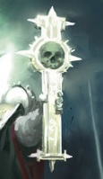

# 0107 帝皇信仰 Imperial Cult

精校状态：中文行文已逐段精校，部分术语仍为暂定

分类：通用概念 / 帝国 Imperium / 国教教会 Ecclesiarchy

原文来源：https://www.bilibili.com/opus/1051859219066650630

原作者：帝国神选罐头

原文时间：编辑于 2025年09月08日 13:00

[返回分类目录](目录.md) · [全书目录](../../目录.md)

原篇名：帝国教派 Imperial Cult

<!-- A0107-B0001 -->
**英文原文**

The Imperial Cult, also called the Cult Imperialis in High Gothic, is the cult based on the worship of the Emperor of Mankind as Master, Defender, and Father of Mankind, developed following his internment in the Golden Throne. In the 41st millennium the Imperial Cult has almost unrivaled power and influence within the Imperium. Heresy against it is punished severely. The religion is administered by the Ecclesiarchy.

<!-- /A0107-B0001 -->

<!-- A0107-B0002 -->

原译文

帝国教派，在高哥特语中也被称为帝国教，是基于对人类帝皇作为主、捍卫者和人类之父的崇拜的教派，是在他被安置在黄金王座后发展起来的。在第41个千年，帝国教派在帝国内部拥有几乎无与伦比的权力和影响力。反对它的异端行为将受到严厉惩罚。该教派由国教教会管理。

**校订译文**

帝皇信仰在高哥特语中称为 Cult Imperialis，以崇拜人类帝皇为人类之主、守护者及父亲为核心，在帝皇被安置于黄金王座后逐渐发展。到第 41 千年，它在帝国内拥有几乎无可匹敌的权势与影响力，背离它的异端会遭到严惩。这一宗教由国教会管理。

<!-- /A0107-B0002 -->

<!-- A0107-B0003 图片 -->

<!-- A0107-B0004 -->

原译文

Symbol of the Imperial Cult 帝国教派标志

**校订译文**

Symbol of the Imperial Cult 帝皇信仰标志

<!-- /A0107-B0004 -->

<!-- A0107-B0005 -->
## Overview 概述

<!-- /A0107-B0005 -->

<!-- A0107-B0006 -->
**英文原文**

The Imperial Cult is the Imperium's state religion, and in many ways the religion is the state itself; it binds humanity together in the service of the Emperor and the Imperium. The principle tenets of the Imperial Creed are the persecution of mutants, the abhorrence of Xenos, and the worship of both the Emperor and Imperial ideals.

<!-- /A0107-B0006 -->

<!-- A0107-B0007 -->

原译文

帝国教派是帝国的国教，在许多方面，教派就是国家本身；它将人类团结在一起，为帝皇和帝国服务。帝国信条的主要原则是迫害变种人，憎恶异型，崇拜帝皇和帝国理想。

**校订译文**

帝皇信仰是帝国的国教，在许多方面甚至与国家本身融为一体；它将人类凝聚在一起，为帝皇和帝国服务。帝国教义的主要原则包括迫害变种人、憎恶异形，以及崇拜帝皇与帝国理念。

<!-- /A0107-B0007 -->

<!-- A0107-B0008 -->
**英文原文**

The more devout followers of the Creed will undertake The Grand Pilgrimage to Terra at least once in their lives.

<!-- /A0107-B0008 -->

<!-- A0107-B0009 -->

原译文

信仰信条的虔诚信徒一生中至少会进行一次前往泰拉的大朝圣。

**校订译文**

更为虔诚的信徒一生至少会进行一次前往泰拉的大朝圣。

<!-- /A0107-B0009 -->

<!-- A0107-B0010 -->
**英文原文**

While many Space Marine Chapters follow their own cults, or continue to observe a form of the older Imperial Truth, some do abide by the Imperial Cult and worship the Emperor as a god. These include the Black Templars, Fire Angels, Red Hunters, and Auric Paragons.

<!-- /A0107-B0010 -->

<!-- A0107-B0011 -->

原译文

虽然许多星际战士战团遵循自己的教派，或继续遵守一种古老的帝国真理，但有些战团确实遵守帝国教派，将帝皇视为神来崇拜。其中包括黑色圣堂、火焰天使、红色猎手和黄金典范。

**校订译文**

许多星际战士战团保有各自的信仰，或继续奉行某种形式的古老帝国真理；也有些遵循帝皇信仰，将帝皇奉为神明，例如黑色圣堂、火焰天使、红色猎手和黄金典范。

<!-- /A0107-B0011 -->

<!-- A0107-B0012 -->
## Tenets 宗旨

<!-- /A0107-B0012 -->

<!-- A0107-B0013 -->
**英文原文**

The Imperial Creed is highly flexible and is tailored by Missionaries to fit the native culture, religion, and practices of whatever world it exists upon. As such, practices adhered to on one world may be held as abhorrent on another. The Ministorum tolerates this vast range of practices and beliefs, as it would be impossible to maintain a complete standardization of the faith across the Imperium.

<!-- /A0107-B0013 -->

<!-- A0107-B0014 -->

原译文

帝国信条非常灵活，由传教士量身定制，以适应其所在世界的本土文化、宗教和习俗。因此，在一个世界坚持的做法在另一个世界可能被视为令人憎恶的。牧师会容忍这种广泛的做法和信仰，因为不可能在整个帝国内保持信仰的完全标准化。

**校订译文**

帝国教义具有很强的适应性，传教士会根据各世界的本土文化、宗教与习俗作出调整。因此，某个世界奉行的仪式，到了另一个世界可能被视为可憎之举。国教会容许这种广泛的差异，因为不可能让整个帝国的信仰实践完全统一。

<!-- /A0107-B0014 -->

<!-- A0107-B0015 -->
**英文原文**

However, the Ecclesiarchy does enforce basic key tenets:

<!-- /A0107-B0015 -->

<!-- A0107-B0016 -->

原译文

然而，国教教会确实执行了基本的关键原则：

**校订译文**

不过，国教会仍强制要求遵守以下基本信条：

<!-- /A0107-B0016 -->

<!-- A0107-B0017 -->
**英文原文**

The Emperor once walked among men, but He is, and always has been, a god.

<!-- /A0107-B0017 -->

<!-- A0107-B0018 -->

原译文

帝皇曾经在人间行走，但他现在是，而且一直是神。

**校订译文**

帝皇曾经在人间行走，但他现在是，而且一直是神。

<!-- /A0107-B0018 -->

<!-- A0107-B0019 -->
**英文原文**

The Emperor is the one true god, regardless of what past faiths any human may have worshipped.

<!-- /A0107-B0019 -->

<!-- A0107-B0020 -->

原译文

帝皇是唯一真正的神，无论任何人过去信仰什么。

**校订译文**

帝皇是唯一真正的神，无论任何人过去信仰什么。

<!-- /A0107-B0020 -->

<!-- A0107-B0021 -->
**英文原文**

To purge the heretic, beware the psyker and mutant, and abhor the alien.

<!-- /A0107-B0021 -->

<!-- A0107-B0022 -->

原译文

要清除异端，要小心灵能者和变种人，憎恶异型。

**校订译文**

要清除异端，要小心灵能者和变种人，憎恶异形。

<!-- /A0107-B0022 -->

<!-- A0107-B0023 -->
**英文原文**

Every human being has a place within the Emperor's divine order.

<!-- /A0107-B0023 -->

<!-- A0107-B0024 -->

原译文

每个人在帝皇的神圣秩序中都有一席之地。

**校订译文**

每个人在帝皇的神圣秩序中都有一席之地。

<!-- /A0107-B0024 -->

<!-- A0107-B0025 -->
**英文原文**

To unquestionably obey the authority of the Imperial government and one's superiors.

<!-- /A0107-B0025 -->

<!-- A0107-B0026 -->

原译文

毫无疑问地服从帝国政府和上级的权威。

**校订译文**

无条件服从帝国政府与自身上级的权威。

<!-- /A0107-B0026 -->

<!-- A0107-B0027 -->
**英文原文**

Another recurring theme is the notion of the End Times, which gained momentum towards the end of the 41st Millennium. Often tied to the notion of the End Times is a belief that the Emperor will rise from the Golden Throne and complete the work He began ten thousand years ago, delivering the faithful from the evils of the galaxy. While most view these as a time of deliverance, it is also believed that the Emperor will sit in judgment of all mankind, casting those lacking in faith into damnation.

<!-- /A0107-B0027 -->

<!-- A0107-B0028 -->

原译文

另一个反复出现的主题是“终结之刻”的概念，这一概念在第41个千年结束时势头强劲。通常与终结之刻的概念联系在一起的是一种信念，即帝皇将从黄金王座上崛起，完成他在一万年前开始的工作，将信徒从银河系的邪恶中拯救出来。虽然大多数人认为这是一个解脱的时刻，但也有人认为帝皇将审判全人类，把那些缺乏信仰的人堕入地狱。

**校订译文**

另一个常见主题是“末日”，这一观念在第 41 千年末愈发盛行。它往往伴随着这样的信念：帝皇将从黄金王座上站起，完成万年前开启的事业，将信徒从银河中的邪恶里拯救出来。多数人将此视为得救之时，但也相信帝皇届时会审判全人类，让信仰不足者遭受永罚。

<!-- /A0107-B0028 -->

<!-- A0107-B0029 -->
### Theological Branches 神学分支

<!-- /A0107-B0029 -->

<!-- A0107-B0030 -->
**英文原文**

Aside from the central tenets, there exists a massive body of both sanctioned and unsanctioned dogma which varies from sector to sector and is the subject of constant debate. Death cults such as The Moritat and Astral Knives are very different from groups like the Church of the Shrouded Emperor or the Lethean Revelation, yet all broadly worship the same deity.

<!-- /A0107-B0030 -->

<!-- A0107-B0031 -->

原译文

除了核心原则外，还存在大量受批准和未经批准的教条，这些教条因部门而异，是不断争论的主题。像谋杀歌谣和星界锋刃这样的死亡教派与像隐秘帝皇教派或冥河启示这样的团体非常不同，但它们都广泛地崇拜同一个神。

**校订译文**

除了核心信条，各星区还存在大量获得认可或未经认可的教义，并不断为此争辩。“谋杀歌谣”“星界锋刃”等拜死教，与隐秘帝皇教派或冥河启示等团体迥然不同，但大体上都崇拜同一位神祇。

<!-- /A0107-B0031 -->

<!-- A0107-B0032 -->
**英文原文**

The subject of the afterlife is a regularly debated topic, with many teachings mentioning the form of an afterlife in which the faithful take their place beside the Emperor for eternity. However other elements of the Holy Synod maintain a different version of the afterlife, and the belief in an afterlife varies greatly depending on the culture of a planet.

<!-- /A0107-B0032 -->

<!-- A0107-B0033 -->

原译文

来世的话题是一个经常争论的话题，许多教义都提到了来世的形式，信徒在来世中永远坐在帝皇身边。然而，神圣教会的其他成员对来世有不同的看法，对来世的信仰因星球文化而异。

**校订译文**

来世是经常引发争论的话题。许多教义认为，虔诚信徒死后将永远侍立于帝皇身旁；最高圣会中的其他派别则持有不同看法。对来世的具体信仰，也会因各星球文化而有很大差异。

<!-- /A0107-B0033 -->

<!-- A0107-B0034 -->
### Known sub-cults 已知分支教派

原题：Known sub-cults 已知子教

<!-- /A0107-B0034 -->

<!-- A0107-B0035 -->

原译文

Astral Knives 星界锋刃

**校订译文**

Astral Knives 星界锋刃

<!-- /A0107-B0035 -->

<!-- A0107-B0036 -->

原译文

Drusians 德鲁苏斯信徒

**校订译文**

Drusians 德鲁苏斯信徒

<!-- /A0107-B0036 -->

<!-- A0107-B0037 -->

原译文

The Creeping Shadow 匍匐阴影

**校订译文**

The Creeping Shadow 匍匐阴影

<!-- /A0107-B0037 -->

<!-- A0107-B0038 -->

原译文

Church of Mortification 禁欲教派

**校订译文**

Church of Mortification 禁欲教派

<!-- /A0107-B0038 -->

<!-- A0107-B0039 -->

原译文

Church of the Shrouded Emperor 隐秘帝皇教派

**校订译文**

Church of the Shrouded Emperor 隐秘帝皇教派

<!-- /A0107-B0039 -->

<!-- A0107-B0040 -->

原译文

Cult of the Immaculate Design 纯洁设计教派

**校订译文**

Cult of the Immaculate Design 纯洁设计教派

<!-- /A0107-B0040 -->

<!-- A0107-B0041 -->

原译文

Cult of the True Resurrection 重生教派

**校订译文**

Cult of the True Resurrection 重生教派

<!-- /A0107-B0041 -->

<!-- A0107-B0042 -->

原译文

Gourdians 古尔迪安教团

**校订译文**

Gourdians 古尔迪安教团

<!-- /A0107-B0042 -->

<!-- A0107-B0043 -->

原译文

Helio Cult 太阳教派

**校订译文**

Helio Cult 太阳教派

<!-- /A0107-B0043 -->

<!-- A0107-B0044 -->

原译文

Lethean Revelation 冥河启示

**校订译文**

Lethean Revelation 冥河启示

<!-- /A0107-B0044 -->

<!-- A0107-B0045 -->

原译文

Mendicantine Fraters 托钵修士教会

**校订译文**

Mendicantine Fraters 托钵修士教会

<!-- /A0107-B0045 -->

<!-- A0107-B0046 -->

原译文

The Moritat 谋杀歌谣

**校订译文**

The Moritat 谋杀歌谣

<!-- /A0107-B0046 -->

<!-- A0107-B0047 -->

原译文

Sisters of the Void 虚空姐妹

**校订译文**

Sisters of the Void 虚空姐妹

<!-- /A0107-B0047 -->

<!-- A0107-B0048 -->

原译文

Sons of Sol 太阳之子

**校订译文**

Sons of Sol 太阳之子

<!-- /A0107-B0048 -->

<!-- A0107-B0049 -->

原译文

Sons of Sept 氏族之子

**校订译文**

Sons of Sept 氏族之子

<!-- /A0107-B0049 -->

<!-- A0107-B0050 -->

原译文

The Redemption 救赎

**校订译文**

The Redemption 救赎

<!-- /A0107-B0050 -->

<!-- A0107-B0051 -->

原译文

Vitrian Covenant 维特里安圣约

**校订译文**

Vitrian Covenant 维特里安圣约

<!-- /A0107-B0051 -->

<!-- A0107-B0052 -->

原译文

Weavers 编织者

**校订译文**

Weavers 编织者

<!-- /A0107-B0052 -->

<!-- A0107-B0053 -->
## History 历史

<!-- /A0107-B0053 -->

<!-- A0107-B0054 -->
**英文原文**

By M41, the ordinary Imperial citizen believes that the Emperor has always been venerated as an immortal and omnipotent god, but this is inaccurate. At the beginning of the Emperor's Great Crusade, there was no Ecclesiarchy; on the contrary, the Emperor had deliberately outlawed organised religion in any form, declaring it the source of much of the strife and ignorance that had prevented humanity from achieving its potential. The idea of worship was anathema to the Emperor's vision of a secular empire of man, ruled by reason and science. The official Imperial doctrine was that the Emperor was an extremely powerful being, the rightful ruler of all mankind, and the perfect image of humanity, but no matter how supreme, still a human being. This doctrine -which also denied the existence of Chaos- was called the "Imperial Truth".

<!-- /A0107-B0054 -->

<!-- A0107-B0055 -->

原译文

到了M41，普通的帝国公民认为帝皇一直被尊为不朽和全能的神，但这是不准确的。在帝皇的大远征开始时，没有国教教会；相反，帝皇故意取缔任何形式的有组织宗教，宣称它是阻碍人类发挥其潜力的大部分冲突和无知的根源。崇拜的想法是对帝皇建立一个由理性和科学统治的世俗人类帝国的愿景的诅咒。官方的帝国学说是，帝皇是一个极其强大的存在，是全人类的合法统治者，是人类的完美形象，但无论多么至高无上，他仍然是一个人。这一学说也否认混沌的存在，被称为“帝国真理”。

**校订译文**

到第 41 千年，普通帝国公民普遍认为帝皇一直被奉为不朽、全能的神明，但事实并非如此。大远征刚开始时，国教会尚不存在；帝皇反而明令禁止一切有组织的宗教，认为宗教带来的纷争与无知阻碍了人类发挥潜力。神祇崇拜与他建设一个由理性、科学主导的世俗人类帝国的愿景根本相悖。当时的官方学说认为，帝皇是极其强大的存在，是全人类的合法统治者与人类的完美典范，但无论他多么卓越，仍是人类。这套同时否认混沌存在的学说被称为“帝国真理”。

<!-- /A0107-B0055 -->

<!-- A0107-B0056 -->
**英文原文**

During the Great Crusade however, many ordinary Imperial citizens found that the light of reason and truth brought by the Emperor was not enough, and they took to worshiping him as a deity. The Emperor himself did not wish to be considered a deity, but his deeds during the Great Crusade and the very fact of his existence - an immortal man, and the most powerful psyker in the history of the galaxy - gave rise to a cult, known as the Lectitio Divinitatus, based on a tome written by the Primarch Lorgar, postulating that the Emperor was in fact a divine being. The early central figure of the Imperial Creed was the Remembrancer and later first Saint, Euphrati Keeler. Keeler along with the former Iterator Kyril Sindermann became early proponents of the Emperor's divinity and oversaw the spread of the Cult as the Heresy unfolded. By the time of the Siege of Terra, cults such as the Lightbearers and Empire of Divine Valour had gained strength across the Imperium. However, the cults' growth did not go unopposed, and occasionally resulted in open war between cultists and supporters of the Imperial Truth even as the Horus Heresy raged, such as on Argarops.

<!-- /A0107-B0056 -->

<!-- A0107-B0057 -->

原译文

然而，在大远征期间，许多普通的帝国公民发现帝皇带来的理性和真理之光还不够，他们开始把他当作神来崇拜。帝皇本人不希望被视为神，但他在大远征期间的行为以及他存在的事实——一个不朽的人，银河系历史上最强大的灵能者——引发了一种崇拜，称为圣言诵读，基于原体珞珈写的一本巨著，假设帝皇实际上是一个神圣的存在。帝国信条的早期中心人物是记述者，后来的第一位圣人幼发拉底·琪乐。琪乐与前传道者凯里尔·辛德曼一起成为帝皇神性的早期支持者，并在叛乱展开时监督了教派的传播。到泰拉围城时，承光者和神圣勇气帝国等教派已经在帝国中获得了力量。然而，教派的发展并非没有对手，即使在荷鲁斯叛乱肆虐的时候，偶尔也会导致教派信徒和帝国真理支持者之间的公开战争，比如在阿加罗普斯。

**校订译文**

然而，大远征期间，许多普通公民觉得帝皇带来的理性与真理之光仍不足以满足自己，开始将他奉为神明。帝皇本人并不希望被神化，但他的功业与存在本身——一位不朽的人、银河历史上最强大的灵能者——催生了神性论信仰。其依据是原体珞珈所著的《神性论》，主张帝皇确实具有神性。帝皇信仰早期的核心人物，是记述者、后来的首位圣人尤弗拉蒂·琪乐。她与前宣讲者凯里尔·辛德曼共同支持帝皇神性之说，并在荷鲁斯之乱期间推动信仰传播。到泰拉围城时，承光者、神圣勇气帝国等教派已在帝国内发展壮大。不过，它们也遭到抵制；即使叛乱正在肆虐，教徒与帝国真理的支持者之间仍偶尔爆发公开战争，阿加罗普斯便是一例。

**校注：** Lectitio Divinitatus 既可指珞珈的著作，也可指由此产生的信仰运动；本稿分别采用《帝皇圣言录》和“圣言诵读”，避免把书籍与组织混作一项。Euphrati 为人名，原译“幼发拉底”误套河流译名，暂译尤弗拉蒂。

<!-- /A0107-B0057 -->

<!-- A0107-B0058 -->
**英文原文**

The Emperor became an object of general veneration following the Horus Heresy and his internment within the Golden Throne on Terra. Over the following decades many individual Imperial cults sprang up throughout the Imperium, with their central theme being the redemption of humanity through the Emperor's self-sacrifice. After a few hundred years, a single cult known as the Temple of the Saviour Emperor was formed from the unification of a number of smaller cults, which gradually absorbed the main body of believers. In M32, this cult became the official religion of the Imperium, gaining the title of Adeptus Ministorum. Remaining cults were persecuted and mostly destroyed.

<!-- /A0107-B0058 -->

<!-- A0107-B0059 -->

原译文

在荷鲁斯叛乱之后，帝皇成为了人们普遍崇拜的对象，并被安置在泰拉的黄金王座上。在接下来的几十年里，整个帝国涌现出许多独立的帝国教派，其中心主题是通过帝皇的自我牺牲来救赎人类。几百年后，一个被称为救世帝皇圣堂的独立教派由一些较小的教派统一而成，逐渐吸收了信徒的主体。在M32，这个教派成为帝国的官方宗教，获得了“帝国国教”的称号。其余的教派遭到迫害，大多被摧毁。

**校订译文**

荷鲁斯之乱后，帝皇被安置在泰拉的黄金王座上，成为广受敬奉的对象。此后数十年，帝国各地涌现出许多独立的帝皇崇拜教派，共同宣扬帝皇以自我牺牲救赎人类。数百年后，一些小教派合并为救世帝皇圣堂，并逐渐吸收了大部分信众。第 32 千年，这一信仰成为帝国官方宗教，其组织获授 Adeptus Ministorum 之名，即国教会。其他教派则受到迫害，大多被摧毁。

<!-- /A0107-B0059 -->

<!-- A0107-B0060 -->
**英文原文**

The dominance of the Temple of the Saviour Emperor was broken during the Age of Apostasy in M36, when Sebastian Thor and his "Confederation of Light" reformed the Imperial Cult. After this point, the Ecclesiarchy took the form it would keep until M41. The Temple was subsequently declared heretical, and its remaining followers were hunted just like other unorthodox cults. Despite the continued dominance of Thor's version of the Imperial Cult over the next millennia, minor Imperial cults would continue to rise and fall across the Imperium.

<!-- /A0107-B0060 -->

<!-- A0107-B0061 -->

原译文

救世帝皇圣堂的统治地位在M36的叛教时代被打破，当时塞巴斯蒂安·托尔和他的“光明同盟”改革了帝国教派。在这一点之后，国教教会采取了它并一直保持其形式到M41。圣堂随后被宣布为异端，其剩余的追随者像其他非正统教派一样被追捕。尽管在接下来的几千年里，托尔版本的帝国教派继续占据主导地位，但帝国中的小型教派仍将继续兴衰。

**校订译文**

第 36 千年的叛教时代，塞巴斯蒂安·托尔及其光明同盟改革帝皇信仰，打破了救世帝皇圣堂的统治地位。国教会由此形成了延续至第 41 千年的组织形态。圣堂随后被宣布为异端，其残余追随者也像其他非正统教派一样遭到追捕。此后数千年，托尔改革后的帝皇信仰始终占据主导，但各种小型教派仍不断兴起又消亡。

<!-- /A0107-B0061 -->

本篇核心术语与暂定项

以下列出本篇出现的英文原形及核心术语表用词。同形词可能指不同对象，具体词义以本篇正文和校注为准；单复数、别名和仅见于图注的名称可能尚未列入。完整候选见[术语表](../../术语表/双语术语候选.csv)。

| 英文 | 采用中文 | 状态 |
| --- | --- | --- |
| Black Templars | 黑色圣堂 | 官方已核对 |
| Psyker | 灵能者 | 官方已核对 |
| Horus Heresy | 荷鲁斯之乱 | 官方已核对 |
| Imperium | 帝国 | 暂定·简称 |
| History | 历史 | 编辑用语已统一 |
| Emperor of Mankind | 人类帝皇 | 暂定 |
| Emperor | 帝皇 | 官方已核对 |
| Primarch | 原体 | 官方已核对 |
| Adeptus Ministorum | 国教会 | 暂定 |
| Ecclesiarchy | 国教会 | 暂定 |
| Mutant | 变种人 | 暂定·官方待核 |
| Age of Apostasy | 叛教时代 | 暂定·官方待核 |
| Great Crusade | 大远征 | 暂定·官方待核 |
| Terra | 泰拉 | 暂定·官方待核 |
| Horus | 荷鲁斯 | 暂定·官方待核 |
| Imperial Cult | 帝皇信仰 | 暂定·官方待核 |
| Imperial Creed | 帝国教义 | 暂定·官方待核 |
| Golden Throne | 黄金王座 | 暂定·官方待核 |
| Holy Synod | 最高圣会 | 暂定·官方待核 |
| Sector | 星区 | 暂定·官方待核 |
| High Gothic | 高哥特语 | 暂定·官方待核 |
| Deliverance | 拯救星 | 暂定·官方待核 |
| Imperial Truth | 帝国真理 | 暂定·官方待核 |
| Lectitio Divinitatus | 神性论 | 暂定·官方待核 |
| Master | 导师（审判庭职衔）／舰务官（舰员职务） | 语境定译·官方待核 |
| Euphrati Keeler | 尤弗拉蒂·琪乐 | 暂定 |
| Temple of the Saviour Emperor | 救世帝皇圣堂 | 暂定 |
| Confederation of Light | 光明同盟 | 暂定 |
| Moritat | 暗杀精英 | 暂定·官方待核 |
| Space Marine | 星际战士 | 暂定·官方待核 |
| Fire Angels | 火焰天使 | 暂定·官方待核 |
| The Black Templars | 黑色圣堂 | 暂定·官方待核 |
| Auric Paragons | 黄金典范 | 暂定·官方待核 |
| Red Hunters | 红色猎手 | 暂定·官方待核 |
| Iterator | 宣讲师 | 暂定·官方待核 |
| Lorgar | 珞珈 | 暂定·官方待核 |
| Xenos | 异形 | 暂定·官方待核 |
| Imperialis | 帝国徽记 | 暂定·官方待核 |
| Revelation | 启示 | 暂定·官方待核 |
| Kyril Sindermann | 凯里尔·辛德曼 | 暂定·官方待核 |
| Sebastian Thor | 塞巴斯蒂安·托尔 | 暂定·官方待核 |

