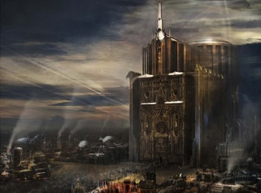

# 0109 忠嗣学院 Schola Progenia

精校状态：中文行文已逐段精校，部分术语仍为暂定

分类：通用概念 / 帝国 Imperium / 国教教会 Ecclesiarchy

原文来源：https://www.bilibili.com/opus/1144989159615627267

原作者：帝国神选罐头

原文时间：2025年12月11日 12:22

[返回分类目录](目录.md) · [全书目录](../../目录.md)

<!-- A0109-B0001 -->
**英文原文**

The Schola Progenia are academies run by Missionaries of the Ecclesiarchy. These schools teach and train orphans of Imperial officials who have given their lives in the service of the Emperor of Mankind. These orphans are indoctrinated into the Imperial Cult from an early age, and soon learn to regard the Emperor as their spiritual father.

<!-- /A0109-B0001 -->

<!-- A0109-B0002 -->

原译文

忠嗣学院是由国教的传教士管理的学院。这些学校教育和培训为人类帝皇服务而献出生命的帝国官员的孤儿。这些孤儿从小就被灌输了帝国教派，很快就学会了把帝皇视为他们的精神之父。

**校订译文**

忠嗣学院由国教会的传教士管理，负责教育、训练为帝皇尽忠而牺牲的帝国官员的遗孤。这些孩子从小接受帝皇信仰的教化，很快便将帝皇视为精神上的父亲。

<!-- /A0109-B0002 -->

<!-- A0109-B0003 -->
**英文原文**

The Schola itself is overseen by a Commandant, who is one of the lesser members of the Senatorum Imperialis.

<!-- /A0109-B0003 -->

<!-- A0109-B0004 -->

原译文

学院本身由一名指挥官监督，该指挥官是帝国参议院中低级的成员之一。

**校订译文**

忠嗣学院体系由一位统辖官监督；此人在帝国元老院中位阶较低。

<!-- /A0109-B0004 -->

<!-- A0109-B0005 -->
## Facilities 设施

<!-- /A0109-B0005 -->

<!-- A0109-B0006 -->
**英文原文**

Schola facilities exist on many worlds across the Imperium, primarily on planets with strong connections to either Terra or the Adeptus Ministorum. Many Schola are deliberately built in remote or isolated regions of their worlds, both to ensure the security of the facilities, and to prevent the progena from attempting to escape. Certainly many progena may desire to leave, for the rigours of their training are designed to be as harsh as possible, constantly testing their physical and mental fortitude during their studies. This ensures that the Schola's cadets are conditioned to handle and overcome any challenges that may face them when they graduate into the service of the wider Imperium. The Schola Progenium also operates training facilities on various Death Worlds.

<!-- /A0109-B0006 -->

<!-- A0109-B0007 -->

原译文

学院设施存在于帝国的许多行星上，主要是与泰拉或国教教会有着密切联系的行星上。许多学院被故意建造在他们世界的偏远或孤立地区，以确保设施的安全，并防止忠嗣试图逃跑。当然，许多忠嗣可能希望离开，因为他们的训练要求尽可能严格，在学习期间不断考验他们的身心毅力。这确保了学院的学员有能力处理和克服他们毕业后为更广泛的帝国服役时可能面临的任何挑战。忠嗣学院还运行着各种死亡世界的培训设施。

**校订译文**

帝国许多世界都设有忠嗣学院，主要集中在与泰拉或国教会联系紧密的行星。许多学院刻意选址于偏远、与外界隔绝的地区，既保障设施安全，也防止学员逃跑。学员确实常有逃离的念头，因为训练被设计得极为严酷，不断考验他们的身心承受力。这种训练旨在使学员毕业后，无论被派往帝国何处，都能应对并克服各种挑战。忠嗣学院还在一些死亡世界设有训练基地。

<!-- /A0109-B0007 -->

<!-- A0109-B0008 图片 -->

<!-- A0109-B0009 -->

原译文

Schola Progenium facility 忠嗣学院设施

**校订译文**

Schola Progenium facility 忠嗣学院设施

<!-- /A0109-B0009 -->

<!-- A0109-B0010 -->
### Known locations of the Schola Progenium 忠嗣学院的已知位置

<!-- /A0109-B0010 -->

<!-- A0109-B0011 -->
**英文原文**

Worlds known to host Schola Progenium facilities include:

<!-- /A0109-B0011 -->

<!-- A0109-B0012 -->

原译文

众所周知，拥有忠嗣学院设施的世界包括：

**校订译文**

众所周知，拥有忠嗣学院设施的世界包括：

<!-- /A0109-B0012 -->

<!-- A0109-B0013 -->

原译文

Ignatius Cardinal 伊格内修斯红衣主教

**校订译文**

Ignatius Cardinal 伊格内修斯·卡迪纳尔

<!-- /A0109-B0013 -->

<!-- A0109-B0014 -->
**英文原文**

Makron V — Training grounds of the 34th Betic Centaurs regiment.

<!-- /A0109-B0014 -->

<!-- A0109-B0015 -->

原译文

马克龙五号 — 第34贝蒂克半人马兵团的训练场。

**校订译文**

马克龙五号 — 第34贝蒂克半人马兵团的训练场。

<!-- /A0109-B0015 -->

<!-- A0109-B0016 -->
**英文原文**

The moons of Mezoa — Training grounds of the Lambdan Lions regiments.

<!-- /A0109-B0016 -->

<!-- A0109-B0017 -->

原译文

梅佐亚的卫星 — 兰布丹之狮兵团的训练场。

**校订译文**

梅佐亚的卫星 — 兰布丹之狮兵团的训练场。

<!-- /A0109-B0017 -->

<!-- A0109-B0018 -->

原译文

Olvein Devus 奥尔文·德武斯

**校订译文**

Olvein Devus 奥尔文·德武斯

<!-- /A0109-B0018 -->

<!-- A0109-B0019 -->

原译文

Phrell 弗雷尔

**校订译文**

Phrell 弗雷尔

<!-- /A0109-B0019 -->

<!-- A0109-B0020 -->

原译文

Saint Phramona 圣弗拉莫纳

**校订译文**

Saint Phramona 圣弗拉莫纳

<!-- /A0109-B0020 -->

<!-- A0109-B0021 -->

原译文

Skell II 史凯尔二号

**校订译文**

Skell II 史凯尔二号

<!-- /A0109-B0021 -->

<!-- A0109-B0022 -->
**英文原文**

Vedill I — Training grounds of the 9th Iotan Gorgonnes regiment and the Order of the Glowing Chalice.

<!-- /A0109-B0022 -->

<!-- A0109-B0023 -->

原译文

韦迪尔一号 — 第九伊奥坦戈尔贡兵团和炽热圣杯的训练场。

**校订译文**

韦迪尔一号——第 9 伊奥坦戈尔贡兵团及炽光圣杯修会的训练场。

<!-- /A0109-B0023 -->

<!-- A0109-B0024 -->
## Progena 忠嗣

<!-- /A0109-B0024 -->

<!-- A0109-B0025 -->
**英文原文**

Graduates of the Schola are known as Progena, and because of the loyalty their training has instilled in them, they are frequently sent for further training and service within other Imperial organisations. Progena are often earmarked for roles that call for the most rigorous dedication to the Imperium. These roles can include Tempestus Scions, Arbites, Commissars of the Imperial Guard, officers of the Imperial Navy, Imperial Assassins and even budding Inquisitors. Female Progena typically join one of the Orders of the Adepta Sororitas, while males more often join the ranks of the Tempestus Scions.

<!-- /A0109-B0025 -->

<!-- A0109-B0026 -->

原译文

学院的毕业生被称为忠嗣，由于他们的训练培养了他们的忠诚，他们经常被派往其他帝国组织接受进一步的培训和服役。忠嗣通常被指定为需要对帝国做出最严格奉献的角色。这些角色可能包括风暴忠嗣、法务部、帝国卫队政委、帝国海军军官、帝国刺客，甚至是初露头角的审判官。女性忠嗣通常加入修女会的一个修会，而男性更经常加入暴风忠嗣的行列。

**校订译文**

学院毕业生称为“忠嗣”。严苛训练使他们忠诚可靠，因此常被选送到其他帝国机构继续受训或服役，承担最需要全心奉献的职责，例如风暴忠嗣军、法务部执法人员、帝国卫队政委、海军军官、帝国刺客，甚至审判官学徒。女性忠嗣通常加入修女会下属修会，男性则更常进入风暴忠嗣军。

<!-- /A0109-B0026 -->

<!-- A0109-B0027 -->
## Notable Former Students 著名校友

原题：Notable Former Students 著名前学生

<!-- /A0109-B0027 -->

<!-- A0109-B0028 -->
**英文原文**

Bronislaw Czevak — Inquisitor.

<!-- /A0109-B0028 -->

<!-- A0109-B0029 -->

原译文

布罗尼斯瓦夫·切瓦克 — 审判官

**校订译文**

布罗尼斯瓦夫·切瓦克 — 审判官

<!-- /A0109-B0029 -->

<!-- A0109-B0030 -->
**英文原文**

Janus Darke — Rogue Trader.

<!-- /A0109-B0030 -->

<!-- A0109-B0031 -->

原译文

贾纳斯·达克 — 行商浪人

**校订译文**

贾纳斯·达克 — 行商浪人

<!-- /A0109-B0031 -->

<!-- A0109-B0032 -->
**英文原文**

Jaq Draco — Inquisitor.

<!-- /A0109-B0032 -->

<!-- A0109-B0033 -->

原译文

雅克·德拉科 — 审判官

**校订译文**

雅克·德拉科 — 审判官

<!-- /A0109-B0033 -->

<!-- A0109-B0034 -->
**英文原文**

Junith Eruita — Canoness of the Adepta Sororitas.

<!-- /A0109-B0034 -->

<!-- A0109-B0035 -->

原译文

朱尼斯·埃鲁塔 — 修女会的大修女

**校订译文**

茱妮丝·伊瑞塔 — 修女会的大修女

<!-- /A0109-B0035 -->

<!-- A0109-B0036 -->
**英文原文**

Gregor Eisenhorn — Inquisitor.

<!-- /A0109-B0036 -->

<!-- A0109-B0037 -->

原译文

格雷戈·艾森霍恩 — 审判官

**校订译文**

格雷戈·艾森霍恩 — 审判官

<!-- /A0109-B0037 -->

<!-- A0109-B0038 -->
**英文原文**

Ephrael Stern — Sister of Battle.

<!-- /A0109-B0038 -->

<!-- A0109-B0039 -->

原译文

埃弗拉尔·斯特恩 — 战斗修女

**校订译文**

埃弗拉尔·斯特恩 — 战斗修女

<!-- /A0109-B0039 -->

<!-- A0109-B0040 -->
**英文原文**

Sebastian Yarrick — Commissar.

<!-- /A0109-B0040 -->

<!-- A0109-B0041 -->

原译文

塞巴斯蒂安·亚瑞克 — 政委

**校订译文**

塞巴斯蒂安·亚瑞克 — 政委

<!-- /A0109-B0041 -->

<!-- A0109-B0042 -->
**英文原文**

Ciaphas Cain — Commissar.

<!-- /A0109-B0042 -->

<!-- A0109-B0043 -->

原译文

凯法斯·凯恩 — 政委

**校订译文**

凯法斯·凯恩 — 政委

<!-- /A0109-B0043 -->

<!-- A0109-B0044 -->
**英文原文**

Mathieu — Militant-Apostolic of the Adeptus Ministorum.

<!-- /A0109-B0044 -->

<!-- A0109-B0045 -->

原译文

马蒂厄 — 国教教会的战争使徒

**校订译文**

马蒂厄 — 国教会的战争使徒

<!-- /A0109-B0045 -->

<!-- A0109-B0046 -->
**英文原文**

Salem Whitlock — Militarum Tempestus officer.

<!-- /A0109-B0046 -->

<!-- A0109-B0047 -->

原译文

萨利姆·惠特洛克 — 暴风军军官

**校订译文**

萨利姆·惠特洛克 — 暴风军军官

<!-- /A0109-B0047 -->

本篇核心术语与暂定项

以下列出本篇出现的英文原形及核心术语表用词。同形词可能指不同对象，具体词义以本篇正文和校注为准；单复数、别名和仅见于图注的名称可能尚未列入。完整候选见[术语表](../../术语表/双语术语候选.csv)。

| 英文 | 采用中文 | 状态 |
| --- | --- | --- |
| Adepta Sororitas | 修女会 | 官方已核对 |
| Imperial Guard | 帝国卫队 | 暂定·语境区分 |
| Commissar | 政委 | 官方已核对 |
| Inquisitor | 审判官 | 官方已核对 |
| Imperium | 帝国 | 暂定·简称 |
| Imperial Navy | 帝国海军 | 暂定 |
| Rogue Trader | 行商浪人 | 暂定 |
| Emperor of Mankind | 人类帝皇 | 暂定 |
| Emperor | 帝皇 | 官方已核对 |
| Adeptus Ministorum | 国教会 | 暂定 |
| Ecclesiarchy | 国教会 | 暂定 |
| Schola Progenium | 忠嗣学院 | 暂定·官方待核 |
| Rigorous | 严峻号 | 暂定·官方待核 |
| The Order | 秩序 | 暂定·官方待核 |
| Terra | 泰拉 | 暂定·官方待核 |
| Imperial Cult | 帝皇信仰 | 暂定·官方待核 |
| Jaq Draco | 贾克·德拉科 | 暂定·官方待核 |
| Mezoa | 梅佐亚 | 暂定·官方待核 |
| Death Worlds | 死亡世界 | 暂定·官方待核 |
| Gregor Eisenhorn | 格雷戈·艾森霍恩 | 暂定·官方待核 |
| Ciaphas Cain | 凯法斯·凯恩 | 暂定·官方待核 |
| Militant-Apostolic | 战争使徒 | 暂定 |
| Order of the Glowing Chalice | 炽光圣杯修会 | 暂定 |
| Junith Eruita | 茱妮丝·伊瑞塔 | 官方已核对 |
| Canoness | 大修女 | 官方已核对 |
| Militarum Tempestus | 暴风军 | 暂定·官方待核 |
| Host | 天军 | 暂定·官方待核 |
| Tempestus Scions | 风暴忠嗣军 | 官方已核对 |
| Ephrael Stern | 埃弗雷尔·斯特恩 | 暂定·官方待核 |
| Imperialis | 帝国徽记 | 暂定·官方待核 |
| Janus | 雅努斯 | 暂定·官方待核 |
| Mathieu | 马蒂厄 | 暂定·官方待核 |
| Makron V | 马克龙五号 | 暂定·官方待核 |
| Bronislaw Czevak | 布罗尼斯瓦夫·切瓦克 | 暂定·官方待核 |
| Lambdan Lions | 兰布丹之狮 | 暂定·官方待核 |

