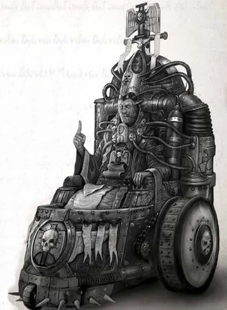

# 0114 红衣主教 Cardinal

精校状态：中文行文已逐段精校，部分术语仍为暂定

分类：通用概念 / 帝国 Imperium / 国教教会 Ecclesiarchy

原文来源：https://www.bilibili.com/opus/1208160569385811984

原作者：帝国神选罐头

原文时间：2026年05月30日 18:00

[返回分类目录](目录.md) · [全书目录](../../目录.md)

<!-- A0114-B0001 -->
**英文原文**

Cardinals are the highest-ranking officials within the Ecclesiarchy, after the Ecclesiarch. The title also appear among the Adeptus Mechanicus.

<!-- /A0114-B0001 -->

<!-- A0114-B0002 -->

原译文

红衣主教是国教内部最高级别的官员，仅次于教宗。这个头衔也出现在机械神教中。

**校订译文**

红衣主教是国教内部最高级别的官员，仅次于教宗。这个头衔也出现在机械修会中。

<!-- /A0114-B0002 -->

<!-- A0114-B0003 -->
###### Overview 概述

<!-- /A0114-B0003 -->

<!-- A0114-B0004 -->
**英文原文**

Cardinals are members of the Frateris clergy and form a group known as the Holy Synod, which elects the Ecclesiarch, the head of the entire Ecclesiarchy, from their own number. Most Cardinals lead a diocese. Although each Cardinal's diocese is outside another's jurisdiction, some rank higher than others, as they are divided into three orders. There are some several thousand Cardinals.

<!-- /A0114-B0004 -->

<!-- A0114-B0005 -->

原译文

红衣主教是兄弟会成员的神职人员并组成一个被称为最高圣会的团体，该团体从他们自己的成员中选举出整个国教的首脑，教宗。大多数红衣主教领导一个教区。虽然每个红衣主教的教区都在另一个教区的管辖范围之外，但有些教区的级别高于其他教区，因为它们分为三个组织。有几千名红衣主教。

**校订译文**

红衣主教属于国教神职体系，共同组成最高圣会，并从中选举教宗，领导整个国教会。多数红衣主教各掌管一个教区，彼此没有跨区管辖权；不过，他们仍分为三个等级，地位有所高下。红衣主教总数约有数千名。

<!-- /A0114-B0005 -->

<!-- A0114-B0006 图片 -->

<!-- A0114-B0007 -->

原译文

Cardinal Cal Sutai Arran 红衣主教卡尔·苏泰·阿兰

**校订译文**

Cardinal Cal Sutai Arran 红衣主教卡尔·苏泰·阿兰

<!-- /A0114-B0007 -->

<!-- A0114-B0008 -->
## Cardinals Palatine 宫廷红衣主教

<!-- /A0114-B0008 -->

<!-- A0114-B0009 -->
**英文原文**

The five Cardinals Palatine are the highest-ranking Cardinals. They do not have dioceses or other official duties, instead serving as assistants to the Ecclesiarch in the Ecclesiarchal Palace on Terra.

<!-- /A0114-B0009 -->

<!-- A0114-B0010 -->

原译文

五位宫廷红衣主教是等级最高的红衣主教。他们没有教区或其他官方职责，而是在泰拉的国教宫殿担任教宗助理。

**校订译文**

五位宫廷红衣主教是等级最高的红衣主教。他们没有教区或其他官方职责，而是在泰拉的国教宫殿担任教宗助理。

<!-- /A0114-B0010 -->

<!-- A0114-B0011 -->
## Cardinals Terran 泰拉红衣主教

<!-- /A0114-B0011 -->

<!-- A0114-B0012 -->
**英文原文**

The Cardinals Terran have dioceses on Terra. They are ranked below the Cardinals Palatine.

<!-- /A0114-B0012 -->

<!-- A0114-B0013 -->

原译文

泰拉红衣主教在泰拉有教区。他们的等级低于宫廷红衣主教。

**校订译文**

泰拉红衣主教在泰拉有教区。他们的等级低于宫廷红衣主教。

<!-- /A0114-B0013 -->

<!-- A0114-B0014 -->
## Cardinals Astral 星界红衣主教

<!-- /A0114-B0014 -->

<!-- A0114-B0015 -->
**英文原文**

The Cardinals Astral are the lowest-ranking Cardinals and have dioceses consisting of one or more worlds, except Terra. The Cardinals Astral of Ophelia VII and nearby systems make up the Synod Ministra and are referred to as Astral Ministra. They rank above Pontifex and furtherly the Preachers

<!-- /A0114-B0015 -->

<!-- A0114-B0016 -->

原译文

星界红衣主教是等级最低的红衣主教，其教区由一个或多个世界组成，除了泰拉。奥菲利亚七号和附近星系的星界红衣主教组成了辅佐圣会，被称为星界辅佐。他们的等级高于祭司和传教士

**校订译文**

星界红衣主教是三个等级中最低的一等，其教区由泰拉以外的一个或多个世界构成。奥菲利亚七号及邻近星系的星界红衣主教组成辅圣会，称为“星界辅佐”。他们的地位高于大祭司，更高于传道士。

<!-- /A0114-B0016 -->

<!-- A0114-B0017 -->
## Other Known Titles of Cardinals 其他已知红衣主教头衔

<!-- /A0114-B0017 -->

<!-- A0114-B0018 -->

原译文

Arch-Cardinal 大红衣主教

**校订译文**

Arch-Cardinal 大红衣主教

<!-- /A0114-B0018 -->

<!-- A0114-B0019 -->
**英文原文**

Cardinal-Governor also known as a Cardinal-Exemplar

<!-- /A0114-B0019 -->

<!-- A0114-B0020 -->

原译文

红衣主教总督也被称为红衣主教典范

**校订译文**

红衣主教总督也被称为红衣主教典范

<!-- /A0114-B0020 -->

<!-- A0114-B0021 -->

原译文

High Cardnial 高级红衣主教

**校订译文**

High Cardnial 高级红衣主教

<!-- /A0114-B0021 -->

本篇核心术语与暂定项

以下列出本篇出现的英文原形及核心术语表用词。同形词可能指不同对象，具体词义以本篇正文和校注为准；单复数、别名和仅见于图注的名称可能尚未列入。完整候选见[术语表](../../术语表/双语术语候选.csv)。

| 英文 | 采用中文 | 状态 |
| --- | --- | --- |
| Adeptus Mechanicus | 机械修会 | 官方已核对 |
| Ecclesiarchy | 国教会 | 暂定 |
| Terra | 泰拉 | 暂定·官方待核 |
| Holy Synod | 最高圣会 | 暂定·官方待核 |
| Ophelia VII | 奥菲利亚七号 | 暂定·官方待核 |
| Ecclesiarch | 教宗 | 暂定 |
| Cardinal | 红衣主教 | 暂定 |
| Synod Ministra | 辅圣会 | 暂定 |
| Palatine | 宫廷官 | 官方已核对 |

