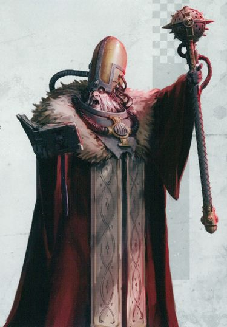
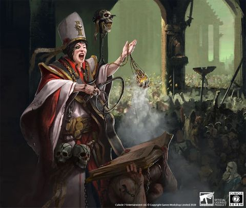
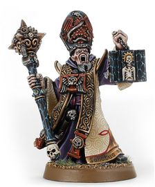
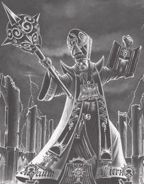

# 0115 告解者 Confessor

精校状态：中文行文已逐段精校，部分术语仍为暂定

分类：通用概念 / 帝国 Imperium / 国教教会 Ecclesiarchy

原文来源：https://www.bilibili.com/opus/1208152829888299016

原作者：帝国神选罐头

原文时间：2026年05月30日 17:30

[返回分类目录](目录.md) · [全书目录](../../目录.md)

<!-- A0115-B0001 -->

原译文

"Your sins have condemned you. The price of His forgiveness is your life. Rejoice! Upon this battlefield, you shall not wait long for your return to grace." - Confessor Gerrich Tharagard “你的罪已被宣判。他的赦免的代价是你的生命。欢喜吧！在这战场上，你不必等待太久，就能回到恩典之中。”- 告解者格里奇·塔拉加德

**校订译文**

"Your sins have condemned you. The price of His forgiveness is your life. Rejoice! Upon this battlefield, you shall not wait long for your return to grace." - Confessor Gerrich Tharagard “你的罪孽已使你获罪。他宽恕你的代价，就是你的生命。欢欣吧！在这片战场上，你很快便能重归祂的恩典。”——告解者格里奇·塔拉加德

<!-- /A0115-B0001 -->

<!-- A0115-B0002 -->
**英文原文**

Confessors are evangelical zealots of the Ecclesiarchy. They were once Preachers but have since been promoted for their zeal.

<!-- /A0115-B0002 -->

<!-- A0115-B0003 -->

原译文

告解者是国教的福音派狂热者。他们曾经是传教士，但后来因其激情而得到晋升。

**校订译文**

告解者是国教会中热衷传教的狂信者，原本担任传道士，后来因格外虔诚热忱而获晋升。

<!-- /A0115-B0003 -->

<!-- A0115-B0004 图片 -->

<!-- A0115-B0005 -->

原译文

Confessor Ambrus Zadorov 告解者安布罗斯·扎多罗夫

**校订译文**

Confessor Ambrus Zadorov 告解者安布罗斯·扎多罗夫

<!-- /A0115-B0005 -->

<!-- A0115-B0006 -->
## Overview 概述

<!-- /A0115-B0006 -->

<!-- A0115-B0007 -->
**英文原文**

Their oratory skills can stir the emotions of entire crowds, leading them to confess personal heresies and mutations, and to betray their neighbors as psykers or other deviants. They are free to wander within an entire diocese and preach among the population. They often work on Imperial colonies with planetary governors and are especially useful on worlds where faith is lacking and the people are rebellious. With special dispensation from the Ecclesiarchy, they may even gather armies of Frateris Militia and lead wars of faith against the enemies of the Imperium. Confessors often wear the Rosarius as both protection and a symbol of their rank.

<!-- /A0115-B0007 -->

<!-- A0115-B0008 -->

原译文

他们的演讲技巧可以激起整个人群的情绪，导致他们承认个人的异端和突变，并将邻居出卖为灵能者或其他异常者。他们可以在整个教区内自由漫步，并在民众中布道。他们经常与行星总督一起在帝国殖民地工作，在缺乏信仰、人民叛逆的世界尤其有用。在国教的特别特许下，他们甚至可以召集兄弟会民兵的军队，领导信仰战争，对抗帝国之敌。告解者者经常佩戴玫瑰念珠，既是保护，也是他们地位的象征。

**校订译文**

他们善于演讲，能够煽动整群人的情绪，使听众主动承认自己的异端思想或变异，也会促使人们告发邻居是灵能者或其他被视为异常的人。他们可在整个教区内自由传道，常与行星总督合作，在信仰薄弱、民心不稳的世界尤其有用。经国教会特许，他们甚至能召集教会民兵，率领信仰战争对抗帝国之敌。告解者常佩戴玫瑰念珠，既提供防护，也象征其身份。

<!-- /A0115-B0008 -->

<!-- A0115-B0009 图片 -->

<!-- A0115-B0010 -->

原译文

Confessor 告解者

**校订译文**

Confessor 告解者

<!-- /A0115-B0010 -->

<!-- A0115-B0011 -->
**英文原文**

There is a position within the Missionarus Galaxia known as a Confessor-Militant, which Arnaut Tantalid held.

<!-- /A0115-B0011 -->

<!-- A0115-B0012 -->

原译文

在银河传教士中有一个被称为军务告解者的职位，由阿诺特·坦塔利德担任。

**校订译文**

银河传教团设有“军务告解者”一职，阿诺特·坦塔利德曾任此职。

<!-- /A0115-B0012 -->

<!-- A0115-B0013 图片 -->

<!-- A0115-B0014 -->

原译文

Confessor 告解者

**校订译文**

Confessor 告解者

<!-- /A0115-B0014 -->

<!-- A0115-B0015 -->
## Arch-Confessor 大告解者

<!-- /A0115-B0015 -->

<!-- A0115-B0016 -->
**英文原文**

Arch-Confessors are the highest rank of Confessor. These servants of the Imperial Creed are exceptional orators who can have swathes of citizens rush forward to confess their sins.

<!-- /A0115-B0016 -->

<!-- A0115-B0017 -->

原译文

大告解者是告解者的最高级别。这些帝国信条之仆是杰出的演说家，他们可以让大批公民冲上前去忏悔他们的罪行。

**校订译文**

大告解者是告解者的最高级别。这些帝国教义之仆是杰出的演说家，他们可以让大批公民冲上前去忏悔他们的罪行。

<!-- /A0115-B0017 -->

<!-- A0115-B0018 -->
## Notable Confessors 著名告解者

<!-- /A0115-B0018 -->

<!-- A0115-B0019 -->

原译文

Solivas Benyamin 索利瓦·本雅明

**校订译文**

Solivas Benyamin 索利瓦·本雅明

<!-- /A0115-B0019 -->

<!-- A0115-B0020 -->

原译文

Deomsk 迪姆斯克

**校订译文**

Deomsk 迪姆斯克

<!-- /A0115-B0020 -->

<!-- A0115-B0021 -->

原译文

Dolan 多兰

**校订译文**

Dolan 多兰

<!-- /A0115-B0021 -->

<!-- A0115-B0022 -->

原译文

Yodus Mange 尤杜斯·曼格

**校订译文**

Yodus Mange 尤杜斯·曼格

<!-- /A0115-B0022 -->

<!-- A0115-B0023 -->

原译文

Rufeus Kleng 鲁弗斯·克伦

**校订译文**

Rufeus Kleng 鲁弗斯·克伦

<!-- /A0115-B0023 -->

<!-- A0115-B0024 -->

原译文

Kressnik 克雷斯尼克

**校订译文**

Kressnik 克雷斯尼克

<!-- /A0115-B0024 -->

<!-- A0115-B0025 -->

原译文

Kyrinov 基里诺夫

**校订译文**

Kyrinov 基里诺夫

<!-- /A0115-B0025 -->

<!-- A0115-B0026 图片 -->

<!-- A0115-B0027 -->

原译文

Confessor Kyrinov 告解者基里诺夫

**校订译文**

Confessor Kyrinov 告解者基里诺夫

<!-- /A0115-B0027 -->

<!-- A0115-B0028 -->

原译文

Lucius of Agatha 阿加莎的卢修斯

**校订译文**

Lucius of Agatha 阿加莎的卢修斯

<!-- /A0115-B0028 -->

<!-- A0115-B0029 -->
**英文原文**

Malifax - He strove to hold back an apostate tide, but ultimately drowned in the ocean.

<!-- /A0115-B0029 -->

<!-- A0115-B0030 -->

原译文

马里法克斯 - 他努力阻止叛教者浪潮，但最终淹死在海里。

**校订译文**

马里法克斯 - 他努力阻止叛教者浪潮，但最终淹死在海里。

<!-- /A0115-B0030 -->

<!-- A0115-B0031 -->

原译文

Marduk 马尔杜克

**校订译文**

Marduk 马尔杜克

<!-- /A0115-B0031 -->

<!-- A0115-B0032 -->

原译文

Petasus 佩塔苏斯

**校订译文**

Petasus 佩塔苏斯

<!-- /A0115-B0032 -->

<!-- A0115-B0033 -->

原译文

Rawketh 劳克斯

**校订译文**

Rawketh 罗凯斯

<!-- /A0115-B0033 -->

<!-- A0115-B0034 -->

原译文

Vitori Mendelyev 维托里·门捷列夫

**校订译文**

Vitori Mendelyev 维托里·门捷列夫

<!-- /A0115-B0034 -->

<!-- A0115-B0035 -->

原译文

Hubre Vaccilos 胡布雷·瓦西洛斯

**校订译文**

Hubre Vaccilos 胡布雷·瓦西洛斯

<!-- /A0115-B0035 -->

<!-- A0115-B0036 -->

原译文

Cyrene Valantion 昔兰妮·瓦兰提昂

**校订译文**

Cyrene Valantion 昔兰妮·瓦兰提昂

<!-- /A0115-B0036 -->

<!-- A0115-B0037 -->
## Trivia 琐事

<!-- /A0115-B0037 -->

<!-- A0115-B0038 -->
**英文原文**

In Warhammer 40,000 Chapter Approved - The Book of the Astronomican, Friar Yodus is described as a "Mission Confessor", an extreme member of the Imperial Cult which reports directly to the Adeptus Administratum.

<!-- /A0115-B0038 -->

<!-- A0115-B0039 -->

原译文

在《战锤40000战团批准 - 星炬之书》中，修道士约杜斯被描述为“使命告解者”，是直接向内务部报告的帝国教派的极端成员。

**校订译文**

《战锤 40,000 战团核准：星炬之书》将修士尤杜斯称为“传教告解者”：一位帝皇信仰的极端奉行者，直接向内政部报告。

**校注：** 此处为早期资料中的称谓与汇报关系，不据此改写现代国教会组织关系；Mission Confessor 暂译传教告解者，书名暂译。

<!-- /A0115-B0039 -->

本篇核心术语与暂定项

以下列出本篇出现的英文原形及核心术语表用词。同形词可能指不同对象，具体词义以本篇正文和校注为准；单复数、别名和仅见于图注的名称可能尚未列入。完整候选见[术语表](../../术语表/双语术语候选.csv)。

| 英文 | 采用中文 | 状态 |
| --- | --- | --- |
| Astronomican | 星炬 | 暂定 |
| Imperium | 帝国 | 暂定·简称 |
| Administratum | 内政部 | 暂定 |
| Adeptus Administratum | 内政部 | 暂定 |
| Ecclesiarchy | 国教会 | 暂定 |
| Imperial Cult | 帝皇信仰 | 暂定·官方待核 |
| Imperial Creed | 帝国教义 | 暂定·官方待核 |
| Frateris Militia | 教会民兵 | 暂定·官方待核 |
| Confessor | 告解者 | 暂定 |
| Missionarus Galaxia | 银河传教团 | 暂定 |
| Confessor-Militant | 军务告解者 | 暂定 |
| Mission | 教团／传教机构 | 暂定 |
| Rosarius | 玫瑰念珠 | 暂定·官方待核 |
| Chapter | 战团 | 暂定·官方待核 |
| Chapter Approved | 战团批准 | 暂定·官方待核 |

