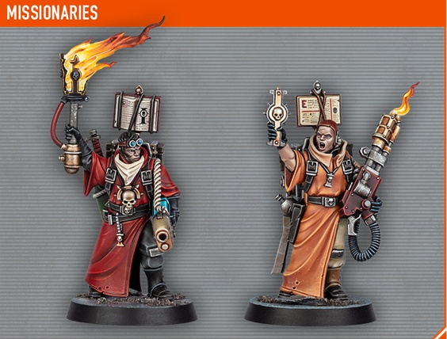
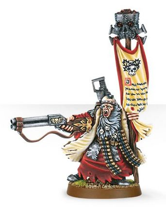

# 0116 传教士 Missionary

精校状态：中文行文已逐段精校，部分术语仍为暂定

分类：通用概念 / 帝国 Imperium / 国教教会 Ecclesiarchy

原文来源：https://www.bilibili.com/opus/1144982893242613766

原作者：帝国神选罐头

原文时间：2025年12月11日 11:58

[返回分类目录](目录.md) · [全书目录](../../目录.md)

<!-- A0116-B0001 -->
**英文原文**

A Missionary is an agent of the Missionarius Galaxia and tasked with spreading the word of the Imperial Creed throughout the Imperium.

<!-- /A0116-B0001 -->

<!-- A0116-B0002 -->

原译文

传教士是银河传教士的特工，负责在整个帝国传播帝国信条。

**校订译文**

传教士是银河传教团的成员，负责在帝国各地传播帝国教义。

<!-- /A0116-B0002 -->

<!-- A0116-B0003 图片 -->

<!-- A0116-B0004 -->

原译文

Imperial Missionary 帝国传教士

**校订译文**

Imperial Missionary 帝国传教士

<!-- /A0116-B0004 -->

<!-- A0116-B0005 -->
### Overview 概述

<!-- /A0116-B0005 -->

<!-- A0116-B0006 -->
**英文原文**

Missionaries have little guidance from the Adeptus Ministorum and are mainly free to spread the faith in any way they see fit. Missionaries are skilled in oration, manipulation, and subtly changing a culture to bring it into line with the Imperial Cult, replacing the gods of the existing pantheon with Imperial Saints or the ritual consumption of human flesh with that of a rare animal. If these methods fail to change the religious habits of a newly discovered population, they are also often skilled warriors not above the use of brute force.

<!-- /A0116-B0006 -->

<!-- A0116-B0007 -->

原译文

传教士几乎没有得到国教教会的引导，他们主要可以自由地以任何他们认为合适的方式传播信仰。传教士擅长演讲、操纵和巧妙地改变一种文化，使其与帝国教派相一致，用帝国圣人取代现有万神殿的神，或食用人肉和稀有动物的仪式。如果这些方法不能改变新发现人群的宗教习惯，他们也往往是熟练的战士，不排斥使用蛮力。

**校订译文**

国教会对传教士的直接指导很少，他们大体可以自行选择适合的传教方式。他们擅长演说、施加影响，以及逐步改变当地文化，使之与帝皇信仰相容：例如用帝国圣徒取代原有诸神，或把仪式中食用人肉的做法改为食用某种珍稀动物。若这些办法仍不能改变新发现群体的宗教习惯，他们往往也有出色战技，并不排斥使用武力。

<!-- /A0116-B0007 -->

<!-- A0116-B0008 图片 -->

<!-- A0116-B0009 -->

原译文

Missionaries 传教士

**校订译文**

Missionaries 传教士

<!-- /A0116-B0009 -->

<!-- A0116-B0010 -->
**英文原文**

They usually run charitable institutions called Missions on newly discovered human worlds. Missions take the form of schools and hospitals. One of the purposes of these institutions is to further the observance of the Imperial Cult. The most famous Missions are the Schola Progenium, which are schools for training Imperial orphans to be Imperial servants.

<!-- /A0116-B0010 -->

<!-- A0116-B0011 -->

原译文

他们通常在新发现的人类世界中经营名为布道所的慈善机构。布道所的形式是学校和医院。这些机构的目的之一是促进对帝国教派的遵守。最著名的布道所是忠嗣学院，这是一所培训帝国孤儿成为帝国仆人的学校。

**校订译文**

传教士通常会在新发现的人类世界开办称为传教机构的慈善设施，主要是学校和医院，其目的之一是推广帝皇信仰。其中最著名的是忠嗣学院，负责将帝国遗孤培养为帝国仆从。

<!-- /A0116-B0011 -->

<!-- A0116-B0012 图片 -->

<!-- A0116-B0013 -->

原译文

Missionary 传教士

**校订译文**

Missionary 传教士

<!-- /A0116-B0013 -->

<!-- A0116-B0014 -->
**英文原文**

Missionaries range from the young fervent hopefuls to the old, wise, and toughened members of the Missionarus Galaxia. They are always at the forefront of Imperial expansion and accompany the crusading armies as they discover new worlds and contact lost civilizations.

<!-- /A0116-B0014 -->

<!-- A0116-B0015 -->

原译文

传教士的范围从年轻的热切希望者到银河传教士的年长、明智和坚韧的成员。他们始终站在帝国扩张的最前沿，伴随着远征发现新世界和接触失落的文明。

**校订译文**

传教士既有热情洋溢、满怀理想的年轻人，也有银河传教团中年长睿智、历经磨炼的老手。他们始终站在帝国扩张的前沿，随远征军发现新世界、接触失落文明。

<!-- /A0116-B0015 -->

<!-- A0116-B0016 图片 -->

<!-- A0116-B0017 -->

原译文

Missionary 传教士

**校订译文**

Missionary 传教士

<!-- /A0116-B0017 -->

<!-- A0116-B0018 -->
### Holy Terra Missionary 神圣泰拉传教士

<!-- /A0116-B0018 -->

<!-- A0116-B0019 -->
**英文原文**

There are Missionaries who are trained on Terra itself and have mastered many holy Acts of Faith. They're attached to a Canoness as personal retinues to strengthen her troops and root out concealed heretics.

<!-- /A0116-B0019 -->

<!-- A0116-B0020 -->

原译文

有些传教士在泰拉上接受过训练，掌握了许多神圣的信仰行为。他们作为个人随从附属于一位大修女，以增强她的部队并根除隐藏的异端。

**校订译文**

一些传教士直接在泰拉受训，掌握多种神圣的信仰伟业。他们作为大修女的私人随从，强化其部队，并揪出潜藏的异端。

**校注：** Acts of Faith 是特定游戏语境中的信仰能力称谓，暂译“信仰伟业”，不按普通英语译成“信仰行为”。

<!-- /A0116-B0020 -->

<!-- A0116-B0021 图片 -->

<!-- A0116-B0022 -->

原译文

Holy Terra missionary assigned to the Order of the Sacred Rose during the Kaurava campaign 在考拉瓦战役期间，神圣泰拉传教士被分配到神圣玫瑰修会

**校订译文**

Holy Terra missionary assigned to the Order of the Sacred Rose during the Kaurava campaign 在考拉瓦战役期间，神圣泰拉传教士被分配到神圣玫瑰修会

<!-- /A0116-B0022 -->

<!-- A0116-B0023 -->
### Famous Missionaries 著名传教士

<!-- /A0116-B0023 -->

<!-- A0116-B0024 -->
**英文原文**

Uriah Jacobus, "Protector of the Faith"

<!-- /A0116-B0024 -->

<!-- A0116-B0025 -->

原译文

乌利亚·雅各布斯，“信仰守护者”

**校订译文**

乌利亚·雅各布斯，“信仰守护者”

<!-- /A0116-B0025 -->

<!-- A0116-B0026 图片 -->

<!-- A0116-B0027 -->

原译文

Uriah Jacobus 乌利亚·雅各布斯

**校订译文**

Uriah Jacobus 乌利亚·雅各布斯

<!-- /A0116-B0027 -->

<!-- A0116-B0028 -->
**英文原文**

Morben, "The Devout"

<!-- /A0116-B0028 -->

<!-- A0116-B0029 -->

原译文

莫本，“虔诚者”

**校订译文**

莫本，“虔诚者”

<!-- /A0116-B0029 -->

<!-- A0116-B0030 -->
**英文原文**

Casophili - Went on to become a Saint

<!-- /A0116-B0030 -->

<!-- A0116-B0031 -->

原译文

卡索斐利 - 后来成为圣人

**校订译文**

卡索斐利 - 后来成为圣人

<!-- /A0116-B0031 -->

<!-- A0116-B0032 -->
**英文原文**

Pious Vorne - Zealot

<!-- /A0116-B0032 -->

<!-- A0116-B0033 -->

原译文

虔诚的沃恩 - 狂热者

**校订译文**

虔诚的沃恩 - 狂热者

<!-- /A0116-B0033 -->

<!-- A0116-B0034 -->

原译文

Dalomat de Montbard 达洛马特·德·蒙巴德

**校订译文**

Dalomat de Montbard 达洛马特·德·蒙巴德

<!-- /A0116-B0034 -->

<!-- A0116-B0035 图片 -->

<!-- A0116-B0036 -->

原译文

Taddeus the Purifier 净化者塔迪厄斯

**校订译文**

Taddeus the Purifier 净化者塔迪厄斯

<!-- /A0116-B0036 -->

本篇核心术语与暂定项

以下列出本篇出现的英文原形及核心术语表用词。同形词可能指不同对象，具体词义以本篇正文和校注为准；单复数、别名和仅见于图注的名称可能尚未列入。完整候选见[术语表](../../术语表/双语术语候选.csv)。

| 英文 | 采用中文 | 状态 |
| --- | --- | --- |
| Imperium | 帝国 | 暂定·简称 |
| Adeptus Ministorum | 国教会 | 暂定 |
| Schola Progenium | 忠嗣学院 | 暂定·官方待核 |
| Terra | 泰拉 | 暂定·官方待核 |
| Imperial Cult | 帝皇信仰 | 暂定·官方待核 |
| Imperial Creed | 帝国教义 | 暂定·官方待核 |
| Missionarius Galaxia | 银河传教团 | 暂定·官方待核 |
| Protector | 守护者 | 暂定·官方待核 |
| Missionary | 传教士 | 暂定 |
| Missionarus Galaxia | 银河传教团 | 暂定 |
| Acts of Faith | 信仰伟业 | 暂定 |
| Canoness | 大修女 | 官方已核对 |
| Uriah Jacobus | 乌利亚·雅各布斯 | 暂定·官方待核 |

