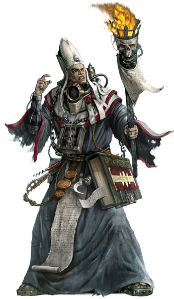

# 0117 教廷牧师 Ministorum Priest

精校状态：中文行文已逐段精校，部分术语仍为暂定

分类：通用概念 / 帝国 Imperium / 国教教会 Ecclesiarchy

原文来源：https://www.bilibili.com/opus/1076691461512101894

原作者：帝国神选罐头

原文时间：2025年06月10日 11:12

[返回分类目录](目录.md) · [全书目录](../../目录.md)

原篇名：国教牧师 Ministorum Priest

<!-- A0117-B0001 -->
**英文原文**

Ministorum Priests are the Preachers, Missionaries, Confessors, Deacons, Pontifices, Drill Abbots, and other clergy members of the Ecclesiarchy, often dispatched to accompany the Imperial Guard during campaigns and battles.

<!-- /A0117-B0001 -->

<!-- A0117-B0002 -->

原译文

国教牧师是传教士、传道士、告解者、助祭、大祭司、训练教长和国教的其他神职人员，经常被派往在战役和战斗中陪同帝国卫队。

**校订译文**

教廷牧师泛指国教会的神职人员，包括传道士、传教士、告解者、助祭、大祭司和训导院长等。他们常被派去随帝国卫队参加战役与战斗。

<!-- /A0117-B0002 -->

<!-- A0117-B0003 图片 -->

<!-- A0117-B0004 -->

原译文

Adeptus Ministorum Priest 国教修会牧师

**校订译文**

Adeptus Ministorum Priest 教廷牧师

<!-- /A0117-B0004 -->

<!-- A0117-B0005 -->
## Overview 概述

<!-- /A0117-B0005 -->

<!-- A0117-B0006 -->
**英文原文**

With their oratory they affirm the faith and resolve of the troops. Even in the midst of battle they preach the righteousness of the Emperor to the troops, instilling in them a ferocious resolve to destroy the enemy in close combat. Their fiery speeches can stir a populace to rebelling against a heretic lord or persuade an army to lay down its arms and submit to the mercy of the Emperor (which is inevitably quick and bloody).

<!-- /A0117-B0006 -->

<!-- A0117-B0007 -->

原译文

他们以雄辩的言辞肯定了部队的信念和决心。即使在战斗中，他们也向军队宣扬帝皇的正义，灌输他们在近战中摧毁敌人的凶猛决心。他们激烈的演讲可以激起民众反抗异端领主，或者说服军队放下武器，服从帝皇的怜悯（这不可避免地是快速而血腥的）。

**校订译文**

牧师以演说坚定士兵的信仰与决心；即使置身战场，也不断宣扬帝皇的正义，激励士兵以凶猛的近战消灭敌人。他们慷慨激昂的言辞能鼓动民众反抗异端领主，也能说服整支军队放下武器，接受帝皇的“慈悲”——其结果往往是迅速而血腥的处决。

<!-- /A0117-B0007 -->

<!-- A0117-B0008 -->
**英文原文**

Priests favour close combat over shooting, and through their inspiring exhortations, instill this ideal into the Guardsmen following them. Such is their fury that priest-led squads will always charge any enemy within reach, making priests as ferocious as Commissars when it comes to motivating men, although they use inspiration rather than fear.

<!-- /A0117-B0008 -->

<!-- A0117-B0009 -->

原译文

牧师们更喜欢近身格斗而不是射击，并通过他们鼓舞人心的劝诫，将这一理想灌输给跟随他们的卫兵。这就是他们的愤怒，牧师领导的小队总是会向任何触手可及的敌人发起攻击，在激励人们方面，牧师就像政委一样凶猛，尽管他们使用的是鼓舞而不是恐惧。

**校订译文**

牧师偏好近战，通过鼓舞人心的训诫，将这种作战理念灌输给追随的帝国卫队士兵。他们的热忱如此强烈，以至于所率小队总会向触及范围内的敌人冲锋。在激励部下方面，牧师与政委同样强硬，只是依靠鼓舞而非恐惧。

<!-- /A0117-B0009 -->

<!-- A0117-B0010 -->
## Equipment 装备

<!-- /A0117-B0010 -->

<!-- A0117-B0011 -->
**英文原文**

Traditionally a priest might be armed with an Eviscerator, a massive, two-handed chainsword capable of inflicting horrific injuries on living creatures, slicing through walls and even destroying vehicles. This overtly violent melee weapon makes the priest an even more powerful individual in close combat.

<!-- /A0117-B0011 -->

<!-- A0117-B0012 -->

原译文

传统上，牧师可能会配备一把开膛者，这是一把巨大的双手链锯剑，能够对生物造成可怕的伤害，刺穿墙壁，甚至摧毁载具。这种明显暴力的近战武器使牧师在近战中变得更加强大。

**校订译文**

传统上，牧师可能会配备一把开膛者，这是一把巨大的双手链锯剑，能够对生物造成可怕的伤害，刺穿墙壁，甚至摧毁载具。这种明显暴力的近战武器使牧师在近战中变得更加强大。

<!-- /A0117-B0012 -->

<!-- A0117-B0013 图片 -->

<!-- A0117-B0014 -->

原译文

Imperial Preacher 帝国传教士

**校订译文**

Imperial Preacher 帝国传道士

<!-- /A0117-B0014 -->

<!-- A0117-B0015 -->
**英文原文**

Priests often wear a rosarius, a potent device commonly used throughout the Adeptus Ministorum as it has a religious aspect as well as a protective one in that when the field is impacted it gives off a great blast of white light, leading some to believe that the Emperor himself is protecting the priest. A priest is often festooned with purity seals, and sometimes bears a holy relic so that all Emperor-fearing troops looking upon the image will be heartened at the sight.

<!-- /A0117-B0015 -->

<!-- A0117-B0016 -->

原译文

牧师经常佩戴玫瑰念珠，这是一种在整个国教修会中常用的强大装置，因为它具有宗教性和保护性，当立场受到冲击时，它会发出巨大的白光，导致一些人相信帝皇本人正在保护牧师。牧师通常会佩戴纯洁印记，有时还会携带圣物，这样所有敬畏帝皇的士兵看到这幅画面都会感到振奋。

**校订译文**

牧师经常佩戴玫瑰念珠。这种国教会广泛使用的强力装置兼有宗教象征和防护功能：其力场遭到冲击时，会爆发耀眼白光，使一些人相信帝皇正在亲自保护牧师。牧师身上通常挂满纯洁印记，有时还携带圣物；敬畏帝皇的士兵见到这些象征便会深受鼓舞。

<!-- /A0117-B0016 -->

<!-- A0117-B0017 -->
## Inquisition 审判庭

<!-- /A0117-B0017 -->

<!-- A0117-B0018 -->
**英文原文**

Inquisitors often see it useful for an Ecclesiarchal clergy member to form part of his retinue. Ecclesiarchy priests attached to a retinue are referred to as Hierophants.

<!-- /A0117-B0018 -->

<!-- A0117-B0019 -->

原译文

审判官经常认为，国教神职人员成为他的随从是有用的。属于随从的国教牧师被称为圣职者。

**校订译文**

审判官经常认为，国教神职人员成为他的随从是有用的。属于随从的教廷牧师被称为圣职者。

<!-- /A0117-B0019 -->

<!-- A0117-B0020 -->
## Notable Priests 著名牧师

<!-- /A0117-B0020 -->

<!-- A0117-B0021 -->

原译文

The Arch Zealot of the Redemption 救赎大狂热者

**校订译文**

The Arch Zealot of the Redemption 救赎大狂热者

<!-- /A0117-B0021 -->

<!-- A0117-B0022 -->

原译文

Basillius 巴利乌斯

**校订译文**

Basillius 巴利乌斯

<!-- /A0117-B0022 -->

<!-- A0117-B0023 -->

原译文

Dolan Chirosius 多兰·奇罗修斯

**校订译文**

Dolan Chirosius 多兰·奇罗修斯

<!-- /A0117-B0023 -->

<!-- A0117-B0024 -->

原译文

Geesan 吉森

**校订译文**

Geesan 吉森

<!-- /A0117-B0024 -->

<!-- A0117-B0025 -->

原译文

Immaculus 伊玛库勒斯

**校订译文**

Immaculus 伊玛库勒斯

<!-- /A0117-B0025 -->

<!-- A0117-B0026 -->

原译文

Klovis the Redeemer 救赎者克洛维斯

**校订译文**

Klovis the Redeemer 救赎者克洛维斯

<!-- /A0117-B0026 -->

<!-- A0117-B0027 -->

原译文

Kyrinov 基里诺夫

**校订译文**

Kyrinov 基里诺夫

<!-- /A0117-B0027 -->

<!-- A0117-B0028 -->

原译文

Marduk 马杜克

**校订译文**

Marduk 马尔杜克

<!-- /A0117-B0028 -->

<!-- A0117-B0029 -->

原译文

Mathieu 马蒂厄

**校订译文**

Mathieu 马蒂厄

<!-- /A0117-B0029 -->

<!-- A0117-B0030 -->

原译文

Moktarn 莫克塔恩

**校订译文**

Moktarn 莫克塔恩

<!-- /A0117-B0030 -->

<!-- A0117-B0031 -->

原译文

Ossimer 奥西默尔

**校订译文**

Ossimer 奥西默尔

<!-- /A0117-B0031 -->

<!-- A0117-B0032 -->

原译文

Pater Nemoris 帕特·涅莫里斯

**校订译文**

Pater Nemoris 帕特·涅莫里斯

<!-- /A0117-B0032 -->

<!-- A0117-B0033 -->

原译文

Sebastian Thor 塞巴斯蒂安·托尔

**校订译文**

Sebastian Thor 塞巴斯蒂安·托尔

<!-- /A0117-B0033 -->

<!-- A0117-B0034 -->

原译文

Taddeus the Purifier 净化者塔迪厄斯

**校订译文**

Taddeus the Purifier 净化者塔迪厄斯

<!-- /A0117-B0034 -->

<!-- A0117-B0035 -->

原译文

Vanhire 范海尔

**校订译文**

Vanhire 范海尔

<!-- /A0117-B0035 -->

<!-- A0117-B0036 -->
## Trivia 琐事

<!-- /A0117-B0036 -->

<!-- A0117-B0037 -->
### Notes 注释

<!-- /A0117-B0037 -->

<!-- A0117-B0038 -->
**英文原文**

The Ciaphas Cain (Novel Series) refers to the Ecclesiarchy representatives attached to the Imperial Guard as "Chaplains". These should not be confused with the Space Marine rank of that name.

<!-- /A0117-B0038 -->

<!-- A0117-B0039 -->

原译文

凯法斯·凯恩（小说系列）将隶属于帝国卫队的国教代表称为“牧师”。这些不应该与这个名字的星际战士军衔混淆。

**校订译文**

《凯法斯·凯恩》小说系列将随帝国卫队服役的国教会代表称为 Chaplains（牧师）。这里的称谓应与星际战士体系中的同名职位区分。

<!-- /A0117-B0039 -->

本篇核心术语与暂定项

以下列出本篇出现的英文原形及核心术语表用词。同形词可能指不同对象，具体词义以本篇正文和校注为准；单复数、别名和仅见于图注的名称可能尚未列入。完整候选见[术语表](../../术语表/双语术语候选.csv)。

| 英文 | 采用中文 | 状态 |
| --- | --- | --- |
| Imperial Guard | 帝国卫队 | 暂定·语境区分 |
| Chainsword | 链锯剑 | 官方已核对 |
| Emperor | 帝皇 | 官方已核对 |
| Adeptus Ministorum | 国教会 | 暂定 |
| Ecclesiarchy | 国教会 | 暂定 |
| Ciaphas Cain | 凯法斯·凯恩 | 暂定·官方待核 |
| Rosarius | 玫瑰念珠 | 暂定·官方待核 |
| Space Marine | 星际战士 | 暂定·官方待核 |
| Chaplains | 教士 | 暂定·官方待核 |
| Mercy | 仁慈 | 暂定·官方待核 |
| Eviscerator | 开膛者 | 暂定·官方待核 |

