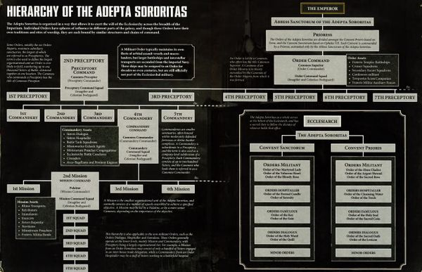
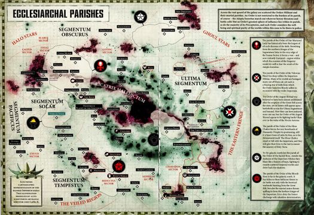
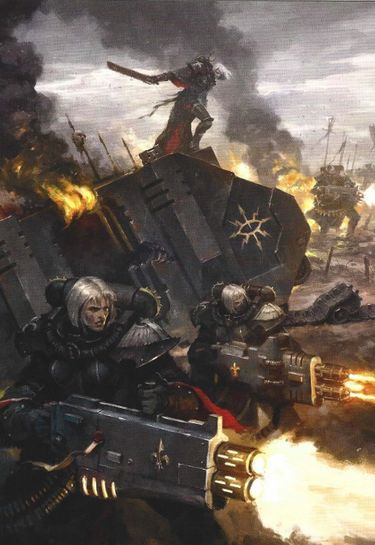
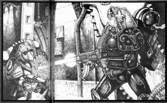

# 0118 修女会 Adepta Sororitas

精校状态：中文行文已逐段精校，部分术语仍为暂定

分类：通用概念 / 帝国 Imperium / 修女会 Adepta Sororitas

原文来源：https://www.bilibili.com/opus/1144944921427312646

原作者：帝国神选罐头

原文时间：2025年12月11日 09:31

[返回分类目录](目录.md) · [全书目录](../../目录.md)

<!-- A0118-B0001 -->
**英文原文**

The Adepta Sororitas (also known as "the Sisterhood" or "Daughters of the Emperor") are an all-female subdivision of the religious organisation known as the Ecclesiarchy or Ministorum. The Sisterhood's Orders Militant serve as the Ecclesiarchy's fighting arm, mercilessly rooting out corruption and heresy within humanity and every organisation of the Adeptus Terra. The terms "Adepta Sororitas" and "Sisters of Battle" are commonly assumed to mean the same thing, but the latter title technically refers only to the Orders Militant - the military arm of the organisation which is the largest and the best-known part of the Sororitas.

<!-- /A0118-B0001 -->

<!-- A0118-B0002 -->

原译文

修女会（也被称为“姐妹会”或“帝皇之女”）是一个全女性的宗教组织，被认为是国教或教会。修女会的军事修会作为国教的战斗武装，无情地根除人类和中央政务部每个组织内部的腐化和异端。“修女会”和“战斗修女”这两个词通常被认为是指同一件事，但后一个在确切的意义上仅指军事修会 - 该组织的军事武装部门，是修女会最大、最著名的部分。

**校订译文**

修女会又称“姐妹会”或“帝皇之女”，是国教会下属、全部由女性组成的组织。其战斗修会充当国教会的军事武装，无情地铲除人类社会及中央政务部各机构中的腐化与异端。“修女会”与“战斗修女”常被混用，但严格而言，后者仅指战斗修会，即修女会中规模最大、最广为人知的军事部分。

<!-- /A0118-B0002 -->

<!-- A0118-B0003 图片 -->

<!-- A0118-B0004 -->

原译文

Adepta Sororitas symbol 修女会标志

**校订译文**

Adepta Sororitas symbol 修女会标志

<!-- /A0118-B0004 -->

<!-- A0118-B0005 -->
**英文原文**

Parent Agency:Ecclesiarchy

<!-- /A0118-B0005 -->

<!-- A0118-B0006 -->

原译文

隶属机构：国教

**校订译文**

隶属机构：国教会

<!-- /A0118-B0006 -->

<!-- A0118-B0007 -->
**英文原文**

Headquarters:Terra & Ophelia VII

<!-- /A0118-B0007 -->

<!-- A0118-B0008 -->

原译文

总部：泰拉&奥菲利亚七号

**校订译文**

总部：泰拉与奥菲利亚七号

<!-- /A0118-B0008 -->

<!-- A0118-B0009 -->
**英文原文**

Leader:Abbess Morvenn Vahl

<!-- /A0118-B0009 -->

<!-- A0118-B0010 -->

原译文

领袖：修道院长莫文·瓦尔

**校订译文**

领袖：修道院长莫雯·瓦尔

<!-- /A0118-B0010 -->

<!-- A0118-B0011 -->
**英文原文**

Armed Forces:Sisters of Battle

<!-- /A0118-B0011 -->

<!-- A0118-B0012 -->

原译文

武装部队：战斗修女

**校订译文**

武装部队：战斗修女

<!-- /A0118-B0012 -->

<!-- A0118-B0013 -->
**英文原文**

Established:M36

<!-- /A0118-B0013 -->

<!-- A0118-B0014 -->

原译文

建立时间：M36

**校订译文**

建立时间：M36

<!-- /A0118-B0014 -->

<!-- A0118-B0015 -->
## Overview 概述

<!-- /A0118-B0015 -->

<!-- A0118-B0016 -->
**英文原文**

The Sisterhood serves as the Ministorum's only official military force because the Decree Passive rules that the Ecclesiarchy cannot maintain any "men under arms". This was supposed to limit the power of the Ecclesiarchy. However, the Ministorum was able to circumvent this decree by using the all-female force of the Sisterhood.

<!-- /A0118-B0016 -->

<!-- A0118-B0017 -->

原译文

修女会是教会唯一的官方军事部队，因为被动法令规定国教不能维持任何“武装人员”。这本应限制国教的力量。然而，教会能够通过使用修女会的全女性部队来规避这一法令。

**校订译文**

《禁武法令》禁止国教会保有任何“武装男子”，本意是限制教会权势。国教会利用法令措辞，保留了全部由女性组成的修女会，使之成为教会唯一正式的军事力量。

<!-- /A0118-B0017 -->

<!-- A0118-B0018 -->
**英文原文**

There is naturally some overlap between the duties of the Sisterhood and the Inquisition; for this reason, although the Inquisition and the Sisterhood remain entirely separate organisations, the Orders Militant of the Sisterhood are the go-to favoured option when an Ordo Hereticus Inquisitor needs soldiers.

<!-- /A0118-B0018 -->

<!-- A0118-B0019 -->

原译文

修女会和审判庭的职责自然有一些重叠；因此，尽管审判庭和修女会仍然是完全独立的组织，但当审判官需要士兵时，修女会的军事修会是首选。

**校订译文**

修女会与审判庭的职责有一定重叠，因此，虽然两者是彼此独立的组织，异端审判官在需要兵力时，仍往往优先征召战斗修会。

<!-- /A0118-B0019 -->

<!-- A0118-B0020 -->
## History 历史

<!-- /A0118-B0020 -->

<!-- A0118-B0021 -->
### Founding 建立

<!-- /A0118-B0021 -->

<!-- A0118-B0022 -->
### Daughters of the Emperor 帝皇之女

<!-- /A0118-B0022 -->

<!-- A0118-B0023 -->
**英文原文**

The Adepta Sororitas were officially founded in the 36th Millennium, and more specifically during the later Age of Apostasy. However, they trace their origins to an older, all-female warrior cult known as the "Daughters of the Emperor". Based on the world of San Leor, this cult was dedicated to worship of the Emperor and the study of martial arts. The Daughters were fairly isolated from the wider Imperium, but there are accounts which suggest that they did not stay on San Leor all the time. For instance, Imperial scholars believe that Saint Sabbat was linked to the Daughters of the Emperor in some way. It is possible that the Daughters fought in her war for the Sabbat Worlds.

<!-- /A0118-B0023 -->

<!-- A0118-B0024 -->

原译文

修女会于第36个千年正式成立，更具体地说，是在后来的叛教时代。然而，他们的起源可以追溯到一个更古老的全女性战士教派，被称为“帝皇之女”。这个教派以圣莱奥尔世界为基地，致力于崇拜帝皇和学习武艺。修女与更广泛的帝国相当隔绝，但有报告表明，她们并没有一直住在圣莱奥尔。例如，帝国学者认为圣萨巴特在某种程度上与帝皇之女有联系。修女可能为萨巴特世界而战。

**校订译文**

修女会正式成立于第 36 千年，更确切地说是在叛教时代后期。其源头则是一个更古老的全女性武装教派——帝皇之女。这个团体驻于圣莱奥尔，专注于崇拜帝皇和钻研武艺，与帝国其他地区相当隔绝。不过，有些记述表明，她们并非从未离开过当地。例如，帝国学者认为圣萨巴特与帝皇之女存在某种联系，她们也可能参加过圣萨巴特征战萨巴特诸世界的战争。

<!-- /A0118-B0024 -->

<!-- A0118-B0025 图片 -->

<!-- A0118-B0026 -->

原译文

Canoness Veridyan 大修女维里迪安

**校订译文**

Canoness Veridyan 大修女维里迪安

<!-- /A0118-B0026 -->

<!-- A0118-B0027 -->
**英文原文**

Regardless, the Daughters of the Emperor remained a small sect and mostly unknown cult until they were discovered by the spies of Goge Vandire, the High Lord of the Administratum (and also Ecclesiarch of the Adeptus Ministorum). Realizing their potential usefullness, he decided to visit San Leor and recruit the Daughters into his own private army. The Daughters at first refused to accept his authority. Vandire decided to show them that he was blessed by the Emperor - he instructed a soldier in his entourage to shoot him, which, after a brief hesitation, he did. However, thanks to the protective field generated by the Rosarius of the Ecclesiarch (which no one but Vandire himself was aware of), Vandire was not harmed. The Daughters took this to be a sign and swore allegiance to Vandire virtually on the spot. They were renamed the Brides of the Emperor and became Vandire's most loyal followers.

<!-- /A0118-B0027 -->

<!-- A0118-B0028 -->

原译文

无论如何，帝皇之女仍然是一个小教派，而且大致是不为人知的教派，直到他们被内务部高领主高戈·范迪尔的间谍发现。意识到他们的潜在用途，他决定访问圣莱奥尔，并招募修女加入自己的个人军队。修女起初拒绝接受他的威权。范迪尔决定向他们展示他受到了帝皇的祝福 — 他指示随从中的一名士兵向他开枪，经过短暂的犹豫，他照做了。然而，由于教宗的玫瑰念珠产生的保护立场（除了范迪尔本人，没有人知道），范迪尔没有受到伤害。修女把这当作一个迹象，几乎当场宣誓效忠范迪尔。他们被重新命名为“帝皇新娘”，成为范迪尔最忠实的追随者。

**校订译文**

帝皇之女原本是个规模很小、鲜为人知的教派，直到兼任内政部高领主与教宗的高戈·范迪尔麾下间谍发现了她们。范迪尔看中其潜在价值，亲赴圣莱奥尔，打算将她们纳为私军。她们起初不肯承认他的权威，于是他决定“证明”自己受帝皇庇佑：命一名随行士兵向自己开枪。士兵犹豫片刻后照办了；范迪尔却凭教宗玫瑰念珠生成的防护力场毫发无伤，而在场者只有他知道这个秘密。帝皇之女将此视为神迹，几乎当场宣誓效忠，改称“帝皇新娘”，成为他最忠实的追随者。

<!-- /A0118-B0028 -->

<!-- A0118-B0029 -->
### Revelation and retribution 启示与报应

<!-- /A0118-B0029 -->

<!-- A0118-B0030 -->
**英文原文**

During the Siege of the Ecclesiarchal Palace, the Adeptus Custodes, the praetorians of the Emperor himself, tried to approach the Brides and convince them of Vandire's treachery. In a last ditch effort to convince them, the Custodes took Alicia Dominica, leader of the Brides, and her chosen bodyguards deep into the Imperial Palace where they stood before the Emperor himself. What happened there remains unknown - Dominica and her companions were sworn to secrecy - but it became clear that the Brides, who reverted to the title of Daughters of the Emperor, had been awakened to the evil that Vandire represented. Marching into his audience chamber, Dominica paused only to condemn Vandire for his crimes before she beheaded the power-crazed dictator. Reportedly, Vandire's final words was "I don't have time to die - I'm too busy!"

<!-- /A0118-B0030 -->

<!-- A0118-B0031 -->

原译文

在围攻国教宫殿期间，禁军修会，帝皇的禁卫军试图接近新娘，让她们相信范迪尔的背叛。为了说服他们，禁军将新娘的领袖艾丽西亚·多米尼克和她选择的护卫带到了皇宫深处，他们站在帝皇面前。那里发生的事情仍然未知 — 多米尼克和她的同伴宣誓保密 — 但很明显，恢复了皇帝之女头衔的新娘已经被范迪尔所代表的邪恶所唤醒。多米尼克走进他的会见厅，在斩首这位权力狂热的独裁者之前，只停下来谴责了范迪尔的罪行。据报告，范迪尔的最后一句话是“我没有时间去死 - 我太忙了！”

**校订译文**

国教宫殿遭围攻期间，帝皇的亲卫——帝皇禁军——尝试接触帝皇新娘，让她们认清范迪尔的背叛。最后，禁军将其领袖艾丽西亚·多米尼克及她选定的护卫带入皇宫深处，觐见帝皇本人。究竟发生了什么，无人知晓；多米尼克与同伴均立誓保密。可以确定的是，她们认清了范迪尔的邪恶，恢复“帝皇之女”的名号。多米尼克径直进入他的接见厅，宣告其罪行，随即斩下这位权欲熏心的独裁者的头颅。据说，范迪尔的遗言是：“我没空去死——我太忙了！”

<!-- /A0118-B0031 -->

<!-- A0118-B0032 -->
### Reformation 改革

<!-- /A0118-B0032 -->

<!-- A0118-B0033 -->
**英文原文**

After this episode, the newly appointed Ecclesiarch Sebastian Thor proclaimed the Decree Passive, which forbade the Ecclesiarchy from having "men under arms". Under the literal interpretation of the decree, the Adepta Sororitas, being female, were not obligated to disband. Thor, recognising the need for the Ecclesiarchy to have some kind of force and internal regulator, allowed them to remain even if the spirit of the decree was rather blatantly disregarded.

<!-- /A0118-B0033 -->

<!-- A0118-B0034 -->

原译文

在这一事件之后，新任命的教宗塞巴斯蒂安·托尔宣布了被动法令，禁止国教拥有“武装人员”。根据法令的字面解释，修女会是女性，没有义务解散。托尔认识到国教需要某种部队和内部监管机构，即使法令的本质被公然无视，他也允许她们留下来。

**校订译文**

此后，新任教宗塞巴斯蒂安·托尔颁布《禁武法令》，禁止国教会保有“武装男子”。按字面理解，全部由女性组成的修女会无需解散。托尔认为教会仍需要一定武装和内部监督力量，因此容许她们保留，尽管此举明显违背了法令原本的限制精神。

<!-- /A0118-B0034 -->

<!-- A0118-B0035 -->
### Later History 后来的历史

<!-- /A0118-B0035 -->

<!-- A0118-B0036 -->
**英文原文**

378.M36: Ecclesiarch Alexis XXII, Sebastian Thor's successor, divides the Orders Militant of the Convent Sanctorum and Convent Prioris into four Orders:

<!-- /A0118-B0036 -->

<!-- A0118-B0037 -->

原译文

塞巴斯蒂安·托尔的继任者教宗亚历克西斯二十二世将圣地修道院和首席修道院的军事修会分为四个修会：

**校订译文**

378.M36：塞巴斯蒂安·托尔的继任者、教宗亚历克西斯二十二世，将圣地修道院与首席修道院所属的战斗修会划为四大修会：

<!-- /A0118-B0037 -->

<!-- A0118-B0038 -->

原译文

Order of the Ebon Chalice 黑檀圣杯修会

**校订译文**

Order of the Ebon Chalice 黑檀圣杯修会

<!-- /A0118-B0038 -->

<!-- A0118-B0039 -->

原译文

Order of the Valorous Heart 勇毅之心修会

**校订译文**

Order of the Valorous Heart 勇毅之心修会

<!-- /A0118-B0039 -->

<!-- A0118-B0040 -->

原译文

Order of the Fiery Heart 炙热之心修会

**校订译文**

Order of the Fiery Heart 炙热之心修会

<!-- /A0118-B0040 -->

<!-- A0118-B0041 -->

原译文

Order of the Argent Shroud 银白寿衣修会

**校订译文**

Order of the Argent Shroud 银白寿衣修会

<!-- /A0118-B0041 -->

<!-- A0118-B0042 -->
**英文原文**

M36: After the death of Alicia Dominica, Ecclesiarch Equitus XI presides over the creation the rank of Abbess of the Adepta Sororitas, the new leader of the Adepta Sororitas. The first to hold the position is Sister Palmiro of the Order of the Holy Word.

<!-- /A0118-B0042 -->

<!-- A0118-B0043 -->

原译文

艾丽西亚·多米尼克去世后，教宗埃奎图斯十一世主持创建修女会的修道院长的等级，修女会的新领导人。第一个担任这一职位的是圣言修会的帕尔米罗修女。

**校订译文**

第 36 千年：艾丽西亚·多米尼克去世后，教宗埃奎图斯十一世设立修女会总院长一职，作为修女会的新领袖。首任总院长是圣言修会的帕尔米罗修女。

<!-- /A0118-B0043 -->

<!-- A0118-B0044 -->
**英文原文**

878.M38: Ecclesiarch Deacis VI founds two more Orders Militant in honour of the remaining two saints who accompanied Alicia Dominica to the Golden Throne - the Order of the Bloody Rose in honour of Sister Mina and the Order of the Sacred Rose in honour of Sister Arabella.

<!-- /A0118-B0044 -->

<!-- A0118-B0045 -->

原译文

教宗迪西斯六世创立了另外两个军事修会，以纪念陪同艾丽西亚·多米尼克登上黄金王座的其余两位圣人 — 为纪念米娜修女而设立的鲜血玫瑰修会和为纪念阿拉贝拉修女而设立的神圣玫瑰修会。

**校订译文**

878.M38：教宗迪西斯六世设立另外两个战斗修会，以纪念陪同艾丽西亚·多米尼克觐见黄金王座的其余两位圣人：纪念米娜修女的鲜血玫瑰修会，以及纪念阿拉贝拉修女的神圣玫瑰修会。

<!-- /A0118-B0045 -->

<!-- A0118-B0046 -->
**英文原文**

M41: Sister Sabrina of the Order of the Ermine Mantle is elected Abbess but disappears during her pilgrimage to San Leor. The position of Abbess was vacant until after the return of Roboute Guilliman when it was reestablished.

<!-- /A0118-B0046 -->

<!-- A0118-B0047 -->

原译文

白鼬斗篷修会的萨布丽娜修女被选为修道院长，但在前往圣莱奥尔的朝圣途中失踪。修道院长的职位一直空缺，直到罗伯特·基里曼返回后才得以重建。

**校订译文**

第 41 千年：白鼬斗篷修会的萨布丽娜修女当选总院长，却在赴圣莱奥尔朝圣途中失踪。该职位一直空缺，直至罗保特·基里曼回归后才重新有人出任。

<!-- /A0118-B0047 -->

<!-- A0118-B0048 -->
**英文原文**

M42: The Adepta Sororitas embark on an unprecedented number of Wars of Faith in the aftermath of the formation of the Great Rift and Indomitus Crusade. A new Abbess, Morvenn Vahl, is appointed by Roboute Guilliman.

<!-- /A0118-B0048 -->

<!-- A0118-B0049 -->

原译文

在大裂隙形成和不屈远征后，修女会开始了数量空前的信仰战争。罗伯特·基里曼任命了一位新的修道院长莫文·瓦尔。

**校订译文**

第 42 千年：大裂隙形成、不屈远征开始后，修女会投入了数量空前的信仰战争。罗保特·基里曼任命莫雯·瓦尔为新任总院长。

<!-- /A0118-B0049 -->

<!-- A0118-B0050 -->
## Organisation 组织

<!-- /A0118-B0050 -->

<!-- A0118-B0051 -->
### Structure and Hierarchy 结构和层次

<!-- /A0118-B0051 -->

<!-- A0118-B0052 -->
**英文原文**

The Adepta Sororitas is part of the Ecclesiarchy and is divided between two Convents - the Convent Prioris located on Terra and the Convent Sanctorum based on Ophelia VII, although in practice their forces are spread throughout the Galaxy.

<!-- /A0118-B0052 -->

<!-- A0118-B0053 -->

原译文

修女会是国教的一部分，分为两个修道院 — 位于泰拉的首席修道院和奥菲利亚七号的圣地修道院，尽管事实上它们的部队遍布整个银河系。

**校订译文**

修女会隶属国教会，以两座大修道院为组织中心：位于泰拉的首席修道院，以及位于奥菲利亚七号的圣地修道院。实际部署中，其部队遍布银河。

<!-- /A0118-B0053 -->

<!-- A0118-B0054 图片 -->

<!-- A0118-B0055 -->

原译文

Adepta Sororitas Organization 修女会组织

**校订译文**

Adepta Sororitas Organization 修女会组织

<!-- /A0118-B0055 -->

<!-- A0118-B0056 -->
**英文原文**

The overall commander and spiritual leader of the entire Sisterhood is the Abbess of the Adepta Sororitas. As the leader of the Adepta Sororitas, the Abbess is sometimes elected into the High Lords of Terra.

<!-- /A0118-B0056 -->

<!-- A0118-B0057 -->

原译文

整个修女会的总指挥和精神领袖是修女会的修道院长。作为修女会的领袖，这位修道院长有时会被选入泰拉的高领主。

**校订译文**

修女会总院长是整个组织的最高指挥官和精神领袖，有时也会入选泰拉高领主议会。

<!-- /A0118-B0057 -->

<!-- A0118-B0058 -->
**英文原文**

Below the Abbess are the Prioresses of the two Convents who are in charge of their Convent and the various Orders based there.

<!-- /A0118-B0058 -->

<!-- A0118-B0059 -->

原译文

在修道院长下面是两个修道院的院长，她们负责各自的修道院和设在那里的各种修会。

**校订译文**

总院长之下，是分别统辖两座大修道院及其所属各修会的院长。

<!-- /A0118-B0059 -->

<!-- A0118-B0060 -->
**英文原文**

The Convents of the Sisterhood are organized into several Orders. There are two different kind of Orders: The Orders Militant, or Sisters of Battle, the military arm of the Ecclesiarchy composed of the six Major Orders and countless subsidiary Lesser Orders Militant; and the Non-Militant Orders, each of which has different roles and responsibilities in the Imperium.

<!-- /A0118-B0060 -->

<!-- A0118-B0061 -->

原译文

修女会修道院分为几个修会。有两种不同的修会：军事修会，或战斗修女，由六个主要修会和无数次级修会组成的国教军事武装；以及非军事修会，每个修会在帝国中都有不同的角色和责任。

**校订译文**

两座大修道院下辖多个修会，分为两类：一类是战斗修会，即战斗修女，由六大修会及众多附属小修会组成，承担国教会的军事职责；另一类是非战斗修会，分别承担帝国中的不同职能。

<!-- /A0118-B0061 -->

<!-- A0118-B0062 图片 -->

<!-- A0118-B0063 -->

原译文

Battle Sister of the Adepta Sororitas 修女会的战斗修女

**校订译文**

Battle Sister of the Adepta Sororitas 修女会的战斗修女

<!-- /A0118-B0063 -->

<!-- A0118-B0064 -->
**英文原文**

The largest of the Non-Militant Orders rival the Sisters of Battle in size and notoriety, but there is also hundreds of other orders, the vast majority of which are unknown to the bulk of Mankind. The most well-known are the Orders Hospitaller, composed of surgeons, physicians and nurses, the Orders Dialogous, scholars dealing with languages, cyphers and translations, and the Orders Famulous, acting as diplomats, chamberlains and advisors for Imperial noble families.

<!-- /A0118-B0064 -->

<!-- A0118-B0065 -->

原译文

最大的非军事修会在规模和知名度上与战斗修女不相上下，但也有数百个其他修会，其中绝大多数是人类所不知道的。最著名的是医院修会，由外科医生、内科医生和护士组成；交流修会，研究语言、密码和翻译的学者；以及役从修会，担任外交官、内侍和帝国贵族家庭的顾问。

**校订译文**

规模最大的非战斗修会，其人数与知名度足以与战斗修女相比；此外还有数百个大多数人闻所未闻的小修会。最著名的包括由外科医师、内科医师和护士组成的医疗修会；研究语言、密码与翻译的书记修会；以及为帝国贵族家族担任外交人员、内务总管和顾问的役从修会。

<!-- /A0118-B0065 -->

<!-- A0118-B0066 -->
**英文原文**

It is not uncommon for a Sister to transfer from one of the Orders to another, particularly if a Battle Sister has become injured or is too old for combat they may transfer to one of the non-militant Orders.

<!-- /A0118-B0066 -->

<!-- A0118-B0067 -->

原译文

修女从一个修会转到另一个修会并不罕见，特别是如果战斗修女受伤或太老而无法战斗，他们可能会转到非战斗修会之一。

**校订译文**

修女在不同修会之间调任并不罕见。例如，战斗修女因伤或年龄原因不再适合战斗时，可能转入某个非战斗修会。

<!-- /A0118-B0067 -->

<!-- A0118-B0068 -->
**英文原文**

Each of the major Orders follows the same basic hierarchical structure:

<!-- /A0118-B0068 -->

<!-- A0118-B0069 -->

原译文

每个主要修会都遵循相同的基本层次结构：

**校订译文**

每个主要修会都遵循相同的基本层次结构：

<!-- /A0118-B0069 -->

<!-- A0118-B0070 -->
**英文原文**

Order - Led by the head Canoness, called the Canoness Superior, who runs the entire Order.

<!-- /A0118-B0070 -->

<!-- A0118-B0071 -->

原译文

修会 - 由负责管理整个修会的大修女之首领导，被称为高阶大修女。

**校订译文**

修会 - 由负责管理整个修会的大修女之首领导，被称为高阶大修女。

<!-- /A0118-B0071 -->

<!-- A0118-B0072 -->
**英文原文**

Preceptory - A subsidiary convent or a large tactical detachment with up to 1,000 Sisters led by a Canoness Preceptor.

<!-- /A0118-B0072 -->

<!-- A0118-B0073 -->

原译文

分殿 - 一个附属修道院或一个由一名教导大修女领导的多达1000名修女的大型战术分队。

**校订译文**

分殿 - 一个附属修道院或一个由一名教导大修女领导的多达1000名修女的大型战术分队。

<!-- /A0118-B0073 -->

<!-- A0118-B0074 -->
**英文原文**

Commandery - Normally smaller convents or detachments of militant Sisters with up to 200 Sisters, led by a Canoness Commander.

<!-- /A0118-B0074 -->

<!-- A0118-B0075 -->

原译文

督所 - 通常是由一名指挥大修女领导的小型修道院或由多达200名修女组成的军事修女分遣队。

**校订译文**

督所 - 通常是由一名指挥大修女领导的小型修道院或由多达200名修女组成的军事修女分遣队。

<!-- /A0118-B0075 -->

<!-- A0118-B0076 -->
**英文原文**

Mission - The smallest organisation of Sisters, consisting of a few units and can be led by a Canoness or the lesser Palatine.

<!-- /A0118-B0076 -->

<!-- A0118-B0077 -->

原译文

教团 - 最小的修女组织，由几个单位组成，可以由大修女或较低的宫廷官领导。

**校订译文**

教团 - 最小的修女组织，由几个单位组成，可以由大修女或较低的宫廷官领导。

<!-- /A0118-B0077 -->

<!-- A0118-B0078 -->
**英文原文**

It should be noted that the non-militant Orders operate mainly at Mission and Commandery levels - Preceptory is a largely organisational tier. For example, a Commandery of the Order Hospitallier could be a staff of sisters working in a field hospital whilst a Mission of the Orders Famulous could be a handful of Sisters engaged in a trade delegation.

<!-- /A0118-B0078 -->

<!-- A0118-B0079 -->

原译文

应该指出的是，非军事修会主要在教团和督所层级运作 — 分殿是一个主要的组织层面。例如，医院修会的督所可能是在野战医院工作的修女们，而役从修会的教团可能是参加贸易代表团的少数修女。

**校订译文**

非战斗修会主要以教团和督所为实际活动单位，分殿则主要承担组织管理职能。例如，医疗修会的一个督所可能就是一所野战医院的修女团队，而役从修会的一个教团可能仅由参加贸易代表团的几名修女组成。

<!-- /A0118-B0079 -->

<!-- A0118-B0080 -->
### The Orders 修会

<!-- /A0118-B0080 -->

<!-- A0118-B0081 -->
### Orders Militant 战斗修会

原题：Orders Militant 军事修会

<!-- /A0118-B0081 -->

<!-- A0118-B0082 -->
**英文原文**

Commonly known as the Sisters of Battle, the Orders Militant are the most numerous and well-known of the Adepta Soritas. They are the only official fighting force of the Ecclesiarchy and often prosecute Wars of Faith. They form the Chamber Militant of the Ordo Hereticus, often fighting alongside the Ordo's Inquisitors.

<!-- /A0118-B0082 -->

<!-- A0118-B0083 -->

原译文

通常被称为战斗修女，军事修会是修女会中人数最多、最著名的。他们是国教唯一的官方战斗部队，经常发起信仰战争。他们组成了讨逆修会的军事辅军，经常与修会的审判官并肩作战。

**校订译文**

战斗修会通称“战斗修女”，是修女会中人数最多、最广为人知的部分。她们是国教会唯一正式的作战力量，经常参加信仰战争，也作为异端审判庭的军事武装，与该分支的审判官并肩作战。

**校注：** 本段使用 Chamber Militant 描述修女会与异端审判庭的关系，前文则强调双方彼此独立。均按各自英文保留，可理解为作战协作关系，不据此断言修女会行政上隶属审判庭。

<!-- /A0118-B0083 -->

<!-- A0118-B0084 -->
### Convent Sanctorum (Ophelia VII) 圣地修道院（奥菲利亚七号）

<!-- /A0118-B0084 -->

<!-- A0118-B0085 -->

原译文

Order of the Bloody Rose 鲜血玫瑰修会

**校订译文**

Order of the Bloody Rose 鲜血玫瑰修会

<!-- /A0118-B0085 -->

<!-- A0118-B0086 -->

原译文

Order of Our Martyred Lady 我们的殉教女士修会

**校订译文**

Order of Our Martyred Lady 殉教圣女修会

<!-- /A0118-B0086 -->

<!-- A0118-B0087 -->

原译文

Order of the Valorous Heart 勇毅之心修会

**校订译文**

Order of the Valorous Heart 勇毅之心修会

<!-- /A0118-B0087 -->

<!-- A0118-B0088 -->
### Convent Prioris (Terra) 首席修道院（泰拉）

<!-- /A0118-B0088 -->

<!-- A0118-B0089 -->

原译文

Order of the Sacred Rose 神圣玫瑰修会

**校订译文**

Order of the Sacred Rose 神圣玫瑰修会

<!-- /A0118-B0089 -->

<!-- A0118-B0090 -->

原译文

Order of the Ebon Chalice 黑檀圣杯修会

**校订译文**

Order of the Ebon Chalice 黑檀圣杯修会

<!-- /A0118-B0090 -->

<!-- A0118-B0091 -->

原译文

Order of the Argent Shroud 银白寿衣修会

**校订译文**

Order of the Argent Shroud 银白寿衣修会

<!-- /A0118-B0091 -->

<!-- A0118-B0092 -->
### Lesser Orders Militant 次级战斗修会

原题：Lesser Orders Militant 次级军事修会

<!-- /A0118-B0092 -->

<!-- A0118-B0093 -->
**英文原文**

Since their founding, the Major Orders Militant have established a number of subsidiary convents at sites significant to the Ecclesiarchy. Sometimes little more than small Garrisons, these bases have developed identities distinct from their parent Orders over time, eventually becoming separate Orders altogether. These smaller Orders are referred to as the Orders Minoris or Lesser Orders Militant. In theory, the leaders of the Lesser Orders are answerable to the leaders of the Major Order that spawned them.

<!-- /A0118-B0093 -->

<!-- A0118-B0094 -->

原译文

自成立以来，主要军事修会在对国教具有重要意义的地点建立了许多附属修道院。有时，这些基地只不过是小规模的驻军，随着时间的推移，它们已经发展出不同于其上级修会的身份，最终成为单独的修会。这些较小的修会被称为次级军事修会。理论上，次级修会的领导人对造成她们的主要修会的领导人负责。

**校订译文**

自成立以来，六大战斗修会在对国教会具有特殊意义的地点设立了许多附属修道院。这些据点有时只有少量驻军，却随着时间推移形成了不同于母修会的特色，最终独立为新的修会，称为小修会或次级战斗修会。理论上，小修会的领袖仍须向其源出的大战斗修会负责。

<!-- /A0118-B0094 -->

<!-- A0118-B0095 -->
### Non-Militant Orders 非战斗修会

原题：Non-Militant Orders 非军事修会

<!-- /A0118-B0095 -->

<!-- A0118-B0096 -->
### Orders Hospitaller 医疗修会

原题：Orders Hospitaller 医院修会

<!-- /A0118-B0096 -->

<!-- A0118-B0097 -->
**英文原文**

The Sisters Hospitaller are surgeons, physicians and nurses. They aid the poor, and heal the sick and the wounded in many hospitals and clinics of the Sisterhood and serve in all departments of the Imperiums armed services except the Adeptus Astartes.

<!-- /A0118-B0097 -->

<!-- A0118-B0098 -->

原译文

医院修女是外科医生、内科医生和护士。他们在修女会的许多医院和诊所帮助穷人，治疗病人和伤员，并在帝国武装部队的所有部门服役，但阿斯塔特修会除外。

**校订译文**

医疗修女担任外科医师、内科医师和护士，在修女会各医院及诊所救济贫民、医治伤病，也为除阿斯塔特修会之外的帝国各军种服务。

<!-- /A0118-B0098 -->

<!-- A0118-B0099 图片 -->

<!-- A0118-B0100 -->

原译文

Sister Hospitalier 医院修女

**校订译文**

Sister Hospitalier 医疗修女

**校注：** 原文拼作 Hospitalier，是 Hospitaller 的异拼；中文采用官方单位名“医疗修女”。组织 Orders Hospitaller 暂以医疗修会对应，不能把组织译名一并标成已有官方核证。

<!-- /A0118-B0100 -->

<!-- A0118-B0101 -->
**英文原文**

Order of the Eternal Candle based in the Convent Sanctorum (Ophelia VII)

<!-- /A0118-B0101 -->

<!-- A0118-B0102 -->

原译文

圣地修道院（奥菲利亚七号）的永恒蜡烛修会

**校订译文**

圣地修道院（奥菲利亚七号）的永恒蜡烛修会

<!-- /A0118-B0102 -->

<!-- A0118-B0103 -->
**英文原文**

Order of Serenity based in the Convent Sanctorum

<!-- /A0118-B0103 -->

<!-- A0118-B0104 -->

原译文

圣地修道院的宁静修会

**校订译文**

圣地修道院的宁静修会

<!-- /A0118-B0104 -->

<!-- A0118-B0105 -->
**英文原文**

Order of the Cleansing Water based in the Convent Prioris (Terra)

<!-- /A0118-B0105 -->

<!-- A0118-B0106 -->

原译文

首席修道院（泰拉）的净化之水修会

**校订译文**

首席修道院（泰拉）的净化之水修会

<!-- /A0118-B0106 -->

<!-- A0118-B0107 -->
**英文原文**

Order of the Torch based in the Convent Prioris

<!-- /A0118-B0107 -->

<!-- A0118-B0108 -->

原译文

首席修道院的火炬修会

**校订译文**

首席修道院的火炬修会

<!-- /A0118-B0108 -->

<!-- A0118-B0109 -->

原译文

Order of the Silent Vow 寂静誓约修会

**校订译文**

Order of the Silent Vow 寂静誓约修会

<!-- /A0118-B0109 -->

<!-- A0118-B0110 -->
### Orders Dialogus 书记修会

原题：Orders Dialogus 交流修会

<!-- /A0118-B0110 -->

<!-- A0118-B0111 -->
**英文原文**

The Sisters Dialogus help to translate the innumerable dialects and slangs used throughout the Imperium. At the behest of the Inquisition and certain parties they also study Xenos languages, also translating texts obtained from Xeno artefacts. Sisters Dialogous are often employed as Sages in Ordo Hereticus Inquisitors' retinues.

<!-- /A0118-B0111 -->

<!-- A0118-B0112 -->

原译文

交流修女有助于翻译整个帝国中使用的无数方言和俚语。在审判庭和某些方面的要求下，他们还研究异型语言，并翻译从异型造物中获得的文本。交流修女经常在讨逆修会审判官的随从中担任智者。

**校订译文**

书记修女负责翻译帝国境内不计其数的方言与俚语。应审判庭及其他机构要求，她们也研究异形语言，译解异形造物上的文字。她们常在异端审判官的随从队伍中担任智者。

<!-- /A0118-B0112 -->

<!-- A0118-B0113 -->
**英文原文**

Order of the Holy Word based in the Convent Sanctorum

<!-- /A0118-B0113 -->

<!-- A0118-B0114 -->

原译文

圣地修道院的圣言修会

**校订译文**

圣地修道院的圣言修会

<!-- /A0118-B0114 -->

<!-- A0118-B0115 -->
**英文原文**

Order of the Quill based in the Convent Sanctorum

<!-- /A0118-B0115 -->

<!-- A0118-B0116 -->

原译文

圣地修道院的羽笔修会

**校订译文**

圣地修道院的羽笔修会

<!-- /A0118-B0116 -->

<!-- A0118-B0117 -->
**英文原文**

Order of the Sacred Oath based in the Convent Prioris

<!-- /A0118-B0117 -->

<!-- A0118-B0118 -->

原译文

首席修道院的神圣誓言修会

**校订译文**

首席修道院的神圣誓言修会

<!-- /A0118-B0118 -->

<!-- A0118-B0119 -->
**英文原文**

Order of the Lexicon based in the Convent Prioris

<!-- /A0118-B0119 -->

<!-- A0118-B0120 -->

原译文

首席修道院的编纂修会

**校订译文**

首席修道院的编纂修会

<!-- /A0118-B0120 -->

<!-- A0118-B0121 -->

原译文

Order of the Resounding Vow 回响誓约修会

**校订译文**

Order of the Resounding Vow 回响誓约修会

<!-- /A0118-B0121 -->

<!-- A0118-B0122 -->

原译文

Order of the Illuminated Page 明页修会

**校订译文**

Order of the Illuminated Page 明页修会

<!-- /A0118-B0122 -->

<!-- A0118-B0123 -->
### Orders Famulous 役从修会

<!-- /A0118-B0123 -->

<!-- A0118-B0124 -->
**英文原文**

The Sisters Famulous organise and maintain households of certain Imperial governors and Imperial nobles, serving as advisors and by their very presence reminding them of their higher loyalties. They oppose any disloyalty with the support of faithful followers from the inside of the household itself.

<!-- /A0118-B0124 -->

<!-- A0118-B0125 -->

原译文

役从修女组织和维护某些帝国总督和帝国贵族的家族，担任顾问，并通过她们的存在提醒他们更高的忠诚。他们在家族内部忠实追随者的支持下反对任何不忠行为。

**校订译文**

役从修女为部分帝国总督与贵族家族管理内务、提供建议；她们的存在本身，也在提醒这些家族必须向更高的帝国权威效忠。一旦发现不忠，她们会联合家族内部忠于帝国的成员加以抵制。

<!-- /A0118-B0125 -->

<!-- A0118-B0126 -->
**英文原文**

Order of the Key based in the Convent Sanctorum

<!-- /A0118-B0126 -->

<!-- A0118-B0127 -->

原译文

圣地修道院的钥匙修会

**校订译文**

圣地修道院的钥匙修会

<!-- /A0118-B0127 -->

<!-- A0118-B0128 -->
**英文原文**

Order of the Gate based in the Convent Sanctorum

<!-- /A0118-B0128 -->

<!-- A0118-B0129 -->

原译文

圣地修道院的门扉修会

**校订译文**

圣地修道院的门扉修会

<!-- /A0118-B0129 -->

<!-- A0118-B0130 -->
**英文原文**

Order of the Holy Seal based in the Convent Prioris

<!-- /A0118-B0130 -->

<!-- A0118-B0131 -->

原译文

首席修道院的圣印修会

**校订译文**

首席修道院的圣印修会

<!-- /A0118-B0131 -->

<!-- A0118-B0132 -->
**英文原文**

Order of the Sacred Coin based in the Convent Prioris

<!-- /A0118-B0132 -->

<!-- A0118-B0133 -->

原译文

首席修道院的神圣硬币修会

**校订译文**

首席修道院的神圣硬币修会

<!-- /A0118-B0133 -->

<!-- A0118-B0134 -->

原译文

Order of the Shining Path 光辉之路修会

**校订译文**

Order of the Shining Path 光辉之路修会

<!-- /A0118-B0134 -->

<!-- A0118-B0135 -->

原译文

Order of the Veiled Mantle 帷幕斗篷修会

**校订译文**

Order of the Veiled Mantle 帷幕斗篷修会

<!-- /A0118-B0135 -->

<!-- A0118-B0136 -->
### Orders Sabine 萨宾修会

<!-- /A0118-B0136 -->

<!-- A0118-B0137 -->
**英文原文**

The Sisters of the Orders Sabine accompany the Missionarius Galaxia on missions to rediscover new worlds. The Sisters specialise in infiltrating primitive societies and introduce elements of the Imperial Creed to the natives.

<!-- /A0118-B0137 -->

<!-- A0118-B0138 -->

原译文

萨宾修会的修女陪伴银河传教士执行重新发现新世界的任务。修女专门渗透原始社会，并将帝国信条的内容介绍给当地人。

**校订译文**

萨宾修会的修女随银河传教团执行探索、重新发现人类世界的任务。她们擅长潜入原始社会，向当地居民逐步引入帝国教义。

<!-- /A0118-B0138 -->

<!-- A0118-B0139 -->
### Orders Pronatus 俯身修会

<!-- /A0118-B0139 -->

<!-- A0118-B0140 -->
**英文原文**

Specialise in the retrieving, guarding, studying and repairing of artefacts of value to the Ecclesiarchy.

<!-- /A0118-B0140 -->

<!-- A0118-B0141 -->

原译文

专门从事对国教有价值的造物的检索、保护、研究和修复。

**校订译文**

专门负责寻回、保管、研究及修复对国教会具有价值的造物。

<!-- /A0118-B0141 -->

<!-- A0118-B0142 -->
**英文原文**

The Order of the Eternal Gate - one of the orders whose responsibility is the retrieval of relics and artefacts for the Ecclesiarchy.

<!-- /A0118-B0142 -->

<!-- A0118-B0143 -->

原译文

永恒之门修会 - 负责为国教取回圣物和造物的修会之一。

**校订译文**

永恒之门修会 - 负责为国教取回圣物和造物的修会之一。

<!-- /A0118-B0143 -->

<!-- A0118-B0144 -->
**英文原文**

The Order of the Blessed Enquiry - believed to have been destroyed due to their collection of artefacts of the Chaos Gods

<!-- /A0118-B0144 -->

<!-- A0118-B0145 -->

原译文

受祝查询修会 - 据信，由于她们收集了混沌诸神的造物而被摧毁

**校订译文**

受祝查询修会 - 据信，由于她们收集了混沌诸神的造物而被摧毁

<!-- /A0118-B0145 -->

<!-- A0118-B0146 -->
**英文原文**

The Order of the August Vigil - specializing in the guardianship and defense of holy relics across the Imperium.

<!-- /A0118-B0146 -->

<!-- A0118-B0147 -->

原译文

威严守夜修会 - 专门负责整个帝国圣物的监护和保护。

**校订译文**

威严守夜修会 - 专门负责整个帝国圣物的监护和保护。

<!-- /A0118-B0147 -->

<!-- A0118-B0148 -->
### Orders Madriga 牧歌修会

<!-- /A0118-B0148 -->

<!-- A0118-B0149 -->
**英文原文**

The Orders Madriga provide choirs in temples.

<!-- /A0118-B0149 -->

<!-- A0118-B0150 -->

原译文

牧歌修会为圣堂提供唱诗班。

**校订译文**

牧歌修会为圣堂提供唱诗班。

<!-- /A0118-B0150 -->

<!-- A0118-B0151 -->
### Orders Planxilium 普兰西利姆修会

<!-- /A0118-B0151 -->

<!-- A0118-B0152 -->
**英文原文**

The Orders Planxilium form thousand-strong processionals leading weeping and wailing pilgrims upon the remembrance and high holy days of Veneris.

<!-- /A0118-B0152 -->

<!-- A0118-B0153 -->

原译文

普兰西利姆组织了数千个巨大的游行队伍，带领着哭泣和哀嚎的朝圣者，纪念维内里斯的至高圣日。

**校订译文**

普兰西利姆修会在维内里斯的纪念日及重要圣日组织千人规模的游行队伍，带领哭泣哀悼的朝圣者参加仪式。

<!-- /A0118-B0153 -->

<!-- A0118-B0154 -->
### Orders Vespila 维斯皮拉修会

<!-- /A0118-B0154 -->

<!-- A0118-B0155 -->
**英文原文**

The ‘dark sisters’ of the Orders Vespila are tasked by Cardinal Kregory Hestor with the sanctification of the bodies of fallen kin, and are sometimes called upon to serve as forensic specialists when a Throne Agent has recourse to disinter a long dead corpse.

<!-- /A0118-B0155 -->

<!-- A0118-B0156 -->

原译文

维斯皮拉修会的“黑暗修女”由红衣主教克雷戈里·赫斯托委派，负责将牺牲亲裔的尸体圣化，当王座特工不得不挖掘一具早已死亡的尸体时，她们有时会被要求担任法医专家。

**校订译文**

维斯皮拉修会的“黑暗修女”受红衣主教克雷戈里·赫斯托委派，负责为逝去同袍的遗体举行圣化仪式。当王座特工需要掘出陈年遗体调查时，她们有时也会担任法医专家。

<!-- /A0118-B0156 -->

<!-- A0118-B0157 -->
### Order Fenestrus 窗口修会

<!-- /A0118-B0157 -->

<!-- A0118-B0158 -->
**英文原文**

Maintain the glass paneling of Imperial shrines and cathedrals.

<!-- /A0118-B0158 -->

<!-- A0118-B0159 -->

原译文

维护帝国圣地和大教堂的玻璃镶板。

**校订译文**

维护帝国圣地和大教堂的玻璃镶板。

<!-- /A0118-B0159 -->

<!-- A0118-B0160 图片 -->

<!-- A0118-B0161 -->

原译文

Deployments of the Adepta Sororitas 修女会的部署

**校订译文**

Deployments of the Adepta Sororitas 修女会的部署

<!-- /A0118-B0161 -->

<!-- A0118-B0162 -->
### Orders Princeps 元首修会

<!-- /A0118-B0162 -->

<!-- A0118-B0163 -->
**英文原文**

Monitor Ecclesiarchy laws.

<!-- /A0118-B0163 -->

<!-- A0118-B0164 -->

原译文

监督国教法律。

**校订译文**

监督国教法律。

<!-- /A0118-B0164 -->

<!-- A0118-B0165 -->
### Orders Tarentine 塔兰廷修会

<!-- /A0118-B0165 -->

<!-- A0118-B0166 -->
**英文原文**

Divine messages from the Emperor via the gas clouds of the Tarentia Pillars.

<!-- /A0118-B0166 -->

<!-- A0118-B0167 -->

原译文

帝皇通过塔兰蒂亚石柱的气体云传达的神圣信息。

**校订译文**

通过解读塔兰蒂亚之柱的气体云，占卜帝皇传达的信息。

<!-- /A0118-B0167 -->

<!-- A0118-B0168 -->
### Hagiolater 崇圣者

<!-- /A0118-B0168 -->

<!-- A0118-B0169 -->
**英文原文**

Record the deeds of Sisters upon the battlefield.

<!-- /A0118-B0169 -->

<!-- A0118-B0170 -->

原译文

记录修女在战场上的事迹。

**校订译文**

记录修女在战场上的事迹。

<!-- /A0118-B0170 -->

<!-- A0118-B0171 -->
### Ranks and Positions 等级和职位

<!-- /A0118-B0171 -->

<!-- A0118-B0172 图片 -->

<!-- A0118-B0173 -->

原译文

Adepta Sororitas of the Sisters of Battle battle the Black Legion 修女会的战斗修女与黑色军团作战

**校订译文**

Adepta Sororitas of the Sisters of Battle battle the Black Legion 修女会的战斗修女与黑色军团作战

<!-- /A0118-B0173 -->

<!-- A0118-B0174 -->
**英文原文**

Abbess of the Adepta Sororitas - the commander of the Convent Sanctorum on Terra; also the overall spiritual leader of the Sisterhood. In military matters she is assisted the Prioress of the Convent Sanctorum. Although there is only a single Abbess, her full title is Abbess Sanctorum.

<!-- /A0118-B0174 -->

<!-- A0118-B0175 -->

原译文

修女会修道院长 - 泰拉圣地修道院的指挥官；也是修女会的总体精神领袖。在军事事务上，她得到了圣地修道院的院长的协助。虽然只有一位修道院长，但她的全名是圣地修道院长。

**校订译文**

修女会总院长——本段原文称其统辖“位于泰拉的圣地修道院”，并担任修女会的最高精神领袖，在军事事务上由圣地修道院院长辅佐。总院长仅设一人，完整职衔为 Abbess Sanctorum。此处修道院位置与前文不同，详见本篇“来源冲突”及校注。

**校注：** 本篇末段说明了版本冲突：第二版《圣典：战斗修女》出版前，圣地修道院设于泰拉、首席修道院设于奥菲利亚四号；后来两院位置对调，后者星球名改为奥菲利亚七号。本段保留旧位置说明，未把不同版本静默合并。

<!-- /A0118-B0175 -->

<!-- A0118-B0176 -->
**英文原文**

Prioress - the overall commander of a single convent.

<!-- /A0118-B0176 -->

<!-- A0118-B0177 -->

原译文

院长 - 一个修道院的总指挥。

**校订译文**

院长 - 一个修道院的总指挥。

<!-- /A0118-B0177 -->

<!-- A0118-B0178 -->
**英文原文**

Canoness - command rank, there are several subdivisions-

<!-- /A0118-B0178 -->

<!-- A0118-B0179 -->

原译文

大修女 - 指挥官等级，有几个细分-

**校订译文**

大修女 - 指挥官等级，有几个细分-

<!-- /A0118-B0179 -->

<!-- A0118-B0180 -->
**英文原文**

Canoness Superior - In command of an entire Order

<!-- /A0118-B0180 -->

<!-- A0118-B0181 -->

原译文

高阶大修女 - 指挥整个修会

**校订译文**

高阶大修女 - 指挥整个修会

<!-- /A0118-B0181 -->

<!-- A0118-B0182 -->
**英文原文**

Canoness Preceptor - In command of a Preceptory

<!-- /A0118-B0182 -->

<!-- A0118-B0183 -->

原译文

教导大修女 - 指挥一个分殿

**校订译文**

教导大修女 - 指挥一个分殿

<!-- /A0118-B0183 -->

<!-- A0118-B0184 -->
**英文原文**

Canoness Commander - In command of a Commandry

<!-- /A0118-B0184 -->

<!-- A0118-B0185 -->

原译文

指挥大修女 - 指挥一个督所

**校订译文**

指挥大修女 - 指挥一个督所

<!-- /A0118-B0185 -->

<!-- A0118-B0186 -->
**英文原文**

Canoness - In command of a Mission

<!-- /A0118-B0186 -->

<!-- A0118-B0187 -->

原译文

大修女 - 指挥一个教团

**校订译文**

大修女 - 指挥一个教团

<!-- /A0118-B0187 -->

<!-- A0118-B0188 -->
**英文原文**

Palatine - command rank below Canoness

<!-- /A0118-B0188 -->

<!-- A0118-B0189 -->

原译文

宫廷官 - 指挥级别低于大修女

**校订译文**

宫廷官 - 指挥级别低于大修女

<!-- /A0118-B0189 -->

<!-- A0118-B0190 -->

原译文

Legatine 使节

**校订译文**

Legatine 使节

<!-- /A0118-B0190 -->

<!-- A0118-B0191 -->

原译文

Sister Superior 高阶修女

**校订译文**

Sister Superior 高阶修女

<!-- /A0118-B0191 -->

<!-- A0118-B0192 -->

原译文

Sister 修女

**校订译文**

Sister 修女

<!-- /A0118-B0192 -->

<!-- A0118-B0193 -->

原译文

Novitiate 见习修女

**校订译文**

Novitiate 见习修女

<!-- /A0118-B0193 -->

<!-- A0118-B0194 -->

原译文

Constantia 执着者

**校订译文**

Constantia 执着者

<!-- /A0118-B0194 -->

<!-- A0118-B0195 -->

原译文

Cantus 歌咏者

**校订译文**

Cantus 歌咏者

<!-- /A0118-B0195 -->

<!-- A0118-B0196 -->

原译文

Novice 见习者

**校订译文**

Novice 见习者

<!-- /A0118-B0196 -->

<!-- A0118-B0197 -->
## Notable Active Members 著名现役成员

原题：Notable Active Members 著名活动成员

<!-- /A0118-B0197 -->

<!-- A0118-B0198 -->

原译文

Saint Celestine 圣塞勒斯汀

**校订译文**

Saint Celestine 圣塞莱斯汀

<!-- /A0118-B0198 -->

<!-- A0118-B0199 -->
**英文原文**

Morvenn Vahl - Abbess of the Adepta Sororitas

<!-- /A0118-B0199 -->

<!-- A0118-B0200 -->

原译文

莫文·瓦尔 - 修女会的修道院长

**校订译文**

莫雯·瓦尔——修女会总院长

<!-- /A0118-B0200 -->

<!-- A0118-B0201 -->
**英文原文**

Junith Eruita - Canoness

<!-- /A0118-B0201 -->

<!-- A0118-B0202 -->

原译文

朱尼斯·埃鲁塔 - 大修女

**校订译文**

茱妮丝·伊瑞塔 - 大修女

<!-- /A0118-B0202 -->

<!-- A0118-B0203 -->
**英文原文**

Aestred Thurga - Reliquant at Arms

<!-- /A0118-B0203 -->

<!-- A0118-B0204 -->

原译文

埃斯特雷德·瑟加 - 武装持圣者

**校订译文**

阿斯垂德·瑟加 - 武装持圣者

<!-- /A0118-B0204 -->

<!-- A0118-B0205 -->
**英文原文**

Agathae Dolan - Hagiolater

<!-- /A0118-B0205 -->

<!-- A0118-B0206 -->

原译文

阿加莎·多兰 - 崇圣者

**校订译文**

阿加瑟·多兰 - 崇圣者

<!-- /A0118-B0206 -->

<!-- A0118-B0207 -->

原译文

Ephrael Stern 埃弗拉尔·斯特恩

**校订译文**

Ephrael Stern 埃弗拉尔·斯特恩

<!-- /A0118-B0207 -->

<!-- A0118-B0208 -->

原译文

The Geminae Superia 超凡双子

**校订译文**

The Geminae Superia 超凡双子

<!-- /A0118-B0208 -->

<!-- A0118-B0209 -->
## Heretical Adepta Sororitas 堕入异端的修女

原题：Heretical Adepta Sororitas 异端修女会

<!-- /A0118-B0209 -->

<!-- A0118-B0210 -->
**英文原文**

Though it is rare, Adepta Sororitas have fallen to Heresy and been corrupted by Genestealer Cults, despite the Imperium's public declaration that it is not possible. Once this occurs, the Sororitas' Orders go to great lengths both to prevent it from becoming known and to remove the stain on their honor. This includes hunting the heretical Sisters down and having them quietly killed, while also having their existence erased from the Imperium's history. Some Orders even have a pure Sister undergo surgery to assume a Heretic's face and identity, in order to keep the truth from being discovered.

<!-- /A0118-B0210 -->

<!-- A0118-B0211 -->

原译文

尽管这种情况很少见，修女会已经堕落为异端，并被基因窃取者所腐化，尽管帝国公开声明这是不可能的。一旦发生这种情况，修女会的修会就会不遗余力地阻止它被人们所知，并消除她们荣誉上的污点。这包括追捕异端修女，悄悄杀死她们，同时将她们的存在从帝国的历史中抹去。一些修会甚至让一个纯洁的修女接受手术，以冒充异端的脸和身份，以防止真相被发现。

**校订译文**

尽管帝国公开声称绝无可能，仍有极少数修女堕入异端，或遭基因窃取者教派腐化。一旦发生，所属修会便会极力掩盖，并设法洗刷荣誉污点：追捕堕落修女、秘密将其处死，再从帝国史册中抹去她们的存在。有些修会甚至让未受腐化的修女接受手术，改换成叛徒的面貌并接替其身份，以免真相暴露。

<!-- /A0118-B0211 -->

<!-- A0118-B0212 -->
### Known Chaos-corrupted Adepta Sororitas 已知遭混沌腐化的修女

原题：Known Chaos-corrupted Adepta Sororitas 已知混沌腐化的修女会

<!-- /A0118-B0212 -->

<!-- A0118-B0213 -->
**英文原文**

Miriael Sabathiel, Order of Our Martyred Lady Sister Superior who is believed to be the first Sister to fall to Heresy.

<!-- /A0118-B0213 -->

<!-- A0118-B0214 -->

原译文

米丽埃尔·萨巴蒂埃尔，我们的殉教女士修会高阶修女，被认为是第一位堕入异端的修女。

**校订译文**

米丽埃尔·萨巴蒂埃尔，殉教圣女修会高阶修女，被认为是第一位堕入异端的修女。

<!-- /A0118-B0214 -->

<!-- A0118-B0215 -->
**英文原文**

A number of Sisters from the Order of the Argent Shroud, who were captured by Miriael Sabathiel and corrupted into Heresy. These Sisters then served in Sabathiel's warband.

<!-- /A0118-B0215 -->

<!-- A0118-B0216 -->

原译文

许多来自银白寿衣修会的修女，被米丽埃尔·萨巴蒂埃尔俘虏并腐化为异端。这些修女随后在萨巴蒂埃尔的战帮中服役。

**校订译文**

许多来自银白寿衣修会的修女，被米丽埃尔·萨巴蒂埃尔俘虏并腐化为异端。这些修女随后在萨巴蒂埃尔的战帮中服役。

<!-- /A0118-B0216 -->

<!-- A0118-B0217 -->
**英文原文**

The Iconoclast, originally the Order of the Valorous Heart Celestian Oleande.

<!-- /A0118-B0217 -->

<!-- A0118-B0218 -->

原译文

圣像破坏者，最初是勇毅之心修会洁天使奥莉安德。

**校订译文**

圣像破坏者，最初是勇毅之心修会洁天使奥莉安德。

<!-- /A0118-B0218 -->

<!-- A0118-B0219 -->
### Known Genestealer-corrupted Adepta Sororitas 已知遭基因窃取者腐化的修女

原题：Known Genestealer-corrupted Adepta Sororitas 已知基因窃取者腐化的修女会

<!-- /A0118-B0219 -->

<!-- A0118-B0220 -->
**英文原文**

Etelka Arkanto, Sister of the Order of the Thorn Eternal. Notable for willingly joining forces with a Genestealer to destroy her order and create a Genestealer Cult, the Cult of the Spiral Dawn. Through her son, Aziah, she became the ancestor of the cult's line of Magi.

<!-- /A0118-B0220 -->

<!-- A0118-B0221 -->

原译文

埃特尔卡·阿尔坎托，永恒荆棘修会的修女。值得注意的是，她心甘情愿地与一名基因窃取者联手，摧毁了她的修会，并创建了一个基因窃取者教派，即螺旋黎明教派。通过她的儿子阿齐亚，她成为了该教派主教世系的祖先。

**校订译文**

埃特尔卡·阿尔坎托，永恒荆棘修会的修女。值得注意的是，她心甘情愿地与一名基因窃取者联手，摧毁了她的修会，并创建了一个基因窃取者教派，即螺旋黎明教派。通过她的儿子阿齐亚，她成为了该教派主教世系的祖先。

<!-- /A0118-B0221 -->

<!-- A0118-B0222 -->
**英文原文**

Trishala, Order of the Sombre Vow Sister Superior who received a Genestealer's Kiss on Lubentina

<!-- /A0118-B0222 -->

<!-- A0118-B0223 -->

原译文

特里沙拉，在鲁本蒂纳接受基因窃取者之吻的暗淡誓约修会高阶修女

**校订译文**

特里沙拉，在鲁本蒂纳接受基因窃取者之吻的暗淡誓约修会高阶修女

<!-- /A0118-B0223 -->

<!-- A0118-B0224 -->
## Development History 发展历史

<!-- /A0118-B0224 -->

<!-- A0118-B0225 -->
**英文原文**

The Adepta Sororitas/Sisters of Battle are first mentioned in 1987's Warhammer 40,000: Rogue Trader, where a Sister is depicted as killing a member of the Rainbow Warriors. They are referenced as being religiously fanatical warrior-women organized similarly to the Space Marines and administrating genetic purity tests to the Adeptus Terra to weed out any Mutants. They are subsequently mentioned again in 1993's Codex Imperialis.

<!-- /A0118-B0225 -->

<!-- A0118-B0226 -->

原译文

修女会/战斗修女在1987年的《战锤40000：行商浪人》中首次被提及，其中一名修女被描绘为杀害彩虹勇士的一名成员。她们被称为宗教狂热的女战士，组织方式类似于星际战士，并对中央政务部进行基因纯度测试，以清除任何变种人。她们随后在1993年的《帝国圣典》中再次被提及。

**校订译文**

修女会/战斗修女在1987年的《战锤40000：行商浪人》中首次被提及，其中一名修女被描绘为杀害彩虹勇士的一名成员。她们被称为宗教狂热的女战士，组织方式类似于星际战士，并对中央政务部进行基因纯度测试，以清除任何变种人。她们随后在1993年的《帝国圣典》中再次被提及。

<!-- /A0118-B0226 -->

<!-- A0118-B0227 图片 -->

<!-- A0118-B0228 -->

原译文

The original depiction of the Sisters of Battle in the 1st Edition 战斗修女在第一版的最初描画

**校订译文**

The original depiction of the Sisters of Battle in the 1st Edition 战斗修女在第一版的最初描画

<!-- /A0118-B0228 -->

<!-- A0118-B0229 -->
**英文原文**

The Sisters of Battle received their first Codex and miniature range with 1997's Codex: Sisters of Battle. This introduced most of their current lore, such as their origins in the Age of Apostasy.

<!-- /A0118-B0229 -->

<!-- A0118-B0230 -->

原译文

战斗修女在1997年的《圣典：战斗修女》中获得了她们的第一个圣典和微型模型系列。这介绍了她们目前的大部分传说，比如她们在叛教时代的起源。

**校订译文**

1997 年，《圣典：战斗修女》首次为这一阵营提供专属圣典及模型系列，确立了大量后来沿用的背景设定，包括其起源于叛教时代的故事。

<!-- /A0118-B0230 -->

<!-- A0118-B0231 -->
**英文原文**

The Sisters of Battle miniature line remained metal and largely static until 2019's Codex: Adepta Sororitas (8th Edition), which introduced updated fully plastic miniatures.

<!-- /A0118-B0231 -->

<!-- A0118-B0232 -->

原译文

在2019年的《圣典：修女会》（第8版）推出更新的全塑料微型模型之前，战斗修女的微型模型一直是金属的和完全塑性的。

**校订译文**

战斗修女模型长期以金属材质为主，产品阵容也基本未变，直到 2019 年的《圣典：修女会》（第八版）推出全新塑料模型系列。

<!-- /A0118-B0232 -->

<!-- A0118-B0233 -->
## Conflicting sources 来源冲突

<!-- /A0118-B0233 -->

<!-- A0118-B0234 -->
**英文原文**

Prior to the publication of Codex: Sisters of Battle (2nd Edition), the Convent Sanctorum was described as being located on Terra, while the Prioris was located on Ophelia IV. In said Codex, Gav Thorpe reverses the locations of these Convents, and changes the name of Ophelia IV to Ophelia VII.

<!-- /A0118-B0234 -->

<!-- A0118-B0235 -->

原译文

在《圣典:修女会》（第二版）出版之前，圣地修道院被描述为位于泰拉，而首席修道院位于奥菲利亚四号。在上述圣典中，加夫·索普颠倒了这些修道院的位置，并将奥菲利亚四号的名字改为奥菲利亚七号。

**校订译文**

在《圣典:修女会》（第二版）出版之前，圣地修道院被描述为位于泰拉，而首席修道院位于奥菲利亚四号。在上述圣典中，加夫·索普颠倒了这些修道院的位置，并将奥菲利亚四号的名字改为奥菲利亚七号。

<!-- /A0118-B0235 -->

本篇核心术语与暂定项

以下列出本篇出现的英文原形及核心术语表用词。同形词可能指不同对象，具体词义以本篇正文和校注为准；单复数、别名和仅见于图注的名称可能尚未列入。完整候选见[术语表](../../术语表/双语术语候选.csv)。

| 英文 | 采用中文 | 状态 |
| --- | --- | --- |
| Space Marines | 星际战士 | 官方已核对 |
| Adeptus Astartes | 阿斯塔特修会 | 官方已核对 |
| Adepta Sororitas | 修女会 | 官方已核对 |
| Adeptus Custodes | 帝皇禁军 | 官方已核对 |
| Genestealer Cults | 基因窃取者教派 | 官方已核对 |
| Roboute Guilliman | 罗保特·基里曼 | 官方已核对 |
| Great Rift | 大裂隙 | 官方已核对 |
| Inquisition | 审判庭 | 暂定 |
| Inquisitor | 审判官 | 官方已核对 |
| Imperium | 帝国 | 暂定·简称 |
| Indomitus | 不屈学派 | 暂定·学派语境 |
| History | 历史 | 编辑用语已统一 |
| Administratum | 内政部 | 暂定 |
| Rogue Trader | 行商浪人 | 暂定 |
| Emperor | 帝皇 | 官方已核对 |
| Adeptus Terra | 中央政务部 | 暂定 |
| Adeptus Ministorum | 国教会 | 暂定 |
| Ecclesiarchy | 国教会 | 暂定 |
| Age of Apostasy | 叛教时代 | 暂定·官方待核 |
| Goge Vandire | 高戈·范迪尔 | 暂定·官方待核 |
| Brides of the Emperor | 帝皇新娘 | 暂定·官方待核 |
| The Order | 秩序 | 暂定·官方待核 |
| Terra | 泰拉 | 暂定·官方待核 |
| High Lords of Terra | 泰拉高领主 | 暂定·官方待核 |
| Sisters of Battle | 战斗修女 | 暂定·官方待核 |
| Imperial Creed | 帝国教义 | 暂定·官方待核 |
| Indomitus Crusade | 不屈远征 | 暂定·官方待核 |
| Ordo Hereticus | 异端审判庭 | 用户指定 |
| Golden Throne | 黄金王座 | 暂定·官方待核 |
| Missionarius Galaxia | 银河传教团 | 暂定·官方待核 |
| San Leor | 桑洛尔 | 暂定·官方待核 |
| Ophelia VII | 奥菲利亚七号 | 暂定·官方待核 |
| Clear | 清明 | 暂定·官方待核 |
| Decree Passive | 禁武法令 | 暂定 |
| Ecclesiarch | 教宗 | 暂定 |
| Cardinal | 红衣主教 | 暂定 |
| Mission | 教团／传教机构 | 暂定 |
| Abbess of the Adepta Sororitas | 修女会总院长 | 暂定 |
| Prioress | 院长 | 暂定 |
| Orders Militant | 战斗修会（战斗修女）／武装骑士团（黑暗天使） | 语境定译·官方待核 |
| Non-Militant Orders | 非战斗修会 | 暂定 |
| Order of Our Martyred Lady | 殉教圣女修会 | 暂定 |
| Orders Hospitaller | 医疗修会 | 暂定 |
| Order of the Sacred Rose | 神圣玫瑰修会 | 暂定 |
| Order of the Valorous Heart | 勇毅之心修会 | 暂定 |
| Order of the Bloody Rose | 鲜血玫瑰修会 | 暂定 |
| Morvenn Vahl | 莫雯·瓦尔 | 官方已核对 |
| Junith Eruita | 茱妮丝·伊瑞塔 | 官方已核对 |
| Aestred Thurga | 阿斯垂德·瑟加 | 官方已核对 |
| Agathae Dolan | 阿加瑟·多兰 | 官方已核对 |
| Hospitaller | 医疗修女 | 官方已核对 |
| Dialogus | 书记修女 | 官方已核对 |
| Canoness | 大修女 | 官方已核对 |
| Palatine | 宫廷官 | 官方已核对 |
| Rosarius | 玫瑰念珠 | 暂定·官方待核 |
| Vigil | 警戒团（静默修女编制）／警戒堡（红蝎空间站）／守夜星（行星） | 语境定译·官方待核 |
| Companions | 近侍 | 暂定·官方待核 |
| Founding | 建军 | 暂定·官方待核 |
| Rainbow Warriors | 彩虹勇士 | 暂定·官方待核 |
| Monitor | 监视者 | 暂定·官方待核 |
| Xenos | 异形 | 暂定·官方待核 |
| Imperialis | 帝国徽记 | 暂定·官方待核 |
| Gav Thorpe | 加夫·索普 | 暂定·官方待核 |
| The Key | 钥匙 | 暂定·官方待核 |
| Kin | 炉裔 | 暂定·官方待核 |
| Shroud | 裹尸布 | 暂定·官方待核 |
| Ophelia IV | 奥菲利亚四号 | 暂定·官方待核 |
| Sabbat Worlds | 萨巴特诸世界 | 暂定·官方待核 |
| Daughters of the Emperor | 帝皇之女 | 暂定·官方待核 |
| Sebastian Thor | 塞巴斯蒂安·托尔 | 暂定·官方待核 |
| Corruption | 腐败 | 暂定·官方待核 |
| Order of the Argent Shroud | 银白寿衣修会 | 暂定·官方待核 |
| Convent Sanctorum | 圣地修道院 | 暂定·官方待核 |
| Warhammer 40,000: Rogue Trader | 战锤40000：行商浪人 | 暂定·官方待核 |
| Codex Imperialis | 帝国圣典 | 暂定·官方待核 |
| Argent | 圣银权杖 | 暂定·官方待核 |
| Holy relics | 圣遗物 | 暂定·官方待核 |
| Alicia Dominica | 艾丽西亚·多米尼卡 | 暂定·官方待核 |
| Convent Prioris | 首席修道院 | 暂定·官方待核 |

