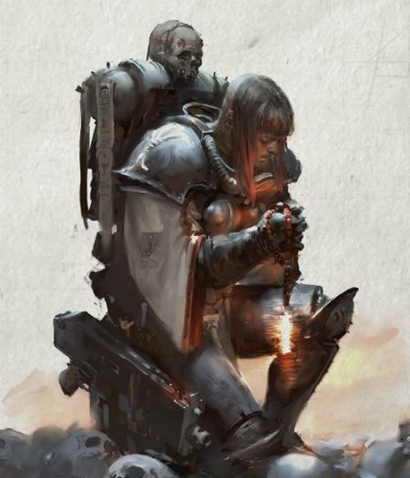
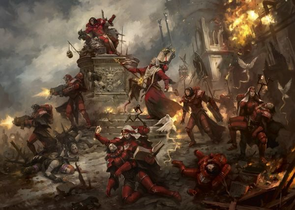

# 0119 战斗修女 Sisters of Battle

精校状态：中文行文已逐段精校，部分术语仍为暂定

分类：通用概念 / 帝国 Imperium / 修女会 Adepta Sororitas

原文来源：https://www.bilibili.com/opus/1127132206033010711

原作者：帝国神选罐头

原文时间：编辑于 2025年12月04日 12:34

[返回分类目录](目录.md) · [全书目录](../../目录.md)

<!-- A0119-B0001 -->
**英文原文**

The Sisters of Battle are the armed wing and Orders Militant of the Adepta Sororitas. They serve as the standing army of the Ecclesiarchy.

<!-- /A0119-B0001 -->

<!-- A0119-B0002 -->

原译文

战斗修女是修女会的武装派别和军事修会。她们是教会的常备军。

**校订译文**

战斗修女是修女会的武装力量，即各战斗修会，充当国教会的常备军。

<!-- /A0119-B0002 -->

<!-- A0119-B0003 图片 -->

<!-- A0119-B0004 -->

原译文

Adepta Sororitas symbol 修女会标志

**校订译文**

Adepta Sororitas symbol 修女会标志

<!-- /A0119-B0004 -->

<!-- A0119-B0005 -->
**英文原文**

Parent Agency:Adepta Sororitas

<!-- /A0119-B0005 -->

<!-- A0119-B0006 -->

原译文

隶属机构：修女会

**校订译文**

隶属机构：修女会

<!-- /A0119-B0006 -->

<!-- A0119-B0007 -->
**英文原文**

Headquarters:Terra & Ophelia VII

<!-- /A0119-B0007 -->

<!-- A0119-B0008 -->

原译文

总部：泰拉 & 奥菲利亚七号

**校订译文**

总部：泰拉 & 奥菲利亚七号

<!-- /A0119-B0008 -->

<!-- A0119-B0009 -->
**英文原文**

Leader:Abbess Morvenn Vahl

<!-- /A0119-B0009 -->

<!-- A0119-B0010 -->

原译文

领袖：修道院长莫文·瓦尔

**校订译文**

领袖：总院长莫雯·瓦尔

<!-- /A0119-B0010 -->

<!-- A0119-B0011 -->
**英文原文**

Established:M36

<!-- /A0119-B0011 -->

<!-- A0119-B0012 -->

原译文

建立：M36

**校订译文**

建立：M36

<!-- /A0119-B0012 -->

<!-- A0119-B0013 -->
## History 历史

<!-- /A0119-B0013 -->

<!-- A0119-B0014 -->
**英文原文**

The Sisters of Battle, like the rest of the Adepta Sororitas, trace their history back to the troubled times of the Age of Apostasy. On a backwater world named San Leor an all-female cult dedicated to the worship of the Emperor, known as the "Daughters of the Emperor", were discovered by members of the Ecclesiarchy. Goge Vandire, the High Lord of the Administratum (and also Ecclesiarch of the Adeptus Ministorum), decided to visit San Leor and recruit the Daughters into his own private army. The Daughters were then renamed the "Brides of the Emperor" and became Lord Vandire's most loyal followers.

<!-- /A0119-B0014 -->

<!-- A0119-B0015 -->

原译文

与修女会的其他成员一样，战斗修女的历史可以追溯到叛教时代的动荡时期。在一个名为圣莱奥尔的闭塞世界，国教成员发现了一个全女性崇拜帝皇的教派，被称为“帝皇之女”。内务部高领主高戈·范迪尔（也是国教教会的教宗）决定访问圣莱奥尔，并将帝皇之女招募到自己的个人军队中。帝皇之女随后被更名为“帝皇新娘”，并成为领主范迪尔最忠实的追随者。

**校订译文**

与修女会的其他成员一样，战斗修女的历史可以追溯到叛教时代的动荡时期。在一个名为圣莱奥尔的闭塞世界，国教成员发现了一个全女性崇拜帝皇的教派，被称为“帝皇之女”。内政部高领主高戈·范迪尔（也是国教会的教宗）决定访问圣莱奥尔，并将帝皇之女招募到自己的个人军队中。帝皇之女随后被更名为“帝皇新娘”，并成为领主范迪尔最忠实的追随者。

<!-- /A0119-B0015 -->

<!-- A0119-B0016 图片 -->

<!-- A0119-B0017 -->

原译文

Battle Sister of the Adepta Sororitas 修女会的战斗修女

**校订译文**

Battle Sister of the Adepta Sororitas 修女会的战斗修女

<!-- /A0119-B0017 -->

<!-- A0119-B0018 -->
**英文原文**

As the events of the Age of Apostasy progressed the Adeptus Custodes, the praetorians of the Emperor himself, tried to approach the Brides and convince them of Vandire's treachery. In a last ditch effort to convince them, the Custodes took Alicia Dominica, leader of the Brides, and her chosen bodyguards deep into the Imperial Palace where they stood before the Emperor himself. What happened there remains unknown - Dominica and her companions were sworn to secrecy - but it became clear that the Brides, who then reverted to their original title of Daughters of the Emperor, had been awakened to the evil that Vandire represented. Marching into his audience chamber, Dominica paused only to condemn Vandire for his crimes before she beheaded the power-crazed dictator.

<!-- /A0119-B0018 -->

<!-- A0119-B0019 -->

原译文

随着叛教时代事件的发展，帝皇的禁军试图接近新娘，让她们相信范迪尔的背叛。为了说服她们，禁军将新娘的领袖艾丽西亚·多米尼克和她选择的护卫带到了皇宫深处，她们站在帝皇面前。那里发生的事情仍然未知 — 多米尼克和她的同伴宣誓保密 — 但很明显，新娘们已经意识到范迪尔所代表的邪恶，她们后来恢复了原来的帝皇之女的头衔。多米尼克走进他的觐见庭，在斩首这位权力狂热的独裁者之前，只停下来谴责了范迪尔的罪行。

**校订译文**

叛教时代的动乱持续之际，帝皇禁军尝试接触帝皇新娘，使其认清范迪尔的背叛。作为最后的尝试，禁军将领袖艾丽西亚·多米尼克及她选定的护卫带入皇宫深处，觐见帝皇本人。她们此后立誓保密，无人知晓究竟发生了什么；但她们显然认清了范迪尔的邪恶，并恢复“帝皇之女”的旧称。多米尼克随即进入范迪尔的接见厅，宣告其罪行，斩下了这位权欲熏心的独裁者的头颅。

<!-- /A0119-B0019 -->

<!-- A0119-B0020 -->
**英文原文**

Following these events the Adeptus Ministorum as a whole was re-organised, including the forces of the Adepta Sororitas. Along with the establishment of the non-militant Orders, the Orders Militant were divided between the two Convents on Terra and Ophelia VII with Alicia Dominica as the Head of the entire organisation.

<!-- /A0119-B0020 -->

<!-- A0119-B0021 -->

原译文

在这些事件之后，整个国教教会进行了重组，包括修女会的部队。随着非军事修会的成立，军事修会被分为泰伦和奥菲利亚七号两个修道院，艾丽西亚·多米尼克担任整个组织的负责人。

**校订译文**

此后，国教会整体重组，修女会也在其中。非战斗修会陆续设立，战斗修会则分属泰拉与奥菲利亚七号的两座大修道院，由艾丽西亚·多米尼克统领整个组织。

<!-- /A0119-B0021 -->

<!-- A0119-B0022 -->
**英文原文**

In 378.M36, Ecclesiarch Alexis XXII divided the Orders Militant of the Convent Sanctorum and Convent Prioris into four Orders:

<!-- /A0119-B0022 -->

<!-- A0119-B0023 -->

原译文

378.M36年，教宗亚历克西斯二十二世将圣地修道院和首席修道院的军事修会分为四个修会：

**校订译文**

378.M36年，教宗亚历克西斯二十二世将圣地修道院和首席修道院的战斗修会分为四个修会：

<!-- /A0119-B0023 -->

<!-- A0119-B0024 -->

原译文

Order of the Ebon Chalice 黑檀圣杯修会

**校订译文**

Order of the Ebon Chalice 黑檀圣杯修会

<!-- /A0119-B0024 -->

<!-- A0119-B0025 -->

原译文

Order of the Valorous Heart 勇毅之心修会

**校订译文**

Order of the Valorous Heart 勇毅之心修会

<!-- /A0119-B0025 -->

<!-- A0119-B0026 -->

原译文

Order of the Fiery Heart 炙热之心修会

**校订译文**

Order of the Fiery Heart 炙热之心修会

<!-- /A0119-B0026 -->

<!-- A0119-B0027 -->

原译文

Order of the Argent Shroud 银白寿衣修会

**校订译文**

Order of the Argent Shroud 银白寿衣修会

<!-- /A0119-B0027 -->

<!-- A0119-B0028 -->
**英文原文**

In 878.M38, Ecclesiarch Deacis VI founded two more Orders Militant in honour of the remaining two saints who accompanied Alicia Dominica to the Golden Throne:

<!-- /A0119-B0028 -->

<!-- A0119-B0029 -->

原译文

878.M38，教宗迪西斯六世又创立了两个军事修士，以纪念陪同艾丽西亚·多米尼克登上黄金王座的其余两位圣人：

**校订译文**

878.M38，教宗迪西斯六世又设立两个战斗修会，以纪念陪同艾丽西亚·多米尼克觐见黄金王座的其余两位圣人：

<!-- /A0119-B0029 -->

<!-- A0119-B0030 -->
**英文原文**

Order of the Bloody Rose in honour of Sister Mina.

<!-- /A0119-B0030 -->

<!-- A0119-B0031 -->

原译文

鲜血玫瑰修会，以纪念米娜修女。

**校订译文**

鲜血玫瑰修会，以纪念米娜修女。

<!-- /A0119-B0031 -->

<!-- A0119-B0032 -->
**英文原文**

Order of the Sacred Rose in honour of Sister Arabella.

<!-- /A0119-B0032 -->

<!-- A0119-B0033 -->

原译文

神圣玫瑰修会，以纪念阿拉贝拉修女。

**校订译文**

神圣玫瑰修会，以纪念阿拉贝拉修女。

<!-- /A0119-B0033 -->

<!-- A0119-B0034 -->
**英文原文**

Since the creation of the Great Rift and the launching of the Indomitus Crusade, the Sisters of Battle have engaged in Wars of Faith on a level previously unseen. Their new Abbess, Morvenn Vahl, has dispatched their forces across the breadth of the Imperium in search of the fate of many lost Orders and Shrine Worlds. In addition, they have been used in an attempt to discover passages around the Rift such as the Nachmund Gauntlet. These campaigns have been waged with an emphasis on speed, ensuring the Sisters of Battle are ever-ready for advancing in the Indomitus Crusade.

<!-- /A0119-B0034 -->

<!-- A0119-B0035 -->

原译文

自大裂隙形成和不屈远征发动以来，战斗修女一直在进行前所未有的信仰战争。她们的新任修道院长莫文·瓦尔已经派遣她们的部队穿越帝国的各个角落，寻找许多失落的修会和圣地世界的命运。此外，她们还被用来试图发现裂隙周围的通道，如纳克蒙德走廊。这些行动的重点是速度，确保战斗修女随时准备在不屈远征中前进。

**校订译文**

大裂隙形成、不屈远征启动后，战斗修女参加信仰战争的规模空前扩大。新任总院长莫雯·瓦尔将部队派往帝国各地，探明失联修会与圣地世界的命运，并寻找纳克蒙德走廊那样能够通过大裂隙的通道。这些行动强调迅速机动，确保战斗修女随时可以投入不屈远征的推进。

<!-- /A0119-B0035 -->

<!-- A0119-B0036 -->
## Overview 概述

<!-- /A0119-B0036 -->

<!-- A0119-B0037 -->
**英文原文**

The Battle Sisters of the Adepta Sororitas are the mainstay of the Adeptus Ministorum's armies. Equipped and trained to the highest Imperial standards, the Sisters of Battle specialize in waging Wars of Faith and purging heresy wherever it may be found. Because of this, its duties often overlap with the Ordo Hereticus of the Inquisition and as a result the Sisters of Battle maintain a close alliance with the Witch Hunters. The Sisters of Battle themselves are divided into six major Orders, each numbering several thousands of Battle Sisters, and many Orders Minoris, each containing thousands of Sisters themselves. These forces are rarely deployed in full-strength, rather being assigned to waging Wars of Faith, aiding the Inquisition, or protecting Ecclesiarchy buildings, property, and relics.

<!-- /A0119-B0037 -->

<!-- A0119-B0038 -->

原译文

修女会的战斗修女是国教修会军队的中流砥柱。按照最高的帝国标准装备和训练，战斗修女专门从事信仰战争，并在任何地方清除异端。因此，它的职责经常与审判庭的讨逆修会重叠，因此战斗修女与女巫猎手保持着密切的联盟关系。战斗修女本身分为六个主要的修会，每个修会都有数千名战斗修女，还有许多修会都包含数千名修女。这些部队很少全员部署，而是被分配进行信仰战争、协助审判庭或保护国教建筑、财产和圣物。

**校订译文**

战斗修女是国教会军队的主力，按照帝国最高标准装备和训练，专司信仰战争、铲除各地异端。她们的职责常与异端审判庭重叠，因此与这些“猎巫者”保持密切合作。战斗修女分属六大战斗修会及许多小修会；原文称，各大修会有数千名成员，小修会也各有数千人。这些力量很少全部集中部署，通常分散参加信仰战争、支援审判庭，或守护教会建筑、财产及圣物。

<!-- /A0119-B0038 -->

<!-- A0119-B0039 图片 -->

<!-- A0119-B0040 -->

原译文

Sister of Battle 战斗修女

**校订译文**

Sister of Battle 战斗修女

<!-- /A0119-B0040 -->

<!-- A0119-B0041 -->
## Organisation 组织

<!-- /A0119-B0041 -->

<!-- A0119-B0042 -->
**英文原文**

The Orders Militant are organised similarly to the other major Orders of the Adepta Sororitas. The primarily organisational units are:

<!-- /A0119-B0042 -->

<!-- A0119-B0043 -->

原译文

军事修会的组织方式与修女会的其他主要修会相似。主要组织单位是：

**校订译文**

战斗修会的组织方式与修女会的其他主要修会相似。主要组织单位是：

<!-- /A0119-B0043 -->

<!-- A0119-B0044 -->
**英文原文**

Order - Led by the head Canoness, called the Canoness Superior, who runs the entire Order.

<!-- /A0119-B0044 -->

<!-- A0119-B0045 -->

原译文

修会 - 由被称为高阶大修女的大修女之首领导，她负责管理整个修会。

**校订译文**

修会 - 由被称为高阶大修女的大修女之首领导，她负责管理整个修会。

<!-- /A0119-B0045 -->

<!-- A0119-B0046 -->
**英文原文**

Preceptory - A subsidiary convent or a large tactical detachment with up to 1,000 Sisters led by a Canoness Preceptor.

<!-- /A0119-B0046 -->

<!-- A0119-B0047 -->

原译文

分殿 - 一个附属修道院或一个由教导大修女领导的多达1000名修女的大型战术分队。

**校订译文**

分殿 - 一个附属修道院或一个由教导大修女领导的多达1000名修女的大型战术分队。

<!-- /A0119-B0047 -->

<!-- A0119-B0048 -->
**英文原文**

Commandery - Normally smaller convents or detachments of militant Sisters with up to 200 Sisters, led by a Canoness Commander.

<!-- /A0119-B0048 -->

<!-- A0119-B0049 -->

原译文

督所 - 通常是由一名指挥大修女领导的小型修道院或由多达200名修女组成的军事修女分遣队。

**校订译文**

督所 - 通常是由一名指挥大修女领导的小型修道院或由多达200名修女组成的军事修女分遣队。

<!-- /A0119-B0049 -->

<!-- A0119-B0050 -->
**英文原文**

Mission - The smallest organisation of Sisters, consisting of a few units and can be led by a Canoness or the lesser Palatine.

<!-- /A0119-B0050 -->

<!-- A0119-B0051 -->

原译文

教团 - 最小的修女组织，由几个单位组成，可以由大修女或较低的宫廷官领导。

**校订译文**

教团 - 最小的修女组织，由几个单位组成，可以由大修女或较低的宫廷官领导。

<!-- /A0119-B0051 -->

<!-- A0119-B0052 -->
### Orders 修会

<!-- /A0119-B0052 -->

<!-- A0119-B0053 -->
### Convent Sanctorum (Ophelia VII) 圣地修道院（奥菲利亚七号）

<!-- /A0119-B0053 -->

<!-- A0119-B0054 -->

原译文

Order of the Bloody Rose 鲜血玫瑰修会

**校订译文**

Order of the Bloody Rose 鲜血玫瑰修会

<!-- /A0119-B0054 -->

<!-- A0119-B0055 -->

原译文

Order of the Sacred Rose 神圣玫瑰修会

**校订译文**

Order of the Sacred Rose 神圣玫瑰修会

**校注：** 本篇将神圣玫瑰列于奥菲利亚七号圣地修道院，118 与 120 篇则将其置于泰拉首席修道院；勇毅之心的归属也与 118 篇表格互换。保留英文原列并标注来源差异，待核对应版次。

<!-- /A0119-B0055 -->

<!-- A0119-B0056 -->

原译文

Order of Our Martyred Lady 我们的殉教女士修会

**校订译文**

Order of Our Martyred Lady 殉教圣女修会

<!-- /A0119-B0056 -->

<!-- A0119-B0057 -->
### Convent Prioris (Terra) 首席修道院（泰拉）

<!-- /A0119-B0057 -->

<!-- A0119-B0058 -->

原译文

Order of the Ebon Chalice 黑檀圣杯修会

**校订译文**

Order of the Ebon Chalice 黑檀圣杯修会

<!-- /A0119-B0058 -->

<!-- A0119-B0059 -->

原译文

Order of the Valorous Heart 勇毅之心修会

**校订译文**

Order of the Valorous Heart 勇毅之心修会

<!-- /A0119-B0059 -->

<!-- A0119-B0060 -->

原译文

Order of the Argent Shroud 银白寿衣修会

**校订译文**

Order of the Argent Shroud 银白寿衣修会

<!-- /A0119-B0060 -->

<!-- A0119-B0061 -->
### Lesser Orders Militant 次级战斗修会

原题：Lesser Orders Militant 次级军事修会

<!-- /A0119-B0061 -->

<!-- A0119-B0062 -->
**英文原文**

Since their founding, the Major Orders Militant have established a number of subsidiary convents at sites significant to the Ecclesiarchy. Sometimes little more than small garrisons, these bases have developed identities distinct from their parent Orders over time, eventually becoming separate Orders all together. These smaller Orders are referred to as the Lesser Orders Militant. In theory, the leaders of the Lesser Orders are answerable to the leaders of the Major Order that spawned them.

<!-- /A0119-B0062 -->

<!-- A0119-B0063 -->

原译文

自成立以来，主要军事修会在对国教具有重要意义的地点建立了许多附属修道院。有时，这些基地只不过是小规模的驻军，随着时间的推移，它们已经发展出不同于其上级修会的身份，最终成为单独的修会。这些较小的修会被称为次级军事修会。理论上，次级修会的领导人对造成她们的主要修会的领导人负责。

**校订译文**

自成立以来，主要战斗修会便在对国教会有重要意义的地点设立附属修道院。有些据点驻军很少，但随着时间推移，逐渐发展出独有特色，最终成为独立的小修会。理论上，小修会领袖仍须向其源出的大战斗修会领袖负责。

<!-- /A0119-B0063 -->

<!-- A0119-B0064 -->
### Inner Circle 内环

<!-- /A0119-B0064 -->

<!-- A0119-B0065 -->
**英文原文**

The Inner Circle of the Daughters of the Emperor is a secretive group drawn from the senior members of each Order Militant, tasked, inter alia, with blessing Sororitas forces in the employ of the Ordo Hereticus in the eve of battle. Such blessings magnify the abilities of Sisters to perform Acts of Faith.

<!-- /A0119-B0065 -->

<!-- A0119-B0066 -->

原译文

帝皇之女内环是一个秘密团体，由每个修会的高级成员组成，其任务包括在战斗前夕为讨逆修会部署的修女会部队祝福。这样的祝福放大了修女们履行信仰行动的能力。

**校订译文**

帝皇之女内环是由各战斗修会资深成员组成的秘密团体。其职责之一，是在战斗前为替异端审判庭作战的修女部队赐福，增强她们施展信仰伟业的能力。

<!-- /A0119-B0066 -->

<!-- A0119-B0067 -->
### Ranks 等级

<!-- /A0119-B0067 -->

<!-- A0119-B0068 -->
**英文原文**

Abbess of the Adepta Sororitas - Commands the whole of the Adepta Sororitas as well as acting as Supreme Commander of the Orders Militant.

<!-- /A0119-B0068 -->

<!-- A0119-B0069 -->

原译文

修女会修道院长 - 指挥整个修女会，并担任军事修会的最高指挥官。

**校订译文**

修女会总院长 - 指挥整个修女会，并担任战斗修会的最高指挥官。

<!-- /A0119-B0069 -->

<!-- A0119-B0070 -->
**英文原文**

Prioress - Oversees one of the two Convents.

<!-- /A0119-B0070 -->

<!-- A0119-B0071 -->

原译文

修女长 - 监督两个修道院中的一个。

**校订译文**

院长 - 监督两个修道院中的一个。

<!-- /A0119-B0071 -->

<!-- A0119-B0072 -->
**英文原文**

Canoness - Commanders that come in several subdivisions:

<!-- /A0119-B0072 -->

<!-- A0119-B0073 -->

原译文

大修女 - 指挥官分为几个部分：

**校订译文**

大修女——指挥官职衔，细分如下：

<!-- /A0119-B0073 -->

<!-- A0119-B0074 -->
**英文原文**

Canoness Superior - In command of an entire Order

<!-- /A0119-B0074 -->

<!-- A0119-B0075 -->

原译文

高阶大修女 - 指挥整个修会

**校订译文**

高阶大修女 - 指挥整个修会

<!-- /A0119-B0075 -->

<!-- A0119-B0076 -->
**英文原文**

Canoness Preceptor - In command of a Preceptory

<!-- /A0119-B0076 -->

<!-- A0119-B0077 -->

原译文

教导大修女 - 指挥一个分殿

**校订译文**

教导大修女 - 指挥一个分殿

<!-- /A0119-B0077 -->

<!-- A0119-B0078 -->
**英文原文**

Canoness Commander - In command of a Commandry

<!-- /A0119-B0078 -->

<!-- A0119-B0079 -->

原译文

指挥大修女 - 指挥一个督所

**校订译文**

指挥大修女 - 指挥一个督所

<!-- /A0119-B0079 -->

<!-- A0119-B0080 -->
**英文原文**

Canoness - In command of a Mission

<!-- /A0119-B0080 -->

<!-- A0119-B0081 -->

原译文

大修女 - 指挥一个教团

**校订译文**

大修女 - 指挥一个教团

<!-- /A0119-B0081 -->

<!-- A0119-B0082 -->
**英文原文**

Palatine - Battlefield Lieutenants

<!-- /A0119-B0082 -->

<!-- A0119-B0083 -->

原译文

宫廷官 - 战地副官

**校订译文**

宫廷官 - 战地副官

<!-- /A0119-B0083 -->

<!-- A0119-B0084 -->

原译文

Legatine 使节

**校订译文**

Legatine 使节

<!-- /A0119-B0084 -->

<!-- A0119-B0085 -->
**英文原文**

Sister Superior - Squad commanders

<!-- /A0119-B0085 -->

<!-- A0119-B0086 -->

原译文

高阶修女 - 小队指挥官

**校订译文**

高阶修女 - 小队指挥官

<!-- /A0119-B0086 -->

<!-- A0119-B0087 -->

原译文

Sister 修女

**校订译文**

Sister 修女

<!-- /A0119-B0087 -->

<!-- A0119-B0088 -->

原译文

Novitiate 见习修女

**校订译文**

Novitiate 见习修女

<!-- /A0119-B0088 -->

<!-- A0119-B0089 -->

原译文

Constantia 执着者

**校订译文**

Constantia 执着者

<!-- /A0119-B0089 -->

<!-- A0119-B0090 -->

原译文

Cantus 歌咏者

**校订译文**

Cantus 歌咏者

<!-- /A0119-B0090 -->

<!-- A0119-B0091 -->

原译文

Novice 见习者

**校订译文**

Novice 见习者

<!-- /A0119-B0091 -->

<!-- A0119-B0092 -->
## Forces 部队

<!-- /A0119-B0092 -->

<!-- A0119-B0093 -->
**英文原文**

A typical Order of the Sisters of Battle will consist of:

<!-- /A0119-B0093 -->

<!-- A0119-B0094 -->

原译文

一个典型的战斗修女修会包括：

**校订译文**

一个典型的战斗修女修会包括：

<!-- /A0119-B0094 -->

<!-- A0119-B0095 图片 -->

<!-- A0119-B0096 -->

原译文

group of Orders Militant Seraphim 军事修会炽天使小队

**校订译文**

group of Orders Militant Seraphim 战斗修会炽天使小队

<!-- /A0119-B0096 -->

<!-- A0119-B0097 -->
**英文原文**

Canoness - Commanding officer

<!-- /A0119-B0097 -->

<!-- A0119-B0098 -->

原译文

大修女 - 指挥军官

**校订译文**

大修女 - 指挥军官

<!-- /A0119-B0098 -->

<!-- A0119-B0099 -->
**英文原文**

Palatine - Officers serving below the Canoness

<!-- /A0119-B0099 -->

<!-- A0119-B0100 -->

原译文

宫廷官 - 在大修女之下服役的军官

**校订译文**

宫廷官 - 在大修女之下服役的军官

<!-- /A0119-B0100 -->

<!-- A0119-B0101 -->
**英文原文**

Dogmata - Spiritual enforcers

<!-- /A0119-B0101 -->

<!-- A0119-B0102 -->

原译文

教条官 - 心灵执行者

**校订译文**

教条官——督察信仰纪律的执法者

<!-- /A0119-B0102 -->

<!-- A0119-B0103 -->
**英文原文**

Reliquant at Arms - Oversees relics

<!-- /A0119-B0103 -->

<!-- A0119-B0104 -->

原译文

武装持圣者 - 监督圣物

**校订译文**

武装持圣者 - 监督圣物

<!-- /A0119-B0104 -->

<!-- A0119-B0105 -->
**英文原文**

Sisters Superior - Squad Commanders

<!-- /A0119-B0105 -->

<!-- A0119-B0106 -->

原译文

高阶修女 - 小队指挥官

**校订译文**

高阶修女 - 小队指挥官

<!-- /A0119-B0106 -->

<!-- A0119-B0107 -->
**英文原文**

Imagifier - Standard Bearers

<!-- /A0119-B0107 -->

<!-- A0119-B0108 -->

原译文

圣像旗手 - 标准旗手

**校订译文**

持像者——旗手

<!-- /A0119-B0108 -->

<!-- A0119-B0109 -->
**英文原文**

Celestians - Elites

<!-- /A0119-B0109 -->

<!-- A0119-B0110 -->

原译文

洁天使 - 精英

**校订译文**

洁天使 - 精英

<!-- /A0119-B0110 -->

<!-- A0119-B0111 -->
**英文原文**

Battle Sisters - Standard Infantry

<!-- /A0119-B0111 -->

<!-- A0119-B0112 -->

原译文

战斗修女 - 标准步兵

**校订译文**

战斗修女 - 标准步兵

<!-- /A0119-B0112 -->

<!-- A0119-B0113 -->
**英文原文**

Dominions - Close combat Infantry

<!-- /A0119-B0113 -->

<!-- A0119-B0114 -->

原译文

主天使 - 近身战斗步兵

**校订译文**

御天使 - 近身战斗步兵

<!-- /A0119-B0114 -->

<!-- A0119-B0115 -->
**英文原文**

Retributors - Heavy weapons Infantry

<!-- /A0119-B0115 -->

<!-- A0119-B0116 -->

原译文

仇天使 - 重型武器步兵

**校订译文**

仇天使 - 重型武器步兵

<!-- /A0119-B0116 -->

<!-- A0119-B0117 -->
**英文原文**

Zephyrim - Melee Jump Pack Infantry

<!-- /A0119-B0117 -->

<!-- A0119-B0118 -->

原译文

风天使 - 近战跳跃背包步兵

**校订译文**

风天使 - 近战跳跃背包步兵

<!-- /A0119-B0118 -->

<!-- A0119-B0119 -->
**英文原文**

Seraphim - Jump Pack Infantry

<!-- /A0119-B0119 -->

<!-- A0119-B0120 -->

原译文

炽天使 - 跳跃背包步兵

**校订译文**

炽天使 - 跳跃背包步兵

<!-- /A0119-B0120 -->

<!-- A0119-B0121 -->
**英文原文**

Sisters Repentia - Melee combat infantry, led by a Repentia Superior

<!-- /A0119-B0121 -->

<!-- A0119-B0122 -->

原译文

忏悔修女 - 近战步兵，由一名高阶忏悔者领导

**校订译文**

忏悔修女 - 近战步兵，由一名高阶忏悔者领导

<!-- /A0119-B0122 -->

<!-- A0119-B0123 -->
**英文原文**

Specialists from other Sororitas orders such as the Orders Dialogus, Hospitaller, Hagiolater, and Famulous

<!-- /A0119-B0123 -->

<!-- A0119-B0124 -->

原译文

其他修女修会的专家，如交流修会、医院修会、崇圣修会和役从修会

**校订译文**

来自书记修会、医疗修会及役从修会等其他修会的专门人员，以及崇圣者等角色。

**校注：** 英文将 Hagiolater 混列于 orders 名单，但 118 篇将其作为记录修女战功的角色。本段用“崇圣者等角色”避免未经证实地增造一个组织。

<!-- /A0119-B0124 -->

<!-- A0119-B0125 -->
**英文原文**

Troops Ecclesiarchy forces such as Missionaries, Priests, Crusaders, Death Cult Assassins, Arco-Flagellants, and Zealots

<!-- /A0119-B0125 -->

<!-- A0119-B0126 -->

原译文

传教士、牧师、十字军、死亡教派刺客、鞭笞机仆和狂热者等国教部队

**校订译文**

国教会所属人员，包括传教士、牧师、十字军、拜死教刺客、鞭挞苦修者与狂热者。

<!-- /A0119-B0126 -->

<!-- A0119-B0127 -->

原译文

Mortifier and Penitent Engines 苦行者与赎罪引擎

**校订译文**

Mortifier and Penitent Engines 悔罪者机甲与忏悔者机甲

<!-- /A0119-B0127 -->

<!-- A0119-B0128 -->

原译文

Paragon Warsuits 典范战甲

**校订译文**

Paragon Warsuits 楷模机甲

<!-- /A0119-B0128 -->

<!-- A0119-B0129 -->
**英文原文**

Rhino, Repressor, Exorcist, Castigator, and Immolator vehicles

<!-- /A0119-B0129 -->

<!-- A0119-B0130 -->

原译文

犀牛，镇压者，驱魔者，惩戒者和献祭者载具

**校订译文**

犀牛战车、镇压者、驱魔人导弹车、惩戒者坦克与献祭者装甲车等载具。

<!-- /A0119-B0130 -->

<!-- A0119-B0131 -->
**英文原文**

Aircraft including Thunderhawks and Lightning Strike Fighters. Requisitioned aircraft can include Avenger Strike Fighters.

<!-- /A0119-B0131 -->

<!-- A0119-B0132 -->

原译文

包括雷鹰和闪电战斗机在内的飞机。征用的飞机可以包括复仇者打击战斗机。

**校订译文**

包括雷鹰和闪电战斗机在内的飞机。征用的飞机可以包括复仇者打击战斗机。

<!-- /A0119-B0132 -->

<!-- A0119-B0133 -->
## Armoury 军械库

<!-- /A0119-B0133 -->

<!-- A0119-B0134 -->
**英文原文**

The wargear of the Adeptas Sororitas is supplied by the Adeptus Mechanicus since the times of the Age of Apostasy when the Ecclesiarch Goge Vandire and Fabricator General Gastaph Hediatrix signed the treaty Known as the Writ Illuminat. Every piece of wargear supplied to the Adepta Sororitas is first taken to either the Convent Prioris on Terra or the Convent Sanctorum on Ophelia VII. There they are blessed by choirs of novitiates in rites that can last for days or even weeks. Weapons are daubed in sacred oils and polished by cloths that have been touched by saints. Every bolt and chainsword tooth is inscribed with verses from the Fede Imperialis - the Battle Hymn of the Adepta Sororitas. Specialty wargear destined to be wielded by a Canoness are sometimes sprinkled with a blood of martyrs, before being placed amongst the crypts of fallen saints to lie in repose until it is taken up by its bearer. A Sister will usually make a pilgrimage to the Convent of her Order to have her wargear bestowed upon her.

<!-- /A0119-B0134 -->

<!-- A0119-B0135 -->

原译文

自叛教时代起，当教宗高戈·范迪尔和铸造将军加斯塔夫·赫德特里克斯签署了名为辉光法令的条约时，修女会的武器就由机械神教提供。供应给修女会的每一件战争装备都首先被带到泰拉的首席修道院或奥菲利亚七号的圣地修道院。在那里，它们受到见习修女唱诗班的祝福，仪式可以持续数天甚至数周。武器被涂上圣油，并用圣人触摸过的布抛光。每个爆矢和链惧剑齿上都刻有帝国忠言的诗文，这是修女会的战斗圣歌。注定要由大修女挥舞的特殊战争装备有时会撒上殉道者的鲜血，然后被放置在牺牲圣人的墓穴中休息，直到被其持有者拿起。修女通常会前往她修会的修道院朝圣，以获得她的战争装备。

**校订译文**

自叛教时代教宗高戈·范迪尔与铸造将军加斯塔夫·赫德特里克斯签订《辉光敕书》后，修女会的作战装备便由机械修会提供。每件装备都要先运至泰拉的首席修道院或奥菲利亚七号的圣地修道院，由见习修女唱诗赐福；仪式可能持续数天乃至数周。武器涂上圣油，再用圣人触碰过的布料擦拭；每枚爆矢弹、每颗链锯剑锯齿，都刻有修女会战斗圣歌《帝国忠言》的诗句。专供大修女使用的特殊装备，有时还会洒上殉道者的鲜血，放入已故圣人的墓穴中静置，直至其主人前来领受。修女通常须到所属修会的修道院朝圣，接受装备授予。

<!-- /A0119-B0135 -->

<!-- A0119-B0136 -->
### Power Armour 动力盔甲

<!-- /A0119-B0136 -->

<!-- A0119-B0137 -->
**英文原文**

All Sisters, with the exception of the Sisters Repentia, are equipped with a suit of Adepta Sororitas Power Armour.

<!-- /A0119-B0137 -->

<!-- A0119-B0138 -->

原译文

除忏悔修女外，所有修女都配备了一套修女会动力盔甲。

**校订译文**

除忏悔修女外，所有修女都配备了一套修女会动力盔甲。

<!-- /A0119-B0138 -->

<!-- A0119-B0139 图片 -->

<!-- A0119-B0140 -->

原译文

Sister Superior in full Sororitas Power Armour 全装修女动力盔甲的高阶修女

**校订译文**

Sister Superior in full Sororitas Power Armour 身着完整修女会动力甲的高阶修女

<!-- /A0119-B0140 -->

<!-- A0119-B0141 -->
**英文原文**

The Sisters of Battle use a version of power armour designed for the human shape and size, known as Sororitas Power Armour. Sororitas Power Armour is the only enduring legacy of the reign of Goge Vandire, who commissioned the armour for his Brides of the Emperor, where today it serves the Sisters of Battle. Crafted by the forges of Mars, Sororitas Power Armour is relatively lighter than most suits and provide excellent protection. As Sisters of Battle do not possess the Black Carapace of space marines, some patterns of Sororitas Power Armour are not designed with interface in mind and such do not provide enhanced strength or access to advanced systems.

<!-- /A0119-B0141 -->

<!-- A0119-B0142 -->

原译文

战斗修女使用一种为人类体型和大小设计的动力盔甲，称为修女动力盔甲。修女动力盔甲是高戈·范迪尔统治时期唯一持久的遗产，他为他的帝皇新娘委托制作了这件盔甲，如今它为战斗修女服务。修女动力盔甲由火星铸造而成，比大多数盔甲相对较轻，并提供出色的保护。由于战斗修女没有星际战士的黑色甲壳，修女动力盔甲的一些型号在设计时没有考虑到接口，因此无法提供增强力量或使用先进系统。

**校订译文**

战斗修女使用按普通人体型设计的修女会动力甲。这类盔甲是高戈·范迪尔时代延续至今的遗产：他原本委托火星为帝皇新娘打造，如今则装备战斗修女。与多数动力甲相比，它较为轻便，仍能提供出色防护。由于修女没有星际战士的黑色甲壳，某些型号未设计相应接口；原文称，这些型号因此无法提供力量增幅或调用高级系统。

**校注：** 英文限定 some patterns（某些型号），不能据此推论所有修女动力甲都不增强力量。

<!-- /A0119-B0142 -->

<!-- A0119-B0143 -->
### Holy Trinity 圣三一

<!-- /A0119-B0143 -->

<!-- A0119-B0144 -->
**英文原文**

Wherever possible the Sisters of Battle use the holy trinity of weapons, that of the bolter, flamer, and melta. There are few exceptions to this rule, the most notable being melee weapons, plasma pistols sometimes used by Sister Superiors, and the missiles of the Exorcist.

<!-- /A0119-B0144 -->

<!-- A0119-B0145 -->

原译文

只要有可能，战斗修女就会使用三位一体的武器，即爆矢枪、火焰枪和热熔枪。这条规则几乎没有例外，最引人注目的是近战武器、有时由高阶修女使用的等离子手枪和驱魔者的导弹。

**校订译文**

条件允许时，战斗修女总会优先使用“圣三一”武器：爆矢枪、火焰喷射器与热熔武器。例外很少，主要包括近战兵器、高阶修女有时配备的等离子手枪，以及驱魔人导弹车的导弹。

<!-- /A0119-B0145 -->

<!-- A0119-B0146 -->
**英文原文**

The rank and file are primarily equipped with a Godwyn-De'az pattern boltgun and bolt pistol.

<!-- /A0119-B0146 -->

<!-- A0119-B0147 -->

原译文

普通成员主要配备戈德温-迪亚兹型爆矢枪和爆矢手枪。

**校订译文**

普通成员主要配备戈德温-迪亚兹型爆矢枪和爆矢手枪。

<!-- /A0119-B0147 -->

<!-- A0119-B0148 -->
**英文原文**

The Sisters of Battle possess limited armoured support: the Rhino and Immolator as personnel carriers, and the Exorcist to provide fire support.

<!-- /A0119-B0148 -->

<!-- A0119-B0149 -->

原译文

战斗修女拥有有限的装甲支援：犀牛和献祭者作为运兵车，驱魔者提供火力支援。

**校订译文**

战斗修女的装甲支援相对有限：犀牛战车与献祭者装甲车负责运送人员，驱魔人导弹车提供火力支援。

<!-- /A0119-B0149 -->

<!-- A0119-B0150 -->
### Psykers and Acts of Faith 灵能者与信仰伟业

原题：Psykers and Acts of Faith 灵能者和信仰行动

<!-- /A0119-B0150 -->

<!-- A0119-B0151 -->
**英文原文**

The Adepta Sororitas represent the epitome of faith and purity within the Imperium of Man. To wield the powers of the Warp would be completely anathema to them, yet such is their Shield of Faith that it can nullify any psychic power, even those of a friendly or helpful nature. The Sisters maintain an inherent disgust of all witches and believe their power comes from the Emperor's blessing as opposed o the malign influence of the Warp.

<!-- /A0119-B0151 -->

<!-- A0119-B0152 -->

原译文

修女会代表了人类帝国中信仰和纯洁的缩影。对她们来说，使用亚空间的力量是完全可憎的，但她们的信仰之盾可以抵消任何灵能力量，即使是那些友好或有益的灵能力量。修女对所有女巫都怀有固有的厌恶，并相信她们的力量来自帝皇的祝福，而不是亚空间的恶意影响。

**校订译文**

修女会被视为帝国信仰与纯洁的典范，极度排斥动用亚空间力量。她们的信仰之盾却能够抵消灵能，甚至包括友方施放、原本有益的能力。修女深恶一切巫师，并坚信自身力量来自帝皇祝福，而非亚空间的恶意影响。

<!-- /A0119-B0152 -->

<!-- A0119-B0153 -->
**英文原文**

Instead, the Sisters of Battle perform Acts of Faith, manifestations of the Emperor of Mankind's divine purpose. These miracles are unlike any psychic power; defenses or weapons useful against normal psykers have no effect on them. Such powers include regeneration and manifesting divine light and fire. Perhaps the greatest manifestation of such powers are the phenomena of Living Saints.

<!-- /A0119-B0153 -->

<!-- A0119-B0154 -->

原译文

相反，战斗修女执行信仰行动，这是人类皇帝神圣目的的表现。这些奇迹不同于任何灵能力量；对普通灵能有用的防御或武器对她们没有影响。这些力量包括再生和显现神圣的光和火。也许这种力量的最大表现是活圣人的现象。

**校订译文**

战斗修女施展的是“信仰伟业”，即帝皇神圣意志的显现。这些奇迹不同于普通灵能，克制一般灵能者的防御手段或武器无法影响它们。其表现包括再生、显现神圣光芒与火焰；其中最惊人的现象或许就是活圣人。

**校注：** 本段关于信仰奇迹与亚空间的关系属于资料自身的表述；其后又称本质未明，故不把“不受反灵能武器影响”扩写成跨版本、无条件的规则断言。

<!-- /A0119-B0154 -->

<!-- A0119-B0155 -->
**英文原文**

The exact nature of these powers are unclear, even the famed Necron Cryptek Szeras is baffled by the origin of these miracles and how they operate save that they seem to not be of the Warp.

<!-- /A0119-B0155 -->

<!-- A0119-B0156 -->

原译文

这些力量的确切性质尚不清楚，即使是著名的死灵墓穴技师泽拉斯也对这些奇迹的起源及其运作方式感到困惑，除了它们似乎不属于亚空间。

**校订译文**

这些力量的本质仍不明确。即使是著名的太空死灵墓穴技师泽拉斯，也无法解释这些奇迹的来源及运作方式，只能看出它们似乎并非来自亚空间。

<!-- /A0119-B0156 -->

<!-- A0119-B0157 -->
### Fleet 舰队

<!-- /A0119-B0157 -->

<!-- A0119-B0158 -->
**英文原文**

The Sisters of Battle utilize their own warships of at least Cruiser class, apparently the same types operated by the Imperial Navy. Known types of vessels employed are the Retribution Class Battleship, Mars Class Battlecruiser, Dauntless Class Cruiser and the Piety Class Cruiser. The Battleship Martyr's Halo is used as the flagship for the Abbess of the Adepta Sororitas.

<!-- /A0119-B0158 -->

<!-- A0119-B0159 -->

原译文

战斗修女使用他们自己的至少是巡洋舰级的战舰，显然与帝国海军使用的类型相同。已知使用的战舰类型有报复级战列舰、火星级战列巡洋舰、无畏级巡洋舰和虔诚级巡洋舰。战列舰殉教光环号被用作修女会修道院长的旗舰。

**校订译文**

战斗修女拥有自己的战舰，至少包括巡洋舰级别的舰只，舰型似乎与帝国海军相同。已知包括惩罚级战列舰、火星级战列巡洋舰、无畏级巡洋舰与虔诚级巡洋舰。“殉教光环”号战列舰担任修女会总院长的旗舰。

<!-- /A0119-B0159 -->

<!-- A0119-B0160 图片 -->

<!-- A0119-B0161 -->

原译文

The Order of the Bloody Rose battle Xenos at the Basilica of Saint Char 圣查尔大教堂的鲜血玫瑰修会与异型的战斗

**校订译文**

The Order of the Bloody Rose battle Xenos at the Basilica of Saint Char 圣查尔大教堂的鲜血玫瑰修会与异形的战斗

<!-- /A0119-B0161 -->

<!-- A0119-B0162 -->
## Notable Members 著名成员

<!-- /A0119-B0162 -->

<!-- A0119-B0163 -->

原译文

Founding Saints 圣者创始人

**校订译文**

Founding Saints 圣者创始人

<!-- /A0119-B0163 -->

<!-- A0119-B0164 -->
**英文原文**

Saint Alicia Dominica - Order of the Ebon Chalice

<!-- /A0119-B0164 -->

<!-- A0119-B0165 -->

原译文

圣艾丽西亚·多米尼克 - 黑檀圣杯修会

**校订译文**

圣艾丽西亚·多米尼克 - 黑檀圣杯修会

<!-- /A0119-B0165 -->

<!-- A0119-B0166 -->
**英文原文**

Saint Arabella - Order of the Sacred Rose

<!-- /A0119-B0166 -->

<!-- A0119-B0167 -->

原译文

圣阿拉贝拉 - 神圣玫瑰修会

**校订译文**

圣阿拉贝拉 - 神圣玫瑰修会

<!-- /A0119-B0167 -->

<!-- A0119-B0168 -->
**英文原文**

Saint Katherine - Order of the Fiery Heart

<!-- /A0119-B0168 -->

<!-- A0119-B0169 -->

原译文

圣凯瑟琳 - 炙热之心修会

**校订译文**

圣凯瑟琳 - 炙热之心修会

<!-- /A0119-B0169 -->

<!-- A0119-B0170 -->
**英文原文**

Saint Silvana - Order of the Argent Shroud

<!-- /A0119-B0170 -->

<!-- A0119-B0171 -->

原译文

圣西尔瓦娜 - 银白寿衣修会

**校订译文**

圣西尔瓦娜 - 银白寿衣修会

<!-- /A0119-B0171 -->

<!-- A0119-B0172 -->
**英文原文**

Saint Lucia - Order of the Valorous Heart

<!-- /A0119-B0172 -->

<!-- A0119-B0173 -->

原译文

圣露西亚 - 勇毅之心修会

**校订译文**

圣露西亚 - 勇毅之心修会

<!-- /A0119-B0173 -->

<!-- A0119-B0174 -->
**英文原文**

Saint Mina - Order of the Bloody Rose

<!-- /A0119-B0174 -->

<!-- A0119-B0175 -->

原译文

圣米娜 - 鲜血玫瑰修会

**校订译文**

圣米娜 - 鲜血玫瑰修会

<!-- /A0119-B0175 -->

<!-- A0119-B0176 -->

原译文

Post-Founding 建立后

**校订译文**

Post-Founding 建立后

<!-- /A0119-B0176 -->

<!-- A0119-B0177 -->

原译文

Saint Celestine 圣塞勒斯汀

**校订译文**

Saint Celestine 圣塞莱斯汀

<!-- /A0119-B0177 -->

<!-- A0119-B0178 -->

原译文

Abbess Morvenn Vahl 修道院长莫文·瓦尔

**校订译文**

Abbess Morvenn Vahl 总院长莫雯·瓦尔

<!-- /A0119-B0178 -->

<!-- A0119-B0179 -->

原译文

Abbess Sabrina 修道院长萨布丽娜

**校订译文**

Abbess Sabrina 总院长萨布丽娜

<!-- /A0119-B0179 -->

<!-- A0119-B0180 -->

原译文

Prioress Illuminata 修女长圣明

**校订译文**

Prioress Illuminata 院长伊卢米娜塔

<!-- /A0119-B0180 -->

<!-- A0119-B0181 -->

原译文

Prioress Helena 修女长海伦娜

**校订译文**

Prioress Helena 院长海伦娜

<!-- /A0119-B0181 -->

<!-- A0119-B0182 -->

原译文

Canoness Superior Junith Eruita 高阶大修女朱尼斯·埃鲁塔

**校订译文**

Canoness Superior Junith Eruita 高阶大修女茱妮丝·伊瑞塔

<!-- /A0119-B0182 -->

<!-- A0119-B0183 -->

原译文

Canoness Praxedes 大修女普拉谢德斯

**校订译文**

Canoness Praxedes 大修女普拉谢德斯

<!-- /A0119-B0183 -->

<!-- A0119-B0184 -->

原译文

Canoness Selena Agna 大修女赛琳娜·阿格娜

**校订译文**

Canoness Selena Agna 大修女赛琳娜·阿格娜

<!-- /A0119-B0184 -->

<!-- A0119-B0185 -->

原译文

Canoness Veridyan 大修女维莉戴安

**校订译文**

Canoness Veridyan 大修女维里迪安

<!-- /A0119-B0185 -->

<!-- A0119-B0186 -->

原译文

Palatine Erika Luminas 宫廷官埃丽卡·卢米纳斯

**校订译文**

Palatine Erika Luminas 宫廷官埃丽卡·卢米纳斯

<!-- /A0119-B0186 -->

<!-- A0119-B0187 -->

原译文

Celestine Miriya 洁天使米里亚

**校订译文**

Celestine Miriya 洁天使米里亚

<!-- /A0119-B0187 -->

<!-- A0119-B0188 -->

原译文

Sister Superior Evangeline 高阶修女伊万杰琳

**校订译文**

Sister Superior Evangeline 高阶修女伊万杰琳

<!-- /A0119-B0188 -->

<!-- A0119-B0189 -->

原译文

Sister Ephrael Stern 修女埃弗瑞尔·斯特恩

**校订译文**

Sister Ephrael Stern 修女埃弗拉尔·斯特恩

<!-- /A0119-B0189 -->

<!-- A0119-B0190 -->

原译文

Sister Tariana Palos 修女塔里安娜·帕洛斯

**校订译文**

Sister Tariana Palos 修女塔里安娜·帕洛斯

<!-- /A0119-B0190 -->

<!-- A0119-B0191 -->

原译文

The Geminae Superia 超凡双子

**校订译文**

The Geminae Superia 超凡双子

<!-- /A0119-B0191 -->

<!-- A0119-B0192 -->

原译文

Saint Anais 圣安娜斯

**校订译文**

Saint Anais 圣安娜伊斯

<!-- /A0119-B0192 -->

<!-- A0119-B0193 -->

原译文

Reliquant at Arms Aestred Thurga 武装持圣者埃斯特雷德·瑟加

**校订译文**

Reliquant at Arms Aestred Thurga 武装持圣者阿斯垂德·瑟加

<!-- /A0119-B0193 -->

本篇核心术语与暂定项

以下列出本篇出现的英文原形及核心术语表用词。同形词可能指不同对象，具体词义以本篇正文和校注为准；单复数、别名和仅见于图注的名称可能尚未列入。完整候选见[术语表](../../术语表/双语术语候选.csv)。

| 英文 | 采用中文 | 状态 |
| --- | --- | --- |
| Space Marines | 星际战士 | 官方已核对 |
| Adepta Sororitas | 修女会 | 官方已核对 |
| Adeptus Custodes | 帝皇禁军 | 官方已核对 |
| Adeptus Mechanicus | 机械修会 | 官方已核对 |
| Boltgun | 爆矢枪 | 官方已核对 |
| Bolt Pistol | 爆矢手枪 | 官方已核对 |
| Chainsword | 链锯剑 | 官方已核对 |
| Warp | 亚空间 | 官方已核对 |
| Great Rift | 大裂隙 | 官方已核对 |
| Inquisition | 审判庭 | 暂定 |
| Imperium of Man | 人类帝国 | 官方已核对 |
| Imperium | 帝国 | 暂定·简称 |
| Imperial Navy | 帝国海军 | 暂定 |
| Cryptek | 墓穴技师 | 暂定 |
| Indomitus | 不屈学派 | 暂定·学派语境 |
| History | 历史 | 编辑用语已统一 |
| Administratum | 内政部 | 暂定 |
| Emperor of Mankind | 人类帝皇 | 暂定 |
| Emperor | 帝皇 | 官方已核对 |
| Adeptus Ministorum | 国教会 | 暂定 |
| Ecclesiarchy | 国教会 | 暂定 |
| Age of Apostasy | 叛教时代 | 暂定·官方待核 |
| Goge Vandire | 高戈·范迪尔 | 暂定·官方待核 |
| Brides of the Emperor | 帝皇新娘 | 暂定·官方待核 |
| Terra | 泰拉 | 暂定·官方待核 |
| Sisters of Battle | 战斗修女 | 暂定·官方待核 |
| Enforcers | 地方执法者 | 暂定·官方待核 |
| Indomitus Crusade | 不屈远征 | 暂定·官方待核 |
| Nachmund Gauntlet | 纳克蒙德走廊 | 暂定·官方待核 |
| Ordo Hereticus | 异端审判庭 | 用户指定 |
| Golden Throne | 黄金王座 | 暂定·官方待核 |
| Mars | 火星 | 暂定·官方待核 |
| San Leor | 桑洛尔 | 暂定·官方待核 |
| Ophelia VII | 奥菲利亚七号 | 暂定·官方待核 |
| Immolator | 献祭者装甲车 | 官方已核对 |
| Clear | 清明 | 暂定·官方待核 |
| Witch Hunters | 猎巫者 | 暂定 |
| Ecclesiarch | 教宗 | 暂定 |
| Mission | 教团／传教机构 | 暂定 |
| Acts of Faith | 信仰伟业 | 暂定 |
| Abbess of the Adepta Sororitas | 修女会总院长 | 暂定 |
| Prioress | 院长 | 暂定 |
| Orders Militant | 战斗修会（战斗修女）／武装骑士团（黑暗天使） | 语境定译·官方待核 |
| Non-Militant Orders | 非战斗修会 | 暂定 |
| Orders Dialogus | 书记修会 | 暂定 |
| Order of the Sacred Rose | 神圣玫瑰修会 | 暂定 |
| Order of the Valorous Heart | 勇毅之心修会 | 暂定 |
| Order of the Bloody Rose | 鲜血玫瑰修会 | 暂定 |
| Writ Illuminat | 辉光敕书 | 暂定 |
| Saint Lucia | 圣露西亚 | 暂定 |
| Morvenn Vahl | 莫雯·瓦尔 | 官方已核对 |
| Hospitaller | 医疗修女 | 官方已核对 |
| Dialogus | 书记修女 | 官方已核对 |
| Arco-flagellants | 鞭挞苦修者 | 官方已核对 |
| Canoness | 大修女 | 官方已核对 |
| Palatine | 宫廷官 | 官方已核对 |
| Imagifier | 持像者 | 官方已核对 |
| Exorcist | 驱魔人导弹车（载具）／驱魔者（舰级或职衔） | 语境定译·载具官译已核 |
| Castigator | 惩戒者坦克 | 官方已核对 |
| Dogmata | 教条官 | 官方已核对 |
| Rhino | 犀牛战车 | 官方已核对 |
| Gastaph Hediatrix | 加斯塔夫·赫德特里克斯 | 暂定·官方待核 |
| Companions | 近侍 | 暂定·官方待核 |
| Founding | 建军 | 暂定·官方待核 |
| Power Armour | 动力盔甲 | 暂定·官方待核 |
| Crusaders | 十字军 | 暂定·官方待核 |
| Retributors | 天罚行者 | 暂定·官方待核 |
| Black Carapace | 黑色甲壳 | 暂定·官方待核 |
| Powers | 能天使 | 暂定·官方待核 |
| Imperialis | 帝国徽记 | 暂定·官方待核 |
| Piety | 虔诚星 | 暂定·官方待核 |
| Shroud | 裹尸布 | 暂定·官方待核 |
| Daughters of the Emperor | 帝皇之女 | 暂定·官方待核 |
| Avenger | 复仇者号 | 暂定·官方待核 |
| Fabricator | 铸造师 | 暂定·待核官方 |
| Order of the Ebon Chalice | 乌木圣杯修会 | 暂定·官方待核 |
| Order of the Argent Shroud | 银白寿衣修会 | 暂定·官方待核 |
| Touched | 受触者 | 暂定·官方待核 |
| Bolt | 爆矢 | 暂定·官方待核 |
| Bolter | 爆矢枪 | 暂定·官方待核 |
| Godwyn-De'az Pattern | 戈德温—德阿兹型 | 暂定·官方待核 |
| Flamer | 火焰喷射器（武器）／火妖（奸奇单位） | 语境定译·对应官译已核 |
| Convent Sanctorum | 圣地修道院 | 暂定·官方待核 |
| Jump Pack | 跳跃背包 | 暂定·官方待核 |
| Argent | 圣银权杖 | 暂定·官方待核 |
| Alicia Dominica | 艾丽西亚·多米尼卡 | 暂定·官方待核 |
| Retribution Class Battleship | 报复级战列舰 | 暂定·官方待核 |
| Repressor | 镇压者装甲车 | 暂定·官方待核 |
| Convent Prioris | 首席修道院 | 暂定·官方待核 |

